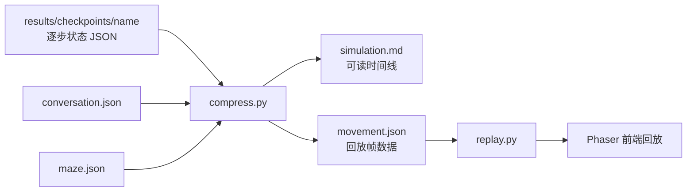

# 第 20 章 回放系统：checkpoint、movement.json、simulation.md 与 Phaser 前端

## 20.1 本章要解决的问题

第三部分最后一章讲回放系统。

GenerativeAgentsCN 的仿真结果不是只存在日志里。

运行后，项目会生成 checkpoint。

然后 `compress.py` 把 checkpoint 转换成：

```text
movement.json
simulation.md
```

`replay.py` 再通过 Flask 和 Phaser 前端展示小镇动画。

这个系统有三个价值。

第一，可视化。

读者可以看角色在小镇中移动、睡觉、聊天、行动。

第二，可复盘。

`simulation.md` 记录人物活动和对话，适合阅读和写书。

第三，可评价。

`movement.json`、`simulation.md` 和 `conversation.json` 可以作为实验数据，支撑派对传播、竞选扩散、关系形成等分析。

本章要回答八个问题：

1. checkpoint 保存了什么？
2. `compress.py` 如何生成 `movement.json`？
3. `simulation.md` 如何生成？
4. `movement.json` 的结构是什么？
5. `replay.py` 如何启动回放？
6. 前端模板如何展示角色？
7. 回放系统与实验评价有什么关系？
8. 当前回放系统有哪些边界和升级方向？

[图 20-1：checkpoint -> compress -> replay 的数据流]



## 20.2 从仿真到回放的三阶段

整个流程分三阶段。

第一阶段，运行仿真：

```bash
python start.py --name sim-test --start "20250213-09:30" --step 10 --stride 10
```

输出：

```text
results/checkpoints/sim-test/
```

第二阶段，压缩结果：

```bash
python compress.py --name sim-test
```

输出：

```text
results/compressed/sim-test/movement.json
results/compressed/sim-test/simulation.md
```

第三阶段，启动回放：

```bash
python replay.py
```

浏览器访问：

```text
http://127.0.0.1:5000/?name=sim-test
```

这三阶段对应：

```text
生成数据
  -> 整理数据
  -> 展示数据
```

理解这条链路后，读者就能知道实验结果存在哪里。

## 20.3 checkpoint 是原始仿真状态

`start.py` 每个 step 写 checkpoint：

```text
results/checkpoints/<name>/simulate-<time>.json
```

还会保存：

```text
results/checkpoints/<name>/conversation.json
```

checkpoint JSON 保存的是仿真状态。

包括：

- 当前 time。
- step。
- stride。
- maze path。
- agent_base。
- 每个 agent 的配置和状态。
- agent 当前 coord。
- status。
- schedule。
- associate memory ids。
- chats。
- currently。
- action。

它适合断点恢复。

但它不适合直接给人读。

因此需要 `compress.py` 转换。

## 20.4 conversation.json

`conversation.json` 保存全局对话。

结构大致是：

```json
{
  "20250213-10:20": [
    {
      "伊莎贝拉 -> 阿伊莎 @ the Ville，霍布斯咖啡馆，咖啡馆": [
        ["伊莎贝拉", "..."],
        ["阿伊莎", "..."]
      ]
    }
  ]
}
```

这个文件由 `_chat_with()` 写入内存，由 `SimulateServer.simulate()` 每步写盘。

它是信息扩散实验的重要证据。

如果我们要证明阿伊莎知道派对，是因为伊莎贝拉告诉她，不能只看阿伊莎后来说“我知道”。

还要能在 `conversation.json` 或 `simulation.md` 中找到这次对话。

## 20.5 compress.py 的两个输出

`compress.py` 定义：

```python
file_markdown = "simulation.md"
file_movement = "movement.json"
frames_per_step = 60
```

它有两个主函数：

```python
generate_report(...)
generate_movement(...)
```

`generate_report()` 生成 `simulation.md`。

`generate_movement()` 生成 `movement.json`。

这两个输出面向不同用途。

`simulation.md` 面向人阅读。

`movement.json` 面向前端回放。

后续复现实验会同时使用二者。

## 20.6 generate_movement() 总览

`generate_movement()` 做几件事。

第一，读取 conversation。

第二，收集 checkpoint JSON 文件。

第三，读取 stride。

第四，加载 maze，用于计算移动路径。

第五，为 step 1 插入第 0 帧初始状态。

第六，遍历每个 checkpoint 中的 agent。

第七，根据 source_coord 和 target_coord 计算 path。

第八，把每个 step 展开成 60 帧。

第九，把结果保存为 `movement.json`。

这一步把离散 checkpoint 变成前端可播放帧数据。

## 20.7 movement.json 的顶层结构

`generate_movement()` 最终输出：

```python
result = {
    "start_datetime": "",
    "stride": stride,
    "sec_per_step": sec_per_step,
    "persona_init_pos": persona_init_pos,
    "all_movement": all_movement,
}
```

字段含义：

`start_datetime` 是回放起始时间。

`stride` 是每个仿真 step 对应多少分钟。

`sec_per_step` 是回放时每一帧对应秒数。

`persona_init_pos` 保存每个角色初始位置。

`all_movement` 保存每一帧的角色移动、位置和动作。

其中 `all_movement` 还包含：

```text
description
conversation
```

用于展示角色基础信息和对话内容。

## 20.8 第 0 帧：insert_frame0()

`insert_frame0()` 插入角色初始状态。

它读取每个角色的 `agent.json`：

```python
json_path = f"frontend/static/assets/village/agents/{agent_name}/agent.json"
```

然后取：

- living_area。
- 初始 coord。
- currently。
- scratch。

并写入：

```python
movement["0"][agent_name] = {
    "location": location,
    "movement": coord,
    "description": "正在睡觉",
}
```

第 0 帧主要给前端初始化角色位置和基础信息。

注意这里 description 默认是“正在睡觉”，这是一种初始显示简化，不一定代表角色真实 action。

## 20.9 从 checkpoint 到 path

对每个 checkpoint，`generate_movement()` 取：

```python
source_coord = last_location.get(agent_name, all_movement["0"][agent_name])["movement"]
target_coord = agent_data["coord"]
location = get_location(agent_data["action"]["event"]["address"])
path = maze.find_path(source_coord, target_coord)
```

也就是说，回放路径不是 checkpoint 直接保存的 path，而是根据上一位置和当前 checkpoint 坐标重新计算。

这样可以让前端播放移动过程。

如果找不到 location，则使用上一位置。

这说明 movement.json 是派生数据，不是原始仿真状态。

原始状态仍然在 checkpoint。

## 20.10 frames_per_step

`compress.py` 中：

```python
frames_per_step = 60
```

每个仿真 step 被展开成 60 帧。

对于每一帧：

```python
step_key = "%d" % ((step-1) * frames_per_step + 1 + i)
```

如果 path 有剩余坐标，就每帧取一个点。

如果 path 结束，movement 为 None。

这让前端可以平滑播放角色移动。

不过它也意味着：

```text
回放帧数不等于仿真认知步数。
```

agent 不是每一帧都思考。

agent 每 step 思考一次，前端只是把 step 展开成动画。

## 20.11 action 文本

回放中每帧会保存 action。

如果正在移动：

```python
action = f"前往 {location}"
```

如果不移动：

```python
action = agent_data["action"]["event"]["describe"]
```

如果 describe 为空，就用：

```python
predicate + object
```

睡觉会加：

```text
😴
```

如果该 step 有对话，会加：

```text
💬
```

这些 action 主要用于前端显示。

它不一定包含完整行为上下文。

完整上下文需要看 checkpoint 和 simulation.md。

## 20.12 对话如何进入 movement.json

`generate_movement()` 会读取 conversation。

如果某个 step_time 有对话，会生成文本：

```python
step_conversation += f"\n地点：{...}\n\n"
for c in chat:
    step_conversation += f"{agent}：{text}\n"
```

然后写入：

```python
all_movement["conversation"][step_time] = step_conversation
```

前端可以根据时间显示对话。

这让回放不仅是角色移动，也能看到聊天内容。

## 20.13 generate_report()：生成 simulation.md

`generate_report()` 生成 Markdown 报告。

它首先写基础人设：

```markdown
# 基础人设

## 克劳斯

年龄：20岁
先天：善良、好奇、热情
后天：...
生活习惯：...
当前状态：...
```

然后遍历 checkpoint，提取活动变化。

如果角色位置和 action 与上次一样，就跳过。

这避免 Markdown 被重复状态刷屏。

当有变化时，写入：

```markdown
# 20250213-10:20

## 活动记录：

### 克劳斯
位置：...
活动：...
```

如果该时间有对话，再写对话记录。

## 20.14 simulation.md 的价值

`simulation.md` 是写书和实验非常重要的文件。

它有三类价值。

第一，人类可读。

不用打开前端，也能按时间线阅读小镇发生了什么。

第二，可引用。

写实验报告时，可以引用某个时间点某个角色的活动和对话。

第三，可审计。

如果某个角色声称知道派对，我们可以回查时间线，看它什么时候听到。

这使 GenerativeAgentsCN 不只是演示项目，而是可分析项目。

## 20.15 replay.py：Flask 服务

回放服务入口是：

```text
generative_agents/replay.py
```

它创建 Flask app：

```python
app = Flask(
    __name__,
    template_folder="frontend/templates",
    static_folder="frontend/static",
    static_url_path="/static",
)
```

首页路由读取 query 参数：

```text
name
step
speed
zoom
```

例如：

```text
http://127.0.0.1:5000/?name=sim-test&step=0&speed=2&zoom=0.8
```

它加载：

```text
results/compressed/<name>/movement.json
```

然后渲染：

```text
frontend/templates/index.html
```

## 20.16 step、speed、zoom

`replay.py` 对参数做处理。

`step` 决定从第几个仿真 step 开始回放。

如果 step > 1，会调整 `start_datetime` 和 agent 初始位置。

`speed` 限制在 0 到 5，然后转换为：

```python
speed = 2 ** speed
```

也就是指数级速度。

`zoom` 控制画面缩放。

这些参数让读者可以快速跳到某段仿真。

例如派对实验中，可以直接跳到下午 5 点前后。

## 20.17 index.html 与角色面板

`frontend/templates/index.html` 继承 `base.html`。

它包含：

- `game-container`：Phaser 游戏容器。
- 角色头像列表。
- 点击角色显示详情面板。

每个角色详情包含：

```text
当前活动
目标地址
```

脚本中引入 Phaser：

```html
<script src='https://cdn.jsdelivr.net/npm/phaser@3.55.2/dist/phaser.js'></script>
```

并 include：

```text
main_script.html
```

真正地图和角色动画逻辑在 `main_script.html` 中。

本书不需要逐行讲 Phaser 细节，但要知道前端消费的是 `movement.json`。

## 20.18 回放与 checkpoint 的区别

回放数据不是原始真相。

原始真相是 checkpoint 和 storage。

`movement.json` 是为了前端展示而生成的派生数据。

`simulation.md` 是为了人读而生成的摘要数据。

这点很重要。

如果要做严谨评价，应优先查：

```text
checkpoint
conversation.json
agent memory storage
```

如果要快速理解故事线，可以看：

```text
simulation.md
movement.json
```

两类数据用途不同。

## 20.19 回放系统如何服务复现实验

第四部分会大量用到回放系统。

情人节派对实验需要看：

- 伊莎贝拉什么时候邀请谁。
- 被邀请者是否在正确时间到达咖啡馆。
- 对话中是否包含时间和地点。

镇长竞选实验需要看：

- 山姆是否谈到竞选。
- 谁听到了。
- 谁又告诉别人。

关系形成实验需要看：

- 克劳斯和玛丽亚是否相遇。
- 是否多次对话。
- 后续活动是否更接近。

这些都可以从 `simulation.md` 和 `conversation.json` 开始分析。

如果要统计位置和到场，则看 `movement.json` 或 checkpoint 中 coord/action。

## 20.20 回放系统边界

当前回放系统有几个边界。

第一，压缩是离线的。

运行仿真后需要手动执行 `compress.py`。

第二，movement 路径重新计算。

它根据 checkpoint 坐标和 Maze 重新生成 path，不一定完全等同于运行时返回 path。

第三，`simulation.md` 只记录变化。

如果状态不变，会跳过，因此不是每一步完整日志。

第四，对话显示依赖 conversation 时间匹配。

如果时间 key 不一致，对话可能无法显示。

第五，前端更偏回放，不是实时交互编辑器。

第六，Phaser 从 CDN 加载。

离线环境可能需要本地化依赖。

这些边界不会影响基本使用，但做严谨实验时要知道。

## 20.21 可改进方向

回放系统可以从五个方向升级。

第一，自动压缩。

仿真结束后自动生成 compressed 结果。

第二，交互式时间线。

在前端按角色、地点、事件筛选。

第三，证据链接。

从 `simulation.md` 的某条对话跳到对应 checkpoint 和 memory node。

第四，实验指标导出。

自动统计信息传播、到场率、对话次数、关系网络。

第五，本地化前端依赖。

避免 CDN 影响离线教学。

这些升级会让项目更适合写实验报告和教学。

## 20.22 第三部分总结

到这里，第三部分源码深读结束。

我们已经从底层到上层讲完：

- 世界模型。
- 智能体初始化。
- 仿真循环。
- 感知。
- 记忆。
- 日程。
- 社交。
- 反思。
- 模型适配。
- 回放系统。

现在读者应该能把论文概念和源码模块对应起来。

下一部分开始，我们不再只读源码，而是设计实验。

我们会用当前项目复现论文中的情人节派对传播、镇长竞选信息扩散、角色关系形成，并设计自己的小镇事件。

## 20.23 本章小结

本章讲清了 GenerativeAgentsCN 的回放系统：

1. `start.py` 每步生成 checkpoint 和 `conversation.json`。
2. checkpoint 适合断点恢复和严谨审计，但不适合直接阅读。
3. `compress.py` 生成 `movement.json` 和 `simulation.md`。
4. `movement.json` 面向 Phaser 前端回放。
5. `simulation.md` 面向人类阅读和实验复盘。
6. `generate_movement()` 会把 checkpoint 展开成每 step 60 帧。
7. `generate_report()` 会写基础人设、活动记录和对话记录。
8. `replay.py` 用 Flask 加载 compressed 数据并渲染前端。
9. `index.html` 展示角色头像、当前活动和 Phaser 画面。
10. 回放数据是派生数据，严谨评价仍要回查 checkpoint、conversation 和 memory。
11. 第四部分复现实验会以这些输出作为证据基础。

下一章进入复现实验：我们先复现论文中的情人节派对传播。

## 参考资料

- Local source: `generative_agents/compress.py`
- Local source: `generative_agents/replay.py`
- Local source: `generative_agents/frontend/templates/index.html`
- Local source: `generative_agents/frontend/templates/main_script.html`
- Local output: `generative_agents/results/checkpoints/`
- Local output: `generative_agents/results/compressed/`
