# 第 20 章 社交：聊天、等待与关系传播

## 20.1 核心问题

世界、初始化、仿真循环、感知、记忆和日程，解决了“角色如何独立生活”的问题。社交机制进一步解决“角色如何互相影响”的问题。在生成式智能体 Generative Agents 中，社交不是“两个角色随机聊天”。它是由感知触发、记忆约束、模型判断、对话生成、日程改写和记忆写回共同组成的行为闭环。社交逻辑主要写在 `generative_agents/modules/agent.py`。第一次看这些函数名时，可以先按中文含义理解：

| 函数 | 中文意思 | 对社交行为的影响 |
| --- | --- | --- |
| `_reaction()` | 现场反应入口。 | 从附近事件和附近角色中选择当前要不要关注某个人。 |
| `_chat_with()` | 与某个角色聊天。 | 判断是否聊天，生成多轮对话，并把对话写回双方状态。 |
| `_wait_other()` | 等待另一个角色。 | 当地点或对象被别人占用时，决定是否等待对方。 |
| `schedule_chat()` | 把聊天写入日程。 | 让“刚刚聊过天”进入当前行动记录，而不是只停留在文本里。 |
| `revise_schedule()` | 修订日程。 | 当聊天或等待打断原计划时，重新安排后续行动。 |

社交相关提示词 prompt 则负责把不同判断交给模型：

| 提示词 prompt | 中文意思 | 它解决的问题 |
| --- | --- | --- |
| `decide_chat` | 判断是否聊天。 | 两个角色见面后，是开口聊天还是继续原计划。 |
| `summarize_relation` | 总结双方关系。 | 聊天前先让模型知道两人是什么关系、过去有什么交集。 |
| `generate_chat` | 生成对话。 | 按双方记忆和关系生成一轮自然对话。 |
| `generate_chat_check_repeat` | 检查复读。 | 防止多轮对话一直重复同一类句子。 |
| `decide_chat_terminate` | 判断是否结束聊天。 | 决定对话是否已经自然结束。 |
| `summarize_chats` | 总结整段对话。 | 把多轮对话压缩成可写入记忆的摘要。 |
| `decide_wait` | 判断是否等待。 | 处理对象占用和空间冲突。 |
| `reflect_chat_planing` | 总结聊天对计划的影响。 | 聊天之后，角色接下来要不要改计划。 |
| `reflect_chat_memory` | 总结聊天对记忆的影响。 | 聊天之后，哪些信息应该进入长期记忆。 |

本章重点聚焦以下八个问题：

1. 社交行为如何从感知触发？
2. `_reaction()` 如何选择关注对象？
3. `_chat_with()` 如何决定是否聊天？
4. 对话为什么需要双方关系摘要？
5. 多轮对话如何生成、终止和防复读？
6. 对话如何写回双方日程和记忆？
7. `_wait_other()` 如何处理空间冲突？
8. 社交模块如何支撑信息扩散和关系形成？

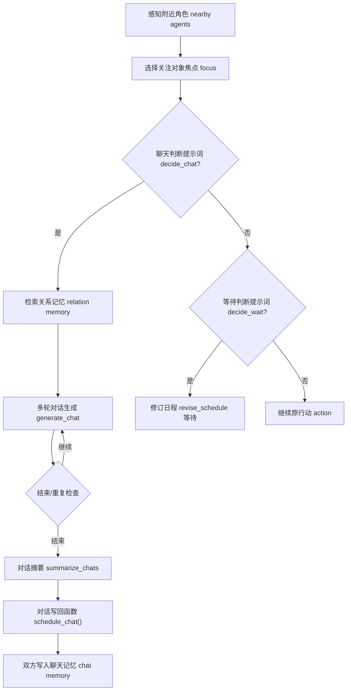

*图 20-1：社交行为闭环。聊天不是孤立文本生成，而是从感知、关系检索、对话生成到记忆写回的完整链路。*

社交机制也可以用同一个证据脚手架观察。这里的重点不是重新跑一段大模型对话，而是把源码里涉及的提示词 prompt、已有真实对话文件和状态写回链路放在一起：

```bash
python docs/book/scaffolds/part_03/ch17_23_part03_evidence.py
```

本章相关输出如下：

```text
chapter20 social: prompt_count=9, conversation_keys=1, conversation_entries=1
trace: docs/book/assets/chapter_20/ch20_social_trace.json
figure: docs/book/assets/chapter_20/ch20_social_loop.png
```

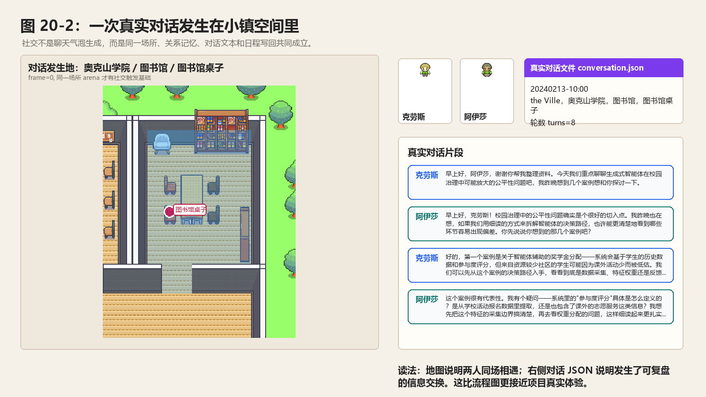

*图 20-2：一次真实对话发生在小镇空间里。左侧是对话发生的图书馆地图现场，右侧是对话文件 `conversation.json` 中的真实片段；读者可以同时看到“他们在哪里相遇”和“他们交换了什么信息”。*

这行输出可以这样读：

| 输出片段 | 对应源码或文件 | 读法 |
| --- | --- | --- |
| `prompt_count=9` | `decide_chat`、`generate_chat`、`summarize_chats` 等提示词 prompt | 社交不是一个“聊天提示词 prompt”，而是一组判断、生成、终止、摘要、反思相关提示词 prompt 的协作。 |
| `conversation_keys=1` | `results/checkpoints/book-config-ai-seminar/conversation.json` | 已有实验中至少有一个仿真时间点触发了真实对话记录。 |
| `conversation_entries=1` | 对话写回链路 `_chat_with()` | 一条对话会先写入全局 `conversation.json`，再通过 `schedule_chat()` 改写双方日程，后续反思再把聊天影响压成想法 thought。 |

先看这条真实对话的业务闭环。2024 年 2 月 13 日 10:00，克劳斯和阿伊莎在奥克山学院的图书馆桌子相遇。克劳斯发起对话，话题不是泛泛问候，而是“生成式智能体在校园治理中可能放大的公平性问题”。阿伊莎随后追问“参与度评分”的采集边界。这个结果说明，社交模块真正输出的不是几句漂亮文本，而是一次带地点、人物、话题、后续记忆价值的信息交换。

| 环节 | 项目中的真实数据 | 读法 |
| --- | --- | --- |
| 输入 | 克劳斯和阿伊莎处在同一个小镇空间 `the Ville / 奥克山学院 / 图书馆 / 图书馆桌子`，感知结果进入当前概念 `self.concepts`。 | 空间相遇先成立，社交才有触发基础。 |
| 处理 | `_reaction()` 选中阿伊莎作为关注对象焦点 focus，`get_relation()` 检索两人的关系记忆 relation memory，`decide_chat` 判断可以聊天，`generate_chat` 逐轮生成对话。 | 社交是“感知 -> 关系检索 -> 决策 -> 生成”的链路，不是直接调用一个聊天接口。 |
| 输出 | `conversation.json` 出现键 `20240213-10:00`，其中保存 `克劳斯 -> 阿伊莎 @ the Ville，奥克山学院，图书馆，图书馆桌子` 以及 8 轮发言。 | 结果被持久化为可复盘的对话记录 conversation，后续还能被压缩进 `simulation.md`。 |
| 写回 | `summarize_chats` 生成对话摘要，`schedule_chat()` 把摘要写成双方当前行动 action，反思 reflection 再把聊天影响写成想法 thought。 | 对话会改变日程 schedule 和记忆 memory，所以它能影响下一步行为。 |

`conversation.json` 中的对话片段长这样：

```json
{
  "20240213-10:00": [
    {
      "克劳斯 -> 阿伊莎 @ the Ville，奥克山学院，图书馆，图书馆桌子": [
        ["克劳斯", "早上好，阿伊莎，谢谢你帮我整理资料。今天我们重点聊聊生成式智能体在校园治理中可能放大的公平性问题吧，我昨晚想到几个案例想和你探讨一下。"],
        ["阿伊莎", "早上好，克劳斯！校园治理中的公平性问题确实是个很好的切入点。我昨晚也在想，如果我们用细读的方式来拆解智能体的决策路径，也许能更清楚地看到哪些环节容易出现偏差。你先说说你想到的那几个案例吧？"]
      ]
    }
  ]
}
```

这段 JSON 要抓住四层结构。第一层是仿真时间 `20240213-10:00`。第二层是一次或多次对话事件列表。第三层是“发起者 -> 接收者 @ 地点”的复合键。第四层是发言列表 `chats`，每一项都是 `[说话人, 发言文本]`。后面讲 `_chat_with()`、`generate_chat`、`summarize_chats` 和 `schedule_chat()` 时，都会回到这几个数据结构。

| 数据结构 | 代码形态 | 在社交链路中的作用 |
| --- | --- | --- |
| 当前概念 `self.concepts` | `List[Concept]` | 感知 percept 之后的候选现场事件，`_reaction()` 从这里选择关注对象焦点 focus。 |
| 关系上下文 `focus` | `{"node": Concept, "events": [...], "thoughts": [...]}` | `get_relation()` 返回的关系材料，供 `decide_chat` 判断是否聊天。 |
| 对话列表 `chats` | `List[Tuple[str, str]]` | 多轮对话的内存形态，`generate_chat` 每生成一句就追加一项。 |
| 全局对话记录 `conversation` | `dict[str, list[dict[str, list]]]` | 按仿真时间保存真实对话，后续写入 `conversation.json`。 |
| 对话事件 `Event` | `Event(self.name, "对话", other.name, describe=chat_summary, ...)` | `schedule_chat()` 创建的当前行动事件，让“聊天过”进入日程和记忆。 |
| 聊天记忆 `chat memory` | 关联记忆 Associate 中 `memory["chat"]` 的节点 ID | 供冷却判断、关系摘要、后续反思和信息传播继续检索。 |

## 20.2 社交从现场反应 reaction 开始

`Agent.think()` 中，醒着的智能体 agent 会执行：

```python
self.percept()
self.make_plan(agents)
self.reflect()
```

`make_plan()` 首先尝试现场反应 reaction：

```python
if self._reaction(agents):
    return
```

代码逻辑图：

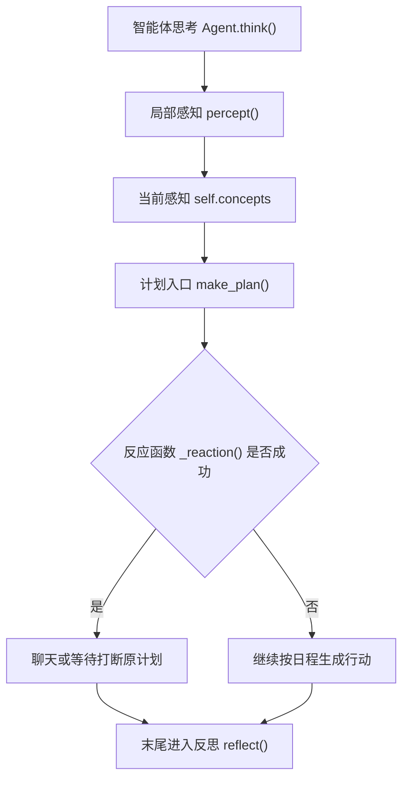

所以社交行为不是无条件发生。它必须先由感知产生 `self.concepts`，再由 `_reaction()` 判断。这条链路是：

```text
看到附近事件
  -> self.concepts
  -> _reaction()
  -> _chat_with() 或 _wait_other()
```

如果没有看到其他角色或重要事件，智能体 agent 会继续执行原计划。这让社交建立在空间相遇之上。

## 20.3 _reaction() 如何选择焦点 focus

`_reaction()` 的第一步是从 `self.concepts` 中选焦点 focus。如果有其他智能体 agent 相关概念 concept，优先选择：

```python
priority = [i for i in self.concepts if _focus(i)]
if priority:
    focus = random.choice(priority)
```

`_focus()` 判断：

```python
concept.event.subject in agents
```

看到人优先于看到物。如果没有看到智能体 agent，就从非空闲事件中选：

```python
priority = [i for i in self.concepts if not _ignore(i)]
```

代码逻辑图：

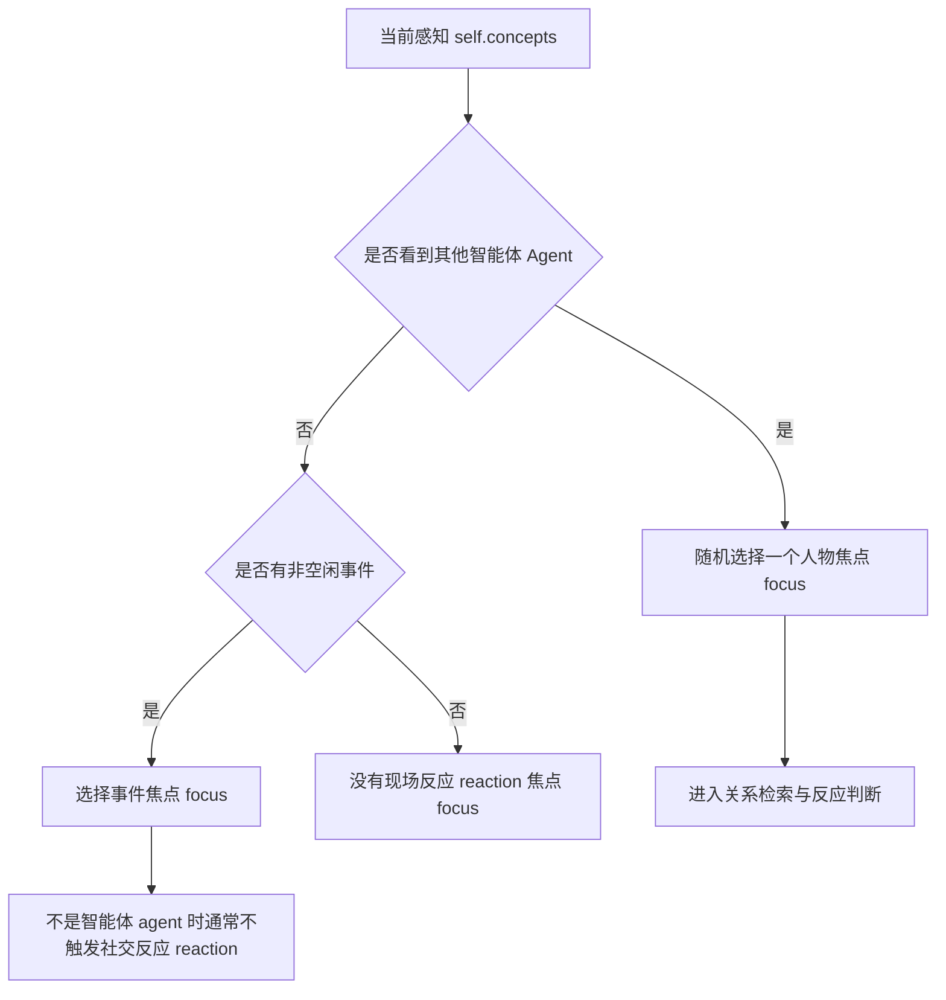

默认忽略词可以看到：

```text
空闲
```

这避免角色对空闲对象过度反应。如果最终焦点 focus 不是另一个智能体 agent，`_reaction()` 返回 None。当前项目的现场反应 reaction 主要围绕智能体之间的 agent-agent 互动。

## 20.4 关系上下文：get_relation()

选中焦点 focus 后：

```python
other, focus = agents[focus.event.subject], self.associate.get_relation(focus)
```

`get_relation()` 会返回：

```python
{
    "node": node,
    "events": self.retrieve_events(node.describe),
    "thoughts": self.retrieve_thoughts(node.describe),
}
```

这说明当前焦点 focus 会触发一次关系检索。例如，克劳斯看到玛丽亚，系统不会只把“玛丽亚在这里”交给聊天提示词 prompt。它还会检索：

- 与玛丽亚相关的事件。
- 与玛丽亚相关的想法。

社交行为因此具有历史感。角色是否聊天、说什么、如何称呼对方，都可以受过往关系影响。

## 20.5 现场反应 reaction 的两条路径

`_reaction()` 尝试两条路径：

```python
if self._chat_with(other, focus):
    return True
if self._wait_other(other, focus):
    return True
return False
```

代码逻辑图：

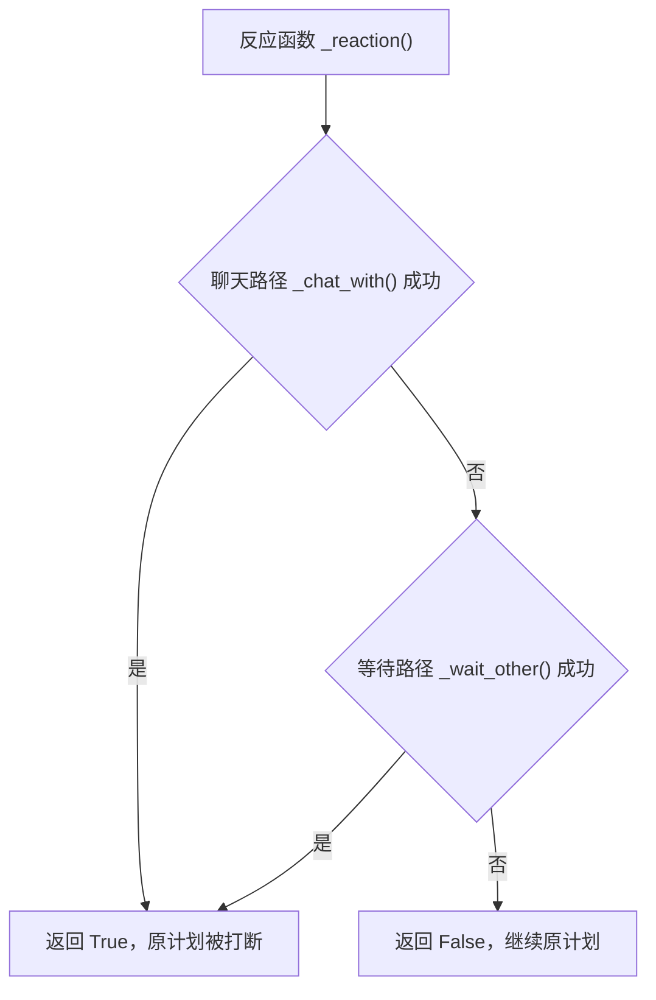

第一条是聊天。第二条是等待。聊天处理社会信息交换。等待处理空间资源冲突。这两种现场反应 reaction 都可能打断原日程。如果聊天成功，当前计划被对话行动 action 替代。如果等待成功，当前计划被等待行动 action 替代。如果都不成功，智能体 agent 继续原计划。

## 20.6 _skip_react()：何时不反应

社交不应该随时发生。`_skip_react()` 过滤不合适场景。它会跳过：

- 深夜 23 点后。
- 自己或对方正在睡觉。
- 事件处于待开始状态。

在代码中可以看到下面位置：

```python
if utils.get_timer().daily_duration(mode="hour") >= 23:
    return True
if _skip(self.get_event()) or _skip(other.get_event()):
    return True
```

这让角色不会半夜频繁社交，也不会和睡觉的人聊天。可信社交不仅要会说话，也要知道什么时候不说话。

## 20.7 _chat_with() 的前置条件

`_chat_with()` 先做多项检查。第一，双方日程必须已初始化：

```python
if len(self.schedule.daily_schedule) < 1 or len(other.schedule.daily_schedule) < 1:
    return False
```

第二，不适合现场反应 reaction 时返回 False。第三，对方不能正在移动：

```python
if other.path:
    return False
```

第四，双方不能已经在对话：

```python
if self.get_event().fit(predicate="对话") or other.get_event().fit(predicate="对话"):
    return False
```

代码逻辑图：

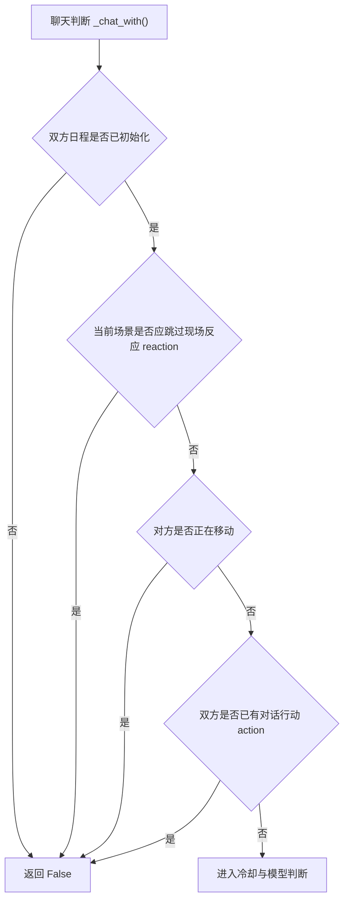

这些检查防止社交过度触发。它们让对话发生在更稳定的场景中。

## 20.8 最近聊天冷却

`_chat_with()` 会检索最近与对方的聊天记录：

```python
chats = self.associate.retrieve_chats(other.name)
```

如果有聊天记录，会计算距离现在多久：

```python
delta = utils.get_timer().get_delta(chats[0].create)
if delta < 60:
    return False
```

代码逻辑图：

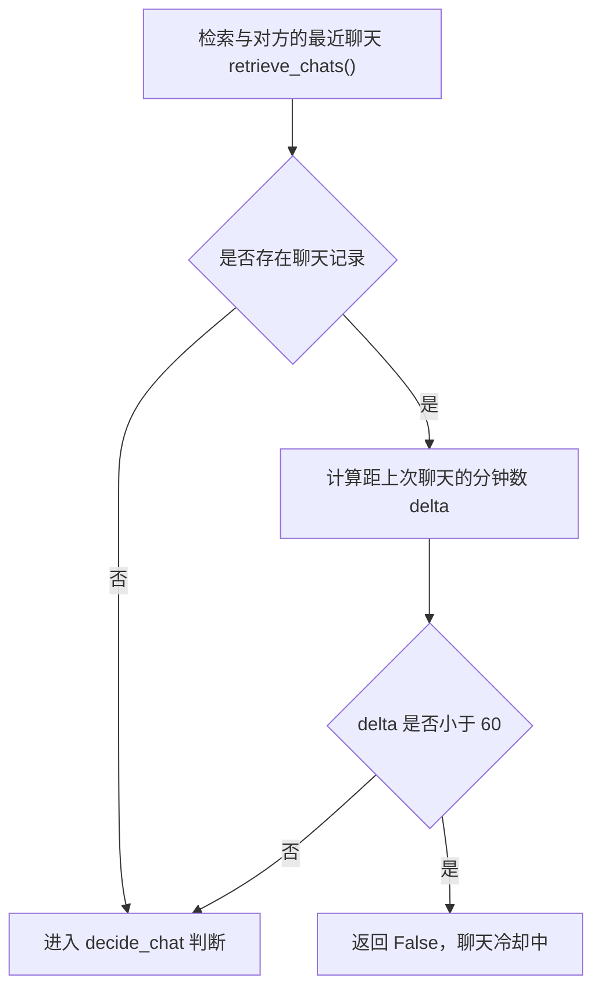

一小时内聊过就不再聊。否则两个角色在同一个地点可能每个仿真步 step 都重新对话。冷却机制让对话更像真实社交，而不是循环触发器。

## 20.9 decide_chat：是否应该主动聊天

通过前置条件后，系统调用：

```python
if not self.completion("decide_chat", self, other, focus, chats):
    return False
```

代码逻辑图：

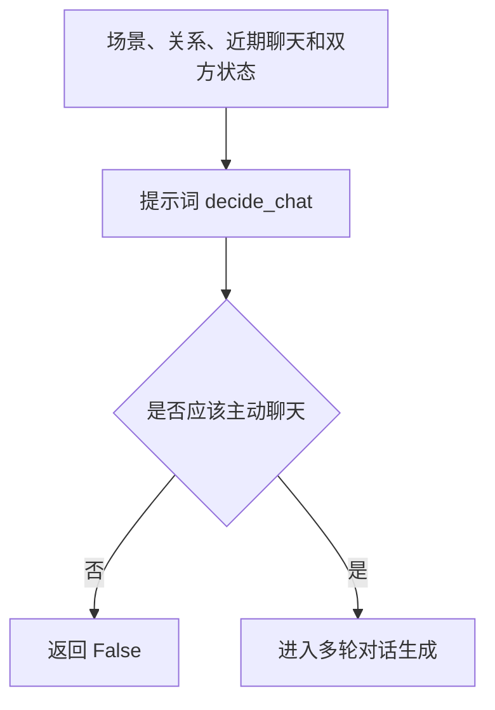

判断是否聊天的真实模板在 `generative_agents/data/prompts/decide_chat.txt`。

中文原版：

```text
背景：
"""
${context}

现在是 ${date}。${chat_history}

${agent_status}
${another_status}
"""

根据上述背景判断，${agent} 是否有可能主动与 ${another} 对话？只用“是”或“否”回答：
```

英文版本 English version:

```text
Background:
"""
${context}

It is now ${date}. ${chat_history}

${agent_status}
${another_status}
"""

Based on the background above, is ${agent} likely to actively talk with ${another}? Answer only "yes" or "no":
```

这段提示词 prompt 的输入不是单一位置状态，而是把“关系历史”和“当前现场”合在一起判断。

| 变量 | 来源 | 含义 |
| --- | --- | --- |
| 上下文 `context` | `focus["events"]` 和 `focus["thoughts"]` | 与对方相关的事件 events 和想法 thoughts。 |
| 日期 `date` | `utils.get_timer().get_date("%Y-%m-%d %H:%M:%S")` | 当前仿真时间，避免深夜、饭点、工作时段被当成同一种场景。 |
| 聊天历史 `chat_history` | `self.associate.retrieve_chats(other.name)` | 最近一次聊天的时间和主题，用于减少重复社交。 |
| 自己状态 `agent_status` | `_status_des(agent)` | 自己当前在做什么，或正要去哪里。 |
| 对方状态 `another_status` | `_status_des(other)` | 对方当前在做什么，或是否正在移动。 |

输出结构 schema 是：

```python
class decide_chatResponse(BaseModel):
    res: bool = Field(description="是否主动发起对话，true 表示会主动对话，false 表示不会")
```

回调函数 callback 会把 `true`、`yes`、`是`、`1` 都解析成 `True`。失败兜底 failsafe 是 `False`，也就是模型失败时默认不打断原日程。对克劳斯和阿伊莎的图书馆案例来说，`decide_chat` 拿到的输入包含“克劳斯正在整理研究资料”“阿伊莎在同一空间”“两人和研究话题有关”这些线索，于是聊天路径继续往下执行。

这一步把“是否聊天”从“看见人就聊”升级为情境判断。例如：

- 正在赶去睡觉，不一定聊天。
- 刚刚聊过，不聊天。
- 对方正在做重要事情，不一定打扰。
- 有共同活动或邀请事项，可能聊天。

这就是可信行为 believable behavior。

## 20.10 summarize_relation：双方视角不同

决定聊天后，系统生成双方关系摘要：

```python
relations = [
    self.completion("summarize_relation", self, other.name),
    other.completion("summarize_relation", other, self.name),
]
```

这里生成两个摘要，而不是一个全局关系。克劳斯怎么看玛丽亚，不一定等于玛丽亚怎么看克劳斯。山姆怎么看汤姆，也不等于汤姆怎么看山姆。对话生成时，双方各用自己的关系摘要。这让对话具有不对称性。如果所有角色共享一份关系状态，对话会更像剧本，而不是个体社会互动。

关系摘要提示词 prompt 位于 `generative_agents/data/prompts/summarize_relation.txt`。

中文原版：

```text
背景描述：
"""
${context}
"""

输出示例1：乔和汤姆是朋友
输出示例2：艾琳和约翰在玩游戏

参考上述背景描述和输出示例，用一句话总结 ${agent} 和 ${another} 之间的关系：
```

英文版本 English version:

```text
Background description:
"""
${context}
"""

Example output 1: Joe and Tom are friends
Example output 2: Erin and John are playing games

Using the background description and examples above, summarize the relationship between ${agent} and ${another} in one sentence:
```

| 变量 | 来源 | 含义 |
| --- | --- | --- |
| 背景描述 `context` | `agent.associate.retrieve_focus([other_name], 50)` | 围绕对方名字检索出来的事件 events 和想法 thoughts。 |
| 角色名 `agent` | 当前智能体 agent | 摘要的主视角，例如克劳斯。 |
| 对方名 `another` | `other_name` | 被总结关系的对象，例如阿伊莎。 |

输出结构 schema 是：

```python
class summarize_relationResponse(BaseModel):
    res: str = Field(description="一句话描述两人之间的关系，以第三人称表述")
```

回调函数 callback 会去掉首尾空白；如果模型没有返回有效内容，失败兜底 failsafe 是：

```text
<agent> 正在看着 <other_name>
```

这个兜底句很朴素，但它保住了后续对话生成的最低上下文：至少模型知道当前角色正在看着另一个角色，而不是在没有对象关系的情况下凭空说话。

## 20.11 summarize_relation 如何检索

`prompt_summarize_relation()` 会围绕对方名字检索记忆：

```python
nodes = agent.associate.retrieve_focus([other_name], 50)
```

然后把检索结果放进提示词 prompt。如果没有有效结果，失败兜底 failsafe 是：

```text
<agent> 正在看着 <other_name>
```

这说明关系摘要来自记忆，而不是全局关系表。角色越多次与某人互动，关系摘要越可能具体。这支撑关系形成。

从输入、处理、输出看，关系摘要 relation summary 是这样流转的：

| 环节 | 数据 | 对对话的影响 |
| --- | --- | --- |
| 输入 | 对方名字 `other_name`，例如“阿伊莎”。 | 名字本身就是检索焦点 focus。 |
| 处理 | 关联记忆 Associate 在事件 events 和想法 thoughts 中做相似检索。 | 召回两人过去共同经历、评价和近期想法。 |
| 输出 | 一句自然语言关系摘要 `relations[0]` 或 `relations[1]`。 | 进入 `generate_chat`，决定下一句对话的语气和内容边界。 |

## 20.12 generate_chat：生成一句话

多轮对话的核心逻辑是：

```python
text = self.completion("generate_chat", self, other, relations[0], chats)
```

对话生成提示词 prompt 位于 `generative_agents/data/prompts/generate_chat.txt`。这是社交模块里最核心的一段模板。

中文原版：

```text
以下是对 ${agent} 的简要描述：
${base_desc}

以下是 ${agent} 的记忆：
${memory}

当前位置：${address}
当前时间：${current_time}

${previous_context}${current_context}
${agent} 开始和 ${another} 对话。以下是他们的对话记录：
<对话记录>
${conversation}
</对话记录>

<对话原则>
- ${agent} 不会重复<对话记录>中已有的内容
- 对话内容要符合智能体的性格和当前情境
- 语言自然流畅，符合日常交流习惯
- 长度控制在1-3句话内
- 直接输出 ${agent} 的对话内容，不要补充其他信息
</对话原则>

基于以上<对话记录>和<对话原则>，现在 ${agent} 会对 ${another} 说：
```

英文版本 English version:

```text
Here is a brief description of ${agent}:
${base_desc}

Here is ${agent}'s memory:
${memory}

Current location: ${address}
Current time: ${current_time}

${previous_context}${current_context}
${agent} starts talking with ${another}. Their conversation so far is:
<conversation>
${conversation}
</conversation>

<conversation principles>
- ${agent} will not repeat content already present in <conversation>
- The dialogue should fit the agent's personality and current situation
- The language should be natural and fluent, suitable for everyday conversation
- Keep the response within 1 to 3 sentences
- Output only what ${agent} says, with no extra information
</conversation principles>

Based on the <conversation> and <conversation principles> above, ${agent} now says to ${another}:
```

| 变量 | 来源 | 含义 |
| --- | --- | --- |
| 基础描述 `base_desc` | 角色草稿 Scratch 的姓名、性格、生活方式、当前目标等信息 | 让发言符合角色设定，而不是变成通用助手口吻。 |
| 记忆 `memory` | `agent.associate.retrieve_focus(focus, 15)` | 围绕关系摘要、对方当前行为和最近对话检索出来的记忆。 |
| 地点 `address` | `agent.get_tile().get_address()` | 当前空间地址，例如“图书馆，图书馆桌子”。 |
| 当前时间 `current_time` | `utils.get_timer().get_date("%H:%M")` | 让问候、活动和时间段一致。 |
| 近期背景 `previous_context` | 最近 480 分钟内与对方的聊天记忆 chat memory | 避免刚聊过的话题再次从头开始。 |
| 当前场景 `current_context` | 自己和对方当前行动 action | 告诉模型此刻为什么会开口。 |
| 对话记录 `conversation` | 当前轮内已经生成的 `chats` | 让下一句承接上一句，而不是重新开场。 |

输出结构 schema 是：

```python
class generate_chat(BaseModel):
    res: str = Field(description="角色说出的对话内容，1到3句话")
```

回调函数 callback 会移除模型可能输出的“角色名：”前缀，只保留真正的发言文本。失败兜底 failsafe 是：

```text
嗯
```

这个兜底很短，因为它只负责让对话循环不中断。真正的质量来自模板前半段：角色基础描述 base description、关联记忆 associate memory、当前位置 address、当前场景 current context 和已有对话记录 conversation 同时进入模型。

## 20.13 对话记忆检索

`prompt_generate_chat()` 内部还会检索相关记忆：

```python
focus = [relation, other.get_event().get_describe()]
if len(chats) > 4:
    focus.append("; ".join("{}: {}".format(n, t) for n, t in chats[-4:]))
nodes = agent.associate.retrieve_focus(focus, 15)
```

生成一句话时会围绕：

- 双方关系。
- 对方当前行为。
- 最近对话内容。

检索记忆。此外，它还检索最近 480 分钟内与对方的聊天：

```python
chat_nodes = agent.associate.retrieve_chats(other.name)
```

这让角色能避免重复，也能延续近期话题。

## 20.14 多轮对话循环

`_chat_with()` 中：

```python
for i in range(self.chat_iter):
    text = self.completion("generate_chat", self, other, relations[0], chats)
    ...
    text = other.completion("generate_chat", other, self, relations[1], chats)
```

`chat_iter` 默认是 4。一轮中，发起者说一句，对方说一句。每次说话后，内容加入：

```python
chats.append((name, text))
```

代码逻辑图：

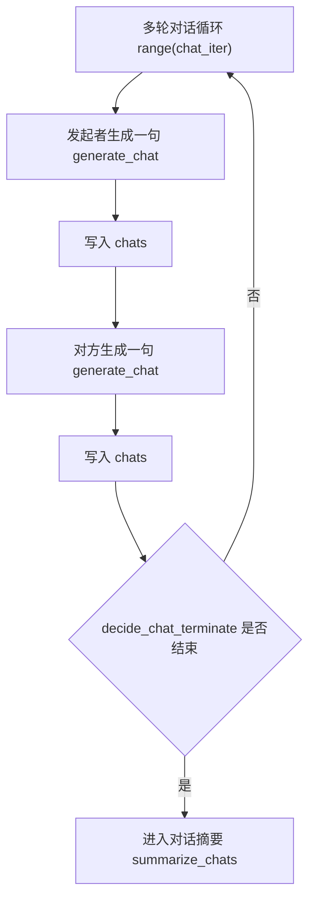

这使下一句生成能看到已有对话。对话不是一次性生成整段，而是逐轮生成。这更像真实互动，也更容易在中途结束。

## 20.15 防复读

从第二轮开始，系统检查复读：

```python
end = self.completion(
    "generate_chat_check_repeat", self, chats, text
)
if end:
    break
```

防复读提示词 prompt 位于 `generative_agents/data/prompts/generate_chat_check_repeat.txt`。

中文原版：

```text
<对话记录>
${conversation}
</对话记录>

<新对话>
${content}
</新对话>

${agent} 在<新对话>中所说的内容，是否在<对话记录>中出现过？只用“是”或“否”回答：
```

英文版本 English version:

```text
<conversation>
${conversation}
</conversation>

<new utterance>
${content}
</new utterance>

Does what ${agent} said in <new utterance> already appear in <conversation>? Answer only "yes" or "no":
```

| 变量 | 来源 | 含义 |
| --- | --- | --- |
| 对话记录 `conversation` | 已有 `chats` 拼接成的多行文本 | 当前轮之前双方已经说过的话。 |
| 新对话 `content` | 刚生成但尚未写入 `chats` 的一句话 | 需要检查的新发言。 |
| 角色名 `agent` | 当前说话人 | 明确检查的是谁的新发言。 |

输出结构 schema 是：

```python
class generate_chat_check_repeatResponse(BaseModel):
    res: bool = Field(description="新对话内容是否与历史记录重复，true 表示重复，false 表示不重复")
```

回调函数 callback 会把 `true`、`yes`、`是`、`1` 解析成 `True`。失败兜底 failsafe 是 `False`，也就是模型失败时不因为不确定而强行结束对话。

如果判断重复，就结束。这针对大语言模型 LLM 常见问题：

- 重复上一轮意思。
- 客套话循环。
- 继续确认同一件事。

多智能体 multi-agent 长对话很容易陷入复读。防复读提示词 prompt 是工程上非常实用的补丁。它不属于论文核心模块，但对项目可运行性很关键。

## 20.16 decide_chat_terminate：判断话题结束

系统还会调用下面函数：

```python
end = other.completion(
    "decide_chat_terminate", other, self, chats
)
if end:
    break
```

结束判断提示词 prompt 位于 `generative_agents/data/prompts/decide_chat_terminate.txt`。

中文原版：

```text
<对话记录>
${conversation}
</对话记录>

<判断逻辑>
如果最后一句话是疑问句，表明对话没有结束。
如果最后一句话是在请求对方帮助，表明对话没有结束。
如果最后一句话是想听对方的看法，表明对话没有结束。
如果最后一句话是期待与对方继续讨论，表明对话没有结束。
</判断逻辑>

根据以上<对话记录>和<判断逻辑>分析，${agent} 和 ${another} 的对话是否已经告一段落。只用“是”或“否”回答：
```

英文版本 English version:

```text
<conversation>
${conversation}
</conversation>

<decision logic>
If the last sentence is a question, the conversation is not finished.
If the last sentence asks the other person for help, the conversation is not finished.
If the last sentence asks for the other person's view, the conversation is not finished.
If the last sentence expects further discussion, the conversation is not finished.
</decision logic>

Based on the <conversation> and <decision logic> above, has the conversation between ${agent} and ${another} reached a natural stopping point? Answer only "yes" or "no":
```

输出结构 schema 是：

```python
class decide_chat_terminateResponse(BaseModel):
    res: bool = Field(description="对话是否已告一段落，true 表示对话结束，false 表示对话仍在继续")
```

回调函数 callback 同样把 `true`、`yes`、`是`、`1` 解析成 `True`。失败兜底 failsafe 是 `False`，也就是默认继续对话，直到复读检查、自然结束判断或最大轮数 `chat_iter` 让循环停止。

这让对话长度由内容决定，而不是固定轮数。简单问候可能一两轮结束。派对邀请可能需要多轮。争论或协商可能更长。当前项目仍然有最大轮数 `chat_iter`，避免无限对话。

## 20.17 保存对话记录 conversation

对话结束后，系统写入全局对话记录 conversation：

```python
key = utils.get_timer().get_date("%Y%m%d-%H:%M")
self.conversation[key].append({
    f"{self.name} -> {other.name} @ {'，'.join(self.get_event().address)}": chats
})
```

代码逻辑图：

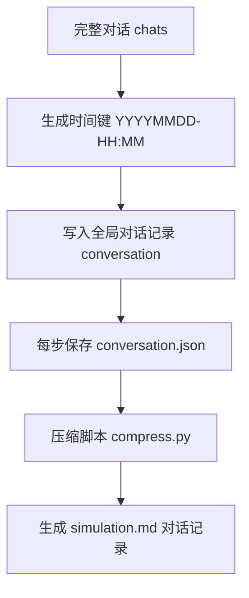

这个结构会记录下面内容：

- 时间。
- 发起者。
- 接收者。
- 地点。
- 对话内容。

它会被 `SimulateServer.simulate()` 每步写入 `conversation.json`。后续 `compress.py` 会用它生成 `simulation.md`。这让社交行为可复盘。

| 字段层级 | 真实示例 | 含义 |
| --- | --- | --- |
| 时间键 | `20240213-10:00` | 对话发生的仿真时间。 |
| 对话键 | `克劳斯 -> 阿伊莎 @ the Ville，奥克山学院，图书馆，图书馆桌子` | 谁发起、谁回应、在哪里发生。 |
| 发言项 | `["克劳斯", "早上好，阿伊莎..."]` | 一句实际对话，第一项是说话人，第二项是文本。 |
| 发言列表 | 8 条 `[name, text]` | 一次完整多轮对话的原始记录。 |

保存对话记录 conversation 是日志视角。它保留原文，方便回放、压缩报告和调试。日程 schedule 和记忆 memory 不直接使用这整段长文本，而是继续进入下一步摘要。

## 20.18 summarize_chats：对话摘要

系统不会把完整对话直接作为当前行动 action。它会先生成摘要：

```python
chat_summary = self.completion("summarize_chats", chats)
```

对话摘要提示词 prompt 位于 `generative_agents/data/prompts/summarize_chats.txt`。

中文原版：

```text
对话：
"""
${conversation}
"""

用不超过100字的短句总结上述对话：
```

英文版本 English version:

```text
Conversation:
"""
${conversation}
"""

Summarize the conversation above in a short sentence of no more than 100 Chinese characters:
```

| 变量 | 来源 | 含义 |
| --- | --- | --- |
| 对话 `conversation` | `"\n".join(["{}: {}".format(n, u) for n, u in chats])` | 把 `chats` 从列表转成模型可读的多行对话文本。 |

输出结构 schema 是：

```python
class summarize_chatsResponse(BaseModel):
    res: str = Field(description="对话内容的简短摘要，一句话概括对话主题")
```

失败兜底 failsafe 会根据对话长度生成两种默认值：

| 条件 | 失败兜底 failsafe |
| --- | --- |
| 至少两句对话 | `<角色A> 和 <角色B> 之间的普通对话` |
| 只有一句发言 | `<角色A> 说的话没有得到回应` |

摘要主要用于下面场景：

- 对话事件 describe。
- 聊天记忆 chat memory。
- 日程修订。
- 后续反思 reflection。

完整对话适合日志。摘要适合记忆和检索。如果摘要质量差，后续社交记忆会变差。克劳斯和阿伊莎的案例里，摘要至少应该保留“校园治理”“公平性问题”“参与度评分采集边界”这些关键词。派对邀请场景里，摘要必须包含时间、地点和邀请意图，否则后续无法传播。

## 20.19 schedule_chat：写回双方

对话摘要生成后会继续处理：

```python
self.schedule_chat(chats, chat_summary, start, duration, other)
other.schedule_chat(chats, chat_summary, start, duration, self)
```

代码逻辑图：

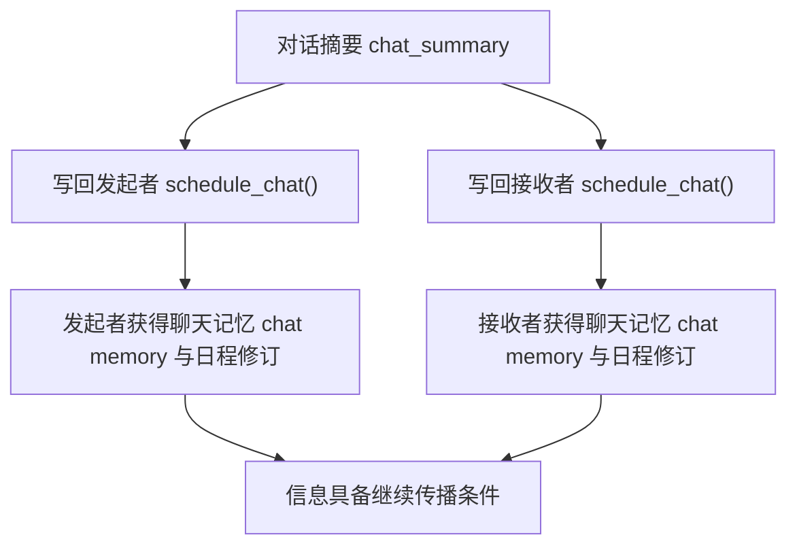

对话会写回双方。这符合现实。聊天不是只有发起者记得。双方都要：

- 把对话加入 `chats`。
- 创建对话事件 event。
- 修订当前日程 schedule。

这也是信息传播的关键。如果只有发起者记录对话，被邀请者就不会知道派对。

`schedule_chat()` 创建的对话事件 event 形态如下：

```python
event = memory.Event(
    self.name,
    "对话",
    other.name,
    describe=chats_summary,
    address=address or self.get_tile().get_address(),
    emoji=f"💬",
)
```

写成数据后，可以这样读：

```json
{
  "subject": "克劳斯",
  "predicate": "对话",
  "object": "阿伊莎",
  "describe": "克劳斯和阿伊莎讨论校园治理中的公平性问题，以及参与度评分的采集边界。",
  "address": ["the Ville", "奥克山学院", "图书馆", "图书馆桌子"],
  "emoji": "💬"
}
```

| 字段 | 中文意思 | 对后续行为的影响 |
| --- | --- | --- |
| 主体 `subject` | 谁正在发生这件事 | 对发起者来说是“克劳斯”，对接收者来说会变成“阿伊莎”。 |
| 谓词 `predicate` | 事件类型 | `"对话"` 让记忆模块把它识别成聊天事件，而不是普通活动。 |
| 对象 `object` | 与谁对话 | 用于后续检索与某人的聊天记忆 chat memory。 |
| 描述 `describe` | 对话摘要 | 进入日程、记忆和反思，是后续信息传播的核心文本。 |
| 地址 `address` | 对话发生地点 | 让回放和 `simulation.md` 能显示这段社交发生在哪里。 |
| 表情 `emoji` | 前端展示符号 | 回放界面可以用气泡符号标记聊天状态。 |

## 20.20 对话时长如何估算

对话 duration 由文本长度估算：

```python
duration = int(sum([len(c[1]) for c in chats]) / 240)
```

这是一种简单估计。对话越长，占用时间越久。但它有边界。中文字符长度与真实说话时间不是严格线性。短对话可能 duration 为 0。更精细的系统可以设置最小时长，或按词速估算。当前实现足够支持日程占用的基本效果。

## 20.21 对话如何进入反思

`schedule_chat()` 会把 chats 加入：

```python
self.chats.extend(chats)
```

之后 `Agent.reflect()` 会处理 `self.chats`：

```python
thought = self.completion("reflect_chat_planing", self.chats)
_add_thought(f"对于 {self.name} 的计划：{thought}", evidence)
thought = self.completion("reflect_chat_memory", self.chats)
_add_thought(f"{self.name} {thought}", evidence)
```

这里有两个反思提示词 prompt。聊天计划反思提示词 `reflect_chat_planing` 负责回答“这段聊天会怎样影响我的计划”；聊天记忆反思提示词 `reflect_chat_memory` 负责回答“这段聊天让我记住了什么”。在社交链路里，它们的输入、处理、输出可以这样读：

| 环节 | 数据 | 读法 |
| --- | --- | --- |
| 输入 | `self.chats`，也就是刚刚发生的 `[说话人, 发言文本]` 列表 | 反思不直接读 `conversation.json`，而是读当前智能体 agent 内存里的聊天列表。 |
| 处理 | `reflect_chat_planing` 和 `reflect_chat_memory` 分别生成计划影响和记忆影响 | 同一段聊天会被拆成“我要不要改计划”和“我记住了什么”两类想法 thought。 |
| 输出 | `_add_thought()` 写入关联记忆 Associate 的 `thought` 节点 | 后续日程、关系摘要和对话生成都可以再次检索这些想法 thought。 |

所以对话不仅影响当前日程，也会影响高层想法 thought。例如：

```text
阿伊莎知道伊莎贝拉邀请她参加情人节派对。
克劳斯觉得玛丽亚愿意讨论开放性问题。
山姆发现汤姆对竞选保持怀疑。
```

这些想法 thought 会影响后续行为。

## 20.22 _wait_other()：等待机制

社交章节还要讲等待，因为它也是现场反应 reaction 的一部分。`_wait_other()` 处理空间冲突。前置条件包括：

- 不跳过现场反应 reaction。
- 自己必须在移动路径 path 上。
- 自己行动 action 地址必须等于对方当前地图格子 tile 地址。
- `decide_wait` 判断应该等待。

如果决定等待，会创建事件 event：

```python
memory.Event(
    self.name,
    "waiting to start",
    self.get_event().get_describe(False),
    address=self.get_event().address,
    emoji=f"⌛",
)
```

然后调用下面函数，需要结合源码查看：

```python
self.revise_schedule(event, start, duration)
```

代码逻辑图：

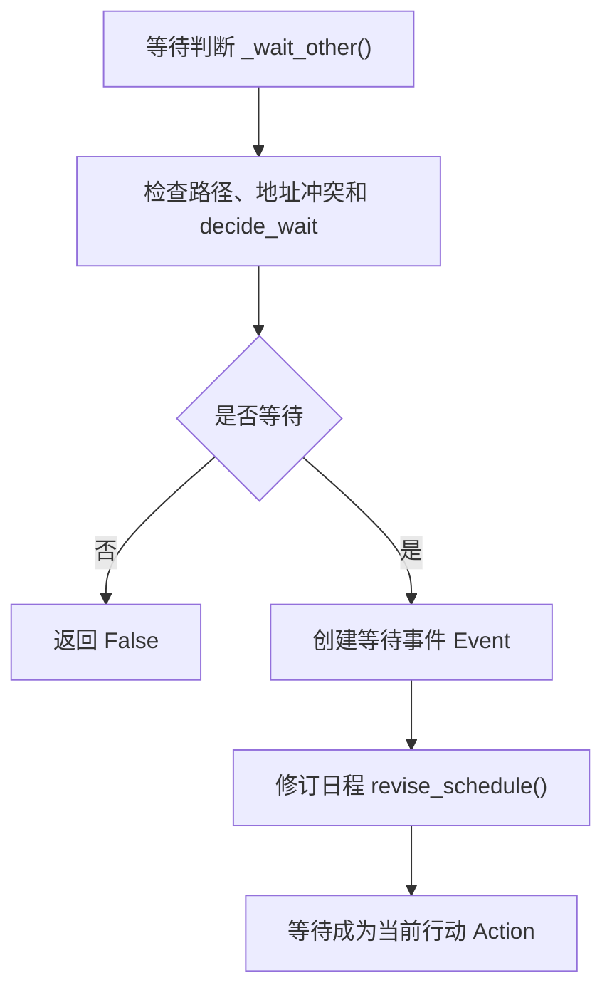

等待是社交的边界场景。它不是对话，但它处理人与人之间的空间协调。

## 20.23 decide_wait 的常识示例

`decide_wait` 提示词 prompt 中有示例。一个例子是两人都要使用浴室。如果浴室已被占用，后到者应该等待。另一个例子是一人吃午饭，一人洗衣服。两者不冲突，继续行动。

等待判断由两个模板组成。外层模板是 `generative_agents/data/prompts/decide_wait.txt`。

中文原版：

```text
示例1：
${examples_1}

示例2：
${examples_2}

根据上述示例，回答哪个选项最适合以下任务：
${task}

不要输出推理过程，直接输出答案：
```

英文版本 English version:

```text
Example 1:
${examples_1}

Example 2:
${examples_2}

Based on the examples above, answer which option best fits the following task:
${task}

Do not output the reasoning process. Output the answer directly:
```

内层任务模板是 `generative_agents/data/prompts/decide_wait_example.txt`。

中文原版：

```text
背景：
"""
${context}
现在是 ${date}
${status}
${agent} 看到 ${another_status}
"""
问题：一步一步思考，在以下两个选项中，${agent} 应该怎么做？
选项A：等待 ${another} 完成 ${another_action}，然后再 ${action}
选项B：现在继续 ${action}
${reason}${answer}
```

英文版本 English version:

```text
Background:
"""
${context}
It is now ${date}
${status}
${agent} sees that ${another_status}
"""
Question: think step by step. Among the following two options, what should ${agent} do?
Option A: wait for ${another} to finish ${another_action}, and then ${action}
Option B: continue to ${action} now
${reason}${answer}
```

| 变量 | 来源 | 含义 |
| --- | --- | --- |
| 背景 `context` | `focus["events"]` 和 `focus["thoughts"]` | 两人关系、近期事件和想法。 |
| 当前时间 `date` | 仿真计时器 timer | 判断是否处于合理等待时段。 |
| 自己状态 `status` | `_status_des(agent)` | 自己是已经在做，还是正要去做某件事。 |
| 对方状态 `another_status` | `_status_des(other)` | 对方是否正在占用目标空间或对象。 |
| 自己行动 `action` | `agent.get_event().get_describe(False)` | 自己原本想做的事。 |
| 对方行动 `another_action` | `other.get_event().get_describe(False)` | 对方正在做的事。 |

输出结构 schema 是：

```python
class decide_waitResponse(BaseModel):
    res: str = Field(description="选择的选项，'A' 表示等待，'B' 表示继续当前行动")
```

这一步的回调函数 callback 与前面的布尔值 bool 提示词不同。模型输出的是 `"A"` 或 `"B"`，代码用：

```python
return "A" in response
```

把选项 A 转成 `True`，也就是等待；选项 B 转成 `False`，也就是继续当前行动。失败兜底 failsafe 是 `False`，模型失败时默认不等待。

这些示例告诉模型：

```text
不是看到别人就等待。
要判断行动是否争用同一空间或对象。
```

这让等待机制更接近常识。

## 20.24 社交如何支撑信息扩散

情人节派对信息扩散依赖社交闭环。流程：

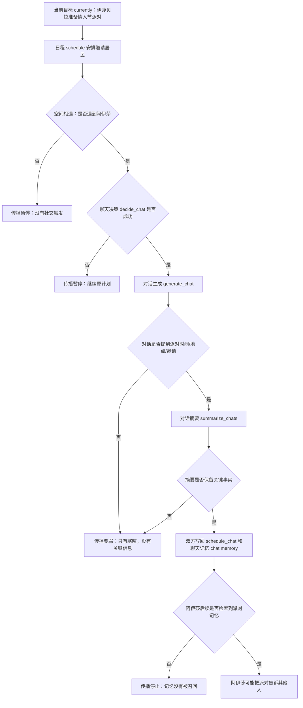

这个传播不是全局变量。它需要每一步都成功。如果聊天决策 `decide_chat` 返回 False，传播断。如果对话生成 `generate_chat` 没提派对，传播断。如果对话摘要 `summarize_chats` 丢了时间地点，传播质量下降。如果聊天记忆 chat memory 后续检索失败，传播不会继续。这就是为什么社交模块是复现实验核心。

| 断点 | 检查对象 | 典型现象 |
| --- | --- | --- |
| 空间断点 | 两人是否同一场所 arena，是否进入对方感知范围 | 日程里有邀请目标，但角色始终没有相遇。 |
| 决策断点 | `decide_chat` 输出 | 两人相遇了，但模型判断“不聊天”。 |
| 内容断点 | `generate_chat` 输出 | 聊了很久，但没有提到派对。 |
| 摘要断点 | `summarize_chats` 输出 | 对话提到派对，但摘要只写成“普通聊天”。 |
| 写回断点 | `schedule_chat()` 和聊天记忆 chat memory | 摘要存在，但没有进入双方日程或记忆。 |
| 检索断点 | 后续 `retrieve_focus()` 或 `retrieve_chats()` | 记忆写入了，但下一次生成没有召回。 |

## 20.25 社交如何支撑关系形成

关系形成也依赖社交闭环。以克劳斯和玛丽亚为例：

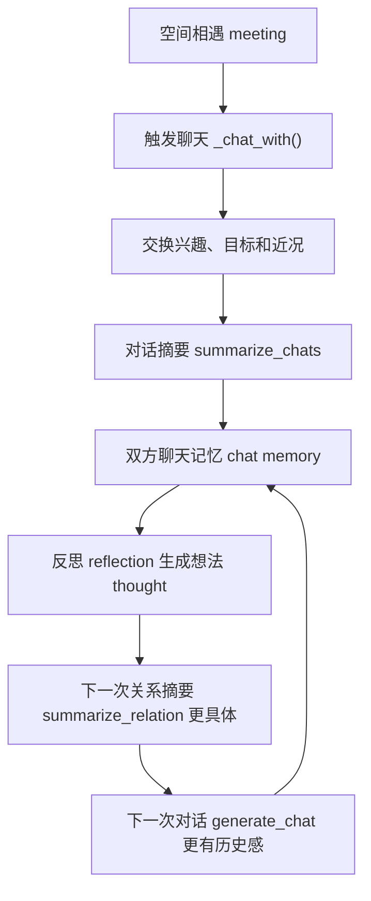

关系不是固定字段。它是多次对话、记忆检索和反思积累出来的。这也是生成式智能体 Generative Agents 区别于传统 NPC 关系表的地方。传统 NPC 可能有：

```text
friendship_score = 70
```

生成式智能体 Generative Agents 更接近：

```text
我记得我们聊过什么。
我对这些经历有什么理解。
我下次见你时会基于这些理解说话。
```

## 20.26 社交失败模式

社交失败要沿“触发、决策、生成、摘要、写回、再检索”这条闭环定位。

| 失败表现 | 可能原因 | 检查位置 | 修正方向 |
| --- | --- | --- | --- |
| 触发不足 | 角色看到了人，但聊天决策 `decide_chat` 经常返回 False。 | 感知结果 `self.concepts`、关系上下文 `focus`、`decide_chat` 输出。 | 检查两人是否同一场所 arena；增强当前目标 currently 或关系记忆 relation memory；确认冷却时间没有误伤。 |
| 触发过度 | 角色频繁聊天，日程被打断，小镇像聊天大厅。 | 最近聊天冷却 `retrieve_chats()`、`delta < 60`、`_skip_react()`。 | 延长冷却时间；增加忙碌状态判断；提高 `decide_chat` 对当前行动 action 的敏感度。 |
| 对话泛化 | 角色只是寒暄，没有提到当前目标或记忆。 | `generate_chat` 的记忆 `memory`、当前场景 `current_context`、已有对话 `conversation`。 | 检查 `retrieve_focus()` 是否召回关键记忆；让当前目标 currently 写得更具体。 |
| 摘要丢失关键信息 | 派对时间、地点、承诺没有进入对话摘要 chat summary。 | `summarize_chats` 输出、写入的事件描述 `Event.describe`。 | 在摘要提示词 prompt 中强调事实、承诺和时间地点；对摘要做结构化抽取。 |
| 关系摘要错误 | 检索到无关记忆，导致对话语气不合理。 | `summarize_relation` 输入 `context`、关联记忆 Associate 的检索结果。 | 调整检索权重；过滤过期或低相关记忆；检查对方名字是否被正确写入记忆。 |
| 复读或过度礼貌 | 模型反复客套，缺少真实推进。 | `generate_chat_check_repeat` 输出、每轮 `chats`。 | 收紧重复判断；增加对“推进话题”的提示；降低最大轮数 `chat_iter`。 |
| 对话不改变后续行为 | 生成了文本，但没有影响日程、记忆或反思。 | `schedule_chat()`、`self.chats.extend(chats)`、`reflect_chat_planing`、`reflect_chat_memory`。 | 检查对话是否写回双方；确认反思 reflection 是否触发；看聊天记忆 chat memory 是否能被后续检索。 |

## 20.27 如何调试一次对话

调试一次对话时，按真实执行顺序检查。不要先看最终文本，先确认这段文本有没有机会发生。

| 顺序 | 检查点 | 具体看什么 | 能定位的问题 |
| --- | --- | --- | --- |
| 1 | 空间位置 | 两人是否在同一场所 arena，或是否进入彼此感知范围。 | 没有相遇，社交无法触发。 |
| 2 | 感知 percept | `self.concepts` 里是否出现对方相关概念 concept。 | 角色看不到对方，后续函数不会运行。 |
| 3 | 关注对象焦点 focus | `_reaction()` 是否选中对方。 | 被空闲对象或其他事件抢走焦点。 |
| 4 | 前置过滤 | `_skip_react()`、对方移动路径 path、已有对话 action。 | 睡觉、深夜、移动中或已在对话。 |
| 5 | 冷却时间 | `retrieve_chats()` 和 `delta < 60`。 | 一小时内聊过，被冷却机制拦截。 |
| 6 | 聊天决策 | `decide_chat` 的输入、输出结构 schema 和回调结果。 | 模型判断不该聊天。 |
| 7 | 关系摘要 | 双方 `summarize_relation` 输出是否符合各自视角。 | 关系背景错误，导致语气不对。 |
| 8 | 逐轮生成 | 每次 `generate_chat` 的记忆、地点、当前场景和已有对话。 | 文本泛化、话题漂移或缺少目标信息。 |
| 9 | 结束控制 | 防复读 `generate_chat_check_repeat` 和结束判断 `decide_chat_terminate`。 | 对话过早结束、无限客套或复读。 |
| 10 | 摘要写回 | `summarize_chats`、`conversation.json`、`schedule_chat()`。 | 对话生成了，但没有成为日程或记忆。 |
| 11 | 后续影响 | 聊天记忆 chat memory、反思 reflection、下一次 `summarize_relation`。 | 对话没有改变之后的计划、关系或信息传播。 |

调试链路图如下：

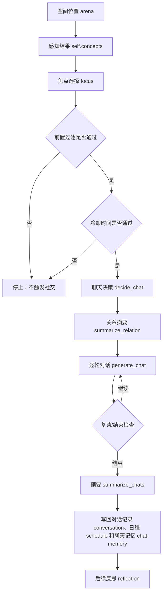

## 20.28 社交实验怎么设计

社交实验要固定地图、时间和角色，只改一个变量。否则对话有没有发生，可能同时受位置、日程、关系、冷却时间、模型输出和摘要质量影响。

| 实验目标 | 修改变量 | 运行方式 | 观察对象 | 预期现象 |
| --- | --- | --- | --- | --- |
| 观察聊天触发 | 两个角色的初始位置和日程 | 让两人同一时间出现在同一场所 arena。 | `self.concepts`、`_reaction()`、`decide_chat` 输出。 | 两人相遇后，焦点 focus 应该指向对方，并进入聊天判断。 |
| 观察关系影响 | 预置双方历史记忆 memory | 给一方增加与对方相关的事件 event 或想法 thought。 | `summarize_relation` 输出和 `generate_chat` 内容。 | 关系摘要更具体，对话语气和话题会受过去经历影响。 |
| 观察信息扩散 | 派对、会议、邀请等明确目标 currently | 让发起者与多个角色依次相遇。 | `conversation.json`、聊天记忆 chat memory、后续对话。 | 关键信息应该从一个角色逐步进入其他角色记忆。 |
| 观察摘要质量 | 同一段对话的摘要提示词 prompt | 保持对话不变，只比较摘要输出。 | `summarize_chats`、`Event.describe`、后续检索结果。 | 摘要保留时间、地点和承诺时，后续传播更稳定。 |
| 观察等待机制 | 共享对象或目标地址 | 让一个角色占用浴室、桌子、咖啡机等对象，另一个角色前往同一对象。 | `_wait_other()`、`decide_wait` 输出、等待行动 action。 | 两人争用同一对象时，后到者更可能等待。 |
| 观察模型稳定性 | 大语言模型 LLM、温度 temperature、结构化输出 schema | 用同一初始状态重复运行。 | prompt 输出、失败兜底 failsafe 次数、对话长度。 | 稳定模型应更少复读，更少触发失败兜底，摘要更完整。 |

每次实验至少保存三类证据：第一，输入配置，例如角色目标 currently、初始位置和日程 schedule；第二，过程证据，例如提示词 prompt、模型输出和日志；第三，输出结果，例如 `conversation.json`、`simulation.md`、聊天记忆 chat memory 和截图。只看最终对话文本，无法判断问题出在触发、生成、摘要还是写回。

## 20.29 可改进方向

社交模块的升级方向可以围绕“意图、关系、承诺、抽取、多人互动”展开。

| 当前限制 | 改进做法 | 获得的能力 |
| --- | --- | --- |
| 对话意图不显式 | 增加社交意图 social intent，区分寒暄、邀请、询问、争论、求助、协商。 | 模型生成前先知道“这次聊天要完成什么”。 |
| 关系只靠自然语言摘要 | 把关系摘要 relation summary 与结构化关系图 relationship graph 结合。 | 既保留自然语言细节，也能查询亲密度、信任、冲突等结构化状态。 |
| 对话承诺没有自动进入计划 | 增加承诺系统 commitment system，从对话中识别“我会去”“我会帮忙”。 | 承诺可以自动生成候选日程，减少“说了但不做”。 |
| 角色过度合作 | 增加拒绝能力 refusal ability，让角色能基于兴趣、时间和关系拒绝请求。 | 社交更有个性，也更符合现实约束。 |
| 对话摘要太粗 | 增加对话事件抽取 dialogue event extraction，抽取事实 facts、承诺 commitments、偏好 preferences。 | 不同信息进入不同记忆槽，后续检索更准。 |
| 当前只支持两人对话 | 扩展群聊 group conversation，支持派对、会议、课堂和多人协商。 | 小镇可以出现更复杂的信息扩散和集体行动。 |
| 等待只处理简单空间冲突 | 引入资源占用 resource occupancy 和排队 queue 状态。 | 浴室、咖啡机、图书馆座位等共享对象能形成更真实的协同行为。 |

## 20.30 本章小结

社交机制把个体行为变成社会行为。一次聊天不是简单生成几句话，而是从感知、关系检索、聊天决策、逐轮生成、总结写回到日程修改的一整条链路。

| 本章内容 | 核心结论 |
| --- | --- |
| 真实社交案例 | `conversation.json` 中的克劳斯和阿伊莎对话展示了“空间相遇、关系检索、对话生成、摘要写回”的完整业务闭环。 |
| 社交数据结构 | 关注对象焦点 focus、关系上下文 relation context、对话列表 chats、全局对话记录 conversation 和对话事件 Event 共同承载社交状态。 |
| 社交入口 | 社交从感知函数 `percept()` 后的现场反应函数 `_reaction()` 开始。 |
| 关注对象焦点 focus 选择 | 现场反应函数 `_reaction()` 优先选择其他智能体 agent 作为关注对象焦点 focus。 |
| 关系检索 | `get_relation()` 会检索与关注对象焦点 focus 相关的事件 events 和想法 thoughts。 |
| 两条反应路径 | 现场反应 reaction 主要有聊天和等待两种形式。 |
| 聊天前置条件 | `_chat_with()` 会检查日程、睡眠、移动、已有对话和冷却时间。 |
| 聊天决策 | `decide_chat` 判断是否应该主动聊天。 |
| 关系摘要 | `summarize_relation` 为双方分别生成关系背景。 |
| 多轮生成 | `generate_chat` 使用记忆、地点、时间和已有对话逐轮生成。 |
| 结束控制 | `generate_chat_check_repeat` 和 `decide_chat_terminate` 控制复读和终止。 |
| 写回机制 | 对话摘要 `summarize_chats` 和对话写回函数 `schedule_chat` 会把对话写回记忆、日程和反思材料。 |
| 等待机制 | `_wait_other()` 处理空间冲突下的等待。 |
| 调试与实验 | 调试时按“空间、感知、焦点、过滤、冷却、决策、生成、摘要、写回、反思”顺序检查；实验时一次只改一个变量。 |
| 社会意义 | 社交闭环支撑信息扩散、关系形成和协同行动。 |

下一章讲反思：深入智能体反思函数 `Agent.reflect()`，看重要事件如何触发高层想法 thought，聊天如何变成计划影响和关系记忆，以及这些想法 thought 如何重新进入记忆流 memory stream。

## 参考资料

- Local source: `generative_agents/modules/agent.py`
- Local source: `generative_agents/modules/prompt/scratch.py`
- Local prompts: `generative_agents/data/prompts/decide_chat.txt`
- Local prompts: `generative_agents/data/prompts/generate_chat.txt`
- Local prompts: `generative_agents/data/prompts/summarize_relation.txt`
- Local prompts: `generative_agents/data/prompts/summarize_chats.txt`
- Local prompts: `generative_agents/data/prompts/decide_wait.txt`
- Local scaffold: `docs/book/scaffolds/part_03/ch17_23_part03_evidence.py`
- Local trace: `docs/book/assets/chapter_20/ch20_social_trace.json`
