# 第 21 章 反思：重要事件如何变成长期认知

## 21.1 核心问题

第 7 章已经讲过反思 Reflection 的论文思想。本章把反思 Reflection 落到源码实现。在生成式智能体 Generative Agents 中，反思入口是：

```text
Agent.reflect()
```

相关提示词 prompt 的中文含义如下：

| 提示词 prompt | 中文意思 | 它解决的问题 |
| --- | --- | --- |
| `reflect_focus` | 生成反思焦点。 | 先决定“最近这些经历值得围绕什么问题反思”。 |
| `reflect_insights` | 生成高层洞察。 | 围绕焦点问题，从证据中归纳出可复用的想法 thought。 |
| `reflect_chat_planing` | 反思聊天对计划的影响。 | 聊天之后，角色的后续安排是否需要改变。 |
| `reflect_chat_memory` | 反思聊天对记忆的影响。 | 聊天之后，哪些关系、承诺或信息应该进入记忆。 |

完整的中英文提示词模板不在这里集中展开。下面按 `Agent.reflect()` 的真实运行顺序，讲到哪个补全函数，就在对应小节拆开它的输入、模板、输出结构 schema、回调函数 callback 和失败兜底 failsafe。

反思做的事情可以概括为：

```text
重要事件累积到阈值
  -> 选取近期事件 event 和想法 thought
  -> 生成反思焦点问题
  -> 围绕问题检索证据
  -> 生成洞察 insights
  -> 写回想法 thought
  -> 处理聊天带来的计划和记忆影响
```

本章重点聚焦以下八个问题：

1. `reflect()` 什么时候会触发？
2. 它读取哪些记忆？
3. 为什么要先生成焦点 focus？
4. 证据 evidence 如何保存？
5. 想法 thought 如何写回关联记忆 Associate？
6. 对话反思如何处理？
7. 状态如何清零？
8. 如何调试反思是否真正影响行为？

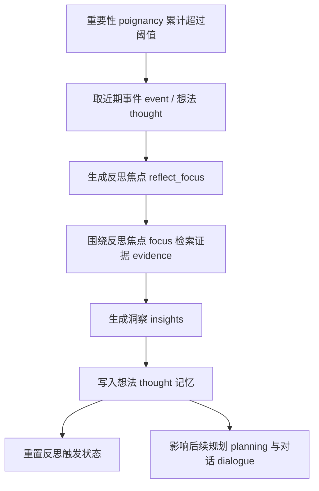

*图 21-1：智能体反思函数 `Agent.reflect()` 源码流程。反思的工程意义是把一批近期经历压缩成可复用的长期认知。*

本章的证据脚手架会读取反思阈值、四个反思相关提示词 prompt，以及 `Associate.add_node()` 的元数据 metadata 字段：

```bash
python docs/book/scaffolds/part_03/ch17_23_part03_evidence.py
```

本章相关输出如下：

```text
chapter21 reflection: poignancy_max=150, reflect_prompt_count=4, evidence_persisted_in_metadata=False
trace: docs/book/assets/chapter_21/ch21_reflection_trace.json
figure: docs/book/assets/chapter_21/ch21_reflection_pipeline.png
```

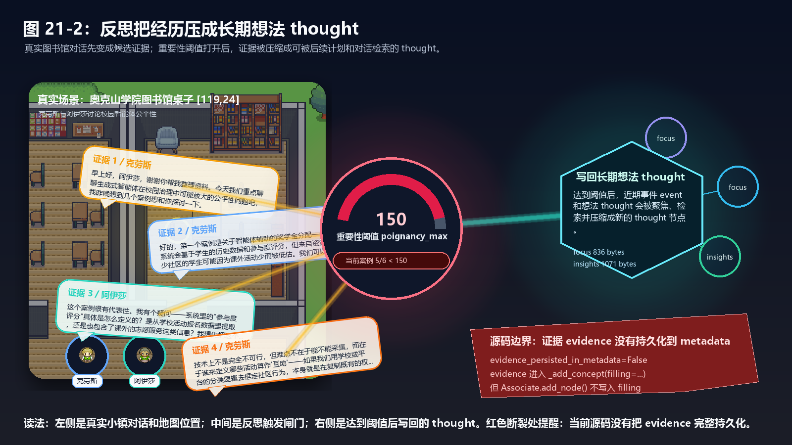

*图 21-2：反思 Reflection 把真实经历压缩成长期想法 thought。左侧是真实图书馆位置与对话碎片，中间是重要性阈值 poignancy_max 触发闸门，右侧是达到阈值后写回的想法 thought；红色断裂区标出证据 evidence 没有持久化到元数据 metadata 的源码边界。*

这行输出可以这样读：

| 输出片段 | 对应源码或文件 | 读法 |
| --- | --- | --- |
| `poignancy_max=150` | `data/config.json` 的 `agent.think.poignancy_max` | 重要性累计不到 150 时，智能体反思函数 `Agent.reflect()` 直接返回。 |
| `reflect_prompt_count=4` | `reflect_focus`、`reflect_insights`、`reflect_chat_planing`、`reflect_chat_memory` | 反思包括经历反思和聊天反思两条线，不只是生成一句总结。 |
| `evidence_persisted_in_metadata=False` | `Associate.add_node()` | 当前源码会把证据 evidence 传进 `_add_concept()`，但底层元数据 metadata 没保存 `filling` 字段；读反思结果时要知道这个证据链边界。 |

先用小镇实验里的真实状态看反思的业务数据流。10:10 的 checkpoint 中，克劳斯和阿伊莎已经完成了一段关于“校园智能体公平性”的对话，但两人的累计重要性 poignancy 还很低：

```text
阿伊莎 status.poignancy = 6
克劳斯 status.poignancy = 5
poignancy_max = 150
```

这意味着当前这一步不会触发反思 reflection。这个“不触发”很重要：反思不是每次聊天后立刻发生，而是等重要事件累积到阈值之后，再把一批近期经历压缩成长期想法 thought。此时系统里已经出现了反思将来可能读取的候选材料：

```json
{
  "agent": "克劳斯",
  "status": {"poignancy": 5},
  "associate.memory": {
    "event": ["node_1"],
    "thought": ["node_0"],
    "chat": []
  }
}
```

克劳斯的 `docstore.json` 里，`node_1` 是这次对话形成的事件 event：

```json
{
  "id": "node_1",
  "text": "克劳斯与阿伊莎以奖学金分配中\"参与度评分\"为例，用细读方法拆解校园智能体的采集边界、价值偏向与权力预设，探讨是否应量化社区隐形互助活动。",
  "metadata": {
    "node_type": "event",
    "subject": "阿伊莎",
    "predicate": "对话",
    "object": "克劳斯",
    "address": "the Ville:奥克山学院:图书馆:图书馆桌子",
    "poignancy": 5,
    "create": "20240213-10:10:00",
    "expire": "20240314-10:10:00",
    "access": "20240213-10:10:00"
  }
}
```

阿伊莎的 `docstore.json` 里，同一段对话以聊天记忆 chat memory 的形式保存：

```json
{
  "id": "node_1",
  "text": "克劳斯与阿伊莎以奖学金分配中\"参与度评分\"为例，用细读方法拆解校园智能体的采集边界、价值偏向与权力预设，探讨是否应量化社区隐形互助活动。",
  "metadata": {
    "node_type": "chat",
    "subject": "阿伊莎",
    "predicate": "对话",
    "object": "克劳斯",
    "poignancy": 6
  }
}
```

这一组真实数据把反思链路的输入、处理、输出边界都露出来了：

| 环节 | 真实数据 | 读法 |
| --- | --- | --- |
| 输入 | `status.poignancy=5/6`、`poignancy_max=150` | 当前经历还不足以触发反思，`reflect()` 会直接返回。 |
| 候选材料 | 计划想法 thought `node_0`、对话事件 event / 聊天记忆 chat `node_1` | 达到阈值后，反思会读取近期事件 event 和想法 thought；聊天缓冲 `self.chats` 会走另一条聊天反思路径。 |
| 处理 | `reflect_focus -> retrieve_focus -> reflect_insights` | 先把近期记忆变成焦点问题，再围绕问题找证据，最后生成洞察 insight。 |
| 输出 | 新增想法 thought 节点，写入关联记忆 Associate | 后续规划 planning、对话 dialogue 和关系摘要 relation summary 都可以重新检索这些想法 thought。 |
| 边界 | `evidence` 会传入 `_add_concept(..., filling=evidence)`，但元数据 metadata 不保存 `filling` | 当前实现能在内存接口层看到证据参数，但持久化文件里看不到完整证据图 evidence graph。 |

反思涉及的数据结构可以先记住这几类：

| 数据结构 | 代码形态 | 在反思链路中的作用 |
| --- | --- | --- |
| 重要性状态 `status.poignancy` | `int` | 判断是否触发反思的累计分数。 |
| 反思阈值 `poignancy_max` | `data/config.json -> agent.think.poignancy_max` | 控制反思频率，默认值是 150。 |
| 候选节点 `nodes` | `List[Concept]` | `retrieve_events()` 和 `retrieve_thoughts()` 合并后的近期记忆。 |
| 反思焦点 `focus` | `List[str]` | `reflect_focus` 生成的问题列表。 |
| 证据映射 `retrieved` | `dict[str, List[Concept]]` | `retrieve_focus(..., reduce_all=False)` 保留每个焦点对应的证据节点。 |
| 洞察结果 `thoughts` | `List[Tuple[str, List[node_id]]]` | `reflect_insights` 生成的“想法 thought + 证据 evidence”。 |
| 写回事件 `Event` | `make_event(self.name, thought, address)` | `_add_thought()` 把洞察包装成事件，再写入关联记忆 Associate。 |

## 21.2 reflect() 在 think() 中的位置

`Agent.think()` 中，醒着时执行：

```python
self.percept()
self.make_plan(agents)
self.reflect()
```

代码逻辑图：

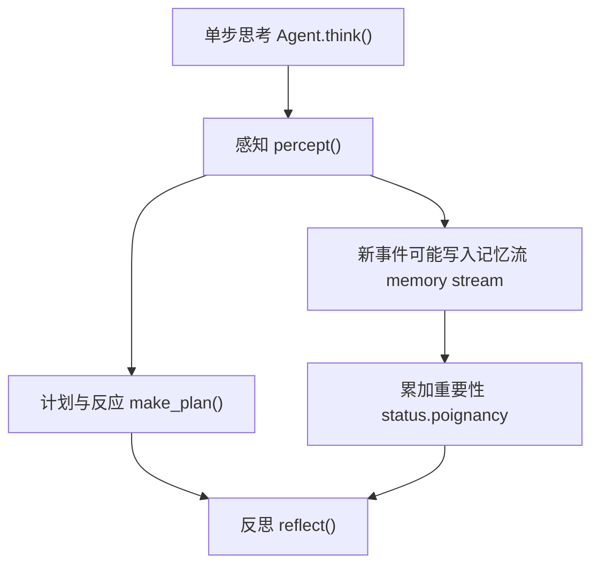

反思发生在感知和计划之后。这意味着当前仿真步 step 新感知到的重要事件，已经可能写入记忆流 memory stream，并累积了 poignancy。然后 `reflect()` 可以根据最新状态决定是否触发。反思不是行动前的必经步骤。它更像每一步末尾的认知更新。如果重要性不足，它会直接返回。如果达到阈值，它会把一段时间内的经历压缩成高层想法 thought。

## 21.3 触发条件：poignancy_max

`reflect()` 开头：

```python
if self.status["poignancy"] < self.think_config["poignancy_max"]:
    return
```

代码逻辑图：

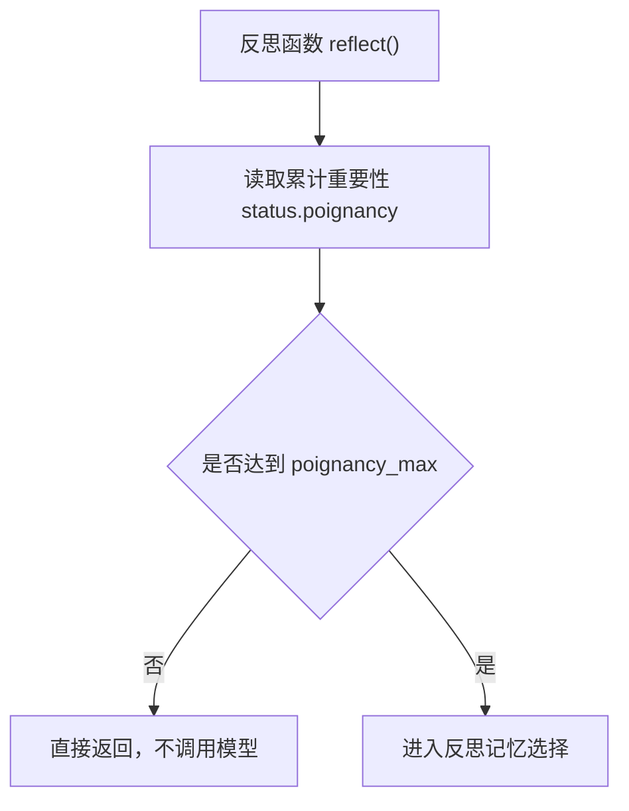

`poignancy_max` 来自 `data/config.json`：

```json
"poignancy_max": 150
```

这表示累计重要性达到 150 才会反思。累计来源主要是 `percept()`：

```python
self.status["poignancy"] += node.poignancy
```

对话、重要事件、异常行为都会提高 poignancy。普通空闲事件通常不会显著增加。这让反思成为稀缺操作。它不会每步都执行。

## 21.4 累计阈值的作用

累计阈值 `poignancy_max` 是反思频率的旋钮。它同时控制成本、认知节奏和记忆质量。

| 作用 | 机制 | 如果没有阈值会怎样 |
| --- | --- | --- |
| 控制成本 | 反思需要 `reflect_focus`、`reflect_insights` 等多次大语言模型 LLM 调用。 | 每个仿真步 step 都可能触发 25 个智能体 agent 的反思调用，运行成本会失控。 |
| 模拟阶段性内省 | 重要事件累积到一定程度后才反思。 | 角色每看到一件小事就总结，行为会显得过度内省。 |
| 降低想法噪声 | 只有足够重要的经历才会生成长期想法 thought。 | 记忆流 memory stream 会充满浅层结论，后续检索更容易被噪声淹没。 |

阈值太高，角色很久不反思；阈值太低，角色过度反思。调参时不要只看有没有触发，还要看反思生成的想法 thought 是否真的改善了后续计划 planning、对话 dialogue 和关系摘要 relation summary。

## 21.5 反思输入：事件 events + 想法 thoughts

达到阈值后，`reflect()` 取：

```python
nodes = self.associate.retrieve_events() + self.associate.retrieve_thoughts()
```

反思主要基于两类记忆：

- 事件 event。
- 想法 thought。

不直接取聊天 chat。聊天 chat 有单独处理逻辑。想法 thought 允许反思递归。过去的想法 thought 可以参与新一轮反思，形成更高层认知。如果没有节点 nodes，直接返回：

```python
if not nodes:
    return
```

代码逻辑图：

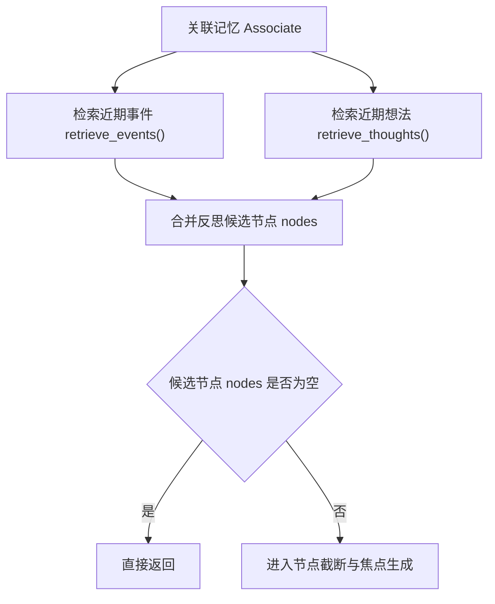

## 21.6 节点选择：max_importance

取得节点 nodes 后：

```python
nodes = sorted(nodes, key=lambda n: n.access, reverse=True)[
    : self.associate.max_importance
]
```

代码逻辑图：

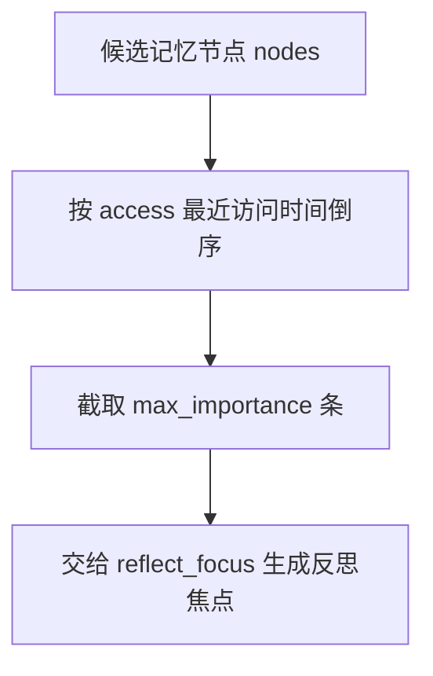

`max_importance` 名字有点容易误解。这里不是按 importance 排序，而是按 access 时间排序后截断。构造函数默认：

```python
max_importance=10
```

反思先取最近访问过的若干事件 event / 想法 thought。这一步控制输入规模。如果把所有记忆都交给模型，提示词 prompt 会过长，成本和噪声都很高。

## 21.7 日志：反思触发可观察

反思触发时会记录日志：

```python
self.logger.info(
    "{} reflect(P{}/{}) with {} concepts...".format(
        self.name,
        self.status["poignancy"],
        self.think_config["poignancy_max"],
        len(nodes),
    )
)
```

这条日志非常适合调试。它告诉你：

- 谁触发了反思。
- 当前 poignancy 是多少。
- 阈值是多少。
- 使用了多少 concepts。

如果你怀疑角色没有反思，先找这条日志。

## 21.8 第一步：生成反思焦点

反思不是直接总结节点 nodes。代码先调用：

```python
focus = self.completion("reflect_focus", nodes, 3)
```

代码逻辑图：

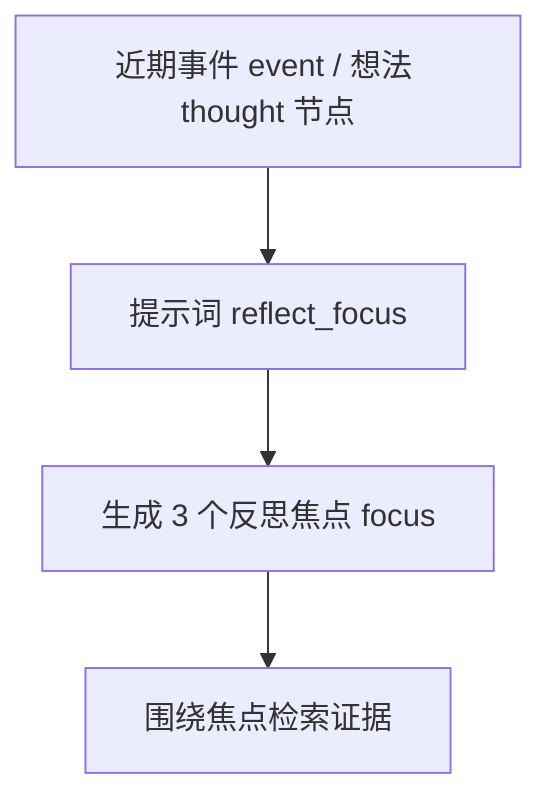

反思焦点提示词 prompt 位于 `generative_agents/data/prompts/reflect_focus.txt`。

中文原版：

```text
根据给定的记忆节点，生成反思的焦点问题。

示例：
"""
记忆节点：
1. 凯莉在厨房做早餐
2. 凯莉计划今天去超市购物
3. 凯莉昨天和朋友聊天很愉快

生成3个反思焦点问题：
"""

确保返回的数据格式遵守schema：
[
  "凯莉今天的生活重点是什么？",
  "凯莉最近的社交活动如何？",
  "凯莉的日常习惯有什么变化？"
]

参考示例，为以下记忆节点生成反思焦点问题：
"""
记忆节点：
${reference}

生成${number}个反思焦点问题：
"""

确保返回的数据格式遵守schema：
[
  "焦点问题1",
  "焦点问题2",
  "焦点问题3",
  ...
]

要求：
- 问题要基于给定的记忆节点
- 问题要简洁明了，便于引导反思
- 确保遵守返回的格式schema
```

英文版本 English version:

```text
Generate reflection focus questions from the given memory nodes.

Example:
"""
Memory nodes:
1. Kelly is making breakfast in the kitchen
2. Kelly plans to go grocery shopping today
3. Kelly had a pleasant chat with a friend yesterday

Generate 3 reflection focus questions:
"""

Make sure the returned data follows the schema:
[
  "What is Kelly's main focus today?",
  "How have Kelly's recent social activities been?",
  "What has changed in Kelly's daily habits?"
]

Following the example, generate reflection focus questions for these memory nodes:
"""
Memory nodes:
${reference}

Generate ${number} reflection focus questions:
"""

Make sure the returned data follows the schema:
[
  "focus question 1",
  "focus question 2",
  "focus question 3",
  ...
]

Requirements:
- Questions must be based on the given memory nodes
- Questions should be concise and useful for guiding reflection
- Make sure the returned format follows the schema
```

| 变量 | 来源 | 含义 |
| --- | --- | --- |
| 参考记忆 `reference` | `"\n".join(["{}. {}".format(idx, n.describe) ...])` | 把近期事件 event 和想法 thought 编号后交给模型。 |
| 数量 `number` | `nodes, 3` 中的 `3` | 要生成的反思焦点问题数量。 |

输出结构 schema 是：

```python
class reflect_focusResponse(BaseModel):
    res: List[str] = Field(description="需要深入思考的问题列表，每项为一个问题")
```

回调函数 callback 只检查至少返回 1 个问题；失败兜底 failsafe 是三条通用问题：

```python
[
    "<agent> 是谁？",
    "<agent> 住在哪里？",
    "<agent> 今天要做什么？",
]
```

这组兜底问题能让流程继续，但质量很低。真实运行中，如果 `reflect_focus` 经常落到 failsafe，后续洞察 insight 就会变成自我介绍式总结，无法形成对关系、计划或事件的具体理解。

`reflect_focus` 根据给定记忆节点生成 3 个焦点问题。例如：

```text
克劳斯今天与玛丽亚的互动说明了什么？
克劳斯近期的研究计划受到哪些影响？
克劳斯应该如何看待自己与咖啡馆居民的关系？
```

焦点问题决定后续检索方向。这比“请总结这些记忆”更可控。它把反思变成问题驱动的推理。

## 21.9 第二步：围绕焦点检索证据

生成焦点 focus 后：

```python
retrieved = self.associate.retrieve_focus(focus, reduce_all=False)
```

代码逻辑图：

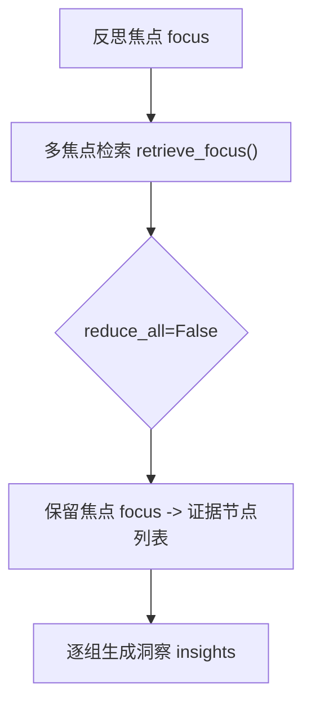

这里需要注意的可以这样理解：

```text
reduce_all=False
```

这会保留下面这些内容：

```text
每个反思焦点 focus -> 对应检索节点
```

而不是把所有结果合并。这对证据 evidence 很重要。每个洞察 insight 应该基于某个焦点问题下的相关证据。如果全部混在一起，模型更容易生成泛泛而谈的想法 thought。

## 21.10 第三步：生成洞察 insights

对每组检索节点会继续处理：

```python
for r_nodes in retrieved.values():
    thoughts = self.completion("reflect_insights", r_nodes, 5)
    for thought, evidence in thoughts:
        _add_thought(thought, evidence)
```

代码逻辑图：

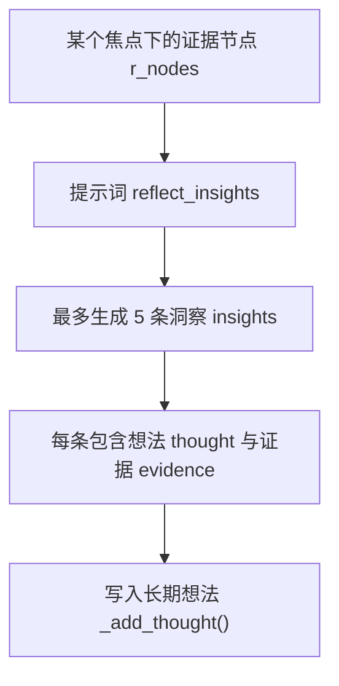

每组最多生成 5 个洞察 insights。`reflect_insights` 要求返回：

```text
洞察内容 + 相关节点编号
```

反思洞察提示词 prompt 位于 `generative_agents/data/prompts/reflect_insights.txt`。

中文原版：

```text
根据给定的记忆节点，生成反思洞察。

示例：
"""
记忆节点：
1. 凯莉在厨房做早餐
2. 凯莉计划今天去超市购物
3. 凯莉昨天和朋友聊天很愉快

生成5个反思洞察：
"""

确保返回的数据格式遵守schema：
[
  ("凯莉注重健康饮食，每天都会准备营养早餐", "1"),
  ("凯莉有良好的购物计划习惯", "2"),
  ("凯莉重视社交关系，经常与朋友保持联系", "3"),
  ("凯莉的生活很有规律，注重工作与生活的平衡", "1,2"),
  ("凯莉是一个有条理的人，善于安排时间", "1,2,3")
]

参考示例，为以下记忆节点生成反思洞察：
"""
记忆节点：
${reference}

生成${number}个反思洞察：
"""

确保返回的数据格式遵守schema：
[
  ("洞察内容", "相关节点编号"),
  ("洞察内容", "相关节点编号"),
  ...
]

要求：
- 洞察要基于给定的记忆节点
- 洞察要深刻且有启发性
- 节点编号用逗号分隔，如"1,2,3"
- 确保返回的数据格式遵守schema
```

英文版本 English version:

```text
Generate reflection insights from the given memory nodes.

Example:
"""
Memory nodes:
1. Kelly is making breakfast in the kitchen
2. Kelly plans to go grocery shopping today
3. Kelly had a pleasant chat with a friend yesterday

Generate 5 reflection insights:
"""

Make sure the returned data follows the schema:
[
  ("Kelly values healthy eating and prepares a nutritious breakfast every day", "1"),
  ("Kelly has a good habit of planning grocery shopping", "2"),
  ("Kelly values social relationships and often keeps in touch with friends", "3"),
  ("Kelly's life is regular and balances work with life", "1,2"),
  ("Kelly is organized and good at arranging time", "1,2,3")
]

Following the example, generate reflection insights for these memory nodes:
"""
Memory nodes:
${reference}

Generate ${number} reflection insights:
"""

Make sure the returned data follows the schema:
[
  ("insight content", "related node numbers"),
  ("insight content", "related node numbers"),
  ...
]

Requirements:
- Insights must be based on the given memory nodes
- Insights should be meaningful and useful
- Separate node numbers with commas, such as "1,2,3"
- Make sure the returned format follows the schema
```

| 变量 | 来源 | 含义 |
| --- | --- | --- |
| 参考记忆 `reference` | 当前焦点下的 `r_nodes` 编号列表 | 只把某个焦点问题召回的证据节点交给模型。 |
| 数量 `number` | `r_nodes, 5` 中的 `5` | 最多生成 5 条洞察 insight。 |

输出结构 schema 是：

```python
class reflect_insightsResponse(BaseModel):
    res: List[Tuple[str, str]] = Field(
        description="洞察列表，每项为 [洞察内容, 相关节点索引的逗号分隔字符串如'1,2,3'] 的元组"
    )
```

这一步的关键是回调函数 callback。模型返回的是节点编号字符串，例如 `"1,2,3"`；代码会把它转成真实节点 ID：

```python
indices = [int(i.strip()) for i in node_ids_str.split(",")]
node_ids = [nodes[i].node_id for i in indices if i < len(nodes)]
insights.append([insight.strip(), node_ids])
```

所以业务代码拿到的不是 `("洞察内容", "1,2,3")`，而是：

```python
["洞察内容", ["node_1", "node_2", "node_3"]]
```

失败兜底 failsafe 是一条最小洞察：

```python
[
    [
        "<agent> 在考虑下一步该做什么",
        [nodes[0].node_id],
    ]
]
```

这个兜底仍然保留一个证据节点。它不够深刻，但至少不会生成完全无来源的想法 thought。

可以看一个具体例子：

```text
("克劳斯认为玛丽亚愿意讨论开放性问题", "1,2,3")
```

`prompt_reflect_insights()` 会把编号转成 node_id：

```python
node_ids = [nodes[i].node_id for i in indices if i < len(nodes)]
```

这就是证据 evidence。

## 21.11 证据 evidence 的意义

证据 evidence 不是装饰。它解决两个问题。

| 作用 | 具体含义 | 没有证据时的风险 |
| --- | --- | --- |
| 可解释性 | 想法 thought 可以追溯到对应记忆节点。 | 读到一个高层判断，却不知道它来自哪段经历。 |
| 抑制幻觉 | 洞察 insight 必须绑定相关事件 event 或想法 thought。 | 模型可能从弱事实推出强关系、强承诺或强性格判断。 |

例如：

```text
玛丽亚完全信任克劳斯。
```

如果证据 evidence 只是一次普通对话，这个想法 thought 就过度推断。有证据 evidence 后，后续可以审查想法 thought 是否合理。

当前源码的边界也很明确：

| 阶段 | 代码 | 证据状态 |
| --- | --- | --- |
| 洞察生成 | `reflect_insights` 返回 `[thought, node_ids]` | 证据 evidence 已经变成真实节点 ID。 |
| 写入想法 | `_add_thought(thought, evidence)` | 证据 evidence 进入 `_add_thought()`。 |
| 加入记忆 | `self._add_concept("thought", event, filling=evidence)` | 证据 evidence 通过 `filling` 参数传入。 |
| 持久化节点 | `Associate.add_node(..., filling=None)` | 当前元数据 metadata 只保存 `node_type`、主谓宾、地址、重要性和时间字段，没有保存 `filling`。 |

`Associate.add_node()` 写入的元数据 metadata 是：

```python
metadata = {
    "node_type": node_type,
    "subject": event.subject,
    "predicate": event.predicate,
    "object": event.object,
    "address": ":".join(event.address),
    "poignancy": poignancy,
    "create": create.strftime("%Y%m%d-%H:%M:%S"),
    "expire": expire.strftime("%Y%m%d-%H:%M:%S"),
    "access": create.strftime("%Y%m%d-%H:%M:%S"),
}
```

这里没有 `filling` 或 `evidence` 字段。所以证据 evidence 已经在接口层出现，却没有完整进入持久化记忆节点。这不是读者需要猜的行为，而是当前实现的一个可改造点。

## 21.12 _add_thought()

`reflect()` 内部定义：

```python
def _add_thought(thought, evidence=None):
    event = self.make_event(self.name, thought, self.get_tile().get_address())
    return self._add_concept("thought", event, filling=evidence)
```

代码逻辑图：

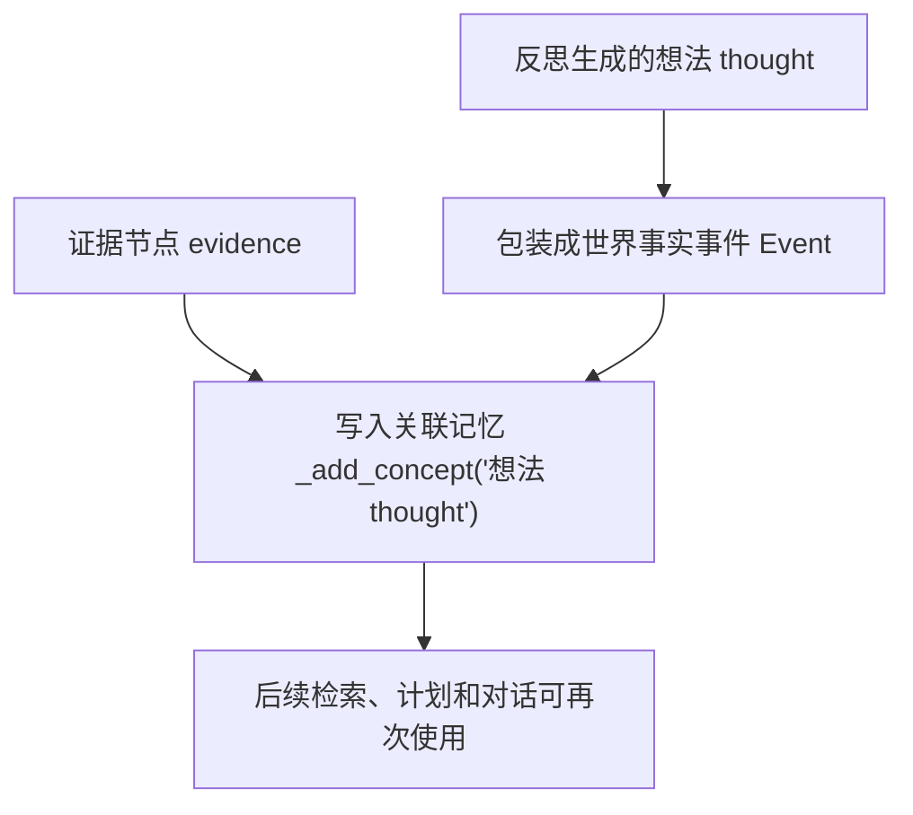

它把想法 thought 包装成事件 Event。subject 是智能体 agent 自己。address 是当前地图格子 tile 地址。然后写入 Associate，类型是 `thought`。这说明想法 thought 和事件 event 使用同一套记忆流 memory stream。后续检索 retrieval 可以同时检索事件 event 和想法 thought。这就是反思影响未来行为的关键。

如果一条反思结果是：

```text
克劳斯意识到校园智能体的公平性问题需要从数据采集边界开始分析。
```

`_add_thought()` 会先把它包装成事件 event，再写入本地索引。持久化后可以理解成下面这种结构：

```json
{
  "text": "克劳斯意识到校园智能体的公平性问题需要从数据采集边界开始分析。",
  "metadata": {
    "node_type": "thought",
    "subject": "克劳斯",
    "predicate": "此时",
    "object": "克劳斯意识到校园智能体的公平性问题需要从数据采集边界开始分析。",
    "address": "the Ville:奥克山学院:图书馆:图书馆桌子",
    "poignancy": 7,
    "create": "20240213-10:10:00",
    "expire": "20240314-10:10:00",
    "access": "20240213-10:10:00"
  }
}
```

这里的 `poignancy` 数字只是示意。真实分数由重要性评分提示词 `poignancy_event` 生成。关键在于 `node_type` 变成了 `thought`，这让它进入关联记忆 Associate 的 `memory["thought"]` 列表，后续可以被日程、对话和下一轮反思检索到。

## 21.13 想法 thought 也会被评分

`_add_concept("thought", event, ...)` 会进入 `_add_concept()`。由于 e_type 不是聊天 chat，且通常不是空闲事件，所以会调用：

```python
poignancy_event
```

想法 thought 也会有 poignancy。这有一个微妙效果：

反思生成的想法 thought 本身可能成为重要记忆。后续检索 retrieval 更容易取到它。但如果想法 thought 过多或评分过高，也可能让角色长期被某些反思主导。这需要实验观察。

## 21.14 对话反思

普通事件 event / 想法 thought 反思之后，`reflect()` 还处理聊天：

```python
if self.chats:
    recorded, evidence = set(), []
    for name, _ in self.chats:
        if name == self.name or name in recorded:
            continue
        res = self.associate.retrieve_chats(name)
        if res and len(res) > 0:
            node = res[-1]
            evidence.append(node.node_id)
    thought = self.completion("reflect_chat_planing", self.chats)
    _add_thought(f"对于 {self.name} 的计划：{thought}", evidence)
    thought = self.completion("reflect_chat_memory", self.chats)
    _add_thought(f"{self.name} {thought}", evidence)
```

这里的 `reflect_chat_planing` 保留项目源码里的拼写。英文里通常写作 `planning`，但当前文件名、方法名和调用名都是 `planing`。读源码时以项目实际名称为准。

代码逻辑图：

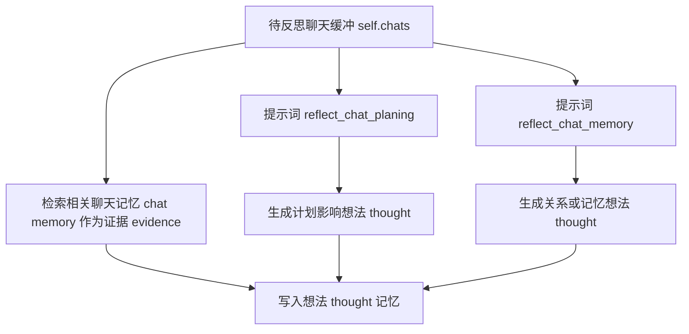

聊天计划反思提示词 prompt 位于 `generative_agents/data/prompts/reflect_chat_planing.txt`。

中文原版：

```text
对话记录：
"""
${conversation}
"""

根据以上对话记录，以 ${agent} 的视角，用一句话描述 ${agent} 是否需要记住自己的计划。
```

英文版本 English version:

```text
Conversation record:
"""
${conversation}
"""

Based on the conversation above, from ${agent}'s perspective, describe in one sentence whether ${agent} needs to remember something about their plan.
```

聊天记忆反思提示词 prompt 位于 `generative_agents/data/prompts/reflect_chat_memory.txt`。

中文原版：

```text
对话记录：
"""
${conversation}
"""

以 ${agent} 的视角，用一句话描述对话中最有趣的地方。
```

英文版本 English version:

```text
Conversation record:
"""
${conversation}
"""

From ${agent}'s perspective, describe in one sentence the most interesting part of the conversation.
```

这两个提示词 prompt 的输入相同，输出用途不同：

| 提示词 prompt | 输入 | 输出结构 schema | 写回方式 |
| --- | --- | --- | --- |
| 聊天计划反思 `reflect_chat_planing` | 当前聊天缓冲 `self.chats` 拼接成的 `conversation`、角色名 `agent` | `res: str`，一句话描述对计划的影响 | `_add_thought(f"对于 {self.name} 的计划：{thought}", evidence)` |
| 聊天记忆反思 `reflect_chat_memory` | 同一段 `conversation`、角色名 `agent` | `res: str`，一句话描述值得记住的内容 | `_add_thought(f"{self.name} {thought}", evidence)` |

两个回调函数 callback 都只是去掉首尾空白；失败兜底 failsafe 都是：

```text
<agent> 进行了一次对话
```

这说明聊天反思比普通洞察反思更轻量。它不要求模型返回证据编号，而是由代码先从聊天记忆 chat memory 中找相关节点，把这些节点 ID 作为 evidence 传给 `_add_thought()`。

它生成两类想法 thought。第一，对计划的影响。第二，对记忆或关系的影响。这让对话不仅保存为对话摘要 chat summary，还能进入更高层认知。

## 21.15 chats 从哪里来

`self.chats` 主要来自：

```python
schedule_chat()
```

对话发生后会写入下面内容：

```python
self.chats.extend(chats)
```

所以 `self.chats` 是近期待反思的原始对话片段。它不是全部聊天历史。全部聊天历史在 Associate 的聊天记忆 chat memory 中。`self.chats` 更像一个反思缓冲区。反思处理后会清空。

## 21.16 状态清零

反思末尾会执行下面动作：

```python
self.status["poignancy"] = 0
self.chats = []
```

代码逻辑图：

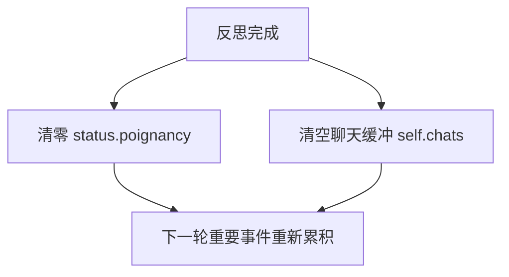

如果不清零，反思会连续触发。清零后，智能体 agent 需要重新经历重要事件，才会再次反思。`chats` 清空也说明对话反思是批处理。已经反思过的聊天不会重复生成想法 thought。

## 21.17 反思如何影响后续行为

反思影响行为的路径是：

```text
insight
  -> _add_thought()
  -> 关联记忆 Associate memory["thought"]
  -> retrieve_focus() / retrieve_thoughts()
  -> 规划 planning / 对话 dialogue / 关系摘要 relation summary / 未来反思 future reflection
```

可以看一个具体例子：

```text
克劳斯认为玛丽亚愿意讨论开放性问题。
```

这条想法 thought 后续可能影响：

- `summarize_relation()`。
- `generate_chat()`。
- 新一天 currently。
- 反思焦点。
- 计划选择。

如果想法 thought 写入但从不被检索，反思就没有行为效果。所以评价反思时不能只看有没有生成想法 thought。还要看后续是否使用。

## 21.18 调试反思的检查点

调试反思时按真实执行顺序检查。不要先问“为什么没有高层认知”，先确认反思有没有触发、有没有输入、有没有写回。

| 顺序 | 检查点 | 具体看什么 | 能定位的问题 |
| --- | --- | --- | --- |
| 1 | 重要性累计 `status["poignancy"]` | 当前值是否接近或超过 `poignancy_max`。 | 一直低于阈值，反思函数 `reflect()` 直接返回。 |
| 2 | 反思日志 | 是否出现 `<agent> reflect(P.../...) with ... concepts`。 | 不确定反思是否真正进入模型调用阶段。 |
| 3 | 候选节点 `nodes` | `retrieve_events()` 和 `retrieve_thoughts()` 是否返回相关记忆。 | 没有事件 event / 想法 thought，或候选材料偏离关键经历。 |
| 4 | 节点截断 | `max_importance` 截断后剩下哪些节点。 | 重要经历被最近访问的无关节点挤掉。 |
| 5 | 反思焦点 `reflect_focus` | 焦点 focus 是否具体指向人物、计划、事件或关系。 | 焦点过泛，后续洞察 insight 泛化。 |
| 6 | 证据检索 `retrieve_focus(..., reduce_all=False)` | 每个焦点是否召回相关证据 evidence。 | 焦点问题有了，但证据节点不相关。 |
| 7 | 洞察输出 `reflect_insights` | 是否返回“洞察 + 节点编号”。 | 模型没有按输出结构 schema 返回，或证据编号越界。 |
| 8 | 想法写回 `_add_thought()` | `Associate.memory["thought"]` 是否新增节点 node。 | 生成了洞察，但没有进入长期记忆。 |
| 9 | 聊天反思 | `self.chats` 是否存在，`reflect_chat_planing` 和 `reflect_chat_memory` 是否执行。 | 对话发生了，但没有形成计划影响或记忆影响。 |
| 10 | 状态清零 | `status["poignancy"] = 0`、`self.chats = []` 是否发生。 | 反思后重复触发，或聊天被重复反思。 |
| 11 | 后续使用 | 日程 planning、对话 dialogue、关系摘要 relation summary 是否检索到新想法 thought。 | 想法存在于记忆流 memory stream，但没有行为效果。 |

调试链路图如下：

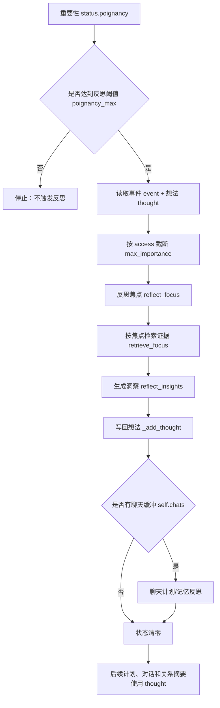

日志里最关键的是这一行：

```text
<agent> reflect(P.../...) with ... concepts
```

它把角色名、当前重要性分数、阈值和候选概念 concept 数量放在一起。没有这行日志，就不要急着调 prompt，先看阈值和候选记忆。

## 21.19 反思失败模式

反思失败要沿“触发、输入、焦点、证据、洞察、写回、使用”定位。

| 失败表现 | 可能原因 | 检查位置 | 修正方向 |
| --- | --- | --- | --- |
| 长时间不反思 | 阈值 `poignancy_max` 过高，或事件重要性 poignancy 评分太低。 | `status["poignancy"]`、`poignancy_max`、`poignancy_event` / `poignancy_chat` 输出。 | 降低阈值；检查重要事件是否被正确评分；增加触发场景。 |
| 小事过度反思 | 阈值过低，或普通事件被打高分。 | 每步日志、`status["poignancy"]` 变化。 | 提高阈值；降低空闲或常规事件的重要性评分。 |
| 输入节点不相关 | `nodes` 只按最近访问时间 access 截断，不一定按重要性排序。 | `retrieve_events()`、`retrieve_thoughts()`、`max_importance` 截断结果。 | 调整节点选择策略，把重要性 importance 和最近性 recency 结合起来。 |
| 反思焦点过泛 | `reflect_focus` 生成的问题像自我介绍或日常总结。 | `reflect_focus` 输出和失败兜底 failsafe 次数。 | 强化 prompt 对具体人物、计划、地点、冲突的要求。 |
| 证据检索不准 | 焦点问题没有召回相关事件。 | `retrieve_focus(focus, reduce_all=False)` 返回的每组证据 evidence。 | 调整检索 query、topk、权重；过滤过期或低相关节点。 |
| 洞察过度推断 | 从一次弱对话推出强关系、强承诺或稳定性格。 | `reflect_insights` 输出和节点编号。 | 增加“不要超过证据”的要求；引入洞察质量检查。 |
| 证据链断在持久化 | `filling=evidence` 没进入元数据 metadata。 | `Associate.add_node()`、`docstore.json` 的元数据 metadata。 | 在元数据 metadata 中保存 `evidence` 或建立单独证据图 evidence graph。 |
| 想法没有行为效果 | 想法 thought 写入了，但后续日程或对话没有检索到。 | `memory["thought"]`、后续 `retrieve_focus()`、`generate_chat` / `schedule_daily` 提示词 prompt。 | 调整检索焦点；提高相关想法 thought 的可召回性；在提示词 prompt 中显式引用近期高层想法。 |

## 21.20 反思实验怎么设计

反思实验要把“触发反思”和“观察行为变化”分开设计。克劳斯/玛丽亚 Klaus/Maria 是观察关系反思的好案例，也可以沿用克劳斯/阿伊莎的校园公平性讨论做计划反思。

| 实验目标 | 修改变量 | 运行方式 | 观察对象 | 预期现象 |
| --- | --- | --- | --- | --- |
| 观察阈值触发 | `poignancy_max` | 分别运行高阈值和低阈值版本。 | 反思日志、`status.poignancy`、新增想法 thought 数量。 | 低阈值更快触发反思，高阈值需要更多重要事件。 |
| 观察关系反思 | Klaus/Maria 的相遇次数和对话内容 | 运行开启反思 reflection on / 关闭反思 reflection off 两个版本。 | `summarize_relation`、后续 `generate_chat`、双方 `memory["thought"]`。 | 开启反思后，下一次关系摘要更具体，对话更有历史感。 |
| 观察计划反思 | 克劳斯/阿伊莎讨论后的后续日程 | 保持对话相同，比较是否触发 `reflect_chat_planing`。 | `reflect_chat_planing` 输出、后续日程 schedule。 | 反思应把讨论中的计划影响写成 thought，并可能影响后续安排。 |
| 观察证据质量 | 反思输入节点集合 `nodes` | 手动保留/移除关键事件 event。 | `reflect_focus`、`reflect_insights`、证据编号 evidence。 | 关键证据缺失时，洞察更泛或更容易过度推断。 |
| 观察持久化边界 | 是否保存 `filling/evidence` | 比较当前实现和保存证据 evidence 的改造版。 | `docstore.json` 元数据 metadata、可解释性输出。 | 保存证据 evidence 后，可以从想法 thought 追溯到原始节点。 |
| 观察后续行为 | 新增想法 thought 是否被召回 | 反思后继续运行多步仿真。 | `retrieve_focus()`、日程提示词 prompt、对话提示词 prompt、行为变化。 | 有效反思不只产生文本，还会影响计划、对话或关系。 |

Klaus/Maria 实验可以重点比较下面这些结果：

- 两人是否相遇。
- 是否对话。
- 对话摘要是否写入聊天记忆 chat memory。
- 反思后是否生成关于彼此的想法 thought。
- 下次相遇时关系摘要是否更具体。
- 后续是否更容易主动聊天。

如果开启反思 reflection，理想结果是：

```text
克劳斯不只是记得和玛丽亚聊过。
他还形成对玛丽亚兴趣、性格或关系可能性的高层理解。
```

这就是反思 reflection 的行为价值。它不是把聊天摘要再写一遍，而是把经历压成可迁移的认知。

## 21.21 可改进方向

反思模块可以从证据、类型、质量、遗忘和触发方式几个方向增强。

| 当前限制 | 改进做法 | 获得的能力 |
| --- | --- | --- |
| 证据 evidence 没有完整持久化 | 保存完整证据图 evidence graph，把想法 thought 与来源节点关联起来。 | 可以追溯一个想法来自哪些事件、聊天和旧想法。 |
| 想法 thought 类型混在一起 | 区分自我想法 self thought、关系想法 relation thought、目标想法 goal thought、世界想法 world thought、规范想法 norm thought。 | 检索和使用时可以按类型选择，不必把所有高层认知混在一个桶里。 |
| 洞察 insight 质量不可控 | 增加反思质量评估，用模型或规则检查洞察是否被证据支持。 | 减少从弱证据推出强结论的情况。 |
| 错误想法 thought 难以修正 | 引入反思遗忘 reflection forgetting 或信念修订 belief revision。 | 过时、不正确或被新证据推翻的想法可以降低权重或被替换。 |
| 只能被重要性触发 | 增加主动反思 active reflection，例如日末、睡前、计划失败、冲突后触发。 | 角色能在关键时间点整理经验，而不是只依赖累计分数。 |
| 反思和任务学习边界不清 | 区分经验归纳式反思 reflection 与反思式学习 Reflexion。 | 第三部分讲小镇认知，后续前沿章节再讲失败驱动的自我改进。 |

## 21.22 本章小结

论文中的反思 Reflection 在源码层落到三件事：什么时候触发、用了哪些证据、生成的想法 thought 是否真的改变后续行为。

| 本章内容 | 核心结论 |
| --- | --- |
| 调用位置 | `reflect()` 在醒着智能体 agent 的每步思考末尾调用。 |
| 触发条件 | `status["poignancy"]` 与 `poignancy_max` 控制是否反思。 |
| 输入材料 | 反思输入是近期事件 event 和想法 thought。 |
| 节点选择 | 节点按访问时间 access 选择，数量受 `max_importance` 限制。 |
| 生成问题 | `reflect_focus` 先生成反思问题。 |
| 检索证据 | `retrieve_focus(..., reduce_all=False)` 为每个问题保留证据集合。 |
| 生成想法 thought | 反思洞察提示词 `reflect_insights` 生成想法 thought 和证据 evidence。 |
| 写回记忆 | `_add_thought()` 把想法 thought 写回关联记忆 Associate。 |
| 对话反思 | 对话会生成计划影响和记忆影响两类想法 thought。 |
| 状态清理 | 反思结束后清零重要性 poignancy 和聊天缓存 chats。 |
| 评价标准 | 反思的价值要看想法 thought 是否影响后续计划、对话和关系。 |

下一章讲模型适配：深入 `LLMModel`、Ollama、OpenAI、MiniMax、Pydantic 输出结构 schema，以及为什么结构化输出是这个项目能稳定运行的关键。

## 参考资料

- Local source: `generative_agents/modules/agent.py`
- Local source: `generative_agents/modules/prompt/scratch.py`
- Local source: `generative_agents/modules/memory/associate.py`
- Local prompts: `generative_agents/data/prompts/reflect_focus.txt`
- Local prompts: `generative_agents/data/prompts/reflect_insights.txt`
- Local prompts: `generative_agents/data/prompts/reflect_chat_planing.txt`
- Local prompts: `generative_agents/data/prompts/reflect_chat_memory.txt`
- Local scaffold: `docs/book/scaffolds/part_03/ch17_23_part03_evidence.py`
- Local trace: `docs/book/assets/chapter_21/ch21_reflection_trace.json`
