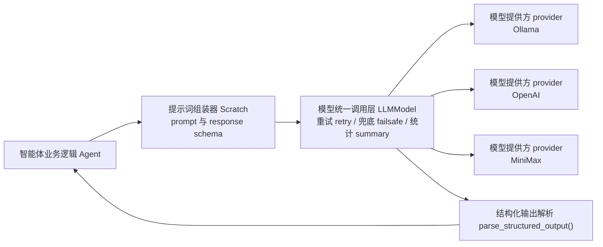

# 第 22 章 模型适配：Ollama、MiniMax、OpenAI 与结构化输出

## 22.1 核心问题

Generative Agents 的智能体行为最终由大语言模型 LLM 生成。但项目不是简单调用一个 ChatGPT 接口。它需要处理：

- 本地 Ollama 模型。
- OpenAI 兼容接口。
- MiniMax 推理模型。
- 向量嵌入 embedding 模型。
- Pydantic 结构化输出。
- `<think>` 思考过程过滤。
- 失败重试和兜底结果 failsafe。

这就是模型适配层。模型适配层主要看四个位置。先把代码名翻译清楚：

| 代码位置 | 中文意思 | 本章关注点 |
| --- | --- | --- |
| `generative_agents/modules/model/llm_model.py` | 大模型统一调用层。 | 把 Ollama、OpenAI、MiniMax 等不同模型提供方 provider 包装成统一接口。 |
| `generative_agents/modules/storage/index.py` | 向量索引和向量嵌入 embedding 接入。 | 为记忆检索提供文本向量化和相似度搜索能力。 |
| `generative_agents/modules/prompt/scratch.py` | 提示词 prompt 与结构化输出定义。 | 定义每类任务需要什么输入、希望模型返回什么结构。 |
| `generative_agents/data/config.json` | 模型与运行配置。 | 控制模型提供方 provider、模型名、向量嵌入 embedding、重试、输出解析等运行参数。 |

本章重点聚焦以下八个问题：

1. 智能体 Agent 如何调用模型？
2. `Scratch` 如何定义结构化输出 schema？
3. `LLMModel.completion()` 做了哪些统一处理？
4. Ollama、OpenAI、MiniMax 三种模型提供方 provider 有何差异？
5. `<think>` 标签为什么要过滤？
6. 向量嵌入 embedding 模型如何接入记忆系统？
7. 当前配置如何影响运行成本和质量？
8. 模型适配层有哪些风险和升级方向？



*图 22-1：智能体 Agent -> 提示词组装器 Scratch -> 模型统一调用层 LLMModel -> 模型提供方 provider 的调用链。模型适配层的价值在于把不同提供商的输出收敛成项目可执行的数据。*

本章的证据脚手架会离线模拟结构化输出解析，不调用真实 API：

```bash
python docs/book/scaffolds/part_03/ch17_23_part03_evidence.py
```

本章相关输出如下：

```text
chapter22 model: think_provider=minimax, embedding_provider=minimax, falsey_response_boundary=8
trace: docs/book/assets/chapter_22/ch22_model_adapter_trace.json
figure: docs/book/assets/chapter_22/ch22_model_adapter_chain.png
```


*图 22-2：模型适配层的真实输入与输出。左侧是模型提供方 provider 可能返回的原始文本，右侧是结构化解析函数 `parse_structured_output()` 交给业务代码的结果；这里的工程边界来自 `llm_model.py`。*

这行输出可以这样读：

| 输出片段 | 对应源码或文件 | 读法 |
| --- | --- | --- |
| `think_provider=minimax` | `data/config.json` 的 `agent.think.llm.provider` | 当前行为生成默认走 MiniMax 模型提供方 provider。 |
| `embedding_provider=minimax` | `data/config.json` 的 `agent.associate.embedding.provider` | 当前记忆检索的向量嵌入 embedding 也走 MiniMax，但它和 LLM provider 是两套配置。 |
| `falsey_response_boundary=8` | `LLMModel.completion()` 的 `return response or failsafe` | 如果模型解析结果是 `0` 这类假值，源码会返回兜底结果 failsafe；脚手架用 `0 or 8` 把这个边界显式打出来。 |

## 22.2 模型调用总链路

一个模型调用通常从 `Agent.completion()` 开始。例如：

```python
self.completion("wake_up")
```

调用链可以这样概括：

```text
Agent.completion("wake_up")
  -> Scratch.prompt_wake_up()
  -> Result(prompt, callback, failsafe, return_type)
  -> LLMModel.completion()
  -> provider._completion()
  -> parse_structured_output()
  -> callback
  -> 返回业务结果
```

这里有几个关键角色。智能体 `Agent` 决定要执行哪个认知任务。提示词组装器 `Scratch` 构造提示词 prompt，并定义输出结构。模型统一调用层 `LLMModel` 负责重试、统计、失败兜底。模型提供方 provider 子类负责具体 API 调用。这种分层很重要。它让业务逻辑不用关心模型 API 细节。

## 22.3 Result：prompt 调用契约

`Scratch` 中定义：

```python
Result = namedtuple("Result", ["prompt", "callback", "failsafe", "return_type"])
```

每个 `prompt_*` 方法都返回提示词契约 `Result`。四个字段分别是：

- `prompt`：最终发给模型的提示词文本。
- `callback`：模型输出后的业务校验或转换。
- `failsafe`：失败时的兜底结果 failsafe。
- `return_type`：Pydantic 结构化输出 schema。

例如 `prompt_wake_up()` 返回：

```python
class wakeupResponse(BaseModel):
    res: int
```

并提供 callback：

```python
if value > 11:
    value = 11
```

这说明结构化输出不仅靠 prompt，还靠 schema 和 callback 共同约束。

## 22.4 Pydantic schema 的作用

项目大量使用 Pydantic response model。例如：

```python
class schedule_dailyResponse(BaseModel):
    res: dict[str, str]
```

再看一个更完整的具体例子：

```python
class reflect_insightsResponse(BaseModel):
    res: List[Tuple[str, str]]
```

这些 schema 解决一个核心问题：

```text
agent 系统需要的不是漂亮文本，而是可执行数据。
```

起床时间必须是 int。是否聊天必须是 bool。日程必须是 dict。反思洞察必须能解析成列表。如果模型输出格式不稳定，整个仿真会断。因此，Pydantic schema 是项目工程化的关键。

## 22.5 LLMModel 基类

`LLMModel` 位于：

```text
generative_agents/modules/model/llm_model.py
```

初始化阶段会保存下面这些运行状态：

```python
self._api_key
self._base_url
self._model
self._summary
self._handle
self._enabled
```

`_summary` 记录调用统计。格式大致是：

```text
S:<success>,F:<failure>/R:<request>
```

`get_summary()` 会返回每类 caller 的成功失败情况。这对长时间仿真很重要。如果某个模型频繁解析失败，可以从 summary 看出来。

## 22.6 LLMModel.completion()

统一调用入口可以定位到：

```python
def completion(self, prompt, retry=10, callback=None, failsafe=None, return_type=None, caller="llm_normal", **kwargs)
```

它做几件事。第一，最多重试 10 次。第二，调用 `_completion()` 获取模型输出。第三，如果有 callback，就执行 callback。第四，如果结果为 `None`，继续重试。第五，最终失败时返回兜底结果 failsafe。第六，记录成功失败统计。这让业务层可以比较放心地调用模型。

这里还有一个源码边界。函数最后返回的是：

```python
return response or failsafe
```

这意味着只要 `response` 是 Python 假值，就会走兜底结果。`None` 走 failsafe 是合理的，但 `0`、`False`、空字符串也会被当作假值。脚手架输出里的 `falsey_response_boundary=8` 就是在展示这个边界：如果起床时间解析成 `0`，而 `wake_up` 的 failsafe 是 `8`，最终返回会变成 `8`。因此实验时不能只看仿真是否跑完，还要看 LLM summary 中失败次数、结构化输出是否合理，以及是否出现大量兜底行为。

## 22.7 OpenAI provider

`OpenAILLMModel` 使用 `magentic.OpenaiChatModel`：

```python
return OpenaiChatModel(self._model, api_key=self._api_key, base_url=self._base_url)
```

然后通过 `@prompt` 装饰器定义返回类型：

```python
@prompt("{_prompt}", model=self._handle)
def response(_prompt: str) -> return_type: ...
output = response(_prompt).res
```

这个 provider 适用于 OpenAI 兼容接口。README 中也说明，如果要调用其他 OpenAI 兼容 API，可以把 `provider` 改为 `openai`，并配置：

- model。
- api_key。
- base_url。

OpenAI provider 的优势是接口成熟。风险是成本、网络和供应商差异。

## 22.8 Ollama provider

当前配置默认使用 Ollama。`OllamaLLMModel` 直接调用：

```text
/api/chat
```

请求参数主要包括，需要逐项查看：

```python
{
    "model": self._model,
    "messages": messages,
    "stream": False,
    "think": False,
    "options": {"temperature": temperature}
}
```

如果有 return_type，会生成 JSON schema：

```python
schema = return_type.model_json_schema()
response_format = schema
```

然后放到 Ollama 请求的 `format` 字段：

```python
params["format"] = response_format
```

这让 Ollama 模型尽量输出符合 schema 的 JSON。对于本地实验来说，这是非常关键的能力。

## 22.9 `<think>` 标签过滤

Ollama 和 MiniMax provider 都会过滤：

```python
re.sub(r"<think>.*?</think>", "", ret, flags=re.DOTALL).strip()
```

原因是一些推理模型会在输出中包含：

```text
<think>...</think>
```

如果不去掉，后续 JSON 解析会失败，或者对话内容会混入思考过程。对于 agent 系统来说，模型内部思考不应该进入：

- 对话文本。
- 日程。
- 反思 thought。
- 结构化 JSON。

因此过滤 `<think>` 是必要的工程处理。

## 22.10 MiniMax provider

`MiniMaxLLMModel` 适配 MiniMax OpenAI 兼容接口。README 和源码都说明，MiniMax-M 系列不支持严格的 `json_schema` response format。因此项目采用折中方案。如果有 return_type：

```python
schema = return_type.model_json_schema()
prompt = f"{prompt}\n\n请只输出一个符合下面 JSON Schema 的 JSON 对象..."
response_format = {"type": "json_object"}
```

结构化输出的做法是：

```text
把 schema 写进 prompt
  + 启用 json_object
```

然后再用 `parse_structured_output()` 解析。这是一种现实工程做法。不同 provider 对结构化输出支持不同，适配层必须分别处理。

## 22.11 parse_structured_output()

结构化解析函数可以定位到：

```python
parse_structured_output(ret, return_type, context)
```

执行逻辑可以这样理解：

1. 如果没有 return_type，直接返回原始文本。
2. 尝试 `json.loads(ret)`。
3. 如果失败，用正则从文本中提取 `{...}`。
4. 再尝试把提取出的片段解析为 JSON。
5. 如果 parsed 不是 dict 或没有 `res`，包成 `{"res": parsed}`。
6. 用 Pydantic 校验并返回 `.res`。
7. 如果都失败，返回原始文本。

这个函数增强了容错性。模型多输出一点解释，仍然可能被解析。但也有风险。如果解析失败返回原始文本，而业务 callback 预期的是 list 或 dict，就可能在 callback 阶段失败，并触发重试或 failsafe。所以结构化输出稳定性仍然取决于模型能力和 prompt 约束。

## 22.12 create_llm_model()

provider 创建入口是：

```python
create_llm_model(llm_config)
```

当前支持下面这些能力：

```python
if provider == "ollama":
    return OllamaLLMModel(llm_config)
elif provider == "minimax":
    return MiniMaxLLMModel(llm_config)
elif provider == "openai":
    return OpenAILLMModel(llm_config)
```

不支持的 provider 会抛：

```python
NotImplementedError
```

这让新增 provider 比较清晰。如果要增加 Qwen API、DeepSeek API、Azure OpenAI、Claude，需要新增对应子类或复用 OpenAI 兼容接口。

## 22.13 embedding provider

记忆检索还需要 embedding。embedding 由 `storage/index.py` 中的 `LlamaIndex` 初始化。支持：

- `hugging_face`
- `ollama`
- `minimax`
- `openai`

当前配置使用 MiniMax embedding：

```json
"embedding": {
    "provider": "minimax",
    "model": "embo-01",
    "base_url": "https://api.minimax.chat/v1",
    "api_key": "",
    "group_id": ""
}
```

这说明 LLM provider 和 embedding provider 可以分离，也可以都指向 MiniMax。模型负责生成行为，embedding 负责记忆检索。两者不一定来自同一供应商，但必须分别配置成功。

## 22.14 OllamaHttpEmbedding

项目自己实现了 `OllamaHttpEmbedding`。它调用：

```text
/api/embed
```

请求内容可以这样组织：

```python
{
    "model": self.model_name,
    "input": text
}
```

然后返回下面结果，用于验证前文判断：

```python
response.json()["embeddings"]
```

这个类让 LlamaIndex 可以使用 Ollama 本地 embedding。这对完全本地部署很关键。如果 LLM 本地化，但 embedding 还走远端 API，成本和隐私仍然没有完全解决。

## 22.15 当前配置与 README 的关系

README 记录了项目更新，例如默认语言模型和 embedding 模型的变化。当前工作区实际配置以：

```text
generative_agents/data/config.json
```

为准。在当前工作区配置文件中，LLM model 是：

```text
MiniMax-M3
```

embedding model 是：

```text
embo-01
```

读者运行时应检查自己的 `config.json`，不要只看 README 描述。开源项目在 fork、PR 和本地修改后，README 与配置可能存在时间差。本书源码分析以当前工作区文件为准。

## 22.16 模型质量对仿真的影响

模型质量会影响几乎所有模块。日程生成需要模型能输出合理 24 小时表。对话生成需要模型能结合角色、场景和记忆。反思需要模型能从证据中生成不过度推断的 insight。结构化输出需要模型遵守 schema。重要性评分需要模型稳定给 1 到 10 的整数。如果模型太弱，可能出现：

- JSON 格式错误。
- 日程重复。
- 对话复读。
- 角色语气不一致。
- 反思泛泛而谈。
- 派对时间地点丢失。
- 对话过度礼貌。

因此，本地小模型能降低成本，但不一定保证质量。实验时要记录模型名称和量化版本。

## 22.17 成本与速度

多智能体仿真模型调用很多。每个 agent 可能调用：

- wake_up。
- schedule_init。
- schedule_daily。
- schedule_decompose。
- poignancy_event。
- decide_chat。
- generate_chat。
- summarize_chats。
- reflect_focus。
- reflect_insights。

25 个 agent 运行多个 step，调用量会迅速增长。本地模型的优势是成本低。缺点是速度受硬件限制。远端大模型的优势是质量和速度可能更稳定。缺点是成本和网络。读者做实验时可以采用策略：

```text
小模型 + 少量 agent 调试
大模型 + 关键实验验证
```

## 22.18 失败与 failsafe

每个 prompt 通常有 failsafe。例如 wake_up 失败时返回 8。schedule_init 失败时返回默认日程。decide_chat 失败时返回 False。failsafe 保证仿真继续。但它也会改变行为。如果 decide_chat 经常失败返回 False，小镇会变得不社交。如果 schedule_daily 失败返回默认读书日程，角色个性会消失。所以评估模型时，要关注：

- LLM summary 中失败数。
- 日志中 `LLMModel.completion()` 错误。
- 结果中是否出现大量兜底结果 failsafe 行为。

## 22.19 模型适配的边界

当前模型适配层有几个边界。第一，模型提供方 provider 数量有限，只内置 Ollama、MiniMax、OpenAI。第二，并发能力有限，当前智能体 agent 按顺序调用模型，没有异步并发。第三，结构化输出 schema 支持依赖模型提供方 provider。Ollama 和 MiniMax 的结构化输出处理不同，其他 provider 可能还要适配。第四，结构化输出解析函数 `parse_structured_output()` 容错有限，复杂错误 JSON 仍然可能解析失败。第五，模型输出质量不做二次评审，例如反思是否被证据支持，当前没有自动评审 judge。这些边界是后续升级方向。

## 22.20 可改进方向

模型层可以从六个方向升级。第一，增加模型提供方 provider 抽象，统一 OpenAI 兼容接口 OpenAI compatible、Ollama 原生接口 Ollama native、Anthropic、DeepSeek、Qwen API 等。第二，引入异步并发，在不破坏仿真顺序的前提下并发非相互依赖调用。第三，引入模型路由，简单任务用小模型，反思和对话用强模型。第四，引入输出修复，结构化解析失败时，用专门修复提示词 repair prompt 修 JSON。第五，引入质量评审，对反思、对话摘要、计划进行自动校验。第六，引入缓存，对重复提示词 prompt 或低风险 prompt 做缓存，降低成本。这些升级会让 Generative Agents 更适合长期实验。

## 22.21 本章小结

模型适配层决定这个项目能不能稳定运行。智能体 agent 系统需要的不是漂亮文本，而是可以被代码继续执行的结构化结果。

| 本章内容 | 核心结论 |
| --- | --- |
| 调用链路 | 智能体补全函数 `Agent.completion()` -> 提示词函数 `Scratch.prompt_*()` -> 模型统一调用层 `LLMModel.completion()` -> 模型提供方 provider。 |
| 提示词契约 `Result` | 它封装提示词 prompt、回调 callback、兜底结果 failsafe 和返回类型 return_type。 |
| 结构化输出 | Pydantic 结构化输出 schema 是稳定运行的核心，不是附加装饰。 |
| 统一入口 | `LLMModel.completion()` 负责重试 retry、回调 callback、兜底 failsafe 和统计。 |
| OpenAI | OpenAI 模型提供方 provider 使用 magentic 的 OpenAI chat model。 |
| Ollama | Ollama 模型提供方 provider 调用 `/api/chat`，并通过 `format` 传 JSON schema。 |
| MiniMax | MiniMax 模型提供方 provider 把 JSON schema 写进提示词 prompt，并启用 `json_object`。 |
| 推理标签清理 | Ollama 和 MiniMax 模型提供方 provider 会过滤 `<think>` 标签。 |
| 解析校验 | `parse_structured_output()` 负责解析 JSON、提取片段并用 Pydantic 校验。 |
| 向量嵌入 embedding 分离 | 向量嵌入提供方 embedding provider 与大语言模型提供方 LLM provider 分离，支持 HuggingFace、Ollama、MiniMax、OpenAI。 |
| 行为影响 | 模型质量会直接影响日程、对话、反思、检索和评价。 |

下一章讲回放系统：看断点 checkpoint 如何压缩成 `movement.json` 和 `simulation.md`，以及前端渲染引擎 Phaser 如何展示小镇。

## 参考资料

- Local source: `generative_agents/modules/model/llm_model.py`
- Local source: `generative_agents/modules/storage/index.py`
- Local source: `generative_agents/modules/prompt/scratch.py`
- Local config: `generative_agents/data/config.json`
- Local docs: `docs/ollama.md`
- Local README: `README.md`
- Local scaffold: `docs/book/scaffolds/part_03/ch17_23_part03_evidence.py`
- Local trace: `docs/book/assets/chapter_22/ch22_model_adapter_trace.json`
