# 第 22 章 模型适配：Ollama、MiniMax、OpenAI 与结构化输出

## 22.1 核心问题

生成式智能体 Generative Agents 的智能体行为最终由大语言模型 LLM 生成。但项目不是简单调用一个 ChatGPT 接口。它需要处理：

- 本地 Ollama 模型。
- OpenAI 兼容接口。
- MiniMax 推理模型。
- 向量嵌入 embedding 模型。
- Pydantic 结构化输出。
- `<think>` 思考过程过滤。
- 失败重试和兜底结果 failsafe。

这就是模型适配层。模型适配层主要看四个位置。先把代码名翻译清楚：

| 代码位置 | 中文意思 | 本章关注点 |
| --- | --- | --- |
| `generative_agents/modules/model/llm_model.py` | 大模型统一调用层。 | 把 Ollama、OpenAI、MiniMax 等不同模型提供方 provider 包装成统一接口。 |
| `generative_agents/modules/storage/index.py` | 向量索引和向量嵌入 embedding 接入。 | 为记忆检索提供文本向量化和相似度搜索能力。 |
| `generative_agents/modules/prompt/scratch.py` | 提示词 prompt 与结构化输出定义。 | 定义每类任务需要什么输入、希望模型返回什么结构。 |
| `generative_agents/data/config.json` | 模型与运行配置。 | 控制模型提供方 provider、模型名、向量嵌入 embedding、重试、输出解析等运行参数。 |

本章重点聚焦以下八个问题：

1. 智能体 Agent 如何调用模型？
2. `Scratch` 如何定义结构化输出 schema？
3. `LLMModel.completion()` 做了哪些统一处理？
4. Ollama、OpenAI、MiniMax 三种模型提供方 provider 有何差异？
5. `<think>` 标签为什么要过滤？
6. 向量嵌入 embedding 模型如何接入记忆系统？
7. 当前配置如何影响运行成本和质量？
8. 模型适配层有哪些风险和升级方向？

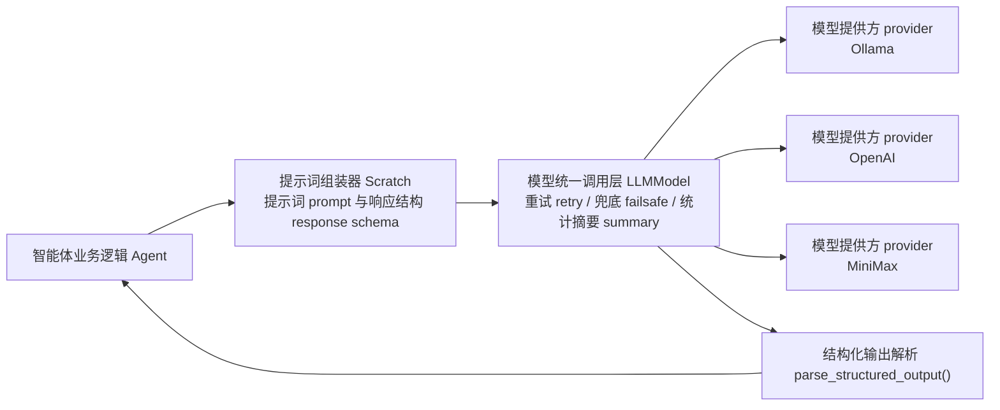

*图 22-1：智能体 Agent -> 提示词组装器 Scratch -> 模型统一调用层 LLMModel -> 模型提供方 provider 的调用链。模型适配层的价值在于把不同提供商的输出收敛成项目可执行的数据。*

本章的证据脚手架会离线模拟结构化输出解析，不调用真实接口 API：

```bash
python docs/book/scaffolds/part_03/ch17_23_part03_evidence.py
```

本章相关输出如下：

```text
chapter22 model: think_provider=minimax, embedding_provider=minimax, falsey_response_boundary=8
trace: docs/book/assets/chapter_22/ch22_model_adapter_trace.json
figure: docs/book/assets/chapter_22/ch22_model_adapter_chain.png
```

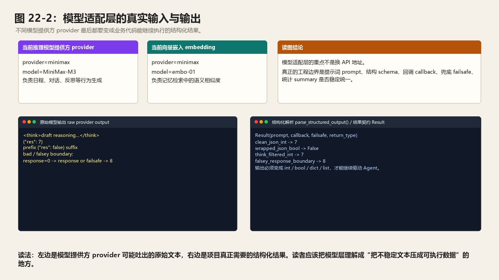

*图 22-2：模型适配层的真实输入与输出。左侧是模型提供方 provider 可能返回的原始文本，右侧是结构化解析函数 `parse_structured_output()` 交给业务代码的结果；这里的工程边界来自 `llm_model.py`。*

这行输出可以这样读：

| 输出片段 | 对应源码或文件 | 读法 |
| --- | --- | --- |
| `think_provider=minimax` | `data/config.json` 的 `agent.think.llm.provider` | 当前行为生成默认走 MiniMax 模型提供方 provider。 |
| `embedding_provider=minimax` | `data/config.json` 的 `agent.associate.embedding.provider` | 当前记忆检索的向量嵌入 embedding 也走 MiniMax，但它和大语言模型提供方 LLM provider 是两套配置。 |
| `falsey_response_boundary=8` | `LLMModel.completion()` 的 `return response or failsafe` | 如果模型解析结果是 `0` 这类假值，源码会返回兜底结果 failsafe；脚手架用 `0 or 8` 把这个边界显式打出来。 |

先看模型适配层的真实业务闭环。以“生成起床时间 wake_up”为例，日程系统需要的不是一段解释，而是一个整数小时。模型可以返回 `{"res": 7}`，也可能返回带前后缀的文本、带 `<think>` 的推理内容，甚至返回合法但容易被 Python 误判的 `0`。模型适配层要把这些不稳定文本压成业务代码能继续执行的值。

| 环节 | 项目中的真实材料 | 读法 |
| --- | --- | --- |
| 输入配置 | `agent.think.llm.provider=minimax`、`agent.think.llm.model=MiniMax-M3` | 行为生成走 MiniMax 推理模型，负责日程、对话、反思等文本和结构化结果。 |
| 输入契约 | `Scratch.prompt_wake_up()` 返回 `Result(prompt, callback, failsafe, return_type)` | 提示词 prompt 告诉模型任务，输出结构 schema 规定返回形态，回调 callback 做业务修正，失败兜底 failsafe 保证仿真不中断。 |
| 模型输出 | `{"res": 7}`、`prefix {"res": false} suffix`、`<think>...</think>{"res": 7}` | 模型提供方 provider 返回的是文本，里面可能混入解释、推理标签或额外前后缀。 |
| 解析处理 | `parse_structured_output()` 先解析 JSON，再用 Pydantic 校验 `.res` | 项目最终要拿到 `int`、`bool`、`dict`、`list` 等可执行数据。 |
| 输出边界 | `response or failsafe` | `None` 返回 failsafe 是合理的，但 `0`、`False`、空字符串也会被替换，这是当前实现的关键边界。 |

脚手架给出的结构化输出样例可以直接读：

| 样例 | 原始输出 | 解析结果 | 工程含义 |
| --- | --- | --- | --- |
| 干净整数 clean JSON int | `{"res": 7}` | `7` | 最理想情况，模型按输出结构 schema 返回。 |
| 包裹布尔 wrapped JSON bool | `prefix {"res": false} suffix` | `False` | 解析函数可以从前后缀文本中提取 JSON 片段。 |
| 推理标签 think filtered int | `<think>draft reasoning</think>{"res": 7}` | `7` | 先过滤 `<think>`，再解析结构化结果。 |
| 假值边界 falsey response boundary | `response=0`，`failsafe=8` | `8` | `0` 是合法业务值，但 `return response or failsafe` 会把它替换成兜底值。 |

当前工作区的模型配置来自 `generative_agents/data/config.json`：

```json
{
  "think": {
    "llm": {
      "provider": "minimax",
      "model": "MiniMax-M3",
      "base_url": "https://api.minimaxi.com/v1",
      "api_key": "",
      "max_tokens": 8192
    }
  },
  "associate": {
    "embedding": {
      "provider": "minimax",
      "model": "embo-01",
      "base_url": "https://api.minimax.chat/v1",
      "api_key": "",
      "group_id": ""
    }
  }
}
```

这段配置要分成两套看。思考模型 think LLM 负责“生成行为”，包括日程、对话、反思和判断。向量嵌入模型 embedding model 负责“检索记忆”，把事件、想法和聊天摘要变成向量。两者都可以使用 MiniMax，但它们不是同一个接口，也不是同一种返回值。

| 配置项 | 作用 | 常见问题 |
| --- | --- | --- |
| `agent.think.llm.provider` | 决定走 Ollama、MiniMax 还是 OpenAI 适配类。 | 模型提供方 provider 写错会在 `create_llm_model()` 抛 `NotImplementedError`。 |
| `agent.think.llm.model` | 决定行为生成使用哪个大语言模型 LLM。 | 模型能力不足会造成 schema 错误、日程单调、对话泛化。 |
| `agent.think.llm.max_tokens` | 控制 MiniMax 生成最大 token 数。 | 推理模型可能先输出思考过程，太小会截断 JSON。 |
| `agent.associate.embedding.provider` | 决定记忆索引用哪个向量嵌入提供方 embedding provider。 | 大语言模型能跑，不代表记忆检索能跑。 |
| `agent.associate.embedding.model` | 决定文本向量化模型。 | 更换模型后，旧索引和新向量空间可能不一致，必要时重建存储 storage。 |
| `api_key` / 环境变量 | 远端接口鉴权。 | 配置为空时，MiniMax 会读取 `MINIMAX_API_KEY`；不要把密钥写进正文或截图。 |

## 22.2 模型调用总链路

一个模型调用通常从 `Agent.completion()` 开始。例如：

```python
self.completion("wake_up")
```

调用链可以这样概括：

```text
Agent.completion("wake_up")
  -> Scratch.prompt_wake_up()
  -> Result(prompt, callback, failsafe, return_type)
  -> LLMModel.completion()
  -> provider._completion()
  -> parse_structured_output()
  -> callback
  -> 返回业务结果
```

这里有几个关键角色。智能体 `Agent` 决定要执行哪个认知任务。提示词组装器 `Scratch` 构造提示词 prompt，并定义输出结构。模型统一调用层 `LLMModel` 负责重试、统计、失败兜底。模型提供方 provider 子类负责具体接口 API 调用。这种分层很重要。它让业务逻辑不用关心模型接口 API 细节。

真实入口代码在 `generative_agents/modules/agent.py`：

```python
def completion(self, func_hint, *args, **kwargs):
    assert hasattr(
        self.scratch, "prompt_" + func_hint
    ), "Can not find func prompt_{} from scratch".format(func_hint)
    func = getattr(self.scratch, "prompt_" + func_hint)
    res = func(*args, **kwargs)._asdict()
    title, msg = "{}.{}".format(self.name, func_hint), {}
    if self.llm_available():
        self.logger.info("{} -> {}".format(self.name, func_hint))
        output = self._llm.completion(**res)
        msg = {"<PROMPT>": "\n" + res["prompt"] + "\n"}
        msg.update({"response": output})
    self.logger.debug(utils.block_msg(title, msg))
    return output
```

这段代码把模型调用分成三层：

| 代码 | 作用 | 读法 |
| --- | --- | --- |
| `func_hint` | 业务任务名，例如 `wake_up`、`generate_chat`、`reflect_insights`。 | 业务层只传任务名，不直接拼提示词 prompt。 |
| `getattr(self.scratch, "prompt_" + func_hint)` | 找到对应提示词方法。 | `wake_up` 会变成 `Scratch.prompt_wake_up()`。 |
| `res = func(...)._asdict()` | 把 `Result` 转成字典。 | 后面可以直接用 `**res` 传给 `LLMModel.completion()`。 |
| `self._llm.completion(**res)` | 进入模型统一调用层。 | 统一处理重试 retry、输出结构 schema、回调 callback、兜底 failsafe。 |
| `logger.debug(... "<PROMPT>" ... "response")` | 记录提示词和返回值。 | 调试模型问题时，应同时看 prompt 和 response。 |

所以模型适配层不是从 `llm_model.py` 才开始。真正的调用边界从 `Agent.completion()` 已经确定：业务代码只说“我要 `wake_up`”，`Scratch` 和 `LLMModel` 负责把它变成可执行的模型调用。

## 22.3 Result：提示词 prompt 调用契约

`Scratch` 中定义：

```python
Result = namedtuple("Result", ["prompt", "callback", "failsafe", "return_type"])
```

代码逻辑图：

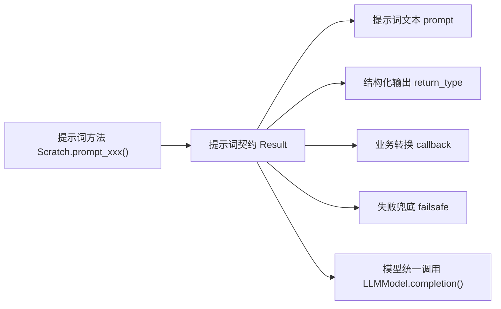

每个 `prompt_*` 方法都返回提示词契约 `Result`。四个字段分别是：

| 字段 | 中文意思 | 进入哪里 | 典型例子 |
| --- | --- | --- | --- |
| `prompt` | 最终发给模型的提示词文本。 | 传入 `provider._completion()`。 | “根据上述提示，输出克劳斯的起床时间。” |
| `callback` | 模型输出后的业务校验或转换。 | `LLMModel.completion()` 解析后执行。 | 起床时间大于 11 时截断为 11。 |
| `failsafe` | 失败时的兜底结果 failsafe。 | 重试耗尽或返回假值时使用。 | `wake_up` 默认返回 8。 |
| `return_type` | Pydantic 输出结构 schema。 | 传给 provider 或 `parse_structured_output()`。 | `res: int`、`res: bool`、`res: dict[str, str]`。 |

例如 `prompt_wake_up()` 返回：

```python
class wakeupResponse(BaseModel):
    res: int
```

并提供回调 callback：

```python
if value > 11:
    value = 11
```

代码逻辑图：

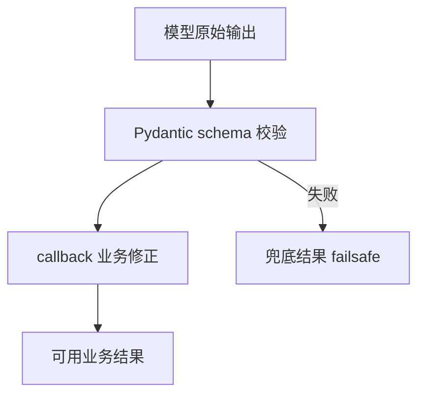

以起床时间 wake_up 为例，完整数据流如下：

| 环节 | 数据 | 结果 |
| --- | --- | --- |
| 提示词 prompt | 要求模型只输出 24 小时制小时。 | 模型知道输出面很窄。 |
| 输出结构 schema | `res: int` | 解析层希望拿到整数。 |
| 模型返回 | `{"res": 7}` | `parse_structured_output()` 返回 `7`。 |
| 回调 callback | 如果值大于 11，就截断为 11。 | 避免起床时间跑到下午。 |
| 兜底 failsafe | `8` | 模型失败时默认 08:00 起床。 |

这说明结构化输出不仅靠提示词 prompt，还靠输出结构 schema、回调函数 callback 和失败兜底 failsafe 共同约束。

## 22.4 Pydantic 输出结构 schema 的作用

项目大量使用 Pydantic response model。例如：

```python
class schedule_dailyResponse(BaseModel):
    res: dict[str, str]
```

再看一个更完整的具体例子：

```python
class reflect_insightsResponse(BaseModel):
    res: List[Tuple[str, str]]
```

这些输出结构 schema 解决一个核心问题：

```text
agent 系统需要的不是漂亮文本，而是可执行数据。
```

起床时间必须是 int。是否聊天必须是 bool。日程必须是 dict。反思洞察必须能解析成列表。如果模型输出格式不稳定，整个仿真会断。因此，Pydantic 输出结构 schema 是项目工程化的关键。

## 22.5 模型基类 LLMModel

`LLMModel` 位于：

```text
generative_agents/modules/model/llm_model.py
```

初始化阶段会保存下面这些运行状态：

```python
self._api_key
self._base_url
self._model
self._summary
self._handle
self._enabled
```

`_summary` 记录调用统计。格式大致是：

```text
S:<success>,F:<failure>/R:<request>
```

`get_summary()` 会返回每类调用者 caller 的成功失败情况。这对长时间仿真很重要。如果某个模型频繁解析失败，可以从摘要 summary 看出来。

| 字段 | 含义 | 调试价值 |
| --- | --- | --- |
| `_api_key` | 接口密钥，优先读配置，配置为空时按模型提供方 provider 读环境变量。 | MiniMax 配置为空时会读取 `MINIMAX_API_KEY`。 |
| `_base_url` | 接口基础地址。 | OpenAI 兼容接口、MiniMax 和 Ollama 的地址形态不同。 |
| `_model` | 模型名。 | 结果复现必须记录模型名。 |
| `_summary` | 每类调用的成功、失败、请求统计。 | 用于判断是否大量触发失败兜底 failsafe。 |
| `_handle` | 模型提供方 provider 初始化后的客户端对象。 | OpenAI 使用 magentic 句柄；Ollama 和 MiniMax 直接 HTTP 调用。 |
| `_enabled` | 模型可用开关。 | 模型不可用时，业务层不会继续调用。 |

## 22.6 模型统一调用 completion()

统一调用入口可以定位到：

```python
def completion(self, prompt, retry=10, callback=None, failsafe=None, return_type=None, caller="llm_normal", **kwargs)
```

代码逻辑图：

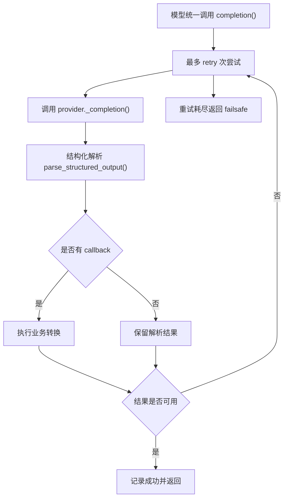

它做几件事。第一，最多重试 10 次。第二，调用 `_completion()` 获取模型输出。第三，如果有回调 callback，就执行回调 callback。第四，如果结果为 `None`，继续重试。第五，最终失败时返回兜底结果 failsafe。第六，记录成功失败统计。这让业务层可以比较放心地调用模型。

真实循环代码如下：

```python
for _ in range(retry):
    try:
        output = self._completion(prompt, return_type, **kwargs)
        self._summary["total"][0] += 1
        self._summary[caller][0] += 1
        if callback:
            response = callback(output)
        else:
            response = output
    except Exception as e:
        print(f"LLMModel.completion() caused an error: {e}")
        time.sleep(5)
        response = None
        continue
    if response is not None:
        break
pos = 2 if response is None else 1
self._summary["total"][pos] += 1
self._summary[caller][pos] += 1
return response or failsafe
```

`_summary` 的三个位置可以这样读：

| 位置 | 含义 | 何时增加 |
| --- | --- | --- |
| `[0]` | 请求次数 request | 每次成功调用 `_completion()` 后增加。 |
| `[1]` | 成功次数 success | 最终 `response is not None` 时增加。 |
| `[2]` | 失败次数 failure | 重试后仍然 `response is None` 时增加。 |

注意这里的“成功”只表示拿到了非 `None` 结果，不等于结果一定符合业务语义。例如 `0`、`False` 都不是 `None`，会被统计为成功，但函数最后的 `response or failsafe` 仍可能把它们替换掉。

这里还有一个源码边界。函数最后返回的是：

```python
return response or failsafe
```

代码逻辑图：

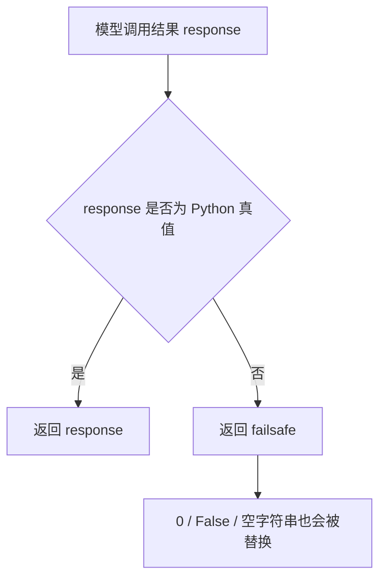

这意味着只要 `response` 是 Python 假值，就会走兜底结果。`None` 走失败兜底 failsafe 是合理的，但 `0`、`False`、空字符串也会被当作假值。脚手架输出里的 `falsey_response_boundary=8` 就是在展示这个边界：如果起床时间解析成 `0`，而 `wake_up` 的失败兜底 failsafe 是 `8`，最终返回会变成 `8`。因此实验时不能只看仿真是否跑完，还要看大语言模型摘要 LLM summary 中失败次数、结构化输出是否合理，以及是否出现大量兜底行为。

## 22.7 OpenAI 模型提供方 provider

`OpenAILLMModel` 使用 `magentic.OpenaiChatModel`：

```python
return OpenaiChatModel(self._model, api_key=self._api_key, base_url=self._base_url)
```

然后通过 `@prompt` 装饰器定义返回类型：

```python
@prompt("{_prompt}", model=self._handle)
def response(_prompt: str) -> return_type: ...
output = response(_prompt).res
```

代码逻辑图：

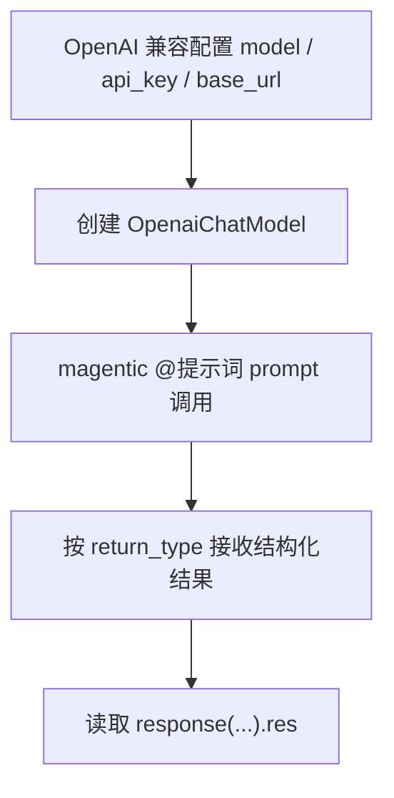

这个模型提供方 provider 适用于 OpenAI 兼容接口。README 中也说明，如果要调用其他 OpenAI 兼容接口 API，可以把 `provider` 改为 `openai`，并配置：

- model。
- api_key。
- base_url。

OpenAI 模型提供方 provider 的优势是接口成熟。风险是成本、网络和供应商差异。

## 22.8 Ollama 模型提供方 provider

`OllamaLLMModel` 用于本地模型或 Ollama 服务。它直接调用：

```text
/api/chat
```

请求参数主要包括，需要逐项查看：

```python
{
    "model": self._model,
    "messages": messages,
    "stream": False,
    "think": False,
    "options": {"temperature": temperature}
}
```

如果有 `return_type`，会生成 JSON schema：

```python
schema = return_type.model_json_schema()
response_format = schema
```

然后放到 Ollama 请求的 `format` 字段：

```python
params["format"] = response_format
```

代码逻辑图：

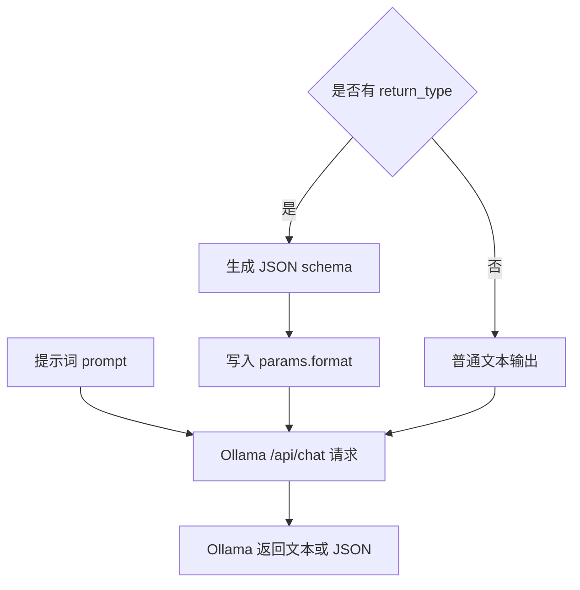

这让 Ollama 模型尽量输出符合输出结构 schema 的 JSON。对于本地实验来说，这是非常关键的能力。

## 22.9 `<think>` 标签过滤

Ollama 和 MiniMax 模型提供方 provider 都会过滤：

```python
re.sub(r"<think>.*?</think>", "", ret, flags=re.DOTALL).strip()
```

代码逻辑图：

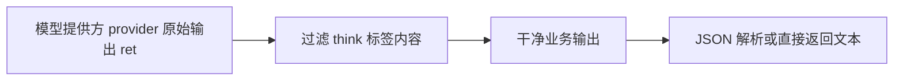

原因是一些推理模型会在输出中包含：

```text
<think>...</think>
```

如果不去掉，后续 JSON 解析会失败，或者对话内容会混入思考过程。对于智能体 agent 系统来说，模型内部思考不应该进入：

- 对话文本。
- 日程。
- 反思想法 thought。
- 结构化 JSON。

因此过滤 `<think>` 是必要的工程处理。

## 22.10 MiniMax 模型提供方 provider

`MiniMaxLLMModel` 适配 MiniMax OpenAI 兼容接口。README 和源码都说明，MiniMax-M 系列不支持严格的 `json_schema` 响应格式 response format。因此项目采用折中方案。如果有 `return_type`：

```python
schema = return_type.model_json_schema()
prompt = f"{prompt}\n\n请只输出一个符合下面 JSON Schema 的 JSON 对象..."
response_format = {"type": "json_object"}
```

代码逻辑图：

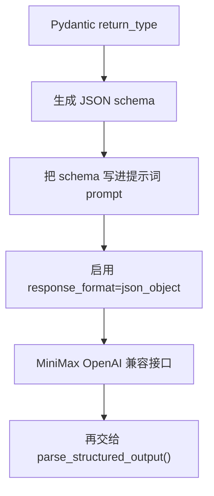

结构化输出的做法是：

```text
把输出结构 schema 写进提示词 prompt
  + 启用 json_object
```

然后再用 `parse_structured_output()` 解析。这是一种现实工程做法。不同模型提供方 provider 对结构化输出支持不同，适配层必须分别处理。

## 22.11 parse_structured_output()

结构化解析函数可以定位到：

```python
parse_structured_output(ret, return_type, context)
```

执行逻辑可以这样理解：

1. 如果没有 return_type，直接返回原始文本。
2. 尝试 `json.loads(ret)`。
3. 如果失败，用正则从文本中提取 `{...}`。
4. 再尝试把提取出的片段解析为 JSON。
5. 如果 parsed 不是 dict 或没有 `res`，包成 `{"res": parsed}`。
6. 用 Pydantic 校验并返回 `.res`。
7. 如果都失败，返回原始文本。

代码逻辑图：

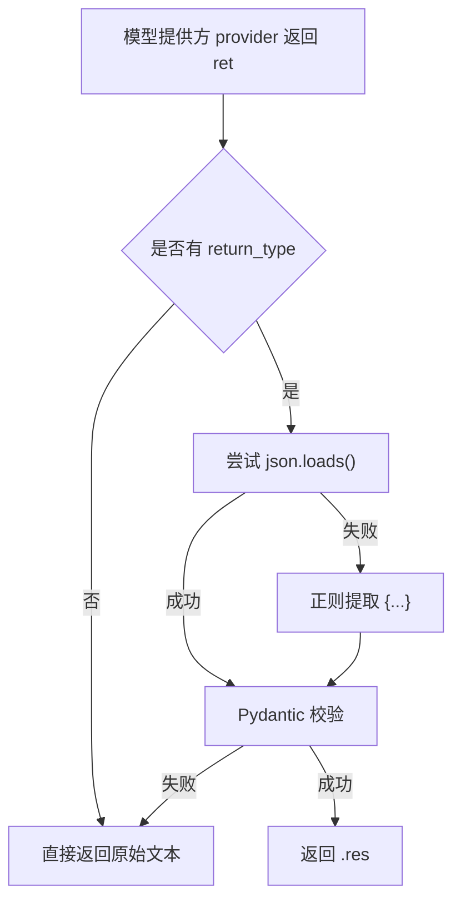

这个函数增强了容错性。模型多输出一点解释，仍然可能被解析。但也有风险。如果解析失败返回原始文本，而业务回调 callback 预期的是 list 或 dict，就可能在回调 callback 阶段失败，并触发重试或失败兜底 failsafe。所以结构化输出稳定性仍然取决于模型能力和提示词 prompt 约束。

把脚手架里的四个 case 放回源码逻辑，可以这样看：

| 输入 ret | return_type | 解析路径 | 返回值 |
| --- | --- | --- | --- |
| `{"res": 7}` | `res: int` | `json.loads()` 成功，Pydantic 校验成功。 | `7` |
| `prefix {"res": false} suffix` | `res: bool` | 直接 JSON 解析失败，正则提取 `{...}` 后校验成功。 | `False` |
| `<think>draft</think>{"res": 7}` | `res: int` | 模型提供方 provider 先过滤 `<think>`，再进入 JSON 解析。 | `7` |
| `not json` | `res: int` | JSON 解析失败，正则提取失败，Pydantic 校验失败。 | 返回原始文本 `not json` |

最后一种最危险。`parse_structured_output()` 返回原始文本后，如果回调 callback 不能处理这个字符串，就会抛异常，进入 `LLMModel.completion()` 的重试逻辑。重试多次仍失败，业务层拿到失败兜底 failsafe。这个链路解释了为什么模型输出格式不稳时，角色行为会突然变得很“默认”：默认起床、默认日程、默认不聊天。

## 22.12 create_llm_model()

模型提供方 provider 创建入口是：

```python
create_llm_model(llm_config)
```

当前支持下面这些能力：

```python
if provider == "ollama":
    return OllamaLLMModel(llm_config)
elif provider == "minimax":
    return MiniMaxLLMModel(llm_config)
elif provider == "openai":
    return OpenAILLMModel(llm_config)
```

代码逻辑图：

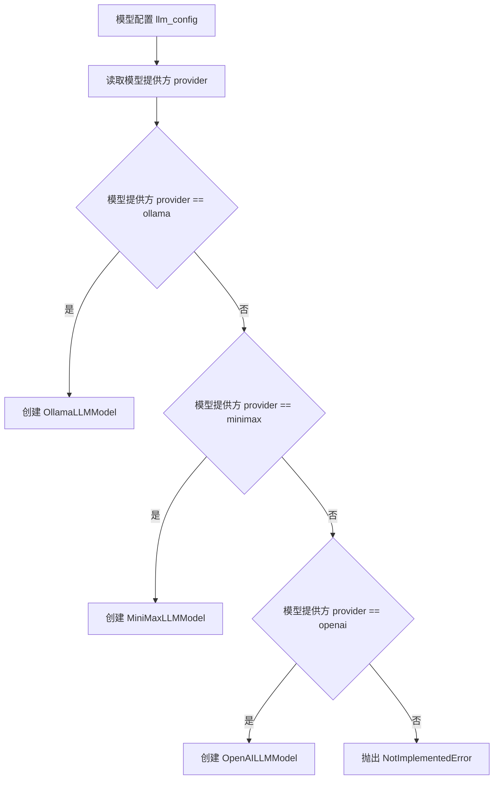

不支持的模型提供方 provider 会抛：

```python
NotImplementedError
```

这让新增模型提供方 provider 比较清晰。如果要增加 Qwen 接口 API、DeepSeek 接口 API、Azure OpenAI、Claude，需要新增对应子类或复用 OpenAI 兼容接口。

三种大语言模型提供方 LLM provider 的差异可以放在一张表里：

| 模型提供方 provider | 接口方式 | 结构化输出做法 | 关键风险 | 适合场景 |
| --- | --- | --- | --- | --- |
| Ollama | 本地 `/api/chat` | 把 Pydantic JSON schema 放进请求 `format` 字段。 | 本地模型能力、硬件速度、JSON 遵守能力。 | 离线实验、低成本调试、隐私敏感场景。 |
| MiniMax | OpenAI 兼容 `/chat/completions` | 把 JSON schema 拼进提示词 prompt，并启用 `response_format={"type":"json_object"}`。 | 推理过程 `<think>`、schema 不严格、token 截断。 | 当前工作区默认远端推理模型。 |
| OpenAI | magentic `OpenaiChatModel` | 由 magentic 和返回类型 return_type 接收结构化结果。 | 成本、网络、兼容接口差异。 | 质量优先、接口成熟、快速验证。 |

这张表的重点不是“哪个模型最好”，而是每个模型提供方 provider 的工程风险不同。模型适配层要把这些差异压到统一的 `completion()` 返回值里。

## 22.13 向量嵌入提供方 embedding provider

记忆检索还需要向量嵌入 embedding。向量嵌入 embedding 由 `storage/index.py` 中的 `LlamaIndex` 初始化。支持：

- `hugging_face`
- `ollama`
- `minimax`
- `openai`

当前配置使用 MiniMax 向量嵌入 embedding：

```json
"embedding": {
    "provider": "minimax",
    "model": "embo-01",
    "base_url": "https://api.minimax.chat/v1",
    "api_key": "",
    "group_id": ""
}
```

这说明大语言模型提供方 LLM provider 和向量嵌入提供方 embedding provider 可以分离，也可以都指向 MiniMax。模型负责生成行为，向量嵌入 embedding 负责记忆检索。两者不一定来自同一供应商，但必须分别配置成功。

四种向量嵌入提供方 embedding provider 的差异如下：

| 向量嵌入提供方 embedding provider | 实现方式 | 关键配置 | 适合场景 |
| --- | --- | --- | --- |
| `hugging_face` | `HuggingFaceEmbedding` | 本地模型名 `model`。 | 本地离线向量化，适合固定实验环境。 |
| `ollama` | 自定义 `OllamaHttpEmbedding` 调用 `/api/embed`。 | `base_url`、`model`。 | 完全本地部署，和 Ollama 大语言模型配套。 |
| `minimax` | 自定义 `MiniMaxHttpEmbedding` 调用 `/embeddings`。 | `MINIMAX_API_KEY`、`model=embo-01`、可选 `group_id`。 | 当前工作区默认配置。 |
| `openai` | `OpenAIEmbedding`。 | `api_base`、`api_key`、`model`。 | OpenAI 或 OpenAI 兼容 embedding 服务。 |

切换向量嵌入模型 embedding model 时，要重新考虑已有索引。旧节点的向量来自旧模型，新查询向量来自新模型，二者不一定在同一语义空间。为了避免检索漂移，正式实验中更稳妥的做法是重建 `storage/<agent>/associate`。

## 22.14 OllamaHttpEmbedding

项目自己实现了 `OllamaHttpEmbedding`。它调用：

```text
/api/embed
```

请求内容可以这样组织：

```python
{
    "model": self.model_name,
    "input": text
}
```

然后返回下面结果，用于验证前文判断：

```python
response.json()["embeddings"]
```

代码逻辑图：

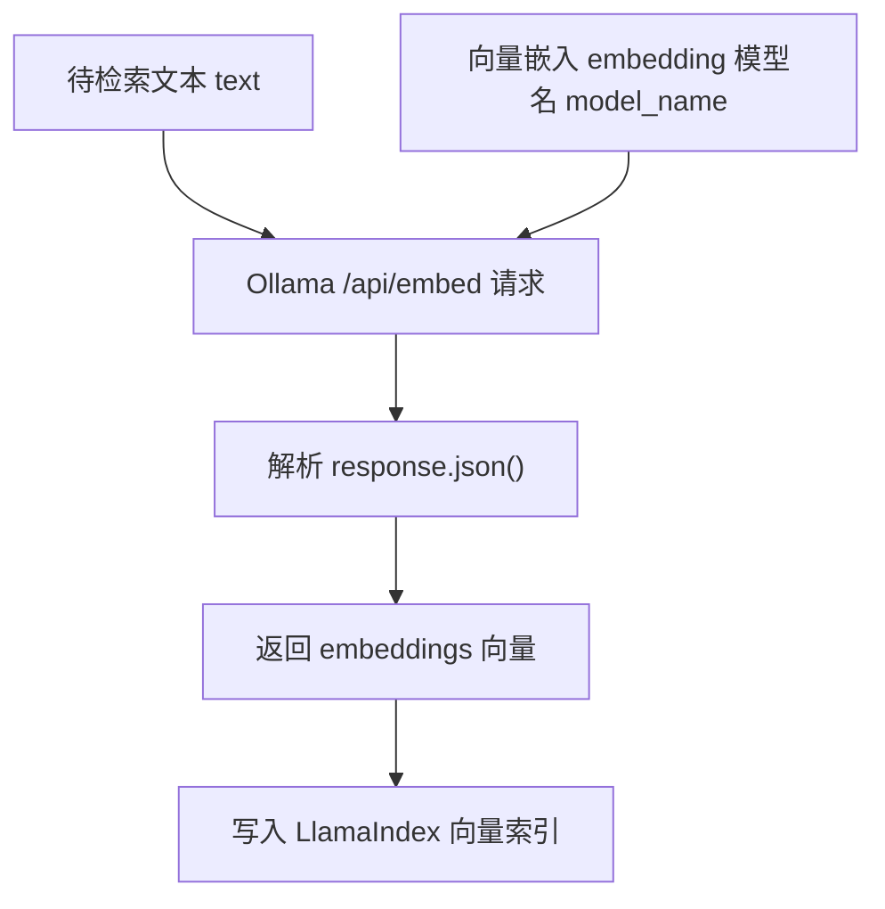

这个类让 LlamaIndex 可以使用 Ollama 本地向量嵌入 embedding。这对完全本地部署很关键。如果大语言模型 LLM 本地化，但向量嵌入 embedding 还走远端接口 API，成本和隐私仍然没有完全解决。

## 22.15 当前配置与 README 的关系

README 记录了项目更新，例如默认语言模型和向量嵌入 embedding 模型的变化。当前工作区实际配置以：

```text
generative_agents/data/config.json
```

为准。在当前工作区配置文件中，大语言模型 LLM model 是：

```text
MiniMax-M3
```

向量嵌入模型 embedding model 是：

```text
embo-01
```

读者运行时应检查自己的 `config.json`，不要只看 README 描述。开源项目在 fork、PR 和本地修改后，README 与配置可能存在时间差。本书源码分析以当前工作区文件为准。

## 22.16 模型质量对仿真的影响

模型质量会影响几乎所有模块。不同任务对模型能力的要求并不一样：

| 模块 | 模型需要做到什么 | 质量不足时的表现 | 检查位置 |
| --- | --- | --- | --- |
| 日程 schedule | 输出合理的 24 小时活动表和分钟级拆解。 | 时间重复、活动单调、日程越界。 | `schedule_daily`、`schedule_decompose` 输出。 |
| 对话 dialogue | 结合角色、场景、关系记忆和已有对话。 | 寒暄泛化、复读、语气不像角色。 | `generate_chat`、`generate_chat_check_repeat`。 |
| 反思 reflection | 从证据中生成不过度推断的洞察 insight。 | 反思像口号，或从弱证据推出强关系。 | `reflect_focus`、`reflect_insights`。 |
| 重要性评分 poignancy | 稳定输出 1 到 10 的整数。 | 普通事件分数过高，重要事件分数过低。 | `poignancy_event`、`poignancy_chat`。 |
| 结构化输出 structured output | 遵守 Pydantic 输出结构 schema。 | JSON 格式错误、字段缺失、类型错误。 | `parse_structured_output()`、callback 异常。 |
| 信息传播 information diffusion | 保留时间、地点、承诺等关键事实。 | 派对时间地点丢失，后续角色无法传播。 | `summarize_chats`、聊天记忆 chat memory。 |

本地小模型能降低成本，但不一定保证质量。实验时要记录模型提供方 provider、模型名 model、量化版本、温度 temperature、prompt 版本和输出结构 schema。否则同一段仿真结果很难复现。

## 22.17 成本与速度

多智能体仿真模型调用很多。每个智能体 agent 可能调用：

| 调用类型 | 典型提示词 prompt | 触发频率 | 成本特点 |
| --- | --- | --- | --- |
| 起床与日程 | `wake_up`、`schedule_init`、`schedule_daily` | 每天或新日程生成时。 | 每个角色至少数次调用。 |
| 日程拆解与修订 | `schedule_decompose`、`schedule_revise` | 当前计划需要细化或被打断时。 | 社交和等待越多，修订越多。 |
| 感知重要性 | `poignancy_event`、`poignancy_chat` | 新事件或聊天写入记忆时。 | 高频小调用，数量容易上升。 |
| 社交判断与对话 | `decide_chat`、`generate_chat`、`summarize_chats` | 角色相遇并触发社交时。 | 多轮对话会快速增加调用数。 |
| 反思 | `reflect_focus`、`reflect_insights` | 重要性达到阈值后。 | 单次成本较高，但触发较少。 |

25 个智能体 agent 运行多个仿真步 step，调用量会迅速增长。模型选择可以按阶段分层：

| 阶段 | 推荐策略 | 原因 |
| --- | --- | --- |
| 机制调试 | 小模型 + 少量 agent + 短步数。 | 快速暴露配置、路径、schema 和回调问题。 |
| 关键实验 | 强模型 + 固定随机种子或固定场景。 | 验证日程、对话、反思质量。 |
| 长期仿真 | 模型路由 + 缓存 + 失败统计。 | 控制成本，同时保留关键环节质量。 |
| 本地隐私实验 | 本地 Ollama + 本地向量嵌入 embedding。 | 降低外部接口依赖和数据泄露风险。 |

## 22.18 失败与 failsafe

每个提示词 prompt 通常有 failsafe。失败兜底保证仿真继续，但它也会改变行为。

| 提示词 prompt | 常见兜底 failsafe | 行为影响 |
| --- | --- | --- |
| `wake_up` | `8` | 角色默认 08:00 起床，个体作息差异变弱。 |
| `schedule_init` | 默认日程大纲 | 角色一天安排像模板。 |
| `schedule_daily` | 默认小时日程 | 角色个性和当前目标 currently 影响变弱。 |
| `decide_chat` | `False` | 角色更少主动聊天，信息扩散变慢。 |
| `generate_chat` | `嗯` | 对话质量下降，关系推进变弱。 |
| `reflect_focus` | “是谁、住哪里、今天做什么” | 反思变成自我介绍式总结。 |
| `reflect_insights` | “在考虑下一步该做什么” | 高层认知变浅，行为影响有限。 |

评估模型时，要同时看三类证据：

| 证据 | 看什么 | 说明什么 |
| --- | --- | --- |
| 大语言模型摘要 LLM summary | `S/F/R` 中 failure 是否偏高。 | 模型调用或解析是否稳定。 |
| 日志 | `LLMModel.completion() caused an error`。 | 具体异常来自接口、解析还是 callback。 |
| 结果文件 | 是否出现大量默认起床、默认日程、默认不聊天。 | 仿真跑完不等于行为真实，可能只是 failsafe 在支撑。 |

## 22.19 模型适配的边界

当前模型适配层的边界如下：

| 边界 | 当前实现 | 影响 |
| --- | --- | --- |
| 模型提供方 provider 数量有限 | 只内置 Ollama、MiniMax、OpenAI。 | 新增 Claude、DeepSeek、Qwen、Azure OpenAI 需要扩展子类或兼容配置。 |
| 并发能力有限 | 当前智能体 agent 按顺序调用模型。 | 多角色长仿真速度慢。 |
| 输出结构 schema 支持依赖模型提供方 provider | Ollama 用 `format`，MiniMax 用 `json_object + prompt schema`。 | 换模型后，结构化输出稳定性可能变化。 |
| 解析容错有限 | `parse_structured_output()` 能提取简单 `{...}`，复杂坏 JSON 仍会失败。 | 回调 callback 抛异常，最终触发失败兜底 failsafe。 |
| 质量不做二次评审 | 对话、摘要、反思没有自动评审 judge。 | 模型可能生成“格式正确但语义很差”的结果。 |
| 假值 falsey 边界 | `return response or failsafe` 会替换 `0`、`False`、空字符串。 | 合法业务值可能被误伤。 |

## 22.20 模型实验怎么设计

模型实验要固定场景，只改一个模型变量。否则很难判断变化来自模型提供方 provider、模型名 model、提示词 prompt、温度 temperature，还是随机相遇。

| 实验目标 | 修改变量 | 运行方式 | 观察对象 | 预期现象 |
| --- | --- | --- | --- | --- |
| 结构化输出稳定性 | 模型提供方 provider / 模型名 model | 对同一组 prompt 重复运行。 | JSON 解析成功率、callback 异常、failsafe 次数。 | 稳定模型更少触发失败兜底。 |
| 日程质量 | `schedule_daily` 所用模型 | 固定同一角色、同一天、同一 currently。 | `daily_schedule`、多样性 diversity、时间连续性。 | 强模型日程更具体、更符合角色设定。 |
| 对话质量 | `generate_chat` 所用模型 | 固定同一相遇场景。 | 复读率、角色语气、关键信息是否保留。 | 好模型更少客套循环，更能推进信息传播。 |
| 反思质量 | `reflect_insights` 所用模型 | 固定同一证据节点集合。 | 洞察 insight 是否被证据支持。 | 好模型不会从弱证据推出强结论。 |
| 嵌入检索质量 | 向量嵌入模型 embedding model | 同一记忆库切换 embedding 后重建索引。 | `retrieve_focus()` 召回结果。 | 相关记忆应排在前面，无关记忆减少。 |
| 假值 falsey 边界 | `return response or failsafe` 逻辑 | 构造 `0`、`False`、`""` 三类返回值。 | 最终业务结果。 | 当前实现会把假值替换成 failsafe，修复后应保留合法假值。 |

每次模型实验至少保存：`config.json`、模型名称、提示词 prompt 输入、结构化原始输出、解析后结果、大语言模型摘要 LLM summary、关键断点 checkpoint。没有这些证据，模型评测很容易变成主观印象。

## 22.21 可改进方向

模型层可以从六个方向升级：

| 当前限制 | 改进做法 | 获得的能力 |
| --- | --- | --- |
| 模型提供方 provider 抽象较少 | 统一 OpenAI 兼容接口 OpenAI compatible、Ollama 原生接口 Ollama native、Anthropic、DeepSeek、Qwen 等。 | 更容易接入新模型，不让业务代码改动。 |
| 顺序调用慢 | 引入异步并发 async concurrency，在不破坏仿真顺序的前提下并发非依赖调用。 | 多智能体仿真速度提升。 |
| 所有任务用同一模型 | 引入模型路由 model routing，简单任务用小模型，反思和对话用强模型。 | 成本和质量更平衡。 |
| JSON 失败直接重试 | 引入输出修复 output repair，用专门修复提示词 repair prompt 修 JSON。 | 降低输出结构 schema 错误导致的失败兜底 failsafe。 |
| 语义质量无评审 | 引入质量评审 judge，对反思、对话摘要、计划进行自动校验。 | 发现“格式正确但语义很差”的结果。 |
| 重复调用成本高 | 引入缓存 cache，对重复提示词 prompt 或低风险提示词 prompt 做缓存。 | 长期实验成本更低、速度更快。 |
| 假值 falsey 边界误伤 | 把 `return response or failsafe` 改成只在 `response is None` 时返回 failsafe。 | 保留合法的 `0`、`False`、空字符串业务值。 |

## 22.22 本章小结

模型适配层决定这个项目能不能稳定运行。智能体 agent 系统需要的不是漂亮文本，而是可以被代码继续执行的结构化结果。

| 本章内容 | 核心结论 |
| --- | --- |
| 当前配置 | 当前工作区行为模型使用 MiniMax-M3，向量嵌入模型使用 embo-01；两套配置分别影响生成和检索。 |
| 调用链路 | 智能体补全函数 `Agent.completion()` -> 提示词函数 `Scratch.prompt_*()` -> 模型统一调用层 `LLMModel.completion()` -> 模型提供方 provider。 |
| 提示词契约 `Result` | 它封装提示词 prompt、回调 callback、兜底结果 failsafe 和返回类型 return_type。 |
| 结构化输出 | Pydantic 结构化输出 schema 是稳定运行的核心，不是附加装饰。 |
| 统一入口 | `LLMModel.completion()` 负责重试 retry、回调 callback、兜底 failsafe 和统计。 |
| OpenAI | OpenAI 模型提供方 provider 使用 magentic 的 OpenAI 聊天模型 chat model。 |
| Ollama | Ollama 模型提供方 provider 调用 `/api/chat`，并通过 `format` 传 JSON schema。 |
| MiniMax | MiniMax 模型提供方 provider 把 JSON schema 写进提示词 prompt，并启用 `json_object`。 |
| 推理标签清理 | Ollama 和 MiniMax 模型提供方 provider 会过滤 `<think>` 标签。 |
| 解析校验 | `parse_structured_output()` 负责解析 JSON、提取片段并用 Pydantic 校验。 |
| 假值 falsey 边界 | `return response or failsafe` 会把合法的 `0`、`False`、空字符串替换成兜底值，这是当前实现的关键风险。 |
| 向量嵌入 embedding 分离 | 向量嵌入提供方 embedding provider 与大语言模型提供方 LLM provider 分离，支持 HuggingFace、Ollama、MiniMax、OpenAI。 |
| 模型实验 | 评估模型时要保存配置、提示词 prompt、原始输出、解析结果、大语言模型摘要 LLM summary 和断点 checkpoint。 |
| 行为影响 | 模型质量会直接影响日程、对话、反思、检索和评价。 |

下一章讲回放系统：看断点 checkpoint 如何压缩成 `movement.json` 和 `simulation.md`，以及前端渲染引擎 Phaser 如何展示小镇。

## 参考资料

- Local source: `generative_agents/modules/model/llm_model.py`
- Local source: `generative_agents/modules/storage/index.py`
- Local source: `generative_agents/modules/prompt/scratch.py`
- Local config: `generative_agents/data/config.json`
- Local docs: `docs/ollama.md`
- Local README: `README.md`
- Local scaffold: `docs/book/scaffolds/part_03/ch17_23_part03_evidence.py`
- Local trace: `docs/book/assets/chapter_22/ch22_model_adapter_trace.json`
