# 第 23 章 回放系统：断点 checkpoint、移动回放文件 movement.json、时间线报告 simulation.md 与前端渲染引擎 Phaser

## 23.1 核心问题

第三部分最后一章讲回放系统。生成式智能体 Generative Agents 的仿真结果不只存在日志里。运行后，项目会生成断点 checkpoint；压缩脚本 `compress.py` 再把断点 checkpoint 转换成两类材料：

```text
movement.json
simulation.md
```

移动回放文件 `movement.json` 给前端播放使用，时间线报告 `simulation.md` 给人阅读使用。回放服务 `replay.py` 通过 Web 服务框架 Flask 和前端渲染引擎 Phaser 展示小镇动画。

这一章没有新的提示词 prompt，也不会重新调用大语言模型 LLM。它处理的是已经生成出来的数据：断点 checkpoint、对话文件 `conversation.json`、世界地图 maze、角色贴图和前端模板。因此，本章的重点不是“智能体如何思考”，而是“智能体思考后的结果如何变成可观看、可复盘、可审计的证据”。

本章聚焦八个问题：

1. 断点 checkpoint 保存了什么？
2. `compress.py` 如何生成移动回放文件 `movement.json`？
3. 时间线报告 `simulation.md` 如何生成？
4. 移动回放文件 `movement.json` 的结构是什么？
5. 回放服务 `replay.py` 如何启动前端？
6. 前端模板如何展示角色精灵 sprite、行动 action 和对话 conversation？
7. 回放系统与实验评价有什么关系？
8. 当前回放系统有哪些边界和升级方向？

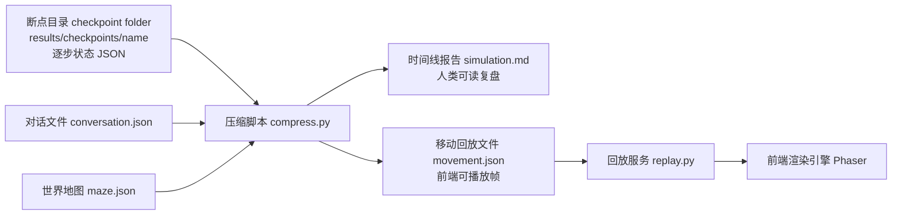

*图 23-1：断点 checkpoint -> 压缩脚本 compress.py -> 回放服务 replay.py 的数据流。原始断点 checkpoint 适合审计，压缩后的移动回放文件 `movement.json` 和时间线报告 `simulation.md` 分别服务前端回放和人类复盘。*

本章的证据脚手架读取 `book-party-pair` 的真实压缩结果，并统计断点 checkpoint、回放帧、角色和时间线报告 `simulation.md` 字符数：

```bash
python docs/book/scaffolds/part_03/ch17_23_part03_evidence.py
```

本章相关输出如下：

```text
chapter23 replay: checkpoints=6, movement_frames=361, agents=伊莎贝拉,阿伊莎, simulation_md_chars=4698
trace: docs/book/assets/chapter_23/ch23_replay_trace.json
figure: docs/book/assets/chapter_23/ch23_replay_dataflow.png
```


*图 23-2：从断点 checkpoint 到前端回放的一段真实轨迹。左侧是真实小镇地图上的两名角色路径，右侧同时展示移动回放文件 `movement.json`、时间线报告 `simulation.md` 和压缩统计。*

这行输出可以这样读：

| 输出片段 | 对应源码或文件 | 读法 |
| --- | --- | --- |
| `checkpoints=6` | `results/checkpoints/book-party-pair/simulate-*.json` | 这个实验有 6 个原始状态快照，适合审计完整角色状态。 |
| `movement_frames=361` | 压缩脚本 `compress.py` 与 `frames_per_step=60` | 回放不是一条行动 action 记录，而是被展开成前端逐帧播放的数据。 |
| `agents=伊莎贝拉,阿伊莎` | 移动回放文件 `movement.json` 的 `persona_init_pos` | 本次回放包含两个角色，前端初始位置和后续帧都按角色名索引。 |
| `simulation_md_chars=4698` | 时间线报告 `simulation.md` | 人类复盘读的是压缩后的时间线，不需要直接读庞大的断点 checkpoint JSON。 |

把这四个数字连起来，就是本章的主线：

```text
6 个断点 checkpoint
  -> 压缩成 361 个前端回放帧
  -> 只包含伊莎贝拉和阿伊莎两个移动角色
  -> 同时生成一份可阅读的 simulation.md
```

## 23.2 先读一条真实数据流

先不看源码，把同一个时刻的三份材料摆在一起读。`book-party-pair` 的第一个断点来自：

```text
generative_agents/results/checkpoints/book-party-pair/simulate-20240214-0800.json
```

其中伊莎贝拉的状态可以压缩成下面这段：

```json
{
  "time": "20240214-08:00",
  "step": 1,
  "stride": 10,
  "agents": {
    "伊莎贝拉": {
      "currently": "伊莎贝拉计划于2月14日下午5点在霍布斯咖啡馆与她的顾客举行情人节派对。",
      "coord": [78, 19],
      "action": {
        "event": {
          "subject": "伊莎贝拉",
          "predicate": "此时",
          "object": "打开咖啡馆大门并开灯",
          "describe": "打开咖啡馆大门并开灯",
          "address": ["the Ville", "霍布斯咖啡馆", "咖啡馆", "咖啡馆柜台后面"]
        },
        "start": "20240214-08:00:00",
        "duration": 5
      }
    }
  }
}
```

这段断点 checkpoint 是输入 input。它告诉我们：当前小镇时间是 2024 年 2 月 14 日 08:00，伊莎贝拉位于瓦片坐标 coordinate `[78, 19]`，当前行动 action 是“打开咖啡馆大门并开灯”，行动地点 address 是霍布斯咖啡馆柜台后面。

压缩后，移动回放文件 `movement.json` 会出现下面这些帧：

```json
{
  "start_datetime": "2024-02-14T08:00:00",
  "stride": 10,
  "sec_per_step": 10,
  "persona_init_pos": {
    "伊莎贝拉": [72, 14],
    "阿伊莎": [118, 61]
  },
  "all_movement": {
    "1": {
      "伊莎贝拉": {
        "location": "霍布斯咖啡馆，咖啡馆，咖啡馆柜台后面",
        "movement": [72, 14],
        "action": "前往 霍布斯咖啡馆，咖啡馆，咖啡馆柜台后面"
      }
    },
    "12": {
      "伊莎贝拉": {
        "location": "霍布斯咖啡馆，咖啡馆，咖啡馆柜台后面",
        "movement": [78, 19],
        "action": "打开咖啡馆大门并开灯"
      }
    }
  }
}
```

这段移动回放 movement 是输出 output。注意两个坐标不一样：断点 checkpoint 里的 `[78, 19]` 是这个仿真步 step 的目标状态；移动回放文件 `movement.json` 里的第 1 帧从 `[72, 14]` 起步，第 12 帧才到 `[78, 19]`。中间的路径是压缩脚本用世界地图 maze 重新算出来的。

同一段结果写到时间线报告 `simulation.md` 时，会变成人类可读文本：

```markdown
# 20240214-08:00

## 活动记录：

### 伊莎贝拉
位置：the Ville，霍布斯咖啡馆，咖啡馆，咖啡馆柜台后面
活动：打开咖啡馆大门并开灯
```

这就是本章最重要的读法：

| 层次 | 文件 | 读什么 | 适合回答的问题 |
| --- | --- | --- | --- |
| 原始状态 | 断点 checkpoint `simulate-*.json` | 时间 time、仿真步 step、坐标 coord、日程 schedule、记忆 memory、行动 action | 这个角色当时完整状态是什么？ |
| 前端回放 | 移动回放文件 `movement.json` | 初始位置、逐帧坐标、行动文本、对话文本 | 角色在屏幕上怎么移动、显示什么？ |
| 人类复盘 | 时间线报告 `simulation.md` | 人设、活动变化、对话记录 | 故事线是否连贯，信息是否传播？ |

后面每一节都围绕这条链路展开。

## 23.3 从仿真到回放的三阶段

整个流程分三阶段。下面三条命令都在项目运行目录 `generative_agents` 下执行；输入来自 `results/checkpoints/<name>`、`conversation.json` 和地图文件 `frontend/static/assets/village/maze.json`，输出写到 `results/compressed/<name>`。

第一阶段，运行仿真 simulation：

```bash
python start.py --name sim-test --start "20250213-09:30" --step 10 --stride 10
```

对应的输出结果应该类似这样：

```text
results/checkpoints/sim-test/
```

第二阶段，压缩结果 compression：

```bash
python compress.py --name sim-test
```

对应的输出结果应该类似这样：

```text
results/compressed/sim-test/movement.json
results/compressed/sim-test/simulation.md
```

第三阶段，启动回放 replay：

```bash
python replay.py
```

浏览器访问下面地址：

```text
http://127.0.0.1:5000/?name=sim-test
```

这三个阶段对应一条明确的数据链：

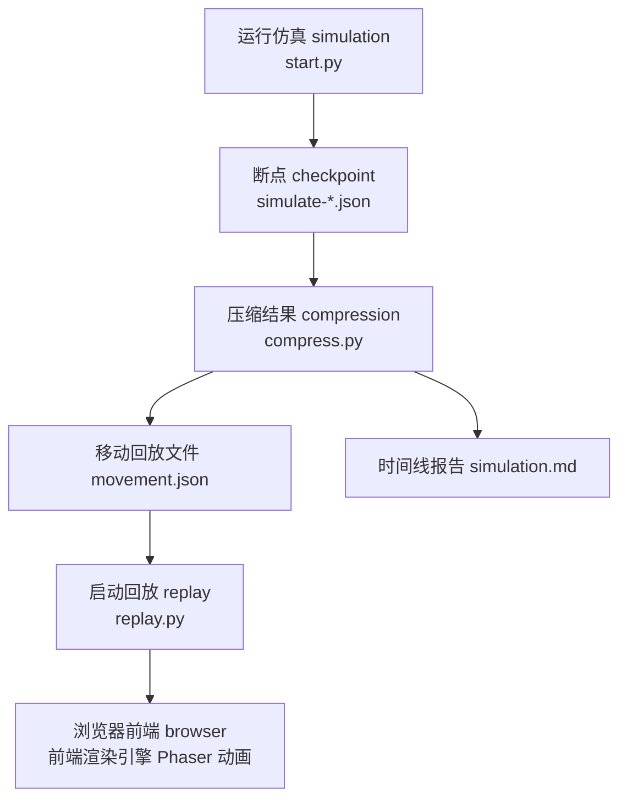

理解这条链路后，读者就能知道实验结果存在哪里，也能判断问题出在仿真、压缩还是前端回放。

## 23.4 断点 checkpoint 是原始仿真状态

`start.py` 每个仿真步 step 都会写一个断点 checkpoint：

```text
results/checkpoints/<name>/simulate-<time>.json
```

同时还会保存全局对话文件：

```text
results/checkpoints/<name>/conversation.json
```

写盘逻辑在 `SimulateServer.simulate()` 中：

```python
sim_time = timer.get_date("%Y%m%d-%H:%M")
self.config.update(
    {
        "time": sim_time,
        "step": i + 1,
    }
)

with open(f"{self.checkpoints_folder}/simulate-{sim_time.replace(':', '')}.json", "w", encoding="utf-8") as f:
    f.write(json.dumps(self.config, indent=2, ensure_ascii=False))

with open(f"{self.checkpoints_folder}/conversation.json", "w", encoding="utf-8") as f:
    f.write(json.dumps(self.game.conversation, indent=2, ensure_ascii=False))
```

断点 checkpoint JSON 保存的是仿真状态。它不是专门给人阅读的摘要，而是后续恢复、审计和压缩的原始材料。

| 字段 | 中文读法 | 作用 |
| --- | --- | --- |
| `time` | 小镇时间 time | 当前断点对应哪一个小镇时刻。 |
| `step` | 仿真步 step | 当前是第几个认知更新步。 |
| `stride` | 步长 stride | 每个仿真步推进多少分钟。 |
| `agents` | 智能体集合 agents | 本次仿真的所有角色状态。 |
| `coord` | 瓦片坐标 coordinate | 角色当前在地图上的瓦片位置。 |
| `schedule` | 日程 schedule | 一天计划和当前子计划。 |
| `associate` | 关联记忆 associate memory | 事件 event、想法 thought、对话 chat 的记忆节点引用。 |
| `chats` | 当前对话 chats | 角色此刻持有的对话片段。 |
| `currently` | 当前目标 currently | 角色的长期或阶段性状态描述。 |
| `action` | 当前行动 action | 当前动作、对象状态、地点和持续时间。 |

阅读断点 checkpoint 时不要从第一行 JSON 机械往下看。更有效的顺序是：

```text
time / step / stride
  -> agents.<目标角色>
  -> coord / action / schedule / currently
  -> associate / chats / storage
```

这样读，断点 checkpoint 就是“某个时间点的小镇快照”，而不是一大团难读的 JSON。

以 `simulate-20240214-0800.json` 为例，阿伊莎在 08:00 的状态可以读成一句话：

```text
阿伊莎位于 [118, 57]，在奥克山学院宿舍的书桌前阅读莎士比亚相关文献；
她的当前目标 currently 仍然是毕业论文研究；
她的关联记忆 associate memory 中已有一个 thought 节点 node_0。
```

断点 checkpoint 适合断点恢复和严谨审计。但它不适合直接给人读故事线，因此需要压缩脚本 `compress.py` 进行二次整理。

## 23.5 对话文件 conversation.json：全局对话证据

`conversation.json` 保存全局对话。对话发生时，`Agent._chat_with()` 会把聊天写入共享的对话字典：

```python
key = utils.get_timer().get_date("%Y%m%d-%H:%M")
if key not in self.conversation.keys():
    self.conversation[key] = []
self.conversation[key].append({f"{self.name} -> {other.name} @ {'，'.join(self.get_event().address)}": chats})
```

真实结果中的一段对话可以整理成下面这种结构。下面片段来自 `example` 回放中 `20240213-06:00` 的山姆和詹妮弗对话，省略了部分字段外壳：

```json
{
  "20240213-06:00": [
    {
      "詹妮弗 -> 山姆 @ the Ville，摩尔家族的房子，主人房，床": [
        ["詹妮弗", "早上好，山姆。你今天打算去花园里忙活些什么呢？"],
        ["山姆", "早上好，詹妮弗。我打算去约翰逊公园打理一下花坛和修剪一些灌木。今天也是个宣传我的竞选计划的好机会。"]
      ]
    }
  ]
}
```

这个结构可以拆成三层阅读：

| 层次 | 例子 | 含义 |
| --- | --- | --- |
| 时间键 time key | `20240213-06:00` | 对话发生的小镇时间。 |
| 传播边 communication edge | `詹妮弗 -> 山姆 @ ...` | 谁把信息传给谁，地点在哪里。 |
| 轮次列表 turns | `["山姆", "..."]` | 具体说话人和话术。 |

`book-party-pair` 这次实验的 `conversation.json` 是空对象：

```json
{}
```

这不是压缩失败，而是本次 6 个仿真步内没有触发对话。压缩脚本仍然会在移动回放文件 `movement.json` 中保留对话字段：

```json
{
  "conversation": {
    "20240214-08:00": "",
    "20240214-08:10": "",
    "20240214-08:20": ""
  }
}
```

没有对话也是一种数据状态。做信息传播实验时，如果角色声称知道派对，却在 `conversation.json` 和时间线报告 `simulation.md` 中找不到传播链，就要继续检查记忆 memory、初始人设 persona 或提示词 prompt 是否提前泄漏了信息。

## 23.6 压缩脚本 compress.py 的两个输出

`compress.py` 定义了两个输出文件和一个关键帧数：

```python
file_markdown = "simulation.md"
file_movement = "movement.json"

frames_per_step = 60  # 每个step包含的帧数
```

它有两个主要函数：

```python
generate_report(...)
generate_movement(...)
```

二者的职责不同：

| 函数 | 输入 | 处理逻辑 | 输出 |
| --- | --- | --- | --- |
| `generate_report()` | 断点 checkpoint、对话 conversation、角色配置 agent.json | 抽取人设、活动变化和对话记录 | 时间线报告 `simulation.md` |
| `generate_movement()` | 断点 checkpoint、对话 conversation、世界地图 maze | 计算移动路径，把仿真步展开成回放帧 | 移动回放文件 `movement.json` |

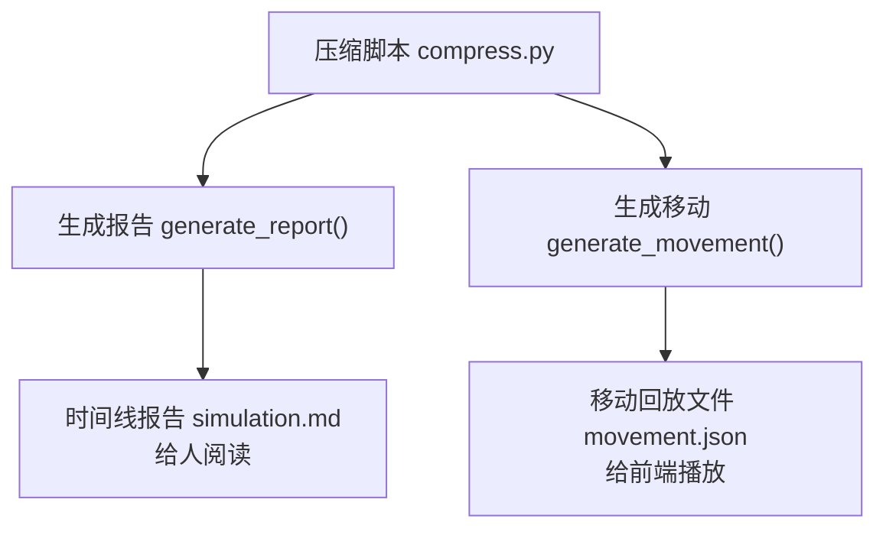

`simulation.md` 面向人阅读，`movement.json` 面向前端回放。后续复现实验会同时使用二者：先用时间线报告判断故事，再用移动回放文件或断点 checkpoint 校验位置和行动。

## 23.7 生成移动函数 generate_movement() 总览

`generate_movement()` 是移动回放文件 `movement.json` 的生成入口。它的核心代码可以压缩成下面这段：

```python
conversation = {}
if os.path.exists(os.path.join(checkpoints_folder, conversation_file)):
    with open(os.path.join(checkpoints_folder, conversation_file), "r", encoding="utf-8") as f:
        conversation = json.load(f)

files = sorted(os.listdir(checkpoints_folder))
json_files = list()
for file_name in files:
    if file_name.endswith(".json") and file_name != conversation_file:
        json_files.append(os.path.join(checkpoints_folder, file_name))

persona_init_pos = dict()
all_movement = dict()
all_movement["description"] = dict()
all_movement["conversation"] = dict()

stride = get_stride(json_files)
sec_per_step = stride

result = {
    "start_datetime": "",
    "stride": stride,
    "sec_per_step": sec_per_step,
    "persona_init_pos": persona_init_pos,
    "all_movement": all_movement,
}
```

这段代码的输入、处理、输出如下：

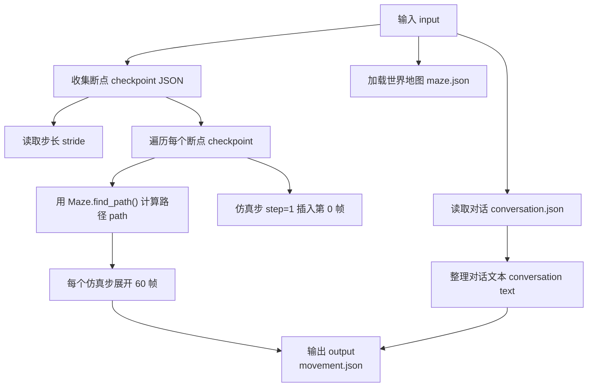

这一步把离散的断点 checkpoint 变成前端可播放帧数据。智能体 agent 并不是每一帧都重新思考；它在仿真步 step 上思考，回放系统只是把这个结果展开成动画。

## 23.8 移动回放文件 movement.json 的顶层结构

`generate_movement()` 最终输出：

```python
result = {
    "start_datetime": "",
    "stride": stride,
    "sec_per_step": sec_per_step,
    "persona_init_pos": persona_init_pos,
    "all_movement": all_movement,
}
```

移动回放文件 `movement.json` 的顶层结构可以这样读：

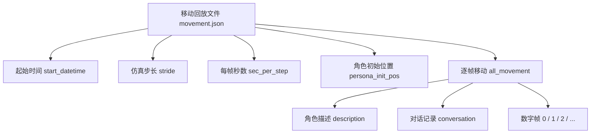

字段含义如下：

| 字段 | 中文读法 | 在前端中的作用 |
| --- | --- | --- |
| `start_datetime` | 起始时间 start datetime | 用来计算屏幕上的当前小镇时间。 |
| `stride` | 仿真步长 stride | 表示一个仿真步 step 推进多少分钟。 |
| `sec_per_step` | 每帧秒数 seconds per step | 前端用它计算时间流逝节奏。 |
| `persona_init_pos` | 角色初始位置 persona initial position | 前端创建角色精灵 sprite 时的出生坐标。 |
| `all_movement` | 全量移动帧 all movement | 每一帧角色在哪里、显示什么行动。 |
| `all_movement.description` | 角色描述 description | 角色详情面板显示的当前状态 currently 和草稿状态 scratch。 |
| `all_movement.conversation` | 对话记录 conversation | 前端按时间键显示聊天文本。 |

以 `book-party-pair/movement.json` 为例，节选如下：

```json
{
  "start_datetime": "2024-02-14T08:00:00",
  "stride": 10,
  "sec_per_step": 10,
  "persona_init_pos": {
    "伊莎贝拉": [72, 14],
    "阿伊莎": [118, 61]
  },
  "all_movement": {
    "0": {
      "伊莎贝拉": {
        "location": "伊莎贝拉的公寓，主人房",
        "movement": [72, 14],
        "description": "正在睡觉"
      },
      "阿伊莎": {
        "location": "奥克山学院宿舍，阿伊莎的房间",
        "movement": [118, 61],
        "description": "正在睡觉"
      }
    },
    "61": {
      "伊莎贝拉": {
        "location": "霍布斯咖啡馆，咖啡馆，咖啡馆柜台后面",
        "movement": [78, 19],
        "action": "检查并预热咖啡机"
      }
    }
  }
}
```

这段数据说明三件事。第一，回放起点是 2024 年 2 月 14 日 08:00。第二，本次只有两个角色，所以 `persona_init_pos` 只有两个名字。第三，第 0 帧是初始化状态，第 61 帧已经进入第二个仿真步 step 的行动展示。

不要把移动回放文件 `movement.json` 当作最原始事实。它是从断点 checkpoint 和世界地图 maze 派生出的回放数据，适合播放和统计位置；如果要判断记忆、计划或行动 action 的完整上下文，仍然要回查断点 checkpoint。

## 23.9 第 0 帧：insert_frame0()

`insert_frame0()` 插入角色初始状态。它读取每个角色的 `agent.json`：

```python
json_path = f"frontend/static/assets/village/agents/{agent_name}/agent.json"
with open(json_path, "r", encoding="utf-8") as f:
    json_data = json.load(f)
    address = json_data["spatial"]["address"]["living_area"]
location = get_location(address)
coord = json_data["coord"]
```

然后写入第 0 帧：

```python
movement[key][agent_name] = {
    "location": location,
    "movement": coord,
    "description": "正在睡觉",
}
movement["description"][agent_name] = {
    "currently": json_data["currently"],
    "scratch": json_data["scratch"],
}
```

第 0 帧的处理流程如下：

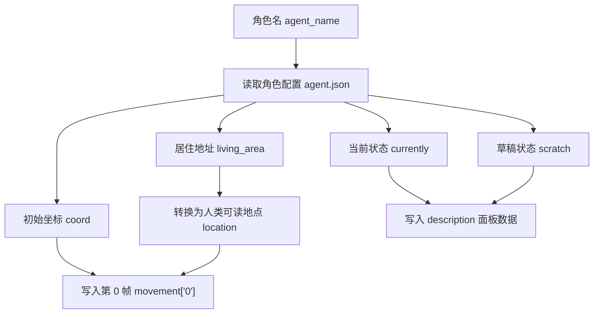

第 0 帧主要给前端初始化角色位置和基础信息。这里的 `description` 默认是“正在睡觉”，是一种初始显示简化，不一定代表角色真实行动 action。真实行动要从第 1 帧以及断点 checkpoint 中读取。

## 23.10 从断点 checkpoint 到路径 path

对每个断点 checkpoint，`generate_movement()` 取上一位置、目标坐标和当前行动地点：

```python
source_coord = last_location.get(agent_name, all_movement["0"][agent_name])["movement"]
target_coord = agent_data["coord"]
location = get_location(agent_data["action"]["event"]["address"])
path = maze.find_path(source_coord, target_coord)
```

这段代码把断点 checkpoint 中的目标状态转换成移动路径 path：

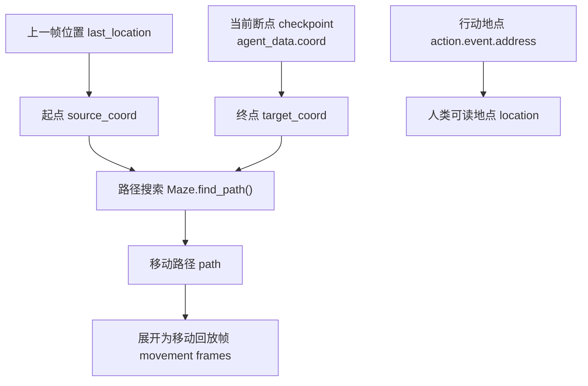

以伊莎贝拉 08:00 的移动为例：

| 数据项 | 值 | 来源 |
| --- | --- | --- |
| 起点 source coord | `[72, 14]` | 第 0 帧，来自伊莎贝拉 `agent.json` 初始坐标。 |
| 终点 target coord | `[78, 19]` | 断点 checkpoint `simulate-20240214-0800.json`。 |
| 地点 location | `霍布斯咖啡馆，咖啡馆，咖啡馆柜台后面` | `action.event.address` 去掉顶层世界名 `the Ville`。 |
| 路径 path | `[72,14] -> ... -> [78,19]` | `Maze.find_path()` 根据世界地图 maze 计算。 |
| 前端行动 action | `前往 霍布斯咖啡馆...`，到达后变成 `打开咖啡馆大门并开灯` | `generate_movement()` 根据是否仍在移动判断。 |

回放路径不是断点 checkpoint 直接保存的路径 path，而是根据上一位置和当前坐标重新计算。这样可以让前端播放移动过程，也说明移动回放文件 `movement.json` 是派生数据，不是原始仿真状态。

## 23.11 每步帧数 frames_per_step：一个仿真步展开成 60 帧

`compress.py` 中：

```python
frames_per_step = 60
```

每个仿真步 step 被展开成 60 帧。对于每一帧，代码通过下面的公式计算回放帧编号：

```python
step_key = "%d" % ((step-1) * frames_per_step + 1 + i)
```

帧编号可以这样换算：

| 仿真步 step | 小镇时间 | 回放帧范围 |
| --- | --- | --- |
| `1` | `20240214-08:00` | `1` 到 `60` |
| `2` | `20240214-08:10` | `61` 到 `120` |
| `3` | `20240214-08:20` | `121` 到 `180` |
| `4` | `20240214-08:30` | `181` 到 `240` |
| `5` | `20240214-08:40` | `241` 到 `300` |
| `6` | `20240214-08:50` | `301` 到 `360` |

实际写帧时，`generate_movement()` 还会判断路径 path 是否已经走完：

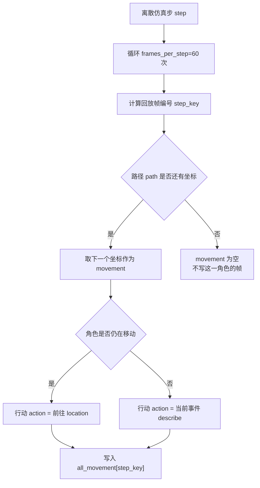

`book-party-pair` 的统计结果是 `movement_frames=361`，其中非空帧 `non_empty_frame_count=18`。这并不矛盾：顶层帧键覆盖 `0` 到 `360`，但角色真正有坐标更新或行动更新的帧远少于总帧数。

关键结论是：

```text
回放帧数不等于智能体认知次数。
```

智能体 agent 不是每一帧都思考。智能体 agent 每个仿真步 step 思考一次，前端只是把仿真步 step 展开成动画。

## 23.12 行动 action 文本如何生成

回放中每帧会保存行动 action。如果角色正在移动：

```python
action = f"前往 {location}"
```

角色没有移动时，回放帧使用当前事件描述：

```python
action = agent_data["action"]["event"]["describe"]
if len(action) < 1:
    action = f'{agent_data["action"]["event"]["predicate"]}{agent_data["action"]["event"]["object"]}'
```

这段逻辑可以画成一个分支图：

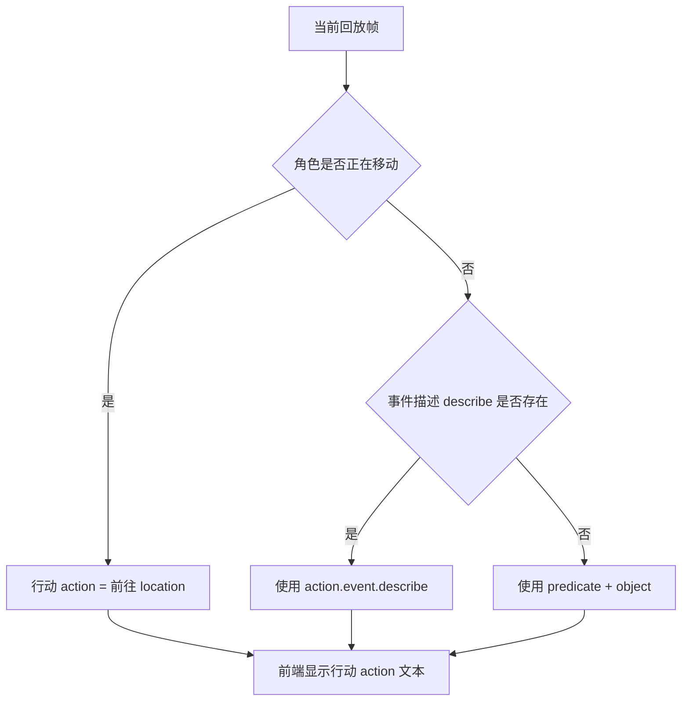

伊莎贝拉 08:00 的帧变化很直观：

| 回放帧 | 坐标 movement | 行动 action | 读法 |
| --- | --- | --- | --- |
| `1` | `[72, 14]` | `前往 霍布斯咖啡馆，咖啡馆，咖啡馆柜台后面` | 仍在路上。 |
| `7` | `[76, 16]` | `前往 霍布斯咖啡馆，咖啡馆，咖啡馆柜台后面` | 继续移动。 |
| `12` | `[78, 19]` | `打开咖啡馆大门并开灯` | 已到达，显示真实行动。 |
| `61` | `[78, 19]` | `检查并预热咖啡机` | 第二个仿真步的行动开始展示。 |

睡觉动作会增加睡眠图标：

```text
😴
```

如果该仿真步 step 有对话，会增加对话图标：

```text
💬
```

这些行动 action 主要用于前端显示。它不一定包含完整行为上下文。完整上下文需要看断点 checkpoint 和时间线报告 `simulation.md`。

## 23.13 对话如何进入移动回放文件 movement.json

`generate_movement()` 会读取对话记录 conversation。如果某个 `step_time` 有对话，会生成文本：

```python
step_conversation += f"\n地点：{persons.split(' @ ')[1]}\n\n"
for c in chat:
    agent = c[0]
    text = c[1]
    step_conversation += f"{agent}：{text}\n"
```

然后写入：

```python
all_movement["conversation"][step_time] = step_conversation
```

对话进入前端的链路如下：

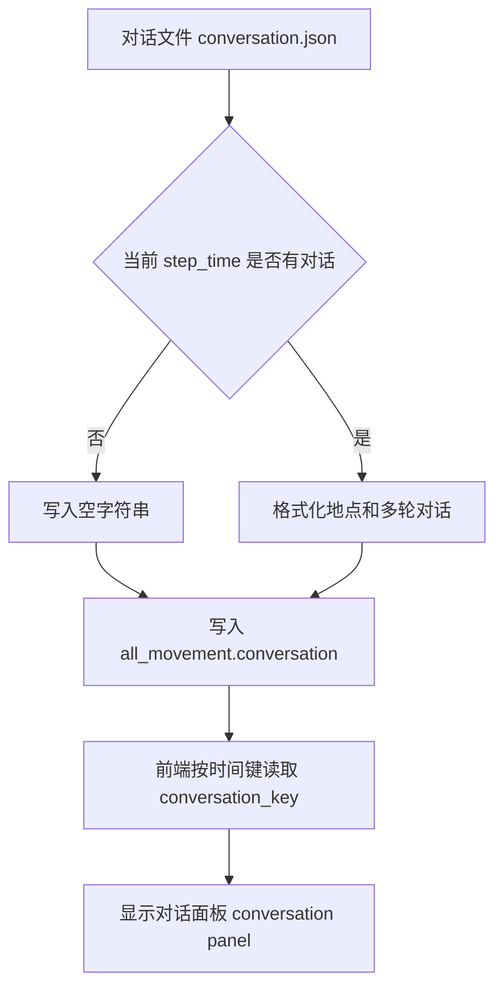

前端读取对话的代码在 `main_script.html` 中：

```javascript
conversation_key = `${curr_year}${curr_month}${curr_day}-${curr_hour}:${curr_minute}`;
conversation_key_text = all_movement["conversation"][conversation_key];
if (conversation_key_text && conversation_key_text != "") {
    textConversation.setText(`\n${conversation_key} 对话记录：\n` + conversation_key_text);
}
```

这说明对话显示依赖时间键 time key 精确匹配。`conversation.json` 里是 `20240214-08:00`，前端也必须算出同样格式的 `conversation_key`，对话才会显示。

## 23.14 生成报告函数 generate_report()：生成时间线报告 simulation.md

`generate_report()` 生成 Markdown 报告。它先写基础人设：

```python
def extract_description():
    markdown_content = "# 基础人设\n\n"
    for agent_name in personas:
        json_path = f"frontend/static/assets/village/agents/{agent_name}/agent.json"
        with open(json_path, "r", encoding="utf-8") as f:
            json_data = json.load(f)
            markdown_content += f"## {agent_name}\n\n"
            markdown_content += f"年龄：{json_data['scratch']['age']}岁  \n"
            markdown_content += f"先天：{json_data['scratch']['innate']}  \n"
            markdown_content += f"后天：{json_data['scratch']['learned']}  \n"
            markdown_content += f"生活习惯：{json_data['scratch']['lifestyle']}  \n"
            markdown_content += f"当前状态：{json_data['currently']}\n\n"
    return markdown_content
```

这里有一个容易忽略的细节：基础人设来自 `start.py` 中的全量角色列表 `personas`，不是只来自本次断点 checkpoint 中的两个角色。因此 `book-party-pair/simulation.md` 的开头会出现阿伊莎、克劳斯、玛丽亚、伊莎贝拉等全量角色人设；但后面的活动记录只来自本次断点中的 `agents`。

接着，`generate_report()` 遍历断点 checkpoint，提取活动变化：

```python
location = "，".join(agent_data["action"]["event"]["address"])
action = agent_data["action"]["event"]["describe"]

if location == last_state[agent_name]["location"] and action == last_state[agent_name]["action"]:
    continue

last_state[agent_name]["location"] = location
last_state[agent_name]["action"] = action
```

如果位置 location 和行动 action 与上一次相同，就跳过。这避免时间线报告 `simulation.md` 被重复状态刷屏。

当有变化时，报告会写入：

```markdown
# 20240214-08:10

## 活动记录：

### 伊莎贝拉
位置：the Ville，霍布斯咖啡馆，咖啡馆，咖啡馆柜台后面
活动：检查并预热咖啡机

### 阿伊莎
位置：the Ville，奥克山学院宿舍，阿伊莎的房间，书桌
活动：在家阅读莎士比亚相关文献，研读《哈姆雷特》中的独白段落
```

如果该时间有对话，再写对话记录：

```python
markdown_content += "## 对话记录：\n\n"
for chats in conversation[json_data['time']]:
    for agents, chat in chats.items():
        markdown_content += f"### {agents}\n\n"
        for item in chat:
            markdown_content += f"`{item[0]}`\n> {item[1]}\n\n"
```

阅读 `simulation.md` 时，可以按下面顺序读：

| 阅读顺序 | 看什么 | 目的 |
| --- | --- | --- |
| 1 | `# 基础人设` | 确认角色的长期设定、生活习惯 lifestyle 和当前状态 currently。 |
| 2 | 时间标题 `# 20240214-08:00` | 确认仿真节奏。 |
| 3 | 活动记录 | 判断角色位置和行为是否连续。 |
| 4 | 对话记录 | 判断信息是否真的通过角色互动传播。 |

这个阅读顺序和第 12 章的入门读法一致。区别是：这里进一步说明了时间线报告 `simulation.md` 是如何由断点 checkpoint 和对话记录 conversation 派生出来的。

## 23.15 时间线报告 simulation.md 的价值

时间线报告 `simulation.md` 是写书和实验的关键文件。它的价值可以分成三类：

| 价值 | 说明 | 例子 |
| --- | --- | --- |
| 人类可读 | 不用打开前端，也能按时间线阅读小镇发生了什么。 | `08:00 伊莎贝拉打开咖啡馆大门并开灯`。 |
| 可引用 | 写实验报告时，可以引用某个时间点某个角色的活动和对话。 | 派对实验引用“伊莎贝拉何时开始准备咖啡馆”。 |
| 可审计 | 如果某个角色声称知道派对，可以回查时间线，看它什么时候听到。 | 对照 `conversation.json` 查传播路径。 |

生成式智能体 Generative Agents 的难点不只是“让角色动起来”，还包括“让研究者能解释角色为什么这样动”。时间线报告 `simulation.md` 就是连接故事体验和实验证据的材料。

## 23.16 回放服务 replay.py：Web 服务框架 Flask

回放服务入口在：

```text
generative_agents/replay.py
```

它创建 Web 服务框架 Flask app：

```python
app = Flask(
    __name__,
    template_folder="frontend/templates",
    static_folder="frontend/static",
    static_url_path="/static",
)
```

这段代码把模板、静态资源和路由连接起来：

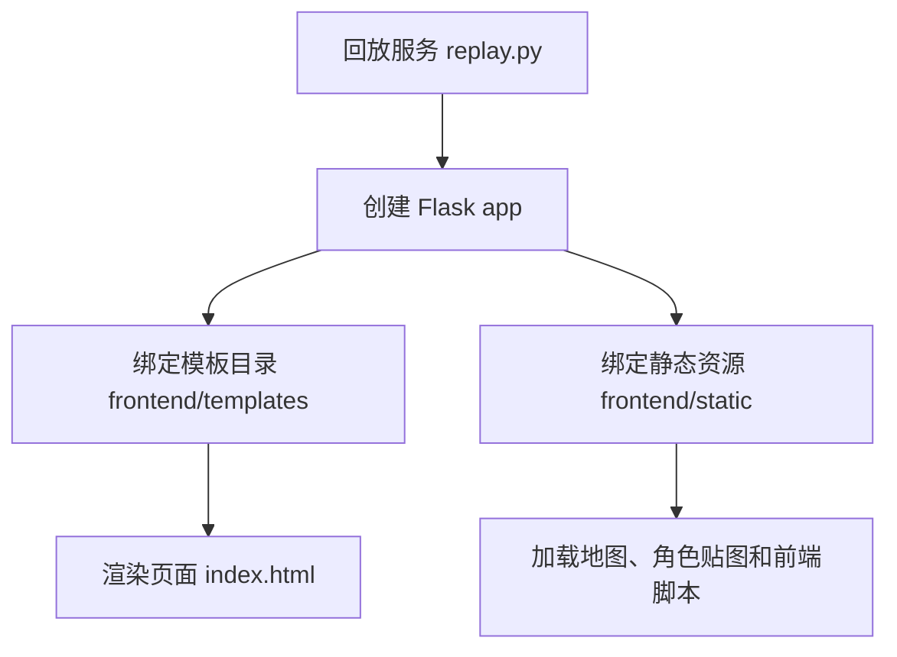

首页路由读取查询参数 query parameters：

```python
name = request.args.get("name", "")          # 记录名称
step = int(request.args.get("step", 0))      # 回放起始步数
speed = int(request.args.get("speed", 2))    # 回放速度（0~5）
zoom = float(request.args.get("zoom", 0.8))  # 画面缩放比例
```

可以看一个具体例子：

```text
http://127.0.0.1:5000/?name=sim-test&step=0&speed=2&zoom=0.8
```

参数含义如下：

| 参数 | 中文读法 | 作用 |
| --- | --- | --- |
| `name` | 仿真记录名 simulation name | 指向 `results/compressed/<name>/movement.json`。 |
| `step` | 起始仿真步 start step | 从第几个仿真步开始播放。 |
| `speed` | 回放速度 playback speed | 取值限制在 0 到 5，再转成指数速度。 |
| `zoom` | 缩放比例 zoom | 控制地图在浏览器中的显示比例。 |

回放服务会加载：

```text
results/compressed/<name>/movement.json
```

然后渲染：

```text
frontend/templates/index.html
```

如果移动回放文件不存在，页面会直接提示：

```text
The data file doesn‘t exist: 'results/compressed/<name>/movement.json'
Run compress.py to generate the data first.
```

这个报错说明回放链路卡在压缩阶段，需要先运行 `compress.py`。

## 23.17 仿真步 step、回放速度 speed、缩放比例 zoom

`replay.py` 对仿真步 step、回放速度 speed、缩放比例 zoom 做了二次处理。`step` 决定从第几个仿真步开始回放。如果 `step > 1`，它会调整起始时间和角色初始位置：

```python
if step > 1:
    t = datetime.fromisoformat(params["start_datetime"])
    dt = t + timedelta(minutes=params["stride"]*(step-1))
    params["start_datetime"] = dt.isoformat()
    step = (step-1) * frames_per_step + 1
```

也就是说，URL 参数里的 `step=3` 不是直接跳到第 3 帧，而是跳到第 3 个仿真步，对应回放帧：

```text
(3 - 1) * 60 + 1 = 121
```

`speed` 限制在 0 到 5，然后转换为：

```python
speed = 2 ** speed
```

它不是线性速度，而是指数速度：

| URL 参数 `speed` | 实际 `play_speed` |
| --- | --- |
| `0` | `1` |
| `1` | `2` |
| `2` | `4` |
| `3` | `8` |
| `4` | `16` |
| `5` | `32` |

`zoom` 控制画面缩放比例。这些参数让读者可以快速跳到某段仿真。例如派对实验中，可以直接跳到下午 5 点前后；如果只是检查开场路径，可以用默认 `step=0` 从头看。

## 23.18 前端模板 index.html 与角色面板

`frontend/templates/index.html` 继承 `base.html`。它包含三个关键区域：

| 区域 | 模板片段 | 作用 |
| --- | --- | --- |
| 游戏容器 game container | `<div id="game-container">` | 前端渲染引擎 Phaser 把地图和角色画在这里。 |
| 角色头像列表 persona list | `` | 根据 `movement.json` 中的角色名生成头像入口。 |
| 角色详情面板 detail panel | `agent_desc__{{ p }}` / `current_action__{{ p }}` | 点击角色后显示当前状态、当前行动和目标地点。 |

模板会引入前端渲染引擎 Phaser：

```html
<script src='https://cdn.jsdelivr.net/npm/phaser@3.55.2/dist/phaser.js'></script>
```

并包含主要脚本：

```text
main_script.html
```

`main_script.html` 一开始把后端传入的移动回放数据转成前端脚本 JavaScript 变量：

```javascript
let step = {{ step|tojson }};
let step_size = {{ sec_per_step|tojson }} * 1000;
let zoom = {{ zoom|tojson }};
let movement_speed = {{ play_speed|tojson }};
let all_movement = {{ all_movement|tojson }};
let start_datetime = new Date(Date.parse({{ start_datetime|tojson }}));
let persona_names = {{ persona_init_pos|tojson }};
```

这就是前端消费移动回放文件 `movement.json` 的入口。随后，前端创建角色精灵 sprite：

```javascript
for (let i=0; i<Object.keys(spawn_tile_loc).length; i++) {
    let persona_name = Object.keys(spawn_tile_loc)[i];
    let start_pos = [
        spawn_tile_loc[persona_name][0] * tile_width + tile_width / 2,
        spawn_tile_loc[persona_name][1] * tile_width + tile_width
    ];
    let new_sprite = this.physics.add.sprite(start_pos[0], start_pos[1], persona_name, "down");
    personas[persona_name] = new_sprite;
}
```

每次调用更新函数 update() 时，前端读取当前帧：

```javascript
let curr_x = all_movement[step][curr_persona_name.replace("_", " ")]["movement"][0];
let curr_y = all_movement[step][curr_persona_name.replace("_", " ")]["movement"][1];
movement_target[curr_persona_name] = [curr_x * tile_width, curr_y * tile_width];

let action = all_movement[step][curr_persona_name.replace("_", " ")]["action"];
let act = action;
act = act.length > 25 ? act.substring(0, 20)+"..." : act;
pronunciatios[curr_persona_name].setText(curr_persona_name + ": " + act);
document.getElementById("current_action__"+curr_persona_name).innerHTML = action;
document.getElementById("target_address__"+curr_persona_name).innerHTML =
    all_movement[step][curr_persona_name.replace("_", " ")]["location"];
```

这段代码说明：

| 移动回放字段 | 前端显示位置 |
| --- | --- |
| `movement` | 角色精灵 sprite 的目标像素坐标。 |
| `action` | 角色头顶文本和详情面板的“当前活动”。 |
| `location` | 详情面板的目标地址。 |
| `description.currently` | 角色详情面板的人设状态。 |
| `conversation` | 对话显示面板。 |

到这里，后端数据和屏幕显示已经闭环：断点 checkpoint 提供状态，压缩脚本生成移动回放文件，前端按帧读取并更新地图上的角色。

## 23.19 回放与断点 checkpoint 的区别

回放数据不是原始真相。原始真相是断点 checkpoint 和存储 storage。移动回放文件 `movement.json` 是为了前端展示而生成的派生数据。时间线报告 `simulation.md` 是为了人读而生成的摘要数据。

| 材料 | 类型 | 优点 | 边界 |
| --- | --- | --- | --- |
| 断点 checkpoint | 原始状态 raw state | 字段完整，适合恢复和审计。 | JSON 很大，不适合直接读故事线。 |
| 记忆存储 storage | 持久化记忆 persistent memory | 能检查事件 event、想法 thought、对话 chat 的真实保存情况。 | 需要理解第 18 章的记忆结构。 |
| 对话文件 `conversation.json` | 全局对话证据 conversation evidence | 能追踪谁在何时何地把信息传给谁。 | 没有对话时为空对象。 |
| 移动回放文件 `movement.json` | 前端派生数据 derived replay data | 适合播放、定位、统计坐标。 | 路径 path 是压缩阶段重新计算的。 |
| 时间线报告 `simulation.md` | 人类摘要 human-readable summary | 适合快速复盘和写实验报告。 | 只记录变化，不是每一步完整日志。 |

严谨评价时，应优先查：

```text
checkpoint
conversation.json
agent memory storage
```

快速理解故事线时，可以先看：

```text
simulation.md
movement.json
```

这两类数据服务不同的复现实验环节。

## 23.20 回放系统如何服务复现实验

第四部分会大量用到回放系统。不同实验关注的证据不同：

| 实验 | 先看什么 | 再查什么 | 核心问题 |
| --- | --- | --- | --- |
| 情人节派对传播 | 时间线报告 `simulation.md`、对话文件 `conversation.json` | 断点 checkpoint 的行动 action、记忆 memory | 伊莎贝拉什么时候邀请谁，被邀请者是否在正确时间到达咖啡馆？ |
| 镇长竞选信息扩散 | 对话文件 `conversation.json`、时间线报告 `simulation.md` | 记忆存储 storage、反思 reflection | 山姆是否谈到竞选，谁听到了，谁又告诉别人？ |
| 关系形成实验 | 对话记录 conversation、角色位置 movement | 社交记忆 social memory、日程 schedule | 克劳斯和玛丽亚是否多次相遇，后续活动是否更接近？ |
| 自定义小镇事件 | 移动回放文件 `movement.json`、断点 checkpoint | 地图地址 address、角色配置 agent.json | 新事件是否落在正确地点，角色行动是否符合设定？ |

这些实验都可以从 `simulation.md` 和 `conversation.json` 开始分析。如果要统计位置和到场，则看移动回放文件 `movement.json` 或断点 checkpoint 中的坐标 coord 和行动 action。

## 23.21 回放系统调试清单

回放系统的问题通常不在大语言模型 LLM，而在文件生成、路径计算或前端加载。可以按下面清单排查：

| 现象 | 优先检查 | 常见原因 | 处理方式 |
| --- | --- | --- | --- |
| 页面提示找不到 `movement.json` | `results/compressed/<name>/movement.json` | 只运行了 `start.py`，没有运行 `compress.py`。 | 进入 `generative_agents` 后执行 `python compress.py --name <name>`。 |
| 页面能打开，但没有角色 | `persona_init_pos` | 压缩结果中没有角色初始位置。 | 检查断点 checkpoint 的 `agents` 是否为空。 |
| 角色位置不对 | `agent.json` 初始 `coord`、断点 checkpoint `coord`、世界地图 maze | 初始坐标或行动地点不匹配。 | 对照第 14 章地图坐标读法，确认坐标落在正确瓦片。 |
| 角色头顶行动不更新 | `all_movement[frame][agent].action` | 帧为空，或行动描述 describe 没有变化。 | 抽样查看关键帧，如 `1`、`61`、`121`。 |
| 对话不显示 | `all_movement.conversation` 与时间键 | `conversation.json` 为空，或时间键不匹配。 | 检查 `YYYYMMDD-HH:MM` 格式是否一致。 |
| `simulation.md` 比预期短 | `generate_report()` 的去重逻辑 | 位置和行动没变化时被跳过。 | 回查断点 checkpoint，确认状态是否真的变化。 |
| 离线环境无法加载前端 | 前端渲染引擎 Phaser 的内容分发网络 CDN | 无法访问外部内容分发网络 CDN。 | 将 Phaser 依赖本地化到 `frontend/static`。 |

调试时不要只盯浏览器。先看压缩文件是否生成，再看移动回放文件字段是否完整，最后看前端是否正确消费字段。

## 23.22 回放系统边界

当前回放系统有几个边界：

| 边界 | 具体表现 | 对实验的影响 |
| --- | --- | --- |
| 离线压缩 offline compression | 运行仿真后需要手动执行 `compress.py`。 | 仿真结果不会自动出现在回放页面。 |
| 路径重新计算 path recomputation | 移动路径根据断点坐标和世界地图 maze 重新生成。 | 回放路径不一定等于运行时内部路径。 |
| 时间线去重 report deduplication | 时间线报告 `simulation.md` 只记录变化。 | 它不是逐步完整日志。 |
| 对话依赖时间键 conversation time key | 前端按 `YYYYMMDD-HH:MM` 查对话。 | 时间键不一致会导致对话不显示。 |
| 前端偏回放 replay-oriented UI | 页面主要用于观看，不是实时交互编辑器。 | 不适合直接在前端修改仿真状态。 |
| 外部依赖 CDN dependency | Phaser 从内容分发网络 CDN 加载。 | 离线教学或内网环境可能需要本地化依赖。 |

这些边界不会影响基本使用，但做严谨实验时要知道它们的存在。

## 23.23 可改进方向

回放系统可以从五个方向升级：

| 方向 | 做法 | 价值 |
| --- | --- | --- |
| 自动压缩 auto compression | 仿真结束后自动生成 `results/compressed/<name>`。 | 减少手动步骤，降低漏跑 `compress.py` 的概率。 |
| 交互式时间线 interactive timeline | 在前端按角色、地点、事件筛选。 | 更适合复盘长时间实验。 |
| 证据链接 evidence link | 从 `simulation.md` 的某条对话跳到断点 checkpoint 和记忆节点 memory node。 | 把故事线和底层证据连起来。 |
| 实验指标导出 metric export | 自动统计信息传播、到场率、对话次数、关系网络。 | 支撑第四部分的复现实验和对比实验。 |
| 本地化前端依赖 local frontend dependency | 将 Phaser 等依赖放入 `frontend/static`。 | 适合离线教学、课堂演示和长期归档。 |

这些升级会让项目更适合写实验报告、做教学演示和构建自己的小镇应用。

## 23.24 第三部分总结

第三部分源码深读覆盖了从底层到上层的主要模块：

| 章节 | 模块 | 读完后应掌握的问题 |
| --- | --- | --- |
| 第 14 章 | 世界模型 world model | 地图、瓦片、空间地址如何支撑角色行动。 |
| 第 15 章 | 智能体初始化 agent initialization | 角色配置如何变成可运行的智能体。 |
| 第 16 章 | 仿真循环 simulation loop | 一个仿真步 step 如何推动整座小镇。 |
| 第 17 章 | 感知 perceive | 角色如何从周围环境中形成事件 event。 |
| 第 18 章 | 记忆 memory | 事件 event、想法 thought、对话 chat 如何保存和检索。 |
| 第 19 章 | 日程 schedule | 每日计划如何决定角色行动。 |
| 第 20 章 | 社交 social interaction | 对话如何发生，信息如何传播。 |
| 第 21 章 | 反思 reflection | 记忆如何被总结成更高层想法。 |
| 第 22 章 | 模型适配 model adaptation | 大语言模型 LLM 和嵌入模型 embedding 如何接入项目。 |
| 第 23 章 | 回放系统 replay system | 仿真结果如何变成可观看、可复盘、可审计的证据。 |

论文概念和源码模块已经可以对应起来。下一部分不再只读源码，而是设计实验。第四部分会用当前项目复现论文中的情人节派对传播、镇长竞选信息扩散、角色关系形成，并设计自己的小镇事件。

## 23.25 本章小结

回放系统把后台仿真变成可检查证据。断点 checkpoint、移动回放文件 `movement.json`、时间线报告 `simulation.md` 和前端回放各自服务不同目的，不能混成一种材料。

| 本章内容 | 核心结论 |
| --- | --- |
| 原始输出 | `start.py` 每步生成断点 checkpoint 和对话文件 `conversation.json`。 |
| 断点 checkpoint | 断点 checkpoint 适合断点恢复和严谨审计，但不适合直接阅读。 |
| 对话文件 `conversation.json` | 对话文件记录谁在何时何地向谁传播了信息；为空对象时表示本次没有触发对话。 |
| 压缩入口 | 压缩脚本 `compress.py` 生成移动回放文件 `movement.json` 和时间线报告 `simulation.md`。 |
| 移动回放文件 `movement.json` | 面向前端渲染引擎 Phaser 回放，服务可视化。 |
| 时间线报告 `simulation.md` | 面向人类阅读和实验复盘。 |
| 移动回放 movement 生成 | `generate_movement()` 会把断点 checkpoint 展开成每个仿真步 step 60 帧。 |
| 报告 report 生成 | `generate_report()` 会写基础人设、活动记录和对话记录。 |
| 前端回放 | 回放服务 `replay.py` 和 `index.html` 加载压缩数据 compressed data 并展示画面。 |
| 评价边界 | 回放数据是派生数据，严谨评价仍要回查断点 checkpoint、对话记录 conversation 和记忆 memory。 |
| 后续用途 | 第四部分复现实验会把这些输出作为证据基础。 |

下一章进入复现实验：我们先复现论文中的情人节派对传播。

## 参考资料

- Local source: `generative_agents/start.py`
- Local source: `generative_agents/compress.py`
- Local source: `generative_agents/replay.py`
- Local source: `generative_agents/frontend/templates/index.html`
- Local source: `generative_agents/frontend/templates/main_script.html`
- Local output: `generative_agents/results/checkpoints/`
- Local output: `generative_agents/results/compressed/`
- Local scaffold: `docs/book/scaffolds/part_03/ch17_23_part03_evidence.py`
- Local trace: `docs/book/assets/chapter_23/ch23_replay_trace.json`
