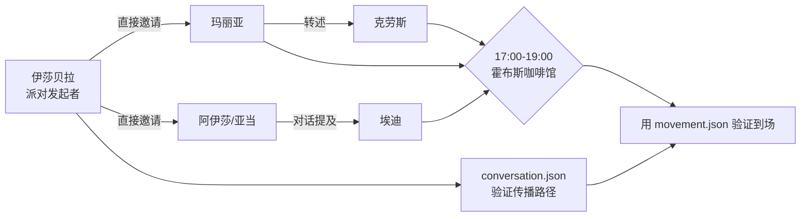

# 第 24 章 复现论文中的情人节派对传播

## 24.1 核心问题

第四部分开始做实验。第一组实验复现论文中最经典的现象：Isabella 的情人节派对传播。论文中，Isabella Rodriguez 计划在 Hobbs Cafe 举办情人节派对。她邀请居民，居民通过对话得知活动，有些人调整计划并到场。Generative Agents 中，伊莎贝拉的中文设定保留了这条线索：

```text
伊莎贝拉计划于2月14日下午5点在霍布斯咖啡馆与她的顾客举行情人节派对。
她正在收集聚会材料，并告诉大家在2月14日下午5点至7点在霍布斯咖啡馆参加聚会。
```

本章目标不是简单看“派对有没有发生”，而是建立一套可复查实验链路：

```text
伊莎贝拉初始意图
  -> 日程生成
  -> 空间相遇
  -> 对话邀请
  -> 对话摘要写入记忆
  -> 信息继续传播
  -> 被邀请者计划变化
  -> 角色到达霍布斯咖啡馆
```

本章重点聚焦以下七个问题：

1. 派对传播实验验证哪些模块？
2. 应该选择哪些角色？
3. 如何运行小规模实验和扩展实验？
4. 应该观察哪些文件？
5. 如何判断“知道派对”？
6. 如何判断“参加派对”？
7. 失败时应该从哪里排查？



*图 24-1：情人节派对传播证据链。复现实验要从发起、邀请、记忆、转述、到场和回放证据逐步检查，而不是只看派对有没有出现。*

## 24.2 这个实验验证什么

情人节派对传播不是单一功能测试。它同时验证多个模块。第一，persona/currently。伊莎贝拉必须知道自己要办派对。第二，planning。她的日程中应该出现与派对准备或邀请有关的行为。第三，spatial grounding。相关行为应该落到霍布斯咖啡馆或合理地点。第四，reaction/dialogue。她遇到别人时，应该有机会发起对话。第五，memory。被邀请者需要把派对信息写入记忆。第六，information diffusion。被邀请者后续可能告诉别人。第七，schedule revision。有些居民应该可能把下午 5 点到 7 点的活动改成参加派对。第八，replay/evaluation。我们需要从 `conversation.json`、`simulation.md`、`movement.json` 中复查证据。因此，这是一个端到端实验。

## 24.3 实验角色选择

先从小规模实验开始。建议使用 6 个角色：

```text
伊莎贝拉
阿伊莎
埃迪
亚当
玛丽亚
克劳斯
```

这样选择的理由如下：

伊莎贝拉是派对源头。阿伊莎和埃迪适合作为咖啡馆、学院和社区互动中的传播节点。亚当是论文中常见角色，也适合观察是否因为个人计划拒绝或错过。玛丽亚和克劳斯常去霍布斯咖啡馆或学院附近，适合作为派对传播和关系形成交叉观察对象。小规模实验的好处是成本低、日志短、容易追踪传播路径。等小规模跑通后，再扩展到更多角色。

## 24.4 实验时间设置

派对时间是 2 月 14 日下午 5 点到 7 点。实验起始时间建议设为：

```text
20240214-08:00
```

这样从早上开始，伊莎贝拉有足够时间：

- 准备材料。
- 遇到居民。
- 发出邀请。
- 让信息扩散。
- 让被邀请者在下午到场。

`stride` 建议先用 10 分钟。如果 step=72，则模拟 12 小时：

```text
72 * 10 分钟 = 720 分钟 = 12 小时
```

从 08:00 到 20:00，覆盖派对前、中、后。

## 24.5 小规模运行命令

先进入项目目录，后续命令都在这里执行：

```bash
cd generative_agents
```

运行命令可以直接照着执行：

```bash
python start.py --name book-party-small --start "20240214-08:00" --step 72 --stride 10 --agents "伊莎贝拉,阿伊莎,埃迪,亚当,玛丽亚,克劳斯" --verbose info --log book-party-small.log
```

长实验不应该等全部跑完才第一次检查。前几分钟的控制台输出就能判断方向是否正确。可以参考 `book-party-pair` 短实验的真实日志：

```text
Simulate Step[1/6, time: 2024-02-14 08:00:00]
伊莎贝拉 -> wake_up
伊莎贝拉 -> schedule_init
伊莎贝拉 -> schedule_daily
伊莎贝拉 -> schedule_decompose
伊莎贝拉 percept 0/5 concepts
伊莎贝拉.summary @ 20240214-08:00:00
action:
  event: 打开咖啡馆大门并开灯 @ the Ville:霍布斯咖啡馆:咖啡馆:咖啡馆柜台后面
llm:
  summary:
    total: S:8,F:0/R:8
```

这段日志说明伊莎贝拉已经被派对设定牵引到咖啡馆行动线上。`wake_up`、`schedule_init`、`schedule_daily`、`schedule_decompose` 是日程链路；`percept` 是感知；`summary` 是本 step 的状态快照。若这里的 action 完全没有咖啡馆、派对准备或顾客服务，就先回头检查伊莎贝拉的 `currently` 和运行日期，不要等 72 step 全部结束后才发现实验条件错了。

运行结束后执行压缩：

```bash
python compress.py --name book-party-small
```

查看结果时关注下面文件：

```text
results/compressed/book-party-small/simulation.md
results/compressed/book-party-small/movement.json
results/checkpoints/book-party-small/conversation.json
```

这三个文件不是平级证据。建议按下面顺序读：

| 文件 | 先看什么 | 在派对实验中回答什么问题 |
| --- | --- | --- |
| `simulation.md` | 时间线、活动记录、对话摘录 | 派对故事线是否出现，谁在什么时间提到派对 |
| `conversation.json` | 对话时间、说话双方、地点、具体话术 | 派对信息是否真的从伊莎贝拉传给别人 |
| `movement.json` | 17:00-19:00 附近角色位置和 action | 被邀请者是否在派对时段到达并停留在咖啡馆 |

简单说，`simulation.md` 帮你快速发现线索，`conversation.json` 帮你证明传播路径，`movement.json` 帮你验证到场。三者合起来，才比“看起来有人参加了派对”更可靠。

在 `book-party-small` 生成结果之前，可以先用仓库内置 `example` 的真实片段练习读法。`example` 中有这样一段派对邀请：

```text
地点：the Ville，霍布斯咖啡馆，咖啡馆，咖啡馆柜台后面

伊莎贝拉：早上好，亚当！我看到你正在写作呢。今天有什么新的灵感吗？
亚当：早上好，伊莎贝拉！今天我在探讨创造力如何促进个人成长。
伊莎贝拉：那真是太棒了！创造力确实能带来很多惊喜。对了，今天下午我们有个情人节派对，你有兴趣参加吗？
亚当：听起来很有趣，伊莎贝拉。不过我可能要婉拒了，因为我需要集中精力完成这本书的一些章节。
```

这段原文说明了三件事。第一，派对信息有明确来源：伊莎贝拉。第二，接收者是亚当。第三，结果不是“成功参加”，而是“知道但婉拒”。所以做派对传播实验时，不能把“被邀请”直接等同于“会到场”。后面还要看 `movement.json` 中 17:00-19:00 的位置和 action。

理解了这种证据读法之后，再打开前端回放，目标就不是单纯看动画，而是核对时间、地点和到场行为。查看前端回放可以运行：

```bash
python replay.py
```

用浏览器打开下面地址：

```text
http://127.0.0.1:5000/?name=book-party-small&speed=3&zoom=0.6
```

## 24.6 扩展运行命令

小规模跑通后，可以扩展到 10 个角色：

```bash
python start.py --name book-party-extended --start "20240214-08:00" --step 84 --stride 10 --agents "伊莎贝拉,阿伊莎,埃迪,亚当,玛丽亚,克劳斯,山姆,约翰,拉托亚,乔治"
```

这里模拟 14 小时，从 08:00 到 22:00。扩展角色中：

- 山姆带来竞选信息干扰。
- 约翰、拉托亚、乔治适合观察信息传播。

扩展实验能更接近论文端到端行为，但成本更高，日志也更长。

## 24.7 观察文件一：simulation.md

首先打开下面文件，可以这样处理：

```text
results/compressed/book-party-small/simulation.md
```

搜索下面这些关键词：

```text
情人节
派对
霍布斯咖啡馆
伊莎贝拉
邀请
下午5点
```

重点观察下面现象，用于判断实验结果：

1. 伊莎贝拉早上是否提到派对准备。
2. 她是否与其他角色对话。
3. 对话中是否明确提到时间和地点。
4. 被邀请者后续活动是否改变。
5. 下午 5 点附近是否有人到达霍布斯咖啡馆。

`simulation.md` 是最快理解故事线的文件。但它不是最终证据。最终证据还要看 `conversation.json` 和 checkpoint。

## 24.8 观察文件二：conversation.json

打开下面文件，可以这样处理：

```text
results/checkpoints/book-party-small/conversation.json
```

搜索下面关键词，可以这样处理：

```text
情人节
派对
霍布斯咖啡馆
17
下午5点
```

记录每一次有关派对的对话。建议做一张表：

| 时间 | 发起者 | 接收者 | 地点 | 是否提到时间 | 是否提到地点 | 是否形成承诺 |
|---|---|---|---|---|---|---|
| 09:40 | 伊莎贝拉 | 阿伊莎 | 霍布斯咖啡馆 | 是 | 是 | 待判断 |

这张表用于追踪传播路径。如果阿伊莎后来告诉克劳斯，就记录：

| 时间 | 发起者 | 接收者 | 信息来源 | 内容 |
|---|---|---|---|---|
| 11:20 | 阿伊莎 | 克劳斯 | 伊莎贝拉邀请 | 提到派对 |

这比只统计最后有多少人知道更重要。

## 24.9 观察文件三：movement.json

`movement.json` 用于确认到场。路径：

```text
results/compressed/book-party-small/movement.json
```

判断某个角色是否参加派对，可以检查：

- 17:00 到 19:00 是否在霍布斯咖啡馆。
- action 是否与派对、聊天、社交、咖啡馆活动相关。
- 是否只是路过。

不要只看角色在咖啡馆出现一次。参加派对应该满足更强条件：

```text
在派对时段到达霍布斯咖啡馆
  + 停留一段时间
  + action 或对话与派对相关
```

如果只是 17:10 路过咖啡馆，不应算参加。

## 24.10 如何判断“知道派对”

知道派对不能只看最终回答。在本项目实验中，建议使用三层标准。弱标准：

```text
角色对话或行动中提到情人节派对。
```

中等标准可以这样写：

```text
角色 memory 或 conversation 中有明确信息来源。
```

较强标准可以这样写：

```text
角色知道时间、地点，并在后续计划或对话中使用该信息。
```

例如，阿伊莎可能会这样说：

```text
我听伊莎贝拉说今晚咖啡馆有派对。
```

这是弱标准。如果 `conversation.json` 中确实有伊莎贝拉告诉阿伊莎：

```text
2月14日下午5点至7点在霍布斯咖啡馆
```

就是中标准。如果阿伊莎下午调整计划去咖啡馆，就是强标准。

## 24.11 如何判断“传播成功”

传播成功至少要满足：

```text
非源头角色知道派对
  + 信息来源可追溯
```

更强的传播成功可以表现为：

```text
非源头角色把派对信息告诉第三人
```

可以看一个具体例子：

```text
伊莎贝拉 -> 阿伊莎 -> 克劳斯
```

这就是二跳传播。实验报告中要区分：

- 一跳知道者。
- 二跳传播者。
- 到场者。
- 有兴趣但未到场者。
- 无证据但声称知道者。

这能避免把幻觉当传播。

## 24.12 如何判断“参加派对”

参加派对建议使用四个条件。第一，时间匹配。2 月 14 日 17:00 到 19:00。第二，地点匹配。霍布斯咖啡馆。第三，行为匹配。action 或对话与派对、社交、咖啡馆聚会相关。第四，来源匹配。该角色此前知道派对，或者被邀请。如果一个角色 17:30 在霍布斯咖啡馆吃饭，但从未知道派对，这可能不是参加派对。如果一个角色知道派对但因为工作冲突没来，应记录为“知道但未参加”。

## 24.13 预期现象

小规模实验中，理想情况下应该看到：

1. 伊莎贝拉生成派对相关日程或行动。
2. 伊莎贝拉与至少一位居民发生对话。
3. 对话中提到情人节派对。
4. 至少一位非伊莎贝拉角色知道派对。
5. 至少一位角色在下午 5 点附近到达霍布斯咖啡馆。

不要期待每次运行都完美复现论文数字。生成式系统有随机性。模型、prompt、角色数量、stride、起始时间都会影响结果。我们关注的是机制是否成立，而不是一次运行必须达到固定人数。

## 24.14 常见失败一：伊莎贝拉没有邀请别人

如果伊莎贝拉一直准备材料，但没有对话邀请，可能原因是：

- 她没有遇到其他角色。
- `decide_chat` 返回 False。
- 她日程没有安排社交或邀请。
- 她在咖啡馆，其他角色不来。

可以按下面方法排查：

1. 看 `simulation.md` 中伊莎贝拉位置。
2. 看其他角色是否经过霍布斯咖啡馆。
3. 看日志中 `decide_chat` 输出。
4. 调整角色集合，加入更可能去咖啡馆的角色。
5. 延长 step。

## 24.15 常见失败二：邀请中没有时间地点

如果对话只说“来参加派对”，但没说时间地点，传播质量不够。可能原因：

- `currently` 信息没有进入对话上下文。
- `generate_chat` 没检索到派对记忆。
- 对话摘要丢失时间地点。

可以按下面方法排查：

1. 看伊莎贝拉 `currently`。
2. 看 prompt 日志中 `generate_chat` 是否包含派对信息。
3. 看 `summarize_chats` 输出是否保留时间地点。
4. 必要时加强 `generate_chat` 或 `summarize_chats` prompt。

## 24.16 常见失败三：知道但不到场

角色知道派对但不到场很常见。它不一定是失败。可能原因：

- 日程冲突。
- 没有把邀请转成计划。
- 派对信息没有被 planning 检索。
- 角色兴趣不高。

论文中也有被邀请但没到场的角色。实验报告应区分：

```text
知道但未到场
有兴趣但未计划
计划冲突
忘记或检索失败
```

这比简单判定失败更有价值。

## 24.17 常见失败四：无证据知道

如果某角色说知道派对，但找不到对话或记忆来源，这就是幻觉。处理方法：

1. 回查 `conversation.json`。
2. 回查 checkpoint 中该角色 memory。
3. 如果没有来源，标记为 hallucinated awareness。

论文评价也会区分真实传播和记忆幻觉。没有来源的“知道”，应标记为 hallucinated awareness，不能算信息扩散。

## 24.18 实验记录模板

建议为每次运行记录：

```markdown
# 情人节派对传播实验记录

## 配置
- name:
- start:
- step:
- stride:
- agents:
- llm:
- embedding:

## 传播路径
| 时间 | 来源 | 接收者 | 地点 | 证据文件 | 摘要 |

## 知道派对的角色
| 角色 | 是否知道 | 证据 | 是否知道时间地点 |

## 到场情况
| 角色 | 是否到场 | 到场时间 | 停留时长 | 行为/对话证据 |

## 失败与异常
- 检索失败：
- 对话摘要丢失：
- 幻觉知道：
- 到场但无来源：
```

这个模板会让实验可复查。

## 24.19 扩展实验

派对传播可以扩展成多组实验。第一，角色数量影响。比较 6 人、10 人、25 人传播范围。第二，stride 影响。比较 5 分钟、10 分钟、15 分钟步长。第三，模型影响。比较 Qwen、DeepSeek、MiniMax、OpenAI。第四，检索权重影响。提高 importance_weight，看派对信息是否更容易被记住。第五，反思影响。降低或关闭 reflection，看邀请是否更难转成长期计划。这些扩展会帮助读者理解系统参数如何影响社会现象。

## 24.20 本章小结

情人节派对实验是从论文案例进入项目复现的第一步。一个“看起来有趣的故事”，必须被拆成可运行、可观察、可复查的实验链路。

| 本章内容 | 核心结论 |
| --- | --- |
| 实验目标 | 派对传播同时验证 persona、planning、dialogue、memory、reflection 和 replay。 |
| 角色选择 | 小规模实验建议先用伊莎贝拉、阿伊莎、埃迪、亚当、玛丽亚、克劳斯。 |
| 起始时间 | 2 月 14 日 08:00 能覆盖派对前后的关键信息传播窗口。 |
| 结果生成 | 运行后用 `compress.py` 生成 `simulation.md` 和 `movement.json`。 |
| 传播证据 | `conversation.json` 是追踪邀请和传播路径的关键材料。 |
| 知道标准 | 判断“知道派对”要区分弱标准、中标准和强标准。 |
| 到场标准 | 判断参加派对要同时看时间、地点、行为和信息来源。 |
| 报告内容 | 实验报告必须记录传播路径、知道者、到场者和幻觉情况。 |
| 失败解释 | 知道但不到场不一定是失败，也可能是计划冲突或检索失败。 |
| 扩展方向 | 后续可以扩展角色数量、模型、stride、检索权重和 reflection 设置。 |

下一章复现镇长竞选信息扩散。它与派对实验类似，但更强调观点传播、关系态度和反对者反应。

## 参考资料

- Local source: `generative_agents/start.py`
- Local source: `generative_agents/compress.py`
- Local data: `generative_agents/frontend/static/assets/village/agents/伊莎贝拉/agent.json`
- Local output: `generative_agents/results/checkpoints/<name>/conversation.json`
- Local output: `generative_agents/results/compressed/<name>/simulation.md`
- Local output: `generative_agents/results/compressed/<name>/movement.json`
