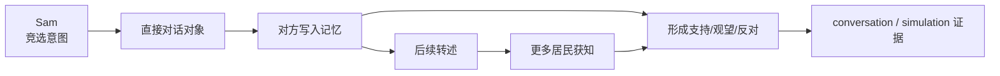

# 第 25 章 复现镇长竞选信息扩散

## 25.1 核心问题

上一章复现了情人节派对传播。镇长竞选信息扩散是另一条论文经典社会现象。在论文中，Sam Moore 有竞选镇长的意图。信息通过对话传播给其他居民。Generative Agents 中，山姆保留了这条设定。这个实验和派对实验类似，但更复杂。派对信息主要是：

```text
时间 + 地点 + 是否参加
```

竞选信息除了“知道不知道”，还涉及态度：

```text
支持
怀疑
反对
观望
转述
询问政策
```

因此，本章不仅追踪信息扩散，还追踪角色态度。本章聚焦七个问题：

1. 镇长竞选实验验证哪些模块？
2. 角色应该如何选择？
3. 如何运行小规模与扩展实验？
4. 如何判断“知道山姆竞选”？
5. 如何记录居民态度？
6. 如何避免把幻觉当传播？
7. 如何比较竞选扩散和派对传播的差异？



*图 25-1：山姆竞选信息扩散路径。竞选实验不只看消息有没有传播，还要看不同角色如何根据身份和关系形成不同态度。*

## 25.2 实验目标

本实验目标有三层。第一层，信息是否扩散。仿真开始时，山姆知道自己要竞选镇长。运行后，其他角色是否知道？第二层，扩散路径是否可追踪。谁从山姆那里听到？谁又告诉别人？每条路径是否能在 `conversation.json` 中找到？第三层，态度是否有差异。居民是否表现出支持、怀疑、反对或追问？这三层对应不同能力：

- memory 支撑知道。
- dialogue 支撑传播。
- reflection 和 relation 支撑态度。

## 25.3 推荐角色

小规模实验建议使用：

```text
山姆
汤姆
约翰
拉托亚
乔治
伊莎贝拉
```

选择理由：

山姆是信息源。汤姆是关键反对或怀疑节点。项目设定中，汤姆对山姆并不友好，适合观察负面态度。约翰、拉托亚、乔治适合观察信息传播。伊莎贝拉在咖啡馆，容易成为社交枢纽。如果成本允许，可以加入：

```text
阿伊莎
亚当
玛丽亚
克劳斯
```

这样可以观察竞选信息是否进入学院和咖啡馆社交圈。

## 25.4 运行命令

建议从 2 月 13 日早上开始。

```bash
cd generative_agents
python start.py --name book-election-small --start "20240213-08:00" --step 72 --stride 10 --agents "山姆,汤姆,约翰,拉托亚,乔治,伊莎贝拉"
```

压缩：

```bash
python compress.py --name book-election-small
```

查看：

```text
results/compressed/book-election-small/simulation.md
results/checkpoints/book-election-small/conversation.json
results/compressed/book-election-small/movement.json
```

扩展实验：

```bash
python start.py --name book-election-extended --start "20240213-08:00" --step 96 --stride 10 --agents "山姆,汤姆,约翰,拉托亚,乔治,伊莎贝拉,阿伊莎,亚当,玛丽亚,克劳斯"
```

## 25.5 观察关键词

在 `simulation.md` 和 `conversation.json` 中搜索：

```text
竞选
镇长
山姆
投票
支持
政策
居民
社区
```

不要只搜索“镇长”。有些对话可能说：

```text
地方选举
社区领导
候选人
为居民服务
```

这些也可能是竞选信息。建议人工读一遍山姆相关对话。

## 25.6 信息扩散记录表

建议记录：

| 时间 | 来源 | 接收者 | 地点 | 内容摘要 | 证据文件 |
|---|---|---|---|---|---|
| 09:20 | 山姆 | 伊莎贝拉 | 霍布斯咖啡馆 | 山姆提到竞选镇长 | conversation.json |
| 10:10 | 伊莎贝拉 | 约翰 | 霍布斯咖啡馆 | 伊莎贝拉转述山姆竞选 | conversation.json |

每条传播都要有证据。如果某个角色后来说知道山姆竞选，但没有上游对话或 memory，就不能算真实传播。

## 25.7 态度记录表

竞选实验要额外记录态度。建议表格：

| 角色 | 是否知道 | 信息来源 | 态度 | 证据 |
|---|---|---|---|---|
| 汤姆 | 是 | 山姆直接对话 | 怀疑/反对 | 对话中质疑山姆 |
| 约翰 | 是 | 伊莎贝拉转述 | 观望 | 只表示听说 |
| 拉托亚 | 是 | 山姆直接对话 | 支持 | 表示愿意了解更多 |

态度分类不要过细。建议使用：

```text
支持
怀疑
反对
观望
未知
```

用固定枚举更容易保持实验记录一致。

## 25.8 如何判断“知道山姆竞选”

同样使用三层标准。弱标准：

```text
角色提到山姆、镇长、竞选等关键词。
```

中标准：

```text
角色对话或记忆中有明确来源。
```

强标准：

```text
角色能在后续对话中正确转述山姆竞选，并表达态度或问题。
```

例如，约翰说：

```text
我听说山姆在考虑竞选镇长。
```

这是弱标准。如果能找到伊莎贝拉告诉约翰，就是中标准。如果约翰后来问山姆政策，就是强标准。

## 25.9 汤姆的实验价值

汤姆是这个实验中的关键角色。因为竞选不是派对。派对传播更偏活动邀请。竞选传播会触发态度和关系。如果所有人都礼貌支持山姆，仿真会显得过度合作。汤姆可以帮助测试：

- 模型是否保留角色既有态度。
- 对话是否允许怀疑和反对。
- `summarize_relation` 是否能体现负面关系。
- 山姆是否会根据反对意见调整话术。

这能暴露指令调优模型过度礼貌的问题。论文也指出，模型可能过于合作、不善拒绝。镇长竞选实验正适合观察这一点。

## 25.10 与派对实验的差异

派对传播的核心问题是：

```text
信息是否到达？角色是否到场？
```

竞选传播的核心问题是：

```text
信息是否到达？角色如何解释？态度是否不同？
```

派对实验更依赖 planning 和到场行为。竞选实验更依赖 dialogue、relation memory 和 reflection。派对成功可以用到场率衡量。竞选成功不能只用“知道人数”衡量，还要看：

- 是否出现政策讨论。
- 是否出现支持和反对。
- 是否出现二次传播。
- 是否保留角色个性。

## 25.11 预期现象

理想运行中，应该看到：

1. 山姆主动或被动提到竞选。
2. 至少一名居民得知山姆参选。
3. 至少一条二次传播路径。
4. 汤姆表现出不同于普通支持者的态度。
5. 后续对话中有人提到山姆竞选。

如果只看到山姆自言自语，没有传播，说明社交触发不足。如果所有人都无条件支持，说明角色差异不足。如果很多人凭空知道山姆竞选，说明幻觉或共享信息污染。

## 25.12 常见失败一：山姆不谈竞选

可能原因：

- 山姆日程没有竞选相关活动。
- `currently` 没被 prompt 使用。
- 山姆没有遇到其他人。
- decide_chat 返回 False。

排查：

1. 看山姆 `agent.json` 的 currently。
2. 看山姆 schedule。
3. 看山姆活动地点。
4. 看 conversation 是否有山姆对话。
5. 必要时延长 step 或加入更容易相遇的角色。

## 25.13 常见失败二：竞选信息传播但态度单一

如果所有人都说：

```text
祝你好运，我支持你。
```

这可能是模型过度礼貌。排查：

1. 看角色 learned 和关系设定是否包含差异。
2. 看 `summarize_relation` 是否检索到负面关系。
3. 看 `generate_chat` prompt 是否过度要求友好。
4. 在实验报告中标记“态度过度同质化”。

这不是小问题。可信人工社会需要不同观点。

## 25.14 常见失败三：幻觉知道

如果一个角色从未接触山姆，也没有听别人提到，却说知道竞选，就是幻觉。处理方式和派对实验一样：

- 回查 conversation。
- 回查 memory。
- 标记 hallucinated awareness。

竞选实验中幻觉更容易发生，因为“镇长竞选”是常见语义，模型可能凭常识补全。因此证据检查更重要。

## 25.15 实验指标

建议记录以下指标。信息指标：

- 知道山姆竞选的人数。
- 一跳传播人数。
- 二跳传播人数。
- 无证据知道人数。

社交指标：

- 山姆发起竞选相关对话次数。
- 其他人转述竞选次数。
- 涉及政策或社区问题的对话次数。

态度指标：

- 支持人数。
- 怀疑人数。
- 反对人数。
- 观望人数。

行为指标：

- 山姆是否调整后续对话策略。
- 是否出现竞选相关计划。

这些指标比单纯“知道人数”更完整。

## 25.16 实验记录模板

```markdown
# 镇长竞选信息扩散实验记录

## 配置
- name:
- start:
- step:
- stride:
- agents:
- llm:

## 信息传播路径
| 时间 | 来源 | 接收者 | 地点 | 内容 | 证据 |

## 角色态度
| 角色 | 是否知道 | 来源 | 态度 | 证据 |

## 指标
- 知道人数：
- 二跳传播：
- 幻觉知道：
- 支持/怀疑/反对/观望：

## 异常
- 山姆未谈竞选：
- 态度过度一致：
- 无证据知道：
```

## 25.17 扩展实验

可以设计几组扩展。第一，对比有无汤姆。观察负面角色是否影响竞选话题质量。第二，加入更多公共场所角色。看咖啡馆和市场是否成为传播中心。第三，调整 `generate_chat` prompt。减少过度礼貌，看是否增加真实分歧。第四，调整 reflection。看居民是否形成关于山姆的长期政治态度。第五，跨天运行。看第二天是否还有人记得山姆竞选。竞选实验比派对更适合观察长期观点形成。

## 25.18 本章小结

镇长竞选实验比派对传播更复杂，因为它不仅看“消息有没有传开”，还要看角色是否形成不同态度。读者做这个实验时，不能只数知道人数。

| 本章内容 | 核心结论 |
| --- | --- |
| 信息源 | 山姆是竞选信息源，汤姆是关键态度测试角色。 |
| 评价重点 | 实验要同时记录知道、支持、怀疑、反对和观望。 |
| 推荐角色 | 小规模实验可使用山姆、汤姆、约翰、拉托亚、乔治、伊莎贝拉。 |
| 关键证据 | 运行后重点检查 `conversation.json` 和 `simulation.md`。 |
| 知道标准 | 判断知道竞选必须有信息来源证据。 |
| 态度分类 | 支持、怀疑、反对、观望、未知，比单一“知道/不知道”更有信息量。 |
| 失败暴露 | 竞选实验更容易暴露过度礼貌和角色差异不足。 |
| 幻觉处理 | 幻觉知道必须单独标记，不能算有效传播。 |
| 扩展方向 | 后续可以加入跨天记忆、reflection 和 prompt 改造。 |

下一章设计自己的小镇事件：从论文复现转向项目扩展，学习如何设计新事件并让它进入角色设定、日程、对话和评价链路。

## 参考资料

- Local source: `generative_agents/start.py`
- Local data: `generative_agents/frontend/static/assets/village/agents/山姆/agent.json`
- Local data: `generative_agents/frontend/static/assets/village/agents/汤姆/agent.json`
- Local output: `generative_agents/results/checkpoints/<name>/conversation.json`
- Local output: `generative_agents/results/compressed/<name>/simulation.md`
