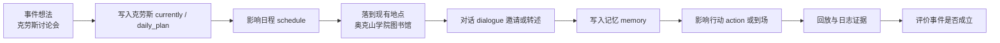
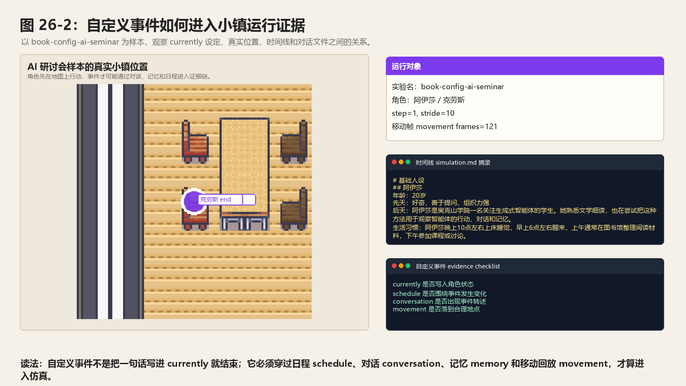
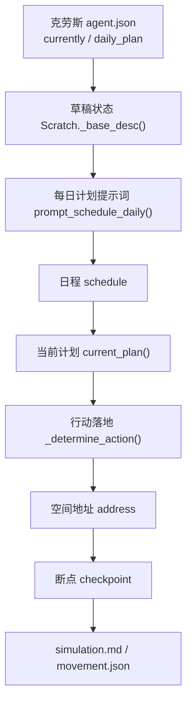
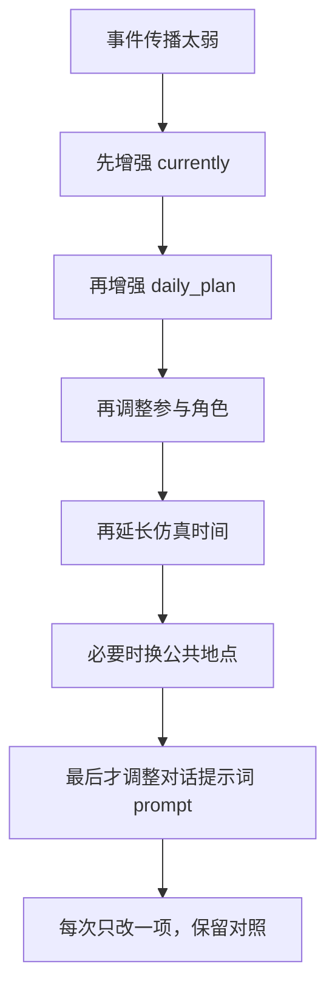

# 第 26 章 设计自己的小镇事件

## 26.1 核心问题

前两章复现论文中的两个经典事件：

- 情人节派对。
- 镇长竞选。

从这里开始设计自己的小镇事件。设计小镇事件不是随便写一句“今天有活动”。一个好的生成式智能体 Generative Agents 事件应该能进入完整行为链：

```text
角色初始意图
  -> 日程生成
  -> 空间地点
  -> 对话传播
  -> 记忆写入
  -> 计划变化
  -> 到场或行动
  -> 结果评价
```

本章的示例事件是：

```text
克劳斯组织一场关于低收入社区中产阶级化影响的小型讨论会。
```

这个事件适合当前项目，因为克劳斯的原始设定就是社会学学生，正在写相关论文。第 26 章只做“事件设计”：使用现有角色、现有地点和现有关系网络，让一个新事件进入小镇运行。新增角色、新地点和新关系的系统性扩展，放在第 27 章。

本章聚焦七个问题：

1. 什么样的事件适合生成式智能体 Generative Agents？
2. 克劳斯讨论会需要改哪些配置？
3. 为什么本章不新增角色、不新增地点？
4. 配置如何进入日程 schedule、对话 dialogue 和行动 action？
5. 如何运行自定义事件实验？
6. 如何判断事件传播和到场？
7. 实验结果应该如何填写？



*图 26-1：自定义事件从设定到评价的闭环。好事件不是写进设定就结束，而是要能传播、落地并被证据验证。*



*图 26-2：自定义事件如何进入小镇运行证据。图片使用 `book-config-ai-seminar` 的真实地图位置、时间线 simulation、移动回放 movement 和断点 checkpoint 生成，展示事件从角色状态进入运行证据的路径。`book-custom-discussion` 的真实结果见 26.13。*

## 26.2 好事件的标准

一个适合小镇仿真的事件，应该满足五个条件。

| 标准 | 克劳斯讨论会如何满足 | 如果缺失会怎样 |
| --- | --- | --- |
| 明确发起者 | 克劳斯是社会学学生，正在写相关论文 | 事件没有行动源头 |
| 明确时间 | 2 月 13 日 16:00 | 无法判断日程和到场 |
| 明确地点 | 奥克山学院图书馆 | 无法验证空间落地 |
| 社交传播 | 克劳斯邀请同学和居民 | 事件只停留在个人计划 |
| 可观察结果 | 对话、到场、讨论内容、后续记忆 | 无法复盘实验是否成立 |

不适合的事件包括：太抽象、没有地点、只影响一个角色、没有时间窗口、所有结果都靠硬编码。

## 26.3 示例事件设定

本章使用下面这个事件：

```text
克劳斯计划在 2 月 13 日下午 4 点，于奥克山学院图书馆组织一次关于低收入社区中产阶级化影响的小型讨论会。他正在邀请对社会议题感兴趣的同学和居民参加。
```

事件拆解如下：

| 设计项 | 本章取值 | 作用 |
| --- | --- | --- |
| 发起者 | 克劳斯 | 事件初始意图写入他的角色配置 |
| 时间 | 2024 年 2 月 13 日 16:00 | 用于判断日程是否覆盖事件窗口 |
| 地点 | 奥克山学院，图书馆 | 使用项目已有地点，不修改地图 |
| 传播方式 | 克劳斯通过对话邀请其他角色 | 用 `conversation.json` 验证传播 |
| 候选参与者 | 玛丽亚、阿伊莎、沃尔夫冈、伊莎贝拉 | 不预先写死他们一定参加 |
| 评价指标 | 知道人数、邀请路径、到场人数、讨论内容 | 用证据文件复盘 |

这章只改发起者克劳斯。其他角色不改。这样才能观察“他们是否被克劳斯影响”，而不是把每个人的结果提前写进人设。

## 26.4 本章改动清单

克劳斯讨论会的最小改动包只有一个文件：

```text
generative_agents/frontend/static/assets/village/agents/克劳斯/agent.json
```

需要展示两个字段的改动：

| 改动 | 字段 | 是否必须 | 作用 |
| --- | --- | --- | --- |
| 改动一 | `currently` | 必须 | 把“下午 4 点图书馆讨论会”写入当前目标 |
| 改动二 | `scratch.daily_plan` | 建议 | 提高日程 schedule 生成讨论会的稳定性 |

不需要改的内容同样要说清楚：

| 不改项 | 原因 |
| --- | --- |
| 不改 `start.py` | 本章不新增角色，克劳斯等角色已经在 `personas` 白名单中 |
| 不改 `maze.json` | 奥克山学院图书馆已经存在于世界地图 Maze |
| 不改其他角色 `agent.json` | 不能硬编码他们一定知道或参加讨论会 |
| 不改提示词 prompt | 先观察配置能否自然影响规划和对话 |

## 26.5 改动一：修改 currently

原始配置来自：

```text
generative_agents/frontend/static/assets/village/agents/克劳斯/agent.json
```

原始字段是：

```json
"currently": "克劳斯正在撰写一篇关于低收入社区中产阶级化影响的研究论文。"
```

改成：

```json
"currently": "克劳斯正在撰写一篇关于低收入社区中产阶级化影响的研究论文。他计划在2月13日下午4点于奥克山学院图书馆组织一次小型讨论会，并正在邀请对社会议题感兴趣的同学和居民参加。"
```

对应 diff 是：

```diff
-  "currently": "克劳斯正在撰写一篇关于低收入社区中产阶级化影响的研究论文。",
+  "currently": "克劳斯正在撰写一篇关于低收入社区中产阶级化影响的研究论文。他计划在2月13日下午4点于奥克山学院图书馆组织一次小型讨论会，并正在邀请对社会议题感兴趣的同学和居民参加。",
```

这个字段进入角色基础描述 base description。`modules/prompt/scratch.py` 会把 `currently` 和 `daily_plan` 一起放进提示词 prompt：

```python
def _base_desc(self):
    return self.build_prompt(
        "base_desc",
        {
            "name": self.name,
            "age": self.config["age"],
            "innate": self.config["innate"],
            "learned": self.config["learned"],
            "lifestyle": self.config["lifestyle"],
            "daily_plan": self.config["daily_plan"],
            "date": utils.get_timer().daily_format_cn(),
            "currently": self.currently,
        }
    )
```

这段代码说明，`currently` 不是注释。它会进入起床 wake up、日程初始化 schedule_init、每日计划 schedule_daily、对话 dialogue 等多个提示词 prompt 的基础上下文。

## 26.6 改动二：修改 daily_plan

只改 `currently` 是最小改法。如果要让书中实验更稳定，建议同时改 `scratch.daily_plan`。原始字段是：

```json
"daily_plan": "克劳斯一大早就去奥克山学院的图书馆，整日写作，在霍布斯咖啡馆吃饭。"
```

实验版改成：

```json
"daily_plan": "克劳斯一大早就去奥克山学院的图书馆写作。上午整理低收入社区中产阶级化研究资料，中午去霍布斯咖啡馆吃饭并邀请同学和居民，下午4点在奥克山学院图书馆组织小型讨论会。"
```

对应 diff 是：

```diff
-    "daily_plan": "克劳斯一大早就去奥克山学院的图书馆，整日写作，在霍布斯咖啡馆吃饭。"
+    "daily_plan": "克劳斯一大早就去奥克山学院的图书馆写作。上午整理低收入社区中产阶级化研究资料，中午去霍布斯咖啡馆吃饭并邀请同学和居民，下午4点在奥克山学院图书馆组织小型讨论会。"
```

`daily_plan` 会进入 `schedule_daily` 提示词 prompt。代码位置仍然在 `modules/prompt/scratch.py`：

```python
def prompt_schedule_daily(self, wake_up, daily_schedule):
    hourly_schedule = ""
    for i in range(wake_up):
        hourly_schedule += f"[{i}:00] 睡觉\n"
    for i in range(wake_up, 24):
        hourly_schedule += f"[{i}:00] <活动>\n"

    prompt = self.build_prompt(
        "schedule_daily",
        {
            "base_desc": self._base_desc(),
            "agent": self.name,
            "daily_schedule": "；".join(daily_schedule),
            "hourly_schedule": hourly_schedule,
        }
    )
```

`daily_plan` 不是直接写进输出日程，而是通过 `base_desc` 影响模型生成。模型仍然可能安排失败，所以后面必须用真实输出检查。

## 26.7 为什么不改其他角色

候选参与者只通过运行命令加入，不改他们的人设：

```text
克劳斯
玛丽亚
阿伊莎
沃尔夫冈
伊莎贝拉
```

这样设计的理由如下：

| 角色 | 为什么加入实验 | 为什么不改配置 |
| --- | --- | --- |
| 克劳斯 | 发起者，社会学论文与事件主题一致 | 只改他，保留事件源头清晰 |
| 玛丽亚 | 学生、常去咖啡馆，适合观察邀请与兴趣 | 不提前写“她一定参加” |
| 阿伊莎 | 学生、研究语言与社会议题，适合观察转述 | 不提前写“她知道讨论会” |
| 沃尔夫冈 | 学生社交节点，适合观察学院内传播 | 不提前写“他接受邀请” |
| 伊莎贝拉 | 咖啡馆老板，适合观察学院外传播 | 不提前写“她一定帮忙传播” |

如果把这些角色的 `currently` 都写成“下午 4 点参加克劳斯讨论会”，实验会变成剧本。第 26 章要观察的是克劳斯的事件目标能不能通过日程、相遇和对话扩散出去。

## 26.8 为什么不改地图

讨论会地点是：

```text
奥克山学院，图书馆
```

这是项目里已有地点，不需要修改 `maze.json`。可以从世界地图 Maze 中看到图书馆瓦片已经存在，例如：

```json
{"coord": [118, 20], "address": ["奥克山学院", "图书馆", "图书馆沙发"]}
{"coord": [119, 24], "address": ["奥克山学院", "图书馆", "图书馆桌子"]}
{"coord": [123, 26], "address": ["奥克山学院", "图书馆", "书架"]}
```

克劳斯自己的空间记忆 Spatial tree 也已经知道图书馆：

```json
"奥克山学院": {
  "走廊": [],
  "图书馆": [
    "图书馆沙发",
    "图书馆桌子",
    "书架"
  ],
  "教室": [
    "黑板",
    "教室讲台",
    "教室学生座位"
  ]
}
```

因此，第 26 章不新增地点。它使用现有地点承载新事件。新增地点是第 27 章的问题。

## 26.9 配置如何变成行动

改完 `currently` 和 `daily_plan` 后，运行链路是：



行动落地代码在 `modules/agent.py`。它先取当前日程，再用日程描述决定地点：

```python
def _determine_action(self):
    self.logger.info("{} is determining action...".format(self.name))
    plan, de_plan = self.schedule.current_plan()
    describes = [plan["describe"], de_plan["describe"]]
    address = self.spatial.find_address(describes[0], as_list=True)
    if not address:
        tile = self.get_tile()
        kwargs = {
            "describes": describes,
            "spatial": self.spatial,
            "address": tile.get_address("world", as_list=True),
        }
        kwargs["address"].append(
            self.completion("determine_sector", **kwargs, tile=tile)
        )
        arenas = self.spatial.get_leaves(kwargs["address"])
        if len(arenas) == 1:
            kwargs["address"].append(arenas[0])
        else:
            kwargs["address"].append(self.completion("determine_arena", **kwargs))
        objs = self.spatial.get_leaves(kwargs["address"])
        if len(objs) == 1:
            kwargs["address"].append(objs[0])
        elif len(objs) > 1:
            kwargs["address"].append(self.completion("determine_object", **kwargs))
        address = kwargs["address"]
```

这段代码解释了为什么地点必须写清楚。如果日程里只有“组织讨论会”，模型可能需要再判断 sector、arena、object。如果日程里出现“奥克山学院图书馆”，空间落地更容易走向图书馆。

## 26.10 运行命令

建议起始时间设为：

```text
20240213-08:00
```

讨论会时间是 16:00。从 08:00 开始，运行 72 个仿真步 step、每步 10 分钟，覆盖 08:00 到 20:00：

```text
72 * 10 分钟 = 720 分钟 = 12 小时
```

先进入项目运行目录：

```bash
cd generative_agents
```

如果之前跑过同名实验，非断点恢复 resume 模式会要求重新输入名称。正式复现实验可以换一个新的 `--name`，或者先清理旧结果：

```bash
rm -rf results/checkpoints/book-custom-discussion
rm -rf results/compressed/book-custom-discussion
```

运行实验：

```bash
python start.py --name book-custom-discussion --start "20240213-08:00" --step 72 --stride 10 --agents "克劳斯,玛丽亚,阿伊莎,沃尔夫冈,伊莎贝拉" --verbose info --log book-custom-discussion.log
```

压缩结果：

```bash
python compress.py --name book-custom-discussion
```

命令参数解释：

| 参数 | 含义 | 本实验取值 |
| --- | --- | --- |
| `--name` | 实验名 | `book-custom-discussion` |
| `--start` | 小镇开始时间 | `20240213-08:00` |
| `--step` | 仿真步数 step | 72 |
| `--stride` | 每步推进时间 stride | 10 分钟 |
| `--agents` | 参与角色 | 克劳斯、玛丽亚、阿伊莎、沃尔夫冈、伊莎贝拉 |
| `--log` | 日志文件 | `book-custom-discussion.log` |

运行结束后关注：

```text
results/checkpoints/book-custom-discussion/book-custom-discussion.log
results/checkpoints/book-custom-discussion/conversation.json
results/compressed/book-custom-discussion/simulation.md
results/compressed/book-custom-discussion/movement.json
```

## 26.11 控制台输出怎么读

自定义事件的控制台输出要分两层读。

第一层是系统是否跑通。日志中应该出现：

```text
克劳斯.reset
克劳斯 -> wake_up
克劳斯 -> schedule_init
克劳斯 -> schedule_daily
克劳斯 -> schedule_decompose
克劳斯 percept ... concepts
克劳斯.summary @ ...
llm:
  summary:
    total: S:...,F:.../R:...
```

这只能说明仿真正常推进，还不能说明“讨论会传播成功”。

第二层才是事件是否出现。要看：

| 位置 | 应该看什么 | 能证明什么 |
| --- | --- | --- |
| `book-custom-discussion.log` | 克劳斯的 `summary` 是否出现讨论会或邀请 | 发起者目标是否进入行动 |
| `conversation.json` | 是否有人听到讨论会，是否包含时间地点 | 事件是否传播 |
| `simulation.md` | 时间线是否出现准备、邀请、到场、讨论 | 事件是否成为故事线 |
| `movement.json` | 16:00 前后角色是否到图书馆 | 事件是否空间落地 |

自定义事件最容易犯的错误，是把“角色自己计划了事件”误读成“事件已经进入小镇社会网络”。

## 26.12 观察关键词

在输出中搜索：

```text
讨论会
中产阶级化
低收入社区
图书馆
下午4点
下午 4 点
社会议题
克劳斯
```

建议按下面顺序读结果：

| 顺序 | 文件 | 阅读重点 | 判断问题 |
| --- | --- | --- | --- |
| 1 | `simulation.md` | 搜索事件关键词，查看时间线和活动记录 | 事件是否进入角色行为 |
| 2 | `conversation.json` | 查看谁向谁提到事件，是否包含时间地点 | 事件是否发生传播 |
| 3 | `movement.json` | 检查 15:50-17:00 附近角色位置和行动 action | 角色是否真的到达事件地点 |
| 4 | 断点 checkpoint JSON | 查看相关角色记忆 memory、日程 schedule、行动 action | 如果结果异常，排查信息是否写入状态 |

## 26.13 真实实验结果：book-custom-discussion

本次实验真实跑完了 72 个仿真步 step。中途在第 67 步后断点恢复 resume，又继续跑了 5 步，最后生成到：

```text
simulate-20240213-1950.json
```

也就是从 `2024-02-13 08:00` 运行到 `2024-02-13 19:50`。运行结束后执行：

```bash
python compress.py --name book-custom-discussion
```

压缩结果生成成功：

| 文件 | 结果 | 用途 |
| --- | --- | --- |
| `book-custom-discussion.log` | 约 4.7 MB | 查看启动、日程 schedule、感知 percept、总结 summary 和错误 |
| `conversation.json` | 24 个对话时间点 | 观察事件是否通过对话 conversation 传播 |
| `simulation.md` | 约 86 KB | 阅读人类可理解的时间线 simulation |
| `movement.json` | 4321 个可回放帧 | 检查角色位置、行动 action 和前端回放 movement |
| `storage/*/associate/docstore.json` | 5 个角色都生成本地记忆 storage | 检查事件 event、对话 chat 和想法 thought 是否落盘 |

日志 log 中没有检索到 `Traceback`、`ERROR`、`Exception`。所以这不是系统运行失败，而是一次非常典型的“事件目标强度不足”的实验。

第一步先看运行时的真实配置。当前克劳斯的静态配置仍然是原始版本：

```json
"currently": "克劳斯正在撰写一篇关于低收入社区中产阶级化影响的研究论文。"
```

```json
"daily_plan": "克劳斯一大早就去奥克山学院的图书馆，整日写作，在霍布斯咖啡馆吃饭。"
```

也就是说，本次真实运行没有把 26.5 和 26.6 中的“下午 4 点讨论会”真正写入 `agent.json`。这点非常关键。读结果时不能把它当成“已经增强配置后的正式讨论会实验”，而应该把它当成一个基线 baseline：只保留克劳斯原始论文目标时，小镇会自然演化成什么样。

生成的初始日程 schedule 也证明了这一点。克劳斯的计划里有论文写作，但没有显式的“下午 4 点组织讨论会”：

| 时间 | 生成日程 schedule | 说明 |
| --- | --- | --- |
| 09:00-10:00 | 在图书馆查阅关于低收入社区中产阶级化的相关文献和学术资料 | 主题进入日程 |
| 10:00-11:00 | 开始撰写关于中产阶级化的研究论文，搭建论文框架和论点 | 论文写作成立 |
| 15:00-16:00 | 继续撰写研究论文，整理访谈数据和实地观察记录 | 接近事件窗口，但仍是个人写作 |
| 16:00-17:00 | 继续撰写研究论文，撰写论文中关于社区文化变迁的章节 | 没有生成“讨论会” |
| 17:00-18:00 | 在霍布斯咖啡馆吃晚饭 | 离开图书馆 |

这说明：只写“克劳斯正在写中产阶级化论文”，足以让模型生成学术活动，但不足以稳定生成“下午 4 点组织讨论会”这种带时间、地点、传播目标的社会事件。

关键词统计也很清楚：

| 关键词 | `conversation.json` | `simulation.md` | 解读 |
| --- | ---: | ---: | --- |
| `讨论会` | 0 | 0 | 显式讨论会没有成立 |
| `中产阶级化` | 2 | 14 | 论文主题成立 |
| `置换效应` | 13 | 21 | 讨论内容持续围绕论文核心概念 |
| `图书馆` | 31 | 240 | 空间落地非常稳定 |
| `四点` | 1 | 3 | 出现了一次四点约定，但不是多人邀请 |
| `图书馆老位置` | 1 | 1 | 阿伊莎和克劳斯约定在图书馆继续协作 |

最有代表性的对话发生在 15:20。克劳斯和阿伊莎讨论访谈编码，最后约定四点在图书馆继续润色过渡段：

```text
克劳斯：这个'记忆中的场所'的意象太贴合了，我记得有个受访者提到过'我还能闻到那家面包店的味道'，这种感官记忆简直就像是莎翁笔下的独白——下午你方便的话我们一起把这段过渡文字敲定下来？

阿伊莎：四点图书馆老位置见！我手头正好在读莎翁关于流亡与故土的段落，有一句意象和你那个面包店的气味记忆简直跨时空呼应——等下碰头时我把原文带过来，咱们一起把这段过渡文字敲定。
```

这段很值得读。它不是“讨论会邀请”，而是“一对一协作约定”。模型抓住了克劳斯的论文主题、阿伊莎的文学背景、图书馆这个空间，以及下午继续讨论的时间线。它没有抓住的是“组织一场面向多人传播的小型讨论会”。

16:00 前后的位置和行动如下：

| 时间 | 克劳斯 | 阿伊莎 | 沃尔夫冈 | 玛丽亚 | 伊莎贝拉 |
| --- | --- | --- | --- | --- | --- |
| 15:50 | 图书馆桌子，撰写分析笔记 | 图书馆桌子，精读第二篇参考文献 | 约翰逊公园训练 | 宿舍房间直播 | 咖啡馆公告板 |
| 16:00 | 图书馆桌子，回顾社区文化变迁访谈笔记 | 图书馆书架，找文学批评资料 | 约翰逊公园训练 | 宿舍房间直播 | 供应店核对派对用品 |
| 16:30 | 图书馆桌子，撰写社区抵抗与韧性 | 图书馆桌子，记录莎士比亚批评观点 | 约翰逊公园训练 | 宿舍房间直播 | 供应店检查彩带库存 |
| 16:50 | 图书馆桌子，融入访谈引用和田野观察案例 | 图书馆桌子，撰写文献阅读笔记 | 约翰逊公园训练 | 宿舍房间直播 | 供应店整理派对材料 |

按 26.15 的标准判断，本次实验不能算“讨论会完整成立”。更准确的判断是：

| 判断项 | 结论 | 证据 |
| --- | --- | --- |
| 发起者在正确地点 | 成立 | 克劳斯 15:50-16:50 一直在奥克山学院图书馆 |
| 事件主题进入行为 | 成立 | 克劳斯持续写中产阶级化、置换效应、社区文化变迁 |
| 至少一名非发起者知道相关内容 | 成立 | 阿伊莎多次参与论文讨论；沃尔夫冈在 15:00 给出写作建议 |
| 明确讨论会邀请 | 不成立 | `conversation.json` 中没有 `讨论会`，也没有面向多人发出时间地点邀请 |
| 16:00 左右多人到场 | 不成立 | 16:00 只有克劳斯和阿伊莎在图书馆，沃尔夫冈、玛丽亚、伊莎贝拉不在 |
| 有对话或行为证据 | 部分成立 | 16:30、16:50 有阿伊莎和克劳斯的实质对话，但不是多人讨论会 |

16:30 的对话说明“内容讨论”确实发生了：

```text
阿伊莎：克劳斯，我刚到。你写的社区抵抗部分让我想到《亨利四世》中福斯塔夫在流亡边缘的独白，那种'在故土却无家可归'的矛盾感，是不是正好可以呼应你这里要论证的韧性叙事？

克劳斯：福斯塔夫那个意象确实抓人！'在故土却无家可归'正好能扣住我要论证的'被边缘化的居民反而构建出替代性归属感'这个点。
```

这段对话的业务含义很强：阿伊莎把莎士比亚的文学意象带入克劳斯的社会学论文，克劳斯把它转成“边缘化居民的替代性归属感”。这不是闲聊，是跨学科协作。它证明原始配置已经足以产生高质量的主题互动。

沃尔夫冈也短暂进入了克劳斯的论文链路。15:00 的对话中，他建议克劳斯用田野场景作为引子，再接置换效应数据：

```text
沃尔夫冈：我看你那段访谈记录里的引述挺有力的，如果再配上房租涨幅的数据，放在一起应该能形成田野证据和量化支撑的双重论证。

克劳斯：找到了一段挺有冲击力的，是一个住了二十多年的老住户说'这条街已经不是我认识的样子了'，不过我还在想怎么把房租涨幅的数据自然地嵌进去。
```

这说明事件主题产生了弱传播：沃尔夫冈知道克劳斯在写置换效应，也参与了一次方法建议。但他没有收到“四点来图书馆参加讨论会”的邀请，16:00 也没有到场。

玛丽亚和伊莎贝拉基本没有进入讨论会链路。玛丽亚的主线是学习、直播、情人节派对准备；伊莎贝拉的主线是咖啡馆经营和派对筹备。她们与克劳斯或学院同学有交集，但不是这场中产阶级化讨论的传播节点。

记忆 memory 侧也能看到同样的结果。克劳斯的本地记忆 storage 中生成了 194 条节点：

| 角色 | 想法 thought | 事件 event | 对话 chat | 与本实验相关的判断 |
| --- | ---: | ---: | ---: | --- |
| 克劳斯 | 18 | 158 | 18 | 论文主题和多次对话完整落盘 |
| 阿伊莎 | 35 | 146 | 13 | 和克劳斯的跨学科协作被持续记录 |
| 沃尔夫冈 | 18 | 126 | 4 | 记录到部分克劳斯论文相关事件 |
| 玛丽亚 | 18 | 105 | 5 | 主要是咖啡馆、学习和派对线 |
| 伊莎贝拉 | 18 | 130 | 9 | 主要是咖啡馆和情人节派对线 |

克劳斯记忆中最能代表这次实验的一条对话 chat 节点是：

```text
20240213-15:30
克劳斯与阿伊莎讨论访谈编码发现的主题（'被背叛'与'仪式性告别'），计划以受访者原话作为情感锚点，结合置换效应数据论证，并在下午四点于图书馆会合，借莎翁关于流亡与故土的意象润色过渡段落。
```

这条记忆说明，“四点图书馆会合”被系统记住了；但记住的是“克劳斯和阿伊莎协作润色论文”，不是“克劳斯组织小型讨论会”。这就是事件设计时最容易混淆的边界：一个主题可以进入记忆，不等于一个社会事件已经形成。

本次实验还暴露了一个输出质量问题。`conversation.json` 中出现 4 次 JSON 残留 JSON residue，例如：

```text
克劳斯：{"res": "这个主意太棒了！用街角杂货店关门做引子确实比干巴巴的数据罗列有冲击力多了..."
```

这类残留不会让仿真主链路崩溃，但会污染书中的对话示例，也会影响前端回放观感。后续做工程优化时，需要在结构化输出 structured output 解析后增加更稳的清洗逻辑。

所以，本次 `book-custom-discussion` 的结论不能写成“成功举办讨论会”。更准确的结论如下：

| 目标 | 结果 | 原因 |
| --- | --- | --- |
| 克劳斯进入论文写作状态 | 成功 | 原始 `currently` 已经写明中产阶级化论文 |
| 图书馆空间落地 | 成功 | 克劳斯大部分时间在奥克山学院图书馆 |
| 主题对话生成 | 成功 | 阿伊莎、沃尔夫冈都围绕论文给出建议 |
| 四点事件窗口 | 部分成功 | 15:20 约定“四点图书馆老位置见”，16:30 和 16:50 发生后续讨论 |
| 多人小型讨论会 | 未成立 | 运行时配置没有写入“组织讨论会、邀请他人、下午 4 点” |
| 社交传播 | 弱传播 | 阿伊莎深度参与，沃尔夫冈短暂参与，玛丽亚和伊莎贝拉没有进入主题 |

这次结果给读者的真正启发是：生成式智能体 Generative Agents 会尊重角色设定的重心。克劳斯原始设定是“写论文”，所以系统自然演化出论文写作、资料查阅、同学建议和跨学科润色。要让它从“个人论文任务”变成“小镇社会事件”，必须把事件的时间、地点、邀请对象和传播目标明确写进发起者的 `currently` 和 `daily_plan`。

下一轮想让讨论会稳定成立，先不要改其他角色，也不要改提示词 prompt。只需要确认克劳斯的真实 `agent.json` 已经包含下面两句：

```text
他计划在2月13日下午4点于奥克山学院图书馆组织一次小型讨论会。
```

```text
中午去霍布斯咖啡馆吃饭并邀请同学和居民，下午4点在奥克山学院图书馆组织小型讨论会。
```

然后换一个新实验名重跑，例如：

```bash
python start.py --name book-custom-discussion-v2 --start "20240213-08:00" --step 72 --stride 10 --agents "克劳斯,玛丽亚,阿伊莎,沃尔夫冈,伊莎贝拉" --verbose info --log book-custom-discussion-v2.log
```

如果 `v2` 中仍然只生成论文协作，而没有讨论会，就说明问题不在配置是否写入，而在日程 schedule、对话 dialogue 或行动 action 的转化强度上。那时再考虑增强事件文本或观察提示词 prompt。

## 26.14 到场判断

上一节的真实结果已经示范了一个边界：角色在图书馆，不等于参加讨论会；角色和克劳斯聊了论文，也不等于收到活动邀请。到场判断必须同时看位置、行为、信息来源和对话内容。

讨论会发生地点是：

```text
奥克山学院，图书馆
```

时间窗口建议按下面范围看：

```text
15:50-17:00
```

判断到场时重点查看：

- 角色是否在奥克山学院图书馆。
- 行动 action 是否与讨论、学习、参加活动、与克劳斯交流相关。
- 是否有相关对话。
- 该角色此前是否听过或被邀请过。

如果角色在图书馆但只是读书，不一定算参加。如果角色和克劳斯在图书馆讨论社会议题，可以算参加。如果有人到场但没有信息来源，要标记为“地点匹配，来源不足”。

## 26.15 事件是否真正发生

一个自定义事件真正发生，建议满足：

```text
发起者在正确地点
  + 至少一名非发起者知道事件
  + 至少一名角色在时间窗口到场或讨论
  + 有对话或行为证据
```

可以用下面的判断表：

| 情况 | 结论 |
| --- | --- |
| 只有克劳斯自己准备讨论会 | 个人计划成立，社会事件未成立 |
| 有人听到讨论会，但没人到场 | 传播成立，协同行动失败 |
| 有人到图书馆，但没有听过讨论会 | 地点重合，不能直接算参加 |
| 有邀请、有到场、有讨论内容 | 事件成立 |
| 有转述但时间地点丢失 | 传播质量不足 |

## 26.16 不要硬编码结果

设计事件时，最容易犯的错是硬编码所有角色都会参加。例如，直接把每个角色 `currently` 都写成：

```text
今天下午4点要参加克劳斯的讨论会。
```

这样会让实验失去意义。更好的做法是：

- 只给发起者明确目标。
- 给潜在参与者合适的运行机会，而不是写死结果。
- 让信息通过对话传播。
- 让到场通过计划、记忆和空间相遇生成。

第 26 章要观察的是涌现，不是脚本。

## 26.17 如何增强事件稳定性

如果事件传播太弱，可以逐步增强：

| 顺序 | 增强方式 | 改动位置 | 何时使用 |
| --- | --- | --- | --- |
| 1 | 增强当前目标 currently | 克劳斯 `currently` | 默认第一步 |
| 2 | 增强日计划 daily_plan | 克劳斯 `scratch.daily_plan` | 日程中没有讨论会时 |
| 3 | 调整参与角色 | `--agents` 参数 | 克劳斯遇不到人时 |
| 4 | 延长仿真时间 | `--step` 参数 | 邀请发生太晚时 |
| 5 | 换公共地点 | 事件设定 | 图书馆相遇太少时 |
| 6 | 调整对话提示词 prompt | prompt 文件 | 配置已经有效但对话仍不提事件时 |

调参逻辑图：



## 26.18 失败模式

自定义事件常见失败如下：

| 失败表现 | 可能原因 | 检查位置 | 修正方向 |
| --- | --- | --- | --- |
| 克劳斯日程没有讨论会 | `currently` 或 `daily_plan` 太弱 | `simulation.md`、checkpoint `schedule` | 增强克劳斯目标 |
| 克劳斯没有遇到别人 | 角色集合或空间相遇不足 | `movement.json` | 加入更容易相遇的角色或延长时间 |
| 对话没有提事件 | `generate_chat` 没检索到当前目标 | `conversation.json`、日志 | 观察记忆检索，必要时增强目标文本 |
| 时间地点丢失 | 对话摘要或转述压缩过度 | `conversation.json` 与记忆 memory | 复查摘要和聊天记忆 |
| 知道但不到场 | 邀请没有转成计划 | checkpoint `schedule`、`movement.json` | 检查日程修订和行动落地 |
| 到场但无来源 | 偶然在同一地点 | `conversation.json`、`movement.json` | 标记为地点重合，不算传播成功 |

不要只说“模型不行”。先定位失败发生在规划 planning、空间记忆 spatial、对话 dialogue、记忆 memory 还是行动 action。

## 26.19 设计更多事件

除了克劳斯讨论会，还可以设计：

| 事件 | 发起者 | 地点 | 指标 |
| --- | --- | --- | --- |
| 咖啡馆诗歌朗读会 | 亚当或塔玛拉 | 霍布斯咖啡馆 | 到场、朗读相关对话、兴趣传播 |
| 社区安全会议 | 山姆或詹妮弗 | 公共休息室或咖啡馆 | 政策讨论、支持反对态度 |
| 艺术展 | 拉吉夫或詹妮弗 | 公园或咖啡馆 | 邀请、到场、艺术兴趣对话 |
| 学习小组 | 玛丽亚或克劳斯 | 图书馆 | 学生传播、协同行动、关系形成 |

好的事件应该让角色设定与地点匹配。事件不是越大越好，而是越能被证据复查越好。

## 26.20 本章小结

自定义事件不是往角色设定里塞一句话就结束。一个好事件必须能被发起、传播、记住、影响行动，并最终留下证据。

| 本章内容 | 核心结论 |
| --- | --- |
| 好事件标准 | 事件要有发起者、时间、地点、传播路径、差异反应和可观察结果。 |
| 示例事件 | 克劳斯组织中产阶级化讨论会，用来展示从设定到评价的完整链路。 |
| 配置改动 | 本章只改克劳斯 `currently` 和建议改 `scratch.daily_plan`，不改其他角色。 |
| 地点选择 | 奥克山学院图书馆已经存在于世界地图 Maze 和克劳斯空间记忆 Spatial。 |
| 角色选择 | 角色要服务传播路径和评价目标，不能提前写死参加结果。 |
| 运行命令 | `book-custom-discussion` 覆盖 08:00 到 19:50，足够观察 16:00 讨论会窗口。 |
| 真实结果 | 本次实跑证明原始配置能生成高质量论文协作，但没有形成多人讨论会；问题在事件目标没有真实写入运行配置。 |
| 结果材料 | 真实分析要同时看 `simulation.md`、`conversation.json`、`movement.json`、checkpoint 和本地记忆 storage。 |
| 判断标准 | 事件发生要同时看发起者、传播、到场和行为证据。 |
| 失败定位 | 失败时要分别检查规划 planning、空间记忆 spatial、对话 dialogue、记忆 memory 和行动 action。 |

下一章讲如何增加新角色、新地点和新关系。那是从“改事件”进一步走向“扩展小镇世界”。

## 参考资料

- Local data: `generative_agents/frontend/static/assets/village/agents/克劳斯/agent.json`
- Local data: `generative_agents/frontend/static/assets/village/agents/玛丽亚/agent.json`
- Local data: `generative_agents/frontend/static/assets/village/agents/阿伊莎/agent.json`
- Local data: `generative_agents/frontend/static/assets/village/agents/沃尔夫冈/agent.json`
- Local data: `generative_agents/frontend/static/assets/village/agents/伊莎贝拉/agent.json`
- Local data: `generative_agents/frontend/static/assets/village/maze.json`
- Local source: `generative_agents/start.py`
- Local source: `generative_agents/modules/agent.py`
- Local source: `generative_agents/modules/prompt/scratch.py`
- Local source: `generative_agents/modules/memory/spatial.py`
- Local output: `generative_agents/results/compressed/<name>/simulation.md`
- Local output: `generative_agents/results/checkpoints/<name>/conversation.json`
