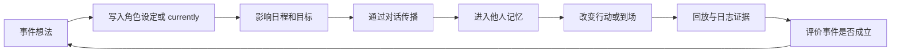

# 第 26 章 设计自己的小镇事件

## 26.1 核心问题

前两章复现论文中的两个经典事件：

- 情人节派对。
- 镇长竞选。

从这里开始设计自己的小镇事件。设计小镇事件不是随便写一句“今天有活动”。一个好的 Generative Agents 事件应该能进入完整行为链：

```text
角色初始意图
  -> 日程生成
  -> 空间地点
  -> 对话传播
  -> 记忆写入
  -> 计划变化
  -> 到场或行动
  -> 结果评价
```

示例事件可以这样写：

```text
克劳斯组织一场关于低收入社区中产阶级化影响的小型讨论会。
```

这个事件适合当前项目，因为克劳斯的原始设定就是社会学学生，正在写相关论文。本章聚焦七个问题：

1. 什么样的事件适合 Generative Agents？
2. 如何把事件写入角色设定？
3. 如何选择地点、时间和参与者？
4. 如何运行自定义事件实验？
5. 如何判断事件是否传播？
6. 如何判断事件是否真正发生？
7. 如何避免事件变成硬编码剧情？



*图 26-1：自定义事件从设定到评价的闭环。好事件不是写进设定就结束，而是要能传播、落地并被证据验证。*

## 26.2 好事件的标准

一个适合小镇仿真的事件，应该满足五个条件。第一，有明确发起者。例如伊莎贝拉办派对，山姆竞选，克劳斯组织讨论会。第二，有明确时间和地点。否则无法评价到场和计划变化。第三，需要通过社交传播。如果所有人一开始就知道，实验价值会下降。第四，允许不同反应。有人参加，有人拒绝，有人忘记，有人转述，有人提出问题。第五，能产生可观察结果。例如到场、对话、计划改变、关系变化。不适合的事件包括：

- 太抽象，没有地点。
- 只影响一个角色。
- 没有时间窗口。
- 所有结果都要靠硬编码。

## 26.3 示例事件设定

本章会使用下面这个示例：

```text
克劳斯计划在 2 月 13 日下午 4 点，于奥克山学院图书馆组织一次关于低收入社区中产阶级化影响的小型讨论会。他正在邀请对社会议题感兴趣的同学和居民参加。
```

这个事件具备好事件特征。发起者：

```text
克劳斯
```

事件时间可以这样写：

```text
2 月 13 日 16:00
```

事件地点可以这样写：

```text
奥克山学院图书馆
```

传播方式可以这样设计：

```text
克劳斯通过对话邀请其他角色。
```

可能参与者可以这样设定：

```text
玛丽亚、阿伊莎、沃尔夫冈、梅、伊莎贝拉
```

评价指标可以这样设计：

```text
知道人数、邀请路径、到场人数、讨论内容、后续关系变化。
```

## 26.4 修改哪里

最小改法是修改克劳斯的 `currently`。文件：

```text
generative_agents/frontend/static/assets/village/agents/克劳斯/agent.json
```

将原内容调整为下面这样：

```json
"currently": "克劳斯正在撰写一篇关于低收入社区中产阶级化影响的研究论文。"
```

改成下面这样的写法：

```json
"currently": "克劳斯正在撰写一篇关于低收入社区中产阶级化影响的研究论文。他计划在2月13日下午4点于奥克山学院图书馆组织一次小型讨论会，并正在邀请对社会议题感兴趣的同学和居民参加。"
```

这是最少侵入的做法。不需要改源码。只让角色当前目标发生变化。如果想让事件更稳定，也可以修改 `daily_plan`，加入：

```text
下午准备并组织讨论会。
```

但不要一次改太多。实验设计要先从最小改动开始，观察系统能否自然传播。

## 26.5 选择参与角色

建议先使用小规模角色：

```text
克劳斯
玛丽亚
阿伊莎
沃尔夫冈
伊莎贝拉
```

这样设计的理由如下：

克劳斯是发起者。玛丽亚适合观察共同兴趣和关系形成。阿伊莎和沃尔夫冈是学生社交节点。伊莎贝拉在咖啡馆，适合观察事件是否传播到学院外。如果想增加多样性，可以加入：

```text
山姆
汤姆
梅
亚当
```

其中山姆可带来公共议题交叉，汤姆可观察怀疑态度，梅和亚当可观察跨职业传播。

## 26.6 运行命令

建议起始时间可以这样设定：

```text
20240213-08:00
```

运行命令可以直接照着执行：

```bash
cd generative_agents
python start.py --name book-custom-discussion --start "20240213-08:00" --step 72 --stride 10 --agents "克劳斯,玛丽亚,阿伊莎,沃尔夫冈,伊莎贝拉"
```

压缩命令可以直接照着执行：

```bash
python compress.py --name book-custom-discussion
```

查看命令可以直接照着执行：

```text
results/compressed/book-custom-discussion/simulation.md
results/checkpoints/book-custom-discussion/conversation.json
results/compressed/book-custom-discussion/movement.json
```

如果讨论会时间是 16:00，step=72 从 08:00 到 20:00，足够覆盖事件。

## 26.7 观察关键词

在输出中搜索下面内容：

```text
讨论会
中产阶级化
低收入社区
图书馆
下午4点
社会议题
克劳斯
```

建议记录下面信息，用于后续复盘：

- 克劳斯是否提到讨论会。
- 谁听到了。
- 是否提到时间地点。
- 是否有人转述。
- 16:00 附近谁在图书馆。
- 对话内容是否围绕社会议题。

## 26.8 事件传播表

建议记录这些信息，用于后续复盘：

| 时间 | 来源 | 接收者 | 地点 | 内容 | 是否含时间地点 |
|---|---|---|---|---|---|
| 09:30 | 克劳斯 | 玛丽亚 | 霍布斯咖啡馆 | 邀请参加讨论会 | 是 |
| 11:00 | 玛丽亚 | 阿伊莎 | 学院 | 转述讨论会 | 部分 |

注意区分直接邀请和转述。直接邀请：

```text
克劳斯邀请某人参加。
```

转述内容可以这样判断：

```text
某人告诉另一个人克劳斯有讨论会。
```

二者都算传播，但意义不同。

## 26.9 到场判断

讨论会发生地点可以记录为：

```text
奥克山学院，图书馆
```

时间可以记录为下面这种形式：

```text
16:00
```

判断到场时重点查看：

- 15:50 到 17:00 之间角色是否在图书馆。
- action 是否与讨论、学习、参加活动、与克劳斯交流相关。
- 是否有相关对话。

如果角色在图书馆但只是读书，不一定算参加。如果角色和克劳斯在图书馆讨论社会议题，可以算参加。

## 26.10 事件是否真正发生

一个自定义事件真正发生，建议满足：

```text
发起者在正确地点
  + 至少一名非发起者知道事件
  + 至少一名角色在时间窗口到场或讨论
  + 有对话或行为证据
```

如果只有克劳斯自己在图书馆，不能算社会事件成功。如果多人知道但没人到场，说明传播成功但协同行动失败。如果有人到场但没有信息来源，可能是偶然或幻觉。

## 26.11 不要硬编码结果

设计事件时，最容易犯的错是硬编码所有角色都会参加。例如，直接把每个角色 `currently` 都写成：

```text
今天下午4点要参加克劳斯的讨论会。
```

这样会让实验失去意义。更好的做法是：

- 只给发起者明确目标。
- 给潜在参与者合适兴趣或地点。
- 让信息通过对话传播。
- 让到场通过计划和记忆生成。

我们要观察的是涌现，不是脚本。

## 26.12 如何增强事件稳定性

如果事件传播太弱，可以逐步增强。第一步，修改发起者 currently。第二步，修改发起者 daily_plan，加入准备或邀请。第三步，选择更容易相遇的角色。第四步，选择公共地点，例如咖啡馆或图书馆。第五步，延长仿真时间。第六步，微调对话 prompt，让角色更愿意提及当前计划。不要一开始就修改多个角色。否则无法判断是哪个改动起作用。

## 26.13 失败模式

自定义事件常见失败有六类。第一，发起者日程没有事件。currently 没有影响 schedule。第二，发起者没有遇到别人。空间相遇不足。第三，对话没有提事件。generate_chat 没检索到当前目标。第四，摘要丢失关键细节。时间地点没有进入 chat memory。第五，知道但不到场。邀请没有转成计划。第六，到场但没有证据。可能是偶然在同一地点。每类失败对应不同模块。不要只说“模型不行”，要定位是 planning、dialogue、memory 还是 spatial。

## 26.14 实验记录模板

```markdown
# 自定义事件实验记录

## 事件设定
- 发起者：
- 时间：
- 地点：
- 事件描述：

## 修改内容
- 修改文件：
- 修改字段：
- 修改前：
- 修改后：

## 运行配置
- name:
- agents:
- start:
- step:
- stride:
- llm:

## 传播路径
| 时间 | 来源 | 接收者 | 证据 |

## 到场情况
| 角色 | 是否到场 | 时间 | 地点 | 行为证据 |

## 结论
- 传播是否成功：
- 事件是否发生：
- 主要失败点：
```

## 26.15 设计更多事件

除了克劳斯讨论会，还可以设计：

咖啡馆诗歌朗读会。发起者：亚当或塔玛拉。地点：霍布斯咖啡馆。指标：到场、朗读相关对话、兴趣传播。社区安全会议。发起者：山姆或詹妮弗。地点：公共休息室或咖啡馆。指标：政策讨论、支持反对态度。艺术展。发起者：拉吉夫或詹妮弗。地点：公园或咖啡馆。指标：邀请、到场、艺术兴趣对话。学习小组。发起者：玛丽亚或克劳斯。地点：图书馆。指标：学生传播、协同行动、关系形成。好的事件应该让角色设定与地点匹配。

## 26.16 本章小结

自定义事件不是往角色设定里塞一句话就结束。一个好事件必须能被发起、传播、记住、影响行动，并最终留下证据。

| 本章内容 | 核心结论 |
| --- | --- |
| 好事件标准 | 事件要有发起者、时间、地点、传播路径、差异反应和可观察结果。 |
| 示例事件 | 克劳斯组织中产阶级化讨论会，用来展示从设定到评价的完整链路。 |
| 最小改法 | 先修改发起者 `currently`，不要一开始大改地图和代码。 |
| 角色选择 | 角色要服务传播路径和评价目标。 |
| 结果材料 | 运行后重点看 `simulation.md`、`conversation.json` 和 `movement.json`。 |
| 判断标准 | 事件发生要同时看发起者、传播、到场和行为证据。 |
| 设计原则 | 不要硬编码所有参与者，要让信息通过对话传播。 |
| 失败定位 | 失败时要分别检查 planning、spatial、dialogue、memory 和 reflection。 |
| 扩展方向 | 诗歌会、安全会议、艺术展、学习小组都可以作为后续事件模板。 |

下一章讲如何增加新角色、新地点和新关系。那是从“改事件”进一步走向“扩展小镇世界”。

## 参考资料

- Local data: `generative_agents/frontend/static/assets/village/agents/克劳斯/agent.json`
- Local data: `generative_agents/frontend/static/assets/village/agents/玛丽亚/agent.json`
- Local source: `generative_agents/start.py`
- Local output: `generative_agents/results/compressed/<name>/simulation.md`
- Local output: `generative_agents/results/checkpoints/<name>/conversation.json`
