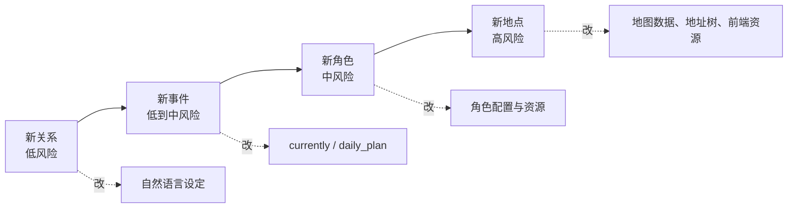
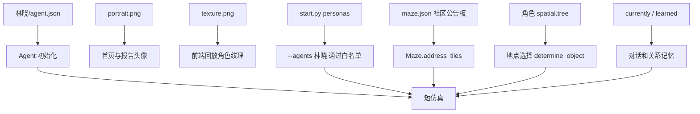

# 第 27 章 增加新角色、新地点、新关系

## 27.1 核心问题

新事件解决“发生什么”，小镇扩展解决“谁在什么地方、带着什么关系发生”。小镇扩展主要包括三类改动：

- 增加新角色。
- 增加新地点。
- 增加新关系。

这三类扩展难度不同。最容易的是新关系。因为关系主要通过自然语言设定、对话和记忆形成。中等难度是新角色。需要新增角色配置、头像、纹理、初始坐标，并加入 `personas` 列表。最难的是新地点。因为地点牵涉后端 `maze.json`、前端 tilemap、碰撞、地址树和角色空间记忆。本章聚焦七个问题：

1. 新角色需要哪些文件？
2. 如何设计角色 `agent.json`？
3. 新关系应该写在哪里？
4. 如何让关系通过仿真形成，而不是硬编码？
5. 新地点为什么最难？
6. 如何在不改地图的情况下模拟新地点事件？
7. 扩展后如何验证系统仍然正常？



*图 27-1：角色、地点、关系扩展难度。扩展越接近地图和资源层，风险越高；初学者应先从关系和事件开始。*


*图 27-2：扩展小镇的四层断层风险。图片把角色层 agent.json、世界层 maze.json、前端层 tile map 和语言层 prompt 放在同一张风险控制台中，突出“后端知道、前端看不到”和“角色能说、地图不能走”两类断层。*

## 27.2 扩展优先级

建议读者按下面顺序扩展：

```text
新关系
  -> 新事件
  -> 新角色
  -> 新地点
```

原因可以从下面几个方面解释：

新关系只需要改自然语言设定和实验设计。新事件只需要改 currently 和可能的 daily_plan。新角色需要新增资源和配置。新地点需要改地图数据，风险最高。如果刚开始学习项目，不建议直接改地图。先在现有地点中设计新事件，效果更稳定。

## 27.3 本章使用的完整扩展示例

这一章不要停留在“原则上要改这些地方”。下面直接设计一个可执行扩展示例，并把涉及到的文件一个个列出来。

示例目标是同时完成三件事：

- 增加新角色：本地记者 `林晓`。
- 增加新地点：霍布斯咖啡馆里的 `社区公告板`。
- 增加新关系：林晓认识伊莎贝拉，准备采访山姆；汤姆可能借采访表达对山姆的不信任。

这里的“新地点”不是新建一栋建筑，而是在现有霍布斯咖啡馆中增加一个 `game_object` 级别的地点。这样既能真实触碰后端地址系统，又不需要读者一上来就改 Tiled 地图资源。完整新建筑会涉及 `tilemap.json`、tileset 图片、碰撞层和前端资源加载，风险更高，应该放到读者熟悉 `maze.json` 以后再做。

本示例涉及下面这些改动：

| 顺序 | 文件或资源 | 改什么 | 不改会怎样 |
| --- | --- | --- | --- |
| 1 | `frontend/static/assets/village/agents/林晓/agent.json` | 新增角色配置、人设、初始坐标、空间记忆 | 角色无法初始化 |
| 2 | `frontend/static/assets/village/agents/林晓/portrait.png` | 新增头像 | 首页和报告头像缺失 |
| 3 | `frontend/static/assets/village/agents/林晓/texture.png` | 新增前端行走纹理 | 回放页面角色无法加载精灵 |
| 4 | `start.py` | 把 `林晓` 加入 `personas` 白名单 | `--agents "林晓"` 直接报 `Unknown agents` |
| 5 | `frontend/static/assets/village/maze.json` | 把一个咖啡馆 tile 改成 `社区公告板` | 后端没有这个地点，角色选址会落空 |
| 6 | `伊莎贝拉/agent.json` | 增加她对社区公告板和林晓的认知 | 关系和地点只存在于林晓视角 |
| 7 | `山姆/agent.json` | 增加他对林晓采访的认知 | 竞选信息不会自然进入采访对话 |
| 8 | `汤姆/agent.json` | 增加他对采访场景的认知 | 反对山姆的关系不容易进入实验 |

这一张表就是读者的施工清单。接下来逐个展开。

## 27.4 新增角色资源目录

当前角色资源位于：

```text
generative_agents/frontend/static/assets/village/agents/<角色名>/
  agent.json
  portrait.png
  texture.png
```

新增林晓时，先建立目录：

```bash
cd generative_agents
mkdir -p frontend/static/assets/village/agents/林晓
```

`portrait.png` 和 `texture.png` 是二进制资源，但不能偷懒复制现有角色。林晓是新增的中国本地记者，头像和行走纹理应该是她自己的形象。这里使用生成头像作为基础，再把同一形象整理成前端可加载的 3 列、4 行行走纹理。

运行用文件放在：

```text
generative_agents/frontend/static/assets/village/agents/林晓/portrait.png
generative_agents/frontend/static/assets/village/agents/林晓/texture.png
```

书中为了让读者看清楚，下面展示的是放大预览图。实际运行文件仍然分别是 `32x32` 和 `96x128`。


*图 27-3：林晓头像资源预览。运行文件为 `frontend/static/assets/village/agents/林晓/portrait.png`，尺寸为 `32x32`，书中使用放大预览展示短发、青绿色外套和记者气质。*


*图 27-4：林晓行走纹理资源预览。运行文件为 `frontend/static/assets/village/agents/林晓/texture.png`，尺寸为 `96x128`，按下、左、右、上四个方向组织为 3 列 x 4 行，和 `sprite.json` 的帧定义一致。*

前端回放里不需要为每个新角色手写加载代码。`frontend/templates/main_script.html` 会根据回放数据中的 `persona_init_pos` 循环加载：

```javascript
image_static = "static/assets/village/agents/" + p + "/texture.png";
this.load.atlas(p, image_static, filename="static/assets/village/agents/sprite.json");
```

所以新角色要出现在回放里，关键不是改前端循环，而是确保 `texture.png` 存在，并且压缩后的 `movement.json` 里包含 `林晓`。

## 27.5 新增角色 agent.json

新建文件：

```text
generative_agents/frontend/static/assets/village/agents/林晓/agent.json
```

完整内容如下：

```json
{
  "name": "林晓",
  "portrait": "assets/village/agents/林晓/portrait.png",
  "coord": [
    74,
    20
  ],
  "currently": "林晓是小镇本地记者，正在霍布斯咖啡馆的社区公告板旁收集居民对镇长竞选和情人节派对的看法。她认识伊莎贝拉，并计划采访山姆。",
  "scratch": {
    "age": 31,
    "innate": "敏锐、外向、谨慎",
    "learned": "林晓是小镇本地记者，长期关注社区活动、公共政策和居民故事。她与伊莎贝拉关系友好，经常在霍布斯咖啡馆采访居民。她知道山姆正在竞选镇长，但还没有判断是否支持他。",
    "lifestyle": "林晓晚上10点半左右上床睡觉，早上6点半左右醒来。上午外出采访，下午整理报道，晚上常去咖啡馆听居民聊天。",
    "daily_plan": "林晓今天上午去霍布斯咖啡馆查看社区公告板，采访伊莎贝拉和山姆，下午整理一篇关于小镇公共生活的报道。"
  },
  "spatial": {
    "address": {
      "living_area": [
        "the Ville",
        "莫雷诺家族的房子",
        "空卧室"
      ]
    },
    "tree": {
      "the Ville": {
        "莫雷诺家族的房子": {
          "空卧室": [
            "床",
            "壁橱",
            "吉他"
          ],
          "公共休息室": [
            "架子",
            "公共休息室桌子",
            "竖琴"
          ],
          "厨房": [
            "厨房水槽",
            "烹饪区",
            "冰箱"
          ]
        },
        "霍布斯咖啡馆": {
          "咖啡馆": [
            "冰箱",
            "咖啡馆顾客座位",
            "烹饪区",
            "厨房水槽",
            "咖啡馆柜台后面",
            "钢琴",
            "社区公告板"
          ]
        },
        "约翰逊公园": {
          "公园": [
            "公园花园"
          ]
        },
        "柳树市场和药店": {
          "商店": [
            "药店柜台后面",
            "药店货架",
            "药店柜台",
            "杂货店货架",
            "杂货店柜台后面",
            "杂货店柜台"
          ]
        }
      }
    }
  }
}
```

这里有四个关键点。

第一，`coord` 不是随便填的。`[74, 20]` 位于霍布斯咖啡馆内部，下一节会把这个 tile 改成 `社区公告板`。角色初始化时，`Agent.__init__()` 会用这个坐标读取当前 tile 的地址，并生成初始行动事件。

第二，`living_area` 必须能导向真实床位。`Spatial.__init__()` 会把 `living_area` 自动扩展成睡觉地址：

```text
["the Ville", "莫雷诺家族的房子", "空卧室", "床"]
```

如果地图里没有这个地址，角色一旦决定睡觉，就会随机落到其他地址，实验会变得不可解释。

第三，`scratch.learned` 和 `currently` 已经写入新关系，但不是写死结果。林晓认识伊莎贝拉、计划采访山姆，这只是行为倾向，不保证她一定支持山姆。

第四，`spatial.tree` 里必须有 `社区公告板`。后端地图知道这个地点还不够，角色自己的空间记忆也要知道，否则 `_determine_action()` 很难把行动落到这个新对象上。

## 27.6 把新角色加入 start.py

`start.py` 的顶部有角色白名单：

```python
personas = [
    "阿伊莎", "克劳斯", "玛丽亚", "沃尔夫冈",  # 学生
    "梅", "约翰", "埃迪",  # 家庭：教授、药店主人、学生
    "简", "汤姆",  # 家庭：家庭主妇、市场主人
    "卡门", "塔玛拉",  # 室友：供应店主人、儿童读物作家
    "亚瑟", "伊莎贝拉",  # 酒吧老板、咖啡馆老板
    "山姆", "詹妮弗",  # 家庭：退役军官、水彩画家
    ...
]
```

新增林晓以后，要改成：

```diff
-    "亚瑟", "伊莎贝拉",  # 酒吧老板、咖啡馆老板
+    "亚瑟", "伊莎贝拉", "林晓",  # 酒吧老板、咖啡馆老板、本地记者
```

这一步不是可选项。命令行选择角色时，`start.py` 会先检查：

```python
unknown_agents = [a for a in selected_personas if a not in personas]
if unknown_agents:
    raise ValueError("Unknown agents: " + ", ".join(unknown_agents))
```

也就是说，`--agents "林晓"` 不会直接去文件夹里找 `agent.json`。它会先看 `personas` 列表。忘记这一步，实验还没碰到大语言模型 LLM 就会失败。

这一步还会影响压缩结果。`compress.py` 会从 `start.py` 导入 `personas`，并用这个列表写 `simulation.md` 的基础人设。林晓如果没有进入 `personas`，即使你通过其他方式拼出了运行配置，压缩报告也不会把她当成标准角色记录。

## 27.7 新增地点：社区公告板

后端地图文件是：

```text
generative_agents/frontend/static/assets/village/maze.json
```

当前 `maze.json` 中 `[74, 20]` 是霍布斯咖啡馆里的普通 tile：

```json
{
  "coord": [
    74,
    20
  ],
  "address": [
    "霍布斯咖啡馆",
    "咖啡馆"
  ]
}
```

把它改成 `game_object` 级别的新地点：

```json
{
  "coord": [
    74,
    20
  ],
  "address": [
    "霍布斯咖啡馆",
    "咖啡馆",
    "社区公告板"
  ]
}
```

为什么只是多一个字符串就能成为新地点？看 `modules/maze.py` 中的 `Tile.__init__()`：

```python
self.address = [world]
if address:
    self.address += address
...
if len(self.address) == 4:
    self.add_event(Event(self.address[-1], address=self.address))
```

项目的地址层级是：

```text
world -> sector -> arena -> game_object
```

`maze.json` 里的 `address` 不包含 `world`，所以 `["霍布斯咖啡馆", "咖啡馆", "社区公告板"]` 加上 `world` 后正好是四层：

```text
the Ville -> 霍布斯咖啡馆 -> 咖啡馆 -> 社区公告板
```

这会让 `社区公告板` 成为一个可被感知、可被行动引用的对象事件。这个实验没有修改 `tilemap.json`，所以前端画面不会凭空多出一个新公告板图标；它验证的是后端地址和角色行为能否承认这个地点。如果要让公告板在画面上也可见，需要用 Tiled 修改：

```text
generative_agents/frontend/static/assets/village/tilemap/tilemap.json
```

如果只是使用已有 tileset 和已有图层，不需要改 `main_script.html`。如果新增 tileset 图片，还要在 `frontend/templates/main_script.html` 的 `preload()` 和 `create()` 里补充 `load.image()` 与 `map.addTilesetImage()`。

## 27.8 把新地点写进相关角色的 spatial.tree

只改 `maze.json` 不够。角色是否会选择某个地点，还取决于自己的空间记忆 `spatial.tree`。

林晓的 `agent.json` 已经包含：

```json
"霍布斯咖啡馆": {
  "咖啡馆": [
    "冰箱",
    "咖啡馆顾客座位",
    "烹饪区",
    "厨房水槽",
    "咖啡馆柜台后面",
    "钢琴",
    "社区公告板"
  ]
}
```

还要把同样的对象补进伊莎贝拉和山姆的空间记忆。以伊莎贝拉为例，原来是：

```json
"霍布斯咖啡馆": {
  "咖啡馆": [
    "冰箱",
    "咖啡馆顾客座位",
    "烹饪区",
    "厨房水槽",
    "咖啡馆柜台后面",
    "钢琴"
  ]
}
```

改成：

```json
"霍布斯咖啡馆": {
  "咖啡馆": [
    "冰箱",
    "咖啡馆顾客座位",
    "烹饪区",
    "厨房水槽",
    "咖啡馆柜台后面",
    "钢琴",
    "社区公告板"
  ]
}
```

本实验命令会运行伊莎贝拉、山姆和汤姆，所以三份现有角色文件都要补空间记忆：

| 文件 | 修改位置 | 必须新增 |
| --- | --- | --- |
| `frontend/static/assets/village/agents/伊莎贝拉/agent.json` | `spatial.tree.the Ville.霍布斯咖啡馆.咖啡馆` | `"社区公告板"` |
| `frontend/static/assets/village/agents/山姆/agent.json` | `spatial.tree.the Ville.霍布斯咖啡馆.咖啡馆` | `"社区公告板"` |
| `frontend/static/assets/village/agents/汤姆/agent.json` | `spatial.tree.the Ville.霍布斯咖啡馆.咖啡馆` | `"社区公告板"` |

这不是为了让三个人都一定去公告板，而是让他们在需要选择咖啡馆对象时具备同一套空间词汇。否则汤姆可能知道咖啡馆，却不知道公告板这个对象。

## 27.9 写入新关系：林晓、伊莎贝拉、山姆和汤姆

关系不是单独的 `relationships.json` 文件。当前项目里，初始关系主要写在角色自然语言字段中，尤其是：

- `currently`
- `scratch.learned`
- `scratch.daily_plan`

这意味着新增关系要写进具体角色文件。

先改伊莎贝拉：

```text
文件：generative_agents/frontend/static/assets/village/agents/伊莎贝拉/agent.json
字段：currently
```

原字段可以改成：

```json
"currently": "伊莎贝拉计划于2月14日下午5点在霍布斯咖啡馆与她的顾客举行情人节派对。她正在收集聚会材料，并告诉大家在2月14日下午5点至7点在霍布斯咖啡馆参加聚会。她也邀请本地记者林晓在社区公告板旁收集居民留言，希望林晓能帮忙把派对和社区活动告诉更多居民。"
```

再改伊莎贝拉的 `scratch.learned`：

```json
"learned": "伊莎贝拉是霍布斯咖啡馆的老板，她总是想办法让咖啡馆成为人们放松和享受的地方。她和本地记者林晓关系友好，经常请林晓记录咖啡馆里的社区活动。"
```

再改山姆：

```text
文件：generative_agents/frontend/static/assets/village/agents/山姆/agent.json
字段：currently
```

建议改成：

```json
"currently": "山姆和他结婚40年的妻子詹妮弗住在一起，他空闲时间都在打理公园，他还是个狂热的读者。山姆打算在即将到来的选举中竞选地方市长，他正在告诉邻居们这件事。他知道本地记者林晓正在霍布斯咖啡馆采访居民，愿意向她解释自己的竞选想法。"
```

再改山姆的 `scratch.learned`：

```json
"learned": "山姆是一名退役海军军官，他喜欢分享自己在军队的故事。他总有许多有趣的故事和建议。山姆尊重本地记者林晓的谨慎态度，希望通过采访让居民更了解他的竞选计划。"
```

如果实验中加入汤姆，用他制造关系张力：

```text
文件：generative_agents/frontend/static/assets/village/agents/汤姆/agent.json
字段：currently
```

可以改成：

```json
"currently": "汤姆和他的妻子简住在一起，负责管理商店的日常运营，并帮助顾客完成订单。汤姆对下个月即将举行的地方市长选举也很感兴趣。他不喜欢山姆，并且听说本地记者林晓正在霍布斯咖啡馆采访居民，可能会向她表达自己对山姆竞选承诺的怀疑。"
```

这里没有写“林晓最后支持山姆”或“汤姆一定说服林晓”。这些是结果，不能硬写。初始关系只提供倾向，结果要交给相遇、对话、记忆和反思。

## 27.10 为什么这些改动缺一不可

把扩展过程拆开看，会更清楚：



读者常见的错误是只改一边。例如只在 `spatial.tree` 加 `社区公告板`，但 `maze.json` 没有这个地址，角色可能说自己要去公告板，实际寻路却找不到目标。只改 `maze.json`，但角色 `spatial.tree` 不知道公告板，模型又很难主动选择它。只新增 `agent.json`，但不加 `start.py`，命令行会直接拒绝这个角色。

## 27.11 修改后的最小自检

在正式跑实验前，先检查三个条件。

第一，角色是否能被命令行识别。这个条件由 `start.py` 的 `personas` 决定。

第二，资源文件是否完整。林晓目录下必须有：

```text
agent.json
portrait.png
texture.png
```

第三，后端地址是否存在。`maze.json` 加入后，`Maze.address_tiles` 应该能看到：

```text
the Ville:霍布斯咖啡馆:咖啡馆:社区公告板
```

可以写一个临时脚本检查地址：

```python
import json

from modules.maze import Maze

with open("frontend/static/assets/village/maze.json", "r", encoding="utf-8") as f:
    maze = Maze(json.load(f), None)

target = "the Ville:霍布斯咖啡馆:咖啡馆:社区公告板"
assert target in maze.address_tiles
print(target, maze.address_tiles[target])
```

这个脚本要在 `generative_agents` 目录下运行，因为它需要导入 `modules.maze`。

## 27.12 可执行实验：林晓采访社区公告板

现在可以设计一个短实验。实验名字固定为：

```text
book-extension-linxiao
```

运行前必须先完成前文所有文件改动：林晓目录和三份资源文件存在，`start.py` 已注册林晓，`maze.json` 已加入 `社区公告板`，伊莎贝拉、山姆、汤姆的 `spatial.tree` 和关系字段已经更新。下面命令不是替你创建这些改动，而是验证这些改动是否能支撑一次真实仿真。

运行命令：

```bash
cd generative_agents
python start.py --name book-extension-linxiao --start "20240213-09:30" --step 24 --stride 10 --agents "林晓,伊莎贝拉,山姆,汤姆" --verbose info --log book-extension-linxiao.log
```

压缩结果：

```bash
python compress.py --name book-extension-linxiao
```

这个实验只跑 4 个角色、24 个 step、每步 10 分钟。目标不是观察一整天，而是验证三件事：

1. 新角色林晓能初始化、生成日程、移动和写入压缩结果。
2. 新地点 `社区公告板` 能出现在地址、行动或对话语境中。
3. 林晓和伊莎贝拉、山姆、汤姆之间的关系倾向能进入对话或记忆。

运行后重点检查这些文件：

```text
generative_agents/results/checkpoints/book-extension-linxiao/book-extension-linxiao.log
generative_agents/results/checkpoints/book-extension-linxiao/conversation.json
generative_agents/results/compressed/book-extension-linxiao/simulation.md
generative_agents/results/compressed/book-extension-linxiao/movement.json
```

日志里先看是否出现：

```text
林晓.reset
林晓 -> wake_up
林晓 -> schedule_init
林晓 -> schedule_daily
林晓.summary @ ...
```

`movement.json` 里看：

```text
persona_init_pos 是否包含 林晓
林晓的初始坐标是否为 [74, 20]
location 或 action 中是否出现 霍布斯咖啡馆、咖啡馆、社区公告板
```

`simulation.md` 里看：

```text
基础人设中是否包含 林晓
活动记录中是否出现林晓在霍布斯咖啡馆附近活动
对话记录中是否出现林晓与伊莎贝拉、山姆或汤姆的互动
```

如果没有出现对话，不要马上判定关系失败。先看四个人是否在空间上相遇。如果没有相遇，应该调初始坐标、日程或 step 数，而不是继续往人设里硬写结果。

## 27.13 真实实验结果：book-extension-linxiao

本次实验从 `2024-02-13 09:30` 跑到 `2024-02-13 13:20`，共生成 24 个检查点 checkpoint。运行结束后执行压缩：

```bash
python compress.py --name book-extension-linxiao
```

压缩完成后，结果目录中出现两类文件：一类给机器继续读取，一类给人直接阅读。

| 文件 | 结果 | 阅读方法 |
| --- | --- | --- |
| `generative_agents/results/checkpoints/book-extension-linxiao/book-extension-linxiao.log` | 日志 log 中出现 `林晓.reset`、`林晓 -> wake_up`、`林晓 -> schedule_init`、`林晓 -> schedule_daily` 和 `林晓.summary` | 先确认角色初始化、起床时间、初始日程和每日计划都跑过，再检索 `Traceback`、`ERROR`、`Exception` |
| `generative_agents/results/checkpoints/book-extension-linxiao/conversation.json` | 记录了 8 个发生对话的时间点 | 看时间、说话双方和 `@` 后面的空间地址，判断关系是否真的进入对话 |
| `generative_agents/results/compressed/book-extension-linxiao/simulation.md` | 把 4 个角色从 09:30 到 13:20 的活动和对话压成人类可读时间线 | 先读角色基础人设，再读每个时间点的位置、活动和对话 |
| `generative_agents/results/compressed/book-extension-linxiao/movement.json` | `persona_init_pos` 包含林晓，`all_movement` 包含 1441 个可回放帧 | `all_movement` 是增量帧 incremental frame，某一帧为空不代表角色消失，要从初始状态一路累积更新 |
| `generative_agents/results/checkpoints/book-extension-linxiao/storage/林晓/associate/docstore.json` | 林晓生成 61 条记忆节点 memory node：1 条想法 thought、55 条事件 event、5 条对话 chat | 看 `node_type`、`create`、`address` 和 `text`，判断仿真是否把经历写入本地记忆 |

`movement.json` 中的初始位置如下：

```json
"persona_init_pos": {
  "林晓": [74, 20],
  "伊莎贝拉": [72, 14],
  "山姆": [36, 65],
  "汤姆": [73, 74]
}
```

这说明新增角色林晓已经进入前端回放 movement 的角色列表。只看这段还不够，因为“角色能初始化”不等于“角色能行动”。继续看压缩后的时间线：

| 时间 | 林晓位置 | 林晓行为 |
| --- | --- | --- |
| 09:50 | 霍布斯咖啡馆，咖啡馆，社区公告板 | 询问伊莎贝拉对情人节派对筹备情况的看法 |
| 10:20 | 霍布斯咖啡馆，咖啡馆，社区公告板 | 询问山姆参选镇长的初衷与个人背景 |
| 11:00 | 霍布斯咖啡馆，咖啡馆，社区公告板 | 追问选民关心的几个关键议题 |
| 11:40 | 霍布斯咖啡馆，咖啡馆，社区公告板 | 采访第三位居民，了解其对情人节派对的期待 |
| 12:20 | 霍布斯咖啡馆，咖啡馆，咖啡馆顾客座位 | 等待餐点 |
| 12:40 | 霍布斯咖啡馆，咖啡馆，咖啡馆顾客座位 | 翻阅上午的采访笔记 |
| 13:20 | 莫雷诺家族的房子，公共休息室，公共休息室桌子 | 整理上午采访伊莎贝拉和山姆的笔记 |

这条轨迹是新增角色验证的关键：林晓不是只出现在配置里，而是围绕“采访、公告板、竞选、派对”连续生成了行动。

新增地点的证据也很直接。`conversation.json` 在 09:50 记录了下面这条对话标题：

```text
林晓 -> 伊莎贝拉 @ the Ville，霍布斯咖啡馆，咖啡馆，社区公告板
```

代表性原文如下：

```text
林晓：早上好，伊莎贝拉！我刚从公告板那边过来，看到了情人节派对的筹备通知。你能抽空跟我说说目前的准备情况吗？
伊莎贝拉：早上好，林晓！看到你真高兴，派对的筹备才刚起步呢，通知已经贴上公告板了，下午1点我正式开始收集聚会材料，预计5点左右会把派对的具体安排告诉店里的顾客们。
```

这里有三层信息。第一，空间地址已经落到 `社区公告板`，说明后端地图 maze 能识别这个游戏对象 game object。第二，林晓说“刚从公告板那边过来”，说明地点名称进入了语言模型 LLM 的语境。第三，伊莎贝拉把情人节派对和公告板连接起来，说明新地点不是摆设，而是成为传播社区信息的场景。

关系验证要分开看，不能只写一句“关系成功”。这次实验有三条关系链路被触发，一条关系链路没有完全触发。

| 关系链路 | 是否触发 | 证据 |
| --- | --- | --- |
| 林晓和伊莎贝拉 | 触发 | 09:50、11:00 两次对话都围绕派对、公告板、居民反馈展开 |
| 林晓和山姆 | 触发 | 11:40、12:20、12:40 三次对话都围绕竞选采访展开 |
| 山姆和伊莎贝拉 | 触发 | 10:20 山姆向伊莎贝拉提到自己竞选，伊莎贝拉回应“我记得林晓之前也跟我聊起过你的参选” |
| 林晓和汤姆 | 未完全触发 | 11:10 汤姆只和伊莎贝拉在柳树市场和药店对话，没有在 24 个 step 内和林晓相遇 |

山姆和林晓的对话最能证明“新增关系”已经被仿真系统接住：

```text
山姆：看来情人节派对很受大家期待啊，林记者。说起来，我刚才一直在等你忙完——我这边关于竞选市长的想法已经准备好跟你好好聊聊了，现在方便吗？
林晓：好的，山姆，辛苦你等了。我这边采访刚好告一段落，咱们找个安静的位置坐下来聊吧——你先跟我说说，你参选镇长最想让居民看到什么？
山姆：我参选最想让居民看到的，其实很简单——一个真正愿意为大家跑腿办事的镇长。
```

这段对话不是随机寒暄。它同时用到了山姆的竞选设定、林晓的记者设定、霍布斯咖啡馆的公共空间设定，以及前文写入角色关系中的“林晓计划采访山姆”。这就是配置改动生效后的业务结果。

本地记忆 storage 也生成了对应节点。林晓的 `docstore.json` 中有 61 条节点，类型分布如下：

| 记忆类型 | 数量 | 代表含义 |
| --- | ---: | --- |
| 想法 thought | 1 | 初始日计划被写成一条可检索记忆 |
| 事件 event | 55 | 每个时间点附近看到的人、物和行为 |
| 对话 chat | 5 | 对话结束后压缩出来的摘要 |

其中一条对话 chat 节点是：

```json
{
  "node_type": "chat",
  "create": "20240213-12:50:00",
  "address": "the Ville:霍布斯咖啡馆:咖啡馆:咖啡馆顾客座位",
  "text": "林晓向山姆确认'跑腿镇长'的推行方式，山姆表示先从信得过的老战友和邻居组建小团队，以身作则树立标杆，待见效后再吸引更多志愿者加入，逐步扩大服务范围。"
}
```

这条记忆说明，系统没有把“采访山姆”只留在对话记录 conversation 里，而是把它压缩成后续可检索的对话 chat 记忆。下一轮仿真时，林晓再次遇到山姆，就有机会把“跑腿镇长”“志愿者团队”这些内容作为上下文取出来。

本次实验也暴露出一个输出质量问题。13:10 的山姆对伊莎贝拉对话中出现了结构化输出残留：

```text
山姆：{"res": "伊莎贝拉，谢谢你的咖啡和款待，明天的情人节派对我会准时到的。"}}
```

这是 JSON 残留 JSON residue，不是仿真主链路失败。角色还在移动、对话、写记忆，实验仍然成立；但它提醒我们，结构化输出 structured output 的清洗还需要加强。后续如果把这套扩展示例变成稳定演示，应该在对话生成或解析层增加一次更严格的结果抽取。

最终结论如下：

| 验证目标 | 结论 | 证据 |
| --- | --- | --- |
| 新角色 | 通过 | 林晓出现在日志 log、仿真摘要 simulation、运动回放 movement 和本地记忆 storage 中，并连续行动到 13:20 |
| 新地点 | 通过，但限于语义层 | `社区公告板` 出现在行动地址和对话地址中；如果要让读者在前端看到新的视觉物件，还需要继续检查瓦片地图 tilemap 和瓦片素材集 tileset |
| 新关系 | 部分通过 | 林晓-伊莎贝拉、林晓-山姆、山姆-伊莎贝拉触发；林晓-汤姆未在 24 个 step 内触发 |
| 记忆落盘 | 通过 | `storage/林晓/associate/docstore.json` 生成 61 条节点，包含事件 event 和对话 chat |
| 输出质量 | 有瑕疵 | 13:10 出现一次 JSON 残留 JSON residue，需要在后续工程优化中处理 |

因此，本章的配置扩展示例已经验证了“新增角色、新增地点、新增关系”这条主链路。更准确的说法是：林晓、社区公告板、采访山姆这条主线成功；汤姆对山姆的怀疑没有在本次短实验中进入林晓采访链路。想专门验证汤姆这条冲突关系，可以把实验步数增加到 36 或 48，或者把汤姆的上午活动更明确地引导到霍布斯咖啡馆。

## 27.14 本章小结

扩展小镇不能只写“新增一个角色”或“新增一个地点”。读者真正需要的是改动包：哪些文件要新建，哪些字段要改，哪些资源必须存在，最后用什么实验验证。

| 本章内容 | 核心结论 |
| --- | --- |
| 示例目标 | 本章用 `林晓`、`社区公告板` 和采访关系演示新角色、新地点、新关系的组合扩展。 |
| 新角色 | 新角色至少需要 `agent.json`、`portrait.png`、`texture.png`，并加入 `start.py` 的 `personas`。 |
| agent.json | `currently`、`scratch`、`coord`、`living_area`、`spatial.tree` 都会影响行为，不是只填名字。 |
| 新地点 | 本章新增的是 `game_object` 级别地点：`the Ville -> 霍布斯咖啡馆 -> 咖啡馆 -> 社区公告板`。 |
| 地图边界 | `maze.json` 让后端知道地点；`tilemap.json` 才让前端画面显示新建筑或新物件。 |
| 空间记忆 | 相关角色的 `spatial.tree` 也要加入 `社区公告板`，否则角色不一定能主动选择它。 |
| 新关系 | 关系写在角色自然语言字段中，尤其是 `currently`、`scratch.learned` 和 `scratch.daily_plan`。 |
| 关系边界 | 初始设定只写倾向，不写死结果；对话、记忆和反思要交给仿真生成。 |
| 实验验证 | `book-extension-linxiao` 真实结果证明林晓、社区公告板和采访山姆主链路成立。 |
| 结果判断 | 实验不能只写“成功”。林晓-汤姆关系未完全触发，13:10 还出现一次 JSON 残留 JSON residue，这些都要进入结论。 |

下一章讲如何用中文本地模型重跑论文思想：把实验关注点从“改小镇内容”转向“换模型后行为质量如何变化”。

## 参考资料

- Local data: `generative_agents/frontend/static/assets/village/agents/*/agent.json`
- Local source: `generative_agents/start.py`
- Local data: `generative_agents/frontend/static/assets/village/maze.json`
- Local source: `generative_agents/modules/maze.py`
- Local source: `generative_agents/modules/memory/spatial.py`
- Local README map notes: `README.md`
