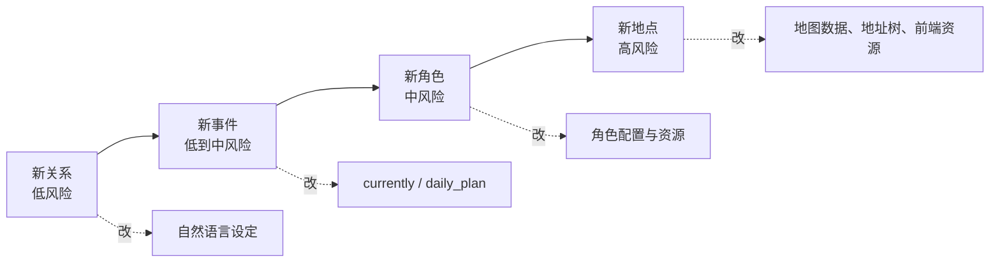
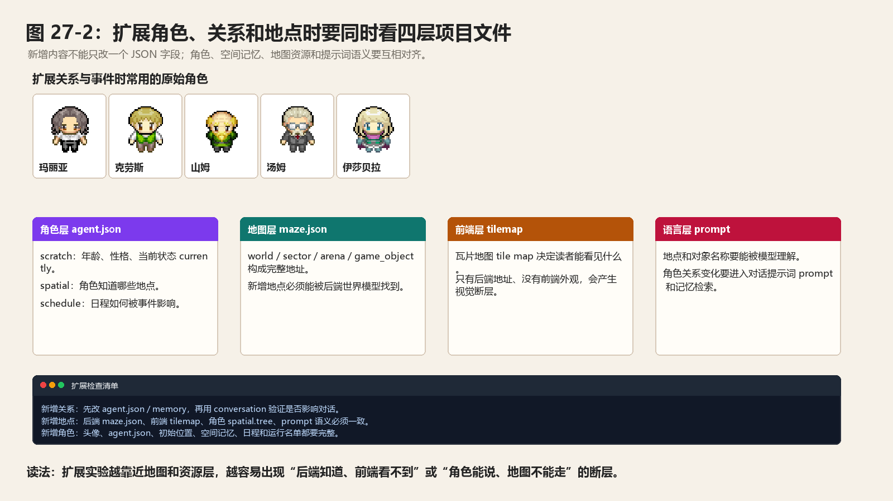
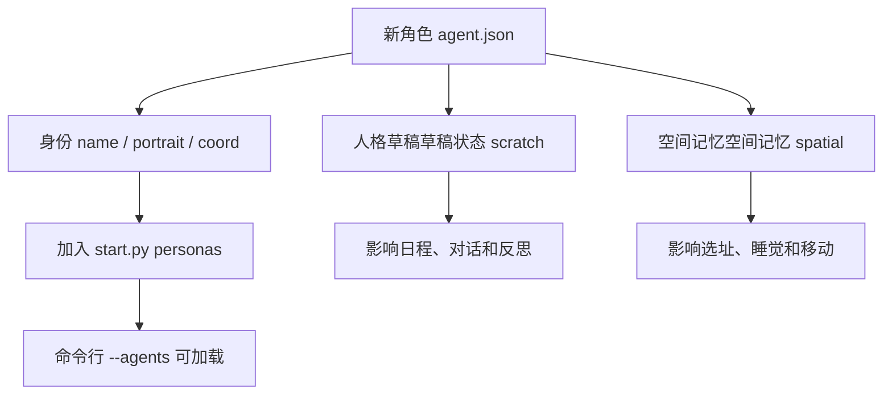
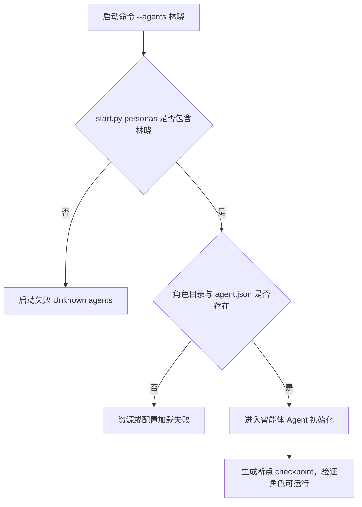
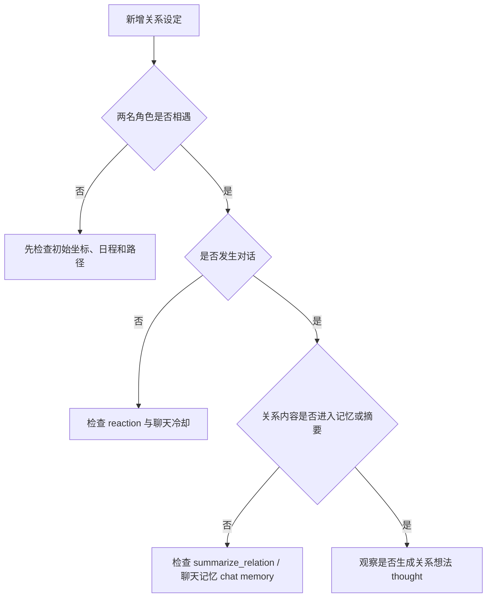

# 第 27 章 增加新角色、新地点、新关系

## 27.1 核心问题

新事件解决“发生什么”，小镇扩展解决“谁在什么地方、带着什么关系发生”。小镇扩展主要包括三类改动：

- 增加新角色。
- 增加新地点。
- 增加新关系。

这三类扩展难度不同。最容易的是新关系。因为关系主要通过自然语言设定、对话和记忆形成。中等难度是新角色。需要新增角色配置、头像、纹理、初始坐标，并加入 `personas` 列表。最难的是新地点。因为地点牵涉后端 `maze.json`、前端 tilemap、碰撞、地址树和角色空间记忆。本章聚焦七个问题：

1. 新角色需要哪些文件？
2. 如何设计角色 `agent.json`？
3. 新关系应该写在哪里？
4. 如何让关系通过仿真形成，而不是硬编码？
5. 新地点为什么最难？
6. 如何在不改地图的情况下模拟新地点事件？
7. 扩展后如何验证系统仍然正常？



*图 27-1：角色、地点、关系扩展难度。扩展越接近地图和资源层，风险越高；初学者应先从关系和事件开始。*



*图 27-2：扩展角色、关系和地点时要同时看四层项目文件。图片把角色配置 agent.json、后端地图 maze.json、前端瓦片地图瓦片地图 tile map 和提示词 prompt 放在同一张检查板中，说明扩展不能只改单个字段。*

## 27.2 扩展优先级

建议读者按下面顺序扩展：

```text
新关系
  -> 新事件
  -> 新角色
  -> 新地点
```

原因可以从下面几个方面解释：

新关系只需要改自然语言设定和实验设计。新事件只需要改 currently 和可能的 daily_plan。新角色需要新增资源和配置。新地点需要改地图数据，风险最高。如果刚开始学习项目，不建议直接改地图。先在现有地点中设计新事件，效果更稳定。

## 27.3 新角色需要哪些文件

当前每个角色目录结构大致是：

```text
generative_agents/frontend/static/assets/village/agents/<角色名>/
  agent.json
  portrait.png
  texture.png
```

新增角色至少需要这些材料：

- `agent.json`
- `portrait.png`
- `texture.png`

此外，还需要修改下面位置：

```text
generative_agents/start.py
```

的 `personas` 列表中加入角色名。否则命令行 `--agents` 无法识别它。还要确认：

- 初始 `coord` 在地图上有效。
- `spatial.tree` 包含角色知道的地点。
- `living_area` 能映射到可睡觉地点。
- 角色纹理能被前端加载。

## 27.4 agent.json 的设计

新角色 `agent.json` 应该包含：

```json
{
  "name": "新角色",
  "portrait": "assets/village/agents/新角色/portrait.png",
  "coord": [x, y],
  "currently": "...",
  "scratch": {
    "age": 0,
    "innate": "...",
    "learned": "...",
    "lifestyle": "...",
    "daily_plan": "..."
  },
  "spatial": {
    "address": {
      "living_area": [...]
    },
    "tree": { ... }
  }
}
```

配置逻辑图：



最重要的是草稿状态 scratch。角色行为主要来自这些自然语言设定。`innate` 决定性格倾向。`learned` 决定经历和身份。`lifestyle` 决定作息。`daily_plan` 决定日常行为框架。`currently` 决定当前实验目标。这几个字段要具体。不要写成：

```text
他是一个普通居民。
```

这种设定太弱，模型很难生成有辨识度的行为。

## 27.5 新角色设计示例

假设新增一个社区记者：

```text
姓名：林晓
年龄：31
先天：敏锐、外向、谨慎
后天：林晓是小镇本地记者，关注社区活动、公共政策和居民故事。
生活习惯：林晓早上7点醒来，上午采访居民，下午整理稿件，晚上常去咖啡馆听取社区消息。
日常计划：林晓通常上午在镇上采访，下午在霍布斯咖啡馆写稿，晚上与居民交流。
当前状态：林晓正在写一篇关于小镇公共生活的报道，想了解山姆竞选镇长和伊莎贝拉情人节派对的情况。
```

这个角色天然适合信息传播实验。她可能主动询问派对、竞选、社区活动。但她不是全知的。她仍然需要通过相遇和对话获得信息。

## 27.6 初始坐标怎么选

新增角色必须有初始坐标。坐标应该满足：

- 在地图范围内。
- 不在 collision 地图格子 tile。
- 最好对应一个有 game_object 的合理地址。
- 与 living_area 或日常地点一致。

可以从现有角色的 `agent.json` 中参考坐标。不要随便填：

```json
"coord": [0, 0]
```

地图边界或无地址地图格子 tile 可能导致初始化行动 action 不合理。如果不确定，先复用一个合理地点附近的坐标，再逐步调整。

## 27.7 新角色加入 start.py

`start.py` 中有：

```python
personas = [
    "阿伊莎", "克劳斯", ...
]
```

新增角色后，需要加入：

```python
"林晓"
```

否则运行时会出现下面问题：

```bash
python start.py --agents "林晓"
```

会报 unknown 智能体 agent。这一步很容易忘。如果想默认 25 人外加新角色，也要考虑 `--agent-count` 的行为。默认列表顺序会影响仿真中智能体 agent 思考顺序。

## 27.8 新关系写在哪里

新关系通常写在角色的 `learned`、`currently` 或 `daily_plan` 中。例如：

```text
林晓经常采访伊莎贝拉，两人关系友好。
```

也可以写成下面这样：

```text
汤姆不太信任山姆，认为山姆的竞选承诺过于理想化。
```

关系可以写在一方，也可以写在双方。如果只写在一方，关系是不对称的。例如：

```text
克劳斯欣赏玛丽亚的思考方式。
```

但玛丽亚没有对应设定。这可能产生有趣的不对称互动。如果双方都写，关系更稳定。

## 27.9 不要把关系写死成结果

关系设定要提供倾向，不要直接写死剧情结果。不推荐：

```text
克劳斯和玛丽亚一定会在今天成为亲密朋友。
```

推荐优先采用下面方案：

```text
克劳斯觉得玛丽亚乐于探索新想法，愿意有机会继续和她交流。
```

前者是硬脚本。后者是行为倾向。生成式智能体 Generative Agents 的价值在于让关系通过相遇、对话、记忆和反思形成。初始设定应该给可能性，而不是指定结局。

## 27.10 用事件塑造关系

更好的方式是用事件塑造关系。例如：

```text
玛丽亚最近听说克劳斯在组织一场关于社会议题的讨论会，她对这个话题有些好奇。
```

这不是直接说“玛丽亚喜欢克劳斯”。但它会增加两人互动可能性。如果他们在咖啡馆相遇，玛丽亚可能提到讨论会。对话后，系统可能生成新的关系记忆 memory。这更接近涌现。

## 27.11 新地点的扩展难度

新增地点牵涉四层。第一，后端地图。`maze.json` 需要新增地图格子 tile 地址、collision、sector、场所 arena、game_object。第二，前端地图。tilemap 需要视觉资源和位置。第三，角色空间记忆。相关角色的 `spatial.tree` 要知道新地点。第四，提示词 prompt 语义。对象名称要让模型理解用途。如果只改 `spatial.tree`，但 `maze.json` 没有对应地址，角色可能找不到实际地图格子 tile。如果只改 `maze.json`，但前端地图没显示，回放会怪。所以新增地点不是一个 JSON 字段能解决。

## 27.12 不改地图也能模拟新地点

很多时候不需要真的新增地点。可以在现有地点中模拟新活动。例如：

```text
社区论坛
```

可以设置在下面位置：

```text
霍布斯咖啡馆
奥克山学院图书馆
公共休息室
约翰逊公园
```

这些地点已经存在，角色也可能知道。如果要做“艺术展”，可以先设在咖啡馆或公园。如果要做“社区会议”，可以先设在公共休息室或咖啡馆。只有当现有地点无法表达事件需求时，才考虑改地图。

## 27.13 给现有地点增加新用途

一种低风险方法是给角色设定中加入地点新用途。例如：

```text
霍布斯咖啡馆最近经常举办小型社区讨论和读书会。
```

这样不改地图，只改语义。模型会把咖啡馆理解为可举办活动的地点。缺点是对象 affordance 仍然隐式依赖模型。但对多数实验已经足够。

## 27.14 验证新角色

新增角色后，先运行 1 仿真步 step：

```bash
python start.py --name test-new-agent --start "20240213-09:30" --step 1 --stride 10 --agents "林晓"
```

这条命令只有在 `林晓` 已经加入 `start.py` 的 `personas` 列表，并且对应 `frontend/static/assets/village/agents/林晓/agent.json` 已经存在时才会成功。当前仓库没有这个角色，直接运行会在启动阶段失败，错误含义是：

```text
Unknown agents: 林晓
```

校验逻辑图：



这个失败结果反而很有价值。它说明 `--agents` 不是随便传一个名字给模型，而是先经过本地角色清单校验。新增角色时，第一关不是大语言模型 LLM，而是文件结构和角色注册。

检查时重点看下面这些内容：

- 是否成功加载 agent.json。
- 断点 checkpoint 是否生成。
- `simulation.md` 是否能写基础人设。
- 前端是否能显示头像和纹理。
- 行动 action 地址是否合理。

角色注册成功后，1 仿真步 step 日志应该出现下面几类信息：

```text
林晓.reset
coord[...]: the Ville:...
Simulate Step[1/1, time: ...]
林晓 -> wake_up
林晓 -> schedule_init
林晓 -> schedule_daily
林晓 -> schedule_decompose
林晓.summary @ ...
action:
  event: ...
llm:
  summary:
    total: S:...,F:.../R:...
```

`reset` 用来检查初始坐标和地点是否能解析，`schedule_*` 用来检查人设能否生成日程，`summary` 用来检查行动是否落到合法地址，`S/F/R` 用来检查模型调用是否稳定。随后再执行 `compress.py --name test-new-agent`，看 `simulation.md` 是否写出基础人设和第一条活动记录，`movement.json` 中 `persona_init_pos` 是否包含新角色。再运行 12 到 24 仿真步 step，看是否能生成日程和移动。不要一开始就加入 25 人大实验。

## 27.15 验证新关系

新增关系后，设计小实验。例如只运行：

```text
克劳斯、玛丽亚
```

也可以写成下面这样：

```text
山姆、汤姆
```

观察下面这些现象，用于判断实验结果：

- 是否相遇。
- 是否对话。
- 对话是否体现关系设定。
- 关系摘要是否检索到相关记忆。
- 反思是否生成关系想法 thought。

关系验证逻辑图：



如果没有效果，可能不是关系写得不好，而是两人没有相遇。社交实验必须同时检查空间路径。

## 27.16 验证新地点

如果真的新增地点，至少检查：

- `maze.json` 是否可加载。
- `Maze.address_tiles` 是否有新地址。
- 新地址是否有可达地图格子 tile。
- 前端 tilemap 是否显示合理。
- 角色 `spatial.tree` 是否包含新地点。
- `_determine_action()` 是否能选到新地点。
- `movement.json` 中 location 是否正确。

建议写一个最小脚本或短仿真验证寻路。地图问题不要等完整实验时才发现。

## 27.17 扩展后的实验记录

扩展项目后，实验记录要新增一节：

```markdown
## 项目扩展

### 新角色
- 名称：
- 文件：
- 初始坐标：
- living_area：
- 主要设定：

### 新关系
- 涉及角色：
- 写入字段：
- 预期行为：

### 新地点
- 地址：
- maze.json 修改：
- tilemap 修改：
- spatial.tree 修改：
```

这样未来回溯时，能知道实验结果来自哪些改动。

## 27.18 本章小结

扩展小镇要按风险顺序来。先区分文本设定、地图资源和地址树，再决定改动顺序；不能一上来就改最难的地方。

| 本章内容 | 核心结论 |
| --- | --- |
| 扩展优先级 | 建议按新关系、新事件、新角色、新地点的顺序推进。 |
| 新角色 | 新角色需要 `agent.json`、头像、纹理，并加入 `start.py` 的 personas。 |
| 角色配置重点 | `agent.json` 中最重要的是 currently、草稿状态 scratch 和空间记忆 spatial。 |
| 新关系 | 新关系可以写在 learned、currently 或 daily_plan 中。 |
| 关系边界 | 关系设定应提供倾向，不应直接硬编码结果。 |
| 新地点 | 新地点最难，因为涉及 `maze.json`、前端 tilemap、空间树 spatial tree 和提示词 prompt 语义。 |
| 低风险替代 | 很多新事件可以先放在现有地点，不必改地图。 |
| 验证方法 | 新角色、新关系、新地点都应该先用小规模仿真验证。 |
| 可复现性 | 扩展实验必须记录具体改动，否则后续无法复查结果。 |

下一章讲如何用中文本地模型重跑论文思想：把实验关注点从“改小镇内容”转向“换模型后行为质量如何变化”。

## 参考资料

- Local data: `generative_agents/frontend/static/assets/village/agents/*/agent.json`
- Local source: `generative_agents/start.py`
- Local data: `generative_agents/frontend/static/assets/village/maze.json`
- Local source: `generative_agents/modules/maze.py`
- Local source: `generative_agents/modules/memory/spatial.py`
- Local README map notes: `README.md`
