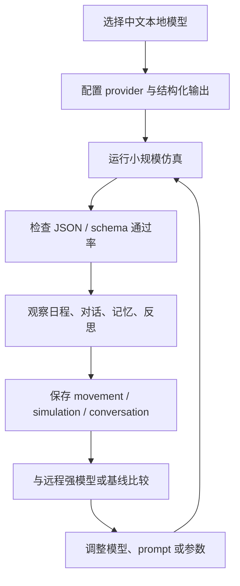

# 第 28 章 用中文本地模型重跑论文思想

## 28.1 核心问题

前几章讨论的是如何复现和扩展小镇事件。本章换一个问题：

```text
如果不用论文时代依赖的远程大模型，而改用中文本地模型，Generative Agents 的思想还能跑通吗？
```

这个问题比“本地模型能不能运行项目”更重要。运行项目只是工程问题。重跑论文思想是研究问题。本章不把本地模型当成一个便宜替代品，而把它当成一次实验变量：

```text
模型换了以后，记忆、检索、反思、计划、对话、社会传播分别发生了什么变化？
```

本章聚焦九个问题：

1. 用中文本地模型重跑论文思想，真正要验证什么？
2. Generative Agents 当前默认如何接入 Ollama？
3. 如何设计一个低成本可重复的本地模型实验？
4. 哪些能力最容易受模型尺寸影响？
5. 如何判断结构化输出是否稳定？
6. 如何评价中文对话是否自然？
7. 如何比较本地模型、远程模型和混合模型？
8. 本地模型常见失败模式是什么？
9. 如何把实验结果写成可复现报告？



*图 28-1：中文本地模型重跑论文机制的实验闭环。本地模型实验的重点不是“能不能聊”，而是结构化输出和长期行为链路能否稳定成立。*

## 28.2 本地模型实验不是部署教程

很多读者第一次看到“本地模型”，会把问题理解成：

```text
怎么安装 Ollama？
怎么下载 Qwen？
怎么让接口跑起来？
```

这些当然要会。但它们不是本章重点。本章真正关心的是：

```text
当模型能力下降、成本下降、可控性上升以后，Generative Agents 的哪些机制仍然有效，哪些机制开始变形？
```

论文里的系统依赖大语言模型完成多种认知任务：

- 生成日程。
- 解释观察。
- 判断事件重要性。
- 提取反思。
- 生成对话。
- 决定是否回应他人。
- 把自然语言记忆转成后续行为依据。

这些任务不是同一种能力。一个模型可以很会聊天，但不擅长稳定输出 JSON。一个模型可以很会写长文本，但对时间、地点和角色约束很差。一个模型可以在单轮问答中表现不错，但在连续几十轮仿真后出现重复、遗忘和格式漂移。所以本章的基本原则是：

```text
不要只问“模型能不能跑”。
要问“模型在哪些环节支撑住了论文机制，在哪些环节拖垮了论文机制”。
```

## 28.3 本章实验的目标

中文本地模型实验不应该把目标定成：

```text
证明本地小模型等价于最强闭源模型。
```

这既不现实，也没有必要。更合理的目标有三个。第一，验证论文机制的下限。也就是：

```text
即使模型不够强，Memory Stream、Retrieval、Reflection、Planning 这些机制是否仍然能产生可观察的社会行为？
```

第二，找出系统瓶颈。例如：

```text
问题主要来自对话质量？
还是来自反思质量？
还是来自结构化输出失败？
还是来自检索召回不准？
```

第三，建立中文智能体实验基线。以后读者替换更强模型、增加工具调用、升级记忆系统时，需要一个可以比较的基线。本章建议把实验目标写成下面这样：

```text
在 Generative Agents 中使用中文本地模型运行一个小规模小镇仿真，
观察事件传播、日程执行、对话自然性、记忆检索和反思质量，
并记录模型配置、运行成本、失败模式与改进方向。
```

这就是一个可操作的研究目标。

## 28.4 当前项目的模型配置入口

Generative Agents 的模型配置文件位于：

```text
generative_agents/data/config.json
```

当前配置中，思考模型位于：

```json
"think": {
  "llm": {
    "provider": "ollama",
    "model": "qwen3.5:4b-q4_K_M",
    "base_url": "http://127.0.0.1:11434/v1",
    "api_key": ""
  },
  "interval": 1000,
  "poignancy_max": 150
}
```

记忆检索使用的 embedding 模型位于：

```json
"associate": {
  "embedding": {
    "provider": "ollama",
    "model": "qwen3-embedding:0.6b-q8_0",
    "base_url": "http://127.0.0.1:11434",
    "api_key": ""
  },
  "retention": 8
}
```

这里有两个关键信息。第一，项目把“生成模型”和“嵌入模型”分开配置。生成模型负责：

- 计划。
- 反应。
- 对话。
- 总结。
- 反思。
- 结构化判断。

嵌入模型负责：

- 把记忆写入向量索引。
- 根据上下文召回相关记忆。

第二，Ollama 的两个接口路径不完全一样。LLM 配置中写的是：

```text
http://127.0.0.1:11434/v1
```

embedding 配置中写的是：

```text
http://127.0.0.1:11434
```

这不是笔误。项目中的 `OllamaLLMModel` 会对 LLM 的 base_url 做处理：

```text
如果 base_url 以 /v1 结尾，就去掉 /v1，再访问 /api/chat。
```

因此读者修改配置时，不要只看表面 URL，要结合源码理解。

## 28.5 LLM 适配层做了什么

模型适配逻辑在：

```text
generative_agents/modules/model/llm_model.py
```

项目支持三类 provider：

```text
ollama
minimax
openai
```

创建模型时，入口是：

```text
create_llm_model(llm_config)
```

如果 provider 是 `ollama`，会创建：

```text
OllamaLLMModel
```

如果 provider 是 `openai`，会创建：

```text
OpenAILLMModel
```

如果 provider 是 `minimax`，会创建：

```text
MiniMaxLLMModel
```

本地模型实验重点关注 `OllamaLLMModel`。它做了四件关键事情。第一，调用 Ollama 的 `/api/chat`。第二，关闭流式输出。第三，在请求中设置：

```json
"think": false
```

第四，如果调用方传入 Pydantic return_type，就把 JSON Schema 传给 Ollama 的 format 参数。这说明 Generative Agents 不是简单把 prompt 丢给模型。它试图让本地模型直接输出结构化结果。许多本地模型实验失败，并不是“模型不会回答”，而是：

```text
模型回答了，但没有按系统需要的结构回答。
```

## 28.6 结构化输出是第一道关卡

Generative Agents 的外在行为看起来像自然语言系统。但源码内部大量依赖结构化中间结果。例如：

- 当前行动是什么。
- 行动持续多久。
- 下一个地点在哪里。
- 事件重要性是多少。
- 是否需要反思。
- 对话是否结束。
- 对某个观察是否反应。

如果模型输出结构不稳定，后续行为链会被破坏。典型失败包括：

```text
模型输出解释性文字，而不是 JSON。
```

```text
模型输出 markdown 代码块。
```

```text
模型把数字写成中文。
```

```text
模型漏掉 res 字段。
```

```text
模型在结构化结果前后夹带 <think> 内容。
```

Generative Agents 已经在 `parse_structured_output()` 中做了容错：

- 尝试直接解析 JSON。
- 如果失败，尝试从文本中提取 `{...}`。
- 如果仍然失败，尝试把原始文本塞进 Pydantic 模型。
- 最后返回原始文本。

这提高了项目鲁棒性。但它也带来一个实验要求：

```text
不要只看仿真有没有跑完，还要看 fallback 和 retry 是否很多。
```

一个模型如果每次都需要容错才能过关，短跑可能没问题，长时间仿真会不断积累错误。

## 28.7 用本地模型重跑的最小实验

本章建议先做最小实验，不要一上来运行 25 个角色两天。推荐起步实验：

```text
5 个角色
2 小时虚拟时间
stride = 10 分钟
围绕一个明确事件
```

例如情人节派对传播实验：

```text
伊莎贝拉
玛丽亚
克劳斯
阿伊莎
沃尔夫冈
```

或者镇长竞选传播实验：

```text
山姆
汤姆
埃迪
卡门
简
```

最小实验的目的不是得到壮观涌现。目的是确认五条链路是否正常：

```text
角色设定 -> 日程生成 -> 感知事件 -> 对话传播 -> 记忆写入
```

如果这五条链路都跑不稳，不应该继续扩大规模。

## 28.8 推荐运行参数

项目 README 给出的基础运行命令是：

```bash
cd generative_agents
python start.py --name sim-test --start "20250213-09:30" --step 10 --stride 10
```

本地模型实验建议保守一些。第一轮可以使用：

```bash
cd generative_agents
python start.py --name local-qwen-baseline --start "20250213-09:00" --step 6 --stride 10
```

也就是只跑 60 分钟虚拟时间。如果这轮没有明显结构化输出失败，再增加到：

```bash
python start.py --name local-qwen-party-2h --start "20250213-09:00" --step 12 --stride 10
```

如果两小时稳定，再扩大到半天：

```bash
python start.py --name local-qwen-party-halfday --start "20250213-09:00" --step 36 --stride 10
```

不要一次跑太久。本地模型的问题往往不是第一步暴露，而是在几十轮调用后出现：

- 重复。
- 疲软。
- 时间错乱。
- 地点错乱。
- 对话越来越空。
- 结构化输出偶发失败。

短实验用来检查接口。中等实验用来检查机制。长实验才用来观察社会行为。

## 28.9 实验前检查清单

运行前应检查六件事。第一，Ollama 服务是否启动。

```bash
ollama serve
```

第二，生成模型是否已下载。

```bash
ollama list
```

第三，配置中的模型名是否与本地模型名一致。配置文件：

```text
generative_agents/data/config.json
```

模型名：

```text
qwen3.5:4b-q4_K_M
```

这里必须以实际 `ollama list` 输出为准。README、配置文件和本地模型仓库可能随着版本变化出现名称差异。第四，embedding 模型是否已下载。

```text
qwen3-embedding:0.6b-q8_0
```

第五，起始时间是否符合事件设定。例如情人节派对设定在 2 月 14 日晚上，前一天运行时要给传播留出时间。第六，实验名称是否唯一。因为结果会写入：

```text
generative_agents/results
```

如果复用旧名称，容易把结果混在一起。

## 28.10 本地模型实验记录模板

每次实验都应该记录配置。建议新建实验记录时包含以下字段：

```markdown
# 实验名称

- 日期：
- 代码版本：
- 模型 provider：
- LLM 模型：
- embedding 模型：
- 量化方式：
- 运行硬件：
- agent 数量：
- 起始时间：
- step：
- stride：
- 事件设定：
- 修改过的 agent.json：
- 修改过的源码：
- 是否 resume：
- 是否生成 replay：

## 观察指标

- 结构化输出是否稳定：
- 日程是否合理：
- 对话是否自然：
- 事件是否传播：
- 关键角色是否到场：
- 反思是否出现：
- 记忆检索是否引用相关事实：
- 失败样例：

## 结论

- 最成功的行为：
- 最明显的问题：
- 下一次实验要改什么：
```

这个模板看似啰嗦。但没有这些信息，实验就无法复现。一个本地模型实验的结果，不只由模型名决定。还由以下因素共同决定：

- 量化版本。
- prompt 版本。
- embedding 模型。
- 角色数量。
- 时间步长。
- 起始时刻。
- 事件设定。
- 硬件速度。
- 重试次数。

## 28.11 观察一：结构化输出通过率

第一项指标是结构化输出通过率。可以粗略观察日志中的错误和重试。在 `LLMModel.completion()` 中，项目会统计每个 caller 的调用情况。摘要形式类似：

```text
S:成功数,F:失败数/R:请求数
```

如果失败数持续增加，说明模型适配存在问题。结构化输出问题经常出现在以下 prompt 上：

- 行动生成。
- 对话结束判断。
- 重要性评分。
- 地点选择。
- 反应判断。

评价时不要只写：

```text
模型可用。
```

要写得更具体：

```text
在 12 step 实验中，模型完成了日程、行动和对话生成；
日志中未观察到大量 JSON 解析失败；
但在重要性评分中偶尔输出解释性文字，需要依赖 parse_structured_output 容错。
```

工程上有价值的结论要具体到失败类型。

## 28.12 观察二：日程多样性

日程生成是本地模型的第二个关卡。日程质量差时，后续所有行为都会变差。可以观察每个角色当天计划是否满足四个条件。第一，符合角色设定。例如：

```text
伊莎贝拉应该围绕咖啡馆和派对准备活动。
山姆应该围绕竞选、社区服务和沟通居民活动。
克劳斯应该围绕学习、写论文和校园活动。
```

第二，有时间结构。不能所有行动都写成：

```text
上午工作，下午休息，晚上睡觉。
```

第三，有地点线索。日程要能落到小镇空间中。第四，不同角色之间有差异。如果五个角色的日程都差不多，说明模型只是套模板。本地小模型常见问题是：

```text
日程表面合理，但没有角色个性。
```

例如所有人都“吃早餐、工作、休息、社交、睡觉”。这不是错误，但会降低社会仿真的信息密度。

## 28.13 观察三：对话自然性

中文本地模型的一个优势是中文对话语感更容易调整。但这不等于对话一定自然。对话自然性要看五点。第一，是否符合关系。熟人之间不应像客服对话。关系紧张的人不应突然过度亲密。第二，是否符合场景。咖啡馆、宿舍、教室、办公室里的话题密度应该不同。第三，是否推动事件。如果伊莎贝拉想传播派对信息，她的对话应该自然提到时间、地点或邀请。第四，是否有来回。不要每一句都像独立公告。第五，是否能结束。很多模型能开始聊天，但不擅长自然结束。Generative Agents 通过对话轮数和判断逻辑控制结束，但模型仍可能输出拖沓内容。评价时可以摘录短样例。例如：

```text
自然样例：伊莎贝拉在咖啡馆邀请玛丽亚参加派对，玛丽亚追问时间并表示可能邀请朋友。
问题样例：两人连续三轮互相表达“很高兴与你交流”，没有新信息。
```

## 28.14 观察四：记忆检索是否抓住关键事实

Memory Stream 的价值不在于“存了很多东西”。而在于后续行为能想起正确东西。本地模型实验中，检索质量受两个部分影响：

- embedding 模型。
- 检索打分逻辑。

Generative Agents 的配置中，embedding 使用：

```text
qwen3-embedding:0.6b-q8_0
```

记忆保留参数是：

```json
"retention": 8
```

这意味着每次召回不会无限扩展，而是从候选中保留有限数量。评价记忆检索时，可以看三个问题：

第一，角色是否记得自己听过的事件。例如玛丽亚听说派对后，后续是否提到派对。第二，角色是否把事件归因给正确来源。例如“伊莎贝拉告诉我派对”，而不是凭空说“大家都知道”。第三，角色是否在相关时刻想起相关事实。例如下午接近派对准备时间时，伊莎贝拉更应该想起派对任务。如果检索失败，常见表现是：

```text
角色刚听完信息，下一步就完全不提。
```

或者：

```text
角色想起了不相关的日常事件，忽略了当前任务。
```

## 28.15 观察五：反思是否产生高层认知

反思是最容易被本地小模型削弱的环节之一。反思不是复述。反思要把多个观察归纳成更高层判断。例如原始观察是：

```text
玛丽亚和克劳斯在图书馆聊天。
玛丽亚对克劳斯的研究表现出兴趣。
克劳斯愿意分享自己的论文想法。
```

较好的反思是：

```text
玛丽亚可能对克劳斯的社会学研究产生兴趣，他们之间有进一步交流的机会。
```

较差的反思是：

```text
玛丽亚和克劳斯在图书馆聊天。
```

这只是复述。本地模型实验中，要特别记录反思的抽象层级。可以按三级评价：

```text
0 级：没有反思，或反思与事实无关。
1 级：复述事实，没有归纳。
2 级：能归纳关系、倾向、目标或冲突。
```

如果本地模型在反思上较弱，可以考虑后续升级：

- 只在高重要性事件后触发反思。
- 使用更强模型专门处理反思。
- 在 prompt 中给出更明确的反思样例。
- 将反思结果分成“事实依据”和“高层结论”。

## 28.16 观察六：事件传播是否成立

本书反复强调：

事件传播不是“有角色提了一句”。事件传播至少包含三层。第一层，信息从发起者进入对话。例如伊莎贝拉告诉玛丽亚：

```text
明天晚上咖啡馆有情人节派对。
```

第二层，接收者把信息写入记忆。后续能看到玛丽亚知道这件事。第三层，接收者影响另一个角色或自己的计划。例如玛丽亚告诉克劳斯，或调整晚上的安排。本地模型实验要分别观察这三层。如果只发生第一层，说明对话生成能用，但记忆和计划没有跟上。如果发生第一层和第二层，但没有第三层，说明系统有记忆，但社会级联不足。如果三层都出现，才说明论文中的传播机制在本地模型下仍然成立。

## 28.17 模型比较矩阵

建议不要只跑一个模型。至少设计三组：

```text
本地小模型
本地较大模型
远程强模型或高质量兼容 API
```

如果成本有限，也可以做两组：

```text
默认本地模型
更强远程模型
```

比较表可以这样写：

| 维度 | 本地小模型 | 本地较大模型 | 远程强模型 |
| --- | --- | --- | --- |
| 结构化输出 | 待记录 | 待记录 | 待记录 |
| 日程个性 | 待记录 | 待记录 | 待记录 |
| 中文对话 | 待记录 | 待记录 | 待记录 |
| 记忆引用 | 待记录 | 待记录 | 待记录 |
| 反思抽象 | 待记录 | 待记录 | 待记录 |
| 事件传播 | 待记录 | 待记录 | 待记录 |
| 运行速度 | 待记录 | 待记录 | 待记录 |
| 成本 | 待记录 | 待记录 | 待记录 |
| 主要失败 | 待记录 | 待记录 | 待记录 |

表格的目的不是证明谁最好。而是帮助读者看到：

```text
不同模型在哪些认知环节上表现不同。
```

## 28.18 混合模型策略

本地模型不一定要承担所有任务。Generative Agents 当前配置只有一个 think LLM。但从系统设计角度看，可以把任务拆开：

```text
便宜本地模型：日常行动、简单对话、重要性评分。
强模型：反思、复杂规划、关键对话、实验总结。
本地 embedding：记忆检索。
```

这种混合策略适合后续升级。例如：

- 平时用 4B 或 7B 模型维持仿真。
- 当 poignancy 累积到阈值时，调用更强模型做反思。
- 当角色进入关键事件时，调用更强模型生成对话。
- 回放压缩和实验报告可以离线用强模型整理。

这样可以把成本花在最关键的地方。本章不要求读者马上改源码实现多模型路由。核心判断是：

```text
Generative Agents 的每个认知模块对模型能力的要求不同。
```

这就是后续做系统升级的入口。

## 28.19 常见失败模式

中文本地模型实验常见失败模式有九类。第一，JSON 或结构化输出失败。表现：

```text
模型输出解释、markdown、额外字段或残缺 JSON。
```

第二，`<think>` 泄漏。表现：

```text
思考过程进入对话或结构化结果。
```

项目已经对 `<think>...</think>` 做了过滤，但仍要观察边界情况。第三，对话过度礼貌。表现：

```text
所有角色都像会议发言，缺少熟人之间的随意语气。
```

第四，角色语气趋同。表现：

```text
不同身份的人说话风格几乎一样。
```

第五，时间感弱。表现：

```text
上午讨论晚上已经发生的事，或忘记当前虚拟时间。
```

第六，地点感弱。表现：

```text
角色在宿舍谈咖啡馆工作，或要去不存在的地点。
```

第七，反思复述化。表现：

```text
反思只是重复观察，没有形成高层判断。
```

第八，记忆召回噪声高。表现：

```text
相关事件没有被召回，不相关日常事件反复出现。
```

第九，行动循环。表现：

```text
角色长时间重复同一类活动，不推动目标。
```

这些失败都要记录。因为它们直接对应后续优化方向。

## 28.20 如何判断本地模型实验成功

本地模型实验成功，不等于没有任何瑕疵。更合理的成功标准是：

```text
系统能在限定角色、限定时间、限定事件下，稳定产生可解释、可回放、可评价的行为链。
```

具体可以设五个通过条件。第一，仿真能完成。也就是没有频繁中断、异常或无限重试。第二，角色日程基本合理。至少符合 persona、时间和地点。第三，关键事件进入对话。例如派对或竞选话题被自然提起。第四，信息能进入记忆。后续角色能引用自己听过的事实。第五，至少出现一个社会传播或计划变化案例。例如：

```text
玛丽亚听说派对后，告诉克劳斯。
```

或者：

```text
汤姆听到山姆竞选后，表达反对并影响另一个居民的看法。
```

达到这五点，就可以说：

```text
在当前实验规模下，本地中文模型支撑了 Generative Agents 的核心闭环。
```

注意措辞是“当前实验规模下”。不要把小规模结论外推到 25 个智能体、多天仿真和复杂社会结构。

## 28.21 如何写实验结论

实验结论要避免两种写法。第一种是空泛乐观：

```text
本地模型效果很好，可以完全替代远程模型。
```

第二种是空泛否定：

```text
本地模型不行，效果不好。
```

这两种都没有信息量。好的结论应该按模块写。示例：

```text
在 local-qwen-party-2h 实验中，系统使用 qwen3.5:4b-q4_K_M 作为 LLM，
使用 qwen3-embedding:0.6b-q8_0 作为 embedding 模型，运行 5 个角色、12 step、stride 10。

实验中伊莎贝拉能够在咖啡馆相关对话中提到情人节派对，
玛丽亚能够记住该信息并在后续对话中提及。
日程生成整体稳定，但角色之间计划风格相似。
对话中文表达自然度尚可，但多轮后出现礼貌化和信息重复。
反思较少出现高层关系归纳，更多停留在事实复述。

结论：该本地模型可以支撑小规模事件传播实验，
但如果要复现论文中更强的关系形成和长期反思能力，
需要更强模型或对 Reflection 模块做专项增强。
```

这类结论能指导下一步行动。

## 28.22 对读者的推荐路径

如果读者第一次做本地模型实验，建议按四步走。第一步，跑 README 默认示例。确保项目能启动、模型能响应、结果能压缩回放。第二步，跑 5 角色、6 step 小实验。只检查链路是否通。第三步，跑 5 角色、12 step 事件传播实验。开始观察对话、记忆和计划。第四步，换模型或换参数对比。例如比较：

```text
4B 量化模型
7B 或更大本地模型
远程强模型
```

每一步都要保存实验名称和结果文件。不要在同一个实验名称上反复覆盖。

## 28.23 本地模型实验与论文思想的关系

回到本章开头的问题：

```text
用中文本地模型重跑论文思想，重跑的到底是什么？
```

不是重跑论文中的英语 prompt。不是逐字复现论文里的输出。也不是证明模型越便宜越好。真正重跑的是这套机制：

```text
角色以自然语言保存经验。
经验通过检索进入当前上下文。
重要经验触发反思。
反思改变角色后续理解。
计划把长期目标拆成短期行动。
对话让信息在人群中传播。
传播和记忆共同形成社会行为。
```

如果本地中文模型能够支撑这条链，即使行为质量不如最强模型，它也说明论文思想具备可迁移性。如果某些环节失败，也不是坏事。失败能暴露三类问题：

```text
哪个认知模块最依赖模型能力。
哪个模块可以靠工程增强。
哪个模块需要引入 2023-2026 年的新研究。
```

第五部分会围绕这些问题展开。

## 28.24 本章小结

中文本地模型实验的重点不是证明“本地模型也很强”，而是看论文机制在中文、本地、低成本环境下哪些部分能迁移，哪些部分会断。读者做实验时要先守住结构化输出和证据记录。

| 本章内容 | 核心结论 |
| --- | --- |
| 实验目标 | 目标是验证机制可迁移性，不是证明小模型等价于强模型。 |
| 配置入口 | Generative Agents 通过 `generative_agents/data/config.json` 配置 Ollama LLM 和 embedding。 |
| 第一关卡 | 结构化输出通过率是第一道关，不能只看仿真是否跑完。 |
| 评价维度 | 日程、对话、记忆、反思、事件传播都要分别评价。 |
| 实验规模 | 先跑通 5 个角色、短时间窗口，再逐步扩大。 |
| 记录内容 | 实验记录必须包含模型、硬件、参数、角色数量、事件设定和失败样例。 |
| 常见失败 | JSON 失败、`<think>` 泄漏、对话礼貌化、时间地点错乱、反思复述化和记忆召回噪声都要单独记录。 |
| 成功边界 | 成功标准必须限定在具体实验规模下，避免过度外推。 |
| 后续价值 | 本地模型实验的结果会直接指向记忆、反思、规划和评价升级。 |

下一章讨论一个更根本的问题：如何评价一个智能体是否“可信”。前面的实验都需要评价标准，否则看到的只是故事，而不是可验证的智能体行为。

## 参考资料

- Local config: `generative_agents/data/config.json`
- Local source: `generative_agents/modules/model/llm_model.py`
- Local docs: `docs/ollama.md`
- Local README: `README.md`
- Local run entry: `generative_agents/start.py`
- Local replay entry: `generative_agents/compress.py`
