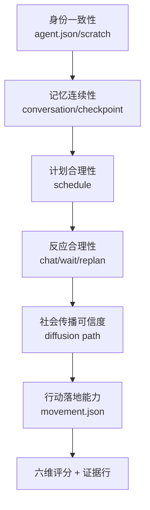
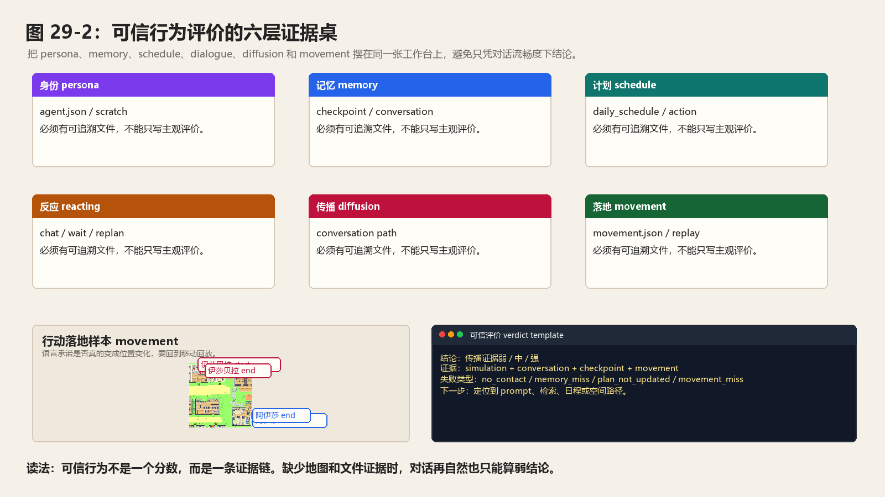
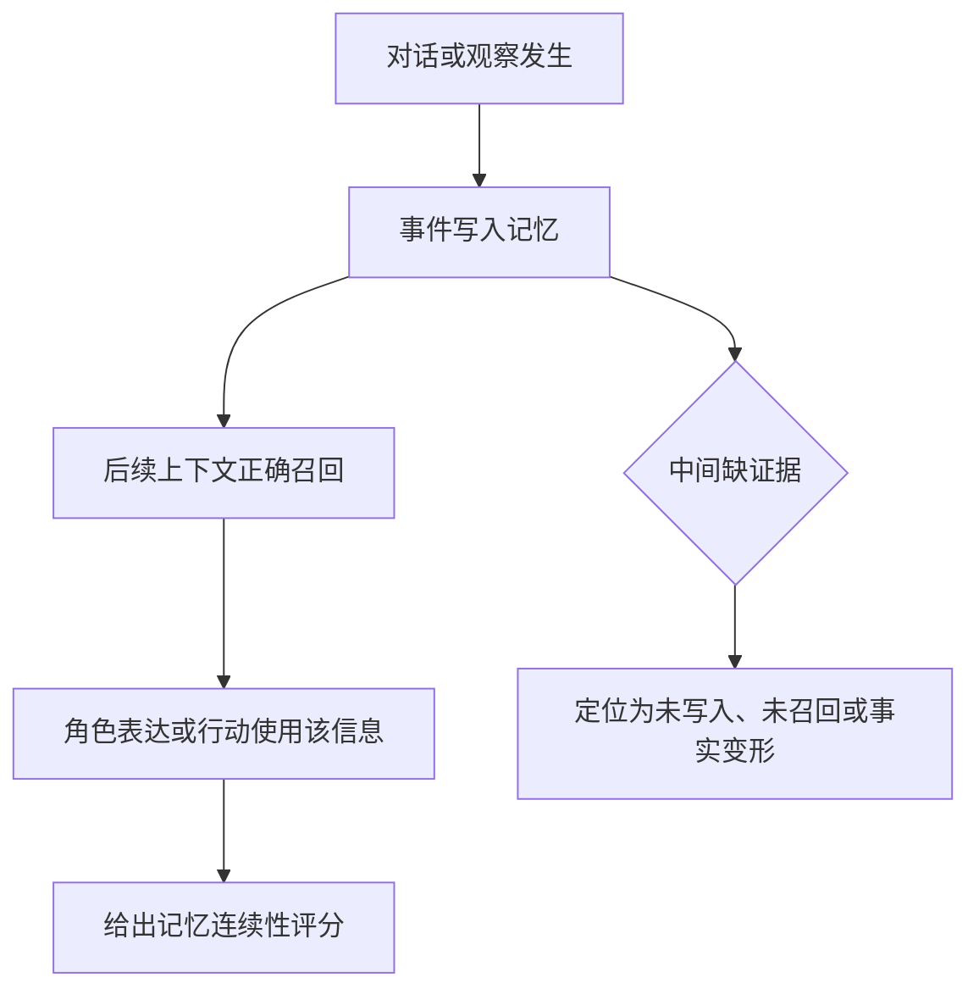
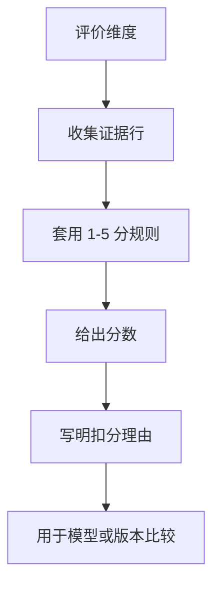
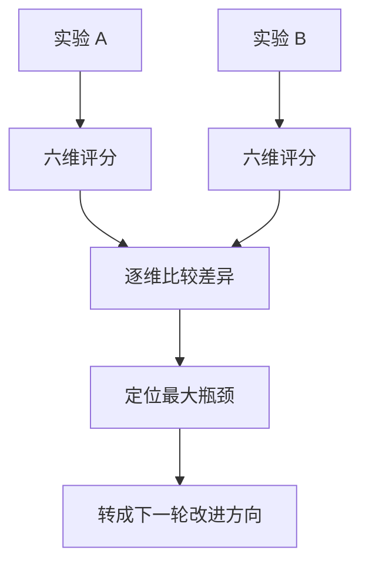
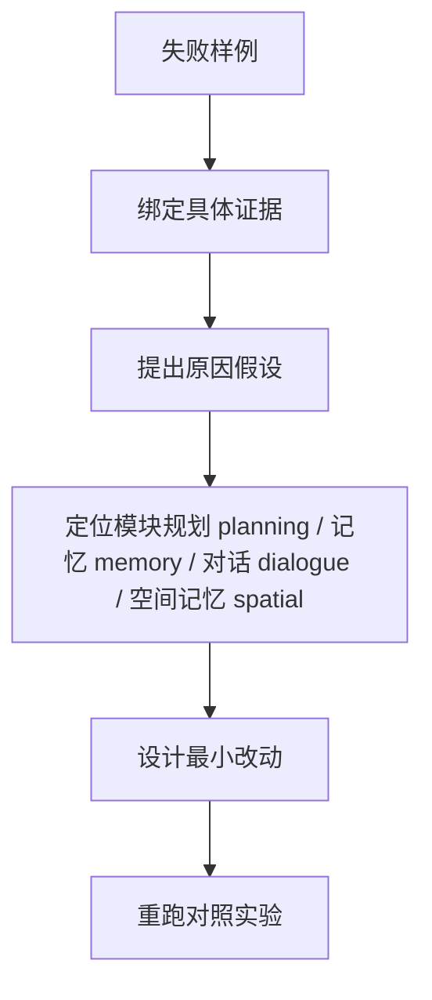

# 第 29 章 如何评价一个智能体是否“可信”

## 29.1 核心问题

前面已经完成三类实验准备：

- 复现论文里的情人节派对传播。
- 复现镇长竞选信息扩散。
- 设计自己的小镇事件，并用中文本地模型重跑。

下一步要回答可信性评价问题：

```text
我们如何判断一个智能体是否真的“可信”？
```

这个问题不能靠感觉。“看起来有意思”不是可信。“对话很流畅”不是可信。“任务成功完成”也不一定是可信。生成式智能体 Generative Agents 论文中的 believable behavior，指的是一种行为连续性：

```text
角色的行动、记忆、计划、关系、反应和环境约束能够互相支撑。
```

这个概念需要转化为生成式智能体 Generative Agents 的可操作评价框架。评价框架要回答七个问题：

1. 为什么不能用“像不像人”评价智能体？
2. 可信行为需要哪些证据？
3. 如何区分语言可信、记忆可信和行动可信？
4. 如何从 `simulation.md`、`conversation.json`、断点 checkpoint 和 `movement.json` 收集证据？
5. 如何给智能体行为打分？
6. 如何做多个模型、多个版本或多个实验之间的比较？
7. 如何把失败样例转化成系统改进方向？



*图 29-1：可信行为的六层证据链。评价可信性时要同时检查身份、记忆、计划、反应、传播和行动落地，不能只看对话是否顺。*



*图 29-2：可信行为评价的六层证据桌。图片把角色身份 persona、记忆 memory、日程 schedule、反应 reacting、传播 diffusion 和移动回放 movement 组织成同一张评价桌，提醒读者不要只凭自然对话下结论。*

## 29.2 “可信”不是“真实”

先澄清一个重要边界。本书说的“可信”，不是说智能体真的有意识。也不是说它真的拥有主观体验、真实动机或真实社会关系。这里的可信更接近：

```text
在给定设定、环境和历史记录下，智能体的行为是否像一个连续存在的角色。
```

例如，一个可信的伊莎贝拉应该：

- 记得自己在霍布斯咖啡馆工作。
- 关心情人节派对。
- 在合适场景下邀请别人。
- 如果别人答应参加，后续可能记住这件事。
- 到了派对前后，行动与准备派对相关。

这不意味着伊莎贝拉“真的想办派对”。它意味着系统生成的行为与角色设定、记忆和环境约束一致。本章所有评价都建立在这个边界上。可信行为是可观察行为。不是意识证明。

## 29.3 对话之外的可信证据

最常见的误判来自这里：

```text
这个智能体说话很自然，所以它很可信。
```

这不成立。语言模型很擅长生成自然语言。一个角色即使完全没有记忆，也可以临时编出一段像样的回答。例如你问：

```text
你今天过得怎么样？
```

模型可能会这样回答：

```text
今天挺充实的，我上午工作，下午和朋友聊了聊，晚上打算休息。
```

这句话很自然。但它可能没有任何证据。可信评价要追问：

```text
上午真的有工作记录吗？
下午真的和朋友聊过吗？
晚上计划里真的有休息吗？
这句话与角色身份一致吗？
```

如果这些都无法追溯，那么它只是流畅文本，不是可信行为。生成式智能体 Generative Agents 的优势是可以追证据。读者可以查：

- `agent.json` 中的角色设定。
- 断点 checkpoint 中的记忆和日程。
- `conversation.json` 中的对话。
- `simulation.md` 中的活动时间线。
- `movement.json` 中的位置移动。

有了这些材料，评价就不必停留在感觉层面。

## 29.4 可信行为的六个维度

本章建议用六个维度评价智能体：

1. 身份一致性是否稳定。
2. 记忆连续性是否可靠。
3. 计划合理性是否成立。
4. 反应合理性是否自然。
5. 社会传播可信度是否足够。
6. 行动落地能力是否可验证。

这六个维度对应论文架构。身份一致性对应 persona 和草稿状态 scratch。记忆连续性对应记忆流 memory stream 和检索 retrieval。计划合理性对应规划 planning 和日程 schedule。反应合理性对应反应 reacting。社会传播可信度对应对话 dialogue、记忆 memory 和多智能体互动 multi-agent interaction。行动落地能力对应沙盒落地 sandbox grounding、世界地图 maze 和移动回放 movement。用这六个维度，可以把“这个智能体像不像人”拆成可检查问题。

| 评价维度 | 看什么 | 主要证据 | 常见失败 |
| --- | --- | --- | --- |
| 身份一致性 | 行为是否符合角色职业、性格和背景。 | `agent.json`、访谈回答、日程和对话。 | 角色忘记职业、语气漂移、行为和设定冲突。 |
| 记忆连续性 | 是否记得关键事件、来源和关系。 | 记忆 memory、对话记录 conversation、simulation.md。 | 刚发生就遗忘，或编造不存在的经历。 |
| 计划合理性 | 日程是否有节奏，是否能被事件合理打断。 | 日程 schedule、行动 action、movement.json。 | 一直聊天、不去目标地点、重规划不合理。 |
| 反应合理性 | 遇到人和事件时是否反应得当。 | `_reaction()`、聊天记录、等待行为。 | 无视重要事件，或对小事过度反应。 |
| 社会传播可信度 | 信息是否通过对话和记忆逐步扩散。 | 多人对话记录 conversation、传播路径、到场记录。 | 所有人突然知道，或信息完全不扩散。 |
| 行动落地能力 | 语言承诺是否转化为地点、对象和时间上的行动。 | movement.json、断点 checkpoint、前端回放。 | 口头答应但不到场，行动和地点不匹配。 |

*表 29-1：可信行为六维评价表。可信性评价必须同时看文本、记忆、计划、空间行动和社会传播，不能只看对话是否自然。*

## 29.5 维度一：身份一致性

身份一致性回答的问题是：

```text
这个角色是否持续像自己？
```

它包括职业、年龄、家庭、兴趣、关系、习惯和当前目标。例如克劳斯是社会学学生，正在写关于低收入社区中产阶级化影响的研究论文。一个可信的克劳斯应该在以下方面保持一致：

- 日程中有学习、写作或校园活动。
- 对社会议题有较高兴趣。
- 与玛丽亚交流时可以谈到研究。
- 不应突然自称咖啡馆老板或市长候选人。

评价身份一致性时，可以看三类证据。第一，角色设定。文件：

```text
generative_agents/frontend/static/assets/village/agents/<角色名>/agent.json
```

第二，活动时间线。文件：

```text
generative_agents/results/compressed/<实验名>/simulation.md
```

第三，对话内容。文件：

```text
generative_agents/results/checkpoints/<实验名>/conversation.json
```

评分时可以提出下面问题：

```text
角色说的话是否符合人设？
角色做的事是否符合职业和习惯？
角色的当前目标是否被持续保留？
有没有与人设直接冲突的内容？
```

常见扣分点主要包括：

- 职业错乱。
- 家庭关系错乱。
- 当前目标消失。
- 角色说话风格完全趋同。
- 所有人都表现得过度友好或过度理性。

## 29.6 维度二：记忆连续性

记忆连续性回答的问题是：

```text
角色是否记得自己经历过什么？
```

这不是简单看角色能不能说“我记得”。要看它是否能引用真实经历。例如，玛丽亚说：

```text
我听伊莎贝拉说，明天晚上霍布斯咖啡馆有情人节派对。
```

这句话是否可信，取决于能否找到证据：

```text
伊莎贝拉是否真的告诉过玛丽亚？
玛丽亚是否在后续记忆或对话中保留这个信息？
她是否把时间、地点、发起者说对？
```

记忆连续性可以分成四层。第一层，接触事实。角色是否真的经历过事件。第二层，写入记忆。事件是否进入智能体 agent 的关联记忆或聊天记录。第三层，正确召回。后续是否能在相关场景想起它。第四层，影响行为。记忆是否改变了对话、计划或行动。如果只达到第一层，不算强记忆。如果达到第四层，说明记忆流 memory stream 真正进入行为闭环。

## 29.7 记忆评价的证据链

判断一个角色是否“知道某事”，建议使用以下证据链：

```text
对话或观察发生
  -> 事件进入记忆
  -> 后续上下文召回
  -> 角色表达或行动使用该信息
```

以派对传播实验为例：

```text
伊莎贝拉邀请玛丽亚参加派对。
玛丽亚的记忆中出现派对相关记录。
玛丽亚后来与克劳斯聊天时提到派对。
克劳斯再把这件事纳入自己的计划或对话。
```

记忆评价逻辑图：



这条链越完整，记忆越可信。如果玛丽亚从未见过伊莎贝拉，却突然说自己知道派对，应该标记为幻觉或设定泄漏。如果玛丽亚听过派对，但后续完全忘记，说明传播失败或检索失败。如果玛丽亚记得派对，但说错时间地点，说明事实保持能力不足。这些都不是“失败了就完了”。它们是定位系统问题的线索。

## 29.8 维度三：计划合理性

计划合理性回答的问题是：

```text
角色的日程是否符合身份、时间和环境？
```

生成式智能体 Generative Agents 的计划不是临时动作列表。它从较粗日程生成，再逐步拆成具体行动。评价计划时要看四点。第一，时间合理。例如：

- 睡觉时间不要频繁被不合理打断。
- 早餐、午餐、晚餐大致符合生活节奏。
- 工作、学习和休息时间不要完全混乱。

第二，地点合理。例如：

- 伊莎贝拉在咖啡馆活动合理。
- 学生去学院、图书馆、宿舍合理。
- 角色不要频繁前往不存在或无关地点。

第三，目标合理。例如：

- 山姆竞选期间应有社区沟通行为。
- 克劳斯写论文期间应有研究、阅读或讨论。
- 伊莎贝拉筹备派对期间应有准备、邀请或布置。

第四，粒度合理。计划不能太粗。如果一个角色连续数小时只是：

```text
做自己的事情。
```

这不利于可信行为。计划也不能太碎到无法执行。如果每 10 分钟切换一个无关地点，会显得机械。

## 29.9 计划评价的常见指标

计划合理性可以用人工评分，也可以记录一些简单指标。例如：

```text
schedule_conflict_count
```

该指标统计明显时间冲突。

```text
location_mismatch_count
```

统计行动描述和地点不匹配次数。

```text
goal_related_action_count
```

统计与当前目标相关的行动次数。

```text
repeated_generic_action_count
```

统计“工作”“休息”“社交”等泛化动作重复次数。

```text
sleep_consistency_score
```

评价睡眠、起床和夜间活动是否合理。这些指标不必一开始就完全自动化。手工在 `simulation.md` 中标注也可以。关键是保留证据。不要只写：

```text
计划还可以。
```

应该写成下面这种带证据的表述：

```text
山姆在 09:00-12:00 三次出现与竞选相关的社区沟通行为；
但 14:00 后连续两段行动描述为“思考下一步计划”，缺少地点和对象，扣 1 分。
```

## 29.10 维度四：反应合理性

反应合理性回答的问题是：

```text
角色遇到人、事件或意外时，是否做出符合情境的反应？
```

论文中 Reacting 的意义在于打破静态计划。如果角色只按日程机械执行，不理会周围事件，就不可信。但如果角色看到任何人都强行聊天，也不可信。评价反应合理性，要看三类情况。第一，应该反应时是否反应。例如：

- 伊莎贝拉遇到熟人时，可能自然提到派对。
- 山姆遇到邻居时，可能谈竞选。
- 克劳斯遇到玛丽亚时，可能聊研究和兴趣。

第二，不该反应时是否克制。例如：

- 角色正在睡觉时不应频繁社交。
- 时间紧迫时不应无意义闲聊。
- 与陌生人不应立刻分享过多私密信息。

第三，反应是否改变后续状态。例如：

- 聊天后记忆增加。
- 接受邀请后计划可能变化。
- 冲突后关系理解可能改变。

反应评价不能只看有没有聊天。要看聊天是否由环境和记忆触发。

## 29.11 维度五：社会传播可信度

社会传播可信度回答的问题是：

```text
信息是否通过人际互动自然扩散，并在传播中保持核心事实？
```

这是生成式智能体 Generative Agents 最重要的魅力之一。但也是最容易被误判的地方。一个事件被多人提到，不一定说明传播成功。可能是每个人初始设定里都知道。可能是模型幻觉。可能是提示词 prompt 泄漏。可能是压缩文本让读者误以为发生了传播。可信传播至少要满足三点。第一，有源头。例如派对源头是伊莎贝拉，竞选源头是山姆。第二，有路径。例如：

```text
伊莎贝拉 -> 玛丽亚 -> 克劳斯
```

第三，核心事实保持。例如派对的发起者、时间、地点不能在传播中完全变形。传播不是要求所有信息逐字不变。适度变化是正常的。但核心事实必须能追踪。

## 29.12 社会传播的指标

可以用下面指标评价传播：

```text
unique_informed_agents
```

明确知道事件的去重角色数。

```text
direct_invitation_count
```

发起者直接告诉的人数。

```text
indirect_mention_count
```

非发起者主动提及事件次数。

```text
diffusion_depth
```

该指标记录最长传播链路深度。

```text
fact_preservation_score
```

该指标记录核心事实保持评分。

```text
attitude_diversity_score
```

态度是否有接受、拒绝、犹豫、反对等差异。派对实验更关注：

- 邀请。
- 接受或拒绝。
- 到场。
- 准备行为。

竞选实验更关注这些结果：

- 谁知道候选人。
- 谁支持。
- 谁反对。
- 话题是否扩展到政策和社区生活。

不同事件的传播指标可以不同。但都要保留“源头、路径、事实保持”三个核心。

## 29.13 维度六：行动落地能力

行动落地能力回答的问题是：

```text
角色说过或计划过的事，是否真的变成环境中的行动？
```

这是很多智能体 demo 最薄弱的地方。角色可以说：

```text
我下午五点会去咖啡馆。
```

但如果移动回放 movement 中它没有去咖啡馆，这只是口头承诺。生成式智能体 Generative Agents 的回放数据可以帮助检查行动落地。主要看：

```text
generative_agents/results/compressed/<实验名>/movement.json
```

同时还需要关注下面内容：

```text
generative_agents/results/compressed/<实验名>/simulation.md
```

评价行动落地时，可以问：

```text
角色是否到达目标地点？
到达时间是否接近承诺时间？
行动描述是否与目标一致？
是否出现口头接受但完全不行动？
是否出现行动发生但没有前置动机？
```

可信行为不要求每个承诺都兑现。真实社会中也会有人迟到、忘记或改变主意。但如果没有解释，频繁违背承诺会降低可信度。

## 29.14 一套 1-5 分评分规则

为了教学和比较，建议采用 1-5 分评分。每个维度单独打分。评分定义如下：

```text
1 分：完全不可信，行为与设定或证据明显冲突。
2 分：大量问题，偶尔合理，但无法形成连续行为。
3 分：基本合理，有明显瑕疵，需要人工解释。
4 分：大部分可信，少量问题不影响整体判断。
5 分：非常可信，行为、记忆、计划和环境证据高度一致。
```

每个分数必须附证据。不要只写：

```text
记忆连续性 4 分。
```

应该写成下面这种带证据的表述：

```text
记忆连续性 4 分：
玛丽亚在 10:30 听伊莎贝拉提到派对，
14:10 与克劳斯聊天时能正确提到派对地点和时间；
但 16:00 的计划中没有出现参加或准备行为，因此未给 5 分。
```

证据格式建议包括下面内容：

- 时间。
- 角色。
- 行为或对话片段。
- 对应文件。
- 判断理由。

评分逻辑图：



## 29.15 可信行为评分表模板

可以使用下面这个模板：

```markdown
| 维度 | 分数 | 证据 | 问题 | 改进方向 |
| --- | --- | --- | --- | --- |
| 身份一致性 |  |  |  |  |
| 记忆连续性 |  |  |  |  |
| 计划合理性 |  |  |  |  |
| 反应合理性 |  |  |  |  |
| 社会传播可信度 |  |  |  |  |
| 行动落地能力 |  |  |  |  |
```

如果要计算总分，可以用简单平均：

```text
overall_score = 六个维度分数平均值
```

但总分不是最重要的。更重要的是维度差异。例如一个模型可能：

- 对话自然性很强。
- 身份一致性较好。
- 反思和行动落地较弱。

如果只看总分，会掩盖真正瓶颈。

## 29.16 用评分比较两个实验

评价框架的价值，在比较时最明显。例如比较两个模型：

```text
local-qwen-party-2h
remote-strong-party-2h
```

可以得到下面结果，用于验证前文判断：

| 维度 | 本地模型 | 远程强模型 | 差异解释 |
| --- | --- | --- | --- |
| 身份一致性 | 3 | 4 | 远程模型更能保持角色语气 |
| 记忆连续性 | 3 | 4 | 本地模型能记住事件，但偶尔说错来源 |
| 计划合理性 | 3 | 4 | 本地模型日程较模板化 |
| 反应合理性 | 3 | 5 | 远程模型更能判断何时聊天 |
| 社会传播 | 3 | 4 | 两者都能传播，但远程模型链路更深 |
| 行动落地 | 2 | 3 | 两者都存在口头承诺未转行动 |

这张表比一句“远程模型更好”有价值。因为它指出：

比较逻辑图：



```text
最大的瓶颈不是对话，而是行动落地。
```

后续优化就应该关注日程 schedule 修订、目标地点选择和移动回放 movement 证据，而不是盲目换模型。

## 29.17 受控评价：采访智能体

除了看回放，还可以做中文 controlled 评价 evaluation。方法是：

```text
在某个实验运行后，向智能体提问，检查回答是否与经历一致。
```

问题可以分成五类。第一，自我认知。

```text
请介绍你自己。
你平常在哪里工作或学习？
你最近最关心的事情是什么？
```

第二类问题检查记忆与来源。

```text
你知道伊莎贝拉的情人节派对吗？
是谁告诉你的？
派对什么时候在哪里举行？
```

第三类问题检查计划与时间安排。

```text
今天下午五点你打算做什么？
你为什么要这么安排？
```

第四类问题检查现场反应。

```text
如果你在去咖啡馆的路上遇到山姆谈竞选，你会怎么回应？
```

第五类问题检查反思质量。

```text
你最近对玛丽亚或克劳斯有什么新的看法？
这个看法来自哪些经历？
```

这些问题不要求唯一标准答案。但回答必须与记录一致。如果角色回答出不存在的经历，要标记为幻觉。如果角色完全忘记关键事件，要标记为检索或记忆失败。

## 29.18 端到端评价：观察小镇现象

端到端评价关注群体行为。它不问单个回答是否漂亮，而问：

```text
多个智能体连续运行后，是否出现可追踪的社会现象？
```

本书建议关注三类现象。第一，信息扩散。例如派对、竞选、讨论会消息是否传播。第二，关系变化。例如玛丽亚和克劳斯是否因为共同话题增加互动。第三，协同行动。例如多人是否在某个时间窗口到达同一地点参加活动。端到端评价必须配合证据链。例如“多人参加派对”需要：

- 有派对设定。
- 有邀请或传播记录。
- 有接受或计划变化。
- 有移动回放 movement 到场记录。
- 有活动期间对话或行动描述。

缺少任何一环，都要降低结论强度。

## 29.19 不要把成功率当成唯一目标

评价智能体时，很多人会自然追求“成功率”。例如：

```text
邀请的人越多越好。
到场的人越多越好。
任务完成越快越好。
```

这在传统任务型系统中合理。但在社会仿真中不完全合理。可信行为需要差异。如果所有人都无条件接受邀请，社会仿真反而不可信。如果所有人都支持山姆竞选，汤姆的人设就没有发挥作用。如果每个角色都准时、理性、高效、合作，小镇会变成任务调度器，而不是社会仿真。因此，评价时要记录负样本：

- 拒绝。
- 忘记。
- 犹豫。
- 误解。
- 冲突。
- 迟到。
- 没有兴趣。

这些不是一定扣分。如果它们与人设、记忆和环境一致，反而会提高可信度。

## 29.20 失败样例如何变成改进方向

失败样例是最重要的评价资产。每个失败都应该转化成一个假设。例如：

```text
失败：玛丽亚听过派对后没有再提。
可能原因：检索没有召回派对记忆。
改进方向：检查 AssociateRetriever；提高相关性权重；在事件 prompt 中强化时间地点。
```

再看一个更完整的具体例子：

```text
失败：角色口头答应参加派对，但没有到场。
可能原因：对话没有触发日程修订。
改进方向：在接受邀请后写入更高重要性的记忆；增加 schedule 更新逻辑。
```

再看一个更完整的具体例子：

```text
失败：汤姆明明不喜欢山姆，却表达强烈支持。
可能原因：对话 prompt 过度鼓励合作，或检索没有召回汤姆对山姆的态度。
改进方向：检查角色 learned/currently；增加关系记忆在对话上下文中的权重。
```

失败转化逻辑图：



这种写法比“效果不好”有价值。因为它把现象、原因和工程动作连接起来。

## 29.21 评价报告模板

每次实验结束后，可以写一个简短评价报告：

```markdown
# 实验评价报告

## 基本信息

- 实验名：
- 模型：
- embedding：
- agent 数量：
- start：
- step：
- stride：
- 事件：

## 总体结论

一句话概括本次实验是否支撑目标假设。

## 六维评分

| 维度 | 分数 | 证据 | 问题 | 改进方向 |
| --- | --- | --- | --- | --- |
| 身份一致性 |  |  |  |  |
| 记忆连续性 |  |  |  |  |
| 计划合理性 |  |  |  |  |
| 反应合理性 |  |  |  |  |
| 社会传播可信度 |  |  |  |  |
| 行动落地能力 |  |  |  |  |

## 关键证据

- 对话证据：
- 记忆证据：
- 位置证据：
- 计划证据：

## 失败样例

1. （填写失败样例）
2. （填写失败样例）
3. （填写失败样例）

## 下一步修改

1. （填写下一步修改）
2. （填写下一步修改）
3. （填写下一步修改）
```

这个模板可以放进实验目录。也可以作为本书读者完成练习时的提交格式。

## 29.22 本章框架如何连接第五部分

第五部分会讨论 2023-2026 年的前沿研究：

- 更强的长期记忆系统。
- 反思与经验学习。
- 搜索式规划。
- 多智能体协作框架。
- 更严格的智能体基准 agent benchmark。

这些研究不能只作为“新名词”介绍。它们必须回答一个问题：

```text
它们能提升可信行为的哪个维度？
```

可以看一个具体例子：

- MemGPT / Mem0 主要改进记忆连续性。
- 反思式学习 Reflexion 主要改进失败后的经验学习。
- Tree of Thoughts / LATS 主要改进规划和决策搜索。
- AutoGen / MetaGPT / AgentScope 主要改进多智能体协作组织。
- AgentBench / WebArena / GAIA 等推动评价标准更严谨。

所以本章的评价框架，不只是第四部分的收尾。它也是第五部分判断前沿升级价值的尺子。没有评价框架，所谓升级只是堆技术。有了评价框架，读者才能判断：

```text
这项升级是否真的让智能体更可信？
```

## 29.23 本章小结

可信评价不能只靠“我觉得它像人”。一套维度、证据和评分规则，才能判断一次仿真到底可信在哪里、不可信在哪里。

| 本章内容 | 核心结论 |
| --- | --- |
| 可信定义 | “可信”不是“真实意识”，而是行为、记忆、计划和环境约束的一致性。 |
| 证据链 | 不能只看对话流畅度，要追踪 `simulation.md`、`conversation.json`、断点 checkpoint 和 `movement.json`。 |
| 六个维度 | 身份一致性、记忆连续性、计划合理性、反应合理性、社会传播可信度和行动落地能力共同构成评价框架。 |
| 评分规则 | 1-5 分适合教学，但每个分数都必须附具体证据。 |
| 受控评价 | 适合检查单个智能体能力。 |
| 端到端评价 | 适合观察小镇中的社会现象。 |
| 负样本 | 拒绝、遗忘、冲突和迟到不一定坏，关键是是否符合角色和情境。 |
| 失败转化 | 失败样例要变成工程假设和改进方向。 |
| 后续用途 | 本章框架会成为第五部分评估前沿升级是否有价值的基础。 |

下一章讨论风险、伦理与边界。可信行为越强，越容易让人误以为智能体拥有真实主体性；因此，在进入前沿升级之前，必须先把边界讲清楚。

## 参考资料

- Paper: 生成式智能体 Generative Agents: Interactive Simulacra of Human Behavior
- Local manuscript: `docs/book/manuscript/part_01/chapter_11.md`
- Local experiment design: `docs/book/04_experiment_design.md`
- Local compressed result: `generative_agents/results/compressed/<实验名>/simulation.md`
- Local replay data: `generative_agents/results/compressed/<实验名>/movement.json`
- Local checkpoint data: `generative_agents/results/checkpoints/<实验名>/`
