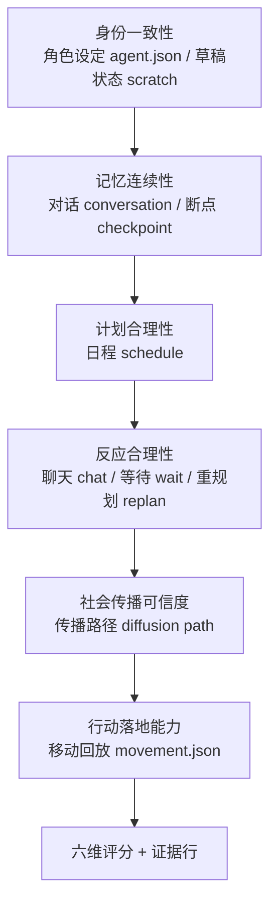
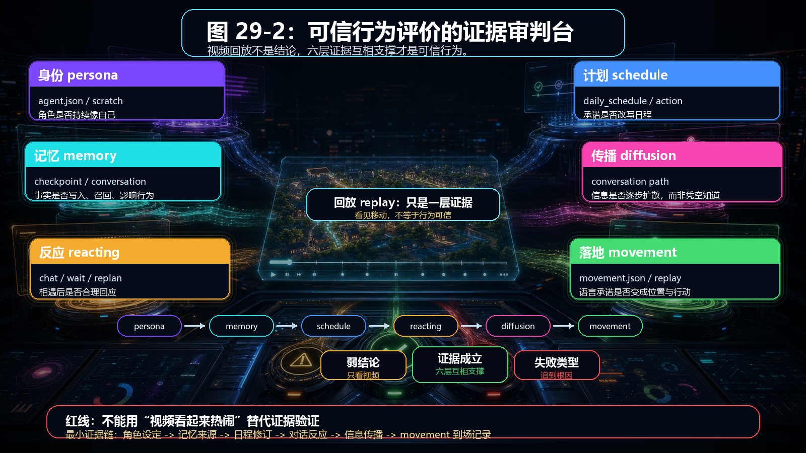
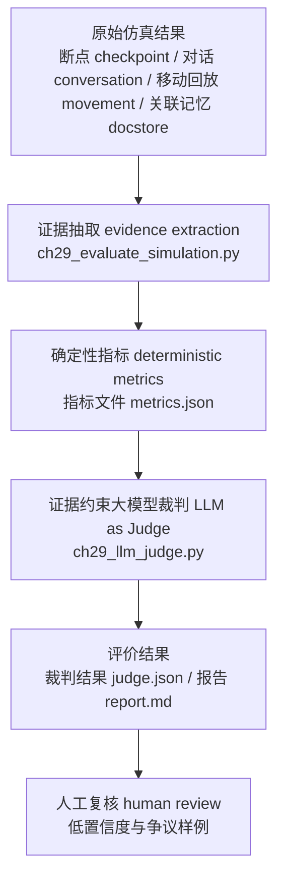
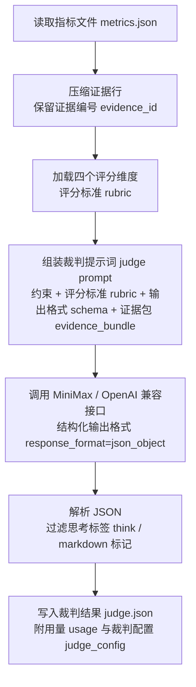
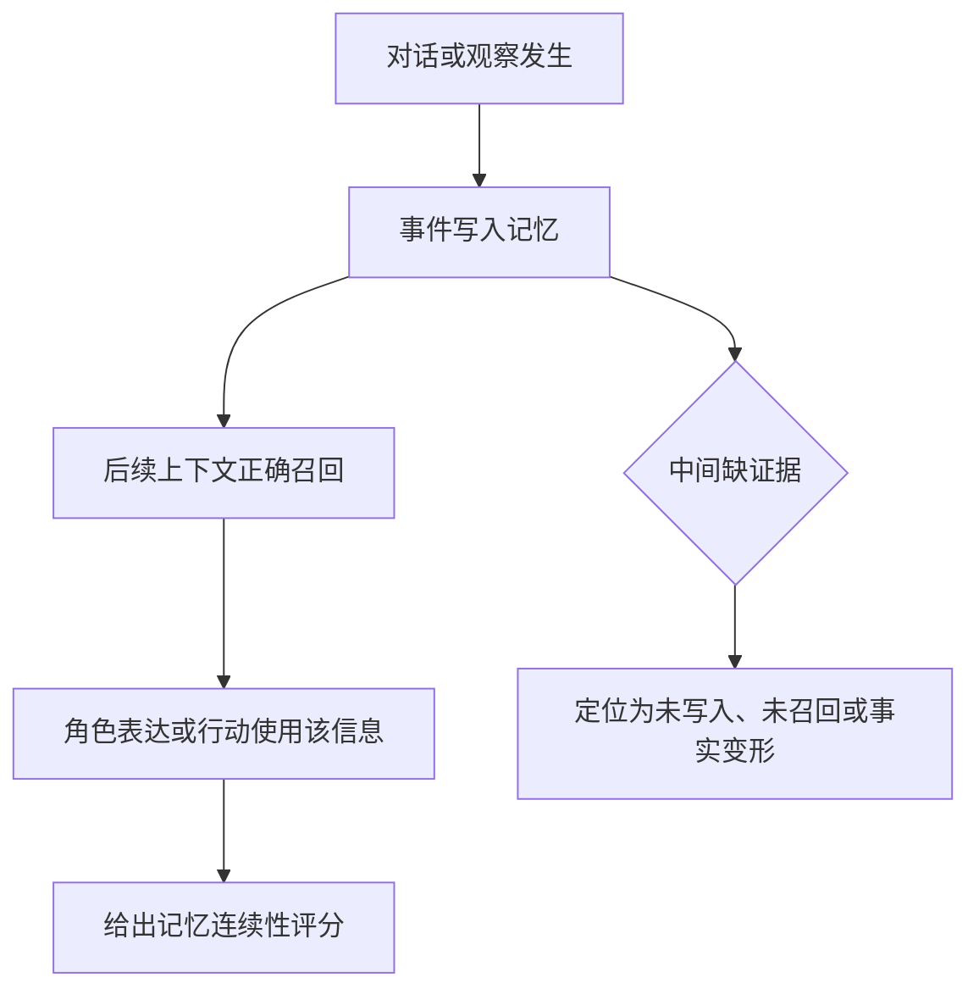
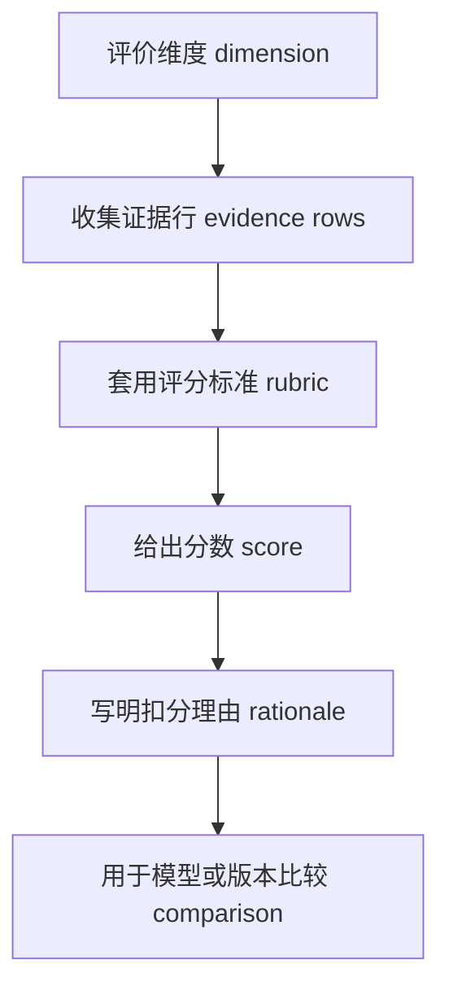
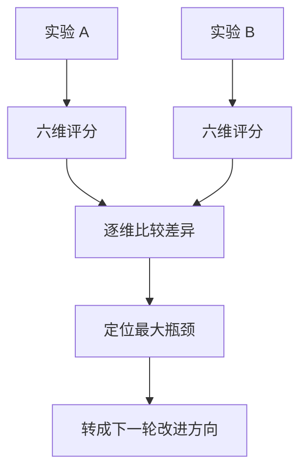
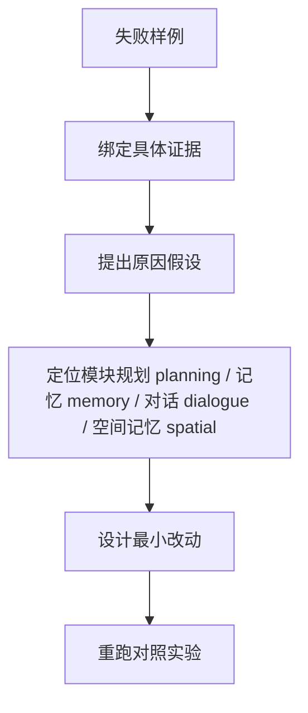

# 第 29 章 如何评价一个智能体是否“可信”

## 29.1 核心问题

前面已经完成三类实验准备：

- 情人节派对传播
- 镇长竞选信息扩散
- 设计自己的小镇事件

下一步要回答可信性评价问题：

```text
我们如何判断一个智能体是否真的“可信”？
```

这个问题不能靠感觉：
- “看起来有意思”不是可信
- “对话很流畅”不是可信
- “任务成功完成”也不一定是可信

生成式智能体 Generative Agents 论文中的 believable behavior，指的是一种行为连续性：

```text
角色的行动、记忆、计划、关系、反应和环境约束能够互相支撑。
```

这个概念需要转化为生成式智能体 Generative Agents 的可操作评价框架。评价框架要回答七个问题：

1. “像不像人”评价智能体？
2. 可信行为需要哪些证据？
3. 如何区分语言可信、记忆可信和行动可信？
4. 如何从 `simulation.md`、`conversation.json`、断点 checkpoint 和 `movement.json` 收集证据？
5. 如何给智能体行为打分？
6. 如何做多个模型、多个版本或多个实验之间的比较？
7. 如何把失败样例转化成系统改进方向？



*图 29-1：可信行为的六层证据链。评价可信性时要同时检查身份、记忆、计划、反应、传播和行动落地，不能只看对话是否顺。*



*图 29-2：可信行为评价的证据审判台。图片把视频回放 replay 放在中央，但让角色身份 persona、记忆 memory、日程 schedule、反应 reacting、传播 diffusion 和移动回放 movement 六层证据同时压上来，提醒读者不要用“视频看起来热闹”替代证据验证。*

## 29.2 “可信”不是“真实”

先澄清一个重要边界：本书说的“可信”，不是说智能体真的有意识。也不是说它真的拥有主观体验、真实动机或真实社会关系。这里的可信更接近：

```text
在给定设定、环境和历史记录下，智能体的行为是否像一个连续存在的角色。
```

例如，一个可信的伊莎贝拉应该：

- 记得自己在霍布斯咖啡馆工作。
- 关心情人节派对。
- 在合适场景下邀请别人。
- 如果别人答应参加，后续可能记住这件事。
- 到了派对前后，行动与准备派对相关。

这不意味着伊莎贝拉“真的想办派对”。它意味着系统生成的行为与角色设定、记忆和环境约束一致。本章所有评价都建立在这个边界上。可信行为是可观察行为。不是意识证明。

## 29.3 对话之外的可信证据

最常见的误判来自这里：

```text
这个智能体说话很自然，所以它很可信。
```

这不成立。语言模型很擅长生成自然语言。一个角色即使完全没有记忆，也可以临时编出一段像样的回答。例如你问：

```text
你今天过得怎么样？
```

模型可能会这样回答：

```text
今天挺充实的，我上午工作，下午和朋友聊了聊，晚上打算休息。
```

这句话很自然。但它可能没有任何证据。可信评价要追问：

```text
上午真的有工作记录吗？
下午真的和朋友聊过吗？
晚上计划里真的有休息吗？
这句话与角色身份一致吗？
```

如果这些都无法追溯，那么它只是流畅文本，不是可信行为。生成式智能体 Generative Agents 的优势是可以追证据。读者可以查：

- `agent.json` 中的角色设定。
- 断点 checkpoint 中的记忆和日程。
- `conversation.json` 中的对话。
- `simulation.md` 中的活动时间线。
- `movement.json` 中的位置移动。

有了这些材料，评价就不必停留在感觉层面。

## 29.4 可信行为的六个维度

本章建议用六个维度评价智能体：

1. 身份一致性是否稳定。
2. 记忆连续性是否可靠。
3. 计划合理性是否成立。
4. 反应合理性是否自然。
5. 社会传播可信度是否足够。
6. 行动落地能力是否可验证。

这六个维度对应论文架构。身份一致性对应身份设定 persona 和草稿状态 scratch。记忆连续性对应记忆流 memory stream 和记忆检索 retrieval。计划合理性对应规划 planning 和日程 schedule。反应合理性对应反应 reacting。社会传播可信度对应对话 dialogue、记忆 memory 和多智能体互动 multi-agent interaction。行动落地能力对应沙盒落地 sandbox grounding、世界地图 maze 和移动回放 movement。用这六个维度，可以把“这个智能体像不像人”拆成可检查问题。

| 评价维度 | 看什么 | 主要证据 | 常见失败 |
| --- | --- | --- | --- |
| 身份一致性 | 行为是否符合角色职业、性格和背景。 | 角色设定 `agent.json`、访谈回答、日程和对话。 | 角色忘记职业、语气漂移、行为和设定冲突。 |
| 记忆连续性 | 是否记得关键事件、来源和关系。 | 记忆 memory、对话记录 conversation、仿真时间线 `simulation.md`。 | 刚发生就遗忘，或编造不存在的经历。 |
| 计划合理性 | 日程是否有节奏，是否能被事件合理打断。 | 日程 schedule、行动 action、移动回放 `movement.json`。 | 一直聊天、不去目标地点、重规划不合理。 |
| 反应合理性 | 遇到人和事件时是否反应得当。 | `_reaction()`、聊天记录、等待行为。 | 无视重要事件，或对小事过度反应。 |
| 社会传播可信度 | 信息是否通过对话和记忆逐步扩散。 | 多人对话记录 conversation、传播路径、到场记录。 | 所有人突然知道，或信息完全不扩散。 |
| 行动落地能力 | 语言承诺是否转化为地点、对象和时间上的行动。 | 移动回放 `movement.json`、断点 checkpoint、前端回放。 | 口头答应但不到场，行动和地点不匹配。 |

*表 29-1：可信行为六维评价表。可信性评价必须同时看文本、记忆、计划、空间行动和社会传播，不能只看对话是否自然。*

### 本章评价工具入口

当前项目没有内置一套论文级自动评价器。源码中的重要性评分提示词 prompt 只评估单个事件或对话的情感强度，记忆检索 retrieval 里的近期性 recency、相关性 relevance、重要性 importance 只用于排序记忆，不负责判断一次仿真是否可信。但项目已经把评价需要的证据写到了本地文件里。本章先使用一个轻量脚手架抽取证据：

```text
docs/book/scaffolds/part_04_05/ch29_evaluate_simulation.py
```

这个脚本不调用大语言模型 LLM，也不重新跑仿真。它只读取一次已经完成的实验，把证据文件转成可复查指标。它的定位是“证据抽取 evidence extraction”，不是最终裁判 judge：

| 证据文件 | 项目产物 | 可计算内容 |
| --- | --- | --- |
| 断点 checkpoint | `generative_agents/results/checkpoints/<实验名>/simulate-*.json` | 日程 schedule、当前计划 current plan、角色记忆数量、日程冲突。 |
| 对话记录 conversation | `generative_agents/results/checkpoints/<实验名>/conversation.json` | 对话次数、参与者、事件关键词、传播路径、JSON 残留。 |
| 移动回放 movement | `generative_agents/results/compressed/<实验名>/movement.json` | 角色位置、行动描述、采样窗口内的行动落地情况。 |
| 关联记忆 docstore | `generative_agents/results/checkpoints/<实验名>/storage/<角色>/associate/docstore.json` | 事件 event、对话 chat、想法 thought 的数量与关键词命中。 |

从仓库根目录运行：

```powershell
python .\docs\book\scaffolds\part_04_05\ch29_evaluate_simulation.py `
  --name book-custom-discussion `
  --agent 克劳斯 `
  --source-agent 克劳斯 `
  --window-start 15:50 `
  --window-end 16:50 `
  --sample-minutes 10 `
  --goal-keywords "中产阶级化,置换效应,社区文化变迁,访谈笔记,田野观察,撰写" `
  --fact-keywords "置换效应,图书馆" `
  --location-keywords "图书馆" `
  --commitments "阿伊莎|16:00|图书馆|四点图书馆老位置见" `
  --output docs/book/assets/chapter_29/ch29_book_custom_discussion_metrics.json
```

命令里的关键参数含义如下：

| 参数 | 中文含义 | 作用 |
| --- | --- | --- |
| `--name` | 实验名 simulation name | 定位 `results/checkpoints/` 和 `results/compressed/` 下的同名目录。 |
| `--agent` | 被评价角色 evaluated agent | 本次主要计算克劳斯的日程、行动和记忆。 |
| `--source-agent` | 传播源头 source agent | 计算传播路径 diffusion path 时，从谁开始追踪信息扩散。 |
| `--window-start` / `--window-end` | 观察窗口 observation window | 只评价 15:50-16:50 这一小时的行动。 |
| `--goal-keywords` | 目标关键词 goal keywords | 判断行动和对话是否服务论文写作目标。 |
| `--fact-keywords` | 核心事实 core facts | 判断传播过程中“置换效应”“图书馆”这类事实是否保留。 |
| `--location-keywords` | 合理地点 location keywords | 判断角色是否落在目标空间。 |
| `--commitments` | 承诺落地 commitments | 人工标注“谁在什么时间去哪里做什么”，用于计算到场率。 |

真实输出如下：

```json
{
  "simulation": "book-custom-discussion",
  "agent": "克劳斯",
  "schedule_conflict_count": 0,
  "location_match_rate": 1.0,
  "goal_related_action_rate": 0.8571428571428571,
  "plan_action_match_rate": 0.7142857142857143,
  "arrival_rate": 1.0,
  "unique_informed_agents": 3,
  "diffusion_depth": 1,
  "fact_preservation_score": 0.7647058823529411,
  "json_residue_count": 4,
  "memory_goal_related_nodes": 38,
  "output": "docs/book/assets/chapter_29/ch29_book_custom_discussion_metrics.json"
}
```

这段 JSON 可以按下面方式快速阅读：

| 中文读法 | 原始字段 | 含义 |
| --- | --- | --- |
| 实验名 simulation | `simulation` | 本次评价对应的仿真实验目录。 |
| 被评价角色 agent | `agent` | 本次主要观察的角色。 |
| 时间冲突数 schedule conflict count | `schedule_conflict_count` | 日程里持续时间、重叠和边界错误的数量。 |
| 地点匹配率 location match rate | `location_match_rate` | 采样行动中，角色位置符合计划语义的比例。 |
| 目标相关行动率 goal related action rate | `goal_related_action_rate` | 行动服务当前目标的比例。 |
| 计划行动匹配率 plan action match rate | `plan_action_match_rate` | 行动描述与当前计划匹配的比例。 |
| 到场率 arrival rate | `arrival_rate` | 人工标注承诺中，角色按时到达目标地点的比例。 |
| 知情角色数 unique informed agents | `unique_informed_agents` | 对话中接触到核心事实的去重角色数。 |
| 传播深度 diffusion depth | `diffusion_depth` | 从传播源头出发，信息能走到的最远跳数。 |
| 事实保持分数 fact preservation score | `fact_preservation_score` | 相关话语中保留核心事实的比例。 |
| JSON 残留数 JSON residue count | `json_residue_count` | 对话文本里残留结构化 JSON 的次数。 |
| 目标相关记忆节点数 memory goal related nodes | `memory_goal_related_nodes` | 关联记忆中命中目标关键词的节点数量。 |

这些数值是机器初筛，不是最终判决。它适合快速发现“日程有没有冲突”“位置是否落地”“传播链是否存在”“记忆里有没有相关节点”。涉及语义相似、角色动机、态度变化和最终 1-5 分评分时，要继续进入大模型裁判 LLM as Judge 或人工复核。

### 大模型裁判 LLM as Judge：证据约束的新时代评价

传统关键词评估 keyword evaluation 适合算“出现了几次”，不适合判断“是否可信”。比如克劳斯说了“置换效应”，阿伊莎也说了“置换效应”，关键词脚本只能判断话题相关。它不能稳定判断下面这些更重要的问题：

```text
这句话是在邀请，还是只是在讨论？
这段行动是在执行计划，还是偶然路过？
这个事实是被正确传播，还是被对话参与者共同补全？
这个角色的犹豫是失败，还是符合人设？
```

大模型裁判 LLM as Judge 的价值正在这里。它让一个强模型读取证据包 evidence bundle、评分标准 rubric 和输出格式 schema，再给出结构化评价。评价方法 G-Eval 使用大语言模型 LLM 配合思维链 chain-of-thought 和表单化 form-filling 做自然语言生成评价，强调比传统 BLEU/ROUGE 这类参考答案指标更适合开放文本任务。对话评测 MT-Bench / Chatbot Arena 进一步把强模型作为裁判 judge，用于近似人类偏好，同时也指出位置偏差 position bias、冗长偏差 verbosity bias、自我增强偏差 self-enhancement bias 等问题。裁判模型 Prometheus 的启发是：裁判模型不能只凭感觉打分，必须给它参考材料 reference material 和细粒度评分标准 fine-grained rubric。多裁判方案 PoLL 这类后续工作还提醒：单一强模型裁判有成本和模型内偏差，可以用多模型评审团 jury 降低风险。

本章采用的是一套混合评价 hybrid evaluation：



这条链路把评价分成三层：

| 层次 | 方法 | 适合判断 | 不适合判断 |
| --- | --- | --- | --- |
| 确定性指标 deterministic metrics | 程序统计 | 日程冲突、位置命中、到场时间、节点数量。 | 语义是否合理、动机是否成立。 |
| 语义裁判/大模型裁判 LLM as Judge | 证据包 evidence bundle + 评分标准 rubric + 输出格式 schema | 计划与行动是否互相支持，传播是否可信，失败原因是什么。 | 没有证据的事实判断、精确数值统计。 |
| 人工复核 human review | 作者或实验者审读 | 低置信度结论、伦理判断、最终发表结论。 | 大规模重复统计。 |

大模型裁判 LLM as Judge 不能裸用。直接把整个日志扔给模型，让它说“好不好”，会得到漂亮但不可复查的文字。本章脚本强制使用下面约束：

| 约束 | 做法 | 作用 |
| --- | --- | --- |
| 证据约束 evidence-constrained | 只把抽取后的证据包 `evidence_bundle` 交给模型。 | 限制模型凭空补故事。 |
| 细粒度评分标准 rubric | 每个维度写清楚 5 分和 1 分倾向。 | 让评分有共同口径。 |
| 结构化输出格式 schema | 只允许输出 JSON。 | 便于后续报告和比较。 |
| 证据编号 evidence id | 每个评分必须引用 `action:0`、`social:3` 等证据 ID。 | 让读者能回到原始证据检查。 |
| 置信度 confidence | 每个维度输出置信度字段 `confidence`。 | 低置信度结论不直接当最终结论。 |
| 人工复核标记 `needs_human_review` | 输出人工复核字段 `needs_human_review`。 | 把模糊判断显式交给作者复核。 |

所以，当前评价流水线不是“关键词脚本 vs 大模型裁判 LLM as Judge”二选一，而是前后协作：关键词脚本负责收集证据和计算硬指标，大模型裁判 LLM as Judge 负责把这些证据放进语义和工程上下文里判断。

### 大模型裁判 LLM as Judge 脚本：输入、处理、输出

本章新增第二个脚本：

```text
docs/book/scaffolds/part_04_05/ch29_llm_judge.py
```

它读取上一步生成的指标文件 `metrics.json`，调用项目配置中的模型，输出结构化裁判结果。命令如下：

```powershell
python .\docs\book\scaffolds\part_04_05\ch29_llm_judge.py `
  --metrics-json docs/book/assets/chapter_29/ch29_book_custom_discussion_metrics.json `
  --output docs/book/assets/chapter_29/ch29_book_custom_discussion_judge.json
```

这个命令的输入 input 是一个指标文件 metrics JSON：

```text
docs/book/assets/chapter_29/ch29_book_custom_discussion_metrics.json
```

它来自 `ch29_evaluate_simulation.py`，里面已经包含六类材料：

| 输入块 | 来源 | 给大模型裁判 judge 的作用 |
| --- | --- | --- |
| 日程指标 `schedule_metrics` | 断点 checkpoint | 判断日程是否冲突、评价窗口是否覆盖。 |
| 行动证据 `action_metrics.evidence_rows` | 移动回放 movement | 判断行动地点、行动描述和当前计划是否一致。 |
| 承诺证据 `commitment_metrics.evidence_rows` | 人工标注承诺 + 移动回放 movement | 判断承诺是否到场，延迟多少分钟。 |
| 对话证据 `conversation_metrics.evidence_rows` | 对话记录 `conversation.json` | 判断对话是否支撑记忆、传播和计划变化。 |
| 社会传播证据 `social_metrics.evidence_rows` | 对话记录 `conversation.json` | 判断传播源头、传播边、事实保持和态度变化。 |
| 记忆样例 `memory_metrics.examples` | 关联记忆 `docstore.json` | 判断关键事件是否写入记忆。 |

脚本内部处理 process 分成六步：



脚本默认读取：

```text
generative_agents/data/config.json
```

其中思考模型配置 `agent.think.llm` 配置了模型提供方 provider、模型名 model 和接口地址 base_url。本地配置使用 MiniMax：

```json
{
  "provider": "minimax",
  "model": "MiniMax-M3",
  "base_url": "https://api.minimaxi.com/v1"
}
```

密钥不写进正文和配置文件。脚本会从环境变量读取：

```text
MINIMAX_API_KEY
```

如果要改模型，可以在命令行覆盖：

```powershell
python .\docs\book\scaffolds\part_04_05\ch29_llm_judge.py `
  --metrics-json docs/book/assets/chapter_29/ch29_book_custom_discussion_metrics.json `
  --output docs/book/assets/chapter_29/ch29_book_custom_discussion_judge.json `
  --model MiniMax-M3 `
  --temperature 0.1
```

脚本交给模型的核心提示词 prompt 不是一句“请评价”。它包含四个维度的评分标准 rubric：

| 维度 | 判断问题 | 5 分倾向 | 1 分倾向 |
| --- | --- | --- | --- |
| 计划合理性 planning quality | 日程、当前计划和实际行动是否互相支持。 | 日程无冲突，行动地点合理，行动能解释当前计划和目标。 | 日程冲突、行动泛化、地点错误或计划目标脱节。 |
| 社会传播可信度 social diffusion credibility | 信息是否有源头、有路径，并保留核心事实。 | 源头清晰，传播边可追踪，事实保持，影响后续对话或行动。 | 多人突然知道事件，路径缺失，事实变形。 |
| 行动落地能力 action grounding | 口头承诺、地点移动和行动描述是否闭环。 | 承诺在容差窗口内到达，到场后行动与主题一致。 | 承诺不到场，或到场但行动无关。 |
| 记忆连续性 memory continuity | 关键事件是否进入记忆并被后续使用。 | 事件、对话、想法节点完整，后续发言正确使用经历。 | 关键经历没有写入，或后续凭空编造。 |

输出 output 是一个裁判结果文件 judge JSON：

```text
docs/book/assets/chapter_29/ch29_book_custom_discussion_judge.json
```

真实运行摘要如下：

```json
{
  "simulation": "book-custom-discussion",
  "agent": "克劳斯",
  "overall_score": 3.75,
  "score_count": 4,
  "output": "docs\\book\\assets\\chapter_29\\ch29_book_custom_discussion_judge.json"
}
```

这里的总分 `overall_score` 是四个裁判维度的平均分，分数数量 `score_count` 是模型实际返回的评分维度数。本次为 `3.75`，表示整体可用，但仍有需要人工复核的证据缺口。

打开裁判结果 `judge.json` 后，核心结果如下：

| 维度 | 分数 | 置信度 | 人工复核 | 裁判理由摘要 |
| --- | ---: | ---: | --- | --- |
| 计划合理性 | 4 | 0.82 | 否 | 日程无冲突，7 条行动都在图书馆，5 条与当前计划直接匹配；两条行动存在轻微语义错位。 |
| 社会传播可信度 | 3 | 0.65 | 是 | 源头和核心事实能追踪，但传播深度只有 1，传播边出现回流，数据结构需要复核。 |
| 行动落地能力 | 4 | 0.85 | 否 | 阿伊莎 16:00 到达图书馆，承诺落地；但承诺主体不是克劳斯，样本量只有 1。 |
| 记忆连续性 | 4 | 0.80 | 是 | 记忆节点形成清晰时序链，但只抽取了 8 个样例，部分目标关键词在对话统计中为 0。 |

同一个证据包重复运行大模型裁判 LLM as Judge，分数可能出现小幅波动。这不是脚本错误，而是裁判模型 judge model 的方差。正式实验报告应保存每次运行的裁判结果文件 `judge_json`，对关键结论可以采用多次运行、自洽性检查 consistency check，或多模型评审团 jury 再人工复核。

这里最值得注意的是行动落地能力 action grounding。关键词脚本只会给出到场率 arrival rate：

$$
\text{到场率}
=
1.0
$$

大模型裁判 LLM as Judge 会进一步指出：这条到场证据的主体是阿伊莎，而本次主要评价角色是克劳斯。因此它给 4 分，并把“承诺主体不是克劳斯、样本量只有 1”写进裁判理由和风险字段。不同裁判 judge 运行可能会把这个问题标成需要人工复核 `needs_human_review=true`，也可能只放在风险字段 `risks` 中；正式报告应对这类证据归属问题人工复核。这就是语义裁判比关键词统计更强的地方。它没有否定到场事实，但能识别“证据归属”这个关键问题。

裁判结果 `judge.json` 中每个维度都会包含：

| 字段 | 含义 |
| --- | --- |
| 评价维度 `dimension` | 评价维度。 |
| 分数 `score` | 1-5 分。 |
| 置信度 `confidence` | 裁判置信度。 |
| 证据编号 `evidence_ids` | 支撑该判断的证据 ID 或指标路径。 |
| 裁判理由 `rationale` | 裁判理由。 |
| 风险列表 `risks` | 潜在风险和证据缺口。 |
| 人工复核标记 `needs_human_review` | 是否需要人工复核。 |

运行完成后，评价报告的证据链变成：

```text
原始仿真目录
  -> 指标文件 ch29_book_custom_discussion_metrics.json
  -> 裁判结果 ch29_book_custom_discussion_judge.json
  -> 人工复核后的报告 report.md
```

这才是一套可复查、可复跑、可解释的智能体评价流程。

## 29.5 维度一：身份一致性

身份一致性回答的问题是：

```text
这个角色是否持续像自己？
```

它包括职业、年龄、家庭、兴趣、关系、习惯和当前目标。例如克劳斯是社会学学生，正在写关于低收入社区中产阶级化影响的研究论文。一个可信的克劳斯应该在以下方面保持一致：

- 日程中有学习、写作或校园活动。
- 对社会议题有较高兴趣。
- 与玛丽亚交流时可以谈到研究。
- 不应突然自称咖啡馆老板或市长候选人。

评价身份一致性时，可以看三类证据。第一，角色设定。文件：

```text
generative_agents/frontend/static/assets/village/agents/<角色名>/agent.json
```

第二，活动时间线。文件：

```text
generative_agents/results/compressed/<实验名>/simulation.md
```

第三，对话内容。文件：

```text
generative_agents/results/checkpoints/<实验名>/conversation.json
```

评分时可以提出下面问题：

```text
角色说的话是否符合人设？
角色做的事是否符合职业和习惯？
角色的当前目标是否被持续保留？
有没有与人设直接冲突的内容？
```

常见扣分点主要包括：

- 职业错乱。
- 家庭关系错乱。
- 当前目标消失。
- 角色说话风格完全趋同。
- 所有人都表现得过度友好或过度理性。

## 29.6 维度二：记忆连续性

记忆连续性回答的问题是：

```text
角色是否记得自己经历过什么？
```

这不是简单看角色能不能说“我记得”。要看它是否能引用真实经历。例如，玛丽亚说：

```text
我听伊莎贝拉说，明天晚上霍布斯咖啡馆有情人节派对。
```

这句话是否可信，取决于能否找到证据：

```text
伊莎贝拉是否真的告诉过玛丽亚？
玛丽亚是否在后续记忆或对话中保留这个信息？
她是否把时间、地点、发起者说对？
```

记忆连续性可以分成四层。

- 第一层，接触事实，角色是否真的经历过事件。
- 第二层，写入记忆，事件是否进入智能体 agent 的关联记忆或聊天记录。
- 第三层，正确召回，后续是否能在相关场景想起它。
- 第四层，影响行为，记忆是否改变了对话、计划或行动。

如果只达到第一层，不算强记忆。如果达到第四层，说明记忆流 memory stream 真正进入行为闭环。

## 29.7 记忆评价的证据链

判断一个角色是否“知道某事”，建议使用以下证据链：

```text
对话或观察发生
  -> 事件进入记忆
  -> 后续上下文召回
  -> 角色表达或行动使用该信息
```

以派对传播实验为例：

```text
伊莎贝拉邀请玛丽亚参加派对。
玛丽亚的记忆中出现派对相关记录。
玛丽亚后来与克劳斯聊天时提到派对。
克劳斯再把这件事纳入自己的计划或对话。
```

记忆评价逻辑图：



这条链越完整，记忆越可信。

- 如果玛丽亚从未见过伊莎贝拉，却突然说自己知道派对，应该标记为幻觉或设定泄漏。
- 如果玛丽亚听过派对，但后续完全忘记，说明传播失败或检索失败。
- 如果玛丽亚记得派对，但说错时间地点，说明事实保持能力不足。

这些都不是“失败了就完了”。它们是定位系统问题的线索。

## 29.8 维度三：计划合理性

计划合理性回答的问题是：

```text
角色的日程是否符合身份、时间和环境？
```

生成式智能体 Generative Agents 的计划不是临时动作列表。它从较粗日程生成，再逐步拆成具体行动。评价计划时要看四点。

第一，时间合理。例如：

- 睡觉时间不要频繁被不合理打断。
- 早餐、午餐、晚餐大致符合生活节奏。
- 工作、学习和休息时间不要完全混乱。

第二，地点合理。例如：

- 伊莎贝拉在咖啡馆活动合理。
- 学生去学院、图书馆、宿舍合理。
- 角色不要频繁前往不存在或无关地点。

第三，目标合理。例如：

- 山姆竞选期间应有社区沟通行为。
- 克劳斯写论文期间应有研究、阅读或讨论。
- 伊莎贝拉筹备派对期间应有准备、邀请或布置。

第四，粒度合理。例如：计划不能太粗。如果一个角色连续数小时只是：

```text
做自己的事情。
```

这不利于可信行为。计划也不能太碎到无法执行。如果每 10 分钟切换一个无关地点，会显得机械。

## 29.9 计划评价的常见指标

计划指标不能只列名字。每个指标都要规定输入数据、统计窗口、分母和判定规则。否则“计划还可以”只是感受，不是评价。

先定义计算口径：

| 符号 | 中文 English | 来源 | 含义 |
| --- | --- | --- | --- |
| `P` | 日计划 daily schedule | 断点 checkpoint 中 `agents.<name>.schedule.daily_schedule` | 当天所有粗计划 plan。 |
| `p_i` | 第 `i` 个粗计划 plan | `P[i]` | 形如 `{start, duration, describe, decompose}`。 |
| `s_i` | 开始分钟 start minute | `p_i["start"]` | 从当天 00:00 开始计数，09:00 是 540。 |
| `e_i` | 结束分钟 end minute | `p_i["start"] + p_i["duration"]` | 当前计划结束时间。 |
| `A` | 观测行动 observation actions | `simulation.md` 或 `movement.json` | 评价窗口内每个时间点的角色位置与行动。 |
| `a_t` | 第 `t` 条观测行动 action | `A[t]` | 形如 `{time, location, action}`。 |
| `G` | 目标关键词 goal set | 当前状态 `currently`、日计划 `daily_plan`、实验目标 | 用来判断行动是否服务当前目标。 |
| `I(x)` | 指示函数 indicator | 人工或脚本判断 | 条件成立取 1，否则取 0。 |
| `N` | 观测行动数 action count | `len(A)` | 评价窗口内的行动记录总数。 |

这些定义允许人工标注，也允许脚本自动统计。人工标注时，每一行证据仍然要写清楚 `time`、`location`、`action` 和判定值。指标总览表只负责让读者知道“这个指标回答什么问题”，复杂公式单独放在下面的公式卡里。

| 指标 | 字段 | 回答的问题 | 证据来源 |
| --- | --- | --- | --- |
| 时间冲突数 | `schedule_conflict_count` | 日程时间是否自洽。 | 断点 checkpoint 中的日程 `schedule.daily_schedule` |
| 日程覆盖率 | `schedule_coverage_rate` | 评价窗口是否被计划覆盖。 | 断点 checkpoint 中的日程 `schedule.daily_schedule` |
| 计划行动匹配率 | `plan_action_match_rate` | 行动是否真的在执行当前计划。 | `simulation.md`、断点 checkpoint 中的日程 `schedule` |
| 地点匹配率 | `location_match_rate` | 当前地点是否符合计划语义。 | `movement.json`、`simulation.md`、空间记忆 spatial |
| 目标相关行动率 | `goal_related_action_rate` | 行动是否服务当前目标。 | 当前状态 `currently`、日计划 `daily_plan`、`simulation.md` |
| 泛化行动率 | `generic_action_rate` | 泛化动作在窗口内占比有多高。 | `simulation.md` |
| 连续泛化重复数 | `repeated_generic_action_count` | 泛化动作是否连续重复。 | `simulation.md` |
| 粒度通过率 | `granularity_pass_rate` | 子计划是否细到可执行，又没有碎到抖动。 | 断点 checkpoint 中的子计划 `schedule.daily_schedule[*].decompose` |
| 重规划成功率 | `replan_success_rate` | 对话、邀请或等待打断后，后续计划是否合理改变。 | `conversation.json`、断点 checkpoint 中的日程 `schedule`、`movement.json` |
| 睡眠一致性分数 | `sleep_consistency_score` | 睡觉、起床和夜间活动是否符合生活习惯。 | 生活方式 lifestyle、`simulation.md`、`movement.json` |

**公式 29-1：时间冲突数 schedule conflict count**

$$
\begin{aligned}
\text{时间冲突数}
&= \text{无效时长数} + \text{重叠数} + \text{边界错误数} \\
\text{无效时长数}
&= \sum_i I(d_i \le 0 \lor s_i < 0 \lor e_i > 1440) \\
\text{重叠数}
&= \sum_i I(s_{i+1} < e_i) \\
\text{边界错误数}
&= I(s_0 \ne 0) + I(e_{\text{last}} \ne 1440)
\end{aligned}
$$

读法：先检查每段计划的时长是否合法，再检查相邻计划是否重叠，最后检查当天是否从 00:00 覆盖到 24:00。三类错误加起来，就是时间冲突数。

| 符号 | 含义 |
| --- | --- |
| $d_i$ | 第 `i` 段计划的持续时间。 |
| $s_i$ | 第 `i` 段计划的开始分钟。 |
| $e_i$ | 第 `i` 段计划的结束分钟。 |
| $I(x)$ | 指示函数 indicator，条件成立取 1，否则取 0。 |

本项目的 `Schedule.add_plan()` 通常会按顺序追加计划，所以普通运行中这个值常常是 0。一旦模型输出被解析错、日程修订 schedule revise 把时间段改乱，或者断点 checkpoint 中出现异常，这个指标会立刻暴露问题。

地点匹配率 `location_match_rate` 要先定义计划可接受地点 `L(plan)`。例如：

| 当前计划 plan | 可接受地点集合 `L(plan)` |
| --- | --- |
| 写中产阶级化论文 | 奥克山学院图书馆、奥克山学院宿舍书桌、咖啡馆顾客座位 |
| 筹备情人节派对 | 霍布斯咖啡馆、供应店、社区公告板 |
| 竞选沟通 | 咖啡馆、公园、居民常去的公共空间 |
| 睡觉 | living_area 中的卧室或床 |

**公式 29-2：地点匹配率 location match rate**

$$
\begin{aligned}
\text{地点匹配率}
&= \frac{\text{命中可接受地点的行动数}}{\text{评价窗口内行动数}} \\
\text{地点不匹配数}
&= \text{评价窗口内行动数} - \text{命中可接受地点的行动数}
\end{aligned}
$$

读法：先为每个计划定义可接受地点集合 `L(plan)`，再逐条检查角色是否落在这些地点里。地点匹配率越高，说明行动更能被空间证据支撑。

目标相关行动率 `goal_related_action_rate` 的关键是先写清楚 `G`。同一段行为，换一个目标集合，结论会不同。`rel(action, G)` 可以用三档人工标注：

| `rel(action, G)` | 含义 | 例子 |
| ---: | --- | --- |
| `1` | 直接服务目标 | 克劳斯“撰写社区文化变迁章节”服务中产阶级化论文目标。 |
| `0.5` | 间接服务目标 | 克劳斯“吃晚饭休息”间接支持后续写作。 |
| `0` | 无关 | 克劳斯计划组织讨论会，但行动是处理完全无关事务。 |

**公式 29-3：目标相关行动率 goal related action rate**

$$
\text{目标相关行动率}
=
\frac{\sum_{t=1}^{N} \text{rel}(a_t, G)}{N}
$$

读法：把评价窗口里的每条行动逐一打分，直接服务目标记 1，间接服务目标记 0.5，无关记 0，最后除以行动总数。

| 符号 | 含义 |
| --- | --- |
| $a_t$ | 第 `t` 条观测行动。 |
| $G$ | 目标关键词集合 goal set。 |
| $N$ | 评价窗口内行动总数。 |
| $\text{rel}(a_t, G)$ | 行动与目标集合的相关度，取值为 0、0.5 或 1。 |

泛化动作集合 `H` 也要提前写清楚，不能事后随便挑。可以先把下面几类动作放入集合 `H`：

- 工作。
- 学习。
- 休息。
- 社交。
- 做自己的事情。
- 思考下一步计划。
- 处理事务。

如果 `simulation.md` 连续多段都是“学习”或“工作”，没有对象、地点、材料和动作，`generic_action_rate` 和 `repeated_generic_action_count` 都会上升。它们不是惩罚勤奋，而是惩罚不可观察。

睡眠一致性分数 `sleep_consistency_score` 只适合覆盖完整白天和夜间的实验。若实验只跑 4 小时，就标记为 `N/A`。完整实验中：

**公式 29-4：睡眠一致性分数 sleep consistency score**

$$
\begin{aligned}
\text{起床误差}
&= |\text{实际起床时间} - \text{生活方式中的起床时间}| \\
\text{入睡误差}
&= |\text{实际入睡时间} - \text{生活方式中的入睡时间}| \\
\text{睡眠一致性分数}
&= \operatorname{clamp}\left(
1 - \frac{\text{起床误差} + \text{入睡误差} + \text{夜间非睡眠活动分钟数}}{\text{预期睡眠分钟数}},
0,
1
\right)
\end{aligned}
$$

读法：起床越偏、入睡越偏、夜里越频繁活动，分数越低。这里的 `clamp(x, 0, 1)` 表示把结果限制在 0 到 1 之间。分数越接近 1，睡眠节奏越符合人设。

用第 26 章 `book-custom-discussion` 的真实结果做一个小样例。脚手架读取最新断点 checkpoint：

```text
generative_agents/results/checkpoints/book-custom-discussion/simulate-20240213-1950.json
```

克劳斯在这个断点中的日程没有时间冲突：

$$
\begin{aligned}
\text{无效时长数} &= 0 \\
\text{重叠数} &= 0 \\
\text{边界错误数} &= 0 \\
\text{时间冲突数} &= 0 + 0 + 0 = 0
\end{aligned}
$$

再看移动回放 movement 在 15:50-16:50 的 7 条采样行动：

| 时间 | 地点 | 当前行动 | 当前计划 current plan | 地点命中 | 目标命中 | 计划行动匹配 |
| --- | --- | --- | --- | --- | --- | --- |
| 15:50 | 图书馆桌子 | 撰写将数据与论文论点结合的分析笔记 | 继续撰写研究论文，整理访谈数据和实地观察记录 | 是 | 是 | 是 |
| 16:00 | 图书馆桌子 | 回顾笔记并补充缺失信息 | 继续撰写研究论文，撰写论文中关于社区文化变迁的章节 | 是 | 否 | 否 |
| 16:10 | 图书馆桌子 | 回顾关于社区文化变迁的访谈笔记 | 继续撰写研究论文，撰写论文中关于社区文化变迁的章节 | 是 | 是 | 是 |
| 16:20 | 图书馆桌子 | 回顾关于社区文化变迁的访谈笔记 | 继续撰写研究论文，撰写论文中关于社区文化变迁的章节 | 是 | 是 | 是 |
| 16:30 | 图书馆桌子 | 撰写文化置换现象的分析段落 | 继续撰写研究论文，撰写论文中关于社区文化变迁的章节 | 是 | 是 | 是 |
| 16:40 | 图书馆桌子 | 撰写社区抵抗与韧性的论述 | 继续撰写研究论文，撰写论文中关于社区文化变迁的章节 | 是 | 是 | 是 |
| 16:50 | 图书馆桌子 | 融入访谈引用和田野观察案例 | 继续撰写研究论文，撰写论文中关于社区文化变迁的章节 | 是 | 是 | 否 |

如果评价目标是“写中产阶级化论文”，论文写作目标集合 `G_paper` 包括：中产阶级化、置换效应、社区文化变迁、访谈笔记、田野观察和撰写。

那么三项结果可以写成一张结果卡：

$$
\begin{aligned}
\text{地点匹配率}
&= \frac{7}{7} = 1.00 \\
\text{目标相关行动率}
&= \frac{6}{7} = 0.86 \\
\text{计划行动匹配率}
&= \frac{5}{7} = 0.71
\end{aligned}
$$

克劳斯在这段时间的地点落地很稳定，7 次采样都在奥克山学院图书馆。目标相关行动率 `goal_related_action_rate` 不是满分，原因是 16:00 的“回顾笔记并补充缺失信息”没有命中目标关键词。计划行动匹配率 `plan_action_match_rate` 也不是满分，原因是 16:50 的“融入访谈引用和田野观察案例”服务论文写作，但与当前计划中的“社区文化变迁章节”缺少足够直接的短语重叠。这个结果适合作为机器初筛；人工复核时可以把 16:50 标为“间接匹配”。

如果评价目标换成“下午 4 点组织小型讨论会”，讨论会目标集合 `G_discussion` 包括：组织讨论会、邀请、参加讨论会和小型讨论会。

同样 7 条行动变成：

$$
\text{目标相关行动率}
=
\frac{0}{7}
=
0.00
$$

这就是指标的价值。同一段仿真，不能笼统写“计划合理”。它对于“论文写作”合理，对于“多人讨论会”不达标。

这些指标不必一开始就完全自动化。手工在 `simulation.md` 中标注也可以。关键是保留证据。不要只写：

```text
计划还可以。
```

应该写成下面这种带证据的表述：

```text
山姆在 09:00-12:00 三次出现与竞选相关的社区沟通行为；
但 14:00 后连续两段行动描述为“思考下一步计划”，缺少地点和对象，扣 1 分。
```

## 29.10 维度四：反应合理性

反应合理性回答的问题是：

```text
角色遇到人、事件或意外时，是否做出符合情境的反应？
```

论文中 Reacting 的意义在于打破静态计划。如果角色只按日程机械执行，不理会周围事件，就不可信。但如果角色看到任何人都强行聊天，也不可信。评价反应合理性，要看三类情况。

第一，应该反应时是否反应。例如：

- 伊莎贝拉遇到熟人时，可能自然提到派对。
- 山姆遇到邻居时，可能谈竞选。
- 克劳斯遇到玛丽亚时，可能聊研究和兴趣。

第二，不该反应时是否克制。例如：

- 角色正在睡觉时不应频繁社交。
- 时间紧迫时不应无意义闲聊。
- 与陌生人不应立刻分享过多私密信息。

第三，反应是否改变后续状态。例如：

- 聊天后记忆增加。
- 接受邀请后计划可能变化。
- 冲突后关系理解可能改变。

反应评价不能只看有没有聊天。要看聊天是否由环境和记忆触发。

## 29.11 维度五：社会传播可信度

社会传播可信度回答的问题是：

```text
信息是否通过人际互动自然扩散，并在传播中保持核心事实？
```

这是生成式智能体 Generative Agents 最重要的魅力之一。但也是最容易被误判的地方。一个事件被多人提到，不一定说明传播成功。可能是每个人初始设定里都知道。可能是模型幻觉。可能是提示词 prompt 泄漏。可能是压缩文本让读者误以为发生了传播。可信传播至少要满足三点。第一，有源头。例如派对源头是伊莎贝拉，竞选源头是山姆。第二，有路径。例如：

```text
伊莎贝拉 -> 玛丽亚 -> 克劳斯
```

第三，核心事实保持。例如派对的发起者、时间、地点不能在传播中完全变形。传播不是要求所有信息逐字不变。适度变化是正常的。但核心事实必须能追踪。

## 29.12 社会传播的指标

社会传播指标要先明确三件事：传播源头是谁，核心事实是什么，传播证据来自哪一条对话。不要把“多人都说过某个词”直接当成传播成功。计算口径如下：

| 符号 | 中文 English | 来源 | 含义 |
| --- | --- | --- | --- |
| `S` | 传播源头 source agent | 实验设定或 `--source-agent` | 事件最早由谁发起或稳定持有。 |
| `F` | 核心事实 core facts | `--fact-keywords` | 传播中必须保留的事实词，例如 `{派对, 下午5点, 霍布斯咖啡馆}`。 |
| `C` | 对话集合 conversations | `conversation.json` | 所有对话标题、参与者和逐句内容。 |
| `u_j` | 第 `j` 条话语 utterance | `conversation.json` 中的发言行 | 某个角色在某次对话中说出的一句话。 |
| `speaker(u_j)` | 发言者 speaker | `conversation.json` | 这句话是谁说的。 |
| `participants(c)` | 对话参与者 participants | 对话标题 `A -> B @ location` | 这次对话涉及的角色。 |
| `E` | 传播边 diffusion edge | 脚手架从 `u_j` 推导 | 如果发言者说出核心事实，则记一条 `speaker -> listener`。 |

有了这些定义，社会传播指标可以先做总览：

| 指标 | 字段 | 回答的问题 | 证据来源 |
| --- | --- | --- | --- |
| 知情角色数 | `unique_informed_agents` | 有多少去重角色接触到核心事实。 | `conversation.json` |
| 源头提及数 | `source_mention_count` | 源头主动把话题说给了多少人。 | `conversation.json` |
| 直接邀请数 | `direct_invitation_count` | 源头明确邀请或约定的人数。 | `conversation.json` |
| 间接提及次数 | `indirect_mention_count` | 非源头角色主动延续话题的次数。 | `conversation.json` |
| 传播深度 | `diffusion_depth` | 从源头出发，信息最远传到第几跳。 | 传播边 `E` |
| 事实保持分数 | `fact_preservation_score` | 提到事件的话语中，有多少仍保留全部核心事实。 | `conversation.json` |
| 态度多样性分数 | `attitude_diversity_score` | 角色是否出现接受、犹豫、反对等不同态度。 | 对话文本关键词 |

**公式 29-5：社会传播计数 social diffusion counts**

$$
\begin{aligned}
\text{知情角色数}
&= \left|\{x \mid x \text{说出或听到核心事实 } F\}\right| \\
\text{源头提及数}
&= \left|\{x \mid S \text{对 } x \text{提到 } F \text{ 或 } G\}\right| \\
\text{直接邀请数}
&= \left|\{x \mid S \text{对 } x \text{说出邀请词且提到 } F \text{ 或 } G\}\right| \\
\text{间接提及次数}
&= \sum_j I(\operatorname{speaker}(u_j) \ne S \land u_j \text{提到 } F \text{ 或 } G)
\end{aligned}
$$

读法：前三个指标数的是“多少角色”，间接提及次数数的是“多少句话”。这两个口径不能混在一起，否则会把一次多人对话误读成多跳传播。

这里的 `G` 是目标关键词 goal keywords，`F` 是核心事实 core facts。两者不完全一样。以派对实验为例，`G` 可以包括“筹备”“邀请”“参加”，`F` 必须包括“伊莎贝拉”“下午5点”“霍布斯咖啡馆”。目标词用来判断话题相关，核心事实用来判断传播有没有变形。

**公式 29-6：传播深度 diffusion depth**

$$
\begin{aligned}
V
&= \{x \mid x \text{说出或听到核心事实 } F\} \\
E
&= \{(\operatorname{speaker}, \operatorname{listener}) \mid \operatorname{speaker} \text{在对话中说出 } F\} \\
\text{传播深度}
&= \max_{v \in V} \operatorname{dist}(S, v)
\end{aligned}
$$

读法：先把知情角色看成节点 `V`，把“谁把核心事实说给谁”看成有向边 `E`，再计算从传播源头 `S` 出发能走到的最远距离。距离是 1，说明源头直接告诉别人；距离是 2，说明出现了二跳传播。

**公式 29-7：事实保持与态度多样性**

$$
\begin{aligned}
\text{事实保持分数}
&= \frac{\text{保留全部核心事实的话语数}}{\text{提到事件的话语数}} \\
\text{态度多样性分数}
&= \frac{|\operatorname{distinct}(\text{态度标签})|}{3}
\end{aligned}
$$

读法：事实保持分数看“信息有没有传变形”，态度多样性分数看“不同角色有没有出现接受、犹豫、反对等不同反应”。前者偏事实，后者偏社会状态。

如果路径是：

```text
伊莎贝拉 -> 玛丽亚 -> 克劳斯
```

那么传播深度是 `2`。如果伊莎贝拉只分别告诉玛丽亚和克劳斯，路径是：

```text
伊莎贝拉 -> 玛丽亚
伊莎贝拉 -> 克劳斯
```

那么传播深度是 `1`。两种结果都可能可信，但社会结构不同。第一种是链式传播，第二种是源头广播。

第 26 章 `book-custom-discussion` 的真实输出可以作为一个小型传播样例。本次设置如下：

| 符号 | 本次取值 | 用途 |
| --- | --- | --- |
| `S` | 克劳斯 | 传播源头 source agent。 |
| `F` | 置换效应、图书馆 | 核心事实 core facts。 |
| `G` | 中产阶级化、置换效应、社区文化变迁、访谈笔记、田野观察、撰写 | 目标关键词 goal keywords。 |

脚手架得到的社会传播 social diffusion 指标如下：

| 指标 | 结果 | 解读 |
| --- | ---: | --- |
| 知情角色数 `unique_informed_agents` | `3` | 克劳斯、阿伊莎、沃尔夫冈都进入相关对话。 |
| 源头提及数 `source_mention_count` | `2` | 克劳斯把论文话题提给阿伊莎和沃尔夫冈。 |
| 直接邀请数 `direct_invitation_count` | `0` | 克劳斯没有明确邀请别人参加活动，这次更像研究讨论，不是活动动员。 |
| 间接提及数 `indirect_mention_count` | `7` | 阿伊莎和沃尔夫冈多次主动延续“置换效应”等话题。 |
| 传播深度 `diffusion_depth` | `1` | 话题主要停留在克劳斯与两位对话对象之间，没有出现第二跳外扩。 |
| 事实保持分数 `fact_preservation_score` | `13 / 17 = 0.76` | 17 条相关话语中，13 条保留了“置换效应”“图书馆”这组核心事实。 |
| 态度多样性分数 `attitude_diversity_score` | `2 / 3 = 0.67` | 关键词初筛出现积极 positive 与犹豫 uncertain 两类态度。 |

对应传播边 diffusion edges 是：

```text
克劳斯 -> 阿伊莎
克劳斯 -> 沃尔夫冈
阿伊莎 -> 克劳斯
沃尔夫冈 -> 克劳斯
```

这个结果不能写成“话题已经在小镇广泛传播”。它更准确地说明：克劳斯的论文主题在图书馆小圈子里形成了可追踪讨论，阿伊莎和沃尔夫冈会围绕“置换效应”给出反馈，但还没有扩散到更多角色。

源头提及数 `source_mention_count` 和直接邀请数 `direct_invitation_count` 必须分开。克劳斯问阿伊莎“置换效应那段怎么写”是源头提及，不是邀请。阿伊莎说“四点图书馆老位置见”是一个后续约定，但发言者不是克劳斯，所以在 `S = 克劳斯` 的口径下不计入直接邀请。换成派对实验时，伊莎贝拉说“明天下午 5 点来霍布斯咖啡馆参加情人节派对”，才应该计入直接邀请。

不同事件的传播指标可以有不同侧重点：

| 实验类型 | 关键事实 `F` | 重点指标 | 典型失败 |
| --- | --- | --- | --- |
| 情人节派对 | 发起者、时间、地点、活动主题 | 直接邀请数 `direct_invitation_count`、到场率 `arrival_rate`、事实保持分数 `fact_preservation_score` | 知道派对但说错时间，或答应后不到场。 |
| 镇长竞选 | 候选人、政策立场、支持/反对态度 | 知情角色数 `unique_informed_agents`、态度多样性分数 `attitude_diversity_score`、传播深度 `diffusion_depth` | 所有人突然支持同一候选人，或传播没有来源。 |
| 论文讨论会 | 讨论主题、地点、约定时间、参与者 | 源头提及数 `source_mention_count`、间接提及数 `indirect_mention_count`、到场率 `arrival_rate` | 有讨论话题但没有形成约定，或约定后没有落地。 |

脚手架里的态度标签 attitude labels 是关键词初筛。它适合快速定位候选对话，不适合直接替代人工判断。比如“我有点拿不准”会被标成犹豫 uncertain，但这不一定是负面态度；它可能是可信的学术讨论状态。

社会传播评价最后要回到一句判断：

```text
这次传播有没有源头、有没有路径、核心事实有没有保持、后续有没有影响记忆或行动。
```

缺任意一项，结论都要降级。

## 29.13 维度六：行动落地能力

行动落地能力回答的问题是：

```text
角色说过或计划过的事，是否真的变成环境中的行动？
```

这是很多智能体 demo 最薄弱的地方。角色可以说：

```text
我下午五点会去咖啡馆。
```

但如果移动回放 movement 中它没有去咖啡馆，这只是口头承诺。生成式智能体 Generative Agents 的回放数据可以帮助检查行动落地。主要看：

```text
generative_agents/results/compressed/<实验名>/movement.json
```

同时还需要关注下面内容：

```text
generative_agents/results/compressed/<实验名>/simulation.md
```

评价行动落地时，可以问：

```text
角色是否到达目标地点？
到达时间是否接近承诺时间？
行动描述是否与目标一致？
是否出现口头接受但完全不行动？
是否出现行动发生但没有前置动机？
```

行动落地指标要把口头承诺 commitment、移动回放 movement 和行动描述 action 连在一起：

| 符号 | 中文 English | 来源 | 含义 |
| --- | --- | --- | --- |
| `K` | 承诺集合 commitments | `conversation.json` 人工标注或 `--commitments` | 角色说过要在某时某地做某事。 |
| `k_i` | 第 `i` 条承诺 commitment | `K[i]` | 形如 `{agent, promised_time, location_keywords, description}`。 |
| `τ` | 到场容差 tolerance | `--arrival-tolerance-minutes` | 承诺时间前后允许多少分钟。 |
| `M_t` | 时间 `t` 的移动状态 movement state | `movement.json` | 角色在这一帧的位置和行动。 |
| `arrive(k_i)` | 到场判定 arrival indicator | 脚手架或人工复核 | 容差窗口内是否到达目标地点。 |

常用指标如下：

| 指标 | 字段 | 回答的问题 | 证据来源 |
| --- | --- | --- | --- |
| 承诺数 | `commitment_count` | 需要检查落地的口头承诺有多少条。 | `conversation.json`、人工标注 |
| 到场率 | `arrival_rate` | 承诺有没有变成位置上的到达。 | `movement.json` |
| 平均到场延迟 | `mean_abs_arrival_delay_minutes` | 到场时间离承诺时间有多远。 | `movement.json` |
| 未到场数 | `no_show_count` | 答应但没有落地的承诺有多少条。 | `movement.json` |
| 行动目标匹配率 | `action_goal_match_rate` | 到场后是否真的在做相关事情。 | `simulation.md`、`movement.json` |
| 无前置动机行动数 | `unsupported_action_count` | 角色是否突然执行没有来源的行动。 | `conversation.json`、记忆 memory、日程 schedule |

**公式 29-8：到场率 arrival rate**

$$
\text{到场率}
=
\frac{\sum_{i=1}^{\lvert K \rvert} \operatorname{arrive}(k_i)}{\lvert K \rvert}
$$

读法：把每一条承诺都检查一遍，容差窗口内到达目标地点记 1，没有到达记 0，最后除以承诺总数。

| 符号 | 含义 |
| --- | --- |
| $K$ | 承诺集合 commitments。 |
| $k_i$ | 第 `i` 条承诺。 |
| $\operatorname{arrive}(k_i)$ | 到场判定，成立为 1，不成立为 0。 |

**公式 29-9：平均到场延迟 mean absolute arrival delay**

$$
\text{平均到场延迟}
=
\frac{\sum_{i \in K_{\text{arrived}}} |\text{实际到达时间}_i - \text{承诺时间}_i|}{\lvert K_{\text{arrived}} \rvert}
$$

读法：只对已经到场的承诺计算延迟。`K_arrived` 是成功到场的承诺集合，所以这个指标不能单独看；必须和到场率一起看。

**公式 29-10：行动目标匹配与无前置动机**

$$
\begin{aligned}
\text{行动目标匹配率}
&= \frac{\sum_{t=1}^{N} \text{rel}(a_t, G)}{N} \\
\text{无前置动机行动数}
&= \sum_t I(a_t \text{命中事件关键词且前文无记忆、日程或对话证据})
\end{aligned}
$$

读法：行动目标匹配率看“到场后是不是在做相关事”，无前置动机行动数看“行动有没有从对话、记忆或日程中长出来”。前者检查行动质量，后者检查因果来源。

脚手架的 `--commitments` 参数用于标注承诺：

```text
agent|HH:MM|location_keyword1+location_keyword2|description
```

第 26 章的真实对话里，阿伊莎在 15:20 对克劳斯说：

```text
四点图书馆老位置见！我手头正好在读莎翁关于流亡与故土的段落……
```

这句话可以标成一条承诺：

```text
阿伊莎|16:00|图书馆|四点图书馆老位置见
```

脚手架在 `movement.json` 中检查 16:00 前后 20 分钟，得到：

```json
{
  "commitment_count": 1,
  "arrived_commitment_count": 1,
  "arrival_rate": 1.0,
  "mean_abs_arrival_delay_minutes": 0.0,
  "matched_time": "16:00",
  "matched_location": "奥克山学院，图书馆，图书馆桌子"
}
```

这条证据说明阿伊莎的约定落地了：她在承诺时间出现在图书馆桌子附近。再结合 16:50 的对话记录，阿伊莎继续围绕置换效应和文本论证给克劳斯反馈，行动不是单纯到场，而是进入了约定主题。

可信行为不要求每个承诺都兑现。真实社会中也会有人迟到、忘记或改变主意。但如果没有解释，频繁违背承诺会降低可信度。落地失败要写清楚是哪一环断了：

| 失败表现 | 可能断点 | 检查文件 |
| --- | --- | --- |
| 说了邀请，但 `movement.json` 中不到场 | 日程 schedule 没修订，或行动 action 没落到目标地点 | `conversation.json`、断点 checkpoint、`movement.json` |
| 到了地点，但行动与事件无关 | 到场成功，目标 goal 或行动描述 action 失败 | `simulation.md`、`movement.json` |
| 角色突然到场，但没有任何前置对话或记忆 | 可能是路径规划偶然经过，不能算承诺兑现 | `conversation.json`、记忆 memory、日程 schedule |
| 多人同时知道地点但没有传播路径 | 可能是提示词 prompt 泄漏或初始设定泄漏 | `agent.json`、`conversation.json` |

## 29.14 一套 1-5 分评分规则

为了教学和比较，建议采用 1-5 分评分。每个维度单独打分。评分定义如下：

```text
1 分：完全不可信，行为与设定或证据明显冲突。
2 分：大量问题，偶尔合理，但无法形成连续行为。
3 分：基本合理，有明显瑕疵，需要人工解释。
4 分：大部分可信，少量问题不影响整体判断。
5 分：非常可信，行为、记忆、计划和环境证据高度一致。
```

评分流程分三步。第一，确定性指标 deterministic metrics 给出事实基础。第二，大模型裁判 LLM as Judge 按评分标准 rubric 给出语义裁决。第三，作者对低置信度、证据归属和伦理边界做人工复核。自动指标可以辅助评分，但不能把 `0.86` 直接写成 `4.3 分`。更稳妥的做法是先把每个维度绑定到一组指标，再给出裁判和人工裁决：

| 维度 | 可参考机器指标 | 大模型裁判 LLM as Judge 看什么 | 人工复核重点 |
| --- | --- | --- | --- |
| 计划合理性 | 时间冲突数 `schedule_conflict_count`、地点匹配率 `location_match_rate`、目标相关行动率 `goal_related_action_rate`、计划行动匹配率 `plan_action_match_rate` | 行动是否能解释当前计划和角色目标。 | 语义匹配失败是否只是措辞差异。 |
| 社会传播可信度 | 知情角色数 `unique_informed_agents`、源头提及数 `source_mention_count`、传播深度 `diffusion_depth`、事实保持分数 `fact_preservation_score` | 源头、路径、事实保持和后续影响是否成立。 | 是否把共同讨论误判为多跳传播。 |
| 行动落地能力 | 到场率 `arrival_rate`、平均到场延迟 `mean_abs_arrival_delay_minutes`、地点匹配率 `location_match_rate`、行动目标匹配率 `action_goal_match_rate` | 承诺、地点和行动主题是否闭环。 | 承诺主体是否就是被评价角色。 |
| 记忆连续性 | 目标相关记忆节点数 `memory_goal_related_nodes`、对话目标关键词命中数 `conversation_metrics.goal_keyword_mentions`、人工追踪召回 | 事件是否写入记忆，并在后续被正确使用。 | 对话记录和记忆节点是否存在缺口。 |

如果实验需要固定公式，可以先定义权重，再换算成评分：

**公式 29-11：维度评分换算 dimension score**

$$
\begin{aligned}
\text{维度指标分}
&= \sum_i w_i \cdot \operatorname{norm}(m_i) \\
\text{维度评分}
&= \operatorname{round}\left(1 + 4 \times \text{维度指标分}\right)
\end{aligned}
$$

读法：先把每个机器指标 `m_i` 归一化到 0-1，再按权重 `w_i` 加权求和，最后映射到 1-5 分。乘以 4 再加 1，是因为 0-1 的指标区间要对应 1-5 的评分区间。

这个公式只适合对照实验。正式报告仍然要附证据行和裁判理由 judge rationale，因为同一个到场率 `arrival_rate = 0` 可能代表“角色失约”，也可能代表“角色合理拒绝后没有承诺”。

每个分数必须附证据。不要只写：

```text
记忆连续性 4 分。
```

应该写成下面这种带证据的表述：

```text
记忆连续性 4 分：
玛丽亚在 10:30 听伊莎贝拉提到派对，
14:10 与克劳斯聊天时能正确提到派对地点和时间；
但 16:00 的计划中没有出现参加或准备行为，因此未给 5 分。
```

证据格式建议包括下面内容：

- 时间。
- 角色。
- 行为或对话片段。
- 对应文件。
- 判断理由。

评分逻辑图：



## 29.15 可信行为评分表模板

可以使用下面这个模板：

| 维度 | 分数 | 证据 | 问题 | 改进方向 |
| --- | --- | --- | --- | --- |
| 身份一致性 |  |  |  |  |
| 记忆连续性 |  |  |  |  |
| 计划合理性 |  |  |  |  |
| 反应合理性 |  |  |  |  |
| 社会传播可信度 |  |  |  |  |
| 行动落地能力 |  |  |  |  |

如果要计算总分，可以用简单平均：

$$
\text{总分}
=
\frac{\sum_{d=1}^{6} \text{维度评分}_d}{6}
$$

但总分不是最重要的。更重要的是维度差异。例如一个模型可能：

- 对话自然性很强。
- 身份一致性较好。
- 反思和行动落地较弱。

如果只看总分，会掩盖真正瓶颈。

## 29.16 用评分比较两个实验

评价框架的价值，在比较时最明显。例如比较两个模型：

```text
local-qwen-party-2h
remote-strong-party-2h
```

可以得到下面结果，用于验证前文判断：

| 维度 | 本地模型 | 远程强模型 | 差异解释 |
| --- | --- | --- | --- |
| 身份一致性 | 3 | 4 | 远程模型更能保持角色语气 |
| 记忆连续性 | 3 | 4 | 本地模型能记住事件，但偶尔说错来源 |
| 计划合理性 | 3 | 4 | 本地模型日程较模板化 |
| 反应合理性 | 3 | 5 | 远程模型更能判断何时聊天 |
| 社会传播 | 3 | 4 | 两者都能传播，但远程模型链路更深 |
| 行动落地 | 2 | 3 | 两者都存在口头承诺未转行动 |

这张表比一句“远程模型更好”有价值。因为它指出：

比较逻辑图：



```text
最大的瓶颈不是对话，而是行动落地。
```

后续优化就应该关注日程 schedule 修订、目标地点选择和移动回放 movement 证据，而不是盲目换模型。

## 29.17 受控评价：采访智能体

除了看回放，还可以做受控评价 controlled evaluation。方法是：

```text
在某个实验运行后，向智能体提问，检查回答是否与经历一致。
```

问题可以分成五类。第一，自我认知。

```text
请介绍你自己。
你平常在哪里工作或学习？
你最近最关心的事情是什么？
```

第二类问题检查记忆与来源。

```text
你知道伊莎贝拉的情人节派对吗？
是谁告诉你的？
派对什么时候在哪里举行？
```

第三类问题检查计划与时间安排。

```text
今天下午五点你打算做什么？
你为什么要这么安排？
```

第四类问题检查现场反应。

```text
如果你在去咖啡馆的路上遇到山姆谈竞选，你会怎么回应？
```

第五类问题检查反思质量。

```text
你最近对玛丽亚或克劳斯有什么新的看法？
这个看法来自哪些经历？
```

这些问题不要求唯一标准答案。但回答必须与记录一致。如果角色回答出不存在的经历，要标记为幻觉。如果角色完全忘记关键事件，要标记为检索或记忆失败。

## 29.18 端到端评价：观察小镇现象

端到端评价关注群体行为。它不问单个回答是否漂亮，而问：

```text
多个智能体连续运行后，是否出现可追踪的社会现象？
```

本书建议关注三类现象。第一，信息扩散。例如派对、竞选、讨论会消息是否传播。第二，关系变化。例如玛丽亚和克劳斯是否因为共同话题增加互动。第三，协同行动。例如多人是否在某个时间窗口到达同一地点参加活动。端到端评价必须配合证据链。例如“多人参加派对”需要：

- 有派对设定。
- 有邀请或传播记录。
- 有接受或计划变化。
- 有移动回放 movement 到场记录。
- 有活动期间对话或行动描述。

缺少任何一环，都要降低结论强度。

## 29.19 不要把成功率当成唯一目标

评价智能体时，很多人会自然追求“成功率”。例如：

```text
邀请的人越多越好。
到场的人越多越好。
任务完成越快越好。
```

这在传统任务型系统中合理。但在社会仿真中不完全合理。可信行为需要差异。如果所有人都无条件接受邀请，社会仿真反而不可信。如果所有人都支持山姆竞选，汤姆的人设就没有发挥作用。如果每个角色都准时、理性、高效、合作，小镇会变成任务调度器，而不是社会仿真。因此，评价时要记录负样本：

- 拒绝。
- 忘记。
- 犹豫。
- 误解。
- 冲突。
- 迟到。
- 没有兴趣。

这些不是一定扣分。如果它们与人设、记忆和环境一致，反而会提高可信度。

## 29.20 失败样例如何变成改进方向

失败样例是最重要的评价资产。每个失败都应该转化成一个假设。例如：

```text
失败：玛丽亚听过派对后没有再提。
可能原因：检索没有召回派对记忆。
改进方向：检查关联检索器 AssociateRetriever；提高相关性权重；在事件提示词 prompt 中强化时间地点。
```

再看一个更完整的具体例子：

```text
失败：角色口头答应参加派对，但没有到场。
可能原因：对话没有触发日程修订。
改进方向：在接受邀请后写入更高重要性的记忆；增加日程 schedule 更新逻辑。
```

再看一个更完整的具体例子：

```text
失败：汤姆明明不喜欢山姆，却表达强烈支持。
可能原因：对话提示词 prompt 过度鼓励合作，或检索没有召回汤姆对山姆的态度。
改进方向：检查角色已学信息 learned 和当前状态 currently；增加关系记忆在对话上下文中的权重。
```

失败转化逻辑图：



这种写法比“效果不好”有价值。因为它把现象、原因和工程动作连接起来。

## 29.21 评价报告模板

每次实验结束后，可以写一个简短评价报告。不要把整份模板塞进 markdown 代码围栏里，尤其不要在代码块里放多列表格。代码块里的表格不会按书稿版式渲染，读者看到的是一大段竖线文本，反而难读。

更适合书稿展示的方式，是把报告拆成几个固定模块：基本信息用键值项，指标用结果卡，裁判结果用维度卡，证据和失败样例用编号列表。

### 模块一：基本信息

| 字段 | 填写内容 |
| --- | --- |
| 实验名 |  |
| 模型 |  |
| 嵌入模型 embedding |  |
| 智能体数量 agent count |  |
| 开始时间 start |  |
| 步数 step |  |
| 步长 stride |  |
| 事件 |  |
| 指标文件 metrics_json |  |
| 裁判文件 judge_json |  |

### 模块二：总体结论

用一段话回答三个问题：

1. 本次实验是否支撑目标假设。
2. 哪些证据最强。
3. 哪些失败或异常最影响结论。

可以按这个句式写：

```text
本次实验（支持 / 部分支持 / 不支持）目标假设。
最强证据是：……
主要风险是：……
下一轮应优先修改：……
```

### 模块三：自动指标摘要

自动指标不要做成一张很宽的表。建议写成结果卡，每张卡只回答“数值、来源、解释”三件事。

**指标卡：时间冲突数 `schedule_conflict_count`**

- 数值：
- 证据文件：
- 解释：

**指标卡：目标相关行动率 `goal_related_action_rate`**

- 数值：
- 证据文件：
- 解释：

**指标卡：计划行动匹配率 `plan_action_match_rate`**

- 数值：
- 证据文件：
- 解释：

**指标卡：知情角色数 `unique_informed_agents`**

- 数值：
- 证据文件：
- 解释：

**指标卡：事实保持分数 `fact_preservation_score`**

- 数值：
- 证据文件：
- 解释：

**指标卡：到场率 `arrival_rate`**

- 数值：
- 证据文件：
- 解释：

### 模块四：大模型裁判 LLM as Judge 摘要

裁判结果也不要横向铺开。每个维度单独写一张维度卡，读者更容易核对 `score`、`confidence`、`needs_human_review` 和证据编号。

**裁判卡：计划合理性**

- 分数 score：
- 置信度 confidence：
- 需要人工复核 needs_human_review：
- 证据编号 evidence_ids：
- 裁判理由：

**裁判卡：社会传播可信度**

- 分数 score：
- 置信度 confidence：
- 需要人工复核 needs_human_review：
- 证据编号 evidence_ids：
- 裁判理由：

**裁判卡：行动落地能力**

- 分数 score：
- 置信度 confidence：
- 需要人工复核 needs_human_review：
- 证据编号 evidence_ids：
- 裁判理由：

**裁判卡：记忆连续性**

- 分数 score：
- 置信度 confidence：
- 需要人工复核 needs_human_review：
- 证据编号 evidence_ids：
- 裁判理由：

### 模块五：六维最终评分

六维评分可以保留一张窄表，只放最终分数和一句话结论。证据、问题和改进方向不要塞进同一张表，放到表格后面的证据卡里。

| 维度 | 分数 | 一句话结论 |
| --- | ---: | --- |
| 身份一致性 |  |  |
| 记忆连续性 |  |  |
| 计划合理性 |  |  |
| 反应合理性 |  |  |
| 社会传播可信度 |  |  |
| 行动落地能力 |  |  |

### 模块六：关键证据

**证据 E1：对话证据**

- 文件：
- 时间：
- 角色：
- 原文摘录：
- 支撑的结论：

**证据 E2：记忆证据**

- 文件：
- 角色：
- 记忆节点：
- 支撑的结论：

**证据 E3：位置证据**

- 文件：
- 时间窗口：
- 地点：
- 行动：
- 支撑的结论：

**证据 E4：计划证据**

- 文件：
- 时间段：
- 原计划：
- 实际行动：
- 支撑的结论：

### 模块七：失败样例与下一步修改

**失败样例 F1**

- 现象：
- 证据：
- 可能原因：
- 定位模块：
- 下一步修改：

**失败样例 F2**

- 现象：
- 证据：
- 可能原因：
- 定位模块：
- 下一步修改：

**失败样例 F3**

- 现象：
- 证据：
- 可能原因：
- 定位模块：
- 下一步修改：

指标文件 `metrics_json` 填脚手架输出路径，例如：

```text
docs/book/assets/chapter_29/ch29_book_custom_discussion_metrics.json
```

裁判文件 `judge_json` 填大模型裁判 LLM as Judge 输出路径，例如：

```text
docs/book/assets/chapter_29/ch29_book_custom_discussion_judge.json
```

报告中的自动指标摘要来自指标文件 `metrics_json`，大模型裁判 LLM as Judge 摘要来自裁判文件 `judge_json`，六维最终评分和失败样例来自人工复核。这样报告既能复现，又不会把机器初筛或模型裁判误当成最终判断。

## 29.22 本章框架如何连接第五部分

第五部分会讨论 2023-2026 年的前沿研究：

- 更强的长期记忆系统。
- 反思与经验学习。
- 搜索式规划。
- 多智能体协作框架。
- 更严格的智能体基准 agent benchmark。

这些研究不能只作为“新名词”介绍。它们必须回答一个问题：

```text
它们能提升可信行为的哪个维度？
```

可以看一个具体例子：

- MemGPT / Mem0 主要改进记忆连续性。
- 反思式学习 Reflexion 主要改进失败后的经验学习。
- Tree of Thoughts / LATS 主要改进规划和决策搜索。
- AutoGen / MetaGPT / AgentScope 主要改进多智能体协作组织。
- AgentBench / WebArena / GAIA 等推动评价标准更严谨。

所以本章的评价框架，不只是第四部分的收尾。它也是第五部分判断前沿升级价值的尺子。没有评价框架，所谓升级只是堆技术。有了评价框架，读者才能判断：

```text
这项升级是否真的让智能体更可信？
```

## 29.23 本章小结

可信评价不能只靠“我觉得它像人”。一套维度、证据和评分规则，才能判断一次仿真到底可信在哪里、不可信在哪里。

| 本章内容 | 核心结论 |
| --- | --- |
| 可信定义 | “可信”不是“真实意识”，而是行为、记忆、计划和环境约束的一致性。 |
| 证据链 | 不能只看对话流畅度，要追踪 `simulation.md`、`conversation.json`、断点 checkpoint 和 `movement.json`。 |
| 评价工具 | `ch29_evaluate_simulation.py` 把断点、移动回放、对话和记忆文件转成可复查指标，`ch29_llm_judge.py` 再按评分标准 rubric 做语义裁判。 |
| 大模型裁判 LLM as Judge | 强模型裁判必须被证据、评分标准 rubric、输出格式 schema 和人工复核约束，不能裸评。 |
| 六个维度 | 身份一致性、记忆连续性、计划合理性、反应合理性、社会传播可信度和行动落地能力共同构成评价框架。 |
| 指标定义 | 计划、传播和行动落地指标都要有输入、公式、分母、证据来源和人工复核边界。 |
| 评分规则 | 1-5 分适合教学，但每个分数都必须附具体证据。 |
| 受控评价 | 适合检查单个智能体能力。 |
| 端到端评价 | 适合观察小镇中的社会现象。 |
| 负样本 | 拒绝、遗忘、冲突和迟到不一定坏，关键是是否符合角色和情境。 |
| 失败转化 | 失败样例要变成工程假设和改进方向。 |
| 后续用途 | 本章框架会成为第五部分评估前沿升级是否有价值的基础。 |

下一章讨论风险、伦理与边界。可信行为越强，越容易让人误以为智能体拥有真实主体性；因此，在进入前沿升级之前，必须先把边界讲清楚。

## 参考资料

- Paper: 生成式智能体 Generative Agents: Interactive Simulacra of Human Behavior
- Local manuscript: `docs/book/manuscript/part_01/chapter_11.md`
- Local experiment design: `docs/book/04_experiment_design.md`
- 本地评价脚手架 local evaluation scaffold: `docs/book/scaffolds/part_04_05/ch29_evaluate_simulation.py`
- 本地大模型裁判脚手架 local LLM judge scaffold: `docs/book/scaffolds/part_04_05/ch29_llm_judge.py`
- 本地评价输出 local evaluation output: `docs/book/assets/chapter_29/ch29_book_custom_discussion_metrics.json`
- 本地裁判输出 local judge output: `docs/book/assets/chapter_29/ch29_book_custom_discussion_judge.json`
- 本地压缩结果 local compressed result: `generative_agents/results/compressed/<实验名>/simulation.md`
- 本地回放数据 local replay data: `generative_agents/results/compressed/<实验名>/movement.json`
- 本地断点数据 local checkpoint data: `generative_agents/results/checkpoints/<实验名>/`
- G-Eval: `https://arxiv.org/abs/2303.16634`
- MT-Bench / Chatbot Arena: `https://arxiv.org/abs/2306.05685`
- Prometheus: `https://arxiv.org/abs/2310.08491`
- PoLL: `https://arxiv.org/abs/2404.18796`
