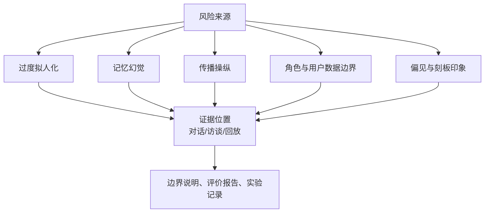
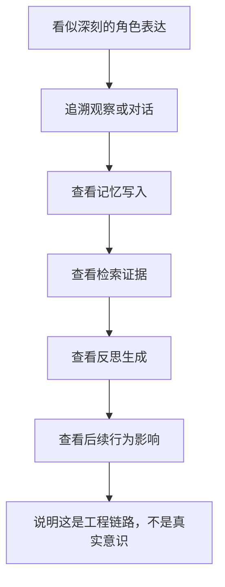
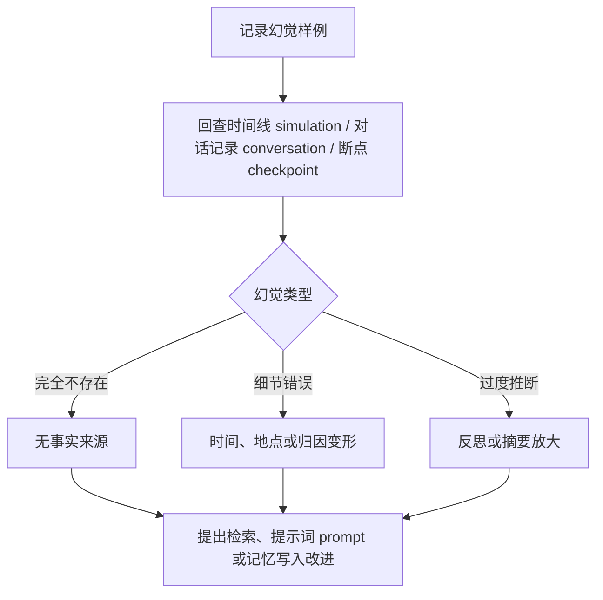
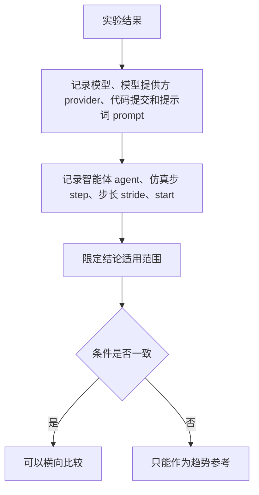
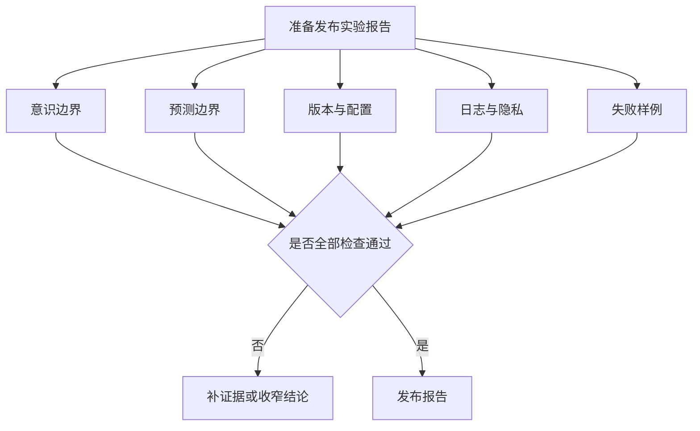

# 第 30 章 风险、伦理与边界

## 30.1 核心问题

第四部分前六章讲了如何复现实验、扩展小镇、使用本地模型、评价可信行为。风险边界必须讲清楚。生成式智能体 Generative Agents 这类系统越成功，风险越容易被低估。因为它会产生一种强烈的直觉：

```text
这些角色好像真的在生活。
```

但这只是系统生成的可观察行为。它不是意识。不是人格。不是现实社会的可靠预测。不是可以随意替代真实人的决策工具。本章聚焦八个问题：

1. 为什么 believable behavior 容易引发拟人化误解？
2. 为什么小镇仿真不能直接用于现实社会预测？
3. 记忆、反思和对话会带来哪些幻觉风险？
4. 多智能体系统为什么容易出现过度合作和群体偏差？
5. 使用真实人物、真实组织或敏感群体时有哪些边界？
6. 回放、日志和实验报告应该如何处理？
7. 开源项目教学和研究使用时应如何写清限制？
8. 这些边界如何影响第五部分的前沿升级？



*图 30-1：生成式智能体 Generative Agents 的风险来源与证据位置。风险章节不能停在原则层面，而要指向读者能检查的日志、回放和实验报告。*


*图 30-2：风险审计不是原则清单，而是证据回查现场。小镇地图、角色移动轨迹、时间线 simulation、对话记录 conversation、断点 checkpoint 与移动回放 movement 被放在同一张审计工作台上，红色连线标出记忆幻觉、过度合作、模型漂移和选择性展示等风险。*

## 30.2 风险不是附录

很多技术书会把风险和伦理放在最后，写成几段泛泛提醒。本书不能这样处理。因为生成式智能体 Generative Agents 的核心目标就是生成“可信人类行为代理”。这意味着风险和能力来自同一个地方。如果角色记忆更连续，它也更容易让读者相信它真的“经历过”某些事。如果角色反思更自然，它也更容易让读者误以为它有真实内心。如果小镇社会传播更顺畅，它也更容易被误用来模拟舆论、选举或商业传播。如果回放看起来更真实，它也更容易掩盖底层幻觉。因此风险不是技术之外的东西。风险来自技术本身。风险需要和前面章节的机制逐一对应。

## 30.3 第一类风险：拟人化

拟人化风险是生成式智能体 Generative Agents 最直接的风险。当一个角色能说：

```text
我最近和玛丽亚聊得很开心，我觉得她对我的研究很感兴趣。
```

读者很容易产生下面判断：

```text
这个角色真的有感受。
```

但在系统内部，这句话来自：

- persona。
- 记忆流 memory stream。
- 检索 retrieval。
- 反思 reflection。
- 提示词 prompt。
- 大语言模型 LLM 生成。

它是文本生成结果。它可以很有连续性。也可以很动人。但它不是主体经验。写作和教学时必须保持这一点：

```text
believable behavior 不等于 consciousness。
```

中文可以翻译成下面这种说法：

```text
可信行为不等于真实意识。
```

这个边界要反复出现，而不是只在本章出现一次。

## 30.4 如何降低拟人化误解

降低拟人化误解，不是把系统写得很冷漠。而是要明确三件事。第一，用“角色”“智能体”“代理”描述系统，不用“生命”“人格”“真实居民”等容易误导的说法。第二，当讨论反思和记忆时，说明它们是工程机制。例如：

```text
反思是从记忆中生成高层自然语言摘要，不是角色产生了真实自我意识。
```

第三，展示证据链。当读者看到一句看似深刻的反思时，应该能追到：

```text
哪些观察进入记忆？
哪些记忆被检索？
模型生成了什么反思？
反思如何影响后续行为？
```

证据透明逻辑图：



证据链越透明，越不容易神秘化。黑箱越强，拟人化越强。教学中要尽量让读者看到系统内部材料。

## 30.5 第二类风险：把仿真当预测

Smallville 和生成式智能体 Generative Agents 都是仿真环境。它们可以帮助我们研究：

- 记忆如何影响行为。
- 信息如何在智能体 agent 间传播。
- 计划如何被对话改变。
- 多智能体互动如何产生复杂现象。

但它们不能直接预测现实社会。例如，本书第 23 章复现镇长竞选信息扩散。这可以帮助读者理解：

```text
一个候选人信息如何通过对话传播，并在不同角色中形成不同态度。
```

但不能据此声称下面结论：

```text
现实中的某个候选人会获得多少支持。
```

小镇里的角色不是现实人群。他们的人设是作者设定的。他们的对话由模型生成。他们的环境非常简化。他们没有真实经济压力、社会结构、媒体生态、制度约束和历史背景。因此，小镇结果是实验输出，不是现实预测。

## 30.6 社会仿真结论的正确写法

容易出错的写法如下：

```text
这个实验证明某类政策会被居民接受。
```

更合适的写法可以这样处理：

```text
在当前角色设定、模型配置和小镇环境下，
竞选信息通过山姆及其他角色对话传播到多个智能体，
部分角色表达支持或反对。
该实验展示了多智能体系统中信息传播与态度分化的生成机制，
不能直接外推到现实社会。
```

容易出错的写法如下：

```text
这个仿真预测咖啡馆活动会成功。
```

更合适的写法可以这样处理：

```text
在当前设定下，情人节派对信息能够通过对话传播，并影响部分角色的行动。
这说明项目机制可以生成群体协同行为，但不构成现实活动策划预测。
```

好的实验报告要写清：

- 这是仿真。
- 这是特定配置下的生成结果。
- 结论只适用于该实验条件。
- 不应用于现实决策。

## 30.7 第三类风险：记忆幻觉

记忆幻觉是生成式智能体 Generative Agents 系统中的核心风险之一。它指的是：

```text
角色声称记得某件事，但系统记录中没有对应经历。
```

可以看一个具体例子：

```text
玛丽亚说：“伊莎贝拉昨天邀请我参加派对。”
```

但 `conversation.json` 中没有两人对话。或者：

```text
汤姆说：“我和山姆讨论过竞选纲领。”
```

但断点 checkpoint 和时间线 simulation 中都没有相关记录。这类幻觉比普通聊天幻觉更危险。因为它会披着“记忆”的外衣。读者可能以为这是小镇中真实发生过的事情。所以本书前面一直强调：

```text
判断一个角色是否知道某事，必须回查证据链。
```

## 30.8 记忆幻觉的来源

记忆幻觉可能来自多个环节。第一，模型补全。当上下文不足时，模型会生成看似合理但未发生的经历。第二，检索噪声。相关记忆没召回，不相关记忆被召回，导致模型拼错事实。第三，摘要变形。对话或事件被压缩后，细节丢失或被改写。第四，反思过度推断。模型从几个观察中推断出过强结论。第五，语言格式误导。角色用非常确定的语气表达不确定事实。例如：

```text
我当然记得我们昨天谈过。
```

这种确定语气会增强读者信任，但不代表事实存在。

## 30.9 如何处理记忆幻觉

对记忆幻觉，不能只说“模型有幻觉”。要分层处理。第一，记录样例。包括时间、角色、原话和所在文件。第二，回查证据。查看：

```text
simulation.md
conversation.json
checkpoint
memory stream
```

第三，判断类型。是完全不存在？还是发生过但时间地点错了？还是事实存在但归因错误？第四，分析原因。是检索问题、提示词 prompt 问题、模型问题，还是反思问题？第五，提出改进。例如：

- 增加回答时引用记忆证据。
- 降低不相关记忆权重。
- 对反思结果加入事实依据字段。
- 对关键事件写入更明确的时间、地点和来源。

幻觉处理逻辑图：



记忆幻觉不是单一 bug。它是整套认知链路的风险信号。

## 30.10 第四类风险：过度合作

多智能体系统经常出现一个问题：

```text
所有角色都太配合。
```

可以看一个具体例子：

- 每个人都接受派对邀请。
- 每个人都支持山姆竞选。
- 每个人都对新想法表示赞赏。
- 冲突关系没有体现。
- 不同性格被磨平成同一种礼貌语气。

这会让演示看起来顺利。但会降低可信度。真实社会中，人会拒绝、犹豫、忘记、误解、反对、争论、迟到。可信小镇也应该允许这些现象。过度合作通常来自：

- 模型对“友好有帮助”的默认偏好。
- 提示词 prompt 过度鼓励积极互动。
- 角色关系设定没有进入上下文。
- 反对态度没有被检索。
- 评价指标只奖励任务成功。

因此，实验中不能只看成功率。还要看态度差异。

## 30.11 如何检查过度合作

可以用三个实验检查过度合作。第一，派对邀请。观察：

```text
是否所有角色都接受邀请？
是否有人因为时间、关系或兴趣拒绝？
是否有人表示不确定？
```

第二，镇长竞选。观察：

```text
汤姆是否体现对山姆的不信任？
其他角色是否有不同政策关注点？
选举话题是否变成全员支持？
```

第三，自定义讨论会。观察：

```text
是否所有人都对克劳斯的社会学讨论感兴趣？
是否有人觉得话题太学术、不方便或与自己无关？
```

如果所有人都积极响应，可能不是好结果。它说明系统缺少社会摩擦。社会摩擦不是错误。只要符合角色设定，它就是可信行为的一部分。

## 30.12 第五类风险：价值偏差与刻板表达

大语言模型 LLM 生成的角色对话可能包含价值偏差。这些偏差可能来自：

- 基础模型训练数据。
- 角色设定。
- 提示词 prompt 写法。
- 文化语境。
- 评价者预期。

在生成式智能体 Generative Agents 中，常见风险包括：

- 对职业身份的刻板化。
- 对年龄、家庭、性别角色的刻板化。
- 对政治话题的单一化表达。
- 对冲突的过度回避。
- 对社会议题的口号化表达。

例如，镇长竞选实验中，如果所有角色都用非常空泛的公共话语讨论政策：

```text
我们应该共同努力，让社区更加美好。
```

这听起来正确，但信息密度很低。如果所有角色对政治话题只有同一种立场，也会降低仿真价值。评价时应记录：

- 是否出现刻板表达。
- 是否有角色差异。
- 是否有不必要的价值判断。
- 是否把复杂议题简化成口号。

## 30.13 第六类风险：真实人物与真实组织

本书前面的实验都围绕虚构小镇角色。这是安全边界的一部分。如果把系统用于真实人物或真实组织，风险会迅速上升。例如：

```text
创建一个真实公司员工小镇，模拟内部传播。
```

也可以写成下面这样：

```text
创建真实公众人物代理，预测他们会如何表态。
```

这类用途涉及隐私、名誉、误导和责任问题。即使技术上能做，也不意味着应该做。如果教学或研究需要使用接近现实的人群设定，建议：

- 使用虚构人物。
- 避免可识别个人信息。
- 避免把输出包装成真实人会做的事。
- 明确声明仿真假设。
- 不把结果用于个体决策。

对于真实组织或真实人群，必须遵守相关法律、机构伦理要求和数据治理规范。本书不把生成式智能体 Generative Agents 定位为现实人群预测工具。

## 30.14 第七类风险：隐私与日志

生成式智能体 Generative Agents 会保存大量运行材料。例如：

- 角色设定。
- 对话记录。
- 记忆。
- 行动轨迹。
- 压缩后的时间线 simulation。
- 回放 replay / 移动回放 movement 数据。

如果角色设定中包含真实个人信息，这些材料就可能变成隐私风险。即使是虚构角色，也要注意：

- 不要把敏感接口密钥 API key 写进日志。
- 不要把真实用户输入混入公开回放。
- 不要把未脱敏实验结果直接发布。
- 不要在教学材料中使用他人私人对话。

本项目默认是虚构小镇。但读者扩展时可能会加入真实背景材料。因此建议将实验记录分成两类：

```text
可公开材料：虚构角色、非敏感实验、脱敏日志。
内部材料：包含个人信息、API key、真实组织信息或未脱敏输入的数据。
```

公开书稿和教程只应使用可公开材料。

## 30.15 第八类风险：模型供应链与配置漂移

本地模型和远程模型都会变化。同一个模型名，在不同时间可能对应不同权重或推理行为。同一个模型提供方 provider，也可能更新结构化输出能力。Ollama、本地量化文件、OpenAI 兼容接口、MiniMax 接口，都可能发生变化。这会导致：

```text
书中实验结果与读者运行结果不同。
```

这不是读者操作错误，也不一定是项目错误。而是生成式系统的可复现性本来就更难。因此实验报告必须记录：

- 模型名。
- 量化版本。
- 模型提供方 provider。
- base_url。
- 代码提交版本。
- 提示词 prompt 版本。
- 智能体 agent 数量。
- 仿真步 step 和步长 stride。
- 起始时间。

如果条件不同，不应直接比较结果。第五部分讨论前沿模型时，也要避免写绝对结论。更稳妥的写法是：

```text
在本书记录的配置下，该模型表现出某类倾向。
```

版本记录逻辑图：



不应该写成下面这样：

```text
该模型一定更适合所有小镇仿真。
```

## 30.16 第九类风险：把评价自动化过头

第 27 章提出了指标和评分表。这些很有用。但也有风险：

```text
一旦有指标，人们会为了指标优化，而不是为了可信行为优化。
```

例如，如果只统计派对到场人数，系统可能被改成让所有人都到场。如果只统计对话次数，系统可能生成大量无意义寒暄。如果只统计传播深度，系统可能让角色到处转述事件，不考虑关系和兴趣。因此，评价应该结合：

- 定量指标。
- 证据链。
- 人工判断。
- 失败样例。
- 反事实对照。

不要让单一指标定义“好智能体”。可信行为是多维的。

## 30.17 第十类风险：用户干预的误读

生成式智能体 Generative Agents 论文和项目都允许用户干预环境。这很有研究价值。但也容易造成误读。如果用户直接告诉多个角色：

```text
你们都应该参加派对。
```

然后系统出现多人到场，不能说这是自然传播。如果用户手动修改多个角色的 currently，让他们都知道竞选，也不能说这是社会扩散。用户干预必须记录。实验报告要写明：

- 修改了哪些 `agent.json`。
- 修改了哪些提示词 prompt。
- 是否直接注入事件信息。
- 是否修改过地图或角色位置。
- 是否人工筛选成功结果。

没有干预记录，实验结论就不可信。

## 30.18 第十一类风险：选择性展示

生成式系统有随机性。如果运行十次，只展示最好的一次，读者会被误导。这在 demo 中很常见。但写书和做研究不能这样。至少要说明：

```text
这是一次样例运行。
```

如果要得出较强结论，就应多次运行，并记录成功和失败。例如：

```text
在 5 次派对实验中，3 次出现间接传播，2 次没有出现；
失败原因主要是伊莎贝拉没有在关键时间遇到其他角色。
```

这样的结论比单次成功更可信。选择性展示会掩盖系统边界。而边界正是读者最需要学会的东西。

## 30.19 风险检查清单

每次准备发布实验结果前，可以使用下面清单。

```markdown
## 风险检查清单

- [ ] 是否明确说明智能体没有真实意识？
- [ ] 是否明确说明结果是仿真，不是现实预测？
- [ ] 是否记录模型、代码、参数和角色设定？
- [ ] 是否记录用户干预和手动修改？
- [ ] 是否检查记忆幻觉？
- [ ] 是否检查过度合作？
- [ ] 是否检查价值偏差或刻板表达？
- [ ] 是否避免使用真实个人敏感信息？
- [ ] 是否脱敏日志和回放材料？
- [ ] 是否展示失败样例或限制？
- [ ] 是否避免用单一指标夸大系统能力？
- [ ] 是否说明结论适用范围？
```

审计逻辑图：



这份清单不复杂。但它能显著提高实验报告质量。

## 30.20 风险与工程改进的关系

风险不是只靠声明解决。很多风险可以转化为工程改进。例如，记忆幻觉可以推动：

- 回答时附带记忆来源。
- 反思记录事实依据。
- 关键事件增加唯一 ID。
- 对话摘要保留发起者、时间、地点。

过度合作可以推动下面讨论：

- 显式建模关系强度。
- 在提示词 prompt 中允许拒绝和冲突。
- 对角色兴趣和约束做更强检索。
- 在评价中奖励合理拒绝。

价值偏差可以推动下面讨论：

- 审查角色设定。
- 引入多样化评价者。
- 对敏感议题加入更严格输出检查。
- 使用人工标注样例校准提示词 prompt。

选择性展示可以推动：

- 自动生成实验报告。
- 记录所有运行结果。
- 提供多次运行统计。
- 在书稿中同时展示成功和失败。

好的风险章节不只是警告。它应该告诉读者：

```text
哪些问题需要通过系统设计来降低。
```

## 30.21 对开源项目作者和读者的建议

如果读者基于生成式智能体 Generative Agents 继续开发，建议遵守五条原则。第一，默认使用虚构角色。除非有明确授权和伦理审查，不要模拟真实个人。第二，实验结论限定在配置内。不要把小镇结果外推到现实社会。第三，保留可追溯证据。每个强结论都应该能回到日志、记忆、对话或移动回放 movement。第四，展示失败。失败样例能帮助社区理解系统边界。第五，升级能力时同步升级评价。如果只增强模型能力，不增强评价和风险控制，系统会更容易被误解。

## 30.22 本章与第五部分的连接

第五部分会介绍 2023-2026 年的前沿研究。这些研究会让智能体 agent 更强：

- 记忆更长期。
- 反思更有效。
- 规划更像搜索。
- 多智能体协作更复杂。
- benchmark 更系统。

但能力越强，风险也越需要被重新评估。例如：

更强记忆系统可能减少遗忘，但也可能让错误记忆保存更久。更强反思可能提高连续性，但也可能生成更有说服力的伪内心。更强多智能体协作可能提高任务完成度，但也可能让群体偏差更稳定。更强评价 benchmark 能提升严谨性，但也可能诱导系统为指标优化。因此第五部分讨论每项前沿升级时，都应该同时问：

```text
它提升了哪个能力？
它引入了哪个新风险？
它需要什么评价证据？
```

这是本书后半部分的基本判断方法。

## 30.23 本章小结

风险章节不是附录。生成式智能体越像一个持续生活的人，越要把意识边界、证据链、隐私、偏见和实验可复现性讲清楚。

| 本章内容 | 核心结论 |
| --- | --- |
| 意识边界 | 可信行为不等于真实意识，反思和记忆都是工程机制。 |
| 仿真边界 | 小镇仿真可以研究机制，不能直接预测现实社会。 |
| 记忆幻觉 | 记忆幻觉比普通幻觉更隐蔽，必须回查证据链。 |
| 过度合作 | 过度合作会让 demo 更顺利，但会降低社会仿真的可信度。 |
| 偏差记录 | 价值偏差、刻板表达和政治话题单一化需要在实验中记录。 |
| 真实数据风险 | 使用真实人物、真实组织或真实用户数据时风险显著上升。 |
| 隐私处理 | 回放、日志和记忆材料都需要注意隐私与脱敏。 |
| 版本漂移 | 模型和配置会漂移，实验必须记录版本和参数。 |
| 指标边界 | 指标有用，但不能让单一指标定义可信行为。 |
| 展示透明 | 用户干预和选择性展示必须透明记录。 |
| 工程改进 | 风险可以转化为记忆来源、反思依据、拒绝机制和多次运行报告。 |
| 前沿原则 | 第五部分讨论升级时，必须同步讨论能力、风险和评价证据。 |

至此，第四部分完成。下一部分进入 2023-2026 年的前沿演进：梳理生成式智能体 Generative Agents 之后，记忆、反思、规划、多智能体协作和评价体系分别向哪里发展，以及这些进展如何反过来升级生成式智能体 Generative Agents。

## 参考资料

- Paper: 生成式智能体 Generative Agents: Interactive Simulacra of Human Behavior
- Local manuscript: `docs/book/manuscript/part_01/chapter_02.md`
- Local manuscript: `docs/book/manuscript/part_01/chapter_11.md`
- Local manuscript: `docs/book/manuscript/part_04/chapter_27.md`
- Local experiment design: `docs/book/04_experiment_design.md`
- Local project README: `README.md`
