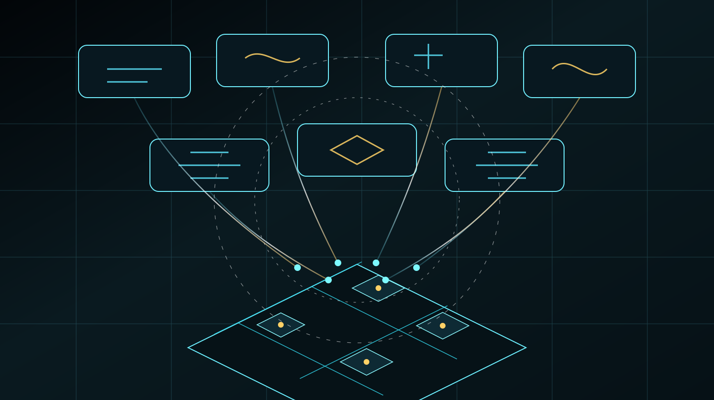
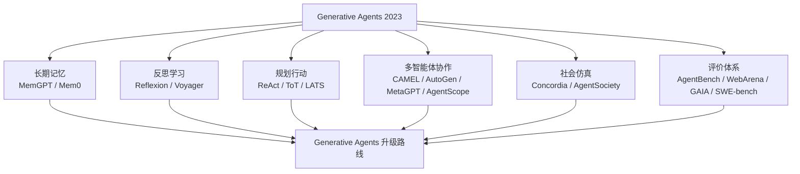

# 第 31 章 2023-2026：生成式智能体领域发生了什么



## 31.1 核心问题

前四部分已经完成一条完整主线：

```text
论文思想 -> 项目实现 -> 源码机制 -> 复现实验 -> 可信评价与风险边界
```

如果这本书到第 28 章结束，它已经能帮助读者理解 Generative Agents。但还不够。Generative Agents 是 2023 年的经典工作。到 2026 年，智能体领域已经沿着多个方向快速演进。如果只讲 2023 年的架构，读者会掌握一个重要起点，但看不到后续三年的发展。本章聚焦三个问题：

1. Generative Agents 在 2023 年解决了什么关键问题？
2. 2023-2026 年，智能体研究分别沿着哪些方向前进？
3. 这些前沿进展如何反过来升级 Generative Agents？

本章不是论文综述大全。它只选择和本书最相关的方向：

- 长期记忆。
- 反思与经验学习。
- 规划、推理与行动。
- 多智能体协作。
- 社会仿真。
- 评价体系。
- 中文、本地和推理模型。
- 工程化可观测性。



*图 31-1：从 Generative Agents 到 2026 前沿智能体的演进地图。后续升级不是抛弃原论文，而是沿着记忆、反思、规划、协作、仿真和评价继续推进。*

## 31.2 Generative Agents 不是终点

Generative Agents 的贡献很大。它把大语言模型放进一个持续运行的虚拟环境，让角色拥有：

- 自然语言记忆。
- 基于记忆的检索。
- 高层反思。
- 日程规划。
- 环境感知。
- 对话互动。
- 多智能体社会涌现。

这套架构证明了一个重要观点：

```text
LLM 不只是聊天模型，也可以成为长期行为代理的认知核心。
```

但 Generative Agents 也有明显边界。第一，记忆只是开始具备长期性，还没有完整记忆治理。第二，反思主要是总结经历，不是失败后的持续学习。第三，规划更像日程拆解，不是搜索式任务求解。第四，多智能体互动主要依赖空间偶遇，不是组织化协作。第五，社会仿真偏演示性，缺少大规模统计实验。第六，评价方法虽然启发性很强，但还不够自动化、可复现和成本敏感。第七，模型环境已经变化，2026 年的本地模型、推理模型和中文模型能力都和 2023 年不同。因此，Generative Agents 更像一个地基。后续研究不是推翻它，而是在不同方向上补足它。

## 31.3 2023 年的起点：可信行为代理

2023 年 Generative Agents 最重要的创新，不是“让 25 个角色聊天”。更准确地说，它建立了一条可信行为链：

```text
观察进入记忆
  -> 记忆被检索
  -> 重要经历触发反思
  -> 反思影响计划
  -> 计划生成行动
  -> 行动产生新观察
  -> 多个智能体互相影响
```

这条链让 agent 不再只是单轮回答者。它开始具备行为连续性。在本书前面，我们已经反复强调：

```text
可信行为不是语言流畅，而是记忆、计划、反应和环境约束的一致性。
```

2023-2026 年的许多工作，本质上都在增强这条链的某一段。例如：

- MemGPT 和 Mem0 增强记忆管理。
- Reflexion 和 Voyager 增强反思与经验学习。
- ReAct、Tree of Thoughts、LATS 增强推理、规划和行动闭环。
- CAMEL、AutoGen、MetaGPT、AgentScope 增强多智能体协作。
- Concordia、AgentSociety 增强社会仿真规模和实验方法。
- AgentBench、WebArena、GAIA、SWE-bench、AI Agents That Matter 推动评价严谨化。
- DeepSeek-R1、Qwen3 等模型改变了中文、本地和推理模型的可用性。

这就是第五部分的基本结构。

## 31.4 第一条线：记忆从检索走向治理

Generative Agents 的 memory stream 已经很重要。它把角色经历以自然语言保存下来，再通过 recency、importance、relevance 检索。但长期运行时，简单“写入 + 检索”会遇到问题。例如：

- 记忆越来越多，检索噪声增加。
- 重复事件不断堆积。
- 错误记忆或幻觉被长期保存。
- 关系记忆没有结构化表达。
- 短期工作记忆、长期情景记忆、语义记忆没有分层。

MemGPT 的启发是：

```text
上下文窗口像主存，长期记忆像外存，agent 需要主动管理记忆。
```

Mem0 的启发是：

```text
面向生产 agent 的记忆需要可扩展、低延迟、可个性化，并能跨会话复用。
```

对 Generative Agents 来说，这意味着：

```text
Associate 不应该只是一个记忆容器，还应该成为记忆治理层。
```

第 30 章会详细讨论这一点。

## 31.5 第二条线：反思从总结走向学习

Generative Agents 的 reflection 会从近期重要记忆中生成高层 insight。这非常关键。它让角色能从事件中形成更抽象的理解。但它仍然偏向：

```text
我经历了什么，因此我有什么想法。
```

后续研究进一步追问：

```text
我哪里失败了？
我下次应该怎么做？
我能否把成功经验沉淀成技能？
```

Reflexion 将语言反馈作为一种 verbal reinforcement，让 agent 在失败后生成经验，并在下一次尝试中使用。Voyager 在 Minecraft 环境中结合自动课程、技能库和迭代提示，使 agent 能持续探索并积累可复用技能。对 Generative Agents 来说，这条线的意义是：

```text
反思不应只解释过去，也应改变未来策略。
```

可以看一个具体例子：

- 伊莎贝拉邀请失败后，反思如何更自然地邀请对方。
- 山姆竞选宣传效果不好后，反思哪些居民更关心哪些议题。
- 克劳斯讨论会没人参加后，反思邀请对象和时间安排。

第 31 章会把 reflection 扩展为经验学习和技能库。

## 31.6 第三条线：规划从日程走向目标搜索

Generative Agents 的 planning 主要负责日程和行动拆解。这让角色能像人在一天中生活。但它不是复杂任务规划器。例如：

```text
让至少三个人知道派对，并确保两个人到场。
```

这个目标需要下面能力：

- 选择邀请对象。
- 选择合适时间。
- 规划路线。
- 遇到失败后换策略。
- 跟踪谁已经知道。
- 判断是否达到目标。

单纯日程拆解不够。ReAct 的启发是 reasoning 和 acting 交替推进。Tree of Thoughts 的启发是生成多个候选思路并评估。LATS 的启发是把推理、行动和规划统一到搜索框架中。对 Generative Agents 来说，这意味着：

```text
在日程之上增加显式 goal、候选行动和反馈评估。
```

第 32 章会讨论如何从 `Schedule` 升级到目标驱动行动。

## 31.7 第四条线：多智能体从偶遇走向组织

Generative Agents 中的多智能体互动主要依赖：

- 同一地图。
- 感知范围。
- 偶遇。
- 对话。
- 记忆传播。

这非常适合研究社会涌现。但它不适合组织化任务。例如：

```text
多人协作筹备派对。
多人分工做竞选宣传。
多人共同组织社区讨论会。
```

这些任务需要下面能力：

- 共享目标。
- 角色分工。
- 任务状态。
- 协作协议。
- 冲突解决。

CAMEL 强调角色扮演式 communicative agents。AutoGen 强调多 agent conversation framework。MetaGPT 用 SOP 和角色分工组织软件开发任务。AgentScope 强调可扩展、可配置、可观察的多智能体平台。对 Generative Agents 来说，这条线的意义是：

```text
在自然社交小镇之外，增加组织化协作能力。
```

第 33 章会讨论公共事件板、临时工作组和共享记忆。

## 31.8 第五条线：社会仿真从故事走向统计

Smallville 的 25 个角色已经很精彩。但作为社会仿真，它仍然偏小、偏演示、偏故事。如果要研究更严肃的社会现象，需要进一步回答：

- 多次运行结果是否稳定？
- 信息传播路径能否统计？
- 群体聚集能否量化？
- 角色设定能否系统生成？
- 环境规则是否足够明确？
- 是否可以比较不同条件下的结果？

Concordia / Generative Agent-Based Modeling 强调用 LLM 构建 grounded agent-based models，并把行动放到物理、数字或社会空间中解释。AgentSociety 则面向更大规模 LLM-driven generative agents，用于理解人类行为和社会现象。对 Generative Agents 来说，这不是要求立刻做万级 agent。更务实的方向是：

```text
把小镇实验从单次故事，升级成可重复、可统计、可比较的小规模社会仿真实验。
```

第 34 章会讨论实验配置、批量运行、传播统计和群体轨迹统计。

## 31.9 第六条线：评价从演示走向严谨

第 27 章已经建立了可信行为评价框架。但 2023-2026 年 agent 领域进一步暴露出更大的评价问题。AI Agents That Matter 强调，很多 agent 论文和 demo 在评价上存在可复现性、成本、基线、公平比较等问题。AgentBench 试图系统评价 LLM 作为 agent 的能力。WebArena 让 agent 在真实感更强的网站环境中完成任务。GAIA 关注通用 AI assistant 的现实复杂任务。SWE-bench 则用真实 GitHub issue 检验模型解决软件工程任务的能力。这些 benchmark 方向共同说明：

```text
agent 评价不能只看一段好看的演示。
```

对 Generative Agents 来说，这意味着：

- 实验要有配置。
- 结果要能复现。
- 成本要记录。
- 失败要统计。
- 对照组要明确。
- 指标要和任务目标匹配。

第 35 章会把这些前沿评价思想转化为小镇实验指标。

## 31.10 第七条线：模型基础发生变化

2023 年的 Generative Agents 主要建立在远程通用大模型能力上。到了 2026 年，模型条件已经发生变化。第一，本地模型更可用。Generative Agents 当前默认使用 Ollama 接入本地中文模型和本地 embedding。这让低成本复现实验成为可能。第二，中文模型更强。Qwen 系列、DeepSeek 系列等模型让中文 prompt、中文对话和本地部署更现实。第三，推理模型改变了 agent 设计。DeepSeek-R1 这类工作强化了 reasoning 能力。Qwen3 官方资料也强调 thinking / non-thinking 模式等能力形态。这带来一个新问题：

```text
小镇智能体是不是每一步都需要强推理？
```

答案通常是否定的。日常闲聊、普通行动和简单重要性评分可以使用便宜模型。复杂反思、目标规划、失败复盘可以使用更强模型。这会推动多模型路由。第 38 章会把模型能力变化纳入 Generative Agents 的升级路线图。

## 31.11 第八条线：工程从 demo 走向可观测系统

最后一条线常被忽略，但对开源项目最重要。一个 agent demo 能跑起来，不等于系统可维护。长期研究需要：

- 运行日志。
- 调用统计。
- 成本统计。
- 实验配置。
- 失败样例。
- checkpoint。
- replay。
- 指标脚本。
- prompt 版本。
- 模型版本。

Generative Agents 已经比原始项目更工程化：

- 提供中文 prompt。
- 支持 Ollama、MiniMax、OpenAI。
- 接入本地 embedding。
- 提供 checkpoint 和 resume。
- 提供 compress 和 replay。
- 生成 `simulation.md`。

但第五部分会进一步提出：

```text
把 Generative Agents 从可运行项目，升级成可实验项目。
```

这意味着不仅要能看故事，还要能比较、统计、复现、定位问题。

## 31.12 五部分之间的关系

现在可以把全书结构重新看一遍。第一部分讲思想源头。回答：

```text
Generative Agents 为什么重要？
```

第二部分讲项目谱系。回答：

```text
Generative Agents 从哪里来，继承和改写了什么？
```

第三部分讲源码。回答：

```text
当前项目如何实现论文思想？
```

第四部分讲实验。回答：

```text
如何复现、扩展和评价当前项目？
```

第五部分讲前沿升级。回答：

```text
站在 2026 年，如何把这个项目继续向前推进？
```

这五部分不是并列资料。它们形成一个递进关系。没有第一部分，读者不知道为什么这样设计。没有第三部分，读者无法修改项目。没有第四部分，读者无法判断修改是否有效。没有第五部分，读者只是在复刻 2023 年，而不是面向 2026 年继续发展。

## 31.13 本书采用的前沿判断原则

第五部分不会把每篇论文都讲成“必须实现”。本书采用四个判断原则。第一，是否能补足 Generative Agents 的真实短板。如果某个前沿概念很流行，但和当前项目关系不大，就少讲。第二，是否能转化为可实现模块。例如关系记忆、目标对象、公共事件板、批量实验脚本。第三，是否能被评价。如果一个升级无法用第 27 章的框架评价，就很难证明价值。第四，是否保留风险意识。能力增强不能脱离第 28 章的风险边界。每章都会尽量按这个结构写：

```text
经典架构的局限
  -> 前沿研究给出的启发
  -> Generative Agents 当前实现
  -> 可以落地的升级方案
  -> 评价指标
  -> 风险与边界
```

这样第五部分就不是论文摘抄，而是项目升级路线。

## 31.14 本章小结

第五部分不是追热点，而是把 2023-2026 年的智能体进展重新落回 Generative Agents。前沿的价值不在名词新，而在能否改进当前项目的记忆、反思、规划、协作、仿真和评价。

| 演进方向 | 核心结论 |
| --- | --- |
| 经典地基 | Generative Agents 是地基，不是终点。 |
| 2023 年贡献 | 论文建立了观察、记忆、检索、反思、计划、行动和社会互动组成的可信行为链。 |
| 记忆系统 | 记忆方向从 memory stream 走向记忆治理。 |
| 反思系统 | 反思方向从经历总结走向失败复盘、经验学习和技能库。 |
| 规划系统 | 规划方向从日程拆解走向目标驱动、候选方案和搜索式行动。 |
| 多智能体 | 多智能体方向从自然偶遇走向组织化协作。 |
| 社会仿真 | 社会仿真方向从小镇故事走向可重复、可统计、可比较的实验。 |
| 评价体系 | 评价方向从演示可信走向 benchmark、成本、可复现性和统计比较。 |
| 本地化落地 | 中文、本地和推理模型改变了 Generative Agents 的可落地方式。 |
| 工程化要求 | 日志、配置、指标、checkpoint 和可观测性，是前沿升级能否落地的基础。 |

下一章进入第一条具体升级线：记忆系统：从 Generative Agents 的 memory stream 出发，讨论 MemGPT、Mem0 等工作如何启发 Generative Agents 做长期记忆治理。

## 参考资料

- Generative Agents: https://arxiv.org/abs/2304.03442
- MemGPT: https://arxiv.org/abs/2310.08560
- Mem0: https://arxiv.org/abs/2504.19413
- Reflexion: https://arxiv.org/abs/2303.11366
- Voyager: https://arxiv.org/abs/2305.16291
- ReAct: https://arxiv.org/abs/2210.03629
- Tree of Thoughts: https://arxiv.org/abs/2305.10601
- LATS: https://arxiv.org/abs/2310.04406
- CAMEL: https://arxiv.org/abs/2303.17760
- AutoGen: https://arxiv.org/abs/2308.08155
- MetaGPT: https://arxiv.org/abs/2308.00352
- AgentScope: https://arxiv.org/abs/2402.14034
- Concordia / Generative Agent-Based Modeling: https://arxiv.org/abs/2312.03664
- AgentSociety: https://arxiv.org/abs/2502.08691
- AgentBench: https://arxiv.org/abs/2308.03688
- WebArena: https://arxiv.org/abs/2307.13854
- GAIA: https://arxiv.org/abs/2311.12983
- SWE-bench: https://arxiv.org/abs/2310.06770
- AI Agents That Matter: https://arxiv.org/abs/2407.01502
- DeepSeek-R1: https://arxiv.org/abs/2501.12948
- Qwen3: https://arxiv.org/abs/2505.09388
- Qwen3 official blog: https://qwenlm.github.io/blog/qwen3/
