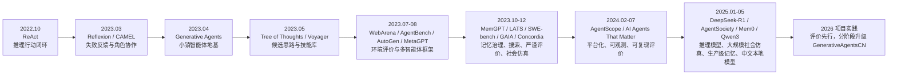
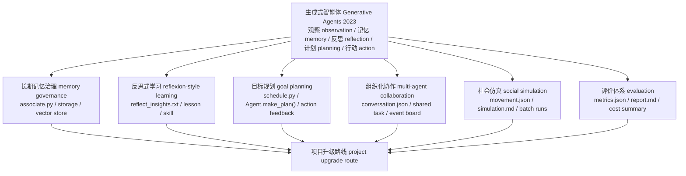
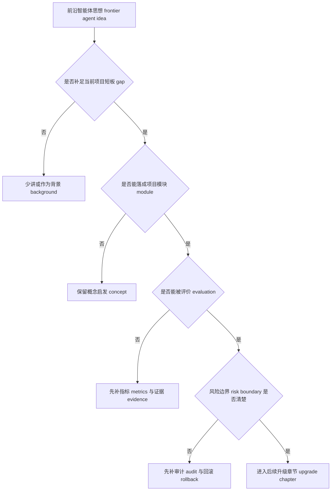

# 第 31 章 智能体仿真的前沿研究实践

## 前沿论文时间轴

在斯坦福小镇的论文出现后，长期记忆 memory、反思学习 reflexion、目标规划 goal planning、多智能体协作 multi-agent collaboration、社会仿真 social simulation、评价体系 evaluation system 和模型路由 model routing，分别来自不同阶段的前沿论文。下表按时间给出论文或系统、论文原标题 Original title、核心概念和在 GenerativeAgentsCN 中的项目落点。



*图 31-1：2022-2025 年前沿论文如何进入 2026 年的项目实践。ReAct 是 2022 年的先导工作，后面的论文分别补强记忆 memory、反思 reflection、规划 planning、协作 collaboration、仿真 simulation、评价 evaluation 和模型路由 model routing。*

| 时间 | 论文或系统 | 论文原标题 Original title | 为本项目引入的先进概念 | 在 GenerativeAgentsCN 中的落点 | 后续章节 |
| --- | --- | --- | --- | --- | --- |
| 2022.10 | ReAct | ReAct: Synergizing Reasoning and Acting in Language Models | 推理行动交替 reasoning-acting，让模型在“思考、行动、观察”之间循环 | 在目标规划 goal planning 中记录 reasoning/action/observation trace，不只生成一条日程 | 第 34 章 |
| 2023.03 | 反思式学习 Reflexion | Reflexion: Language Agents with Verbal Reinforcement Learning | 语言反馈 verbal feedback，把失败结果转成下一次尝试可用的经验 | 在 `Agent.reflect()` 旁增加行动结果 outcome、经验 lesson 和失败类型 failure type | 第 33 章 |
| 2023.03 | CAMEL | CAMEL: Communicative Agents for "Mind" Exploration of Large Language Model Society | 角色扮演式沟通智能体 role-playing communicative agents，用角色分工驱动协作 | 为公共事件板 event board 增加 organizer/helper/messenger 等临时角色 | 第 35 章 |
| 2023.04 | 生成式智能体 Generative Agents | Generative Agents: Interactive Simulacra of Human Behavior | 记忆流 memory stream、反思 reflection、计划 planning、Smallville 社会涌现 | 本书和本项目的经典地基：`Agent`、`Associate`、`Schedule`、`Maze` 和回放链路 | 第 31 章 |
| 2023.05 | 思维树 Tree of Thoughts | Tree of Thoughts: Deliberate Problem Solving with Large Language Models | 多候选思路 candidate thoughts 与分支评估 | 在 `_determine_action()` 前生成候选行动 candidate actions，并按目标贡献和自然性评分 | 第 34 章 |
| 2023.05 | 探索智能体 Voyager | Voyager: An Open-Ended Embodied Agent with Large Language Models | 技能库 skill library，把成功经验沉淀为可复用策略 | 把多次 lesson 合并成技能记忆 skill memory，供计划和对话检索 | 第 33 章 |
| 2023.07 | WebArena | WebArena: A Realistic Web Environment for Building Autonomous Agents | 环境落地 grounding，任务成功必须被环境状态验证 | 用 `movement.json` 检查承诺是否真的落到地点，避免只看语言承诺 | 第 37 章 |
| 2023.08 | AgentBench | AgentBench: Evaluating LLMs as Agents | 系统化智能体基准 benchmark，强调多任务、多维度评价 | 把派对、竞选、讨论会等实验统一成 `metrics.json` 和 `report.md` | 第 37 章 |
| 2023.08 | 框架 MetaGPT | MetaGPT: Meta Programming for A Multi-Agent Collaborative Framework | 标准作业流程 SOP 与角色分工 | 为派对、竞选和讨论会设计轻量 SOP，但保留拒绝、遗忘和冲突 | 第 35 章 |
| 2023.08 | 框架 AutoGen | AutoGen: Enabling Next-Gen LLM Applications via Multi-Agent Conversation | 可配置的多智能体对话框架 multi-agent conversation framework | 在自然对话后抽取 dialogue_act，再更新团队任务状态 | 第 35 章 |
| 2023.10 | LATS | Language Agent Tree Search Unifies Reasoning Acting and Planning in Language Models | 语言智能体树搜索 language agent tree search，把搜索、行动和反馈合在一起 | 不做完整树搜索，先做轻量候选行动和行动反馈 feedback | 第 34 章 |
| 2023.10 | MemGPT | MemGPT: Towards LLMs as Operating Systems | 上下文窗口 context window 与长期记忆 long-term memory 分层管理 | 把 `Associate` 从记忆容器升级为记忆治理层 memory governance | 第 32 章 |
| 2023.10 | SWE-bench | SWE-bench: Can Language Models Resolve Real-World GitHub Issues? | 像测试一样定义成功条件，失败必须能复查 | 让社会行为评价也有可核验条件、失败类型和证据路径 | 第 37 章 |
| 2023.11 | GAIA | GAIA: a benchmark for General AI Assistants | 多步骤智能体评价 multi-step agent evaluation | 把传播、记忆、日程、移动拆成链路断点 chain break 来分析 | 第 37 章 |
| 2023.12 | Concordia / 生成式智能体建模 Generative Agent-Based Modeling | Generative agent-based modeling with actions grounded in physical, social, or digital space using Concordia | 落地的基于智能体模型 grounded agent-based models | 用 Maze、Tile、address 和 movement 约束社会仿真，不只看语言输出 | 第 36 章 |
| 2024.02 | 平台 AgentScope | AgentScope: A Flexible yet Robust Multi-Agent Platform | 可配置、可观测、可扩展的多智能体平台 multi-agent platform | 增加实验配置、状态观测、日志、指标 metrics 和报告 report | 第 35-36 章 |
| 2024.07 | AI Agents That Matter | AI Agents That Matter | 智能体评价要记录基线 baseline、成本 cost、重复性和公平比较 | 每次升级都保留默认系统基线、成本摘要和失败样例 | 第 37 章 |
| 2025.01 | DeepSeek-R1 | DeepSeek-R1: Incentivizing Reasoning Capability in LLMs via Reinforcement Learning | 推理模型 reasoning model 让复杂复盘和规划更可用 | 反思、目标规划和失败复盘可路由到更强推理模型 | 第 38 章 |
| 2025.02 | 平台 AgentSociety | AgentSociety: Large-Scale Simulation of LLM-Driven Generative Agents Advances Understanding of Human Behaviors and Society | 大规模 LLM 社会仿真中的画像、调度、成本和统计问题 | 先把小规模多次运行 run 做成批量社会仿真实验 | 第 36 章 |
| 2025.04 | Mem0 | Mem0: Building Production-Ready AI Agents with Scalable Long-Term Memory | 生产级长期记忆 production memory、跨会话记忆和个性化 | 为高级记忆增加来源 source、置信度 confidence、合并 merge 和冲突检测 conflict detection | 第 32 章 |
| 2025.05 | Qwen3 | Qwen3 Technical Report | 中文模型、本地模型 local model 与推理/非推理模式选择 | 把模型 provider、提示词 prompt 类型和成本记录纳入模型路由 model routing | 第 38 章 |

这条时间轴给出第 31 章的筛选标准：只保留能够改变本项目源码 source、配置 config、提示词 prompt、断点 checkpoint、对话 conversation、移动回放 movement、指标 metrics 和报告 report 的前沿概念。

## 31.1 从前沿概念的项目落点开始

到这里，本项目已经能复刻经典论文中的关键观点。
- 从 `generative_agents/start.py` 启动小镇
- 在 `results/checkpoints/<实验名>/` 写入断点 checkpoint
- 在 `conversation.json` 保存对话 conversation
- 由 `generative_agents/compress.py` 生成 `results/compressed/<实验名>/simulation.md` 和 `movement.json`

2023-2026 年智能体 agent 的新概念，只有真正改变这些本地文件、运行状态和评价证据，才能进入第五部分的讨论。

| 项目落点 | 当前能承接什么 | 仍然缺什么 | 前沿升级入口 |
| --- | --- | --- | --- |
| 源码 source | `Agent.think()`、`Agent.percept()`、`Agent.reflect()`、`Agent._chat_with()` 串起一次智能体循环 agent loop | 目标 goal、长期记忆治理 memory governance、组织协作 collaboration state 还不是一等对象 | 记忆 memory、反思 reflection、规划 planning、协作 collaboration |
| 配置 config | `data/config.json` 记录模型 provider、向量嵌入 embedding、检索保留数量 retention | 缺少实验批次、模型路由 model routing、成本 cost 与指标 metrics 配置 | 模型路由 model routing、可复现实验 reproducible experiment |
| 提示词 prompt | `data/prompts/*.txt` 驱动日程 schedule、对话 dialogue、反思 reflection、重要性评分 poignancy | 提示词 prompt 版本、输出结构 schema、失败回退 failsafe 和下游写入仍然分散 | 提示词治理 prompt governance |
| 断点 checkpoint | `simulate-*.json` 保存角色状态、日程 schedule、关联记忆 Associate 和行动 action | 高级记忆的来源 source、置信度 confidence、冲突 conflict 没有统一字段 | 可追溯记忆 traceable memory |
| 对话 conversation | `conversation.json` 是传播链和关系变化的强证据 | 仍缺少显式传播边 source edge、态度 stance 和承诺 commitment 标签 | 多智能体协作 multi-agent collaboration、社会仿真 social simulation |
| 回放 movement | `movement.json` 能复原位置、动作和对话时刻 | 缺少批量统计 batch statistics、群体轨迹 group trajectory 和失败分类 failure taxonomy | 社会仿真 social simulation |
| 指标 metrics / 报告 report | 第 29 章脚手架已有 `metrics.json`、`judge.json` 读法 | 还不是每次实验自动生成的统一报告 | 评价体系 evaluation system |

第五部分的边界由这些项目落点决定：前沿概念只有落进源码 source、配置 config、提示词 prompt、断点 checkpoint、对话 conversation、移动回放 movement、指标 metrics 或报告 report，才算进入本项目。



*图 31-2：从生成式智能体 Generative Agents 到 2026 前沿升级的项目映射。每条线都必须能回到本仓库的文件、状态或运行结果；没有项目落点的前沿概念只能作为背景。*


*图 31-3：2023-2026 前沿方向如何落回生成式智能体 Generative Agents 项目。图中间的小镇仿真不是背景，而是所有前沿升级的锚点；周围的记忆治理 memory governance、反思学习 reflexion-style learning、目标规划 goal planning、多智能体协作 multi-agent collaboration、社会仿真 social simulation 和评价体系 evaluation 都要回到源码、提示词 prompt、断点 checkpoint、移动回放 movement、对话记录 conversation 与报告 report 验证。*

## 31.2 2023 年的地基：可信行为链

生成式智能体 Generative Agents 在 2023 年建立的关键能力，不是“25 个角色能聊天”，而是把大语言模型 LLM 接进一条可持续运行的行为链：

```text
观察 observation -> 记忆 memory -> 检索 retrieval -> 反思 reflection -> 计划 planning -> 行动 action -> 新观察 observation
```

当前项目把这条链落成了更具体的工程路径。

| 行为链环节 | 当前项目入口 | 输入 input | 处理 process | 输出 output |
| --- | --- | --- | --- | --- |
| 观察 observation | `Agent.percept()` | 地图范围、同一 arena 内的事件 event、感知带宽 `att_bandwidth` | 去重近期 `event/chat`，对新事件调用重要性评分提示词 prompt | `Concept` 节点进入 `Associate`，同时保存在本轮 `concepts` |
| 记忆 memory | `Associate.add_node()` | `Event`、`node_type`、`poignancy`、时间戳 | 写入 LlamaIndex 向量索引 vector index 和 `memory` 字典 | `docstore.json`、`default__vector_store.json`、`index_config.json` |
| 检索 retrieval | `Associate.retrieve_focus()` | 焦点文本 focus、`event + thought` 节点集合 | 叠加新近度 recency、相关性 relevance、重要性 importance | 供计划、对话、反思使用的 `Concept` 列表 |
| 反思 reflection | `Agent.reflect()` | 高重要性近期节点、对话缓存 `self.chats` | `reflect_focus.txt` 生成问题，`reflect_insights.txt` 生成洞察 insight | 新 `thought` 写回 `Associate` |
| 计划 planning | `Agent.make_schedule()`、`Agent._determine_action()` | 角色设定 persona、日程 schedule、空间记忆 spatial memory | `schedule_*.txt` 生成日程并拆解行动，再选择 sector/arena/object | `Action`、`schedule`、地图地址 address |
| 对话 dialogue | `Agent._chat_with()` | 相遇对象、关系摘要 relation、检索记忆、对话历史 | `summarize_relation.txt`、`generate_chat.txt`、终止判断提示词 prompt | `conversation.json`、双方 `chat` 记忆、被修订的 schedule |
| 持久化 persistence | `SimulateServer.simulate()` | 本轮所有角色状态、游戏时间、对话记录 | 每一步写 `simulate-*.json`，同时刷新 `conversation.json` | 可 resume 的断点 checkpoint |
| 压缩 replay | `compress.py` | checkpoint、conversation、地图 maze | 生成阅读时间线和回放帧 | `simulation.md`、`movement.json` |

后续三年的前沿工作，本质上都在增强这条链的某一段：让记忆更可治理，让反思能学习，让计划能追目标，让多智能体能组织协作，让仿真可统计，让评价可复现。

## 31.3 前沿判断原则

第五部分不把每篇论文都写成“必须实现”。前沿方向先经过四个判断。

| 判断项 | 项目问题 | 通过标准 | 不通过时的处理 |
| --- | --- | --- | --- |
| 补短板 gap fit | 是否补足当前项目真实限制 | 能定位到源码、配置、prompt、checkpoint 或结果文件 | 只作为背景，不进入升级路线 |
| 可落地 implementability | 是否能转成模块或字段 | 能写成数据结构、函数入口、提示词 prompt 路径或脚手架 | 暂缓实现，先保留概念启发 |
| 可评价 evaluability | 是否能被指标和证据验证 | 能连接 `conversation.json`、`movement.json`、`simulation.md`、`metrics.json` | 先补评价口径，再谈升级 |
| 有边界 risk boundary | 是否说明失败与风险 | 能写出失败模式、排查路径、回滚方式 | 先补审计和风险边界 |



*图 31-4：第五部分的前沿判断逻辑。它把“论文很新”转换成“是否值得改当前项目”的工程判断。*

## 31.4 长期记忆治理 memory governance

生成式智能体 Generative Agents 的记忆流 memory stream 已经把经历保存成自然语言节点。但本项目的 `Associate` 目前仍是 `event/thought/chat` 三类节点加向量检索；关系 relationship、目标 goal、摘要 summary、技能 skill 还不是稳定对象。

| 闭环项 | 当前项目 | 前沿启发 | 升级后 |
| --- | --- | --- | --- |
| 输入 input | `Agent.percept()` 产生的事件 event、`Agent.schedule_chat()` 产生的聊天 chat、`Agent.reflect()` 产生的想法 thought | MemGPT 把上下文窗口 context window 与长期记忆 long-term memory 分层；Mem0 强调生产级长期记忆、跨会话记忆和个性化 | 增加关系记忆 relationship、目标记忆 goal、摘要记忆 summary、技能记忆 skill，并记录来源 source 与置信度 confidence |
| 处理 process | `Associate.add_node()` 写入 LlamaIndex，`retrieve_focus()` 只检索 `event + thought` | 记忆不只是保存，还要合并 merge、遗忘 forget、冲突检测 conflict detection、来源追踪 source tracing | `Associate` 从容器 container 升级为治理层 governance layer |
| 输出 output | `docstore.json`、`default__vector_store.json`、`simulate-*.json` 中的 `associate.memory` | 高级记忆必须能回到原始节点、对话或行动证据 | `relationship/goal/summary/skill` 节点进入 checkpoint，并能在压缩报告里回查证据 |
| 失败模式 failure mode | 重复记忆挤占检索；错误记忆长期污染；关系判断随对话漂移 | 生产级记忆系统必须治理错误和冲突 | 用 `source_nodes`、`confidence`、`last_verified_at`、`conflict_with` 降低幻觉固化 |
| 验证方式 validation | 抽样 `docstore.json` 和 `conversation.json`，检查引用是否真实 | 不能只看模型说得像不像 | 统计记忆引用准确率 memory_reference_accuracy、来源追踪率 source_trace_rate、冗余率 memory_redundancy_rate |

相关提示词 prompt 不集中堆在章节开头，而是在第 32 章随机制展开：现有 `summarize_relation.txt` 的变量是 `context/agent/another`，输出结构 schema 是 `res: str`；现有 `generate_chat.txt` 的变量是 `base_desc/memory/address/current_time/conversation`，输出结构 schema 是 `res: str`，流向是 `conversation.json` 与双方 `chat` 记忆。第 32 章会把这条线落到 `Associate`、`LlamaIndex` 和 checkpoint。

## 31.5 反思式学习 reflexion-style learning

当前 `Agent.reflect()` 会在 `status["poignancy"]` 超过阈值后调用 `reflect_focus.txt` 和 `reflect_insights.txt`，再把洞察 insight 写成 `thought`。这让角色能解释经历，但还没有形成“失败后改变策略”的学习闭环。

| 闭环项 | 当前项目 | 前沿启发 | 升级后 |
| --- | --- | --- | --- |
| 输入 input | 高重要性事件 event、近期想法 thought、对话缓存 chats | 反思式学习 Reflexion 把语言反馈 language feedback 当作改进下一轮尝试的经验；Voyager 把成功经验沉淀成技能 skill | 失败行动 failed action、目标结果 outcome、对话承诺 commitment、到场证据 movement |
| 处理 process | `reflect_focus.txt` 生成问题，`reflect_insights.txt` 生成洞察，`reflect_chat_planing.txt` 和 `reflect_chat_memory.txt` 总结对话影响 | 反思不只总结过去，还要生成可执行教训 lesson | 新增行动后复盘 post-action review、经验 lesson、技能 skill、策略修订 strategy revision |
| 输出 output | `thought` 节点写回 `Associate` | 经验应影响后续计划和对话 | `lesson/skill` 节点被规划 planning、对话 dialogue 和失败复盘 recovery 显式检索 |
| 失败模式 failure mode | 反思听起来深刻，但不改变行动；证据回写丢失；失败被粉饰成成功 | 前沿智能体常见问题是只会自我解释，不会自我修正 | 每条反思必须带证据节点、结果标签和下游使用位置 |
| 验证方式 validation | 比较 `conversation.json`、`movement.json` 与后续 `simulation.md` 是否体现策略变化 | 不能只看反思文本质量 | 统计 lesson 被引用次数、失败后重试成功率、技能复用率 skill_reuse_rate |

提示词 prompt 路径在第 33 章展开：`reflect_focus.txt` 使用 `reference/number` 输出 `res: List[str]`；`reflect_insights.txt` 使用 `reference/number` 输出 `res: List[Tuple[str, str]]`，第二个字段是相关节点编号。当前项目已经把编号转换为 `node_id`，但 `Agent._add_concept(..., filling=evidence)` 传入的证据还没有被 `Associate.add_node()` 持久化，这是反思升级的关键缺口。

## 31.6 目标规划 goal planning

当前规划 planning 主要是日程 schedule：先生成一天的粗计划，再拆成当前行动。它适合生活节奏，不适合“让至少三个人知道派对，并让两个人到场”这种目标驱动任务。

| 闭环项 | 当前项目 | 前沿启发 | 升级后 |
| --- | --- | --- | --- |
| 输入 input | `schedule_init.txt`、`schedule_daily.txt`、`schedule_decompose.txt` 生成的日程 schedule | ReAct 强调推理 reasoning 与行动 acting 交替；Tree of Thoughts 强调候选思路 candidate thoughts；LATS 把推理、行动和搜索 search 合并 | 显式目标 Goal、成功标准 success criteria、候选行动 candidate actions、反馈 observation |
| 处理 process | `Agent.make_schedule()` 生成计划，`Agent._determine_action()` 选择地点和对象 | 目标任务需要搜索、评分和反馈更新 | 在日程 schedule 之上增加目标状态 goal state、候选行动评分 action scoring、进度评估 progress evaluation |
| 输出 output | `Action`、`schedule`、地图地址 address、移动路径 path | 输出不只是一条行动，还应更新目标进度 | checkpoint 中保存 `goals`、`candidate_actions`、`progress`，压缩报告展示目标是否推进 |
| 失败模式 failure mode | 角色计划了目标但没有行动；邀请成功被摘要夸大；路线可行但社交目标失败 | 复杂任务不能靠一次 prompt 解决 | 记录候选被拒原因、行动失败原因、下一步修订 |
| 验证方式 validation | 对照 `conversation.json` 承诺、`movement.json` 到场、`simulation.md` 摘要 | 目标完成必须区分“知道、承诺、到场、传播” | 计算目标达成率 goal_completion_rate、承诺履约率 commitment_follow_through、行动自然性 naturalness |

第 34 章会把 `Schedule` 升级为目标驱动行动。它不会替换日程，而是在日程之上增加目标 Goal 对象和反馈闭环。

## 31.7 组织化协作 multi-agent collaboration

当前多智能体互动 multi-agent interaction 主要依赖同一地图、感知范围、偶遇、对话和记忆传播。它能产生社会涌现 social emergence，但缺少组织化协作所需的共享任务状态。

| 闭环项 | 当前项目 | 前沿启发 | 升级后 |
| --- | --- | --- | --- |
| 输入 input | 同一 arena 内的角色、`Agent._reaction()` 选中的对象、关系摘要 relation、聊天历史 chats | CAMEL 强调角色扮演式沟通智能体 communicative agents；AutoGen 强调多智能体对话框架 multi-agent conversation framework；MetaGPT 强调标准作业流程 SOP；AgentScope 强调可观测多智能体平台 | 公共事件板 event board、临时工作组 team、任务状态 task status、协作协议 protocol |
| 处理 process | `_chat_with()` 让两人对话，`schedule_chat()` 把聊天转为行动 | 组织化协作需要角色分工、状态同步和冲突处理 | 将派对、竞选、讨论会写成共享任务对象 shared task，并让角色围绕任务更新状态 |
| 输出 output | `conversation.json`、双方 `chat` 记忆、修订后的 `schedule` | 共享状态应能被多个角色读取 | `event_board.json`、共享记忆 shared memory、任务进度 task progress |
| 失败模式 failure mode | 多人都“知道”事件，但没人承担任务；对话传播缺少上游来源；冲突被模型自然语言糊过去 | 多智能体 demo 常把自然聊天误当协作 | 明确 organizer/helper/messenger/participant 与任务状态 |
| 验证方式 validation | 从 `conversation.json` 抽传播边，从 `movement.json` 查到场，从 checkpoint 查行动 | 协作必须有可追踪角色责任 | 统计协作完成率 collaboration_success_rate、任务状态一致性 task_state_consistency、冲突解决率 conflict_resolution_rate |

第 35 章会把自然偶遇升级为公共事件板、临时工作组和共享记忆。

## 31.8 社会仿真 social simulation

Smallville 式小镇故事很适合展示社会涌现，但单次故事不是严谨社会仿真。当前项目已经拥有做小规模统计实验的底座：`start.py` 可批量启动、checkpoint 可复查、`compress.py` 可生成 `simulation.md` 和 `movement.json`。

| 闭环项 | 当前项目 | 前沿启发 | 升级后 |
| --- | --- | --- | --- |
| 输入 input | 实验名 name、开始时间 start、步长 stride、角色集合 agents、配置 config | Concordia / 生成式智能体建模 Generative Agent-Based Modeling 强调落地的基于智能体模型 grounded agent-based models；AgentSociety 强调更大规模的 LLM 驱动社会仿真 | `experiment.json` 批量配置、多次运行 seeds、变量组 variants |
| 处理 process | 单次 `start.py` 运行后用 `compress.py` 汇总 | 社会仿真需要多次运行、统计传播路径和方差 | 批量运行 batch runs、传播统计 diffusion statistics、轨迹统计 trajectory statistics |
| 输出 output | 单次 `simulation.md`、`movement.json`、`conversation.json` | 输出应从故事升级为可比较实验结果 | `batch_summary.json`、传播链 diffusion graph、群体轨迹 group trajectory、失败统计 failure summary |
| 失败模式 failure mode | 一次漂亮故事被误当规律；关键词误命中；模型幻觉被统计成传播成功 | 社会仿真不能替代现实预测 | 证据强弱分层：对话原文强于摘要，movement 强于计划 |
| 验证方式 validation | 多次运行同一配置，比较对话、到场、传播链 | 统计必须能回到原始证据 | 计算传播召回、群体聚集、运行方差和失败分类 |

第 36 章会把单次回放升级为批量社会仿真实验。

## 31.9 评价体系 evaluation

智能体 agent 领域过去几年的核心教训是：演示 demo 很容易精彩，评价 evaluation 很难严谨。AgentBench、WebArena、GAIA、SWE-bench 和 AI Agents That Matter 都在提醒同一件事：需要可复现、可比较、成本敏感、失败可见的评价。

| 闭环项 | 当前项目 | 前沿启发 | 升级后 |
| --- | --- | --- | --- |
| 输入 input | `simulation.md`、`movement.json`、`conversation.json`、checkpoint、配置 config | 基准评测 benchmark 强调任务定义、基线 baseline、成本 cost、统计稳定性 | 统一 `metrics.json`、`report.md`、`cost_summary.json`、评价配置 eval_config |
| 处理 process | 第 29 章脚手架可计算部分可信行为指标 | 评价不能只靠主观阅读 | 指标脚本读取压缩结果和原始证据，人工报告只补不可自动判断部分 |
| 输出 output | 指标、裁判结果、证据表 | 输出要能解释“为什么失败” | 指标卡 metric card、证据卡 evidence card、失败样例 failure case |
| 失败模式 failure mode | 挑选最好一次；指标和目标不匹配；成本不可比；失败案例被删掉 | 前沿论文常见评价漏洞 | 强制保留基线、失败率、成本和随机性说明 |
| 验证方式 validation | `git diff` 中能看到指标脚本和报告文件，结果能回到原始行 | 不能只展示最终分数 | 抽样核查指标引用的对话、位置和 checkpoint |

第 37 章会把这些评价原则转为小镇实验指标和统一报告。

## 31.10 中文、本地模型与模型路由 model routing

2023 年的生成式智能体 Generative Agents 主要建立在远程通用大模型上。当前项目已经通过 `data/config.json` 把模型 provider 和向量嵌入 embedding 抽成配置：默认示例中大语言模型 LLM 使用 MiniMax，向量嵌入 embedding 使用 `embo-01`；`modules/storage/index.py` 还支持 `hugging_face`、`ollama`、`minimax`、`openai` 等 embedding provider。

| 闭环项 | 当前项目 | 前沿启发 | 升级后 |
| --- | --- | --- | --- |
| 输入 input | `think.llm`、`associate.embedding`、环境变量 `MINIMAX_API_KEY` / `MINIMAX_GROUP_ID` | 中文模型、本地模型 local model、推理模型 reasoning model 改变了成本和能力分配 | 按任务类型路由模型：闲聊模型 cheap model、反思/规划模型 stronger reasoning model、向量检索 local embedding |
| 处理 process | `create_llm_model()` 创建 LLM，`LlamaIndex` 创建 embedding | 不是每一步都需要强推理 reasoning | 增加 `model_routes`，按提示词提示 prompt hint、成本预算和失败重试选择 provider |
| 输出 output | LLM 响应、embedding 向量、日志 summary | 输出应记录模型版本和成本 | `llm_call_log.json`、`cost_summary.json`、提示词版本 prompt version |
| 失败模式 failure mode | 强模型滥用导致成本失控；弱模型用于复杂反思导致策略漂移；本地 embedding 服务不可用 | 多模型系统会引入新的排错面 | 记录 provider、model、latency、retry、fallback |
| 验证方式 validation | 对比同一实验在不同模型路由下的质量和成本 | 不能只说本地模型更便宜 | 用第 37 章评价报告同时看质量、成本和失败率 |

第 38 章会把模型路由 model routing 纳入最终升级路线图。

## 31.11 工程可观测性 observability

前沿升级如果没有可观测性 observability，很快会变成不可复现的“灵感工程”。当前项目已经有断点 checkpoint、对话 conversation、压缩结果 compressed result、回放 replay 和部分指标 metrics；第五部分继续把它们组织成实验系统。

| 可观测对象 | 当前路径 | 升级后要增加 | 失败时先看哪里 |
| --- | --- | --- | --- |
| 运行状态 runtime state | `results/checkpoints/<name>/simulate-*.json` | 目标 goal、候选行动 candidate action、模型调用 model call | 最新 checkpoint 与角色 `action/schedule/associate` |
| 记忆索引 memory index | `storage/<角色>/associate/docstore.json`、`default__vector_store.json` | 来源 source、置信度 confidence、冲突 conflict、摘要 summary | `Associate.memory` 与 LlamaIndex `docstore` 是否一致 |
| 对话证据 dialogue evidence | `conversation.json` | 传播边 source edge、态度 stance、承诺 commitment | 对话原文与 `chat` 记忆是否一致 |
| 回放 replay | `results/compressed/<name>/movement.json` | 目标进度、组织任务状态、群体轨迹 | 坐标、行动、对话时间是否对齐 |
| 报告 report | `simulation.md`、`metrics.json`、`judge.json` | 成本 cost、失败样例 failure case、对照组 baseline | 指标能否追到原始证据 |

工程上真正的升级不是“加更多模块”，而是让每个模块都能被复查、比较和回滚。

## 31.12 第五部分的章节分工

| 后续章节 | 解决的问题 | 项目锚点 |
| --- | --- | --- |
| 第 32 章 记忆系统升级 memory upgrade | 让记忆从 `event/thought/chat` 走向可治理长期记忆 | `associate.py`、`index.py`、`docstore.json`、`summarize_relation.txt` |
| 第 33 章 反思系统升级 reflection upgrade | 让反思从总结经历走向失败学习和技能库 | `Agent.reflect()`、`reflect_focus.txt`、`reflect_insights.txt`、`thought` 节点 |
| 第 34 章 规划系统升级 planning upgrade | 让日程拆解增加目标 Goal、候选行动和反馈评估 | `schedule.py`、`Agent.make_schedule()`、`Agent._determine_action()` |
| 第 35 章 多智能体协作 collaboration upgrade | 让偶遇对话升级为共享任务和组织协作 | `Agent._chat_with()`、`conversation.json`、公共事件板 event board |
| 第 36 章 社会仿真 social simulation upgrade | 让单次故事升级为批量统计实验 | `start.py`、`compress.py`、`movement.json`、`simulation.md` |
| 第 37 章 评价体系 evaluation upgrade | 让可信故事升级为可复现实验指标 | `metrics.json`、`report.md`、`judge.json`、成本 cost |
| 第 38 章 前沿升级路线图 roadmap | 给出分阶段实现顺序和回滚边界 | 源码、配置、prompt、checkpoint、压缩结果 compressed result |

## 31.13 本章小结

2023-2026 年的智能体 agent 前沿，放在本书里不是论文名词表，而是一组项目升级约束。能落地的方向必须回答：输入 input 从哪里来，处理 process 改哪段源码或 prompt，输出 output 落到哪个文件，失败模式 failure mode 怎么排查，验证 validation 如何回到证据。

| 演进方向 | 核心结论 |
| --- | --- |
| 经典地基 classic foundation | 生成式智能体 Generative Agents 建立了观察、记忆、检索、反思、计划、行动和社会互动组成的可信行为链。 |
| 记忆 memory | 记忆流 memory stream 要升级为记忆治理 memory governance，核心证据在 `Associate`、LlamaIndex 和 checkpoint。 |
| 反思 reflection | 反思 reflection 要从经历总结走向失败复盘、经验 lesson 和技能 skill。 |
| 规划 planning | 日程 schedule 要增加目标 Goal、候选行动 candidate actions 和进度评估 progress evaluation。 |
| 协作 collaboration | 多智能体 multi-agent 要从自然偶遇走向公共事件板 event board、临时工作组 team 和共享记忆 shared memory。 |
| 仿真 simulation | 小镇故事要变成可重复、可统计、可比较的小规模社会仿真 social simulation。 |
| 评价 evaluation | 演示可信要升级为指标 metrics、报告 report、成本 cost、失败样例 failure case 和基线 baseline。 |
| 模型 model | 中文、本地和推理模型改变了 provider 选择，后续需要模型路由 model routing。 |
| 工程 observability | 日志、配置、prompt 版本、断点 checkpoint、回放 replay 和指标报告，是前沿升级能否被复查的基础。 |

下一章进入第一条具体升级线：记忆系统升级。它从 `generative_agents/modules/memory/associate.py`、`generative_agents/modules/storage/index.py` 和真实 checkpoint 开始，判断如何把记忆流 memory stream 改造成可管理长期记忆。

## 参考资料

- 生成式智能体 Generative Agents: https://arxiv.org/abs/2304.03442
- MemGPT: https://arxiv.org/abs/2310.08560
- Mem0: https://arxiv.org/abs/2504.19413
- 反思式学习 Reflexion: https://arxiv.org/abs/2303.11366
- Voyager: https://arxiv.org/abs/2305.16291
- ReAct: https://arxiv.org/abs/2210.03629
- Tree of Thoughts: https://arxiv.org/abs/2305.10601
- LATS: https://arxiv.org/abs/2310.04406
- CAMEL: https://arxiv.org/abs/2303.17760
- AutoGen: https://arxiv.org/abs/2308.08155
- MetaGPT: https://arxiv.org/abs/2308.00352
- AgentScope: https://arxiv.org/abs/2402.14034
- Concordia / 生成式智能体建模 Generative Agent-Based Modeling: https://arxiv.org/abs/2312.03664
- AgentSociety: https://arxiv.org/abs/2502.08691
- AgentBench: https://arxiv.org/abs/2308.03688
- WebArena: https://arxiv.org/abs/2307.13854
- GAIA: https://arxiv.org/abs/2311.12983
- SWE-bench: https://arxiv.org/abs/2310.06770
- AI Agents That Matter: https://arxiv.org/abs/2407.01502
- DeepSeek-R1: https://arxiv.org/abs/2501.12948
- Qwen3: https://arxiv.org/abs/2505.09388
- Qwen3 官方博客 Qwen3 official blog: https://qwenlm.github.io/blog/qwen3/
- Local source: `generative_agents/start.py`
- Local source: `generative_agents/modules/agent.py`
- Local source: `generative_agents/modules/memory/associate.py`
- Local source: `generative_agents/modules/storage/index.py`
- Local source: `generative_agents/compress.py`
- Local config: `generative_agents/data/config.json`
- Local evidence: `docs/book/assets/chapter_31/ch31_frontier_to_project_map_v2.png`
