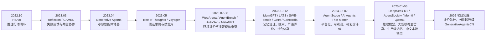
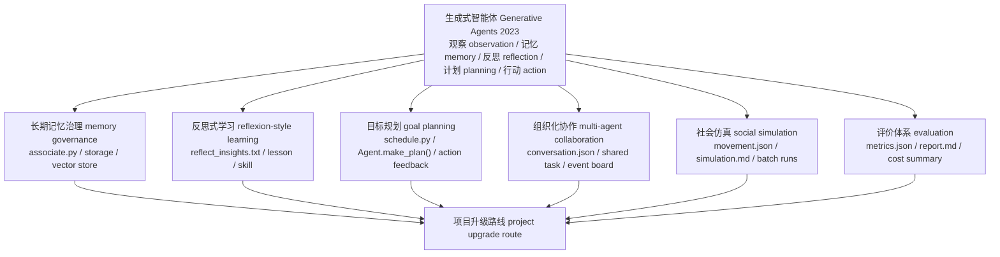
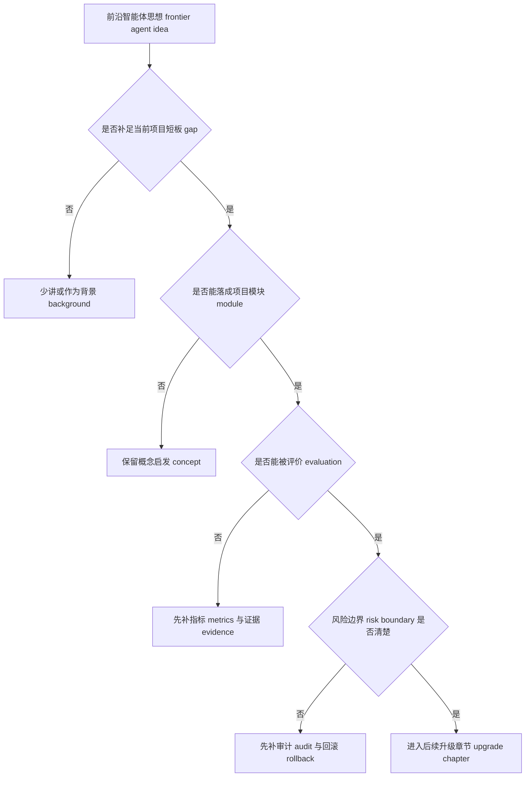

# 第 31 章 智能体仿真的前沿研究实践

## 前沿论文时间轴

在斯坦福小镇的论文出现后，长期记忆 memory、反思学习 reflexion、目标规划 goal planning、多智能体协作 multi-agent collaboration、社会仿真 social simulation、评价体系 evaluation system 和模型路由 model routing，分别来自不同阶段的前沿论文。下表按时间给出论文或系统、论文原标题 Original title、核心概念和在 GenerativeAgentsCN 中的项目落点。



*图 31-1：2022-2025 年前沿论文如何进入 2026 年的项目实践。ReAct 是 2022 年的先导工作，后面的论文分别补强记忆 memory、反思 reflection、规划 planning、协作 collaboration、仿真 simulation、评价 evaluation 和模型路由 model routing。*

| 时间 | 论文或系统 | 论文原标题 Original title | 为本项目引入的先进概念 | 在 GenerativeAgentsCN 中的落点 | 后续章节 |
| --- | --- | --- | --- | --- | --- |
| 2022.10 | ReAct | ReAct: Synergizing Reasoning and Acting in Language Models | 推理行动交替 reasoning-acting，让模型在“思考、行动、观察”之间循环 | 在目标规划 goal planning 中记录 reasoning/action/observation trace，不只生成一条日程 | 第 34 章 |
| 2023.03 | 反思式学习 Reflexion | Reflexion: Language Agents with Verbal Reinforcement Learning | 语言反馈 verbal feedback，把失败结果转成下一次尝试可用的经验 | 在 `Agent.reflect()` 旁增加行动结果 outcome、经验 lesson 和失败类型 failure type | 第 33 章 |
| 2023.03 | CAMEL | CAMEL: Communicative Agents for "Mind" Exploration of Large Language Model Society | 角色扮演式沟通智能体 role-playing communicative agents，用角色分工驱动协作 | 为公共事件板 event board 增加 organizer/helper/messenger 等临时角色 | 第 35 章 |
| 2023.04 | 生成式智能体 Generative Agents | Generative Agents: Interactive Simulacra of Human Behavior | 记忆流 memory stream、反思 reflection、计划 planning、Smallville 社会涌现 | 本书和本项目的经典地基：`Agent`、`Associate`、`Schedule`、`Maze` 和回放链路 | 第 31 章 |
| 2023.05 | 思维树 Tree of Thoughts | Tree of Thoughts: Deliberate Problem Solving with Large Language Models | 多候选思路 candidate thoughts 与分支评估 | 在 `_determine_action()` 前生成候选行动 candidate actions，并按目标贡献和自然性评分 | 第 34 章 |
| 2023.05 | 探索智能体 Voyager | Voyager: An Open-Ended Embodied Agent with Large Language Models | 技能库 skill library，把成功经验沉淀为可复用策略 | 把多次 lesson 合并成技能记忆 skill memory，供计划和对话检索 | 第 33 章 |
| 2023.07 | WebArena | WebArena: A Realistic Web Environment for Building Autonomous Agents | 环境落地 grounding，任务成功必须被环境状态验证 | 用 `movement.json` 检查承诺是否真的落到地点，避免只看语言承诺 | 第 37 章 |
| 2023.08 | AgentBench | AgentBench: Evaluating LLMs as Agents | 系统化智能体基准 benchmark，强调多任务、多维度评价 | 把派对、竞选、讨论会等实验统一成 `metrics.json` 和 `report.md` | 第 37 章 |
| 2023.08 | 框架 MetaGPT | MetaGPT: Meta Programming for A Multi-Agent Collaborative Framework | 标准作业流程 SOP 与角色分工 | 为派对、竞选和讨论会设计轻量 SOP，但保留拒绝、遗忘和冲突 | 第 35 章 |
| 2023.08 | 框架 AutoGen | AutoGen: Enabling Next-Gen LLM Applications via Multi-Agent Conversation | 可配置的多智能体对话框架 multi-agent conversation framework | 在自然对话后抽取 dialogue_act，再更新团队任务状态 | 第 35 章 |
| 2023.10 | LATS | Language Agent Tree Search Unifies Reasoning Acting and Planning in Language Models | 语言智能体树搜索 language agent tree search，把搜索、行动和反馈合在一起 | 不做完整树搜索，先做轻量候选行动和行动反馈 feedback | 第 34 章 |
| 2023.10 | MemGPT | MemGPT: Towards LLMs as Operating Systems | 上下文窗口 context window 与长期记忆 long-term memory 分层管理 | 把 `Associate` 从记忆容器升级为记忆治理层 memory governance | 第 32 章 |
| 2023.10 | SWE-bench | SWE-bench: Can Language Models Resolve Real-World GitHub Issues? | 像测试一样定义成功条件，失败必须能复查 | 让社会行为评价也有可核验条件、失败类型和证据路径 | 第 37 章 |
| 2023.11 | GAIA | GAIA: a benchmark for General AI Assistants | 多步骤智能体评价 multi-step agent evaluation | 把传播、记忆、日程、移动拆成链路断点 chain break 来分析 | 第 37 章 |
| 2023.12 | Concordia / 生成式智能体建模 Generative Agent-Based Modeling | Generative agent-based modeling with actions grounded in physical, social, or digital space using Concordia | 落地的基于智能体模型 grounded agent-based models | 用 Maze、Tile、address 和 movement 约束社会仿真，不只看语言输出 | 第 36 章 |
| 2024.02 | 平台 AgentScope | AgentScope: A Flexible yet Robust Multi-Agent Platform | 可配置、可观测、可扩展的多智能体平台 multi-agent platform | 增加实验配置、状态观测、日志、指标 metrics 和报告 report | 第 35-36 章 |
| 2024.07 | AI Agents That Matter | AI Agents That Matter | 智能体评价要记录基线 baseline、成本 cost、重复性和公平比较 | 每次升级都保留默认系统基线、成本摘要和失败样例 | 第 37 章 |
| 2025.01 | DeepSeek-R1 | DeepSeek-R1: Incentivizing Reasoning Capability in LLMs via Reinforcement Learning | 推理模型 reasoning model 让复杂复盘和规划更可用 | 反思、目标规划和失败复盘可路由到更强推理模型 | 第 38 章 |
| 2025.02 | 平台 AgentSociety | AgentSociety: Large-Scale Simulation of LLM-Driven Generative Agents Advances Understanding of Human Behaviors and Society | 大规模 LLM 社会仿真中的画像、调度、成本和统计问题 | 先把小规模多次运行 run 做成批量社会仿真实验 | 第 36 章 |
| 2025.04 | Mem0 | Mem0: Building Production-Ready AI Agents with Scalable Long-Term Memory | 生产级长期记忆 production memory、跨会话记忆和个性化 | 为高级记忆增加来源 source、置信度 confidence、合并 merge 和冲突检测 conflict detection | 第 32 章 |
| 2025.05 | Qwen3 | Qwen3 Technical Report | 中文模型、本地模型 local model 与推理/非推理模式选择 | 把模型 provider、提示词 prompt 类型和成本记录纳入模型路由 model routing | 第 38 章 |

## 31.1 从前沿概念的项目落点开始

到这里，本项目已经能复刻经典论文中的关键观点，我们将会继续迭代已有代码，将前沿的概念落进新的模块 `generative_agents_next`，优化 源码 source、配置 config、提示词 prompt、断点 checkpoint、对话 conversation、移动回放 movement、指标 metrics 或报告 report，根据前沿理念，继续优化 Generative Agents 这个项目。



*图 31-2：从生成式智能体 Generative Agents 到 2026 前沿升级的项目映射。每条线都必须能回到本仓库的文件、状态或运行结果；没有项目落点的前沿概念只能作为背景。*


*图 31-3：2023-2026 前沿方向如何落回生成式智能体 Generative Agents 项目。图中间的小镇仿真不是背景，而是所有前沿升级的锚点；周围的记忆治理 memory governance、反思学习 reflexion-style learning、目标规划 goal planning、多智能体协作 multi-agent collaboration、社会仿真 social simulation 和评价体系 evaluation 都要回到源码 source、提示词 prompt、断点 checkpoint、移动回放 movement、对话记录 conversation 与报告 report 验证。*

## 31.2 2023 年的地基：可信行为链

生成式智能体 Generative Agents 在 2023 年建立的关键能力，不是“25 个角色能聊天”，而是把大语言模型 LLM 接进一条可持续运行的行为链：

```text
观察 observation -> 记忆 memory -> 检索 retrieval -> 反思 reflection -> 计划 planning -> 行动 action -> 新观察 observation
```

当前项目把这条链落成了更具体的工程路径。

| 行为链环节 | 当前项目入口 | 输入 input | 处理 process | 输出 output |
| --- | --- | --- | --- | --- |
| 观察 observation | `Agent.percept()` | 地图范围、同一 arena 内的事件 event、感知带宽 `att_bandwidth` | 去重近期 `event/chat`，对新事件调用重要性评分提示词 prompt | `Concept` 节点进入 `Associate`，同时保存在本轮 `concepts` |
| 记忆 memory | `Associate.add_node()` | `Event`、`node_type`、`poignancy`、时间戳 | 写入 LlamaIndex 向量索引 vector index 和 `memory` 字典 | `docstore.json`、`default__vector_store.json`、`index_config.json` |
| 检索 retrieval | `Associate.retrieve_focus()` | 焦点文本 focus、`event + thought` 节点集合 | 叠加新近度 recency、相关性 relevance、重要性 importance | 供计划、对话、反思使用的 `Concept` 列表 |
| 反思 reflection | `Agent.reflect()` | 高重要性近期节点、对话缓存 `self.chats` | `reflect_focus.txt` 生成问题，`reflect_insights.txt` 生成洞察 insight | 新 `thought` 写回 `Associate` |
| 计划 planning | `Agent.make_schedule()`、`Agent._determine_action()` | 角色设定 persona、日程 schedule、空间记忆 spatial memory | `schedule_*.txt` 生成日程并拆解行动，再选择 sector/arena/object | `Action`、`schedule`、地图地址 address |
| 对话 dialogue | `Agent._chat_with()` | 相遇对象、关系摘要 relation、检索记忆、对话历史 | `summarize_relation.txt`、`generate_chat.txt`、终止判断提示词 prompt | `conversation.json`、双方 `chat` 记忆、被修订的 schedule |
| 持久化 persistence | `SimulateServer.simulate()` | 本轮所有角色状态、游戏时间、对话记录 | 每一步写 `simulate-*.json`，同时刷新 `conversation.json` | 可 resume 的断点 checkpoint |
| 压缩 replay | `compress.py` | checkpoint、conversation、地图 maze | 生成阅读时间线和回放帧 | `simulation.md`、`movement.json` |

后续三年的前沿工作，本质上都在增强这条链的某一段：让记忆更可治理，让反思能学习，让计划能追目标，让多智能体能组织协作，让仿真可统计，让评价可复现。

## 31.3 前沿判断原则

第五部分不把每篇论文都写成“必须实现”，我们筛选的优化方向，决策判断原则，如下所示。



*图 31-4：第五部分的前沿判断逻辑。它把“论文很新”转换成“是否值得改当前项目”的工程判断。*

按照 让记忆更可治理，让反思能学习，让计划能追目标，让多智能体能组织协作，让仿真可统计，让评价可复现 这个思路，我们确定了以下的优化方向。

## 31.4 长期记忆治理 memory governance

长期记忆治理落成七个升级方向，如下表所示。

| 升级方向 | 当前限制 | 升级做法 | 项目落点 |
| --- | --- | --- | --- |
| 扩展记忆类型 memory types | `Associate` 主要围绕 `event/chat/thought` 三类节点工作，关系、目标、摘要、技能和冲突都没有稳定位置。 | 增加 `relationship/goal/summary/skill/conflict`，让高级记忆进入统一类型集合。 | `generative_agents_next/modules/memory/associate.py` |
| 结构化关系记忆 relationship memory | `summarize_relation` 更像临时摘要，不能稳定回答“谁信任谁、关系怎么变化”。 | 在关键对话后写入 `relationship` 节点，记录对象、亲近度、信任度、熟悉度、证据和置信度。 | `generative_agents_next/modules/agent.py`、`generative_agents_next/modules/prompt/scratch.py`、`generative_agents_next/data/prompts/relationship_update.txt` |
| 记忆合并与摘要 merge / summary | 长期运行会产生大量低价值重复事件，挤占检索空间。 | 把相似、低重要性、非承诺类事件合并为 `summary`，同时保留 `source_nodes`。 | `generative_agents_next/modules/memory/associate.py`、`generative_agents_next/data/prompts/memory_merge.txt` |
| 冲突检测 conflict detection | 互斥时间、承诺、位置和关系可能同时进入长期记忆。 | 生成 `conflict` 节点，记录 `claim_a/claim_b/source_nodes/resolution_status`，等待澄清或后续裁决。 | `generative_agents_next/modules/memory/associate.py`、`generative_agents_next/data/prompts/memory_conflict_check.txt` |
| 跨实验长期记忆 long-term memory | `--resume` 只能延续同一实验，不能解释“上一轮实验的记忆为什么进入这一轮”。 | 增加显式导入入口，记录来源实验、来源角色、来源节点和加载策略。 | `generative_agents_next/start.py`、`generative_agents_next/modules/game.py`、`generative_agents_next/modules/memory/associate.py` |
| 来源与置信度 source / confidence | 反思、关系、摘要和冲突如果没有来源字段，读者无法判断记忆是否可信。 | 高级记忆统一写入 `source_nodes/source_type/confidence/generated_by/downstream_use/conflict_with`。 | `generative_agents_next/modules/memory/associate.py`、`generative_agents_next/modules/agent.py` |
| 场景化检索 contextual retrieval | 单一 `retrieve_focus()` 很难同时服务对话、规划、反思、反应和失败复盘。 | 增加面向任务的检索入口：对话取关系，规划取目标和摘要，反思取高重要性事件与冲突，恢复取技能。 | `generative_agents_next/modules/memory/associate.py` |

这七个方向共同把 `Associate` 从“把经历存起来”的记忆容器，推到“让记忆可追溯、可合并、可裁决、可迁移、可评价”的治理层。第 32 章后半部分再用指标和实验命令验证这些改动是否真的生效。

## 31.5 反思式学习 reflexion-style learning

当前 `Agent.reflect()` 会在 `status["poignancy"]` 超过阈值后调用 `reflect_focus.txt` 和 `reflect_insights.txt`，再把洞察 insight 写成 `thought`。这让角色能解释经历，但还没有形成“失败后改变策略”的学习闭环。Reflexion 的启发是把失败反馈写成语言经验，Voyager 的启发是把可复用经验固化成技能 skill；落到本项目，第一步不是让角色马上变聪明，而是先把失败样例抽出来。

| 升级方向 | 当前限制 | 升级做法 | 项目落点 |
| --- | --- | --- | --- |
| 结果标签 outcome | 原始反思只知道“发生了什么”，不知道行动成功、部分成功还是失败。 | 从 `conversation.json` 和 `movement.json` 抽取承诺、拒绝、到场，生成 outcome 和 failure_type。 | `generative_agents_next/analyze_experiment.py`、第 33 章 |
| 证据绑定 evidence binding | 原始 `thought` 很容易变成漂亮总结，难以回查来源。 | 高级记忆统一使用 `source_nodes/source_type/confidence`，反思候选也带原始对话证据。 | `generative_agents_next/modules/memory/associate.py`、`reflection_candidates.json` |
| 技能记忆 skill memory | 经验没有稳定类型，后续计划和对话很难显式检索。 | 先扩展 `skill` 记忆类型；当前已支持冲突触发 skill，反思 lesson 接入留给第 33 章后续实验。 | `generative_agents_next/modules/agent.py`、`generative_agents_next/modules/memory/associate.py` |
| 失败驱动 trigger | 当前反思由重要性阈值触发，不一定覆盖失败。 | 用评价脚本找出“承诺但未到场”等失败样例，再人工判断是否写入 lesson。 | `generative_agents_next/results/evaluations/<实验名>/reflection_candidates.json` |
| 复用评价 reuse evaluation | 只看反思文本会误判能力。 | 统计 lesson 是否被检索、同类失败是否减少、自然性是否下降。 | 第 33 章实验结果分析、第 37 章评价体系 |

## 31.6 目标规划 goal planning

当前规划 planning 主要是日程 schedule：先生成一天的粗计划，再拆成当前行动。它适合生活节奏，不适合“让至少三个人知道派对，并让两个人到场”这种目标驱动任务。

| 升级方向 | 当前限制 | 升级做法 | 项目落点 |
| --- | --- | --- | --- |
| 目标记忆 goal memory | 日程 schedule 有行动，但没有结构化目标对象。 | 在 `make_schedule()` 生成日程后写入 `goal` 记忆，并记录来源 thought。 | `generative_agents_next/modules/agent.py` |
| 目标进度 progress | 系统不知道“谁知道、谁承诺、谁到场、谁缺席”。 | 离线生成 `goal_progress.json`，把 informed、accepted、arrived、missing 拆开。 | `generative_agents_next/analyze_experiment.py`、第 34 章 |
| 候选行动 candidate actions | 当前 `_determine_action()` 仍按日程和空间落地，不做目标候选搜索。 | 后续在明确目标缺口时生成候选行动，并用自然性、可行性、目标贡献评分。 | 第 34 章后续改造，暂未接入运行循环 |
| 反馈闭环 feedback | 对话承诺和实际到场没有回流到下一步计划。 | 把 `goal_progress.missing` 作为下一轮计划修订输入。 | 待接入 `schedule_revise` 或 `_determine_action()` |
| 评价边界 evaluation | 目标成功容易被摘要粉饰。 | 目标完成率必须同时读 conversation、movement、checkpoint 和 report。 | `results/evaluations/<实验名>/metrics.json` |

## 31.7 组织化协作 multi-agent collaboration

当前多智能体互动 multi-agent interaction 主要依赖同一地图、感知范围、偶遇、对话和记忆传播。它能产生社会涌现 social emergence，但缺少组织化协作所需的共享任务状态。

| 升级方向 | 当前限制 | 升级做法 | 项目落点 |
| --- | --- | --- | --- |
| 公共事件板 event board | 角色可能都提到派对，但系统没有一个可审计事件对象。 | 从对话和到场证据生成 `event_board.json`，区分 known、accepted、rejected、arrived。 | `generative_agents_next/analyze_experiment.py`、第 35 章 |
| 临时工作组 temporary workgroup | 自然偶遇不能表达 organizer/helper/participant 等角色分工。 | 后续把明确事件转成临时工作组，保留拒绝和遗忘。 | 第 35 章设计，尚未进入角色可见状态 |
| 协作对话协议 dialogue act | 对话摘要不能稳定判断“接受任务、拒绝任务、转述任务”。 | 在报告层先抽取承诺和拒绝；后续再引入 dialogue act schema。 | `event_board.json` 当前支持第一层，`team_tasks` 待扩展 |
| 共享记忆 shared memory | 共享状态太强会破坏生活流和角色边界。 | 先离线评价，不把事件板喂给角色；验证后再决定哪些字段可见。 | 第 35 章风险边界 |
| 协作指标 metrics | 不能把“说过派对”误判成“完成协作”。 | 统计任务状态一致性、贡献可追踪性、到场证据。 | 第 35 章、第 37 章 |

## 31.8 社会仿真 social simulation

Smallville 式小镇故事很适合展示社会涌现，但单次故事不是严谨社会仿真。当前项目已经拥有做小规模统计实验的底座：`start.py` 可批量启动、checkpoint 可复查、`compress.py` 可生成 `simulation.md` 和 `movement.json`。

| 升级方向 | 当前限制 | 升级做法 | 项目落点 |
| --- | --- | --- | --- |
| 多次运行 batch runs | 单次故事不能说明稳定性。 | 以 `book-social-party-r1/r2/r3` 形式跑同一配置，再比较指标。 | 第 36 章实验命令 |
| 批量汇总 batch summary | 多个 `metrics.json` 手工比对容易漏掉失败。 | `--batch-names` 汇总 mention、accepted、arrived、goal_completion_rate 均值。 | `generative_agents_next/analyze_experiment.py` |
| 事件数据集 event dataset | 关键词和成功标准如果每次手写，口径会漂。 | 先在命令中固定关键词、地点和时间窗；后续整理为 JSON 配置。 | 第 36 章、第 37 章 |
| 方差与失败样例 variance / failure cases | 只展示最好一次会误导读者。 | 把差异大的 run 写成结论，失败报告不删除。 | `results/evaluations/book-social-party-batch/batch_summary.json` |
| 外推边界 boundary | 小镇仿真不是现实社会预测。 | 结论限定在角色、地图、模型和配置内。 | 第 36 章风险边界 |

## 31.9 评价体系 evaluation

智能体 agent 领域过去几年的核心教训是：演示 demo 很容易精彩，评价 evaluation 很难严谨。AgentBench、WebArena、GAIA、SWE-bench 和 AI Agents That Matter 都在提醒同一件事：需要可复现、可比较、成本敏感、失败可见的评价。

| 升级方向 | 当前限制 | 升级做法 | 项目落点 |
| --- | --- | --- | --- |
| 统一指标 metrics | 原始输出分散在 conversation、movement、checkpoint 和 simulation。 | 统一生成 `metrics.json`，保留 diffusion、commitments、attendance、goal_progress、memory_summary。 | `generative_agents_next/analyze_experiment.py` |
| 人工报告 report | 只看 JSON 难以判断弱证据和误命中。 | 生成 `report.md`，列出传播证据、到场证据、事件板、反思候选。 | `results/evaluations/<实验名>/report.md` |
| 失败分类 failure taxonomy | 失败容易被写成“故事不够好”。 | 拆成 no_contact、no_mention、memory_miss、plan_not_updated、movement_miss 等检查路径。 | 第 37 章 |
| 时间窗校验 time window | 实验没跑到 17:00 时，不能判断派对到场。 | 指标记录 `final_time`、`window_start`、`window_end`，结论先判断覆盖范围。 | `metrics.json` |
| 主观边界 human review | 自然性和可信裁决不能全自动。 | 脚本给证据，人工报告写判断。 | 第 37 章实验结果分析 |

## 31.10 中文、本地模型与模型路由 model routing

2023 年的生成式智能体 Generative Agents 主要建立在远程通用大模型上。当前项目已经通过 `data/config.json` 把模型 provider 和向量嵌入 embedding 抽成配置：默认示例中大语言模型 LLM 使用 MiniMax，向量嵌入 embedding 使用 `embo-01`；`modules/storage/index.py` 还支持 `hugging_face`、`ollama`、`minimax`、`openai` 等 embedding provider。

| 升级方向 | 当前限制 | 升级做法 | 项目落点 |
| --- | --- | --- | --- |
| 调用统计 call summary | 现有 `LLMModel` 只记录成功、失败、重试摘要，成本口径还不完整。 | 先把 caller 级统计写进评价报告，再决定是否扩展成本字段。 | `generative_agents_next/modules/model/llm_model.py`、第 38 章 |
| 模型路由 model routing | 当前 `create_llm_model()` 基本按配置创建单一模型。 | 后续按 `func_hint` 区分日常对话、反思、目标规划和结构化输出。 | 第 38 章路线图，暂未实现 |
| 本地模型 local model | Ollama 支持存在，但不是所有 prompt 都适合小模型。 | 只在评价指标能比较质量和失败率后引入。 | `generative_agents/modules/model/llm_model.py` |
| 速率限制 rate limit | 并发实验会触发供应商 429。 | 实验命令分批运行，后续加 caller 级退避、队列或路由。 | 第 38 章风险边界 |
| 成本质量对照 cost-quality | 便宜不等于更好。 | 同一实验在不同模型配置下比较 metrics、report、失败样例和成本。 | 第 37 章评价体系、第 38 章 |

## 31.11 工程可观测性 observability

前沿升级如果没有可观测性 observability，很快会变成不可复现的“灵感工程”。当前项目已经有断点 checkpoint、对话 conversation、压缩结果 compressed result、回放 replay 和部分指标 metrics；第五部分继续把它们组织成实验系统。

| 可观测对象 | 当前路径 | 升级后要增加 | 失败时先看哪里 |
| --- | --- | --- | --- |
| 运行状态 runtime state | `generative_agents_next/results/checkpoints/<name>/simulate-*.json` | 目标 goal、候选行动 candidate action、模型调用 model call | 最新 checkpoint 与角色 `action/schedule/associate` |
| 记忆索引 memory index | `storage/<角色>/associate/docstore.json`、`default__vector_store.json` | 来源 source、置信度 confidence、冲突 conflict、摘要 summary | `Associate.memory` 与 LlamaIndex `docstore` 是否一致 |
| 对话证据 dialogue evidence | `conversation.json` | 传播边 source edge、态度 stance、承诺 commitment | 对话原文与 `chat` 记忆是否一致 |
| 回放 replay | `generative_agents_next/results/compressed/<name>/movement.json` | 目标进度、组织任务状态、群体轨迹 | 坐标、行动、对话时间是否对齐 |
| 报告 report | `simulation.md`、`memory_metrics.json`、`metrics.json`、`report.md` | 成本 cost、失败样例 failure case、对照组 baseline | 指标能否追到原始证据 |

工程上真正的升级不是“加更多模块”，而是让每个模块都能被复查、比较和回滚。

## 31.12 第五部分的章节分工

| 后续章节 | 解决的问题 | 项目锚点 |
| --- | --- | --- |
| 第 32 章 记忆系统升级 memory upgrade | 让记忆从 `event/thought/chat` 走向可治理长期记忆 | `generative_agents_next/modules/memory/associate.py`、`memory_metrics.json`、`relationship_update.txt` |
| 第 33 章 反思系统升级 reflection upgrade | 让反思从总结经历走向失败学习和技能库 | `generative_agents_next/analyze_experiment.py`、`reflection_candidates.json` |
| 第 34 章 规划系统升级 planning upgrade | 让日程拆解增加目标 Goal、候选行动和反馈评估 | `generative_agents_next/modules/agent.py`、`goal_progress.json` |
| 第 35 章 多智能体协作 collaboration upgrade | 让偶遇对话升级为共享任务和组织协作 | `event_board.json`、`conversation.json`、`movement.json` |
| 第 36 章 社会仿真 social simulation upgrade | 让单次故事升级为批量统计实验 | `start.py`、`compress.py`、`analyze_experiment.py --batch-names` |
| 第 37 章 评价体系 evaluation upgrade | 让可信故事升级为可复现实验指标 | `metrics.json`、`report.md`、`goal_progress.json`、`reflection_candidates.json` |
| 第 38 章 前沿升级路线图 roadmap | 给出已落地能力、待跑实验和后续接入顺序 | `generative_agents_next` 源码、配置、prompt、checkpoint、压缩结果 compressed result |

## 31.13 本章小结

2023-2026 年的智能体 agent 前沿，放在本书里不是论文名词表，而是一组项目升级约束。能落地的方向必须回答：输入 input 从哪里来，处理 process 改哪段源码或 prompt，输出 output 落到哪个文件，失败模式 failure mode 怎么排查，验证 validation 如何回到证据。

| 演进方向 | 核心结论 |
| --- | --- |
| 经典地基 classic foundation | 生成式智能体 Generative Agents 建立了观察、记忆、检索、反思、计划、行动和社会互动组成的可信行为链。 |
| 记忆 memory | 记忆流 memory stream 已在 `generative_agents_next` 中升级出类型、来源、摘要、冲突、关系和指标。 |
| 反思 reflection | 反思 reflection 先从 `reflection_candidates.json` 开始，后续再把失败复盘接入 lesson 和 skill。 |
| 规划 planning | 日程 schedule 已能生成 `goal` 记忆，进度评估先由 `goal_progress.json` 离线完成。 |
| 协作 collaboration | 多智能体 multi-agent 先生成离线 `event_board.json`，再谨慎进入角色共享状态。 |
| 仿真 simulation | 小镇故事要通过 `--batch-names` 汇总成可重复、可统计、可比较的小规模社会仿真。 |
| 评价 evaluation | 演示可信已经落到 `metrics.json`、`report.md`、失败样例 failure case 和基线 baseline。 |
| 模型 model | 中文、本地和推理模型改变了 provider 选择，后续需要模型路由 model routing。 |
| 工程 observability | 日志、配置、prompt 版本、断点 checkpoint、回放 replay 和指标报告，是前沿升级能否被复查的基础。 |

下一章进入第一条具体升级线：记忆系统升级。它从原始 `generative_agents/modules/memory/associate.py` 读懂基线，再转到 `generative_agents_next/modules/memory/associate.py`、真实 checkpoint 和 `memory_metrics.json`，判断如何把记忆流 memory stream 改造成可管理长期记忆。

## 参考资料

- 生成式智能体 Generative Agents: https://arxiv.org/abs/2304.03442
- MemGPT: https://arxiv.org/abs/2310.08560
- Mem0: https://arxiv.org/abs/2504.19413
- 反思式学习 Reflexion: https://arxiv.org/abs/2303.11366
- Voyager: https://arxiv.org/abs/2305.16291
- ReAct: https://arxiv.org/abs/2210.03629
- Tree of Thoughts: https://arxiv.org/abs/2305.10601
- LATS: https://arxiv.org/abs/2310.04406
- CAMEL: https://arxiv.org/abs/2303.17760
- AutoGen: https://arxiv.org/abs/2308.08155
- MetaGPT: https://arxiv.org/abs/2308.00352
- AgentScope: https://arxiv.org/abs/2402.14034
- Concordia / 生成式智能体建模 Generative Agent-Based Modeling: https://arxiv.org/abs/2312.03664
- AgentSociety: https://arxiv.org/abs/2502.08691
- AgentBench: https://arxiv.org/abs/2308.03688
- WebArena: https://arxiv.org/abs/2307.13854
- GAIA: https://arxiv.org/abs/2311.12983
- SWE-bench: https://arxiv.org/abs/2310.06770
- AI Agents That Matter: https://arxiv.org/abs/2407.01502
- DeepSeek-R1: https://arxiv.org/abs/2501.12948
- Qwen3: https://arxiv.org/abs/2505.09388
- Qwen3 官方博客 Qwen3 official blog: https://qwenlm.github.io/blog/qwen3/
- Local source: `generative_agents/start.py`
- Local source: `generative_agents/modules/agent.py`
- Local source: `generative_agents/modules/memory/associate.py`
- Local source: `generative_agents/modules/storage/index.py`
- Local source: `generative_agents/compress.py`
- Local upgrade source: `generative_agents_next/modules/memory/associate.py`
- Local upgrade source: `generative_agents_next/modules/agent.py`
- Local upgrade source: `generative_agents_next/compress.py`
- Local upgrade source: `generative_agents_next/analyze_experiment.py`
- Local config: `generative_agents/data/config.json`
- Local evidence: `docs/book/assets/chapter_31/ch31_frontier_to_project_map_v2.png`
