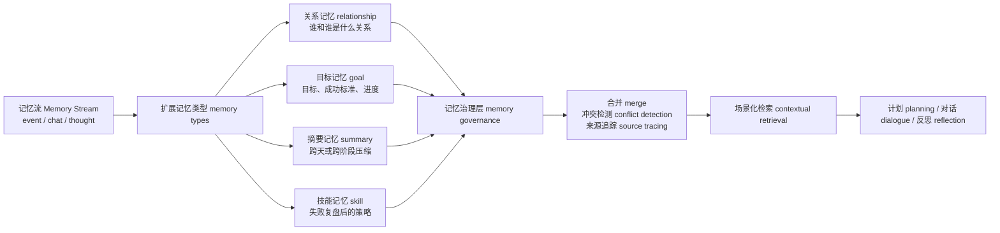

# 第 32 章 记忆系统升级：从记忆流 Memory Stream 到可管理长期记忆

## 32.1 当前记忆能保存事实，但还不能治理事实

当前项目不是“没有记忆”。它已经能保存事件、对话和反思，也能在 checkpoint 与 `conversation.json` 里留下证据。真正的缺口是记忆治理 memory governance：系统保存了“下午五点邀请玛丽亚”，但没有把“承诺”“关系变化”“冲突裁决”“下游用途”变成可稳定检索和验证的对象。

| 追问问题 | 当前已有证据 | 当前缺口 | 对应升级方向 |
| --- | --- | --- | --- |
| 玛丽亚答应参加派对了吗？ | `conversation.json` 里有 11:30 的原始对话。 | 承诺只停留在聊天文本和摘要中，不能直接追到证据节点。 | 来源 source、证据 evidence |
| 玛丽亚和伊莎贝拉的关系是否变近？ | 对话、后续行动和反思可能包含线索。 | 关系 relationship 不是稳定记忆类型，容易被一次临时摘要覆盖。 | 关系记忆 relationship memory |
| 派对到底是 17:00 还是 19:00？ | 多条 event、chat 或 thought 可能各自保存时间信息。 | 系统没有冲突检测和裁决记录，互斥事实可能同时进入长期记忆。 | 冲突检测 conflict detection |
| 这条记忆以后服务计划、对话还是评价？ | 当前只有 `event/thought/chat` 三类节点。 | 记忆缺少下游用途 downstream use，检索时难以按任务选择。 | 场景化检索 contextual retrieval |

因此，本章的升级目标不是“多存一些记忆”，而是把重要记忆变成可追溯、可分类、可裁决、可复用的长期记忆 long-term memory。每条关键记忆至少要能说明来源 source、类型 type、可信度 confidence 和下游用途 downstream use。

### 论文依据与工程落点

下面的论文依据只引用能落到本项目代码和实验的结论。`source_nodes`、`confidence`、`resolution_status` 这类字段不是论文原封不动给出的标准字段，而是把论文中的长期记忆、关系结构、动态检索和可验证评价要求落到 `generative_agents_next` 时新增的工程字段。

| 升级方向 | 论文名称 | 论文原文要点 | 本项目结论 |
| --- | --- | --- | --- |
| 记忆流基线 memory stream | Generative Agents: Interactive Simulacra of Human Behavior | 论文把智能体架构概括为保存经历、生成 `higher-level reflections`，并动态检索来计划行为。 | 当前 `event/chat/thought` 是基线，不应直接推翻；升级应在 `Associate` 上增加治理类型，而不是重写整套仿真循环。 |
| 扩展记忆类型 memory types | MemGPT: Towards LLMs as Operating Systems | 论文提出 `virtual context management`，并让系统管理 `different memory tiers`。 | `Associate` 不应只有三类自然语言节点；工作记忆、长期记忆、摘要、技能和冲突需要分层或分类型保存。 |
| 记忆合并与摘要 merge / summary | Mem0: Building Production-Ready AI Agents with Scalable Long-Term Memory | 论文强调从对话中动态 `extracting, consolidating, and retrieving` 关键信息。 | 日常重复事件不应全部平铺进检索结果；低价值重复事件要合并为 `summary`，同时保留 `source_nodes`。 |
| 记忆保留与遗忘 retention / forgetting | MemoryBank: Enhancing Large Language Models with Long-Term Memory | 论文强调 `summon relevant memories`、`continuous memory updates`，并允许系统 `forget and reinforce memory`。 | 本章的摘要合并还只是第一步；后续应继续增加过期、降权、强化和删除策略，避免旧记忆长期污染。 |
| 结构化关系记忆 relationship memory | Mem0: Building Production-Ready AI Agents with Scalable Long-Term Memory | 论文进一步提出图结构记忆，用来捕捉对话元素之间的复杂关系。 | 伊莎贝拉和玛丽亚的关系不能只靠一次 `summarize_relation` 临时生成；需要写入 `relationship` 节点，记录对象、强度、证据和置信度。 |
| 来源与结构化属性 source / metadata | A-MEM: Agentic Memory for LLM Agents | 论文为新记忆生成包含 `contextual descriptions, keywords, and tags` 的结构化笔记，并建立动态链接。 | 高级记忆必须带 metadata：核心字段是 `source_nodes/source_type/generated_by/downstream_use`，发生冲突时再写入 `conflict_with`。 |
| 冲突检测 conflict detection | Evaluating Very Long-Term Conversational Memory of LLM Agents | LoCoMo 构造最多 35 个会话的长期对话，并指出模型理解 `long-range temporal and causal dynamics` 仍然困难。 | 派对时间、承诺、位置和关系变化必须有 `conflict` 节点。冲突字段是本项目的工程扩展，用来把时间/因果错误显式暴露出来。 |
| 跨实验长期记忆 long-term memory | MemGPT: Towards LLMs as Operating Systems；Mem0: Building Production-Ready AI Agents with Scalable Long-Term Memory | 两篇论文都把多轮、多会话场景作为长期记忆的核心压力测试。 | `--resume` 不是长期记忆迁移；跨实验加载必须显式传参，并记录 `loaded_from/source_experiment/source_node_id`。 |
| 场景化检索 contextual retrieval | Generative Agents: Interactive Simulacra of Human Behavior；Mem0: Building Production-Ready AI Agents with Scalable Long-Term Memory | 前者用动态检索支撑计划和行为，后者比较不同问题类型下的长期记忆效果。 | 对话、规划、反思、反应和失败复盘不应共用一个无差别检索入口；需要 `retrieve_for_dialogue/planning/reflection/reaction/recovery`。 |



*图 32-1：从记忆流 Memory Stream 到记忆治理层 memory governance 的演进。原始 `generative_agents` 已经有 `event/chat/thought`；升级目录 `generative_agents_next` 在此基础上增加 `relationship/goal/summary/skill/conflict`，并把来源 source、置信度 confidence 和下游用途 downstream use 写入 metadata。*


*图 32-2：长期记忆治理的真实存储剖面。画面把原始证据流、关联记忆 associate、向量嵌入 embedding、检索 retrieval、保留策略 retention 和审计标记放进同一个记忆库现场。当前项目已经有 `storage/<角色>/associate`、`docstore.json` 与向量索引；relationship、goal、summary、skill 等治理对象则是后续升级要新增的记忆层。*

## 32.3 当前实现的长期瓶颈

| 瓶颈 | 当前表现 | 源码或文件位置 | 失败模式 | 修正方向 |
| --- | --- | --- | --- | --- |
| 类型不足 | 只有 `event/thought/chat` | `Associate.__init__()`、`Associate.abstract()` | 关系、目标、摘要、技能都被挤进普通文本 | 增加有限记忆类型 memory types，并兼容旧 checkpoint。 |
| 证据未持久化 | `Agent.reflect()` 传入 `filling/evidence`，但 `Associate.add_node()` 未写入 metadata | `Agent.reflect()`、`Associate.add_node()` | 反思洞察无法追到具体证据节点 | 增加 `source_nodes`、`generated_by`、`confidence`。 |
| 关系不稳定 | `summarize_relation` 每次临时生成关系文本 | `Scratch.prompt_summarize_relation()` | 角色态度可能随一次对话漂移 | 引入结构化关系记忆 relationship memory。 |
| 重复记忆累积 | 日常动作反复进入 `event` | `Agent.percept()`、`docstore.json` | 检索噪声变大，重要事件被稀释 | 增加摘要 summary 和合并 merge 策略。 |
| 冲突无裁决 | 17:00 与 19:00 这类派对时间冲突没有专门处理 | 当前无专用模块 | 后续计划摇摆，错误信息被长期保存 | 增加冲突检测 conflict detection 和澄清记录。 |
| 检索场景单一 | `retrieve_focus()` 只查 `event + thought` | `associate.py` | 对话时缺关系，规划时缺目标，失败复盘时缺技能 | 增加场景化检索 contextual retrieval。 |
| 跨实验边界不清 | resume 支持旧 checkpoint，但没有长期记忆导入策略 | `start.py`、`get_config_from_log()` | 角色带入旧记忆后无法解释结果 | 长期记忆默认关闭，并在配置和报告中显式记录来源。 |

## 32.4 升级方向一：扩展记忆类型 memory types

第一步不需要重写整套系统，而是把硬编码的三类节点改成有限集合。

| 类型 | 中文用途 | 输入 input | 输出 output | 下游用途 |
| --- | --- | --- | --- | --- |
| `event` | 观察或行动事件 | 地图感知、行动状态 | 原始事件节点 | 计划、对话、反思 |
| `chat` | 对话摘要 | 对话记录 conversation | 聊天摘要节点 | 关系判断、后续对话 |
| `thought` | 反思想法 | 反思提示词 prompt 输出 | 高层认知节点 | 计划和对话上下文 |
| `relationship` | 稳定关系认知 | 对话、共同事件、反思 | 关系对象或关系摘要 | 对话语气、信任判断 |
| `goal` | 长期或阶段目标 | 角色任务、外部实验配置 | 目标状态 | 目标驱动规划 |
| `summary` | 压缩记忆 | 相似低价值事件集合 | 时间段摘要 | 降低检索噪声 |
| `skill` | 可复用经验 | 成功或失败复盘 | 策略片段 | 失败恢复和计划改进 |
| `conflict` | 冲突事实记录 | 新旧记忆不一致 | 待确认或已裁决冲突 | 防止错误记忆固化 |

实际改动落在 `generative_agents_next/modules/memory/associate.py`。这一步只扩展类型集合，不改变旧的 `event/chat/thought` 语义。

```diff
--- a/generative_agents_next/modules/memory/associate.py
+++ b/generative_agents_next/modules/memory/associate.py
@@
-class Associate:
+DEFAULT_MEMORY_TYPES = [
+    "event",
+    "chat",
+    "thought",
+    "relationship",
+    "goal",
+    "summary",
+    "skill",
+    "conflict",
+]
+
+
+class Associate:
@@
-        self.memory = memory or {"event": [], "thought": [], "chat": []}
+        self.memory = memory or {t: [] for t in DEFAULT_MEMORY_TYPES}
+        for t in DEFAULT_MEMORY_TYPES:
+            self.memory.setdefault(t, [])
@@
-        for t in ["event", "chat", "thought"]:
+        for t in DEFAULT_MEMORY_TYPES:
             des[t] = [self.find_concept(c).describe for c in self.memory[t]]
```

| 闭环项 | 说明 |
| --- | --- |
| 输入 input | 旧 checkpoint 的 `memory` 字典，可能只有 `event/thought/chat`。 |
| 处理 process | 新实验创建完整类型；旧实验用 `setdefault()` 补齐缺失键。 |
| 输出 output | 所有类型都有列表，旧结果可 resume，新类型可逐步启用。 |
| 失败模式 failure mode | 如果只改 `__init__()`，但 `abstract()` 仍写死三类，报告会漏掉新类型。 |
| 验证 validation | 用旧实验 `book-party-extended` resume 一步，确认没有 KeyError；检查 `simulate-*.json` 中新键存在且为空。 |

## 32.5 升级方向二：结构化关系记忆 relationship memory

当前关系是临时摘要。长期小镇实验更需要稳定关系对象。

```json
{
  "target": "山姆",
  "affinity": -2,
  "trust": 1,
  "familiarity": 4,
  "last_interaction": "2024-02-13 10:30",
  "summary": "汤姆对山姆竞选市长持怀疑态度。",
  "evidence": ["node_12", "node_45"]
}
```

| 字段 | 中文含义 | 输入来源 | 验证方式 |
| --- | --- | --- | --- |
| `target` | 关系对象 | 对话对象或事件主体 | 是否存在于角色列表 personas。 |
| `affinity` | 好感度 | 对话态度、历史事件 | 抽样对话语气是否一致。 |
| `trust` | 信任程度 | 承诺履行、冲突、拒绝 | 是否影响后续请求与接受。 |
| `familiarity` | 熟悉度 | 互动次数、共同事件 | 是否随多次对话上升。 |
| `last_interaction` | 最近互动时间 | `conversation.json` 时间键 | 能否回到原始对话时间。 |
| `summary` | 一句话关系摘要 | 关系更新 prompt | 是否与证据一致。 |
| `evidence` | 支撑节点 | `chat/event/thought` 节点 ID | `docstore.json` 是否能找到对应节点。 |

本轮新增的关系更新提示词 prompt 放在机制执行处，而不是附录：

| 项目 | 建议值 |
| --- | --- |
| 提示词 prompt 路径 | `generative_agents_next/data/prompts/relationship_update.txt` |
| 调用时机 | 一次关键对话结束后，`summarize_chats` 之后、`schedule_chat()` 写入关系前。 |
| 变量 variables | `current_relationship`、`recent_conversation`、`related_memories`、`agent`、`another`。 |
| 输出结构 schema | `affinity_delta: int`、`trust_delta: int`、`familiarity_delta: int`、`summary_update: str`、`evidence: list[str]`、`confidence: float`。 |
| 输出流向 | 写入 `relationship` 节点；对话前由 `retrieve_for_dialogue()` 显式取回。 |
| 失败回退 failsafe | 不更新 `affinity/trust`，只增加 `familiarity` 或保留旧关系。 |

关系变化必须有幅度限制。一句普通寒暄不能让 `affinity` 从 -3 跳到 +5；没有证据节点时，不应生成高置信度关系。

## 32.6 升级方向三：记忆合并 merge 与摘要 summary

长期运行会产生大量低价值重复事件。伊莎贝拉在咖啡馆的一上午可能连续出现：

| 原始事件 event | 是否适合合并 | 原因 |
| --- | --- | --- |
| 伊莎贝拉 打开咖啡馆大门并开灯 | 可合并 | 属于日常开店流程。 |
| 伊莎贝拉 检查并调试咖啡机 | 可合并 | 与开店准备同主题。 |
| 伊莎贝拉 摆放糕点并整理展示柜 | 可合并 | 与开店准备同主题。 |
| 伊莎贝拉 邀请玛丽亚 17:00 参加派对 | 不应简单合并 | 包含明确承诺和时间。 |
| 山姆表示 17:00 已和詹妮弗约好晚餐 | 不应简单合并 | 包含拒绝与冲突时间线。 |

合并机制的输入-处理-输出闭环：

| 闭环项 | 说明 |
| --- | --- |
| 输入 input | 新事件 event、相似旧事件、时间窗口、重要性 poignancy、是否包含承诺。 |
| 处理 process | 检索相似旧节点；判断是否低价值重复；生成 summary；保留原始 evidence。 |
| 输出 output | `summary` 节点与 `source_nodes`；原始节点可设置更短过期时间。 |
| 失败模式 failure mode | 把承诺、拒绝、地点、时间压缩掉，导致后续行动丢失关键约束。 |
| 验证 validation | 抽样 summary，检查是否能追回所有 source nodes；检查承诺类事件是否未被错误合并。 |

本轮已经新增 `generative_agents_next/data/prompts/memory_merge.txt`，变量包括 `new_memory`、`similar_memories`、`merge_policy`，输出结构 schema 包括 `should_merge: bool`、`summary: str`、`source_nodes: list[str]`、`drop_after: str 或 null`、`reason: str`。同时要分清当前实验边界：`book-memory-governance-full` 中的 `summary` 节点由 `Associate.maybe_create_summary()` 的确定性规则生成，`memory_merge.txt` 和 `Scratch.prompt_memory_merge()` 是后续把合并判断交给 LLM 时的扩展入口。

## 32.7 升级方向四：冲突检测 conflict detection

长期记忆最危险的不是忘记，而是把冲突事实都当真。例如：

| 冲突类型 | 例子 | 行为风险 |
| --- | --- | --- |
| 时间冲突 time conflict | 派对时间是 17:00；派对时间是 19:00 | 角色到错时间，评价误判。 |
| 关系冲突 relationship conflict | 汤姆不信任山姆；汤姆非常支持山姆 | 对话态度摇摆。 |
| 承诺冲突 commitment conflict | 玛丽亚答应参加；玛丽亚同一时间有考试 | 计划和移动证据不一致。 |
| 位置冲突 location conflict | 克劳斯说在图书馆；movement 显示在宿舍 | 报告可能把摘要当强证据。 |

冲突检测闭环：

| 闭环项 | 说明 |
| --- | --- |
| 输入 input | 新记忆、同主题旧记忆、来源类型、时间戳、置信度。 |
| 处理 process | 检索同主题节点；判断是否互斥；生成 `conflict` 节点或澄清 `thought`。 |
| 输出 output | `conflict` 记忆，字段包含 `claim_a`、`claim_b`、`source_nodes`、`resolution_status`。 |
| 失败模式 failure mode | 过度检测会把自然变化误判成矛盾；检测不足会让错误记忆长期污染。 |
| 验证 validation | 人工抽样冲突节点，回到 `conversation.json` 和 `movement.json` 判定是否真实冲突。 |

本轮已经新增 `generative_agents_next/data/prompts/memory_conflict_check.txt`，输出结构 schema 至少包含 `has_conflict: bool`、`conflict_type: str`、`summary: str`、`evidence: list[str]`、`need_clarification: bool`。当前实验中的 `conflict` 节点由 `Associate.maybe_detect_conflict()` 的时间抽取规则生成；这个 prompt 模板暂时是后续替换规则检测的接口，而不是本轮指标里的直接调用来源。

## 32.8 升级方向五：跨实验长期记忆 long-term memory

跨实验记忆能把项目从“单次小镇故事生成器”推进为“长期角色实验平台”，但默认必须关闭。原因很简单：跨实验记忆会改变可复现性 reproducibility。

| 设计项 | 建议 |
| --- | --- |
| 默认状态 | 关闭，不自动加载历史实验记忆。 |
| 建议路径 | 直接使用旧实验存储根目录，例如 `generative_agents_next/results/checkpoints/<实验名>/storage`；也可以后续整理到 `generative_agents_next/data/long_term_memory/<角色名>/`。 |
| 启用方式 | `generative_agents_next/start.py` 已增加显式命令行参数，例如 `--load-long-term-memory results/checkpoints/book-memory-governance-full/storage`。 |
| 当前边界 | 参数已经实现，但本轮 `book-memory-governance-full` 没有启用导入，所以实验结果中的 `imported_nodes=0`。 |
| 必须记录 | 来源实验名、角色名、加载节点数、加载时间、配置版本。 |
| 报告要求 | `simulation.md` 和指标报告必须说明本轮加载了哪一轮长期记忆。 |

输入-处理-输出闭环：

| 闭环项 | 说明 |
| --- | --- |
| 输入 input | 旧实验的 `Associate` 存储、角色名、加载策略、过滤规则。 |
| 处理 process | 读取旧 `docstore.json` 与 memory 字典；过滤过期、低置信和冲突节点；写入本轮 `Associate`。 |
| 输出 output | 本轮 checkpoint 中带 `loaded_from` 的长期记忆节点。 |
| 失败模式 failure mode | 角色突然提到上一轮实验信息，被误判为幻觉；或者错误记忆跨实验污染。 |
| 验证 validation | 新实验报告列出加载源；抽样长期记忆检查 source experiment 和 source node。 |

## 32.9 升级方向六：来源 source 与置信度 confidence

高级记忆必须知道自己从哪里来。当前第 18 章证据文件已经指出一个边界：原始 `Agent.reflect()` 会把 evidence 传入 `_add_concept()`，但原始 `Associate.add_node()` 没有把 `filling/evidence` 持久化到 metadata。`generative_agents_next/modules/memory/associate.py` 已通过 `_normalize_filling()` 补上来源字段。

```json
{
  "source_nodes": ["node_12", "node_19"],
  "source_type": "conversation",
  "confidence": 0.82,
  "generated_by": "relationship_update",
  "created_at": "2024-02-13 10:30",
  "last_verified_at": "2024-02-14 17:00",
  "conflict_with": []
}
```

| 字段 | 作用 | 失败时怎么查 |
| --- | --- | --- |
| `source_nodes` | 回到原始 `event/chat/thought` | `docstore.json` 是否存在这些 node。 |
| `source_type` | 区分 conversation、movement、reflection、manual | 判断证据强弱。 |
| `confidence` | 表示模型生成记忆的可信程度 | 高置信但无证据时降级。 |
| `generated_by` | 标记来自哪个机制或 prompt | 排查是 relation、summary 还是 conflict 生成错误。 |
| `last_verified_at` | 最近被复核的时间 | 长期未验证的记忆降低权重。 |
| `conflict_with` | 指向冲突节点 | 防止互斥事实同时作为强证据。 |

这些字段会增加存储成本，但能显著降低“幻觉被正式保存”的风险。

## 32.10 升级方向七：场景化检索 contextual retrieval

不同任务需要不同记忆。原始 `retrieve_focus()` 主要面向事件 event 和想法 thought，不能覆盖所有场景。`generative_agents_next/modules/memory/associate.py` 已把 `retrieve_focus()` 扩展为可传入 `node_types`，并增加下列场景化检索入口。

| 场景 | 应检索的记忆 | 建议接口 | 下游 prompt |
| --- | --- | --- | --- |
| 对话 dialogue | `relationship + recent chat + relevant event` | `retrieve_for_dialogue(target_name, context)` | `generate_chat.txt` |
| 规划 planning | `goal + summary + relevant event + skill` | `retrieve_for_planning(goal)` | `schedule_daily.txt` 或未来 `goal_plan.txt` |
| 反思 reflection | `high poignancy event + thought + conflict` | `retrieve_for_reflection(focus)` | `reflect_focus.txt`、`reflect_insights.txt` |
| 反应 reaction | `event + relationship + current action` | `retrieve_for_reaction(observation)` | `decide_chat.txt`、`decide_wait.txt` |
| 失败复盘 recovery | `failed action + skill + similar past attempts` | `retrieve_for_recovery(outcome)` | 未来 `lesson_extract.txt` |

| 闭环项 | 说明 |
| --- | --- |
| 输入 input | 任务场景、焦点文本、角色状态、候选记忆类型。 |
| 处理 process | 按场景选择类型、权重、数量和时间窗口，再调用底层向量检索。 |
| 输出 output | 面向任务的记忆包 memory bundle，而不是一个无差别节点列表。 |
| 失败模式 failure mode | 对话缺关系、规划缺目标、反思缺失败证据，导致 prompt 只能“自由发挥”。 |
| 验证 validation | 抽样每个场景的检索结果，人工标注相关/无关，计算检索精度 retrieval_precision_sampled。 |

## 32.11 升级后的评价指标 evaluation metrics

记忆升级必须被评价。指标不必一开始全部自动化，但每项都要能回到项目证据。

| 指标 metric | 中文含义 | 证据路径 | 判断问题 |
| --- | --- | --- | --- |
| 记忆引用准确率 memory_reference_accuracy | 角色引用过去经历时事实是否正确 | `conversation.json`、`docstore.json`、`simulation.md` | 引用的是事实还是幻觉。 |
| 来源追踪率 source_trace_rate | 高级记忆是否有来源节点 | 新增 metadata、`docstore.json` | 关系/摘要/技能是否可追溯。 |
| 关系一致性 relationship_consistency_score | 关系状态是否跨对话稳定 | `relationship` 节点、后续对话 | 角色态度是否无故摇摆。 |
| 记忆冗余率 memory_redundancy_rate | 相似低价值记忆重复比例 | `docstore.json` 抽样 | 是否需要合并 summary。 |
| 冲突检测数 conflict_detection_count | 检测到多少事实冲突 | `conflict` 节点 | 系统是否发现问题。 |
| 冲突处理质量 conflict_resolution_quality | 冲突是否被合理处理 | `conflict` 节点和原始证据 | 是否误删或误信。 |
| 检索抽样精度 retrieval_precision_sampled | 召回记忆是否和任务相关 | 检索日志或脚手架输出 | 检索是否噪声过大。 |
| 长期迁移成功率 long_term_transfer_success | 跨实验记忆是否正确影响行为 | 长期记忆源、后续行动和对话 | 旧经验是否被合理使用。 |

这些指标后续应进入第 37 章的统一 `metrics.json` 和 `report.md`。

## 32.12 实验设计与执行命令

第 32 章的升级实验使用复制出来的 `generative_agents_next`，不再修改原始 `generative_agents`。实验目标不是证明故事情节成功，而是检查七个记忆治理方向是否进入 checkpoint、docstore 和压缩指标。

| 验证项 | 观察对象 | 成功标准 | 结果文件 |
| --- | --- | --- | --- |
| 扩展记忆类型 | 最终 `simulate-*.json` 中的 `associate.memory` | 每个角色都有 `event/chat/thought/relationship/goal/summary/skill/conflict` 键，未触发的类型为空列表。 | `generative_agents_next/results/checkpoints/book-memory-governance-full/simulate-20240214-1350.json` |
| 结构化关系记忆 | `relationship` 节点和 `conversation.json` | 发生对话的双方写入关系节点，并带 `target/affinity/trust/familiarity/source_nodes/confidence`。 | `storage/<角色>/associate/docstore.json` |
| 摘要合并 | `summary` 节点 | 低重要性重复事件生成 `summary`，并保留 `source_nodes`。 | `memory_metrics.json`、`docstore.json` |
| 冲突检测 | `conflict` 节点 | 互斥事实进入 `conflict`，并记录 `resolution_status`。 | `docstore.json` |
| 来源与置信度 | 高级记忆 metadata | 高级记忆有 `source_nodes` 或等价来源字段，能计算 `source_trace_rate`。 | `memory_metrics.json` |
| 场景化检索 | 对话后关系更新和后续检索入口 | `relationship` 能成为对话、规划、反思的下游记忆。 | `relationship` metadata 的 `downstream_use` |
| 跨实验长期记忆 | `imported_nodes` 和 `loaded_from` | 本轮未启用导入时应为 0；启用时必须记录来源。 | `memory_metrics.json` |

本次运行命令如下。`--step 36 --stride 10` 表示从 2024-02-14 08:00 开始，每 10 分钟保存一次，共保存 36 个 checkpoint，最后停在 13:50。

```powershell
cd generative_agents_next
python start.py --name book-memory-governance-full --start "20240214-08:00" --step 36 --stride 10 --agents "伊莎贝拉,玛丽亚,山姆,汤姆" --verbose info --log book-memory-governance-full.log
python compress.py --name book-memory-governance-full
```

离线压缩不会调用 LLM，只把 checkpoint 整理成三个可读文件。

| 输出 | 作用 |
| --- | --- |
| `results/checkpoints/book-memory-governance-full/conversation.json` | 原始对话证据，适合验证关系变化。 |
| `results/checkpoints/book-memory-governance-full/storage/<角色>/associate/docstore.json` | 每个角色的真实记忆节点和 metadata。 |
| `results/compressed/book-memory-governance-full/simulation.md` | 供阅读的事件与对话报告。 |
| `results/compressed/book-memory-governance-full/movement.json` | 回放所需的位置、行动和对话帧。 |
| `results/compressed/book-memory-governance-full/memory_metrics.json` | 本章实验的记忆治理指标。 |

## 32.13 实验结果分析

本次实验实际生成 36 个 checkpoint，时间范围是 `20240214-08:00` 到 `20240214-13:50`。四个角色是伊莎贝拉、玛丽亚、山姆和汤姆；`conversation.json` 中出现 4 段对话，共 15 轮发言，全部发生在伊莎贝拉和玛丽亚之间。

| 指标 | 实际结果 | 读法 |
| --- | --- | --- |
| checkpoint 数量 | 36 | 实验按 10 分钟步长稳定写入，没有中途断档。 |
| 总记忆节点 total_nodes | 390 | 四个角色的 docstore 节点总数。 |
| 高级记忆 advanced_nodes | 173 | 包含 `relationship/goal/summary/skill/conflict`。 |
| 来源追踪率 source_trace_rate | 173 / 173 = 1.0 | 高级记忆全部带来源字段；这是本章升级最明确的成功点。 |
| 关系记忆 relationship_nodes | 8 | 伊莎贝拉和玛丽亚各 4 条，和 4 段对话一一对应。 |
| 目标记忆 goal_nodes | 4 | 每个角色都把日程生成结果沉淀为阶段目标。 |
| 摘要记忆 summary_nodes | 159 | 重复日常事件被识别并写成摘要。 |
| 冲突记忆 conflict_nodes | 1 | 系统发现 1 条时间冲突，但需要人工判定是否误报。 |
| 技能记忆 skill_nodes | 1 | 冲突节点进一步生成了“计划或对话前核对冲突事实”的经验。 |
| 跨实验导入 imported_nodes | 0 | 本轮没有使用 `--load-long-term-memory`，所以不能证明跨实验迁移。 |

各角色最终记忆分布如下，数据来自 `memory_metrics.json`。

| 角色 | 总节点 | event | chat | thought | relationship | goal | summary | conflict | skill |
| --- | ---: | ---: | ---: | ---: | ---: | ---: | ---: | ---: | ---: |
| 伊莎贝拉 | 131 | 65 | 4 | 1 | 4 | 1 | 54 | 1 | 1 |
| 玛丽亚 | 89 | 44 | 4 | 1 | 4 | 1 | 35 | 0 | 0 |
| 山姆 | 89 | 50 | 0 | 1 | 0 | 1 | 37 | 0 | 0 |
| 汤姆 | 81 | 46 | 0 | 1 | 0 | 1 | 33 | 0 | 0 |

这张表说明两件事。第一，扩展记忆类型已经进入持久化结构，哪怕山姆和汤姆没有对话，也保留了空的高级记忆槽位。第二，关系记忆只在真实对话发生后生成，没有给未互动角色编造关系。

关系记忆最清楚的证据来自伊莎贝拉和玛丽亚。

| 时间 | 对话证据 | 写入结果 |
| --- | --- | --- |
| `20240214-11:10` | 伊莎贝拉邀请玛丽亚参加下午 5 点到 7 点的情人节派对，玛丽亚说直播后会来。 | 伊莎贝拉写入 `node_59`：`affinity=1`、`trust=1`、`familiarity=1`，来源是聊天节点 `node_58`。 |
| `20240214-12:20` | 玛丽亚点鸡肉牛油果三明治和玫瑰拿铁，继续询问情人节装饰。 | 伊莎贝拉写入 `node_89`：`affinity=2`、`trust=1`、`familiarity=2`。 |
| `20240214-12:40` | 玛丽亚简单寒暄，伊莎贝拉说明自己在确认派对宣传。 | 伊莎贝拉写入 `node_96`：好感和信任不变，熟悉度升到 3。 |
| `20240214-13:00` | 伊莎贝拉再次提醒派对五点开始，玛丽亚说直播完六点左右到。 | 伊莎贝拉写入 `node_110`：`affinity=3`、`trust=1`、`familiarity=4`。 |

玛丽亚视角也有对应关系链：`node_17 -> node_45 -> node_55 -> node_59`。她对伊莎贝拉的 `affinity` 从 1 升到 2，`familiarity` 从 1 升到 4，`trust` 保持 0。这个结果比一次性 `summarize_relation` 更可解释，因为每次变化都能回到具体聊天节点。

摘要合并也已经工作，但还不是完整的“压缩删除”。`summary_nodes=159` 说明系统能识别低价值重复事件，例如开店、整理柜台、打理花园、检查库存等，并写入带 `source_nodes` 的摘要节点。不过原始 `event` 仍然保留在 docstore 中，所以当前效果是“生成摘要索引”，还不是“减少存储体积”。后续如果要真正降低冗余，需要增加过期、降权或删除策略。

冲突检测暴露了一个有价值的问题。伊莎贝拉的 `node_108` 被标记为 `conflict`，来源是 `node_0` 的日程计划和 `node_107` 的对话摘要：计划说派对 17:00-19:00，玛丽亚说直播后 18:00 左右到。严格说这不是互斥冲突，而是时间窗口内的迟到或到场偏移。这个误报说明当前冲突检测规则太敏感，下一步要区分“互斥 contradiction”和“包含/偏移 overlap”。这类失败比完全没有冲突节点更有价值，因为它把需要改的规则暴露在 `docstore.json` 里。

本轮没有验证跨实验长期记忆。`memory_metrics.json` 中 `imported_nodes=0`、`loaded_from=[]`，说明 `--load-long-term-memory` 没有启用。因此本章只能说跨实验导入的命令行参数和 metadata 字段已经具备，不能说长期迁移成功。要验证这一点，需要追加一轮新实验，显式加载本轮 `storage` 作为长期记忆来源，再观察角色是否正确引用旧记忆，并在报告中写出来源实验名。

结论是：第 32 章的实验已经证明“记忆治理字段能落盘、关系记忆能随对话递进、来源追踪能量化、摘要和冲突能进入指标”。尚未证明的是“摘要能真正减少存储”“冲突能准确裁决”“跨实验长期记忆能影响后续行为”。这些边界必须保留，否则结构跑通会被误解成完整长期记忆能力已经完成。

## 32.14 风险与边界

| 风险 | 表现 | 检查位置 | 修正方向 |
| --- | --- | --- | --- |
| 错误记忆长期保存 | 角色反复引用不存在的经历 | `docstore.json`、`source_nodes` | 降低置信度、增加过期和删除机制。 |
| 关系标签固化偏见 | 一次负面对话永久定义关系 | `relationship` 历史、对话原文 | 限制 delta 幅度，保留历史证据。 |
| 跨实验污染 | 新实验无法解释旧信息来源 | 长期记忆加载日志、`simulation.md` | 默认关闭，启用时写明来源。 |
| 来源不清增强幻觉 | 模型生成内容变成正式记忆 | metadata 中 `source_nodes` 为空 | 高级记忆必须有来源或降级为低置信。 |
| 隐私和敏感内容 | 长期记忆保存私人信息 | 记忆导出和报告 | 增加删除能力、脱敏策略和可见范围。 |
| 评价误判 | 摘要说成功，但 movement 没到场 | `movement.json`、`conversation.json`、`simulation.md` | 证据强弱分层，不能把摘要当强证据。 |

可治理记忆 memory governance 的底线是：保存得越久，越要能解释为什么保存、从哪里来、什么时候该忘、出错后如何回滚。

## 32.15 本章小结

记忆升级从抽象概念落回当前项目：`generative_agents_next` 扩展了 `Associate` 的记忆类型，`LlamaIndex` 继续负责向量索引，`relationship_update.txt` 负责关系更新，摘要合并和冲突检测在本轮实验中由 `Associate.maybe_create_summary()` 与 `Associate.maybe_detect_conflict()` 生成，断点 checkpoint 与 `memory_metrics.json` 负责证明结果。长期记忆治理 memory governance 的核心不是把记忆存得更多，而是让记忆有类型、来源、置信度、冲突处理和场景化检索。

| 主题 | 核心结论 |
| --- | --- |
| 真实现场 | `book-memory-governance-full` 生成 36 个 checkpoint、390 个记忆节点和 173 个高级记忆节点，证明升级后的记忆类型已经进入持久化结果。 |
| 当前实现 | `Associate`、`Concept`、`Event` 和 `LlamaIndex` 组成记忆流 memory stream，`generative_agents_next` 在其上增加治理 metadata。 |
| 提示词 prompt 链路 | `poignancy_*`、`summarize_relation`、`generate_chat`、`reflect_*` 共同影响记忆写入和使用。 |
| 检索机制 | 当前检索叠加新近度 recency、相关性 relevance 和重要性 importance，但 `retrieve_focus()` 默认只查 `event + thought`。 |
| 关键结果 | 高级记忆来源追踪率达到 1.0；伊莎贝拉和玛丽亚形成 8 条关系记忆；摘要节点达到 159 条；冲突检测产生 1 条需要修正规则的误报。 |
| 可落地升级 | memory types、关系记忆、来源字段、摘要合并、冲突检测和场景化检索已经进入实验目录。 |
| 未验证能力 | 本轮 `imported_nodes=0`，跨实验长期记忆还需要单独运行 `--load-long-term-memory` 实验。 |
| 风险边界 | 记忆越强，越要重视幻觉、偏见、隐私、可复现性和回滚能力。 |

下一章讨论反思系统升级。记忆让角色保存经历，反思让角色理解经历；而 2023-2026 年的新方向进一步要求智能体 agent 能从失败中学习，并把经验 lesson 变成可复用技能 skill。

## 参考资料

- 生成式智能体 Generative Agents: https://arxiv.org/abs/2304.03442
- MemGPT: https://arxiv.org/abs/2310.08560
- Mem0: https://arxiv.org/abs/2504.19413
- MemoryBank: Enhancing Large Language Models with Long-Term Memory: https://arxiv.org/abs/2305.10250
- A-MEM: Agentic Memory for LLM Agents: https://arxiv.org/abs/2502.12110
- Evaluating Very Long-Term Conversational Memory of LLM Agents: https://arxiv.org/abs/2402.17753
- Local source: `generative_agents/modules/memory/associate.py`
- Local source: `generative_agents/modules/storage/index.py`
- Local source: `generative_agents/modules/memory/event.py`
- Local source: `generative_agents/modules/agent.py`
- Local upgrade source: `generative_agents_next/modules/memory/associate.py`
- Local upgrade source: `generative_agents_next/modules/agent.py`
- Local upgrade source: `generative_agents_next/modules/prompt/scratch.py`
- Local upgrade source: `generative_agents_next/modules/game.py`
- Local upgrade source: `generative_agents_next/start.py`
- Local upgrade source: `generative_agents_next/compress.py`
- Local prompt: `generative_agents/data/prompts/poignancy_event.txt`
- Local prompt: `generative_agents/data/prompts/poignancy_chat.txt`
- Local prompt: `generative_agents/data/prompts/summarize_relation.txt`
- Local prompt: `generative_agents/data/prompts/generate_chat.txt`
- Local prompt: `generative_agents/data/prompts/reflect_focus.txt`
- Local prompt: `generative_agents/data/prompts/reflect_insights.txt`
- Local upgrade prompt: `generative_agents_next/data/prompts/relationship_update.txt`
- Local upgrade prompt: `generative_agents_next/data/prompts/memory_merge.txt`
- Local upgrade prompt: `generative_agents_next/data/prompts/memory_conflict_check.txt`
- Local config: `generative_agents/data/config.json`
- Local evidence: `generative_agents/results/checkpoints/book-party-extended/simulate-20240214-1700.json`
- Local evidence: `generative_agents/results/checkpoints/book-party-extended/conversation.json`
- Local evidence: `generative_agents/results/checkpoints/book-party-extended/storage/伊莎贝拉/associate/docstore.json`
- Local experiment: `generative_agents_next/results/checkpoints/book-memory-governance-full/simulate-20240214-1350.json`
- Local experiment: `generative_agents_next/results/checkpoints/book-memory-governance-full/conversation.json`
- Local experiment: `generative_agents_next/results/checkpoints/book-memory-governance-full/storage/伊莎贝拉/associate/docstore.json`
- Local metrics: `generative_agents_next/results/compressed/book-memory-governance-full/memory_metrics.json`
- Local report: `generative_agents_next/results/compressed/book-memory-governance-full/simulation.md`
- Local evidence: `docs/book/assets/chapter_18/ch18_memory_trace.json`
- Local evidence: `docs/book/assets/chapter_32/ch32_memory_governance_board.png`
