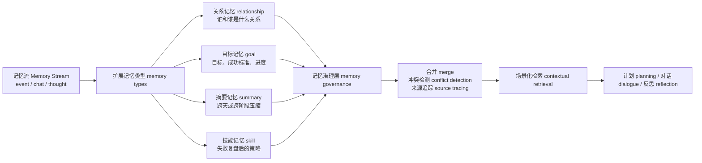
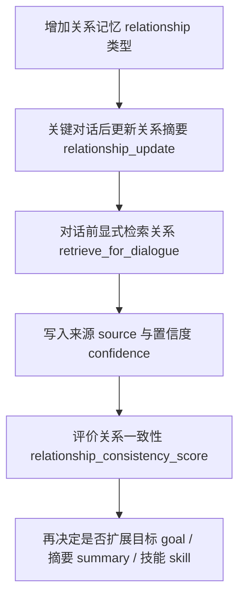

# 第 32 章 记忆系统升级：从记忆流 Memory Stream 到可管理长期记忆

## 32.1 当前记忆能保存事实，但还不能治理事实

`book-party-extended` 运行到 `20240214-17:00` 时，伊莎贝拉正在霍布斯咖啡馆迎接客人。这个断点适合作为记忆系统的体检现场：它证明当前项目已经能把行动、位置、对话和反思保存下来，也暴露出这些记忆还缺少治理字段和裁决机制。断点文件 `generative_agents/results/checkpoints/book-party-extended/simulate-20240214-1700.json` 里，她的记忆不是一个抽象概念，而是可数的本地状态：

| 抽样字段 | 真实值 | 证据意义 |
| --- | --- | --- |
| 时间 time | `20240214-17:00` | 记忆必须能回到具体仿真时间 simulation time。 |
| 当前行动 action | 在门口热情迎接到来的顾客，引导他们入座 | 记忆会影响角色下一步行动，而不是只用于问答。 |
| 位置 address | `the Ville:霍布斯咖啡馆:咖啡馆:咖啡馆顾客座位` | 记忆和地图 Maze、移动 movement、对话 conversation 必须能对齐。 |
| 记忆类型 memory types | `event, thought, chat` | 当前项目只有三类关联记忆 Associate 节点。 |
| 事件 event 数量 | `125` | 事件很多，长期运行会带来重复和检索噪声。 |
| 想法 thought 数量 | `18` | 反思已经写回记忆，但证据字段仍不完整。 |
| 聊天 chat 数量 | `9` | 对话能形成记忆，但关系 relationship 还不是稳定对象。 |
| 重要性累计 status.poignancy | `103` | 反思触发依赖重要性阈值，不是每条记忆都会立刻进入高层总结。 |

同一实验的强证据在 `conversation.json`。例如 `20240214-11:30`，伊莎贝拉明确邀请玛丽亚参加 17:00 的情人节派对：

| 角色 | 对话原文片段 |
| --- | --- |
| 伊莎贝拉 | 玛丽亚，今天的三明治看起来很美味呢！下午五点的情人节派对你一定要来哦，我已经准备好了一些特别的安排。 |
| 玛丽亚 | 哇，情人节派对？听起来太棒了！我五点刚好有休息时间，肯定会去参加的！ |
| 伊莎贝拉 | 我准备了情人节主题的特调饮品，还有新鲜出炉的爱心点心……到时候大家一定会喜欢的！ |

这个现场先给出一个判断：当前项目不是“没有记忆”。它已经能保存事件、对话和反思，也能在 checkpoint 与 `conversation.json` 里留下证据。真正的缺口是记忆治理 memory governance：系统保存了“下午五点邀请玛丽亚”，但没有把“承诺”“关系变化”“冲突裁决”“下游用途”变成可稳定检索和验证的对象。

| 追问问题 | 当前已有证据 | 当前缺口 | 对应升级方向 |
| --- | --- | --- | --- |
| 玛丽亚答应参加派对了吗？ | `conversation.json` 里有 11:30 的原始对话。 | 承诺只停留在聊天文本和摘要中，不能直接追到证据节点。 | 来源 source、证据 evidence |
| 玛丽亚和伊莎贝拉的关系是否变近？ | 对话、后续行动和反思可能包含线索。 | 关系 relationship 不是稳定记忆类型，容易被一次临时摘要覆盖。 | 关系记忆 relationship memory |
| 派对到底是 17:00 还是 19:00？ | 多条 event、chat 或 thought 可能各自保存时间信息。 | 系统没有冲突检测和裁决记录，互斥事实可能同时进入长期记忆。 | 冲突检测 conflict detection |
| 这条记忆以后服务计划、对话还是评价？ | 当前只有 `event/thought/chat` 三类节点。 | 记忆缺少下游用途 downstream use，检索时难以按任务选择。 | 场景化检索 contextual retrieval |

因此，本章的升级目标不是“多存一些记忆”，而是把重要记忆变成可追溯、可分类、可裁决、可复用的长期记忆 long-term memory。每条关键记忆至少要能说明来源 source、类型 type、可信度 confidence 和下游用途 downstream use。



*图 32-1：从记忆流 Memory Stream 到记忆治理层 memory governance 的演进。当前项目已经有 `event/chat/thought`，图中的 `relationship/goal/summary/skill` 是建议新增的治理类型，不是现有源码已经完成的字段。*


*图 32-2：长期记忆治理的真实存储剖面。画面把原始证据流、关联记忆 associate、向量嵌入 embedding、检索 retrieval、保留策略 retention 和审计标记放进同一个记忆库现场。当前项目已经有 `storage/<角色>/associate`、`docstore.json` 与向量索引；relationship、goal、summary、skill 等治理对象则是后续升级要新增的记忆层。*

## 32.2 高频术语锚点表

| 术语 | 项目读法 | 当前项目位置 | 行为影响 |
| --- | --- | --- | --- |
| 关联记忆 Associate | 每个角色的主观记忆容器和检索入口 | `generative_agents/modules/memory/associate.py` | 保存 `event/thought/chat` 节点，给计划、对话和反思提供上下文。 |
| 概念节点 Concept | 记忆节点的运行时包装对象 | `Concept.from_node()`、`Concept.from_event()` | 把 LlamaIndex 节点还原为带时间、类型、事件和重要性的对象。 |
| 事件 Event | 行动、观察或对象状态的结构化描述 | `generative_agents/modules/memory/event.py` | 提供 `subject/predicate/object/address/describe`，用于写入记忆和更新地图。 |
| LlamaIndex 索引框架 | 本项目使用的向量索引和文档存储封装 | `generative_agents/modules/storage/index.py` | 把自然语言记忆写成 `TextNode`，并保存正文、metadata 与向量检索结果。 |
| 向量索引 vector index | 让自然语言记忆可检索的索引 | `generative_agents/modules/storage/index.py` | 写入 `TextNode`，通过相似度召回相关记忆。 |
| 文档存储 docstore | LlamaIndex 保存节点正文和 metadata 的文件 | `storage/<角色>/associate/docstore.json` | 排查“记忆到底写了什么”的第一证据。 |
| 访问时间 access | 最近被检索或访问的时间 | `Concept.access`、node metadata | 参与新近度 recency 排序。 |
| 情感强度 poignancy | 事件或对话的重要性评分 | `poignancy_event.txt`、`poignancy_chat.txt` | 参与重要性 importance 排序，并推动反思阈值。 |
| 保留数量 retention | 普通检索返回的记忆数量上限 | `data/config.json` 的 `associate.retention` | 控制 `retrieve_events()`、`retrieve_thoughts()`、`retrieve_chats()` 的可见范围。 |
| 断点 checkpoint | 每一步仿真状态快照 | `results/checkpoints/<name>/simulate-*.json` | resume、排错和实验复盘的底层证据。 |
| 压缩结果 compressed result | 供阅读和回放的结果包 | `results/compressed/<name>/simulation.md`、`movement.json` | 适合书稿引用，但不替代 checkpoint。 |

这些术语共同指向一个边界：当前系统已经能把事件、对话和反思写入可检索的记忆流 memory stream，但长期运行需要的不只是“写进去”。关系要稳定，来源要可追，冲突要能裁决，摘要要能回到原始证据，跨实验迁移要能说明加载了什么旧记忆。当前实现的瓶颈如下。

## 32.3 当前实现的长期瓶颈

| 瓶颈 | 当前表现 | 源码或文件位置 | 失败模式 | 修正方向 |
| --- | --- | --- | --- | --- |
| 类型不足 | 只有 `event/thought/chat` | `Associate.__init__()`、`Associate.abstract()` | 关系、目标、摘要、技能都被挤进普通文本 | 增加有限记忆类型 memory types，并兼容旧 checkpoint。 |
| 证据未持久化 | `Agent.reflect()` 传入 `filling/evidence`，但 `Associate.add_node()` 未写入 metadata | `Agent.reflect()`、`Associate.add_node()` | 反思洞察无法追到具体证据节点 | 增加 `source_nodes`、`generated_by`、`confidence`。 |
| 关系不稳定 | `summarize_relation` 每次临时生成关系文本 | `Scratch.prompt_summarize_relation()` | 角色态度可能随一次对话漂移 | 引入结构化关系记忆 relationship memory。 |
| 重复记忆累积 | 日常动作反复进入 `event` | `Agent.percept()`、`docstore.json` | 检索噪声变大，重要事件被稀释 | 增加摘要 summary 和合并 merge 策略。 |
| 冲突无裁决 | 17:00 与 19:00 这类派对时间冲突没有专门处理 | 当前无专用模块 | 后续计划摇摆，错误信息被长期保存 | 增加冲突检测 conflict detection 和澄清记录。 |
| 检索场景单一 | `retrieve_focus()` 只查 `event + thought` | `associate.py` | 对话时缺关系，规划时缺目标，失败复盘时缺技能 | 增加场景化检索 contextual retrieval。 |
| 跨实验边界不清 | resume 支持旧 checkpoint，但没有长期记忆导入策略 | `start.py`、`get_config_from_log()` | 角色带入旧记忆后无法解释结果 | 长期记忆默认关闭，并在配置和报告中显式记录来源。 |

## 32.4 升级方向一：扩展记忆类型 memory types

第一步不需要重写整套系统，而是把硬编码的三类节点改成有限集合。

| 类型 | 中文用途 | 输入 input | 输出 output | 下游用途 |
| --- | --- | --- | --- | --- |
| `event` | 观察或行动事件 | 地图感知、行动状态 | 原始事件节点 | 计划、对话、反思 |
| `chat` | 对话摘要 | 对话记录 conversation | 聊天摘要节点 | 关系判断、后续对话 |
| `thought` | 反思想法 | 反思提示词 prompt 输出 | 高层认知节点 | 计划和对话上下文 |
| `relationship` | 稳定关系认知 | 对话、共同事件、反思 | 关系对象或关系摘要 | 对话语气、信任判断 |
| `goal` | 长期或阶段目标 | 角色任务、外部实验配置 | 目标状态 | 目标驱动规划 |
| `summary` | 压缩记忆 | 相似低价值事件集合 | 时间段摘要 | 降低检索噪声 |
| `skill` | 可复用经验 | 成功或失败复盘 | 策略片段 | 失败恢复和计划改进 |
| `conflict` | 冲突事实记录 | 新旧记忆不一致 | 待确认或已裁决冲突 | 防止错误记忆固化 |

建议先改 `generative_agents/modules/memory/associate.py`。这一步只扩展类型集合，不改变旧的 `event/chat/thought` 语义。

```diff
--- a/generative_agents/modules/memory/associate.py
+++ b/generative_agents/modules/memory/associate.py
@@
-class Associate:
+DEFAULT_MEMORY_TYPES = [
+    "event",
+    "chat",
+    "thought",
+    "relationship",
+    "goal",
+    "summary",
+    "skill",
+    "conflict",
+]
+
+
+class Associate:
@@
-        self.memory = memory or {"event": [], "thought": [], "chat": []}
+        self.memory = memory or {t: [] for t in DEFAULT_MEMORY_TYPES}
+        for t in DEFAULT_MEMORY_TYPES:
+            self.memory.setdefault(t, [])
@@
-        for t in ["event", "chat", "thought"]:
+        for t in DEFAULT_MEMORY_TYPES:
             des[t] = [self.find_concept(c).describe for c in self.memory[t]]
```

| 闭环项 | 说明 |
| --- | --- |
| 输入 input | 旧 checkpoint 的 `memory` 字典，可能只有 `event/thought/chat`。 |
| 处理 process | 新实验创建完整类型；旧实验用 `setdefault()` 补齐缺失键。 |
| 输出 output | 所有类型都有列表，旧结果可 resume，新类型可逐步启用。 |
| 失败模式 failure mode | 如果只改 `__init__()`，但 `abstract()` 仍写死三类，报告会漏掉新类型。 |
| 验证 validation | 用旧实验 `book-party-extended` resume 一步，确认没有 KeyError；检查 `simulate-*.json` 中新键存在且为空。 |

## 32.5 升级方向二：结构化关系记忆 relationship memory

当前关系是临时摘要。长期小镇实验更需要稳定关系对象。

```json
{
  "target": "山姆",
  "affinity": -2,
  "trust": 1,
  "familiarity": 4,
  "last_interaction": "2024-02-13 10:30",
  "summary": "汤姆对山姆竞选市长持怀疑态度。",
  "evidence": ["node_12", "node_45"]
}
```

| 字段 | 中文含义 | 输入来源 | 验证方式 |
| --- | --- | --- | --- |
| `target` | 关系对象 | 对话对象或事件主体 | 是否存在于角色列表 personas。 |
| `affinity` | 好感度 | 对话态度、历史事件 | 抽样对话语气是否一致。 |
| `trust` | 信任程度 | 承诺履行、冲突、拒绝 | 是否影响后续请求与接受。 |
| `familiarity` | 熟悉度 | 互动次数、共同事件 | 是否随多次对话上升。 |
| `last_interaction` | 最近互动时间 | `conversation.json` 时间键 | 能否回到原始对话时间。 |
| `summary` | 一句话关系摘要 | 关系更新 prompt | 是否与证据一致。 |
| `evidence` | 支撑节点 | `chat/event/thought` 节点 ID | `docstore.json` 是否能找到对应节点。 |

建议新增提示词 prompt 放在机制执行处，而不是附录：

| 项目 | 建议值 |
| --- | --- |
| 提示词 prompt 路径 | `generative_agents/data/prompts/relationship_update.txt` |
| 调用时机 | 一次关键对话结束后，`summarize_chats` 之后、`schedule_chat()` 写入关系前。 |
| 变量 variables | `current_relationship`、`recent_conversation`、`related_memories`、`agent`、`another`。 |
| 输出结构 schema | `affinity_delta: int`、`trust_delta: int`、`familiarity_delta: int`、`summary_update: str`、`evidence: list[str]`、`confidence: float`。 |
| 输出流向 | 写入 `relationship` 节点；对话前由 `retrieve_for_dialogue()` 显式取回。 |
| 失败回退 failsafe | 不更新 `affinity/trust`，只增加 `familiarity` 或保留旧关系。 |

关系变化必须有幅度限制。一句普通寒暄不能让 `affinity` 从 -3 跳到 +5；没有证据节点时，不应生成高置信度关系。

## 32.6 升级方向三：记忆合并 merge 与摘要 summary

长期运行会产生大量低价值重复事件。伊莎贝拉在咖啡馆的一上午可能连续出现：

| 原始事件 event | 是否适合合并 | 原因 |
| --- | --- | --- |
| 伊莎贝拉 打开咖啡馆大门并开灯 | 可合并 | 属于日常开店流程。 |
| 伊莎贝拉 检查并调试咖啡机 | 可合并 | 与开店准备同主题。 |
| 伊莎贝拉 摆放糕点并整理展示柜 | 可合并 | 与开店准备同主题。 |
| 伊莎贝拉 邀请玛丽亚 17:00 参加派对 | 不应简单合并 | 包含明确承诺和时间。 |
| 山姆表示 17:00 已和詹妮弗约好晚餐 | 不应简单合并 | 包含拒绝与冲突时间线。 |

合并机制的输入-处理-输出闭环：

| 闭环项 | 说明 |
| --- | --- |
| 输入 input | 新事件 event、相似旧事件、时间窗口、重要性 poignancy、是否包含承诺。 |
| 处理 process | 检索相似旧节点；判断是否低价值重复；生成 summary；保留原始 evidence。 |
| 输出 output | `summary` 节点与 `source_nodes`；原始节点可设置更短过期时间。 |
| 失败模式 failure mode | 把承诺、拒绝、地点、时间压缩掉，导致后续行动丢失关键约束。 |
| 验证 validation | 抽样 summary，检查是否能追回所有 source nodes；检查承诺类事件是否未被错误合并。 |

建议新增 `memory_merge.txt`，变量包括 `new_memory`、`similar_memories`、`merge_policy`，输出结构 schema 包括 `should_merge: bool`、`summary: str`、`source_nodes: list[str]`、`drop_after: str 或 null`、`reason: str`。

## 32.7 升级方向四：冲突检测 conflict detection

长期记忆最危险的不是忘记，而是把冲突事实都当真。例如：

| 冲突类型 | 例子 | 行为风险 |
| --- | --- | --- |
| 时间冲突 time conflict | 派对时间是 17:00；派对时间是 19:00 | 角色到错时间，评价误判。 |
| 关系冲突 relationship conflict | 汤姆不信任山姆；汤姆非常支持山姆 | 对话态度摇摆。 |
| 承诺冲突 commitment conflict | 玛丽亚答应参加；玛丽亚同一时间有考试 | 计划和移动证据不一致。 |
| 位置冲突 location conflict | 克劳斯说在图书馆；movement 显示在宿舍 | 报告可能把摘要当强证据。 |

冲突检测闭环：

| 闭环项 | 说明 |
| --- | --- |
| 输入 input | 新记忆、同主题旧记忆、来源类型、时间戳、置信度。 |
| 处理 process | 检索同主题节点；判断是否互斥；生成 `conflict` 节点或澄清 `thought`。 |
| 输出 output | `conflict` 记忆，字段包含 `claim_a`、`claim_b`、`source_nodes`、`resolution_status`。 |
| 失败模式 failure mode | 过度检测会把自然变化误判成矛盾；检测不足会让错误记忆长期污染。 |
| 验证 validation | 人工抽样冲突节点，回到 `conversation.json` 和 `movement.json` 判定是否真实冲突。 |

建议新增 `memory_conflict_check.txt`，输出结构 schema 至少包含 `has_conflict: bool`、`conflict_type: str`、`summary: str`、`evidence: list[str]`、`need_clarification: bool`。

## 32.8 升级方向五：跨实验长期记忆 long-term memory

跨实验记忆能把项目从“单次小镇故事生成器”推进为“长期角色实验平台”，但默认必须关闭。原因很简单：跨实验记忆会改变可复现性 reproducibility。

| 设计项 | 建议 |
| --- | --- |
| 默认状态 | 关闭，不自动加载历史实验记忆。 |
| 建议路径 | `generative_agents/results/long_term_memory/<角色名>/` 或 `generative_agents/data/long_term_memory/<角色名>/`。 |
| 启用方式 | 增加显式命令行参数，例如 `--load-long-term-memory baseline-1`。 |
| 当前边界 | 现有 `start.py` 只解析 `--name`、`--start`、`--resume`、`--step`、`--stride`、`--agent-count`、`--agents`、`--verbose`、`--log`，尚不支持该参数。 |
| 必须记录 | 来源实验名、角色名、加载节点数、加载时间、配置版本。 |
| 报告要求 | `simulation.md` 和指标报告必须说明本轮加载了哪一轮长期记忆。 |

输入-处理-输出闭环：

| 闭环项 | 说明 |
| --- | --- |
| 输入 input | 旧实验的 `Associate` 存储、角色名、加载策略、过滤规则。 |
| 处理 process | 读取旧 `docstore.json` 与 memory 字典；过滤过期、低置信和冲突节点；写入本轮 `Associate`。 |
| 输出 output | 本轮 checkpoint 中带 `loaded_from` 的长期记忆节点。 |
| 失败模式 failure mode | 角色突然提到上一轮实验信息，被误判为幻觉；或者错误记忆跨实验污染。 |
| 验证 validation | 新实验报告列出加载源；抽样长期记忆检查 source experiment 和 source node。 |

## 32.9 升级方向六：来源 source 与置信度 confidence

高级记忆必须知道自己从哪里来。当前第 18 章证据文件已经指出一个边界：`Agent.reflect()` 会把 evidence 传入 `_add_concept()`，但 `Associate.add_node()` 没有把 `filling/evidence` 持久化到 metadata。升级时应补上来源字段。

```json
{
  "source_nodes": ["node_12", "node_19"],
  "source_type": "conversation",
  "confidence": 0.82,
  "generated_by": "relationship_update",
  "created_at": "2024-02-13 10:30",
  "last_verified_at": "2024-02-14 17:00",
  "conflict_with": []
}
```

| 字段 | 作用 | 失败时怎么查 |
| --- | --- | --- |
| `source_nodes` | 回到原始 `event/chat/thought` | `docstore.json` 是否存在这些 node。 |
| `source_type` | 区分 conversation、movement、reflection、manual | 判断证据强弱。 |
| `confidence` | 表示模型生成记忆的可信程度 | 高置信但无证据时降级。 |
| `generated_by` | 标记来自哪个机制或 prompt | 排查是 relation、summary 还是 conflict 生成错误。 |
| `last_verified_at` | 最近被复核的时间 | 长期未验证的记忆降低权重。 |
| `conflict_with` | 指向冲突节点 | 防止互斥事实同时作为强证据。 |

这些字段会增加存储成本，但能显著降低“幻觉被正式保存”的风险。

## 32.10 升级方向七：场景化检索 contextual retrieval

不同任务需要不同记忆。当前 `retrieve_focus()` 主要面向事件 event 和想法 thought，不能覆盖所有场景。

| 场景 | 应检索的记忆 | 建议接口 | 下游 prompt |
| --- | --- | --- | --- |
| 对话 dialogue | `relationship + recent chat + relevant event` | `retrieve_for_dialogue(target_name, context)` | `generate_chat.txt` |
| 规划 planning | `goal + summary + relevant event + skill` | `retrieve_for_planning(goal)` | `schedule_daily.txt` 或未来 `goal_plan.txt` |
| 反思 reflection | `high poignancy event + thought + conflict` | `retrieve_for_reflection(focus)` | `reflect_focus.txt`、`reflect_insights.txt` |
| 反应 reaction | `event + relationship + current action` | `retrieve_for_reaction(observation)` | `decide_chat.txt`、`decide_wait.txt` |
| 失败复盘 recovery | `failed action + skill + similar past attempts` | `retrieve_for_recovery(outcome)` | 未来 `lesson_extract.txt` |

| 闭环项 | 说明 |
| --- | --- |
| 输入 input | 任务场景、焦点文本、角色状态、候选记忆类型。 |
| 处理 process | 按场景选择类型、权重、数量和时间窗口，再调用底层向量检索。 |
| 输出 output | 面向任务的记忆包 memory bundle，而不是一个无差别节点列表。 |
| 失败模式 failure mode | 对话缺关系、规划缺目标、反思缺失败证据，导致 prompt 只能“自由发挥”。 |
| 验证 validation | 抽样每个场景的检索结果，人工标注相关/无关，计算检索精度 retrieval_precision_sampled。 |

## 32.11 升级后的评价指标 evaluation metrics

记忆升级必须被评价。指标不必一开始全部自动化，但每项都要能回到项目证据。

| 指标 metric | 中文含义 | 证据路径 | 判断问题 |
| --- | --- | --- | --- |
| 记忆引用准确率 memory_reference_accuracy | 角色引用过去经历时事实是否正确 | `conversation.json`、`docstore.json`、`simulation.md` | 引用的是事实还是幻觉。 |
| 来源追踪率 source_trace_rate | 高级记忆是否有来源节点 | 新增 metadata、`docstore.json` | 关系/摘要/技能是否可追溯。 |
| 关系一致性 relationship_consistency_score | 关系状态是否跨对话稳定 | `relationship` 节点、后续对话 | 角色态度是否无故摇摆。 |
| 记忆冗余率 memory_redundancy_rate | 相似低价值记忆重复比例 | `docstore.json` 抽样 | 是否需要合并 summary。 |
| 冲突检测数 conflict_detection_count | 检测到多少事实冲突 | `conflict` 节点 | 系统是否发现问题。 |
| 冲突处理质量 conflict_resolution_quality | 冲突是否被合理处理 | `conflict` 节点和原始证据 | 是否误删或误信。 |
| 检索抽样精度 retrieval_precision_sampled | 召回记忆是否和任务相关 | 检索日志或脚手架输出 | 检索是否噪声过大。 |
| 长期迁移成功率 long_term_transfer_success | 跨实验记忆是否正确影响行为 | 长期记忆源、后续行动和对话 | 旧经验是否被合理使用。 |

这些指标后续应进入第 37 章的统一 `metrics.json` 和 `report.md`。

## 32.12 最小可行升级方案

记忆系统最小可行升级不应一次性实现 MemGPT 或 Mem0 的全部思想。先做关系记忆 relationship memory 更稳，因为它直接影响小镇对话和社会行为。

| 步骤 | 输入 input | 处理 process | 输出 output | 失败模式 | 验证方式 |
| --- | --- | --- | --- | --- | --- |
| 1. 增加 `relationship` 类型 | 旧 `Associate.memory`、新类型常量 | 用 `DEFAULT_MEMORY_TYPES` 初始化并兼容旧 checkpoint | checkpoint 中出现空 `relationship` 列表 | 旧实验 resume 报错 | 用 `book-party-extended` resume 一步。 |
| 2. 新增关系更新 prompt | 当前关系、最近对话、相关记忆 | `relationship_update.txt` 输出 delta、summary、evidence、confidence | `relationship` 节点 | 普通寒暄导致关系大幅跳变 | 抽样汤姆-山姆、玛丽亚-克劳斯、伊莎贝拉-玛丽亚关系。 |
| 3. 对话前显式检索关系 | 对话对象 target、当前情境 context | `retrieve_for_dialogue()` 先取 relationship，再取 chat/event | `generate_chat.txt` 的 memory 更有结构 | 关系记忆压过当前情境 | 对比升级前后对话自然性和一致性。 |
| 4. 报告中展示证据 | `relationship` 节点和 `source_nodes` | 压缩报告或指标脚本列出关系变化 | `metrics.json` / `report.md` 增加关系证据卡 | 只有分数没有原文证据 | 抽样检查每条关系变化能回到 `conversation.json`。 |



*图 32-3：最小可行记忆升级路径。先做关系记忆，是因为它能用现有 `conversation.json` 和对话 prompt 直接验证。*

## 32.13 风险与边界

| 风险 | 表现 | 检查位置 | 修正方向 |
| --- | --- | --- | --- |
| 错误记忆长期保存 | 角色反复引用不存在的经历 | `docstore.json`、`source_nodes` | 降低置信度、增加过期和删除机制。 |
| 关系标签固化偏见 | 一次负面对话永久定义关系 | `relationship` 历史、对话原文 | 限制 delta 幅度，保留历史证据。 |
| 跨实验污染 | 新实验无法解释旧信息来源 | 长期记忆加载日志、`simulation.md` | 默认关闭，启用时写明来源。 |
| 来源不清增强幻觉 | 模型生成内容变成正式记忆 | metadata 中 `source_nodes` 为空 | 高级记忆必须有来源或降级为低置信。 |
| 隐私和敏感内容 | 长期记忆保存私人信息 | 记忆导出和报告 | 增加删除能力、脱敏策略和可见范围。 |
| 评价误判 | 摘要说成功，但 movement 没到场 | `movement.json`、`conversation.json`、`simulation.md` | 证据强弱分层，不能把摘要当强证据。 |

可治理记忆 memory governance 的底线是：保存得越久，越要能解释为什么保存、从哪里来、什么时候该忘、出错后如何回滚。

## 32.14 本章小结

记忆升级从抽象概念落回当前项目：`Associate` 保存三类记忆，`LlamaIndex` 负责向量索引，提示词 prompt 负责评分、关系摘要、对话和反思，断点 checkpoint 负责持久化。长期记忆治理 memory governance 的核心不是把记忆存得更多，而是让记忆有类型、来源、置信度、冲突处理和场景化检索。

| 主题 | 核心结论 |
| --- | --- |
| 真实现场 | `book-party-extended` 证明当前项目已经有大量 `event/thought/chat`，但缺少关系、目标、摘要、技能等高级记忆对象。 |
| 当前实现 | `Associate`、`Concept`、`Event` 和 `LlamaIndex` 组成记忆流 memory stream。 |
| 提示词 prompt 链路 | `poignancy_*`、`summarize_relation`、`generate_chat`、`reflect_*` 共同影响记忆写入和使用。 |
| 检索机制 | 当前检索叠加新近度 recency、相关性 relevance 和重要性 importance，但 `retrieve_focus()` 默认只查 `event + thought`。 |
| 关键瓶颈 | 类型不足、证据未持久化、关系不稳定、重复记忆、冲突无裁决、跨实验边界不清。 |
| 可落地升级 | 先扩展 memory types，再做关系记忆、来源字段、冲突检测、摘要合并和场景化检索。 |
| 最小方案 | 从 `relationship` 记忆开始，因为它能直接用现有对话证据验证。 |
| 风险边界 | 记忆越强，越要重视幻觉、偏见、隐私、可复现性和回滚能力。 |

下一章讨论反思系统升级。记忆让角色保存经历，反思让角色理解经历；而 2023-2026 年的新方向进一步要求智能体 agent 能从失败中学习，并把经验 lesson 变成可复用技能 skill。

## 参考资料

- 生成式智能体 Generative Agents: https://arxiv.org/abs/2304.03442
- MemGPT: https://arxiv.org/abs/2310.08560
- Mem0: https://arxiv.org/abs/2504.19413
- Local source: `generative_agents/modules/memory/associate.py`
- Local source: `generative_agents/modules/storage/index.py`
- Local source: `generative_agents/modules/memory/event.py`
- Local source: `generative_agents/modules/agent.py`
- Local prompt: `generative_agents/data/prompts/poignancy_event.txt`
- Local prompt: `generative_agents/data/prompts/poignancy_chat.txt`
- Local prompt: `generative_agents/data/prompts/summarize_relation.txt`
- Local prompt: `generative_agents/data/prompts/generate_chat.txt`
- Local prompt: `generative_agents/data/prompts/reflect_focus.txt`
- Local prompt: `generative_agents/data/prompts/reflect_insights.txt`
- Local config: `generative_agents/data/config.json`
- Local evidence: `generative_agents/results/checkpoints/book-party-extended/simulate-20240214-1700.json`
- Local evidence: `generative_agents/results/checkpoints/book-party-extended/conversation.json`
- Local evidence: `generative_agents/results/checkpoints/book-party-extended/storage/伊莎贝拉/associate/docstore.json`
- Local evidence: `docs/book/assets/chapter_18/ch18_memory_trace.json`
- Local evidence: `docs/book/assets/chapter_32/ch32_memory_governance_board.png`
