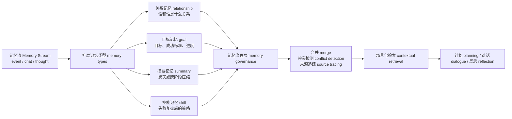
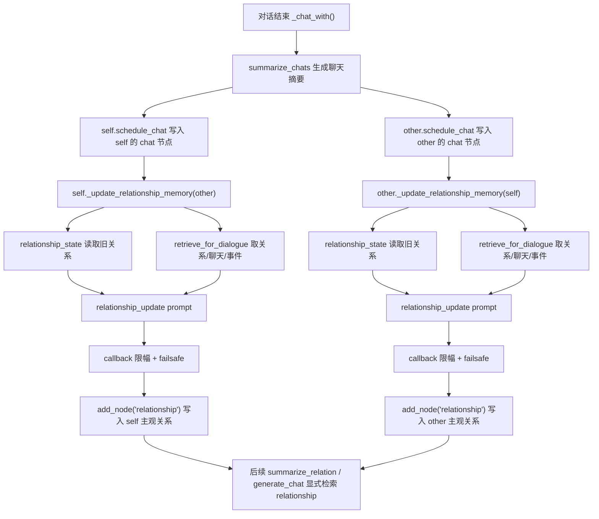
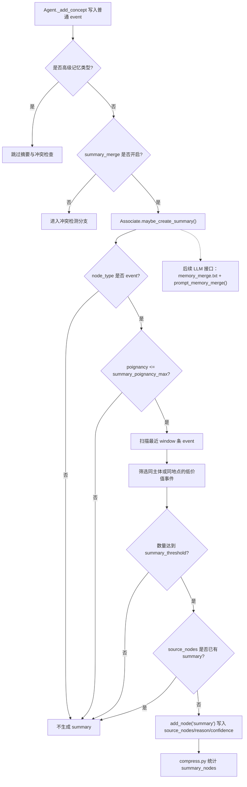
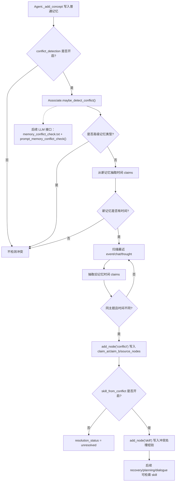
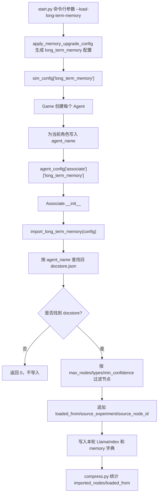
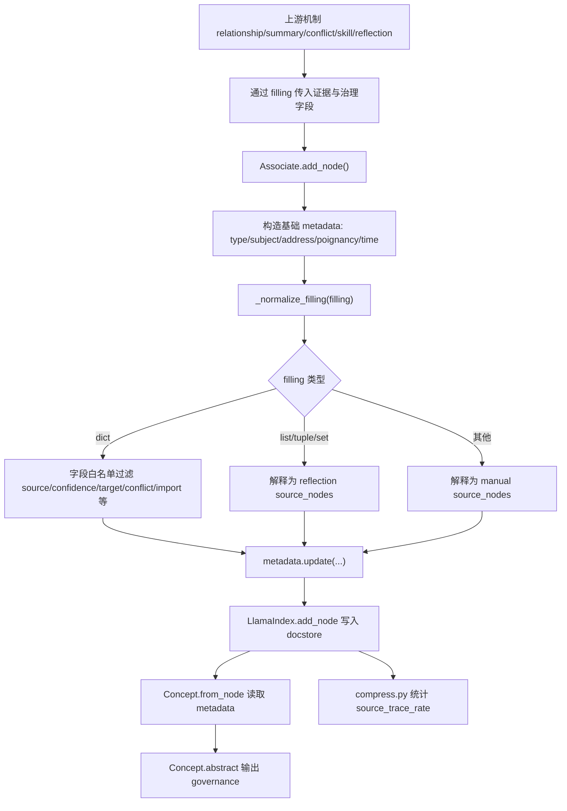
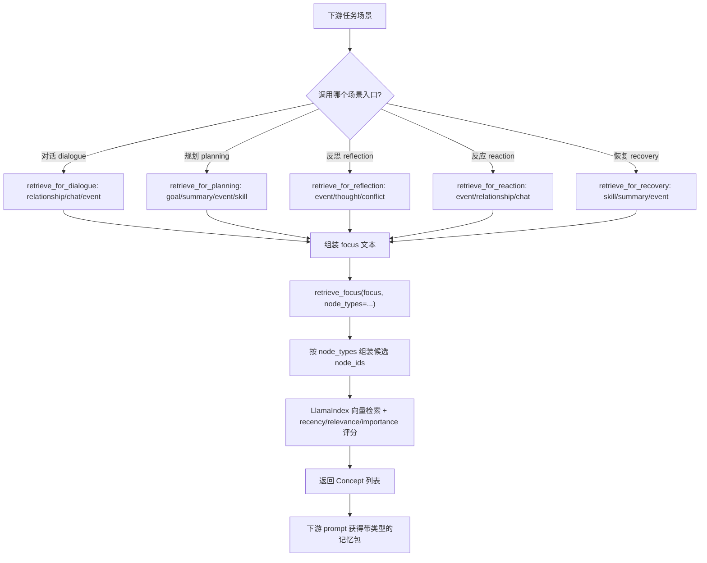
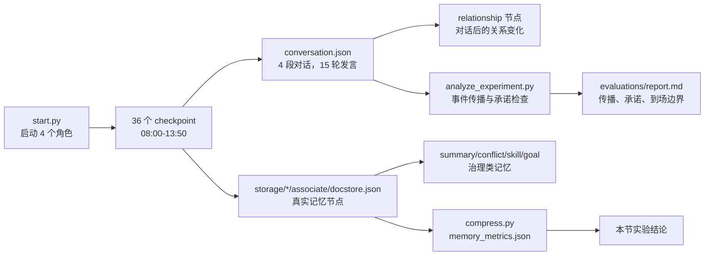

# 第 32 章 记忆系统升级：从记忆流 Memory Stream 到可管理长期记忆

## 32.1 当前记忆能保存事实，但还不能治理事实

当前项目不是“没有记忆”，它已经能保存事件、对话和反思，也能在 `checkpoint` 与 `conversation.json` 里留下证据。真正的缺口是记忆治理 memory governance：系统保存了“下午五点邀请玛丽亚”，但没有把“承诺”、“关系变化”、“冲突裁决”、“下游用途”变成可稳定检索和验证的对象。

| 追问问题 | 当前已有证据 | 当前缺口 | 对应升级方向 |
| --- | --- | --- | --- |
| 玛丽亚答应参加派对了吗？ | `conversation.json` 里有 11:30 的原始对话。 | 承诺只停留在聊天文本和摘要中，不能直接追到证据节点。 | 来源 source、证据 evidence |
| 玛丽亚和伊莎贝拉的关系是否变近？ | 对话、后续行动和反思可能包含线索。 | 关系 relationship 不是稳定记忆类型，容易被一次临时摘要覆盖。 | 关系记忆 relationship memory |
| 派对到底是 17:00 还是 19:00？ | 多条 event、chat 或 thought 可能各自保存时间信息。 | 系统没有冲突检测和裁决记录，互斥事实可能同时进入长期记忆。 | 冲突检测 conflict detection |
| 这条记忆以后服务计划、对话还是评价？ | 当前只有 `event/thought/chat` 三类节点。 | 记忆缺少下游用途 downstream use，检索时难以按任务选择。 | 场景化检索 contextual retrieval |

因此，本章的升级目标不是“多存一些记忆”，而是把重要记忆变成可追溯、可分类、可裁决、可复用的长期记忆 long-term memory。每条关键记忆至少要能说明来源 source、类型 type、可信度 confidence 和下游用途 downstream use。

### 论文依据与工程落点

通过洞察多篇前沿论文，将识别到的 长期记忆、关系结构、动态检索和可验证评价 落到 `generative_agents_next` 项目。

| 升级方向 | 论文名称 | 论文原文要点 | 本项目结论 |
| --- | --- | --- | --- |
| 记忆流基线 memory stream | Generative Agents: Interactive Simulacra of Human Behavior | 论文把智能体架构概括为保存经历、生成 `higher-level reflections`，并动态检索来计划行为。 | 当前 `event/chat/thought` 是基线，不应直接推翻；升级应在 `Associate` 上增加治理类型，而不是重写整套仿真循环。 |
| 扩展记忆类型 memory types | MemGPT: Towards LLMs as Operating Systems | 论文提出 `virtual context management`，并让系统管理 `different memory tiers`。 | `Associate` 不应只有三类自然语言节点；工作记忆、长期记忆、摘要、技能和冲突需要分层或分类型保存。 |
| 记忆合并与摘要 merge / summary | Mem0: Building Production-Ready AI Agents with Scalable Long-Term Memory | 论文强调从对话中动态 `extracting, consolidating, and retrieving` 关键信息。 | 日常重复事件不应全部平铺进检索结果；低价值重复事件要合并为 `summary`，同时保留 `source_nodes`。 |
| 记忆保留与遗忘 retention / forgetting | MemoryBank: Enhancing Large Language Models with Long-Term Memory | 论文强调 `summon relevant memories`、`continuous memory updates`，并允许系统 `forget and reinforce memory`。 | 本章的摘要合并还只是第一步；后续应继续增加过期、降权、强化和删除策略，避免旧记忆长期污染。 |
| 结构化关系记忆 relationship memory | Mem0: Building Production-Ready AI Agents with Scalable Long-Term Memory | 论文进一步提出图结构记忆，用来捕捉对话元素之间的复杂关系。 | 伊莎贝拉和玛丽亚的关系不能只靠一次 `summarize_relation` 临时生成；需要写入 `relationship` 节点，记录对象、强度、证据和置信度。 |
| 来源与结构化属性 source / metadata | A-MEM: Agentic Memory for LLM Agents | 论文为新记忆生成包含 `contextual descriptions, keywords, and tags` 的结构化笔记，并建立动态链接。 | 高级记忆必须带 metadata：核心字段是 `source_nodes/source_type/generated_by/downstream_use`，发生冲突时再写入 `conflict_with`。 |
| 冲突检测 conflict detection | Evaluating Very Long-Term Conversational Memory of LLM Agents | LoCoMo 构造最多 35 个会话的长期对话，并指出模型理解 `long-range temporal and causal dynamics` 仍然困难。 | 派对时间、承诺、位置和关系变化必须有 `conflict` 节点。冲突字段是本项目的工程扩展，用来把时间/因果错误显式暴露出来。 |
| 跨实验长期记忆 long-term memory | MemGPT: Towards LLMs as Operating Systems；Mem0: Building Production-Ready AI Agents with Scalable Long-Term Memory | 两篇论文都把多轮、多会话场景作为长期记忆的核心压力测试。 | `--resume` 不是长期记忆迁移；跨实验加载必须显式传参，并记录 `loaded_from/source_experiment/source_node_id`。 |
| 场景化检索 contextual retrieval | Generative Agents: Interactive Simulacra of Human Behavior；Mem0: Building Production-Ready AI Agents with Scalable Long-Term Memory | 前者用动态检索支撑计划和行为，后者比较不同问题类型下的长期记忆效果。 | 对话、规划、反思、反应和失败复盘不应共用一个无差别检索入口；需要 `retrieve_for_dialogue/planning/reflection/reaction/recovery`。 |



*图 32-1：从记忆流 Memory Stream 到记忆治理层 memory governance 的演进。原始 `generative_agents` 已经有 `event/chat/thought`；升级目录 `generative_agents_next` 在此基础上增加 `relationship/goal/summary/skill/conflict`，并把来源 source、置信度 confidence 和下游用途 downstream use 写入 metadata。*


*图 32-2：长期记忆治理的真实存储剖面。画面把原始证据流、关联记忆 associate、向量嵌入 embedding、检索 retrieval、保留策略 retention 和审计标记放进同一个记忆库现场。当前项目已经有 `storage/<角色>/associate`、`docstore.json` 与向量索引；relationship、goal、summary、skill 等治理对象则是后续升级要新增的记忆层。*

## 32.3 当前实现的瓶颈

| 瓶颈 | 当前表现 | 源码或文件位置 | 失败模式 | 修正方向 |
| --- | --- | --- | --- | --- |
| 类型不足 | 只有 `event/thought/chat` | `Associate.__init__()`、`Associate.abstract()` | 关系、目标、摘要、技能都被挤进普通文本 | 增加有限记忆类型 memory types，并兼容旧 checkpoint。 |
| 证据未持久化 | `Agent.reflect()` 传入 `filling/evidence`，但 `Associate.add_node()` 未写入 metadata | `Agent.reflect()`、`Associate.add_node()` | 反思洞察无法追到具体证据节点 | 增加 `source_nodes`、`generated_by`、`confidence`。 |
| 关系不稳定 | `summarize_relation` 每次临时生成关系文本 | `Scratch.prompt_summarize_relation()` | 角色态度可能随一次对话漂移 | 引入结构化关系记忆 relationship memory。 |
| 重复记忆累积 | 日常动作反复进入 `event` | `Agent.percept()`、`docstore.json` | 检索噪声变大，重要事件被稀释 | 增加摘要 summary 和合并 merge 策略。 |
| 冲突无裁决 | 17:00 与 19:00 这类派对时间冲突没有专门处理 | 当前无专用模块 | 后续计划摇摆，错误信息被长期保存 | 增加冲突检测 conflict detection 和澄清记录。 |
| 检索场景单一 | `retrieve_focus()` 只查 `event + thought` | `associate.py` | 对话时缺关系，规划时缺目标，失败复盘时缺技能 | 增加场景化检索 contextual retrieval。 |
| 跨实验边界不清 | resume 支持旧 checkpoint，但没有长期记忆导入策略 | `start.py`、`get_config_from_log()` | 角色带入旧记忆后无法解释结果 | 长期记忆默认关闭，并在配置和报告中显式记录来源。 |

## 32.4 升级方向一：扩展记忆类型 memory types

第一步不需要重写整套系统，而是把硬编码的三类节点改成有限集合。

| 类型 | 中文用途 | 输入 input | 输出 output | 下游用途 |
| --- | --- | --- | --- | --- |
| `event` | 观察或行动事件 | 地图感知、行动状态 | 原始事件节点 | 计划、对话、反思 |
| `chat` | 对话摘要 | 对话记录 conversation | 聊天摘要节点 | 关系判断、后续对话 |
| `thought` | 反思想法 | 反思提示词 prompt 输出 | 高层认知节点 | 计划和对话上下文 |
| `relationship` | 稳定关系认知 | 对话、共同事件、反思 | 关系对象或关系摘要 | 对话语气、信任判断 |
| `goal` | 长期或阶段目标 | 角色任务、外部实验配置 | 目标状态 | 目标驱动规划 |
| `summary` | 压缩记忆 | 相似低价值事件集合 | 时间段摘要 | 降低检索噪声 |
| `skill` | 可复用经验 | 成功或失败复盘 | 策略片段 | 失败恢复和计划改进 |
| `conflict` | 冲突事实记录 | 新旧记忆不一致 | 待确认或已裁决冲突 | 防止错误记忆固化 |

实际改动落在 `generative_agents_next/modules/memory/associate.py`。这一步只扩展类型集合，不改变旧的 `event/chat/thought` 语义。

```diff
--- a/generative_agents_next/modules/memory/associate.py
+++ b/generative_agents_next/modules/memory/associate.py
@@
-class Associate:
+DEFAULT_MEMORY_TYPES = [
+    "event",
+    "chat",
+    "thought",
+    "relationship",
+    "goal",
+    "summary",
+    "skill",
+    "conflict",
+]
+
+
+class Associate:
@@
-        self.memory = memory or {"event": [], "thought": [], "chat": []}
+        self.memory = memory or {t: [] for t in DEFAULT_MEMORY_TYPES}
+        for t in DEFAULT_MEMORY_TYPES:
+            self.memory.setdefault(t, [])
@@
-        for t in ["event", "chat", "thought"]:
+        for t in DEFAULT_MEMORY_TYPES:
             des[t] = [self.find_concept(c).describe for c in self.memory[t]]
```

## 32.5 升级方向二：结构化关系记忆 relationship memory

`generative_agents`中没有稳定的关系节点，角色对另一个人的印象主要通过 `Scratch.prompt_summarize_relation()` 在对话前临时生成，这段关系文本不会作为独立 `relationship` 记忆写入长期存储。本章节会在一次对话结束后，双方各自把本次 `chat` 节点作为证据，写入自己的结构化关系记忆 relationship memory。

关系记忆不是单独保存到 `relationship.json`，而是和其他记忆一样写入每个角色自己的 LlamaIndex docstore。实际路径由实验名和角色名决定：

```text
generative_agents_next/results/checkpoints/<实验名>/storage/<角色>/associate/docstore.json
```

最新 checkpoint 的 `simulate-*.json` 里还会保存关系节点 ID：

```text
agents.<角色>.associate.memory.relationship
```

本轮 `book-memory-governance-full` 实验中，伊莎贝拉对玛丽亚的关系节点摘录，来自：

```text
generative_agents_next/results/checkpoints/book-memory-governance-full/storage/伊莎贝拉/associate/docstore.json
```

```json
{
  "node_id": "node_110",
  "text": "伊莎贝拉 对 玛丽亚 的关系：伊莎贝拉与玛丽亚就情人节派对持续互动交流，玛丽亚确认将直播后来捧场，伊莎贝拉热情介绍派对活动并提供玫瑰拿铁专属优惠，双方关系进一步向熟悉的友好顾客迈进。 好感 3，信任 1，熟悉度 4。",
  "metadata": {
    "node_type": "relationship",
    "target": "玛丽亚",
    "affinity": 3,
    "trust": 1,
    "familiarity": 4,
    "last_interaction": "20240214-13:00:00",
    "summary": "伊莎贝拉与玛丽亚就情人节派对持续互动交流，玛丽亚确认将直播后来捧场，伊莎贝拉热情介绍派对活动并提供玫瑰拿铁专属优惠，双方关系进一步向熟悉的友好顾客迈进。",
    "source_nodes": ["node_107"],
    "source_type": "conversation",
    "confidence": 0.65,
    "generated_by": "relationship_update",
    "downstream_use": "dialogue,planning,reflection"
  }
}
```

这条记录能沿着 `source_nodes=["node_107"]` 回到同一个 `docstore.json` 中的聊天摘要节点，再回到 `conversation.json` 的 `20240214-13:00` 原始对话。`relationship_state()` 对外返回的 `evidence` 字段不是另一个落盘字段，而是从 metadata 里的 `source_nodes` 转出来，方便提示词读取。

| 字段 | 中文含义 | 生成位置 | 落盘位置 | 验证方式 |
| --- | --- | --- | --- | --- |
| `node_type` | 记忆类型 | `associate.add_node("relationship", ...)` | `docstore.json` 的 `metadata.node_type` | 是否等于 `relationship`。 |
| `target` | 关系对象 | `Agent._update_relationship_memory(other, ...)` 的 `other.name` | `metadata.target` | 是否是本次对话对象。 |
| `affinity` | 好感度 | 当前关系值 + `relationship_update` 的 `affinity_delta` | `metadata.affinity` | 是否在多轮对话中合理变化。 |
| `trust` | 信任程度 | 当前关系值 + `relationship_update` 的 `trust_delta` | `metadata.trust` | 是否只因承诺、帮助、拒绝、冲突等强事件变化。 |
| `familiarity` | 熟悉度 | 当前关系值 + `relationship_update` 的 `familiarity_delta` | `metadata.familiarity` | 是否随互动次数上升。 |
| `last_interaction` | 最近互动时间 | 写入关系节点时的 simulation timer | `metadata.last_interaction` | 是否能对上 `conversation.json` 的对话时间。 |
| `summary` | 一句话关系摘要 | `relationship_update.txt` 的 `summary_update` | `metadata.summary` | 是否与原始对话一致。 |
| `source_nodes` | 支撑节点 | 本次 `schedule_chat()` 返回的 `chat_node.node_id`，以及 prompt 回填证据 | `metadata.source_nodes` | 是否能在同一角色 `docstore.json` 中找到。 |
| `confidence` | 置信度 | `relationship_update` 输出，经 callback 限幅 | `metadata.confidence` | 是否在 0 到 1 之间。 |
| `generated_by` | 生成模块 | 固定写入 `relationship_update` | `metadata.generated_by` | 是否能区分普通事件和关系更新。 |
| `downstream_use` | 下游用途 | 固定写入 `dialogue,planning,reflection` | `metadata.downstream_use` | 是否能被对话、规划、反思检索使用。 |

代码改动分成五处：新增提示词 prompt、扩展提示词包装函数、在对话结束后调用关系更新、把关系写成 `relationship` 节点、在后续对话检索中显式取回关系记忆。



*图 32-3：结构化关系记忆的写入与取回流程。关系更新不是直接改一张全局关系表，而是双方各自把本次 `chat` 节点作为证据，写入自己的 `relationship` 主观记忆。*

### 关系更新提示词 prompt

相对路径：`generative_agents_next/data/prompts/relationship_update.txt`

```text
$base_desc

现在需要更新 $agent 对 $another 的长期关系记忆。

当前关系状态：
$current_relationship

最近一次对话：
$recent_conversation

相关历史记忆：
$related_memories

可引用的来源节点：
$source_nodes

请只根据最近对话和相关历史记忆判断关系变化，不要凭空补充事件。
普通寒暄只能带来很小变化；明确承诺、帮助、拒绝、冲突、道歉或信任表达才可以改变好感与信任。

请输出 JSON，字段放在 res 中：
{
  "res": {
    "affinity_delta": -2 到 2 的整数,
    "trust_delta": -2 到 2 的整数,
    "familiarity_delta": 0 到 3 的整数,
    "summary_update": "一句话说明 $agent 对 $another 的关系变化",
    "evidence": ["来源节点 ID"],
    "confidence": 0 到 1 的小数
  }
}
```

这个模板解决三件事。

第一，输入不是一段裸对话，而是 `current_relationship`、`recent_conversation`、`related_memories` 和 `source_nodes` 的组合。模型必须看到当前关系状态，才能判断这次对话是轻微熟悉、信任上升，还是关系冲突。

第二，模板明确禁止“凭空补充事件”。关系记忆最容易出错的地方，是模型把礼貌寒暄写成亲密关系。这里把可改变关系的事件限定为明确承诺、帮助、拒绝、冲突、道歉或信任表达。

第三，输出被限制成增量 delta，而不是直接生成最终关系。`affinity_delta` 和 `trust_delta` 的范围是 `-2` 到 `2`，`familiarity_delta` 的范围是 `0` 到 `3`。普通寒暄不能让一个角色从讨厌对方突然变成信任对方。

### Scratch 包装函数

相对路径：`generative_agents_next/modules/prompt/scratch.py`

```diff
+def prompt_relationship_update(
+    self,
+    agent,
+    other,
+    current_relationship,
+    recent_conversation,
+    related_memories,
+    source_nodes=None,
+):
+    conversation = "\n".join("{}: {}".format(n, u) for n, u in recent_conversation)
+    memories = "\n".join(
+        [
+            "{}. [{}] {}".format(idx, node.node_type, node.describe)
+            for idx, node in enumerate(related_memories)
+        ]
+    ) or "暂无相关记忆。"
+    source_nodes = source_nodes or []
+
+    prompt = self.build_prompt(
+        "relationship_update",
+        {
+            "base_desc": self._base_desc(),
+            "agent": agent.name,
+            "another": other.name,
+            "current_relationship": utils.dump_dict(current_relationship),
+            "recent_conversation": conversation,
+            "related_memories": memories,
+            "source_nodes": ", ".join(source_nodes) or "无",
+        }
+    )
```

这里的优化不是“多加一个 prompt 文件”那么简单。`Scratch.prompt_relationship_update()` 负责把运行时对象转成模板变量：`current_relationship` 来自当前长期关系状态，`recent_conversation` 是刚结束的对话原文，`related_memories` 是与对方相关的历史记忆，`source_nodes` 是本次聊天节点 ID。这样关系更新既能看见新对话，也能看见旧关系，不会只凭一句话重新塑造人物关系。

同一个函数还定义了输出结构和失败回退。

```diff
+class relationship_updateResponse(BaseModel):
+    res: Dict[str, Any] = Field(
+        description=(
+            "关系更新结果，包含 affinity_delta、trust_delta、"
+            "familiarity_delta、summary_update、evidence、confidence"
+        )
+    )
+
+def _callback(response):
+    response = response if isinstance(response, dict) else {}
+    evidence = response.get("evidence") or source_nodes
+    if isinstance(evidence, str):
+        evidence = [e.strip() for e in evidence.split(",") if e.strip()]
+    return {
+        "affinity_delta": _clamp_int(response.get("affinity_delta"), -2, 2),
+        "trust_delta": _clamp_int(response.get("trust_delta"), -2, 2),
+        "familiarity_delta": _clamp_int(response.get("familiarity_delta"), 0, 3, 1),
+        "summary_update": str(response.get("summary_update") or "").strip(),
+        "evidence": evidence,
+        "confidence": _clamp_float(response.get("confidence"), 0, 1, 0.35),
+    }
+
+failsafe = {
+    "affinity_delta": 0,
+    "trust_delta": 0,
+    "familiarity_delta": 1,
+    "summary_update": "",
+    "evidence": source_nodes,
+    "confidence": 0.35,
+}
```

`_callback()` 做了两层保护：第一层是类型清洗，把字符串形式的 `evidence` 转成列表；第二层是数值限幅，把模型输出夹在合理范围内。失败回退 `failsafe` 不改变好感和信任，只把熟悉度默认增加 1，并保留本次聊天节点作为证据。这保证了模型解析失败时，关系不会被一次坏输出带偏。

### 对话结束后的调用位置

相对路径：`generative_agents_next/modules/agent.py`

```diff
 chat_summary = self.completion("summarize_chats", chats)
 duration = int(sum([len(c[1]) for c in chats]) / 240)
-self.schedule_chat(chats, chat_summary, start, duration, other)
-other.schedule_chat(chats, chat_summary, start, duration, self)
+self_chat_node = self.schedule_chat(
+    chats, chat_summary, start, duration, other
+)
+other_chat_node = other.schedule_chat(chats, chat_summary, start, duration, self)
+self._update_relationship_memory(other, chats, chat_summary, self_chat_node)
+other._update_relationship_memory(self, chats, chat_summary, other_chat_node)
 return True
```

调用时机是一次对话结束后：先用 `summarize_chats` 生成聊天摘要，再由双方各自调用 `schedule_chat()` 写入 `chat` 记忆，最后用返回的 `chat_node` 更新双方各自视角里的关系记忆。这里不能写成“`schedule_chat()` 写入关系前”，因为 `schedule_chat()` 写入的是 `chat` 节点，不是关系节点；关系节点由 `_update_relationship_memory()` 单独写入。

### 关系节点写入逻辑

相对路径：`generative_agents_next/modules/agent.py`

```diff
+def _update_relationship_memory(self, other, chats, chat_summary, chat_node=None):
+    if not self.memory_governance_config.get("relationship_update", True):
+        return None
+    current = self.associate.relationship_state(other.name)
+    related_memories = self.associate.retrieve_for_dialogue(other.name, chat_summary)
+    source_nodes = [chat_node.node_id] if chat_node else []
+    update = self.completion(
+        "relationship_update",
+        self,
+        other,
+        current,
+        chats,
+        related_memories,
+        source_nodes,
+    ) or {}
```

这段代码说明关系更新不是全局广播，而是角色自己的主观记忆。伊莎贝拉对玛丽亚的关系、玛丽亚对伊莎贝拉的关系分别更新，二者可以不完全一致。`current` 取当前角色已有关系状态，`related_memories` 只取对当前对话有帮助的关系、聊天和事件记忆，`source_nodes` 指向刚刚写入的 `chat` 节点。

最终写入的是一个 `relationship` 类型节点。

```diff
+return self.associate.add_node(
+    "relationship",
+    event,
+    max(3, int(confidence * 10)),
+    create=utils.get_timer().get_date(),
+    expire=utils.get_timer().get_date() + datetime.timedelta(days=180),
+    filling={
+        "target": other.name,
+        "affinity": affinity,
+        "trust": trust,
+        "familiarity": familiarity,
+        "last_interaction": utils.get_timer().get_date("%Y%m%d-%H:%M:%S"),
+        "summary": summary,
+        "source_nodes": evidence,
+        "source_type": "conversation",
+        "confidence": confidence,
+        "generated_by": "relationship_update",
+        "downstream_use": "dialogue,planning,reflection",
+    },
+)
```

`filling` 里的字段会进入 LlamaIndex 节点 metadata。后续读 `docstore.json` 时，可以直接看到这条关系记忆面向谁、好感多少、信任多少、熟悉度多少、由哪次对话产生、置信度是多少、下游要服务对话、规划还是反思。

### 后续对话如何取回关系

相对路径：`generative_agents_next/modules/memory/associate.py`

```diff
+def retrieve_relationships(self, target_name=None):
+    nodes = []
+    for node_id in self.memory.get("relationship", []):
+        node = self.find_concept(node_id)
+        if target_name and node.metadata.get("target") != target_name:
+            continue
+        nodes.append(node)
+    return nodes[: self.retention]
+
+def relationship_state(self, target_name):
+    node = self.latest_relationship(target_name)
+    if not node:
+        return {
+            "target": target_name,
+            "affinity": 0,
+            "trust": 0,
+            "familiarity": 0,
+            "summary": "",
+            "evidence": [],
+            "confidence": 0.0,
+        }
+    return {
+        "target": target_name,
+        "affinity": int(node.metadata.get("affinity", 0)),
+        "trust": int(node.metadata.get("trust", 0)),
+        "familiarity": int(node.metadata.get("familiarity", 0)),
+        "summary": node.metadata.get("summary", node.describe),
+        "evidence": node.metadata.get("source_nodes", []),
+        "confidence": float(node.metadata.get("confidence", 0.0) or 0.0),
+    }
```

`relationship_state()` 是写入前的读入口：没有旧关系时返回中性状态；有旧关系时，从最新 `relationship` 节点 metadata 还原数值关系。这样关系变化是连续的，不是每次对话都从零开始。

对话前的检索入口也已经改过。

```diff
+def retrieve_for_dialogue(self, target_name, context=None):
+    focus = [target_name]
+    if context:
+        focus.append(context)
+    return self.retrieve_focus(
+        focus,
+        retrieve_max=20,
+        node_types=("relationship", "chat", "event"),
+    )
```

同时，原来的关系摘要 prompt 也不再只看 `event/thought`，而是显式检索 `relationship`。

相对路径：`generative_agents_next/modules/prompt/scratch.py`

```diff
 def prompt_summarize_relation(self, agent, other_name):
-    nodes = agent.associate.retrieve_focus([other_name], 50)
+    nodes = agent.associate.retrieve_focus(
+        [other_name],
+        50,
+        node_types=("relationship", "chat", "event", "thought"),
+    )
```

这一步决定关系记忆是否真的进入后续行为。如果只写入 `relationship` 节点，却不在对话前检索它，关系记忆只是存档；现在 `retrieve_for_dialogue()` 和 `prompt_summarize_relation()` 都把 `relationship` 放进检索范围，后续对话才有机会被长期关系影响。

当前仍然需要实验验证的是关系质量：普通寒暄是否只增加熟悉度，明确帮助是否提高信任，冲突或拒绝是否降低信任，关系摘要是否能回到 `source_nodes`。这部分在 `book-memory-governance-full` 的 `memory_metrics.json` 和各角色 `docstore.json` 中检查。

## 32.6 升级方向三：记忆合并 merge 与摘要 summary

长期运行会产生大量低价值重复事件。伊莎贝拉在咖啡馆的一上午可能连续出现：

| 原始事件 event | 是否适合合并 | 原因 |
| --- | --- | --- |
| 伊莎贝拉 打开咖啡馆大门并开灯 | 可合并 | 属于日常开店流程。 |
| 伊莎贝拉 检查并调试咖啡机 | 可合并 | 与开店准备同主题。 |
| 伊莎贝拉 摆放糕点并整理展示柜 | 可合并 | 与开店准备同主题。 |
| 伊莎贝拉 邀请玛丽亚 17:00 参加派对 | 不应简单合并 | 包含明确承诺和时间。 |
| 山姆表示 17:00 已和詹妮弗约好晚餐 | 不应简单合并 | 包含拒绝与冲突时间线。 |

本轮实现了两层东西：第一层是真正接入运行的确定性摘要规则 `Associate.maybe_create_summary()`；第二层是后续可切换到 LLM 判断的提示词 `memory_merge.txt` 和 `Scratch.prompt_memory_merge()`。这两层必须分开讲，否则读者会误以为本轮实验里的 `summary` 节点是由 LLM prompt 直接生成的。



*图 32-4：摘要合并的当前规则和后续 LLM 接口。实线是本轮实验真正执行的确定性规则，虚线是后续可替换为 LLM 判断的扩展入口。*

### 当前真正生效的摘要规则

相对路径：`generative_agents_next/modules/agent.py`

```diff
 node = self.associate.add_node(
     e_type,
     event,
     poignancy,
     create=create,
     expire=expire,
     filling=filling,
 )
+if e_type not in ADVANCED_MEMORY_TYPES:
+    if self.memory_governance_config.get("summary_merge", True):
+        self.associate.maybe_create_summary(node)
+    if self.memory_governance_config.get("conflict_detection", True):
+        conflict = self.associate.maybe_detect_conflict(node)
 return node
```

这段代码说明摘要不是离线脚本生成的，而是在普通 `event/chat/thought` 节点写入后立刻尝试触发。高级记忆类型 `relationship/goal/summary/skill/conflict` 不再二次触发摘要，避免摘要自己再摘要、冲突自己再冲突。

相对路径：`generative_agents_next/modules/memory/associate.py`

```diff
+def maybe_create_summary(self, concept, threshold=3, window=12):
+    if concept.node_type != "event":
+        return None
+    threshold = int(self.memory_governance.get("summary_threshold", threshold))
+    window = int(self.memory_governance.get("summary_window", window))
+    if concept.poignancy > self.memory_governance.get("summary_poignancy_max", 3):
+        return None
+    candidates = []
+    for node_id in self.memory.get("event", [])[1 : window + 1]:
+        node = self.find_concept(node_id)
+        same_place = node.event.address == concept.event.address
+        same_subject = node.event.subject == concept.event.subject
+        low_value = node.poignancy <= self.memory_governance.get("summary_poignancy_max", 3)
+        if low_value and (same_place or same_subject):
+            candidates.append(node)
+    if len(candidates) + 1 < threshold:
+        return None
+    source_nodes = [concept.node_id] + [n.node_id for n in candidates[: threshold - 1]]
+    if self._has_summary_for_sources(source_nodes):
+        return None
+    ...
+    return self.add_node(
+        "summary",
+        event,
+        max(1, concept.poignancy),
+        filling={
+            "source_nodes": source_nodes,
+            "source_type": "event",
+            "confidence": 0.7,
+            "generated_by": "memory_merge",
+            "downstream_use": "planning,reflection",
+            "reason": "same_subject_or_place_low_poignancy",
+        },
+    )
```

这个规则有四个关键判断。

第一，只处理 `event`。聊天摘要、关系记忆、目标记忆和冲突记忆都不在这里被合并。

第二，只处理低重要性事件。`summary_poignancy_max` 默认是 3，高于这个重要性的事件会保留原样。邀请、承诺、拒绝、冲突这类高价值事件不应该被日常摘要吞掉。

第三，只在同地点或同主体的短窗口内合并。`summary_window=12` 表示只看最近一小段记忆，`summary_threshold=3` 表示至少凑够 3 条相似低价值事件才写摘要。

第四，摘要节点必须带 `source_nodes`。这不是为了让摘要更漂亮，而是为了以后能回查它到底压缩了哪些原始事件。

### 摘要开关和阈值从哪里来

相对路径：`generative_agents_next/start.py`

```diff
+def apply_memory_upgrade_config(config, args):
+    governance = {
+        "relationship_update": True,
+        "summary_merge": True,
+        "summary_poignancy_max": 3,
+        "summary_threshold": 3,
+        "summary_window": 12,
+        "conflict_detection": True,
+        "conflict_window": 30,
+        "skill_from_conflict": True,
+    }
+    governance.update(config.get("memory_governance", {}))
+    if args.disable_memory_governance:
+        governance = {key: False for key in governance}
+    config["memory_governance"] = governance
```

这段代码让摘要规则不再是散落在函数里的魔法数字。默认开启 `summary_merge`，但可以用 `--disable-memory-governance` 一键关闭所有治理能力，方便做对照实验。

### LLM 合并提示词接口

相对路径：`generative_agents_next/data/prompts/memory_merge.txt`

```text
你是长期记忆治理模块，负责判断新记忆是否应该和相似旧记忆合并为摘要。

新记忆：
$new_memory

相似旧记忆：
$similar_memories

合并策略：
$merge_policy

请保留承诺、时间、地点、拒绝、冲突和关系变化等关键事实。只有低价值、重复、同主题的日常事件才适合合并。

请输出 JSON，字段放在 res 中：
{
  "res": {
    "should_merge": true 或 false,
    "summary": "合并后的摘要；不合并则为空字符串",
    "source_nodes": ["来源节点 ID"],
    "drop_after": "可缩短原始节点过期时间；没有则为 null",
    "reason": "判断原因",
    "confidence": 0 到 1 的小数
  }
}
```

这个 prompt 的作用是把当前规则里的“同主体或同地点低价值事件”升级成更细的语义判断。它特别强调保留承诺、时间、地点、拒绝、冲突和关系变化，因为这些字段会影响后续计划、对话和评价。

相对路径：`generative_agents_next/modules/prompt/scratch.py`

```diff
+def prompt_memory_merge(self, new_memory, similar_memories, merge_policy):
+    prompt = self.build_prompt(
+        "memory_merge",
+        {
+            "new_memory": new_memory,
+            "similar_memories": "\n".join(similar_memories) or "暂无相似记忆。",
+            "merge_policy": merge_policy,
+        }
+    )
+    ...
+    def _callback(response):
+        response = response if isinstance(response, dict) else {}
+        source_nodes = response.get("source_nodes") or []
+        if isinstance(source_nodes, str):
+            source_nodes = [s.strip() for s in source_nodes.split(",") if s.strip()]
+        should_merge = response.get("should_merge")
+        if not isinstance(should_merge, bool):
+            should_merge = str(should_merge).strip().lower() in ("true", "yes", "是", "1")
+        ...
+        return {
+            "should_merge": should_merge,
+            "summary": str(response.get("summary") or "").strip(),
+            "source_nodes": source_nodes,
+            "drop_after": response.get("drop_after"),
+            "reason": str(response.get("reason") or "").strip(),
+            "confidence": confidence,
+        }
```

当前实验边界必须写清楚：`book-memory-governance-full` 里的 `summary` 节点来自 `maybe_create_summary()`，不是直接来自 `prompt_memory_merge()`。`memory_merge.txt` 是后续把合并判断交给 LLM 时的接口，已经有模板和回调解析，但还没有接入本轮摘要生成主链路。

当前未完成的是“压缩删除”。本轮只是新增摘要节点，原始事件仍在 `docstore.json` 里；要真正降低存储体积，还需要让 `drop_after`、过期时间或删除策略进入主链路。

## 32.7 升级方向四：冲突检测 conflict detection

长期记忆最危险的不是忘记，而是把冲突事实都当真。例如：

| 冲突类型 | 例子 | 行为风险 |
| --- | --- | --- |
| 时间冲突 time conflict | 派对时间是 17:00；派对时间是 19:00 | 角色到错时间，评价误判。 |
| 关系冲突 relationship conflict | 汤姆不信任山姆；汤姆非常支持山姆 | 对话态度摇摆。 |
| 承诺冲突 commitment conflict | 玛丽亚答应参加；玛丽亚同一时间有考试 | 计划和移动证据不一致。 |
| 位置冲突 location conflict | 克劳斯说在图书馆；movement 显示在宿舍 | 报告可能把摘要当强证据。 |

本轮同样实现了两层：当前真正生效的是规则检测 `Associate.maybe_detect_conflict()`；LLM 版本的冲突判断已经有 `memory_conflict_check.txt` 和 `Scratch.prompt_memory_conflict_check()`，但还没有替换当前规则。



*图 32-5：冲突检测与经验写入流程。当前规则只做疑似时间冲突检测，发现后先写 `conflict`，再可选写 `skill`，裁决仍保持 `unresolved`。*

### 冲突检测提示词接口

相对路径：`generative_agents_next/data/prompts/memory_conflict_check.txt`

```text
你是长期记忆冲突检测模块，负责判断新记忆和相似旧记忆是否存在互斥事实。

新记忆：
$new_memory

相似旧记忆：
$similar_memories

重点检查时间、地点、承诺、关系判断和行动结果是否互相矛盾。不要把自然变化误判为冲突；例如关系从陌生变熟悉不是冲突，除非同一时间点出现互斥陈述。

请输出 JSON，字段放在 res 中：
{
  "res": {
    "has_conflict": true 或 false,
    "conflict_type": "time_conflict/location_conflict/commitment_conflict/relationship_conflict/none",
    "summary": "冲突摘要；没有冲突则为空字符串",
    "evidence": ["来源节点 ID"],
    "need_clarification": true 或 false,
    "confidence": 0 到 1 的小数
  }
}
```

这个 prompt 解决的是规则检测很难处理的边界：自然变化不是冲突。比如“玛丽亚和伊莎贝拉从陌生变熟悉”是关系演进，不是互斥事实；但“同一时间点派对地点既是咖啡馆又是公园”才是冲突。

相对路径：`generative_agents_next/modules/prompt/scratch.py`

```diff
+def prompt_memory_conflict_check(self, new_memory, similar_memories):
+    prompt = self.build_prompt(
+        "memory_conflict_check",
+        {
+            "new_memory": new_memory,
+            "similar_memories": "\n".join(similar_memories) or "暂无相似记忆。",
+        }
+    )
+    ...
+    def _callback(response):
+        response = response if isinstance(response, dict) else {}
+        evidence = response.get("evidence") or []
+        if isinstance(evidence, str):
+            evidence = [e.strip() for e in evidence.split(",") if e.strip()]
+        has_conflict = response.get("has_conflict")
+        if not isinstance(has_conflict, bool):
+            has_conflict = str(has_conflict).strip().lower() in ("true", "yes", "是", "1")
+        ...
+        return {
+            "has_conflict": has_conflict,
+            "conflict_type": str(response.get("conflict_type") or "").strip(),
+            "summary": str(response.get("summary") or "").strip(),
+            "evidence": evidence,
+            "need_clarification": need_clarification,
+            "confidence": confidence,
+        }
```

这段包装函数负责把模型输出变成稳定结构。尤其是 `has_conflict` 和 `need_clarification`，不能相信模型一定返回布尔值，所以回调里把 `"true" / "yes" / "是" / "1"` 统一转成 `True`。

### 当前真正生效的规则检测

相对路径：`generative_agents_next/modules/memory/associate.py`

```diff
+def maybe_detect_conflict(self, concept, window=30):
+    if concept.node_type in ADVANCED_MEMORY_TYPES:
+        return None
+    new_times = self._extract_time_claims(concept.describe)
+    if not new_times:
+        return None
+    for node_type in ("event", "chat", "thought"):
+        for node_id in self.memory.get(node_type, [])[:window]:
+            if node_id == concept.node_id:
+                continue
+            other = self.find_concept(node_id)
+            old_times = self._extract_time_claims(other.describe)
+            if not old_times or old_times == new_times:
+                continue
+            if not self._same_conflict_topic(concept.describe, other.describe):
+                continue
+            summary = "检测到时间冲突：{}；{}".format(other.describe, concept.describe)
+            ...
+            return self.add_node(
+                "conflict",
+                event,
+                max(concept.poignancy, other.poignancy, 5),
+                filling={
+                    "source_nodes": [other.node_id, concept.node_id],
+                    "source_type": "memory_conflict_check",
+                    "confidence": 0.65,
+                    "generated_by": "memory_conflict_check",
+                    "downstream_use": "planning,dialogue,reflection",
+                    "conflict_type": "time_conflict",
+                    "claim_a": other.describe,
+                    "claim_b": concept.describe,
+                    "resolution_status": "unresolved",
+                },
+            )
```

当前规则只检测时间冲突：先从新记忆里抽取时间，再在最近 `event/chat/thought` 里找同主题但时间不同的旧记忆。它写入的是 `conflict` 节点，保留 `claim_a`、`claim_b`、`source_nodes` 和 `resolution_status`。这让错误或疑似错误不再藏在自然语言摘要里，而是变成可审计对象。

时间抽取和主题判断也在同一个文件里。

```diff
+def _extract_time_claims(self, text):
+    claims = set(re.findall(r"\b\d{1,2}[:：]\d{2}\b", text))
+    ...
+    for prefix, base in [("上午", 0), ("中午", 12), ("下午", 12), ("晚上", 12)]:
+        for cn, hour in cn_map.items():
+            if prefix + cn + "点" in text:
+                value = hour if prefix == "上午" else (hour if hour == 12 else hour + base)
+                claims.add(f"{value:02d}:00")
+    return claims
+
+def _same_conflict_topic(self, a, b):
+    topics = ("派对", "会议", "见面", "约", "晚餐", "午餐", "早餐", "活动", "讨论")
+    return any(topic in a and topic in b for topic in topics)
```

这个规则很实用，但也解释了实验中的误报：`17:00-19:00 的派对` 与 `玛丽亚六点左右到` 被判成时间冲突，其实更像同一时间窗口内的到场偏移。后续 LLM 版冲突检测要做的，就是把“互斥 contradiction”和“偏移 overlap”分开。

### 冲突触发 skill 记忆

相对路径：`generative_agents_next/modules/agent.py`

```diff
+if conflict and self.memory_governance_config.get("skill_from_conflict", True):
+    skill_event = memory.Event(
+        self.name,
+        "经验",
+        "处理记忆冲突",
+        describe=(
+            "{} 需要在计划或对话前核对冲突事实：{}"
+        ).format(self.name, conflict.describe),
+        address=event.address,
+    )
+    self.associate.add_node(
+        "skill",
+        skill_event,
+        6,
+        filling={
+            "source_nodes": [conflict.node_id],
+            "source_type": "conflict",
+            "confidence": 0.7,
+            "generated_by": "skill_from_conflict",
+            "downstream_use": "recovery,planning,dialogue",
+        },
+    )
```

这段代码把冲突从“问题”变成“经验”。一旦检测到冲突，系统会生成一个 `skill` 节点，提醒角色在后续计划或对话前核对冲突事实。当前它还没有强制改变行为，但已经把冲突恢复 recovery 的入口放进记忆系统。

当前未完成的是冲突裁决。系统能发现疑似冲突，但 `resolution_status` 仍是 `unresolved`；谁来澄清、如何降权、是否改计划，后续还要接入规划和对话。

## 32.8 升级方向五：跨实验长期记忆 long-term memory

跨实验记忆能把项目从“单次小镇故事生成器”推进为“长期角色实验平台”，但默认必须关闭。原因很简单：跨实验记忆会改变可复现性 reproducibility。

本轮已经实现了显式导入入口，但默认关闭。没有 `--load-long-term-memory` 参数时，新实验不会自动读取旧实验记忆。



*图 32-6：跨实验长期记忆的显式导入流程。导入从启动命令开始，经 `Game` 分发到每个角色，再由 `Associate` 读取旧实验的 `docstore.json`。*

### 命令行入口

相对路径：`generative_agents_next/start.py`

```diff
+parser.add_argument("--load-long-term-memory", type=str, default="", help="Load prior associate memory from a storage root")
+parser.add_argument("--long-term-memory-label", type=str, default="", help="Human-readable label for imported memory")
+parser.add_argument("--long-term-memory-max-nodes", type=int, default=80, help="Maximum prior nodes to import for each agent")
+parser.add_argument("--long-term-memory-min-confidence", type=float, default=0.0, help="Minimum confidence for imported advanced memory")
+parser.add_argument("--long-term-memory-types", type=str, default="event,chat,thought,relationship,goal,summary,skill,conflict", help="Comma-separated memory types to import")
+parser.add_argument("--long-term-memory-extend-days", type=int, default=180, help="Extend expired imported nodes by this many days")
```

这些参数让跨实验记忆具备三个保护：必须显式指定来源；可以限制最大导入节点数；可以按类型和置信度过滤。这样读者一看启动命令，就知道这轮实验是否携带旧记忆。

### 配置如何进入每个角色

相对路径：`generative_agents_next/start.py`

```diff
+if args.load_long_term_memory:
+    memory_types = [
+        t.strip()
+        for t in args.long_term_memory_types.split(",")
+        if t.strip()
+    ]
+    config["long_term_memory"] = {
+        "enabled": True,
+        "source_root": args.load_long_term_memory,
+        "label": args.long_term_memory_label or infer_source_experiment(args.load_long_term_memory),
+        "source_experiment": infer_source_experiment(args.load_long_term_memory),
+        "max_nodes": args.long_term_memory_max_nodes,
+        "min_confidence": args.long_term_memory_min_confidence,
+        "types": memory_types,
+        "extend_days": args.long_term_memory_extend_days,
+    }
```

相对路径：`generative_agents_next/modules/game.py`

```diff
+long_term_memory = copy.deepcopy(config.get("long_term_memory", {}))
+if long_term_memory:
+    long_term_memory["agent_name"] = name
+    agent_config.setdefault("associate", {})["long_term_memory"] = long_term_memory
```

`start.py` 只生成全局配置；真正分发到角色，是 `Game` 创建每个 `Agent` 时做的。这里会把当前角色名写进 `long_term_memory["agent_name"]`，保证伊莎贝拉只优先读取旧实验中伊莎贝拉自己的 `docstore.json`，不会默认导入别人的个人记忆。

### Associate 如何导入旧 docstore

相对路径：`generative_agents_next/modules/memory/associate.py`

```diff
 class Associate:
     def __init__(..., long_term_memory=None, memory_governance=None):
         ...
+        if long_term_memory:
+            self.import_long_term_memory(long_term_memory)
```

真正的导入逻辑如下。

```diff
+def import_long_term_memory(self, config):
+    if not config.get("enabled", True):
+        return 0
+    agent_name = config.get("agent_name")
+    source_root = config.get("source_root") or config.get("root")
+    candidate_paths = []
+    if agent_name:
+        candidate_paths.append(os.path.join(source_root, agent_name, "associate", "docstore.json"))
+    candidate_paths.append(os.path.join(source_root, "associate", "docstore.json"))
+    candidate_paths.append(os.path.join(source_root, "docstore.json"))
+    docstore_path = next((p for p in candidate_paths if os.path.exists(p)), None)
+    if not docstore_path:
+        return 0
+    ...
+    max_nodes = int(config.get("max_nodes", 50))
+    allowed_types = set(config.get("types", DEFAULT_MEMORY_TYPES))
+    min_confidence = float(config.get("min_confidence", 0.0))
+    ...
+    for old_id, payload in sorted(docs.items(), key=_sort_key, reverse=True):
+        if loaded >= max_nodes:
+            break
+        metadata = dict(data.get("metadata", {}))
+        node_type = metadata.get("node_type", "event")
+        if node_type not in allowed_types:
+            continue
+        confidence = metadata.get("confidence")
+        if confidence is not None and float(confidence) < min_confidence:
+            continue
+        metadata["loaded_from"] = config.get("label") or source_root
+        metadata["source_experiment"] = config.get("source_experiment")
+        metadata["source_node_id"] = old_id
+        ...
+        node = self._index.add_node(data.get("text", ""), metadata)
+        self.memory.setdefault(node_type, [])
+        self.memory[node_type].insert(0, node.id_)
+        loaded += 1
+    return loaded
```

这段代码的重点不是“能读旧文件”，而是每条导入记忆都会追加三类来源字段：`loaded_from`、`source_experiment`、`source_node_id`。角色如果在新实验中提到旧实验信息，读者可以沿着 `source_node_id` 回到旧 `docstore.json`。

### 可执行命令模板

跨实验长期记忆实验应该单独跑，不能和普通基线混在一起。

```bash
cd generative_agents_next
python start.py --name book-memory-transfer --start "20240215-08:00" --step 24 --stride 10 --agents "伊莎贝拉,玛丽亚,山姆,汤姆" --load-long-term-memory "results/checkpoints/book-memory-governance-full/storage" --long-term-memory-label book-memory-governance-full --verbose info --log book-memory-transfer.log
python compress.py --name book-memory-transfer
```

这条命令会把 `book-memory-governance-full/storage` 作为长期记忆来源。实验结果中必须检查 `memory_metrics.json` 的 `imported_nodes` 和各节点 metadata 的 `loaded_from`。如果没有这些字段，就不能宣称跨实验长期记忆已生效。

当前 `book-memory-governance-full` 没有启用导入，所以 `imported_nodes=0`。本章只能说“跨实验导入入口已经实现”，不能说“跨实验长期记忆已经通过实验验证”。

## 32.9 升级方向六：来源 source 与置信度 confidence

高级记忆必须知道自己从哪里来。当前第 18 章证据文件已经指出一个边界：原始 `Agent.reflect()` 会把 evidence 传入 `_add_concept()`，但原始 `Associate.add_node()` 没有把 `filling/evidence` 持久化到 metadata。`generative_agents_next/modules/memory/associate.py` 已通过 `_normalize_filling()` 补上来源字段。

```json
{
  "source_nodes": ["node_12", "node_19"],
  "source_type": "conversation",
  "confidence": 0.82,
  "generated_by": "relationship_update",
  "created_at": "2024-02-13 10:30",
  "last_verified_at": "2024-02-14 17:00",
  "conflict_with": []
}
```

| 字段 | 作用 | 失败时怎么查 |
| --- | --- | --- |
| `source_nodes` | 回到原始 `event/chat/thought` | `docstore.json` 是否存在这些 node。 |
| `source_type` | 区分 conversation、movement、reflection、manual | 判断证据强弱。 |
| `confidence` | 表示模型生成记忆的可信程度 | 高置信但无证据时降级。 |
| `generated_by` | 标记来自哪个机制或 prompt | 排查是 relation、summary 还是 conflict 生成错误。 |
| `last_verified_at` | 最近被复核的时间 | 长期未验证的记忆降低权重。 |
| `conflict_with` | 指向冲突节点 | 防止互斥事实同时作为强证据。 |

这些字段会增加存储成本，但能显著降低“幻觉被正式保存”的风险。下面是实际代码改动。



*图 32-7：来源 source 与置信度 confidence 的落盘流程。所有高级记忆都通过 `filling -> metadata -> docstore -> metrics` 这条路径进入可审计状态。*

### Concept 读取治理字段

相对路径：`generative_agents_next/modules/memory/associate.py`

```diff
 class Concept:
     def __init__(
         self,
         describe,
         node_id,
         node_type,
         subject,
         predicate,
         object,
         address,
         poignancy,
         create=None,
         expire=None,
         access=None,
+        **metadata,
     ):
         ...
+        self.metadata = metadata or {}
+        self.source_nodes = self.metadata.get("source_nodes", [])
+        self.source_type = self.metadata.get("source_type")
+        self.confidence = self.metadata.get("confidence")
+        self.generated_by = self.metadata.get("generated_by")
+        self.downstream_use = self.metadata.get("downstream_use")
+        self.conflict_with = self.metadata.get("conflict_with", [])
```

原始 `Concept` 更像事件包装；升级后它能携带治理字段。这样关系、摘要、冲突和技能不只是普通文本，而是带来源和用途的记忆对象。

`abstract()` 也被改过，让 checkpoint 能看到治理字段。

```diff
 def abstract(self):
-    return {
+    des = {
         "{}(P.{})".format(self.node_type, self.poignancy): str(self.event),
         "duration": "...",
     }
+    governance = {}
+    for key in [
+        "source_nodes",
+        "source_type",
+        "confidence",
+        "generated_by",
+        "downstream_use",
+        "conflict_with",
+    ]:
+        if self.metadata.get(key) not in (None, "", []):
+            governance[key] = self.metadata[key]
+    if governance:
+        des["governance"] = governance
+    return des
```

这一步解决的是可见性。没有它，字段可能写进 `docstore.json`，但 `simulate-*.json` 和 `agent.associate.abstract()` 里看不见，读者调试时仍然像没有来源字段。

### add_node 如何持久化 filling

相对路径：`generative_agents_next/modules/memory/associate.py`

```diff
 def add_node(..., filling=None):
     ...
     metadata = {
         "node_type": node_type,
         "subject": event.subject,
         "predicate": event.predicate,
         "object": event.object,
         "address": ":".join(event.address),
         "poignancy": poignancy,
         "create": create.strftime("%Y%m%d-%H:%M:%S"),
         "expire": expire.strftime("%Y%m%d-%H:%M:%S"),
         "access": create.strftime("%Y%m%d-%H:%M:%S"),
     }
+    metadata.update(self._normalize_filling(filling))
     node = self._index.add_node(event.get_describe(), metadata)
```

关键是 `metadata.update(self._normalize_filling(filling))`。所有上游机制只要通过 `filling` 传入证据，就会被统一整理后写进 LlamaIndex 节点 metadata。

### _normalize_filling 的字段白名单

相对路径：`generative_agents_next/modules/memory/associate.py`

```diff
+def _normalize_filling(self, filling):
+    if not filling:
+        return {}
+    if isinstance(filling, dict):
+        metadata = {}
+        for key in [
+            "source_nodes",
+            "source_type",
+            "confidence",
+            "generated_by",
+            "downstream_use",
+            "last_verified_at",
+            "conflict_with",
+            "target",
+            "affinity",
+            "trust",
+            "familiarity",
+            "last_interaction",
+            "summary",
+            "claim_a",
+            "claim_b",
+            "conflict_type",
+            "resolution_status",
+            "loaded_from",
+            "source_experiment",
+            "source_node_id",
+            "drop_after",
+            "reason",
+        ]:
+            if key in filling and filling[key] is not None:
+                metadata[key] = filling[key]
+        if "source_nodes" in metadata and not isinstance(metadata["source_nodes"], list):
+            metadata["source_nodes"] = [metadata["source_nodes"]]
+        if "conflict_with" in metadata and not isinstance(metadata["conflict_with"], list):
+            metadata["conflict_with"] = [metadata["conflict_with"]]
+        return metadata
```

这里使用白名单，而不是把 `filling` 原样写进去。原因是长期记忆 metadata 会进入 `docstore.json`，如果任意字段都能写入，后面很难维护版本、统计指标和隐私边界。白名单也解释了为什么关系字段、冲突字段、跨实验字段都能被 `memory_metrics.json` 统计。

列表和字符串形式的旧 evidence 也有兼容处理。

```diff
+if isinstance(filling, (list, tuple, set)):
+    return {
+        "source_nodes": list(filling),
+        "source_type": "reflection",
+        "generated_by": "reflect_insights",
+    }
+return {
+    "source_nodes": [str(filling)],
+    "source_type": "manual",
+    "generated_by": "manual",
+}
```

这段兼容第 18 章提到的历史问题：反思模块可能把 evidence 作为列表传入。现在列表会被解释为 `source_nodes`，不再丢失。

### 指标如何统计来源追踪率

相对路径：`generative_agents_next/compress.py`

```diff
+advanced_nodes = [
+    node for node in nodes if node["node_type"] in advanced_memory_types
+]
+source_traced = [
+    node
+    for node in advanced_nodes
+    if node["metadata"].get("source_nodes")
+    or node["metadata"].get("source_node_id")
+]
+agent_metrics = {
+    "advanced_nodes": len(advanced_nodes),
+    "source_traced_advanced_nodes": len(source_traced),
+    "source_trace_rate": (
+        round(len(source_traced) / len(advanced_nodes), 4)
+        if advanced_nodes
+        else 0
+    ),
+}
```

这段代码把“有没有来源”从写作要求变成指标。`source_nodes` 代表本实验内来源，`source_node_id` 代表跨实验导入来源。两者任一存在，都计入来源追踪。

当前还没有实现的是来源质量评分。`source_trace_rate=1.0` 只能说明高级记忆有来源字段，不能自动证明来源内容正确；这仍需要抽样回查 `conversation.json`、`movement.json` 和 `docstore.json`。

## 32.10 升级方向七：场景化检索 contextual retrieval

不同任务需要不同记忆。原始 `retrieve_focus()` 主要面向事件 event 和想法 thought，不能覆盖所有场景。`generative_agents_next/modules/memory/associate.py` 已把 `retrieve_focus()` 扩展为可传入 `node_types`，并增加下列场景化检索入口。

| 场景 | 应检索的记忆 | 已实现接口 | 下游 prompt |
| --- | --- | --- | --- |
| 对话 dialogue | `relationship + recent chat + relevant event` | `retrieve_for_dialogue(target_name, context)` | `generate_chat.txt` |
| 规划 planning | `goal + summary + relevant event + skill` | `retrieve_for_planning(goal)` | `schedule_daily.txt` 或未来 `goal_plan.txt` |
| 反思 reflection | `high poignancy event + thought + conflict` | `retrieve_for_reflection(focus)` | `reflect_focus.txt`、`reflect_insights.txt` |
| 反应 reaction | `event + relationship + current action` | `retrieve_for_reaction(observation)` | `decide_chat.txt`、`decide_wait.txt` |
| 失败复盘 recovery | `failed action + skill + similar past attempts` | `retrieve_for_recovery(outcome)` | 未来 `lesson_extract.txt` |

这一节也不是只加接口名，底层检索函数已经改成可按类型筛选。



*图 32-8：场景化检索的候选池控制流程。不同任务先选不同记忆类型，再交给同一套向量检索和评分逻辑。*

### retrieve_focus 支持 node_types

相对路径：`generative_agents_next/modules/memory/associate.py`

```diff
 def retrieve_focus(
     self,
     focus,
     retrieve_max=30,
     reduce_all=True,
+    node_types=None,
 ):
     ...
+    node_types = node_types or ("event", "thought")
+    node_ids = []
+    for node_type in node_types:
+        node_ids.extend(self.memory.get(node_type, []))
+    if not node_ids:
+        return [] if reduce_all else {text: [] for text in focus}
     for text in focus:
         nodes = self._index.retrieve(
             text,
-            similarity_top_k=len(self.memory["event"] + self.memory["thought"]),
-            node_ids=self.memory["event"] + self.memory["thought"],
+            similarity_top_k=len(node_ids),
+            node_ids=node_ids,
             retriever_creator=_create_retriever,
         )
```

原始检索默认只在 `event + thought` 里找。升级后，调用者可以指定 `("relationship", "chat", "event")`、`("goal", "summary", "event", "skill")` 等类型组合。这样场景化检索不需要重写向量检索器，只是在进入检索器前控制候选池。

### 五个场景入口

相对路径：`generative_agents_next/modules/memory/associate.py`

```diff
+def retrieve_for_dialogue(self, target_name, context=None):
+    focus = [target_name]
+    if context:
+        focus.append(context)
+    return self.retrieve_focus(
+        focus,
+        retrieve_max=20,
+        node_types=("relationship", "chat", "event"),
+    )
+
+def retrieve_for_planning(self, goal):
+    return self.retrieve_focus(
+        [goal],
+        retrieve_max=20,
+        node_types=("goal", "summary", "event", "skill"),
+    )
+
+def retrieve_for_reflection(self, focus):
+    return self.retrieve_focus(
+        focus if isinstance(focus, list) else [focus],
+        retrieve_max=30,
+        node_types=("event", "thought", "conflict"),
+    )
+
+def retrieve_for_reaction(self, observation):
+    return self.retrieve_focus(
+        [observation],
+        retrieve_max=15,
+        node_types=("event", "relationship", "chat"),
+    )
+
+def retrieve_for_recovery(self, outcome):
+    return self.retrieve_focus(
+        [outcome],
+        retrieve_max=15,
+        node_types=("skill", "summary", "event"),
+    )
```

这些接口的差异就是下游行为的差异。对话优先关系和聊天；规划优先目标、摘要和技能；反思要看到冲突；反应需要当前观察和关系；失败复盘要看技能和过去相似结果。

### 当前已经接入的调用点

对话链路已经使用了场景化检索。

相对路径：`generative_agents_next/modules/agent.py`

```diff
+related_memories = self.associate.retrieve_for_dialogue(other.name, chat_summary)
```

相对路径：`generative_agents_next/modules/prompt/scratch.py`

```diff
 def prompt_generate_chat(self, agent, other, relation, chats):
     focus = [relation, other.get_event().get_describe()]
     if len(chats) > 4:
         focus.append("; ".join("{}: {}".format(n, t) for n, t in chats[-4:]))
-    nodes = agent.associate.retrieve_focus(focus, 15)
-    memory = "\n- " + "\n- ".join([n.describe for n in nodes])
+    nodes = agent.associate.retrieve_for_dialogue(other.name, "; ".join(focus))
+    memory = "\n- " + "\n- ".join(
+        [
+            "[{}] {}".format(n.node_type, n.describe)
+            for n in nodes[:15]
+        ]
+    )
```

这段改动让对话 prompt 不再收到无差别记忆列表。每条记忆前带 `[relationship]`、`[chat]` 或 `[event]`，模型能区分“这是关系状态”“这是历史聊天”“这是普通事件”。

规划、反思、反应和恢复入口已经在 `Associate` 中提供，但不是每个入口都已经深度接入对应 prompt。第 34 章和第 33 章会继续把 `retrieve_for_planning()`、`retrieve_for_reflection()`、`retrieve_for_recovery()` 接入目标规划和反思学习。

当前未完成的是全链路接入。对话场景已经使用场景化检索；规划、反思和恢复的入口已存在，但还需要在后续章节的目标规划、反思学习实验中继续接入和验证。

## 32.11 升级后的评价指标 evaluation metrics

记忆升级必须被评价。指标不必一开始全部自动化，但每项都要能回到项目证据。

| 指标 metric | 中文含义 | 证据路径 | 判断问题 |
| --- | --- | --- | --- |
| 记忆引用准确率 memory_reference_accuracy | 角色引用过去经历时事实是否正确 | `conversation.json`、`docstore.json`、`simulation.md` | 引用的是事实还是幻觉。 |
| 来源追踪率 source_trace_rate | 高级记忆是否有来源节点 | 新增 metadata、`docstore.json` | 关系/摘要/技能是否可追溯。 |
| 关系一致性 relationship_consistency_score | 关系状态是否跨对话稳定 | `relationship` 节点、后续对话 | 角色态度是否无故摇摆。 |
| 记忆冗余率 memory_redundancy_rate | 相似低价值记忆重复比例 | `docstore.json` 抽样 | 是否需要合并 summary。 |
| 冲突检测数 conflict_detection_count | 检测到多少事实冲突 | `conflict` 节点 | 系统是否发现问题。 |
| 冲突处理质量 conflict_resolution_quality | 冲突是否被合理处理 | `conflict` 节点和原始证据 | 是否误删或误信。 |
| 检索抽样精度 retrieval_precision_sampled | 召回记忆是否和任务相关 | 检索日志或脚手架输出 | 检索是否噪声过大。 |
| 长期迁移成功率 long_term_transfer_success | 跨实验记忆是否正确影响行为 | 长期记忆源、后续行动和对话 | 旧经验是否被合理使用。 |

这些指标后续应进入第 37 章的统一 `metrics.json` 和 `report.md`。

## 32.12 实验设计与执行命令

第 32 章的升级实验使用复制出来的 `generative_agents_next`，不再修改原始 `generative_agents`。实验目标不是证明故事情节成功，而是检查七个记忆治理方向是否进入 checkpoint、docstore 和压缩指标。

| 验证项 | 观察对象 | 成功标准 | 结果文件 |
| --- | --- | --- | --- |
| 扩展记忆类型 | 最终 `simulate-*.json` 中的 `associate.memory` | 每个角色都有 `event/chat/thought/relationship/goal/summary/skill/conflict` 键，未触发的类型为空列表。 | `generative_agents_next/results/checkpoints/book-memory-governance-full/simulate-20240214-1350.json` |
| 结构化关系记忆 | `relationship` 节点和 `conversation.json` | 发生对话的双方写入关系节点，并带 `target/affinity/trust/familiarity/source_nodes/confidence`。 | `storage/<角色>/associate/docstore.json` |
| 摘要合并 | `summary` 节点 | 低重要性重复事件生成 `summary`，并保留 `source_nodes`。 | `memory_metrics.json`、`docstore.json` |
| 冲突检测 | `conflict` 节点 | 互斥事实进入 `conflict`，并记录 `resolution_status`。 | `docstore.json` |
| 来源与置信度 | 高级记忆 metadata | 高级记忆有 `source_nodes` 或等价来源字段，能计算 `source_trace_rate`。 | `memory_metrics.json` |
| 场景化检索 | 对话后关系更新和后续检索入口 | `relationship` 能成为对话、规划、反思的下游记忆。 | `relationship` metadata 的 `downstream_use` |
| 跨实验长期记忆 | `imported_nodes` 和 `loaded_from` | 本轮未启用导入时应为 0；启用时必须记录来源。 | `memory_metrics.json` |

本次运行命令如下。`--step 36 --stride 10` 表示从 2024-02-14 08:00 开始，每 10 分钟保存一次，共保存 36 个 checkpoint，最后停在 13:50。这个时间范围足够覆盖早晨日程生成、日常事件累积、咖啡馆对话、关系更新、摘要合并和冲突检测，但不会覆盖 17:00-19:00 的派对到场验证。因此，本实验验证的是记忆治理链路是否写入 checkpoint 和 docstore，不验证派对最终是否办成。

```powershell
cd generative_agents_next
python start.py --name book-memory-governance-full --start "20240214-08:00" --step 36 --stride 10 --agents "伊莎贝拉,玛丽亚,山姆,汤姆" --verbose info --log book-memory-governance-full.log
python compress.py --name book-memory-governance-full
python analyze_experiment.py --name book-memory-governance-full --event valentine_party --keywords "情人节,派对,五点,5点,17:00,霍布斯咖啡馆" --target-place "霍布斯咖啡馆" --window-start "20240214-17:00" --window-end "20240214-19:00"
```

后两条命令不会调用 LLM。`compress.py` 把 checkpoint 整理成可读报告和记忆指标，`analyze_experiment.py` 从 `conversation.json` 与 `movement.json` 里提取事件传播、承诺和到场边界。

| 输出 | 作用 |
| --- | --- |
| `results/checkpoints/book-memory-governance-full/conversation.json` | 原始对话证据，适合验证关系变化。 |
| `results/checkpoints/book-memory-governance-full/storage/<角色>/associate/docstore.json` | 每个角色的真实记忆节点和 metadata。 |
| `results/compressed/book-memory-governance-full/simulation.md` | 供阅读的事件与对话报告。 |
| `results/compressed/book-memory-governance-full/movement.json` | 回放所需的位置、行动和对话帧。 |
| `results/compressed/book-memory-governance-full/memory_metrics.json` | 本章实验的记忆治理指标。 |
| `results/evaluations/book-memory-governance-full/report.md` | 事件传播、口头承诺、到场边界和反思候选。 |

## 32.13 实验结果分析

这一轮实验不是派对剧情验收，而是记忆治理 memory governance 的落盘验收。它检查七个升级方向是否真的进入运行链路：角色是否写入新记忆类型，关系是否随对话更新，摘要是否能引用原始事件，冲突是否能被标记，来源和置信度是否能统计，检索入口是否能按场景取不同记忆，跨实验导入是否有可观测字段。

实验的边界同样明确：最终 checkpoint 是 `20240214-13:50`，而派对目标窗口是 `20240214-17:00` 到 `20240214-19:00`。因此，`arrived=[]` 不能写成派对失败，只能写成“本轮时间窗没有覆盖到场验证”。这一区分很关键：承诺发生在对话里，到场必须回到 `movement.json` 和目标时间窗判断，不能用聊天摘要替代。

### 实验执行链路



运行过程可以拆成五个阶段。

| 阶段 | 时间 | 发生的事 | 产生的证据 |
| --- | --- | --- | --- |
| 初始化 | `08:00` | 伊莎贝拉开咖啡馆，玛丽亚仍在睡觉，山姆开始打理公园，汤姆吃完早餐。系统为四个角色生成当天日程。 | 每个角色各 1 条 `goal` 节点，来源是初始计划节点。 |
| 日常事件累积 | `08:00-10:50` | 咖啡馆开门、整理柜台、打理花园、检查库存、准备学习等低强度事件不断写入。 | `event` 节点持续增长，低价值重复事件开始触发 `summary`。 |
| 派对信息传播 | `11:10` | 伊莎贝拉告诉玛丽亚下午 5 点到 7 点有情人节派对，玛丽亚说直播后会来。 | `conversation.json` 出现第一段 6 轮对话；双方各写入 1 条 `relationship`。 |
| 关系递进 | `12:20-13:00` | 玛丽亚点轻食和玫瑰拿铁，询问装饰；随后又确认派对活动和六点左右到场。 | 对话总数达到 4 段，双方关系节点各达到 4 条。 |
| 离线压缩与评价 | `13:50` 之后 | `compress.py` 汇总 docstore，评价脚本统计传播、承诺和到场边界。 | `memory_metrics.json`、`simulation.md`、`evaluations/report.md`。 |

### 原始事件链

`conversation.json` 是这次实验的强证据。它记录了谁在什么时间、什么地点、对谁说了什么。四段对话都发生在伊莎贝拉和玛丽亚之间，正好形成一条关系变化链。

| 时间 | 原始对话中的事实 | 触发的记忆变化 |
| --- | --- | --- |
| `20240214-11:10` | 伊莎贝拉介绍 17:00-19:00 的情人节派对、玫瑰拿铁、爱心摩卡和折扣；玛丽亚说直播后会来，估计六点左右到。 | 伊莎贝拉写入 `node_59`，玛丽亚写入 `node_17`；双方从普通互动变成“有明确派对承诺的友好顾客关系”。 |
| `20240214-12:20` | 玛丽亚点鸡肉牛油果三明治和玫瑰拿铁，继续询问咖啡馆是否有情人节装饰。 | 伊莎贝拉写入 `node_89`，玛丽亚写入 `node_45`；好感和熟悉度继续上升。 |
| `20240214-12:40` | 玛丽亚问伊莎贝拉是不是在忙，伊莎贝拉说正在回复老顾客并确认派对宣传。 | 伊莎贝拉写入 `node_96`，玛丽亚写入 `node_55`；这次不是强承诺，只提高熟悉度。 |
| `20240214-13:00` | 伊莎贝拉提醒五点开始，玛丽亚再次说直播完六点左右到，并询问派对活动。 | 伊莎贝拉写入 `node_110`，玛丽亚写入 `node_59`；伊莎贝拉侧还触发 `node_108` 冲突节点和 `node_109` 技能节点。 |

评价脚本还从这些对话里提取了派对事件的传播状态：`known_agents=["伊莎贝拉","玛丽亚"]`，`accepted=["玛丽亚"]`，`arrived=[]`。这表示系统捕获到了“玛丽亚知道并口头答应”，但实验结束在 13:50，没有进入 17:00-19:00 的到场窗口。

### 指标总览

指标来自 `generative_agents_next/results/compressed/book-memory-governance-full/memory_metrics.json`。

| 指标 | 实际结果 | 读法 |
| --- | --- | --- |
| checkpoint 数量 | 36 | 实验按 10 分钟步长稳定写入，没有中途断档。 |
| 总记忆节点 total_nodes | 390 | 四个角色的 docstore 节点总数。 |
| 高级记忆 advanced_nodes | 173 | 包含 `relationship/goal/summary/skill/conflict`。 |
| 来源追踪率 source_trace_rate | 173 / 173 = 1.0 | 高级记忆全部带 `source_nodes` 或 `source_node_id`。 |
| 关系记忆 relationship_nodes | 8 | 伊莎贝拉和玛丽亚各 4 条，和 4 段对话一一对应。 |
| 目标记忆 goal_nodes | 4 | 每个角色都把日程生成结果沉淀为阶段目标。 |
| 摘要记忆 summary_nodes | 159 | 重复日常事件被识别并写成摘要索引。 |
| 冲突记忆 conflict_nodes | 1 | 系统发现 1 条时间相关冲突，需要人工判定是否过于敏感。 |
| 技能记忆 skill_nodes | 1 | 冲突节点进一步生成“计划或对话前核对冲突事实”的经验。 |
| 跨实验导入 imported_nodes | 0 | 本轮没有启用 `--load-long-term-memory`，不能证明跨实验迁移。 |

各角色最终记忆分布如下。

| 角色 | 总节点 | event | chat | thought | relationship | goal | summary | conflict | skill |
| --- | ---: | ---: | ---: | ---: | ---: | ---: | ---: | ---: | ---: |
| 伊莎贝拉 | 131 | 65 | 4 | 1 | 4 | 1 | 54 | 1 | 1 |
| 玛丽亚 | 89 | 44 | 4 | 1 | 4 | 1 | 35 | 0 | 0 |
| 山姆 | 89 | 50 | 0 | 1 | 0 | 1 | 37 | 0 | 0 |
| 汤姆 | 81 | 46 | 0 | 1 | 0 | 1 | 33 | 0 | 0 |

这张表有两个判断价值。第一，新记忆类型已经进入持久化结构，`goal`、`summary`、`relationship`、`conflict`、`skill` 都能从 docstore 中统计出来。第二，关系记忆只在真实对话发生后生成，山姆和汤姆没有参与对话，所以没有被系统编造关系节点。

### 升级方向一：扩展记忆类型

实验观察：四个角色的 docstore 不再只有 `event/chat/thought`。最终指标中出现了 `goal`、`summary`、`relationship`、`conflict`、`skill`，说明 `Associate` 的新记忆类型已经进入持久化结果。

证据文件：`generative_agents_next/results/compressed/book-memory-governance-full/memory_metrics.json`。其中 `advanced_nodes=173`，包括 `relationship_nodes=8`、`goal_nodes=4`、`summary_nodes=159`、`conflict_nodes=1`、`skill_nodes=1`。

效果判断：扩展类型不是停留在代码枚举里，而是被真实运行写入了 checkpoint 和 docstore。后续评价可以按类型分开看，不再把“聊天事实”“阶段目标”“关系变化”“冲突记录”混在同一种事件节点里。

局限：类型出现不等于每种能力都充分验证。比如 `skill` 只有 1 条，`conflict` 只有 1 条，跨实验导入还是 0 条，需要后续实验继续扩大样本。

### 升级方向二：结构化关系记忆 relationship memory

实验观察：4 段对话生成 8 条关系记忆，伊莎贝拉对玛丽亚 4 条，玛丽亚对伊莎贝拉 4 条。关系不是一次性摘要，而是跟随对话逐步变化。

证据文件：`conversation.json` 记录四段原始对话；`storage/伊莎贝拉/associate/docstore.json` 和 `storage/玛丽亚/associate/docstore.json` 记录双方视角的 `relationship` 节点。

效果判断：伊莎贝拉视角的关系链是 `node_59 -> node_89 -> node_96 -> node_110`。她对玛丽亚的 `affinity` 从 1 升到 3，`trust` 保持 1，`familiarity` 从 1 升到 4。玛丽亚视角的关系链是 `node_17 -> node_45 -> node_55 -> node_59`。她对伊莎贝拉的 `affinity` 从 1 升到 2，`trust` 保持 0，`familiarity` 从 1 升到 4。

这个结果说明关系更新有幅度控制：12:40 的简单寒暄没有让好感和信任跳变，只增加熟悉度；13:00 的再次确认派对和活动信息，才让伊莎贝拉侧的好感继续上升。关系节点还带有 `target`、`source_nodes`、`confidence` 和 `downstream_use`，能回到具体聊天节点。

局限：这轮只有伊莎贝拉和玛丽亚发生对话，不能验证多人关系网络的复杂传播。山姆和汤姆没有 `relationship` 节点，这是正确边界，不是缺失。

### 升级方向三：记忆合并 merge 与摘要 summary

实验观察：四个角色合计生成 159 条 `summary` 节点。样例包括“咖啡馆顾客座位在 08:20 附近出现多条相似日常事件”“山姆在公园花园附近重复打理花园”等低价值重复记忆。

证据文件：`memory_metrics.json` 给出数量；各角色 `docstore.json` 中的 `summary` 节点带 `source_nodes`、`confidence=0.7`、`generated_by=memory_merge`、`downstream_use=planning,reflection`。

效果判断：摘要合并已经能把相似低价值事件提炼成可检索的摘要节点。它的价值不在于把原始事实改写得更漂亮，而在于让后续规划和反思能先看摘要，再通过 `source_nodes` 回到原始事件。

局限：当前实现只是新增摘要节点，原始 `event` 仍然保留在 docstore 中。因此本轮证明的是“摘要索引生成成功”，不是“存储体积已经下降”。真正减少冗余还需要引入过期、降权、归档或删除策略。

### 升级方向四：冲突检测 conflict detection

实验观察：伊莎贝拉生成 1 条 `conflict` 节点 `node_108`，随后生成 1 条 `skill` 节点 `node_109`。冲突来源是初始日程和 13:00 对话摘要之间的时间说法。

证据文件：`storage/伊莎贝拉/associate/docstore.json`。`node_108` 的 `source_nodes` 是 `node_0` 和 `node_107`，`resolution_status=unresolved`，`downstream_use=planning,dialogue,reflection`。

效果判断：系统已经能把潜在冲突显式写入记忆流，并把它转成后续规划或对话前要核对的经验。过去这类问题可能只散落在对话里，现在有了可追踪节点。

局限：这条冲突更像“时间窗口内的到场偏移”，不一定是真正互斥。计划是 17:00-19:00，玛丽亚说六点左右到，严格说仍在派对窗口内。当前规则把不同时间表达都当成冲突，说明检测过于敏感。后续需要区分 `contradiction`、`delay`、`overlap` 和 `clarification` 类事实，否则会制造误报。

### 升级方向五：跨实验长期记忆 long-term memory

实验观察：本轮 `imported_nodes=0`，所有角色的 `loaded_from=[]`。

证据文件：`memory_metrics.json` 的 totals 和 agents 字段都显示没有导入节点。

效果判断：这不是失败，而是实验命令没有启用 `--load-long-term-memory`。本轮只能证明长期记忆导入字段进入了指标体系：一旦后续命令启用导入，`compress.py` 能统计 `imported_nodes` 和 `loaded_from`。

局限：不能根据本轮结果声称跨实验迁移成功。要验证它，必须追加一轮显式导入实验，例如加载 `book-memory-governance-full/storage/<角色>/associate/docstore.json`，再观察角色是否正确引用旧关系、旧承诺或旧冲突。

### 升级方向六：来源 source 与置信度 confidence

实验观察：高级记忆节点 173 条，来源可追踪节点 173 条，`source_trace_rate=1.0`。

证据文件：`memory_metrics.json` 计算来源追踪率；`docstore.json` 中的关系、目标、摘要、冲突和技能节点都能看到 `source_nodes` 或等价来源字段。

效果判断：来源字段已经从“建议”变成可统计指标。关系节点能追到聊天节点，摘要节点能追到原始事件，冲突节点能同时追到两条产生矛盾的记忆，技能节点能追到冲突节点。这使长期记忆不再只是模型生成的一句话，而是一条能审计的链。

局限：`source_trace_rate=1.0` 只能说明结构完整，不能自动说明来源判断质量绝对正确。例如 `node_108` 有来源，但冲突类型可能误判。来源追踪解决“从哪里来”，不等于解决“判断是否准确”。

### 升级方向七：场景化检索 contextual retrieval

实验观察：关系节点的 `downstream_use` 包含 `dialogue,planning,reflection`，摘要节点包含 `planning,reflection`，冲突节点包含 `planning,dialogue,reflection`，技能节点包含 `recovery,planning,dialogue`。这些字段和 `Associate.retrieve_for_dialogue()`、`retrieve_for_planning()`、`retrieve_for_reflection()`、`retrieve_for_recovery()` 对齐。

证据文件：`generative_agents_next/modules/memory/associate.py` 提供场景化检索入口；本轮 `docstore.json` 证明下游用途字段已经写入真实节点。

效果判断：对话场景已经可以优先取 `relationship/chat/event`，规划场景可以取 `goal/summary/event/skill`，反思场景可以取 `event/thought/conflict`，恢复场景可以取 `skill/summary/event`。这让检索从“所有记忆混在一起排序”变成“先按任务选择候选池”。

局限：本轮主要验证了对话后的关系写入和 metadata 落盘，没有单独记录每次检索返回了哪些节点。要评价检索质量，还需要增加检索日志或抽样报告，统计 `retrieval_precision_sampled`。

### 事件目标的附加评价

`generative_agents_next/results/evaluations/book-memory-governance-full/report.md` 对派对事件做了附加评价：

| 项目 | 结果 | 解释 |
| --- | --- | --- |
| `mention_count` | 11 | 关键词命中 11 次，说明情人节派对信息在对话中反复出现。 |
| `known_agents` | 伊莎贝拉、玛丽亚 | 只有两人真正知道本次派对信息。 |
| `accepted_commitments` | 1 | 玛丽亚口头承诺直播后过来。 |
| `arrived_agents` | 0 | 实验停在 13:50，没有覆盖 17:00-19:00 的到场窗口。 |
| `reflection_candidates` | 1 | “承诺需要 movement 复核”被识别成反思候选。 |

这组评价不能替代记忆指标，但它提供了很好的反例：知道信息、口头承诺和实际到场是三种不同证据。长期记忆如果把“答应会来”直接当成“已经到场”，就会制造错误记忆。

### 复查入口

本节所有结论都能从仓库中的实验产物复查。

| 文件 | 用途 |
| --- | --- |
| `generative_agents_next/results/checkpoints/book-memory-governance-full/conversation.json` | 查看四段原始对话，确认派对信息、承诺和关系变化来源。 |
| `generative_agents_next/results/checkpoints/book-memory-governance-full/storage/伊莎贝拉/associate/docstore.json` | 查看伊莎贝拉侧的 `relationship/conflict/skill/summary/goal` 节点。 |
| `generative_agents_next/results/checkpoints/book-memory-governance-full/storage/玛丽亚/associate/docstore.json` | 查看玛丽亚侧的关系递进链。 |
| `generative_agents_next/results/compressed/book-memory-governance-full/memory_metrics.json` | 查看总节点数、类型分布、来源追踪率和导入节点数。 |
| `generative_agents_next/results/evaluations/book-memory-governance-full/report.md` | 查看事件传播、口头承诺、到场边界和反思候选。 |

这一节的结论可以压缩成一句话：第 32 章的实验已经证明“记忆治理字段能落盘、关系记忆能随对话递进、来源追踪能量化、摘要和冲突能进入指标”；尚未证明“摘要能真正删除冗余”“冲突能准确裁决”“跨实验长期记忆能影响后续行为”。这三条边界必须保留，否则结构跑通会被误解成完整长期记忆能力已经完成。

## 32.14 风险与边界

| 风险 | 表现 | 检查位置 | 修正方向 |
| --- | --- | --- | --- |
| 错误记忆长期保存 | 角色反复引用不存在的经历 | `docstore.json`、`source_nodes` | 降低置信度、增加过期和删除机制。 |
| 关系标签固化偏见 | 一次负面对话永久定义关系 | `relationship` 历史、对话原文 | 限制 delta 幅度，保留历史证据。 |
| 跨实验污染 | 新实验无法解释旧信息来源 | 长期记忆加载日志、`simulation.md` | 默认关闭，启用时写明来源。 |
| 来源不清增强幻觉 | 模型生成内容变成正式记忆 | metadata 中 `source_nodes` 为空 | 高级记忆必须有来源或降级为低置信。 |
| 隐私和敏感内容 | 长期记忆保存私人信息 | 记忆导出和报告 | 增加删除能力、脱敏策略和可见范围。 |
| 评价误判 | 摘要说成功，但 movement 没到场 | `movement.json`、`conversation.json`、`simulation.md` | 证据强弱分层，不能把摘要当强证据。 |

可治理记忆 memory governance 的底线是：保存得越久，越要能解释为什么保存、从哪里来、什么时候该忘、出错后如何回滚。

## 32.15 本章小结

记忆升级从抽象概念落回当前项目：`generative_agents_next` 扩展了 `Associate` 的记忆类型，`LlamaIndex` 继续负责向量索引，`relationship_update.txt` 负责关系更新，摘要合并和冲突检测在本轮实验中由 `Associate.maybe_create_summary()` 与 `Associate.maybe_detect_conflict()` 生成，断点 checkpoint 与 `memory_metrics.json` 负责证明结果。长期记忆治理 memory governance 的核心不是把记忆存得更多，而是让记忆有类型、来源、置信度、冲突处理和场景化检索。

| 主题 | 核心结论 |
| --- | --- |
| 真实现场 | `book-memory-governance-full` 生成 36 个 checkpoint、390 个记忆节点和 173 个高级记忆节点，证明升级后的记忆类型已经进入持久化结果。 |
| 当前实现 | `Associate`、`Concept`、`Event` 和 `LlamaIndex` 组成记忆流 memory stream，`generative_agents_next` 在其上增加治理 metadata。 |
| 提示词 prompt 链路 | `poignancy_*`、`summarize_relation`、`generate_chat`、`reflect_*` 共同影响记忆写入和使用。 |
| 检索机制 | 当前检索叠加新近度 recency、相关性 relevance 和重要性 importance，但 `retrieve_focus()` 默认只查 `event + thought`。 |
| 关键结果 | 高级记忆来源追踪率达到 1.0；伊莎贝拉和玛丽亚形成 8 条关系记忆；摘要节点达到 159 条；冲突检测产生 1 条需要修正规则的误报。 |
| 可落地升级 | memory types、关系记忆、来源字段、摘要合并、冲突检测和场景化检索已经进入实验目录。 |
| 未验证能力 | 本轮 `imported_nodes=0`，跨实验长期记忆还需要单独运行 `--load-long-term-memory` 实验。 |
| 风险边界 | 记忆越强，越要重视幻觉、偏见、隐私、可复现性和回滚能力。 |

下一章讨论反思系统升级。记忆让角色保存经历，反思让角色理解经历；而 2023-2026 年的新方向进一步要求智能体 agent 能从失败中学习，并把经验 lesson 变成可复用技能 skill。

## 参考资料

- 生成式智能体 Generative Agents: https://arxiv.org/abs/2304.03442
- MemGPT: https://arxiv.org/abs/2310.08560
- Mem0: https://arxiv.org/abs/2504.19413
- MemoryBank: Enhancing Large Language Models with Long-Term Memory: https://arxiv.org/abs/2305.10250
- A-MEM: Agentic Memory for LLM Agents: https://arxiv.org/abs/2502.12110
- Evaluating Very Long-Term Conversational Memory of LLM Agents: https://arxiv.org/abs/2402.17753
- Local source: `generative_agents/modules/memory/associate.py`
- Local source: `generative_agents/modules/storage/index.py`
- Local source: `generative_agents/modules/memory/event.py`
- Local source: `generative_agents/modules/agent.py`
- Local upgrade source: `generative_agents_next/modules/memory/associate.py`
- Local upgrade source: `generative_agents_next/modules/agent.py`
- Local upgrade source: `generative_agents_next/modules/prompt/scratch.py`
- Local upgrade source: `generative_agents_next/modules/game.py`
- Local upgrade source: `generative_agents_next/start.py`
- Local upgrade source: `generative_agents_next/compress.py`
- Local prompt: `generative_agents/data/prompts/poignancy_event.txt`
- Local prompt: `generative_agents/data/prompts/poignancy_chat.txt`
- Local prompt: `generative_agents/data/prompts/summarize_relation.txt`
- Local prompt: `generative_agents/data/prompts/generate_chat.txt`
- Local prompt: `generative_agents/data/prompts/reflect_focus.txt`
- Local prompt: `generative_agents/data/prompts/reflect_insights.txt`
- Local upgrade prompt: `generative_agents_next/data/prompts/relationship_update.txt`
- Local upgrade prompt: `generative_agents_next/data/prompts/memory_merge.txt`
- Local upgrade prompt: `generative_agents_next/data/prompts/memory_conflict_check.txt`
- Local config: `generative_agents/data/config.json`
- Local evidence: `generative_agents/results/checkpoints/book-party-extended/simulate-20240214-1700.json`
- Local evidence: `generative_agents/results/checkpoints/book-party-extended/conversation.json`
- Local evidence: `generative_agents/results/checkpoints/book-party-extended/storage/伊莎贝拉/associate/docstore.json`
- Local experiment: `generative_agents_next/results/checkpoints/book-memory-governance-full/simulate-20240214-1350.json`
- Local experiment: `generative_agents_next/results/checkpoints/book-memory-governance-full/conversation.json`
- Local experiment: `generative_agents_next/results/checkpoints/book-memory-governance-full/storage/伊莎贝拉/associate/docstore.json`
- Local metrics: `generative_agents_next/results/compressed/book-memory-governance-full/memory_metrics.json`
- Local report: `generative_agents_next/results/compressed/book-memory-governance-full/simulation.md`
- Local evidence: `docs/book/assets/chapter_18/ch18_memory_trace.json`
- Local evidence: `docs/book/assets/chapter_32/ch32_memory_governance_board.png`
