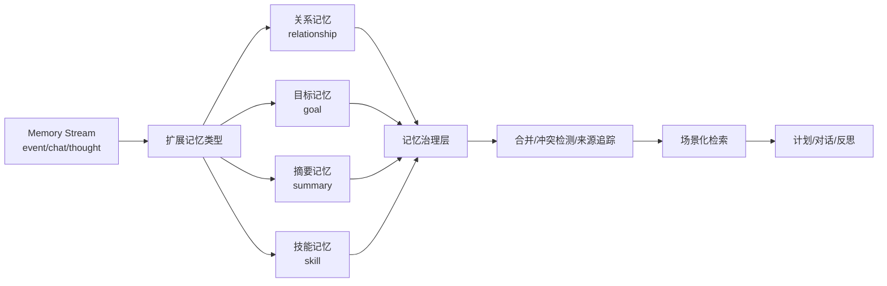

# 第 32 章 记忆系统升级：从 Memory Stream 到可管理长期记忆

## 32.1 核心问题

Generative Agents 的第一块基石是 Memory Stream。没有记忆，智能体只能对当前 prompt 做反应。有了记忆，它才可能保持连续性：

```text
我经历过什么
我和谁说过话
我对谁有什么印象
我接下来为什么这么行动
```

但 Memory Stream 只是起点。到了 2026 年，长期智能体系统已经不能只满足于“把事情记下来，再用向量检索找回来”。本章聚焦六个问题：

1. Generative Agents 的 Memory Stream 解决了什么问题？
2. Generative Agents 当前如何实现记忆？
3. 当前实现有什么长期运行瓶颈？
4. MemGPT 和 Mem0 给我们什么启发？
5. 如何把这些启发落到 Generative Agents 的代码结构中？
6. 如何评价记忆升级是否真的有效？



*图 32-1：从 Memory Stream 到记忆治理层的演进。长期智能体需要的不只是保存记忆，还要能合并、追踪来源、处理冲突并控制风险。*

## 32.2 Memory Stream 的价值

在原论文中，Memory Stream 的核心价值是：

```text
把智能体的经验以自然语言形式持续保存。
```

它不是简单聊天历史。它保存的是角色在小镇中的连续经验。例如：

- 看到了什么。
- 做了什么。
- 和谁说过话。
- 听到了什么消息。
- 形成了什么想法。

这些记忆让 agent 能够：

- 回答过去经历。
- 维持关系。
- 调整计划。
- 在对话中引用旧信息。
- 通过反思形成高层理解。

Generative Agents 继承了这个思想。它把记忆分为三类：

```text
event
chat
thought
```

这三类分别对应：

- 观察事件。
- 对话记忆。
- 反思想法。

这是非常清晰的教学结构。但如果要长期运行，就会遇到新的问题。

## 32.3 当前项目的记忆入口

Generative Agents 的记忆核心在：

```text
generative_agents/modules/memory/associate.py
```

底层向量索引在：

```text
generative_agents/modules/storage/index.py
```

`Associate` 初始化时，默认记忆结构是：

```python
self.memory = memory or {"event": [], "thought": [], "chat": []}
```

这说明当前项目有三类节点：

```text
event
thought
chat
```

每条记忆会被包装成 `Concept`。`Concept` 中包含：

- `node_id`
- `node_type`
- `event`
- `poignancy`
- `create`
- `expire`
- `access`

其中 `event` 又由 subject、predicate、object、address 和 describe 构成。这套设计的优点是：

```text
自然语言描述 + 结构化元数据
```

自然语言适合 LLM 使用。结构化元数据适合检索、排序和过期清理。

## 32.4 当前检索机制

`AssociateRetriever` 的检索逻辑非常接近论文思想。它综合三类分数：

```text
recency
relevance
importance
```

在源码中对应：

```python
recency_scores
relevance_scores
importance_scores
```

最终分数是：

```python
final_score = recency + relevance + importance
```

其中：

- recency 根据访问时间排序和衰减系数计算。
- relevance 来自向量检索相似度。
- importance 来自 `poignancy`。

这比单纯向量检索更贴近“人会想起什么”。人并不总是想起最相似的事。有时候近期发生的事更容易想起。有时候重要事件会压过普通相似事件。有时候和当前问题相关的旧事件会被重新激活。当前实现已经保留了 Generative Agents 的核心判断。

## 32.5 当前实现的局限

但当前记忆系统仍有局限。第一，记忆类型太少。只有：

```text
event
chat
thought
```

这能覆盖基础实验，但很难表达：

- 关系状态。
- 长期目标。
- 技能经验。
- 周期摘要。
- 冲突事实。
- 个人偏好。

第二，记忆没有明确分层。所有记忆都进入同一个 `Associate` 结构。短期工作记忆、长期情景记忆、语义记忆、关系记忆没有区分。第三，记忆没有合并机制。如果角色每天都去咖啡馆，系统可能反复保存类似事件。久而久之，检索噪声会变大。第四，记忆冲突没有显式处理。例如派对时间被说成 17:00，又被说成 19:00。系统没有专门机制判断哪个更可信。第五，关系记忆不够稳定。`Associate.get_relation()` 会基于某个 node 的描述检索 events 和 thoughts。这很灵活，但关系状态不是显式对象。例如“汤姆不信任山姆”这种长期关系，最好有稳定结构。第六，跨实验记忆没有清晰策略。当前项目适合单次仿真。如果希望角色跨多个实验成长，就需要更明确的长期记忆库。

## 32.6 MemGPT 的启发

MemGPT 的核心启发是：

```text
LLM 的上下文窗口像主存，长期记忆像外存，系统需要主动管理记忆的调入和调出。
```

这和 Generative Agents 的 Memory Stream 有明显区别。Memory Stream 更像：

```text
把经历放进一条流，需要时检索。
```

MemGPT 更强调：

```text
记忆管理本身是一项系统能力。
```

这对 Generative Agents 的启发非常直接。当前 `Associate.retrieve_focus()` 可以取回相关记忆。但系统还没有明确回答：

- 哪些记忆应该长期保存？
- 哪些记忆应该压缩？
- 哪些记忆应该被遗忘？
- 哪些记忆应该进入当前工作上下文？
- 哪些记忆冲突需要解决？

如果把 `Associate` 看成“记忆流”，那么升级方向是：

```text
把 Associate 扩展为记忆管理器。
```

## 32.7 Mem0 的启发

Mem0 面向生产级 AI agent 的长期记忆。它强调的不是小镇仿真，而是更通用的 agent 场景：

- 可扩展。
- 低延迟。
- 个性化。
- 跨会话记忆。
- 长期用户或角色画像。

对 Generative Agents 来说，Mem0 的启发是：

```text
记忆不应该只服务一次仿真。
```

一个小镇居民可以跨实验成长。例如：

- 第一次实验中，玛丽亚认识克劳斯。
- 第二次实验中，她仍然记得两人曾讨论过社会学论文。
- 第三次实验中，两人的关系继续发展。

这会把项目从“单次小镇故事生成器”推进到：

```text
长期角色实验平台。
```

但这也带来风险。错误记忆如果跨实验保存，会污染更久。因此跨实验记忆必须配套：

- 来源记录。
- 置信度。
- 过期策略。
- 冲突检测。
- 可回滚机制。

## 32.8 升级方向一：扩展记忆类型

第一步升级不需要大改架构。可以先扩展 `node_type`。当前：

```text
event
chat
thought
```

建议扩展为：

```text
event
chat
thought
relationship
goal
summary
skill
```

含义如下。`event`：

原始观察或行动事件。`chat`：

对话摘要或对话片段。`thought`：

反思生成的想法。`relationship`：

对另一个角色的稳定认知。`goal`：

长期目标或阶段目标。`summary`：

一段时间内的压缩记忆。`skill`：

从成功或失败经验中提取的可复用策略。这一步改动看似简单，但会改变系统语义。因为不同记忆类型应该有不同检索和使用方式。例如：

- 生成对话时更需要 relationship 和 chat。
- 生成计划时更需要 goal 和 event。
- 反思时更需要 thought、summary 和高重要性 event。
- 失败复盘时更需要 skill。

## 32.9 代码改动建议：类型扩展

当前 `Associate.abstract()` 写死了三类：

```python
for t in ["event", "chat", "thought"]:
```

如果要扩展类型，应该避免到处硬编码。可以定义：

```python
DEFAULT_MEMORY_TYPES = [
    "event",
    "chat",
    "thought",
    "relationship",
    "goal",
    "summary",
    "skill",
]
```

然后初始化：

```python
self.memory = memory or {t: [] for t in DEFAULT_MEMORY_TYPES}
```

为了兼容旧 checkpoint，还需要补齐缺失键：

```python
for t in DEFAULT_MEMORY_TYPES:
    self.memory.setdefault(t, [])
```

这类兼容很重要。否则旧实验结果无法 resume。另外，`retrieve_events()`、`retrieve_thoughts()`、`retrieve_chats()` 可以保留。新增：

```python
retrieve_relationships()
retrieve_goals()
retrieve_summaries()
retrieve_skills()
```

但更好的做法是增加通用接口：

```python
retrieve_by_type(node_type, text=None, limit=None)
```

这样后续扩展不会继续增加大量重复方法。

## 32.10 升级方向二：关系记忆结构化

当前关系更多依赖文本记忆。例如汤姆不喜欢山姆，这可能写在 `agent.json` 的 learned 或 currently 中，也可能进入 thought。但如果希望长期关系稳定，最好引入结构化关系记忆。示例：

```json
{
  "target": "山姆",
  "affinity": -2,
  "trust": 1,
  "familiarity": 4,
  "last_interaction": "2024-02-13 10:30",
  "summary": "汤姆对山姆竞选市长持怀疑态度。",
  "evidence": ["node_12", "node_45"]
}
```

字段含义：

- `target`：关系对象。
- `affinity`：好感度。
- `trust`：信任程度。
- `familiarity`：熟悉度。
- `last_interaction`：最近互动时间。
- `summary`：自然语言摘要。
- `evidence`：支撑该关系判断的记忆节点。

这比单纯文本检索更稳定。当汤姆与山姆对话时，系统可以明确把这条关系放进上下文。这样汤姆不容易突然变成无条件支持者。

## 32.11 关系记忆的更新方式

关系记忆不能随便改。否则会变成情绪随机数。更新关系时，建议遵守三条原则。第一，必须有证据。例如一次对话、一件共同事件或一次反思。第二，变化要有幅度限制。一次普通寒暄不应让 affinity 从 -3 变成 +5。第三，必须保留历史。关系状态可以更新，但旧证据不能丢。可以新增 prompt：

```text
relationship_update.txt
```

输入：

- 当前关系状态。
- 最近互动摘要。
- 相关记忆。

输出：

```json
{
  "affinity_delta": 1,
  "trust_delta": 0,
  "familiarity_delta": 1,
  "summary_update": "汤姆仍然不信任山姆，但承认他愿意倾听居民意见。",
  "evidence": ["node_88"]
}
```

这样关系变化可解释、可追踪。

## 32.12 升级方向三：记忆合并

长期运行中，重复记忆会快速增加。例如：

```text
伊莎贝拉在咖啡馆工作。
伊莎贝拉整理咖啡馆柜台。
伊莎贝拉准备咖啡馆营业。
伊莎贝拉招待顾客。
```

这些都重要，但不需要永远以同等粒度保存。可以设计记忆合并机制。流程：

```text
新记忆写入前
  -> 检索相似旧记忆
  -> 判断是否可合并
  -> 生成 summary
  -> 保留原始证据节点
```

合并后生成：

```text
过去几小时，伊莎贝拉一直围绕霍布斯咖啡馆营业和派对准备工作展开行动。
```

这个 summary 可以用于后续计划和反思。原始节点仍然保留一段时间，防止摘要损失细节。

## 32.13 记忆合并的边界

不是所有记忆都应该合并。以下情况不适合合并：

- 包含具体承诺。
- 包含事件时间地点。
- 包含关系冲突。
- 包含拒绝、反对或失败。
- 是低频但高重要性事件。

例如：

```text
玛丽亚答应 17:00 去咖啡馆参加派对。
```

这不应该被简单合并成：

```text
玛丽亚和伊莎贝拉聊了派对。
```

因为承诺时间和行动意图很关键。记忆合并要服务行为，不是为了压缩而压缩。

## 32.14 升级方向四：记忆冲突检测

长期记忆最大的风险之一是冲突。例如：

```text
派对时间是 17:00。
派对时间是 19:00。
```

或者：

```text
汤姆不信任山姆。
汤姆非常支持山姆。
```

如果系统不处理冲突，后续行为会摇摆。可以增加冲突检测流程：

```text
写入新记忆
  -> 检索同主题旧记忆
  -> 判断是否冲突
  -> 生成冲突记录或澄清想法
  -> 决定是否覆盖、并存或等待确认
```

冲突记录可以是新的 node_type：

```text
conflict
```

也可以先作为 `thought` 保存。示例：

```text
我听到关于派对时间的两个不同说法：伊莎贝拉最初说是下午5点，但后来有人提到晚上7点。我需要再次确认。
```

这比直接采用错误信息更可信。

## 32.15 升级方向五：跨实验长期记忆

如果要把 Generative Agents 变成长期角色平台，可以引入跨实验记忆。当前实验结果通常保存在：

```text
generative_agents/results/checkpoints/<实验名>/
```

跨实验记忆可以设计为：

```text
generative_agents/results/long_term_memory/<角色名>/
```

或：

```text
generative_agents/data/long_term_memory/<角色名>/
```

但这里要非常谨慎。因为跨实验记忆会改变实验可重复性。如果读者不知道角色带着旧记忆进入新实验，就无法解释结果。因此建议默认关闭。只有在明确设置时启用：

```bash
python start.py --name sim-2 --load-long-term-memory baseline-1
```

并在 `simulation.md` 中写明：

```text
本实验加载了上一轮长期记忆。
```

## 32.16 升级方向六：记忆来源与置信度

为了降低记忆幻觉，建议每条高级记忆增加来源和置信度。例如：

```json
{
  "source_nodes": ["node_12", "node_19"],
  "source_type": "conversation",
  "confidence": 0.82,
  "generated_by": "relationship_update",
  "created_at": "2024-02-13 10:30"
}
```

特别是以下类型应记录来源：

- relationship。
- summary。
- thought。
- skill。
- conflict。

原始 event 可以来自环境观察。但高级记忆是模型生成的。模型生成的记忆必须知道依据是什么。否则它很容易变成“被系统正式保存的幻觉”。

## 32.17 检索也要分场景

当前 `retrieve_focus()` 主要按 focus 文本检索 event 和 thought。但不同任务需要不同记忆。生成对话时：

```text
relationship + recent chat + relevant event
```

生成计划时：

```text
goal + summary + relevant event
```

反思时：

```text
high poignancy event + thought + recent conflict
```

失败复盘时：

```text
skill + failed action + similar past attempts
```

因此可以增加场景化检索：

```python
retrieve_for_dialogue(target_name, context)
retrieve_for_planning(goal)
retrieve_for_reflection(focus)
retrieve_for_reaction(observation)
```

这些方法内部仍可调用通用向量检索。但它们的记忆类型、权重和数量应该不同。这就是从“一个检索器”走向“记忆治理”的关键。

## 32.18 升级后的评价指标

记忆系统升级不能只看实现是否漂亮。必须评价。建议指标包括：

```text
memory_reference_accuracy
```

角色引用过去经历时，事实是否正确。

```text
source_trace_rate
```

高级记忆中有来源证据的比例。

```text
relationship_consistency_score
```

关系状态是否跨对话稳定。

```text
memory_redundancy_rate
```

相似低价值记忆重复比例。

```text
conflict_detection_count
```

检测到的事实冲突数量。

```text
conflict_resolution_quality
```

该项检查冲突处理是否合理。

```text
retrieval_precision_sampled
```

人工抽样检查召回记忆是否相关。

```text
long_term_transfer_success
```

跨实验记忆是否正确影响后续行为。这些指标不一定一开始全部自动化。可以先人工抽样。重要的是形成评价意识。

## 32.19 最小可行升级方案

如果读者想真正动手升级，不建议一开始做完整长期记忆系统。可以按三步走。第一步，增加 `relationship` 记忆类型。理由：

关系记忆和小镇社会行为直接相关，最容易观察价值。第二步，增加 relationship update prompt。每次关键对话后，根据对话结果更新双方关系摘要。第三步，在生成对话时显式检索 relationship。让角色对话受到关系状态影响。这三步就能做一个很好的实验：

```text
汤姆是否更稳定地表现出对山姆的不信任？
玛丽亚和克劳斯的互动是否更容易形成连续关系？
伊莎贝拉多次邀请某人后，关系是否变化？
```

这比一次性实现 MemGPT 或 Mem0 全部思想更务实。

## 32.20 风险与边界

记忆越强，风险越高。第一，错误记忆会保存更久。第二，关系标签可能固化偏见。第三，跨实验记忆会降低可复现性。第四，记忆来源不清会增强幻觉可信度。第五，长期记忆可能包含敏感内容。因此，每一次记忆升级都要同时增加：

- 来源记录。
- 删除能力。
- 可视化检查。
- 实验配置记录。
- 隐私边界。

不要只追求“记得更多”。长期 agent 需要的不是无限记忆，而是可治理记忆。

## 32.21 本章小结

记忆升级的目标不是“存更多”，而是“管得住”。论文中的 Memory Stream、当前项目实现和长期运行需要的记忆治理层，必须分开理解。

| 本章内容 | 核心结论 |
| --- | --- |
| Memory Stream 价值 | 它让智能体拥有行为连续性，是长期 agent 的起点。 |
| 当前实现 | Generative Agents 通过 `Associate`、`Concept` 和 LlamaIndex 保存 event/chat/thought。 |
| 当前检索 | recency、relevance 和 importance 保留了论文核心思想。 |
| 长期问题 | 类型不足、无分层、重复记忆、冲突记忆、关系不稳定和跨实验记忆缺失都会出现。 |
| MemGPT 启发 | 上下文窗口和长期记忆可以看作主存与外存，需要主动管理。 |
| Mem0 启发 | 生产级长期记忆要关注跨会话、个性化和可维护性。 |
| 类型扩展 | relationship、goal、summary、skill 等记忆类型是务实起点。 |
| 可落地方向 | 关系记忆、记忆合并、冲突检测、跨实验记忆和来源置信度都适合渐进实现。 |
| 评价指标 | 引用准确率、来源追踪率、关系一致性、冗余率和冲突处理质量必须进入实验。 |
| 风险边界 | 记忆越强，越要重视幻觉、偏见、隐私和可复现性。 |

下一章讨论反思系统升级。记忆让角色保存经历，反思让角色从经历中总结意义；而 2023-2026 年的新方向进一步要求 agent 能从失败中学习，并把经验变成可复用策略。

## 参考资料

- Generative Agents: https://arxiv.org/abs/2304.03442
- MemGPT: https://arxiv.org/abs/2310.08560
- Mem0: https://arxiv.org/abs/2504.19413
- Local source: `generative_agents/modules/memory/associate.py`
- Local source: `generative_agents/modules/storage/index.py`
- Local config: `generative_agents/data/config.json`
