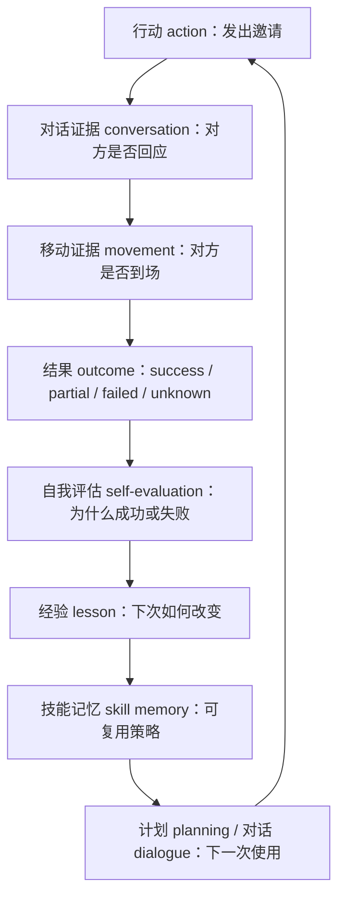

# 第 33 章 反思系统升级：从事件反思到经验学习

## 33.1 从一次没有落地的邀请开始

`book-party-extended` 实验里，伊莎贝拉在 11:30 向玛丽亚发出邀请：

```text
玛丽亚，今天的三明治看起来很美味呢！下午五点的情人节派对你一定要来哦，我已经准备好了一些特别的安排。
```

玛丽亚的回答也很明确：

```text
哇，情人节派对？听起来太棒了！我五点刚好有休息时间，肯定会去参加的！
```

这两句来自 `generative_agents/results/checkpoints/book-party-extended/conversation.json` 的 `20240214-11:30` 对话记录 conversation。只看对话，邀请似乎成功；但 17:00 附近的移动回放 movement 给出了另一层证据：`generative_agents/results/compressed/book-party-extended/movement.json` 在 frame `3241` 的快照里，伊莎贝拉已经在 `霍布斯咖啡馆，咖啡馆，咖啡馆顾客座位` 迎接客人，玛丽亚仍在 `奥克山学院宿舍，玛丽亚的房间，书桌`。这不是简单的“模型没写好故事”，而是反思系统 reflection system 没有把“承诺 accepted”和“到场 arrived”拆成可复核的结果 outcome。

当前项目中的反思 reflection 需要从“生成高层想法 thought”推进到“行动后复盘 post-action review -> 经验 lesson -> 可复用技能 skill -> 下一次行动”。反思式学习 Reflexion 和 Voyager 指向同一个工程约束：失败证据必须回到 `conversation.json`、`movement.json`、`simulation.md`、断点 checkpoint 和指标 metrics / 报告 report，而不是只在角色内心独白里变得更深刻。



*图 33-1：反思式学习 reflexion-style learning 在当前项目中的闭环。行动 action 不能只落到想法 thought，还要绑定对话记录 conversation、移动回放 movement 和结果 outcome，再把经验 lesson 写回后续计划 planning 或对话 dialogue。*


*图 33-2：从失败结果到可复用技能记忆。左侧红色失败回放表示行动 action 没有达成预期 outcome；中间的证据桌把 `conversation.json`、`movement.json`、`simulation.md` 和日程 schedule 放在一起复核；右侧的蓝绿色记忆胶囊表示自我评价 self-evaluation、经验 lesson 和技能记忆 skill memory 被写回，等待下一次行动调用。*

## 33.2 高频术语锚点表

| 中文 English | 项目含义 | 当前项目锚点 |
| --- | --- | --- |
| 反思 reflection | 从近期事件 event 和想法 thought 中生成高层理解。 | `Agent.reflect()` |
| 重要性 poignancy | 事件进入反思前累积的触发分数。 | `status["poignancy"]`、`poignancy_max` |
| 洞察 insight | `reflect_insights` 输出的高层想法。 | 写回 `node_type="thought"` |
| 证据 evidence | 支撑洞察 insight 的记忆节点编号或运行材料。 | 当前传入 `filling`，但未持久化到 metadata |
| 结果 outcome | 一次行动是否达成目标的标签。 | 当前缺失，需新增 |
| 经验 lesson | 从 outcome 和证据中抽取的可执行改进。 | 可写入 thought 或 skill |
| 技能记忆 skill memory | 从多次 lesson 中沉淀出的自然语言策略。 | 当前 `Associate.memory` 仅有 event/chat/thought，需扩展 |
| 指标 metrics | 判断升级是否改善行为的结构化结果。 | `docs/book/assets/chapter_29/ch29_book_custom_discussion_metrics.json` |
| 报告 report | 给人复核的证据摘要和裁判意见。 | 第 37 章继续展开 |

## 33.3 当前项目的反思入口

当前反思 reflection 的主入口在 `generative_agents/modules/agent.py`：

```python
def reflect(self):
    def _add_thought(thought, evidence=None):
        event = self.make_event(self.name, thought, self.get_tile().get_address())
        return self._add_concept("thought", event, filling=evidence)

    if self.status["poignancy"] < self.think_config["poignancy_max"]:
        return
    nodes = self.associate.retrieve_events() + self.associate.retrieve_thoughts()
    if not nodes:
        return
    nodes = sorted(nodes, key=lambda n: n.access, reverse=True)[
        : self.associate.max_importance
    ]
    focus = self.completion("reflect_focus", nodes, 3)
    retrieved = self.associate.retrieve_focus(focus, reduce_all=False)
    for r_nodes in retrieved.values():
        thoughts = self.completion("reflect_insights", r_nodes, 5)
        for thought, evidence in thoughts:
            _add_thought(thought, evidence)
```

这段代码的输入 input、处理 process、输出 output 闭环如下。

| 环节 | 输入 input | 处理 process | 输出 output | 证据路径 |
| --- | --- | --- | --- | --- |
| 触发判断 | `status["poignancy"]` 和 `think_config["poignancy_max"]` | 分数低于阈值直接返回。 | 反思 reflection 是否启动。 | `generative_agents/data/config.json` 中 `poignancy_max=150` |
| 取近期材料 | 事件 event、想法 thought | `retrieve_events()` 与 `retrieve_thoughts()` 合并，并按 `access` 倒序截断。 | 近期记忆节点 nodes。 | `generative_agents/modules/memory/associate.py` |
| 生成焦点 | nodes 列表 | `self.completion("reflect_focus", nodes, 3)` 调用提示词 prompt。 | 焦点问题 focus。 | `generative_agents/data/prompts/reflect_focus.txt` |
| 检索证据 | focus | `retrieve_focus(focus, reduce_all=False)` 按焦点召回相关节点。 | 每个焦点对应的 r_nodes。 | `Associate.retrieve_focus()` |
| 生成洞察 | r_nodes | `reflect_insights` 输出洞察 insight 和节点编号。 | `[thought, evidence]`。 | `generative_agents/data/prompts/reflect_insights.txt` |
| 写回记忆 | thought、evidence | `_add_concept("thought", filling=evidence)`。 | 新 thought 节点。 | `Associate.add_node()` |

这里有一个很重要的证据断点：`Agent.reflect()` 已经把 `evidence` 传给 `_add_concept(..., filling=evidence)`，但 `Associate.add_node()` 的 metadata 只保存 `node_type/subject/predicate/object/address/poignancy/create/expire/access`，没有保存 `filling`。所以当前反思 insight 在生成时“知道自己来自哪些节点”，持久化后却丢失了这条来源链。第 21 章生成的 `docs/book/assets/chapter_21/ch21_reflection_trace.json` 也记录了这个边界：`evidence_persisted_in_metadata` 为 `false`。

## 33.4 `reflect_focus` 如何把记忆变成问题

`reflect_focus` 是当前反思 reflection 的第一道大语言模型 LLM 入口。

| 项目 | 内容 |
| --- | --- |
| 提示词 prompt 路径 | `generative_agents/data/prompts/reflect_focus.txt` |
| 绑定方法 | `Scratch.prompt_reflect_focus(nodes, topk)` |
| 调用位置 | `Agent.reflect()` |
| 变量 | `reference` 为按编号排列的记忆节点；`number` 为问题数量。 |
| 输出结构 schema | `res: List[str]`，每项为一个焦点问题 focus question。 |
| 失败兜底 failsafe | `"{name} 是谁？"`、`"{name} 住在哪里？"`、`"{name} 今天要做什么？"` |
| 输出流向 | 进入 `Associate.retrieve_focus(focus, reduce_all=False)`，用于召回支撑每个问题的记忆节点。 |

提示词 prompt 的关键模板是：

```text
根据给定的记忆节点，生成反思的焦点问题。

参考示例，为以下记忆节点生成反思焦点问题：
"""
记忆节点：
${reference}

生成${number}个反思焦点问题：
"""

确保返回的数据格式遵守schema：
[
  "焦点问题1",
  "焦点问题2",
  "焦点问题3",
  ...
]
```

它的工程作用不是“让角色变深刻”，而是把近期记忆压缩成检索 query。对于派对实验，焦点问题可能是“伊莎贝拉的派对邀请是否形成实际承诺？”或者“哪些居民可能参加派对？”。当前模板并不知道 outcome，也不会区分“答应过”和“到场了”，所以它只能生成理解型问题，不能独立完成经验学习。

## 33.5 `reflect_insights` 如何生成并绑定洞察

`reflect_insights` 是第二道大语言模型 LLM 入口。

| 项目 | 内容 |
| --- | --- |
| 提示词 prompt 路径 | `generative_agents/data/prompts/reflect_insights.txt` |
| 绑定方法 | `Scratch.prompt_reflect_insights(nodes, topk)` |
| 输入 input | 被某个 focus 召回的记忆节点。 |
| 输出结构 schema | `res: List[Tuple[str, str]]`，每项为 `[洞察内容 insight, "相关节点编号"]`。 |
| 回调 callback | 把 `"1,2,3"` 转成真实 `node_id` 列表。 |
| 输出流向 | `_add_thought(thought, evidence)` 写入 `node_type="thought"`。 |

模板要求模型输出洞察 insight 和相关节点编号：

```text
参考示例，为以下记忆节点生成反思洞察：
"""
记忆节点：
${reference}

生成${number}个反思洞察：
"""

确保返回的数据格式遵守schema：
[
  ("洞察内容", "相关节点编号"),
  ("洞察内容", "相关节点编号"),
  ...
]
```

这比普通摘要 summary 强，因为它试图保留证据 evidence。但是写回 `Associate.add_node()` 后，当前 metadata 没有保存 `filling`。因此升级经验学习前，先要修复来源链 persistence：否则后续技能 skill 可能看起来可靠，却无法回查它到底来自哪段对话 conversation 或哪次移动 movement。

## 33.6 对话后的反思入口

`Agent.reflect()` 在处理普通事件反思后，还会处理聊天记录 chats：

```python
if self.chats:
    recorded, evidence = set(), []
    for name, _ in self.chats:
        if name == self.name or name in recorded:
            continue
        res = self.associate.retrieve_chats(name)
        if res and len(res) > 0:
            node = res[-1]
            evidence.append(node.node_id)
    thought = self.completion("reflect_chat_planing", self.chats)
    _add_thought(f"对于 {self.name} 的计划：{thought}", evidence)
    thought = self.completion("reflect_chat_memory", self.chats)
    _add_thought(f"{self.name} {thought}", evidence)
```

| 提示词 prompt | 路径 | 输入 input | 输出结构 schema | 输出流向 |
| --- | --- | --- | --- | --- |
| 反思聊天计划 `reflect_chat_planing` | `generative_agents/data/prompts/reflect_chat_planing.txt` | `conversation`、`agent` | `res: str`，一句话描述对计划的影响。 | 加前缀 `对于 {agent} 的计划：` 写入 thought。 |
| 反思聊天记忆 `reflect_chat_memory` | `generative_agents/data/prompts/reflect_chat_memory.txt` | `conversation`、`agent` | `res: str`，一句话描述值得记住的内容。 | 加前缀 `{agent}` 写入 thought。 |

这两个 prompt 很短，分别问：

```text
根据以上对话记录，以 ${agent} 的视角，用一句话描述 ${agent} 是否需要记住自己的计划。
```

```text
以 ${agent} 的视角，用一句话描述对话中最有趣的地方。
```

它们能把对话 dialogue 变成计划相关 thought 或关系相关 thought，却不会生成结构化结果 outcome。仍以派对实验为例，`山姆 -> 伊莎贝拉` 的对话里，山姆表达了荣幸，但同时说明 17:00 已与詹妮弗有晚餐。这应该被判成 `partial` 或 `failed`，而不是只写成“山姆对派对小惊喜感兴趣”。

## 33.7 当前反思的能力和缺口

| 维度 | 当前能力 | 当前缺口 | 项目证据 |
| --- | --- | --- | --- |
| 触发 trigger | 用 `poignancy_max=150` 控制成本。 | 不会因关键失败 failed outcome 直接触发。 | `generative_agents/data/config.json` |
| 来源 grounding | `reflect_insights` 生成节点编号。 | `filling` 没有进入 metadata，断点恢复后证据链变弱。 | `Associate.add_node()` |
| 写回 memory | insight 写成 `thought`。 | 没有 `lesson`、`skill`、`outcome` 等类型。 | `Associate.memory={"event":[],"thought":[],"chat":[]}` |
| 对话影响 dialogue impact | `reflect_chat_planing` 和 `reflect_chat_memory` 生成聊天后想法。 | 不能区分承诺 accepted、拒绝 rejected、到场 arrived。 | `book-party-extended/conversation.json` 与 `movement.json` |
| 后续行动 action | thought 可被后续检索召回。 | 没有保证 lesson 进入 `make_schedule()` 或 `_determine_action()`。 | `Agent.make_schedule()`、`Agent._determine_action()` |
| 评价 evaluation | 第 29 章已有指标脚本可抽取行动和承诺。 | 反思本身没有质量评分。 | `docs/book/scaffolds/part_04_05/ch29_evaluate_simulation.py` |

当前系统已经保留生成式智能体 Generative Agents 论文中的核心反思机制：重要事件积累、焦点生成、相关记忆召回、洞察写回。它缺的是面向下一次行动的经验学习 experience learning。

## 33.8 前沿思想如何落回 GenerativeAgentsCN

| 前沿思想 frontier idea | 论文中的关键点 | 当前项目可接入的位置 | 不能偷换成什么 |
| --- | --- | --- | --- |
| 反思式学习 Reflexion | 失败后生成语言反馈 verbal feedback，并在下一次尝试中使用。 | 在 `Agent.reflect()` 旁新增行动后复盘 post-action review；把 outcome、lesson 写入 `Associate`。 | 不能只把 reflection 写得更长。 |
| 探索智能体 Voyager | 将成功策略沉淀成可复用技能 skill library。 | 扩展 `Associate.memory` 或新增 `Skill` 存储，让 skill 被计划 planning 和对话 dialogue 检索。 | 不能写成固定脚本 if-then。 |
| 目标驱动智能体 goal-driven agent | 行动按目标和反馈调整。 | 与第 34 章目标 goal、进度 progress、候选行动 candidate actions 对接。 | 不能让角色拥有上帝视角。 |
| 可复现实验 evaluation | 用指标和报告验证升级。 | 复用 `movement.json`、`conversation.json`、`simulation.md`、指标 metrics / 报告 report。 | 不能只凭一次好看的故事判断成功。 |

反思式学习 Reflexion 的工程翻译是：不要更新模型参数，更新可检索的语言经验。Voyager 的工程翻译是：不要把经验藏在一段一次性总结里，沉淀为可以被后续任务检索的技能记忆 skill memory。

## 33.9 升级点一：结果标签 outcome

结果标签 outcome 是经验学习的入口。没有 outcome，系统无法知道哪次行动值得复盘。

| 标签 | 判定口径 | 强证据 | 弱证据 | 派对实验样例 |
| --- | --- | --- | --- | --- |
| 成功 success | 目标被明确达成。 | 对方明确接受，并在 movement 中到场。 | `simulation.md` 事后摘要。 | 需要同时看到承诺和到场。 |
| 部分 partial | 对方知道信息，但承诺或执行不完整。 | 对话中表示兴趣，movement 未到场。 | 日程里提到活动但无位置证据。 | 玛丽亚 11:30 接受，17:00 附近未到咖啡馆，可标 partial。 |
| 失败 failed | 对方拒绝，或目标没有传达。 | 对话里明确拒绝；后续无行动证据。 | 关键词未命中。 | 山姆因与詹妮弗晚餐，无法 17:00 参加。 |
| 未知 unknown | 证据不足，不能判断。 | 缺少 conversation 或 movement。 | 只有角色设定。 | 压缩结果缺少某段原始对话时使用。 |

结果标签 outcome 的输入 input、处理 process、输出 output 可以这样落地。

| 输入 input | 处理 process | 输出 output | 文件位置 | 失败模式 | 验证方式 |
| --- | --- | --- | --- | --- | --- |
| 当前行动 action、目标 goal、对话记录 conversation、移动回放 movement、当前日程 schedule | 按目标类型抽取承诺、拒绝、到场和地点匹配。 | `ActionOutcome` 结构，含 `outcome/reason/evidence/confidence`。 | 建议新增 `generative_agents/modules/memory/outcome.py`，或先写入 `thought` metadata。 | 把“知道活动”误判成“参加活动”。 | 回查 `conversation.json` 原话和 `movement.json` 位置。 |

最小结构可以先写成 JSON：

```json
{
  "action_id": "20240214-1130-isabella-invite-maria",
  "agent": "伊莎贝拉",
  "target": "玛丽亚",
  "goal": "邀请玛丽亚参加 17:00 情人节派对",
  "outcome": "partial",
  "reason": "玛丽亚明确答应参加，但 17:00 附近 movement 仍显示她在宿舍书桌。",
  "evidence": [
    "conversation:book-party-extended:20240214-11:30",
    "movement:book-party-extended:frame-3241"
  ],
  "confidence": 0.82
}
```

## 33.10 升级点二：自我评估 prompt

自我评估 self-evaluation 由大语言模型 LLM 驱动时，必须给出提示词 prompt 路径、变量、输出结构 schema 和流向。建议新增：

```text
generative_agents/data/prompts/self_evaluate_action.txt
```

| 项目 | 设计 |
| --- | --- |
| 绑定方法 | `Scratch.prompt_self_evaluate_action(action, goal, evidence)` |
| 输入变量 | `agent`、`goal`、`intended_action`、`conversation_evidence`、`movement_evidence`、`schedule_context`、`persona_context` |
| 输出结构 schema | `outcome: str`、`reason: str`、`evidence: list[str]`、`confidence: float`、`failure_type: str` |
| 输出流向 | 写入 `ActionOutcome`；低 confidence 进入人工复核或标记 `unknown`。 |

模板草案：

```text
你正在评估 ${agent} 的一次行动是否达成目标。

目标 goal：
${goal}

计划行动 intended_action：
${intended_action}

对话证据 conversation_evidence：
${conversation_evidence}

移动证据 movement_evidence：
${movement_evidence}

日程上下文 schedule_context：
${schedule_context}

角色设定 persona_context：
${persona_context}

请只返回 JSON，字段为：
{
  "outcome": "success | partial | failed | unknown",
  "reason": "一句话说明判定原因",
  "failure_type": "no_contact | rejected | no_arrival | schedule_conflict | evidence_missing | none",
  "evidence": ["证据路径或节点编号"],
  "confidence": 0.0
}
```

这条提示词 prompt 的关键边界是：模型只能根据传入证据判断，不能凭故事合理性补全事实。例如 `simulation.md` 后面写“派对效果不错”，不能自动推出玛丽亚在 17:00 到场；必须查 `movement.json` 或断点 checkpoint。

## 33.11 升级点三：从结果抽取经验 lesson

有了 outcome，下一步才是经验 lesson。建议新增：

```text
generative_agents/data/prompts/derive_lesson_from_outcome.txt
```

| 输入 input | 处理 process | 输出 output | 写入位置 | 验证方式 |
| --- | --- | --- | --- | --- |
| `ActionOutcome`、原始 action、相关 conversation、movement、persona、已有 similar lessons | LLM 生成可执行 lesson，并要求说明适用范围。 | `Lesson`：`lesson/apply_to/avoid_when/evidence/confidence`。 | 先写 `node_type="thought"`；稳定后扩展 `node_type="lesson"` 或 `skill`。 | 下一次相似目标前是否被检索到；后续 outcome 是否改善。 |

输出结构 schema 示例：

```json
{
  "lesson": "邀请已经有固定晚餐安排的人时，不要把到场作为唯一目标；可以改成提前送祝福、邀请短暂停留，或请对方转告他人。",
  "applies_to": ["invite_to_event", "relationship_maintenance"],
  "avoid_when": "对方已经明确不想讨论该活动。",
  "evidence": [
    "conversation:book-party-extended:20240214-10:00",
    "movement:book-party-extended:frame-3241"
  ],
  "confidence": 0.78
}
```

这个 lesson 比“伊莎贝拉应该更努力邀请大家”更有价值，因为它有对象、失败原因、替代策略、适用范围和证据路径。

## 33.12 升级点四：技能记忆 skill memory

单条 lesson 会越来越散。多次同类 lesson 应沉淀成技能记忆 skill memory。它不是代码函数，而是可检索的自然语言策略。

```json
{
  "node_type": "skill",
  "name": "invite_to_event",
  "trigger": "需要邀请居民参加活动",
  "strategy": [
    "先判断对方是否有时间冲突",
    "给出活动时间、地点和可短暂停留的选项",
    "对熟人使用具体理由，对陌生人保留拒绝空间",
    "邀请后记录承诺，并在活动前检查到场证据"
  ],
  "evidence": [
    "conversation:book-party-extended:20240214-11:30",
    "movement:book-party-extended:frame-3241"
  ],
  "success_count": 0,
  "partial_count": 1,
  "failure_count": 1,
  "last_updated": "2024-02-14T17:10:00"
}
```

要让 skill 真正进入系统，需要补三处工程接口。

| 接口 | 当前状态 | 升级做法 | 失败模式 | 验证方式 |
| --- | --- | --- | --- | --- |
| 存储 storage | `Associate.memory` 只有 `event/chat/thought`。 | 增加 `skill` 类型，或先把 skill 写成带 `node_type` metadata 的 thought。 | skill 丢失或混进普通 thought。 | 断点 checkpoint 中能看到 skill 节点。 |
| 检索 retrieval | `retrieve_focus()` 只从 event/thought 中召回。 | 新增 `retrieve_skills(goal_or_action)`，按目标和场景查 skill。 | 无关 skill 干扰普通生活。 | 对邀请任务抽样检查 top-k skill。 |
| 使用 application | `make_schedule()` 和 `_determine_action()` 不读 skill。 | 在目标行动前注入 relevant skill，不替代原本 schedule。 | 角色变得过度策略化。 | 对比升级前后对话自然性 naturalness。 |

## 33.13 升级点五：把 lesson 接入计划和对话

经验学习只有写回没有使用，就只是漂亮文本。当前项目可以在两个位置接入 lesson。

| 接入位置 | 当前代码 | 输入 input | 处理 process | 输出 output |
| --- | --- | --- | --- | --- |
| 日程生成 schedule generation | `Agent.make_schedule()` | `currently`、近期记忆、active goal、relevant lesson | 在 `schedule_daily` 前补目标和经验上下文。 | 当天日程中出现更合理的邀请、确认、复查时间。 |
| 行动落地 action determination | `Agent._determine_action()` | 当前 `de_plan`、空间地址 spatial、lesson/skill | 生成行动前检索 `invite_to_event` 等技能。 | `memory.Action` 的 event、object event、address 更贴近目标。 |
| 对话生成 dialogue generation | `_chat_with()` 与 `generate_chat` | 对方身份、关系、lesson/skill | 对话前补“上次邀请失败的原因”。 | 更少重复邀请，更能处理拒绝。 |

建议新增应用 prompt：

```text
generative_agents/data/prompts/apply_lesson_to_plan.txt
```

输出结构 schema：

```json
{
  "strategy": "先确认对方 17:00 是否有空，再提供短暂停留选项。",
  "use_lesson_ids": ["lesson_20240214_invite_sam"],
  "risk": "如果反复提到派对，可能显得过度推销。",
  "next_action_hint": "在午后遇到对方时只做一次温和确认。"
}
```

这条输出不直接替代 `Action`，而是作为上下文进入计划 planning 或对话 dialogue。模型仍要结合当前地点、关系和人设生成具体行动。

## 33.14 失败驱动反思 trigger

当前反思 reflection 主要由 `poignancy` 阈值触发。经验学习还需要失败触发 failed-outcome trigger。

| 触发条件 | 为什么需要 | 处理方式 | 输出 |
| --- | --- | --- | --- |
| `outcome == "failed"` 且目标重要 | 关键失败可能不够“情绪强烈”，但对任务很重要。 | 立即调用 `self_evaluate_action` 和 `derive_lesson_from_outcome`。 | failed lesson。 |
| 连续 `partial` | 多次部分成功说明策略有缺口。 | 合并相似 evidence，升级为 skill 修订。 | skill update。 |
| 承诺 accepted 但未到场 no_arrival | 对话成功不等于行动落地。 | 强制回查 movement 与 schedule。 | arrival lesson。 |
| evidence 缺失 | 无证据不能硬判成功。 | 标记 `unknown`，进入报告 report。 | evidence_missing item。 |

这类触发必须克制。反思不是越多越好；它应该在结果不清、失败可定位、策略可改进时启动。

## 33.15 反思质量评分

质量评分不是为了给角色打分，而是防止坏 lesson 长期污染行为。

| 评分项 | 中文 English | 检查问题 | 证据来源 |
| --- | --- | --- | --- |
| 证据扎实度 groundedness | 反思是否能回到真实证据。 | 是否含 conversation、movement、checkpoint 或 node_id。 | `conversation.json`、`movement.json`、`docstore.json` |
| 具体性 specificity | 是否有对象、场景和原因。 | 是否只写“应该更努力”。 | lesson 字段 |
| 可行动性 actionability | 是否能改变下一次行动。 | 是否给出可执行策略。 | 后续 schedule/action |
| 一致性 consistency | 是否符合人设 persona 和已有记忆 memory。 | 是否突然变成任务机器。 | `agent.json`、`scratch` |
| 影响 impact | 后续行为是否真的改变。 | 是否被检索并影响 `Action`。 | 指标 metrics / 报告 report |

**公式卡片 33-A：证据绑定率 evidence binding rate**

$$
\text{证据绑定率 evidence binding rate}
=
\frac{\text{带有可回查证据的 lesson 数量}}
{\text{全部 lesson 数量}}
$$

读法：如果系统生成了 20 条 lesson，其中 16 条至少能回到 `conversation.json`、`movement.json`、断点 checkpoint 或记忆节点 node_id，则证据绑定率为：

$$
\frac{16}{20}=0.80
$$

**公式卡片 33-B：经验复用命中率 lesson reuse hit rate**

$$
\text{经验复用命中率 lesson reuse hit rate}
=
\frac{\text{相似任务前被检索并使用的 lesson 数量}}
{\text{相似任务总次数}}
$$

读法：这项指标不问 lesson 写得是否漂亮，只问它有没有进入下一次相似行动。可以从日志、prompt 组装记录或报告 report 中抽样确认。

## 33.16 最小可行实验

最小实验仍从派对邀请开始，因为它已有可复核证据。

| 阶段 | 输入 input | 处理 process | 输出 output | 验证路径 |
| --- | --- | --- | --- | --- |
| 基线 baseline | `book-party-extended` 的当前运行。 | 读取伊莎贝拉邀请、承诺和 17:00 movement。 | 标注 success/partial/failed。 | `conversation.json`、`movement.json`、`simulation.md` |
| 升级 upgrade | 新增 outcome、self-evaluation、lesson。 | 对失败或 partial 邀请生成 lesson。 | `lesson` 或 `skill` 节点。 | 断点 checkpoint 中可查。 |
| 再运行 rerun | 相同角色和派对目标。 | 邀请前检索 relevant skill。 | 新对话、新行动。 | 统计邀请覆盖、接受、到场。 |
| 对比 compare | 基线 baseline 与升级 upgrade。 | 用指标脚本或人工报告对齐证据。 | 结论报告 report。 | 可复用第 29 章指标 metrics / 报告 report 思路。 |

第 29 章的 `docs/book/scaffolds/part_04_05/ch29_evaluate_simulation.py` 已经演示了如何把 checkpoint、movement、conversation 和 memory 转成指标 metrics。反思升级可以复用它的证据口径：`goal_related_action_rate` 看行动是否围绕目标，`commitment_metrics` 看承诺是否到场，`conversation_metrics` 看对话是否真的承载目标信息。

## 33.17 风险与边界

| 风险 | 表现 | 原因 | 检查位置 | 修正方向 |
| --- | --- | --- | --- | --- |
| 伪内心 pseudo interiority | 角色反思越来越像真人心理报告。 | reflection 写得过度深刻。 | thought、lesson 文本。 | 保持证据、置信度和可删除机制。 |
| 错误经验固化 bad lesson | 一次误判影响后续多次行动。 | outcome 或 evidence 误判。 | skill memory、后续 prompt。 | 加 confidence、人工抽样、过期时间。 |
| 行为工具化 over-optimization | 角色每次社交都像完成 KPI。 | skill 直接控制话术。 | 对话 dialogue 和自然性 naturalness。 | skill 只提供策略，不写固定句子。 |
| 上帝视角 omniscience | 角色知道不该知道的位置或承诺。 | 检索了实验分析工具数据。 | prompt 输入。 | 区分角色可知证据和评估证据。 |
| 成功粉饰 success washing | 只看承诺，不看到场。 | conversation 强、movement 弱。 | report 结论表。 | 证据分层：知道、承诺、到场、事后摘要分开写。 |

## 33.18 本章小结

反思升级的核心不是“让角色更会总结”，而是让行动结果 outcome 进入可复用经验 lesson。当前项目已经有 `Agent.reflect()`、`reflect_focus`、`reflect_insights`、聊天后反思提示词 prompt 和 `thought` 写回机制；真正的缺口在于 outcome、证据持久化、lesson/skill 类型、后续使用和评价闭环。

| 主题 | 核心结论 |
| --- | --- |
| 当前反思入口 | `Agent.reflect()` 在 `poignancy_max=150` 后触发，生成 focus 和 insight。 |
| 提示词 prompt 流向 | `reflect_focus` 生成问题，`reflect_insights` 生成洞察和节点编号，聊天反思写入计划 thought 与记忆 thought。 |
| 证据断点 | `filling=evidence` 已传入 `_add_concept()`，但 `Associate.add_node()` 未持久化 evidence。 |
| 前沿锚定 | 反思式学习 Reflexion 对应失败后语言经验，Voyager 对应可复用技能记忆 skill memory。 |
| 可落地升级 | outcome、自我评估 self-evaluation、lesson、skill、失败触发 trigger 和质量评分组成最小闭环。 |
| 验证要求 | 结论必须回到 conversation、movement、simulation、checkpoint 和指标 metrics / 报告 report。 |
| 最小实验 | 派对邀请复盘最适合作为第一步，因为已有承诺与到场脱钩的真实证据。 |

下一章进入规划系统升级。反思 learning 让角色从过去的失败中拿到经验；规划 planning 要解决的是：这些经验、目标 goal 和当前环境如何共同决定下一步行动。

## 参考资料

- 生成式智能体 Generative Agents: https://arxiv.org/abs/2304.03442
- 反思式学习 Reflexion: https://arxiv.org/abs/2303.11366
- 探索智能体 Voyager: https://arxiv.org/abs/2305.16291
- 本地源码 Local source: `generative_agents/modules/agent.py`
- 本地源码 Local source: `generative_agents/modules/memory/associate.py`
- 本地配置 Local config: `generative_agents/data/config.json`
- 本地提示词 Local prompts: `generative_agents/data/prompts/reflect_focus.txt`
- 本地提示词 Local prompts: `generative_agents/data/prompts/reflect_insights.txt`
- 本地提示词 Local prompts: `generative_agents/data/prompts/reflect_chat_planing.txt`
- 本地提示词 Local prompts: `generative_agents/data/prompts/reflect_chat_memory.txt`
- 本地证据 Local evidence: `docs/book/assets/chapter_21/ch21_reflection_trace.json`
- 本地证据 Local evidence: `generative_agents/results/checkpoints/book-party-extended/conversation.json`
- 本地证据 Local evidence: `generative_agents/results/compressed/book-party-extended/movement.json`
- 本地证据 Local evidence: `generative_agents/results/compressed/book-party-extended/simulation.md`
- 本地指标脚手架 Local metrics scaffold: `docs/book/scaffolds/part_04_05/ch29_evaluate_simulation.py`
