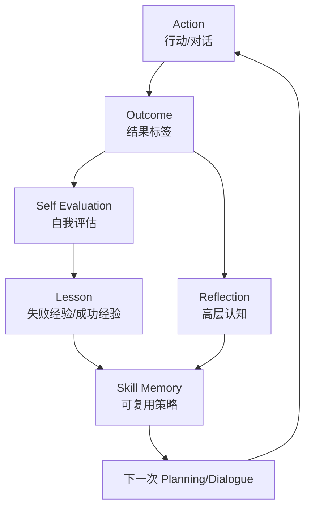

# 第 33 章 反思系统升级：从事件反思到经验学习

## 33.1 核心问题

上一章讨论记忆系统升级。记忆回答的是：

```text
智能体经历过什么？
```

反思回答的是：

```text
智能体如何理解这些经历？
```

在 Generative Agents 中，reflection 是让角色行为变得可信的关键。如果只有原始观察，角色会被大量细节淹没。有了反思，角色才能从事件中形成高层认知。例如：

```text
玛丽亚对克劳斯的研究表现出兴趣。
```

比下面这句更有行为意义：

```text
玛丽亚和克劳斯在图书馆聊了几句话。
```

但 2023-2026 年的前沿研究进一步推动了一个问题：

```text
反思能不能不只是总结过去，而是帮助智能体下次做得更好？
```

本章聚焦六个问题：

1. Generative Agents 当前如何实现 reflection？
2. 当前 reflection 的优势和局限是什么？
3. Reflexion 给我们什么启发？
4. Voyager 的技能库思想如何迁移到小镇智能体？
5. 如何把事件反思升级成行动后复盘和经验学习？
6. 如何评价反思升级是否有效？



*图 33-1：从 reflection 到 reflexion-style learning 的闭环。反思升级的关键是让失败和成功经验进入后续行动，而不是只生成一段总结。*

## 33.2 当前项目的反思入口

Generative Agents 的反思逻辑在：

```text
generative_agents/modules/agent.py
```

核心函数是：

```python
Agent.reflect()
```

它的触发条件是：

```python
if self.status["poignancy"] < self.think_config["poignancy_max"]:
    return
```

只有当重要性累积到阈值时，角色才会反思。当前配置中阈值来自：

```text
generative_agents/data/config.json
```

对应字段：

```json
"poignancy_max": 150
```

这符合论文思想。人不会对每件小事都深度反思。只有足够重要的经历积累后，才值得生成高层认知。

## 33.3 当前反思的四个步骤

`Agent.reflect()` 大致分为四步。第一，取出近期事件和想法。

```python
nodes = self.associate.retrieve_events() + self.associate.retrieve_thoughts()
```

第二，按访问时间排序，保留一定数量。

```python
nodes = sorted(nodes, key=lambda n: n.access, reverse=True)[
    : self.associate.max_importance
]
```

第三，生成反思焦点问题。

```python
focus = self.completion("reflect_focus", nodes, 3)
```

第四，围绕焦点检索相关记忆，生成 insight。

```python
retrieved = self.associate.retrieve_focus(focus, reduce_all=False)
for r_nodes in retrieved.values():
    thoughts = self.completion("reflect_insights", r_nodes, 5)
```

生成的 insight 会被写回记忆：

```python
_add_thought(thought, evidence)
```

这条链非常清晰：

```text
重要事件积累
  -> 生成反思问题
  -> 检索相关记忆
  -> 生成洞察
  -> 写入 thought
```

## 33.4 当前反思 prompt 做了什么

反思相关 prompt 在 `generative_agents/data/prompts/` 下。主要包括：

| prompt 文件 | 中文意思 | 它解决的问题 |
| --- | --- | --- |
| `reflect_focus.txt` | 生成反思焦点。 | 从近期记忆中提出值得深入思考的问题。 |
| `reflect_insights.txt` | 生成反思洞察。 | 围绕焦点问题，把证据压缩成高层 thought。 |
| `reflect_chat_planing.txt` | 反思聊天对计划的影响。 | 判断一段聊天是否应该改变后续日程。 |
| `reflect_chat_memory.txt` | 反思聊天对记忆的影响。 | 判断一段聊天中哪些关系、承诺或事实应该写入记忆。 |

`reflect_focus.txt` 的作用是：

```text
根据给定记忆节点，生成需要深入思考的问题。
```

例如：

```text
凯莉今天的生活重点是什么？
凯莉最近的社交活动如何？
凯莉的日常习惯有什么变化？
```

`reflect_insights.txt` 的作用是：

```text
根据记忆节点生成反思洞察，并标注相关节点编号。
```

当前项目不是只让模型随便写感想，而是要求 insight 绑定证据节点。`reflect_chat_planing.txt` 和 `reflect_chat_memory.txt` 则处理聊天后的计划影响和记忆内容。这说明 Generative Agents 已经比“单纯总结器”更进一步。它已经在问：

```text
这次对话是否影响我的计划？
这次对话有什么值得记住？
```

## 33.5 当前反思的优势

当前 reflection 有四个优点。第一，它有触发阈值。避免每一步都反思，降低成本。第二，它基于记忆证据。`reflect_insights` 输出 insight 时会绑定相关节点。第三，它把反思写回 memory stream。生成的 thought 会影响后续检索和行为。第四，它处理对话影响。聊天不仅生成对话记录，还会生成计划和记忆层面的总结。这四点说明当前项目已经保留了 Generative Agents 论文的精华。但它仍然不是完整的“经验学习”系统。

## 33.6 当前反思的局限

当前 reflection 的主要局限有五个。第一，反思不一定针对失败。它根据重要性触发，但不关心某个行动是否成功。第二，反思不一定形成可执行策略。例如：

```text
伊莎贝拉应该更关注顾客的需求。
```

这句话是想法，但不一定能转成下次行动。第三，缺少结果标签。系统没有明确记录：

```text
这次邀请成功了吗？
这次竞选宣传有效吗？
这次讨论会有人参加吗？
```

第四，缺少技能库。成功经验不会被沉淀成可复用方法。第五，缺少反思质量评价。系统会保存 thought，但不会判断 thought 是否真的改善后续行为。这些局限正是 Reflexion 和 Voyager 思想可以补足的地方。

## 33.7 Reflexion 的启发

Reflexion 的关键思想是：

```text
让语言反馈成为 agent 自我改进的材料。
```

它不是通过修改模型参数来学习。而是让 agent 在失败后生成 verbal reflection，并在下一次尝试中使用。这和 Generative Agents 的 reflection 有相似之处。两者都使用自然语言反思。但侧重点不同。Generative Agents 更关注：

```text
我从近期经历中理解到了什么？
```

Reflexion 更关注：

```text
我上次为什么失败，下次该怎么改？
```

对 Generative Agents 来说，这个差异很重要。小镇角色不只要知道过去，还要能调整策略。例如：

```text
伊莎贝拉邀请失败后，下次先询问对方是否有空，而不是直接发出邀请。
```

或者：

```text
山姆发现汤姆不信任自己后，下次先回应汤姆关心的社区问题，而不是泛泛宣传竞选。
```

这就是从 reflection 到经验学习的升级。

## 33.8 Voyager 的启发

Voyager 的启发来自另一个方向：

```text
把成功经验沉淀为可复用技能。
```

在 Minecraft 环境中，Voyager 通过探索、反馈和技能库不断扩展能力。小镇智能体不需要挖矿或建造工具。但它同样可以拥有“社交技能”和“组织技能”。例如：

```text
invite_to_event
```

用于邀请别人参加活动。

```text
campaign_conversation
```

该技能用于和居民讨论竞选。

```text
host_discussion
```

该技能用于组织小型讨论会。

```text
repair_relationship
```

用于缓和紧张关系。这些技能不是写死的脚本。而是从经验中抽取的自然语言策略。它们可以作为 memory type 保存，供后续对话和计划使用。

## 33.9 升级方向一：行动后复盘

第一项可实现升级是行动后复盘。当前行为链大致是：

```text
plan -> action -> observation -> memory -> reflection
```

升级后增加：

```text
plan -> action -> outcome -> self_evaluate -> lesson -> future_strategy
```

例如伊莎贝拉邀请亚当参加派对。结果可能是：

```text
亚当接受。
```

也可能是：

```text
亚当拒绝，因为他要写作。
```

系统应记录 outcome。然后生成复盘：

```text
亚当正在专注写作，直接邀请他参加长时间派对效果不好。以后可以邀请他短暂停留，或选择他休息时再提。
```

这条 lesson 比普通反思更可执行。

## 33.10 结果标签设计

行动后复盘需要先知道结果。建议引入简单结果标签：

```text
success
partial
failed
unknown
```

示例：

```text
success：对方明确接受邀请。
partial：对方表示有兴趣但不确定。
failed：对方拒绝或话题没有传达。
unknown：无法判断结果。
```

这些标签可以用于：

- 邀请。
- 竞选宣传。
- 讨论会组织。
- 关系修复。
- 协作任务。

不要一开始追求复杂奖励函数。先用可解释标签。这样读者能理解结果，也能在 `simulation.md` 中核对。

## 33.11 建议新增 prompt

可以新增三个 prompt。第一：

```text
self_evaluate_action.txt
```

输入：

- 行动目标。
- 行动过程。
- 对方反应。
- 当前角色设定。

输出：

```json
{
  "outcome": "partial",
  "reason": "对方表示感兴趣，但没有明确承诺参加。",
  "evidence": ["node_31"]
}
```

第二：

```text
extract_lesson.txt
```

输入：

- 行动目标。
- outcome。
- 对话或事件证据。

输出：

```json
{
  "lesson": "邀请忙碌的人时，应先询问时间安排，再给出灵活参与方式。",
  "applies_to": "invite_to_event",
  "confidence": 0.7
}
```

第三：

```text
apply_lesson_to_plan.txt
```

输入：

- 当前目标。
- 可用 lesson。
- 当前对象。

输出：

```json
{
  "strategy": "先询问对方是否有空，再简短介绍派对，并说明可以只来十分钟。",
  "reason": "目标人物最近忙于写作，不适合直接要求长时间参加。"
}
```

这三个 prompt 构成最小经验学习闭环。

## 33.12 升级方向二：技能库

经验学习如果只保存单条 lesson，长期会变散。更好的方式是技能库。技能可以作为记忆类型：

```text
skill
```

结构示例：

```json
{
  "name": "invite_to_event",
  "condition": "需要邀请别人参加活动",
  "steps": [
    "先根据关系和场景判断对方是否适合邀请",
    "简短说明活动时间、地点和主题",
    "给对方留下拒绝或稍后决定的空间",
    "如果对方感兴趣，记录承诺和时间"
  ],
  "evidence": ["node_31", "node_42"],
  "success_count": 2,
  "failure_count": 1
}
```

技能不是函数。它是自然语言策略。它可以进入 prompt，帮助模型生成更好的对话或计划。例如对话前检索：

```text
当前目标是邀请克劳斯参加讨论会。
检索 skill: invite_to_event。
```

模型就能使用过去经验。

## 33.13 技能库和硬编码的区别

技能库容易被误解成硬编码脚本。两者不同。硬编码脚本是：

```text
如果遇到 A，就说固定句子 B。
```

技能库是：

```text
给模型提供经过经验沉淀的策略，让它结合当前场景生成具体行动。
```

例如技能可以说：

```text
邀请忙碌的人时，要给出短时间参与选项。
```

但不规定必须说哪一句话。这样保留了生成式系统的灵活性。技能库应该影响行为，不应替代模型判断。

## 33.14 升级方向三：失败驱动反思

当前 reflection 主要由 poignancy 触发。可以增加失败触发。例如：

```text
如果 outcome == failed，并且目标重要性高，则触发 self_reflection。
```

这样一些低频但关键的失败不会被忽略。例如：

- 伊莎贝拉连续三次没有传播派对消息。
- 山姆连续遇到反对意见。
- 克劳斯组织讨论会没人回应。
- 角色口头答应活动但没有到场。

这些都是值得反思的失败。失败反思 prompt 可以问：

```text
这次行动原本目标是什么？
结果为什么没有达成？
哪些因素来自对方状态？
哪些因素来自我的表达方式？
下次可以采取什么不同策略？
```

这比普通 insight 更具体。

## 33.15 升级方向四：把反思连接到计划

反思如果不影响计划，就只是漂亮文本。因此需要把 lesson 和 skill 放入计划生成上下文。当前项目中，计划相关逻辑包括：

- wake up。
- daily schedule。
- schedule decompose。
- schedule revise。
- determine action。

升级时可以在两个位置使用反思结果。第一，生成日程时。例如：

```text
山姆昨天发现居民更关心公园安全，因此今天上午安排去公园附近与居民交流。
```

第二，生成当前行动时。例如：

```text
伊莎贝拉根据上次邀请失败经验，决定先找熟悉顾客，而不是随机邀请陌生人。
```

这要求检索：

```text
goal + relevant lesson + relationship + recent thought
```

反思只有进入计划上下文，才真正改变行为。

## 33.16 升级方向五：反思质量评分

不是所有反思都有价值。可以给反思打分。维度包括：

```text
groundedness
```

该项检查反思是否基于真实证据。

```text
specificity
```

是否具体，而不是空话。

```text
actionability
```

该项检查反思是否能指导后续行动。

```text
consistency
```

是否与角色设定和已有记忆一致。

```text
impact
```

后续是否真的影响行为。示例低质量反思：

```text
伊莎贝拉应该更加努力与大家交流。
```

问题：

- 太泛。
- 没有对象。
- 没有策略。
- 不容易评价。

示例高质量反思：

```text
伊莎贝拉发现亚当在写作时不愿长时间参加活动；下次邀请亚当时，应强调他可以短暂停留，并选择他休息时再提。
```

这条反思更好，因为它有对象、原因和行动策略。

## 33.17 最小可行升级方案

建议读者从一个最小升级开始：

```text
邀请任务失败复盘
```

步骤：

1. 在对话后判断是否传达了邀请。
2. 如果对方拒绝或未表态，生成 `lesson`。
3. 将 lesson 写入 `thought` 或新增 `skill`。
4. 下一次邀请前检索 lesson。
5. 比较升级前后邀请成功率和对话质量。

实验对象：

```text
伊莎贝拉的情人节派对。
```

评价：

- 邀请是否更自然。
- 是否减少重复邀请。
- 是否更好处理拒绝。
- 是否能针对不同关系调整话术。
- 是否出现过度策略化、不像生活的行为。

这个实验足够小，但能体现 Reflexion-style learning 的价值。

## 33.18 风险与边界

反思增强会带来风险。第一，反思可能变成伪内心。越深刻的反思越容易让人误以为角色有真实意识。第二，失败标签可能过度简化社会行为。一次拒绝不一定是失败，可能是合理选择。第三，技能库可能让角色行为过度工具化。如果每次社交都像执行任务，会失去生活感。第四，错误 lesson 会长期影响行为。例如模型错误总结：

```text
汤姆拒绝山姆是因为汤姆讨厌所有社区活动。
```

这种错误会污染后续关系。因此反思升级必须保留：

- 证据节点。
- 置信度。
- 可删除机制。
- 人工抽样检查。
- 行为影响评价。

反思不是越多越好。好的反思应该少而准，并能被证据支撑。

## 33.19 本章小结

反思升级要从“想明白发生了什么”走向“下次能做得更好”。Reflexion、Voyager 这类工作能给 Generative Agents 带来改进，但反思不能写成漂亮却无用的文本。

| 本章内容 | 核心结论 |
| --- | --- |
| 当前反思入口 | `Agent.reflect()` 在 poignancy 达到阈值后触发。 |
| 当前流程 | 生成 focus、检索相关记忆、生成 insights，并把 thought 写回记忆。 |
| 当前局限 | 已有证据节点和对话总结，但不一定针对失败，也不一定形成可执行策略。 |
| Reflexion 启发 | 失败后的语言反馈可以成为下一次行动的改进材料。 |
| Voyager 启发 | 成功经验可以沉淀为可复用技能库。 |
| 升级方向 | 行动后复盘、结果标签、lesson 提取、技能库、失败驱动反思和反思质量评分都可落地。 |
| 行为连接 | 反思必须连接到计划和对话上下文，否则只是漂亮文本。 |
| 最小实验 | 可以从伊莎贝拉派对邀请失败复盘开始。 |
| 风险边界 | 反思增强会提高拟人化、错误经验固化和行为工具化风险，必须配套证据、置信度和评价。 |

下一章讨论规划系统升级。记忆和反思让角色知道过去、理解过去；规划系统要解决的是：面对目标和不确定环境，角色下一步应该怎么做。

## 参考资料

- Generative Agents: https://arxiv.org/abs/2304.03442
- Reflexion: https://arxiv.org/abs/2303.11366
- Voyager: https://arxiv.org/abs/2305.16291
- Local source: `generative_agents/modules/agent.py`
- Local source: `generative_agents/modules/prompt/scratch.py`
- Local prompts: `generative_agents/data/prompts/reflect_focus.txt`
- Local prompts: `generative_agents/data/prompts/reflect_insights.txt`
- Local prompts: `generative_agents/data/prompts/reflect_chat_planing.txt`
- Local prompts: `generative_agents/data/prompts/reflect_chat_memory.txt`
