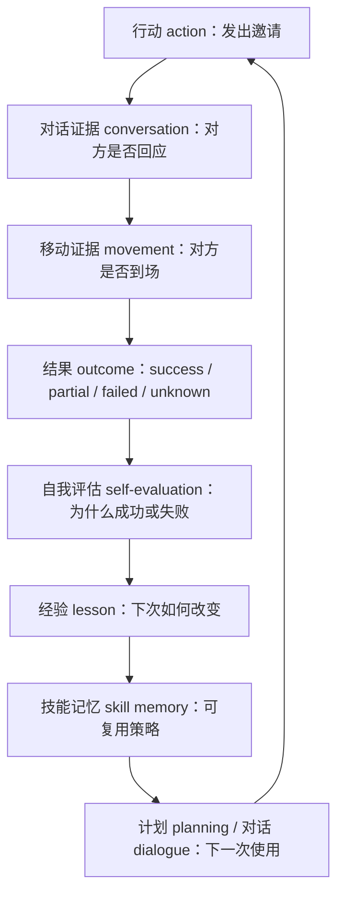
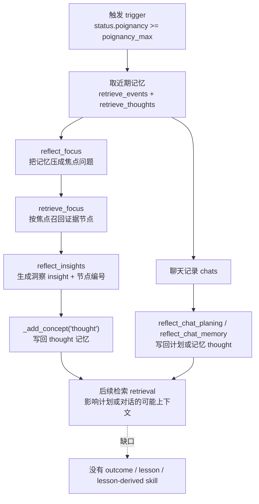
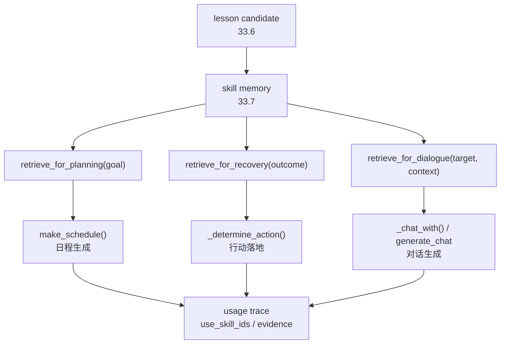
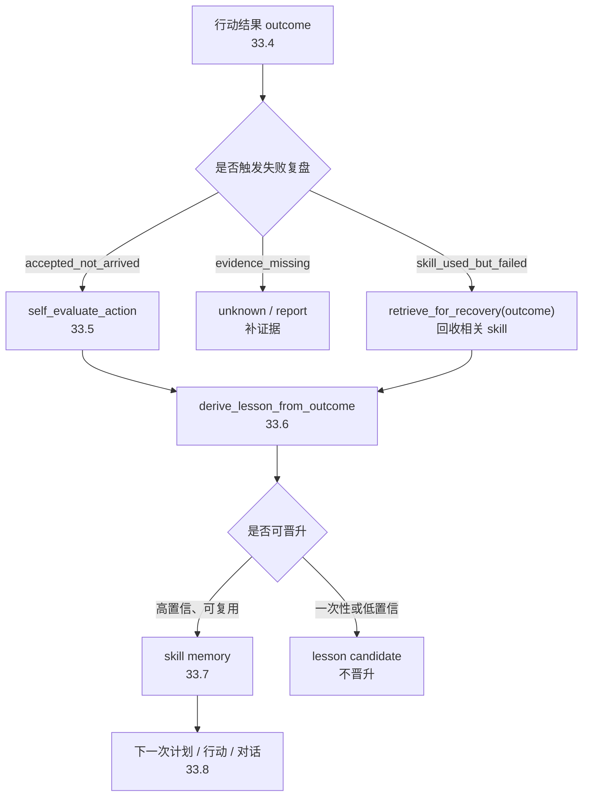
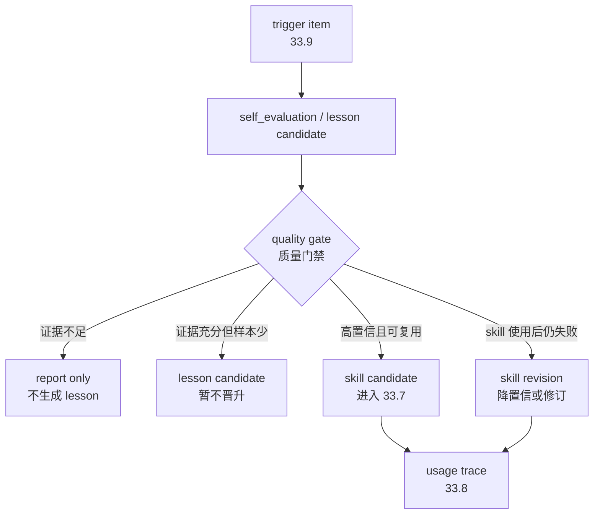
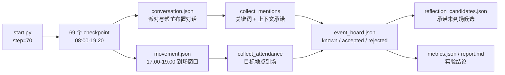

# 第 33 章 反思系统升级：从事件反思到经验学习

## 33.1 从一次没有落地的邀请开始

`book-party-extended` 实验里，伊莎贝拉在 11:30 向玛丽亚发出邀请：

```text
玛丽亚，今天的三明治看起来很美味呢！下午五点的情人节派对你一定要来哦，我已经准备好了一些特别的安排。
```

玛丽亚的回答也很明确：

```text
哇，情人节派对？听起来太棒了！我五点刚好有休息时间，肯定会去参加的！
```

这两句来自 `conversation.json` 的 `20240214-11:30` 对话记录。只看对话，邀请似乎成功，但 17:00 附近的移动回放 movement 给出了具体的行为：`movement.json` 在 frame `3241` 的快照里，伊莎贝拉已经在 `霍布斯咖啡馆，咖啡馆，咖啡馆顾客座位` 迎接客人，玛丽亚仍在 `奥克山学院宿舍，玛丽亚的房间，书桌`。这不是简单的“模型没写好故事”，而是反思系统 reflection system 没有把“承诺 accepted”和“到场 arrived”拆成可复核的结果 outcome。

当前项目中的反思 reflection 需要从 `生成高层想法 thought` 推进到 `行动后复盘 post-action review -> 经验 lesson -> 可复用技能 skill -> 下一次行动`。反思式学习 Reflexion 和 Voyager 指向同一个工程约束：失败证据必须回到 `conversation.json`、`movement.json`、`simulation.md`、断点 checkpoint 和指标 metrics / 报告 report，而不是只在角色内心独白里变得更深刻。

### 论文依据与工程落点

通过 Generative Agents、Reflexion、Voyager 和 ReAct 四条论文线索，将可验证结果 outcome、语言经验 lesson、技能记忆 skill 和失败触发 trigger 落到 `generative_agents_next` 项目。

| 升级方向 | 论文名称 | 论文原文要点 | 本项目结论 |
| --- | --- | --- | --- |
| 反思基线 reflection baseline | Generative Agents: Interactive Simulacra of Human Behavior | 论文把架构概括为保存经历、生成 `higher-level reflections`，并 `retrieve them dynamically` 来计划行为。 | `Agent.reflect()` 是基线，不应推翻；升级应在旧 thought 链路旁增加 outcome/lesson/skill，而不是重写反思主循环。 |
| 语言反馈 verbal feedback | Reflexion: Language Agents with Verbal Reinforcement Learning | Reflexion 强调 `not by updating weights`，而是通过 `linguistic feedback` 强化语言智能体。 | 本项目不训练模型参数；失败复盘应写成可检索的自然语言 lesson，并存入 `Associate` 或评价产物。 |
| 情节记忆 episodic memory | Reflexion: Language Agents with Verbal Reinforcement Learning | 论文让智能体把 reflective text 放入 `episodic memory buffer`，用于 subsequent trials。 | `reflection_candidates.json` 是第一步；后续要把 lesson 写成带 evidence/confidence 的记忆节点，供下一次相似事件检索。 |
| 结果信号 feedback signal | Reflexion: Language Agents with Verbal Reinforcement Learning | 论文允许反馈信号来自外部或内部模拟，形式可以是标量或自由文本。 | 不能只靠角色内心 thought；`conversation.json` 的承诺、`movement.json` 的到场、`metrics.json` 的失败项都应进入 `ActionOutcome`。 |
| 推理-行动-观察闭环 reason-act-observe | ReAct: Synergizing Reasoning and Acting in Language Models | ReAct 让 LLM 交错生成 `reasoning traces and task-specific actions`，行动再从环境获得观察。 | 反思 lesson 不能脱离行动观察；承诺 accepted 是对话观察，到场 arrived 是环境观察，二者不一致才触发失败复盘。 |
| 技能库 skill library | Voyager: An Open-Ended Embodied Agent with Large Language Models | Voyager 使用 `ever-growing skill library` 存储和检索复杂行为，技能可解释、可组合。 | 第 32 章已有 `skill` 类型；反思升级要区分冲突恢复 skill 和由 outcome/lesson 生成的 lesson-derived skill。 |
| 自我验证 self-verification | Voyager: An Open-Ended Embodied Agent with Large Language Models | Voyager 的迭代提示机制纳入 `environment feedback`、execution errors 和 `self-verification`。 | `self_evaluate_action` prompt 必须接收对话、移动、日程和人设证据；低置信度时标记 `unknown`，不能编造成功。 |
| 失败触发 failed-outcome trigger | Reflexion: Language Agents with Verbal Reinforcement Learning；ReAct: Synergizing Reasoning and Acting in Language Models | Reflexion 从 task feedback 生成语言反思，ReAct 用观察更新行动轨迹。 | `poignancy_max` 不是唯一触发器；`accepted_not_arrived`、`rejected`、`evidence_missing` 应触发反思候选。 |
| 可验证评价 evaluation | Generative Agents: Interactive Simulacra of Human Behavior；Voyager: An Open-Ended Embodied Agent with Large Language Models | 前者用消融说明 observation、planning、reflection 都影响可信行为；后者用任务指标比较 lifelong learning。 | 实验必须输出 `reflection_candidates.json`、`metrics.json` 和 `report.md`；不能凭一段好看的 `simulation.md` 判断经验学习成功。 |

这些论文不是装饰性引用。它们对应的工程对象是 `ActionOutcome`、`reflection_candidates.json`、`lesson`、`skill`、`self_evaluate_action` 和 `goal_completion_rate`。



*图 33-1：反思式学习 reflexion-style learning 在当前项目中的闭环。行动 action 不能只落到想法 thought，还要绑定对话记录 conversation、移动回放 movement 和结果 outcome，再把经验 lesson 写回后续计划 planning 或对话 dialogue。*


*图 33-2：从失败结果到可复用技能记忆。左侧红色失败回放表示行动 action 没有达成预期 outcome；中间的证据桌把 `conversation.json`、`movement.json`、`simulation.md` 和日程 schedule 放在一起复核；右侧的蓝绿色记忆胶囊表示自我评价 self-evaluation、经验 lesson 和技能记忆 skill memory 被写回，等待下一次行动调用。*

## 33.2 高频术语锚点表

| 中文 English | 项目含义 | 当前项目锚点 |
| --- | --- | --- |
| 反思 reflection | 从近期事件 event 和想法 thought 中生成高层理解。 | `Agent.reflect()` |
| 重要性 poignancy | 事件进入反思前累积的触发分数。 | `status["poignancy"]`、`poignancy_max` |
| 洞察 insight | `reflect_insights` 输出的高层想法。 | 写回 `node_type="thought"` |
| 证据 evidence | 支撑洞察 insight 的记忆节点编号或运行材料。 | 当前传入 `filling`，但未持久化到 metadata |
| 结果 outcome | 一次行动是否达成目标的标签。 | 当前缺失，需新增 |
| 经验 lesson | 从 outcome 和证据中抽取的可执行改进。 | 可写入 thought 或 skill |
| 技能记忆 skill memory | 从多次 lesson 中沉淀出的自然语言策略。 | 当前 `Associate.memory` 仅有 event/chat/thought，需扩展 |
| 指标 metrics | 判断升级是否改善行为的结构化结果。 | `docs/book/assets/chapter_29/ch29_book_custom_discussion_metrics.json` |
| 报告 report | 给人复核的证据摘要和裁判意见。 | 第 37 章继续展开 |

## 33.3 已有反思链路基线图

第 21 章已经展开过 `reflect_focus`、`reflect_insights` 和聊天后反思 prompt；第 32 章又补过 `source_nodes`、`confidence`、`skill`、`conflict` 等记忆治理字段。旧反思链路可以压缩成一张基线图：它能生成 thought，但还没有结果标签 outcome 和可复用经验 lesson。



*图 33-3：已有反思 reflection 的处理链路。旧系统能从重要事件和对话生成 thought，但它不知道一次行动是否成功，也不会把“承诺未到场”沉淀成可复用 lesson。*

把图 33-3 和派对案例合在一起看，旧链路的问题不是缺少“反思”这个动作，而是缺少面向行动结果的证据闭环。原始 `generative_agents` 已经保留 Generative Agents 论文中的核心反思机制：重要事件积累、焦点生成、相关记忆召回、洞察写回；第 32 章的 `generative_agents_next` 又补上了 `source_nodes`、`confidence`、`skill`、`conflict` 等记忆治理字段。仍然缺的是把一次行动的结果 outcome 变成可复用经验 lesson。

| 链路位置 | 当前能力 | 项目证据 | 经验学习缺口 |
| --- | --- | --- | --- |
| 触发 trigger | `poignancy_max=150` 达到阈值后启动 `Agent.reflect()`。 | `generative_agents/data/config.json`、`Agent.reflect()` | 不会因 `accepted_not_arrived`、`rejected`、`evidence_missing` 等关键失败直接触发。 |
| 洞察生成 insight | `reflect_focus -> retrieve_focus -> reflect_insights -> thought`。 | `generative_agents/data/prompts/reflect_focus.txt`、`generative_agents/data/prompts/reflect_insights.txt` | 洞察没有 outcome、evidence、lesson 结构；原始目录也没有把 `filling` 持久化到 metadata。 |
| 聊天后反思 chat reflection | `reflect_chat_planing`、`reflect_chat_memory` 把对话写成 thought。 | `generative_agents/data/prompts/reflect_chat_planing.txt`、`book-party-extended/conversation.json` | 不能区分承诺 accepted、拒绝 rejected、到场 arrived、未知 unknown。 |
| 记忆治理 memory governance | `generative_agents_next` 已能保存 `source_nodes`、`confidence`、`skill`、`conflict`。 | `Associate.add_node()`、`memory_metrics.json` | 证据链还没有服务于经验学习；缺少 outcome 证据结构和 lesson 写回。 |
| 后续行动 action reuse | thought 可被后续检索召回，影响计划或对话上下文。 | `Agent.make_schedule()`、`Agent._determine_action()` | 没有保证 lesson 进入计划 planning 或行动选择 action selection。 |
| 评价 evaluation | 第 29 章已有指标脚本可抽取行动、承诺和到场线索。 | `docs/book/scaffolds/part_04_05/ch29_evaluate_simulation.py`、`reflection_candidates.json` | 反思本身还需要质量评分，区分证据充分、证据冲突和证据缺失。 |

派对案例的关键不是“系统会不会反思”，而是旧反思会把山姆或玛丽亚的对话写成高层 thought，却不会形成这样的判断：某人有承诺，但在目标时间窗没有被 `movement.json` 验证到场。经验学习从这里进入 outcome、lesson、skill 和失败触发。

## 33.4 升级点一：结果标签 outcome

结果标签 outcome 是经验学习的入口。第 33 章没有新增 `ActionOutcome` 运行时类，也没有把 outcome 写进 `Associate`；当前已经实现的是评价侧候选抽取：`generative_agents_next/analyze_experiment.py` 读取对话、到场和目标地点，把“承诺但未到场”的角色写入 `reflection_candidates.json`。

```python
def build_reflection_candidates(event_board, mentions):
    candidates = []
    arrived = set(event_board["arrived"])
    for speaker in event_board["accepted"]:
        if speaker in arrived:
            continue
        evidence = [
            {
                "time": row["time"],
                "route": row["route"],
                "text": row["text"],
            }
            for row in mentions
            if row["speaker"] == speaker and row["commitment"] == "accepted"
        ]
        candidates.append(
            {
                "agent": speaker,
                "outcome": "failed",
                "failure_type": "commitment_not_verified_by_movement",
                "lesson": "承诺类对话需要在目标时间窗用 movement.json 复核到场，而不是只相信聊天摘要。",
                "evidence": evidence,
            }
        )
    return candidates
```

`book-reflection-party` 实验生成的真实结果是：

```json
[
  {
    "agent": "山姆",
    "outcome": "failed",
    "failure_type": "commitment_not_verified_by_movement",
    "lesson": "承诺类对话需要在目标时间窗用 movement.json 复核到场，而不是只相信聊天摘要。",
    "evidence": [
      {
        "time": "20240214-09:30",
        "route": "伊莎贝拉 -> 山姆 @ the Ville，约翰逊公园，公园，公园花园",
        "text": "下午没问题！我正好要去你那儿取詹妮弗的甜点，正好顺路帮忙布置。我这老海军挂装饰还是有一手的，保证给你们弄得漂漂亮亮的！"
      }
    ]
  }
]
```

这个结果刻意只判 `failed`，没有把成功、部分成功、未知都写进去。原因很简单：当前脚本只实现了“承诺未被 movement 验证”的失败候选抽取，不能冒充完整的 `ActionOutcome` 系统。

| 标签 | 判定口径 | 强证据 | 弱证据 | 派对实验样例 |
| --- | --- | --- | --- | --- |
| 成功 success | 目标被明确达成。 | 对方明确接受，并在 movement 中到场。 | `simulation.md` 事后摘要。 | 需要同时看到承诺和到场。 |
| 部分 partial | 对方知道信息，但承诺或执行不完整。 | 对话中表示兴趣，movement 未到场。 | 日程里提到活动但无位置证据。 | 玛丽亚 11:30 接受，17:00 附近未到咖啡馆，可标 partial。 |
| 失败 failed | 对方拒绝，或目标没有传达。 | 对话里明确拒绝；后续无行动证据。 | 关键词未命中。 | 山姆因与詹妮弗晚餐，无法 17:00 参加。 |
| 未知 unknown | 证据不足，不能判断。 | 缺少 conversation 或 movement。 | 只有角色设定。 | 压缩结果缺少某段原始对话时使用。 |


## 33.5 升级点二：自我评估 prompt

结果标签 outcome 只是第一层判断，真正危险的是把“看起来合理的故事”当成事实，例如 `simulation.md` 写得热闹，就误以为所有承诺者都到场了。自我评估 prompt 的职责不是继续写故事，而是把一次行动放到证据桌上裁决：目标是什么、对方是否承诺、目标时间窗内是否到场、证据是否足够。这个 prompt 放在 outcome 候选之后、lesson 生成之前。它不替代 `Agent.reflect()`，也不替代 `reflect_insights`；它只处理已经被证据链标记出来的一次行动结果。

| 项目 | 设计 |
| --- | --- |
| 提示词目标路径 | `generative_agents_next/data/prompts/self_evaluate_action.txt` |
| 调用时机 | 生成 outcome 候选之后，抽取 lesson 之前。 |
| 输入来源 | 对话证据 `conversation.json`、移动证据 `movement.json`、当前日程 schedule、角色设定 persona、目标 goal。 |
| 输出结构 schema | `outcome: str`、`reason: str`、`failure_type: str`、`evidence: list[str]`、`confidence: float`。 |
| 输出流向 | 高置信结果进入 lesson 抽取；低置信或证据不足时标记 `unknown`，进入报告 report 或人工复核。 |
| 失败回退 failsafe | 缺少对话或移动证据时，不生成成功结论；地点或时间窗口冲突时，优先输出 `unknown`。 |

```text
你正在评估 ${agent} 的一次行动是否达成目标。

目标 goal：
${goal}

计划行动 intended_action：
${intended_action}

对话证据 conversation_evidence：
${conversation_evidence}

移动证据 movement_evidence：
${movement_evidence}

日程上下文 schedule_context：
${schedule_context}

角色设定 persona_context：
${persona_context}

判断规则：
1. 只能根据证据判断，不能根据故事合理性补全事实。
2. 对方知道活动，不等于对方承诺参加。
3. 对方承诺参加，不等于目标时间窗内实际到场。
4. `simulation.md` 只能作为弱证据，不能覆盖 `conversation.json` 和 `movement.json`。
5. 证据不足、地点不一致或时间窗口不完整时，输出 `unknown`。

请只返回 JSON：
{
  "outcome": "success | partial | failed | unknown",
  "reason": "一句话说明判定原因",
  "failure_type": "no_contact | rejected | no_arrival | schedule_conflict | evidence_missing | none",
  "evidence": ["使用到的证据路径、时间点或节点编号"],
  "confidence": 0.0
}
```

这条 prompt 的关键约束是“先裁证据，再谈经验”。如果只有一句“我会去”，但 `movement.json` 在目标窗口没有到场记录，不能输出 `success`；如果目标地点本身存在歧义，也不能强行输出 `failed`，而应输出 `unknown` 或较低置信度。这样后面的 lesson 才不会把一次证据误判固化成长期策略。

## 33.6 升级点三：从结果抽取经验 lesson

`33.5` 的自我评估 prompt 先裁定证据，`33.6` 才能抽取经验 lesson。lesson 不是把 `failed` 翻译成“下次更努力”，而是把一次失败拆成可复用的行动规则：什么场景适用、下一次怎么改、哪些证据支撑它、什么时候不能使用。

这个 prompt 只消费已经裁过的 outcome，不直接读取松散故事摘要。它的输入应来自 `self_evaluate_action` 的输出和原始证据包，避免模型绕过证据重新编一个更顺的解释。

| 项目 | 设计 |
| --- | --- |
| 提示词目标路径 | `generative_agents_next/data/prompts/derive_lesson_from_outcome.txt` |
| 调用时机 | `self_evaluate_action` 输出 `success / partial / failed / unknown` 之后。 |
| 输入来源 | `outcome`、`reason`、`failure_type`、`evidence`、`confidence`、原始 action、目标 goal、角色设定 persona、已有相似 lesson。 |
| 输出结构 schema | `lesson: str`、`applies_to: list[str]`、`avoid_when: str`、`next_action_hint: str`、`evidence: list[str]`、`confidence: float`。 |
| 输出流向 | 高置信 lesson 先作为 lesson candidate 保存；进入 skill memory 前还要经过合并、去重和质量评分。 |
| 失败回退 failsafe | `outcome="unknown"` 或证据冲突时，不生成行动策略，只生成“需要补充哪些证据”的检查项。 |

```text
你正在把一次行动结果转化为可复用经验 lesson。

行动 action：
${action}

目标 goal：
${goal}

结果裁定 outcome_review：
${outcome_review}

证据 evidence：
${evidence}

角色设定 persona_context：
${persona_context}

已有相似经验 similar_lessons：
${similar_lessons}

生成规则：
1. lesson 必须来自 outcome_review 和 evidence，不能新增没有证据的事实。
2. lesson 必须能改变下一次行动，不能只写情绪总结或道德评价。
3. lesson 必须写明适用范围 applies_to，避免所有社交场景都套用同一策略。
4. 如果 outcome 是 unknown，只输出证据检查项，不输出行动策略。
5. 如果 evidence 显示地点或时间窗口存在歧义，lesson 要保留这个限制。

请只返回 JSON：
{
  "lesson": "一句可执行经验",
  "applies_to": ["适用场景"],
  "avoid_when": "不应该使用这条经验的条件",
  "next_action_hint": "下一次相似场景中的行动提示",
  "evidence": ["使用到的证据路径、时间点或节点编号"],
  "confidence": 0.0
}
```

以派对实验里的“承诺但未到场”候选为例，lesson 不能写成“伊莎贝拉应该更努力邀请大家”。更稳的写法是：

```json
{
  "lesson": "承诺类邀请不能只看对方口头答应；活动开始前需要安排一次低打扰确认，并在目标时间窗用 movement 复核到场。",
  "applies_to": ["event_invitation", "commitment_followup"],
  "avoid_when": "目标地点或目标时间窗尚未确认，先补证据，不直接生成行动策略。",
  "next_action_hint": "在活动开始前向承诺者做一次简短确认，并记录承诺对象、时间和地点。",
  "evidence": [
    "conversation:book-reflection-party:20240214-09:30",
    "movement:book-reflection-party:20240214-17:00-19:00"
  ],
  "confidence": 0.72
}
```

这条 lesson 的价值在于它把失败原因压成了下一次可执行的检查动作：先确认，再复核，而不是把一次失败泛化成角色性格问题。它也保留了证据边界：如果目标地点或时间窗口没有裁清楚，就不能把它升级成长期 skill。

## 33.7 升级点四：技能记忆 skill memory

`33.6` 产出的 lesson 仍然是一次行动后的局部经验。技能记忆 skill memory 不是把每条 lesson 直接套一层 `node_type="skill"`，而是把多条高置信、可复用、证据一致的 lesson 合并成稳定策略。它应该回答三个问题：什么时候触发、下一次怎么做、这条策略来自哪些证据。

`generative_agents_next` 已经有 skill 的承载位置：`Associate.add_node()` 可以写入 `node_type="skill"`，`retrieve_for_planning(goal)` 会检索 `goal / summary / event / skill`，`retrieve_for_recovery(outcome)` 会检索 `skill / summary / event`。第 33 章要补的是 lesson 到 skill 的晋升规则，而不是重新发明一套记忆系统。

| 项目 | 设计 |
| --- | --- |
| 写入入口 | `generative_agents_next/modules/memory/associate.py` 的 `add_node("skill", event, metadata=...)`。 |
| 检索入口 | `retrieve_for_planning(goal)` 和 `retrieve_for_recovery(outcome)`。 |
| 候选来源 | `derive_lesson_from_outcome` 生成的高置信 lesson candidate。 |
| 晋升条件 | lesson 有明确适用场景、可执行下一步、证据可回查，且不是一次性误判。 |
| 输出结构 schema | `name`、`trigger`、`strategy`、`source_lessons`、`evidence`、`success_count`、`partial_count`、`failure_count`、`confidence`。 |
| 失败回退 failsafe | `unknown`、低置信、地点冲突、只出现一次且无法复核的 lesson 不晋升为 skill。 |

一条 lesson-derived skill 可以写成这样：

```json
{
  "node_type": "skill",
  "name": "commitment_followup_for_event",
  "generated_by": "lesson_promotion",
  "trigger": "需要邀请居民参加有明确时间和地点的活动",
  "strategy": [
    "发出邀请时同时说明活动时间、地点和可短暂停留的选项",
    "对方口头答应后，记录承诺对象、承诺时间和目标地点",
    "活动开始前做一次低打扰确认，不反复推销",
    "活动窗口内用 movement 或 checkpoint 复核到场，再判断结果"
  ],
  "source_lessons": [
    "lesson:book-reflection-party:sam:commitment_not_verified_by_movement"
  ],
  "evidence": [
    "conversation:book-reflection-party:20240214-09:30",
    "movement:book-reflection-party:20240214-17:00-19:00"
  ],
  "success_count": 0,
  "partial_count": 0,
  "failure_count": 1,
  "confidence": 0.72,
  "last_updated": "2024-02-14T19:20:00"
}
```

这条 skill 比单条 lesson 更克制：它不说“山姆这个人不可靠”，也不把一次失败写成角色评价；它只保留可迁移的行动策略：承诺要记录，到场要复核，确认要低打扰。

要让 lesson-derived skill 真正进入系统，需要补三处工程接口。

| 接口 | 当前状态 | 升级做法 | 失败模式 | 验证方式 |
| --- | --- | --- | --- | --- |
| 存储 storage | `generative_agents_next` 已有 `skill` 类型。 | 写入 `generated_by="lesson_promotion"`、`source_lessons` 和证据路径，区分第 32 章的冲突恢复 skill。 | 一次性失败被固化成长期策略。 | `docstore.json` 中能看到 skill 节点及其 source lesson。 |
| 检索 retrieval | `retrieve_for_planning()` 和 `retrieve_for_recovery()` 已把 `skill` 纳入候选。 | 用 goal、outcome 和 trigger 检索相关 skill，避免全局无差别注入。 | 无关 skill 干扰普通生活。 | 对邀请任务抽样检查 top-k skill 是否来自活动承诺场景。 |
| 使用 application | `make_schedule()` 和 `_determine_action()` 不能被 skill 直接替代。 | 在目标行动前注入 relevant skill，仍由原本 schedule/action 逻辑生成具体行动。 | 角色变得过度策略化。 | 对比升级前后对话自然性 naturalness 和目标完成率。 |

## 33.8 升级点五：把 lesson / skill 接入计划和对话

lesson 和 skill 写回以后，如果没有进入计划 planning、行动 action 和对话 dialogue，就只是评价报告里的漂亮文本。接入时不能让 skill 直接接管角色行为；它只能作为上下文提醒，最终行动仍由日程、地点、关系、人设和当前环境共同决定。

接入链路可以分成三步：先按目标或失败类型取回相关 skill，再把它压成短策略提示，最后在生成日程、行动或对话时作为约束传入。



| 接入位置 | 当前代码 | 取回策略 | 注入方式 | 输出与痕迹 |
| --- | --- | --- | --- | --- |
| 日程生成 schedule generation | `Agent.make_schedule()` | 用当天目标 goal 调用 `retrieve_for_planning(goal)`，取回 `goal / summary / event / skill`。 | 在 `schedule_daily` 前补一段短上下文：可用 skill、风险、下一步检查动作。 | 当天日程中出现确认、复查、提前沟通等安排；记录 `use_skill_ids`。 |
| 行动落地 action determination | `Agent._determine_action()` | 用失败类型 outcome 调用 `retrieve_for_recovery(outcome)`，取回 `skill / summary / event`。 | 在确定地点和对象前，把 skill 压成 `next_action_hint`，不直接覆盖 `de_plan`。 | `memory.Action` 的 event、object event、address 更贴近目标；保留使用过的 skill 和证据。 |
| 对话生成 dialogue generation | `_chat_with()` 与 `generate_chat` | 用对方姓名和当前话题调用 `retrieve_for_dialogue(target, context)`，再补充相关 skill。 | 对话 prompt 只注入策略边界，例如“低打扰确认”“不要反复推销”。 | 对话更少重复邀请，更能处理拒绝；记录本轮对话使用的 lesson/skill。 |

应用 prompt 不应输出完整行动，而应输出一段可注入上下文：

```text
generative_agents_next/data/prompts/apply_lesson_to_context.txt
```

```text
你正在把 lesson / skill 转化为下一步行动上下文。

当前目标 goal：
${goal}

当前计划或行动 current_plan：
${current_plan}

当前对象 target：
${target}

相关 lesson / skill：
${relevant_skills}

当前地点和时间 context：
${context}

请只返回 JSON：
{
  "strategy_context": "给计划或对话使用的短策略提示",
  "use_skill_ids": ["被使用的 skill 或 lesson id"],
  "risk": "使用这条策略时可能带来的风险",
  "next_action_hint": "下一步行动提示",
  "do_not": ["不应该做的事"]
}
```

以 `commitment_followup_for_event` 为例，输出可以是：

```json
{
  "strategy_context": "对已承诺参加活动的人，只做一次低打扰确认；确认时同时提到时间和地点。",
  "use_skill_ids": ["skill:commitment_followup_for_event"],
  "risk": "反复确认会让对话显得像任务催促，破坏自然社交。",
  "next_action_hint": "在活动开始前遇到承诺者时，简短确认是否仍能到场。",
  "do_not": ["不要把一次未到场直接说成对方不可靠", "不要在没有目标地点证据时判定失败"]
}
```

这一步的边界很重要：skill 是上下文，不是命令。它可以提醒伊莎贝拉“活动开始前要确认承诺”，但不能强迫她无视当前地点、日程和关系状态去执行固定话术。真正有效的经验学习，要能留下 `use_skill_ids`、证据来源和后续 outcome，否则无法判断这条 skill 是否真的改善了下一次行动。

## 33.9 失败驱动反思 trigger

原始反思 reflection 由 `poignancy` 阈值触发，适合处理“哪些记忆重要”。经验学习还需要另一条入口：当一次行动的 outcome 暴露失败、证据缺口或 skill 使用无效时，系统应主动启动复盘。这个入口不是让角色随时自责，而是把失败样例送入 `33.5 -> 33.6 -> 33.7 -> 33.8` 的链路。



失败触发器的输入不是角色内心想法，而是可复查的结果信号。

| 触发信号 | 证据来源 | 处理方式 | 输出 | 限流规则 |
| --- | --- | --- | --- | --- |
| `accepted_not_arrived` | `conversation.json` 有承诺，`movement.json` 在目标窗口没有到场。 | 调用 `self_evaluate_action`，失败类型为 `no_arrival` 或 `schedule_conflict`。 | arrival lesson candidate。 | 必须同时有目标时间窗和目标地点；地点不清时输出 `unknown`。 |
| `rejected` 或 unavailable | 对话中明确拒绝、已有日程冲突或对方无法参加。 | 生成替代策略，例如改成提前祝福、短暂停留或转告。 | failed / partial lesson。 | 同一对象同一活动只触发一次，避免反复总结同一拒绝。 |
| 连续 `partial` | 多次只有传播或口头承诺，没有落地行为。 | 合并相似 evidence，检查是否需要修订已有 skill。 | skill update candidate。 | 至少两次相似失败才考虑更新 skill。 |
| `evidence_missing` | 缺少对话、移动、时间窗或地点证据。 | 标记 `unknown`，进入 report，列出需要补的证据。 | evidence check item。 | 不生成行动策略，不晋升 skill。 |
| `skill_used_but_failed` | `use_skill_ids` 存在，但后续 outcome 仍为 failed。 | 调用 `retrieve_for_recovery(outcome)`，复查这条 skill 是否过度泛化。 | skill revision 或降置信度。 | 同一 skill 一天最多修订一次，避免被单次异常拖偏。 |

触发记录可以写成轻量结构，方便后续报告和人工复核：

```json
{
  "trigger": "accepted_not_arrived",
  "agent": "山姆",
  "goal": "参加 17:00 情人节派对",
  "evidence": [
    "conversation:book-reflection-party:20240214-09:30",
    "movement:book-reflection-party:20240214-17:00-19:00"
  ],
  "next": ["self_evaluate_action", "derive_lesson_from_outcome"],
  "cooldown_key": "山姆:valentine_party:accepted_not_arrived"
}
```

这类触发必须克制。`poignancy` 解决“哪些记忆值得反思”，failed-outcome trigger 解决“哪些结果值得复盘”。如果没有证据、没有可改进动作，或者只是一次模糊异常，就进入 report，而不是生成 lesson；只有证据扎实、失败可定位、下一次行动确实能改变时，才进入 lesson 或 skill 链路。

## 33.10 反思质量评分

`33.9` 决定哪些失败值得复盘，`33.10` 决定复盘产物能走多远。质量评分不是给角色打分，而是防止坏 lesson 污染长期记忆：证据不够的进 report，证据扎实但还没有复用价值的留作 lesson candidate，反复验证且可迁移的才晋升 skill memory。



质量评分应直接绑定证据和下游动作。

| 评分项 | 检查问题 | 合格表现 | 不合格处理 |
| --- | --- | --- | --- |
| 证据扎实度 groundedness | 是否能回到真实证据。 | 至少能回查 `conversation.json`、`movement.json`、checkpoint 或 `docstore.json` 中的节点。 | 进入 report only；不能生成成功结论，不能晋升 skill。 |
| 结果一致性 outcome consistency | outcome 是否和证据、目标窗口、目标地点一致。 | `accepted`、`arrived`、`rejected`、`unknown` 的判断不互相冲突。 | 标记 `unknown`，补充需要复查的时间窗或地点。 |
| 具体性 specificity | lesson 是否有对象、场景和原因。 | 能说清“谁、在什么目标、因为什么证据失败”。 | 退回重写；拒绝“下次更努力”这类空话。 |
| 可行动性 actionability | 下一次行动是否能改变。 | 有 `next_action_hint`，能进入计划、行动或对话上下文。 | 只保留为观察摘要，不进入 skill。 |
| 适用范围 scope control | 是否写清 applies_to 和 avoid_when。 | 知道这条经验适用于什么场景，也知道什么时候不能用。 | 不晋升 skill，避免一条失败经验泛化到所有社交。 |
| 角色一致性 persona consistency | 是否符合角色人设和自然社交。 | 策略像提醒，不像硬性任务脚本。 | 降低 confidence，进入人工复核。 |
| 复用可追踪性 reuse traceability | 后续是否能看到它被使用。 | 有 `use_skill_ids`、证据来源和后续 outcome。 | 不能计算复用效果，只能放在 report。 |

评分结果可以写成一条门禁记录：

```json
{
  "candidate_id": "lesson:book-reflection-party:sam:commitment_not_verified_by_movement",
  "scores": {
    "groundedness": 0.85,
    "outcome_consistency": 0.72,
    "specificity": 0.8,
    "actionability": 0.76,
    "scope_control": 0.7,
    "persona_consistency": 0.68,
    "reuse_traceability": 0.0
  },
  "decision": "lesson_candidate",
  "reason": "证据可以支持承诺未到场候选，但尚未经过下一次行动复用验证。",
  "next": ["保存候选", "等待相似任务或人工复核"]
}
```

门禁规则要保守。只要 `groundedness` 或 `outcome_consistency` 低，就不能进入 lesson；`actionability` 和 `scope_control` 不足，就不能晋升 skill；没有 `use_skill_ids` 和后续 outcome，就不能声称经验已经改变行为。

**公式卡片 33-A：证据绑定率 evidence binding rate**

$$
\text{证据绑定率 evidence binding rate}
=
\frac{\text{带有可回查证据的 lesson 数量}}
{\text{全部 lesson 数量}}
$$

读法：如果系统生成了 20 条 lesson，其中 16 条至少能回到 `conversation.json`、`movement.json`、断点 checkpoint 或记忆节点 node_id，则证据绑定率为：

$$
\frac{16}{20}=0.80
$$

**公式卡片 33-B：经验复用命中率 lesson reuse hit rate**

$$
\text{经验复用命中率 lesson reuse hit rate}
=
\frac{\text{相似任务前被检索并使用的 lesson 数量}}
{\text{相似任务总次数}}
$$

读法：这项指标不问 lesson 写得是否漂亮，只问它有没有进入下一次相似行动。可以从日志、prompt 组装记录或报告 report 中抽样确认。

**公式卡片 33-C：技能晋升率 skill promotion rate**

$$
\text{技能晋升率 skill promotion rate}
=
\frac{\text{通过质量门禁并晋升为 skill 的 lesson 数量}}
{\text{全部 lesson candidate 数量}}
$$

读法：这个比例不宜过高。反思系统如果把每条失败都变成 skill，角色会越来越像任务机器；只有证据扎实、场景可迁移、下一步动作明确的 lesson 才能进入 skill memory。

## 33.11 实验设计与执行命令

第 33 章实验验证的是证据侧闭环，不是直接证明角色已经具备完整经验学习能力。运行目标很具体：在派对任务中，同时读取 `conversation.json` 和 `movement.json`，把“对话里出现承诺，但目标时间窗没有到场证据”的样例写成 `reflection_candidates.json`。这个文件是后续 `self_evaluation -> lesson -> skill` 的输入样本，本轮不自动写回角色记忆，也不声称 skill 已经改变下一次行动。

实验判断拆成四个问题：

| 问题 | 输入证据 | 分析入口 | 输出判断 |
| --- | --- | --- | --- |
| 活动信息是否传播 | `conversation.json` 中的派对关键词 | `collect_mentions()` | `known_by`、`mention_count` |
| 是否有人作出承诺 | 同一段对话中的邀请、接受、拒绝语句 | `detect_commitment()`、`collect_mentions()` | `accepted`、`rejected` |
| 承诺者是否到场 | `movement.json` 的位置、动作、时间窗口 | `collect_attendance()` | `arrived` |
| 是否形成反思候选 | `accepted - arrived` | `build_reflection_candidates()` | `reflection_candidates.json` |

相对路径：`generative_agents_next/analyze_experiment.py`

```diff
+def collect_mentions(rows, keywords):
+    mentions = []
+    event_context = set()
+    for row in rows:
+        hits = [keyword for keyword in keywords if keyword and keyword in row["text"]]
+        commitment = detect_commitment(row["text"])
+        context_key = (row["time"], row["route"])
+        if hits:
+            event_context.add(context_key)
+        if not hits and not (commitment and context_key in event_context):
+            continue
+        mentions.append(
+            {
+                "time": row["time"],
+                "route": row["route"],
+                "speaker": row["speaker"],
+                "keywords": hits or ["context"],
+                "commitment": commitment,
+                "text": row["text"],
+            }
+        )
```

这段逻辑解决上下文承诺 contextual commitment。实际对话经常是上一句提到活动，下一句才说“下午没问题”。如果只统计单句关键词，山姆在 `20240214-09:30` 的承诺会被漏掉；如果只看“不能”“一定”这类孤立词，又可能把“不能袖手旁观”“下午一定会准备好甜点”误判成拒绝或接受。脚本先用关键词建立同一段对话的事件上下文，再只把上下文里的行动承诺计入 `accepted`。

反思候选不是 LLM 总结出来的内心独白，而是由事件板 event board 的差集生成。

```diff
+def build_reflection_candidates(event_board, mentions):
+    candidates = []
+    arrived = set(event_board["arrived"])
+    for speaker in event_board["accepted"]:
+        if speaker in arrived:
+            continue
+        evidence = [
+            {
+                "time": row["time"],
+                "route": row["route"],
+                "text": row["text"],
+            }
+            for row in mentions
+            if row["speaker"] == speaker and row["commitment"] == "accepted"
+        ]
+        candidates.append(
+            {
+                "agent": speaker,
+                "outcome": "failed",
+                "failure_type": "commitment_not_verified_by_movement",
+                "lesson": "承诺类对话需要在目标时间窗用 movement.json 复核到场，而不是只相信聊天摘要。",
+                "evidence": evidence,
+            }
+        )
+    return candidates
```

完成率也增加了“承诺未兑现”约束。

```diff
 criteria = {
     "has_event_diffusion": bool(informed),
     "has_commitment": bool(accepted),
     "has_attendance": bool(arrived),
+    "has_no_unfulfilled_commitment": not bool(accepted_not_arrived),
 }
```

这个约束让 `goal_completion_rate` 不会因为“有别人到场”就掩盖“承诺者没到场”。第 33 章关心的不是派对是否热闹，而是一次承诺是否被行动证据验证。

| 实验项 | 配置 | 说明 |
| --- | --- | --- |
| 实验名 | `book-reflection-party` | 输出目录统一使用这个名字。 |
| 工作目录 | `generative_agents_next` | 使用 Part 5 的升级目录，不改原始 `generative_agents`。 |
| 角色 agents | 伊莎贝拉、玛丽亚、山姆、汤姆 | 保留派对组织者、潜在参与者和普通到场者。 |
| 事件 event | `valentine_party` | 写入 `metrics.json` 和 `report.md` 的事件名。 |
| 关键词 keywords | `情人节,派对,五点,5点,17:00,霍布斯咖啡馆` | 用于定位传播对话和事件上下文。 |
| 目标地点 target-place | `霍布斯咖啡馆` | `collect_attendance()` 只匹配包含该地点的移动记录。 |
| 到场窗口 | `20240214-17:00` 到 `20240214-19:00` | 覆盖派对开始后的两小时。 |
| 分析产物 | `event_board.json`、`goal_progress.json`、`reflection_candidates.json`、`metrics.json`、`report.md` | 既保存机器可读 JSON，也保存人工复核报告。 |

执行命令从升级目录运行。`start.py` 负责生成仿真断点 checkpoint 和对话；`compress.py` 把断点压成回放与摘要；`analyze_experiment.py` 在不调用 LLM 的情况下做证据抽取。

```bash
cd generative_agents_next
python start.py --name book-reflection-party --start "20240214-08:00" --step 70 --stride 10 --agents "伊莎贝拉,玛丽亚,山姆,汤姆" --verbose info --log book-reflection-party.log
python compress.py --name book-reflection-party
python analyze_experiment.py --name book-reflection-party --event valentine_party --keywords "情人节,派对,五点,5点,17:00,霍布斯咖啡馆" --target-place "霍布斯咖啡馆" --window-start "20240214-17:00" --window-end "20240214-19:00"
```

命令完成后，检查这些文件：

| 文件 | 用途 |
| --- | --- |
| `generative_agents_next/results/checkpoints/book-reflection-party/conversation.json` | 复查谁在什么时间说过派对、五点、帮忙、到场等内容。 |
| `generative_agents_next/results/compressed/book-reflection-party/movement.json` | 复查 17:00-19:00 的真实位置和行动。 |
| `generative_agents_next/results/evaluations/book-reflection-party/event_board.json` | 查看 `known_by`、`accepted`、`rejected`、`arrived` 的汇总。 |
| `generative_agents_next/results/evaluations/book-reflection-party/goal_progress.json` | 查看 `accepted_not_arrived` 和 `has_no_unfulfilled_commitment`。 |
| `generative_agents_next/results/evaluations/book-reflection-party/reflection_candidates.json` | 查看可进入后续反思学习的失败候选。 |
| `generative_agents_next/results/evaluations/book-reflection-party/report.md` | 人工阅读版评价报告。 |

实验边界：`reflection_candidates.json` 证明评价脚本已经能从对话和移动中抽取失败样例；它还不能证明角色会主动调用 `self_evaluate_action`，也不能证明 lesson 已经晋升为 skill。后两件事需要在下一轮实验中观察 prompt 输入、记忆写回和后续行动变化。

## 33.12 实验结果分析

这一轮实际生成 69 个 checkpoint，时间范围是 `20240214-08:00` 到 `20240214-19:20`。虽然命令使用 `--step 70`，最终产物停在 19:20，但已经覆盖 17:00-19:00 的目标窗口。四个角色仍是伊莎贝拉、玛丽亚、山姆和汤姆；`conversation.json` 中出现 5 段对话，主要围绕山姆、伊莎贝拉、汤姆和派对/竞选信息展开。



*图 33-4：第 33 章实验的证据链。反思候选不是从角色内心独白里抽出来，而是由对话承诺和移动到场共同决定。*

### 实验执行现场

| 阶段 | 时间 | 发生的事 | 产生的证据 |
| --- | --- | --- | --- |
| 初始化 | `08:00` | 伊莎贝拉开店，山姆前往霍布斯咖啡馆，汤姆营业，玛丽亚睡觉。 | 每个角色生成阶段目标 `goal`。 |
| 甜点与派对线索 | `08:30` | 山姆询问情人节新品，提到詹妮弗对草莓过敏，请伊莎贝拉下午留一份无草莓甜点。 | `conversation.json` 命中情人节关键词，但不是派对到场承诺。 |
| 布置承诺 | `09:30` | 伊莎贝拉邀请山姆下午帮忙布置公园花园派对现场，山姆回答“下午没问题”，并说会顺路帮忙布置。 | `collect_mentions()` 用上下文承诺标记山姆为 `accepted`。 |
| 午间确认 | `12:10` | 山姆再次提到取甜点和帮忙，伊莎贝拉说派对五点开始，公园那边还差桌子和音响。 | 事件继续传播，但地点从霍布斯咖啡馆扩展到公园布置现场。 |
| 到场窗口 | `17:00-19:00` | 伊莎贝拉在霍布斯咖啡馆准备接待；汤姆在 19:00 到霍布斯咖啡馆；山姆没有出现在目标地点窗口。 | `movement.json` 给出到场证据，`reflection_candidates.json` 生成山姆候选。 |
| 事后对话 | `19:20` | 汤姆到咖啡馆休息，并询问记者林晓。伊莎贝拉说派对刚刚结束。 | 这是事后线索，不应反推山姆已经到场。 |

### 原始事件链

`conversation.json` 中最关键的证据不是“派对”这个词出现了多少次，而是谁对什么行动作了承诺。

| 时间 | 原始对话事实 | 评价脚本判断 |
| --- | --- | --- |
| `20240214-08:30` | 山姆请伊莎贝拉下午为詹妮弗准备无草莓甜点。 | 命中情人节，但不是派对到场承诺。 |
| `20240214-09:30` | 伊莎贝拉说想找人布置公园花园派对现场，山姆回答“下午没问题”，并说“顺路帮忙布置”。 | 山姆进入 `accepted`。这句本身没有重复“派对”，所以需要上下文承诺识别。 |
| `20240214-12:10` | 山姆说派对现场布置有需要可以开口，伊莎贝拉说派对五点开始，公园那边还差桌子和音响。 | 强化山姆知道派对和布置任务，但不单独新增 accepted。 |
| `20240214-19:20` | 汤姆到咖啡馆时，伊莎贝拉说派对刚刚结束。 | 事后信息，不能当作山姆履约证据。 |

### 指标总览

指标来自 `generative_agents_next/results/evaluations/book-reflection-party/metrics.json` 和 `generative_agents_next/results/compressed/book-reflection-party/memory_metrics.json`。

| 指标 | 实际结果 | 读法 |
| --- | --- | --- |
| checkpoint 数量 | 69 | 08:00 到 19:20，覆盖派对目标窗口。 |
| 对话命中 mentions | 11 | 包含关键词命中和同段对话里的上下文承诺。 |
| 知情角色 known_agents | 伊莎贝拉、山姆 | 只有两人通过对话进入派对传播链。 |
| 接受承诺 accepted | 山姆 | 山姆承诺下午顺路帮忙布置。 |
| 到场角色 arrived | 伊莎贝拉、汤姆 | 17:00-19:00 内出现在霍布斯咖啡馆目标地点。 |
| accepted_not_arrived | 山姆 | 承诺者没有在目标地点窗口出现。 |
| 反思候选 reflection_candidates | 1 | 山姆生成 `commitment_not_verified_by_movement` 候选。 |
| goal_completion_rate | 0.75 | 四项条件中，`has_no_unfulfilled_commitment=false`。 |
| thought 节点 | 伊莎贝拉 18，山姆 18 | 原始反思机制确实触发，但它生成的是高层 thought，不是 outcome lesson。 |
| skill 节点 | 1 | 来自第 32 章冲突检测链路，不是本章 lesson 生成。 |

各角色的记忆分布如下。

| 角色 | event | chat | thought | relationship | summary | skill | conflict |
| --- | ---: | ---: | ---: | ---: | ---: | ---: | ---: |
| 伊莎贝拉 | 115 | 5 | 18 | 5 | 81 | 1 | 1 |
| 山姆 | 96 | 4 | 18 | 4 | 67 | 0 | 0 |
| 汤姆 | 113 | 1 | 1 | 1 | 80 | 0 | 0 |
| 玛丽亚 | 99 | 0 | 1 | 0 | 79 | 0 | 0 |

这张表说明两件事。第一，原始反思 reflection 已经在伊莎贝拉和山姆身上触发，`reflect_insights` 生成了多条高层 thought。第二，本章新增的反思候选不是这些 thought 的改写，而是来自外部评价链：承诺在 `conversation.json`，到场在 `movement.json`，二者不一致才生成候选。

### 反思候选

`reflection_candidates.json` 中只有 1 条候选。

```json
[
  {
    "agent": "山姆",
    "outcome": "failed",
    "failure_type": "commitment_not_verified_by_movement",
    "lesson": "承诺类对话需要在目标时间窗用 movement.json 复核到场，而不是只相信聊天摘要。",
    "evidence": [
      {
        "time": "20240214-09:30",
        "route": "伊莎贝拉 -> 山姆 @ the Ville，约翰逊公园，公园，公园花园",
        "text": "下午没问题！我正好要去你那儿取詹妮弗的甜点，正好顺路帮忙布置。我这老海军挂装饰还是有一手的，保证给你们弄得漂漂亮亮的！"
      }
    ]
  }
]
```

这条候选不能直接写成“山姆没有参加派对，所以失败”。更准确的判断是：山姆承诺的是“下午顺路帮忙布置”，而 `analyze_experiment.py` 的到场目标是 `霍布斯咖啡馆` 的 17:00-19:00 窗口；对话里又出现“公园花园派对现场”“公园那边还差桌子和音响”。因此它是一个高价值反思候选，但需要人工确认目标地点：失败可能来自山姆没有到霍布斯咖啡馆，也可能来自实验评价目标把“公园布置现场”和“咖啡馆派对地点”混成了一个目标。

反思升级的边界也在这里显出来：反思候选不是最终裁决，而是把“承诺、目标地点、时间窗口、到场证据”绑在一起，让后续 self-evaluation prompt 或人工审核有材料可判。

### 升级点逐项验收

| 升级点 | 实验结果 | 判断 |
| --- | --- | --- |
| 结果标签 outcome | 山姆候选写入 `outcome="failed"`。 | 初步跑通，但当前只有 failed 候选，没有 success/partial 的完整结构。 |
| 自我评估 prompt | 本轮没有接入 LLM prompt。 | 只完成证据侧候选，不宣称角色会自我评估。 |
| 经验 lesson | 候选中写入固定 lesson 文本。 | 可作为下一步 prompt 输入，但还不是角色自己的经验生成。 |
| 技能记忆 skill memory | 未从候选生成 skill。 | 当前唯一 skill 来自冲突检测，不来自本章反思学习。 |
| 计划/对话接入 | 未接入 `make_schedule()` 或 `generate_chat`。 | 本轮不会改变下一次行动，只生产可审核候选。 |
| 失败触发 trigger | `accepted_not_arrived=["山姆"]` 触发 1 条候选。 | 失败触发已在评价脚本侧成立。 |
| 质量评分 | `has_no_unfulfilled_commitment=false` 将完成率压到 0.75。 | 指标不再只看“有人到场”，能暴露承诺未兑现。 |

### 复查入口

| 文件 | 用途 |
| --- | --- |
| `generative_agents_next/results/checkpoints/book-reflection-party/conversation.json` | 查看山姆 09:30 的上下文承诺。 |
| `generative_agents_next/results/compressed/book-reflection-party/movement.json` | 查看 17:00-19:00 目标地点到场证据。 |
| `generative_agents_next/results/evaluations/book-reflection-party/metrics.json` | 查看传播、承诺、到场、完成率和反思候选数量。 |
| `generative_agents_next/results/evaluations/book-reflection-party/reflection_candidates.json` | 查看山姆的失败候选和证据原话。 |
| `generative_agents_next/results/compressed/book-reflection-party/memory_metrics.json` | 查看 thought、skill、relationship 等记忆分布。 |

本轮实验的结论是：第 33 章已经把“承诺未验证”从故事阅读变成了可复查 JSON，证明外部评价链能生成反思候选。尚未完成的是把候选交给角色内部 self-evaluation、生成 lesson/skill，并让下一次计划或对话真正使用这些经验。

## 33.13 风险与边界

| 风险 | 表现 | 原因 | 检查位置 | 修正方向 |
| --- | --- | --- | --- | --- |
| 伪内心 pseudo interiority | 角色反思越来越像真人心理报告。 | reflection 写得过度深刻。 | thought、lesson 文本。 | 保持证据、置信度和可删除机制。 |
| 错误经验固化 bad lesson | 一次误判影响后续多次行动。 | outcome 或 evidence 误判。 | skill memory、后续 prompt。 | 加 confidence、人工抽样、过期时间。 |
| 行为工具化 over-optimization | 角色每次社交都像完成 KPI。 | skill 直接控制话术。 | 对话 dialogue 和自然性 naturalness。 | skill 只提供策略，不写固定句子。 |
| 上帝视角 omniscience | 角色知道不该知道的位置或承诺。 | 检索了实验分析工具数据。 | prompt 输入。 | 区分角色可知证据和评估证据。 |
| 成功粉饰 success washing | 只看承诺，不看到场。 | conversation 强、movement 弱。 | report 结论表。 | 证据分层：知道、承诺、到场、事后摘要分开写。 |

## 33.14 本章小结

反思升级的核心不是“让角色更会总结”，而是让行动结果 outcome 进入可复用经验 lesson。原始项目已经有 `Agent.reflect()`、`reflect_focus`、`reflect_insights`、聊天后反思提示词 prompt 和 `thought` 写回机制；第 32 章的升级目录已经补上来源与 `skill` 记忆类型。第 33 章真正补上的，是从外部证据链抽取 `reflection_candidates.json`；真正还没完成的，是角色内部 self-evaluation、lesson-derived skill、后续使用和评价闭环。

| 主题 | 核心结论 |
| --- | --- |
| 当前反思入口 | `Agent.reflect()` 在 `poignancy_max=150` 后触发，生成 focus 和 insight。 |
| 提示词 prompt 流向 | `reflect_focus` 生成问题，`reflect_insights` 生成洞察和节点编号，聊天反思写入计划 thought 与记忆 thought。 |
| 证据断点 | 原始目录中 `filling=evidence` 没有持久化；升级目录已能保存 `source_nodes`，但 outcome 证据还在评价文件里。 |
| 论文依据 | Generative Agents 提供反思基线，Reflexion 提供语言反馈与 episodic memory，Voyager 提供技能库和自我验证，ReAct 提供 reason-act-observe 闭环。 |
| 可落地升级 | outcome、自我评估 self-evaluation、lesson-derived skill、失败触发 trigger 和质量评分组成最小闭环。 |
| 验证要求 | 结论必须回到 conversation、movement、simulation、checkpoint 和指标 metrics / 报告 report。 |
| 实验落点 | `book-reflection-party` 生成 69 个 checkpoint、1 条反思候选；山姆的上下文承诺未被目标地点到场验证。 |

下一章进入规划系统升级。反思 learning 让角色从过去的失败中拿到经验；规划 planning 要解决的是：这些经验、目标 goal 和当前环境如何共同决定下一步行动。

## 参考资料

- 生成式智能体 Generative Agents: https://arxiv.org/abs/2304.03442
- 反思式学习 Reflexion: https://arxiv.org/abs/2303.11366
- 探索智能体 Voyager: https://arxiv.org/abs/2305.16291
- 推理行动交替 ReAct: https://arxiv.org/abs/2210.03629
- 本地源码 Local source: `generative_agents/modules/agent.py`
- 本地源码 Local source: `generative_agents/modules/memory/associate.py`
- 本地升级源码 Local upgrade source: `generative_agents_next/analyze_experiment.py`
- 本地配置 Local config: `generative_agents/data/config.json`
- 本地提示词 Local prompts: `generative_agents/data/prompts/reflect_focus.txt`
- 本地提示词 Local prompts: `generative_agents/data/prompts/reflect_insights.txt`
- 本地提示词 Local prompts: `generative_agents/data/prompts/reflect_chat_planing.txt`
- 本地提示词 Local prompts: `generative_agents/data/prompts/reflect_chat_memory.txt`
- 本地证据 Local evidence: `docs/book/assets/chapter_21/ch21_reflection_trace.json`
- 本地证据 Local evidence: `generative_agents/results/checkpoints/book-party-extended/conversation.json`
- 本地证据 Local evidence: `generative_agents/results/compressed/book-party-extended/movement.json`
- 本地证据 Local evidence: `generative_agents/results/compressed/book-party-extended/simulation.md`
- 本地指标脚手架 Local metrics scaffold: `docs/book/scaffolds/part_04_05/ch29_evaluate_simulation.py`
- 本地实验 Local experiment: `generative_agents_next/results/checkpoints/book-reflection-party/conversation.json`
- 本地实验 Local experiment: `generative_agents_next/results/compressed/book-reflection-party/movement.json`
- 本地实验 Local metrics: `generative_agents_next/results/evaluations/book-reflection-party/metrics.json`
- 本地实验 Local reflection candidates: `generative_agents_next/results/evaluations/book-reflection-party/reflection_candidates.json`
