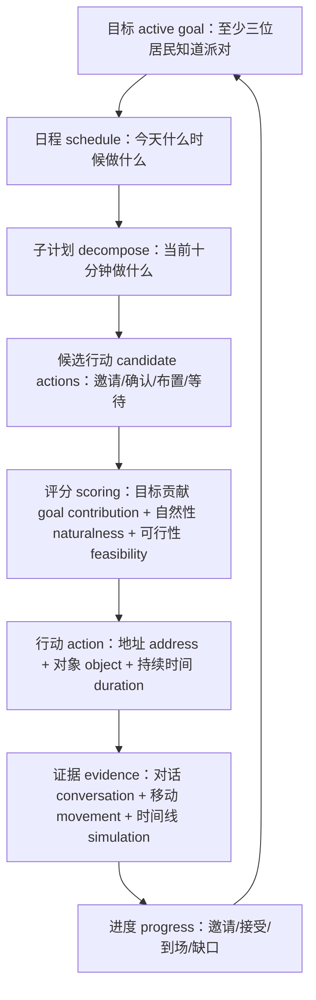
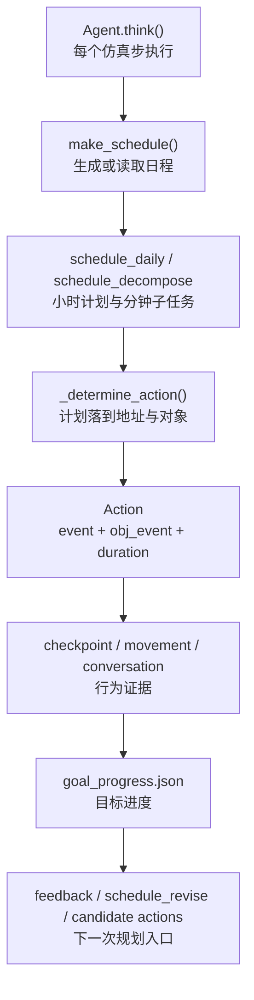
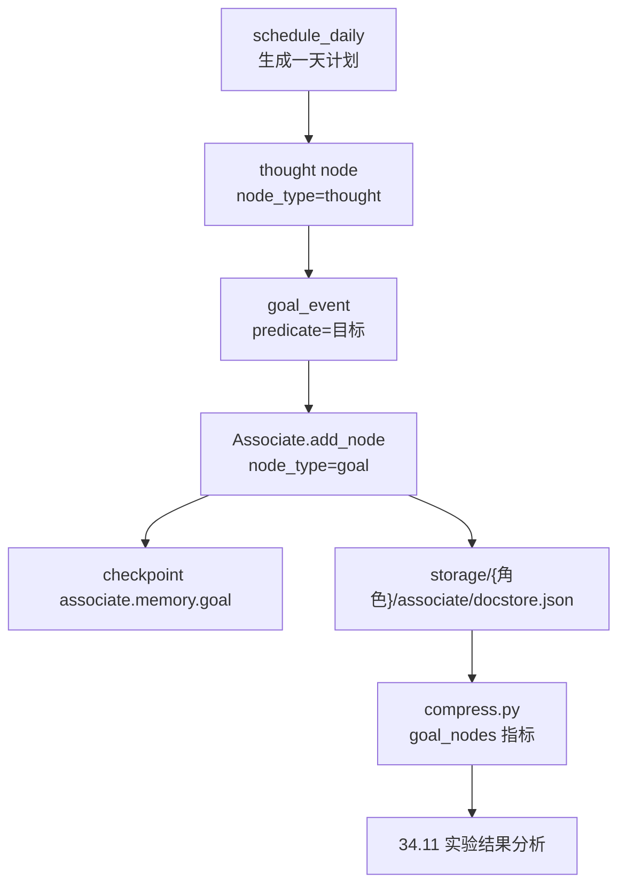

# 第 34 章 规划系统升级：从日程拆解到目标驱动行动

## 34.1 17:00 的派对为什么仍需要目标规划

17:00 到了，伊莎贝拉的日程 schedule 是成功的。`generative_agents/results/checkpoints/book-party-extended/simulate-20240214-1700.json` 显示，她的当前行动 action 是“在门口热情迎接到来的顾客，引导他们入座”，地址 address 落在 `the Ville -> 霍布斯咖啡馆 -> 咖啡馆 -> 咖啡馆顾客座位`。这说明当前规划系统已经能完成一条重要链路：从全天日程，到分钟级拆解，再到地图 Maze 上的具体行动。

同一个断点里，玛丽亚暴露出另一种失败。她在 11:30 的 `conversation.json` 里明确答应参加 17:00 情人节派对，17:00 的行动却是“起身活动肩颈，做简单拉伸”，地址仍在 `the Ville -> 奥克山学院宿舍 -> 玛丽亚的房间 -> 书桌`。她的后续日程继续围绕 Twitch 直播休息、晚饭和晚间直播推进。这里不是“没有日程”，而是“日程没有被目标缺口修正”：系统知道伊莎贝拉要办派对，却没有持续追踪谁被邀请、谁承诺、谁到场、谁需要提醒。

| 证据 | 当前系统已经做到 | 暴露出的规划缺口 |
| --- | --- | --- |
| 伊莎贝拉 17:00 checkpoint | 派对日程被拆成迎宾、饮品、致辞、互动等子任务。 | 主办者行动正确，不等于目标整体完成。 |
| 玛丽亚 11:30 conversation | 对话里出现明确承诺：“五点刚好有休息时间，肯定会去参加”。 | 承诺没有进入可追踪的目标进度 progress。 |
| 玛丽亚 17:00 checkpoint | 行动和地址仍在宿舍书桌。 | 系统没有在 17:00 前根据缺口提醒、确认或改派行动。 |
| 后续评价 metrics | `accepted_not_arrived` 能被离线分析发现。 | 发现缺口发生在实验分析阶段，还没有回流到规划主链路。 |

规划升级 planning upgrade 的重点不是把角色改造成任务机器，而是在现有生活日程上叠加一层目标约束：显式目标 active goal、候选行动 candidate actions、目标进度 progress 和行动反馈 feedback。日程负责“这个人今天像谁一样生活”，目标负责“重要任务是否被持续推进并接受证据检验”。

### 论文依据与工程落点

规划智能体的前沿工作给出的方向很一致：行动不能只靠一次生成的计划，还要在行动、观察和反馈之间循环更新。这些思想在 `generative_agents_next` 中落到规划链路的状态、评分和反馈对象上。

| 升级方向 | 论文名称 | 论文原文要点 | 本项目结论 |
| --- | --- | --- | --- |
| 日程规划基线 schedule planning | Generative Agents: Interactive Simulacra of Human Behavior | 论文把智能体架构落在 `observation, planning, and reflection`，并强调动态检索记忆来计划行为。 | `make_schedule()`、`schedule_decompose` 和 `_determine_action()` 是基线，不应推翻；升级应围绕目标补状态和反馈。 |
| 推理-行动-观察闭环 reason-act-observe | ReAct: Synergizing Reasoning and Acting in Language Models | ReAct 让模型以 `interleaved manner` 生成 `reasoning traces and task-specific actions`。 | 目标行动要保存 `goal -> action -> movement/conversation -> progress` 的证据链，而不是只保存最终自然语言计划。 |
| 多候选行动 candidate actions | Tree of Thoughts: Deliberate Problem Solving with Large Language Models | ToT 允许模型考虑 `multiple different reasoning paths`，并 `self-evaluating choices`。 | `_determine_action()` 前可以生成少量候选行动并评分，但只在 active goal 缺口明显时启用。 |
| 反馈驱动搜索 feedback-driven planning | Language Agent Tree Search Unifies Reasoning, Acting, and Planning in Language Models | LATS 统一 `reasoning, acting, and planning`，并引入 `environment for external feedback`。 | 本项目不做完整树搜索，先让 `goal_progress.json`、`reflection_candidates.json` 和反馈样例进入下一次规划。 |
| 环境落地 grounding | Generative Agents；ReAct；LATS | 三条路线都要求计划接受外部环境或仿真状态检验。 | 派对实验必须同时检查 checkpoint、conversation、movement、metrics 和 report。 |

这些论文对应到工程对象上，就是 `goal` 记忆节点、`goal_progress.json`、候选行动评分、行动反馈和后续日程修订。工程边界也很清楚：已经能验证目标状态是否落盘、目标进度是否可分析；尚未证明角色会主动根据缺口重排行程。



*图 34-1：从日程规划 schedule planning 到目标驱动规划 goal-driven planning 的闭环。当前项目已有 schedule、decompose 和 action 落地；升级点是让 active goal、candidate actions、progress 和 evidence 回流到下一次规划。*


*图 34-2：目标驱动规划在小镇里怎样落地。图中目标 goal 不是口号，而是进入规划驾驶舱：日程 schedule 给出生活节奏，候选行动 candidate actions 展开多条可能路径，目标贡献 goal contribution 与自然性 naturalness 共同决定选择，最后必须落到移动回放 movement 与对话记录 conversation 中验证。*

## 34.2 高频术语锚点表

| 中文 English | 项目含义 | 当前项目锚点 |
| --- | --- | --- |
| 日程 schedule | 一天内每个时间段的活动安排。 | `generative_agents_next/modules/memory/schedule.py` |
| 日程拆解 schedule decompose | 把小时级计划拆成分钟级子任务。 | `Scratch.prompt_schedule_decompose()` |
| 行动 action | 角色当前实际执行的事件 event 与对象事件 object event。 | `memory.Action` |
| 目标 active goal | 当前要达成的显式任务和成功标准。 | 当前缺失，建议新增 `goal` 记忆或 `Goal` 类 |
| 候选行动 candidate actions | 在当前情境下可选的多个行动方案。 | 当前缺失，建议接入 `_determine_action()` 前 |
| 目标贡献 goal contribution | 一个行动对目标完成的帮助程度。 | 当前缺失，建议评分字段 |
| 进度 progress | 已邀请、已接受、已到场、仍缺什么。 | 当前缺失，建议从 conversation/movement 抽取 |
| 自然性 naturalness | 行动是否仍像角色的生活，而不是任务机器。 | 需要 report 人工抽样 |
| 环境落地 grounding | 行动是否真的落到 Maze 地址、Tile 和 movement。 | `_determine_action()`、`movement.json` |

## 34.3 旧规划链路的最小基线：目标能插在哪里

第 14 章已经展开世界模型和 `_determine_action()`，第 16 章已经展开 `Agent.think()` 的运行顺序，第 19 章已经展开 `Schedule`、`make_schedule()`、`schedule_daily`、`schedule_decompose` 和 `schedule_revise`，第 29 章已经展开计划质量评价。目标规划升级只需要保留一条最小基线：旧系统怎样从日程走到行动，以及目标状态应该插在哪些位置。



旧链路并不弱。它能让角色有作息、有地点、有行动，也能把聊天和等待插入日程。缺口在于：目标只隐含在 `currently`、对话或日程文本中，没有形成可持续追踪的状态。

| 旧链路节点 | 已有能力 | 目标规划升级入口 |
| --- | --- | --- |
| `make_schedule()` | 生成当天日程，必要时从近期记忆更新 `currently`。 | 注入 active goal，或在生成后检查目标缺口。 |
| `schedule_daily` | 把日常生活压成小时级计划。 | 把目标作为约束字段，而不是把一天改成任务清单。 |
| `schedule_decompose` | 把小时计划拆成分钟级子任务。 | 把目标相关动作变成当前小时的候选子任务。 |
| `schedule_revise` | 对话或等待打断后修订后续计划。 | 把 `goal_progress.missing` 转成后续提醒或确认动作。 |
| `_determine_action()` | 把当前子计划落到 Maze 地址、对象和 `Action`。 | 在它之前生成 candidate actions 并评分。 |
| `checkpoint / movement / conversation` | 留下日程、行动、位置和对话证据。 | 计算 progress，生成 feedback，再回流到下一次规划。 |

后续改造顺序因此变得明确：先让目标状态可见，再让目标影响日程，随后才讨论多候选行动、进度评估、轻量工具和行动反馈。否则，目标规划会退化成一句更强硬的 prompt，而不是一条可验证的工程链路。

## 34.4 升级点一：目标 Goal 对象

目标 Goal 的第一步不是新增一个独立 `Goal` 类，而是让“今天这份计划背后的阶段目标”成为可检索的记忆节点。这样做的好处是：目标能进入 `Associate` 的统一存储、向量索引、checkpoint 和压缩指标；代价是它还不是完整的任务对象，`success_criteria` 和 `progress` 仍由评价脚本离线计算。

当前落地形态如下：



相对路径：`generative_agents_next/modules/memory/associate.py`

```diff
+DEFAULT_MEMORY_TYPES = [
+    "event",
+    "chat",
+    "thought",
+    "relationship",
+    "goal",
+    "summary",
+    "skill",
+    "conflict",
+]
```

`goal` 先作为有限记忆类型进入 `Associate.memory`。这一步决定了它会出现在 checkpoint 的 `associate.memory.goal` 列表里，也会进入 `docstore.json` 和后续 `memory_metrics.json`。

相对路径：`generative_agents_next/modules/agent.py`

```diff
 thought_node = self._add_concept(
     "thought",
     event,
     expire=self.schedule.create + datetime.timedelta(days=30),
 )
+goal_event = memory.Event(
+    self.name,
+    "目标",
+    schedule_time,
+    describe="{} 在 {} 的阶段目标：{}".format(
+        self.name,
+        schedule_time,
+        "；".join(init_schedule),
+    ),
+    address=self.get_tile().get_address(),
+)
+self._add_concept(
+    "goal",
+    goal_event,
+    expire=self.schedule.create + datetime.timedelta(days=30),
+    filling={
+        "source_nodes": [thought_node.node_id],
+        "source_type": "schedule",
+        "confidence": 0.75,
+        "generated_by": "schedule_daily",
+        "downstream_use": "planning,reflection",
+    },
+)
```

这段代码的调用时机很窄：只有当天没有日程、`make_schedule()` 生成 `schedule_daily` 后才写入。它把同一份初始日程同时保存成两种节点：

| 节点 | node_type | 用途 | 来源关系 |
| --- | --- | --- | --- |
| 当天计划 thought | `thought` | 保存“今天计划是什么”。 | 由 `schedule_daily` 生成。 |
| 阶段目标 goal | `goal` | 保存“这份计划要服务什么阶段目标”。 | `source_nodes=["node_0"]` 指向 thought 节点。 |

`book-goal-party` 实验里的真实存储可以直接查：

| 文件 | 可验证内容 |
| --- | --- |
| `generative_agents_next/results/checkpoints/book-goal-party/simulate-20240214-0800.json` | 伊莎贝拉 `associate.memory.goal=["node_1"]`。 |
| `generative_agents_next/results/checkpoints/book-goal-party/storage/伊莎贝拉/associate/docstore.json` | `node_1` 的 `node_type="goal"`、`predicate="目标"`、`generated_by="schedule_daily"`。 |
| `generative_agents_next/results/compressed/book-goal-party/memory_metrics.json` | 四个角色共 `goal_nodes=4`，每个角色 1 个 goal 节点。 |

伊莎贝拉的 `node_1` metadata 是：

```json
{
  "node_type": "goal",
  "subject": "伊莎贝拉",
  "predicate": "目标",
  "object": "2024年02月14日（星期三）08:00",
  "source_nodes": ["node_0"],
  "source_type": "schedule",
  "confidence": 0.75,
  "generated_by": "schedule_daily",
  "downstream_use": "planning,reflection"
}
```

这个实现已经完成“目标状态可见”：目标不再只藏在自然语言日程里，而是有了专门的 `goal` 节点、来源和下游用途。它尚未完成两件事：第一，没有独立 `Goal` 类来保存 `success_criteria/progress/deadline`；第二，`goal` 节点还没有主动改写后续计划。目标进度仍由 `generative_agents_next/analyze_experiment.py` 离线生成 `goal_progress.json`，下一节才讨论目标如何影响日程 prompt。

## 34.5 升级点二：目标影响日程 prompt

目标 goal 需要进入 `make_schedule()`，但不能让日程变成任务清单。建议新增：

```text
generative_agents_next/data/prompts/goal_influence_schedule.txt
```

| 项目 | 设计 |
| --- | --- |
| 绑定方法 | `Scratch.prompt_goal_influence_schedule(active_goals, currently, memories)` |
| 输入变量 | `agent`、`base_desc`、`currently`、`active_goals`、`recent_memories`、`existing_daily_plan` |
| 输出结构 schema | `schedule_constraints: list[str]`、`must_check: list[str]`、`do_not_break: list[str]` |
| 输出流向 | 作为补充上下文进入 `schedule_daily`，或在 `schedule_daily` 后做 consistency check。 |

模板草案：

```text
${agent} 有以下主动目标 active goals：
${active_goals}

当前状态 currently：
${currently}

近期相关记忆 recent memories：
${recent_memories}

原日常计划 existing_daily_plan：
${existing_daily_plan}

请只返回 JSON：
{
  "schedule_constraints": ["今天日程中应覆盖的目标相关动作"],
  "must_check": ["需要在当天复查的进度缺口"],
  "do_not_break": ["不能破坏的人设、生活习惯或已有承诺"]
}
```

对伊莎贝拉来说，输出可以是“午后确认玛丽亚是否仍能 17:00 到场”“不要反复打扰已经拒绝的山姆”“17:00 前回到咖啡馆完成布置”。这些约束再进入 `schedule_daily`，比直接要求模型生成“最优派对计划”更稳。

## 34.6 升级点三：多候选行动 candidate actions

当前 `_determine_action()` 是单路径：取当前 `de_plan`，找地址，生成 `Action`。目标驱动规划需要在关键时刻生成多个候选行动。

| 候选行动 candidate action | 目标贡献 goal contribution | 自然性 naturalness | 可行性 feasibility | 证据依据 |
| --- | --- | --- | --- | --- |
| 继续布置咖啡馆 | 中 | 高 | 高 | 伊莎贝拉当前在咖啡馆，日程包含派对准备。 |
| 找玛丽亚确认 17:00 是否到场 | 高 | 中 | 取决于位置和关系 | 玛丽亚已承诺，但 movement 显示可能离开咖啡馆。 |
| 邀请山姆短暂停留或转述祝福 | 低到中 | 高 | 中 | 山姆有晚餐冲突，不能强推到场。 |
| 去公园随机邀请更多居民 | 中 | 低 | 取决于路径 | 可能破坏咖啡馆老板人设和当前任务。 |

建议新增三个 prompt，不必一开始做复杂树搜索。

| 提示词 prompt | 路径 | 输入 input | 输出结构 schema | 流向 |
| --- | --- | --- | --- | --- |
| 生成候选 `generate_candidate_actions` | `generative_agents_next/data/prompts/generate_candidate_actions.txt` | active goal、current plan、location、nearby agents、relevant memories | `candidates: list[dict]` | 进入评分。 |
| 候选评分 `score_candidate_actions` | `generative_agents_next/data/prompts/score_candidate_actions.txt` | candidates、goal、persona、schedule、spatial options | `scores: list[dict]` | 进入选择。 |
| 选择行动 `choose_action` | `generative_agents_next/data/prompts/choose_action.txt` | candidates + scores + risk rules | `chosen_action`、`reason`、`risk` | 转成 plan/de_plan 或 Action hint。 |

候选评分输出示例：

```json
{
  "candidate_id": "confirm_maria_arrival",
  "action": "在午后见到玛丽亚时确认她 17:00 是否仍能来派对",
  "goal_contribution": 0.85,
  "naturalness": 0.72,
  "feasibility": 0.60,
  "risk": "如果玛丽亚正在上课或直播，强行追问会显得不自然",
  "evidence": [
    "conversation:book-party-extended:20240214-11:30"
  ]
}
```

这一步是思维树 Tree of Thoughts 的轻量版本：不是展开完整搜索树，而是在目标相关行动前多生成几个可解释选项。

## 34.7 升级点四：目标进度 progress 评估

目标驱动规划必须知道“还差什么”。建议新增：

```text
generative_agents_next/data/prompts/goal_evaluate_progress.txt
```

| 输入 input | 处理 process | 输出 output | 写入位置 | 验证方式 |
| --- | --- | --- | --- | --- |
| goal、recent conversations、recent actions、movement rows、current schedule | 抽取 informed、accepted、arrived、rejected、missing。 | `GoalProgress` JSON。 | Goal 对象或 goal memory metadata。 | 与 `conversation.json` 和 `movement.json` 抽样对齐。 |

输出结构 schema：

```json
{
  "informed": ["玛丽亚", "山姆"],
  "accepted": ["玛丽亚"],
  "arrived": [],
  "rejected_or_unavailable": ["山姆"],
  "missing": ["还需要至少一位明确接受，且需要确认玛丽亚到场"],
  "next_suggestion": "优先在不打断生活的情况下确认玛丽亚是否仍能参加。",
  "evidence": [
    "conversation:book-party-extended:20240214-11:30",
    "movement:book-party-extended:frame-3241"
  ]
}
```

这里必须区分四个层级：知道信息 informed、承诺 accepted、到达 arrived、事后摘要 summarized。派对实验中，玛丽亚的对话承诺是 accepted；17:00 附近未在咖啡馆则不能算 arrived。

## 34.8 升级点五：轻量工具调用 tool use

工具 tool 不一定是外部 API。小镇内部已有大量可读状态，可以先做只读工具。

| 工具 tool | 可读数据 | 角色是否可知 | 用途 | 风险 |
| --- | --- | --- | --- | --- |
| 当前时间 `get_current_time()` | `utils.get_timer()` | 可知 | 判断 deadline。 | 低 |
| 当前计划 `get_current_plan(agent)` | `Schedule.current_plan()` | 本人可知，别人未必可知 | 避免与已有日程冲突。 | 中 |
| 附近角色 `get_agents_near(location)` | Maze scope / movement | 只可知视野范围内 | 选择自然邀请对象。 | 高，不能给全局上帝视角。 |
| 最近对话 `get_recent_conversations(agent)` | `conversation.json` 或 chat memory | 本人参与过的对话可知 | 判断是否重复邀请。 | 中 |
| 目标传播 `get_event_spread(keyword)` | 实验分析脚本 | 角色不可知，只用于评价 evaluation | 生成指标 metrics / 报告 report。 | 高，不能进入角色提示词 prompt。 |

工具调用的边界非常重要。伊莎贝拉可以知道自己是否邀请过玛丽亚，也可以看见咖啡馆附近的人；她不应该无条件知道全镇所有人的实时位置。实验分析工具可以用来写报告 report，但不能直接喂给角色生成行动。

## 34.9 升级点六：行动反馈 feedback

行动执行后，目标系统需要记录实际反馈。

```json
{
  "action_id": "isabella-confirm-maria-20240214-1500",
  "expected_outcome": "玛丽亚确认 17:00 到场",
  "actual_outcome": "玛丽亚表示期待，但 17:00 movement 未显示到场",
  "progress_delta": {
    "accepted": ["玛丽亚"],
    "arrived": []
  },
  "lesson": "承诺参加不等于到场，活动前需要确认时间冲突并在日程中留出提醒动作。",
  "evidence": [
    "conversation:book-party-extended:20240214-11:30",
    "movement:book-party-extended:frame-3241"
  ]
}
```

这条 feedback 会回到第 33 章的反思式学习 reflexion-style learning：目标规划发现 progress 缺口，反思模块生成 lesson，下一次规划使用 lesson 调整候选行动。

## 34.10 实验设计与执行命令

第 34 章的实验验证两件事：第一，目标 goal 已经能作为记忆类型进入 checkpoint；第二，目标进度 progress 能从对话和移动证据中独立计算。完整的候选行动搜索 candidate action search 还没有接入角色决策，结果里不能写成“目标规划已经闭环”。

相对路径：`generative_agents_next/modules/agent.py`

```diff
 def make_schedule(self):
     ...
     thought_node = self._add_concept("thought", event, expire=...)
+    goal_event = memory.Event(
+        self.name,
+        "目标",
+        schedule_time,
+        describe=f"{self.name} 在 {schedule_time} 的阶段目标：..."
+    )
+    self._add_concept(
+        "goal",
+        goal_event,
+        filling={
+            "source_nodes": [thought_node.node_id],
+            "source_type": "schedule",
+            "confidence": 0.75,
+            "downstream_use": "planning,reflection"
+        }
+    )
```

相对路径：`generative_agents_next/analyze_experiment.py`

```diff
+def build_goal_progress(event_board):
+    return {
+        "informed": sorted(informed),
+        "accepted": sorted(accepted),
+        "arrived": sorted(arrived),
+        "missing": missing,
+        "goal_completion_rate": ...
+    }
```

| 实验项 | 配置 |
| --- | --- |
| 实验名 | `book-goal-party` |
| 工作目录 | `generative_agents_next` |
| 角色 agents | 伊莎贝拉、玛丽亚、山姆、汤姆 |
| 检查对象 | `goal` 记忆节点、`goal_progress.json`、目标完成率 |
| 成功边界 | 能区分 informed、accepted、arrived、rejected，不把承诺当到场 |

执行命令：

```bash
cd generative_agents_next
python start.py --name book-goal-party --start "20240214-08:00" --step 72 --stride 10 --agents "伊莎贝拉,玛丽亚,山姆,汤姆" --verbose info --log book-goal-party.log
python compress.py --name book-goal-party
python analyze_experiment.py --name book-goal-party --event valentine_party --keywords "情人节,派对,五点,5点,17:00,霍布斯咖啡馆" --target-place "霍布斯咖啡馆" --window-start "20240214-17:00" --window-end "20240214-19:00"
```

实验输出：

| 输出文件 | 用途 |
| --- | --- |
| `results/checkpoints/book-goal-party/simulate-*.json` | 检查角色 `associate.memory.goal` 是否存在。 |
| `results/compressed/book-goal-party/memory_metrics.json` | 统计 `goal_nodes` 与来源追踪。 |
| `results/evaluations/book-goal-party/goal_progress.json` | 检查 informed、accepted、arrived、missing。 |
| `results/evaluations/book-goal-party/report.md` | 人工复核目标进度与原始证据是否一致。 |

## 34.11 实验结果分析

本轮实验不是证明“派对目标成功完成”，而是证明目标规划 goal planning 的证据层已经能落盘、能统计、能发现缺口。仿真从 `2024-02-14 08:00` 跑到 `2024-02-14 20:10`，覆盖了 `17:00-19:00` 的派对窗口，因此可以评价承诺是否转化为到场。

| 项目 | 结果 |
| --- | --- |
| 实验目录 | `generative_agents_next/results/checkpoints/book-goal-party/` |
| checkpoint 数 | 74 |
| 最终时间 | `20240214-20:10` |
| 角色 | 伊莎贝拉、玛丽亚、山姆、汤姆 |
| 压缩输出 | `results/compressed/book-goal-party/` |
| 评价输出 | `results/evaluations/book-goal-party/` |
| 目标完成率 | `0.75` |

### goal 节点是否落盘

`compress.py` 生成的 `memory_metrics.json` 显示，四个角色都写入了 `goal` 记忆节点，总计 `goal_nodes=4`。高级记忆节点 `advanced_nodes=374`，其中 `source_traced_advanced_nodes=374`，来源追踪率 `source_trace_rate=1.0`。

| 角色 | total_nodes | goal_nodes | source_trace_rate | goal 来源 |
| --- | ---: | ---: | ---: | --- |
| 伊莎贝拉 | 281 | 1 | 1.0 | `source_nodes=["node_0"]`，`source_type="schedule"` |
| 玛丽亚 | 175 | 1 | 1.0 | `source_nodes=["node_0"]`，`source_type="schedule"` |
| 山姆 | 230 | 1 | 1.0 | `source_nodes=["node_0"]`，`source_type="schedule"` |
| 汤姆 | 226 | 1 | 1.0 | `source_nodes=["node_0"]`，`source_type="schedule"` |

伊莎贝拉的 `docstore.json` 中，`node_1` 的 metadata 是 `node_type="goal"`，`predicate="目标"`，`confidence=0.75`，`generated_by="schedule_daily"`，`downstream_use="planning,reflection"`。这说明目标节点不是凭空生成的，它来自 08:00 生成的日程 thought，并保留了下游用途。

```json
{
  "node_type": "goal",
  "subject": "伊莎贝拉",
  "predicate": "目标",
  "source_nodes": ["node_0"],
  "source_type": "schedule",
  "confidence": 0.75,
  "generated_by": "schedule_daily",
  "downstream_use": "planning,reflection"
}
```

这个结果证明“目标状态记录”已经落盘；它还没有证明“目标会主动改变下一步行动”。

### 原始证据链

本轮 `conversation.json` 有 16 条事件命中，核心传播链集中在伊莎贝拉和玛丽亚之间。

| 时间 | 原始事件 | 目标规划含义 |
| --- | --- | --- |
| `11:40` | 伊莎贝拉邀请玛丽亚下午五点参加情人节派对。 | 事件传播成立，`known_by` 至少包含伊莎贝拉和玛丽亚。 |
| `11:40` | 玛丽亚说“五点一定到”，并询问是否需要帮忙。 | 形成承诺 accepted，是强对话证据。 |
| `13:00` | 玛丽亚主动提出帮忙贴派对宣传材料。 | 目标相关行动继续出现，但仍是对话和局部行动证据。 |
| `14:00` | 玛丽亚帮忙搬桌椅，伊莎贝拉确认派对马上开始。 | 派对准备推进，说明角色没有变成纯任务机器。 |
| `14:20` | 玛丽亚提到喝完咖啡后帮忙弄完气球和彩带。 | 承诺延续，但仍需要后续 movement 验证。 |
| `15:20` | 玛丽亚调直播设备，伊莎贝拉说林晓下午会来。 | 传播线索扩展到外部提及，但林晓不在本轮四角色实验里。 |
| `17:00` | `movement.json` 中伊莎贝拉在霍布斯咖啡馆顾客座位。 | 主办者到场成立。 |
| `17:00` | 同一帧中玛丽亚在奥克山学院宿舍电脑前。 | 玛丽亚承诺未被目标时间窗到场验证。 |

`frame 3241` 是最关键的移动证据。它对应 `20240214-17:00`：伊莎贝拉的位置是“霍布斯咖啡馆，咖啡馆，咖啡馆顾客座位”；玛丽亚的位置是“奥克山学院宿舍，玛丽亚的房间，电脑”；山姆在家，汤姆在柳树市场。这里不能用 14:00 的帮忙布置来替代 17:00 的到场。

### 目标进度如何计算

`goal_progress.json` 把目标拆成四个检查项：是否传播、是否有承诺、是否有人到场、是否没有未兑现承诺。

| 字段 | 实验结果 | 证据解释 |
| --- | --- | --- |
| `informed` | `["伊莎贝拉", "玛丽亚"]` | 两人都在对话中明确谈到派对。 |
| `accepted` | `["伊莎贝拉", "玛丽亚"]` | 玛丽亚有明确到场承诺；伊莎贝拉作为主办者的邀请和确认被规则计入 accepted，分析时应视为主办方承诺。 |
| `arrived` | `["伊莎贝拉"]` | 目标时间窗内只有伊莎贝拉被 movement 验证在霍布斯咖啡馆。 |
| `accepted_not_arrived` | `["玛丽亚"]` | 玛丽亚有承诺，但 17:00-19:00 未被 movement 验证到场。 |
| `missing` | `["这些角色有承诺但未在目标时间窗到场：玛丽亚"]` | 缺口定位到“承诺未兑现”，不是传播失败。 |

四个检查项中，`has_event_diffusion=true`、`has_commitment=true`、`has_attendance=true`、`has_no_unfulfilled_commitment=false`，所以目标完成率是：

$$
\frac{3}{4}=0.75
$$

这个 `0.75` 不是“派对成功 75%”的文学评分，而是证据层检查项的通过比例。它最有价值的地方，是把“玛丽亚答应了”和“玛丽亚到了”拆开。

### 六个升级点逐项验收

| 升级点 | 实验观察 | 证据文件 | 判断 |
| --- | --- | --- | --- |
| 目标 Goal 对象 | 四个角色各有 1 个 `goal` 节点。 | `memory_metrics.json`、各角色 `docstore.json` | 已落地为 goal memory。 |
| 目标影响日程 prompt | 目标来自 `schedule_daily`，但没有反向改写后续日程。 | `agent.py`、checkpoint schedule | 只完成记录，未接入主动重排。 |
| 多候选行动 candidate actions | 没有生成候选列表和评分。 | 无 `candidate_actions` 输出 | 仍是设计方向。 |
| 目标进度 progress | 能输出 informed、accepted、arrived、missing。 | `goal_progress.json` | 已实现离线评价。 |
| 轻量工具 tool use | 分析脚本读取 conversation 与 movement。 | `analyze_experiment.py` | 只用于评价，不进入角色 prompt。 |
| 行动反馈 feedback | 生成 1 条反思候选，指向玛丽亚承诺未到场。 | `reflection_candidates.json` | 已能生成反馈样例，未写回下一轮规划。 |

### 结论边界

本轮实验可以下结论：`generative_agents_next` 已经具备目标记忆落盘、来源追踪、目标进度离线评价和失败反馈候选生成能力。它不能下结论：角色已经会根据 `goal_progress.missing` 主动调整日程、主动提醒玛丽亚、重新邀请其他人，或在 17:00 前选择更优候选行动。

下一步真正要改的是规划主链路：把 `goal_progress.missing` 进入 `schedule_revise()` 或 `_determine_action()` 前的候选行动评分。只有那一步完成，目标 goal 才不只是“可见状态”，而是会影响行动选择的规划约束。

## 34.12 评价指标和公式卡片

**公式卡片 34-A：目标完成率 goal completion rate**

$$
\text{目标完成率 goal completion rate}
=
\frac{\text{已满足的成功标准数量}}
{\text{成功标准总数量}}
$$

读法：本轮 `book-goal-party` 使用四个检查项，三项成立、一项失败，因此目标完成率为 \(3/4 = 0.75\)。失败项是 `has_no_unfulfilled_commitment=false`，也就是“仍存在承诺未被 movement 到场验证”。

**公式卡片 34-B：目标进度准确率 goal progress accuracy**

$$
\text{目标进度准确率 goal progress accuracy}
=
\frac{\text{与原始证据一致的 progress 字段数}}
{\text{抽样检查的 progress 字段数}}
$$

读法：抽查 `informed/accepted/arrived/rejected_or_unavailable` 等字段。如果 20 个字段里有 18 个能回到 `conversation.json` 或 `movement.json`，准确率为：

$$
\frac{18}{20}=0.90
$$

**公式卡片 34-C：无效行动率 invalid action rate**

$$
\text{无效行动率 invalid action rate}
=
\frac{\text{地点错误、时间冲突或目标无关的行动数}}
{\text{目标相关行动总数}}
$$

读法：目标规划越强，越要警惕无效行动。角色为完成目标频繁跨地图、打断别人、忽略人设，都应计入风险。

| 指标 metrics | 证据来源 | 解决的问题 |
| --- | --- | --- |
| 目标完成率 goal completion rate | `goal_progress.json`、`metrics.json` | 目标证据检查项通过了多少。 |
| 计划步骤完成率 plan step completion rate | 日程 schedule、时间线 simulation | 日程是否按计划推进。 |
| 目标进度准确率 goal progress accuracy | `goal_progress.json`、`conversation.json`、`movement.json` | 系统是否正确记录 informed/accepted/arrived。 |
| 候选选择质量 candidate selection quality | 候选评分 candidate scores、被选行动 chosen action、报告 report | 多候选是否选得合理；当前尚未接入。 |
| 自然性评分 naturalness score | `simulation.md`、对话抽样 | 是否变成任务机器。 |
| 成本 cost | LLM 调用日志 | 多候选和评分是否过贵。 |

第 29 章的 `ch29_book_custom_discussion_metrics.json` 已经提供了参考结构：`location_match_rate`、`goal_related_action_rate`、`plan_action_match_rate` 和 `commitment_metrics` 都能迁移到目标规划实验。

## 34.13 失败模式和排查路径

| 表现 | 原因 | 检查位置 | 修正方向 |
| --- | --- | --- | --- |
| 目标写进日程后生活感消失 | active goal 权重过高。 | `schedule_daily` 输出、自然性报告 naturalness report。 | 只对关键时段加约束，日常行动保留 schedule。 |
| 承诺被误判为到场 | progress 只读 conversation。 | `movement.json`、checkpoint action。 | `accepted` 和 `arrived` 分开字段。 |
| 候选行动总选最高目标贡献 | naturalness/feasibility 权重太低。 | candidate score 日志。 | 加风险字段和人设约束。 |
| 角色拥有上帝视角 | 工具 tool 暴露全局位置或全局对话。 | prompt 输入记录。 | 区分角色可知工具和实验分析工具。 |
| 提示词 prompt 调用成本过高 | 每步都生成候选和评分。 | 大语言模型 LLM 用量摘要 usage summary。 | 只对 active goal 且进度缺口明显时启用。 |
| 目标 Goal 断点恢复失败 | 目标状态没纳入序列化。 | 断点 checkpoint JSON。 | 先用记忆类型 memory node_type，稳定后独立 Goal 类。 |

## 34.14 本章小结

当前 GenerativeAgentsCN 的规划系统已经能完成日程 schedule、拆解 decompose、地址 grounding 和行动 action；目标规划升级要补的是 active goal、candidate actions、progress、feedback 和 evaluation。派对案例显示，日程写着“17:00 举办派对”还不够，系统必须知道谁被邀请、谁承诺、谁到场、谁因为冲突无法到场，并把这些证据回流到下一次行动。

| 主题 | 核心结论 |
| --- | --- |
| 当前规划链路 | `make_schedule()` 生成日程，`Schedule.current_plan()` 找当前计划，`_determine_action()` 落到 Maze 地址。 |
| 提示词 prompt 流向 | `wake_up`、`schedule_init`、`schedule_daily`、`schedule_decompose`、`schedule_revise` 分别负责起床、粗日程、全天日程、子计划和修订。 |
| 行动落地 | `determine_sector/arena/object` 和 `describe_object` 把计划转成 `memory.Action`。 |
| 当前缺口 | `generative_agents_next` 已有 `goal` 记忆和离线 `goal_progress`，候选行动 candidate actions 与行动反馈 feedback 尚未接入角色决策。 |
| 前沿锚定 | ReAct 提醒保存推理 reasoning、行动 action 和观察 observation，Tree of Thoughts 提醒多候选评分，LATS 提醒路径和反馈。 |
| 可落地升级 | 先用目标记忆 goal memory 与 `goal_progress.json` 建立证据层，再逐步加入目标影响日程、多候选行动、进度评估和轻量工具。 |
| 验证要求 | 目标规划必须同时看 conversation、movement、simulation、checkpoint、指标 metrics / 报告 report 和自然性 naturalness。 |

下一章讨论多智能体协作升级。目标规划解决单个角色如何围绕目标持续行动；多智能体协作要解决多个角色如何共享目标、分工、同步进度和协商冲突。

## 参考资料

- 推理行动交替 ReAct: https://arxiv.org/abs/2210.03629
- 思维树 Tree of Thoughts: https://arxiv.org/abs/2305.10601
- 语言智能体树搜索 LATS: https://arxiv.org/abs/2310.04406
- 生成式智能体 Generative Agents: https://arxiv.org/abs/2304.03442
- 本地源码 Local source: `generative_agents_next/modules/memory/schedule.py`
- 本地源码 Local source: `generative_agents_next/modules/agent.py`
- 本地源码 Local source: `generative_agents_next/modules/prompt/scratch.py`
- 本地升级源码 Local upgrade source: `generative_agents_next/modules/agent.py`
- 本地升级源码 Local upgrade source: `generative_agents_next/analyze_experiment.py`
- 本地升级指标 Local upgrade metrics: `generative_agents_next/compress.py`
- 本地提示词 Local prompts: `generative_agents_next/data/prompts/wake_up.txt`
- 本地提示词 Local prompts: `generative_agents_next/data/prompts/schedule_init.txt`
- 本地提示词 Local prompts: `generative_agents_next/data/prompts/schedule_daily.txt`
- 本地提示词 Local prompts: `generative_agents_next/data/prompts/schedule_decompose.txt`
- 本地提示词 Local prompts: `generative_agents_next/data/prompts/schedule_revise.txt`
- 本地提示词 Local prompts: `generative_agents_next/data/prompts/determine_sector.txt`
- 本地提示词 Local prompts: `generative_agents_next/data/prompts/determine_arena.txt`
- 本地提示词 Local prompts: `generative_agents_next/data/prompts/determine_object.txt`
- 本地提示词 Local prompts: `generative_agents_next/data/prompts/describe_object.txt`
- 本地证据 Local evidence: `docs/book/assets/chapter_19/ch19_schedule_trace.json`
- 本地证据 Local evidence: `generative_agents/results/checkpoints/book-party-extended/simulate-20240214-1700.json`
- 本地实验结果 Local experiment: `generative_agents_next/results/evaluations/book-goal-party/`
- 本地证据 Local evidence: `generative_agents/results/checkpoints/book-party-extended/conversation.json`
- 本地证据 Local evidence: `generative_agents/results/compressed/book-party-extended/movement.json`
- 本地指标 Local metrics: `docs/book/assets/chapter_29/ch29_book_custom_discussion_metrics.json`
