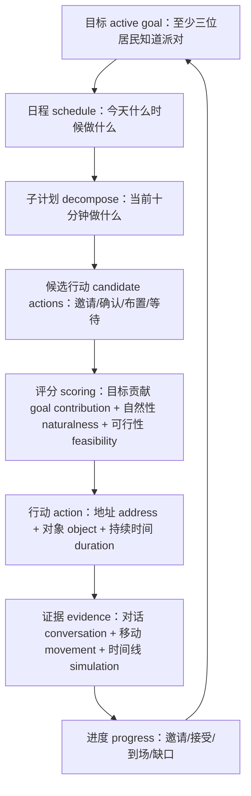

# 第 34 章 规划系统升级：从日程拆解到目标驱动行动

## 34.1 17:00 的派对为什么仍需要目标规划

17:00 到了，伊莎贝拉的断点 checkpoint 很清楚：`generative_agents/results/checkpoints/book-party-extended/simulate-20240214-1700.json` 中，她的当前行动 action 是“在门口热情迎接到来的顾客，引导他们入座”，地址 address 落在 `the Ville -> 霍布斯咖啡馆 -> 咖啡馆 -> 咖啡馆顾客座位`。这说明当前日程系统 schedule system 能把计划拆解为行动，并把行动落到地图 Maze。

同一个时间点，玛丽亚的情况暴露出另一层问题。她在 11:30 的对话 conversation 里答应参加 17:00 情人节派对，但 17:00 附近的移动回放 movement 仍显示她在宿舍书桌；她的日程 schedule 也在 17:00 之后继续围绕 Twitch 直播休息、晚饭和晚间直播推进。也就是说，当前系统可以让伊莎贝拉“按日程举办派对”，却不能保证“围绕目标 goal 追踪谁已被邀请、谁承诺参加、谁真的到场，并在缺口出现前调整行动”。

规划升级 planning upgrade 不应推翻现有日程，而是在日程 schedule 之上补一个显式目标 active goal、候选行动 candidate actions、目标进度 progress 和行动反馈 feedback。否则，目标只会藏在 `currently` 或某段对话里，无法成为后续行动的约束。



*图 34-1：从日程规划 schedule planning 到目标驱动规划 goal-driven planning 的闭环。当前项目已有 schedule、decompose 和 action 落地；升级点是让 active goal、candidate actions、progress 和 evidence 回流到下一次规划。*


*图 34-2：目标驱动规划在小镇里怎样落地。图中目标 goal 不是口号，而是进入规划驾驶舱：日程 schedule 给出生活节奏，候选行动 candidate actions 展开多条可能路径，目标贡献 goal contribution 与自然性 naturalness 共同决定选择，最后必须落到移动回放 movement 与对话记录 conversation 中验证。*

## 34.2 高频术语锚点表

| 中文 English | 项目含义 | 当前项目锚点 |
| --- | --- | --- |
| 日程 schedule | 一天内每个时间段的活动安排。 | `generative_agents/modules/memory/schedule.py` |
| 日程拆解 schedule decompose | 把小时级计划拆成分钟级子任务。 | `Scratch.prompt_schedule_decompose()` |
| 行动 action | 角色当前实际执行的事件 event 与对象事件 object event。 | `memory.Action` |
| 目标 active goal | 当前要达成的显式任务和成功标准。 | 当前缺失，建议新增 `goal` 记忆或 `Goal` 类 |
| 候选行动 candidate actions | 在当前情境下可选的多个行动方案。 | 当前缺失，建议接入 `_determine_action()` 前 |
| 目标贡献 goal contribution | 一个行动对目标完成的帮助程度。 | 当前缺失，建议评分字段 |
| 进度 progress | 已邀请、已接受、已到场、仍缺什么。 | 当前缺失，建议从 conversation/movement 抽取 |
| 自然性 naturalness | 行动是否仍像角色的生活，而不是任务机器。 | 需要 report 人工抽样 |
| 环境落地 grounding | 行动是否真的落到 Maze 地址、Tile 和 movement。 | `_determine_action()`、`movement.json` |

## 34.3 当前规划系统的证据地图

| 层级 | 文件或函数 | 输入 input | 输出 output | 可验证材料 |
| --- | --- | --- | --- | --- |
| 配置 config | `generative_agents/data/config.json` | `schedule.max_try=5`、`schedule.diversity=5` | 控制日程生成重试和多样性。 | 断点 `agent_base.schedule` |
| 日程对象 Schedule | `generative_agents/modules/memory/schedule.py` | `daily_schedule`、`create` | `current_plan()` 返回当前粗计划和子计划。 | checkpoint 中 `agents.<name>.schedule` |
| 日程生成 make_schedule | `Agent.make_schedule()` | persona、currently、近期记忆、wake_up | 全天 `daily_schedule` 和 thought。 | `simulate-20240214-1700.json` |
| 日程拆解 decompose | `prompt_schedule_decompose()` | 当前计划 plan、相邻计划、时间范围 | 子任务列表 `[describe, duration]`。 | `daily_schedule[*].decompose` |
| 日程修订 revise | `prompt_schedule_revise()` | 新聊天 action、原子计划 | 调整后的子计划。 | 对话占用时间后的 checkpoint |
| 行动落地 action grounding | `Agent._determine_action()` | 当前 `plan/de_plan`、空间记忆 spatial | `memory.Action(event, obj_event, duration, start)`。 | `movement.json`、`simulation.md` |
| 评价 metrics | `ch29_evaluate_simulation.py` | checkpoint、movement、conversation | 行动匹配、位置匹配、承诺到场等指标。 | `docs/book/assets/chapter_29/ch29_book_custom_discussion_metrics.json` |

## 34.4 `Schedule` 保存了什么

`Schedule` 位于 `generative_agents/modules/memory/schedule.py`：

```python
class Schedule:
    def __init__(self, create=None, daily_schedule=None, diversity=5, max_try=5):
        self.create = utils.to_date(create) if create else None
        self.daily_schedule = daily_schedule or []
        self.diversity = diversity
        self.max_try = max_try

    def add_plan(self, describe, duration, decompose=None):
        if self.daily_schedule:
            last_plan = self.daily_schedule[-1]
            start = last_plan["start"] + last_plan["duration"]
        else:
            start = 0
        self.daily_schedule.append({
            "idx": len(self.daily_schedule),
            "describe": describe,
            "start": start,
            "duration": duration,
            "decompose": decompose or {},
        })
```

真实断点里的伊莎贝拉日程片段如下：

```json
{
  "idx": 17,
  "describe": "在霍布斯咖啡馆举办情人节派对，欢迎顾客到来，介绍派对活动",
  "start": 1020,
  "duration": 60,
  "decompose": [
    {
      "idx": 0,
      "describe": "在门口热情迎接到来的顾客，引导他们入座",
      "start": 1020,
      "duration": 10
    }
  ]
}
```

`start=1020` 的来源是当天分钟数：`17 * 60 = 1020`。这条数据说明当前系统已经具备“时间 -> 子计划 -> 行动”的工程骨架。它没有保存的是“这个派对目标还差几位居民知道、谁答应了、谁应该被提醒、哪些承诺未落地”。

## 34.5 `make_schedule()` 的输入-处理-输出闭环

`Agent.make_schedule()` 是当前规划 planning 的主入口。

```python
if not self.schedule.scheduled():
    if self.associate.index.nodes_num > 0:
        focus = [
            f"{self.name} 在 {utils.get_timer().daily_format_cn()} 的计划。",
            f"在 {self.name} 的生活中，重要的近期事件。",
        ]
        retrieved = self.associate.retrieve_focus(focus)
        if retrieved:
            plan = self.completion("retrieve_plan", retrieved)
            thought = self.completion("retrieve_thought", retrieved)
            self.scratch.currently = self.completion(
                "retrieve_currently", plan, thought
            )
    wake_up = self.completion("wake_up")
    init_schedule = self.completion("schedule_init", wake_up)
    schedule.update(self.completion("schedule_daily", wake_up, init_schedule))
```

| 阶段 | 输入 input | 提示词 prompt 或处理 process | 输出 output | 证据路径 |
| --- | --- | --- | --- | --- |
| 更新当前状态 currently | 近期 event/thought | `retrieve_plan`、`retrieve_thought`、`retrieve_currently` | 新 `scratch.currently` | `Agent.make_schedule()` |
| 起床时间 wake-up | `base_desc`、`lifestyle`、`agent` | `wake_up.txt` | `res: int`，0-11 点 | `Scratch.prompt_wake_up()` |
| 初始日程 schedule init | `base_desc`、`lifestyle`、`wake_up` | `schedule_init.txt` | `res: list[str]` | `Scratch.prompt_schedule_init()` |
| 全天日程 daily schedule | `base_desc`、`daily_schedule`、`hourly_schedule` | `schedule_daily.txt` | `res: dict[str, str]` | `Scratch.prompt_schedule_daily()` |
| 多样性检查 diversity | 生成后的 schedule | `len(set(schedule.values())) >= diversity` | 接受或重试 | `config.json` |
| 写回记忆 thought | 初始日程 init_schedule | `_add_concept("thought")` | 当天计划 thought | 断点 checkpoint 记忆 memory |

这些提示词 prompt 已在第 19 章作为日程 schedule 主机制详细展开；目标规划 goal planning 只需要关注会进入 active goal 的字段。插入位置有两个：一是在 `retrieve_currently` 后，把 active goal 也放进 schedule 上下文；二是在 `schedule_daily` 后，检查日程是否覆盖目标关键动作。

## 34.6 日程提示词 prompt 的变量和输出结构 schema

| 提示词 prompt | 路径 | 变量 | 输出结构 schema | 升级时的注意点 |
| --- | --- | --- | --- | --- |
| 起床 `wake_up` | `generative_agents/data/prompts/wake_up.txt` | `base_desc/lifestyle/agent` | `res: int` | 不应被目标 goal 随意改写，否则生活节奏失真。 |
| 初始日程 `schedule_init` | `generative_agents/data/prompts/schedule_init.txt` | `base_desc/lifestyle/agent/wake_up` | `res: list[str]` | 可轻量加入 active goal 摘要，但不能把一天全变成任务列表。 |
| 全天日程 `schedule_daily` | `generative_agents/data/prompts/schedule_daily.txt` | `base_desc/agent/daily_schedule/hourly_schedule` | `res: dict[str, str]` | 最适合加入“今天必须复查哪些目标缺口”。 |
| 日程拆解 `schedule_decompose` | `generative_agents/data/prompts/schedule_decompose.txt` | `base_desc/agent/plan/increment/start/end` | `res: List[Tuple[str, int]]` | 可把 goal 变成当前小时内的子任务候选。 |
| 日程修订 `schedule_revise` | `generative_agents/data/prompts/schedule_revise.txt` | `agent/original_plan/event/duration/new_plan` | `res: List[Tuple[str, str, str]]` | 可在行动反馈后修复后续计划。 |

`schedule_daily.txt` 的模板核心是：

```text
请根据以下信息生成详细的24小时日程表：

"""
${base_desc}
智能体：${agent}
初始日程：${daily_schedule}
时间模板：
${hourly_schedule}
"""

确保返回的数据格式遵守schema：
{
  "6:00": "起床并完成早晨的例行工作",
  "7:00": "吃早餐"
}
```

升级后不应把这条 prompt 改成“只围绕目标行动”。更稳妥的做法是把目标 goal 作为约束字段加入，例如“17:00 前需要确认至少两位到场承诺”，再让日程仍保持生活节奏。

## 34.7 `_determine_action()` 如何把计划落到地图

日程 schedule 只是文本。`Agent._determine_action()` 才把当前计划落到世界地图 Maze。

```python
def _determine_action(self):
    plan, de_plan = self.schedule.current_plan()
    describes = [plan["describe"], de_plan["describe"]]
    address = self.spatial.find_address(describes[0], as_list=True)
    if not address:
        tile = self.get_tile()
        kwargs = {
            "describes": describes,
            "spatial": self.spatial,
            "address": tile.get_address("world", as_list=True),
        }
        kwargs["address"].append(
            self.completion("determine_sector", **kwargs, tile=tile)
        )
        arenas = self.spatial.get_leaves(kwargs["address"])
        if len(arenas) == 1:
            kwargs["address"].append(arenas[0])
        else:
            kwargs["address"].append(self.completion("determine_arena", **kwargs))
        objs = self.spatial.get_leaves(kwargs["address"])
        if len(objs) == 1:
            kwargs["address"].append(objs[0])
        elif len(objs) > 1:
            kwargs["address"].append(self.completion("determine_object", **kwargs))
        address = kwargs["address"]

    event = self.make_event(self.name, describes[-1], address)
    obj_describe = self.completion("describe_object", address[-1], describes[-1])
    obj_event = self.make_event(address[-1], obj_describe, address)
    return memory.Action(event, obj_event, duration=de_plan["duration"], start=...)
```

| 提示词 prompt | 路径 | 输入 input | 输出结构 schema | 输出流向 |
| --- | --- | --- | --- | --- |
| 区域选择 determine sector | `generative_agents/data/prompts/determine_sector.txt` | 当前区域、居住区域、候选区域、完整计划、子计划 | `res: str`，候选 sector 中的一项 | 地址 address 第 2 层 |
| 场所选择 determine arena | `generative_agents/data/prompts/determine_arena.txt` | 目标 sector、候选 arena、完整计划、子计划 | `res: str`，候选 arena 中的一项 | 地址 address 第 3 层 |
| 对象选择 determine object | `generative_agents/data/prompts/determine_object.txt` | 当前活动、候选对象 | `res: str`，候选 object 中的一项 | 地址 address 第 4 层 |
| 对象状态 describe object | `generative_agents/data/prompts/describe_object.txt` | object、agent、action | `res: str`，不超过 10 字 | `obj_event` |

这条链路的输出 output 是 `memory.Action`，后续会进入 `movement.json` 和 `simulation.md`。目标规划 goal planning 的候选行动必须在这里之前完成；如果等 `Action` 已经落地，再说“应该邀请玛丽亚”，就只能变成事后解释。

## 34.8 当前规划系统的能力和缺口

| 维度 | 当前能力 | 当前缺口 | 证据 |
| --- | --- | --- | --- |
| 日常生活节奏 | 能生成 24 小时 schedule。 | active goal 只隐含在 `currently` 或对话中。 | `schedule_daily`、checkpoint |
| 子任务拆解 | 能把小时计划拆成分钟任务。 | 不能显式比较多个 candidate actions。 | `schedule_decompose` |
| 地图落地 grounding | 能选择 sector/arena/object 并生成 Action。 | 不会用目标进度 progress 影响地址选择。 | `_determine_action()` |
| 打断和修订 | 聊天可触发 `schedule_revise`。 | 目标失败不会自动修订后续计划。 | `schedule_chat()`、`revise_schedule()` |
| 证据评价 | 结果有 conversation、movement、simulation 可查。 | 没有目标进度对象把证据汇总。 | `book-party-extended` |

当前系统强在“像人在生活”，弱在“围绕目标持续推进”。好的升级不是让角色永远高效，而是让重要目标在不破坏生活感的情况下得到可解释的持续性。

## 34.9 前沿思想如何落回规划模块

| 前沿思想 frontier idea | 关键启发 | 当前项目落点 | 最小实现 |
| --- | --- | --- | --- |
| 推理行动交替 ReAct | reason -> act -> observe 循环。 | `percept -> make_schedule -> make_plan -> action -> movement` 已有骨架。 | 为目标行动保存 reasoning/action/observation trace。 |
| 思维树 Tree of Thoughts | 生成多个候选思路并评分。 | `_determine_action()` 前可生成 candidate actions。 | 只对 active goal 启用候选行动。 |
| 语言智能体树搜索 LATS | 多条行动路径随反馈更新。 | 目标 goal 可保存候选路径和进度。 | 不做完整树搜索，先做轻量候选和反馈。 |
| 环境 grounding | 任务成功必须在环境中发生。 | Maze、Tile、movement、checkpoint。 | 目标进度必须绑定 movement 和 conversation。 |

这些前沿方法不能直接搬成复杂框架。小镇仿真的重点是可信生活 credible life；因此规划升级只在重要目标上启用，日常行动仍交给原 schedule。

## 34.10 升级点一：目标 Goal 对象

目标 Goal 对象把“想做什么”和“怎样算完成”从自然语言里抽出来。

```json
{
  "goal_id": "goal_party_20240214",
  "owner": "伊莎贝拉",
  "description": "17:00 前让至少三位居民知道情人节派对，并让至少两位居民表示愿意参加",
  "deadline": "2024-02-14T17:00:00",
  "status": "active",
  "success_criteria": [
    "至少三位居民被邀请",
    "至少两位居民明确表示愿意参加",
    "17:00 后至少两位居民出现在霍布斯咖啡馆"
  ],
  "progress": {
    "informed": ["山姆", "玛丽亚"],
    "accepted": ["玛丽亚"],
    "arrived": [],
    "rejected_or_unavailable": ["山姆"]
  },
  "evidence": [
    "conversation:book-party-extended:20240214-10:00",
    "conversation:book-party-extended:20240214-11:30",
    "movement:book-party-extended:frame-3241"
  ]
}
```

| 存储方案 | 输入 input | 处理 process | 输出 output | 适合阶段 |
| --- | --- | --- | --- | --- |
| 记忆类型 goal | 把目标 Goal 写入 `Associate`。 | 扩展 `Associate.memory` 的 node_type。 | 可被检索的 goal 节点。 | 最小实验。 |
| 独立类 `Goal` | 新增 `generative_agents/modules/memory/goal.py`。 | 序列化 goal、progress、evidence。 | 结构化目标状态。 | 稳定后实现。 |
| 草稿状态 Scratch 扩展 | 把 active goal 放进 `Scratch`。 | prompt 组装更方便。 | 目标进入 schedule prompt。 | 快速验证。 |

本书建议先用 `node_type="goal"` 做最小实验，再独立成 `Goal` 类。这样不会一次性改动太多序列化和断点恢复逻辑。

## 34.11 升级点二：目标影响日程 prompt

目标 goal 需要进入 `make_schedule()`，但不能让日程变成任务清单。建议新增：

```text
generative_agents/data/prompts/goal_influence_schedule.txt
```

| 项目 | 设计 |
| --- | --- |
| 绑定方法 | `Scratch.prompt_goal_influence_schedule(active_goals, currently, memories)` |
| 输入变量 | `agent`、`base_desc`、`currently`、`active_goals`、`recent_memories`、`existing_daily_plan` |
| 输出结构 schema | `schedule_constraints: list[str]`、`must_check: list[str]`、`do_not_break: list[str]` |
| 输出流向 | 作为补充上下文进入 `schedule_daily`，或在 `schedule_daily` 后做 consistency check。 |

模板草案：

```text
${agent} 有以下主动目标 active goals：
${active_goals}

当前状态 currently：
${currently}

近期相关记忆 recent memories：
${recent_memories}

原日常计划 existing_daily_plan：
${existing_daily_plan}

请只返回 JSON：
{
  "schedule_constraints": ["今天日程中应覆盖的目标相关动作"],
  "must_check": ["需要在当天复查的进度缺口"],
  "do_not_break": ["不能破坏的人设、生活习惯或已有承诺"]
}
```

对伊莎贝拉来说，输出可以是“午后确认玛丽亚是否仍能 17:00 到场”“不要反复打扰已经拒绝的山姆”“17:00 前回到咖啡馆完成布置”。这些约束再进入 `schedule_daily`，比直接要求模型生成“最优派对计划”更稳。

## 34.12 升级点三：多候选行动 candidate actions

当前 `_determine_action()` 是单路径：取当前 `de_plan`，找地址，生成 `Action`。目标驱动规划需要在关键时刻生成多个候选行动。

| 候选行动 candidate action | 目标贡献 goal contribution | 自然性 naturalness | 可行性 feasibility | 证据依据 |
| --- | --- | --- | --- | --- |
| 继续布置咖啡馆 | 中 | 高 | 高 | 伊莎贝拉当前在咖啡馆，日程包含派对准备。 |
| 找玛丽亚确认 17:00 是否到场 | 高 | 中 | 取决于位置和关系 | 玛丽亚已承诺，但 movement 显示可能离开咖啡馆。 |
| 邀请山姆短暂停留或转述祝福 | 低到中 | 高 | 中 | 山姆有晚餐冲突，不能强推到场。 |
| 去公园随机邀请更多居民 | 中 | 低 | 取决于路径 | 可能破坏咖啡馆老板人设和当前任务。 |

建议新增三个 prompt，不必一开始做复杂树搜索。

| 提示词 prompt | 路径 | 输入 input | 输出结构 schema | 流向 |
| --- | --- | --- | --- | --- |
| 生成候选 `generate_candidate_actions` | `generative_agents/data/prompts/generate_candidate_actions.txt` | active goal、current plan、location、nearby agents、relevant memories | `candidates: list[dict]` | 进入评分。 |
| 候选评分 `score_candidate_actions` | `generative_agents/data/prompts/score_candidate_actions.txt` | candidates、goal、persona、schedule、spatial options | `scores: list[dict]` | 进入选择。 |
| 选择行动 `choose_action` | `generative_agents/data/prompts/choose_action.txt` | candidates + scores + risk rules | `chosen_action`、`reason`、`risk` | 转成 plan/de_plan 或 Action hint。 |

候选评分输出示例：

```json
{
  "candidate_id": "confirm_maria_arrival",
  "action": "在午后见到玛丽亚时确认她 17:00 是否仍能来派对",
  "goal_contribution": 0.85,
  "naturalness": 0.72,
  "feasibility": 0.60,
  "risk": "如果玛丽亚正在上课或直播，强行追问会显得不自然",
  "evidence": [
    "conversation:book-party-extended:20240214-11:30"
  ]
}
```

这一步是思维树 Tree of Thoughts 的轻量版本：不是展开完整搜索树，而是在目标相关行动前多生成几个可解释选项。

## 34.13 升级点四：目标进度 progress 评估

目标驱动规划必须知道“还差什么”。建议新增：

```text
generative_agents/data/prompts/goal_evaluate_progress.txt
```

| 输入 input | 处理 process | 输出 output | 写入位置 | 验证方式 |
| --- | --- | --- | --- | --- |
| goal、recent conversations、recent actions、movement rows、current schedule | 抽取 informed、accepted、arrived、rejected、missing。 | `GoalProgress` JSON。 | Goal 对象或 goal memory metadata。 | 与 `conversation.json` 和 `movement.json` 抽样对齐。 |

输出结构 schema：

```json
{
  "informed": ["玛丽亚", "山姆"],
  "accepted": ["玛丽亚"],
  "arrived": [],
  "rejected_or_unavailable": ["山姆"],
  "missing": ["还需要至少一位明确接受，且需要确认玛丽亚到场"],
  "next_suggestion": "优先在不打断生活的情况下确认玛丽亚是否仍能参加。",
  "evidence": [
    "conversation:book-party-extended:20240214-11:30",
    "movement:book-party-extended:frame-3241"
  ]
}
```

这里必须区分四个层级：知道信息 informed、承诺 accepted、到达 arrived、事后摘要 summarized。派对实验中，玛丽亚的对话承诺是 accepted；17:00 附近未在咖啡馆则不能算 arrived。

## 34.14 升级点五：轻量工具调用 tool use

工具 tool 不一定是外部 API。小镇内部已有大量可读状态，可以先做只读工具。

| 工具 tool | 可读数据 | 角色是否可知 | 用途 | 风险 |
| --- | --- | --- | --- | --- |
| 当前时间 `get_current_time()` | `utils.get_timer()` | 可知 | 判断 deadline。 | 低 |
| 当前计划 `get_current_plan(agent)` | `Schedule.current_plan()` | 本人可知，别人未必可知 | 避免与已有日程冲突。 | 中 |
| 附近角色 `get_agents_near(location)` | Maze scope / movement | 只可知视野范围内 | 选择自然邀请对象。 | 高，不能给全局上帝视角。 |
| 最近对话 `get_recent_conversations(agent)` | `conversation.json` 或 chat memory | 本人参与过的对话可知 | 判断是否重复邀请。 | 中 |
| 目标传播 `get_event_spread(keyword)` | 实验分析脚本 | 角色不可知，只用于评价 evaluation | 生成指标 metrics / 报告 report。 | 高，不能进入角色提示词 prompt。 |

工具调用的边界非常重要。伊莎贝拉可以知道自己是否邀请过玛丽亚，也可以看见咖啡馆附近的人；她不应该无条件知道全镇所有人的实时位置。实验分析工具可以用来写报告 report，但不能直接喂给角色生成行动。

## 34.15 升级点六：行动反馈 feedback

行动执行后，目标系统需要记录实际反馈。

```json
{
  "action_id": "isabella-confirm-maria-20240214-1500",
  "expected_outcome": "玛丽亚确认 17:00 到场",
  "actual_outcome": "玛丽亚表示期待，但 17:00 movement 未显示到场",
  "progress_delta": {
    "accepted": ["玛丽亚"],
    "arrived": []
  },
  "lesson": "承诺参加不等于到场，活动前需要确认时间冲突并在日程中留出提醒动作。",
  "evidence": [
    "conversation:book-party-extended:20240214-11:30",
    "movement:book-party-extended:frame-3241"
  ]
}
```

这条 feedback 会回到第 33 章的反思式学习 reflexion-style learning：目标规划发现 progress 缺口，反思模块生成 lesson，下一次规划使用 lesson 调整候选行动。

## 34.16 最小可行升级实验

| 实验阶段 | 输入 input | 处理 process | 输出 output | 检查点 |
| --- | --- | --- | --- | --- |
| 基线 baseline | 当前 `book-party-extended`。 | 统计已邀请、已接受、已到场。 | 基线进度 baseline progress。 | 11:30 conversation、17:00 movement、17:00 checkpoint。 |
| 新增目标 Goal | 为伊莎贝拉加入 `goal_party_20240214`。 | 写入 goal memory 或 scratch active goal。 | 可检索 active goal。 | checkpoint 能看到 goal。 |
| 目标影响日程 | 在 `schedule_daily` 前加入 goal constraints。 | 生成带确认动作的日程。 | 新 daily_schedule。 | schedule 中出现“确认承诺/到场”但不过度打断生活。 |
| 候选行动 | 关键时间生成 candidate actions。 | 按 goal contribution/naturalness/feasibility 评分。 | chosen action hint。 | prompt 日志或 report 可回查。 |
| 进度评估 | 每次邀请或关键时刻读取 evidence。 | 更新 progress。 | informed/accepted/arrived/missing。 | movement 与 conversation 一致。 |
| 对照报告 | 基线 baseline vs 升级 upgrade。 | 计算目标完成和自然性。 | 指标 metrics / 报告 report。 | 第 37 章评价体系接手。 |

这个实验的价值不是追求“所有人都到场”。更重要的是系统能发现：山姆有晚餐冲突不能强推；玛丽亚承诺后仍可能没到；伊莎贝拉应该在不破坏生活感的前提下补一次确认。

## 34.17 评价指标和公式卡片

**公式卡片 34-A：目标完成率 goal completion rate**

$$
\text{目标完成率 goal completion rate}
=
\frac{\text{已满足的成功标准数量}}
{\text{成功标准总数量}}
$$

读法：如果派对目标有 3 条成功标准，其中“至少三人知道”成立，“至少两人接受”部分成立，“至少两人到场”不成立，则不要硬算成全成功；可以在报告 report 中拆成标准级结果。

**公式卡片 34-B：目标进度准确率 goal progress accuracy**

$$
\text{目标进度准确率 goal progress accuracy}
=
\frac{\text{与原始证据一致的 progress 字段数}}
{\text{抽样检查的 progress 字段数}}
$$

读法：抽查 `informed/accepted/arrived/rejected_or_unavailable` 等字段。如果 20 个字段里有 18 个能回到 `conversation.json` 或 `movement.json`，准确率为：

$$
\frac{18}{20}=0.90
$$

**公式卡片 34-C：无效行动率 invalid action rate**

$$
\text{无效行动率 invalid action rate}
=
\frac{\text{地点错误、时间冲突或目标无关的行动数}}
{\text{目标相关行动总数}}
$$

读法：目标规划越强，越要警惕无效行动。角色为完成目标频繁跨地图、打断别人、忽略人设，都应计入风险。

| 指标 metrics | 证据来源 | 解决的问题 |
| --- | --- | --- |
| 目标完成率 goal completion rate | 目标成功标准 goal success criteria、对话 conversation、移动 movement | 目标是否真的达成。 |
| 计划步骤完成率 plan step completion rate | 日程 schedule、时间线 simulation | 日程是否按计划推进。 |
| 目标进度准确率 goal progress accuracy | progress、原始证据 | 系统是否正确记录进度。 |
| 候选选择质量 candidate selection quality | 候选评分 candidate scores、被选行动 chosen action、报告 report | 多候选是否选得合理。 |
| 自然性评分 naturalness score | 人工报告、对话抽样 | 是否变成任务机器。 |
| 成本 cost | LLM 调用日志 | 多候选和评分是否过贵。 |

第 29 章的 `ch29_book_custom_discussion_metrics.json` 已经提供了参考结构：`location_match_rate`、`goal_related_action_rate`、`plan_action_match_rate` 和 `commitment_metrics` 都能迁移到目标规划实验。

## 34.18 失败模式和排查路径

| 表现 | 原因 | 检查位置 | 修正方向 |
| --- | --- | --- | --- |
| 目标写进日程后生活感消失 | active goal 权重过高。 | `schedule_daily` 输出、自然性报告 naturalness report。 | 只对关键时段加约束，日常行动保留 schedule。 |
| 承诺被误判为到场 | progress 只读 conversation。 | `movement.json`、checkpoint action。 | `accepted` 和 `arrived` 分开字段。 |
| 候选行动总选最高目标贡献 | naturalness/feasibility 权重太低。 | candidate score 日志。 | 加风险字段和人设约束。 |
| 角色拥有上帝视角 | 工具 tool 暴露全局位置或全局对话。 | prompt 输入记录。 | 区分角色可知工具和实验分析工具。 |
| 提示词 prompt 调用成本过高 | 每步都生成候选和评分。 | 大语言模型 LLM 用量摘要 usage summary。 | 只对 active goal 且进度缺口明显时启用。 |
| 目标 Goal 断点恢复失败 | 目标状态没纳入序列化。 | 断点 checkpoint JSON。 | 先用记忆类型 memory node_type，稳定后独立 Goal 类。 |

## 34.19 本章小结

当前 GenerativeAgentsCN 的规划系统已经能完成日程 schedule、拆解 decompose、地址 grounding 和行动 action；目标规划升级要补的是 active goal、candidate actions、progress、feedback 和 evaluation。派对案例显示，日程写着“17:00 举办派对”还不够，系统必须知道谁被邀请、谁承诺、谁到场、谁因为冲突无法到场，并把这些证据回流到下一次行动。

| 主题 | 核心结论 |
| --- | --- |
| 当前规划链路 | `make_schedule()` 生成日程，`Schedule.current_plan()` 找当前计划，`_determine_action()` 落到 Maze 地址。 |
| 提示词 prompt 流向 | `wake_up`、`schedule_init`、`schedule_daily`、`schedule_decompose`、`schedule_revise` 分别负责起床、粗日程、全天日程、子计划和修订。 |
| 行动落地 | `determine_sector/arena/object` 和 `describe_object` 把计划转成 `memory.Action`。 |
| 当前缺口 | 目标 goal、进度 progress、候选行动 candidate actions 和行动反馈 feedback 没有结构化。 |
| 前沿锚定 | ReAct 提醒保存推理 reasoning、行动 action 和观察 observation，Tree of Thoughts 提醒多候选评分，LATS 提醒路径和反馈。 |
| 可落地升级 | 先用目标记忆 goal memory 或草稿状态 Scratch active goal，再逐步加入目标影响日程、多候选行动、进度评估和轻量工具。 |
| 验证要求 | 目标规划必须同时看 conversation、movement、simulation、checkpoint、指标 metrics / 报告 report 和自然性 naturalness。 |

下一章讨论多智能体协作升级。目标规划解决单个角色如何围绕目标持续行动；多智能体协作要解决多个角色如何共享目标、分工、同步进度和协商冲突。

## 参考资料

- 推理行动交替 ReAct: https://arxiv.org/abs/2210.03629
- 思维树 Tree of Thoughts: https://arxiv.org/abs/2305.10601
- 语言智能体树搜索 LATS: https://arxiv.org/abs/2310.04406
- 生成式智能体 Generative Agents: https://arxiv.org/abs/2304.03442
- 本地源码 Local source: `generative_agents/modules/memory/schedule.py`
- 本地源码 Local source: `generative_agents/modules/agent.py`
- 本地源码 Local source: `generative_agents/modules/prompt/scratch.py`
- 本地提示词 Local prompts: `generative_agents/data/prompts/wake_up.txt`
- 本地提示词 Local prompts: `generative_agents/data/prompts/schedule_init.txt`
- 本地提示词 Local prompts: `generative_agents/data/prompts/schedule_daily.txt`
- 本地提示词 Local prompts: `generative_agents/data/prompts/schedule_decompose.txt`
- 本地提示词 Local prompts: `generative_agents/data/prompts/schedule_revise.txt`
- 本地提示词 Local prompts: `generative_agents/data/prompts/determine_sector.txt`
- 本地提示词 Local prompts: `generative_agents/data/prompts/determine_arena.txt`
- 本地提示词 Local prompts: `generative_agents/data/prompts/determine_object.txt`
- 本地提示词 Local prompts: `generative_agents/data/prompts/describe_object.txt`
- 本地证据 Local evidence: `docs/book/assets/chapter_19/ch19_schedule_trace.json`
- 本地证据 Local evidence: `generative_agents/results/checkpoints/book-party-extended/simulate-20240214-1700.json`
- 本地证据 Local evidence: `generative_agents/results/checkpoints/book-party-extended/conversation.json`
- 本地证据 Local evidence: `generative_agents/results/compressed/book-party-extended/movement.json`
- 本地指标 Local metrics: `docs/book/assets/chapter_29/ch29_book_custom_discussion_metrics.json`
