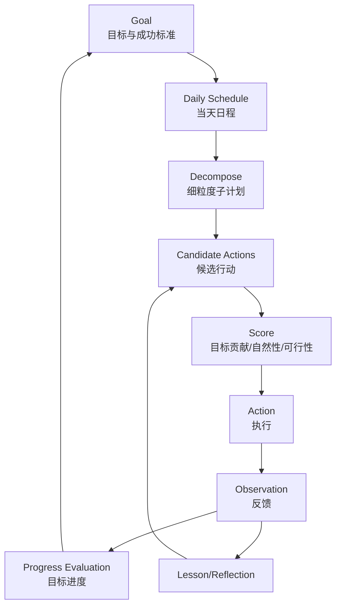
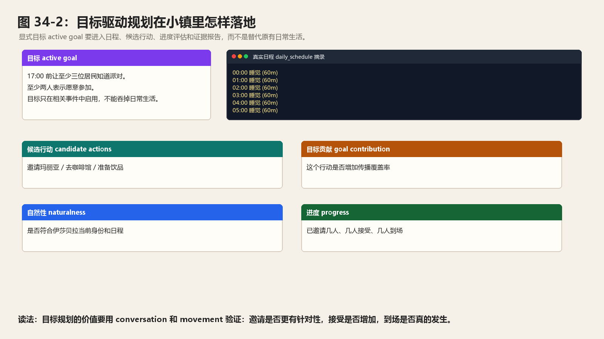
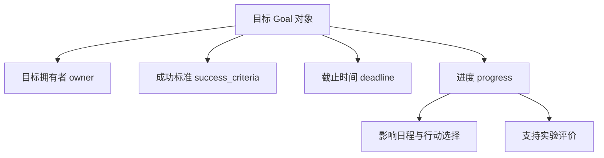
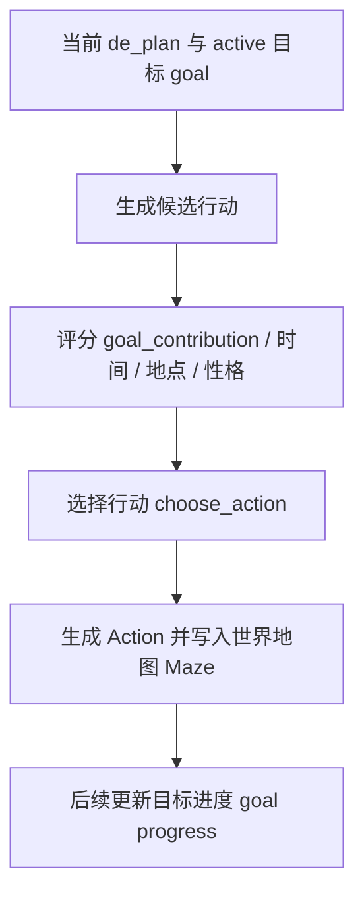
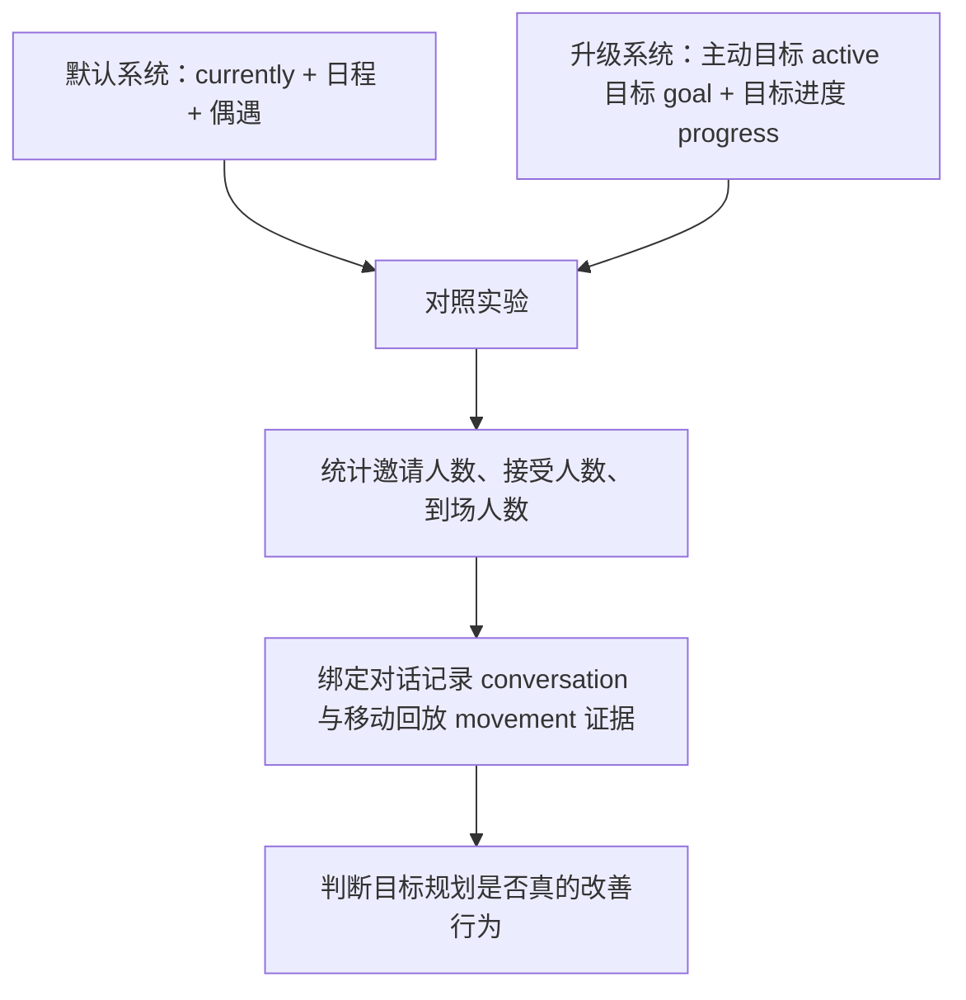

# 第 34 章 规划系统升级：从日程拆解到目标驱动行动

## 34.1 核心问题

记忆让智能体知道过去。反思让智能体理解过去。规划决定智能体接下来做什么。生成式智能体 Generative Agents 的规划 planning 很有启发性，因为它不是只生成下一句话，而是生成一天的生活节奏，并把粗计划拆成具体行动。生成式智能体 Generative Agents 继承了这套机制。但到了 2026 年，只靠日程拆解已经不能覆盖更复杂的智能体 agent 行为。例如：

```text
伊莎贝拉希望至少三位居民知道派对，并让两位居民实际到场。
```

这不是普通日程问题。它是目标驱动问题。本章聚焦六个问题：

1. 当前生成式智能体 Generative Agents 的规划 planning 如何工作？
2. 日程规划和目标规划有什么区别？
3. ReAct、Tree of Thoughts 和 LATS 给我们什么启发？
4. 如何给当前项目增加目标 Goal 对象？
5. 如何实现多候选行动选择和轻量工具调用？
6. 如何评价规划升级是否真的有效？



*图 34-1：从日程规划到目标驱动行动的升级结构。目标驱动规划不是替代日程，而是在日程之上增加目标、候选行动和反馈评估。*



*图 34-2：目标驱动规划在小镇里怎样落地。图片使用真实断点 checkpoint 中的日程 schedule 片段，把主动目标 active 目标 goal、候选行动 candidate actions、目标贡献目标贡献 goal contribution、自然性 naturalness 和进度 progress 组合成规划仪表盘。*

## 34.2 当前规划系统的三层

生成式智能体 Generative Agents 当前规划系统可以分成三层。第一层，日程生成。对应：

```text
Agent.make_schedule()
```

它负责生成当天计划。第二层，日程分解。对应：

```text
schedule_decompose
```

它把当前时间段的粗计划拆成更细行动。第三层，行动落地。对应：

```text
Agent._determine_action()
```

它把当前子计划映射到地址、对象和事件。这三层构成：

```text
daily schedule -> decomposed plan -> concrete action
```

这就是角色能在小镇里持续行动的基础。

## 34.3 日程 Schedule 的数据结构

`Schedule` 位于：

```text
generative_agents/modules/memory/schedule.py
```

它会保存下面这些内容：

```python
self.daily_schedule = daily_schedule or []
self.diversity = diversity
self.max_try = max_try
```

每个 plan 包含：

```python
{
    "idx": ...,
    "describe": ...,
    "start": ...,
    "duration": ...,
    "decompose": ...
}
```

这里的 `start` 和 `duration` 都是分钟数。`current_plan()` 会根据当前虚拟时间找到正在执行的计划。如果有 decompose，就返回当前子计划。否则返回粗计划本身。这套结构简单、清晰、适合教学。它让读者可以在断点 checkpoint 中看到角色当天怎么安排。

## 34.4 当前日程生成流程

`Agent.make_schedule()` 会做几件事。第一，如果当天还没有日程 schedule，就生成新日程。第二，如果已有记忆，会先检索近期重要内容，更新 `scratch.currently`。第三，生成起床时间。

```python
wake_up = self.completion("wake_up")
```

第四步生成当天的初始日程。

```python
init_schedule = self.completion("schedule_init", wake_up)
```

第五，生成全天日程 schedule。

```python
schedule_daily
```

第六，检查日程多样性。

```python
if len(set(schedule.values())) >= self.schedule.diversity:
    break
```

第七，把日程 schedule 写入 `daily_schedule`。第八，把当天计划作为想法 thought 写入记忆。这说明当前规划已经不是无状态生成。它会用近期记忆更新角色当前状态，再生成日程。

## 34.5 当前行动落地流程

`Agent._determine_action()` 做的是从计划到环境行动的映射。它先取当前 plan 和 de_plan：

```python
plan, de_plan = self.schedule.current_plan()
```

然后根据 plan 描述查找地址：

```python
address = self.spatial.find_address(describes[0], as_list=True)
```

如果找不到，就逐层判断：

- sector。
- 场所 arena。
- object。

最后生成下面结果，用于验证前文判断：

```python
memory.Action(...)
```

这一步非常关键。因为规划如果不能落到空间，就只是文本。可信小镇要求角色真的走向某个地点，占用某个对象，并在移动回放 movement 中留下轨迹。

## 34.6 当前规划系统的优势

当前规划系统有四个明显优势。第一，它符合日常生活结构。角色不是每一步随机决定，而是围绕一天计划行动。第二，它支持细粒度行动。粗计划可以被拆成子任务。第三，它能被打断和修订。`schedule_revise` 可以根据行动修改后续计划。第四，它与空间系统连接。行动不是纯文本，而会落到世界地图 Maze 地址树。这些能力足以支撑小镇生活仿真。但它们不等于复杂目标规划。

## 34.7 日程规划和目标规划的区别

日程规划需要回答的问题是：

```text
今天什么时间做什么？
```

目标规划需要回答的问题是：

```text
为了达成某个目标，我应该采取哪些行动，并根据反馈调整？
```

举例。日程规划可以生成：

```text
15:00-16:00 准备情人节派对。
```

目标规划需要追问，可以这样处理：

```text
还差几个人知道派对？
谁最适合邀请？
现在去哪里最可能遇到他们？
如果对方拒绝怎么办？
是否需要改变邀请策略？
```

日程规划让角色“像人在生活”。目标规划让角色“能围绕目标持续行动”。两者不是替代关系。更合理的结构是：

```text
长期目标
  -> 当天日程
  -> 当前子计划
  -> 候选行动
  -> 行动反馈
  -> 目标进度更新
```

## 34.8 ReAct 的启发

ReAct 强调 reasoning 和 acting 的交替。也就是：

```text
思考
行动
观察
再思考
再行动
```

生成式智能体 Generative Agents 当前已经有类似循环：

```text
percept -> make_plan -> act -> percept
```

但 reasoning trace 没有显式保存。例如角色决定去咖啡馆，并不会保存：

```text
我选择去咖啡馆，是因为伊莎贝拉可能在那里，我想邀请她参加讨论会。
```

这对日常生活没问题。但对复杂目标，缺少 reasoning trace 会影响可解释性和复盘。升级方向是：

```text
为目标驱动行动保存 reasoning / action / observation 记录。
```

这可以成为新的记忆类型：

```text
trace
```

或保存在目标 goal 进度中。

## 34.9 Tree of Thoughts 的启发

Tree of Thoughts 的核心启发是：

```text
不要一次生成唯一答案，而是生成多个候选思路并评估。
```

在小镇中，很多决策都适合多候选。例如伊莎贝拉要传播派对消息。候选行动可能是：

1. 去咖啡馆等待常客。
2. 主动找玛丽亚聊天。
3. 先和埃迪确认音乐安排。
4. 去公园寻找更多居民。

单次生成可能选到一个普通行动。多候选评估可以问：

```text
哪个行动最有助于目标？
哪个行动成本最低？
哪个行动符合当前时间和地点？
哪个行动最符合角色性格？
```

这不是让智能体 agent 变成计算器。而是让复杂决策多一步比较。

## 34.10 LATS 的启发

LATS 将语言推理、行动和规划放到树搜索框架中。对小镇项目来说，不必完整实现复杂搜索。但可以借鉴一个思想：

```text
规划可以探索多条行动路径，并根据反馈更新选择。
```

例如山姆竞选宣传。路径 A：

```text
先找支持者詹妮弗 -> 再通过她接触邻居。
```

第二条实现路径如下：

```text
直接去公共场所和陌生居民交流。
```

第三条实现路径如下：

```text
先找汤姆，尝试化解反对。
```

每条路径都有不同风险。LATS 的启发是：

```text
复杂目标不应只靠当前一步生成，而应保留候选路径和反馈。
```

## 34.11 升级方向一：目标 Goal 对象

第一项可落地升级是引入目标 Goal 对象。示例：

```json
{
  "goal_id": "goal_party_001",
  "owner": "伊莎贝拉",
  "description": "让至少三位居民知道并参加情人节派对",
  "deadline": "2024-02-14 17:00",
  "status": "active",
  "success_criteria": [
    "至少三位居民被邀请",
    "至少两位居民到达霍布斯咖啡馆"
  ],
  "progress": {
    "invited": ["玛丽亚"],
    "accepted": [],
    "arrived": []
  }
}
```

目标对象目标 Goal 解决三个问题。第一，把长期目标显式化。第二，把成功标准写清楚。第三，把进度从自然语言中抽出来。这不是替代角色设定 persona。persona 是角色是谁。目标 goal 是角色当前要达成什么。

目标对象逻辑图：



## 34.12 目标 Goal 应该放在哪里

有三种实现方式。第一，作为新的记忆类型记忆 memory node_type：

```text
goal
```

优点是改动小。缺点是结构化进度不方便。第二，新增模块：

```text
generative_agents/modules/memory/goal.py
```

定义 `Goal` 类。优点是结构清晰。缺点是需要修改智能体 agent 序列化。第三，作为 `Scratch` 的扩展。把当前目标放入草稿状态 scratch。优点是提示词 prompt 使用方便。缺点是长期证据和进度管理较弱。本书建议：

```text
先以 memory node_type 实验，再逐步独立成 Goal 类。
```

这样能降低第一步实现成本。

## 34.13 升级方向二：目标驱动日程

有了目标 Goal 后，生成日程时就不应只看 persona 和 currently。还应看当前目标。例如：

```text
伊莎贝拉有一个 active goal：让至少三位居民知道派对。
```

那么当天日程中应出现：

- 准备派对。
- 邀请居民。
- 确认参加者。
- 17:00 前回到咖啡馆。

可以新增提示词 prompt：

```text
goal_influence_schedule.txt
```

对应的输入内容可以这样写：

- persona。
- currently。
- 主动目标 active goals。
- recent memories。

对应的输出结果应该类似这样：

```text
今天哪些日程应服务于这些目标？
```

然后再进入 `schedule_daily` 或作为其上下文。这样目标不会只停留在记忆里。它会影响当天计划。

## 34.14 升级方向三：多候选行动选择

当前 `_determine_action()` 基本是：

```text
取当前 de_plan
  -> 找地址
  -> 生成 Action
```

升级后可以增加下面内容：

```text
generate_candidate_actions
  -> score_candidate_actions
  -> choose_action
```

候选行动示例可以这样写：

```json
[
  {
    "action": "去霍布斯咖啡馆整理派对材料",
    "goal_contribution": 0.6,
    "reason": "有助于派对准备，但不能传播信息"
  },
  {
    "action": "去找玛丽亚并邀请她参加派对",
    "goal_contribution": 0.8,
    "reason": "玛丽亚可能会传播给克劳斯"
  },
  {
    "action": "去公园寻找居民宣传派对",
    "goal_contribution": 0.5,
    "reason": "可能接触更多人，但不确定能遇到谁"
  }
]
```

选择时不只看目标贡献目标贡献 goal contribution。还要看：

- 是否符合当前时间。
- 是否符合当前位置。
- 是否符合角色性格。
- 是否有空间路径。
- 是否过度工具化。

这一步是 Tree of Thoughts 思想的轻量版本。

候选行动逻辑图：



## 34.15 升级方向四：目标进度评估

目标驱动规划必须知道进度。否则智能体 agent 无法判断下一步。可以新增：

```text
goal_evaluate_progress.txt
```

对应的输入内容可以这样写：

- 目标 goal。
- 最近对话。
- 最近行动。
- 移动回放 movement 或地点记录。

对应的输出结果应该类似这样：

```json
{
  "invited": ["玛丽亚", "克劳斯"],
  "accepted": ["玛丽亚"],
  "arrived": [],
  "missing": ["还需要至少一位居民明确知道派对"],
  "next_suggestion": "优先邀请与玛丽亚关系较近的人。"
}
```

这会让计划更闭环。当前日程系统知道时间到了该做什么。目标系统还要知道：

```text
目标还差什么？
```

## 34.16 升级方向五：轻量工具调用

复杂智能体 agent 框架常常引入工具调用。生成式智能体 Generative Agents 不必一开始接复杂外部工具。可以先做小镇内部工具。例如：

```python
get_current_time()
get_agents_near(location)
get_recent_conversations(agent_name)
get_event_spread(keyword)
get_current_plan(agent_name)
```

这些工具不改变世界，只读取状态。它们能帮助智能体 agent 做更合理规划。例如伊莎贝拉想邀请更多人，可以查询：

```text
谁现在可能在咖啡馆附近？
```

山姆想传播竞选消息，可以查询：

```text
哪些居民已经听过竞选？
```

工具调用要谨慎。如果智能体 agent 直接获得全局上帝视角，社会仿真会失真。因此工具应该区分：

- 智能体 agent 可知工具。
- 实验分析工具。

角色自己不应随便知道所有人的位置。除非这是环境设定允许的。

## 34.17 升级方向六：行动反馈闭环

目标规划需要反馈。行动执行后，应记录：

```text
expected_outcome
actual_outcome
progress_delta
lesson
```

可以看一个具体例子：

```json
{
  "action": "邀请玛丽亚参加派对",
  "expected_outcome": "玛丽亚知道并可能参加派对",
  "actual_outcome": "玛丽亚表示感兴趣，但未明确承诺",
  "progress_delta": {
    "informed": ["玛丽亚"],
    "accepted": []
  },
  "lesson": "下次需要确认对方是否能在17:00到场。"
}
```

这把第 31 章的经验学习和本章目标规划连接起来。规划不是一次性生成。它应该持续根据反馈更新。

## 34.18 最小可行升级实验

建议第一个实验仍然用情人节派对。目标：

```text
伊莎贝拉希望在 17:00 前让至少三位居民知道派对，并让至少两人表示愿意参加。
```

升级前的写法通常是这样：

```text
伊莎贝拉依赖 currently、日程和偶遇自然传播。
```

升级后的写法可以调整为：

```text
伊莎贝拉拥有 active goal；
系统在日程和行动选择时考虑目标进度；
每次邀请后更新 goal progress。
```

实验逻辑图：



这一项可以这样评价：

- 信息传播覆盖率是否提升。
- 邀请是否更有针对性。
- 是否出现过度工具化行为。
- 是否更容易形成到场行动。
- 失败后是否调整策略。

这个实验能清楚显示目标规划的价值和风险。

## 34.19 评价指标

规划升级可以用以下指标评价：

```text
goal_completion_rate
```

该指标记录目标完成率。

```text
plan_step_completion_rate
```

该指标记录计划步骤完成率。

```text
invalid_action_rate
```

该指标记录无效行动比例。

```text
replan_count
```

该指标记录重规划次数。

```text
candidate_selection_quality
```

候选行动选择是否合理。

```text
goal_progress_accuracy
```

系统记录的目标进度是否与真实对话和移动回放 movement 一致。

```text
naturalness_score
```

目标驱动是否破坏生活感。最后一个指标很重要。目标规划越强，角色越容易变成任务机器。小镇智能体仍然应该像居民，而不是流程机器人。

## 34.20 风险与边界

规划升级的主要风险有四类。第一，过度工具化。角色为了完成目标频繁打断日常生活。第二，上帝视角。如果工具让角色知道不该知道的信息，社会仿真会失真。第三，指标驱动。如果只优化目标完成率，角色可能做出不符合人设的行为。第四，成本上升。多候选行动和评分会显著增加大语言模型 LLM 调用。因此建议：

- 只对重要目标 goal 使用多候选。
- 日常行动仍使用普通日程 schedule。
- 工具调用限制在角色可知范围内。
- 评价时同时看成功率和可信度。

好的目标规划不是让角色永远高效。而是让角色在重要目标上表现出合理、可解释、符合人设的持续性。

## 34.21 本章小结

规划升级不是推翻日程系统，而是在日程之上补上目标、候选方案和反馈。当前规划强在哪里、目标驱动行动该从哪里开始加，是升级的核心判断。

| 本章内容 | 核心结论 |
| --- | --- |
| 当前三层规划 | 当前规划由日程生成、日程分解和行动落地三层构成。 |
| `Schedule` | `Schedule` 保存 daily_schedule，并通过 `current_plan()` 找到当前计划。 |
| `make_schedule()` | 它会根据记忆更新 currently，再生成当天日程。 |
| `_determine_action()` | 它把当前计划映射到世界地图 Maze 地址和对象，是行动落地关键。 |
| 日程 vs 目标 | 日程规划回答“什么时候做什么”，目标规划回答“为了达成目标下一步怎么做”。 |
| ReAct 启发 | 保存 reasoning / 行动 action / observation 闭环。 |
| Tree of Thoughts 启发 | 生成多个候选行动并评估。 |
| LATS 启发 | 保留候选路径和反馈，而不是只生成当前一步。 |
| 可落地升级 | 目标 Goal 对象、目标驱动日程、多候选行动选择、目标进度评估、轻量工具调用和行动反馈闭环。 |
| 评价要求 | 规划升级必须同时评价目标完成率、计划合理性、进度准确性和行为自然性。 |

下一章讨论多智能体协作升级。目标规划解决单个角色如何围绕目标行动；多智能体协作要解决多个角色如何围绕共享目标分工、同步和协商。

## 参考资料

- ReAct: https://arxiv.org/abs/2210.03629
- Tree of Thoughts: https://arxiv.org/abs/2305.10601
- LATS: https://arxiv.org/abs/2310.04406
- 生成式智能体 Generative Agents: https://arxiv.org/abs/2304.03442
- Local source: `generative_agents/modules/memory/schedule.py`
- Local source: `generative_agents/modules/agent.py`
- Local source: `generative_agents/modules/prompt/scratch.py`
