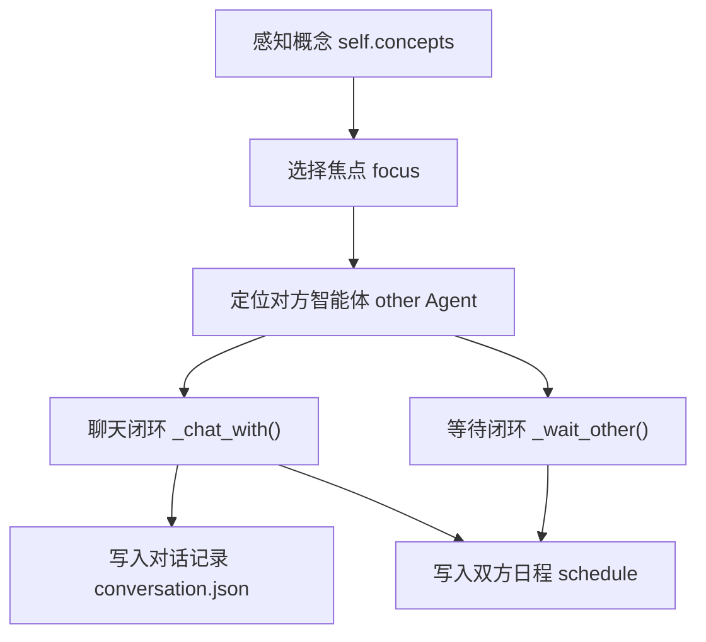
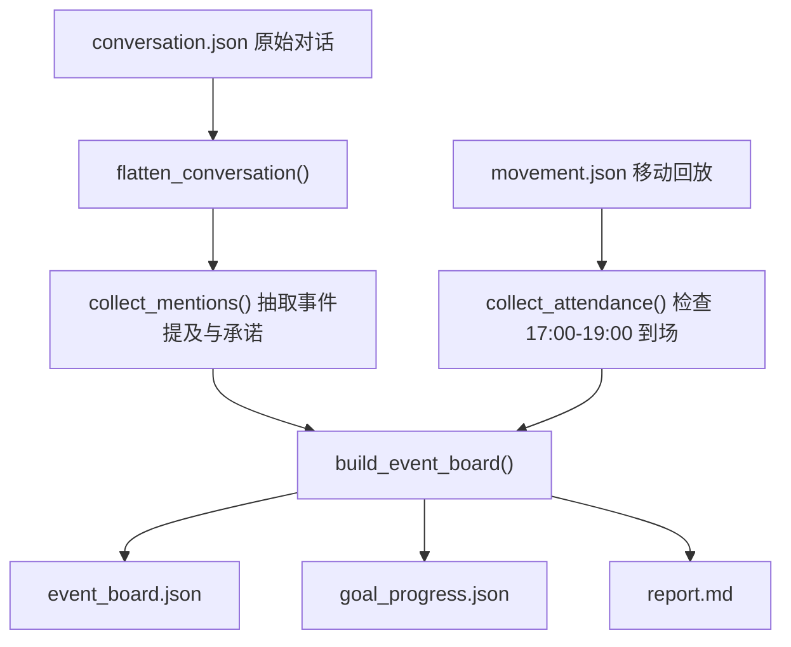
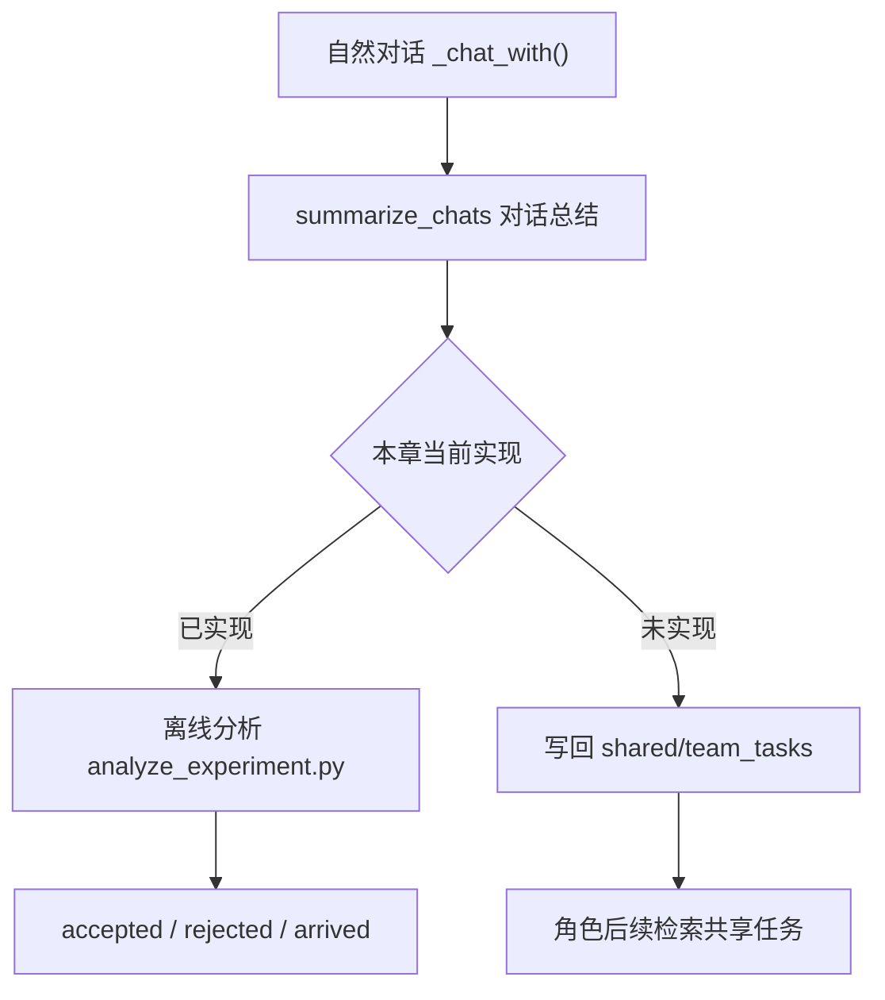

# 第 35 章 多智能体协作升级：从自然偶遇到组织化协作

## 35.1 派对准备卡在“谁负责”

`book-party-extended` 的回放里，伊莎贝拉在霍布斯咖啡馆反复向玛丽亚提到下午五点的情人节派对。对话里能看到邀请、承诺、布置彩带和爱心气球，`simulation.md` 里也会出现“伊莎贝拉请玛丽亚帮忙挂爱心气球布置派对，玛丽亚欣然应允”这样的活动摘要。问题在于，当前项目只能把这件事保存成自然对话 conversation、日程 schedule 和移动回放 movement，不能把它保存成一个团队任务 team task。

这就是多智能体协作升级 multi-agent collaboration 的现场：自然偶遇已经能让消息传播起来，但系统还不知道“谁接了任务、任务做到哪一步、失败卡在哪里、证据从哪段对话来”。

| 场景 | 当前自然偶遇 natural encounter | 组织化协作 organized collaboration |
| --- | --- | --- |
| 派对邀请 | 伊莎贝拉和玛丽亚聊天，摘要写入日程 schedule。 | 事件板 event board 记录玛丽亚接受“布置气球”任务。 |
| 音乐安排 | 埃迪可能在咖啡馆弹钢琴，但没有任务归属。 | 工作组 workgroup 把“确认音乐”分给埃迪，并记录接受或拒绝。 |
| 到场判断 | 通过 `movement.json` 看角色是否到霍布斯咖啡馆。 | 到场 attendance 与任务完成 task completion 一起进入报告 report。 |
| 失败解释 | 只能人工翻 `conversation.json`、`simulation.md` 和断点 checkpoint。 | 失败模式 failure mode 直接绑定证据路径 evidence path。 |

```mermaid
flowchart LR
    A["感知 perception：角色在世界地图 Maze 相遇"] --> B["聊天判断 prompt decide_chat"]
    B --> C["自然对话 conversation"]
    C --> D["个人记忆 personal memory 与日程 schedule"]
    D --> E["社会涌现 social emergence"]
    E -.升级.-> F["公共事件板 event board"]
    F --> G["临时工作组 temporary workgroup"]
    G --> H["任务状态 task status"]
    H --> I["协作报告 collaboration report"]
```



*图 35-1：从自然偶遇 natural encounter 到组织化协作 organized collaboration。当前项目已有感知、对话、记忆和日程写回；协作升级要在这条链后面增加公共状态、角色分工和可审计报告。*


*图 35-2：情人节派对从个人事件升级成协作事件。图中的咖啡馆事件桌把公共事件板 event board、角色分工 role、任务状态 task status、对话轨迹 conversation 和移动路径 movement 放在一起；有角色接受任务，也有角色犹豫或冲突。协作不是全员配合，而是可以被证据追踪的社会过程。*

## 35.2 项目锚点和术语

框架 CAMEL、框架 AutoGen、框架 MetaGPT 和平台 AgentScope 在 GenerativeAgentsCN 中的作用，是把协作能力压回 GenerativeAgentsCN 的可改位置。

| 中文 English | 项目锚点 | 升级读法 |
| --- | --- | --- |
| 智能体 Agent | `generative_agents_next/modules/agent.py` | 角色行为的执行单元，协作逻辑不能绕开它。 |
| 游戏循环 Game loop | `generative_agents_next/modules/game.py` | `Game.agent_think()` 每步调用智能体思考，并把状态交回 `start.py` 保存。 |
| 提示词 prompt | `generative_agents_next/data/prompts/*.txt`、`generative_agents_next/modules/prompt/scratch.py` | 对话、判断、总结都由提示词 prompt 包装函数提供变量和输出结构 schema。 |
| 对话记录 conversation | `generative_agents_next/results/checkpoints/<name>/conversation.json` | 当前最强的协作证据来源，记录说话双方、地点和原话。 |
| 断点 checkpoint | `generative_agents_next/results/checkpoints/<name>/simulate-*.json` | 保存每一步角色状态、行动、日程、记忆摘要和坐标。 |
| 移动回放 movement | `generative_agents_next/results/compressed/<name>/movement.json` | 检查承诺是否转化为到场、聚集和任务行动。 |
| 时间线 simulation | `generative_agents_next/results/compressed/<name>/simulation.md` | 给人读的证据索引，适合定位片段，再回查原始 JSON。 |
| 公共事件板 event board | `generative_agents_next/results/evaluations/<name>/event_board.json` | 把协作任务从个人记忆提升为实验可观察对象。 |

## 35.3 当前社交链路如何运行

当前社交互动 social interaction 不是一个抽象概念，而是一段清楚的源码链路。入口在 `generative_agents_next/modules/agent.py` 的 `Agent._reaction()`。

| 阶段 | 输入 input | 处理 process | 输出 output |
| --- | --- | --- | --- |
| 选择关注对象 focus | `self.concepts`、附近角色 `agents`、忽略词 `ignore_words` | 优先选择关注角色相关的概念 concept；否则随机选择非空闲事件。 | `focus` 与 `other`，供聊天或等待判断使用。 |
| 发起聊天 chat | `other`、关系焦点 `focus`、历史聊天 `associate.retrieve_chats()` | 调用 `_chat_with()`，经过 prompt 判断、生成、终止、总结。 | `conversation.json` 记录原话，双方 `schedule` 写入对话事件。 |
| 等待他人 wait | 当前路径 `self.path`、对方所在地图格子 Tile、`decide_wait` prompt | 判断目标对象是否被占用，以及是否等待。 | `revise_schedule()` 写入等待事件。 |



*图 35-3：当前社交链路 social interaction 的项目路径。自然偶遇不是随机寒暄，它已经有输入、prompt 判断、状态写回和持久化输出，只是输出还停留在个人层面。*

## 35.4 `_chat_with()` 的输入、处理、输出闭环

`Agent._chat_with()` 是组织化协作最重要的基线。组织化协作不能替换它，而要在它生成自然对话之后追加结构化抽取 structural extraction。

| 源码位置 | 输入 input | 处理 process | 输出 output |
| --- | --- | --- | --- |
| `Agent._chat_with(other, focus)` | 两个智能体 Agent、焦点记忆 `focus`、历史聊天 `chats`、双方当前行动 event | 过滤不适合聊天的状态；判断是否聊天；生成关系摘要；多轮生成对话；检查重复和结束；总结对话。 | `self.conversation[key]`、双方 `schedule_chat()`、对话摘要 `chat_summary`。 |
| `Agent.schedule_chat()` | 对话轮次 `chats`、摘要 `chats_summary`、开始时间 `start`、持续时间 `duration`、对方 `other` | 生成谓词为“对话”的 `memory.Event`，调用 `revise_schedule()`。 | 当前日程被聊天占用，角色行动在断点 checkpoint 中可见。 |

### 聊天前置过滤

`_chat_with()` 会先排除五类情况：日程未初始化、任一角色正在睡觉、对方正在移动、任一角色已在对话、两人 60 分钟内刚聊过。这些过滤是组织化协作必须保留的生活感约束。如果绕过它强行安排会议，角色就会像流程机器人 workflow bot，而不是小镇居民。

| 过滤条件 | 检查位置 | 协作升级的含义 |
| --- | --- | --- |
| 日程为空 | `len(self.schedule.daily_schedule) < 1` | 工作组 workgroup 不能在角色尚未初始化时创建任务。 |
| 睡觉或待开始 | `_skip_react()` | 公共事件板 event board 不能让睡觉角色自动接任务。 |
| 对方在移动 | `if other.path` | 分配任务前要确认角色有可对话窗口。 |
| 正在对话 | `event.fit(predicate="对话")` | 协作协议 dialogue protocol 不能插入并发对话。 |
| 60 分钟内刚聊过 | `associate.retrieve_chats()` 与 `get_delta()` | 防止为了推进任务反复骚扰同一个角色。 |

### 聊天判断 prompt：`decide_chat`

`decide_chat` 是自然偶遇是否转化为对话的入口，不是协作任务本身。

| 项目 | 内容 |
| --- | --- |
| 提示词 prompt 文件 | `generative_agents_next/data/prompts/decide_chat.txt` |
| 包装函数 | `PromptScratch.prompt_decide_chat()` |
| 变量 variables | `context`、`date`、`chat_history`、`agent_status`、`another_status`、`agent`、`another` |
| 输出结构 schema | `decide_chatResponse.res: bool`，含义是是否主动发起对话。 |
| 失败保护 failsafe | `False`，模型失败时不发起聊天。 |
| 流向 flow | `False` 直接退出 `_chat_with()`；`True` 进入关系摘要和对话生成。 |

真实模板骨架如下，变量由 `scratch.py` 填入：

```text
背景：
"""
${context}

现在是 ${date}。${chat_history}

${agent_status}
${another_status}
"""

根据上述背景判断，${agent} 是否有可能主动与 ${another} 对话？只用“是”或“否”回答：
```

### 关系摘要和对话生成 prompt

判断要聊天之后，源码会先为双方各生成一次关系摘要，再交替调用对话生成 prompt。

| 提示词 prompt | 文件路径 | 输入 input | 输出结构 schema | 输出流向 |
| --- | --- | --- | --- | --- |
| 关系摘要 summarize_relation | `generative_agents_next/data/prompts/summarize_relation.txt` | `associate.retrieve_focus([other_name], 50)` 取出的相关记忆、`agent`、`another` | `summarize_relationResponse.res: str` | 作为 `generate_chat` 的关系背景 `relation`。 |
| 对话生成 generate_chat | `generative_agents_next/data/prompts/generate_chat.txt` | 基础描述 `base_desc`、记忆 `memory`、地址 `address`、时间 `current_time`、历史对话 `conversation` | `generate_chat.res: str`，1 到 3 句话 | 追加到 `chats`，后续进入重复检查和终止判断。 |

`generate_chat.txt` 的核心约束是：不要重复对话记录，符合角色性格和当前情境，直接输出当前角色要说的话。协作升级要复用这个自然语言层，而不是把角色台词改成 JSON。

### 重复、终止和总结 prompt

对话过程中还有三类 prompt 保证输出可收束。

| 提示词 prompt | 文件路径 | 变量 variables | 输出结构 schema | 下游影响 |
| --- | --- | --- | --- | --- |
| 重复检查 generate_chat_check_repeat | `generative_agents_next/data/prompts/generate_chat_check_repeat.txt` | `conversation`、`content`、`agent` | `generate_chat_check_repeatResponse.res: bool` | 为 `True` 时停止继续生成，避免复读。 |
| 终止判断 decide_chat_terminate | `generative_agents_next/data/prompts/decide_chat_terminate.txt` | `conversation`、`agent`、`another` | `decide_chat_terminateResponse.res: bool` | 为 `True` 时结束多轮对话。 |
| 对话总结 summarize_chats | `generative_agents_next/data/prompts/summarize_chats.txt` | `conversation` | `summarize_chatsResponse.res: str` | 进入 `schedule_chat()` 的 `describe` 字段。 |

`conversation.json` 的结构已经足够做协作证据抽取。例如 `book-party-extended` 中有这样的证据形态：

```json
{
  "20240214-10:00": [
    {
      "伊莎贝拉 -> 玛丽亚 @ the Ville，霍布斯咖啡馆，咖啡馆，咖啡馆柜台后面": [
        ["伊莎贝拉", "玛丽亚，今天的三明治看起来很美味呢！下午五点的情人节派对你一定要来哦，我已经准备好了一些特别的安排。"],
        ["玛丽亚", "哇，情人节派对？听起来太棒了！我五点刚好有休息时间，肯定会去参加的！"]
      ]
    }
  ]
}
```

这段输出已经有时间、地点、说话者、听话者和原话。缺少的是把“肯定会去参加”抽取成结构化承诺 commitment，并把它绑定到事件板 event board。

## 35.5 当前机制的能力边界

自然偶遇 natural encounter 的优势是可信生活流，局限是协作状态不可见。

| 当前能力 | 项目证据 | 适合做什么 | 不足在哪里 |
| --- | --- | --- | --- |
| 自然传播 information diffusion | `conversation.json`、`simulation.md` | 派对消息、竞选观点、关系信息的扩散。 | 不知道传播是否对应任务承诺。 |
| 个人日程 schedule | 断点 checkpoint 中的 `schedule` 和 `action` | 检查角色当前在做什么。 | 缺少“团队任务”的统一进度视图。 |
| 移动回放 movement | `movement.json` 的 `all_movement` | 验证角色是否到达地点。 | 到场不等于完成任务，需要任务语义。 |
| 关系与记忆 memory | `storage/<agent>/associate/` | 让后续对话带历史背景。 | 共享事件状态不能只存在于某个角色记忆里。 |
| 人工报告 simulation | `simulation.md` | 快速阅读一天发生了什么。 | 报告是结果汇编，不是协作状态机。 |

协作升级要补的不是“更会聊天”，而是让对话后的结构化事实进入可验证数据结构。

## 35.6 前沿框架给项目的接口

| 前沿思想 | 不直接照搬的原因 | 落回 GenerativeAgentsCN 的接口 |
| --- | --- | --- |
| 框架 CAMEL 角色扮演式沟通智能体 role-playing communicative agents | 框架 CAMEL 更像任务型双智能体协作，本项目还要保留小镇生活。 | 在事件 event 内增加临时协作角色 role，例如 `organizer`、`helper`、`messenger`。 |
| 框架 AutoGen 多智能体对话框架 multi-agent conversation framework | 框架 AutoGen 强调可配置代理对话，本项目已有生活化对话链。 | 在自然对话后抽取 `dialogue_act`，不直接让台词变成命令。 |
| 框架 MetaGPT 标准作业流程 SOP | 框架 MetaGPT 面向软件开发流程，小镇任务不能被 SOP 写死。 | 为派对、竞选、讨论会定义轻量 SOP，允许拒绝、遗忘、冲突和偏离。 |
| 平台 AgentScope 多智能体平台 multi-agent platform | 平台 AgentScope 面向更通用的平台扩展，本项目优先保持小规模可复查。 | 增加配置、状态观测、日志、指标 metrics 和报告 report，而不是先扩到大量角色。 |

## 35.7 升级一：公共事件板 event board

公共事件板 event board 的作用，是把“伊莎贝拉想办派对”从个人记忆里的愿望，提升成一个可以被实验检查的协作对象。这里要先分清三层，否则读者很容易误以为本章已经做完了完整团队系统。

| 层级 | 本章是否落地 | 文件路径 | 能回答的问题 |
| --- | --- | --- | --- |
| 原始对话证据 conversation | 已落地 | `generative_agents_next/results/checkpoints/<实验名>/conversation.json` | 谁在什么时间、什么地点、说了什么。 |
| 离线事件板 event board | 已落地 | `generative_agents_next/results/evaluations/<实验名>/event_board.json` | 谁知道事件、谁接受、谁拒绝、谁在目标时间窗到场。 |
| 写回式团队任务 team tasks | 未接入主链路 | 后续才会进入 `storage/shared/<event_id>/team_tasks.json` | 谁负责布置、谁负责音乐、任务是否完成。 |

本章真正实现的是第二层：离线事件板。它读取仿真结束后的 `conversation.json`、`movement.json` 和最终 checkpoint，不进入角色 prompt，也不会让角色获得上帝视角。

相对路径：`generative_agents_next/analyze_experiment.py`

```diff
+def build_event_board(event_name, mentions, attendance):
+    known_by = sorted({row["speaker"] for row in mentions})
+    accepted = sorted({row["speaker"] for row in mentions if row["commitment"] == "accepted"})
+    rejected = sorted({row["speaker"] for row in mentions if row["commitment"] == "rejected"})
+    arrived = sorted({row["agent"] for row in attendance})
+    return {
+        "event": event_name,
+        "known_by": known_by,
+        "accepted": accepted,
+        "rejected": rejected,
+        "arrived": arrived,
+        "tasks": [...]
+    }
```

这段代码不是在“创造协作成功”，而是在把已有证据整理成事件视图。`known_by` 来自命中关键词的说话者；`accepted` 和 `rejected` 来自对话中的承诺或拒绝；`arrived` 来自 `movement.json` 在目标时间窗内的位置记录；`tasks` 目前是评价任务，不是角色真的接到的布置任务。



*图 35-4：公共事件板 event board 的真实代码路径。自然对话先发生，事件板后抽取；事件板是审计产物，不是角色共同看到的一块白板。*

## 35.8 升级二：临时工作组 temporary workgroup

临时工作组 temporary workgroup 是本章要引出的协作概念，但当前实验只做了离线推断，没有把工作组写回角色状态。也就是说，报告可以说“玛丽亚在对话里接受了派对相关承诺”，但不能说“系统已经把玛丽亚注册成布置负责人，并在后续行动中持续提醒她”。

这一点必须写清楚，因为两者的工程含义完全不同。

| 概念 | 当前实验怎么处理 | 不能越界宣称什么 |
| --- | --- | --- |
| 组织者 organizer | 伊莎贝拉是事件事实上的发起人，来自角色设定和对话内容。 | 不能说她拥有可写入共享任务系统的权限。 |
| 助手 helper | 接受承诺的角色会进入 `accepted`。 | 不能说系统已给她生成具体任务卡。 |
| 参与者 participant | 在目标地点出现的角色进入 `arrived`。 | 到场不等于完成布置、音乐或邀请任务。 |
| 拒绝者 declined | 明确拒绝或时间冲突的角色进入 `rejected`。 | 拒绝不是失败噪声，而是协作边界。 |
| 旁观者 observer | 只在场或只听到事件，不会自动成为负责人。 | 不能把弱证据硬算成任务接受。 |

如果未来要把临时工作组接进主链路，更新点应该放在 `Agent._chat_with()` 完成 `summarize_chats` 之后：先保留自然对话，再用结构化抽取更新共享状态。当前章节不把这一步写成已经完成。



*图 35-5：临时工作组 temporary workgroup 的边界。本章只验证离线识别，不把任务写回角色可见上下文。*

## 35.9 升级三：协作对话协议 dialogue act

协作对话协议 dialogue act 的目标，是把自然语言里的“邀请、接受、拒绝、报告进度”抽成结构化动作。当前实现先选择更保守的确定性规则：不用新的 LLM prompt，而是在 `analyze_experiment.py` 里用正则表达式识别承诺和拒绝。

相对路径：`generative_agents_next/analyze_experiment.py`

```diff
+def detect_commitment(text):
+    invitation_patterns = [...]
+    accept_patterns = [...]
+    reject_patterns = [...]
+    if any(re.search(pattern, text) for pattern in reject_patterns):
+        return "rejected"
+    if any(re.search(pattern, text) for pattern in invitation_patterns):
+        return ""
+    if any(re.search(pattern, text) for pattern in accept_patterns):
+        return "accepted"
+    return ""
```

这段规则有三个设计取舍。

第一，邀请本身不等于接受。伊莎贝拉说“欢迎你来参加”只能说明事件传播，不能把伊莎贝拉或对方算作接受任务。

第二，接受必须带有行动语义。例如“我会过来”“肯定参加”“可以帮忙布置”才进入 `accepted`。普通寒暄不能改变协作状态。

第三，拒绝要优先判断。只要一句话明确表示“来不了”“时间冲突”“不方便参加”，就进入 `rejected`，避免被同一句话里的礼貌表达误判成接受。

`collect_mentions()` 还补了一个上下文规则：如果同一段对话前面已经命中“情人节、派对、霍布斯咖啡馆”等事件关键词，后续一句没有关键词但包含承诺，也可以被纳入同一事件上下文。

```diff
+def collect_mentions(rows, keywords):
+    event_context = set()
+    for row in rows:
+        hits = [keyword for keyword in keywords if keyword and keyword in row["text"]]
+        commitment = detect_commitment(row["text"])
+        context_key = (row["time"], row["route"])
+        if hits:
+            event_context.add(context_key)
+        if not hits and not (commitment and context_key in event_context):
+            continue
```

未来如果要升级为 LLM 版协作对话协议，可以新增这些文件，但它们不是当前章节已经存在的文件：

```text
generative_agents_next/data/prompts/team_assign_role.txt
generative_agents_next/data/prompts/team_update_task.txt
generative_agents_next/data/prompts/team_report_progress.txt
generative_agents_next/data/prompts/team_resolve_conflict.txt
generative_agents_next/data/prompts/team_summarize_progress.txt
```

这些 prompt 的输出也不能直接覆盖状态，必须先经过 schema 校验，再由确定性代码写入事件板或共享任务。

## 35.10 升级四：共享记忆 shared memory

共享记忆 shared memory 不是让所有角色共享大脑，而是把一个公共事件的事实、任务、证据路径放在可审计位置。当前章节仍然停在离线评价层，所以共享内容保存在 `results/evaluations/<实验名>/`，不是保存在角色私有 `associate` 记忆里。

当前已生成或应生成的文件是：

| 文件 | 生成者 | 数据含义 | 读者如何使用 |
| --- | --- | --- | --- |
| `event_board.json` | `analyze_experiment.py` | 事件传播、承诺、拒绝、到场的结构化视图。 | 先看协作有没有形成基本事实。 |
| `goal_progress.json` | `analyze_experiment.py` | 事件传播、承诺、到场、未兑现承诺的检查项。 | 判断实验目标完成到哪一步。 |
| `reflection_candidates.json` | `analyze_experiment.py` | 接受了承诺但 movement 未验证到场的候选反思。 | 给第 33 章的反思链路提供失败样例。 |
| `report.md` | `analyze_experiment.py` | 给人读的传播证据、到场证据和事件板摘要。 | 快速定位，再回查原始 JSON。 |

如果未来把共享记忆接回角色主链路，目录可以扩展为：

```text
generative_agents_next/results/checkpoints/<实验名>/storage/shared/<event_id>/
  event_board.json
  team_tasks.json
  progress_log.jsonl
  conflicts.jsonl
```

那时还需要增加访问规则：组织者能看全部任务，负责人只能改自己的任务，参与者只能确认到场或反馈，旁观者不能直接写公共状态。当前实验没有这套访问控制，所以不能把离线事件板说成真正的共享记忆系统。

## 35.11 升级五：协作冲突处理 conflict resolution

协作系统必须允许失败、拒绝和不一致。当前代码没有实现独立的 `conflicts.jsonl`，但已经在评价层记录了两类冲突信号：`rejected` 和 `accepted_not_arrived`。

相对路径：`generative_agents_next/analyze_experiment.py`

```diff
+def build_goal_progress(event_board):
+    accepted = set(event_board["accepted"])
+    arrived = set(event_board["arrived"])
+    rejected = set(event_board["rejected"])
+    accepted_not_arrived = sorted(accepted - arrived)
+    criteria = {
+        "has_event_diffusion": bool(informed),
+        "has_commitment": bool(accepted),
+        "has_attendance": bool(arrived),
+        "has_no_unfulfilled_commitment": not bool(accepted_not_arrived),
+    }
```

这段代码把“答应了但没到场”从好看的派对叙事里拆出来。它的意义在于：承诺不是成功，到场也不是任务完成；只有承诺和行动对齐，协作才算更可靠。

| 冲突信号 | 当前如何记录 | 证据来源 | 本章能判断什么 |
| --- | --- | --- | --- |
| 明确拒绝 rejected | `event_board.json` 的 `rejected` | `conversation.json` 原话 | 谁没有接受事件或任务。 |
| 承诺未兑现 accepted_not_arrived | `goal_progress.json` 的 `accepted_not_arrived` | `conversation.json` + `movement.json` | 谁答应过，但在目标时间窗没有到场。 |
| 无到场证据 | `goal_progress.json` 的 `missing` | `movement.json` | 事件没有被移动回放验证。 |
| 具体任务未完成 | 当前不能可靠判断 | 需要 `team_tasks.json` | 不能把“到场”写成“完成布置”。 |

未来的 `team_resolve_conflict` prompt 可以处理“时间冲突、资源冲突、关系冲突”，但本章只把冲突先做成可观察指标，不把它写成自动改派。

## 35.12 升级六：协作可视化 collaboration visualization

协作可视化 collaboration visualization 的第一步不是做炫酷页面，而是让读者不用翻几十个 checkpoint，也能看到事件传播、承诺和到场证据。当前可视化入口是 `report.md`，机器可读入口是 `metrics.json`、`event_board.json` 和 `goal_progress.json`。

| 输出位置 | 当前是否存在 | 可判断内容 | 回查路径 |
| --- | --- | --- | --- |
| `report.md` | 已由评价脚本生成 | 传播证据、到场证据、目标进度、事件板。 | 再回查 `conversation.json` 和 `movement.json`。 |
| `metrics.json` | 已由评价脚本生成 | 提及次数、知情人数、接受人数、拒绝人数、到场人数、目标完成率。 | 指标字段来自事件板和移动回放。 |
| `event_board.json` | 已由评价脚本生成 | 协作事件的结构化状态。 | 只相信有证据的字段。 |
| `team_tasks.json` | 当前未生成 | 具体任务负责人与完成状态。 | 需要后续主链路改造。 |

读者看报告时要记住一个边界：`event_board.tasks` 里的 `spread_fact`、`collect_commitments`、`verify_attendance` 是评价任务，表示评价脚本完成了哪些检查；它们不是小镇角色真正接到的“布置咖啡馆”“确认音乐”“邀请顾客”。

图 35-2 是协作升级的目标效果：角色、事件板、任务卡、对话轨迹和移动路径放在同一个视觉叙事里。当前代码已经能给这张图提供事件板和到场证据，还没有提供可写回的团队任务卡。

## 35.13 实验设计与执行命令

第 35 章实验不是证明“派对一定成功”，而是验证：自然对话结束后，系统能否把协作事实整理成离线事件板，并把承诺与到场拆开检查。

| 实验项 | 配置 |
| --- | --- |
| 实验名 | `book-collaboration-party` |
| 工作目录 | `generative_agents_next` |
| 事件 event | `valentine_party`，目标时间窗 `2024-02-14 17:00` 到 `19:00`。 |
| 目标地点 | `霍布斯咖啡馆` |
| 角色 agents | 伊莎贝拉、玛丽亚、埃迪、克劳斯、亚当。 |
| 仿真产物 | `results/checkpoints/book-collaboration-party/` |
| 压缩产物 | `results/compressed/book-collaboration-party/` |
| 评价产物 | `results/evaluations/book-collaboration-party/` |

执行分三步。第一步运行仿真：

```bash
cd generative_agents_next
python start.py --name book-collaboration-party --start "20240214-08:00" --step 72 --stride 10 --agents "伊莎贝拉,玛丽亚,埃迪,克劳斯,亚当" --verbose info --log book-collaboration-party.log
```

如果中途断开，但 `results/checkpoints/book-collaboration-party/` 已经存在，可以用 resume 继续：

```bash
python start.py --name book-collaboration-party --resume --step 72 --stride 10 --verbose info --log book-collaboration-party-resume.log
```

第二步压缩回放：

```bash
python compress.py --name book-collaboration-party
```

第三步生成事件板和评价报告：

```bash
python analyze_experiment.py --name book-collaboration-party --event valentine_party --keywords "情人节,派对,五点,5点,17:00,霍布斯咖啡馆,帮忙,布置,音乐,邀请" --target-place "霍布斯咖啡馆" --window-start "20240214-17:00" --window-end "20240214-19:00"
```

不要在仿真只跑到上午时就解读到场结果。只有 checkpoint 覆盖到 `2024-02-14 19:00` 之后，`movement.json` 对到场和未到场的判断才有意义。

## 35.14 实验结果分析（实验完成后填写）

本节先留空。等 `book-collaboration-party` 跑完，并完成 `compress.py` 与 `analyze_experiment.py` 后，再根据真实文件填写结果。

填写时不要只摘 `simulation.md` 里好看的叙事，要以 `event_board.json` 为主证据，并回查原始对话和移动轨迹。

| 分析项 | 读取文件 | 填写口径 |
| --- | --- | --- |
| 事件是否被传播 | `event_board.json`、`conversation.json` | `known_by` 里有哪些角色，是否有上游对话证据。 |
| 承诺与拒绝 | `event_board.json`、`report.md` | accepted/rejected 是否来自原话，不把旁观提及算成接受任务。 |
| 到场是否落地 | `movement.json`、`metrics.json` | `2024-02-14 17:00` 到 `19:00` 是否有人到达霍布斯咖啡馆。 |
| 评价任务是否完成 | `event_board.json` 的 `tasks` | `spread_fact`、`collect_commitments`、`verify_attendance` 的状态是否有证据支撑。 |
| 协作边界 | `goal_progress.json`、人工抽查 | 事件板是否只是评价产物，是否没有泄漏进角色可知上下文。 |

需要复查的文件：

```text
generative_agents_next/results/checkpoints/book-collaboration-party/conversation.json
generative_agents_next/results/compressed/book-collaboration-party/movement.json
generative_agents_next/results/compressed/book-collaboration-party/simulation.md
generative_agents_next/results/evaluations/book-collaboration-party/event_board.json
generative_agents_next/results/evaluations/book-collaboration-party/goal_progress.json
generative_agents_next/results/evaluations/book-collaboration-party/metrics.json
generative_agents_next/results/evaluations/book-collaboration-party/report.md
```

## 35.15 协作指标 metrics

指标要绑定文件，不能只给抽象名字。本章已经能计算的是“协作事实是否被观察到”，还不是“团队任务是否真实完成”。

| 本章已落地指标 metric | 字段 | 证据来源 | 读法 |
| --- | --- | --- | --- |
| 事件提及数 mention_count | `metrics.diffusion.mention_count` | `conversation.json`、`metrics.json` | 事件在对话里出现了多少次。 |
| 知情角色数 known_agent_count | `metrics.diffusion.known_agent_count` | `event_board.json`、`metrics.json` | 有多少角色说出过事件相关内容。 |
| 接受承诺数 accepted_count | `metrics.commitments.accepted_count` | `event_board.json`、`report.md` | 有多少角色明确表达接受或会到场。 |
| 拒绝承诺数 rejected_count | `metrics.commitments.rejected_count` | `event_board.json`、`report.md` | 有多少角色明确拒绝或表示冲突。 |
| 到场角色数 arrived_count | `metrics.attendance.arrived_count` | `movement.json`、`metrics.json` | 目标时间窗内有多少角色出现在目标地点。 |
| 目标完成率 goal_completion_rate | `metrics.goal_progress.goal_completion_rate` | `goal_progress.json` | 传播、承诺、到场、承诺兑现四个检查项通过了几个。 |

**公式 35-1：目标完成率 goal_completion_rate**

$$
\text{目标完成率} =
\frac{\text{通过的检查项数量}}{\text{全部检查项数量}}
$$

当前检查项有四个：`has_event_diffusion`、`has_commitment`、`has_attendance`、`has_no_unfulfilled_commitment`。例如四项里通过三项，目标完成率就是 \(3/4 = 0.75\)。这个数适合评价离线事件板，不适合评价真实团队执行力。

**公式 35-2：承诺兑现率 commitment_fulfillment_rate**

$$
\text{承诺兑现率} =
\frac{\text{既接受承诺又到场的角色数}}{\text{接受承诺的角色数}}
$$

这个公式可以由 `event_board.accepted` 和 `event_board.arrived` 计算。如果没有接受承诺，就不要硬算兑现率；这时应该写成“本轮没有可验证承诺”。

下一步接入 `team_tasks.json` 后，才能继续计算这些更强的协作指标：

| 后续指标 metric | 需要新增的证据 | 为什么当前不能算 |
| --- | --- | --- |
| 团队任务完成率 team_task_completion_rate | `team_tasks.json` 中具体任务的 `done` 状态 | 当前 `event_board.tasks` 是评价脚本任务，不是角色任务。 |
| 角色分工清晰度 role_assignment_clarity | 任务负责人、角色 role、接受证据 | 当前只知道接受或拒绝，不知道具体负责哪项工作。 |
| 共享状态一致率 shared_state_consistency | 每次状态更新的 evidence | 当前没有写回式共享状态。 |
| 冲突解决率 conflict_resolution_rate | `conflicts.jsonl` 和解决记录 | 当前只记录冲突信号，不自动改派或裁决。 |

## 35.16 风险与边界

| 风险 | 表现 | 检查位置 | 控制方式 |
| --- | --- | --- | --- |
| 生活感被破坏 | 所有角色都像项目经理一样接任务。 | `simulation.md` 的活动记录、对话风格。 | 协作只在明确事件 event 中启用，日常生活仍走自然机制。 |
| 上帝视角泄漏 | 角色知道自己没听说过的任务。 | `known_by`、对话传播链、记忆检索。 | 事件板是实验状态，不等于角色知识。 |
| 过度合作 over-cooperation | 拒绝和冲突消失。 | `event_board.rejected`、原始对话。 | 把拒绝、遗忘、误解作为有效输出。 |
| 状态幻觉 state hallucination | 报告写出“完成任务”，但没有对话或移动证据。 | `conversation.json`、`movement.json`、断点 checkpoint。 | 每次状态判断必须带原始证据。 |
| 指标偏任务化 | 指标看起来很高，但角色行为不可信。 | 对话自然性、日程冲突、人物设定 persona。 | 指标报告同时列自然性和失败样例。 |

## 35.17 本章小结

多智能体协作升级 multi-agent collaboration 的核心不是把小镇居民改造成任务机器人，而是在自然社交链路之后增加可审计的协作层。当前项目已经有 `_reaction()`、`_chat_with()`、prompt 链、`conversation.json`、断点 checkpoint、`simulation.md` 和 `movement.json`；`generative_agents_next/analyze_experiment.py` 已经能输出第一版 `event_board.json`、`goal_progress.json` 和 `report.md`。仍缺少的是进入角色可见上下文的临时工作组 temporary workgroup、协作对话协议 dialogue act、共享记忆 shared memory 和可写回任务状态 team tasks。

协作升级遵守一个原则：自然对话先发生，结构化状态后抽取。这样既保留 Generative Agents 的生活流，又能让“谁负责、谁拒绝、谁遗忘、谁真的到场”进入可复查的工程证据链。

下一章继续讨论社会仿真 social simulation。协作升级回答的是一个事件内部如何组织；社会仿真升级要回答同类事件在多次运行中是否稳定、能否统计、如何比较，以及哪些结论不能外推到现实社会。

## 参考资料

- 框架 CAMEL: https://arxiv.org/abs/2303.17760
- 框架 AutoGen: https://arxiv.org/abs/2308.08155
- 框架 MetaGPT: https://arxiv.org/abs/2308.00352
- 平台 AgentScope: https://arxiv.org/abs/2402.14034
- 生成式智能体 Generative Agents: https://arxiv.org/abs/2304.03442
- Local source: `generative_agents_next/modules/agent.py`
- Local source: `generative_agents_next/modules/game.py`
- Local source: `generative_agents_next/modules/prompt/scratch.py`
- Local prompts: `generative_agents_next/data/prompts/decide_chat.txt`
- Local prompts: `generative_agents_next/data/prompts/generate_chat.txt`
- Local prompts: `generative_agents_next/data/prompts/summarize_chats.txt`
- Local upgrade source: `generative_agents_next/analyze_experiment.py`
- Local experiment: `generative_agents_next/results/evaluations/book-collaboration-party/`
- Local evidence figure scaffold: `docs/book/scaffolds/part_04_05/ch24_38_evidence_figures.py`
