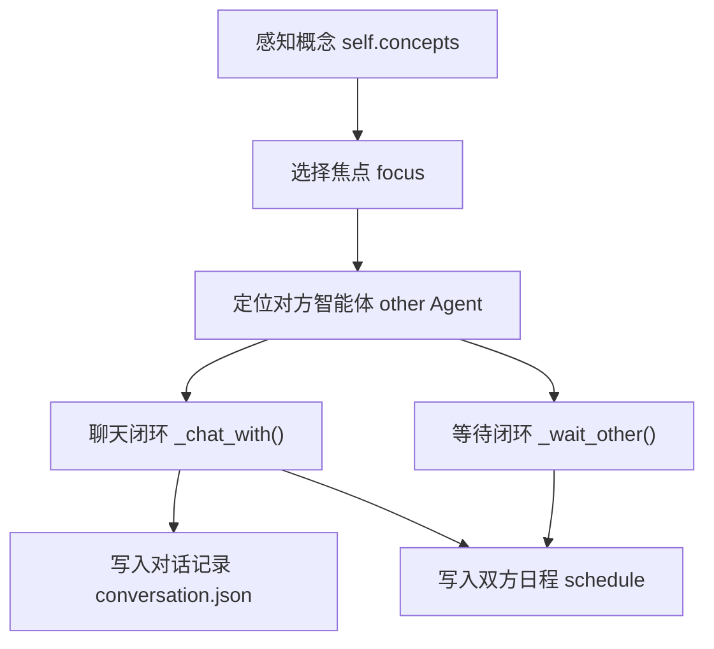
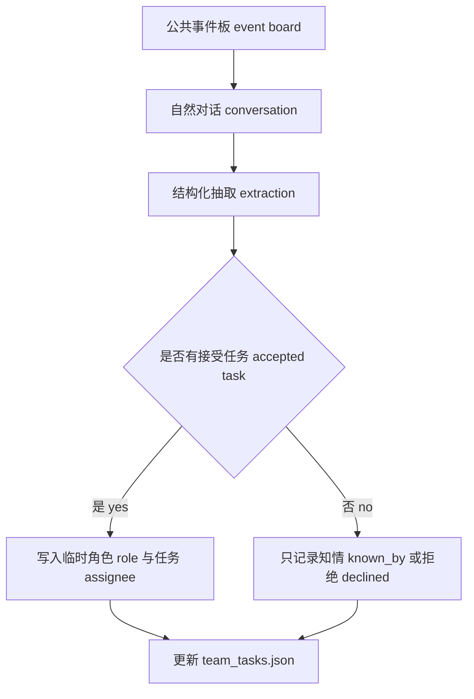

# 第 35 章 多智能体协作升级：从自然偶遇到组织化协作

## 35.1 派对准备卡在“谁负责”

`book-party-extended` 的回放里，伊莎贝拉在霍布斯咖啡馆反复向玛丽亚提到下午五点的情人节派对。对话里能看到邀请、承诺、布置彩带和爱心气球，`simulation.md` 里也会出现“伊莎贝拉请玛丽亚帮忙挂爱心气球布置派对，玛丽亚欣然应允”这样的活动摘要。问题在于，当前项目只能把这件事保存成自然对话 conversation、日程 schedule 和移动回放 movement，不能把它保存成一个团队任务 team task。

这就是多智能体协作升级 multi-agent collaboration 的现场：自然偶遇已经能让消息传播起来，但系统还不知道“谁接了任务、任务做到哪一步、失败卡在哪里、证据从哪段对话来”。

| 场景 | 当前自然偶遇 natural encounter | 组织化协作 organized collaboration |
| --- | --- | --- |
| 派对邀请 | 伊莎贝拉和玛丽亚聊天，摘要写入日程 schedule。 | 事件板 event board 记录玛丽亚接受“布置气球”任务。 |
| 音乐安排 | 埃迪可能在咖啡馆弹钢琴，但没有任务归属。 | 工作组 workgroup 把“确认音乐”分给埃迪，并记录接受或拒绝。 |
| 到场判断 | 通过 `movement.json` 看角色是否到霍布斯咖啡馆。 | 到场 attendance 与任务完成 task completion 一起进入报告 report。 |
| 失败解释 | 只能人工翻 `conversation.json`、`simulation.md` 和断点 checkpoint。 | 失败模式 failure mode 直接绑定证据路径 evidence path。 |

```mermaid
flowchart LR
    A["感知 perception：角色在世界地图 Maze 相遇"] --> B["聊天判断 prompt decide_chat"]
    B --> C["自然对话 conversation"]
    C --> D["个人记忆 personal memory 与日程 schedule"]
    D --> E["社会涌现 social emergence"]
    E -.升级.-> F["公共事件板 event board"]
    F --> G["临时工作组 temporary workgroup"]
    G --> H["任务状态 task status"]
    H --> I["协作报告 collaboration report"]
```



*图 35-1：从自然偶遇 natural encounter 到组织化协作 organized collaboration。当前项目已有感知、对话、记忆和日程写回；协作升级要在这条链后面增加公共状态、角色分工和可审计报告。*


*图 35-2：情人节派对从个人事件升级成协作事件。图中的咖啡馆事件桌把公共事件板 event board、角色分工 role、任务状态 task status、对话轨迹 conversation 和移动路径 movement 放在一起；有角色接受任务，也有角色犹豫或冲突。协作不是全员配合，而是可以被证据追踪的社会过程。*

## 35.2 项目锚点和术语

框架 CAMEL、框架 AutoGen、框架 MetaGPT 和平台 AgentScope 在 GenerativeAgentsCN 中的作用，是把协作能力压回 GenerativeAgentsCN 的可改位置。

| 中文 English | 项目锚点 | 升级读法 |
| --- | --- | --- |
| 智能体 Agent | `generative_agents/modules/agent.py` | 角色行为的执行单元，协作逻辑不能绕开它。 |
| 游戏循环 Game loop | `generative_agents/modules/game.py` | `Game.agent_think()` 每步调用智能体思考，并把状态交回 `start.py` 保存。 |
| 提示词 prompt | `generative_agents/data/prompts/*.txt`、`generative_agents/modules/prompt/scratch.py` | 对话、判断、总结都由提示词 prompt 包装函数提供变量和输出结构 schema。 |
| 对话记录 conversation | `generative_agents/results/checkpoints/<name>/conversation.json` | 当前最强的协作证据来源，记录说话双方、地点和原话。 |
| 断点 checkpoint | `generative_agents/results/checkpoints/<name>/simulate-*.json` | 保存每一步角色状态、行动、日程、记忆摘要和坐标。 |
| 移动回放 movement | `generative_agents/results/compressed/<name>/movement.json` | 检查承诺是否转化为到场、聚集和任务行动。 |
| 时间线 simulation | `generative_agents/results/compressed/<name>/simulation.md` | 给人读的证据索引，适合定位片段，再回查原始 JSON。 |
| 公共事件板 event board | 建议新增到 `results/checkpoints/<name>/storage/shared/<event_id>/event_board.json` | 把协作任务从个人记忆提升为实验可观察对象。 |

## 35.3 当前社交链路如何运行

当前社交互动 social interaction 不是一个抽象概念，而是一段清楚的源码链路。入口在 `generative_agents/modules/agent.py` 的 `Agent._reaction()`。

| 阶段 | 输入 input | 处理 process | 输出 output |
| --- | --- | --- | --- |
| 选择关注对象 focus | `self.concepts`、附近角色 `agents`、忽略词 `ignore_words` | 优先选择关注角色相关的概念 concept；否则随机选择非空闲事件。 | `focus` 与 `other`，供聊天或等待判断使用。 |
| 发起聊天 chat | `other`、关系焦点 `focus`、历史聊天 `associate.retrieve_chats()` | 调用 `_chat_with()`，经过 prompt 判断、生成、终止、总结。 | `conversation.json` 记录原话，双方 `schedule` 写入对话事件。 |
| 等待他人 wait | 当前路径 `self.path`、对方所在地图格子 Tile、`decide_wait` prompt | 判断目标对象是否被占用，以及是否等待。 | `revise_schedule()` 写入等待事件。 |



*图 35-3：当前社交链路 social interaction 的项目路径。自然偶遇不是随机寒暄，它已经有输入、prompt 判断、状态写回和持久化输出，只是输出还停留在个人层面。*

## 35.4 `_chat_with()` 的输入、处理、输出闭环

`Agent._chat_with()` 是组织化协作最重要的基线。组织化协作不能替换它，而要在它生成自然对话之后追加结构化抽取 structural extraction。

| 源码位置 | 输入 input | 处理 process | 输出 output |
| --- | --- | --- | --- |
| `Agent._chat_with(other, focus)` | 两个智能体 Agent、焦点记忆 `focus`、历史聊天 `chats`、双方当前行动 event | 过滤不适合聊天的状态；判断是否聊天；生成关系摘要；多轮生成对话；检查重复和结束；总结对话。 | `self.conversation[key]`、双方 `schedule_chat()`、对话摘要 `chat_summary`。 |
| `Agent.schedule_chat()` | 对话轮次 `chats`、摘要 `chats_summary`、开始时间 `start`、持续时间 `duration`、对方 `other` | 生成谓词为“对话”的 `memory.Event`，调用 `revise_schedule()`。 | 当前日程被聊天占用，角色行动在断点 checkpoint 中可见。 |

### 聊天前置过滤

`_chat_with()` 会先排除五类情况：日程未初始化、任一角色正在睡觉、对方正在移动、任一角色已在对话、两人 60 分钟内刚聊过。这些过滤是组织化协作必须保留的生活感约束。如果绕过它强行安排会议，角色就会像流程机器人 workflow bot，而不是小镇居民。

| 过滤条件 | 检查位置 | 协作升级的含义 |
| --- | --- | --- |
| 日程为空 | `len(self.schedule.daily_schedule) < 1` | 工作组 workgroup 不能在角色尚未初始化时创建任务。 |
| 睡觉或待开始 | `_skip_react()` | 公共事件板 event board 不能让睡觉角色自动接任务。 |
| 对方在移动 | `if other.path` | 分配任务前要确认角色有可对话窗口。 |
| 正在对话 | `event.fit(predicate="对话")` | 协作协议 dialogue protocol 不能插入并发对话。 |
| 60 分钟内刚聊过 | `associate.retrieve_chats()` 与 `get_delta()` | 防止为了推进任务反复骚扰同一个角色。 |

### 聊天判断 prompt：`decide_chat`

`decide_chat` 是自然偶遇是否转化为对话的入口，不是协作任务本身。

| 项目 | 内容 |
| --- | --- |
| 提示词 prompt 文件 | `generative_agents/data/prompts/decide_chat.txt` |
| 包装函数 | `PromptScratch.prompt_decide_chat()` |
| 变量 variables | `context`、`date`、`chat_history`、`agent_status`、`another_status`、`agent`、`another` |
| 输出结构 schema | `decide_chatResponse.res: bool`，含义是是否主动发起对话。 |
| 失败保护 failsafe | `False`，模型失败时不发起聊天。 |
| 流向 flow | `False` 直接退出 `_chat_with()`；`True` 进入关系摘要和对话生成。 |

真实模板骨架如下，变量由 `scratch.py` 填入：

```text
背景：
"""
${context}

现在是 ${date}。${chat_history}

${agent_status}
${another_status}
"""

根据上述背景判断，${agent} 是否有可能主动与 ${another} 对话？只用“是”或“否”回答：
```

### 关系摘要和对话生成 prompt

判断要聊天之后，源码会先为双方各生成一次关系摘要，再交替调用对话生成 prompt。

| 提示词 prompt | 文件路径 | 输入 input | 输出结构 schema | 输出流向 |
| --- | --- | --- | --- | --- |
| 关系摘要 summarize_relation | `generative_agents/data/prompts/summarize_relation.txt` | `associate.retrieve_focus([other_name], 50)` 取出的相关记忆、`agent`、`another` | `summarize_relationResponse.res: str` | 作为 `generate_chat` 的关系背景 `relation`。 |
| 对话生成 generate_chat | `generative_agents/data/prompts/generate_chat.txt` | 基础描述 `base_desc`、记忆 `memory`、地址 `address`、时间 `current_time`、历史对话 `conversation` | `generate_chat.res: str`，1 到 3 句话 | 追加到 `chats`，后续进入重复检查和终止判断。 |

`generate_chat.txt` 的核心约束是：不要重复对话记录，符合角色性格和当前情境，直接输出当前角色要说的话。协作升级要复用这个自然语言层，而不是把角色台词改成 JSON。

### 重复、终止和总结 prompt

对话过程中还有三类 prompt 保证输出可收束。

| 提示词 prompt | 文件路径 | 变量 variables | 输出结构 schema | 下游影响 |
| --- | --- | --- | --- | --- |
| 重复检查 generate_chat_check_repeat | `generative_agents/data/prompts/generate_chat_check_repeat.txt` | `conversation`、`content`、`agent` | `generate_chat_check_repeatResponse.res: bool` | 为 `True` 时停止继续生成，避免复读。 |
| 终止判断 decide_chat_terminate | `generative_agents/data/prompts/decide_chat_terminate.txt` | `conversation`、`agent`、`another` | `decide_chat_terminateResponse.res: bool` | 为 `True` 时结束多轮对话。 |
| 对话总结 summarize_chats | `generative_agents/data/prompts/summarize_chats.txt` | `conversation` | `summarize_chatsResponse.res: str` | 进入 `schedule_chat()` 的 `describe` 字段。 |

`conversation.json` 的结构已经足够做协作证据抽取。例如 `book-party-extended` 中有这样的证据形态：

```json
{
  "20240214-10:00": [
    {
      "伊莎贝拉 -> 玛丽亚 @ the Ville，霍布斯咖啡馆，咖啡馆，咖啡馆柜台后面": [
        ["伊莎贝拉", "玛丽亚，今天的三明治看起来很美味呢！下午五点的情人节派对你一定要来哦，我已经准备好了一些特别的安排。"],
        ["玛丽亚", "哇，情人节派对？听起来太棒了！我五点刚好有休息时间，肯定会去参加的！"]
      ]
    }
  ]
}
```

这段输出已经有时间、地点、说话者、听话者和原话。缺少的是把“肯定会去参加”抽取成结构化承诺 commitment，并把它绑定到事件板 event board。

## 35.5 当前机制的能力边界

自然偶遇 natural encounter 的优势是可信生活流，局限是协作状态不可见。

| 当前能力 | 项目证据 | 适合做什么 | 不足在哪里 |
| --- | --- | --- | --- |
| 自然传播 information diffusion | `conversation.json`、`simulation.md` | 派对消息、竞选观点、关系信息的扩散。 | 不知道传播是否对应任务承诺。 |
| 个人日程 schedule | 断点 checkpoint 中的 `schedule` 和 `action` | 检查角色当前在做什么。 | 缺少“团队任务”的统一进度视图。 |
| 移动回放 movement | `movement.json` 的 `all_movement` | 验证角色是否到达地点。 | 到场不等于完成任务，需要任务语义。 |
| 关系与记忆 memory | `storage/<agent>/associate/` | 让后续对话带历史背景。 | 共享事件状态不能只存在于某个角色记忆里。 |
| 人工报告 simulation | `simulation.md` | 快速阅读一天发生了什么。 | 报告是结果汇编，不是协作状态机。 |

协作升级要补的不是“更会聊天”，而是让对话后的结构化事实进入可验证数据结构。

## 35.6 前沿框架给项目的接口

| 前沿思想 | 不直接照搬的原因 | 落回 GenerativeAgentsCN 的接口 |
| --- | --- | --- |
| 框架 CAMEL 角色扮演式沟通智能体 role-playing communicative agents | 框架 CAMEL 更像任务型双智能体协作，本项目还要保留小镇生活。 | 在事件 event 内增加临时协作角色 role，例如 `organizer`、`helper`、`messenger`。 |
| 框架 AutoGen 多智能体对话框架 multi-agent conversation framework | 框架 AutoGen 强调可配置代理对话，本项目已有生活化对话链。 | 在自然对话后抽取 `dialogue_act`，不直接让台词变成命令。 |
| 框架 MetaGPT 标准作业流程 SOP | 框架 MetaGPT 面向软件开发流程，小镇任务不能被 SOP 写死。 | 为派对、竞选、讨论会定义轻量 SOP，允许拒绝、遗忘、冲突和偏离。 |
| 平台 AgentScope 多智能体平台 multi-agent platform | 平台 AgentScope 面向更通用的平台扩展，本项目优先保持小规模可复查。 | 增加配置、状态观测、日志、指标 metrics 和报告 report，而不是先扩到大量角色。 |

## 35.7 升级一：公共事件板 event board

公共事件板 event board 把“伊莎贝拉想办派对”从个人状态提升为实验对象。它不代表所有角色都知道派对，只代表实验环境有一个可追踪的协作对象。

建议保存位置：

```text
generative_agents/results/checkpoints/<实验名>/storage/shared/<event_id>/event_board.json
```

建议结构：

```json
{
  "event_id": "valentine_party",
  "owner": "伊莎贝拉",
  "title": "情人节派对",
  "time": "2024-02-14 17:00",
  "location": "the Ville，霍布斯咖啡馆，咖啡馆",
  "status": "active",
  "known_by": ["伊莎贝拉"],
  "tasks": [
    {
      "task_id": "decorate_cafe",
      "name": "布置咖啡馆",
      "assignee": "玛丽亚",
      "status": "accepted",
      "evidence": ["conversation:20240214-10:00:伊莎贝拉->玛丽亚"]
    }
  ]
}
```

| 闭环 | 内容 |
| --- | --- |
| 输入 input | 事件设定、角色当前状态、自然对话 conversation、断点 checkpoint 中的行动和日程。 |
| 处理 process | 读取对话，抽取承诺 commitment、任务 task、负责人 assignee、状态 status；只更新符合输出结构 schema 的字段。 |
| 输出 output | `event_board.json`、`team_tasks.json`、`simulation.md` 中的事件板摘要。 |
| 证据路径 evidence path | `conversation.json` 证明谁说了什么；`movement.json` 证明是否到场；断点 checkpoint 证明日程和动作。 |
| 失败模式 failure mode | 模型把闲聊误判成承诺；任务被写入但没有证据；所有角色无条件接受。 |
| 验证方式 verification | 随机抽取任务，回查原话、日程、移动轨迹和报告摘要是否一致。 |

## 35.8 升级二：临时工作组 temporary workgroup

临时工作组 temporary workgroup 不改变角色永久人设 persona。伊莎贝拉仍是咖啡馆老板，玛丽亚仍是学生，埃迪仍是音乐学生；只是在 `valentine_party` 这个事件里临时承担协作角色。

| 临时角色 role | 触发来源 | 能做的事 | 不能自动获得的能力 |
| --- | --- | --- | --- |
| 组织者 organizer | 事件 owner 或初始配置 | 创建任务、邀请他人、总结进度。 | 不能强迫别人接受任务。 |
| 助手 helper | 对话中接受具体任务 | 更新自己的任务进度。 | 不能读取全部私密记忆。 |
| 传播者 messenger | 接受邀请别人或扩散消息 | 在自然对话中提到事件事实。 | 不能把未听说过的人标记为知情。 |
| 参与者 participant | 承诺到场或实际到场 | 被计入到场 attendance。 | 到场不等于完成组织任务。 |
| 观察者 observer | 被动听到或在场 | 可作为弱证据。 | 不能被算作任务负责人。 |



*图 35-4：临时工作组 temporary workgroup 的生成逻辑。角色分工来自事件设定和对话证据，而不是在仿真开始时把所有人硬塞进团队。*

## 35.9 升级三：协作对话协议 dialogue act

协作对话协议 dialogue act 应该发生在自然对话之后。角色仍然说自然语言，系统再抽取结构化动作。

建议新增提示词 prompt 文件：

```text
generative_agents/data/prompts/team_assign_role.txt
generative_agents/data/prompts/team_update_task.txt
generative_agents/data/prompts/team_report_progress.txt
generative_agents/data/prompts/team_resolve_conflict.txt
generative_agents/data/prompts/team_summarize_progress.txt
```

建议在 `generative_agents/modules/prompt/scratch.py` 中增加对应包装函数，例如 `prompt_team_update_task()`。

| 提示词 prompt | 输入变量 variables | 输出结构 schema | 输出流向 |
| --- | --- | --- | --- |
| `team_assign_role` | `event_board`、`conversation`、`agent`、`another`、`current_roles` | `event_id`、`role`、`assignee`、`confidence`、`evidence` | 更新 `workgroup.roles`。 |
| `team_update_task` | `tasks`、`conversation`、`movement_window`、`time` | `task_id`、`status`、`assignee`、`evidence`、`reason` | 更新 `team_tasks.json`。 |
| `team_report_progress` | `event_board`、`team_tasks`、`recent_actions` | `summary`、`done`、`blocked`、`next_actions` | 写入 `simulation.md` 和报告 report。 |
| `team_resolve_conflict` | `conflict_type`、`claims`、`evidence_paths` | `resolution`、`changed_tasks`、`unresolved_reason` | 保留冲突或改派任务。 |

`team_update_task.txt` 的模板可以保持短而严格：

```text
事件板 event board：
${event_board}

任务列表 team tasks：
${tasks}

自然对话 conversation：
${conversation}

请判断这段对话是否改变了任务状态。只输出 JSON：
{
  "event_id": "...",
  "dialogue_act": "accept_task | decline_task | report_progress | request_help | confirm_completion | no_change",
  "task_id": "...",
  "assignee": "...",
  "status": "todo | accepted | active | blocked | done | declined",
  "evidence": ["..."],
  "reason": "..."
}
```

关键约束是：提示词 prompt 输出不能直接覆盖公共状态。它必须先通过字段校验，再由确定性代码写入事件板 event board。

## 35.10 升级四：共享记忆 shared memory

共享记忆 shared memory 不是让所有角色共享大脑。它是事件级存储，用来保存公共事实、任务状态和证据路径。

建议目录：

```text
generative_agents/results/checkpoints/<实验名>/storage/shared/<event_id>/
  event_board.json
  team_tasks.json
  progress_log.jsonl
  conflicts.jsonl
```

| 文件 | 数据结构 | 读取者 | 写入者 | 验证方式 |
| --- | --- | --- | --- | --- |
| `event_board.json` | 事件基本事实、状态、知情角色、参与者。 | 组织者 organizer、报告脚本。 | 事件初始化和校验后的更新器。 | 与 `simulation.md` 的事件描述一致。 |
| `team_tasks.json` | 任务、负责人、状态、证据、更新时间。 | 任务相关角色、指标脚本。 | `team_update_task` 的校验后结果。 | 每条任务都有 `conversation` 或 `movement` 证据。 |
| `progress_log.jsonl` | 每次状态变化的追加日志。 | 审计工具、报告脚本。 | 状态更新器。 | 时间顺序和断点 checkpoint 对齐。 |
| `conflicts.jsonl` | 拒绝、冲突、记忆不一致。 | 人工复查、冲突提示词 prompt。 | 冲突检测器。 | 冲突不能被静默改写成成功。 |

访问规则 access control 要比共享目录更重要：

| 访问身份 | 可读内容 | 可写内容 |
| --- | --- | --- |
| `owner` | 事件事实、全部任务、进度日志、冲突记录。 | 新建任务、确认完成、关闭事件。 |
| `assignee` | 自己任务、公共事件事实、相关证据。 | 自己任务的进度、阻塞原因。 |
| `participant` | 时间、地点、活动说明、自己的承诺。 | 到场确认或反馈。 |
| `observer` | 只能通过对话和回放间接获得事实。 | 无直接写权限。 |

## 35.11 升级五：协作冲突处理 conflict resolution

组织化协作 organized collaboration 必须允许失败。派对实验里，山姆可能知道派对但因为与詹妮弗有晚餐约定而不能参加；玛丽亚可能答应布置但被学习任务拖住；埃迪可能在钢琴旁准备音乐但没有明确接收任务。这些都不是系统错误，而是协作事实。

| 冲突类型 conflict type | 表现 | 检查位置 | 修正方向 |
| --- | --- | --- | --- |
| 时间冲突 time conflict | 角色接受任务但同一时段已有强日程。 | 断点 checkpoint 的 `schedule`、`action`。 | 改派任务或降低完成预期。 |
| 兴趣冲突 interest conflict | 角色愿意参加但不愿负责。 | `conversation.json` 原话。 | 写入 `declined`，不要算作接受。 |
| 信念冲突 belief conflict | 角色对事件目的有不同看法。 | 对话、记忆和反思记录。 | 保留争议，并进入报告 report。 |
| 资源冲突 resource conflict | 地点、对象或工具被占用。 | `movement.json`、地图地址 address、对象状态。 | 调整地点或等待 wait。 |
| 关系冲突 relationship conflict | 关系弱或敌对导致拒绝合作。 | `associate` 关系记忆、历史聊天。 | 让传播路径绕开该角色。 |

`team_resolve_conflict` 提示词 prompt 的输出结构 schema 应保持可审计：

```json
{
  "event_id": "valentine_party",
  "conflict_type": "time_conflict",
  "agents": ["山姆", "伊莎贝拉"],
  "resolution": "keep_declined",
  "changed_tasks": [],
  "unresolved_reason": "山姆明确表示五点要和詹妮弗共度晚餐",
  "evidence": ["conversation:20240214-10:00:山姆->伊莎贝拉"]
}
```

## 35.12 升级六：协作可视化 collaboration visualization

有了公共事件板 event board 和共享任务 team tasks，`simulation.md` 需要多一段协作摘要，`movement.json` 需要继续承担到场证据，报告 report 需要把二者合并。

建议在 `simulation.md` 中增加可渲染区块：

```markdown
## 协作事件 event board：valentine_party

| 任务 task | 负责人 assignee | 状态 status | 证据 evidence |
| --- | --- | --- | --- |
| 布置咖啡馆 | 玛丽亚 | accepted | conversation:20240214-10:00 |
| 确认音乐 | 埃迪 | todo | movement:钢琴区域 |
| 邀请顾客 | 伊莎贝拉 | active | conversation:多段邀请 |
```

| 输出位置 | 可判断内容 | 回查路径 |
| --- | --- | --- |
| `simulation.md` 的协作事件区块 | 谁负责、进度如何、哪里失败。 | 表格中的 `evidence` 字段。 |
| `team_tasks.json` | 机器可统计的任务状态。 | `status`、`assignee`、`updated_at`、`evidence`。 |
| `movement.json` | 负责人是否到达任务地点。 | 时间窗口、地点关键字、角色坐标。 |
| `report.md` 或指标 metrics | 多次运行中协作是否稳定。 | 指标值、失败样例、原始文件路径。 |

图 35-2 是协作升级的视觉审计：左侧角色头像对应真实小镇居民，中央事件板固定事件事实，右侧任务卡拆开任务状态，底部链路把自然对话先转成结构化抽取结果，再进入报告。

## 35.13 最小可行升级实验

第一轮实验不需要改成完整团队平台。保留当前小镇循环，只增加事件板、任务抽取和报告输出。

| 实验项 | 配置 |
| --- | --- |
| 实验名 | `book-team-party-01` |
| 事件 event | `valentine_party`，时间 `2024-02-14 17:00`，地点“霍布斯咖啡馆”。 |
| 角色 agents | 伊莎贝拉、玛丽亚、埃迪、克劳斯、亚当。 |
| 新增文件 | `event_board.json`、`team_tasks.json`、`progress_log.jsonl`。 |
| 观察对象 | 对话承诺、任务接受、任务完成、到场、冲突和遗忘。 |

可复用当前运行入口：

```bash
cd generative_agents
python start.py --name book-team-party-01 --start 20240214-08:00 --step 72 --stride 10 --agents "伊莎贝拉,玛丽亚,埃迪,克劳斯,亚当" --verbose info --log book-team-party-01.log
python compress.py --name book-team-party-01
```

这条命令的输入 input 是固定角色、开始时间和步长；处理 process 是 `start.py` 每步调用 `Game.agent_think()`，再由 `compress.py` 生成报告和回放；输出 output 是 `results/checkpoints/book-team-party-01/` 与 `results/compressed/book-team-party-01/`。协作升级脚本应只在这些输出旁边追加事件板和任务报告，不覆盖原始证据。

## 35.14 协作指标 metrics

指标要绑定文件，不能只给抽象名字。

| 指标 metric | 字段 | 证据来源 | 解决的问题 |
| --- | --- | --- | --- |
| 团队任务完成率 team_task_completion_rate | `tasks.status` | `team_tasks.json`、`simulation.md` | 团队是否真正推进任务。 |
| 角色分工清晰度 role_assignment_clarity | `assignee`、`role` | `event_board.json`、`conversation.json` | 是否知道谁负责什么。 |
| 共享状态一致率 shared_state_consistency | `status` 与证据是否匹配 | `team_tasks.json`、`conversation.json`、`movement.json` | 公共状态是否被模型胡乱改写。 |
| 协作对话效率 coordination_dialogue_efficiency | 有效 `dialogue_act` 数量 | `conversation.json`、抽取结果 | 对话是否推进任务，而不是空泛寒暄。 |
| 冲突记录数 conflict_resolution_count | `conflicts.jsonl` | 冲突提示词 prompt 输出、原始证据 | 系统是否允许拒绝和分歧。 |
| 多智能体归因可追踪性 multi_agent_credit_traceability | `evidence` 完整率 | 所有报告和 JSON | 成功结果能否追到角色贡献。 |

**公式 35-1：团队任务完成率 team_task_completion_rate**

$$
\text{团队任务完成率} =
\frac{\text{状态为 done 的任务数}}{\text{事件板 event board 中的任务总数}}
$$

读法：如果情人节派对事件板有 4 个任务，其中 2 个任务状态为 `done`，则团队任务完成率为 \(2/4 = 0.50\)。这个数只能说明任务状态，不说明对话自然性。

**公式 35-2：共享状态一致率 shared_state_consistency**

$$
\text{共享状态一致率} =
\frac{\text{有原始证据支持的状态更新数}}{\text{全部状态更新数}}
$$

读法：如果 `team_tasks.json` 里有 10 次状态更新，8 次能回查到 `conversation.json` 或 `movement.json`，共享状态一致率为 \(8/10 = 0.80\)。低一致率说明事件板可能被提示词 prompt 幻觉污染。

## 35.15 风险与边界

| 风险 | 表现 | 检查位置 | 控制方式 |
| --- | --- | --- | --- |
| 生活感被破坏 | 所有角色都像项目经理一样接任务。 | `simulation.md` 的活动记录、对话风格。 | 协作只在明确事件 event 中启用，日常生活仍走自然机制。 |
| 上帝视角泄漏 | 角色知道自己没听说过的任务。 | `known_by`、对话传播链、记忆检索。 | 事件板是实验状态，不等于角色知识。 |
| 过度合作 over-cooperation | 拒绝和冲突消失。 | `conflicts.jsonl`、原始对话。 | 把拒绝、遗忘、误解作为有效输出。 |
| 状态幻觉 state hallucination | `team_tasks.json` 标记完成，但没有行动证据。 | `movement.json`、断点 checkpoint。 | 每次状态更新必须带 `evidence`。 |
| 指标偏任务化 | 任务完成率高，但角色行为不可信。 | 对话自然性、日程冲突、人物设定 persona。 | 指标报告同时列自然性和失败样例。 |

## 35.16 本章小结

多智能体协作升级 multi-agent collaboration 的核心不是把小镇居民改造成任务机器人，而是在自然社交链路之后增加可审计的协作层。当前项目已经有 `_reaction()`、`_chat_with()`、prompt 链、`conversation.json`、断点 checkpoint、`simulation.md` 和 `movement.json`；缺少的是公共事件板 event board、临时工作组 temporary workgroup、协作对话协议 dialogue act、共享记忆 shared memory 和协作指标 metrics。

协作升级遵守一个原则：自然对话先发生，结构化状态后抽取。这样既保留 Generative Agents 的生活流，又能让“谁负责、谁拒绝、谁遗忘、谁真的到场”进入可复查的工程证据链。

下一章继续讨论社会仿真 social simulation。协作升级回答的是一个事件内部如何组织；社会仿真升级要回答同类事件在多次运行中是否稳定、能否统计、如何比较，以及哪些结论不能外推到现实社会。

## 参考资料

- 框架 CAMEL: https://arxiv.org/abs/2303.17760
- 框架 AutoGen: https://arxiv.org/abs/2308.08155
- 框架 MetaGPT: https://arxiv.org/abs/2308.00352
- 平台 AgentScope: https://arxiv.org/abs/2402.14034
- 生成式智能体 Generative Agents: https://arxiv.org/abs/2304.03442
- Local source: `generative_agents/modules/agent.py`
- Local source: `generative_agents/modules/game.py`
- Local source: `generative_agents/modules/prompt/scratch.py`
- Local prompts: `generative_agents/data/prompts/decide_chat.txt`
- Local prompts: `generative_agents/data/prompts/generate_chat.txt`
- Local prompts: `generative_agents/data/prompts/summarize_chats.txt`
- Local evidence figure scaffold: `docs/book/scaffolds/part_04_05/ch24_38_evidence_figures.py`
