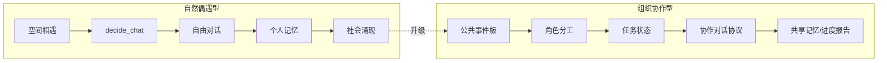
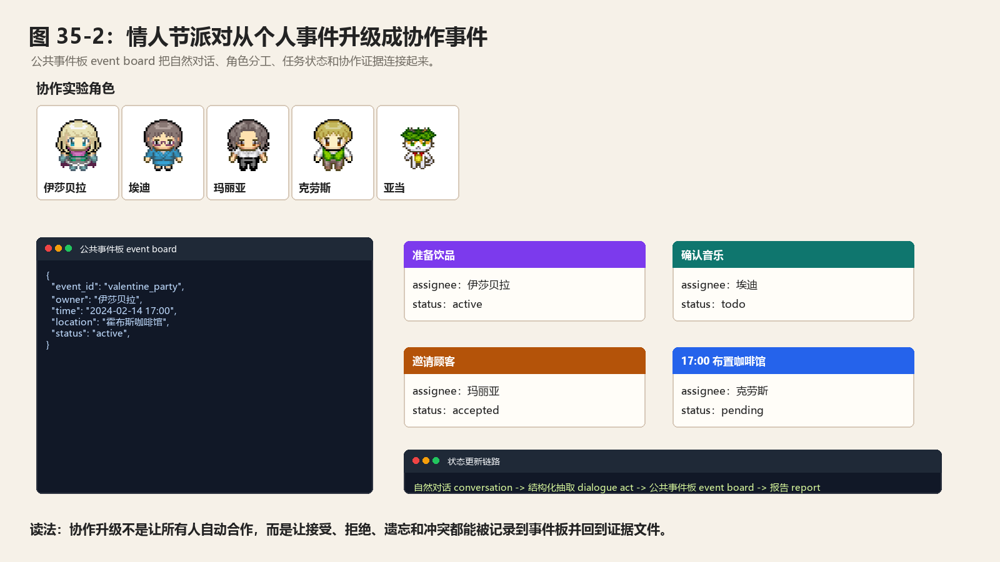
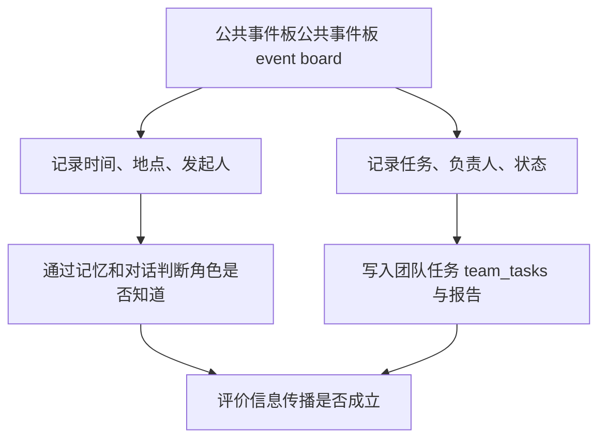
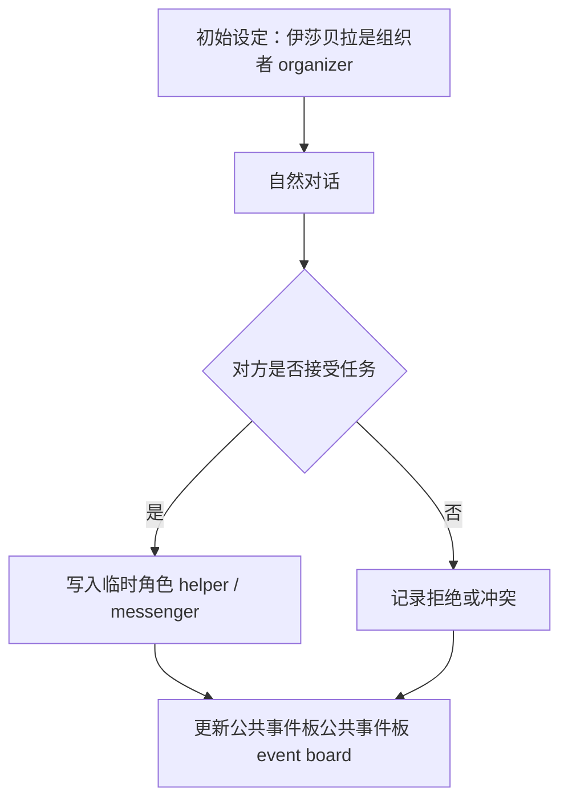
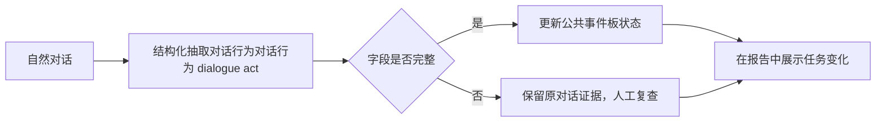
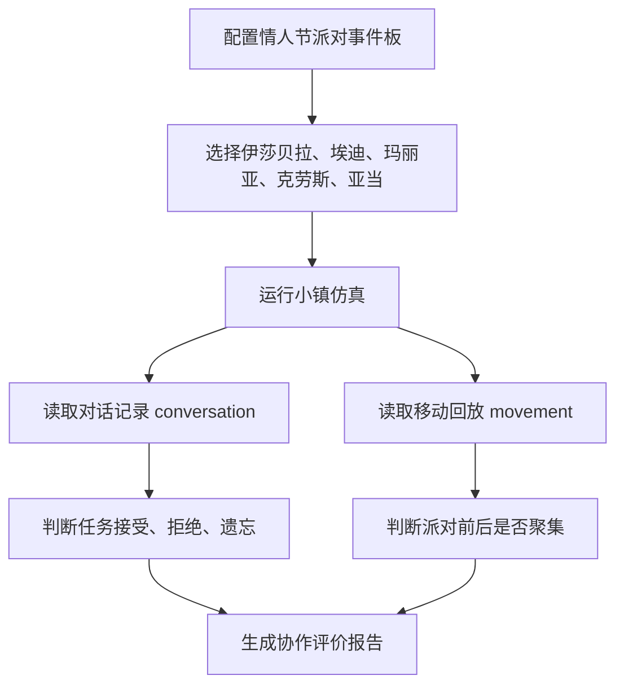

# 第 35 章 多智能体协作升级：从自然偶遇到组织化协作

## 35.1 核心问题

生成式智能体 Generative Agents 已经是多智能体系统。小镇里有多个角色。他们能感知彼此、聊天、等待、形成记忆，并通过对话传播信息。但这类多智能体互动主要是：

```text
自然偶遇型互动
```

也就是下面这个过程：

```text
角色在地图中相遇
  -> 判断是否聊天
  -> 生成对话
  -> 写入记忆
  -> 影响后续计划
```

这种机制很适合复现论文中的社会涌现。例如派对传播、竞选信息扩散、关系形成。但它不擅长组织化协作。例如：

```text
多人分工筹备派对。
多人协作竞选宣传。
多人共同组织社区讨论会。
```

这些任务需要共享目标、角色分工、任务状态和协作协议。本章聚焦六个问题：

1. 当前项目的多智能体互动如何工作？
2. 自然偶遇型多智能体有什么优势和局限？
3. CAMEL、AutoGen、MetaGPT、AgentScope 给我们什么启发？
4. 如何在生成式智能体 Generative Agents 中引入公共事件板和临时工作组？
5. 如何设计共享记忆和协作对话协议？
6. 如何评价组织化协作是否有效？



*图 35-1：自然社交型多智能体与组织协作型多智能体对比。自然偶遇适合社会涌现，组织协作则需要共享目标、状态和协议。*



*图 35-2：情人节派对从个人事件升级成协作事件。图片用真实角色头像 portrait 与公共事件板公共事件板 event board 结构展示组织者 organizer、助手 helper、传播者 messenger、参与者 participant 和任务状态任务状态 task status 如何进入协作证据。*

## 35.2 当前项目的社交链路

当前项目的社交逻辑集中在：

```text
generative_agents/modules/agent.py
```

核心函数主要包括，需要逐项查看：

| 函数 | 中文意思 | 当前能力 |
| --- | --- | --- |
| `_reaction()` | 现场反应入口。 | 角色看到附近事件或他人后，决定是否要产生反应。 |
| `_chat_with()` | 发起或参与聊天。 | 判断是否聊天，生成多轮对话，并写回对话结果。 |
| `_wait_other()` | 等待他人。 | 当目标地点或对象被占用时，让角色选择等待而不是穿插执行。 |
| `schedule_chat()` | 把聊天写入日程。 | 让聊天占用时间，并改变当前行动记录。 |

对话提示词 prompt 和辅助判断在：

```text
generative_agents/modules/prompt/scratch.py
generative_agents/data/prompts/
```

这里主要涉及下面这些提示词 prompt：

| 提示词 prompt | 中文意思 | 当前能力 |
| --- | --- | --- |
| `decide_chat` | 判断是否聊天。 | 让角色根据关系、地点和当前计划决定是否开口。 |
| `generate_chat` | 生成对话内容。 | 让双方围绕当前情境和记忆进行多轮交流。 |
| `generate_chat_check_repeat` | 检查对话重复。 | 避免角色不断重复同一句话或同一个意思。 |
| `decide_chat_terminate` | 判断是否结束。 | 让对话在自然时机收束。 |
| `summarize_chats` | 总结对话。 | 把多轮聊天压缩成可写入记忆的摘要。 |
| `summarize_relation` | 总结关系。 | 聊天前提取两人的关系背景，避免对话像陌生人随机寒暄。 |

整体流程可以这样概括：

```text
感知附近事件
  -> 选择关注对象
  -> 判断是否聊天
  -> 检索关系和记忆
  -> 多轮生成对话
  -> 判断重复和结束
  -> 总结对话
  -> 写入双方日程和记忆
```

这条链已经足以支撑自然社交。

## 35.3 `_chat_with()` 做了什么

`Agent._chat_with()` 首先排除不适合聊天的情况。例如：

- 日程未初始化。
- 任一角色正在睡觉。
- 对方正在移动。
- 任一角色已经在对话。
- 两人刚聊过，间隔小于 60 分钟。

然后调用下面函数，需要结合源码查看：

```text
decide_chat
```

判断是否要聊天。如果决定聊天，会先生成双方关系摘要：

```python
summarize_relation
```

然后交替生成下面对话：

```python
generate_chat
```

中途需要检查下面条件：

```text
generate_chat_check_repeat
decide_chat_terminate
```

最后需要总结对话，可以这样处理：

```text
summarize_chats
```

并调用下面函数，需要结合源码查看：

```text
schedule_chat()
```

把对话作为行动写入双方日程。这套机制很完整。但它仍然是两两对话。没有团队目标。没有共享任务板。没有组织流程。

## 35.4 自然偶遇型多智能体的优势

自然偶遇型多智能体有三个优势。第一，涌现感强。角色不是被中央调度强行安排对话，而是在地图中自然相遇。第二，贴近论文思想。生成式智能体 Generative Agents 关注的就是局部互动如何导致社会级联。第三，适合可信生活仿真。普通居民的一天确实不是一直围绕任务协作。很多信息就是通过偶遇、闲聊、关系和记忆传播。因此当前机制不应该被替换掉。它是小镇的生命力。组织化协作应该是在此基础上的扩展，而不是重写。

## 35.5 当前机制的局限

自然偶遇型机制也有明显局限。第一，协作效率低。如果伊莎贝拉需要找埃迪帮忙布置派对，她可能一直遇不到他。第二，缺少共享状态。每个人只知道自己的记忆。活动任务没有公共状态。第三，分工不稳定。即使有人说“我来帮忙”，系统也没有明确把任务分配给他。第四，冲突难以协商。如果两个人对任务理解不同，缺少团队层面的解决机制。第五，协作结果难以评价。因为任务没有结构化状态，很难判断：

```text
谁负责了什么？
做到了哪一步？
为什么失败？
```

这些局限正是多智能体框架研究可以补足的地方。

## 35.6 CAMEL 的启发

CAMEL 关注角色扮演式沟通智能体角色扮演式沟通智能体 role-playing communicative agents。它的启发是：

```text
多智能体对话不只是闲聊，也可以通过角色设定推动任务协作。
```

在生成式智能体 Generative Agents 中，角色本来就有 persona。但这些 persona 主要服务生活和社交。如果要做协作任务，可以进一步引入临时协作角色。例如派对筹备：

```text
organizer：伊莎贝拉
music_helper：埃迪
guest_messenger：玛丽亚
venue_helper：亚当
```

这些不是永久身份。它们是某个事件下的临时角色。这样既保留原 persona，又能组织任务。

## 35.7 AutoGen 的启发

AutoGen 强调多智能体对话框架多智能体对话框架 multi-agent conversation framework。它的重点不是让角色自然生活，而是让多个可配置智能体 agent 通过对话完成任务。对本项目的启发是：

```text
协作任务需要对话协议。
```

可以看一个具体例子：

- 谁提出任务？
- 谁接受任务？
- 谁报告进度？
- 谁确认完成？
- 谁处理冲突？

当前 `_chat_with()` 是自由对话。协作升级可以增加一些结构化对话类型：

```text
assign_task
accept_task
decline_task
report_progress
request_help
resolve_conflict
confirm_completion
```

这些类型不需要替代自然语言。它们可以作为对话后的结构化摘要。例如：

```json
{
  "speech": "如果你愿意的话，可以帮我确认一下音乐安排吗？",
  "dialogue_act": "assign_task",
  "task": "确认派对音乐安排",
  "assignee": "埃迪"
}
```

这样对话既自然，又能进入任务系统。

## 35.8 MetaGPT 的启发

MetaGPT 的核心启发是：

```text
复杂协作需要 SOP 和角色分工。
```

它主要面向软件开发任务。但小镇任务也可以有轻量 SOP。例如情人节派对 SOP：

1. 明确时间地点。
2. 准备食物和饮品。
3. 邀请顾客和朋友。
4. 确认音乐或活动内容。
5. 派对前回到咖啡馆。
6. 活动后总结反馈。

镇长竞选 SOP 可以这样设计：

1. 明确竞选主题。
2. 找支持者讨论。
3. 向中立居民介绍。
4. 回应反对意见。
5. 记录居民关心的问题。
6. 调整宣传重点。

SOP 不应把故事写死。它只是提供协作骨架。角色仍然可以失败、拒绝、变更计划。

## 35.9 AgentScope 的启发

AgentScope 强调多智能体平台的灵活性、鲁棒性和可扩展性。对生成式智能体 Generative Agents 来说，它的启发主要是工程层面。如果要支持组织化协作，需要：

- 可配置实验。
- 可观察协作状态。
- 可复盘任务流。
- 可扩展智能体 agent 数量。
- 清晰日志和指标。

协作不是只改提示词 prompt。还要改数据结构和观测工具。否则读者只能看到对话，看不到协作是否真的发生。

## 35.10 升级方向一：公共事件板

第一项可落地升级是公共事件板。示例：

```json
{
  "event_id": "valentine_party",
  "owner": "伊莎贝拉",
  "title": "情人节派对",
  "time": "2024-02-14 17:00",
  "location": "霍布斯咖啡馆",
  "status": "active",
  "participants": [],
  "tasks": [
    {
      "name": "准备饮品",
      "assignee": "伊莎贝拉",
      "status": "active"
    },
    {
      "name": "确认音乐安排",
      "assignee": "埃迪",
      "status": "todo"
    }
  ]
}
```

公共事件板解决两个问题。第一，活动不再只存在于某个人的记忆中。第二，协作状态可以被记录和评价。注意，公共事件板不是让所有角色自动知道所有信息。角色是否知道某个事件，仍然要通过记忆和传播判断。公共事件板更多是实验环境和协作任务的结构化表示。

协作状态逻辑图：



## 35.11 升级方向二：临时工作组

有了公共事件后，可以为事件创建临时工作组。角色类型示例：

```text
organizer
helper
messenger
critic
participant
observer
```

以派对传播实验为例：

```text
伊莎贝拉：organizer
埃迪：helper
玛丽亚：messenger
亚当：participant
汤姆：observer 或 critic
```

角色分工应来自对话或设定。不要一开始直接给所有人分工。例如伊莎贝拉和埃迪对话后，埃迪才成为 helper。这样协作仍然从社会互动中生长出来。

工作组生成逻辑图：



## 35.12 升级方向三：共享记忆

当前记忆主要是个人记忆。组织化协作需要共享记忆。可以为事件增加共享存储：

```text
generative_agents/results/checkpoints/<实验名>/storage/shared/<event_id>/
```

共享记忆可以这样保存：

- 活动目标。
- 任务列表。
- 参与者确认。
- 进度更新。
- 冲突记录。
- 结果总结。

但共享记忆也有边界。不是每个角色都能读全部共享记忆。可以设置访问规则：

```text
owner 可读写全部。
assignee 可读写自己的任务。
participant 可读事件基本信息。
observer 只能通过对话获知。
```

这能避免角色获得不该知道的信息。

## 35.13 升级方向四：协作对话协议

协作对话协议可以通过提示词 prompt 实现。建议新增：

```text
team_assign_role.txt
team_update_task.txt
team_report_progress.txt
team_resolve_conflict.txt
team_summarize_progress.txt
```

对话后可以抽取结构化结果：

```json
{
  "event_id": "valentine_party",
  "dialogue_act": "accept_task",
  "task": "确认音乐安排",
  "assignee": "埃迪",
  "status": "accepted",
  "evidence": ["conversation_20240214_1030"]
}
```

这条结构化结果可以更新公共事件板。不要让模型直接随意改公共状态。最好通过：

```text
自然对话 -> 结构化抽取 -> 状态更新
```

这种链路比直接改提示词 prompt 更可控。

协作协议逻辑图：



## 35.14 升级方向五：协作冲突处理

协作系统必须允许冲突。例如：

- 埃迪没有时间帮忙。
- 玛丽亚愿意邀请人，但不想负责布置。
- 山姆希望宣传竞选，汤姆公开反对。
- 两个角色对活动时间记忆不同。

可以设计下面冲突类型：

```text
time_conflict
interest_conflict
belief_conflict
resource_conflict
relationship_conflict
```

冲突处理提示词 prompt 可以问：

```text
冲突是什么？
涉及哪些角色？
各自立场是什么？
是否需要修改任务、换人或放弃？
```

组织化协作不等于所有人合作。它意味着系统能记录和处理协作中的分歧。

## 35.15 升级方向六：协作可视化

如果有公共事件板和共享任务，就应该在回放或报告中展示。可以在 `simulation.md` 中增加一节：

```markdown
## 事件板：情人节派对

- owner：伊莎贝拉
- time：2024-02-14 17:00
- location：霍布斯咖啡馆
- participants：玛丽亚、克劳斯

### Tasks

- 准备饮品：伊莎贝拉，done
- 确认音乐安排：埃迪，accepted
- 邀请学生：玛丽亚，partial
```

也可以生成下面内容：

```text
team_tasks.json
```

供后续分析。没有可视化，协作很容易只停留在对话里。可视化让读者看清：

```text
谁承担了什么，完成了什么，失败在哪里。
```

## 35.16 最小可行升级实验

建议第一个协作升级实验仍然使用派对。目标：

```text
让情人节派对从伊莎贝拉个人事件，升级成多人协作事件。
```

新增公共事件板可以这样做：

```text
valentine_party
```

初始任务可以这样设置：

- 准备饮品。
- 邀请顾客。
- 确认音乐。
- 17:00 前布置咖啡馆。

实验角色可以这样选择：

- 伊莎贝拉。
- 埃迪。
- 玛丽亚。
- 克劳斯。
- 亚当。

实验观察重点可以这样安排：

- 是否有人接受协作任务。
- 是否出现任务状态更新。
- 是否有人拒绝或忘记任务。
- 是否多人在派对前集中到咖啡馆。
- 协作是否比原始传播实验更稳定。

这个实验足够直观。也能展示组织化协作和自然社交的区别。

最小实验逻辑图：



## 35.17 评价指标

协作升级可以用以下指标评价：

```text
team_task_completion_rate
```

该指标记录团队任务完成率。

```text
role_assignment_clarity
```

该项检查角色分工是否清楚。

```text
shared_state_consistency
```

公共事件板状态是否与对话和行动一致。

```text
coordination_dialogue_efficiency
```

协作对话是否有效，而不是空泛寒暄。

```text
conflict_resolution_count
```

冲突是否被发现和处理。

```text
collaboration_naturalness_score
```

协作是否仍符合角色生活，而不是变成流程机器人。

```text
multi_agent_credit_traceability
```

能否追踪每个角色对结果的贡献。最后一个指标很重要。多智能体系统经常出现：

```text
结果看似成功，但不知道是谁推动的。
```

可追踪贡献能让评价更严谨。

## 35.18 风险与边界

组织化协作也有风险。第一，破坏生活感。如果每个居民都像公司员工一样执行任务，小镇会失去社会仿真味道。第二，中心化过强。公共事件板可能让所有行为围绕任务转，削弱偶遇和涌现。第三，上帝视角。共享状态如果不限制访问，会让角色知道不该知道的信息。第四，过度合作。团队系统可能进一步放大“所有人都接受任务”的问题。第五，评价偏任务成功。团队任务完成率高，不一定代表可信。因此，组织化协作要遵守两条原则。第一，只在明确事件或目标上启用。日常生活仍由原始机制驱动。第二，允许拒绝和冲突。组织化协作不是让所有角色听话，而是让协作过程可记录、可解释、可评价。

## 35.19 本章小结

多智能体协作升级要从“自然偶遇”走向“有目标的协作”，但不能把小镇居民变成机械任务机器人。合理做法是在自然社交之上加轻量组织结构。

| 本章内容 | 核心结论 |
| --- | --- |
| 当前社交基础 | 生成式智能体 Generative Agents 已支持感知、聊天决策、对话生成、总结和记忆写回。 |
| `_chat_with()` | 它支持关系摘要、多轮对话、重复检查、结束判断和对话总结。 |
| 当前局限 | 自然社交适合涌现，但缺少共享目标、角色分工、公共任务状态和协作协议。 |
| CAMEL 启发 | 可以使用临时协作角色。 |
| AutoGen 启发 | 协作任务需要设计对话协议。 |
| MetaGPT 启发 | 复杂任务可以使用轻量 SOP。 |
| AgentScope 启发 | 多智能体平台要重视可配置、可观察和可扩展。 |
| 可落地升级 | 公共事件板、临时工作组、共享记忆、协作对话协议、冲突处理和协作可视化。 |
| 最小实验 | 可以从多人协作筹备情人节派对开始。 |
| 评价要求 | 协作评价要同时看任务完成、分工清晰、状态一致、贡献可追踪和行为自然性。 |

下一章讨论社会仿真升级。协作让多个角色围绕事件组织起来；社会仿真则要进一步从单次故事走向可重复、可统计、可比较的群体现象研究。

## 参考资料

- CAMEL: https://arxiv.org/abs/2303.17760
- AutoGen: https://arxiv.org/abs/2308.08155
- MetaGPT: https://arxiv.org/abs/2308.00352
- AgentScope: https://arxiv.org/abs/2402.14034
- 生成式智能体 Generative Agents: https://arxiv.org/abs/2304.03442
- Local source: `generative_agents/modules/agent.py`
- Local source: `generative_agents/modules/prompt/scratch.py`
- Local prompts: `generative_agents/data/prompts/generate_chat.txt`
- Local prompts: `generative_agents/data/prompts/summarize_chats.txt`
