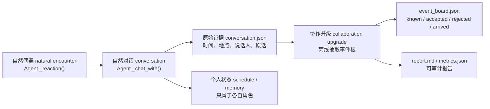
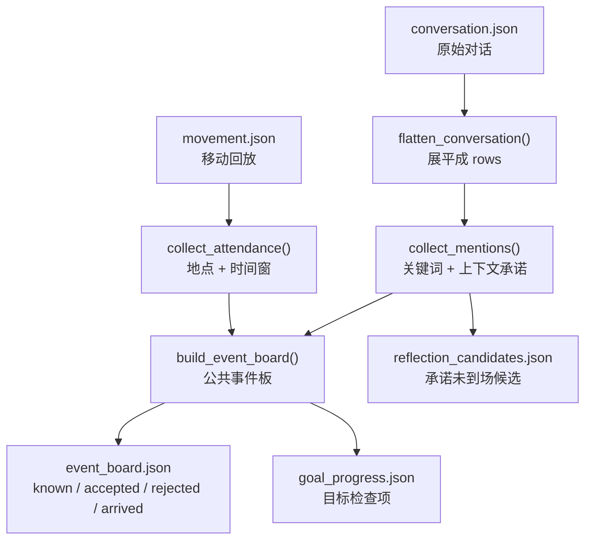
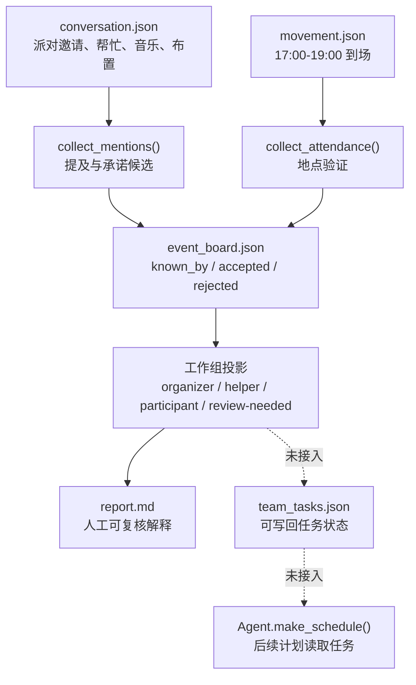
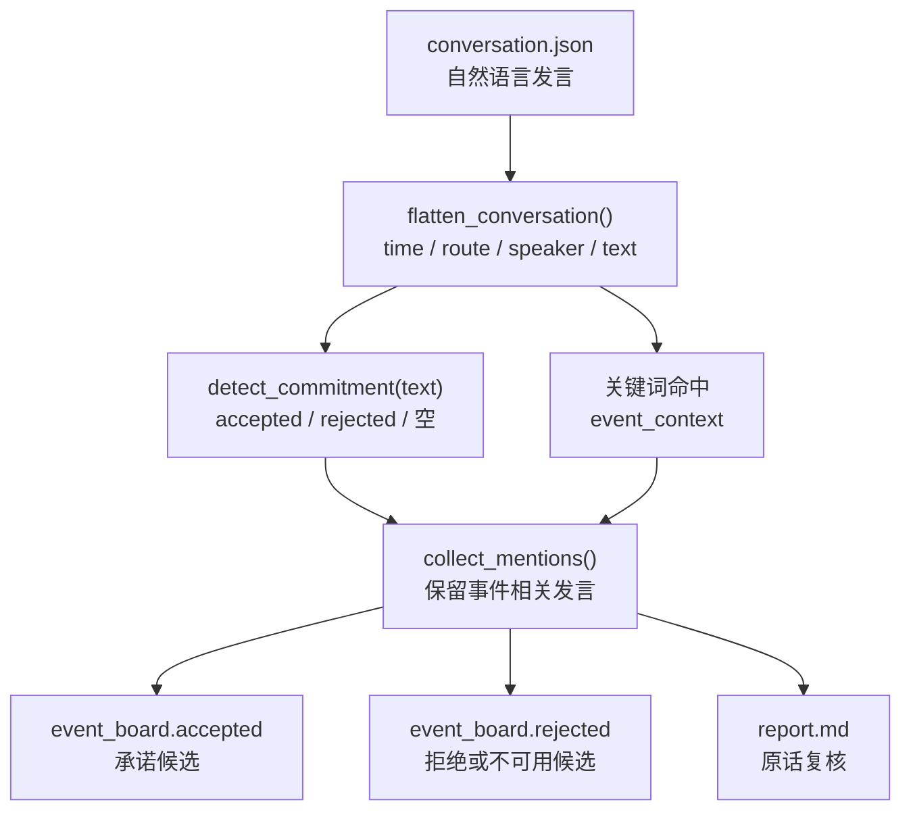
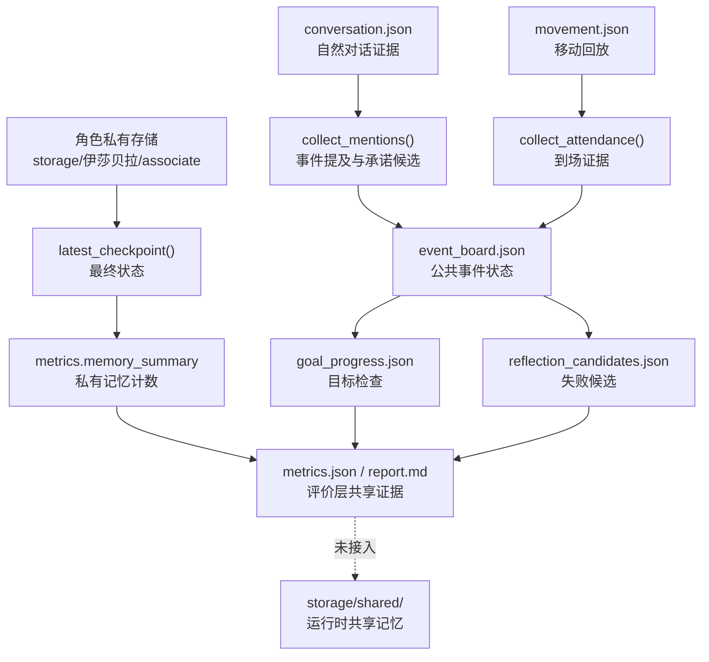
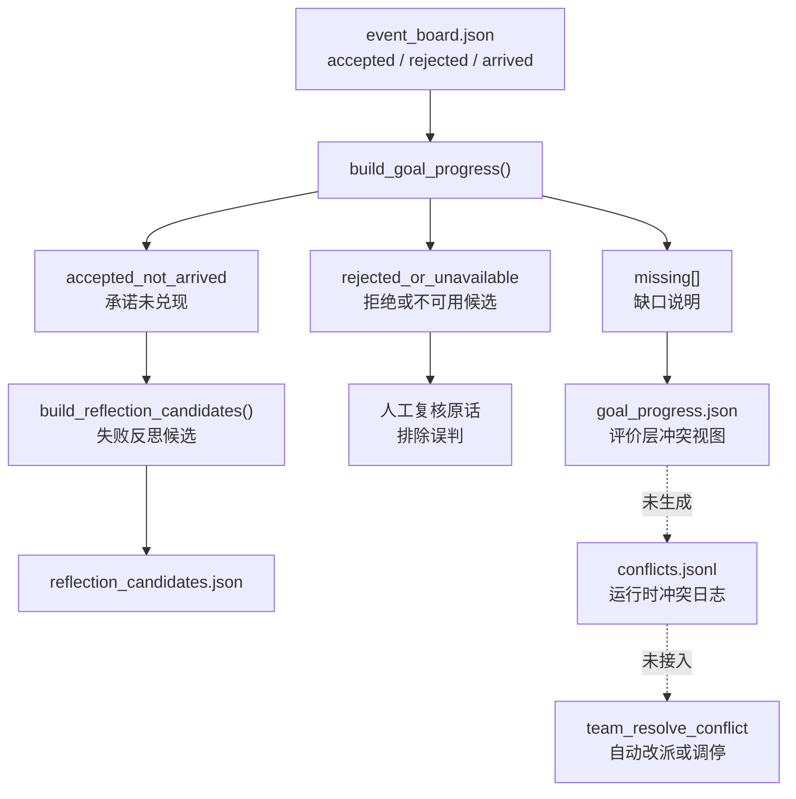
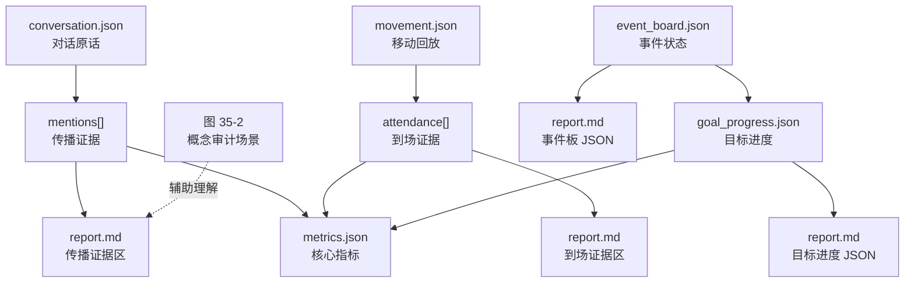
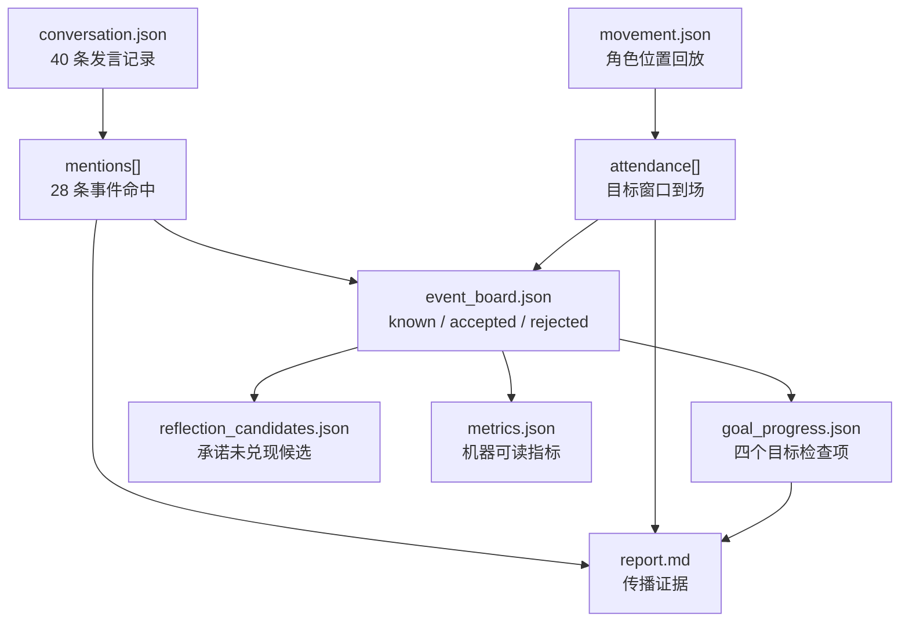
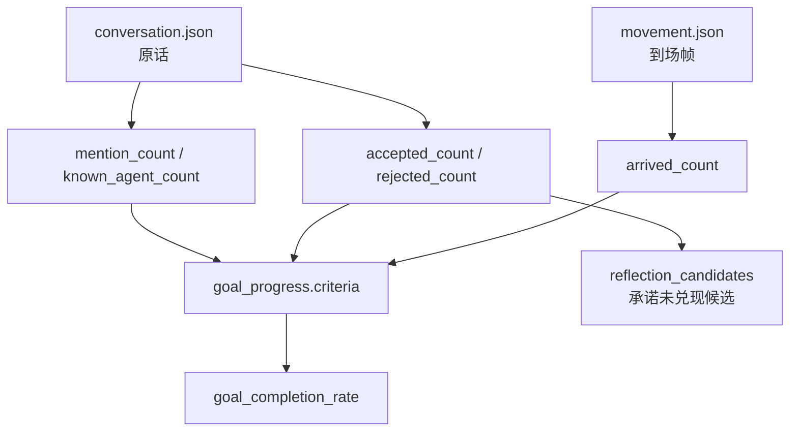

# 第 35 章 多智能体协作升级：从自然偶遇到组织化协作

## 35.1 派对准备卡在“谁负责”

`book-party-extended` 的回放里，伊莎贝拉在霍布斯咖啡馆反复向玛丽亚提到下午五点的情人节派对。对话里能看到邀请、承诺、布置彩带和爱心气球，`simulation.md` 里也会出现“伊莎贝拉请玛丽亚帮忙挂爱心气球布置派对，玛丽亚欣然应允”这样的活动摘要。问题在于，当前项目只能把这件事保存成自然对话 conversation、日程 schedule 和移动回放 movement，不能把它保存成一个团队任务 team task。

这就是多智能体协作升级 multi-agent collaboration 的现场：自然偶遇已经能让消息传播起来，但系统还不知道“谁接了任务、任务做到哪一步、失败卡在哪里、证据从哪段对话来”。

### 论文依据与工程落点

通过 Generative Agents、CAMEL、AutoGen、MetaGPT 和 AgentScope 五条论文线索，将自然涌现、角色协作、对话协议、轻量工作流和可审计报告落到 `generative_agents_next` 项目。

| 升级方向 | 论文名称 | 论文原文要点 | 本项目结论 |
| --- | --- | --- | --- |
| 自然涌现基线 emergent social behavior | Generative Agents: Interactive Simulacra of Human Behavior | 论文的情人节派对案例从一个用户设定出发，智能体会传播邀请、建立关系，并协调在正确时间一起到场；架构依赖记忆、反思、计划和环境行动。 | 当前小镇已经能产生自然对话和到场回放，本章不能推翻这条生活流；协作升级应在 `conversation.json`、`movement.json` 和 checkpoint 之后抽取状态。 |
| 角色协作 role-playing collaboration | CAMEL: Communicative Agents for "Mind" Exploration of Large Language Model Society | 论文用 `role-playing` 和 `inception prompting` 引导沟通智能体朝任务完成推进，同时保持与人类意图一致。 | 派对任务可以有临时角色，例如 `organizer/helper/messenger`；但这些角色应来自事件 event，不应改写长期人格 persona。 |
| 多智能体对话编排 multi-agent conversation | AutoGen: Enabling Next-Gen LLM Applications via Multi-Agent Conversation | 论文强调多个 `conversable agents` 可以通过可定制对话完成任务，并允许人、工具和 LLM 混合参与。 | 本项目不直接替换 `_chat_with()`；先保留自然聊天，再从对话中抽取 `dialogue_act`，识别邀请、接受、拒绝、进度报告。 |
| 标准作业流程 SOP | MetaGPT: Meta Programming for A Multi-Agent Collaborative Framework | 论文把 `Standardized Operating Procedures` 编进 prompt 序列，并把复杂任务拆给不同角色，以减少级联幻觉和中间错误。 | 小镇派对不能套软件工厂流程；只引入轻量 SOP：传播事实、收集承诺、验证到场、记录冲突。 |
| 平台化观测与容错 platform observability | AgentScope: A Flexible yet Robust Multi-Agent Platform | 论文把消息交换 message exchange 作为核心通信机制，并强调监控、容错和本地/分布式部署支持。 | 本章先做小规模可复查：输出 `event_board.json`、`metrics.json`、`report.md` 和失败候选，不急着扩大角色数量。 |

| 场景 | 当前自然偶遇 natural encounter | 组织化协作 organized collaboration |
| --- | --- | --- |
| 派对邀请 | 伊莎贝拉和玛丽亚聊天，摘要写入日程 schedule。 | 事件板 event board 记录玛丽亚接受“布置气球”任务。 |
| 音乐安排 | 埃迪可能在咖啡馆弹钢琴，但没有任务归属。 | 工作组 workgroup 把“确认音乐”分给埃迪，并记录接受或拒绝。 |
| 到场判断 | 通过 `movement.json` 看角色是否到霍布斯咖啡馆。 | 到场 attendance 与任务完成 task completion 一起进入报告 report。 |
| 失败解释 | 只能人工翻 `conversation.json`、`simulation.md` 和断点 checkpoint。 | 失败模式 failure mode 直接绑定证据路径 evidence path。 |


```mermaid
flowchart LR
    A["感知 perception：角色在世界地图 Maze 相遇"] --> B["聊天判断 prompt decide_chat"]
    B --> C["自然对话 conversation"]
    C --> D["个人记忆 personal memory 与日程 schedule"]
    D --> E["社会涌现 social emergence"]
    E -.升级.-> F["公共事件板 event board"]
    F --> G["临时工作组 temporary workgroup"]
    G --> H["任务状态 task status"]
    H --> I["协作报告 collaboration report"]
```

*图 35-1：从自然偶遇 natural encounter 到组织化协作 organized collaboration。当前项目已有感知、对话、记忆和日程写回；协作升级要在这条链后面增加公共状态、角色分工和可审计报告。*


*图 35-2：情人节派对从个人事件升级成协作事件。图中的咖啡馆事件桌把公共事件板 event board、角色分工 role、任务状态 task status、对话轨迹 conversation 和移动路径 movement 放在一起；有角色接受任务，也有角色犹豫或冲突。协作不是全员配合，而是可以被证据追踪的社会过程。*

## 35.2 项目锚点和术语

框架 CAMEL、框架 AutoGen、框架 MetaGPT 和平台 AgentScope 在 GenerativeAgentsCN 中的作用，是把协作能力压回 `generative_agents_next` 的可改位置。

| 中文 English | 项目锚点 | 升级读法 |
| --- | --- | --- |
| 智能体 Agent | `generative_agents_next/modules/agent.py` | 角色行为的执行单元，协作逻辑不能绕开它。 |
| 游戏循环 Game loop | `generative_agents_next/modules/game.py` | `Game.agent_think()` 每步调用智能体思考，并把状态交回 `start.py` 保存。 |
| 提示词 prompt | `generative_agents_next/data/prompts/*.txt`、`generative_agents_next/modules/prompt/scratch.py` | 对话、判断、总结都由提示词 prompt 包装函数提供变量和输出结构 schema。 |
| 对话记录 conversation | `generative_agents_next/results/checkpoints/<name>/conversation.json` | 当前最强的协作证据来源，记录说话双方、地点和原话。 |
| 断点 checkpoint | `generative_agents_next/results/checkpoints/<name>/simulate-*.json` | 保存每一步角色状态、行动、日程、记忆摘要和坐标。 |
| 移动回放 movement | `generative_agents_next/results/compressed/<name>/movement.json` | 检查承诺是否转化为到场、聚集和任务行动。 |
| 时间线 simulation | `generative_agents_next/results/compressed/<name>/simulation.md` | 给人读的证据索引，适合定位片段，再回查原始 JSON。 |
| 公共事件板 event board | `generative_agents_next/results/evaluations/<name>/event_board.json` | 把协作任务从个人记忆提升为实验可观察对象。 |

## 35.3 升级入口：自然对话之后抽取协作状态

协作升级不重走完整社交链路。已有机制提供一个基线：角色会自然相遇、聊天、写日程和留下证据；协作升级要在这些证据之后抽取公共事件状态，而不是把小镇居民改造成任务机器人 workflow bot。


```mermaid
flowchart LR
    A["自然偶遇 natural encounter<br/>Agent._reaction()"] --> B["自然对话 conversation<br/>Agent._chat_with()"]
    B --> C["原始证据 conversation.json<br/>时间、地点、说话人、原话"]
    B --> D["个人状态 schedule / memory<br/>只属于各自角色"]
    C --> E["协作升级 collaboration upgrade<br/>离线抽取事件板"]
    E --> F["event_board.json<br/>known / accepted / rejected / arrived"]
    E --> G["report.md / metrics.json<br/>可审计报告"]
```

*图 35-3：协作升级的真实入口。自然对话先发生，结构化协作状态后抽取；事件板 event board 是评价层产物，不是角色共同看到的一块白板。*

已有链路对协作升级的价值和边界如下：

| 已有能力 | 项目证据 | 协作升级怎么用 | 不能做什么 |
| --- | --- | --- | --- |
| 自然传播 information diffusion | `conversation.json`、`simulation.md` | 抽取谁提到派对、谁知道时间地点、谁转述给别人。 | 不能把关键词命中直接当成任务承诺。 |
| 对话闭环 dialogue loop | `Agent._chat_with()`、`schedule_chat()` | 保留生活化聊天，再从原话中识别邀请、接受、拒绝和帮忙。 | 不能把角色台词改成 JSON 命令。 |
| 个人日程 schedule | 断点 checkpoint 的 `schedule` 与 `action` | 检查承诺是否可能进入后续计划。 | 不能提供团队任务的统一进度视图。 |
| 移动回放 movement | `movement.json` | 验证角色是否在目标时间窗到达目标地点。 | 到场不等于完成布置、音乐、拍照等具体任务。 |
| 个人记忆 memory | `storage/<agent>/associate/` | 复查角色是否保存相关对话或关系背景。 | 共享事件状态不能只存在于某个角色私有记忆里。 |

前沿多智能体框架给本项目的启发，也要压回这些入口，而不是照搬完整框架。

| 前沿思想 | 本章采用的接口 | 本章不采用的部分 |
| --- | --- | --- |
| CAMEL 角色扮演式沟通智能体 | 给派对事件增加 `organizer/helper/messenger` 这类临时协作角色。 | 不把小镇改成双智能体任务辩论。 |
| AutoGen 多智能体对话框架 | 在自然对话后抽取 `dialogue_act`，识别邀请、接受、拒绝、任务提议。 | 不让所有交流都变成可编排代理消息。 |
| MetaGPT 标准作业流程 SOP | 为派对、竞选、讨论会定义轻量检查项。 | 不写死流程；保留拒绝、遗忘、误解和冲突。 |
| AgentScope 多智能体平台 | 增加状态观测、指标 metrics 和报告 report。 | 不先追求大规模角色数，优先保持小规模可复查。 |

六个升级方向都围绕同一件事：把自然对话留下的证据，整理成可复查的协作状态。

## 35.4 升级一：公共事件板 event board

公共事件板 event board 解决的是“协作事实不可见”的问题。没有它时，派对只散落在三类文件里：`conversation.json` 保存原话，`movement.json` 保存位置，checkpoint 保存个人状态。读者要人工翻这些文件，才能判断“谁知道派对、谁答应帮忙、谁真的到场”。事件板把这些证据整理成一个离线状态视图。

先把边界说清楚：本章实现的是离线事件板，不是角色可见的共享白板，也不是完整团队任务系统。

| 层级 | 当前状态 | 文件路径 | 能回答的问题 |
| --- | --- | --- | --- |
| 原始对话证据 conversation | 已落地 | `generative_agents_next/results/checkpoints/<实验名>/conversation.json` | 谁在什么时间、什么地点、说了什么。 |
| 移动到场证据 movement | 已落地 | `generative_agents_next/results/compressed/<实验名>/movement.json` | 谁在 `17:00-19:00` 出现在霍布斯咖啡馆。 |
| 离线事件板 event board | 已落地 | `generative_agents_next/results/evaluations/<实验名>/event_board.json` | 谁知道事件、谁接受、谁拒绝、谁到场。 |
| 写回式团队任务 team tasks | 未接入主链路 | 后续才会进入 `storage/shared/<event_id>/team_tasks.json` | 谁负责布置、谁负责音乐、任务是否完成。 |

### 输入、处理和输出

相对路径：`generative_agents_next/analyze_experiment.py`

| 环节 | 输入 | 处理 | 输出 |
| --- | --- | --- | --- |
| 对话展平 | `conversation.json` | `flatten_conversation()` 把时间、路线、说话人、原话展平成逐行记录。 | `rows[]` |
| 事件提及抽取 | `rows[]`、关键词列表 | `collect_mentions()` 匹配关键词，并保留同一段对话中的上下文承诺。 | `mentions[]` |
| 到场抽取 | `movement.json`、目标地点、时间窗 | `collect_attendance()` 在目标窗口内匹配地点。 | `attendance[]` |
| 事件板生成 | `mentions[]`、`attendance[]` | `build_event_board()` 汇总知情、接受、拒绝、到场和评价任务。 | `event_board.json` |
| 目标进度 | `event_board.json` | `build_goal_progress()` 判断传播、承诺、到场和未兑现承诺。 | `goal_progress.json` |


```mermaid
flowchart TD
    A["conversation.json<br/>原始对话"] --> B["flatten_conversation()<br/>展平成 rows"]
    B --> C["collect_mentions()<br/>关键词 + 上下文承诺"]
    D["movement.json<br/>移动回放"] --> E["collect_attendance()<br/>地点 + 时间窗"]
    C --> F["build_event_board()<br/>公共事件板"]
    E --> F
    F --> G["event_board.json<br/>known / accepted / rejected / arrived"]
    F --> H["goal_progress.json<br/>目标检查项"]
    C --> I["reflection_candidates.json<br/>承诺未到场候选"]
```

*图 35-4：公共事件板 event board 的真实代码路径。事件板只读取仿真结束后的证据文件，不进入角色 prompt，也不会让角色获得上帝视角。*

### 事件提及如何进入事件板

`collect_mentions()` 不是只做关键词搜索。它还保留同一段对话的上下文：如果一轮对话里先命中“派对”“五点”等关键词，后一句虽然没有关键词，但表达了承诺，也会被纳入同一个事件上下文。

```diff
+def collect_mentions(rows, keywords):
+    mentions = []
+    event_context = set()
+    for row in rows:
+        hits = [keyword for keyword in keywords if keyword and keyword in row["text"]]
+        commitment = detect_commitment(row["text"])
+        context_key = (row["time"], row["route"])
+        if hits:
+            event_context.add(context_key)
+        if not hits and not (commitment and context_key in event_context):
+            continue
+        mentions.append({
+            "time": row["time"],
+            "route": row["route"],
+            "speaker": row["speaker"],
+            "keywords": hits or ["context"],
+            "commitment": commitment,
+            "text": row["text"],
+        })
+    return mentions
```

这一步的作用是降低漏检。例如“需要我帮忙吗”可能包含关键词“帮忙”，而下一句“没问题，交给我吧”未必再次出现“派对”。如果只按单句关键词搜索，就会漏掉承诺。

### 事件板字段如何生成

`build_event_board()` 把 `mentions` 和 `attendance` 汇总成四个核心集合。

```diff
+def build_event_board(event_name, mentions, attendance):
+    known_by = sorted({row["speaker"] for row in mentions})
+    accepted = sorted({row["speaker"] for row in mentions if row["commitment"] == "accepted"})
+    rejected = sorted({row["speaker"] for row in mentions if row["commitment"] == "rejected"})
+    arrived = sorted({row["agent"] for row in attendance})
+    tasks = [
+        {
+            "task_id": "spread_fact",
+            "status": "done" if known_by else "pending",
+            "owners": known_by,
+            "evidence": [row["time"] for row in mentions],
+        },
+        {
+            "task_id": "collect_commitments",
+            "status": "done" if accepted or rejected else "pending",
+            "owners": accepted + rejected,
+            "accepted": accepted,
+            "rejected": rejected,
+        },
+        {
+            "task_id": "verify_attendance",
+            "status": "done" if arrived else "pending",
+            "owners": arrived,
+        },
+    ]
+    return {
+        "event": event_name,
+        "known_by": known_by,
+        "accepted": accepted,
+        "rejected": rejected,
+        "arrived": arrived,
+        "tasks": tasks,
+    }
```

字段含义如下：

| 字段 | 来源 | 含义 | 复核方式 |
| --- | --- | --- | --- |
| `known_by` | `mentions[].speaker` | 在对话中说出事件相关事实的角色。 | 回到 `conversation.json` 看原话。 |
| `accepted` | `mentions[].commitment == "accepted"` | 有承诺、接受、帮忙或到场意图的角色候选。 | 检查承诺是不是明确行动，不是礼貌回应。 |
| `rejected` | `mentions[].commitment == "rejected"` | 明确拒绝、时间冲突或无法到场的角色候选。 | 检查否定词是否误命中。 |
| `arrived` | `attendance[].agent` | 目标窗口内出现在目标地点的角色。 | 回到 `movement.json` 查 frame、时间、位置。 |
| `tasks` | 事件板派生 | 评价脚本完成了哪些检查。 | 注意它不是角色真实收到的任务卡。 |

`book-collaboration-party` 的真实输出如下：

```json
{
  "event": "valentine_party",
  "known_by": ["伊莎贝拉", "克劳斯", "埃迪", "玛丽亚"],
  "accepted": ["埃迪", "玛丽亚"],
  "rejected": ["伊莎贝拉"],
  "arrived": ["伊莎贝拉", "克劳斯", "埃迪", "玛丽亚"]
}
```

这份事件板说明：派对事实至少被四名角色提及；埃迪和玛丽亚被抽取为承诺候选；四名角色在目标窗口内到达霍布斯咖啡馆。但 `rejected=["伊莎贝拉"]` 是一个需要人工复核的误判，来源是对话里“能不能帮忙拍照记录一下”这类否定词结构。事件板把候选暴露出来，不能替代最终裁决。

### 事件板和目标进度的关系

`goal_progress.json` 是从事件板派生出来的目标检查，不再回头重新读对话。

| 检查项 | 生成逻辑 | 本轮结果 |
| --- | --- | --- |
| `has_event_diffusion` | `known_by` 非空 | `true` |
| `has_commitment` | `accepted` 非空 | `true` |
| `has_attendance` | `arrived` 非空 | `true` |
| `has_no_unfulfilled_commitment` | `accepted - arrived` 为空 | `true` |

这四项得到 `goal_completion_rate=1.0`。读法要克制：它说明“传播、承诺、到场、承诺未兑现检查”在评价层通过；它不说明具体任务都完成了，也不说明事件板已经写回角色的下一步行动。

### 当前边界

| 已完成 | 尚未完成 |
| --- | --- |
| 从 `conversation.json` 抽取事件提及和承诺候选。 | 用 LLM 或更强规则做高精度 `dialogue_act` 分类。 |
| 从 `movement.json` 验证目标时间窗到场。 | 把到场拆成具体任务完成，例如音乐、布置、拍照。 |
| 生成 `event_board.json`、`goal_progress.json` 和 `report.md`。 | 把团队任务写回 `storage/shared/<event_id>/team_tasks.json`。 |
| 暴露误判字段，支持人工复核。 | 让角色在后续规划中读取事件板并调整行动。 |

## 35.5 升级二：临时工作组 temporary workgroup

公共事件板 event board 解决“协作事实能不能被看见”，临时工作组 temporary workgroup 解决“事件里的人临时承担什么协作身份”。两者不能混成一件事：`known_by` 说明角色知道事件，`accepted` 说明角色表达了承诺，`arrived` 说明角色出现在地点；只有把这些证据合并，才能形成工作组视图。

临时工作组不是长期人格 persona，也不是永久组织。伊莎贝拉可以在情人节派对里成为发起人 organizer，但她的角色设定不会因此变成“项目经理”；埃迪可以在派对里成为音乐或气氛 helper，但这不改变他在小镇里的日常身份。

### 当前落地形态

当前代码没有新增 `Workgroup` 类，也没有生成独立的 `workgroup.json` 或 `team_tasks.json`。本轮能够得到的是评价层的工作组投影：从 `event_board.json`、`goal_progress.json` 和 `report.md` 中，把角色的临时协作身份读出来。

| 层级 | 当前状态 | 文件路径 | 能回答的问题 |
| --- | --- | --- | --- |
| 事件事实 event facts | 已落地 | `generative_agents_next/results/evaluations/book-collaboration-party/event_board.json` | 谁知道事件、谁接受、谁拒绝、谁到场。 |
| 工作组投影 workgroup projection | 已能从评价结果推导 | 由 `event_board.json` 和 `report.md` 可推导 | 谁在这个事件里更像发起人、帮手、参与者或待复核对象。 |
| 可写回工作组 writable workgroup | 未接入主链路 | 尚未生成 `storage/shared/<event_id>/team_tasks.json` | 谁被系统登记为负责人，后续计划是否会读取任务。 |
| 规划影响 planning impact | 未接入主链路 | `Agent.make_schedule()` 暂未读取共享任务 | 工作组是否改变角色后续行动。 |

### 角色身份从哪里来

`book-collaboration-party` 的工作组视图来自三类证据：对话原话、事件板字段和移动到场。下表中的“身份”是评价层归纳，不是写入角色状态的真实职位。

| 临时身份 | 证据来源 | 本轮证据 | 工程含义 | 边界 |
| --- | --- | --- | --- | --- |
| 发起人 organizer | 对话原话、角色行为、事件语境 | 伊莎贝拉多次介绍“下午5点到7点”的情人节派对，并在 `17:00` 位于霍布斯咖啡馆柜台后面迎接顾客。 | 她是事件源头和现场主导者候选。 | 当前没有 `organizer` 字段，也没有权限模型。 |
| 帮手 helper | `event_board.accepted` 与原话 | 埃迪说“没问题，交给我吧”，玛丽亚说“需要帮忙吗”“可以帮你一起想想需要买什么”。 | 他们进入承诺候选，可用于后续任务拆分。 | 还不能细分为“绑气球”“音乐”“采购”等任务卡。 |
| 参与者 participant | `event_board.arrived` 与 `movement.json` | 伊莎贝拉、玛丽亚、克劳斯、埃迪都在 `17:00-19:00` 出现在霍布斯咖啡馆。 | 到场可以验证事件形成了群体行动。 | 到场不等于完成具体协作任务。 |
| 知情者 informed | `event_board.known_by` | 四名角色都在对话中提到派对、时间、地点或帮忙。 | 事件传播范围可被统计。 | 知情不等于接受任务。 |
| 待复核对象 review-needed | `event_board.rejected` | 伊莎贝拉进入 `rejected`，但这是“能不能帮忙拍照记录一下”触发的否定词误判。 | 评价层暴露了抽取风险。 | 不能把这个字段直接当成真实拒绝。 |

按照这份证据，本轮临时工作组只能写成“评价层视图”：

```json
{
  "event": "valentine_party",
  "organizer_candidates": ["伊莎贝拉"],
  "helper_candidates": ["埃迪", "玛丽亚"],
  "participant_candidates": ["伊莎贝拉", "玛丽亚", "克劳斯", "埃迪"],
  "review_needed": ["伊莎贝拉"]
}
```

这段 JSON 是解释性投影，不是当前脚本实际输出文件。真实输出仍然是 `event_board.json`、`goal_progress.json`、`metrics.json` 和 `report.md`。

### 从事件板到工作组的链路


```mermaid
flowchart TD
    A["conversation.json<br/>派对邀请、帮忙、音乐、布置"] --> B["collect_mentions()<br/>提及与承诺候选"]
    C["movement.json<br/>17:00-19:00 到场"] --> D["collect_attendance()<br/>地点验证"]
    B --> E["event_board.json<br/>known_by / accepted / rejected"]
    D --> E
    E --> F["工作组投影<br/>organizer / helper / participant / review-needed"]
    F --> G["report.md<br/>人工可复核解释"]
    F -. 未接入 .-> H["team_tasks.json<br/>可写回任务状态"]
    H -. 未接入 .-> I["Agent.make_schedule()<br/>后续计划读取任务"]
```

*图 35-5：临时工作组 temporary workgroup 的当前链路。实线是本轮已经存在的评价路径，虚线是尚未进入主链路的写回式工作组。*

### 为什么不能直接宣称工作组已完成

当前 `event_board.tasks` 里的 `spread_fact`、`collect_commitments`、`verify_attendance` 是评价脚本自己的检查项，不是角色收到的任务。`owners` 也不是任务负责人，而是该检查项涉及到的角色集合。

| 容易误读的字段 | 正确读法 | 不能写成 |
| --- | --- | --- |
| `tasks[].owners` | 评价检查覆盖到哪些角色。 | 这些角色被系统分配了任务。 |
| `accepted` | 角色说出了可被规则识别的承诺。 | 角色已经拿到任务卡并会被系统提醒。 |
| `arrived` | 角色在目标时间窗出现在目标地点。 | 角色完成了布置、音乐或拍照任务。 |
| `rejected` | 拒绝或不可用候选，需要复核。 | 角色真实拒绝参与。 |

临时工作组真正接入主链路后，至少要新增三个能力：第一，生成可持久化的 `team_tasks.json`；第二，让角色在规划或反应时读取共享任务；第三，把任务完成、拒绝、改派和失败原因写回共享状态。当前代码只完成前置证据整理，不把这些能力写成已经实现。

## 35.6 升级三：协作对话协议 dialogue act

协作对话协议 dialogue act 的目标，是把自然语言里的“邀请、接受、拒绝、报告进度”抽成结构化动作。当前实现还不是完整协议，而是最小版承诺分类器 commitment classifier：它只给一条发言打出 `accepted`、`rejected` 或空字符串，再由 `collect_mentions()` 把这些分类放进事件上下文。

这一步必须放在事件板和工作组之间。没有对话协议时，`conversation.json` 里只有自然语言；事件板无法区分“我听说了派对”“我会去派对”“我来不了”“我已经把气球绑好了”。当前代码先解决前两类和拒绝候选，进度报告和具体任务完成还没有独立字段。

### 当前协议字段

相对路径：`generative_agents_next/analyze_experiment.py`

| 对话动作 dialogue act | 当前识别方式 | 写入字段 | 下游位置 | 边界 |
| --- | --- | --- | --- | --- |
| 事件提及 mention | 关键词命中，例如 `情人节`、`派对`、`五点`、`霍布斯咖啡馆`。 | `mentions[].keywords` | `event_board.known_by` | 知情不等于承诺。 |
| 邀请 invitation | 邀请语句只触发事件上下文，不写成承诺。 | `commitment=""` | 保留在 `mentions[].text` | “欢迎来参加”不能算接受。 |
| 接受或帮忙 accepted | 正则命中“会、可以、没问题、正好、准时”等行动语义。 | `commitment="accepted"` | `event_board.accepted` | 当前是承诺候选，不是任务负责人。 |
| 拒绝或不可用 rejected | 正则命中“来不了、时间冲突、不能、没法、不方便”等否定语义。 | `commitment="rejected"` | `event_board.rejected`、`goal_progress.missing` | 对“能不能帮忙”这类问句敏感，必须复核。 |
| 进度报告 progress | 当前没有独立识别。 | 无 | 只留在 `report.md` 原话 | 不能计算具体任务完成率。 |

### 分类规则如何执行

`detect_commitment()` 是当前协议的核心。它没有调用 LLM，也没有 prompt 文件；所有判断都来自确定性正则。

```diff
+def detect_commitment(text):
+    invitation_patterns = [
+        r"一起过来",
+        r"过来一起",
+        r"不如过来",
+        r"记得来",
+        r"来玩",
+        r"要不要来",
+        r"你要是.{0,16}(有空|方便).{0,24}过来",
+        r"欢迎.{0,8}来",
+    ]
+    accept_patterns = [
+        r"我.{0,30}直播完.{0,20}(过来|到|来|捧场)",
+        r"直播完.{0,20}(过来|到|来|捧场)",
+        r"(我|我们|我和.{0,8}).{0,25}(一定|肯定|会|可以|能|没问题|正好|准时).{0,35}(过来|到场|参加|捧场|帮忙|布置|挂.{0,4}装饰)",
+        r"(我|我们|我和.{0,8}).{0,25}(五点|六点|17:00|18:00|下午|晚上).{0,35}(过来|到场|参加|捧场|帮忙|布置)",
+        r"(肯定|一定|准时).{0,12}(过来|到场|参加|捧场|帮忙|布置)",
+    ]
+    reject_patterns = [
+        r"(来不了|赶不上|时间冲突|有约)",
+        r"(不能|没法|不方便).{0,16}(过来|到场|到|参加|捧场|帮忙|布置)",
+        r"(我不行|我今天不行|今天不行|下午不行|晚上不行|可能不行)",
+    ]
+    if any(re.search(pattern, text) for pattern in reject_patterns):
+        return "rejected"
+    if any(re.search(pattern, text) for pattern in invitation_patterns):
+        return ""
+    if any(re.search(pattern, text) for pattern in accept_patterns):
+        return "accepted"
+    return ""
```

分支顺序体现了三个取舍。

| 分支 | 代码行为 | 工程意图 | 风险 |
| --- | --- | --- | --- |
| 先判拒绝 | 命中 `reject_patterns` 立即返回 `rejected`。 | 时间冲突和拒绝比礼貌话术优先。 | “能不能帮忙”会包含“不能”，容易误判。 |
| 邀请返回空 | 命中 `invitation_patterns` 返回空字符串。 | 邀请只说明传播，不说明对方接受。 | 邀请者自己的参与意图不会被记录成承诺。 |
| 再判接受 | 命中 `accept_patterns` 返回 `accepted`。 | 把“会到场、可以帮忙、准时来”变成承诺候选。 | “需要我帮忙吗”这种提议句可能被当成接受。 |

### 上下文如何补漏

对话协议不能只看单句。`collect_mentions()` 用 `(time, route)` 做上下文键：同一段对话里只要前面命中过事件关键词，后续没有关键词但带有承诺的句子，也会被纳入同一个事件上下文。

```diff
+def collect_mentions(rows, keywords):
+    mentions = []
+    event_context = set()
+    for row in rows:
+        hits = [keyword for keyword in keywords if keyword and keyword in row["text"]]
+        commitment = detect_commitment(row["text"])
+        context_key = (row["time"], row["route"])
+        if hits:
+            event_context.add(context_key)
+        if not hits and not (commitment and context_key in event_context):
+            continue
+        mentions.append({
+            "time": row["time"],
+            "route": row["route"],
+            "speaker": row["speaker"],
+            "keywords": hits or ["context"],
+            "commitment": commitment,
+            "text": row["text"],
+        })
+    return mentions
```

这段逻辑让自然对话保持原样，同时给事件板提供结构化入口。


```mermaid
flowchart TD
    A["conversation.json<br/>自然语言发言"] --> B["flatten_conversation()<br/>time / route / speaker / text"]
    B --> C["detect_commitment(text)<br/>accepted / rejected / 空"]
    B --> D["关键词命中<br/>event_context"]
    C --> E["collect_mentions()<br/>保留事件相关发言"]
    D --> E
    E --> F["event_board.accepted<br/>承诺候选"]
    E --> G["event_board.rejected<br/>拒绝或不可用候选"]
    E --> H["report.md<br/>原话复核"]
```

*图 35-6：协作对话协议 dialogue act 的当前代码路径。协议不改写角色台词，只在仿真结束后从原话里抽取结构化候选。*

### 本轮实验里的真实命中

`book-collaboration-party` 的评价结果显示：`mention_count=28`，`accepted=["埃迪","玛丽亚"]`，`rejected=["伊莎贝拉"]`。这些字段来自评价层规则，不是角色自己写入的任务状态。

| 时间 | 原话片段 | 规则输出 | 正确读法 |
| --- | --- | --- | --- |
| `20240214-12:30` | 伊莎贝拉说“今天下午5点到7点我们这儿有情人节派对，欢迎来参加哦”。 | 事件提及，`commitment=""` | 这是邀请和传播，不是接受。 |
| `20240214-14:30` | 埃迪说“需要我帮忙吗”。 | `accepted` 候选 | 更准确地说是帮忙提议，后续“没问题，交给我吧”才强化了承诺。 |
| `20240214-16:10` | 玛丽亚说“好呀！一起走吧……去咖啡馆看看伊莎贝拉那边布置得怎么样了”。 | `accepted` 候选 | 可以作为到场和协助意图，但还不是具体任务完成。 |
| `20240214-13:20` | 伊莎贝拉说“问问林晓能不能帮忙拍照记录一下”。 | `rejected` 候选 | 这是误判；“能不能帮忙”不是拒绝。 |
| `20240214-16:40` | 玛丽亚和埃迪讨论派对音乐。 | 只保留为事件提及 | 当前没有 `progress` 字段，不能写成音乐任务已完成。 |

这张表决定了 35.6 的结论：当前对话协议已经能把部分自然语言变成事件板候选，但候选不是事实裁决。`accepted` 需要回查原话确认是不是承诺，`rejected` 需要排除“能不能”这类问句误判，`progress` 需要后续新增字段。

### 尚未接入的 LLM 版协议

更完整的协作对话协议可以交给 LLM 做分类，但不能直接让 LLM 改共享状态。合理做法是先输出 schema，再由确定性代码校验和写入。

| 设计目标文件 | 用途 | 当前状态 |
| --- | --- | --- |
| `generative_agents_next/data/prompts/team_assign_role.txt` | 从原话中抽取临时角色，例如 organizer、helper。 | 尚未创建。 |
| `generative_agents_next/data/prompts/team_update_task.txt` | 把“帮忙布置”“调整音乐”转成任务状态更新。 | 尚未创建。 |
| `generative_agents_next/data/prompts/team_report_progress.txt` | 识别进度报告，例如“气球绑好了”“音乐准备好了”。 | 尚未创建。 |
| `generative_agents_next/data/prompts/team_resolve_conflict.txt` | 处理拒绝、时间冲突、承诺未兑现。 | 尚未创建。 |
| `generative_agents_next/data/prompts/team_summarize_progress.txt` | 汇总事件进展，写入共享报告。 | 尚未创建。 |

这些 prompt 即使创建出来，也只能输出候选结构；最终写入 `event_board.json`、`team_tasks.json` 或 `conflicts.jsonl` 的动作，仍然应该由代码完成。这样才能保留可复核的证据链，避免模型一句话把任务状态改成“完成”。

## 35.7 升级四：共享记忆 shared memory

共享记忆 shared memory 不是让所有角色共享大脑，而是把同一个公共事件的事实、承诺、证据和缺口放到同一个可审计位置。个人记忆 associate 解决“某个角色记住了什么”，共享记忆解决“一个事件的公共状态是什么”。两者的边界必须分清，否则协作会被误写成全员自动同步。

当前代码落地的是评价层共享证据 shared evidence，不是运行时共享记忆 runtime shared memory。`analyze_experiment.py` 在仿真结束后读取 `conversation.json`、`movement.json` 和最终 checkpoint，然后把协作事实输出到 `results/evaluations/<实验名>/`。这些文件可供人工和评价脚本复核，但不会被 `Agent.make_schedule()`、`Agent._reaction()` 或 `_chat_with()` 自动读取。

### 存储边界

| 层级 | 当前路径 | 写入者 | 谁会读取 | 状态 |
| --- | --- | --- | --- | --- |
| 角色私有记忆 private associate memory | `results/checkpoints/<实验名>/storage/<角色>/associate/` | 仿真过程中的角色记忆系统。 | 单个角色的检索、反思和对话。 | 已存在。 |
| 评价层共享证据 shared evidence | `results/evaluations/<实验名>/` | `generative_agents_next/analyze_experiment.py`。 | 人工复核、指标脚本、实验报告。 | 已存在。 |
| 运行时共享记忆 runtime shared memory | `results/checkpoints/<实验名>/storage/shared/<event_id>/` | 后续共享状态写入器。 | 角色规划、反应、任务更新和冲突处理。 | 当前未生成。 |

`book-collaboration-party` 的 checkpoint 目录下只有角色私有目录：

```text
generative_agents_next/results/checkpoints/book-collaboration-party/storage/
  伊莎贝拉/
  玛丽亚/
  埃迪/
  克劳斯/
  亚当/
```

不存在 `storage/shared/`。这说明本轮实验可以复盘公共事件，但角色在运行时并没有共同读取同一份共享状态。

### 当前已生成的共享证据

相对路径：`generative_agents_next/results/evaluations/book-collaboration-party/`

| 文件 | 生成来源 | 保存内容 | 复核价值 |
| --- | --- | --- | --- |
| `event_board.json` | `conversation.json` + `movement.json` | `known_by`、`accepted`、`rejected`、`arrived` 和评价任务。 | 判断事件传播、承诺候选和到场证据。 |
| `goal_progress.json` | `event_board.json` | 传播、承诺、到场、承诺未兑现四个目标检查项。 | 判断协作目标是否在评价层闭环。 |
| `reflection_candidates.json` | `event_board.accepted - event_board.arrived` | 承诺了但未到场的候选反思。 | 给经验学习和失败复盘提供入口；本轮为空数组。 |
| `metrics.json` | 评价指标汇总 | 关键词、时间窗、角色计数、记忆类型计数、目标进度。 | 给实验报告和跨实验对比使用。 |
| `report.md` | 上述结构化结果 | 传播证据、到场证据、目标进度和事件板摘录。 | 先定位片段，再回查原始 JSON。 |

这些文件由同一段输出逻辑写入：

```diff
+    outputs = {
+        "metrics": os.path.join(evaluation_dir, "metrics.json"),
+        "report": os.path.join(evaluation_dir, "report.md"),
+        "event_board": os.path.join(evaluation_dir, "event_board.json"),
+        "goal_progress": os.path.join(evaluation_dir, "goal_progress.json"),
+        "reflection_candidates": os.path.join(evaluation_dir, "reflection_candidates.json"),
+    }
+    with open(outputs["metrics"], "w", encoding="utf-8") as f:
+        json.dump(metrics, f, ensure_ascii=False, indent=2)
+    with open(outputs["event_board"], "w", encoding="utf-8") as f:
+        json.dump(event_board, f, ensure_ascii=False, indent=2)
+    with open(outputs["goal_progress"], "w", encoding="utf-8") as f:
+        json.dump(goal_progress, f, ensure_ascii=False, indent=2)
+    with open(outputs["reflection_candidates"], "w", encoding="utf-8") as f:
+        json.dump(reflection_candidates, f, ensure_ascii=False, indent=2)
```

这段代码的关键不在文件数量，而在数据流：先从私有对话和移动回放里抽取公共事实，再把公共事实写成一组评价文件。它没有写回任何角色私有记忆，也没有创建共享目录。


```mermaid
flowchart TD
    A["角色私有存储<br/>storage/伊莎贝拉/associate"] --> D["latest_checkpoint()<br/>最终状态"]
    B["conversation.json<br/>自然对话证据"] --> E["collect_mentions()<br/>事件提及与承诺候选"]
    C["movement.json<br/>移动回放"] --> F["collect_attendance()<br/>到场证据"]
    D --> G["metrics.memory_summary<br/>私有记忆计数"]
    E --> H["event_board.json<br/>公共事件状态"]
    F --> H
    H --> I["goal_progress.json<br/>目标检查"]
    H --> J["reflection_candidates.json<br/>失败候选"]
    G --> K["metrics.json / report.md<br/>评价层共享证据"]
    I --> K
    J --> K
    K -. 未接入 .-> L["storage/shared/<event_id><br/>运行时共享记忆"]
```

*图 35-7：共享记忆 shared memory 的当前边界。实线是已经存在的评价层证据流，虚线是尚未接入角色主链路的运行时共享记忆。*

### 私有记忆和共享证据的区别

`metrics.json` 里有 `memory_summary`，但它只是统计每个角色私有 `associate` 中的记忆类型数量。例如伊莎贝拉有 `chat`、`event`、`relationship`、`summary`、`thought` 等计数；这些计数不能说明她和玛丽亚共享了一份事件状态。

| 容易混淆的说法 | 更准确的说法 |
| --- | --- |
| 角色共享了派对记忆。 | 评价脚本把多个角色的对话和移动证据汇总成了公共事件视图。 |
| `metrics.memory_summary` 是共享记忆。 | 它是各角色私有记忆类型的计数汇总。 |
| `event_board.json` 会影响角色后续行为。 | 当前它只影响评价报告，不进入角色规划。 |
| `report.md` 是智能体看到的公共公告。 | 它是仿真结束后的人工可读报告。 |

### 接回主链路需要什么

运行时共享记忆真正成立时，目录可以扩展为：

```text
generative_agents_next/results/checkpoints/<实验名>/storage/shared/<event_id>/
  event_board.json
  team_tasks.json
  progress_log.jsonl
  conflicts.jsonl
  access_policy.json
```

这组文件还需要三条运行规则。

| 规则 | 作用 | 当前缺口 |
| --- | --- | --- |
| 写入规则 write policy | 只有经过 schema 校验的对话动作、到场证据和任务更新能写入共享目录。 | 当前只有离线评价写文件，没有运行时写入器。 |
| 读取规则 read policy | 组织者、负责人、参与者和旁观者读取不同范围的共享状态。 | 当前没有角色访问控制。 |
| 规划接入 planning integration | `make_schedule()`、`_reaction()` 或对话前检索能读取共享任务。 | 当前角色不会因为 `event_board.json` 改变后续行动。 |

共享记忆的工程目标不是让所有角色知道所有事，而是让公共事件有一个带证据的状态源。当前实验已经生成评价层共享证据；真正的运行时共享记忆，还需要共享目录、访问规则和规划接入一起完成。

## 35.8 升级五：协作冲突处理 conflict resolution

协作冲突处理 conflict resolution 当前还不是自动改派或自动调停，而是冲突暴露 conflict exposure：把拒绝、承诺未兑现、无到场证据和抽取误判从漂亮叙事里拆出来，放进可复核字段。没有这一步，实验报告很容易只写“大家都来了”，却忽略“谁只是被关键词命中”“谁答应了但没出现”“哪个拒绝字段其实是误判”。

当前代码没有生成独立的 `conflicts.jsonl`，也没有 `team_resolve_conflict.txt` prompt。冲突信号只存在于 `event_board.json`、`goal_progress.json` 和 `reflection_candidates.json`。

| 冲突层级 | 当前字段 | 生成位置 | 本轮结果 | 正确读法 |
| --- | --- | --- | --- | --- |
| 拒绝或不可用 rejected / unavailable | `event_board.rejected`、`goal_progress.rejected_or_unavailable` | `detect_commitment()`、`build_event_board()`、`build_goal_progress()` | `["伊莎贝拉"]` | 这是候选冲突；本轮实际是“能不能帮忙”误判。 |
| 承诺未兑现 unfulfilled commitment | `goal_progress.accepted_not_arrived` | `build_goal_progress()` | `[]` | 埃迪和玛丽亚进入 `accepted`，并且都在目标窗口到场。 |
| 失败反思候选 failed outcome | `reflection_candidates.json` | `build_reflection_candidates()` | `[]` | 没有出现“承诺了但 movement 未验证到场”的失败样例。 |
| 无到场证据 no attendance | `goal_progress.missing` | `build_goal_progress()` | 未触发 | 因为四名角色都在 `17:00-19:00` 到过霍布斯咖啡馆。 |
| 具体任务冲突 task conflict | 尚无字段 | 需要 `team_tasks.json` | 不能判断 | 不能说音乐、布置、拍照任务是否完成或冲突。 |

### 冲突信号如何生成

相对路径：`generative_agents_next/analyze_experiment.py`

```diff
+def build_goal_progress(event_board):
+    accepted = set(event_board["accepted"])
+    rejected = set(event_board["rejected"])
+    arrived = set(event_board["arrived"])
+    informed = set(event_board["known_by"])
+    missing = []
+    accepted_not_arrived = sorted(accepted - arrived)
+    if not informed:
+        missing.append("没有角色在对话中命中事件关键词。")
+    if accepted_not_arrived:
+        missing.append(
+            "这些角色有承诺但未在目标时间窗到场：" + "、".join(accepted_not_arrived)
+        )
+    if not arrived:
+        missing.append("目标时间窗内没有角色到达目标地点。")
+    if rejected:
+        missing.append("这些角色明确拒绝或表示时间冲突：" + "、".join(sorted(rejected)))
+    criteria = {
+        "has_event_diffusion": bool(informed),
+        "has_commitment": bool(accepted),
+        "has_attendance": bool(arrived),
+        "has_no_unfulfilled_commitment": not bool(accepted_not_arrived),
+    }
+    return {
+        "informed": sorted(informed),
+        "accepted": sorted(accepted),
+        "arrived": sorted(arrived),
+        "rejected_or_unavailable": sorted(rejected),
+        "accepted_not_arrived": accepted_not_arrived,
+        "missing": missing,
+        "criteria": criteria,
+        "goal_completion_rate": round(
+            sum(1 for value in criteria.values() if value) / len(criteria), 4
+        ),
+    }
```

这段代码只做判断和记录，不做自动修复。`accepted_not_arrived` 进入 `missing`，但不会自动提醒角色、改派任务或修改日程。`rejected` 也只进入 `missing`，不会直接删除角色或改写事件状态。

承诺未兑现还会进入反思候选：

```diff
+def build_reflection_candidates(event_board, mentions):
+    candidates = []
+    arrived = set(event_board["arrived"])
+    for speaker in event_board["accepted"]:
+        if speaker in arrived:
+            continue
+        evidence = [
+            {
+                "time": row["time"],
+                "route": row["route"],
+                "text": row["text"],
+            }
+            for row in mentions
+            if row["speaker"] == speaker and row["commitment"] == "accepted"
+        ]
+        candidates.append({
+            "agent": speaker,
+            "outcome": "failed",
+            "failure_type": "commitment_not_verified_by_movement",
+            "lesson": "承诺类对话需要在目标时间窗用 movement.json 复核到场，而不是只相信聊天摘要。",
+            "evidence": evidence,
+        })
+    return candidates
```

这段函数把“承诺但未到场”转成第 33 章经验学习可以使用的失败样例。本轮 `reflection_candidates.json` 是空数组，说明没有接受承诺者缺席；它不说明没有任何协作问题，因为 `rejected_or_unavailable=["伊莎贝拉"]` 仍然需要复核。

### 本轮冲突结果

相对路径：`generative_agents_next/results/evaluations/book-collaboration-party/goal_progress.json`

```json
{
  "accepted": ["埃迪", "玛丽亚"],
  "arrived": ["伊莎贝拉", "克劳斯", "埃迪", "玛丽亚"],
  "rejected_or_unavailable": ["伊莎贝拉"],
  "accepted_not_arrived": [],
  "missing": [
    "这些角色明确拒绝或表示时间冲突：伊莎贝拉"
  ],
  "goal_completion_rate": 1.0
}
```

这份结果要分两层读。

| 观察 | 证据 | 判断 |
| --- | --- | --- |
| 埃迪和玛丽亚承诺候选都到场。 | `accepted_not_arrived=[]`，`reflection_candidates=[]`。 | 没有出现“承诺未兑现”的失败。 |
| 伊莎贝拉被标成拒绝或不可用。 | `rejected_or_unavailable=["伊莎贝拉"]`。 | 这是规则误判，不是真实拒绝。 |
| 目标完成率仍为 `1.0`。 | 四个 `criteria` 都为 `true`。 | 它只说明传播、承诺、到场、承诺兑现检查通过；不说明冲突字段都准确。 |
| 没有任务级冲突。 | 未生成 `team_tasks.json`、`conflicts.jsonl`。 | 不能判断“音乐是否完成”“拍照任务是否被改派”。 |

误判来源可以回到原话复核：伊莎贝拉说的是“问问林晓能不能帮忙拍照记录一下”，其中“能不能”命中了拒绝规则里的 `不能`。这类句子不是拒绝，而是询问可行性。冲突处理把它暴露出来是有价值的；自动把它当成真实冲突则是错误的。


```mermaid
flowchart TD
    A["event_board.json<br/>accepted / rejected / arrived"] --> B["build_goal_progress()"]
    B --> C["accepted_not_arrived<br/>承诺未兑现"]
    B --> D["rejected_or_unavailable<br/>拒绝或不可用候选"]
    B --> E["missing[]<br/>缺口说明"]
    C --> F["build_reflection_candidates()<br/>失败反思候选"]
    D --> G["人工复核原话<br/>排除误判"]
    E --> H["goal_progress.json<br/>评价层冲突视图"]
    F --> I["reflection_candidates.json"]
    H -. 未生成 .-> J["conflicts.jsonl<br/>运行时冲突日志"]
    J -. 未接入 .-> K["team_resolve_conflict<br/>自动改派或调停"]
```

*图 35-8：协作冲突处理 conflict resolution 的当前边界。实线是已经存在的冲突暴露路径，虚线是尚未实现的运行时冲突日志和自动处理。*

### 接入真正的冲突处理还缺什么

| 能力 | 应有文件或入口 | 当前状态 |
| --- | --- | --- |
| 冲突日志 conflict log | `storage/shared/<event_id>/conflicts.jsonl` 或 `results/evaluations/<name>/conflicts.jsonl` | 未生成。 |
| 冲突分类 conflict type | `time_conflict`、`resource_conflict`、`commitment_not_met`、`extraction_false_positive` | 当前只隐含在 `missing` 文本里。 |
| 证据链 evidence | 原话、时间窗、到场 frame、任务 ID。 | 部分存在于 `report.md`、`conversation.json`、`movement.json`。 |
| 处理动作 resolution action | 改派、取消、确认、提醒、忽略误判。 | 未接入主链路。 |
| LLM 调停 prompt | `generative_agents_next/data/prompts/team_resolve_conflict.txt` | 尚未创建。 |

冲突处理的底线是“先暴露，后裁决”。当前实验已经暴露拒绝候选，并具备生成承诺未兑现候选的代码路径；本轮承诺未兑现为空。系统还不能自动判断误判、不能改派任务，也不能把冲突处理结果写回角色后续行动。

## 35.9 升级六：协作可视化 collaboration visualization

协作可视化 collaboration visualization 的目标不是装饰页面，而是把多源证据整理成可判断的视图。第 35 章当前有两层可视化：一层是图 35-2 的概念审计场景，用来呈现“事件板、角色、任务、对话、移动路径”应该放在同一个工作台上；另一层是 `report.md` 和 JSON 文件组成的真实评价视图，用来裁决本轮实验到底发生了什么。

图 35-2 对应文件 `docs/book/assets/chapter_35/ch35_collaboration_event_board_v2.png`，尺寸为 `1672x941`。它是视觉化目标效果，不是 `analyze_experiment.py` 自动生成的实验截图。实验结论必须回到 `results/evaluations/book-collaboration-party/` 下的结构化文件。

### 当前可视化栈

| 层级 | 文件 | 当前是否存在 | 展示内容 | 不能说明什么 |
| --- | --- | --- | --- | --- |
| 概念图 concept visual | `docs/book/assets/chapter_35/ch35_collaboration_event_board_v2.png` | 已存在 | 协作审计工作台的目标形态：地图、人物、事件板、路线和任务卡。 | 不能证明实验结果。 |
| 人读报告 human-readable report | `generative_agents_next/results/evaluations/book-collaboration-party/report.md` | 已生成 | 核心指标、传播证据、到场证据、目标进度、事件板、反思候选。 | 不能替代原始 `conversation.json` 和 `movement.json`。 |
| 机器指标 machine metrics | `metrics.json` | 已生成 | 提及次数、知情人数、接受人数、拒绝人数、到场人数、目标完成率。 | 不能解释每条指标的原话语境。 |
| 事件状态 event board | `event_board.json` | 已生成 | `known_by`、`accepted`、`rejected`、`arrived` 和评价任务。 | `tasks` 不是角色真实任务卡。 |
| 目标进度 goal progress | `goal_progress.json` | 已生成 | 传播、承诺、到场、承诺兑现四项检查。 | 不能判断音乐、布置、拍照等具体任务完成情况。 |
| 任务看板 team task board | `team_tasks.json` | 未生成 | 负责人、任务状态、进度、改派。 | 当前没有这层可视化。 |

### 报告是如何生成的

相对路径：`generative_agents_next/analyze_experiment.py`

`write_report()` 把同一批评价结果拆成三种阅读层次：先给指标表，再给原话证据，最后嵌入 JSON。

```diff
+def write_report(path, metrics, mentions, attendance, event_board, reflection_candidates, goal_progress):
+    lines = [
+        "# 实验评价报告",
+        "",
+        f"实验名：`{metrics['experiment']}`",
+        f"事件：`{metrics['event']}`",
+        "",
+        "## 核心指标",
+        "",
+        "| 指标 | 数值 |",
+        "| --- | ---: |",
+        f"| 对话命中 mentions | {metrics['diffusion']['mention_count']} |",
+        f"| 知情角色 known_agents | {metrics['diffusion']['known_agent_count']} |",
+        f"| 接受承诺 accepted_commitments | {metrics['commitments']['accepted_count']} |",
+        f"| 拒绝承诺 rejected_commitments | {metrics['commitments']['rejected_count']} |",
+        f"| 到场角色 arrived_agents | {metrics['attendance']['arrived_count']} |",
+        f"| 反思候选 reflection_candidates | {len(reflection_candidates)} |",
+        f"| 目标完成率 goal_completion_rate | {goal_progress['goal_completion_rate']} |",
+        "",
+        "## 传播证据",
+        "",
+    ]
+    for row in mentions[:20]:
+        lines.append(f"- `{row['time']}` `{row['speaker']}`：{row['text']}")
+    lines.extend(["", "## 到场证据", ""])
+    for row in attendance[:20]:
+        lines.append(f"- `{row['time']}` frame `{row['frame']}` `{row['agent']}` @ {row['location']}：{row['action']}")
+    lines.extend(["", "## 目标进度", "", "```json", json.dumps(goal_progress, ensure_ascii=False, indent=2), "```"])
+    lines.extend(["", "## 事件板", "", "```json", json.dumps(event_board, ensure_ascii=False, indent=2), "```"])
+    lines.extend(["", "## 反思候选", "", "```json", json.dumps(reflection_candidates, ensure_ascii=False, indent=2), "```"])
```

这段代码的可视化策略很朴素：不做网页仪表盘，而是让 Markdown 报告成为第一版审计面板 audit panel。指标给全局判断，传播证据和到场证据给原话与 frame，JSON 区块保留机器可读结构。


```mermaid
flowchart TD
    A["conversation.json<br/>对话原话"] --> B["mentions[]<br/>传播证据"]
    C["movement.json<br/>移动回放"] --> D["attendance[]<br/>到场证据"]
    E["event_board.json<br/>事件状态"] --> F["goal_progress.json<br/>目标进度"]
    B --> G["report.md<br/>传播证据区"]
    D --> H["report.md<br/>到场证据区"]
    F --> I["report.md<br/>目标进度 JSON"]
    E --> J["report.md<br/>事件板 JSON"]
    B --> K["metrics.json<br/>核心指标"]
    D --> K
    F --> K
    L["图 35-2<br/>概念审计场景"] -. 辅助理解 .-> G
```

*图 35-9：协作可视化 collaboration visualization 的当前数据流。实线是已生成的报告和指标链路，虚线表示概念图只辅助理解，不参与实验裁决。*

### 本轮报告展示了什么

`report.md` 的核心面板已经能回答四个问题。

| 面板 | 本轮结果 | 判断 |
| --- | --- | --- |
| 核心指标 | `mentions=28`、`known_agents=4`、`accepted_commitments=2`、`rejected_commitments=1`、`arrived_agents=4`、`goal_completion_rate=1.0` | 派对信息传播、承诺候选和到场证据都被评价层捕获。 |
| 传播证据 | 从 `20240214-12:30` 到 `19:30`，报告展示前 20 条命中原话。 | 可以看到邀请、帮忙、音乐讨论和到场后的对话脉络。 |
| 到场证据 | `17:00` 伊莎贝拉、玛丽亚、克劳斯到场，`17:40` 埃迪到场。 | 到场判断来自 `movement.json` 的 frame 和地点，不是对话摘要。 |
| 目标进度 | `accepted_not_arrived=[]`，`rejected_or_unavailable=["伊莎贝拉"]`。 | 承诺未兑现为空，但拒绝候选需要人工复核。 |

### 当前还缺的可视化

当前可视化仍是报告型 report visualization，不是交互式协作看板。缺口如下：

| 缺口 | 需要的数据 | 当前状态 |
| --- | --- | --- |
| 地图时间轴 map timeline | `movement.json` 中的 frame、角色位置和时间窗。 | 数据存在，报告只列出首个到场 frame。 |
| 对话链路图 conversation graph | `conversation.json` 的路线、说话人、时间。 | 数据存在，报告按时间列原话，没有画传播网络。 |
| 任务卡 task cards | `team_tasks.json` 的负责人、状态、证据。 | 文件未生成。 |
| 冲突徽标 conflict badges | `conflicts.jsonl` 或结构化 `conflict_type`。 | 文件未生成，冲突只在 `missing` 文本里。 |
| 点击回查 source links | 报告条目到原始 JSON path 或 frame 的链接。 | 当前只有文本路径和时间，尚无可点击定位。 |

当前阶段还没有完成协作可视化系统，但已经有第一版可审计报告。它把原本散落在 `conversation.json`、`movement.json`、`event_board.json` 和 `goal_progress.json` 里的证据放到一个 Markdown 视图里；下一步才是把地图、传播网络、任务卡和冲突状态做成交互式看板。

## 35.10 实验设计与执行命令

第 35 章实验验证的是“自然对话之后，协作事实能不能被整理成可审计的离线事件板”，不是验证角色已经拥有运行时团队系统。实验要同时覆盖三类证据：对话里的传播与承诺、地图里的到场、评价层里的事件板和目标进度。

| 实验问题 | 观察对象 | 成功条件 | 不能推出的结论 |
| --- | --- | --- | --- |
| 派对信息是否扩散 | `conversation.json`、`report.md` 的传播证据 | 多名角色在原话中提到派对、时间、地点或帮忙。 | 不能把“听说了”写成“接受任务”。 |
| 承诺是否出现 | `event_board.accepted`、原始对话 | 至少一个角色表达到场、帮忙或协助意图。 | 不能把承诺候选写成任务负责人。 |
| 到场是否被验证 | `movement.json`、`event_board.arrived` | 目标窗口 `17:00-19:00` 内，角色出现在霍布斯咖啡馆。 | 不能把到场写成具体任务完成。 |
| 冲突是否暴露 | `goal_progress.json`、`reflection_candidates.json` | 拒绝候选、承诺未兑现候选或缺口说明能被记录。 | 不能自动改派、自动裁决误判。 |

### 实验配置

| 实验项 | 配置 | 说明 |
| --- | --- | --- |
| 实验名 | `book-collaboration-party` | 对应三个结果目录的同名子目录。 |
| 工作目录 | `generative_agents_next` | 第 35 章使用升级后的代码分叉，不回写原始 `generative_agents`。 |
| 起始时间 | `20240214-08:00` | 从早晨开始，覆盖午餐传播、下午筹备和傍晚派对。 |
| 时间步长 stride | `10` 分钟 | 每个 checkpoint 间隔 10 分钟，便于定位 `17:00-19:00` 到场窗口。 |
| 推荐步数 step | `71` | 从 `08:00` 生成到 `19:40`，完整覆盖派对窗口并留出 40 分钟缓冲。 |
| 事件 event | `valentine_party` | 评价脚本写入报告和 JSON 的事件名。 |
| 目标地点 | `霍布斯咖啡馆` | `collect_attendance()` 用地点子串匹配 movement。 |
| 目标窗口 | `20240214-17:00` 到 `20240214-19:00` | 只在这个窗口内判断派对到场。 |
| 角色 agents | 伊莎贝拉、玛丽亚、埃迪、克劳斯、亚当 | 前四名参与派对链路，亚当提供未参与角色的对照状态。 |

真实结果以本轮产物为准：`results/evaluations/book-collaboration-party/metrics.json` 记录 `checkpoint_count=71`，`final_time=20240214-19:40`。日志里最初出现过 `Step[1/72]`，但运行中断后通过 resume 完成到 `Step[71/71]`；后续分析按最终 71 个 checkpoint 计算。

### 第一步：运行仿真

从仓库根目录进入升级代码目录，启动五人版本实验。`--agents` 显式限定角色，避免全镇角色增加成本；`--log` 会把运行日志写到 checkpoint 目录下，便于排查中断。如果本地已经存在同名目录，换一个实验名，或在确认不再需要旧结果后清理旧目录。

```bash
cd generative_agents_next
python start.py --name book-collaboration-party --start "20240214-08:00" --step 71 --stride 10 --agents "伊莎贝拉,玛丽亚,埃迪,克劳斯,亚当" --verbose info --log book-collaboration-party.log
```

这一步生成：

```text
results/checkpoints/book-collaboration-party/
  conversation.json
  book-collaboration-party.log
  simulate-20240214-0800.json
  ...
  simulate-20240214-1940.json
  storage/<角色>/associate/
```

如果中途断开，不要删除已有 checkpoint。`--resume` 会从目录里的最新 checkpoint 继续，`--step` 表示本次继续运行的步数，不是最终总步数。最终是否足够，不看命令里的数字，而看目录里是否已经覆盖到目标窗口之后。

```bash
python start.py --name book-collaboration-party --resume --step 56 --stride 10 --verbose info --log book-collaboration-party-resume.log
```

上面的 `--step 56` 是本轮从中断点继续到 `19:40` 的实际步数；如果断在其他时间，应按剩余窗口重新计算。只要最终 checkpoint 覆盖 `2024-02-14 19:00` 之后，就可以进入到场评价；如果只跑到上午或下午早段，不能分析派对到场。

### 第二步：压缩回放

`compress.py` 不调用 LLM。它把 checkpoint 目录压成阅读和评价更方便的三类文件：`simulation.md`、`movement.json` 和 `memory_metrics.json`。

```bash
python compress.py --name book-collaboration-party
```

这一步生成：

```text
results/compressed/book-collaboration-party/
  simulation.md
  movement.json
  memory_metrics.json
```

`movement.json` 是到场判断的关键输入。没有这一步，`analyze_experiment.py` 可以读取对话，但无法可靠判断谁在 `17:00-19:00` 出现在霍布斯咖啡馆。

### 第三步：生成事件板和评价报告

`analyze_experiment.py` 也不调用 LLM。它读取 `conversation.json`、`movement.json` 和最终 checkpoint，输出离线事件板、目标进度、指标和人工报告。

```bash
python analyze_experiment.py --name book-collaboration-party --event valentine_party --keywords "情人节,派对,五点,5点,17:00,霍布斯咖啡馆,帮忙,布置,音乐,邀请" --target-place "霍布斯咖啡馆" --window-start "20240214-17:00" --window-end "20240214-19:00"
```

参数含义如下：

| 参数 | 作用 | 对结果的影响 |
| --- | --- | --- |
| `--name` | 指定实验目录名。 | 同时定位 checkpoints、compressed 和 evaluations 三个目录。 |
| `--event` | 指定报告中的事件名。 | 写入 `event_board.event` 和 `metrics.event`。 |
| `--keywords` | 提供事件关键词。 | 决定哪些对话进入 `mentions[]` 和传播证据。 |
| `--target-place` | 指定目标地点子串。 | 决定 `collect_attendance()` 如何从 `movement.json` 匹配到场。 |
| `--window-start` / `--window-end` | 指定到场评价窗口。 | 决定 `arrived` 和 `accepted_not_arrived` 的计算范围。 |

这一步生成：

```text
results/evaluations/book-collaboration-party/
  event_board.json
  goal_progress.json
  metrics.json
  reflection_candidates.json
  report.md
```

### 运行后验收

实验完成后先做文件级验收，再进入 35.11 的结果分析。

| 检查项 | 期望结果 | 对应文件 |
| --- | --- | --- |
| checkpoint 覆盖目标窗口 | 最后一个 checkpoint 晚于 `2024-02-14 19:00`。本轮为 `simulate-20240214-1940.json`。 | `results/checkpoints/book-collaboration-party/` |
| 对话证据存在 | `conversation.json` 包含派对相关对话。 | `conversation.json` |
| 移动回放存在 | `movement.json` 能提供 frame、时间、角色位置。 | `results/compressed/book-collaboration-party/movement.json` |
| 事件板生成 | `known_by/accepted/rejected/arrived` 四类字段存在。 | `event_board.json` |
| 目标进度生成 | `goal_completion_rate`、`accepted_not_arrived`、`missing` 存在。 | `goal_progress.json` |
| 报告生成 | 核心指标、传播证据、到场证据、事件板都能在报告中看到。 | `report.md` |

到场判断只能在完整覆盖目标窗口后解读。承诺判断必须回查原话，特别是 `rejected` 这类字段；本轮的伊莎贝拉拒绝候选就是规则误判，不能直接写成真实拒绝。

## 35.11 实验结果分析

`book-collaboration-party` 已经完成仿真、压缩和评价三步。这个实验不是证明“派对一定成功”，也不是证明角色已经拥有团队组织能力；它验证的是第 35 章六个协作升级方向在离线评价层能落到哪些证据文件里。

### 运行事实

| 项目 | 结果 | 证据 |
| --- | --- | --- |
| checkpoint 数 | `71` | `metrics.checkpoint_count` |
| 时间范围 | `20240214-08:00` 到 `20240214-19:40` | `metrics.final_time`、最后一个 checkpoint |
| 角色 | 伊莎贝拉、玛丽亚、埃迪、克劳斯、亚当 | 启动命令与 checkpoint 配置 |
| 目标窗口 | `20240214-17:00` 到 `20240214-19:00` | `metrics.window_start/window_end` |
| 目标地点 | 霍布斯咖啡馆 | `metrics.target_place` |
| 对话命中 | `28` 条 | `metrics.diffusion.mention_count` |
| 知情角色 | `4` 名 | `event_board.known_by` |
| 接受承诺候选 | `2` 名 | `event_board.accepted` |
| 到场角色 | `4` 名 | `event_board.arrived` |
| 反思候选 | `0` 条 | `reflection_candidates.json` |

亚当没有进入 `known_by`、`accepted` 或 `arrived`，这不是失败。他在这轮实验里提供了未参与角色的对照：并不是所有运行角色都会被事件板自动拉进派对链路。

### 证据链总览


```mermaid
flowchart TD
    A["conversation.json<br/>40 条发言记录"] --> B["mentions[]<br/>28 条事件命中"]
    C["movement.json<br/>角色位置回放"] --> D["attendance[]<br/>目标窗口到场"]
    B --> E["event_board.json<br/>known / accepted / rejected"]
    D --> E
    E --> F["goal_progress.json<br/>四个目标检查项"]
    E --> G["reflection_candidates.json<br/>承诺未兑现候选"]
    B --> H["report.md<br/>传播证据"]
    D --> H
    F --> H
    E --> I["metrics.json<br/>机器可读指标"]
```

*图 35-10：第 35 章实验结果的证据链。强证据来自 `conversation.json` 原话和 `movement.json` 到场帧；`simulation.md` 适合快速定位，但不作为最终裁决。*

### 实验现场复盘

| 时间 | 发生的事 | 证据文件 | 协作含义 |
| --- | --- | --- | --- |
| `12:30` | 伊莎贝拉告诉克劳斯，下午 5 点到 7 点咖啡馆有情人节派对。 | `conversation.json` | 事件事实开始从组织者传给顾客。 |
| `12:50` | 埃迪主动问“下午 5 到 7 点有派对，你会去吗”，伊莎贝拉确认派对安排。 | `conversation.json` | 事件被第二个角色主动提起，不只是伊莎贝拉单向广播。 |
| `13:20` | 玛丽亚说“派对听起来很有趣！需要帮忙吗”，随后讨论拍照角、鲜花和气球。 | `conversation.json` | 出现协作意图，但还不是可写回的团队任务。 |
| `14:30` | 埃迪看到彩带，询问是否需要帮忙；伊莎贝拉请他绑气球，埃迪回答“没问题，交给我吧”。 | `conversation.json` | 形成明确的帮忙承诺候选。 |
| `16:10` | 玛丽亚提醒克劳斯 5 点开始，并说一起去咖啡馆看看布置情况。 | `conversation.json` | 事件从组织者外扩，参与者之间发生二次传播。 |
| `16:40` | 玛丽亚和埃迪讨论派对音乐、混响和电子元素。 | `conversation.json` | 出现任务相关讨论，但当前没有 `progress` 字段，不能写成音乐任务完成。 |
| `17:00-17:40` | 伊莎贝拉、玛丽亚、克劳斯和埃迪先后出现在霍布斯咖啡馆。 | `movement.json` | 到场证据成立，不能只靠口头承诺判断。 |

### 六个升级方向验收

| 升级方向 | 实验观察 | 证据文件 | 效果判断 | 边界 |
| --- | --- | --- | --- | --- |
| 公共事件板 event board | `known_by`、`accepted`、`rejected`、`arrived` 四类集合已生成。 | `event_board.json` | 自然对话和移动回放已经被整理成离线事件视图。 | `event_board.tasks` 是评价任务，不是角色真实任务卡。 |
| 临时工作组 temporary workgroup | 伊莎贝拉可作为发起人候选，埃迪和玛丽亚可作为帮手候选，克劳斯是参与者候选。 | `event_board.json`、`report.md` | 能从证据推导工作组投影。 | 没有 `Workgroup` 类，也没有 `team_tasks.json`。 |
| 协作对话协议 dialogue act | `accepted=["埃迪","玛丽亚"]`，`rejected=["伊莎贝拉"]`。 | `event_board.json`、`report.md` | 规则能抽取承诺候选和拒绝候选。 | `rejected` 是误判；当前没有 `progress`、`task_done` 等动作。 |
| 共享记忆 shared memory | `results/evaluations/book-collaboration-party/` 下生成一组共享证据文件。 | `metrics.json`、`report.md`、`goal_progress.json` | 评价层共享证据已落地。 | 没有 `storage/shared/<event_id>/`，角色运行时不会读取这些文件。 |
| 协作冲突处理 conflict resolution | `rejected_or_unavailable=["伊莎贝拉"]`，`accepted_not_arrived=[]`，`reflection_candidates=[]`。 | `goal_progress.json`、`reflection_candidates.json` | 拒绝候选和承诺未兑现候选的暴露路径已存在。 | 没有 `conflicts.jsonl`，不能自动裁决误判或改派任务。 |
| 协作可视化 collaboration visualization | `report.md` 展示核心指标、传播证据、到场证据、目标进度和事件板。 | `report.md`、`metrics.json` | 第一版可审计报告已生成。 | 还不是地图时间轴、传播网络或交互式任务看板。 |

### 事件板和目标进度

`event_board.json` 的核心结果如下：

| 字段 | 实际结果 | 读法 |
| --- | --- | --- |
| `known_by` | 伊莎贝拉、克劳斯、埃迪、玛丽亚 | 四名角色在对话中说出过派对、时间、地点、帮忙或布置等相关事实。 |
| `accepted` | 埃迪、玛丽亚 | 埃迪的“没问题，交给我吧”和玛丽亚的“一起走吧”被抽取为承诺候选。 |
| `rejected` | 伊莎贝拉 | 自动规则误把“能不能帮忙拍照记录一下”里的“不能”识别成拒绝信号。 |
| `arrived` | 伊莎贝拉、克劳斯、埃迪、玛丽亚 | 四名角色在 `17:00-19:00` 目标窗口内到达霍布斯咖啡馆。 |

`goal_progress.json` 的四个检查项全部为 `true`，因此 `goal_completion_rate=1.0`。这个数只能说明四项离线检查通过：事件有传播、有人表达承诺、有角色到场、接受承诺者没有缺席。它不能说明派对任务全部完成，也不能说明 `rejected` 字段没有误判。

### 到场证据

`movement.json` 给出的位置证据比 `simulation.md` 的叙事摘要更强。关键帧如下：

| 时间 | frame | 角色 | 位置与动作 |
| --- | ---: | --- | --- |
| `20240214-17:00` | `3241` | 伊莎贝拉 | 在霍布斯咖啡馆柜台后面，动作是“在门口等候并欢迎第一批到来的顾客”。 |
| `20240214-17:00` | `3241` | 玛丽亚 | 到达霍布斯咖啡馆顾客座位。 |
| `20240214-17:00` | `3241` | 克劳斯 | 到达霍布斯咖啡馆顾客座位。 |
| `20240214-17:40` | `3481` | 埃迪 | 到达霍布斯咖啡馆顾客座位。 |

到场证据证明角色出现在目标地点，不能证明具体任务完成。埃迪到场不等于音乐任务完成，玛丽亚到场不等于布置任务完成；这些需要 `team_tasks.json` 和任务进度字段。

### 异常与边界

| 现象 | 判断 | 处理方式 |
| --- | --- | --- |
| `rejected=["伊莎贝拉"]` | 规则误判。“能不能帮忙”里的“不能”触发了拒绝规则。 | 保留为冲突候选，回查原话后人工纠正。 |
| `reflection_candidates=[]` | 没有出现“接受承诺但未到场”的失败样例。 | 不等于没有问题；只说明承诺兑现检查没有失败。 |
| `goal_completion_rate=1.0` | 四个离线检查项全部通过。 | 不写成团队协作完全成功。 |
| `team_tasks.json` 不存在 | 没有任务负责人、任务状态、改派记录。 | 不计算团队任务完成率。 |
| `storage/shared/` 不存在 | 没有运行时共享记忆。 | 不声称角色能读取事件板并改变后续行动。 |

### 复查入口

| 文件 | 用途 |
| --- | --- |
| `generative_agents_next/results/checkpoints/book-collaboration-party/conversation.json` | 复查派对传播、帮忙承诺和误判来源。 |
| `generative_agents_next/results/compressed/book-collaboration-party/movement.json` | 复查 `17:00-19:00` 的到场帧。 |
| `generative_agents_next/results/compressed/book-collaboration-party/simulation.md` | 快速定位故事片段，再回到 JSON 核对。 |
| `generative_agents_next/results/evaluations/book-collaboration-party/event_board.json` | 查看 `known_by/accepted/rejected/arrived`。 |
| `generative_agents_next/results/evaluations/book-collaboration-party/goal_progress.json` | 查看四个目标检查项和缺口说明。 |
| `generative_agents_next/results/evaluations/book-collaboration-party/metrics.json` | 查看机器可读指标和各角色记忆类型计数。 |
| `generative_agents_next/results/evaluations/book-collaboration-party/report.md` | 查看人工阅读版证据报告。 |

## 35.12 协作指标 metrics

协作指标 metrics 的作用是审计协作事实，不是给派对打胜负分。当前能计算的是“事件是否被观察到、承诺是否被抽取、到场是否被验证、缺口是否被暴露”；还不能计算“谁真正完成了任务”“团队是否组织良好”。

指标分三层：

| 层级 | 数据来源 | 当前用途 | 边界 |
| --- | --- | --- | --- |
| 原始计数 raw counts | `conversation.json`、`movement.json`、`event_board.json` | 统计提及、知情、承诺、拒绝、到场。 | 计数不等于成功，尤其 `rejected` 可能误判。 |
| 派生检查 derived checks | `goal_progress.json` | 计算传播、承诺、到场、承诺兑现是否通过。 | 只评价离线事件板，不评价真实任务执行。 |
| 后续团队指标 team metrics | `team_tasks.json`、`conflicts.jsonl`、`storage/shared/` | 计算任务完成、分工、共享状态一致性、冲突解决。 | 当前文件不存在，不能硬算。 |

### 已落地指标

相对路径：`generative_agents_next/results/evaluations/book-collaboration-party/metrics.json`

| 指标 metric | 字段 | 本轮值 | 证据来源 | 正确读法 |
| --- | --- | ---: | --- | --- |
| 事件提及数 mention_count | `metrics.diffusion.mention_count` | `28` | `conversation.json`、`report.md` | 事件相关话语被命中的次数。 |
| 知情角色数 known_agent_count | `metrics.diffusion.known_agent_count` | `4` | `event_board.known_by` | 有四名角色说出过派对相关事实。 |
| 接受承诺数 accepted_count | `metrics.commitments.accepted_count` | `2` | `event_board.accepted`、原话 | 有两名角色进入承诺候选。 |
| 拒绝承诺数 rejected_count | `metrics.commitments.rejected_count` | `1` | `event_board.rejected`、原话 | 有一个拒绝候选，但本轮是误判。 |
| 到场角色数 arrived_count | `metrics.attendance.arrived_count` | `4` | `movement.json`、`event_board.arrived` | 四名角色在目标窗口出现在霍布斯咖啡馆。 |
| 反思候选数 reflection_candidates | `metrics.reflection_candidates` | `0` | `reflection_candidates.json` | 没有“承诺但未到场”的失败样例。 |
| 目标完成率 goal_completion_rate | `metrics.goal_progress.goal_completion_rate` | `1.0` | `goal_progress.json` | 四个离线检查项全部通过。 |


```mermaid
flowchart TD
    A["conversation.json<br/>原话"] --> B["mention_count / known_agent_count"]
    A --> C["accepted_count / rejected_count"]
    D["movement.json<br/>到场帧"] --> E["arrived_count"]
    B --> F["goal_progress.criteria"]
    C --> F
    E --> F
    F --> G["goal_completion_rate"]
    C --> H["reflection_candidates<br/>承诺未兑现候选"]
```

*图 35-11：协作指标 metrics 的数据来源。计数指标来自原始证据，目标完成率来自四个检查项。*

### 公式 35-1：目标完成率 goal_completion_rate

$$
\text{目标完成率} =
\frac{\text{通过的检查项数量}}{\text{全部检查项数量}}
$$

当前检查项有四个：

| 检查项 | 字段 | 本轮结果 | 含义 |
| --- | --- | --- | --- |
| 事件传播 | `has_event_diffusion` | `true` | `known_by` 非空。 |
| 出现承诺 | `has_commitment` | `true` | `accepted` 非空。 |
| 出现到场 | `has_attendance` | `true` | `arrived` 非空。 |
| 承诺未缺席 | `has_no_unfulfilled_commitment` | `true` | `accepted_not_arrived=[]`。 |

本轮计算为：

$$
\text{goal\_completion\_rate} =
\frac{4}{4} = 1.0
$$

这个数只说明离线评价层的四项检查全部通过。它不能说明派对筹备任务全部完成，也不能说明 `rejected=["伊莎贝拉"]` 是真实拒绝。

### 公式 35-2：承诺兑现率 commitment_fulfillment_rate

$$
\text{承诺兑现率} =
\frac{|\text{accepted} \cap \text{arrived}|}{|\text{accepted}|}
$$

本轮 `accepted=["埃迪","玛丽亚"]`，`arrived=["伊莎贝拉","克劳斯","埃迪","玛丽亚"]`，因此：

$$
\text{commitment\_fulfillment\_rate} =
\frac{2}{2} = 1.0
$$

这个指标当前没有单独写入 `metrics.json`，但可以由 `event_board.accepted` 和 `event_board.arrived` 直接计算。如果 `accepted` 为空，不应把兑现率写成 `0` 或 `1`，而应标记为“本轮没有可验证承诺”。

### 指标读法

| 场景 | 容易误读 | 正确读法 |
| --- | --- | --- |
| `mention_count=28` | 派对协作非常充分。 | 只能说明事件相关话语多，不能说明任务完成。 |
| `accepted_count=2` | 两个角色已经接到任务。 | 只是承诺候选，需要回查原话。 |
| `rejected_count=1` | 有人拒绝参加。 | 本轮是规则误判，不能直接当事实。 |
| `arrived_count=4` | 四人都完成了派对任务。 | 只能证明到场，不能证明布置、音乐或拍照完成。 |
| `goal_completion_rate=1.0` | 协作系统成功。 | 只能说明离线事件板检查通过。 |

### 还不能计算的团队指标

下一步接入 `team_tasks.json`、`conflicts.jsonl` 和运行时共享状态后，才能继续计算更强的协作指标。

| 后续指标 metric | 需要新增的证据 | 为什么当前不能算 |
| --- | --- | --- |
| 团队任务完成率 team_task_completion_rate | `team_tasks.json` 中具体任务的 `done` 状态 | 当前 `event_board.tasks` 是评价脚本任务，不是角色任务。 |
| 角色分工清晰度 role_assignment_clarity | 任务负责人、临时角色 role、接受证据 | 当前只知道接受或拒绝，不知道具体负责哪项工作。 |
| 共享状态一致率 shared_state_consistency | 每次共享状态更新的 evidence 和 version | 当前没有写回式共享状态。 |
| 冲突解决率 conflict_resolution_rate | `conflicts.jsonl`、解决动作和复核结果 | 当前只记录冲突候选，不自动改派或裁决。 |
| 进度报告准确率 progress_report_accuracy | `progress_log.jsonl` 与原始对话/移动证据 | 当前没有结构化 `progress` 字段。 |

## 35.13 风险与边界

| 风险 | 表现 | 检查位置 | 控制方式 |
| --- | --- | --- | --- |
| 生活感被破坏 | 所有角色都像项目经理一样接任务。 | `simulation.md` 的活动记录、对话风格。 | 协作只在明确事件 event 中启用，日常生活仍走自然机制。 |
| 上帝视角泄漏 | 角色知道自己没听说过的任务。 | `known_by`、对话传播链、记忆检索。 | 事件板是实验状态，不等于角色知识。 |
| 过度合作 over-cooperation | 拒绝和冲突消失。 | `event_board.rejected`、原始对话。 | 把拒绝、遗忘、误解作为有效输出。 |
| 状态幻觉 state hallucination | 报告写出“完成任务”，但没有对话或移动证据。 | `conversation.json`、`movement.json`、断点 checkpoint。 | 每次状态判断必须带原始证据。 |
| 指标偏任务化 | 指标看起来很高，但角色行为不可信。 | 对话自然性、日程冲突、人物设定 persona。 | 指标报告同时列自然性和失败样例。 |

## 35.14 本章小结

多智能体协作升级 multi-agent collaboration 的核心不是把小镇居民改造成任务机器人，而是在自然社交链路之后增加可审计的协作层。当前项目已经有 `_reaction()`、`_chat_with()`、prompt 链、`conversation.json`、断点 checkpoint、`simulation.md` 和 `movement.json`；`generative_agents_next/analyze_experiment.py` 已经能输出第一版 `event_board.json`、`goal_progress.json` 和 `report.md`。仍缺少的是进入角色可见上下文的临时工作组 temporary workgroup、协作对话协议 dialogue act、共享记忆 shared memory 和可写回任务状态 team tasks。

协作升级遵守一个原则：自然对话先发生，结构化状态后抽取。这样既保留 Generative Agents 的生活流，又能让“谁负责、谁拒绝、谁遗忘、谁真的到场”进入可复查的工程证据链。

下一章继续讨论社会仿真 social simulation。协作升级回答的是一个事件内部如何组织；社会仿真升级要回答同类事件在多次运行中是否稳定、能否统计、如何比较，以及哪些结论不能外推到现实社会。

## 参考资料

- 框架 CAMEL: https://arxiv.org/abs/2303.17760
- 框架 AutoGen: https://arxiv.org/abs/2308.08155
- 框架 MetaGPT: https://arxiv.org/abs/2308.00352
- 平台 AgentScope: https://arxiv.org/abs/2402.14034
- 生成式智能体 Generative Agents: https://arxiv.org/abs/2304.03442
- Local source: `generative_agents_next/modules/agent.py`
- Local source: `generative_agents_next/modules/game.py`
- Local source: `generative_agents_next/modules/prompt/scratch.py`
- Local prompts: `generative_agents_next/data/prompts/decide_chat.txt`
- Local prompts: `generative_agents_next/data/prompts/generate_chat.txt`
- Local prompts: `generative_agents_next/data/prompts/summarize_chats.txt`
- Local upgrade source: `generative_agents_next/analyze_experiment.py`
- Local experiment: `generative_agents_next/results/evaluations/book-collaboration-party/`
- Local evidence figure scaffold: `docs/book/scaffolds/part_04_05/ch24_38_evidence_figures.py`
