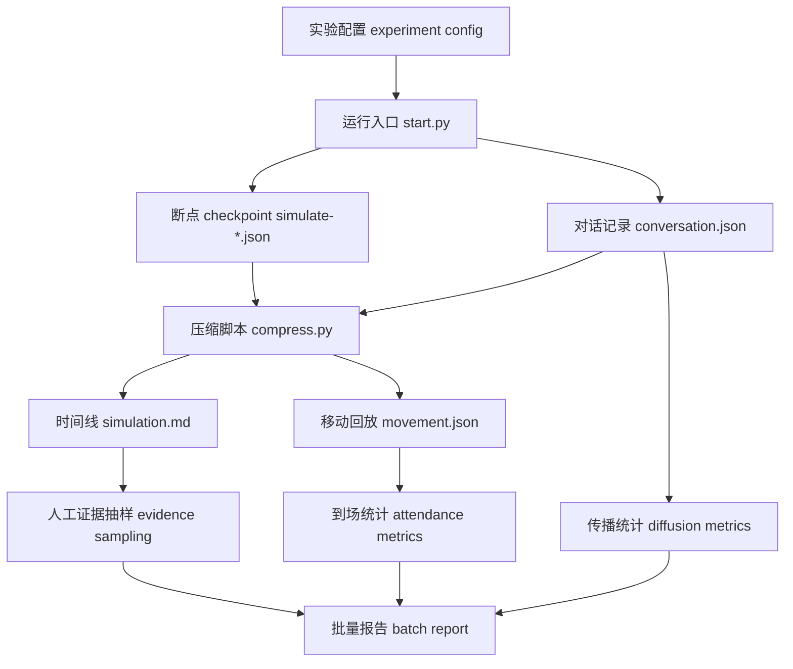

# 第 36 章 社会仿真升级：从小镇 Smallville 到更大规模实验

## 36.1 一次派对故事还不是社会仿真

`book-party-extended` 的结果里，伊莎贝拉在 10:00 左右邀请玛丽亚参加下午五点的情人节派对，后续 `simulation.md` 能看到布置、开幕、到场和派对结束后的回顾。这个故事已经很像小镇 Smallville：消息扩散、角色相遇、行动在地图上发生。但社会仿真 social simulation 不能只靠一次好看的回放。

严谨问题是：同样的派对配置再跑五次，玛丽亚还会知道吗？克劳斯还会到咖啡馆吗？传播深度 diffusion depth 是稳定现象，还是某次运行的偶然？失败来自对话 conversation、日程 schedule、移动 movement、检索 retrieval，还是模型输出本身？

| 层级 | 单次小镇故事 town story | 社会仿真实验 social simulation |
| --- | --- | --- |
| 证据形态 | 一份 `simulation.md` 讲得通。 | 多个运行 run 的 `conversation.json`、`movement.json`、断点 checkpoint 和指标 metrics 可比较。 |
| 结论语气 | “这次派对传播成功。” | “在当前配置下，5 次运行中有 3 次形成二跳传播，均值和失败样例如下。” |
| 失败处理 | 失败片段可能被故事叙事掩盖。 | 失败样例 failure sample 必须进入报告 report。 |
| 可复查性 | 证据需要人工逐项翻文件。 | 每个指标都带证据路径 evidence path。 |
| 边界 | 容易误写成现实社会预测。 | 结论限定在虚构角色、简化地图和当前模型配置内。 |



*图 36-1：从单次回放 replay 到批量社会仿真 social simulation 的数据流。关键变化不是多画几张图，而是把每次运行保存成独立证据包，再用统一指标比较。*


*图 36-2：从单次故事到批量社会仿真实验台。墙上的多个小镇窗口代表多次运行 runs，桌面上的断点 checkpoint、对话记录 conversation、时间线 simulation、移动回放 movement、传播图和方差曲线代表批量分析 batch analysis。社会仿真不是挑一段好故事，而是比较多次运行中的稳定现象、失败样例和不确定性。*

## 36.2 当前项目已经有证据包

GenerativeAgentsCN 的运行输出已经足够支撑第一版社会仿真实验。缺的不是原始材料，而是批量运行和指标脚本。

| 证据文件 | 生成位置 | 数据结构 | 能回答的问题 |
| --- | --- | --- | --- |
| 运行日志 log | `generative_agents/results/checkpoints/<name>/<name>.log` | 文本日志、模型调用摘要、错误信息。 | 运行是否稳定，是否出现限流、JSON 解析失败或模型异常。 |
| 断点 checkpoint | `generative_agents/results/checkpoints/<name>/simulate-*.json` | 每一步的 `time`、`step`、`agents`、坐标、行动、日程、记忆摘要。 | 某一刻角色在哪里、做什么、计划是什么。 |
| 对话记录 conversation | `generative_agents/results/checkpoints/<name>/conversation.json` | 时间键下的“说话者 -> 听话者 @ 地点”和多轮原话。 | 谁把信息告诉了谁，事实是否保真。 |
| 时间线 simulation | `generative_agents/results/compressed/<name>/simulation.md` | 基础人设、活动记录、对话记录的 Markdown 汇编。 | 人工快速定位证据片段。 |
| 移动回放 movement | `generative_agents/results/compressed/<name>/movement.json` | `start_datetime`、`stride`、`persona_init_pos`、`all_movement`。 | 角色是否到达地点、聚集持续多久。 |

`book-party-extended` 给出一个真实规模样例：`movement.json` 的开始时间是 `2024-02-14T08:00:00`，步长 stride 是 10 分钟，初始角色数是 10，回放键约 5043 个。这个文件适合计算到场 attendance 和轨迹 movement，不适合直接解释“为什么角色要去那里”。原因需要回到断点 checkpoint、时间线 simulation 和对话记录 conversation。

## 36.3 `start.py` 的运行闭环

运行入口在 `generative_agents/start.py`。它不是只启动一个 demo，而是在每一步保存可复查状态。

| 阶段 | 输入 input | 处理 process | 输出 output |
| --- | --- | --- | --- |
| 配置生成 | `--start`、`--stride`、`--agents` 或 `--agent-count`、`data/config.json`、角色 `agent.json` | `get_config()` 生成 `maze`、`agent_base`、角色配置路径和起始时间。 | 仿真配置 `sim_config`。 |
| 游戏创建 | `sim_config`、静态资源 `frontend/static`、历史 `conversation.json` | `create_game()` 初始化世界地图 Maze 和智能体 Agent。 | `Game` 对象、角色存储目录 `storage/<agent>`。 |
| 单步运行 | 当前 `agent_status`、所有智能体 `agents` | `Game.agent_think()` 逐个角色思考并更新行动、日程和坐标。 | 新的角色状态、日志 summary。 |
| 持久化 | 当前时间 `sim_time`、配置、对话记录 | 写出 `simulate-<time>.json` 和 `conversation.json`。 | 可断点恢复 checkpoint 与对话 evidence。 |

可运行入口如下，工作目录必须是 `generative_agents`：

```bash
cd generative_agents
python start.py --name book-party-extended --start 20240214-08:00 --step 84 --stride 10 --agents "伊莎贝拉,阿伊莎,埃迪,亚当,玛丽亚,克劳斯,山姆,约翰,拉托亚,乔治" --verbose info --log book-party-extended.log
```

如果只是复查已有结果，不要覆盖旧目录；当前 `start.py` 在非 `--resume` 模式下会拒绝使用已存在的实验名，这正好保护批量实验的独立 run。

## 36.4 `compress.py` 的证据生产闭环

压缩入口在 `generative_agents/compress.py`。它把低层断点 checkpoint 变成两个可读输出：`simulation.md` 和 `movement.json`。

| 函数 | 输入 input | 处理 process | 输出 output |
| --- | --- | --- | --- |
| `generate_report()` | `results/checkpoints/<name>/simulate-*.json`、`conversation.json`、角色静态 `agent.json` | 提取基础人设、行动变化和对话原文。 | `results/compressed/<name>/simulation.md`。 |
| `generate_movement()` | 断点 checkpoint、`conversation.json`、`frontend/static/assets/village/maze.json` | 用世界地图 Maze 计算路径 path；把每步拆成 60 帧；把对话标到对应时间。 | `results/compressed/<name>/movement.json`。 |
| `get_stride()` | 最后一个断点 JSON | 读取 `stride`。 | 回放帧与时间的对应关系。 |

压缩命令同样在 `generative_agents` 目录运行：

```bash
python compress.py --name book-party-extended
```

这条命令的失败模式很清楚：如果 `results/checkpoints/<name>/` 不存在，脚本会要求重新输入实验名；如果地图 Maze 或角色静态文件缺失，`movement.json` 无法生成完整路径；如果 `conversation.json` 缺失，回放仍可生成，但传播统计 diffusion metrics 会失去强证据。

## 36.5 对话和移动文件怎么读

`conversation.json` 是传播统计 information diffusion 的主证据。它的键是时间，值是对话列表，每条对话把说话关系和地点放在同一个字符串里。

```json
{
  "20240214-10:00": [
    {
      "伊莎贝拉 -> 玛丽亚 @ the Ville，霍布斯咖啡馆，咖啡馆，咖啡馆柜台后面": [
        ["伊莎贝拉", "下午五点的情人节派对你一定要来哦"],
        ["玛丽亚", "五点刚好有休息时间，肯定会去参加的"]
      ]
    }
  ]
}
```

`movement.json` 是行动落地 action grounding 的主证据。它不能证明某人“知道”派对，但能证明某人在某个时间窗口是否出现在霍布斯咖啡馆。

```json
{
  "start_datetime": "2024-02-14T08:00:00",
  "stride": 10,
  "persona_init_pos": {
    "伊莎贝拉": [72, 14],
    "阿伊莎": [118, 61],
    "埃迪": [93, 74]
  },
  "all_movement": {
    "0": {
      "伊莎贝拉": {
        "location": "霍布斯咖啡馆，咖啡馆，咖啡馆柜台后面",
        "movement": [72, 14],
        "description": "正在睡觉"
      }
    }
  }
}
```

| 判断 | 首选证据 | 辅助证据 | 常见误判 |
| --- | --- | --- | --- |
| 谁听说了事件 | `conversation.json` | `simulation.md` 摘要 | 只命中“情人节”不能算知道派对。 |
| 谁承诺参加 | `conversation.json` 原话 | 断点 checkpoint 的日程 | 礼貌回应不等于承诺。 |
| 谁真的到场 | `movement.json` | `simulation.md` 活动记录 | 到达咖啡馆不等于参加派对。 |
| 谁推动任务 | 任务 JSON、对话证据、行动证据 | 断点 checkpoint | 任务完成不能只看角色自述。 |

## 36.6 前沿方法落回项目

| 前沿方向 | 对社会仿真 social simulation 的启发 | 在当前项目中的落点 |
| --- | --- | --- |
| Concordia / 生成式智能体建模 Generative Agent-Based Modeling | 环境不是背景，行动要被物理、数字或社会空间约束。 | 世界地图 Maze、地图格子 Tile、地址 address、对象状态和移动路径 path。 |
| 平台 AgentSociety | 大语言模型驱动的生成式智能体 LLM-driven generative agents 在规模变大后会遇到画像、调度、成本、指标和可视化问题。 | 先做小规模批量运行 batch run、统一指标 metrics、失败报告 report，再考虑增加角色数量。 |
| 小镇 Smallville / 生成式智能体 Generative Agents | 单次回放能展示涌现，但研究结论要靠可重复实验。 | 把 `book-party-extended` 这类结果转成可比较的数据包。 |

当前项目不需要马上追求万人级仿真。更现实的路线是让 5 到 10 个角色、3 到 10 次 run 的小规模实验可复查、可统计、可比较。

## 36.7 升级一：实验配置 experiment config

命令行参数适合手动运行，不适合批量实验。社会仿真需要把实验条件固化为文件。

建议路径：

```text
generative_agents/experiments/party_small.json
```

建议结构：

```json
{
  "name": "party_small",
  "description": "情人节派对传播小规模实验",
  "start": "20240214-08:00",
  "step": 84,
  "stride": 10,
  "agents": ["伊莎贝拉", "玛丽亚", "埃迪", "克劳斯", "山姆"],
  "event": {
    "event_id": "valentine_party",
    "time": "17:00",
    "location_keywords": ["霍布斯咖啡馆", "咖啡馆"],
    "keywords": ["情人节", "派对", "下午五点", "五点", "17:00"]
  },
  "metrics": ["diffusion", "attendance", "variance"]
}
```

| 闭环 | 内容 |
| --- | --- |
| 输入 input | 实验名、起始时间、角色列表、事件关键事实、指标列表。 |
| 处理 process | 批量脚本读取配置，生成多个运行名 run name，调用 `start.py` 和 `compress.py`。 |
| 输出 output | 每个运行 run 的 checkpoint、conversation、simulation、movement、log，以及批量报告。 |
| 失败模式 failure mode | 配置与命令不一致；角色名不存在；事件关键词过宽；旧结果被覆盖。 |
| 验证方式 verification | 批量报告首页打印完整配置摘要，并检查每个 run 目录是否独立存在。 |

## 36.8 升级二：批量运行 batch runs

批量实验需要真实运行结果；这里给出工程接口，报告由脚本从运行 run 目录读取。

```text
generative_agents/tools/run_experiment_batch.py
```

| 阶段 | 输入 input | 处理 process | 输出 output |
| --- | --- | --- | --- |
| 读取配置 | `experiments/party_small.json` | 校验字段、角色名、事件关键词。 | 标准化实验对象。 |
| 生成运行 run | `name`、重复次数 `repeat` | 生成 `party_small_run_01` 等唯一名称。 | 运行 run 列表。 |
| 运行仿真 | 运行 run 名、`start.py` 参数 | 顺序执行或排队执行，记录退出码。 | `results/checkpoints/<run>/`。 |
| 压缩结果 | 运行 run 名 | 调用 `compress.py --name <run>`。 | `results/compressed/<run>/`。 |
| 指标分析 | conversation、movement、simulation | 调用传播和到场指标脚本。 | `metrics.json`、`report.md`。 |

批量运行的最低要求是：失败运行 failed run 也要保留目录和错误原因。否则报告会只剩成功样本，社会仿真就变成选择性展示 cherry-picking。

## 36.9 升级三：传播统计 diffusion metrics

传播统计 information diffusion 以 `conversation.json` 为主，以 `simulation.md` 为人工核验入口。

| 层级 | 判断标准 | 自动化程度 | 证据 |
| --- | --- | --- | --- |
| 关键词命中 keyword hit | 句子包含“情人节”“派对”“五点”等目标词。 | 可自动。 | `conversation.json` 原话。 |
| 事件事实命中 fact hit | 同时提到时间、地点、发起者或活动目标。 | 半自动。 | 原话加事件配置。 |
| 传播关系成立 diffusion edge | A 在对话中告诉 B，B 原先不在 `known_by`。 | 半自动。 | 说话者、听话者、时间顺序。 |
| 后续再传播 retransmission | B 后续主动告诉 C。 | 可自动生成候选，需抽样核验。 | 多段对话链。 |
| 行动影响 action impact | B 改变日程或到场。 | 需结合 movement 和 checkpoint。 | `movement.json`、断点 checkpoint。 |

**公式 36-1：知情覆盖率 informed_agent_rate**

$$
\text{知情覆盖率} =
\frac{\text{达到事件事实命中 fact hit 的角色数}}{\text{实验角色总数}}
$$

读法：如果 5 个实验角色里有 3 个角色在对话中明确知道“情人节派对在五点的霍布斯咖啡馆”，知情覆盖率为 \(3/5 = 0.60\)。只说“情人节快乐”不计入分子。

**公式 36-2：传播深度 diffusion_depth**

$$
\text{传播深度} =
\max(\text{从源角色 source agent 到任一知情角色的有向边数})
$$

读法：伊莎贝拉直接告诉玛丽亚是深度 1；玛丽亚再告诉克劳斯，克劳斯的深度是 2。没有上游证据的“知道”只能标为疑似幻觉知情 hallucinated awareness。

## 36.10 升级四：到场和轨迹统计 attendance metrics

到场统计 attendance 以 `movement.json` 为主。它只回答位置问题，不替代传播判断。

| 指标 metric | 输入字段 | 处理方式 | 输出含义 |
| --- | --- | --- | --- |
| 到场人数 attendance_count | `all_movement[*][agent].location` | 在目标时间窗口内匹配地点关键词。 | 有多少角色出现在目标地点。 |
| 到达时间 arrival_time | 帧号、`start_datetime`、`sec_per_step` | 找到首次进入地点窗口的帧。 | 谁何时到场。 |
| 共处时长 co_location_duration | 同一地点的连续帧 | 统计多个角色同时在场的时间。 | 聚集是否持续。 |
| 峰值聚集人数 peak_gathering_size | 每帧地点人数 | 取最大值。 | 最热闹时有多少人。 |
| 路线异常 route_anomaly | 坐标 path、地点变化 | 查找绕远、停滞、来回震荡。 | 行动失败是否来自 movement。 |

**公式 36-3：到场率 attendance_rate**

$$
\text{到场率} =
\frac{\text{目标时间窗口内到达目标地点的角色数}}{\text{被邀请或实验关注的角色数}}
$$

读法：如果 4 个被邀请角色里有 2 个在 17:00 到 19:00 出现在霍布斯咖啡馆，到场率为 \(2/4 = 0.50\)。这个数不能说明他们是否知道活动原因，需要和传播统计一起读。

## 36.11 升级五：多次运行方差 variance

生成式系统 generative system 有随机性。社会仿真报告必须展示方差 variance，而不是挑最好的一次 run。

| 运行 run | 知情角色数 unique_informed_agents | 二跳传播 indirect_mentions | 到场人数 attendance_count | 失败摘要 failure |
| --- | ---: | ---: | ---: | --- |
| `party_small_run_01` | 3 | 1 | 2 | 玛丽亚知道但未到场。 |
| `party_small_run_02` | 2 | 0 | 1 | 传播停在伊莎贝拉。 |
| `party_small_run_03` | 4 | 2 | 3 | 派对传播和到场都较强。 |

上表属于报告格式示例。真实报告必须由脚本从运行 run 目录读取。

**公式 36-4：多次运行方差 run_variance**

$$
\text{方差} =
\frac{1}{n}\sum_{i=1}^{n}(x_i-\bar{x})^2
$$

读法：\(x_i\) 是第 \(i\) 次运行的指标值，例如到场人数 attendance_count；\(\bar{x}\) 是多次运行均值。方差高时，正文要解释失败条件，不能只写“系统能够传播信息”。

## 36.12 升级六：对照实验 controlled experiment

对照实验 controlled experiment 一次只改一个主要变量，否则无法归因。

| 对照变量 variable | 保持不变 | 观察指标 | 可能解释 |
| --- | --- | --- | --- |
| 模型 provider 或 model | 角色、地图、事件、步长、prompt | 传播深度、JSON 失败率、成本。 | 模型能力或稳定性影响结果。 |
| 角色数量 agent count | 事件、关键词、起始时间 | 到场率、传播覆盖率、运行成本。 | 人数变多是否提升传播或增加噪声。 |
| 关系记忆 relation memory | 模型、地图、事件 | 对话自然性、邀请接受率。 | 关系背景是否影响承诺。 |
| 目标规划 active goal | 角色、模型、事件 | 任务完成率、自然性。 | 显式目标是否提升行动落地。 |
| 协作事件板 event board | 角色、模型、事件 | 任务状态一致率、冲突记录。 | 公共状态是否提高可审计性。 |

报告必须写清楚“改了什么”和“没改什么”。如果同时换模型、加角色、改 prompt、改地图，指标变化就失去解释力。

## 36.13 升级七：事件级数据集 event dataset

把社会仿真做成可复用实验，需要事件级数据集 event dataset。每个事件定义目标事实、关键词、成功标准和边界。

建议路径：

```text
generative_agents/experiments/events/valentine_party.json
generative_agents/experiments/events/mayor_election.json
generative_agents/experiments/events/community_discussion.json
```

建议结构：

```json
{
  "event_id": "valentine_party",
  "source_agent": "伊莎贝拉",
  "time": "2024-02-14 17:00",
  "location": "霍布斯咖啡馆",
  "core_facts": ["发起者", "时间", "地点"],
  "keywords": ["情人节", "派对", "霍布斯咖啡馆", "下午五点"],
  "success_criteria": [
    "至少三名角色达到事件事实命中",
    "至少两名角色在 17:00-19:00 到达霍布斯咖啡馆"
  ],
  "negative_examples": [
    "只说情人节快乐不算知道派对",
    "路过咖啡馆不算参加派对"
  ]
}
```

| 闭环 | 内容 |
| --- | --- |
| 输入 input | 事件事实、关键词、成功标准、反例。 |
| 处理 process | 指标脚本读取事件定义，统一判断传播和到场。 |
| 输出 output | 每个 run 的事件指标、失败样例、证据路径。 |
| 失败模式 failure mode | 关键词过宽导致误命中；成功标准太主观；不同实验使用不同口径。 |
| 验证方式 verification | 抽样核对命中句，检查正例和反例是否被正确分类。 |

## 36.14 升级八：自动报告 report generation

自动报告 report generation 负责减少遗漏，不负责替代判断。建议输出两个文件：

```text
generative_agents/results/reports/<experiment_name>/metrics.json
generative_agents/results/reports/<experiment_name>/report.md
```

| 报告区块 | 内容 | 证据来源 |
| --- | --- | --- |
| 实验配置 | 起始时间、角色、模型、步长、重复次数、事件定义。 | `experiment config`、运行命令。 |
| 运行质量 | 成功运行 successful run、失败运行 failed run、日志错误、压缩是否完成。 | log、目录检查。 |
| 传播指标 | 知情覆盖率、传播深度、事实保真。 | `conversation.json`。 |
| 到场指标 | 到场率、到达时间、共处时长。 | `movement.json`。 |
| 方差摘要 | 均值、最小值、最大值、方差。 | 多个 `metrics.json`。 |
| 失败样例 | 原话、位置、断点、失败解释。 | `simulation.md`、conversation、movement、checkpoint。 |

报告里的每个结论都要有证据路径。没有路径的结论只能写成观察假设 hypothesis，不能写成实验结论 conclusion。

## 36.15 与现实社会的边界

社会仿真 social simulation 越像真实社会，越要写清边界。

| 安全写法 | 不安全写法 | 原因 |
| --- | --- | --- |
| “在当前配置下，派对消息在 5 个角色中形成了二跳传播。” | “现实社区活动会这样传播。” | 角色、环境和制度都是虚构且简化的。 |
| “更强模型提高了 JSON 稳定性和对话保真度。” | “更强模型让社会行为更真实。” | 指标只能证明被测维度。 |
| “到场率下降可能来自日程冲突。” | “居民对派对兴趣下降。” | 没有真实偏好调查。 |
| “该结果适合比较系统机制。” | “该结果可预测现实人群。” | 小镇仿真不是现实社会调查。 |

当前项目的价值在于机制研究 mechanism study、系统测试 system testing 和可复查比较 reproducible comparison。它不能替代现实调查，也不能替代社会科学中的实证样本。

## 36.16 最小可行升级路线

在不改核心仿真循环的前提下，先补三类脚本最稳妥。

| 脚本 | 输入 input | 处理 process | 输出 output |
| --- | --- | --- | --- |
| `tools/analyze_conversation_keywords.py` | `conversation.json`、事件数据集 event dataset | 提取关键词、事实命中、传播边。 | `diffusion_metrics.json`、传播证据表。 |
| `tools/analyze_location_window.py` | `movement.json`、地点关键词、时间窗口 | 统计到场、到达时间、共处时长。 | `attendance_metrics.json`。 |
| `tools/summarize_experiment_runs.py` | 多个运行 run 的指标 JSON | 计算均值、范围、方差、失败样例。 | `metrics.json`、`report.md`。 |

这些脚本可以先完全避免 LLM/API 调用，只读本地 JSON 和 Markdown。这样做的好处是边界清楚、成本为零、失败容易定位。等统计链路稳定后，再考虑引入大语言模型 LLM 辅助人工报告摘要。

## 36.17 本章小结

社会仿真升级 social simulation upgrade 要把“小镇故事”变成“可重复、可统计、可比较的实验”。当前项目已经有关键原料：`start.py` 保存断点 checkpoint 和对话记录 conversation，`compress.py` 生成时间线 simulation 与移动回放 movement，现有 `book-party-extended` 等结果可以作为证据样例。下一步不是盲目扩大角色数量，而是补实验配置 experiment config、批量运行 batch runs、传播统计 diffusion metrics、到场统计 attendance metrics、方差分析 variance、对照实验 controlled experiment、事件数据集 event dataset 和自动报告 report。

社会仿真结论的可信性至少取决于四件事：有没有多次运行 run，指标是否能回查原始证据，失败样例有没有进入报告，结论是否限定在当前配置内。下一章进入评价体系 evaluation，把这些统计结果进一步整理成可审计的指标文件和人工报告。

## 参考资料

- 生成式智能体 Generative Agents: https://arxiv.org/abs/2304.03442
- 环境 Concordia / 生成式智能体建模 Generative Agent-Based Modeling: https://arxiv.org/abs/2312.03664
- 平台 AgentSociety: https://arxiv.org/abs/2502.08691
- Local source: `generative_agents/start.py`
- Local source: `generative_agents/compress.py`
- Local source: `generative_agents/replay.py`
- Local source: `generative_agents/modules/game.py`
- Local output: `generative_agents/results/checkpoints/<实验名>/conversation.json`
- Local output: `generative_agents/results/checkpoints/<实验名>/simulate-*.json`
- Local output: `generative_agents/results/compressed/<实验名>/simulation.md`
- Local output: `generative_agents/results/compressed/<实验名>/movement.json`
- Local evidence figure scaffold: `docs/book/scaffolds/part_04_05/ch24_38_evidence_figures.py`
