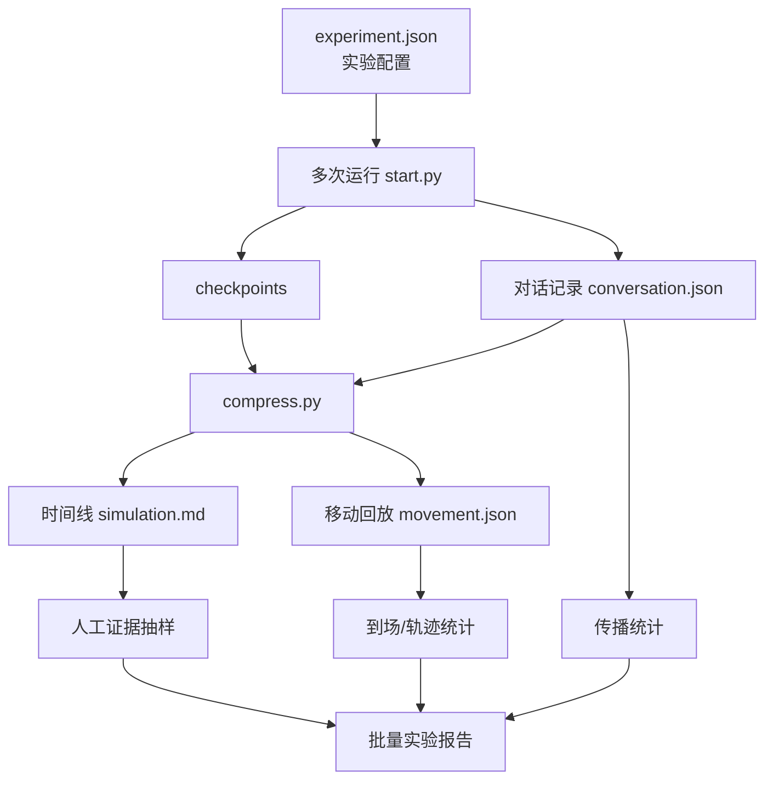
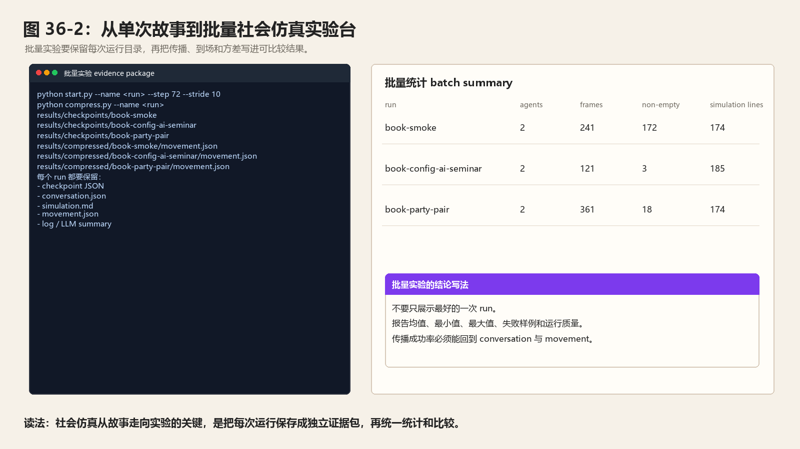
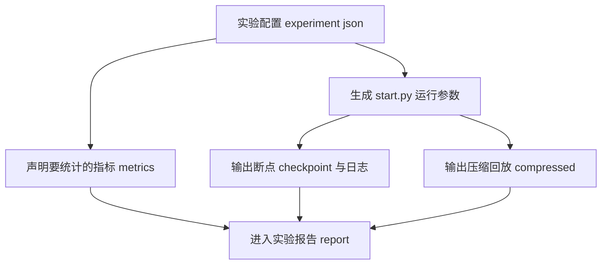
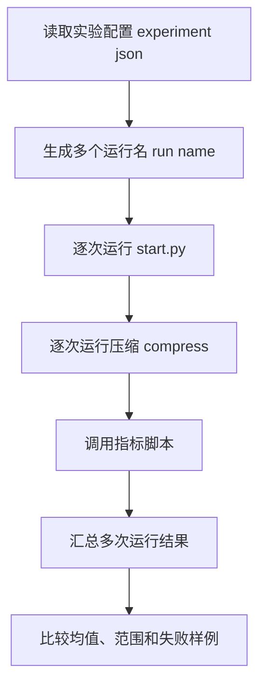
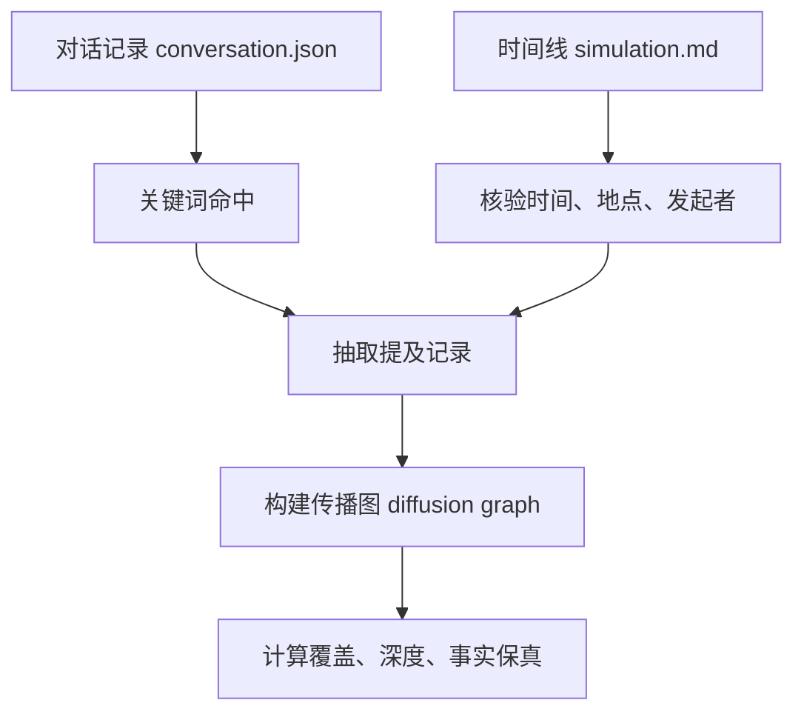
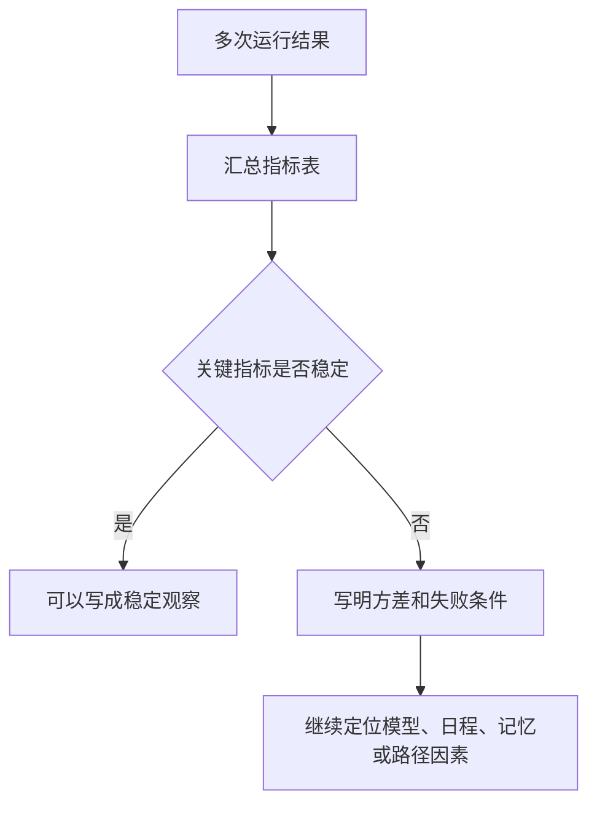

# 第 36 章 社会仿真升级：从 Smallville 到更大规模实验

## 36.1 核心问题

生成式智能体 Generative Agents 最吸引人的地方，是 Smallville 中出现的社会现象：

- 信息扩散。
- 关系形成。
- 群体协同行动。

生成式智能体 Generative Agents 也能复现这些现象。但如果只停留在一次回放故事，就还不是严谨的社会仿真。社会仿真需要进一步回答：

```text
这个现象是否可重复？
传播路径能否统计？
不同模型或参数下结果如何变化？
群体行为能否量化？
失败是否有模式？
```

本章重点聚焦以下六个问题：

1. Smallville 式小镇实验和社会仿真有什么区别？
2. 生成式智能体 Generative Agents 当前已经有哪些可用于统计的材料？
3. Concordia / 生成式智能体建模 Generative Agent-Based Modeling 和 AgentSociety 给我们什么启发？
4. 如何把单次实验升级成批量实验？
5. 如何统计信息传播、群体聚集和多次运行方差？
6. 如何避免把小镇仿真误当现实预测？



*图 36-1：从单次回放到批量社会仿真的数据流。社会仿真升级要把一次故事变成多次运行、可统计、可比较的实验结果。*



*图 36-2：从单次故事到批量社会仿真实验台。图片读取本地已有 `book-smoke`、`book-config-ai-seminar` 和 `book-party-pair` 结果目录，展示每次运行 run 如何形成独立证据包，再汇总成批量统计 batch 摘要 summary。*

## 36.2 小镇故事不等于社会仿真

一个小镇故事可以很精彩。例如：

```text
伊莎贝拉告诉玛丽亚派对消息，玛丽亚又告诉克劳斯，最后几个人出现在咖啡馆。
```

这说明系统能生成一个传播案例。但社会仿真还要问：

```text
这种传播在多少次运行中出现？
传播平均深度是多少？
哪些角色总是成为传播节点？
模型变化是否影响传播？
参数变化是否影响到场？
失败是否主要来自路线错开、检索失败，还是计划没有修订？
```

社会仿真需要从个案叙事走向统计分析。本书不要求读者一步到位做大规模平台。但可以把生成式智能体 Generative Agents 从：

```text
可回放的小镇 demo
```

可以升级为下面方案：

```text
可重复的小规模社会实验环境
```

## 36.3 当前项目已有的数据基础

生成式智能体 Generative Agents 已经保存了很多可分析材料。断点 checkpoint 位于：

```text
generative_agents/results/checkpoints/<实验名>/
```

其中保存每一步仿真状态。对话记录：

```text
conversation.json
```

压缩结果可以查看，可以这样处理：

```text
generative_agents/results/compressed/<实验名>/
```

压缩结果里主要查看这两个文件：

```text
simulation.md
movement.json
```

`simulation.md` 适合人工阅读。它包含基础人设、活动时间线和对话。`conversation.json` 适合分析信息传播。它适合回答：

- 哪个时间。
- 哪些角色。
- 在哪里。
- 说了什么。

`movement.json` 适合分析位置和聚集。它适合回答：

- 每个 frame 角色的位置。
- 当前地点。
- 当前行动。
- 对话文本。

这些材料已经足以做第一版统计分析，但前提是先知道每个文件长什么样。以 `book-party-pair` 为例，压缩后的 `movement.json` 有 363 帧，`persona_init_pos` 只有两个角色：

```json
{
  "start_datetime": "2024-02-14T08:00:00",
  "stride": 10,
  "persona_init_pos": {
    "伊莎贝拉": [72, 14],
    "阿伊莎": [118, 61]
  }
}
```

这份文件适合做位置统计。比如第 1 帧里，伊莎贝拉的目标地点是“霍布斯咖啡馆，咖啡馆，咖啡馆柜台后面”，行动是“前往 霍布斯咖啡馆，咖啡馆，咖啡馆柜台后面”；阿伊莎的目标地点是“奥克山学院宿舍，阿伊莎的房间，书桌”。这类数据可以统计“谁在什么时间窗进入某个地点”，但不能直接解释“为什么要去”。原因要回到断点 checkpoint 和 `simulation.md`。

同一轮实验的 `simulation.md` 给出人类可读版本：

```text
# 20240214-08:00
### 伊莎贝拉
位置：the Ville，霍布斯咖啡馆，咖啡馆，咖啡馆柜台后面
活动：打开咖啡馆大门并开灯

### 阿伊莎
位置：the Ville，奥克山学院宿舍，阿伊莎的房间，书桌
活动：在家阅读莎士比亚相关文献，研读《哈姆雷特》中的独白段落
```

这份文件适合人工抽样和标注。社会仿真报告中可以把 `movement.json` 用作统计底表，把 `simulation.md` 用作证据摘录，把 `conversation.json` 用作传播路径核验。

## 36.4 `compress.py` 的作用

项目中的对应位置是：

```text
generative_agents/compress.py
```

做了两件事。第一，生成 Markdown 报告：

```text
simulation.md
```

第二，生成回放数据：

```text
movement.json
```

`generate_movement()` 会读取断点 checkpoint，结合世界地图 Maze 路径，把智能体 agent 在每一步的位置转成回放帧。`generate_report()` 会读取角色状态和对话记录 conversation，生成可读时间线。这说明当前项目已经具备社会仿真的关键材料：

```text
行动轨迹 + 对话记录 + 角色状态
```

缺少的是批量实验和指标统计。

## 36.5 Concordia 的启发

Concordia / 生成式智能体建模 Generative Agent-Based Modeling 方向强调：

```text
用 LLM 构建 grounded agent-based models，让行动发生在物理、数字或社会空间中，并由环境解释和约束。
```

对生成式智能体 Generative Agents 来说，最重要的启发有三点。第一，环境不是背景。世界地图 Maze、地图格子 Tile、地址树和对象状态应该参与判断行动是否可行。第二，社会仿真不是单个智能体 agent 的问答集合。它需要环境、角色、行动、互动和记录共同构成。第三，实验要可重复和可解释。每次运行必须清楚：

- 初始条件是什么。
- 角色如何设定。
- 环境如何约束。
- 行动如何记录。
- 指标如何计算。

生成式智能体 Generative Agents 已经有地图和回放。下一步是把实验配置和指标系统补上。

## 36.6 AgentSociety 的启发

AgentSociety 关注更大规模大语言模型驱动的生成式智能体 LLM-driven generative agents，用于理解人类行为和社会现象。它提醒我们：

```text
当智能体 agent 数量变多时，问题不只是提示词 prompt，而是系统工程。
```

大规模社会仿真需要：

- 智能体画像 agent profile 管理。
- 环境建模。
- 交互机制。
- 运行调度。
- 指标统计。
- 可视化。
- 成本控制。

生成式智能体 Generative Agents 不需要直接追求大规模。但它可以吸收实验方法。尤其是：

```text
把小规模实验做成可重复、可比较、可统计。
```

这比盲目增加智能体 agent 数量更重要。

## 36.7 升级方向一：实验配置文件

当前运行命令通常写成：

```bash
python start.py --name sim-test --start "20250213-09:30" --step 10 --stride 10 --verbose info --log sim-test.log
```

这条命令跑完以后，控制台只是第一层证据。真正进入社会仿真分析时，要把它沉淀成四类材料：`sim-test.log` 记录模型调用与错误，断点 checkpoint JSON 记录每一步完整状态，`conversation.json` 记录传播，compressed 目录记录回放和时间线。如果某次运行遇到服务端限速、JSON 解析失败或大量 failsafe，实验报告要先记录运行质量，再讨论社会行为。

如果要做社会仿真，建议把实验条件写入配置文件。例如：

```text
experiments/party_small.json
```

可以直接参考下面内容：

```json
{
  "name": "party_small",
  "description": "情人节派对传播小规模实验",
  "start": "20240214-08:00",
  "step": 72,
  "stride": 10,
  "agents": ["伊莎贝拉", "亚当", "阿伊莎", "埃迪", "玛丽亚", "克劳斯"],
  "event_keywords": ["情人节", "派对", "霍布斯咖啡馆"],
  "metrics": ["diffusion", "attendance", "conversation"]
}
```

实验配置有三个好处。第一，减少命令行记录错误。第二，方便批量运行。第三，让实验条件进入版本管理。

实验配置逻辑图：



## 36.8 升级方向二：批量运行

单次运行不能支撑强结论。可以新增脚本：

```text
tools/run_experiment_batch.py
```

对应功能可以概括为：

```text
读取 experiment json
生成多个 run name
依次运行 start.py
运行 compress.py
调用指标脚本
汇总结果
```

运行结果示例可以这样写：

```text
party_small_run_01
party_small_run_02
party_small_run_03
party_small_run_04
party_small_run_05
```

每次运行都保留独立目录。不要覆盖旧结果。批量运行之后，才能说：

```text
在 5 次运行中，3 次出现间接传播，2 次没有出现。
```

这比单次成功更有价值。

批量运行逻辑图：



## 36.9 升级方向三：传播统计

传播统计主要基于下面材料：

```text
conversation.json
simulation.md
```

第一步是定义事件关键词。例如派对：

```text
情人节
派对
聚会
霍布斯咖啡馆
下午5点
17:00
```

第二步是抽取提及。记录：

- 时间。
- 说话者。
- 听话者。
- 地点。
- 命中关键词。
- 句子内容。

第三步是构建传播图。例如：

```text
伊莎贝拉 -> 玛丽亚
玛丽亚 -> 克劳斯
```

第四步是计算下面指标：

```text
unique_informed_agents
direct_mentions
indirect_mentions
diffusion_depth
fact_preservation_score
```

这能把“好像传播了”变成可检查数据。

传播统计逻辑图：



## 36.10 传播统计的注意事项

关键词统计不等于真正传播。例如角色说：

```text
我喜欢情人节。
```

不一定说明它知道派对。因此需要分层判断。第一层，关键词命中。第二层，事件事实命中。例如时间、地点、发起者。第三层，对话关系成立。说话者和听话者是否在同一段对话中。第四层，后续引用。听话者是否在后续主动提及。第五层，行动影响。听话者是否改变计划或到场。自动脚本可以先做前两层。后面几层可以人工抽样。不要把关键词命中直接等同于认知传播。

## 36.11 升级方向四：群体轨迹统计

群体轨迹统计主要基于：

```text
movement.json
```

可以统计下面数据，可以这样处理：

```text
某时间窗内某地点人数
```

例如，派对实验可以这样记录：

```text
17:00-19:00，霍布斯咖啡馆内有哪些角色？
```

需要记录的指标如下：

```text
attendance_count
```

该指标记录最终到场人数。

```text
arrival_time_distribution
```

该指标记录到达时间分布。

```text
co_location_duration
```

该指标记录多人共处时长。

```text
peak_gathering_size
```

该指标记录聚集峰值人数。

```text
route_efficiency
```

路线是否绕远或异常。这些指标能评价行动落地。如果角色口头接受派对，但移动回放 movement 没有到咖啡馆，说明传播没有转化为行动。

## 36.12 升级方向五：多次运行方差

生成式系统有随机性。所以社会仿真必须关注方差。例如 5 次派对实验：

| run | direct mentions | indirect mentions | attendance | diffusion depth |
| --- | --- | --- | --- | --- |
| 01 | 2 | 1 | 2 | 2 |
| 02 | 1 | 0 | 1 | 1 |
| 03 | 3 | 2 | 3 | 3 |
| 04 | 2 | 0 | 1 | 1 |
| 05 | 2 | 1 | 2 | 2 |

这张表能够说明下面问题：

```text
派对传播在多数运行中出现，但间接传播不稳定。
```

如果只展示 run 03，读者会以为系统很强。如果只展示 run 02，读者会以为系统很弱。多次运行能避免选择性展示。

方差判断逻辑图：



## 36.13 升级方向六：实验对照

社会仿真需要对照组。例如派对实验可以比较：

```text
默认模型
更强模型
本地小模型
关系记忆升级版
目标规划升级版
协作事件板升级版
```

也可以做下面模块对照：

```text
有反思 reflection
弱反思 reflection
无 relationship memory
有 relationship memory
```

每次对照只改一个主要变量。否则无法归因。实验报告要写明：

- 改了什么。
- 没改什么。
- 预期影响什么指标。
- 实际指标如何变化。

这能把项目升级和社会仿真连接起来。

## 36.14 升级方向七：事件级数据集

为了让实验可复用，可以建立事件级数据集。例如：

```text
experiments/events/valentine_party.json
experiments/events/mayor_election.json
experiments/events/sociology_discussion.json
```

每个事件主要包含，需要逐项查看：

```json
{
  "event_id": "valentine_party",
  "source_agent": "伊莎贝拉",
  "time": "2024-02-14 17:00",
  "location": "霍布斯咖啡馆",
  "core_facts": ["发起者", "时间", "地点"],
  "keywords": ["情人节", "派对", "霍布斯咖啡馆"],
  "success_criteria": [
    "至少三人知道事件",
    "至少两人到场"
  ]
}
```

这样不同读者可以在同一事件定义下比较结果。这也是从 demo 走向 benchmark 的第一步。

## 36.15 升级方向八：仿真报告自动生成

批量实验后，需要自动生成报告。报告包括：

```markdown
# 实验批次报告

- 实验名：
- 模型：
- agent 数量：
- 运行次数：
- 主要变量：

## 指标汇总

| run | diffusion_depth | attendance_count | failures |
| --- | --- | --- | --- |

## 传播图

## 聚集曲线

## 失败样例

## 结论
```

自动报告不是替代人工分析。它是减少遗漏。尤其是失败样例、成本、运行参数这些信息，很容易在手工记录中丢失。

## 36.16 与现实社会的边界

社会仿真越像样，越要强调边界。生成式智能体 Generative Agents 的小镇实验不能直接预测现实社会。原因包括：

- 角色是虚构的。
- 环境高度简化。
- 模型生成存在偏差。
- 社会结构不完整。
- 没有真实制度、经济和媒体系统。
- 智能体 agent 数量远小于真实社会。

因此，正确结论应该是：

```text
在当前配置下，某类信息传播机制可以在小镇中被生成和观察。
```

不应该写成下面这样：

```text
现实人群会这样传播信息。
```

社会仿真的价值在于研究机制、测试系统、比较架构。不是代替真实社会调查。

## 36.17 最小可行升级方案

建议从三个脚本开始。第一：

```text
tools/analyze_conversation_keywords.py
```

输入 `conversation.json`，输出关键词提及、角色对、时间和传播链。第二：

```text
tools/analyze_location_window.py
```

输入 `movement.json`，输出某地点某时间窗内的到场人数和角色列表。第三：

```text
tools/summarize_experiment_runs.py
```

汇总多个 run 的指标，生成 Markdown 表格。这三个脚本不需要改核心仿真逻辑。但能显著提升实验严谨性。

## 36.18 本章小结

社会仿真升级要把“小镇故事”变成“可重复实验”。生成式智能体 Generative Agents 不必一上来追求万级智能体 agent，先把小规模批量运行、统计和对照做好更现实。

| 本章内容 | 核心结论 |
| --- | --- |
| 故事与仿真 | Smallville 式故事能展示现象，但社会仿真需要可重复、可统计、可比较。 |
| 当前数据基础 | 断点 checkpoint、对话记录 conversation.json、时间线 simulation.md 和移动回放 movement.json 已经提供统计基础。 |
| `compress.py` | 它把断点 checkpoint 转成报告和回放数据，是实验分析入口。 |
| Concordia 启发 | 环境是 grounded agent-based modeling 的核心组成。 |
| AgentSociety 启发 | 大规模仿真要关注画像 profile、环境、交互、指标和可视化。 |
| 务实路线 | 生成式智能体 Generative Agents 不应直接追求万级智能体 agent，而应先做小规模批量实验。 |
| 可落地升级 | 实验配置、批量运行、传播统计、轨迹统计、多次运行方差、对照实验、事件级数据集和自动报告。 |
| 指标边界 | 关键词命中不等于传播，必须分层判断事实保持、路径和行动影响。 |
| 结论边界 | 社会仿真结论必须限定在实验条件内，不能直接外推到现实社会。 |

下一章讨论评价体系升级。社会仿真需要指标，而智能体 agent 领域过去几年最大的教训之一，就是演示效果并不等于可复现能力。

## 参考资料

- 生成式智能体 Generative Agents: https://arxiv.org/abs/2304.03442
- Concordia / 生成式智能体建模 Generative Agent-Based Modeling: https://arxiv.org/abs/2312.03664
- AgentSociety: https://arxiv.org/abs/2502.08691
- Local source: `generative_agents/compress.py`
- Local source: `generative_agents/replay.py`
- Local source: `generative_agents/modules/game.py`
- Local output: `generative_agents/results/checkpoints/<实验名>/conversation.json`
- Local output: `generative_agents/results/compressed/<实验名>/simulation.md`
- Local output: `generative_agents/results/compressed/<实验名>/movement.json`
