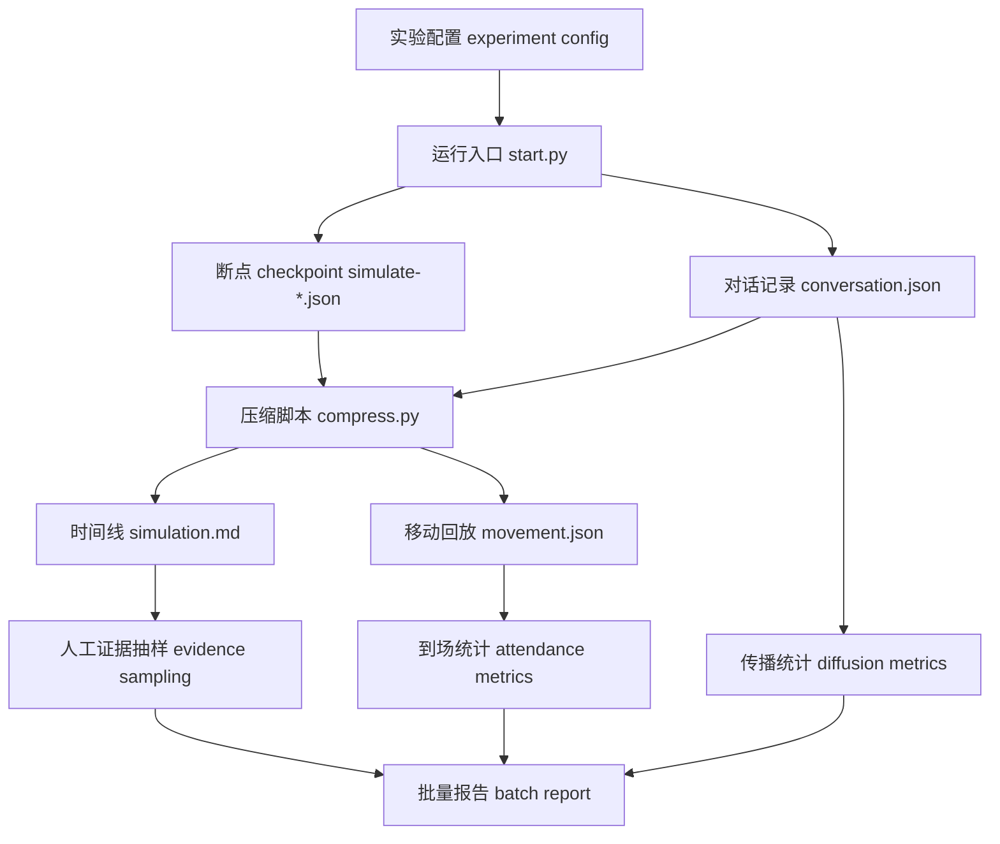
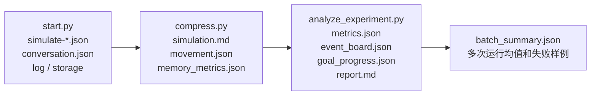
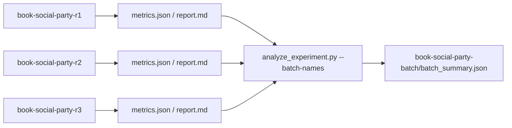
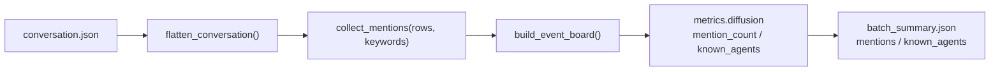
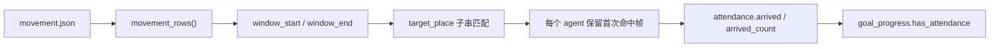
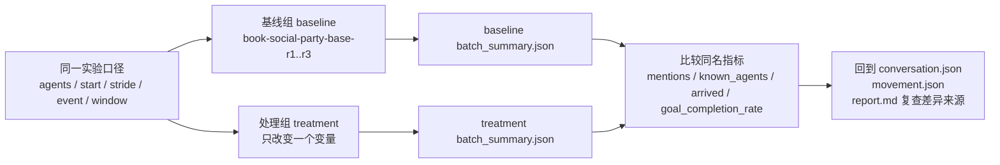
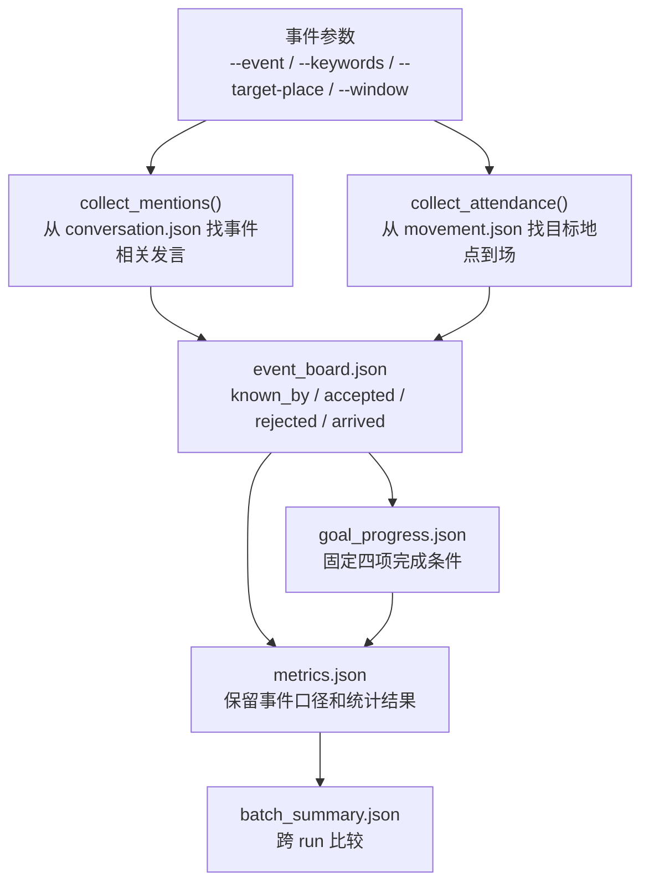
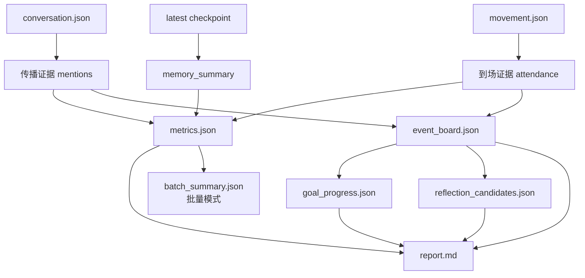
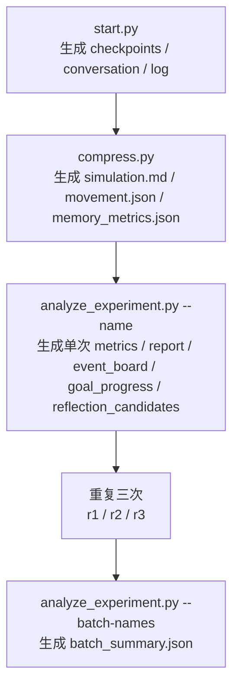

# 第 36 章 社会仿真升级：从小镇 Smallville 到更大规模实验

## 36.1 要解决的问题：把多次运行变成实验对象

第 35 章的 `book-collaboration-party` 已经把一次派对任务闭环跑通：自然对话结束后，系统能整理派对传播、承诺候选、到场证据和误判字段，并输出 `event_board.json`、`goal_progress.json` 和 `report.md`。这证明“这一次故事发生了”，但还不能证明“小镇机制稳定工作”。

只重复运行并不是升级点。当前 `start.py` 已经支持换一个 `--name` 再跑一遍；手动跑三次、五次、十次，本质上只是生成更多样本目录。真正的问题在后面：这些目录是否使用同一套实验条件？失败 run 是否保留？派对、选举、社区讨论是否使用同一套事件口径？指标能不能跨 run 汇总？结论能不能回到原始对话和移动轨迹复查？如果这些问题没有解决，多跑几次只会得到更多故事，而不是更大规模实验。

第 36 章解决的是“实验对象化”：把散落的多次运行 run，整理成一个有配置、有指标、有汇总、有失败样例、有证据路径的社会仿真实验 social simulation experiment。所谓“更大规模”，靠的不是单纯增加运行次数，而是让下面五件事可以扩展：

| 扩展对象 | 当前系统已经能做到 | 真正缺口 | 本章靠什么解决 |
| --- | --- | --- | --- |
| 样本生成 run generation | 换实验名手动跑多次。 | 运行条件、命名、成功失败状态没有统一登记。 | 批量运行 batch runs、独立 run 目录、失败 run 保留。 |
| 实验条件 experiment condition | 命令行可以指定时间、步长、角色。 | 条件散在命令里，后续难判断“改了什么”。 | 实验配置 experiment config，把角色、时间、事件、指标固化。 |
| 指标口径 metric contract | 单次运行可以人工看 `simulation.md`。 | 每次人工判断口径不同，无法跨 run 比较。 | `metrics.json`、`event_board.json`、`goal_progress.json`。 |
| 跨 run 聚合 batch aggregation | 人可以打开多个目录手工比较。 | 均值、差异、失败样例和异常 run 没有统一汇总。 | `batch_summary.json`、多次运行差异 multi-run spread、失败样例 failure sample。 |
| 对照归因 controlled attribution | 可以随意改模型、角色、prompt、地图。 | 多个变量同时变化，结论无法解释。 | 对照实验 controlled experiment，一次只改一个变量。 |
| 证据复查 evidence trace | 原始 `conversation.json`、`movement.json` 已经存在。 | 报告结论没有稳定连接到原始证据。 | 报告保留证据路径、原话、到场窗口和失败候选。 |

这也是本章和第 35 章的分界：第 35 章解决“一个协作任务如何落地”，第 36 章解决“多个运行能不能成为一个可审计实验”。从这一章开始，证据单位不再是“一段流畅故事”，也不只是“一堆运行目录”，而是“带统一配置、统一指标和统一复查入口的实验包”。

### 论文依据与工程落点

三条研究线索决定了本章的工程方向：保留 Generative Agents 的小镇涌现基线，引入 Concordia 对 grounded simulation 的强调，再用 AgentSociety 的大规模社会实验思路约束批量运行和指标报告。

| 升级方向 | 论文或系统 | 论文要点 | 本项目落点 |
| --- | --- | --- | --- |
| 小镇涌现基线 emergent town behavior | Generative Agents: Interactive Simulacra of Human Behavior | 论文用 25 个智能体的小镇展示情人节派对邀请扩散、关系形成和共同到场，核心架构依赖记忆、反思、计划和环境行动。 | 单次派对回放是基线证据，不应丢弃；但它只能说明一次运行中出现了社会涌现，不能外推为稳定规律。 |
| 场景扎根 grounded simulation | Generative agent-based modeling with actions grounded in physical, social, or digital space using Concordia | Concordia 把生成式智能体建模放在物理、社会或数字空间里，强调环境、行动可行性和研究者可观察的交互过程。 | 社会仿真报告必须同时看 `conversation.json`、`movement.json` 和 checkpoint，不能只看聊天摘要或 `simulation.md`。 |
| 批量社会实验 large-scale social experiment | AgentSociety: Large-Scale Simulation of LLM-Driven Generative Agents Advances Understanding of Human Behaviors and Society | AgentSociety 把 LLM 智能体、现实感环境和大规模仿真引擎结合，用于多主体交互和社会议题实验。 | 本项目先做小规模可复查版本：把多次 run 登记为同一个实验包，保留失败 run，输出 `metrics.json`、`report.md` 和 `batch_summary.json`。 |

| 判断对象 | 单次小镇故事 town story | 社会仿真实验 social simulation |
| --- | --- | --- |
| 证据形态 | 一份 `simulation.md` 讲得通。 | 多个运行 run 的 `conversation.json`、`movement.json`、断点 checkpoint 和指标 metrics 可比较。 |
| 结论语气 | “这次派对传播成功。” | “在当前配置下，3 次运行的知情角色均值为 4.0，并出现 1 次承诺未兑现样例。” |
| 失败处理 | 失败片段容易被故事叙事掩盖。 | 失败样例 failure sample 必须进入报告 report。 |
| 可复查性 | 证据需要人工逐项翻文件。 | 每个指标都带证据路径 evidence path。 |
| 适用边界 | 容易误写成现实社会预测。 | 结论限定在虚构角色、简化地图、当前模型、当前实验配置内。 |


```mermaid
flowchart TD
    Config["实验配置 experiment config"] --> Start["运行入口 start.py"]
    Start --> CK["断点 checkpoint simulate-*.json"]
    Start --> Conv["对话记录 conversation.json"]
    CK --> Compress["压缩脚本 compress.py"]
    Conv --> Compress
    Compress --> Sim["时间线 simulation.md"]
    Compress --> Move["移动回放 movement.json"]
    Conv --> Diff["传播统计 diffusion metrics"]
    Move --> Attend["到场统计 attendance metrics"]
    Sim --> Sample["人工证据抽样 evidence sampling"]
    Diff --> Report["批量报告 batch report"]
    Attend --> Report
    Sample --> Report
```

*图 36-1：从单次回放 replay 到批量社会仿真 social simulation 的数据流。关键变化不是多画几张图，而是把每次运行保存成独立证据包，再用统一指标比较。*


*图 36-2：从单次故事到批量社会仿真实验台。墙上的多个小镇窗口代表多次运行 runs，桌面上的断点 checkpoint、对话记录 conversation、时间线 simulation、移动回放 movement、传播图和批量差异曲线代表批量分析 batch analysis。社会仿真不是挑一段好故事，而是比较多次运行中的稳定现象、失败样例和不确定性。*

## 36.2 已有证据链：从单次 run 到批量报告

社会仿真的最小证据链已经在 `generative_agents_next` 中形成：`start.py` 保存原始运行包，`compress.py` 生成回放证据，`analyze_experiment.py` 生成单次评估和批量汇总。第 36 章后面的升级不再重复讲小镇如何运行，而是把这条证据链变成可重复、可比较、可复查的实验流程。


```mermaid
flowchart LR
    Start["start.py<br/>simulate-*.json<br/>conversation.json<br/>log / storage"] --> Compress["compress.py<br/>simulation.md<br/>movement.json<br/>memory_metrics.json"]
    Compress --> Analyze["analyze_experiment.py<br/>metrics.json<br/>event_board.json<br/>goal_progress.json<br/>report.md"]
    Analyze --> Batch["batch_summary.json<br/>多次运行均值和失败样例"]
```

| 证据层 | 真实路径 | 支撑的判断 | 边界 |
| --- | --- | --- | --- |
| 原始运行包 raw run | `generative_agents_next/results/checkpoints/<run>/` | 角色状态、坐标、行动、日程、对话原话、运行错误。 | 只能说明一次 run 发生了什么。 |
| 压缩回放 replay | `generative_agents_next/results/compressed/<run>/` | 时间线阅读、轨迹复查、到场窗口、记忆类型统计。 | `simulation.md` 是阅读入口，不是最终结论。 |
| 单次评估 evaluation | `generative_agents_next/results/evaluations/<run>/` | 一次 run 的传播、承诺、到场、目标完成率和失败候选。 | 指标必须能回到原话和轨迹复查。 |
| 批量汇总 batch | `generative_agents_next/results/evaluations/book-social-party-batch/batch_summary.json` | 多次 run 的均值、差异和失败样例。 | 只能比较当前配置，不能外推现实社区。 |

本章的三次运行都已经落盘：`book-social-party-r1`、`book-social-party-r2`、`book-social-party-r3`。以 `book-social-party-r1` 为例，它有 `72` 个 checkpoint，`known_agents=5`、`accepted_count=2`、`arrived_count=3`、`goal_completion_rate=1.0`。批量汇总显示三次运行的 `known_agents` 均值为 `4.0`，`arrived` 均值为 `2.6667`，`goal_completion_rate` 均值为 `0.9167`。这些数字不是故事摘要，而是后面差异分析、失败样例和边界结论的入口。

证据读取顺序如下：先看 `batch_summary.json` 判断多次运行是否一致；再看每个 run 的 `metrics.json` 找差异；最后回到 `conversation.json` 和 `movement.json` 复查原始证据。传播判断以 `conversation.json` 为主，到场判断以 `movement.json` 为主，`simulation.md` 只用于快速定位片段。

| 工程原则 | 对应升级小节 | 本章落点 |
| --- | --- | --- |
| 实验条件必须固定 | 36.3 实验配置 | 把角色、时间、步长、事件关键词、目标地点从命令行沉淀为配置。 |
| 多次运行必须独立 | 36.4 批量运行 | 每次 run 使用不同 `--name`，保留成功和失败样本。 |
| 传播和到场必须分开算 | 36.5、36.6 | 用 `conversation.json` 计算传播，用 `movement.json` 计算到场。 |
| 稳定性必须看差异 | 36.7 多次运行差异 | 把多个 run 的指标放在同一个汇总文件里比较。 |
| 归因必须做对照 | 36.8 对照实验 | 一次只改记忆治理、角色集合、长期记忆或模型配置中的一个变量。 |
| 事件口径必须可复用 | 36.9 事件级数据集 | 把事件事实、关键词、成功标准和反例定义成数据集。 |
| 报告必须保留失败 | 36.10 自动报告 | 自动报告记录失败样例、证据路径和人工复查入口。 |

当前项目不需要马上追求万人级仿真。更现实的路线是让 5 到 10 个角色、3 到 10 次 run 的小规模实验先做到可复查、可统计、可比较。规模扩大之前，证据口径、失败样例和结论边界必须稳定下来。

## 36.3 升级一：实验清单 experiment manifest

实验清单 experiment manifest 不是为了“让系统能跑”。系统已经能通过命令行跑任意一次仿真。它解决的是另一件事：把一次运行的命令参数、事件口径、评价窗口和批量分组固定下来，让后续结果可以判断“这些 run 属于同一个实验”。

当前代码还没有读取独立的 `experiments/*.json` 文件。本章已落地的最小方案，是用三类命令参数共同构成实验清单：

| 清单层 | 实际入口 | 本章取值 | 固定它的原因 |
| --- | --- | --- | --- |
| 仿真条件 simulation condition | `start.py` | `--start "20240214-08:00"`、`--step 72`、`--stride 10`、`--agents "伊莎贝拉,玛丽亚,山姆,汤姆,埃迪"` | 保证三次运行只比较模型生成过程中的差异，不混入角色、时间窗和步长差异。 |
| 事件口径 event contract | `analyze_experiment.py` | `--event valentine_party`、`--keywords "情人节,派对,五点,5点,17:00,霍布斯咖啡馆"`、`--target-place "霍布斯咖啡馆"` | 保证“知情”“承诺”“到场”使用同一套判断标准。 |
| 评价窗口 evaluation window | `analyze_experiment.py` | `--window-start "20240214-17:00"`、`--window-end "20240214-19:00"` | 避免把白天路过咖啡馆误判成参加派对。 |
| 批量分组 batch group | `analyze_experiment.py --batch-names` | `book-social-party-r1,book-social-party-r2,book-social-party-r3` | 把三个目录登记为同一个实验包，而不是三段互不相干的故事。 |
| 输出位置 output contract | 固定目录规则 | `results/checkpoints/<run>`、`results/compressed/<run>`、`results/evaluations/<run>`、`results/evaluations/book-social-party-batch` | 后续报告能稳定找到原始证据、压缩证据、单次指标和批量汇总。 |

把本章实际命令反推成清单，大致是下面这个形状。它不是当前代码已经读取的配置文件，而是读者理解实验边界的结构化说明；后续如果要继续工程化，可以把它落到 `generative_agents_next/experiments/book_social_party.json`，再由批量脚本读取。

```json
{
  "experiment": "book-social-party",
  "runs": ["book-social-party-r1", "book-social-party-r2", "book-social-party-r3"],
  "simulation": {
    "start": "20240214-08:00",
    "step": 72,
    "stride": 10,
    "agents": ["伊莎贝拉", "玛丽亚", "山姆", "汤姆", "埃迪"]
  },
  "event": {
    "id": "valentine_party",
    "keywords": ["情人节", "派对", "五点", "5点", "17:00", "霍布斯咖啡馆"],
    "target_place": "霍布斯咖啡馆",
    "window_start": "20240214-17:00",
    "window_end": "20240214-19:00"
  },
  "outputs": {
    "single_run_metrics": "results/evaluations/<run>/metrics.json",
    "single_run_report": "results/evaluations/<run>/report.md",
    "batch_summary": "results/evaluations/book-social-party-batch/batch_summary.json"
  }
}
```

这份清单带来的能力不是“自动多跑一次”，而是让实验结论有边界。`book-social-party-r1` 和 `book-social-party-r2` 可以比较，是因为它们共享同一套 `simulation` 和 `event` 字段；如果下一轮把角色换成 10 人、把窗口改成 18:00-20:00，或者把关键词换成“社区活动”，那就是另一个实验，不能直接和本轮均值混在一起。

| 没有实验清单 | 有实验清单 |
| --- | --- |
| 三次运行只是三个目录，读者不知道哪些条件相同。 | 三次运行共享同一个实验边界，可以进入 `batch_summary.json`。 |
| 指标变化可能来自角色、时间、关键词、目标地点任意一项。 | 只要清单不变，差异才有资格被解释为同配置运行差异。 |
| 失败样例容易被单次报告吞掉。 | 失败 run 和异常指标能按实验组回收。 |
| 后续新增选举、社区讨论等场景时，每次都临时写口径。 | 事件口径可以沉淀为可复用场景。 |

## 36.4 升级二：批量运行 batch runs

批量运行 batch runs 的升级点不是“自动帮人多敲几遍命令”。当前代码已经能手动运行任意多个实验名；真正新增的能力，是把多个独立 run 按同一实验清单登记，并在汇总阶段识别哪些 run 成功生成指标、哪些 run 缺失指标。

本章已落地的工程路径是：


```mermaid
flowchart LR
    R1["book-social-party-r1"] --> M1["metrics.json / report.md"]
    R2["book-social-party-r2"] --> M2["metrics.json / report.md"]
    R3["book-social-party-r3"] --> M3["metrics.json / report.md"]
    M1 --> Batch["analyze_experiment.py --batch-names"]
    M2 --> Batch
    M3 --> Batch
    Batch --> Summary["book-social-party-batch/batch_summary.json"]
```

| 阶段 | 当前实现 | 产物 | 批量意义 |
| --- | --- | --- | --- |
| 独立命名 | 每次运行使用唯一 `--name`，例如 `book-social-party-r1`。 | `results/checkpoints/<run>/` | run 之间互不覆盖，失败样本也能保留。 |
| 单次仿真 | `python start.py --name <run> ...` | `simulate-*.json`、`conversation.json`、`<run>.log` | 产生原始证据包 raw run package。 |
| 单次压缩 | `python compress.py --name <run>` | `simulation.md`、`movement.json`、`memory_metrics.json` | 产生可读回放和到场轨迹。 |
| 单次评价 | `python analyze_experiment.py --name <run> ...` | `metrics.json`、`report.md`、`event_board.json`、`goal_progress.json`、`reflection_candidates.json` | 每个 run 使用同一套评价口径。 |
| 批量汇总 | `python analyze_experiment.py --batch-names "r1,r2,r3" --batch-output <batch>` | `batch_summary.json` | 把多个 run 登记为同一个实验包。 |

批量汇总入口位于 `generative_agents_next/analyze_experiment.py`，核心逻辑是读取每个 run 的 `metrics.json`，再写出一个总表。如果某个 run 没有指标文件，它不会被悄悄忽略，而是进入 `missing_metrics` 状态。

```python
# generative_agents_next/analyze_experiment.py
def summarize_batch(evaluation_root, names, output_dir):
    rows = []
    for name in names:
        metrics_path = os.path.join(evaluation_root, name, "metrics.json")
        metrics = load_json(metrics_path, {})
        if not metrics:
            rows.append({"experiment": name, "status": "missing_metrics"})
            continue
        rows.append({
            "experiment": name,
            "status": "ok",
            "mentions": metrics.get("diffusion", {}).get("mention_count", 0),
            "known_agents": metrics.get("diffusion", {}).get("known_agent_count", 0),
            "arrived": metrics.get("attendance", {}).get("arrived_count", 0),
            "goal_completion_rate": metrics.get("goal_progress", {}).get("goal_completion_rate", 0),
            "final_time": metrics.get("final_time", "")
        })
```

这段逻辑的价值在失败处理。社会仿真最怕只保留成功样本：三次运行里如果一条 run 因限流、JSON 解析、压缩缺失或评价缺失而失败，报告不能假装只跑了两次。`missing_metrics` 至少把缺口暴露出来，让实验报告有资格写“本轮计划 3 次，成功生成指标 2 次，另 1 次缺失评价文件”。

| 批量运行检查项 | 检查位置 | 失败时的写法 |
| --- | --- | --- |
| run 目录是否存在 | `results/checkpoints/<run>/` | “该 run 未启动或被删除，不能进入均值。” |
| 压缩产物是否存在 | `results/compressed/<run>/movement.json` | “可分析对话，但不能判断到场。” |
| 单次指标是否存在 | `results/evaluations/<run>/metrics.json` | `batch_summary.json` 记录 `missing_metrics`。 |
| 汇总产物是否存在 | `results/evaluations/<batch>/batch_summary.json` | “多次运行尚未形成实验包，只是散落 run。” |

自动调度器可以作为下一步增强，但不是本章已经实现的主线。第 36 章当前真正完成的是：让多个已经执行完成的 run 进入同一套评价和汇总链路。

## 36.5 升级三：传播统计 diffusion metrics

传播统计 information diffusion 的目标不是给聊天内容贴几个关键词，而是把 `conversation.json` 里的事件相关发言变成跨 run 可比较的字段。当前实现落在 `generative_agents_next/analyze_experiment.py`，输出到每个 run 的 `metrics.json`。


```mermaid
flowchart LR
    Conv["conversation.json"] --> Flat["flatten_conversation()"]
    Flat --> Mentions["collect_mentions(rows, keywords)"]
    Mentions --> Board["build_event_board()"]
    Board --> Metrics["metrics.diffusion<br/>mention_count / known_agents"]
    Metrics --> Batch["batch_summary.json<br/>mentions / known_agents"]
```

当前代码实现的是“事件相关发言统计”，不是完整的传播图算法。这个边界必须写清楚，否则读者会误以为系统已经能自动判断 A 告诉 B、B 再告诉 C 的二跳传播。

| 字段 | 生成逻辑 | 证据来源 | 正确读法 | 不能写成 |
| --- | --- | --- | --- | --- |
| `mention_count` | `collect_mentions()` 统计命中事件关键词，或在同一对话上下文中出现承诺/拒绝信号的发言。 | `conversation.json` 原话。 | 事件相关发言量。 | 派对传播成功次数。 |
| `known_agents` | `build_event_board()` 从 mentions 中取发言者集合。 | 命中行的 `speaker`。 | 在事件上下文中发过言的角色。 | 完整知情人数、被通知人数。 |
| `known_agent_count` | `len(known_agents)`。 | `metrics.json`。 | 跨 run 比较的覆盖粗指标。 | 严格传播覆盖率。 |
| `event_board.known_by` | 与 `known_agents` 同源。 | `event_board.json`。 | 事件板上的知情候选。 | 已核验的传播链节点。 |

核心代码如下。`hits` 来自关键词命中；`commitment` 来自承诺/拒绝正则；同一段对话先命中事件关键词后，后续承诺发言也会进入 mentions。

```python
# generative_agents_next/analyze_experiment.py
def collect_mentions(rows, keywords):
    mentions = []
    event_context = set()
    for row in rows:
        hits = [keyword for keyword in keywords if keyword and keyword in row["text"]]
        commitment = detect_commitment(row["text"])
        context_key = (row["time"], row["route"])
        if hits:
            event_context.add(context_key)
        if not hits and not (commitment and context_key in event_context):
            continue
        mentions.append({
            "time": row["time"],
            "route": row["route"],
            "speaker": row["speaker"],
            "keywords": hits or ["context"],
            "commitment": commitment,
            "text": row["text"],
        })
    return mentions
```

本轮三次运行的传播字段已经写入 `batch_summary.json`：

| run | `mentions` | `known_agents` | 解释 |
| --- | ---: | ---: | --- |
| `book-social-party-r1` | `45` | `5` | 五名角色都进入派对相关对话上下文。 |
| `book-social-party-r2` | `30` | `3` | 派对话题存在，但覆盖角色更少。 |
| `book-social-party-r3` | `45` | `4` | 话题热度接近 r1，但覆盖少一名角色。 |
| 均值 | `40.0` | `4.0` | 当前配置下，派对信息通常能覆盖多数实验角色。 |

这张表只能说明“事件相关对话覆盖”具备可比较性，不能单独证明“传播链路完整”。例如 `known_agents=5` 并不代表五个人都听到了完整的时间、地点和行动要求；它只说明五个人在事件相关上下文里发过言。要判断事实是否保真，需要回到 `report.md` 里的传播证据，再查 `conversation.json` 原话。

传播统计的边界如下：

| 常见误判 | 原因 | 正确处理 |
| --- | --- | --- |
| 把关键词命中当成知情 | “情人节”可能只是节日寒暄。 | 至少核对时间、地点、活动目标是否同场出现。 |
| 把发言者集合当成听话者集合 | 当前 `known_agents` 取的是 speaker，不是 route 里的 listener。 | 结论写成“事件上下文发言角色”，不要写成“被通知角色”。 |
| 把高 mentions 当成传播深 | 多轮同一人反复聊派对会抬高 mentions。 | 与 `known_agent_count`、原始 route 一起读。 |
| 把传播等同到场 | 聊到派对不代表行动落地。 | 到场必须由 36.6 的 `movement.json` 窗口验证。 |

因此，本章实验报告使用 `mentions` 和 `known_agents` 作为批量比较指标；真正的 `diffusion_edge`、`diffusion_depth` 和二跳传播链，应在后续版本里从 `route` 字段显式解析说话者和听话者，再按时间顺序构图。

## 36.6 升级四：到场和轨迹统计 attendance metrics

到场统计 attendance metrics 解决的是传播统计解决不了的问题：角色有没有在目标时间窗出现在目标地点。传播来自 `conversation.json`，到场来自 `movement.json`；前者证明“说过”，后者证明“到过”。

当前实现落在 `generative_agents_next/analyze_experiment.py` 的 `movement_rows()` 和 `collect_attendance()`。它已经能生成 `attendance.arrived` 和 `attendance.arrived_count`，并在 `report.md` 中列出首个到场帧；它还没有生成共处时长、峰值聚集人数、路线异常等更细轨迹指标。


```mermaid
flowchart LR
    Move["movement.json"] --> Rows["movement_rows()"]
    Rows --> Window["window_start / window_end"]
    Window --> Place["target_place 子串匹配"]
    Place --> First["每个 agent 保留首次命中帧"]
    First --> Attendance["attendance.arrived / arrived_count"]
    Attendance --> Goal["goal_progress.has_attendance"]
```

核心代码如下。`movement_rows()` 先把每个 frame 转成时间、角色、地点、动作；`collect_attendance()` 再按目标地点和时间窗口筛选，并用 `arrivals.setdefault()` 保留每个角色第一次命中的帧。

```python
# generative_agents_next/analyze_experiment.py
def collect_attendance(movement, target_place, window_start=None, window_end=None):
    if not target_place:
        return []
    arrivals = {}
    start = parse_time(window_start) if window_start else None
    end = parse_time(window_end) if window_end else None
    for row in movement_rows(movement):
        if target_place not in row["location"]:
            continue
        if row["time"]:
            row_time = parse_time(row["time"])
            if start and row_time < start:
                continue
            if end and row_time > end:
                continue
        arrivals.setdefault(row["agent"], row)
    return list(arrivals.values())
```

本轮实验的到场口径固定为：

| 字段 | 本章取值 | 作用 |
| --- | --- | --- |
| `target_place` | `霍布斯咖啡馆` | 只统计地点字符串包含目标地点的帧。 |
| `window_start` | `20240214-17:00` | 派对目标窗口开始。 |
| `window_end` | `20240214-19:00` | 派对目标窗口结束。 |
| `attendance.arrived` | 目标窗口内首次命中地点的角色集合。 | 判断谁到过目标地点。 |
| `attendance.arrived_count` | `len(arrived)`。 | 进入批量汇总的到场粗指标。 |

三次运行的到场结果如下：

| run | `arrived` | `arrived_count` | 结果判断 |
| --- | --- | ---: | --- |
| `book-social-party-r1` | 伊莎贝拉、埃迪、汤姆 | `3` | 有到场，且没有承诺未到场候选。 |
| `book-social-party-r2` | 伊莎贝拉、埃迪、山姆 | `3` | 有到场，目标完成率为 `1.0`。 |
| `book-social-party-r3` | 伊莎贝拉、埃迪 | `2` | 有到场，但山姆、玛丽亚有承诺未到场候选。 |
| 均值 | - | `2.6667` | 当前配置下，到场现象重复出现，但名单不稳定。 |

`report.md` 会保留首个命中帧，方便回查。例如 `book-social-party-r1` 的到场证据里，伊莎贝拉在 `17:00`、汤姆在 `17:10`、埃迪在 `18:50` 首次命中霍布斯咖啡馆。这个证据比 `simulation.md` 摘要更强，因为它来自逐帧位置回放。

| 常见误判 | 原因 | 正确处理 |
| --- | --- | --- |
| 把到达咖啡馆写成参加派对 | 当前判断只看地点子串，不判断角色当时动作目的。 | 写成“目标窗口内出现在霍布斯咖啡馆”，不要直接写成“参加派对”。 |
| 把 `arrived_count` 写成到场率 | 当前指标没有明确分母，既不是全体角色率，也不是承诺者到场率。 | 本章只使用到场人数；承诺兑现由 `accepted_not_arrived` 辅助判断。 |
| 把未到场写成失败 | 如果运行没有覆盖完整窗口，或目标地点关键词不匹配，可能是假阴性。 | 同时检查 `final_time`、`target_place` 和 `movement.json`。 |
| 把首个命中帧当成停留时长 | `collect_attendance()` 只保留首次命中。 | 共处时长和停留时长需要后续从连续帧另算。 |

后续如果要升级轨迹统计，可以继续在 `movement_rows()` 之上计算 `arrival_time`、`co_location_duration`、`peak_gathering_size` 和 `route_anomaly`。第 36 章当前完成的是到场粗验证：谁在目标窗口内出现在目标地点。

## 36.7 升级五：多次运行差异 multi-run spread

生成式系统 generative system 有随机性。社会仿真报告不能挑最好的一次 run，也不能只写一次平均值。严格说，当前代码还没有把统计学意义上的方差 variance 写入结果文件；本节已经落地的是更基础的一步：把多次运行的指标行收拢到同一个 `batch_summary.json`，让读者能先看见差异、异常 run 和均值。

相对路径：`generative_agents_next/analyze_experiment.py`

```python
def summarize_batch(evaluation_root, names, output_dir):
    rows = []
    for name in names:
        metrics_path = os.path.join(evaluation_root, name, "metrics.json")
        metrics = load_json(metrics_path, {})
        if not metrics:
            rows.append({"experiment": name, "status": "missing_metrics"})
            continue
        rows.append(
            {
                "experiment": name,
                "status": "ok",
                "mentions": metrics.get("diffusion", {}).get("mention_count", 0),
                "known_agents": metrics.get("diffusion", {}).get("known_agent_count", 0),
                "accepted": metrics.get("commitments", {}).get("accepted_count", 0),
                "rejected": metrics.get("commitments", {}).get("rejected_count", 0),
                "arrived": metrics.get("attendance", {}).get("arrived_count", 0),
                "goal_completion_rate": metrics.get("goal_progress", {}).get(
                    "goal_completion_rate", 0
                ),
                "final_time": metrics.get("final_time", ""),
            }
        )

    ok_rows = [row for row in rows if row["status"] == "ok"]

    def _avg(key):
        if not ok_rows:
            return 0
        return round(sum(row.get(key, 0) for row in ok_rows) / len(ok_rows), 4)

    summary = {
        "runs": rows,
        "run_count": len(names),
        "successful_metric_files": len(ok_rows),
        "averages": {
            "mentions": _avg("mentions"),
            "known_agents": _avg("known_agents"),
            "accepted": _avg("accepted"),
            "rejected": _avg("rejected"),
            "arrived": _avg("arrived"),
            "goal_completion_rate": _avg("goal_completion_rate"),
        },
    }
```

这段代码做了两件事。第一，它不重新解释故事，只读取每个 run 已经生成的 `metrics.json`，把传播、承诺、拒绝、到场和目标完成率整理成同一种行结构。第二，如果某个 run 没有生成指标文件，它不会被悄悄跳过，而是写成 `status=missing_metrics`，让失败运行留在批量结果里。

`batch_summary.json` 的汇总口径如下：

| 字段 | 当前含义 | 能支持的判断 | 不能支持的判断 |
| --- | --- | --- | --- |
| `runs[]` | 每次运行的一行指标。 | 哪次 run 偏离、失败或结果较弱。 | 不能单独说明差异来自哪个变量。 |
| `run_count` | 本次批量登记的运行数量。 | 批量实验是否包含预期 run。 | 不能说明每次 run 都成功。 |
| `successful_metric_files` | 成功读取 `metrics.json` 的运行数量。 | 指标链路是否完整。 | 不能说明仿真行为稳定。 |
| `averages` | 对成功 run 计算简单均值。 | 给出当前配置下的中心趋势。 | 不能代替最小值、最大值、标准差或方差。 |
| `variance` | 当前没有这个字段。 | 暂不支持。 | 不能把本节结果写成“已计算方差”。 |

本轮真实批量汇总如下：

| 运行 run | mentions | known_agents | accepted | rejected | arrived | goal_completion_rate | final_time |
| --- | ---: | ---: | ---: | ---: | ---: | ---: | --- |
| `book-social-party-r1` | `45` | `5` | `2` | `0` | `3` | `1.0` | `20240214-19:50` |
| `book-social-party-r2` | `30` | `3` | `3` | `0` | `3` | `1.0` | `20240214-19:50` |
| `book-social-party-r3` | `45` | `4` | `4` | `1` | `2` | `0.75` | `20240214-18:50` |

上表来自 `results/evaluations/book-social-party-batch/batch_summary.json`，不是手写示例。它能直接暴露五类差异：

| 差异项 | 实验观察 | 读者应如何解释 |
| --- | --- | --- |
| 事件相关发言 | `r1=45`、`r2=30`、`r3=45`。 | 派对被提及的强度不稳定，`r2` 的事件对话明显更少。 |
| 事件上下文角色 | `known_agents` 从 `3` 到 `5` 不等。 | 信息传播不是固定覆盖所有角色，仍依赖角色相遇和对话触发。 |
| 到场人数 | `r1=3`、`r2=3`、`r3=2`。 | 到场现象重复出现，但名单和数量并不完全稳定。 |
| 目标完成率 | `r1/r2=1.0`，`r3=0.75`。 | `r3` 暴露了承诺未兑现候选，不能被均值掩盖。 |
| 最终时间 | `r3` 停在 `18:50`，没有覆盖到 `19:00`。 | 比较 `r3` 时要标注时间窗边界，避免把未观察到的 10 分钟写成确定失败。 |

这一节的升级价值不是“已经完成严格统计建模”，而是把多次运行从散落目录变成同一张比较表。后续如果要补上真正的方差，只需要在 `summarize_batch()` 的 `ok_rows` 上继续计算 `min`、`max`、`std` 和 `variance`，并写入 `batch_summary.json`；在这之前，正文只能写“多次运行差异”，不能写“方差已经落盘”。

## 36.8 升级六：对照实验 controlled experiment

`book-social-party-r1/r2/r3` 不是对照实验 controlled experiment。它们是同一配置下的重复运行 repeated runs，用来观察同配置差异；它们不能回答“记忆治理是否提升了目标完成率”“角色变多是否提高传播覆盖”“导入长期记忆是否改变承诺”。要回答这些问题，必须建立两个实验包：基线组 baseline batch 和处理组 treatment batch，并且处理组一次只改变一个变量。


```mermaid
flowchart LR
    Manifest["同一实验口径<br/>agents / start / stride / event / window"] --> Base["基线组 baseline<br/>book-social-party-base-r1..r3"]
    Manifest --> Treat["处理组 treatment<br/>只改变一个变量"]
    Base --> BaseMetrics["baseline batch_summary.json"]
    Treat --> TreatMetrics["treatment batch_summary.json"]
    BaseMetrics --> Compare["比较同名指标<br/>mentions / known_agents / arrived / goal_completion_rate"]
    TreatMetrics --> Compare
    Compare --> Evidence["回到 conversation.json<br/>movement.json<br/>report.md 复查差异来源"]
```

当前 `generative_agents_next` 已经提供了部分可做对照的入口，但不是所有变量都已经变成命令行开关。先看真实代码。

相对路径：`generative_agents_next/start.py`

```python
def apply_memory_upgrade_config(config, args):
    governance = {
        "relationship_update": True,
        "summary_merge": True,
        "summary_poignancy_max": 3,
        "summary_threshold": 3,
        "summary_window": 12,
        "conflict_detection": True,
        "conflict_window": 30,
        "skill_from_conflict": True,
    }
    governance.update(config.get("memory_governance", {}))
    if args.disable_memory_governance:
        governance = {key: False for key in governance}
    config["memory_governance"] = governance

    if args.load_long_term_memory:
        memory_types = [
            t.strip()
            for t in args.long_term_memory_types.split(",")
            if t.strip()
        ]
        config["long_term_memory"] = {
            "enabled": True,
            "source_root": args.load_long_term_memory,
            "max_nodes": args.long_term_memory_max_nodes,
            "min_confidence": args.long_term_memory_min_confidence,
            "types": memory_types,
            "extend_days": args.long_term_memory_extend_days,
        }
    return config
```

这段代码说明两件事。第一，记忆治理 memory governance 已经是可对照变量：默认开启，增加 `--disable-memory-governance` 后会关闭关系更新、摘要合并、冲突检测和技能抽取。第二，长期记忆 long-term memory 也已经是可对照变量：增加 `--load-long-term-memory` 后，系统会把历史存储目录中的记忆导入当前智能体。角色集合则由 `--agents` 或 `--agent-count` 控制。

| 对照问题 | 基线组 baseline | 处理组 treatment | 必须保持不变 | 观察指标 |
| --- | --- | --- | --- | --- |
| 记忆治理是否改变结果 | 默认运行，不加额外开关。 | 只增加 `--disable-memory-governance`。 | 角色、起始时间、步长、模型、事件关键词、目标地点、评价窗口。 | `memory_summary`、`goal_completion_rate`、`reflection_candidates`、失败样例。 |
| 角色规模是否改变传播 | 固定 5 人角色集合。 | 只改变 `--agents` 或 `--agent-count`。 | 起始时间、事件、模型、评价窗口。 | `mentions`、`known_agents`、`arrived`、运行成本。 |
| 长期记忆是否影响承诺 | 不导入历史记忆。 | 只增加 `--load-long-term-memory <storage>` 及相关过滤参数。 | 角色、模型、事件、窗口。 | `memory_summary` 中相关类型数量、导入节点抽样、`accepted`、`accepted_not_arrived`。 |
| 模型 provider 是否影响稳定性 | 使用 `data/config.json` 中的当前 provider/model。 | 只改 provider/model 配置，并保留配置快照。 | 角色、事件、prompt、窗口、运行次数。 | log 错误、对话事实保真、成本、目标完成率。 |
| 评价口径是否影响结论 | 固定 `--keywords`、`--target-place`、`--window-start/end`。 | 只调整某一个评价参数。 | 原始 run 不变。 | 命中数变化、误判变化。 |

模型 provider 不是当前 `start.py` 的命令行参数，而是来自 `generative_agents_next/data/config.json` 和环境变量。因此模型对照不能只写一条命令，必须保存配置快照；否则后续读者无法判断差异来自模型、密钥配置、上下文长度，还是运行当天的 API 状态。

如果要把记忆治理做成一个真正的对照实验，命令结构应保持下面这种形状。这里展示的是变量位点，不重复铺满三次 run 的完整命令；完整运行仍然沿用 36.12 的 `start -> compress -> analyze -> batch` 顺序。

```bash
cd generative_agents_next

# 基线组：默认开启 memory_governance
python start.py --name book-social-party-base-r1 --start "20240214-08:00" --step 72 --stride 10 --agents "伊莎贝拉,玛丽亚,山姆,汤姆,埃迪" --verbose info --log book-social-party-base-r1.log

# 处理组：只关闭 memory_governance，其余参数不变
python start.py --name book-social-party-nogov-r1 --start "20240214-08:00" --step 72 --stride 10 --agents "伊莎贝拉,玛丽亚,山姆,汤姆,埃迪" --disable-memory-governance --verbose info --log book-social-party-nogov-r1.log
```

两组运行结束后，仍然使用同一套评价参数生成 `metrics.json`，再分别生成两个 `batch_summary.json`。只有这样，`goal_completion_rate`、`arrived` 或 `known_agents` 的差异才有资格被解释为“记忆治理开关带来的候选影响”。

| 常见错误 | 为什么会破坏对照 | 正确处理 |
| --- | --- | --- |
| 同时加角色、换模型、关记忆治理。 | 三个变量一起变，指标变化无法归因。 | 一轮实验只改一个变量。 |
| 基线组和处理组使用不同关键词。 | 指标口径变了，不是行为变了。 | `analyze_experiment.py` 的事件参数必须逐字一致。 |
| 只跑一组处理组，不跑基线组。 | 没有比较对象，只能写单次观察。 | 至少形成 baseline batch 与 treatment batch。 |
| 只比较 `batch_summary.json`，不回查原始证据。 | 指标可能来自关键词误命中或到场误判。 | 回到 `conversation.json`、`movement.json` 和单次 `report.md` 抽样复查。 |
| 把 3 次 run 写成统计定论。 | 样本太少，只能作为工程试验。 | 写成“当前配置下的试验性证据”，再扩展运行次数。 |

本章当前已经完成的是同配置批量实验：三次运行进入同一个 `book-social-party-batch`。对照实验是下一层能力，它依赖 36.3 到 36.7 已经建立的实验清单、单次指标、批量汇总和差异分析；没有这些基础，所谓“对照”只会变成手动换几个参数再讲故事。

## 36.9 升级七：事件级数据集 event dataset

事件级数据集 event dataset 解决的不是“让角色知道派对”，而是“让评估脚本用同一套事件口径判断每次 run”。没有事件数据集时，`--keywords`、`--target-place` 和 `--window-start/end` 分散在命令行里，某次手滑改了一个词，批量汇总仍然能生成，但不同 run 已经不再可比。

当前代码还没有读取 `experiments/events/*.json`。第 36 章已经落地的是参数级事件契约 parameter-level event contract：事件定义通过命令行进入 `analyze_experiment.py`，再被写入每个 run 的 `metrics.json`。文件级事件数据集是下一步工程化形态，不能写成当前已实现能力。

相对路径：`generative_agents_next/analyze_experiment.py`

```python
parser.add_argument("--event", default="event", help="Event name for reports")
parser.add_argument("--keywords", default="", help="Comma-separated event keywords")
parser.add_argument("--target-place", default="", help="Location substring used for attendance")
parser.add_argument("--window-start", default="", help="Attendance window start, e.g. 20240214-17:00")
parser.add_argument("--window-end", default="", help="Attendance window end, e.g. 20240214-19:00")

keywords = split_csv(args.keywords)
mentions = collect_mentions(rows, keywords)
attendance = collect_attendance(movement, args.target_place, args.window_start, args.window_end)

metrics = {
    "event": args.event,
    "keywords": keywords,
    "target_place": args.target_place,
    "window_start": args.window_start,
    "window_end": args.window_end,
}
```

这段代码把事件口径分成三条链路：关键词决定传播命中，目标地点和时间窗口决定到场命中，事件名进入报告和批量汇总。它没有读取成功标准，也没有读取反例；`goal_progress` 仍然使用代码里的固定条件：是否有事件传播、是否有承诺、是否有到场、是否没有承诺未到场。


```mermaid
flowchart TD
    Args["事件参数<br/>--event / --keywords / --target-place / --window"] --> Mentions["collect_mentions()<br/>从 conversation.json 找事件相关发言"]
    Args --> Attendance["collect_attendance()<br/>从 movement.json 找目标地点到场"]
    Mentions --> Board["event_board.json<br/>known_by / accepted / rejected / arrived"]
    Attendance --> Board
    Board --> Goal["goal_progress.json<br/>固定四项完成条件"]
    Board --> Metrics["metrics.json<br/>保留事件口径和统计结果"]
    Goal --> Metrics
    Metrics --> Batch["batch_summary.json<br/>跨 run 比较"]
```

本轮 `valentine_party` 的事件口径已经在三个 `metrics.json` 中落盘：

| 字段 | 本轮取值 | 当前来源 | 运行作用 |
| --- | --- | --- | --- |
| `event` | `valentine_party` | `--event valentine_party` | 写入 `metrics.json` 和 `report.md`，作为报告标签。 |
| `keywords` | `情人节`、`派对`、`五点`、`5点`、`17:00`、`霍布斯咖啡馆` | `--keywords` | `collect_mentions()` 用它们从 `conversation.json` 抽取事件相关发言。 |
| `target_place` | `霍布斯咖啡馆` | `--target-place` | `collect_attendance()` 用它在 `movement.json` 的地点字符串中找命中。 |
| `window_start` / `window_end` | `20240214-17:00` 到 `20240214-19:00` | `--window-start`、`--window-end` | 限定到场统计的时间窗口，避免把白天路过咖啡馆算进去。 |
| `success_criteria` | 固定在 `build_goal_progress()` 中。 | 源码逻辑 | 当前四项是 `has_event_diffusion`、`has_commitment`、`has_attendance`、`has_no_unfulfilled_commitment`。 |
| `negative_examples` | 目前没有字段。 | 人工复查 | 只能在报告分析中处理，例如“只说情人节快乐”“路过咖啡馆”“摘要提及但原话没有”。 |

三次运行的事件口径保持一致，所以它们可以进入同一个批量实验：

| run | event | keywords 数量 | target_place | window | 可比性判断 |
| --- | --- | ---: | --- | --- | --- |
| `book-social-party-r1` | `valentine_party` | `6` | `霍布斯咖啡馆` | `17:00-19:00` | 可比较。 |
| `book-social-party-r2` | `valentine_party` | `6` | `霍布斯咖啡馆` | `17:00-19:00` | 可比较。 |
| `book-social-party-r3` | `valentine_party` | `6` | `霍布斯咖啡馆` | `17:00-19:00` | 可比较，但最终时间停在 `18:50`，结论要标注窗口边界。 |

文件级事件数据集可以把上面的命令参数沉淀成一张事件卡。推荐路径放在升级目录下，而不是原始 `generative_agents`：

```text
generative_agents_next/experiments/events/valentine_party.json
generative_agents_next/experiments/events/mayor_election.json
generative_agents_next/experiments/events/community_discussion.json
```

文件化形态如下。它不是当前脚本已经读取的文件，而是把当前命令参数和人工复查口径整理成可复用配置：

```json
{
  "event_id": "valentine_party",
  "source_agent": "伊莎贝拉",
  "time": "2024-02-14 17:00",
  "location": "霍布斯咖啡馆",
  "keywords": ["情人节", "派对", "五点", "5点", "17:00", "霍布斯咖啡馆"],
  "target_place": "霍布斯咖啡馆",
  "window_start": "20240214-17:00",
  "window_end": "20240214-19:00",
  "success_criteria": [
    "has_event_diffusion",
    "has_commitment",
    "has_attendance",
    "has_no_unfulfilled_commitment"
  ],
  "negative_examples": [
    "只说情人节快乐，不算知道派对安排。",
    "目标窗口外路过霍布斯咖啡馆，不算到场。",
    "只有 simulation.md 摘要提及，但 conversation.json 原话没有，不算强证据。"
  ]
}
```

字段进入脚本的顺序可以机械映射：

| 文件字段 | 当前等价入口 | 当前支持状态 | 边界 |
| --- | --- | --- | --- |
| `event_id` | `--event` | 已支持。 | 只作为标签，不影响命中逻辑。 |
| `keywords` | `--keywords` | 已支持。 | 只做字符串包含匹配，不理解同义词和语义。 |
| `target_place` | `--target-place` | 已支持。 | 只做地点子串匹配，不判断行动目的。 |
| `window_start` / `window_end` | `--window-start/end` | 已支持。 | 运行如果没有覆盖完整窗口，需要在报告中标注。 |
| `success_criteria` | `build_goal_progress()` | 部分支持。 | 当前是代码固定条件，不是数据驱动条件。 |
| `negative_examples` | 单次 `report.md` 人工复查 | 未自动支持。 | 需要人工抽样，后续可扩展为误判测试集。 |

事件数据集最容易出错的地方，不在 JSON 语法，而在评估口径：

| 错误 | 后果 | 检查位置 |
| --- | --- | --- |
| 关键词太宽，例如只写“派对”。 | 普通闲聊也可能被算成事件传播。 | `results/evaluations/<run>/report.md` 的传播证据。 |
| 地点太宽，例如只写“咖啡馆”。 | 路过、工作、聚会都混在一起。 | `movement.json` 的地点和行动描述。 |
| 窗口不一致。 | `arrived_count` 无法跨 run 比较。 | 每个 `metrics.json` 的 `window_start/window_end`。 |
| 成功标准没有写清“承诺”和“到场”的区别。 | 知道派对会被误写成参加派对。 | `goal_progress.json` 和 `reflection_candidates.json`。 |
| 反例只写在正文里，没有进入复查流程。 | 后续新增事件时继续误判。 | 单次报告中的抽样证据和人工结论。 |

第 36 章当前完成的是参数级事件数据集：同一事件口径进入三次运行，并在 `metrics.json` 中可复查。文件级事件数据集的价值，是把这套口径从命令行复制中解放出来；后续只要让 `analyze_experiment.py` 增加 `--event-config`，就可以从 JSON 读取事件定义，再生成完全相同的 `metrics.json`。

## 36.10 升级八：自动报告 report generation

自动报告 report generation 的作用不是替代人工判断，而是把一次 run 的证据拆成稳定文件：机器可读的指标、读者可读的证据摘录、任务状态、目标进度和失败候选。没有自动报告时，读者只能在 `conversation.json`、`movement.json`、`simulation.md` 和 checkpoint 之间来回翻；有了自动报告，至少能先从同一组文件进入复查。

当前 `analyze_experiment.py` 已经实现单次报告和批量汇总两条路径：


```mermaid
flowchart TD
    Conv["conversation.json"] --> Mentions["传播证据 mentions"]
    Move["movement.json"] --> Attendance["到场证据 attendance"]
    CK["latest checkpoint"] --> Memory["memory_summary"]
    Mentions --> Metrics["metrics.json"]
    Attendance --> Metrics
    Memory --> Metrics
    Mentions --> Board["event_board.json"]
    Attendance --> Board
    Board --> Goal["goal_progress.json"]
    Board --> Reflect["reflection_candidates.json"]
    Metrics --> Report["report.md"]
    Goal --> Report
    Board --> Report
    Reflect --> Report
    Metrics --> Batch["batch_summary.json<br/>批量模式"]
```

相对路径：`generative_agents_next/analyze_experiment.py`

```python
outputs = {
    "metrics": os.path.join(evaluation_dir, "metrics.json"),
    "report": os.path.join(evaluation_dir, "report.md"),
    "event_board": os.path.join(evaluation_dir, "event_board.json"),
    "goal_progress": os.path.join(evaluation_dir, "goal_progress.json"),
    "reflection_candidates": os.path.join(evaluation_dir, "reflection_candidates.json"),
}

with open(outputs["metrics"], "w", encoding="utf-8") as f:
    json.dump(metrics, f, ensure_ascii=False, indent=2)
with open(outputs["event_board"], "w", encoding="utf-8") as f:
    json.dump(event_board, f, ensure_ascii=False, indent=2)
with open(outputs["goal_progress"], "w", encoding="utf-8") as f:
    json.dump(goal_progress, f, ensure_ascii=False, indent=2)
with open(outputs["reflection_candidates"], "w", encoding="utf-8") as f:
    json.dump(reflection_candidates, f, ensure_ascii=False, indent=2)
write_report(
    outputs["report"],
    metrics,
    mentions,
    attendance,
    event_board,
    reflection_candidates,
    goal_progress,
)
```

这些文件的职责不能混在一起：

| 输出文件 | 当前内容 | 读者拿它判断什么 | 边界 |
| --- | --- | --- | --- |
| `metrics.json` | `event`、`keywords`、`target_place`、`checkpoint_count`、`final_time`、传播、承诺、到场、目标进度、记忆摘要。 | 机器可读的单次 run 指标。 | 不解释指标为什么发生，只保存结构化结果。 |
| `report.md` | 核心指标表、前 20 条传播证据、前 20 条到场证据、目标进度、事件板、反思候选。 | 人工快速复查证据。 | 传播和到场证据会截断，不能替代原始文件。 |
| `event_board.json` | `known_by`、`accepted`、`rejected`、`arrived` 和任务状态。 | 事件任务是否形成闭环。 | 由关键词和地点命中生成，不等于完整事实理解。 |
| `goal_progress.json` | 四项完成条件、缺失原因、`goal_completion_rate`。 | 目标是否满足当前评价口径。 | 成功标准当前写在代码里，还不是事件数据集驱动。 |
| `reflection_candidates.json` | 承诺但未在目标窗口到场的候选人和原话证据。 | 失败样例是否值得进入经验学习。 | 只是候选，不是最终裁决。 |
| `batch_summary.json` | 多个 run 的行记录、均值和缺失指标状态。 | 同配置批量差异。 | 不生成自然语言总结，也没有正式方差字段。 |

`report.md` 的核心结构来自 `write_report()`：

```python
lines = [
    "# 实验评价报告",
    "",
    f"实验名：`{metrics['experiment']}`",
    f"事件：`{metrics['event']}`",
    "",
    "## 核心指标",
    "",
    "| 指标 | 数值 |",
    "| --- | ---: |",
    f"| 对话命中 mentions | {metrics['diffusion']['mention_count']} |",
    f"| 知情角色 known_agents | {metrics['diffusion']['known_agent_count']} |",
    f"| 接受承诺 accepted_commitments | {metrics['commitments']['accepted_count']} |",
    f"| 拒绝承诺 rejected_commitments | {metrics['commitments']['rejected_count']} |",
    f"| 到场角色 arrived_agents | {metrics['attendance']['arrived_count']} |",
    f"| 反思候选 reflection_candidates | {len(reflection_candidates)} |",
    f"| 目标完成率 goal_completion_rate | {goal_progress['goal_completion_rate']} |",
]
```

本轮 `book-social-party-r3` 的自动报告给出了一组很有用的失败线索：

| 报告项 | `book-social-party-r3` 数值 | 说明 |
| --- | ---: | --- |
| `mentions` | `45` | 事件相关对话不少，传播不是空的。 |
| `known_agents` | `4` | 伊莎贝拉、埃迪、山姆、玛丽亚进入事件上下文。 |
| `accepted_commitments` | `4` | 脚本识别到四名承诺候选。 |
| `rejected_commitments` | `1` | 埃迪同时出现拒绝或时间冲突信号，需要人工看时序。 |
| `arrived_agents` | `2` | 目标窗口内只验证到伊莎贝拉和埃迪到场。 |
| `reflection_candidates` | `2` | 山姆、玛丽亚形成承诺未到场候选。 |
| `goal_completion_rate` | `0.75` | 四项条件里 `has_no_unfulfilled_commitment=false`。 |

这张表不是最终叙事，而是复查入口。真正写实验结论时，必须继续打开 `report.md` 里的传播证据和到场证据。例如 `r3` 的报告能看到玛丽亚在 `13:10` 说“我肯定要来”，但到场证据只列出 `17:00` 的伊莎贝拉和埃迪；这才支撑“承诺未到场候选”的判断。反过来，埃迪同时出现在 `accepted` 和 `rejected` 中，也提醒读者不要只看计数，要回到原话时序解释。

自动报告当前没有完成四件事：

| 未完成项 | 当前状态 | 写作边界 |
| --- | --- | --- |
| 完整实验配置快照 | `metrics.json` 有事件口径、checkpoint 数和最终时间，但没有完整角色列表、模型配置、成本和日志摘要。 | 这些信息仍要从运行命令、`data/config.json`、log 和 checkpoint 补充。 |
| 事实保真评分 | `mentions` 是关键词命中，不是事实是否完整传播。 | 不能把 `mentions=45` 写成“45 次有效传播”。 |
| 到场目的判断 | `arrived` 是目标窗口内地点命中。 | 不能把“出现在霍布斯咖啡馆”直接写成“参加派对”。 |
| 批量自然语言报告 | 批量模式只输出 `batch_summary.json`。 | 第 36 章的批量结论仍由作者在 `36.13` 中人工分析。 |

因此，自动报告的正确用法是三步：先看 `metrics.json` 找异常指标，再看 `report.md` 定位原话和到场帧，最后回到 `conversation.json` 与 `movement.json` 复查原始证据。报告里的每个结论都要有证据路径；没有路径的结论只能写成观察假设 hypothesis，不能写成实验结论 conclusion。

## 36.11 与现实社会的边界

社会仿真 social simulation 越像现实叙事，越容易被误读成现实预测。第 36 章的实验材料来自虚构角色、简化地图、LLM 生成对话和脚本抽取指标；它适合比较系统机制，不适合替代现实调查。

边界要按证据层级写清楚：

| 边界层 | 本章真实条件 | 可以支持的结论 | 不能支持的结论 |
| --- | --- | --- | --- |
| 仿真对象边界 | 5 个虚构角色、Smallville 地图、情人节派对事件。 | 当前小镇配置下，事件传播和到场指标如何变化。 | 现实社区、人群组织或线下活动规律。 |
| 指标边界 | `mentions` 是关键词和上下文命中，`arrived` 是地点窗口命中。 | 对话中是否出现事件相关发言，角色是否在窗口内出现在目标地点。 | 完整知情、真实意愿、实际参与目的。 |
| 统计边界 | 只有 3 次同配置运行，`batch_summary.json` 只有均值和行记录。 | 小样本工程试验中的重复现象和失败样例。 | 稳健概率、显著性、正式方差或泛化结论。 |
| 归因边界 | `r1/r2/r3` 是重复运行，不是对照实验。 | 同配置下结果存在差异。 | 差异来自模型、记忆治理、角色规模或长期记忆。 |
| 证据边界 | 自动报告提供摘录，原始证据在 `conversation.json` 和 `movement.json`。 | 可复查的工程结论。 | 没有原始证据路径的叙事判断。 |

本章的数字应按下面的方式降级表达：

| 观察 | 安全写法 | 不安全写法 | 复查位置 |
| --- | --- | --- | --- |
| `known_agents` 均值为 `4.0` | “在当前事件关键词下，三次运行平均有 4 名角色进入派对相关对话上下文。” | “派对信息稳定传播给 4 个人。” | `batch_summary.json`、单次 `report.md`、`conversation.json`。 |
| `mentions` 均值为 `40.0` | “派对相关话题在对话中反复出现。” | “发生了 40 次有效传播。” | `metrics.json` 的 `diffusion`，再查原话。 |
| `arrived` 均值为 `2.6667` | “目标窗口内，霍布斯咖啡馆到场命中在三次运行中重复出现。” | “平均 2.6667 人参加了派对。” | `movement.json`、`report.md` 到场证据。 |
| `goal_completion_rate` 均值为 `0.9167` | “按当前四项工程条件，两次完全通过，一次因承诺未到场候选降为 0.75。” | “派对任务成功率是 91.67%。” | `goal_progress.json`、`reflection_candidates.json`。 |
| `r3` 结束于 `18:50` | “`r3` 没覆盖完整 17:00-19:00 窗口，后 10 分钟不能下结论。” | “`r3` 中山姆和玛丽亚确定没有到场。” | 最后 checkpoint、`movement.json`。 |

结论还要按用途分级：

| 用途 | 可以写 | 不能写 |
| --- | --- | --- |
| 机制研究 mechanism study | “事件板、目标进度和批量汇总让失败样例可见。” | “这套机制证明了现实活动组织规律。” |
| 系统测试 system testing | “脚本能稳定生成 `metrics.json`、`report.md` 和 `batch_summary.json`。” | “指标产物稳定生成，等于智能体行为稳定。” |
| 对照研究 controlled study | “下一步可只改变记忆治理开关，再比较两组 `batch_summary.json`。” | “本轮三次运行已经证明记忆治理提升效果。” |
| 现实解释 real-world explanation | “这些结果只能作为虚构小镇中的工程观察。” | “现实居民也会以相同方式传播信息和到场。” |

因此，本章实验结论的推荐句式是：

> 在当前配置内，即 5 个虚构角色、同一地图、同一事件口径和 3 次运行中，派对相关对话和到场命中都能重复出现；但传播覆盖、承诺抽取和到场名单存在差异，且 `r3` 暴露了承诺未到场候选和时间窗口不完整的问题。该结果适合评估系统机制和报告链路，不适合外推为现实社会行为。

把这句话再往外推一步，就必须增加新的证据：更多 run、显式对照组、真实配置快照、人工标注样本，或者现实调查数据。没有这些证据，社会仿真报告只能停在“当前系统机制观察”，不能写成现实预测。

## 36.12 实验设计与执行命令

本节记录的是第 36 章的运行协议，不是实验结论。它要保证三件事：三次 run 是独立样本，三次 run 使用同一套事件口径，三次 run 最后进入同一个批量汇总文件。真正的指标解释放在 36.13。

本实验不是对照实验 controlled experiment。`book-social-party-r1/r2/r3` 只改变实验名，不改变角色、起始时间、步长、事件关键词和评价窗口；它们用于观察同配置重复运行的差异，不能用来解释差异来自哪个变量。

实验清单如下：

| 项目 | 固定值 | 原因 |
| --- | --- | --- |
| 工作目录 | `generative_agents_next` | 本章所有升级代码和结果都在复制后的升级目录中。 |
| run 名称 | `book-social-party-r1`、`book-social-party-r2`、`book-social-party-r3` | 三个独立样本目录，避免互相覆盖。 |
| 起始时间 | `20240214-08:00` | 让三次运行从同一天同一时刻开始。 |
| 仿真长度 | `--step 72 --stride 10` | 目标是覆盖 08:00 到 19:50 左右的派对前后窗口。 |
| 角色集合 | `伊莎贝拉,玛丽亚,山姆,汤姆,埃迪` | 固定 5 人小规模样本，减少运行成本和解释噪声。 |
| 事件名称 | `valentine_party` | 写入 `metrics.json` 和 `report.md`。 |
| 事件关键词 | `情人节,派对,五点,5点,17:00,霍布斯咖啡馆` | 传播统计只比较同一套关键词命中。 |
| 目标地点 | `霍布斯咖啡馆` | 到场统计只看同一地点子串。 |
| 到场窗口 | `20240214-17:00` 到 `20240214-19:00` | 避免把窗口外路过咖啡馆误判成到场。 |
| 批量输出 | `book-social-party-batch` | 把三个 run 的指标整理到同一个 `batch_summary.json`。 |

执行顺序如下：


```mermaid
flowchart TD
    Start["start.py<br/>生成 checkpoints / conversation / log"] --> Compress["compress.py<br/>生成 simulation.md / movement.json / memory_metrics.json"]
    Compress --> Analyze["analyze_experiment.py --name<br/>生成单次 metrics / report / event_board / goal_progress / reflection_candidates"]
    Analyze --> Repeat["重复三次<br/>r1 / r2 / r3"]
    Repeat --> Batch["analyze_experiment.py --batch-names<br/>生成 batch_summary.json"]
```

四个阶段的职责要分清：

| 阶段 | 命令 | 输入 | 输出 | 边界 |
| --- | --- | --- | --- | --- |
| 仿真 run | `start.py` | 角色、时间、步长、模型配置。 | `results/checkpoints/<run>/`、`conversation.json`、日志。 | 需要 LLM/API；如果目录已存在，非 `--resume` 模式会拒绝覆盖。 |
| 压缩 replay | `compress.py` | checkpoint 和 `conversation.json`。 | `simulation.md`、`movement.json`、`memory_metrics.json`。 | 负责整理回放，不判断实验是否成功。 |
| 单次评价 evaluation | `analyze_experiment.py --name` | checkpoint、压缩结果、事件参数。 | `metrics.json`、`report.md`、`event_board.json`、`goal_progress.json`、`reflection_candidates.json`。 | 不调用 LLM；指标来自关键词、地点和固定规则。 |
| 批量汇总 batch | `analyze_experiment.py --batch-names` | 每个 run 的 `metrics.json`。 | `batch_summary.json`。 | 只汇总行记录和均值，不生成自然语言结论。 |

如果只是复查已经跑完的实验，不要重新执行 `start.py` 覆盖样本；从 `compress.py` 或 `analyze_experiment.py` 重新生成下游产物即可。要重新采样，应改用新的实验名，例如 `book-social-party-r4`。

下面是本轮实验使用的完整命令。工作目录必须是 `generative_agents_next`。

```bash
cd generative_agents_next

# run 1：仿真、压缩、单次评价
python start.py --name book-social-party-r1 --start "20240214-08:00" --step 72 --stride 10 --agents "伊莎贝拉,玛丽亚,山姆,汤姆,埃迪" --verbose info --log book-social-party-r1.log
python compress.py --name book-social-party-r1
python analyze_experiment.py --name book-social-party-r1 --event valentine_party --keywords "情人节,派对,五点,5点,17:00,霍布斯咖啡馆" --target-place "霍布斯咖啡馆" --window-start "20240214-17:00" --window-end "20240214-19:00"

# run 2：仿真、压缩、单次评价
python start.py --name book-social-party-r2 --start "20240214-08:00" --step 72 --stride 10 --agents "伊莎贝拉,玛丽亚,山姆,汤姆,埃迪" --verbose info --log book-social-party-r2.log
python compress.py --name book-social-party-r2
python analyze_experiment.py --name book-social-party-r2 --event valentine_party --keywords "情人节,派对,五点,5点,17:00,霍布斯咖啡馆" --target-place "霍布斯咖啡馆" --window-start "20240214-17:00" --window-end "20240214-19:00"

# run 3：仿真、压缩、单次评价
python start.py --name book-social-party-r3 --start "20240214-08:00" --step 72 --stride 10 --agents "伊莎贝拉,玛丽亚,山姆,汤姆,埃迪" --verbose info --log book-social-party-r3.log
python compress.py --name book-social-party-r3
python analyze_experiment.py --name book-social-party-r3 --event valentine_party --keywords "情人节,派对,五点,5点,17:00,霍布斯咖啡馆" --target-place "霍布斯咖啡馆" --window-start "20240214-17:00" --window-end "20240214-19:00"

# 批量汇总：把三个单次 metrics.json 合并成 batch_summary.json
python analyze_experiment.py --name book-social-party-r1 --event valentine_party --batch-names "book-social-party-r1,book-social-party-r2,book-social-party-r3" --batch-output book-social-party-batch
```

最后一条命令里，`--name book-social-party-r1` 只是满足当前脚本的必填参数；真正决定批量输入的是 `--batch-names`，真正决定批量输出目录的是 `--batch-output book-social-party-batch`。

执行完成后，应检查下面这些产物是否存在：

| 输出文件 | 用途 |
| --- | --- |
| `results/checkpoints/book-social-party-r*/simulate-*.json` | 每次运行的断点状态。 |
| `results/checkpoints/book-social-party-r*/conversation.json` | 每次运行的原始对话证据。 |
| `results/compressed/book-social-party-r*/simulation.md` | 每次运行的可读时间线。 |
| `results/compressed/book-social-party-r*/movement.json` | 每次运行的移动回放和到场复查入口。 |
| `results/evaluations/book-social-party-r*/metrics.json` | 每次运行的传播、承诺、到场、目标完成率。 |
| `results/evaluations/book-social-party-r*/report.md` | 每次运行的证据报告。 |
| `results/evaluations/book-social-party-r*/event_board.json` | 每次运行的事件任务状态和角色集合。 |
| `results/evaluations/book-social-party-r*/goal_progress.json` | 每次运行的目标完成条件和缺失原因。 |
| `results/evaluations/book-social-party-r*/reflection_candidates.json` | 每次运行的承诺未到场候选和证据。 |
| `results/evaluations/book-social-party-batch/batch_summary.json` | 三次运行的均值和每次运行行记录。 |

这些文件都存在，才进入 36.13 做结果分析。缺少 checkpoint，说明 run 没有成功启动；缺少 `movement.json`，说明不能判断到场；缺少 `metrics.json`，说明该 run 不能进入批量均值；缺少 `batch_summary.json`，说明三次运行还没有被登记为同一个实验包。

## 36.13 实验结果分析

这一轮实验的目标不是证明“派对一定成功”，也不是证明“现实社区活动会这样传播”。它验证的是第 36 章提出的社会仿真升级链路：三次同配置运行是否能被登记为一个实验包，每次运行是否能生成同结构指标，批量汇总是否能暴露差异和失败样例。

实验结果来自四类文件：原始断点 `results/checkpoints/book-social-party-r*/`，压缩回放 `results/compressed/book-social-party-r*/`，单次评价 `results/evaluations/book-social-party-r*/`，以及批量汇总 `results/evaluations/book-social-party-batch/batch_summary.json`。

### 实验包完整性

先看实验包是否完整。三次运行都生成了评价指标，并进入同一个批量汇总文件。

| run | checkpoint 数 | 最终时间 | 单次评价状态 | 批量状态 | 说明 |
| --- | ---: | --- | --- | --- | --- |
| `book-social-party-r1` | `72` | `20240214-19:50` | `metrics/report/event_board/goal_progress/reflection_candidates` 都存在 | `ok` | 覆盖完整 17:00-19:00 窗口。 |
| `book-social-party-r2` | `72` | `20240214-19:50` | `metrics/report/event_board/goal_progress/reflection_candidates` 都存在 | `ok` | 覆盖完整 17:00-19:00 窗口。 |
| `book-social-party-r3` | `66` | `20240214-18:50` | `metrics/report/event_board/goal_progress/reflection_candidates` 都存在 | `ok` | 只覆盖到 `18:50`，比目标窗口少最后 10 分钟。 |

`batch_summary.json` 中的 `run_count=3`、`successful_metric_files=3`，说明本轮没有缺失评价文件。这个结论只证明评价链路完整，不证明行为结果稳定。

### 升级方向验收

第 36 章有多个升级方向，实验结果要逐项验收，而不是只看均值。

| 升级方向 | 证据文件 | 实验观察 | 验收结论 | 边界 |
| --- | --- | --- | --- | --- |
| 实验清单 experiment manifest | 三次命令、每个 `metrics.json` | 三次 run 使用相同角色、时间、事件关键词、目标地点和窗口。 | 已形成参数级实验清单。 | 还没有独立 `experiments/*.json` 文件。 |
| 批量运行 batch runs | `batch_summary.json` | 三个 run 都以 `status=ok` 进入同一批量文件。 | 批量登记可用。 | 仍需人工启动三次 run。 |
| 传播统计 diffusion metrics | `metrics.json`、`report.md`、`conversation.json` | `mentions` 分别为 `45/30/45`，`known_agents` 为 `5/3/4`。 | 能比较事件相关对话覆盖。 | 不是传播图，不区分说话者与听话者链路。 |
| 到场统计 attendance metrics | `movement.json`、`report.md` | `arrived` 分别为 `3/3/2`。 | 能复查目标窗口内地点命中。 | 不能判断到场目的和停留时长。 |
| 多次运行差异 multi-run spread | `batch_summary.json` | 均值和每次运行行记录都已生成。 | 能看见同配置差异和异常 run。 | 没有正式 `variance/std/min/max` 字段。 |
| 对照实验 controlled experiment | 本轮三次 run 的固定配置 | 三次只改变实验名。 | 本轮可作为 baseline batch。 | 还没有 treatment batch，不能归因。 |
| 事件级数据集 event dataset | `metrics.json` 的事件字段 | `event/keywords/target_place/window` 三次一致。 | 参数级事件契约已落盘。 | 脚本尚未读取 `--event-config`。 |
| 自动报告 report generation | `report.md`、`event_board.json`、`goal_progress.json`、`reflection_candidates.json` | 每次 run 都生成可复查报告和失败候选文件。 | 报告链路可用。 | 报告摘录会截断，最终判断仍要回查原始证据。 |

### 指标总览

批量汇总的行记录如下：

| run | mentions | known_agents | accepted | rejected | arrived | goal_completion_rate | final_time |
| --- | ---: | ---: | ---: | ---: | ---: | ---: | --- |
| `book-social-party-r1` | `45` | `5` | `2` | `0` | `3` | `1.0` | `20240214-19:50` |
| `book-social-party-r2` | `30` | `3` | `3` | `0` | `3` | `1.0` | `20240214-19:50` |
| `book-social-party-r3` | `45` | `4` | `4` | `1` | `2` | `0.75` | `20240214-18:50` |

批量均值如下：

| 指标 | 均值 | 正确读法 |
| --- | ---: | --- |
| `mentions` | `40.0` | 事件相关发言在三次运行中都很多，但不是有效传播次数。 |
| `known_agents` | `4.0` | 平均 4 名角色进入派对相关对话上下文，但不是完整知情人数。 |
| `accepted` | `3.0` | 平均 3 名角色出现承诺候选，但仍要查原话。 |
| `rejected` | `0.3333` | 只有 `r3` 出现拒绝或时间冲突信号。 |
| `arrived` | `2.6667` | 目标窗口内地点命中重复出现，但不是参加派对人数。 |
| `goal_completion_rate` | `0.9167` | 两次满足四项条件，一次因承诺未到场候选降到 `0.75`。 |

### 传播观察

三次运行都出现派对相关对话，但覆盖范围不同。

| run | 事件上下文角色 | 证据摘录 | 解释 |
| --- | --- | --- | --- |
| `r1` | 伊莎贝拉、埃迪、山姆、汤姆、玛丽亚 | `09:20` 伊莎贝拉向山姆说明下午派对；后续多名角色进入相关对话。 | 覆盖最广，`known_agents=5`。 |
| `r2` | 伊莎贝拉、埃迪、山姆 | `09:30` 伊莎贝拉提醒山姆五点派对；`11:30` 山姆询问布置帮助。 | 事件对话更集中，`mentions=30`。 |
| `r3` | 伊莎贝拉、埃迪、山姆、玛丽亚 | `08:10` 伊莎贝拉邀请山姆；`13:10` 玛丽亚明确表达想来。 | 话题热度接近 `r1`，但覆盖少一名角色。 |

这组结果可以写成：在当前关键词下，三次运行都能抽取到派对相关对话，并且每次至少覆盖三名事件上下文角色。它不能写成：派对信息稳定传播给所有角色。当前 `known_agents` 来自发言者集合，不是听话者集合，也不是完整事实保真评分。

### 到场观察

到场统计来自 `movement.json`，只表示目标窗口内出现在目标地点。

| run | 到场角色 | 首个命中证据 | 解释 |
| --- | --- | --- | --- |
| `r1` | 伊莎贝拉、埃迪、汤姆 | 伊莎贝拉 `17:00`，汤姆 `17:10`，埃迪 `18:50`。 | 到场命中 3 人。 |
| `r2` | 伊莎贝拉、埃迪、山姆 | `17:00` 三人都出现在咖啡馆不同区域。 | 到场命中 3 人，目标完成率为 `1.0`。 |
| `r3` | 伊莎贝拉、埃迪 | `17:00` 两人出现在咖啡馆。 | 到场命中 2 人，并出现承诺未到场候选。 |

这组结果可以写成：霍布斯咖啡馆到场命中在三次运行中重复出现。它不能写成：所有承诺者都稳定参加派对。脚本当前只做地点子串和时间窗口匹配，没有判断角色当时的行动目的。

### 失败样例

`book-social-party-r3` 是本轮最有价值的失败样例。它不是“坏结果”，而是证明自动报告能把问题暴露出来。

| 失败线索 | 证据 | 判断 |
| --- | --- | --- |
| 承诺未到场 | `reflection_candidates.json` 生成 2 条候选：山姆、玛丽亚。 | 山姆在 `16:30` 承诺“派对开始”后过来，玛丽亚在 `13:10` 说“我肯定要来”，但二者没有进入 `arrived`。 |
| 目标进度下降 | `goal_progress.json` 中 `has_no_unfulfilled_commitment=false`。 | 四项条件里只有承诺兑现失败，因此 `goal_completion_rate=0.75`。 |
| 拒绝和接受并存 | `goal_progress.json` 中埃迪出现在 `rejected_or_unavailable`，同时也在 `accepted` 和 `arrived` 中。 | 自动抽取捕捉到时间冲突信号，但人工报告需要解释前后时序。 |
| 时间窗口不完整 | `r3` 最终 checkpoint 是 `20240214-18:50`。 | 当前证据能覆盖 17:00 到 18:50，不能证明 18:50 到 19:00 之后没有后续到场。 |

失败样例说明，本章升级的价值不只是“算出一个均值”，而是让承诺、到场和失败候选分层保存。没有 `reflection_candidates.json`，`r3` 很容易被平均数掩盖。

### 本轮结论

| 可以下的结论 | 证据 |
| --- | --- |
| 同配置多次运行已经被整理成一个实验包。 | `batch_summary.json` 中 `run_count=3`、`successful_metric_files=3`。 |
| 单次评价链路稳定生成结构化产物。 | 三个 run 都有 `metrics.json`、`report.md`、`event_board.json`、`goal_progress.json`、`reflection_candidates.json`。 |
| 派对相关对话和到场命中都重复出现。 | 三次 `mentions>0`，三次 `arrived>0`。 |
| 批量汇总能暴露差异和失败样例。 | `r3` 的 `goal_completion_rate=0.75`、`reflection_candidates=2`。 |

| 不能下的结论 | 原因 |
| --- | --- |
| 现实社区活动会以类似方式传播。 | 角色、地图、社会关系都是虚构和简化的。 |
| 记忆治理或模型能力导致了结果差异。 | 本轮不是对照实验，没有 treatment batch。 |
| `mentions=40.0` 表示 40 次有效传播。 | `mentions` 是关键词和上下文命中。 |
| `arrived=2.6667` 表示平均参加派对人数。 | `arrived` 是地点窗口命中。 |
| `r3` 中山姆和玛丽亚确定没有到场。 | `r3` 只运行到 `18:50`，目标窗口还剩 10 分钟。 |

本轮结果应写成：在当前 5 人、同一地图、同一事件口径和 3 次运行内，系统已经能把多次派对仿真整理成可比较实验包；派对相关对话和到场命中重复出现，但覆盖角色、承诺抽取和到场名单存在差异。下一步要做的不是继续讲单次故事，而是增加对照实验和更完整的事件数据集。

### 复查入口

| 文件 | 用途 |
| --- | --- |
| `generative_agents_next/results/evaluations/book-social-party-batch/batch_summary.json` | 查看三次运行汇总、均值和每次 run 行记录。 |
| `generative_agents_next/results/evaluations/book-social-party-r*/metrics.json` | 查看每次运行的事件口径、传播、承诺、到场和目标完成率。 |
| `generative_agents_next/results/evaluations/book-social-party-r*/report.md` | 查看每次运行的传播证据和到场证据摘录。 |
| `generative_agents_next/results/evaluations/book-social-party-r*/event_board.json` | 查看事件板上的 `known_by/accepted/rejected/arrived`。 |
| `generative_agents_next/results/evaluations/book-social-party-r*/goal_progress.json` | 查看四项目标条件和缺失原因。 |
| `generative_agents_next/results/evaluations/book-social-party-r3/reflection_candidates.json` | 复查山姆和玛丽亚的承诺未到场候选。 |
| `generative_agents_next/results/checkpoints/book-social-party-r*/conversation.json` | 回到原始对话，复查事件事实是否保真。 |
| `generative_agents_next/results/compressed/book-social-party-r*/movement.json` | 回到移动回放，复查 17:00-19:00 到场帧。 |

## 36.14 本章小结

第 36 章解决的不是“让小镇跑得更多”，而是把多次运行变成一个实验对象。单次 `simulation.md` 可以讲故事；社会仿真 social simulation 需要配置、证据、指标、失败样例和结论边界同时存在。

本章完成了三层升级：

| 层级 | 本章落地 | 读者现在能判断什么 |
| --- | --- | --- |
| 证据层 evidence | `start.py` 保存 checkpoint 和 `conversation.json`；`compress.py` 生成 `simulation.md`、`movement.json`。 | 一次 run 的对话、移动和断点能不能回查。 |
| 指标层 metrics | `analyze_experiment.py` 生成 `metrics.json`、`report.md`、`event_board.json`、`goal_progress.json`、`reflection_candidates.json`。 | 传播、承诺、到场、目标进度和失败候选有没有同一套口径。 |
| 批量层 batch | `book-social-party-r1/r2/r3` 进入 `book-social-party-batch/batch_summary.json`。 | 多次运行是否属于同一实验包，差异和失败样例是否被保留。 |

这一章的关键经验是：更大规模 large-scale 不是先把角色数从 5 个拉到 50 个，而是先让 3 次小规模 run 变得可复查、可比较、可解释。没有实验清单，更多 run 只是更多目录；没有事件口径，批量均值会混入误判；没有失败样例，平均数会掩盖真正值得学习的异常。

本章也明确留下了边界：

| 尚未完成 | 当前状态 | 后续方向 |
| --- | --- | --- |
| 正式方差和分布统计 | `batch_summary.json` 只有行记录和均值。 | 增加 `min/max/std/variance`。 |
| 对照实验 | 本轮三次 run 是同配置重复运行。 | 建立 baseline batch 与 treatment batch，一次只改一个变量。 |
| 文件级事件数据集 | 事件口径仍来自命令行参数。 | 增加 `--event-config`，读取 `experiments/events/*.json`。 |
| 更细轨迹判断 | `arrived` 只表示目标窗口内地点命中。 | 增加停留时长、共处时长、行动目的和路线异常。 |
| 自动化批量调度 | 三次 run 仍由命令手动执行。 | 增加批量运行脚本，并保留失败 run。 |

因此，第 36 章的结论应限定在工程能力上：当前系统已经能把三次同配置派对仿真整理成一个可比较实验包，并暴露传播覆盖、到场命中和承诺未到场候选；它还不能证明现实社会规律，也不能解释差异来自模型、记忆治理或角色规模。下一章进入评价体系 evaluation，把这些产物继续整理成更稳定的评分口径、人工复查表和可审计报告。

## 参考资料

- 生成式智能体 Generative Agents: https://arxiv.org/abs/2304.03442
- 环境 Concordia / 生成式智能体建模 Generative Agent-Based Modeling: https://arxiv.org/abs/2312.03664
- 平台 AgentSociety: https://arxiv.org/abs/2502.08691
- Local upgrade source: `generative_agents_next/start.py`
- Local upgrade source: `generative_agents_next/compress.py`
- Local source: `generative_agents/replay.py`
- Local source: `generative_agents/modules/game.py`
- Local upgrade source: `generative_agents_next/analyze_experiment.py`
- Local output: `generative_agents_next/results/checkpoints/<实验名>/conversation.json`
- Local output: `generative_agents_next/results/checkpoints/<实验名>/simulate-*.json`
- Local output: `generative_agents_next/results/compressed/<实验名>/simulation.md`
- Local output: `generative_agents_next/results/compressed/<实验名>/movement.json`
- Local output: `generative_agents_next/results/evaluations/book-social-party-batch/batch_summary.json`
- Local evidence figure scaffold: `docs/book/scaffolds/part_04_05/ch24_38_evidence_figures.py`
