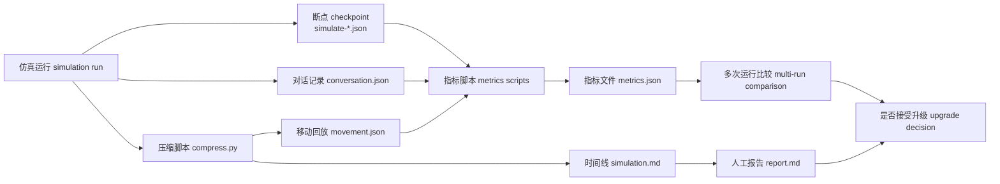
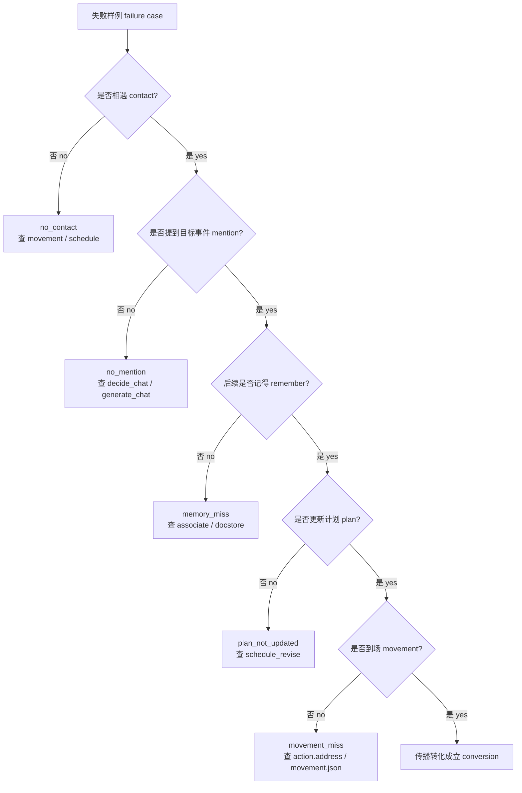

# 第 37 章 评价体系升级：从故事可信到可复现实验指标

## 37.1 派对看起来成功，证据链还没有自动闭合

`book-party-extended` 的对话记录里，伊莎贝拉在 2024-02-14 11:30 对玛丽亚说“下午五点的情人节派对你一定要来”，玛丽亚回答“五点刚好有休息时间，肯定会去参加”。这段故事很好读，但评价不能停在“她答应了”。工程上的问题是：

```text
玛丽亚是否真的知道派对，是否记住了时间地点，是否在 17:00-19:00 到过霍布斯咖啡馆，失败时又断在哪一环？
```

当前项目已经留下了足够多的线索：`conversation.json` 记录谁对谁说了什么，`movement.json` 记录角色位置和回放帧，`simulation.md` 方便人工快速定位故事片段，`results/checkpoints/<name>/simulate-*.json` 保存每个时间点的日程 schedule、行动 action、记忆 associate 和大语言模型 LLM 摘要。评价体系升级要做的不是把小镇变成冷冰冰的排行榜，而是把这些线索组织成可复查、可比较、可复现的证据链。



*图 37-1：生成式智能体 Generative Agents 的评价升级流水线。图中的每个节点都对应当前项目已经存在或拟新增的文件：`conversation.json`、`movement.json`、`simulation.md` 和断点 checkpoint 是强证据来源；`metrics.json` 与 `report.md` 是评价升级后的输出。*


*图 37-2：评价报告工作台。中央证据桌和天平表示评价 evaluation 必须同时接受确定性指标 deterministic metrics、大模型裁判 LLM as Judge 和人工复核 human review 的约束；周围的对话 conversation、移动 movement、时间线 simulation、断点 checkpoint、指标 metrics 与报告 report 共同构成证据链。*

## 37.2 高频术语锚点

| 中文 English | 当前项目位置 | 在评价中的职责 | 常见误读 |
| --- | --- | --- | --- |
| 对话记录 conversation | `generative_agents_next/results/checkpoints/<name>/conversation.json` | 记录对话时间、地点、说话双方和原文 | 只要出现关键词就算传播成功 |
| 移动回放 movement | `generative_agents_next/results/compressed/<name>/movement.json` | 验证角色是否真的到达目标地点 | 把口头承诺当成到场 |
| 时间线 simulation | `generative_agents_next/results/compressed/<name>/simulation.md` | 人工快速定位行为、位置和对话摘录 | 把压缩摘要当成唯一事实源 |
| 断点 checkpoint | `generative_agents_next/results/checkpoints/<name>/simulate-*.json` | 保存角色状态、日程 schedule、行动 action、记忆 associate、模型配置 | 只看最后一个断点，忽略过程变化 |
| 指标 metrics | `generative_agents_next/results/evaluations/<name>/metrics.json` | 机器可读统计结果 | 指标越高就越可信 |
| 报告 report | `generative_agents_next/results/evaluations/<name>/report.md` | 人工可读结论、证据摘录和失败样例 | 报告只写成功案例 |
| 模型摘要 LLM summary | `Game.agent_think()` 写入每步 `info["llm"]` | 记录模型名、成功数、失败数和请求数 | 只看最终行为，不看隐藏调用成本 |
| 提示词 prompt | `generative_agents/data/prompts/*.txt`，由 `Scratch.build_prompt()` 填充 | 解释 LLM 行为如何被驱动 | 评价只看输出，不回查 prompt 输入 |
| 调用类型 caller | `LLMModel.completion(..., caller="llm_normal")` | 可扩展为按提示词 prompt 类型统计成本 | 所有 LLM 调用混在一个总数里 |
| 失败模式 failure mode | `reflection_candidates.json`、`report.md` | 定位失败发生在接触、对话、记忆、计划、移动或格式解析 | 只写“失败”两个字 |

## 37.3 前沿评价思想要落回小镇证据

AgentBench、WebArena、GAIA、SWE-bench 和 AI Agents That Matter 的价值不在于给本项目贴论文标签，而在于提醒我们把“好看的回放”拆成可验证条件。

| 前沿框架 frontier benchmark | 对小镇项目的约束 | 输入 input | 处理 process | 输出 output | 验证方式 |
| --- | --- | --- | --- | --- | --- |
| AgentBench | 不只跑一个派对故事，要覆盖派对、竞选、关系形成、模型切换和反思消融 | 多个实验配置 experiment configs | 同一指标脚本跑多个事件 | 每个实验的 `metrics.json` 与跨运行汇总 | 对比默认系统、消融系统和模型变体 |
| WebArena | 语言承诺必须被环境 grounding 验证 | `conversation.json` 中的承诺，`movement.json` 中的位置 | 把承诺中的地点和时间窗映射到移动帧 | 到场数 attendance、承诺落地率 promise_action_match_rate | 回放页和 `movement.json` 双重核验 |
| GAIA | 多步骤任务链不能只看最终结果 | 源头目标、对话传播、记忆、日程、移动 | 为每一环打标签，找断点 | 传播深度 diffusion_depth、链路断点 chain_break | 抽查原文和断点状态 |
| SWE-bench | 成功条件要像测试一样可复查 | 实验目标、事实集合、目标地点、时间窗 | 用脚本判定“是否满足条件” | 通过/失败 verdict 和失败类型 failure_type | 失败样例必须能回到文件路径 |
| AI Agents That Matter | 记录基线、成本、重复性和公平比较 | 默认系统、升级系统、多次运行、LLM summary | 汇总均值、最小值、最大值、失败率和调用成本 | 多次运行报告 multi-run report | 每次只改变一个主要变量 |

这些框架共同指向一个工程结论：评价不是追加几行统计，而是把仿真输出变成可审计数据包。

## 37.4 当前项目已经留下哪些证据

当前代码已经具备评价升级的底座。关键链路如下。

| 证据材料 | 生成位置 | 关键数据结构 | 能回答的问题 | 证据强度 |
| --- | --- | --- | --- | --- |
| `conversation.json` | `start.py` 每个仿真步写入 | `{time: [{"A -> B @ address": [[speaker, text], ...]}]}` | 谁在何时何地说过目标事实 | 强证据，适合传播路径 |
| `simulate-*.json` | `SimulateServer.simulate()` | `agents.<name>.schedule`、`action`、`status`、`associate` | 角色当时计划什么、在哪里、记住什么 | 强证据，适合断点复查 |
| `movement.json` | `compress.py generate_movement()` | `start_datetime`、`stride`、`all_movement`、`conversation` | 角色是否真的移动到目标地点 | 强证据，适合环境落地 |
| `simulation.md` | `compress.py generate_report()` | 人设、活动记录、对话记录 | 人工快速阅读故事线 | 中证据，需要回到底层 JSON |
| `LLMModel.get_summary()` | `Game.agent_think()` | `{"model": "...", "summary": {"total": "S:x,F:y/R:z"}}` | 调用了多少次模型，失败多少次 | 强证据，适合成本统计 |
| `data/config.json` | 运行启动前读取 | `provider`、`model`、`embedding`、`poignancy_max`、`retention` | 本次实验的模型、检索和反思条件 | 强证据，适合基线说明 |

`Game.agent_think()` 是评价材料进入断点的关键位置。它把 `currently`、`associate`、`concepts`、`chats`、`action`、`schedule`、`address` 和可用时的 `llm` 摘要放进 `info`。虽然当前 `start.py` 保存的是角色配置状态而不是完整 `info` 对象，但这些字段已经说明项目内部有统一观察点，后续可以把评价脚本接到这个观察点上。

## 37.5 对话传播指标：从 conversation 到 diffusion

派对、竞选和讨论会这类实验，第一层指标来自对话传播。对话不是自然语言文本堆叠，而是有明确结构的数据。

```json
{
  "20240214-11:30": [
    {
      "伊莎贝拉 -> 玛丽亚 @ the Ville，霍布斯咖啡馆，咖啡馆，咖啡馆柜台后面": [
        ["伊莎贝拉", "下午五点的情人节派对你一定要来哦"],
        ["玛丽亚", "五点刚好有休息时间，肯定会去参加"]
      ]
    }
  ]
}
```

| 环节 | 输入 input | 处理 process | 输出 output | 失败模式 failure mode | 验证方式 |
| --- | --- | --- | --- | --- | --- |
| 关键词提取 keyword extraction | `conversation.json`、实验配置中的关键词 | 匹配“情人节、派对、霍布斯咖啡馆、五点”等同义表达 | `mentions[]`，含时间、地点、说话人、原文 | 漏掉同义词，或把旁支话题误计入传播 | 抽查原文上下文 |
| 源头识别 source tracing | 初始 `currently` 和第一条相关对话 | 判断信息是否来自伊莎贝拉或明确上游 | `source_agent`、`upstream_agent` | 没有上游来源却算成知道 | 标注“疑似幻觉知晓 hallucinated awareness” |
| 接受判断 acceptance | 含承诺的对话原文 | 区分接受、拒绝、犹豫、旁观提及 | `accepted_count`、`rejected_count` | 把礼貌回应当成接受 | 人工报告列出原话 |
| 事实保真 fact preservation | 核心事实：时间、地点、事件、发起人 | 比较后续转述是否保持核心事实 | `fact_preservation_score` | “五点”变“晚上”、咖啡馆变酒吧 | 逐条列出漂移字段 |

**公式 37-1：事实保真率 fact preservation score**

$$
\text{事实保真率}=\frac{\text{保留正确核心事实的转述数}}{\text{包含目标事件的转述总数}}
$$

读法：核心事实集合可以包含“发起人=伊莎贝拉”“地点=霍布斯咖啡馆”“时间=17:00-19:00”“事件=情人节派对”。如果 4 条转述中有 3 条完整保留这些字段，事实保真率为 \(3/4=0.75\)。这不是语义美感评分，而是事实字段是否漂移的工程指标。

### 对话 prompt 如何进入评价链

对话传播由一组真实提示词 prompt 驱动，不能只在报告末尾笼统写“模型生成了对话”。

| 机制 | 提示词 prompt 路径 | 主要变量 | 输出结构 schema / 字段 | 输出流向 |
| --- | --- | --- | --- | --- |
| 是否发起对话 decide chat | `generative_agents/data/prompts/decide_chat.txt` | `context`、`date`、`agent_status`、`another_status`、`agent`、`another` | `res: bool` | `Agent._chat_with()` 决定是否进入对话 |
| 关系摘要 relation summary | `generative_agents/data/prompts/summarize_relation.txt` | `context`、`agent`、`another` | `res: str` | 作为 `generate_chat` 的关系输入 |
| 生成对话 generate chat | `generative_agents/data/prompts/generate_chat.txt` | `base_desc`、`memory`、`address`、`current_time`、`previous_context`、`current_context`、`conversation` | `res: str` | 写入 `chats`，随后进入 `conversation.json` |
| 检查复读 repeat check | `generative_agents/data/prompts/generate_chat_check_repeat.txt` | `conversation`、`content`、`agent` | `res: bool` | 决定对话是否提前结束 |
| 判断结束 terminate | `generative_agents/data/prompts/decide_chat_terminate.txt` | `conversation`、`agent`、`another` | `res: bool` | 控制对话轮次 |
| 对话摘要 summarize chats | `generative_agents/data/prompts/summarize_chats.txt` | `conversation` | `res: str` | `schedule_chat()` 写入行动和聊天记忆 |

这些提示词 prompt 的评价价值在于定位失败：如果角色相遇但没有提到派对，先看 `decide_chat` 是否没有触发；如果提到派对但事实漂移，查 `generate_chat` 输入的 `memory` 和 `previous_context`；如果 `conversation.json` 里残留 `{"res": ...` 这类字符串，就归入结构化输出残留或解析边界问题，而不是把它当成正常对话美化掉。

## 37.6 到场与环境落地：从 movement 到 attendance

WebArena 给本项目最直接的启发是环境落地 grounding。小镇里，环境落地不靠角色自述，而靠 `movement.json` 和回放页面。

| 环节 | 输入 input | 处理 process | 输出 output | 失败模式 failure mode | 验证方式 |
| --- | --- | --- | --- | --- | --- |
| 目标地点定义 target location | 评价配置中的 `target_location` | 映射到地址片段，如“霍布斯咖啡馆，咖啡馆” | 标准地点表达 | 地点别名没覆盖 | 对照 `maze.json` 与 `movement.json` 的 `location` |
| 时间窗定义 time window | `attendance_window: ["17:00", "19:00"]` | 根据 `start_datetime`、`stride` 和帧号换算时间 | 帧范围 frame range | 时区或步长换算错误 | 复核 `movement.json.start_datetime` 和 `stride` |
| 到场判断 attendance | `all_movement` 中每帧角色位置 | 统计角色在时间窗内是否进入目标地点 | `arrived_agents[]`、`attendance_count` | 路过门口被算作到场 | 抽查回放帧和位置字段 |
| 承诺落地 promise to action | `conversation.json` 的接受话语 + `movement.json` 位置 | 匹配承诺者是否在时间窗内出现 | `promise_action_match_rate` | 承诺没有进入日程 | 回查 checkpoint 的 `schedule` 和 `action` |

**公式 37-2：承诺落地率 promise action match rate**

$$
\text{承诺落地率}=\frac{\text{承诺参加且到场的角色数}}{\text{承诺参加的角色数}}
$$

读法：如果玛丽亚和克劳斯都明确承诺参加，最终只有克劳斯在 17:00-19:00 出现在霍布斯咖啡馆，承诺落地率为 \(1/2=0.50\)。这个指标把“说过”和“做过”分开，避免把自然对话误当成行动完成。

现有回放链路已经可用：在 `generative_agents` 目录下，`python compress.py --name <实验名>` 会从 `results/checkpoints/<实验名>/` 生成 `results/compressed/<实验名>/simulation.md` 和 `movement.json`；`python replay.py` 再读取压缩结果提供前端回放。评价脚本不需要替代回放，而是把回放中的证据变成可比较字段。

## 37.7 断点、记忆与日程：从 checkpoint 定位断链

如果对话里有人答应参加，移动回放里却没有到场，下一步不能直接归咎于“模型不行”。断点 checkpoint 可以把失败定位到日程 schedule、记忆 associate、行动 action 或路径 movement。

| 检查对象 | 文件位置 | 字段 | 可回答的问题 |
| --- | --- | --- | --- |
| 当前行动 action | `simulate-*.json` 的 `agents.<name>.action.event` | `describe`、`address`、`emoji` | 角色当时要做什么，要去哪里 |
| 日程 schedule | `agents.<name>.schedule.daily_schedule` | `start`、`duration`、`describe`、`decompose` | 承诺是否进入计划，计划是否被修订 |
| 记忆 associate | `agents.<name>.associate.memory` 与 `storage/<name>/associate/docstore.json` | `event`、`chat`、`thought` 节点 | 角色是否保存了派对事实 |
| 反思状态 status | `agents.<name>.status.poignancy` | `poignancy` | 是否达到反思阈值 |
| 模型配置 llm | `agent_base.think.llm` | `provider`、`model`、`max_tokens` | 本次运行使用什么模型 |

### 日程 prompt 与计划修订证据

日程相关 prompt 直接影响到场指标，因此评价时必须知道它们的输入和输出。

| 机制 | 提示词 prompt 路径 | 主要变量 | 输出结构 schema / 字段 | 失败时看哪里 |
| --- | --- | --- | --- | --- |
| 起床时间 wake up | `data/prompts/wake_up.txt` | `base_desc`、`lifestyle`、`agent` | `res: int`，0 到 11 | 角色全天节奏异常 |
| 初始日程 schedule init | `data/prompts/schedule_init.txt` | `base_desc`、`lifestyle`、`wake_up` | `res: list[str]` | 日程过少或不合人设 |
| 小时日程 schedule daily | `data/prompts/schedule_daily.txt` | `daily_schedule`、`hourly_schedule` | `res: dict[str, str]` | 派对时间被日常任务覆盖 |
| 计划分解 schedule decompose | `data/prompts/schedule_decompose.txt` | `plan`、`increment`、`start`、`end` | `res: List[Tuple[str, int]]` | 子任务无法落到具体行动 |
| 日程修订 schedule revise | `data/prompts/schedule_revise.txt` | `original_plan`、`event`、`new_plan`、`duration` | `res: List[Tuple[str, str, str]]` | 对话承诺没有改写当前计划 |

`Agent.revise_schedule()` 是对话影响行动的关键位置。它先把当前行动写成 `memory.Action`，再在当前计划已有 `decompose` 时调用 `schedule_revise`，把新事件插入后续子计划。评价脚本可以在承诺之后检查后续断点：如果承诺者的 `daily_schedule` 和 `action.address` 从未靠近目标地点，应归入 `plan_not_updated` 或 `movement_miss`，而不是笼统写成传播失败。

## 37.8 统一 metrics.json 的数据结构

第一版 `metrics.json` 不需要试图评价所有社会行为。它只要把实验条件、传播、到场、成本和失败样例结构化，就已经能让项目从 demo 走向实验。

```json
{
  "experiment": {
    "name": "book-party-extended",
    "metric_version": "party_diffusion_v1",
    "start_datetime": "2024-02-14T08:00:00",
    "stride": 10,
    "agents": ["伊莎贝拉", "玛丽亚", "克劳斯", "山姆"],
    "model": {
      "provider": "minimax",
      "name": "MiniMax-M3",
      "embedding": "embo-01"
    }
  },
  "diffusion": {
    "source_agent": "伊莎贝拉",
    "unique_informed_agents": 4,
    "accepted_count": 2,
    "rejected_count": 1,
    "diffusion_depth": 2,
    "fact_preservation_score": 0.75
  },
  "attendance": {
    "target_location": "霍布斯咖啡馆",
    "window": "17:00-19:00",
    "arrived_agents": ["克劳斯"],
    "attendance_count": 1,
    "promise_action_match_rate": 0.5
  },
  "runtime": {
    "llm_total_requests": 320,
    "llm_success": 305,
    "llm_failures": 15,
    "failure_rate": 0.046875
  },
  "failures": [
    {
      "type": "plan_not_updated",
      "agent": "玛丽亚",
      "evidence": [
        "results/checkpoints/book-party-extended/conversation.json#20240214-11:30",
        "results/compressed/book-party-extended/movement.json"
      ]
    }
  ]
}
```

| 字段 | 来源 | 解释 | 必须保留的证据路径 |
| --- | --- | --- | --- |
| `experiment` | 启动命令、`data/config.json`、首尾断点 | 说明这次实验如何运行 | checkpoint 目录、模型配置 |
| `diffusion` | `conversation.json` | 说明目标事实如何传播 | 每条提及的时间、地点、原话 |
| `attendance` | `movement.json` | 说明承诺是否落到地点 | 帧号、时间窗、角色位置 |
| `runtime` | `LLMModel.get_summary()` | 说明成本、失败和重试 | `S:x,F:y/R:z` 原始摘要 |
| `failures` | 指标脚本 + 人工复核 | 说明失败类型和边界 | 对话、断点、移动回放路径 |

**公式 37-3：模型失败率 LLM failure rate**

$$
\text{模型失败率}=\frac{\text{最终失败次数 }F}{\text{请求尝试次数 }R}
$$

读法：`LLMModel.get_summary()` 的 `S:25,F:0/R:31` 表示最终成功 25 次、最终失败 0 次、总请求尝试 31 次。失败率是 \(0/31=0\)，但额外重试成本是 \(31-25=6\)。所以报告要同时记录失败率和重试成本。

## 37.9 统一 report.md 的人工裁决结构

`metrics.json` 适合脚本比较，`report.md` 适合人判断行为是否可信。报告不应只是把 JSON 换成 Markdown，而要把证据强弱、失败边界和人工裁决写清楚。

| 报告模块 | 内容 | 项目证据 |
| --- | --- | --- |
| 实验配置 experiment config | 实验名、时间、步长 stride、角色、模型、评价版本 | 启动命令、`data/config.json`、首个 checkpoint |
| 指标摘要 metrics summary | 传播、到场、成本、失败率 | `metrics.json` |
| 传播路径 diffusion path | 谁从谁那里知道，是否有上游来源 | `conversation.json` 原文 |
| 到场统计 attendance | 谁承诺，谁到场，谁缺席 | `movement.json` 帧和回放 |
| 记忆与计划 memory and schedule | 承诺是否进入记忆和日程 | `simulate-*.json`、`docstore.json` |
| 失败样例 failure cases | 每类失败至少一条原始证据 | 对话、断点、移动路径 |
| 成本与稳定性 cost and stability | 模型调用、重试、多次运行差异 | `LLM summary`、多次 `metrics.json` |
| 结论 verdict | 可接受、需复查或不接受升级 | 指标和人工证据共同决定 |

图 37-2 的工作台正对应这份报告结构：上半部分是评价产物，下半部分是回查入口。人工裁决必须从上往下读，再从下往上复查；如果一个数字不能回到底层文件，它就不应该进入结论。

## 37.10 基线、成本和多次运行

没有基线 baseline，就无法判断升级是否有效。没有成本 cost，就无法判断升级是否值得。没有多次运行 multi-run，就无法判断升级是否稳定。

| 对照变量 | 基线设置 | 升级设置 | 观察指标 | 归因边界 |
| --- | --- | --- | --- | --- |
| 默认系统 default | 不改源码，使用当前 `data/config.json` | 新评价脚本只读输出 | 指标能否生成 | 不评价行为提升 |
| 反思阈值 reflection threshold | `poignancy_max=150` | 调高或调低阈值 | 反思次数、事实保持、行为自然性 | 只改一个阈值 |
| 检索保留 retrieval retention | `associate.retention=8` | 调整保留数量 | 记忆引用率、事实漂移 | 不同时换模型 |
| 模型 provider | 当前 `minimax / MiniMax-M3` | `ollama` 本地模型或其他远程模型 | 格式失败率、成本、对话质量 | 保持 prompt 和角色不变 |
| 对话开关 dialogue | 默认对话逻辑 | 限制 `chat_iter` 或禁用对话 | 传播深度、到场率 | 只用于消融实验 |

多次运行建议至少记录 3-5 次。成本太高时可以先写“样例运行 sample run”，但不能把样例写成稳定统计结论。

```json
{
  "attendance_count": {
    "mean": 1.7,
    "min": 1,
    "max": 3,
    "std": 0.94
  },
  "fact_preservation_score": {
    "mean": 0.78,
    "min": 0.62,
    "max": 0.91,
    "std": 0.12
  }
}
```

多次运行的读法要诚实：均值高但方差大，说明系统偶尔很精彩但不稳定；到场率提高但调用成本暴涨，说明升级可能不适合长期运行；自然性下降，说明指标优化正在牺牲小镇可信行为。

## 37.11 失败分类比成功率更有用

社会仿真里的失败经常比成功更有诊断价值。推荐第一版失败分类如下。

| 失败类型 failure type | 表现 | 可能原因 | 检查位置 | 修正方向 |
| --- | --- | --- | --- | --- |
| `no_contact` | 角色没有相遇 | 路径、日程或空间距离不合适 | `movement.json`、`schedule` | 调整初始位置、日程或事件地点 |
| `no_mention` | 相遇但没提目标事件 | `decide_chat` 未触发或 `generate_chat` 没带目标 | `conversation.json`、`generate_chat` 输入 | 改 prompt 上下文或事件目标 |
| `memory_miss` | 听过但后续想不起 | `associate` 检索不到相关 chat/event | `docstore.json`、`Associate.retrieve_*()` | 调整检索、记忆类型或保留策略 |
| `fact_drift` | 时间、地点或人物漂移 | 对话生成时事实约束弱 | 后续转述原文 | 增加事实核对字段 |
| `plan_not_updated` | 口头承诺没有进入计划 | `schedule_revise` 未触发或输出不合格 | `schedule.daily_schedule` | 强化承诺到日程的桥接 |
| `movement_miss` | 计划有了但没到场 | 路径、地址映射或行动持续时间问题 | `action.address`、`movement.json` | 检查 `Maze` 地址和路径 |
| `llm_format_failure` | 输出残留 JSON 或解析失败 | 结构化输出不稳 | 对话原文、日志、`parse_structured_output()` | 调整 schema、failsafe 或模型 |
| `over_cooperation` | 所有人无条件接受 | 指标诱导过强 | 报告负样本和拒绝样例 | 保留合理拒绝和冲突 |



失败分类图用于定位断点，不用于给失败贴静态标签。每个标签都必须能指向一个检查位置。

## 37.12 评价脚本落地

第 37 章的评价升级已经落到 `generative_agents_next/analyze_experiment.py`。它只读本地输出，不调用 LLM，不改变角色行为。这样做的好处是：指标错误可以直接追到 JSON 解析和关键词规则，不会混入模型裁判的不确定性。

相对路径：`generative_agents_next/analyze_experiment.py`

```diff
+conversation = load_json("results/checkpoints/<name>/conversation.json", {})
+movement = load_json("results/compressed/<name>/movement.json", {})
+mentions = collect_mentions(rows, keywords)
+attendance = collect_attendance(movement, target_place, window_start, window_end)
+event_board = build_event_board(event, mentions, attendance)
+goal_progress = build_goal_progress(event_board)
+reflection_candidates = build_reflection_candidates(event_board, mentions)
+
+write("metrics.json")
+write("report.md")
+write("event_board.json")
+write("goal_progress.json")
+write("reflection_candidates.json")
```

| 输出产物 | 输入 input | 处理 process | 输出 output | 验证方式 |
| --- | --- | --- | --- | --- |
| `metrics.json` | `conversation.json`、`movement.json`、latest checkpoint | 汇总传播、承诺、到场、目标进度、记忆摘要 | 机器可读指标 | 抽查各字段的原始文件。 |
| `report.md` | `metrics.json` 和证据列表 | 生成可读报告 | 人工复核文本 | 检查每条结论是否有证据。 |
| `event_board.json` | 关键词命中、承诺判断、到场窗口 | 构造事件状态 | known/accepted/rejected/arrived/tasks | 对照原始对话和移动。 |
| `goal_progress.json` | `event_board.json` | 把事件状态转成目标进度 | informed/accepted/arrived/missing | 不能把承诺当到场。 |
| `reflection_candidates.json` | `event_board.json`、mentions | 找出承诺但未到场的失败样例 | outcome/failure_type/evidence | 人工判断是否能生成 lesson。 |

通用执行命令：

```bash
cd generative_agents_next
python analyze_experiment.py --name <实验名> --event valentine_party --keywords "情人节,派对,五点,5点,17:00,霍布斯咖啡馆" --target-place "霍布斯咖啡馆" --window-start "20240214-17:00" --window-end "20240214-19:00"
```

工作目录、输入和输出如下：

```text
工作目录：generative_agents_next
输入文件：results/checkpoints/<实验名>/conversation.json
输入文件：results/compressed/<实验名>/movement.json
输入文件：results/checkpoints/<实验名>/simulate-*.json
输出文件：results/evaluations/<实验名>/metrics.json
输出文件：results/evaluations/<实验名>/report.md
输出文件：results/evaluations/<实验名>/event_board.json
输出文件：results/evaluations/<实验名>/goal_progress.json
输出文件：results/evaluations/<实验名>/reflection_candidates.json
```

评价脚本的边界也要写清楚：第一版不做自动主观评分，只统计可验证事实和证据路径。行为自然性 naturalness、可信裁决 verdict 和负样本解释仍由人工报告承担。

## 37.13 实验结果分析（待填写）

评价脚本跑完后，本节填写实际结果。写法要像审计报告，不像故事摘要。

| 分析项 | 读取文件 | 填写口径 |
| --- | --- | --- |
| 指标完整性 | `metrics.json` | 是否包含 `diffusion/commitments/attendance/goal_progress/memory_summary`。 |
| 传播证据 | `report.md`、`conversation.json` | 列出关键命中原话，标注说话人和时间。 |
| 到场证据 | `movement.json`、`report.md` | 确认时间窗、地点关键字和角色位置。 |
| 失败样例 | `reflection_candidates.json` | 哪些失败能转成反思样例，哪些只是证据不足。 |
| 指标边界 | 人工复核 | 说明关键词误命中、礼貌回应误判、移动时间窗不足等问题。 |

如果某次实验的 `final_time` 早于 17:00，评价报告只能说明“实验没有覆盖到派对时间窗”，不能据此判断派对到场失败。时间范围本身也是指标结论的一部分。

## 37.14 不要为了指标牺牲可信行为

指标会改变系统设计方向，所以必须保留负样本。派对传播覆盖率高，不等于小镇更真实；所有人都准时到场，反而可能说明角色失去了日程冲突、关系差异和个人动机。社会仿真尤其需要“不完美”：合理拒绝、误解、迟到、遗忘和冲突，常常比整齐划一的成功更可信。

| 指标诱惑 | 可能副作用 | 防护方式 |
| --- | --- | --- |
| 提高传播覆盖率 | 角色像广播员一样重复事件 | 报告对话自然性和重复率 |
| 提高到场率 | 所有人无条件接受邀请 | 保留拒绝、犹豫和缺席样例 |
| 提高目标完成率 | 角色强行打断日常生活 | 记录日程冲突和人设一致性 |
| 降低失败率 | 脚本忽略边界案例 | 强制输出失败样例 |
| 降低成本 | 小模型导致格式漂移 | 同时记录格式失败和人工复核 |

评价体系不追求数字漂亮；它要说明：在什么配置、什么模型、什么角色、什么事件和什么成本下，生成式智能体 Generative Agents 能稳定地产生哪类可信行为。

## 37.15 本章小结

评价体系升级把“故事看起来可信”推进到“证据可以复查、指标可以比较、失败可以定位”。当前项目已经有 `conversation.json`、`movement.json`、`simulation.md`、断点 checkpoint、prompt 链路和 LLM summary；缺的是把它们组织成 `metrics.json`、`report.md`、基线 baseline、多次运行 multi-run 和失败分类 failure taxonomy。

| 主题 | 核心结论 |
| --- | --- |
| 评价现场 | 派对传播不能只看承诺，必须同时看对话、记忆、日程、移动和成本 |
| 前沿框架 | AgentBench、WebArena、GAIA、SWE-bench 和 AI Agents That Matter 都要落回项目证据 |
| 对话传播 | `conversation.json` 是传播强证据，但要区分提及、接受、拒绝和事实漂移 |
| 环境落地 | `movement.json` 验证语言承诺是否真的变成位置行动 |
| prompt 证据 | `decide_chat`、`generate_chat`、`schedule_revise` 等 prompt 要随机制解释 |
| 指标产物 | `metrics.json` 给脚本读，`report.md` 给人读，`event_board.json`、`goal_progress.json`、`reflection_candidates.json` 分别支撑协作、目标和反思分析 |
| 失败分类 | 失败应定位到接触、提及、记忆、计划、移动、格式或过度合作 |
| 边界 | 指标不能替代可信行为判断，负样本和人工证据必须保留 |

下一章收束第五部分：这些评价能力先落地，然后再分阶段推进记忆、反思、目标规划、组织协作和模型路由。没有评价底座，任何前沿升级都很难证明自己真的让小镇变得更可靠。

## 参考资料

- AgentBench: https://arxiv.org/abs/2308.03688
- WebArena: https://arxiv.org/abs/2307.13854
- GAIA: https://arxiv.org/abs/2311.12983
- SWE-bench: https://arxiv.org/abs/2310.06770
- AI Agents That Matter: https://arxiv.org/abs/2407.01502
- Local source: `generative_agents/start.py`
- Local source: `generative_agents/compress.py`
- Local source: `generative_agents/modules/game.py`
- Local source: `generative_agents/modules/agent.py`
- Local source: `generative_agents/modules/model/llm_model.py`
- Local upgrade source: `generative_agents_next/analyze_experiment.py`
- Local prompt: `generative_agents/data/prompts/generate_chat.txt`
- Local prompt: `generative_agents/data/prompts/schedule_revise.txt`
- Local output: `generative_agents_next/results/checkpoints/<实验名>/conversation.json`
- Local output: `generative_agents_next/results/checkpoints/<实验名>/simulate-*.json`
- Local output: `generative_agents_next/results/compressed/<实验名>/movement.json`
- Local output: `generative_agents_next/results/compressed/<实验名>/simulation.md`
- Local pending output: `generative_agents_next/results/evaluations/<实验名>/metrics.json`
- Local pending output: `generative_agents_next/results/evaluations/<实验名>/report.md`
