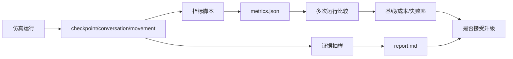

# 第 37 章 评价体系升级：从故事可信到可复现实验指标

## 37.1 核心问题

第 27 章已经建立了“可信行为”的评价框架。第 34 章又把单次小镇故事推进到批量社会仿真。评价体系升级继续向前推进一个问题：

```text
如何让 Generative Agents 的实验评价更接近 2023-2026 年 Agent 领域的严谨标准？
```

Agent 领域过去几年有一个很大的问题：

```text
demo 很精彩，但评价不够稳。
```

很多系统展示了漂亮轨迹、自然对话或任务成功案例。但读者很难知道：

- 是否只挑了最好的一次。
- 是否有强基线对照。
- 失败率是多少。
- 成本是多少。
- 多次运行是否稳定。
- 换模型后是否仍有效。
- 指标是否真的衡量了目标能力。

本章聚焦六个问题：

1. 为什么 agent 评价不能只看演示？
2. AgentBench、WebArena、GAIA、SWE-bench 和 AI Agents That Matter 给我们什么启发？
3. Generative Agents 当前已有哪些评价材料？
4. 如何设计指标脚本和统一报告？
5. 如何设置基线、成本和多次运行统计？
6. 如何避免为了指标牺牲可信行为？



*图 37-1：Generative Agents 的评价升级流水线。评价升级要把原始日志、指标脚本、报告和人工证据连起来，避免只凭演示效果下结论。*

## 37.2 从“故事可信”到“实验可信”

Generative Agents 的魅力来自故事。Smallville 中，派对传播、竞选讨论和关系形成都很有叙事感。Generative Agents 的回放也很容易让读者进入故事。但研究和工程不能只停在故事。故事可信回答的是：

```text
这个案例看起来是否合理？
```

实验可信回答的是：

```text
在明确条件下，这个系统是否稳定地产生某类可验证行为？
```

两者都重要。没有故事，读者难以理解系统。没有实验，读者无法判断系统能力。本章目标就是把故事转成实验。

## 37.3 AgentBench 的启发

AgentBench 试图在多种环境中评估 LLM as agents。它的启发是：

```text
agent 能力不应该只在一个任务、一种环境、一个案例中评价。
```

对 Generative Agents 来说，这意味着：

不要只跑派对实验。还要跑：

- 竞选传播。
- 关系形成。
- 自定义讨论会。
- 本地模型实验。
- 反思消融。
- 目标规划升级。

不同实验考察不同能力。派对更适合评价传播和协同行动。竞选更适合评价态度分化和信息保持。关系形成更适合评价长期记忆和反思。本地模型实验更适合评价模型适配和结构化输出。多任务评价比单一 replay 更可靠。

## 37.4 WebArena 的启发

WebArena 强调在真实感更强的网页环境中评价 autonomous agents。它的启发是：

```text
Agent 评价必须看环境 grounding。
```

一个 agent 说“我完成了任务”不够。它必须在环境中真的完成。对 Generative Agents 来说，环境 grounding 对应：

- Maze。
- Tile。
- 地址树。
- movement。
- 对象占用。
- 回放位置。

例如角色说：

```text
我会在 17:00 去霍布斯咖啡馆。
```

评价时必须检查：

```text
movement.json 中它是否真的到达霍布斯咖啡馆？
```

这就是 WebArena 给小镇项目的启发：

```text
语言承诺必须用环境状态验证。
```

## 37.5 GAIA 的启发

GAIA 关注通用 AI assistant 处理真实复杂任务的能力。它的启发是：

```text
评价要关注多步骤任务链。
```

很多 agent 失败不是因为单步回答差，而是因为长链路中某一步断了。小镇实验也是这样。一个派对传播链包括：

```text
伊莎贝拉有派对目标
  -> 她遇到别人
  -> 她自然提到派对
  -> 对方听懂时间地点
  -> 对方记住
  -> 对方可能转述
  -> 有人调整计划
  -> 有人到场
```

如果最后没人到场，不能只说“失败”。要定位是哪一环断了。GAIA 式复杂任务评价提醒我们：

```text
指标要覆盖任务链路，而不是只看最终结果。
```

## 37.6 SWE-bench 的启发

SWE-bench 用真实 GitHub issue 检验模型是否能解决软件工程问题。它的启发是：

```text
任务完成要有可验证结果。
```

在软件工程里，可验证结果可能是测试通过。在小镇仿真里，可验证结果可以是：

- 关键词传播路径。
- 到场记录。
- 日程变化。
- 关系记忆变化。
- 反思节点生成。
- 多次运行统计。

不要只让模型自评。不要只让角色说“我做到了”。要用外部证据判断。例如：

```text
accepted_count
attendance_count
promise_action_match_rate
fact_preservation_score
```

这些指标就是小镇任务的“测试”。

## 37.7 AI Agents That Matter 的启发

AI Agents That Matter 对 agent 评价提出了非常直接的批评。它提醒我们关注：

- 可重复性。
- 基线。
- 成本。
- 统计显著性。
- 公平比较。
- 工具和模型带来的混淆。

如果只展示一个好看的回放，就是在重复 agent demo 的老问题。一本严肃的项目书应该记录：

- 运行了几次。
- 成功几次。
- 失败几次。
- 使用什么模型。
- 花费多少调用。
- 和什么基线比。
- 改动是否只影响一个变量。

这不是为了把小镇变成冷冰冰的 benchmark。而是为了让读者知道：

```text
这个系统到底在哪些条件下有效。
```

## 37.8 当前项目已有评价基础

Generative Agents 已经提供很多评价材料。第一，`simulation.md`。用于人工阅读行为和对话。第二，`conversation.json`。用于追踪对话和传播路径。第三，checkpoint。用于查看 agent 状态、记忆、日程、行动和 LLM 摘要。第四，`movement.json`。用于检查位置和回放。第五，LLM summary。`LLMModel.get_summary()` 会记录调用成功、失败和请求数。在 `Game.agent_think()` 中，如果 agent 的 LLM 可用，会把 summary 写入 info：

```text
info["llm"] = agent._llm.get_summary()
```

这意味着项目已经有成本和失败率记录的入口。还缺的是统一收集和报告。

## 37.9 当前评价缺口

当前项目的评价缺口主要有六个。第一，没有统一 metrics 输出。每次实验需要人工看文件。第二，没有批量运行汇总。多次实验结果不容易比较。第三，没有标准基线。读者不知道升级版相对默认系统提升在哪里。第四，没有成本报告。LLM 调用统计存在，但没有汇总成实验级指标。第五，没有失败类型分类。失败样例需要人工整理。第六，没有实验配置文件。运行条件容易散落在命令行和口头说明中。这些缺口不影响项目作为教学 demo。但会影响它作为研究实验平台。

## 37.10 升级方向一：指标脚本

建议增加以下工具：

```text
tools/analyze_conversation_keywords.py
tools/analyze_attendance.py
tools/analyze_memory_references.py
tools/compare_experiment_runs.py
tools/export_experiment_report.py
```

它们分别负责：

- 对话关键词和传播路径。
- 指定地点和时间窗到场统计。
- 记忆引用准确率抽样。
- 多次运行指标比较。
- 导出 Markdown 和 JSON 报告。

第一版不需要复杂。可以先支持派对和竞选两个事件。工具脚本的价值不是自动取代判断，而是建立标准流程。

## 37.11 升级方向二：统一 metrics.json

每次实验可以生成：

```text
generative_agents/results/evaluations/<实验名>/metrics.json
```

示例：

```json
{
  "experiment": {
    "name": "book-party-small-run-01",
    "model": "qwen3.5:4b-q4_K_M",
    "embedding": "qwen3-embedding:0.6b-q8_0",
    "start": "20240214-08:00",
    "step": 72,
    "stride": 10,
    "agents": 6
  },
  "diffusion": {
    "unique_informed_agents": 4,
    "direct_mentions": 2,
    "indirect_mentions": 1,
    "diffusion_depth": 2,
    "fact_preservation_score": 0.75
  },
  "attendance": {
    "target_location": "霍布斯咖啡馆",
    "window": "17:00-19:00",
    "arrived_agents": ["伊莎贝拉", "玛丽亚"],
    "attendance_count": 2
  },
  "runtime": {
    "llm_requests": 320,
    "llm_success": 305,
    "llm_failures": 15,
    "elapsed_minutes": 95
  }
}
```

这个文件让实验可以被脚本读取、比较和汇总。

## 37.12 升级方向三：统一 report.md

除了机器可读的 `metrics.json`，还应生成人工可读报告：

```text
generative_agents/results/evaluations/<实验名>/report.md
```

报告结构：

```markdown
# 实验评价报告

## 实验配置

## 指标摘要

## 传播路径

## 到场统计

## 记忆与计划证据

## 失败样例

## 成本与稳定性

## 结论
```

这能把第 27 章的评分表、第 34 章的统计指标和本章的成本记录连接起来。

## 37.13 升级方向四：基线对照

没有基线，就无法判断升级是否有效。建议至少设置五类基线。第一，默认完整系统。这是当前 Generative Agents。第二，高反思阈值。把 `poignancy_max` 调高，减少反思，观察关系和传播是否变弱。第三，低检索保留。降低 `associate.retention`，观察记忆连续性是否下降。第四，禁用或减少对话。观察信息传播是否消失。第五，小模型 vs 大模型。观察模型能力对结构化输出、对话和反思的影响。每次只改一个主要变量。否则不能归因。

## 37.14 升级方向五：成本记录

Agent 系统评价必须记录成本。成本包括：

- LLM 请求次数。
- 成功次数。
- 失败次数。
- 重试次数。
- 运行耗时。
- 本地模型硬件条件。
- 远程 API token 成本。

当前 `LLMModel` 已经有 summary：

```text
S:成功数,F:失败数/R:请求数
```

可以把它汇总成：

```json
{
  "llm_total_requests": 320,
  "llm_success": 305,
  "llm_failures": 15,
  "failure_rate": 0.046875
}
```

成本记录会改变我们对系统的判断。一个升级如果让传播率提升 5%，但 LLM 调用增加 5 倍，不一定值得。

## 37.15 升级方向六：失败分类

失败不是一个类别。建议把失败分为：

```text
no_contact
```

该失败表示角色没有相遇。

```text
no_mention
```

相遇但没有提到目标事件。

```text
memory_miss
```

该失败表示角色听过但后续想不起。

```text
fact_drift
```

时间、地点或人物说错。

```text
plan_not_updated
```

口头承诺没有进入计划。

```text
movement_miss
```

计划或承诺没有落地到位置。

```text
llm_format_failure
```

该失败表示结构化输出失败。

```text
over_cooperation
```

所有角色无条件接受。分类之后，改进方向才清楚。例如 `no_contact` 可能是路径和时间问题。`memory_miss` 是检索问题。`plan_not_updated` 是日程修订问题。`llm_format_failure` 是模型适配问题。

## 37.16 升级方向七：多次运行统计

每个实验至少建议运行 3-5 次。报告中写：

```text
mean
min
max
standard deviation
```

例如：

```json
{
  "attendance_count": {
    "mean": 2.2,
    "min": 1,
    "max": 3
  },
  "diffusion_depth": {
    "mean": 1.8,
    "min": 1,
    "max": 3
  }
}
```

如果运行成本太高，可以先少量运行。但要明确说明：

```text
这是样例结果，不是稳定统计结论。
```

评价报告应优先透明，而不是夸大效果。

## 37.17 升级方向八：评价配置版本化

指标脚本本身也会变化。因此评价配置也要版本化。例如：

```text
evaluations/configs/party_diffusion_v1.json
```

内容：

```json
{
  "metric_version": "party_diffusion_v1",
  "keywords": ["情人节", "派对", "霍布斯咖啡馆"],
  "core_facts": {
    "source": "伊莎贝拉",
    "location": "霍布斯咖啡馆",
    "time": ["17:00", "下午5点"]
  },
  "attendance_window": ["17:00", "19:00"]
}
```

这样以后指标变化时，旧实验仍能解释。没有评价版本，实验结果会变得不可追溯。

## 37.18 不要为了指标牺牲可信行为

指标有一个危险：

```text
系统可能为了指标优化，而不是为了可信行为优化。
```

例如只看传播覆盖率，系统可能让角色到处重复广播派对。只看到场率，系统可能让所有人准时到场，失去拒绝和冲突。只看任务完成率，角色可能做出不符合人设的行为。因此评价要同时保留：

- 定量指标。
- 人工证据。
- 负样本。
- 行为自然性评分。
- 风险说明。

Agent 评价不是越高越好。而是要让指标与目标一致。社会仿真尤其需要保留不完美。合理拒绝、误解、迟到和冲突都可能提升可信度。

## 37.19 最小可行评价升级

建议读者按四步实现。第一步，输出 `metrics.json`。先记录实验配置、模型、agent 数、step、stride。第二步，做派对关键词统计。从 `conversation.json` 抽取提及。第三步，做派对到场统计。从 `movement.json` 统计 17:00-19:00 霍布斯咖啡馆到场。第四步，生成 `report.md`。把指标、证据和失败样例写成一页报告。这四步不改核心 agent 行为。风险低，但收益高。它会让整个项目从“能看回放”进入“能做实验”。

## 37.20 本章小结

评价体系升级的目标，是把“这个故事看起来可信”推进到“在明确条件下可以复查、比较和复现”。指标脚本有用，但不能替代对可信行为的判断。

| 本章内容 | 核心结论 |
| --- | --- |
| 故事可信 vs 实验可信 | 前者看案例是否合理，后者看系统在明确条件下是否稳定产生可验证行为。 |
| AgentBench 启发 | 评价要覆盖多任务、多环境。 |
| WebArena 启发 | 环境 grounding 很关键，语言承诺必须落地到位置和行动。 |
| GAIA 启发 | 评价要看多步骤任务链，而不是只看最终结果。 |
| SWE-bench 启发 | 成功条件要可验证。 |
| AI Agents That Matter 启发 | 可重复性、基线、成本、统计和公平比较都不能省。 |
| 当前材料 | Generative Agents 已有 `simulation.md`、`conversation.json`、checkpoint、`movement.json` 和 LLM summary。 |
| 可落地升级 | 指标脚本、统一 `metrics.json`、统一 `report.md`、基线对照、成本记录、失败分类、多次运行统计和评价配置版本化。 |
| 指标边界 | 指标不能替代可信行为判断，必须结合人工证据、负样本和风险边界。 |

下一章是第五部分的收束：基于前面所有前沿洞察，给出一条面向 Generative Agents 的分阶段升级路线图。

## 参考资料

- AgentBench: https://arxiv.org/abs/2308.03688
- WebArena: https://arxiv.org/abs/2307.13854
- GAIA: https://arxiv.org/abs/2311.12983
- SWE-bench: https://arxiv.org/abs/2310.06770
- AI Agents That Matter: https://arxiv.org/abs/2407.01502
- Local source: `generative_agents/modules/model/llm_model.py`
- Local source: `generative_agents/modules/game.py`
- Local output: `generative_agents/results/compressed/<实验名>/simulation.md`
- Local output: `generative_agents/results/checkpoints/<实验名>/conversation.json`
- Local output: `generative_agents/results/compressed/<实验名>/movement.json`
