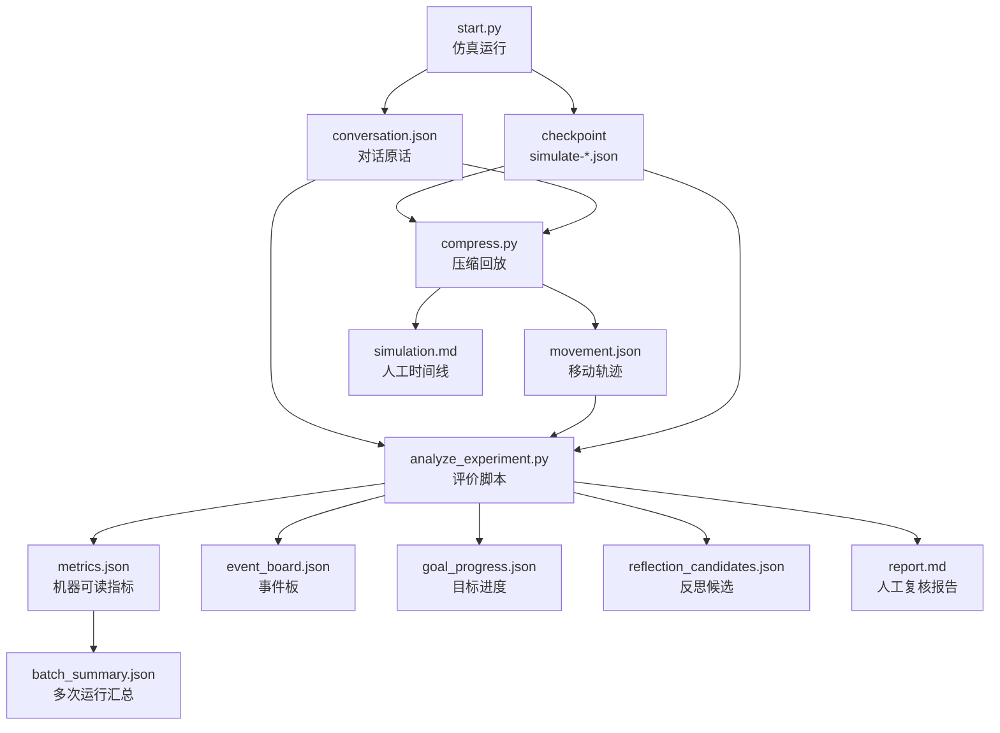
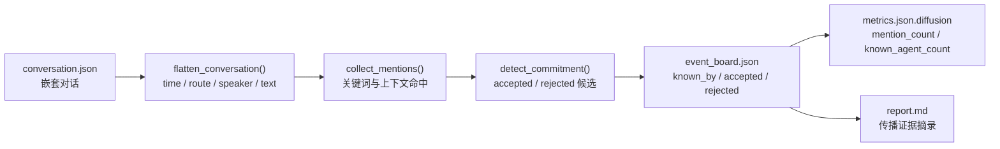
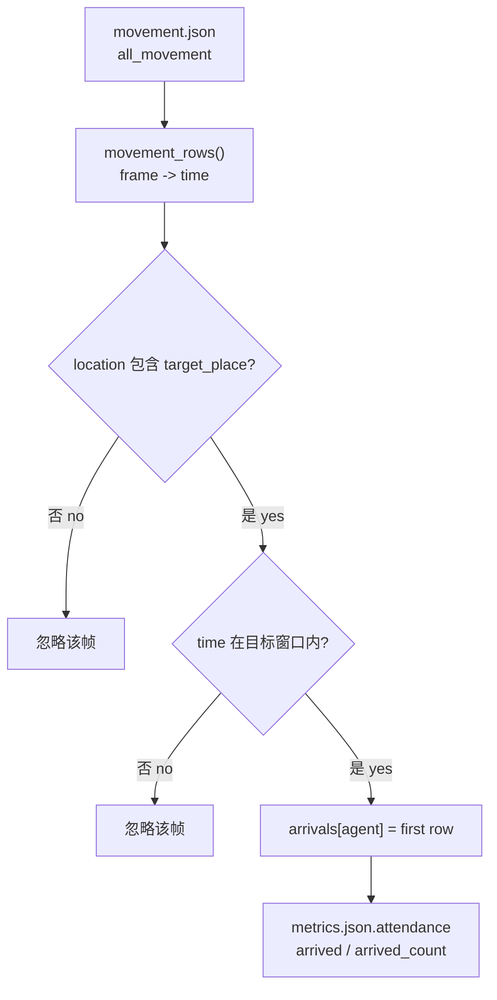
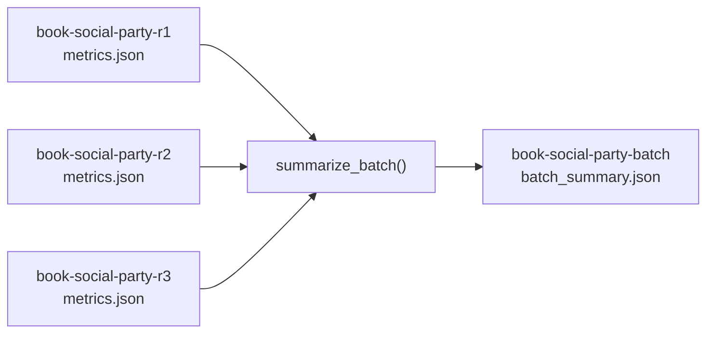
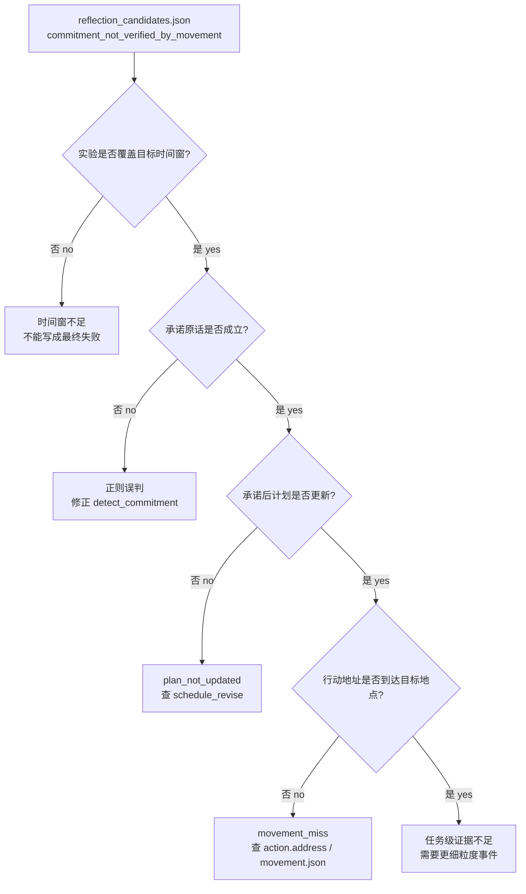

# 第 37 章 评价体系升级：从故事可信到可复现实验指标

## 37.1 要解决的问题：把故事判断变成可复查评价

第 36 章已经把多次运行整理成实验包，但实验包本身不会自动告诉我们“派对是否可信”。`book-collaboration-party` 的回放很容易让人产生成功印象：2024-02-14 12:30，伊莎贝拉告诉克劳斯“今天下午5点到7点我们这儿有情人节派对”；16:10，玛丽亚提醒克劳斯“派对5点就开始了”；17:00，`movement.json` 显示伊莎贝拉、玛丽亚和克劳斯出现在霍布斯咖啡馆，17:40 埃迪也到场。

这段故事好读，但评价不能停在“我觉得它发生了”。工程上的问题是：

```text
谁知道派对？谁做了承诺？谁只是聊到了派对？谁真的在 17:00-19:00 到达霍布斯咖啡馆？如果失败，断点发生在传播、承诺、日程、移动，还是报告归纳？
```

本章解决的是“评价闭环”：把原始运行包里的对话、移动、断点和压缩回放，整理成脚本可读的 `metrics.json`、人可复核的 `report.md`，以及面向任务、目标和反思的辅助文件。它不是给角色打主观分，也不是让大语言模型 LLM 再评价一遍故事，而是先用确定性规则把可核验证据拉出来。

| 判断对象 | 原始证据 | 当前落地产物 | 能回答的问题 |
| --- | --- | --- | --- |
| 信息传播 diffusion | `conversation.json` | `metrics.json.diffusion`、`report.md` 传播证据 | 谁在对话中提到目标事件，是否存在传播链。 |
| 承诺与拒绝 commitment | `conversation.json` 原话和 `detect_commitment()` 规则 | `event_board.json`、`metrics.json.commitments` | 谁明确接受、拒绝或表达时间冲突。 |
| 环境落地 attendance | `movement.json` 的时间、地点、角色位置 | `metrics.json.attendance`、`report.md` 到场证据 | 承诺是否被目标时间窗内的位置证据验证。 |
| 目标进度 goal progress | 传播、承诺、到场的组合结果 | `goal_progress.json` | 任务链完成到哪一步，缺口是什么。 |
| 失败候选 reflection candidates | 承诺但未到场 | `reflection_candidates.json` | 哪些失败应该进入后续反思和经验学习。 |
| 多次运行比较 batch comparison | 多个实验的 `metrics.json` | `batch_summary.json` | 多次 run 的均值、缺失文件和异常样例。 |

当前实现落在 `generative_agents_next/analyze_experiment.py`。脚本只读取本地文件，不调用 LLM，不改变角色行为。单次运行模式读取 `results/checkpoints/<name>/conversation.json`、`results/compressed/<name>/movement.json` 和最新 checkpoint；批量模式读取多个 `results/evaluations/<name>/metrics.json`，再输出 `batch_summary.json`。因此，评价体系首先保证的是“证据可复查”和“指标可比较”，而不是宣称自动理解了全部社会行为。

### 论文依据与工程落点

这一章的评价思路来自五类前沿工作。它们不直接替本项目定义指标，但共同约束了一个方向：智能体评价不能只看最终故事，要看任务条件、环境落地、过程证据、失败样例和重复运行。

| 评价方向 | 论文或基准 | 论文要点 | 本项目落点 |
| --- | --- | --- | --- |
| 多任务基准 agent benchmark | AgentBench | 把大语言模型智能体放进不同任务环境中比较，强调不能只用单一故事证明能力。 | 派对、协作、选举和批量 run 使用同一套评价脚本，避免每章重新发明指标。 |
| 环境扎根 grounding | WebArena | 任务成功需要在可交互环境中完成，而不是只生成合理文本。 | 承诺类对话必须回到 `movement.json` 验证地点和时间窗。 |
| 多步骤证据 chain evidence | GAIA | 复杂任务需要跨步骤推理和工具使用，最终答案之外还要关注中间证据。 | 评价拆成传播、承诺、到场、目标进度和失败候选，不把最终 `success` 当成唯一结论。 |
| 可复查测试 testable outcome | SWE-bench | 成功条件应能回到代码、补丁和测试结果复查。 | 每个指标都保留文件路径、时间、角色和原话，报告结论必须能回到 JSON。 |
| 可重复与成本 rigor | AI Agents That Matter | 智能体论文需要报告基线、可重复性、成本和失败，而不是只展示成功案例。 | 第 36 章的批量 run 和本章的 `batch_summary.json` 共同支撑重复运行；成本统计仍需继续接入 LLM summary。 |


```mermaid
flowchart TD
    Start["start.py<br/>仿真运行"] --> CK["checkpoint<br/>simulate-*.json"]
    Start --> Conv["conversation.json<br/>对话原话"]
    CK --> Compress["compress.py<br/>压缩回放"]
    Conv --> Compress
    Compress --> Move["movement.json<br/>移动轨迹"]
    Compress --> Sim["simulation.md<br/>人工时间线"]
    Conv --> Analyze["analyze_experiment.py<br/>评价脚本"]
    Move --> Analyze
    CK --> Analyze
    Analyze --> Metrics["metrics.json<br/>机器可读指标"]
    Analyze --> Board["event_board.json<br/>事件板"]
    Analyze --> Goal["goal_progress.json<br/>目标进度"]
    Analyze --> Reflect["reflection_candidates.json<br/>反思候选"]
    Analyze --> Report["report.md<br/>人工复核报告"]
    Metrics --> Batch["batch_summary.json<br/>多次运行汇总"]
```

*图 37-1：从小镇运行 run 到评价数据包 evaluation package 的数据流。`conversation.json` 和 `movement.json` 是强证据，checkpoint 提供角色状态和记忆摘要，`simulation.md` 只作为阅读入口；真正用于比较的是 `metrics.json`、`event_board.json`、`goal_progress.json`、`reflection_candidates.json`、`report.md` 和批量模式的 `batch_summary.json`。*


*图 37-2：评价报告工作台。中央证据桌和天平表示评价 evaluation 必须同时接受确定性指标 deterministic metrics、人工复核 human review 和失败样例 failure samples 的约束；周围的对话 conversation、移动 movement、时间线 simulation、断点 checkpoint、指标 metrics 与报告 report 共同构成证据链。当前实现以本地规则脚本为主，LLM-as-judge 仍属于后续扩展。*

## 37.2 评价对象与证据等级

评价体系先解决证据分层。`conversation.json` 和 `movement.json` 能直接回答“说过什么、到过哪里”，属于强证据；`simulation.md` 适合阅读故事线，但它是压缩后的人工入口，不应替代底层 JSON；checkpoint 能定位角色状态、日程和记忆，但需要按时间点逐个回查。

| 证据对象 | 真实路径 | 生成入口 | 能回答的问题 | 证据等级 | 常见误判 |
| --- | --- | --- | --- | --- | --- |
| 对话记录 conversation | `generative_agents_next/results/checkpoints/<name>/conversation.json` | `generative_agents_next/start.py` | 谁在什么时间、什么地点、对谁说了什么 | 强 | 把关键词命中当成传播成功 |
| 移动回放 movement | `generative_agents_next/results/compressed/<name>/movement.json` | `generative_agents_next/compress.py` | 角色是否在目标时间窗进入目标地点 | 强 | 把口头承诺当成真实到场 |
| 断点 checkpoint | `generative_agents_next/results/checkpoints/<name>/simulate-*.json` | `SimulateServer.simulate()` | 角色当时的状态、日程、行动、记忆摘要 | 强 | 只看最后一个断点，忽略过程变化 |
| 时间线 simulation | `generative_agents_next/results/compressed/<name>/simulation.md` | `generate_report()` | 快速阅读活动、位置和对话片段 | 中 | 把压缩摘要当成唯一事实源 |
| 评价指标 metrics | `generative_agents_next/results/evaluations/<name>/metrics.json` | `analyze_experiment.py` | 传播、承诺、到场、目标进度和记忆数量 | 强 | 指标高就代表行为可信 |
| 人工报告 report | `generative_agents_next/results/evaluations/<name>/report.md` | `write_report()` | 摘出关键原话、到场证据和失败候选 | 中 | 只读报告，不回查原始 JSON |
| 事件板 event board | `generative_agents_next/results/evaluations/<name>/event_board.json` | `build_event_board()` | 谁知道、谁接受、谁拒绝、谁到场 | 强 | 把候选接受/拒绝当成最终裁决 |
| 反思候选 reflection candidates | `generative_agents_next/results/evaluations/<name>/reflection_candidates.json` | `build_reflection_candidates()` | 哪些承诺没有被移动证据验证 | 中 | 直接写成角色长期性格判断 |

评价脚本只读取本地结果，不调用大语言模型 LLM。这个选择很朴素，但很重要：一旦指标有问题，可以回到 `analyze_experiment.py` 的 JSON 解析、关键词列表或正则规则排查，而不是混入另一次模型裁判的不确定性。

## 37.3 对话传播：从 conversation 到 event_board

对话传播 diffusion 的原始单位不是自然段，而是带时间、路线和发言人的结构化记录。`book-collaboration-party` 中，`conversation.json` 的一段真实记录如下。

```json
{
  "20240214-12:30": [
    {
      "克劳斯 -> 伊莎贝拉 @ the Ville，霍布斯咖啡馆，咖啡馆，咖啡馆柜台后面": [
        [
          "克劳斯",
          "嗨，伊莎贝拉！看起来你也在霍布斯吃午餐——今天的午餐看起来不错吧？"
        ],
        [
          "伊莎贝拉",
          "嗨，克劳斯！没错，今天的午餐确实不错——新鲜的三明治和沙拉都准备好了。你要点三明治和咖啡对吧？对了，别忘了今天下午5点到7点我们这儿有情人节派对，欢迎来参加哦！"
        ]
      ]
    }
  ]
}
```

`analyze_experiment.py` 先用 `flatten_conversation()` 把这种嵌套结构压成一行一条发言，再用 `collect_mentions()` 命中关键词，用 `detect_commitment()` 抽取接受或拒绝候选，最后由 `build_event_board()` 写成事件板。


```mermaid
flowchart LR
    Conv["conversation.json<br/>嵌套对话"] --> Flat["flatten_conversation()<br/>time / route / speaker / text"]
    Flat --> Mention["collect_mentions()<br/>关键词与上下文命中"]
    Mention --> Commit["detect_commitment()<br/>accepted / rejected 候选"]
    Commit --> Board["event_board.json<br/>known_by / accepted / rejected"]
    Board --> Metrics["metrics.json.diffusion<br/>mention_count / known_agent_count"]
    Board --> Report["report.md<br/>传播证据摘录"]
```

*图 37-3：从原始对话 conversation 到事件板 event board 的评价链路。当前实现只统计“谁提到事件”和“谁出现承诺候选”，不计算传播深度 diffusion depth 或事实保真率 fact preservation。*

| 当前字段 | 来源函数 | 写入位置 | 读法 | 边界 |
| --- | --- | --- | --- | --- |
| `mention_count` | `collect_mentions()` | `metrics.json.diffusion` | 命中关键词或同一对话上下文中的承诺发言数 | 不是唯一传播人数 |
| `known_agents` | `build_event_board()` | `event_board.json`、`metrics.json.diffusion` | 在相关发言中出现的说话人集合 | 不追踪上游来源 |
| `accepted` | `detect_commitment()` | `event_board.json`、`metrics.json.commitments` | 正则命中的接受承诺候选 | 需要人工复核语境 |
| `rejected` | `detect_commitment()` | `event_board.json`、`metrics.json.commitments` | 正则命中的拒绝或时间冲突候选 | 可能把问句或条件句误判 |

传播失败时再回到 prompt 链路排查。`generative_agents_next/modules/agent.py` 的 `_chat_with()` 会依次调用 `decide_chat`、`generate_chat`、`generate_chat_check_repeat`、`decide_chat_terminate` 和 `summarize_chats`。评价章不重复讲对话生成机制，只给排错入口。

| 排查问题 | 先看文件 | 关键入口 | 判断 |
| --- | --- | --- | --- |
| 角色相遇但没有聊天 | `generative_agents_next/data/prompts/decide_chat.txt` | `Agent._chat_with()` | 对话是否被触发 |
| 聊天但没有提派对 | `generative_agents_next/data/prompts/generate_chat.txt` | `memory`、`previous_context`、`current_context` | 事件事实是否进入对话输入 |
| 对话写入后没有影响行动 | `generative_agents_next/data/prompts/summarize_chats.txt` | `Agent.schedule_chat()` | 聊天摘要是否进入行动和记忆 |
| 对话残留 JSON | `conversation.json` 原文和日志 | `generate_chat` 输出解析 | 归入格式失败，不当作自然对话 |

## 37.4 到场验证：从 movement 到 attendance

到场 attendance 必须回到 `movement.json`。角色说“我会去”只说明承诺候选成立；角色在目标时间窗进入目标地点，才是环境落地 grounding 的证据。

`collect_attendance()` 的当前规则很明确：读取 `movement.start_datetime` 和 `stride`，把帧号换算成时间；如果某一帧的 `location` 包含 `--target-place`，并且帧时间落在 `--window-start` 到 `--window-end` 之间，就把这个角色记录为到场。每个角色只保留第一次命中的帧。

| 参数或字段 | 来源 | 当前规则 | 读者复查方式 |
| --- | --- | --- | --- |
| `target_place` | 命令行 `--target-place` | 字符串包含匹配，例如“霍布斯咖啡馆” | 查 `movement.json` 的 `location` 字段 |
| `window_start` / `window_end` | 命令行参数 | 使用 `YYYYMMDD-HH:MM` 解析时间窗 | 对照实验的开始时间和目标事件时间 |
| `start_datetime` | `movement.json` | 回放的绝对开始时间 | 检查 `compress.py` 输出 |
| `stride` | `movement.json` | 帧号到时间的换算步长 | 防止把帧号误读成分钟 |
| `arrived` | `collect_attendance()` | 时间窗内到达目标地点的角色去重集合 | 回查对应帧、角色、位置和行动 |


```mermaid
flowchart TD
    Move["movement.json<br/>all_movement"] --> Rows["movement_rows()<br/>frame -> time"]
    Rows --> Place{"location 包含 target_place?"}
    Place -->|否 no| Drop1["忽略该帧"]
    Place -->|是 yes| Window{"time 在目标窗口内?"}
    Window -->|否 no| Drop2["忽略该帧"]
    Window -->|是 yes| Arrive["arrivals[agent] = first row"]
    Arrive --> Metrics["metrics.json.attendance<br/>arrived / arrived_count"]
```

*图 37-4：到场 attendance 的确定性判定。当前脚本验证的是“进入目标地点”，不验证停留时长、具体任务完成、路线合理性或社交互动质量。*

到场指标和承诺指标在 `goal_progress.json` 汇合。当前项目没有单独写出 `promise_action_match_rate` 字段，而是用 `accepted_not_arrived` 明确列出“有承诺但没有到场证据”的角色。

**公式 37-1：目标完成率 goal completion rate**

$$
\text{目标完成率}=\frac{\text{通过的 criteria 数量}}{\text{criteria 总数量}}
$$

读法：`goal_progress.criteria` 是脚本写出的布尔检查项集合，早期结果可能只有 3 项，新结果通常包含 `has_event_diffusion`、`has_commitment`、`has_attendance` 和 `has_no_unfulfilled_commitment`。计算方式始终是通过项数量除以当前字段总数；如果 4 项中通过 3 项，目标完成率就是 \(3/4=0.75\)。

## 37.5 断点复查：从 checkpoint 定位失败层

`reflection_candidates.json` 只能告诉我们“有承诺但未被 movement 验证”，不能自动判断根因。根因要回到 checkpoint：承诺是否写入记忆、日程是否被修订、行动地址是否靠近目标地点、角色是否被其他任务覆盖。

| 检查对象 | 文件位置 | 字段 | 能定位的问题 |
| --- | --- | --- | --- |
| 当前行动 action | `generative_agents_next/results/checkpoints/<name>/simulate-*.json` 的 `agents.<name>.action.event` | `describe`、`address`、`emoji` | 角色当时准备做什么、在哪里做 |
| 日程 schedule | `agents.<name>.schedule.daily_schedule` | `start`、`duration`、`describe`、`decompose` | 承诺是否进入后续计划 |
| 记忆 associate | `agents.<name>.associate.memory` | `event`、`chat`、`thought`、`goal`、`summary` 等类型数量 | 角色是否保存了相关事实 |
| 向量存储 docstore | `generative_agents_next/results/checkpoints/<name>/storage/<agent>/associate/docstore.json` | 记忆节点文本和 metadata | 证据节点是否可检索 |
| 模型与配置 | checkpoint 中的 agent 配置、`data/config.json` | provider、model、retention、poignancy | 本次运行条件是否一致 |

日程修订的关键入口在 `generative_agents_next/modules/agent.py` 的 `Agent.revise_schedule()`。它会在当前计划已有 `decompose` 时调用 `generative_agents_next/data/prompts/schedule_revise.txt`，把新事件插入后续计划。评价脚本第一版没有自动遍历所有 checkpoint 判断 `plan_not_updated`；它只给出失败候选，把深入诊断留给人工复核。

| 失败现象 | 自动脚本能给出的证据 | 人工复核要继续看 |
| --- | --- | --- |
| 承诺者没有到场 | `reflection_candidates.json` 中的 `commitment_not_verified_by_movement` | 承诺后几个 checkpoint 的 `schedule`、`action.address` |
| 有到场但任务没完成 | `arrived` 中有角色 | 对话原文、行动描述、未来任务级事件文件 |
| 时间窗没覆盖目标事件 | `final_time` 早于 `window_end` | 不能把 `arrived=[]` 写成最终失败 |
| 拒绝与接受同时出现 | `accepted`、`rejected` 同时包含同一角色 | 原话时间顺序和上下文 |

## 37.6 评价产物：metrics、report 与辅助文件

第 37 章的升级已经落到 `generative_agents_next/analyze_experiment.py`。脚本的输出不是一个总分，而是一组用途不同的评价文件。

| 输出产物 | 生成函数 | 主要内容 | 适合谁读 | 边界 |
| --- | --- | --- | --- | --- |
| `metrics.json` | `main()` | 实验名、关键词、时间窗、checkpoint 数、传播、承诺、到场、目标进度、记忆摘要、反思候选数量 | 脚本和跨 run 比较 | 不含原话全文 |
| `report.md` | `write_report()` | 核心指标、传播证据、到场证据、目标进度、事件板、反思候选 | 人工复核 | 仍需回到底层 JSON |
| `event_board.json` | `build_event_board()` | `known_by`、`accepted`、`rejected`、`arrived`、`tasks` | 任务状态复查 | 接受/拒绝是候选 |
| `goal_progress.json` | `build_goal_progress()` | `informed`、`accepted`、`arrived`、`accepted_not_arrived`、`missing`、`criteria` | 目标链路复查 | 不判断自然性 |
| `reflection_candidates.json` | `build_reflection_candidates()` | 承诺未到场的 agent、failure_type、lesson、证据原话 | 经验学习和人工复盘 | 不是最终裁决 |
| `batch_summary.json` | `summarize_batch()` | 多个 run 的状态、关键指标和均值 | 批量比较 | 不计算方差和显著性 |

`metrics.json` 的真实顶层结构如下。这里列字段，不伪造尚未实现的指标。

| 顶层字段 | 子字段 | 来源 | 当前是否实现 |
| --- | --- | --- | --- |
| `experiment`、`event`、`keywords` | 实验名、事件名、关键词 | 命令行参数 | 已实现 |
| `target_place`、`window_start`、`window_end` | 地点与时间窗 | 命令行参数 | 已实现 |
| `checkpoint_count`、`final_time` | 断点数量、最后时间 | checkpoint 目录 | 已实现 |
| `diffusion` | `mention_count`、`known_agents`、`known_agent_count` | `conversation.json` | 已实现 |
| `commitments` | `accepted`、`accepted_count`、`rejected`、`rejected_count` | `detect_commitment()` | 已实现 |
| `attendance` | `arrived`、`arrived_count` | `movement.json` | 已实现 |
| `goal_progress` | `accepted_not_arrived`、`missing`、`criteria`、`goal_completion_rate` | `event_board.json` | 已实现 |
| `memory_summary` | 每个角色各类记忆数量 | 最新 checkpoint | 已实现 |
| `reflection_candidates` | 候选数量 | `build_reflection_candidates()` | 已实现 |

下面这些指标是合理方向，但没有出现在当前 `metrics.json` 里。文章不能把它们写成已经实现。

| 尚未实现字段 | 缺少什么 | 后续落点 |
| --- | --- | --- |
| `diffusion_depth` | 对上游传播关系建图 | 需要从 route 和时间顺序构造传播图 |
| `fact_preservation_score` | 对事件核心事实做结构化抽取和比对 | 需要事实槽位和同义词归一化 |
| `promise_action_match_rate` | 承诺者到场比例的单独字段 | 可由 `accepted` 和 `arrived` 计算后写入 |
| `runtime.llm_failures` | LLM 调用成本和失败率 | 需要把 `LLMModel.get_summary()` 稳定写入评价输入 |
| `verdict` | 人工或模型裁判结论 | 需要明确裁决标准，不能只靠指标 |

## 37.7 批量比较：从多个 metrics 到 batch_summary

第 36 章解决“多次运行成为实验对象”，第 37 章接住这些运行，生成可比较的批量摘要。`summarize_batch()` 不重新读取对话和移动文件，只读取已经存在的 `metrics.json`。


```mermaid
flowchart LR
    R1["book-social-party-r1<br/>metrics.json"] --> Batch["summarize_batch()"]
    R2["book-social-party-r2<br/>metrics.json"] --> Batch
    R3["book-social-party-r3<br/>metrics.json"] --> Batch
    Batch --> Summary["book-social-party-batch<br/>batch_summary.json"]
```

*图 37-5：批量比较 batch comparison 的输入和输出。批量脚本只做同口径汇总，不能替代对照实验 controlled experiment。*

`batch_summary.json` 当前包含 `runs`、`run_count`、`successful_metric_files` 和 `averages`。它能回答“这些 run 的指标文件是否齐全、关键指标均值是多少”，不能回答“哪次差异具有统计显著性”。

| 能比较 | 当前字段 | 不能比较 | 原因 |
| --- | --- | --- | --- |
| 指标文件是否生成 | `status`、`successful_metric_files` | 运行失败根因 | 失败日志没有进入 batch |
| 传播命中均值 | `averages.mentions` | 传播深度 | 未构造传播图 |
| 知情人数均值 | `averages.known_agents` | 信息来源 | 未追踪 upstream |
| 接受、拒绝、到场均值 | `averages.accepted/rejected/arrived` | 承诺质量 | 正则抽取仍需人工复核 |
| 目标完成率均值 | `averages.goal_completion_rate` | 稳定性显著性 | 当前无方差、置信区间和对照变量 |

**公式 37-2：批量均值 batch average**

$$
\text{均值}=\frac{\sum_{i=1}^{n}\text{run}_i\text{ 的同名指标}}{n}
$$

读法：`book-social-party-batch` 有 3 个 run，`arrived` 分别为 3、3、2，所以平均到场数为 \(8/3=2.6667\)。这只是小样本机制验证，不是稳定社会规律。

## 37.8 失败分类：从候选字段到诊断路径

当前脚本自动生成的失败类型只有一种：`commitment_not_verified_by_movement`。它的判断逻辑是 `accepted - arrived`，也就是有承诺候选但没有目标时间窗到场证据。更细的失败分类需要人工沿证据链继续诊断。

| 失败层 | 表现 | 自动脚本当前能否识别 | 检查位置 |
| --- | --- | --- | --- |
| `no_contact` | 角色没有相遇 | 否 | `movement.json`、checkpoint 日程 |
| `no_mention` | 相遇但没有提目标事件 | 间接，表现为 `mention_count=0` | `conversation.json`、`decide_chat`、`generate_chat` |
| `memory_miss` | 听过但后续想不起 | 否 | `docstore.json`、`associate.memory` |
| `plan_not_updated` | 承诺没有进入日程 | 否 | `schedule.daily_schedule`、`schedule_revise` |
| `movement_miss` | 有计划但没有到场 | 间接，表现为承诺未到场 | `action.address`、`movement.json` |
| `llm_format_failure` | 对话残留 JSON 或结构化输出失败 | 否 | 对话原文、日志、解析函数 |
| `over_cooperation` | 所有人无条件接受 | 否 | `report.md`、负样本和角色人设 |


```mermaid
flowchart TD
    Candidate["reflection_candidates.json<br/>commitment_not_verified_by_movement"] --> Time{"实验是否覆盖目标时间窗?"}
    Time -->|否 no| Window["时间窗不足<br/>不能写成最终失败"]
    Time -->|是 yes| Conv{"承诺原话是否成立?"}
    Conv -->|否 no| Regex["正则误判<br/>修正 detect_commitment"]
    Conv -->|是 yes| Plan{"承诺后计划是否更新?"}
    Plan -->|否 no| PlanMiss["plan_not_updated<br/>查 schedule_revise"]
    Plan -->|是 yes| Move{"行动地址是否到达目标地点?"}
    Move -->|否 no| MoveMiss["movement_miss<br/>查 action.address / movement.json"]
    Move -->|是 yes| Task["任务级证据不足<br/>需要更细粒度事件"]
```

*图 37-6：承诺未到场候选的诊断路径。自动脚本只给出候选，真正的失败类型要结合时间窗、原话、日程和移动轨迹判断。*

失败样例的价值在于进入后续反思和经验学习，而不是给角色贴标签。`reflection_candidates.json` 里的 `lesson` 是供第 33 章经验学习使用的候选句，不能在没有人工复核时直接写入角色长期记忆。

## 37.9 评价脚本落地与执行命令

评价脚本的相对路径是 `generative_agents_next/analyze_experiment.py`。核心执行顺序如下。

```python
conversation = load_json(os.path.join(checkpoints_dir, "conversation.json"), {})
movement = load_json(os.path.join(compressed_dir, "movement.json"), {})
final_state = latest_checkpoint(checkpoints_dir)

rows = flatten_conversation(conversation)
mentions = collect_mentions(rows, keywords)
attendance = collect_attendance(movement, args.target_place, args.window_start, args.window_end)
event_board = build_event_board(args.event, mentions, attendance)
reflection_candidates = build_reflection_candidates(event_board, mentions)
goal_progress = build_goal_progress(event_board)
```

单次评价命令从 `generative_agents_next` 目录执行。运行前需要先完成对应实验，并用 `compress.py` 生成 `results/compressed/<name>/movement.json`。

```bash
cd generative_agents_next
python analyze_experiment.py --name book-collaboration-party --event valentine_party --keywords "情人节,派对,五点,5点,17:00,霍布斯咖啡馆,帮忙,布置,音乐,邀请" --target-place "霍布斯咖啡馆" --window-start "20240214-17:00" --window-end "20240214-19:00"
```

如果只使用基础派对关键词，可以保持更窄的关键词集合。

```bash
cd generative_agents_next
python analyze_experiment.py --name book-social-party-r3 --event valentine_party --keywords "情人节,派对,五点,5点,17:00,霍布斯咖啡馆" --target-place "霍布斯咖啡馆" --window-start "20240214-17:00" --window-end "20240214-19:00"
```

批量汇总命令读取多个已经生成的 `metrics.json`。

```bash
cd generative_agents_next
python analyze_experiment.py --event valentine_party --batch-names "book-social-party-r1,book-social-party-r2,book-social-party-r3" --batch-output book-social-party-batch
```

| 命令参数 | 作用 | 影响的输出 |
| --- | --- | --- |
| `--name` | 指定单次实验目录 | `results/evaluations/<name>/` |
| `--event` | 写入事件名 | `metrics.json.event`、`event_board.json.event` |
| `--keywords` | 传播命中词 | `mentions`、`known_by`、`mention_count` |
| `--target-place` | 到场地点匹配 | `attendance.arrived` |
| `--window-start` / `--window-end` | 到场时间窗 | `arrived`、`accepted_not_arrived` |
| `--batch-names` | 多个已评价实验名 | `batch_summary.json` |
| `--batch-output` | 批量输出目录名 | `results/evaluations/<batch-output>/` |

## 37.10 实验结果分析

这一轮实验验证的是评价体系能否稳定把 Part 05 的运行结果转成评价数据包。它不重新生成小镇行为，不调用 LLM，也不证明每个故事都成功；它验证的是 `conversation.json`、`movement.json`、checkpoint 和评价脚本之间的证据链是否闭合。

### 评价产物完整性

已有 7 个单次实验目录生成了同构评价产物，1 个批量目录生成了 `batch_summary.json`。

| 实验 | `metrics.json` | `report.md` | `event_board.json` | `goal_progress.json` | `reflection_candidates.json` |
| --- | --- | --- | --- | --- | --- |
| `book-memory-governance-full` | 已生成 | 已生成 | 已生成 | 已生成 | 已生成 |
| `book-reflection-party` | 已生成 | 已生成 | 已生成 | 已生成 | 已生成 |
| `book-goal-party` | 已生成 | 已生成 | 已生成 | 已生成 | 已生成 |
| `book-collaboration-party` | 已生成 | 已生成 | 已生成 | 已生成 | 已生成 |
| `book-social-party-r1` | 已生成 | 已生成 | 已生成 | 已生成 | 已生成 |
| `book-social-party-r2` | 已生成 | 已生成 | 已生成 | 已生成 | 已生成 |
| `book-social-party-r3` | 已生成 | 已生成 | 已生成 | 已生成 | 已生成 |
| `book-social-party-batch` | `batch_summary.json` 已生成 | 不适用 | 不适用 | 不适用 | 不适用 |

这些文件的价值不是“目录齐全”，而是所有单次实验都拥有同一组字段：`diffusion`、`commitments`、`attendance`、`goal_progress`、`memory_summary` 和 `reflection_candidates`。没有这一步，后面的跨 run 比较只能靠人工翻故事。

### 单次实验总览

| 实验 | 最后时间 | checkpoint | mentions | known | accepted | rejected | arrived | goal | 反思候选 | 读法 |
| --- | --- | ---: | ---: | ---: | ---: | ---: | ---: | ---: | ---: | --- |
| `book-memory-governance-full` | `13:50` | 36 | 11 | 2 | 1 | 0 | 0 | 0.6667 | 1 | 时间窗没有覆盖 17:00，不能把未到场写成最终失败。 |
| `book-reflection-party` | `19:20` | 69 | 11 | 2 | 1 | 0 | 2 | 0.75 | 1 | 有到场角色，但承诺者山姆未被验证到场。 |
| `book-goal-party` | `20:10` | 74 | 16 | 2 | 2 | 0 | 1 | 0.75 | 1 | 伊莎贝拉到场，玛丽亚有承诺未到场候选。 |
| `book-collaboration-party` | `19:40` | 71 | 28 | 4 | 2 | 1 | 4 | 1.0 | 0 | 传播、承诺和到场闭环最完整。 |
| `book-social-party-r1` | `19:50` | 72 | 45 | 5 | 2 | 0 | 3 | 1.0 | 0 | 派对窗口覆盖完整，目标项通过。 |
| `book-social-party-r2` | `19:50` | 72 | 30 | 3 | 3 | 0 | 3 | 1.0 | 0 | 知情人数少于 r1，但承诺者均到场。 |
| `book-social-party-r3` | `18:50` | 66 | 45 | 4 | 4 | 1 | 2 | 0.75 | 2 | 有承诺未到场，且最终时间早于 19:00。 |

`book-memory-governance-full` 的 `arrived=[]` 不能写成“派对失败”。它的最后 checkpoint 是 2024-02-14 13:50，实验时间窗没有跑到 17:00-19:00。评价脚本如实报告 `has_attendance=false`，文章结论必须补上时间窗边界。

### 完整闭环样例

`book-collaboration-party` 最适合展示评价闭环。它的指标如下。

| 指标 | 数值 | 证据读法 |
| --- | ---: | --- |
| `checkpoint_count` | 71 | 仿真覆盖到 2024-02-14 19:40，包含派对窗口。 |
| `mention_count` | 28 | 派对、五点、布置、帮忙、音乐等事实被多次提及。 |
| `known_agent_count` | 4 | 伊莎贝拉、克劳斯、埃迪、玛丽亚进入事件板。 |
| `accepted_count` | 2 | 埃迪和玛丽亚被抽取为承诺候选。 |
| `arrived_count` | 4 | 四名角色在目标窗口进入霍布斯咖啡馆。 |
| `goal_completion_rate` | 1.0 | 传播、承诺、到场和未兑现承诺检查通过。 |

关键证据链能回到原始文件。

| 环节 | 原始证据 | 判断 |
| --- | --- | --- |
| 传播 diffusion | `12:30` 伊莎贝拉告诉克劳斯“今天下午5点到7点我们这儿有情人节派对”。 | 事件事实从组织者传给顾客。 |
| 协作 commitment | `14:30` 埃迪回答“没问题，交给我吧”。 | 可作为帮忙承诺候选。 |
| 二次传播 retransmission | `16:10` 玛丽亚提醒克劳斯“派对5点就开始了”。 | 信息不只停留在伊莎贝拉一侧。 |
| 到场 attendance | `17:00` 伊莎贝拉、玛丽亚、克劳斯在咖啡馆，`17:40` 埃迪到场。 | 承诺和行动可以回到 `movement.json` 验证。 |

### 失败候选样例

评价体系的价值不只在成功样例。多个实验都生成了承诺未到场候选。

| 实验 | 角色 | 证据摘录 | 边界 |
| --- | --- | --- | --- |
| `book-memory-governance-full` | 玛丽亚 | `11:10` 说“我下午直播完肯定过来捧场”。 | 实验只跑到 `13:50`，不能验证 17:00 后到场。 |
| `book-reflection-party` | 山姆 | `09:30` 说“下午没问题！我正好要去你那儿取詹妮弗的甜点”。 | `arrived` 里有伊莎贝拉和汤姆，但没有山姆。 |
| `book-goal-party` | 玛丽亚 | `11:40` 说“我五点一定到”。 | 实验覆盖到 `20:10`，需要回查日程和移动断点。 |
| `book-social-party-r3` | 山姆 | `16:30` 说“等派对开始我和林晓一定过来坐坐”。 | 有承诺候选，未在 `arrived` 中出现。 |
| `book-social-party-r3` | 玛丽亚 | `13:10` 说“我肯定要来”，`14:10` 又提出帮忙吹气球。 | 对话承诺充分，但未被移动证据验证。 |

这些候选适合进入第 33 章的经验学习链路：评价脚本定位失败，人工或 self-evaluation 再判断是否生成 lesson。不能直接把候选写成“某角色不可靠”，因为失败可能来自时间窗、地点映射、计划修订、路线选择或正则误判。

### 批量结果

`book-social-party-batch` 汇总了三次 social party 运行。

| run | mentions | known_agents | accepted | rejected | arrived | goal_completion_rate | final_time |
| --- | ---: | ---: | ---: | ---: | ---: | ---: | --- |
| `book-social-party-r1` | 45 | 5 | 2 | 0 | 3 | 1.0 | `19:50` |
| `book-social-party-r2` | 30 | 3 | 3 | 0 | 3 | 1.0 | `19:50` |
| `book-social-party-r3` | 45 | 4 | 4 | 1 | 2 | 0.75 | `18:50` |
| 平均 | 40.0 | 4.0 | 3.0 | 0.3333 | 2.6667 | 0.9167 | - |

这组结果说明评价脚本可以跨 run 比较同名指标，也暴露出 r3 的边界：它有最多的承诺候选，却只有 2 个到场角色，且最后时间是 `18:50`，没有覆盖到 `19:00`。

### 自动指标边界

| 问题 | 真实样例 | 处理方式 |
| --- | --- | --- |
| 正则候选不是人工裁决 | `book-collaboration-party` 中 `rejected=["伊莎贝拉"]`，需要回查原话确认是否真是拒绝。 | 报告保留候选，正式结论必须人工复核。 |
| 时间窗不足 | `book-memory-governance-full` 最后时间是 `13:50`。 | 写成“未覆盖到场验证”，不是“到场失败”。 |
| 同一角色状态可能冲突 | `book-social-party-r3` 中埃迪同时有接受和拒绝候选。 | 保留时序，不能压成一个最终标签。 |
| 到场不等于任务完成 | 埃迪到达咖啡馆，不自动等于音乐或布置任务完成。 | 后续需要任务级文件或行动证据。 |
| 成本统计尚未进入 metrics | `metrics.json` 没有 LLM 请求数和失败率字段。 | 不能声称本章已经完成成本评价。 |

### 复查入口

| 文件 | 用途 |
| --- | --- |
| `generative_agents_next/analyze_experiment.py` | 复查指标生成逻辑。 |
| `generative_agents_next/results/evaluations/book-collaboration-party/metrics.json` | 查看完整闭环样例。 |
| `generative_agents_next/results/evaluations/book-collaboration-party/report.md` | 查看传播和到场证据摘录。 |
| `generative_agents_next/results/evaluations/book-social-party-r3/reflection_candidates.json` | 查看承诺未到场候选。 |
| `generative_agents_next/results/evaluations/book-social-party-batch/batch_summary.json` | 查看三次运行批量汇总。 |
| `generative_agents_next/results/checkpoints/<实验名>/conversation.json` | 回查原始对话。 |
| `generative_agents_next/results/compressed/<实验名>/movement.json` | 回查真实位置和到场帧。 |

## 37.11 不要为了指标牺牲交互可信

评价指标会反过来影响系统设计，所以必须保留负样本。派对传播覆盖率高，不等于小镇更真实；所有人都准时到场，反而可能说明角色失去了日程冲突、关系差异和个人动机。社会仿真需要合理拒绝、误解、迟到、遗忘和冲突。

| 指标诱惑 | 可能副作用 | 防护方式 |
| --- | --- | --- |
| 提高传播覆盖率 | 角色像广播员一样重复事件 | 报告对话自然性、重复率和上游来源 |
| 提高到场率 | 所有人无条件接受邀请 | 保留拒绝、犹豫和缺席样例 |
| 提高目标完成率 | 角色强行打断日常生活 | 记录日程冲突和人设一致性 |
| 降低失败率 | 脚本忽略边界案例 | 强制输出失败候选和复查入口 |
| 降低成本 | 小模型导致格式漂移 | 同时记录格式失败和人工复核 |

评价体系不追求数字漂亮；它要说明：在什么配置、什么模型、什么角色、什么事件和什么成本下，生成式智能体 Generative Agents 能稳定地产生哪类可信行为。

## 37.12 本章小结

评价体系升级把“故事看起来可信”推进到“证据可以复查、指标可以比较、失败可以定位”。当前落地版本已经能从 `conversation.json`、`movement.json` 和 checkpoint 生成 `metrics.json`、`report.md`、`event_board.json`、`goal_progress.json`、`reflection_candidates.json`，并把多个 run 汇总成 `batch_summary.json`。

| 主题 | 本章已经落地 | 仍然不能声称 |
| --- | --- | --- |
| 对话传播 | 统计关键词命中、知情角色、接受和拒绝候选 | 传播深度和事实保真率尚未实现 |
| 到场验证 | 按地点和时间窗从 `movement.json` 抽取到场角色 | 不验证停留时长和任务完成 |
| 目标进度 | 区分 informed、accepted、arrived、accepted_not_arrived | 不自动给出社会行为可信裁决 |
| 失败候选 | 找出承诺未被移动证据验证的角色 | 不自动判断根因，也不直接写入长期记忆 |
| 批量比较 | 汇总三次 social run 的同名指标均值 | 不提供方差、显著性和严格对照归因 |
| 成本评价 | 保留后续接入 LLM summary 的位置 | 当前 `metrics.json` 还没有成本字段 |

第五部分的升级链路到这里形成闭环：第 32 章让记忆可治理，第 33 章让失败进入经验学习，第 34 章让目标能被追踪，第 35 章让协作任务有公共证据，第 36 章让多次运行成为实验包，第 37 章把这些结果整理成可复查评价。没有评价底座，任何“更聪明”的智能体升级都很难证明自己真的让小镇更可靠。

## 参考资料

- AgentBench: https://arxiv.org/abs/2308.03688
- WebArena: https://arxiv.org/abs/2307.13854
- GAIA: https://arxiv.org/abs/2311.12983
- SWE-bench: https://arxiv.org/abs/2310.06770
- AI Agents That Matter: https://arxiv.org/abs/2407.01502
- Local source: `generative_agents_next/start.py`
- Local source: `generative_agents_next/compress.py`
- Local source: `generative_agents_next/modules/game.py`
- Local source: `generative_agents_next/modules/agent.py`
- Local source: `generative_agents_next/modules/model/llm_model.py`
- Local upgrade source: `generative_agents_next/analyze_experiment.py`
- Local prompt: `generative_agents_next/data/prompts/decide_chat.txt`
- Local prompt: `generative_agents_next/data/prompts/generate_chat.txt`
- Local prompt: `generative_agents_next/data/prompts/summarize_chats.txt`
- Local prompt: `generative_agents_next/data/prompts/schedule_revise.txt`
- Local output: `generative_agents_next/results/checkpoints/<实验名>/conversation.json`
- Local output: `generative_agents_next/results/checkpoints/<实验名>/simulate-*.json`
- Local output: `generative_agents_next/results/compressed/<实验名>/movement.json`
- Local output: `generative_agents_next/results/compressed/<实验名>/simulation.md`
- Local output: `generative_agents_next/results/evaluations/<实验名>/metrics.json`
- Local output: `generative_agents_next/results/evaluations/<实验名>/report.md`
- Local output: `generative_agents_next/results/evaluations/<实验名>/event_board.json`
- Local output: `generative_agents_next/results/evaluations/<实验名>/goal_progress.json`
- Local output: `generative_agents_next/results/evaluations/<实验名>/reflection_candidates.json`
- Local output: `generative_agents_next/results/evaluations/book-social-party-batch/batch_summary.json`
