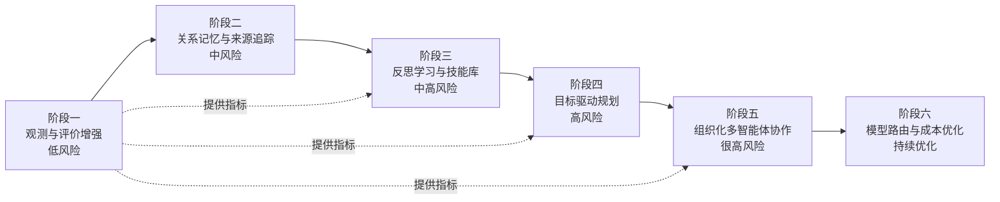

# 第 38 章 基于 Generative Agents 的前沿升级路线图

## 38.1 核心问题

前七章已经分别讨论了：

- 记忆系统升级。
- 反思系统升级。
- 规划系统升级。
- 多智能体协作升级。
- 社会仿真升级。
- 评价体系升级。
- 中文、本地和推理模型带来的新条件。

第五部分最后需要把这些方向收束成一条可执行路线。否则第五部分很容易变成：

```text
每个方向都很重要，但不知道先做什么。
```

工程上不能这样。一个开源项目的升级要考虑：

- 当前代码结构。
- 改动风险。
- 可验证收益。
- 与原论文思想的关系。
- 是否方便读者学习。
- 是否容易回滚。

本章重点聚焦以下六个问题：

1. Generative Agents 前沿升级应该遵守什么原则？
2. 哪些升级应该先做，哪些应该后做？
3. 如何把观测、记忆、反思、规划、协作和评价串起来？
4. 中文本地模型和推理模型应该如何纳入路线图？
5. 每个阶段应该用什么实验验证？
6. 这条路线如何保持和原论文思想的一致性？



*图 38-1：Generative Agents 前沿升级路线图。路线图按风险和验证难度推进，先增强观测和评价，再逐步改记忆、反思、规划和协作。*

## 38.2 路线图的基本原则

本章路线图遵守五个原则。第一，先观测，后改行为。如果没有指标和报告，改动后很难判断是否真的变好。第二，先低风险，后高风险。例如增加统计脚本风险低。修改 `Agent.make_plan()` 风险高。第三，先局部增强，后系统重构。例如增加 `relationship` 记忆类型，比重写整个 memory system 更适合第一步。第四，每个阶段都要有实验验证。不能只说“架构更先进”。第五，保留 Generative Agents 的核心思想。升级不是把项目改成完全不同的工作流框架。小镇仍然应该保留：

```text
记忆流
检索
反思
计划
行动
对话
社会涌现
```

前沿升级是在这条链上增强，而不是另起炉灶。

## 38.3 阶段一：观测与评价增强

第一阶段不改 agent 行为。只增强实验观测能力。目标是：

```text
让项目从“能看回放”升级到“能生成评价报告”。
```

建议改造方向可以这样安排：

1. 增加实验配置文件。
2. 增加对话关键词统计。
3. 增加到场统计。
4. 增加 LLM 调用统计汇总。
5. 增加统一 `metrics.json`。
6. 增加统一 `report.md`。

涉及的新增文件如下：

```text
experiments/*.json
tools/analyze_conversation_keywords.py
tools/analyze_attendance.py
tools/export_experiment_report.py
```

涉及的现有材料如下：

```text
conversation.json
movement.json
simulation.md
checkpoint
LLM summary
```

这一阶段风险最低。即使脚本写错，也不会改变仿真行为。但收益很大。它会为后续所有升级提供评价基础。

## 38.4 阶段一的验证实验

验证实验建议使用情人节派对。运行默认系统，生成：

```text
book-party-small-run-01
```

然后运行下面这个命令：

```text
conversation keyword analysis
attendance analysis
experiment report export
```

成功标准可以这样定义：

- 能统计派对相关提及。
- 能列出参与对话的角色。
- 能统计 17:00-19:00 霍布斯咖啡馆到场角色。
- 能输出 `metrics.json` 和 `report.md`。
- 报告能链接到 `simulation.md` 和 `movement.json` 证据。

这一阶段不要求指标完美。目标是建立评价流水线。

## 38.5 阶段二：记忆系统增强

第二阶段改记忆系统，但尽量不改主行为循环。目标是：

```text
让角色关系和关键事实更稳定。
```

建议改造方向可以这样安排：

1. 扩展 memory type。
2. 增加 `relationship` 记忆。
3. 增加关系更新 prompt。
4. 增加记忆来源和 evidence 字段。
5. 增加简单冲突检测。

涉及的文件可以这样定位：

```text
generative_agents/modules/memory/associate.py
generative_agents/modules/agent.py
generative_agents/modules/prompt/scratch.py
generative_agents/data/prompts/relationship_update.txt
generative_agents/data/prompts/memory_conflict_check.txt
```

这一步不建议先做完整 MemGPT 或 Mem0。原因是：

```text
完整长期记忆管理会牵动太多模块。
```

更稳妥的第一步是关系记忆。它和论文中的社会行为最直接相关，也最容易评价。

## 38.6 阶段二的验证实验

第一个验证实验设计如下：

```text
汤姆与山姆的竞选态度稳定性。
```

需要回答的问题如下：

```text
汤姆是否更稳定地体现对山姆的不信任？
```

需要记录的指标如下：

- opposing_mentions。
- relationship_consistency_score。
- fact_preservation_score。

第二个验证实验设计如下：

```text
玛丽亚与克劳斯的关系形成。
```

需要回答的问题如下：

```text
多次对话后，两人关系是否有证据支撑的变化？
```

需要记录的指标如下：

- relationship_update_count。
- evidence_trace_rate。
- 后续对话是否引用关系记忆。

第三个验证实验设计如下：

```text
派对时间地点保真度。
```

需要回答的问题如下：

```text
派对传播过程中时间和地点是否更稳定？
```

需要记录的指标如下：

- fact_preservation_score。
- conflict_detection_count。

## 38.7 阶段三：反思学习与技能库

第三阶段把反思从“总结”升级为“经验学习”。目标是：

```text
让角色从失败中形成可复用策略。
```

建议改造方向可以这样安排：

1. 增加 action outcome。
2. 增加 self-evaluation prompt。
3. 增加 lesson 记忆。
4. 增加 skill 记忆。
5. 在对话和计划前检索相关 skill。

涉及的文件可以这样定位：

```text
generative_agents/modules/agent.py
generative_agents/modules/memory/associate.py
generative_agents/modules/prompt/scratch.py
generative_agents/data/prompts/self_evaluate_action.txt
generative_agents/data/prompts/extract_lesson.txt
generative_agents/data/prompts/apply_lesson_to_plan.txt
```

这阶段风险比记忆增强更高。因为错误 lesson 会影响后续行为。因此必须保留：

- evidence。
- confidence。
- 可删除机制。
- 反思质量评分。

## 38.8 阶段三的验证实验

验证实验可以这样设计：

```text
伊莎贝拉连续邀请任务。
```

实验设计可以这样写：

第一轮中，伊莎贝拉邀请一个忙碌角色，对方拒绝或没有明确表态。系统生成 lesson：

```text
邀请忙碌的人时，应先询问时间安排，并提供短时间参与选项。
```

第二轮中，伊莎贝拉再次邀请类似角色。观察：

- 是否检索 lesson。
- 对话策略是否变化。
- 是否减少重复话术。
- 是否更好处理拒绝。

需要记录的指标如下：

- lesson_generated_count。
- lesson_used_count。
- repeated_failure_rate。
- invitation_quality_score。
- behavior_naturalness_score。

这能检验 Reflexion-style learning 是否真的影响行为。

## 38.9 阶段四：目标驱动规划

第四阶段改规划系统。目标是：

```text
让角色在日程生活之外，能够围绕明确目标持续行动。
```

建议改造方向可以这样安排：

1. 增加 Goal 数据结构。
2. 给角色增加 active goals。
3. 增加 goal decomposition。
4. 增加 candidate action generation。
5. 增加 goal progress evaluation。
6. 将 goal 结果写回记忆。

涉及的文件可以这样定位：

```text
generative_agents/modules/memory/goal.py
generative_agents/modules/agent.py
generative_agents/modules/memory/schedule.py
generative_agents/modules/prompt/scratch.py
generative_agents/data/prompts/goal_decompose.txt
generative_agents/data/prompts/goal_select_next_step.txt
generative_agents/data/prompts/goal_evaluate_progress.txt
```

这一步风险高。因为它会改变 agent 行动选择。因此建议只对明确事件启用。例如：

```text
伊莎贝拉的派对目标
山姆的竞选目标
克劳斯的讨论会目标
```

不要让所有日常行为都进入目标优化。小镇居民仍然需要生活感。

## 38.10 阶段四的验证实验

第一个验证实验设计如下：

```text
目标驱动派对传播。
```

实验目标可以这样写：

```text
17:00 前至少三人知道派对，至少两人表示愿意参加。
```

需要记录的指标如下：

- goal_completion_rate。
- unique_informed_agents。
- accepted_count。
- attendance_count。
- naturalness_score。

第二个验证实验设计如下：

```text
目标驱动竞选传播。
```

实验目标可以这样写：

```text
山姆向至少三位居民介绍竞选，并记录至少两类居民关心的问题。
```

需要记录的指标如下：

- policy_topic_count。
- attitude_diversity_score。
- goal_progress_accuracy。

这里需要注意的可以这样理解：

目标完成率提升不一定代表更可信。如果角色为了目标强行打断所有人，就要扣自然性分。

## 38.11 阶段五：组织化多智能体协作

第五阶段是高风险升级。目标是：

```text
让小镇角色从自然社交扩展到团队协作。
```

建议改造方向可以这样安排：

1. 增加公共事件板。
2. 增加任务列表。
3. 增加团队角色。
4. 增加共享记忆。
5. 增加协作对话协议。
6. 增加团队进度总结。

涉及的文件可以这样定位：

```text
generative_agents/modules/memory/shared.py
generative_agents/modules/memory/team.py
generative_agents/modules/game.py
generative_agents/modules/agent.py
generative_agents/data/prompts/team_assign_role.txt
generative_agents/data/prompts/team_update_task.txt
generative_agents/data/prompts/team_summarize_progress.txt
```

这阶段最容易破坏原有系统味道。因此要遵守：

```text
组织化协作只用于明确事件，不接管日常生活。
```

## 38.12 阶段五的验证实验

验证实验可以这样设计：

```text
多人协作筹备情人节派对。
```

实验设计可以这样写：

- 伊莎贝拉是 organizer。
- 埃迪可能负责音乐。
- 玛丽亚可能负责邀请学生。
- 克劳斯可能参与讨论或协助宣传。

公共事件板记录任务：

- 准备饮品。
- 确认音乐。
- 邀请朋友。
- 布置咖啡馆。

需要记录的指标如下：

- team_task_completion_rate。
- role_assignment_clarity。
- shared_state_consistency。
- multi_agent_credit_traceability。
- collaboration_naturalness_score。

成功不是所有任务都完成。成功是协作过程可追踪、合理，并符合角色设定。有人拒绝或忘记任务，也可以是可信结果。

## 38.13 阶段六：模型路由与成本优化

前面几个阶段会增加 LLM 调用。如果全部使用强模型，成本会很高。如果全部使用小模型，结构化输出和反思质量可能不稳。因此需要模型路由。当前项目配置是：

```text
provider: ollama
model: qwen3.5:4b-q4_K_M
embedding: qwen3-embedding:0.6b-q8_0
```

这适合低成本本地实验。但升级后可以考虑多模型分工：

```text
本地小模型：日常对话、普通行动、简单判断。
本地 embedding：记忆检索。
强模型或推理模型：高重要性反思、目标规划、失败复盘、复杂协作总结。
```

DeepSeek-R1 这类推理模型的价值在于复杂推理和复盘。Qwen3 这类中文模型的价值在于中文对话、本地部署和 thinking / non-thinking 模式选择。但不要迷信推理模型。小镇中很多行为不需要深度推理。如果每句寒暄都用强推理模型，系统会又慢又贵，还可能让对话过度正式。

## 38.14 模型路由的实现建议

可以先不重构 provider。最小方案是扩展配置：

```json
{
  "models": {
    "daily": {
      "provider": "ollama",
      "model": "qwen3.5:4b-q4_K_M"
    },
    "reflection": {
      "provider": "openai",
      "model": "<strong-model>"
    },
    "planning": {
      "provider": "openai",
      "model": "<reasoning-model>"
    }
  }
}
```

然后在 `completion()` 调用处增加 caller 类型映射。例如：

```text
reflect_insights -> reflection model
goal_select_next_step -> planning model
generate_chat -> daily model
poignancy_event -> daily model
```

评价指标可以这样设计：

- 每类调用次数。
- 每类失败率。
- 每类耗时。
- 行为质量变化。
- 成本变化。

模型路由必须和第 35 章的成本记录一起做。否则无法判断是否值得。

## 38.15 阶段顺序总表

建议升级顺序如下所示：

| 阶段 | 名称 | 风险 | 是否改变行为 | 首选实验 |
| --- | --- | --- | --- | --- |
| 1 | 观测与评价增强 | 低 | 否 | 派对统计报告 |
| 2 | 记忆系统增强 | 中 | 轻度 | 关系与事实保真 |
| 3 | 反思学习与技能库 | 中高 | 是 | 邀请失败复盘 |
| 4 | 目标驱动规划 | 高 | 是 | 目标驱动派对 |
| 5 | 组织化多智能体协作 | 很高 | 是 | 协作筹备派对 |
| 6 | 模型路由与成本优化 | 中高 | 间接 | 多模型对比 |

这个顺序不是唯一的。但它有一个好处：

```text
每一步都有前一步的评价工具支撑。
```

如果没有阶段一，后续每一步都很难证明价值。

## 38.16 不建议一开始做什么

有些事听起来高级，但不适合一开始做。第一，不建议一开始重写整个 Agent 架构。会破坏读者对原论文结构的理解。第二，不建议一开始引入复杂工作流框架。Generative Agents 的价值在于小镇社会仿真，不是企业流程编排。第三，不建议一开始追求大规模 agent 数量。如果 5 个角色都评价不清，25 个或 100 个只会更乱。第四，不建议一开始做跨实验长期记忆。这会显著影响可复现性。第五，不建议只换强模型。强模型可能提高输出质量，但不能替代记忆、评价和环境约束。路线图要务实。先让系统可观测，再让能力增强。

## 38.17 与原论文思想的一致性

这条路线虽然引入很多前沿思想，但仍然围绕 Generative Agents 原始架构。对应关系如下：

| 原论文模块 | 当前项目 | 升级方向 |
| --- | --- | --- |
| Memory Stream | Associate / Concept | 记忆治理、关系记忆、冲突检测 |
| Retrieval | AssociateRetriever | 场景化检索、来源追踪 |
| Reflection | Agent.reflect() | 失败复盘、lesson、skill |
| Planning | Schedule / make_schedule | Goal、候选行动、进度评估 |
| Reacting | _reaction() | 目标感知反应、冲突处理 |
| Dialogue | _chat_with() / generate_chat | 协作对话协议、关系驱动对话 |
| Smallville | Maze / Phaser replay | 批量实验、统计指标 |
| Evaluation | simulation / movement | metrics、report、基线、成本 |

这张表说明下面问题：

```text
前沿升级不是抛弃 Generative Agents，而是沿着它的模块继续生长。
```

这也是本书写法的核心原则。

## 38.18 最终推荐实践路径

如果读者只有两周时间，建议做：

```text
阶段一：观测与评价增强。
```

目标是能生成实验报告。如果读者有一个月时间，建议做：

```text
阶段一 + 阶段二。
```

也就是评价工具加关系记忆。如果读者有两到三个月时间，建议做：

```text
阶段一 + 阶段二 + 阶段三。
```

加入失败复盘和技能库。如果读者要做研究项目，可以继续做：

```text
阶段四和阶段五。
```

但必须配套基线和多次运行统计。如果读者要做长期维护的开源项目，应同时做：

```text
阶段六：模型路由与成本优化。
```

否则系统会随着能力增强变得越来越贵、越来越慢。

## 38.19 这本书最终希望读者获得什么

全书最终收束到一个目标。最终目标不只是知道：

```text
Generative Agents 怎么运行。
```

读者还应该知道下面内容：

```text
Generative Agents 论文为什么重要。
```

```text
当前项目如何把论文思想工程化和中文化。
```

```text
源码中每个核心模块如何协作。
```

```text
如何复现论文经典现象。
```

```text
如何评价智能体是否可信。
```

```text
如何面对风险、幻觉和社会仿真边界。
```

```text
如何基于 2023-2026 年前沿研究继续升级项目。
```

这比单纯写一本项目说明书更重要。本书真正要交给读者的是一种方法：

```text
从论文问题出发，读懂项目实现，用实验验证行为，再基于前沿研究做可评价的升级。
```

## 38.20 本章小结

第五部分最终收束成一条可执行路线。升级不需要同时做完，应按风险和验证能力分阶段推进：先看清系统，再逐步改行为。

| 升级阶段 | 核心结论 |
| --- | --- |
| 基本原则 | 先观测后改行为、先低风险后高风险、先局部增强后系统重构。 |
| 阶段一 | 做观测与评价增强，不改变 agent 行为，先建立 `metrics.json` 和 `report.md`。 |
| 阶段二 | 做记忆系统增强，优先增加关系记忆、来源追踪和冲突检测。 |
| 阶段三 | 做反思学习与技能库，让角色从失败中形成可复用经验。 |
| 阶段四 | 做目标驱动规划，在日程之上增加 Goal、候选行动和进度评估。 |
| 阶段五 | 做组织化多智能体协作，引入公共事件板、任务列表和共享记忆。 |
| 阶段六 | 做模型路由与成本优化，让不同任务使用不同模型能力。 |
| 验证要求 | 每个阶段都必须有验证实验、评价指标和风险边界。 |
| 不建议做法 | 不要一开始大重构、追求大规模或只换强模型。 |
| 思想一致性 | 整条路线仍然围绕 Generative Agents 的原始模块继续生长。 |

这也是全书的收束：真正理解一个开源智能体项目，不是只会运行它，而是能解释它、评价它、复现它、扩展它，并知道它的边界在哪里。

## 参考资料

- Generative Agents: https://arxiv.org/abs/2304.03442
- MemGPT: https://arxiv.org/abs/2310.08560
- Mem0: https://arxiv.org/abs/2504.19413
- Reflexion: https://arxiv.org/abs/2303.11366
- Voyager: https://arxiv.org/abs/2305.16291
- ReAct: https://arxiv.org/abs/2210.03629
- Tree of Thoughts: https://arxiv.org/abs/2305.10601
- LATS: https://arxiv.org/abs/2310.04406
- CAMEL: https://arxiv.org/abs/2303.17760
- AutoGen: https://arxiv.org/abs/2308.08155
- MetaGPT: https://arxiv.org/abs/2308.00352
- AgentScope: https://arxiv.org/abs/2402.14034
- AgentBench: https://arxiv.org/abs/2308.03688
- WebArena: https://arxiv.org/abs/2307.13854
- GAIA: https://arxiv.org/abs/2311.12983
- SWE-bench: https://arxiv.org/abs/2310.06770
- AI Agents That Matter: https://arxiv.org/abs/2407.01502
- DeepSeek-R1: https://arxiv.org/abs/2501.12948
- DeepSeek-R1 official repository: https://github.com/deepseek-ai/DeepSeek-R1
- Qwen3: https://arxiv.org/abs/2505.09388
- Qwen3 official blog: https://qwenlm.github.io/blog/qwen3/
- Local config: `generative_agents/data/config.json`
- Local source: `generative_agents/modules/agent.py`
- Local source: `generative_agents/modules/memory/associate.py`
- Local source: `generative_agents/modules/memory/schedule.py`
- Local source: `generative_agents/modules/model/llm_model.py`
