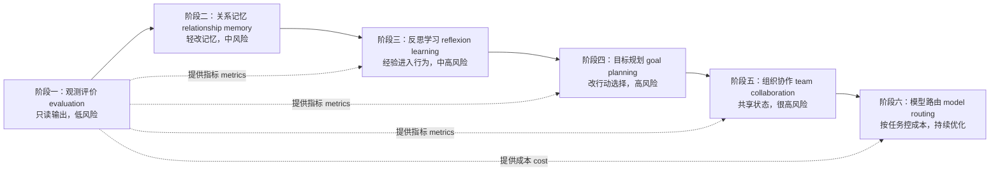
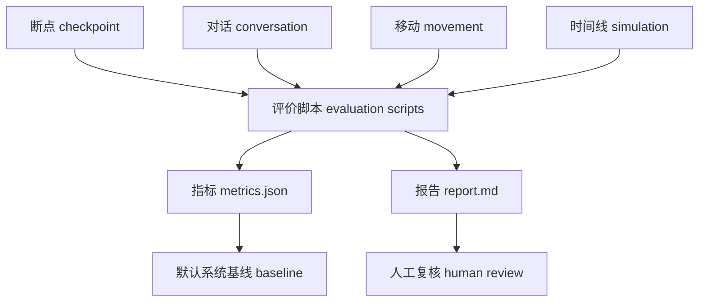
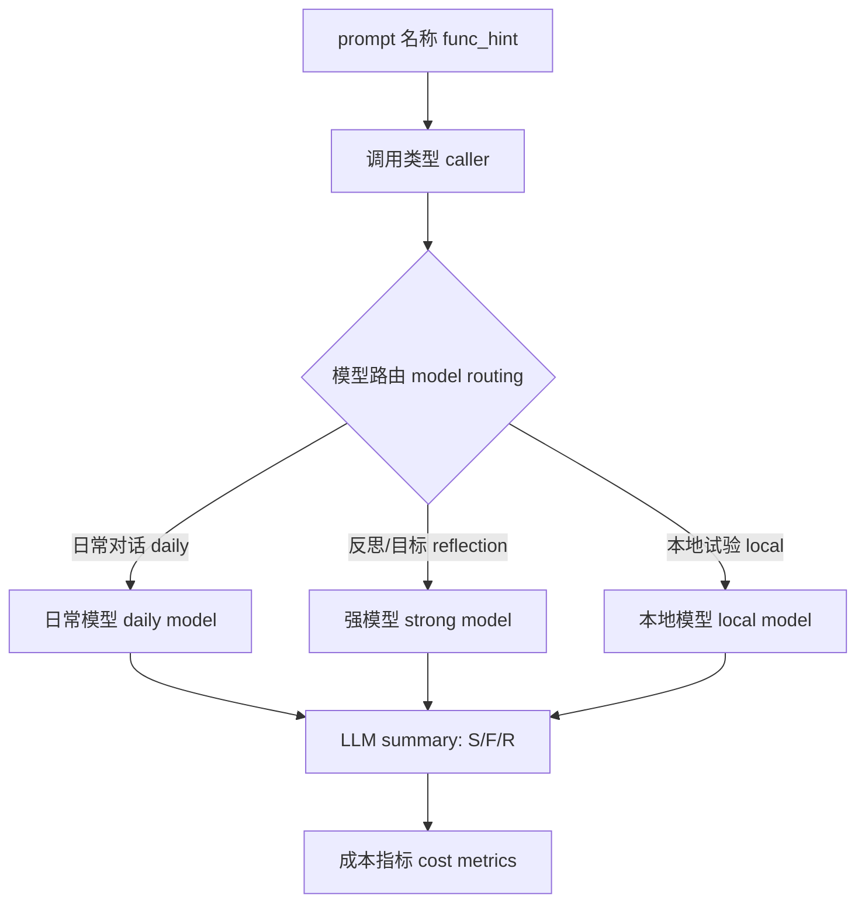
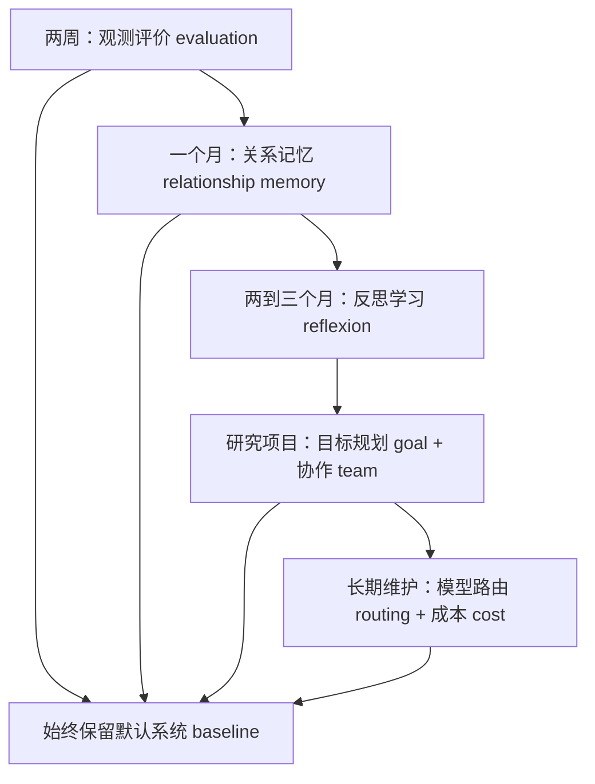

# 第 38 章 基于生成式智能体 Generative Agents 的前沿升级路线图

## 38.1 升级清单已经够长，真正缺的是顺序

把第五部分的想法贴到项目维护墙上，会得到一串诱人的方向：长期记忆 memory、反思学习 reflexion、目标规划 goal planning、多智能体协作 multi-agent collaboration、社会仿真 social simulation、评价指标 evaluation metrics、中文本地模型 local model、推理模型 reasoning model。问题不是方向太少，而是如果同时动这些模块，归因会立刻变得混乱：

```text
这次行为变好了，是因为记忆更稳、prompt 更强、模型更大、日程被改写，还是只是一次随机运行比较幸运？
```

路线图必须先回答工程问题：每一步改哪里，输入是什么，处理发生在哪里，输出落到什么文件，失败时沿哪条证据路径回查。生成式智能体 Generative Agents 的升级不应另起炉灶，而应沿着当前项目已经存在的链路生长：配置 config -> 提示词 prompt -> 记忆 memory -> 日程 schedule -> 对话 conversation -> 移动 movement -> 断点 checkpoint -> 指标 metrics / 报告 report。



*图 38-1：生成式智能体 Generative Agents 的前沿升级路线图。顺序按风险和可验证性推进：先让项目可观察，再改记忆、反思、规划、协作，最后把模型路由和成本控制纳入长期维护。*


*图 38-2：前沿升级路线的项目落地墙。图中从小镇核心出发的升级路径依次经过观测评价 evaluation、记忆 memory、反思 reflection、规划 planning、协作 collaboration、社会仿真 social simulation 和模型路由 model routing；每一段都有源码、提示词 prompt、断点 checkpoint、移动回放 movement 与报告 report 作为闸门。路线图的底线是：保留默认系统基线 baseline，不把项目改成另一套系统。*

## 38.2 路线图的硬约束

| 约束 | 项目锚点 | 为什么必须遵守 |
| --- | --- | --- |
| 先观测 evaluation，再改行为 behavior | 第 37 章的 `metrics.json`、`report.md` | 没有评价底座，后续升级无法证明价值 |
| 每次只改一个主要变量 variable | `data/config.json`、实验配置、启动命令 | 否则无法归因 |
| 保留默认系统 baseline | 当前 `start.py`、`compress.py`、`Agent` 主循环 | 防止前沿升级把论文结构冲掉 |
| 提示词 prompt 随机制解释 | `Scratch.build_prompt()`、`Agent.completion()` | 大多数行为变化都由提示词 prompt 输入和输出结构 schema 决定 |
| 输出必须落盘 artifact | 断点 checkpoint、对话 conversation、移动 movement、时间线 simulation、指标 metrics / 报告 report | 结论必须能复查，不能靠口头判断 |
| 失败必须分类 failure taxonomy | 第 37 章失败分类 | 失败定位比笼统成功率更能指导改造 |

当前项目的运行链路已经清晰：`start.py` 创建配置并运行 `SimulateServer.simulate()`；每步调用 `Game.agent_think()`；角色内部先 `make_schedule()`，再 `percept()`、`make_plan()`、`reflect()`；对话由 `_chat_with()` 写入 `conversation.json`；`compress.py` 再把 checkpoint 压缩成 `simulation.md` 和 `movement.json`。前沿升级的每一阶段都要接在这条链上。

## 38.3 阶段总表：输入、处理、输出和验证

| 阶段 | 升级点 | 输入 input | 处理 process | 输出 output | 首选验证 |
| --- | --- | --- | --- | --- | --- |
| 1 | 观测与评价 evaluation | checkpoint、conversation、movement、simulation、LLM summary | 统计传播、到场、成本、失败类型 | `metrics.json`、`report.md` | 情人节派对报告 |
| 2 | 关系记忆 relationship memory | 对话摘要、事件节点、角色关系 | 新增关系节点、来源追踪、冲突检查 | `associate` 新记忆类型或 metadata | 关系稳定与事实保真 |
| 3 | 反思学习 reflexion learning | 行动结果、失败样例、证据路径 | 自评、抽取 lesson、写入 skill | lesson/skill 记忆 | 连续邀请任务 |
| 4 | 目标规划 goal planning | 主动目标、当前日程、可选行动 | 目标分解、候选行动、进度评估 | active goals、计划修订、目标报告 | 目标驱动派对 |
| 5 | 组织协作 team collaboration | 公共事件、团队角色、共享任务 | 分工、状态更新、团队总结 | event board、shared memory | 协作筹备派对 |
| 6 | 模型路由 model routing | prompt 调用类型、成本、失败率 | 按 caller 路由到不同模型 | per-caller LLM summary、成本报告 | 多模型对比 |

这五列构成后续阶段的准入条件。任何新增代码如果填不出这五列，就不应进入路线图。

## 38.4 阶段一：观测与评价增强

阶段一只读现有输出，不改智能体 agent 行为。它把第 37 章的评价设计变成工程入口。

| 项目项 | 内容 |
| --- | --- |
| 现有输入 input | `results/checkpoints/<name>/conversation.json`、`simulate-*.json`、`results/compressed/<name>/movement.json`、`simulation.md` |
| 新增处理 process | 关键词传播统计、到场统计、LLM summary 解析、失败分类 |
| 新增输出 output | `results/evaluations/<name>/metrics.json`、`results/evaluations/<name>/report.md` |
| 文件位置 | 拟新增 `tools/analyze_conversation_keywords.py`、`tools/analyze_attendance.py`、`tools/export_experiment_report.py` |
| 失败模式 | 指标误判、证据链接断裂、把弱线索写成强结论 |
| 验证方式 | 对 `book-party-extended` 生成报告，人工抽查 5 条证据 |

阶段一没有新的 prompt。它的边界要写清楚：脚本不调用大语言模型 LLM，不替代人工裁决，只把现有证据索引成结构化指标。



推荐验证实验仍然是情人节派对。成功标准不是“派对一定成功”，而是报告能明确列出：谁知道派对、谁承诺、谁拒绝、谁到场、谁缺席、证据来自哪里、失败被归为哪一类。

## 38.5 阶段二：关系记忆与来源追踪

当前 `Associate` 的记忆类型 memory type 是 `event`、`thought`、`chat`。这足以支撑基本小镇行为，但关系变化和事实来源还不够显式。阶段二优先做轻量增强，不直接引入完整 MemGPT 或 Mem0。

| 项目项 | 内容 |
| --- | --- |
| 现有输入 input | `conversation.json`、`Associate.retrieve_chats()`、`Associate.retrieve_focus()`、`summarize_chats` 输出 |
| 新增处理 process | 从对话中抽取关系变化，写入 `relationship` 记忆，记录 `source_type`、`source_id`、`confidence` |
| 新增输出 output | 关系节点 relationship node、冲突记录 conflict record、证据字段 evidence |
| 涉及源码 | `generative_agents/modules/memory/associate.py`、`generative_agents/modules/agent.py` |
| 涉及存储 | `results/checkpoints/<name>/storage/<角色>/associate/docstore.json` |
| 失败模式 | 关系过度更新、把单次礼貌对话当成亲密关系、来源丢失 |
| 验证方式 | 比较升级前后关系一致性、事实保真和证据可追踪率 |

### 关系记忆 prompt

阶段二拟新增两个 prompt，不放在章节开头，而放在关系记忆首次执行的位置。

| 机制 | 提示词 prompt 路径 | 变量 | 输出结构 schema / 字段 | 流向 |
| --- | --- | --- | --- | --- |
| 关系更新 relationship update | 拟新增 `generative_agents/data/prompts/relationship_update.txt` | `agent`、`another`、`conversation`、`previous_relation`、`evidence_path` | `res: {"relation": str, "confidence": float, "evidence": list[str], "ttl_days": int}` | 写入 `Associate.add_node("relationship", ...)` 或 metadata |
| 记忆冲突检查 memory conflict check | 拟新增 `generative_agents/data/prompts/memory_conflict_check.txt` | `new_memory`、`existing_memories`、`source_time` | `res: {"conflict": bool, "reason": str, "conflict_with": list[str]}` | 决定新增、降权或标记冲突 |

关系记忆的关键不是“记更多”，而是让后续对话能说明自己从哪里知道某段关系。比如玛丽亚和克劳斯多次学术讨论后，关系变化必须带有对话时间和节点 ID；否则后续一句“我们很熟”只能算模型自述。

## 38.6 阶段二的验证实验

| 实验 | 输入 input | 处理 process | 输出 output | 判断标准 |
| --- | --- | --- | --- | --- |
| 汤姆与山姆的竞选态度 | 汤姆初始人设、竞选对话、后续提及 | 抽取对山姆的态度关系 | `relationship_consistency_score`、`opposing_mentions` | 汤姆的不信任是否稳定且有来源 |
| 玛丽亚与克劳斯的关系形成 | 多次学习对话 | 生成关系节点并在后续对话检索 | `relationship_update_count`、`evidence_trace_rate` | 关系变化是否能回到原话 |
| 派对时间地点保真 | 伊莎贝拉传播派对信息 | 关系记忆不应污染核心事实 | `fact_preservation_score`、`conflict_detection_count` | 时间地点是否更稳定 |

这里最容易犯的错是只看“关系表达更丰富”。真正的验证点是：后续行为是否能引用有证据的关系记忆，而不是凭空变熟。

## 38.7 阶段三：反思学习与技能库

当前反思 reflection 已经存在：`Agent.reflect()` 在 `poignancy` 达到阈值后，调用 `reflect_focus`、`reflect_insights`、`reflect_chat_planing` 和 `reflect_chat_memory`，再把结果写入 `thought` 记忆。阶段三不是把反思写得更长，而是让失败结果形成可复用经验 lesson 和技能 skill。

| 项目项 | 内容 |
| --- | --- |
| 现有输入 input | `self.status["poignancy"]`、事件记忆、聊天记忆、失败样例、指标报告 |
| 现有处理 process | `Agent.reflect()` 生成思考 thought |
| 新增处理 process | 绑定行动结果 outcome，自评失败原因，抽取 lesson，生成 skill |
| 新增输出 output | `lesson` 记忆、`skill` 记忆、下次计划前的技能检索 |
| 涉及源码 | `agent.py`、`associate.py`、`prompt/scratch.py` |
| 失败模式 | 错误经验被反复使用，角色变得过度策略化 |
| 验证方式 | 连续邀请任务中，第二轮是否减少重复失败，同时保持自然性 |

### 反思提示词 prompt 链

| 机制 | 提示词 prompt 路径 | 变量 | 输出结构 schema / 字段 | 流向 |
| --- | --- | --- | --- | --- |
| 反思焦点 reflect focus | `data/prompts/reflect_focus.txt` | `reference`、`number` | `res: List[str]` | 形成反思问题 |
| 洞察生成 reflect insights | `data/prompts/reflect_insights.txt` | `reference`、`number` | `res: List[Tuple[str, str]]` | 写入 `thought`，保留 evidence node ids |
| 行动自评 self evaluation | 拟新增 `data/prompts/self_evaluate_action.txt` | `action`、`outcome`、`evidence`、`goal` | `res: {"success": bool, "reason": str, "failure_type": str}` | 形成失败解释 |
| 经验抽取 extract lesson | 拟新增 `data/prompts/extract_lesson.txt` | `failure_case`、`agent_profile`、`similar_memories` | `res: {"lesson": str, "trigger": str, "confidence": float}` | 写入 `lesson` 或 `skill` |
| 经验应用 apply lesson | 拟新增 `data/prompts/apply_lesson_to_plan.txt` | `current_plan`、`relevant_lessons`、`constraints` | `res: {"suggested_change": str, "risk": str}` | 影响后续日程或对话策略 |

阶段三必须给 lesson 设置证据、置信度 confidence 和删除机制。否则一次误判会污染之后很多轮仿真。

## 38.8 阶段三的验证实验

连续邀请任务最适合检验反思学习。第一轮中，伊莎贝拉邀请一个忙碌角色，对方拒绝、犹豫或承诺后未到场。系统从 `conversation.json` 和 `movement.json` 生成失败样例，再抽取 lesson。第二轮中，伊莎贝拉遇到类似角色，观察策略是否变化。

| 指标 | 数据来源 | 读法 |
| --- | --- | --- |
| `lesson_generated_count` | lesson 记忆 | 是否生成经验 |
| `lesson_used_count` | 后续 prompt 输入和检索日志 | 是否真的被使用 |
| `repeated_failure_rate` | 多轮邀请结果 | 是否减少同类失败 |
| `invitation_quality_score` | 人工报告 | 邀请是否更具体、更自然 |
| `behavior_naturalness_score` | 对话原文、日程冲突 | 是否没有变成机械推销 |

如果成功率上升但自然性下降，这一阶段不能算通过。反思学习的目标是让角色更像会总结经验的人，而不是更像任务优化器。

## 38.9 阶段四：目标驱动规划

当前项目的规划 planning 主要由日程 schedule 驱动。`Agent.make_schedule()` 生成日计划，`_determine_action()` 根据当前计划和空间记忆选择地点，`schedule_revise()` 在对话或等待时修订计划。阶段四要增加显式目标 Goal，但只能用于明确事件，不接管全部日常生活。

| 项目项 | 内容 |
| --- | --- |
| 现有输入 input | `Schedule.daily_schedule`、当前行动 action、空间记忆 spatial、对话事件 |
| 新增输入 input | `active_goals`：目标描述、截止时间、成功条件、优先级 |
| 处理 process | 目标分解、候选行动生成、目标贡献评估、日程修订 |
| 输出 output | `goal_state`、候选行动列表、进度记录、写回记忆 |
| 涉及源码 | 拟新增 `modules/memory/goal.py`，修改 `agent.py` 和 `schedule.py` |
| 失败模式 | 目标吞掉日常生活，角色不停推销任务 |
| 验证方式 | 目标完成率和自然性同时达标 |

### 目标规划 prompt

| 机制 | 提示词 prompt 路径 | 变量 | 输出结构 schema / 字段 | 流向 |
| --- | --- | --- | --- | --- |
| 目标分解 goal decompose | 拟新增 `data/prompts/goal_decompose.txt` | `goal`、`deadline`、`agent_profile`、`current_schedule` | `res: list[{"subgoal": str, "due": str, "success": str}]` | 写入 `goal_state` |
| 候选行动 candidate action | 拟新增 `data/prompts/goal_select_next_step.txt` | `goal_state`、`current_location`、`nearby_agents`、`schedule` | `res: {"action": str, "target": str, "reason": str}` | 影响 `_determine_action()` 或 `schedule_revise()` |
| 进度评估 goal progress | 拟新增 `data/prompts/goal_evaluate_progress.txt` | `goal`、`evidence`、`metrics` | `res: {"progress": float, "blocked_by": list[str], "next_step": str}` | 写入 checkpoint 和报告 |

阶段四要保留“生活感”：伊莎贝拉可以围绕派对主动邀请，但仍要开店、做咖啡、应对客人；山姆可以传播竞选，但不能把每次聊天都变成竞选演讲。

## 38.10 阶段四的验证实验

| 实验 | 输入 input | 处理 process | 输出 output | 风险边界 |
| --- | --- | --- | --- | --- |
| 目标驱动派对传播 | `active_goal`: 17:00 前至少三人知道派对，至少两人愿意参加 | 目标分解为邀请、确认、布置、提醒 | `goal_completion_rate`、`unique_informed_agents`、`attendance_count` | 不能让伊莎贝拉打断所有人 |
| 目标驱动竞选传播 | 山姆竞选目标和居民关切 | 生成候选对话行动，记录政策问题 | `policy_topic_count`、`attitude_diversity_score` | 不能把所有角色写成支持者 |
| 讨论会组织 | 克劳斯发起学术讨论目标 | 邀请、确认时间、地点落地 | `promise_action_match_rate`、`discussion_turn_count` | 不能忽略日程冲突 |

目标完成率 goal completion rate 只是必要条件。报告还要写自然性 naturalness、拒绝样例、冲突样例和成本变化。

## 38.11 阶段五：组织化多智能体协作

组织化协作 team collaboration 风险最高，因为它会引入共享状态 shared state。生成式智能体 Generative Agents 的核心魅力是个体基于记忆、日程和对话自然涌现社会行为；如果公共任务板过强，小镇会变成项目管理软件。

| 项目项 | 内容 |
| --- | --- |
| 输入 input | 公共事件 event、参与角色、任务列表、角色关系、可用时间 |
| 处理 process | 分配团队角色、更新任务状态、共享证据、生成进度总结 |
| 输出 output | `event_board`、`team_tasks`、`shared_memory`、协作报告 |
| 涉及源码 | 拟新增 `modules/memory/shared.py`、`modules/memory/team.py`，修改 `game.py`、`agent.py` |
| 失败模式 | 全员过度合作、任务板接管日常、归因不清 |
| 验证方式 | 协作过程可追踪，拒绝和遗忘也被记录 |

### 协作 prompt

| 机制 | 提示词 prompt 路径 | 变量 | 输出结构 schema / 字段 | 流向 |
| --- | --- | --- | --- | --- |
| 团队分工 team assign role | 拟新增 `data/prompts/team_assign_role.txt` | `event_board`、`agent_profile`、`relationship_memory`、`availability` | `res: {"role": str, "accepted": bool, "reason": str}` | 更新团队角色 |
| 任务更新 team update task | 拟新增 `data/prompts/team_update_task.txt` | `conversation`、`task_state`、`evidence` | `res: {"task_id": str, "status": str, "evidence": list[str]}` | 更新 `event_board` |
| 进度总结 team summarize progress | 拟新增 `data/prompts/team_summarize_progress.txt` | `event_board`、`recent_actions`、`failures` | `res: {"summary": str, "blocked": list[str], "next": list[str]}` | 写入共享记忆和报告 |

协作升级必须保留可追踪归因 credit traceability：谁接受了任务，谁转述了任务，谁完成了任务，谁只是被报告提到。没有上游证据的贡献不能算作真实协作。

## 38.12 阶段五的验证实验

协作筹备情人节派对可以作为第一组实验。

| 角色 | 可分配任务 | 评价边界 |
| --- | --- | --- |
| 伊莎贝拉 | 组织派对、准备饮品、确认现场 | 她是发起人，但不能强制所有人听命 |
| 埃迪 | 音乐、游戏区、音响 | 可接受，也可因课程或项目拒绝 |
| 玛丽亚 | 帮忙布置、邀请学生 | 她有学习和直播日程冲突 |
| 克劳斯 | 参与讨论、协助传播 | 学术任务可能优先于派对 |
| 山姆 | 分享海军咖啡故事 | 可到场，也可因詹妮弗晚餐拒绝 |

| 指标 | 数据来源 | 成功读法 |
| --- | --- | --- |
| `team_task_completion_rate` | event board、movement、conversation | 任务完成比例 |
| `role_assignment_clarity` | 团队提示词 team prompt 输出和对话原文 | 分工是否清楚 |
| `shared_state_consistency` | event board 多次快照 | 共享状态是否前后一致 |
| `multi_agent_credit_traceability` | conversation 上游链路 | 贡献是否能追踪到人 |
| `collaboration_naturalness_score` | 人工报告 | 协作是否符合角色设定 |

成功不是所有任务都完成。有人忘记、拒绝或临时改计划，只要证据链清楚，也可以是可信结果。

## 38.13 阶段六：模型路由与成本优化

当前 `generative_agents/data/config.json` 的默认模型配置是 `provider: minimax`、`model: MiniMax-M3`、向量嵌入 embedding 为 `embo-01`。源码同时提供 `OllamaLLMModel`，可支持本地 Ollama 模型。阶段六的目标不是盲目换强模型，而是让不同提示词 prompt 类型使用合适能力，并把成本写入评价。

| 项目项 | 内容 |
| --- | --- |
| 输入 input | `func_hint`、提示词 prompt 类型、结构化输出要求、历史失败率 |
| 处理 process | 从 `Agent.completion()` 或 `LLMModel.completion()` 传入 caller，按 caller 选择模型 |
| 输出 output | 每类调用的成功数、失败数、请求数、耗时、成本 |
| 涉及源码 | `modules/model/llm_model.py`、`modules/agent.py`、`data/config.json` |
| 失败模式 | 路由规则复杂、成本下降但行为质量下降、模型间输出风格不一致 |
| 验证方式 | 同一实验在默认模型、多模型路由、本地模型下比较 |

最小配置可以先扩展为：

```json
{
  "models": {
    "daily": {
      "provider": "minimax",
      "model": "MiniMax-M3"
    },
    "reflection": {
      "provider": "minimax",
      "model": "MiniMax-M3"
    },
    "local_daily": {
      "provider": "ollama",
      "model": "qwen3:4b"
    }
  },
  "routing": {
    "generate_chat": "daily",
    "poignancy_event": "daily",
    "reflect_insights": "reflection",
    "goal_select_next_step": "reflection"
  }
}
```

### 路由如何接入现有调用

`Agent.completion(func_hint, ...)` 已经知道当前 prompt 名称，例如 `generate_chat`、`reflect_insights`、`schedule_daily`。`LLMModel.completion()` 已经有 `caller` 参数，并把统计写进 `_summary`。最小改造是把 `func_hint` 作为 caller 传下去，再按 caller 做模型选择或成本统计。



路由通过的标准不是“强模型输出更漂亮”，而是在同样证据链下，格式失败率下降、关键行为更稳定、成本增量可解释。

## 38.14 不建议一开始做什么

| 不建议做法 | 风险 | 更稳妥的替代 |
| --- | --- | --- |
| 重写整个 Agent 架构 | 升级失去与原论文模块的对应关系 | 沿 `Agent`、`Associate`、`Schedule` 局部增强 |
| 一开始引入复杂工作流框架 | 小镇变成企业流程编排 | 只对明确事件引入目标或任务板 |
| 先扩到 100 个智能体 agent | 评价和调试成本暴涨 | 先在 4-8 个角色上跑清楚 |
| 只换更强模型 | 掩盖记忆、prompt、环境和评价问题 | 同时记录基线、成本和失败类型 |
| 做跨实验永久记忆 | 可复现性被破坏 | 先做单次实验内来源追踪 |
| 追求全自动裁判 | 容易把弱证据写成强结论 | 指标脚本 + 人工报告双轨 |

这不是保守，而是保护可解释性。生成式智能体 Generative Agents 的价值在于能看见记忆、反思、计划、行动和社会涌现如何互相作用；升级不能把这些可解释入口遮掉。

## 38.15 与原论文思想的一致性

| 原论文模块 | 当前项目实现 | 可升级方向 | 不应越过的边界 |
| --- | --- | --- | --- |
| 记忆流 Memory Stream | `Associate`、`Concept`、`docstore.json` | 关系记忆、来源追踪、冲突检测 | 不把记忆变成黑箱数据库 |
| 检索 Retrieval | `AssociateRetriever`、`retrieve_focus()` | 场景化检索、证据权重 | 不让检索绕过角色个人经验 |
| 反思 Reflection | `Agent.reflect()`、`reflect_*` prompts | lesson、skill、失败复盘 | 不让角色每步都像策略顾问 |
| 规划 Planning | `Schedule`、`make_schedule()`、`schedule_revise()` | active goal、候选行动、进度评估 | 不吞掉日常生活 |
| 反应 Reacting | `_reaction()`、`_chat_with()`、`_wait_other()` | 目标感知反应、冲突处理 | 不让所有相遇都变成任务对话 |
| 对话 Dialogue | `generate_chat`、`summarize_chats` | 关系驱动对话、协作协议 | 不牺牲自然闲聊 |
| 小镇 Smallville | `Maze`、Phaser 回放、`movement.json` | 批量实验、地图证据 | 不只看语言输出 |
| 评价 Evaluation | `simulation.md`、`movement.json`、checkpoint | metrics、report、baseline、cost | 不用单一分数替代证据链 |

前沿升级不是抛弃 Generative Agents，而是沿着它的模块继续生长。只要一个升级无法放回这张表，它就应该被视为另一个项目，而不是本项目的自然演进。

## 38.16 推荐实践路径

| 时间预算 | 推荐阶段 | 交付物 | 成功标准 |
| --- | --- | --- | --- |
| 两周 | 阶段一：观测评价 | `metrics.json`、`report.md`、失败分类 | 能解释一次派对实验的证据强弱 |
| 一个月 | 阶段一 + 阶段二 | 关系记忆、来源字段、冲突检查 | 后续对话能引用有证据的关系 |
| 两到三个月 | 阶段一 + 二 + 三 | lesson/skill 记忆、失败复盘 | 第二轮相似任务减少重复失败 |
| 研究项目 | 阶段四 + 五 | active goal、event board、shared memory | 目标和协作提升可复查且自然 |
| 长期维护 | 阶段六持续加入 | caller 级成本、模型路由报告 | 成本可控，格式失败率下降 |



这个路径的底层逻辑是：每一阶段都用前一阶段的评价能力证明自己。如果阶段一没有完成，后面的所有“能力增强”都只能算故事展示。

## 38.17 全书收束：读懂、评价、再升级

真正理解这个开源项目，不是只会运行 `start.py`，也不是只会看回放页面。最终能力落在四件事上：

| 能力 | 项目证据 | 对应章节目标 |
| --- | --- | --- |
| 解释 explain | `agent.py`、`associate.py`、`schedule.py`、prompt | 说明角色如何从记忆到行动 |
| 复现 reproduce | checkpoint、conversation、movement、simulation | 复现派对、竞选、讨论等现象 |
| 评价 evaluate | metrics、report、baseline、cost | 判断行为是否可信 |
| 扩展 upgrade | relationship、lesson、goal、team、routing | 基于前沿研究做可验证升级 |

第五部分的落点不是“前沿名词清单”，而是一条工程方法：从论文问题出发，读懂本地项目实现，用实验验证行为，再把前沿研究压回可评价、可回滚、可复查的升级步骤。

## 38.18 本章小结

前沿升级路线图把第五部分收束成一条可执行路径：先做观测与评价，再做关系记忆，然后做反思学习、目标规划、组织协作，最后持续做模型路由和成本优化。每一步都要写清楚输入 input、处理 process、输出 output、文件位置、提示词 prompt 路径、失败模式和验证方式。

| 升级阶段 | 核心结论 |
| --- | --- |
| 阶段一 evaluation | 先建立 `metrics.json` 和 `report.md`，不改智能体 agent 行为 |
| 阶段二 memory | 增加关系记忆、来源追踪和冲突检测，避免凭空关系变化 |
| 阶段三 reflexion | 把失败证据转成 lesson/skill，但保留置信度和删除机制 |
| 阶段四 goal | 显式目标只服务明确事件，不吞掉日常生活 |
| 阶段五 team | 组织协作要记录接受、拒绝、遗忘和贡献归因 |
| 阶段六 routing | 利用 caller 级统计做模型路由和成本控制 |
| 总原则 | 不另起炉灶，沿 Generative Agents 的原始模块继续生长 |

全书到这里形成闭环：项目可以运行，源码可以解释，实验可以复现，风险可以审计，评价可以落盘，升级可以分阶段推进。下一步真正要做的不是再列更多前沿概念，而是从阶段一开始，把评价证据包跑通。

## 参考资料

- 生成式智能体 Generative Agents: https://arxiv.org/abs/2304.03442
- MemGPT: https://arxiv.org/abs/2310.08560
- Mem0: https://arxiv.org/abs/2504.19413
- 反思式学习 Reflexion: https://arxiv.org/abs/2303.11366
- Voyager: https://arxiv.org/abs/2305.16291
- ReAct: https://arxiv.org/abs/2210.03629
- Tree of Thoughts: https://arxiv.org/abs/2305.10601
- LATS: https://arxiv.org/abs/2310.04406
- CAMEL: https://arxiv.org/abs/2303.17760
- AutoGen: https://arxiv.org/abs/2308.08155
- MetaGPT: https://arxiv.org/abs/2308.00352
- AgentScope: https://arxiv.org/abs/2402.14034
- AgentBench: https://arxiv.org/abs/2308.03688
- WebArena: https://arxiv.org/abs/2307.13854
- GAIA: https://arxiv.org/abs/2311.12983
- SWE-bench: https://arxiv.org/abs/2310.06770
- AI Agents That Matter: https://arxiv.org/abs/2407.01502
- DeepSeek-R1: https://arxiv.org/abs/2501.12948
- DeepSeek-R1 official repository: https://github.com/deepseek-ai/DeepSeek-R1
- Qwen3: https://arxiv.org/abs/2505.09388
- Qwen3 official blog: https://qwenlm.github.io/blog/qwen3/
- Local config: `generative_agents/data/config.json`
- Local source: `generative_agents/start.py`
- Local source: `generative_agents/compress.py`
- Local source: `generative_agents/modules/agent.py`
- Local source: `generative_agents/modules/game.py`
- Local source: `generative_agents/modules/memory/associate.py`
- Local source: `generative_agents/modules/memory/schedule.py`
- Local source: `generative_agents/modules/model/llm_model.py`
- Local prompt directory: `generative_agents/data/prompts/`
- Local output: `generative_agents/results/checkpoints/<实验名>/`
- Local output: `generative_agents/results/compressed/<实验名>/`
