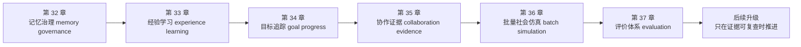

# 第五部分小结：从升级方向到可验证工程

第五部分不再追加新的前沿概念。第 31 章已经完成论文和工程方向的总起，第 32-37 章分别把记忆、反思、目标、协作、社会仿真和评价体系落到 `generative_agents_next`。这里做最后收束：哪些能力已经进入代码和实验，哪些仍然只是路线图，以及后续继续改造时应按什么顺序推进。

```mermaid
flowchart LR
    M["第 32 章<br/>记忆治理 memory governance"] --> R["第 33 章<br/>经验学习 experience learning"]
    R --> G["第 34 章<br/>目标追踪 goal progress"]
    G --> C["第 35 章<br/>协作证据 collaboration evidence"]
    C --> S["第 36 章<br/>批量社会仿真 batch simulation"]
    S --> E["第 37 章<br/>评价体系 evaluation"]
    E --> Next["后续升级<br/>只在证据可复查时推进"]
```

*图 38-1：第五部分的升级闭环。每一章都必须产出可复查文件，而不是只提出前沿方向。*

*图 38-2：前沿升级路线的项目落地墙。原图中的路线图现在只作为第五部分的收束图使用：它提醒后续升级仍要经过源码 source、提示词 prompt、断点 checkpoint、移动回放 movement 与评价报告 report 的闸门。*

## 已经落地的能力

第五部分的核心价值不是“列出长期记忆、反思、目标规划这些词”，而是把它们压进本项目能运行、能检查、能复现的文件里。

| 章节 | 已落地能力 | 关键文件 | 实验证据 | 边界 |
| --- | --- | --- | --- | --- |
| 第 32 章 | 记忆治理 memory governance：扩展记忆类型、来源、置信度、摘要、冲突和关系记忆 | `generative_agents_next/modules/memory/associate.py`、`generative_agents_next/data/prompts/relationship_update.txt` | `book-memory-governance-full`、`memory_metrics.json` | 摘要不是压缩删除，跨实验长期记忆仍需更多验证。 |
| 第 33 章 | 经验学习入口：从评价结果中抽取失败候选 | `generative_agents_next/analyze_experiment.py`、`reflection_candidates.json` | `book-reflection-party` | 当前只是候选，不自动写入角色长期记忆。 |
| 第 34 章 | 目标追踪：把传播、承诺、到场拆成目标进度 | `goal_progress.json`、`metrics.json.goal_progress` | `book-goal-party` | 目标尚未接管 `_determine_action()`，仍是离线评价。 |
| 第 35 章 | 协作证据：公共事件板、承诺、拒绝、到场和任务状态 | `event_board.json`、`report.md` | `book-collaboration-party` | 事件板还不是角色共享状态。 |
| 第 36 章 | 社会仿真实验包：多次 run、同口径指标和批量汇总 | `book-social-party-r1/r2/r3`、`batch_summary.json` | `book-social-party-batch` | 目前是小样本机制验证，不是现实社会外推。 |
| 第 37 章 | 评价体系：把故事证据变成 `metrics.json`、`report.md` 和失败候选 | `generative_agents_next/analyze_experiment.py` | 7 个单次评价目录和 1 个批量目录 | 自动指标不是人工裁决，成本字段尚未进入 `metrics.json`。 |

这张表也是第五部分的验收清单。一个升级如果不能写出“关键文件、实验证据、边界”三列，就不算完成，只能算想法。

## 仍然只是路线图的内容

下面这些方向值得继续做，但不能在本书里写成已经完成。

| 后续方向 | 为什么还不能算完成 | 下一步落点 |
| --- | --- | --- |
| 反思 lesson 自动写回 | 当前只有 `reflection_candidates.json`，还没有完整的 self-evaluation、lesson 置信度和删除机制。 | 先人工挑选候选，再接入 `lesson/skill` 记忆。 |
| 目标驱动行动 | 当前目标进入评价和记忆，但没有稳定影响 `_determine_action()`。 | 先让目标生成候选行动，再用自然性和目标贡献评分。 |
| 角色可见的事件板 | `event_board.json` 是离线评价产物，不是角色共享状态。 | 只对明确事件开放部分字段，保留拒绝、遗忘和冲突。 |
| 批量实验方差和对照组 | `batch_summary.json` 只有均值，没有方差、显著性和严格变量控制。 | 增加实验配置文件和对照组命名规则。 |
| 模型路由与成本优化 | `LLMModel.get_summary()` 有成功、失败、重试摘要，但 `metrics.json` 还没有 caller 级成本字段。 | 先把 `func_hint` 传成 caller，再按 prompt 类型统计成本和格式失败。 |
| 跨实验长期记忆 | 已有来源字段和导入入口方向，但还缺稳定的跨实验验证。 | 显式记录 `source_experiment/source_node_id`，再跑迁移实验。 |

模型路由 model routing 适合留到后续维护阶段。它不是“换一个更强模型”这么简单，而是要回答：哪些 prompt 需要强推理，哪些可以用便宜模型，格式失败率是否下降，成本增量是否值得。没有第 37 章的评价底座，模型路由只会变成主观试手感。

## 后续实践顺序

继续改 `generative_agents_next` 时，顺序比方向更重要。先让证据可复查，再让行为变复杂。

| 顺序 | 做什么 | 通过标准 |
| --- | --- | --- |
| 1 | 固定评价脚本和实验命令 | 每个实验都能生成 `metrics.json`、`report.md` 和复查入口。 |
| 2 | 只改一个主要变量 | 能说明变化来自记忆、反思、目标、协作、模型中的哪一项。 |
| 3 | 保留失败样例 | 失败 run、误判、时间窗不足和格式残留都进入报告。 |
| 4 | 再让升级进入角色循环 | 只有在离线证据稳定后，才把 lesson、goal 或 event board 喂回角色。 |
| 5 | 最后做成本与模型路由 | 比较质量、失败率、重试次数和成本，不只看输出是否好看。 |

这个顺序保护的是可解释性。生成式智能体 Generative Agents 的吸引力在于能看到记忆、反思、计划、对话和环境如何互相作用；升级不能把这些入口遮掉。

## 全书收束

全书到这里形成一条完整路径：

| 能力 | 项目证据 | 本书完成的事 |
| --- | --- | --- |
| 解释 explain | `Agent`、`Associate`、`Schedule`、`Maze`、prompt | 读懂角色如何从记忆到行动。 |
| 复现 reproduce | checkpoint、`conversation.json`、`movement.json`、`simulation.md` | 复现派对、竞选、扩展角色和多次实验。 |
| 评价 evaluate | `metrics.json`、`report.md`、`event_board.json`、`goal_progress.json` | 判断故事证据是否闭合，失败断在哪一层。 |
| 扩展 upgrade | `generative_agents_next` 的记忆、目标、协作和评价改造 | 把前沿研究压回可验证、可回滚、可复查的工程步骤。 |

后续真正要做的不是继续堆概念，而是沿着这一条线推进：每次只改一个能力，每次都保留原始证据，每次都让结论能回到文件路径。这样，小镇才不是一个漂亮演示，而是一个可以持续研究和迭代的生成式智能体实验场。

## 参考资料

- 生成式智能体 Generative Agents: https://arxiv.org/abs/2304.03442
- Reflexion: https://arxiv.org/abs/2303.11366
- Voyager: https://arxiv.org/abs/2305.16291
- MemGPT: https://arxiv.org/abs/2310.08560
- Mem0: https://arxiv.org/abs/2504.19413
- AgentBench: https://arxiv.org/abs/2308.03688
- WebArena: https://arxiv.org/abs/2307.13854
- GAIA: https://arxiv.org/abs/2311.12983
- SWE-bench: https://arxiv.org/abs/2310.06770
- AI Agents That Matter: https://arxiv.org/abs/2407.01502
- Local upgrade source: `generative_agents_next/modules/memory/associate.py`
- Local upgrade source: `generative_agents_next/modules/agent.py`
- Local upgrade source: `generative_agents_next/analyze_experiment.py`
- Local output: `generative_agents_next/results/evaluations/<实验名>/metrics.json`
- Local output: `generative_agents_next/results/evaluations/<实验名>/report.md`
- Local output: `generative_agents_next/results/evaluations/book-social-party-batch/batch_summary.json`
