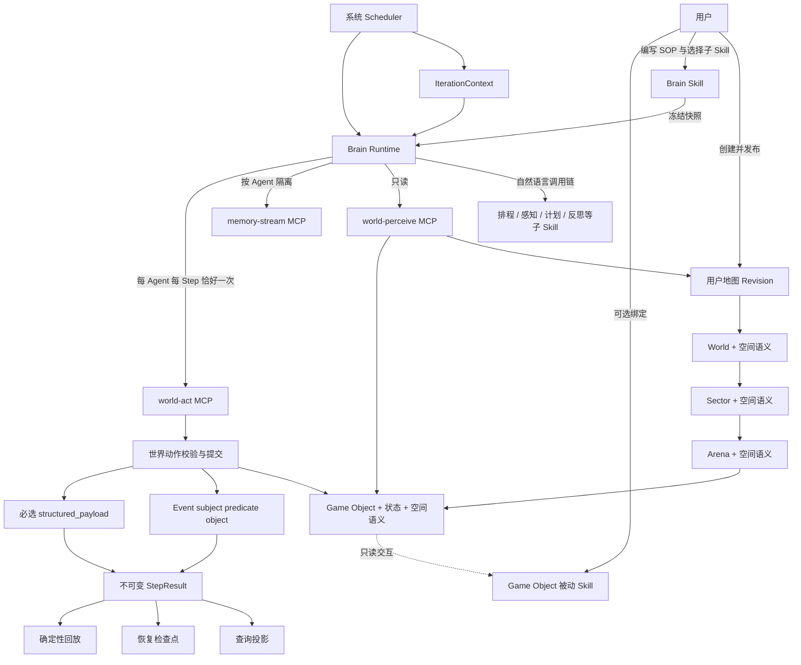
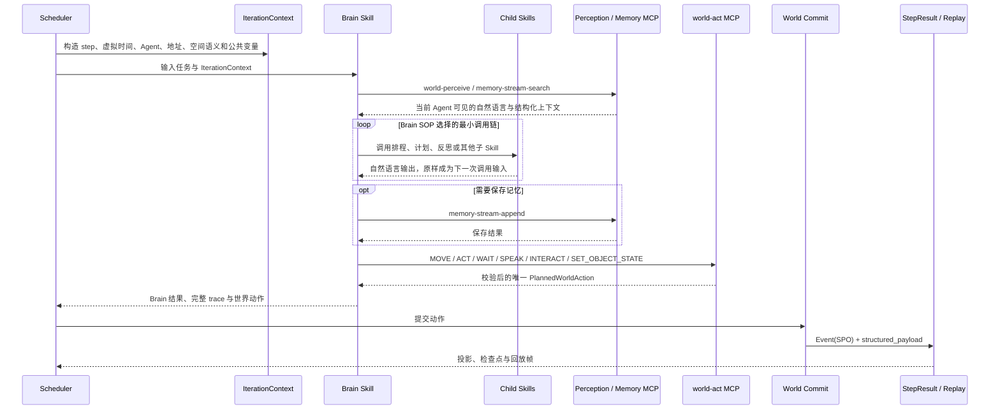

# 用户地图与 Skill Brain 仿真架构

状态：当前实现基线

设计版本：2.0

日期：2026-08-27

## 1. 边界

系统提供稳定的仿真内核和公共 MCP；用户用地图、Brain Skill、子 Skill 与 Game Object 被动 Skill 定义具体仿真。

| 系统负责 | 用户负责 |
| --- | --- |
| 从 1 到 `steps` 的确定性调度 | 创建并发布四层地图 |
| 虚拟时间与 `IterationContext` | 在四层节点上定义空间语义 |
| Skill 快照、解析与执行 | 选择 Brain Skill 及其子 Skill |
| 感知、记忆和世界动作 MCP | 用自然语言 SOP 定义认知顺序 |
| 动作校验、世界状态提交 | 给 Game Object 绑定只读被动 Skill |
| Event(SPO) 与结构化回放事实 | 决定 Agent 如何使用感知、记忆、计划和反思 |
| StepResult、检查点、投影和回放 | 显式选择每个仿真使用的已发布地图 |

系统不创建默认地图，新仿真不能隐式继承任何地图。地图只有 `World → Sector → Arena → Game Object` 四层；四层都可以携带空间语义，只有 Game Object 可以绑定被动 Skill。

历史数据库和旧迁移不属于兼容面。2.0 使用全新基线表结构，旧 Run 与旧地图数据不迁移。

## 2. 对象关系



## 3. 单轮执行

Agent 按稳定顺序逐个执行。同一 Agent 在一个 Step 内可以无限次读取，但只能提交一个改变世界的动作。



如果 Brain 没有调用 `world-act`，运行时以 `WAIT` 收敛；第二次 `world-act` 会被拒绝。此规则属于仿真安全边界，不要求每个 Skill 输出一套额外机器合同。

## 4. IterationContext

每个 Skill 调用共享同一轮上下文，至少包括：

- `run_id`、`attempt_id`；
- `agent_key`、`agent_name`；
- `step_no`、`total_steps`；
- `now`：带时区的具体仿真时间，如 `2026-08-27T11:13:51+08:00`；
- `stride_minutes`；
- 当前坐标与四层地址；
- 当前 Tile 可见的四层空间语义；
- Agent 当前状态、排程、已知空间记忆和近期认知。

`IterationContext` 是输入上下文，不是回放事实。Brain 可以按 SOP 决定调用顺序，并把上一个 Skill 的完整自然语言输出交给下一个 Skill。

## 5. MCP 边界

### 5.1 感知

`world-perceive` 读取当前 Agent 可见的坐标、四层地址、空间语义、附近 Agent、地图事件与 Game Object。它不修改世界。

Game Object 的 `INTERACT` 可以调用对象绑定的被动 Skill。该 Skill 返回观察结果，但不能直接修改对象状态；需要变化时，Agent 必须另行选择合法的世界动作。不过因为一轮只有一个世界动作，`INTERACT` 本身不会在同轮继续追加状态写入。

### 5.2 记忆

`memory-stream-search` 与 `memory-stream-append` 是按当前 Agent 隔离的公共能力。内容可以以自然语言为主，并可附加 SPO；回放不依赖 Skill 的记忆文本重建世界。

### 5.3 世界动作

系统动作原语固定为：

- `MOVE`：移动到可达坐标或四层地址；
- `ACT`：起床、洗漱、吃饭、办公、喝咖啡等任意普通活动；Skill 直接填写 Event 的 `predicate`、`object` 和可选 `description`，系统不维护活动编码字典；
- `WAIT`：真实等待，不能用来代替普通活动；
- `SPEAK`：向明确参与者发送可回放消息；
- `INTERACT`：调用附近 Game Object 的被动 Skill；
- `SET_OBJECT_STATE`：对附近 Game Object 应用明确状态补丁。

MCP 注入 Agent 身份；模型不能伪造另一个 Agent 的身份，也不能越过动作校验直接写地图对象。

## 6. 回放事实合同

Skill 的过程输出、Thought、计划与反思只进入审计 trace，不承担回放协议。只有已经提交的世界变化才进入回放事实。

每条世界事实必须同时具有：

```text
Event(subject, predicate, object)
structured_payload: 非空对象
```

`subject/predicate/object` 提供稳定语义索引；`structured_payload` 提供无歧义重建数据。当前事件类型包括：

| 事件 | 结构化负载核心字段 |
| --- | --- |
| `AGENT_MOVED` | 起点、终点、路径、地址、Agent key |
| `AGENT_ACTED` | Agent key、坐标、地址、description、原始 Event(SPO) |
| `AGENT_WAITED` | Agent key、坐标、地址、说明 |
| `AGENT_SPOKE` | 说话者、参与者、消息、位置 |
| `GAME_OBJECT_INTERACTED` | 对象 key、调用 Skill、观察结果、位置 |
| `GAME_OBJECT_STATE_CHANGED` | 对象 key、before、after、state_patch、执行者 |

回放窗口返回窗口起点前的对象状态基线，再按 `GAME_OBJECT_STATE_CHANGED` 顺序归约，因此可以直接跳转到任意 Step。LLM 文本永远不能直接驱动画面状态。

## 7. 发布与运行不变量

1. 实验创建必须显式提供已发布的用户地图 Revision。
2. Run 冻结地图、Brain 及其递归子 Skill、Game Object 被动 Skill 的 Revision 与内容哈希。
3. 运行只读取 Manifest 中的 Skill 快照，不读取后来修改的数据库 Skill Revision。
4. Scheduler 负责虚拟时间，Skill 不能推进时间。
5. Agent 使用稳定顺序执行，避免并发写入导致不可复现。
6. 世界变化必须经过 `world-act` 与 World Commit。
7. StepResult 是投影、检查点和回放的共同事实来源。
8. 数据库从 2.0 基线新建，不提供旧表迁移或旧 Run 回放兼容层。

## 8. Skill 存储与版本

Skill 是产品内用户可随时创建的公共资源，以数据库为唯一事实来源：

1. `SkillDefinition` 保存稳定名称、类型、当前 Revision 与归档状态。
2. 每次保存创建不可变 `SkillRevision`，包含 Markdown、子 Skill 依赖、脚本快照和完整内容哈希。
3. 系统内置 `SKILL.md` 只是空库初始化种子和导入/导出格式；用户操作不写入源码目录。
4. Run 启动时从数据库解析 Brain、递归子 Skill 与 Game Object 被动 Skill，把完整依赖闭包写入不可变 Manifest。
5. 运行时如果脚本执行器需要文件，只在 Run 私有目录或可丢弃缓存中物化快照；这些文件不是部署时的业务数据。

## 9. 本地模型验证

2026-08-27 使用 Qwen3.8 27B 的 OpenAI 兼容接口完成真实调用：`stanford-town-brain → world-perceive → world-act(WAIT)`。模型返回标准 function calling，运行时只接受一次动作，证明自然语言 Brain SOP 与 MCP 驱动链可直接工作。
