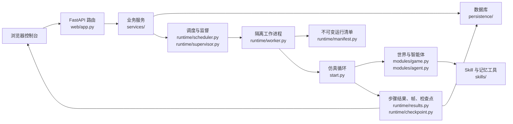
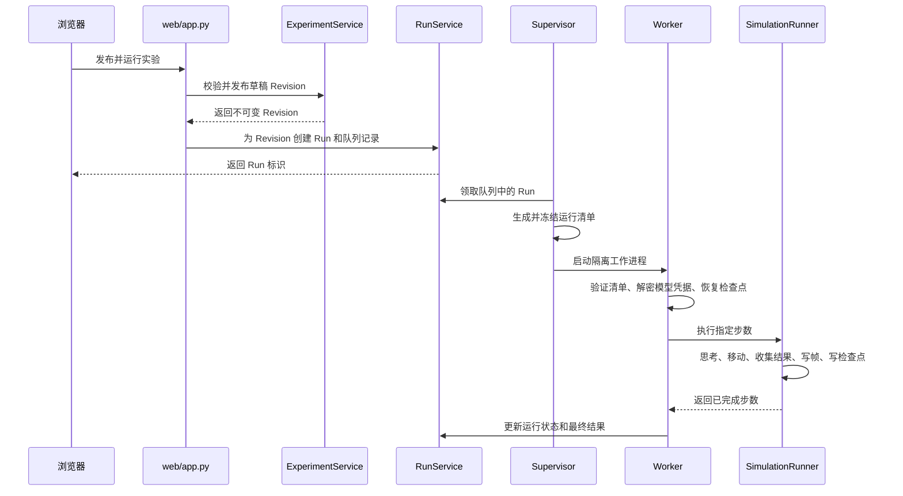

# GenerativeAgentsCN 中文代码导览

这份文档面向第一次接触本项目、希望先理解整体再阅读细节的开发者。它不重复接口文档，重点回答四个问题：代码分成哪些层、一次操作会经过哪些文件、核心数据如何流动、应该按什么顺序阅读。

## 先记住三个核心概念

1. **实验（Experiment）**：用户正在编辑的研究方案。实验包含可修改的草稿，也可以发布为不可变的 Revision。
2. **运行（Run）**：某个已发布 Revision 的一次独立执行。每次运行有自己的目录、时钟、随机数、模型调用记录、检查点和结果。
3. **Skill**：智能体使用的可版本化能力。原子 Skill 完成一个具体判断，Skill 包组合多个能力，Brain Skill 定义一个智能体的总体认知入口。

理解代码时，始终区分“可修改草稿”“已发布 Revision”和“正在执行的 Run”。很多看似重复的校验，都是为了防止这三者互相污染。

## 目录职责

| 目录 | 主要职责 | 阅读建议 |
| --- | --- | --- |
| `generative_agents/config/` | Pydantic 配置模型、实验定义、地图编辑文档与发布校验 | 先看 `schema.py`，再按需要看地图或空间资产模型 |
| `generative_agents/web/` | FastAPI 路由、请求模型、静态页面入口 | `app.py` 很长，不建议从第一行顺序读到最后 |
| `generative_agents/services/` | 业务规则和数据库事务 | 按资源阅读：实验看 `experiments.py`，运行看 `runs.py`，地图看 `maps.py` |
| `generative_agents/persistence/` | SQLAlchemy 数据模型、数据库初始化和 Alembic 迁移 | 需要确认“数据最终存在哪里”时再看 |
| `generative_agents/runtime/` | 运行隔离、调度、工作进程、清单、结果、检查点和恢复 | 理解执行链的核心目录 |
| `generative_agents/modules/` | 智能体、世界、地图格子、记忆和认知行为 | 理解“每一步具体发生什么”时阅读 |
| `generative_agents/skills/` | Skill 发现、解析、执行、MCP 工具和运行记忆 | 理解新能力系统时阅读 |
| `generative_agents/web/static/` | 实验控制台、地图编辑器、回放器等浏览器端逻辑 | 先看每个文件顶部的中文导航，再按功能搜索函数 |
| `tests/` | 架构红线、业务行为和运行时契约 | 不理解某条规则时，用测试名反查预期行为 |

## 系统总览

## 推荐阅读顺序

### 路线一：先理解产品和 API

1. `README.md`：了解项目用途和启动方式。
2. `generative_agents/web/main.py`：Web 服务如何启动。
3. `generative_agents/web/app.py` 中的 `create_app()`：依赖如何装配、路由如何注册。
4. `generative_agents/config/schema.py`：一个实验定义由哪些部分组成。
5. `generative_agents/services/experiments.py`：草稿、校验、发布和 Revision 的事务规则。
6. `generative_agents/services/runs.py`：已发布 Revision 如何变成一次 Run。

### 路线二：理解一次仿真如何执行

1. `generative_agents/runtime/supervisor.py`：谁领取排队任务、谁拉起工作进程。
2. `generative_agents/runtime/worker.py`：工作进程如何验证清单、恢复状态和装配依赖。
3. `generative_agents/runtime/context.py`：运行私有的时钟、路径、模型和 Skill 依赖。
4. `generative_agents/start.py` 中的 `SimulationRunner.run()`：每一步的总调度顺序。
5. `generative_agents/modules/game.py`：世界如何调用指定智能体思考。
6. `generative_agents/modules/agent.py`：感知、计划、反应、对话、移动和记忆。
7. `generative_agents/runtime/results.py`：一步执行后形成的结构化事实。
8. `generative_agents/runtime/checkpoint.py`：如何保存可验证、可恢复的状态边界。

### 路线三：理解 Skill 系统

1. `generative_agents/skills/registry.py`：如何从 `SKILL.md` 发现、校验和快照 Skill。
2. `generative_agents/data/skills/`：实际的原子 Skill、Skill 包和 Brain Skill。
3. `generative_agents/skills/runtime.py`：如何执行脚本、子 Skill、模型调用和 MCP 调用。
4. `generative_agents/skills/mcp.py`：Skill 可以调用的运行记忆工具。
5. `generative_agents/modules/prompt/scratch.py`：旧认知调用如何适配到结构化 Skill 输入输出。

### 路线四：理解地图编辑与运行地图

1. `generative_agents/config/map_editor.py`：编辑器文档的严格数据结构。
2. `generative_agents/web/static/map-editor-v2.js`：浏览器端画布、素材和层级树如何编辑。
3. `generative_agents/web/static/map-workspace.js`：地图目录、草稿保存、恢复和发布流程。
4. `generative_agents/services/maps.py`：地图业务事务、发布校验和编辑文档编译。
5. `generative_agents/modules/maze.py`：发布后的 Tile 网格如何被仿真读取。

## 一次“发布并运行”的完整调用链

这里最重要的不变量是：Worker 不重新读取“当前草稿”，只读取启动前冻结并校验过的运行清单。因此，用户在运行过程中继续编辑草稿，不会改变已经开始的 Run。

## 一次仿真步内部发生什么

`SimulationRunner.run()` 是理解单步执行的最佳入口。每一步按以下顺序发生：

1. 检查暂停或取消请求，只在安全边界停止。
2. 为本步创建 `StepResultBuilder`，所有副作用先写入该构建器。
3. 逐个调用 `Game.agent_think()`，由 `Agent.think()` 完成感知和决策。
4. 如果附近存在可交互游戏对象，执行相应 Skill，并把观察结果送回智能体。
5. 按移动预算消费路径；未走完的路径留给下一步或恢复后的运行。
6. 收集智能体动作、对话、记忆变化、领域事件和模型用量。
7. 冻结为不可变 `StepResult`，先写帧，再按策略写检查点和数据库投影。

不要把“智能体想做什么”和“本步真正完成了什么”混为一谈。计划路径可能跨越多个格子，而一个仿真步只会消费当前预算允许的部分。

## 数据为什么会同时出现在文件和数据库中

- **运行清单、帧、检查点、模型调用原始记录**保存在 Run 私有目录，便于校验、恢复和下载。
- **列表、统计、时间线和检索视图**投影到数据库，便于 Web API 分页查询。
- `StepResult` 是两者之间的统一事实来源。投影可以重建，但已经提交的步骤事实不能被悄悄改写。

相关入口：

- 文件目录边界：`runtime/context.py` 的 `RunPaths`
- 单步事实模型：`runtime/results.py`
- 文件提交顺序：`runtime/commit.py`
- 数据库投影：`runtime/sqlite_result_projector.py`
- 恢复选择：`runtime/checkpoint.py` 和 `runtime/recovery.py`

## 前端大型文件怎么读

不要从 `console-api.js` 第一行一直读到最后。浏览器端代码普遍遵循以下结构：

1. 顶部常量和单一 `state` 对象保存页面状态。
2. `api()` 或 `request()` 统一处理 HTTP 和错误信封。
3. `load*`/`refresh*` 从服务端加载权威数据。
4. `render*` 只负责把当前状态转换为 DOM。
5. `bind*` 连接按钮、表单和键盘事件。
6. 文件末尾完成初始化并把少量入口暴露到 `window`。

按页面选择文件：

| 页面 | 主要脚本 |
| --- | --- |
| 实验控制台与运行结果 | `console-api.js` |
| 公共地图目录与发布 | `map-workspace.js` |
| 地图画布编辑器 | `map-editor-v2.js` |
| Skill 工作区 | `skill-workspace.js` |
| 人群与智能体模板 | `crowd-workspace.js` |
| 回放画布 | `replay-player.js` |

## 常见状态名

| 名称 | 含义 |
| --- | --- |
| Draft | 可编辑草稿；保存时使用乐观锁，旧版本保存会产生冲突 |
| Published Revision | 不可变发布版本；Run 只能引用它 |
| Queued | Run 已创建，等待 Supervisor 领取 |
| Running | Worker 正在执行 |
| Paused | 已在可恢复边界停止，可以从已验证检查点恢复 |
| Interrupted | Worker 意外退出；满足恢复条件时可恢复 |
| Completed / Failed / Cancelled | 终态，不再由普通刷新改变 |

## 修改代码时的检查清单

1. 修改配置字段时，同时检查 `config/schema.py`、数据库迁移、Web 请求模型和发布校验。
2. 修改 Run 状态时，同时检查 `services/runs.py`、调度器、Supervisor、Worker 和 SSE 事件。
3. 修改单步结果时，同时检查 `runtime/results.py`、提交器、文件/SQLite 投影器和回放结构。
4. 修改地图编辑结构时，同时检查 `config/map_editor.py`、`services/maps.py`、`map-editor-v2.js` 和地图测试。
5. 修改 Skill 格式时，同时检查 Registry、Runtime、运行清单快照和 Skill API。
6. 优先运行相关小测试，最后运行 `python -m pytest -q`。

## 暂时可以跳过的代码

- `persistence/migrations/versions/`：用于升级历史数据库，不是当前业务流程入口。
- `web/static/vendor/`：第三方压缩库，不应手工阅读或修改。
- 演示脚本和原型页面：用于产品演示，不是正式运行链的权威实现。
- 大型 JSON、地图素材和图片：属于数据或资源，不是控制流程。

当某个行为仍然不清楚时，先在 `tests/` 中搜索对应业务名。测试通常比实现更直接地表达“不允许发生什么”和“必须保持什么”。
