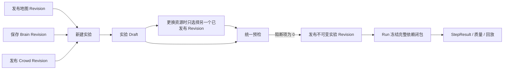

# 实验资源组合 UX 与交互边界

状态：当前实现基线
版本：3.0
日期：2026-08-29

## 1. 结论

实验不是地图编辑器、Brain 编辑器或行为流程编排器。实验只做四件事：

1. 选择已发布的地图 Revision；
2. 选择一个不可变的 Brain Skill Revision；
3. 选择 Crowd/Agent Revision，并设置实验副本允许变化的 Agent 参数；
4. 配置模型、时间、检查点、结果投影等运行参数，然后校验、发布和运行。

地图与 Brain 的内容编辑始终发生在全局资源工作区。实验中只展示来源、版本、哈希和“前往资源”的入口。若资源内容需要变化，用户应创建并发布新 Revision，再回实验重新选择；实验不保存覆盖层，也不把 Brain 内容复制成实验私有草稿。

## 2. 信息架构

| 作用域 | 页面 | 允许的写操作 | 禁止的写操作 |
| --- | --- | --- | --- |
| 全局 | 地图 | 创建、编辑、校验、发布地图 Revision | 隐式替实验切换地图 |
| 全局 | Brain | 编辑自然语言 SOP、选择子 Skill、保存 Revision、归档 | 创建系统固定认知流程 |
| 全局 | Agent / Crowd | 创建模板、编辑 Agent 资源、发布 Revision | 修改已有实验冻结副本 |
| 实验 | 实验概览 | 选择地图 Revision、Brain Revision；设置时间、步数、检查点、结果投影；校验和发布 | 编辑地图内容、编辑 Brain 内容 |
| 实验 | 参与 Agent | 编辑当前实验副本的目标、初始位置、模型覆盖、视野和注意力上限 | 修改 Agent/Crowd 来源 Revision |
| 实验 | 模型与运行 | 配置 Chat/Embedding 服务、超时与有界重试，查看探测状态 | 管理本地模型进程或设置无限重试 |
| 实验 | 实验结果 | 选择 Run/Attempt、查看 StepResult、质量结果、回放和导出 | 用 LLM 文本补造世界事实 |

实验详情的一级导航固定为：

- 实验概览；
- 实验结果；
- 参与 Agent；
- 模型与运行。

“世界与地图”“实验大脑”“行为与记忆”“高级设置”不再是实验内页面。

## 3. 核心交互流

### 3.1 新建实验

新建向导必须在提交前得到三个明确选择：地图 Revision、Brain Revision、可选 Crowd Revision。地图和 Brain 选择项显示资源名称、版本号或短 Revision ID，不使用“当前最新版本”这类会漂移的值。

缺少已发布地图或 Brain 时，向导保持不可提交，并提供进入对应全局资源工作区的入口。系统不自动选择默认地图。

### 3.2 编辑草稿

实验概览把“资源组合”放在运行参数之前。保存组合时只发送 `map_revision_id` 与 `brain_revision_id`；成功后刷新草稿的 `lock_version`、资源哈希和来源信息。

资源内容不以内嵌编辑器、弹窗覆盖层或复制文本的方式修改。用户在全局资源页发布新版本后，回到实验重新选择即可。

### 3.3 校验、发布和运行

预检对当前 Draft hash 执行。任何修改都会使上一次校验失效。错误和警告数量必须与明细一致，并能定位到实验概览、Agent 或模型页面。

发布冻结以下内容：地图 Revision、Brain Revision、Brain 递归子 Skill、Game Object 被动 Skill、Agent/Crowd 来源、模型配置和相关素材。发布后的实验 Revision 不可修改；后续调整从已发布版本 fork 新 Draft。

## 4. 配置归属

### 4.1 保留在实验级

- `simulation.start_time`、`stride_minutes`、`max_steps`、随机种子；
- 检查点间隔与保留数量；
- 模型服务、模型身份、超时、有界重试；
- Step 投影间隔与模型 Payload 审计开关；
- 当前实验 Agent 副本的目标、初始位置和模型覆盖。

### 4.2 移到 Agent 级

- `vision_radius`：Agent 感知硬上限；
- `attention_bandwidth`：该 Agent 每轮附近候选输出上限。

两项不能作为实验全局“行为参数”覆盖所有 Agent。

### 4.3 删除

- 实验地图 overlay、地图 patch 和实验内地图上传；
- 实验私有 Brain 文本与 Brain 编辑桥接；
- 系统固定的 schedule / perceive / plan / reflect / execute 行为流水线；
- `record_interval_minutes`，结果频率由 Step 投影合同表达；
- `replay_interpolation_frames`，回放插值是表现层实现，不改变实验定义；
- 无界或超长模型重试参数。

## 5. API 边界

资源选择使用专用接口：

- `PUT /api/v1/experiments/{id}/draft/map`，请求只包含 `lock_version` 与 `map_revision_id`；
- `PUT /api/v1/experiments/{id}/draft/brain`，请求只包含 `lock_version` 与 `brain_revision_id`。

通用完整草稿更新和分区 PATCH 不允许修改 `world` 或 `engine`。这样即使绕过前端，也无法把地图内容、伪造的 Brain 哈希或实验级覆盖写进草稿。

创建实验时，服务端用 `brain_revision_id` 读取数据库事实并核对 Skill 类型、名称和内容哈希；发布时再次核对。Run 启动时按该 Revision 冻结递归依赖闭包，不能退回到同名 Skill 的最新版本。

## 6. 状态与并发

- 所有草稿保存使用 `lock_version`；冲突返回当前版本，不静默覆盖。
- 页面切换实验、Revision、Run 或 Attempt 时，请求必须带当前作用域；旧响应不能覆盖新选择。
- Draft、已发布、排队、执行、暂停、取消、结果固化和完成是独立状态。
- 运行结束与实验质量分开显示；未配置评估器时不把业务目标写成系统完成条件。

## 7. 验收标准

1. 实验侧栏不存在地图编辑、Brain 编辑、行为流程或高级参数页面。
2. 新建实验没有明确地图 Revision 或 Brain Revision 时不能提交。
3. 实验概览能查看并更换已发布地图/Brain Revision，但不能编辑其内容。
4. 旧地图 overlay 接口和实验内世界写入接口不存在；通用草稿接口也不能绕过限制。
5. Brain 选择保存 Revision ID 与完整哈希；发布和 Run 都验证并冻结同一版本。
6. Agent 编辑器可分别配置视野与注意力带宽，运行时实际遵守上限。
7. 模型重试有上限，取消可中断请求或退避。
8. 回放仅消费 StepResult 中的 Event(SPO) 与非空 `structured_payload`。
9. 前端桌面宽屏与窄屏均无横向溢出、空页面、失效导航或旧页面深链。
10. 新架构不读取或迁移旧 overlay、旧 behavior、旧 record/replay 配置。
