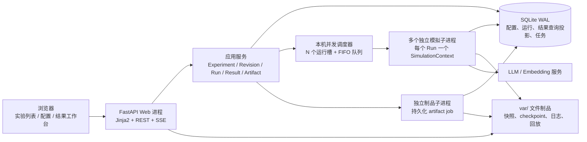
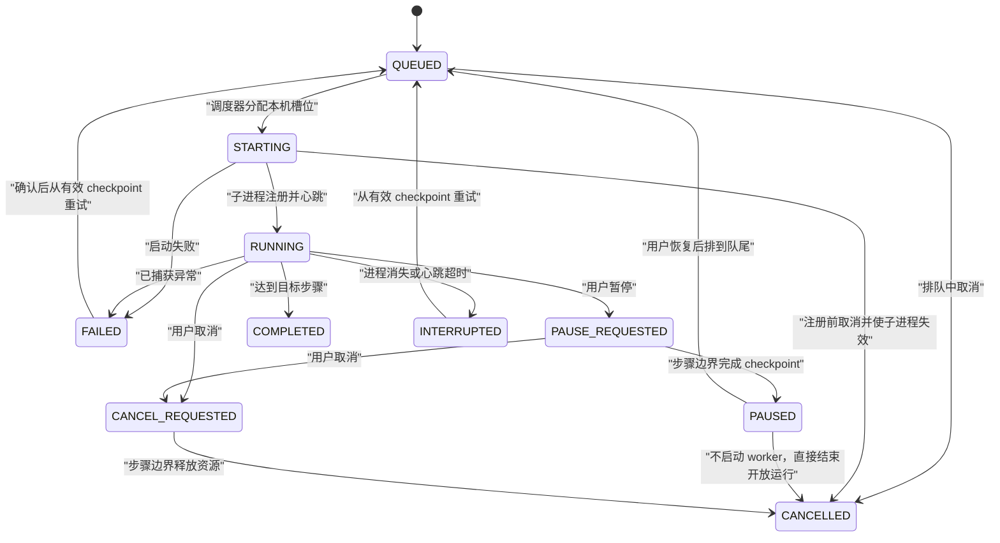
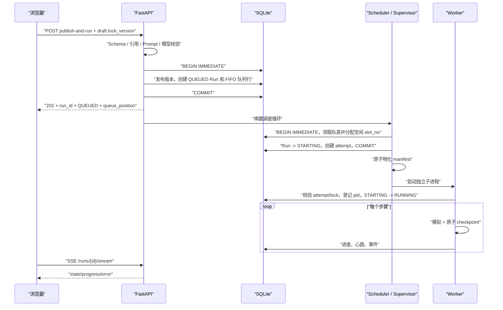

# 基于实验隔离的配置与运行 Web 服务技术方案

> 文档状态：可直接进入开发拆分
> 方案版本：v1.2（同机多实验并发 + 完整结果工作台）
> 适用项目：GenerativeAgentsCN
> 编写日期：2026-08-08

## 1. 结论先行

本次改造不是给现有 `config.json` 增加一个网页编辑器，而是把“实验”提升为系统的一等领域对象。每次运行必须绑定一份不可变、可追溯的实验版本；运行时只能读取该版本的完整快照，不能再读取项目目录中的共享配置文件。

首期采用以下确定方案：

| 层面 | 选型 | 结论 |
| --- | --- | --- |
| Python | Python 3.12 | 保留现有 Python 技术栈，统一通过模块方式启动 |
| Web 服务 | FastAPI + Uvicorn | 提供页面、REST API、SSE 运行事件流和 OpenAPI |
| 页面实现 | Jinja2 + 原生 ES Modules + Fetch | 复用当前高保真 HTML/CSS，不引入 React/Vue 和前端构建链 |
| 数据库 | SQLite（WAL）+ SQLAlchemy 2.0 + Alembic | 当前是单机有界并发，无需 PostgreSQL、Redis 或 Celery |
| 配置保存 | 数据库草稿 + 不可变发布快照 + 文件制品 | 数据库是唯一事实源；运行目录中的 manifest 是可重建副本 |
| 运行方式 | 每个 Run 一个独立 Python 子进程 | 同一台机器可同时运行多个实验；超过本机并发上限后进入持久化 FIFO 队列 |
| 结果读取 | Run 原始文件 + SQLite 查询投影 | 运行中即可查看；总览、时间线、Agent、对话、记忆和制品均按 run_id 隔离 |
| 实验隔离 | 版本快照、运行目录、进程上下文、模型实例、向量索引五层隔离 | 任一实验的编辑或运行都不能改变其他实验已有版本和运行 |
| 权限 | 首期无登录、无角色、无租户 | 默认仅监听 `127.0.0.1`，不因此忽略 API Key 的安全保存 |

最终的核心不变量是：

1. `Run -> PublishedRevision -> Experiment` 的绑定关系创建后不可改变。
2. 已发布版本不可修改、不可删除；修改配置一定产生新草稿和新版本。
3. 运行进程不得读取 `data/config.json`、`data/prompts`、共享 Agent JSON 或共享地图作为实时配置。
4. 任何运行路径只能由 `run_id` 推导，不能由用户输入的实验名称直接拼接。
5. 本机提供可配置的并发槽，默认 2 个；每个槽最多承载一个 Run，超出容量的运行进入可见、可恢复、可取消的 FIFO 队列。
6. 同一实验首期最多存在一个非终态 Run，避免用户重复点击产生同实验并行分叉；不同实验可以同时运行。
7. 结果页任何数字、事件、关系和回放位置都必须能追溯到当前 Run 的原始记录；不得从当前共享配置、其他 Run 或前端样例数据补齐。

---

## 2. 改造目标与边界

### 2.1 目标

- 首页是实验列表，支持状态筛选、搜索、排序和服务端分页。
- 每个实验独立维护模拟参数、模型、行为、世界、Agent 和 Prompt。
- 编辑采用草稿；发布时生成完整、不可变、带哈希的配置快照。
- 运行、暂停、恢复、取消、失败恢复均围绕实验和运行记录完成。
- 同一台机器支持多个实验同时运行，并对并发上限、排队顺序和进程恢复作出确定处理。
- 当前文件配置能够导入；旧的命令行入口在迁移期保持可用。
- 原有模拟逻辑逐步解除全局状态和路径耦合，而不是在外层简单套一个 API。
- 方案完成后可以按本文的目录、数据表、接口和改造清单直接实施。

### 2.2 首期不做

- 不做用户、角色、权限、团队和多租户。
- 不做多机器 Worker 调度、分布式队列、远程节点注册和跨机器资源调度。
- 不做按实验配置 CPU/内存配额或优先级；首期使用本机统一并发上限和 FIFO 顺序。
- 不做实验模板市场、项目切换和插件系统。
- 不做每个 Agent 单独覆盖模型参数；模型和通用行为先在实验级统一配置。
- 不把大模型调用、向量服务或地图资源上传到云端。

这些能力若未来需要扩展，应建立在本方案的版本快照与独立运行上下文之上，而不是提前出现在当前界面和首期实现中。

### 2.3 高保真结果交互反推后的校准结论

结果工作台使原方案中“生成 `movement.json` 后打开旧回放”的处理不再成立。六个结果视图反推出以下首期必做能力：

| 交互 | 必须存在的后台事实 | 实施结论 |
| --- | --- | --- |
| Run 选择器 | 当前实验的 Run 历史、每个 Run 的结果完整度与能力 | 新增分页 Run 列表契约；默认选择规则固定，不把多次运行合并 |
| 总览趋势 | 按虚拟时间聚合的行动、对话、记忆序列 | 增加时间桶投影，不能在浏览器读取整份 movement 后现算 |
| 关键事件 | 可追溯的领域事件和来源引用 | 新增领域事件表；首期只展示客观事件和确定性阈值，不用 LLM 编造摘要 |
| 对话网络 | 对话双方和消息条数 | 边权来自会话数/消息数，不声称是心理或社会关系强度 |
| Agent 结果 | 每步状态、移动轨迹、日程修订、记忆和对话计数 | `agent_think()` 必须返回结构化结果，不能只留下 plan |
| 时间探索 | 发布版地图、每步真实路径、动作变化和事件流 | 路径在运行时写入 frame；禁止结束后用当前地图重算路径 |
| 对话详情 | 稳定 conversation/message ID、说话人、时间、地点 | 改造 `_chat_with()` 直接产出结构化 ConversationRecord |
| 记忆筛选 | 新增、访问、过期/淘汰状态和证据节点 | Associate 提供增量事件，不以当前索引仍存在的节点冒充完整历史 |
| 模型用量 | 逻辑调用、物理尝试、回退、延迟和 token | Run 级 recorder 落 JSONL，SQLite 只保存页面需要的聚合 |
| 执行尝试 | attempt 的起止步骤、错误和恢复边界 | 扩充 run_attempts，而不是从日志文本猜测 |
| 预览/导出 | 异步制品任务、状态、受控下载 | 增加持久化 artifact job；不在 FastAPI 请求中同步压缩大目录 |

高保真中的样例内容并不自动成为引擎能力，首期必须按源码真实边界校准：

1. 当前 `_chat_with()` 只支持两个 Agent，对话结果首期按双人会话实现；数据库保留 participant 关联表，但页面不得伪造群聊。
2. “邀请覆盖率 72%”这类实验语义指标无法从通用运行状态可靠推出。总览只能自动展示对话、记忆、移动等通用事实；用户在记忆页主动搜索某个词时，可以展示当前查询命中数并标明查询词，但不能把它升级成实验结论。首期不增加指标脚本或分析插件系统。
3. Agent 时间分布首期只使用可客观判定的 `休息 / 对话 / 移动 / 其他活动`。不能仅凭自然语言把行动猜成“工作”或“学习”；若后续需要职业分类，应作为版本化实验定义另行设计。
4. 关系图只表示本 Run 中实际发生的对话连接。边权、节点大小和排行公式必须在 API 的 `metric_definitions` 中返回，避免 UI 自己选择口径。
5. 当前 `compress.py` 每个模拟步骤伪造 60 个回放帧，并用当前地图重算最短路径。新运行必须保存当步真实 `plan.path`；插值帧明确标记为 DERIVED，不得被当成真实观测。

---

## 3. 现有实现审计

### 3.1 当前配置来源

当前系统的“配置”并不只在 `data/config.json`，而是散落在命令行参数、JSON 文件、Prompt 文本、代码默认值和硬编码路径中。

| 配置域 | 当前来源 | 已发现内容 |
| --- | --- | --- |
| 实验参数 | `start.py` 命令行 | `name`、`start`、`step`、`stride`、恢复方式 |
| Agent 感知 | `data/config.json` | `mode`、`vision_r`、`att_bandwidth` |
| Agent 计划 | `data/config.json` | `max_try`、`diversity` |
| Agent 思考 | `data/config.json` | `interval`、`poignancy_max` |
| 对话 | `data/config.json` | `chat_iter` |
| 记忆关联 | `data/config.json` + 代码默认值 | embedding、retention、max_memory、重要性与相关性权重、衰减、过期天数 |
| LLM | `data/config.json` + 代码默认值 | provider、model、base_url、api_key、timeout、max_tokens、thinking、temperature、重试 |
| Embedding | `data/config.json` | provider、model、base_url、api_key、timeout、max_retries |
| Agent 定义 | 25 个 `agent.json` | 身份、坐标、画像、当前状态、scratch、spatial tree、portrait |
| Prompt | 29 个 `data/prompts/*.txt` | 计划、反思、检索、对话、事件描述等模板正文 |
| 世界 | `maze.json` 和静态资源 | world、tile_size、size、map、camera、address keys、tiles、贴图 |
| 结果与回放 | 代码硬编码 | checkpoints、compressed、storage、frontend static、frames_per_step |

### 3.2 代码中的隐式配置

以下值当前不是显式配置，但会实质影响实验结果，必须纳入版本快照或明确固定为实现常量：

- `Associate`：`retention=8`、`max_memory=-1`、`max_importance=10`、`recency_decay=0.995`、`recency_weight=0.5`、`relevance_weight=3`、`importance_weight=2`。
- 记忆默认过期时间：30 天。
- 计划生成：`diversity=5`、`max_try=5`。
- 反思生成：`reflect_focus(..., 3)` 和 `reflect_insights(..., 5)` 中的 3/5 直接硬编码。
- `agent.think.interval=1000` 当前只在 `start.py` 赋给 `self.think_interval`，后续从未读取，是无效配置，不能原样搬进新 Schema。
- LLM 温度默认值：0.5。
- LLM/向量操作重试：当前多处为 10 次，每次等待 5 秒。
- 回放：`frames_per_step=60`。
- 夜间停止社交：小时数大于等于 23。
- 同一组 Agent 再次对话冷却：60 分钟；当前直接写在 `_chat_with()`。
- 对话复读检测：从第二轮开始固定启用；当前没有配置开关。
- 索引/检索：SentenceSplitter 512/64、LlamaIndex output/context 1024/4096、similarity top-k 5、focus retrieve max 30。
- 行为算法：日程分解阈值 60 分钟、路径候选最多随机取 4 个、对话时长按 240 字/分钟估算、默认事件重要度 1。
- 当前对话时长使用 `int(chars / 240)`，短对话会得到 0 分钟；每条消息也没有独立虚拟时间。`ga-cn-v1` 改为 `max(1, ceil(chars / 240))`，结束时间标记 ESTIMATED，消息只保存稳定顺序号和会话开始时刻，不伪造逐条时间。
- 当前 `max_memory` 达到上限时使用 `memory[:max_memory - 1]`，会少保留一条；`ga-cn-v1` 明确定义为每类最多保留恰好 `max_memory` 条。
- `record_iterval`：当前拼写错误且默认值为 30，改造时兼容读取，目标字段统一为 `record_interval_minutes`。

### 3.3 必须解除的耦合

1. `Game` 和 `Timer` 保存在进程全局 `GenerativeAgentsMap` 中。
2. `agent.py`、Prompt、记忆、计划、日志等模块随处调用全局 `get_timer()`。
3. LlamaIndex 使用全局 `Settings.embed_model`、`Settings.node_parser` 等；同进程切换实验可能互相污染。
4. Prompt 路径固定为 `data/prompts`，而且每次构建 Prompt 都重新读共享文件。
5. 25 个角色名单硬编码在 `start.py`，`compress.py` 和 `replay.py` 反向导入它。
6. 地图、前端静态目录、checkpoint、compressed、向量存储路径均硬编码。
7. `start.py` 在 import 阶段解析命令行，无法安全作为库调用。
8. 当前每个步骤写一个完整 JSON，并重复改写会话文件，缺少原子写入和运行状态事务。
9. `model=auto` 在运行时临时解析，但没有把解析后的实际模型写入实验快照。
10. checkpoint 文件名只使用模拟分钟；`stride=0` 或同一分钟多步会覆盖，恢复又依赖文件名字典序寻找“最新”文件。目标文件必须以单调 step number 命名。

因此，仅把 `config.json` 改成数据库字段并不能满足实验隔离；至少还要隔离全局对象、路径、模型实例和向量索引。

---

## 4. 目标架构



### 4.1 进程模型

首期固定为三个进程角色，其中模拟进程可以有多个实例：

- **Web/调度进程**：处理页面、配置保存、校验、运行控制和 SSE，并分别运行 `LocalRunScheduler` 与 `ArtifactScheduler` 两个本机循环。Uvicorn 首期仍只启动一个 Web worker，避免重复调度器。
- **模拟子进程**：每个 attempt 通过 `python -m generative_agents.runtime.worker --run-id <uuid> --attempt-id <uuid>` 启动，一个进程只执行一个运行；同一时刻最多存在 `GA_MAX_CONCURRENT_RUNS` 个模拟进程。
- **制品子进程**：每个 artifact job 通过 `python -m generative_agents.runtime.artifact_worker --job-id <uuid>` 启动，只读取已提交结果并生成一个制品；首期固定最多 1 个，不占 simulation slot，也不增加用户可见的“制品 Worker”配置。

不允许在 FastAPI 的请求线程或 background task 中直接跑 `Game.run()`，原因是模拟耗时长、同步且可能阻塞；Web 重启也不应直接破坏已落盘的运行状态。

运行队列是本机并发控制的一部分，而不是远程 Worker 系统：

- 发布并运行先创建 QUEUED Run，调度器按 FIFO 分配最小可用槽位。
- 有空闲槽时通常在下一次调度周期内进入 STARTING；没有空闲槽时保持 QUEUED，并返回实时排队位置。
- PAUSED 不占槽位；恢复操作重新入队，避免插队影响已经等待的实验。
- 一个运行结束、暂停、取消或异常释放槽位后，调度器立即唤醒并启动队首 Run。
- 不提供 Worker 节点、机器列表或资源编排界面；用户只看到 Run 的运行/排队状态。

系统级并发参数不进入实验快照，因为它只影响“何时执行”，不改变实验定义：

```text
GA_MAX_CONCURRENT_RUNS=2          # 默认 2，允许 1～16，修改后重启 Web 生效
GA_SCHEDULER_POLL_MS=1000         # 队列兜底轮询；状态变化同时主动唤醒
GA_WORKER_HEARTBEAT_SECONDS=10
GA_WORKER_HEARTBEAT_TIMEOUT_SECONDS=60
GA_WORKER_STARTUP_TIMEOUT_SECONDS=60
GA_WORKER_FORCE_KILL_GRACE_SECONDS=10
GA_WORKER_CPU_THREADS=auto        # auto = max(1, CPU逻辑核数 // 并发槽数)
```

Supervisor 启动子进程时显式设置 `OMP_NUM_THREADS`、`MKL_NUM_THREADS`、`OPENBLAS_NUM_THREADS`、`NUMEXPR_NUM_THREADS` 和 `TOKENIZERS_PARALLELISM=false`，避免每个模拟进程都默认占满整机线程。并发上限由部署者依据内存、模型部署位置和实验规模调整，系统不在运行中自动改变上限。

两个调度器都在 FastAPI lifespan 中启动：startup 必须先分别获得 `scheduler.lock`、`artifact-scheduler.lock` 并完成对账，之后才标记服务 ready；任一锁已被同一 `var_dir` 的另一个 Web 实例持有时，本实例启动失败，不能以“只提供页面、不调度”模式继续。graceful shutdown 停止领取新队列项，但不终止已经运行的模拟或制品子进程，新 Web 实例启动后接管对账和后续调度。

### 4.2 分层职责

| 层 | 职责 | 禁止事项 |
| --- | --- | --- |
| `web` | HTTP、页面渲染、输入输出模型、错误映射 | 不直接操作 ORM 细节，不执行模拟 |
| `services` | 事务边界、业务规则、状态机、发布与启动编排 | 不依赖 FastAPI Request |
| `persistence` | ORM、Repository、迁移、SQLite 初始化 | 不包含业务状态判断 |
| `config` | Pydantic schema、合并、规范化、校验、哈希 | 不读取运行中的共享配置 |
| `runtime` | 上下文、进程监督、控制、StepResult、checkpoint、结果投影、worker | 不接受网页草稿作为运行输入 |
| `modules` | Agent/Game/Maze/Memory 等模拟领域逻辑 | 不访问数据库和全局单例 |

### 4.3 技术选型依据

- FastAPI 与现有 Pydantic 技术栈一致，可直接形成请求校验与 OpenAPI；SSE 也无需引入 WebSocket 状态管理。
- SQLAlchemy 2.0 采用同步 Session。当前模拟逻辑和 SQLite 都是同步的，使用异步 ORM只会增加连接和事务复杂度。
- SQLite 使用 WAL、`foreign_keys=ON`、`busy_timeout` 和批量短事务，适合当前单机 Web + 有界数量模拟进程的并发模型。worker 只在步骤边界批量写查询投影；frame、checkpoint、模型逐调用 trace、日志和导出包仍写各自独立目录。
- Alembic 管理数据库结构，不允许启动时通过散落的 `CREATE TABLE IF NOT EXISTS` 演进生产数据库。
- Jinja2 负责页面骨架，原生 JS 调 REST API。当前是少量内部管理页，引入 SPA 构建链收益不足。

### 4.4 建议依赖

在保留现有模型与 LlamaIndex 依赖的前提下增加：

```text
fastapi==0.141.1
uvicorn==0.52.1
SQLAlchemy==2.0.51
alembic==1.19.0
pydantic-settings==2.15.0
Jinja2==3.1.6
filelock==3.32.2
cryptography==50.0.0
psutil==7.2.2
```

测试依赖单独放入 `requirements-dev.txt`：

```text
pytest
pytest-cov
httpx
playwright
```

上述版本按 2026-08-08 的官方 PyPI 稳定版锁定；这些包的 `Requires-Python` 均覆盖 Python 3.12。正式合并依赖时还必须与现有 Pydantic、LlamaIndex 和模型客户端执行一次完整依赖解析，并跑 Windows + Python 3.12 的安装、迁移与启动冒烟测试；若解析结果要求降级，只更新锁文件和本节版本，不放宽 Python 3.12 基线。

---

## 5. 实验隔离模型

### 5.1 领域对象

| 对象 | 含义 | 可变性 |
| --- | --- | --- |
| Experiment | 用户看到的实验容器，保存名称、目标和列表状态 | 元数据可变 |
| ExperimentRevision | 某次完整配置版本 | 草稿可变；发布后不可变 |
| Run | 使用某个已发布版本执行的一次模拟 | 仅按状态机变化，不得换版本 |
| RunAttempt | 一个 Run 的某次进程尝试，恢复时新增 | 不可变历史 |
| RunEvent | 运行进度、状态、错误事件 | 仅追加 |
| Asset | 地图、图片等内容寻址资源 | 哈希确定后不可变 |
| Secret | API Key 等凭据的不可变版本 | 替换时新建版本，不返回明文 |

### 5.2 五层隔离

1. **配置隔离**：实验草稿是独立 JSON；复制实验时执行深复制，不建立动态继承。
2. **版本隔离**：发布版本是完整快照，不从“默认模板”或其他实验补字段。
3. **进程隔离**：每个运行独立子进程；全局第三方库状态不会跨运行残留。
4. **文件隔离**：每个 `run_id` 独占目录，checkpoint、日志、向量索引不复用。
5. **实例隔离**：Timer、PromptRepository、LLM、Embedding、向量索引通过 `SimulationContext` 注入，不保存在进程全局映射中。

### 5.3 模板不是继承关系

当前 `data/config.json`、25 个 Agent、29 个 Prompt 和村庄地图作为“内置目录”导入数据库时，只承担新建实验的初始化来源：

- 新建实验时复制成独立草稿。
- 之后修改内置目录不会改变任何已有实验。
- 复制实验时复制来源实验选定版本的完整定义。
- 发布时不记录“继承某模板后再覆盖若干字段”，而是记录合并后的最终值。

这能避免一个模板变动导致历史实验悄悄改变。

新建界面不再把该内部复制机制暴露为“配置起点”。用户显式选择大脑
Revision、地图 Revision 和一个或多个人群 Revision。人群是公共 Agent 模板的
版本化集合；多个群体组合时按规范化 Agent 名称去重，随后把 Agent 复制为实验
独立数据并自动放置到地图可通行位置。复制已有实验继续使用独立操作入口。

---

## 6. 配置模型

### 6.1 顶层 Schema

数据库中的 `definition_json` 采用下面的逻辑结构。具体实现使用 Pydantic v2 模型，所有模型设置 `extra="forbid"`，避免拼错字段后被静默忽略。

```json
{
  "schema_version": 1,
  "experiment": {
    "key": "social-memory-001",
    "name": "记忆权重对社交扩散的影响",
    "goal": "验证相关性权重变化对消息扩散速度的影响",
    "timezone": "Asia/Shanghai"
  },
  "engine": {
    "algorithm_version": "ga-cn-v1"
  },
  "simulation": {
    "start_time": "2026-02-13T00:00:00+08:00",
    "stride_minutes": 10,
    "max_steps": 1000,
    "checkpoint_interval_steps": 1,
    "checkpoint_retention": 2,
    "record_interval_minutes": 30,
    "random_seed": 42,
    "log_level": "INFO"
  },
  "results": {
    "agent_step_projection_interval_steps": 1,
    "replay_interpolation_frames": 60,
    "capture_model_payloads": false
  },
  "models": {
    "chat": {
      "provider": "vllm",
      "model": "auto",
      "resolved_model": null,
      "base_url": "http://127.0.0.1:5001",
      "secret_ref": null,
      "timeout_seconds": 300,
      "max_tokens": 2048,
      "temperature": 0.5,
      "enable_thinking": false,
      "retry_attempts": 10,
      "retry_backoff_seconds": 5
    },
    "embedding": {
      "provider": "openai_compatible",
      "model": "auto",
      "resolved_model": null,
      "base_url": "http://127.0.0.1:5002",
      "secret_ref": null,
      "timeout_seconds": 120,
      "transport_retry_attempts": 3,
      "index_operation_retry_attempts": 10,
      "retry_backoff_seconds": 5
    }
  },
  "behavior": {
    "percept": {
      "mode": "box",
      "vision_radius": 8,
      "attention_bandwidth": 8
    },
    "schedule": {
      "max_try": 5,
      "diversity": 5
    },
    "think": {
      "poignancy_max": 150,
      "reflection_focus_count": 3,
      "reflection_insight_count": 5
    },
    "chat": {
      "max_iterations": 4,
      "stop_after_hour": 23,
      "cooldown_minutes": 60,
      "repeat_detection_enabled": true
    },
    "memory": {
      "retention": 8,
      "max_memories_per_type": -1,
      "reflection_memory_limit": 10,
      "recency_decay": 0.995,
      "recency_weight": 0.5,
      "relevance_weight": 3.0,
      "importance_weight": 2.0,
      "default_expire_days": 30
    }
  },
  "world": {
    "world_key": "the-ville-v1",
    "world_name": "The Ville",
    "definition": {},
    "assets": []
  },
  "agents": [],
  "prompts": {}
}
```

发布后的 JSON 中 `model` 保留用户选择，`resolved_model` 必须写入实际模型 ID。若无法解析或连通性测试失败，则禁止发布并运行。

`engine.algorithm_version` 把不适合逐项暴露为实验参数的算法常量锁成一个受支持版本；`ga-cn-v1` 固定索引分块、检索上限、日程分解阈值、路径候选采样、对话时长估算和默认重要度。它参与定义哈希，worker 不支持该版本时拒绝启动。Run manifest 另记录代码仓库 commit/构建 ID，避免“同一算法名、不同代码”无法审计。

`ga-cn-v1` 的固定 profile 为：`sentence_chunk_size=512`、`sentence_chunk_overlap=64`、`llama_num_output=1024`、`llama_context_window=4096`、`similarity_top_k=5`、`focus_retrieve_max=30`、`schedule_decompose_threshold_minutes=60`、`path_target_sample_limit=4`、`chat_chars_per_minute=240`、`default_event_poignancy=1`。profile 是代码内只读映射并有快照测试；修改任何值必须注册新的 algorithm_version，不能在原键下静默改值。

`results` 也属于 Revision 快照：projection interval 允许 1～100，默认 1；replay interpolation 允许 1～120，默认 60；payload capture 默认 false。它们不决定调度优先级，但会改变结果查询粒度、制品形态或可观测内容，因此不能从运行时全局配置临时补入。

模型配置使用 `provider` 判别联合类型，不允许一个“万能 ModelConfig”接受无效组合：

| 用途 / provider | `model=auto` | `base_url` | `secret_ref` |
| --- | --- | --- | --- |
| Chat `vllm` | 允许，经 `/v1/models` 解析 | 必填，规范化到 `/v1` | 可空 |
| Chat `openai` | 不允许，必须明确模型 ID | 默认官方地址，可显式覆盖 | 通常必填 |
| Chat `ollama` | 不允许 | 必填，adapter 使用 Ollama API | 可空 |
| Embedding `openai_compatible` | 允许，经 `/v1/models` 解析 | 必填 | 可空 |
| Embedding `openai` | 不允许 | 默认官方地址，可显式覆盖 | 通常必填 |
| Embedding `ollama` | 不允许 | 必填 | 可空 |
| Embedding `hugging_face` | 不允许 | 不使用 | 不使用 |

保存草稿时先做组合校验；显式“测试连接”再执行 provider 对应的发现/最小调用。发布版只保存明确 `resolved_model`，worker 禁止再次执行 auto 选择。Provider adapter 必须统一落实 timeout、token、temperature、thinking 和重试；不能像当前 Ollama 路径那样继续使用固定 300 秒。

### 6.2 Agent 定义

每个 Agent 必须拥有稳定的 `agent_key`，显示名称可以修改：

```json
{
  "agent_key": "isabella-rodriguez",
  "enabled": true,
  "name": "Isabella Rodriguez",
  "portrait_asset": "sha256:...",
  "coord": [72, 14],
  "currently": "经营 Hobbs Cafe",
  "scratch": {
    "age": 34,
    "innate": "friendly, outgoing, hospitable",
    "learned": "Isabella Rodriguez is a cafe owner...",
    "lifestyle": "Isabella goes to bed around 11pm...",
    "daily_plan": ""
  },
  "spatial": {
    "address": {},
    "tree": {}
  }
}
```

首期不为单个 Agent 增加模型和行为覆盖。原 `start.py` 的 `personas` 常量完全删除，启用角色列表由版本快照中的 `agents[].enabled` 决定。

### 6.3 Prompt 定义

29 个现有 Prompt 全部进入实验版本，键名固定、正文可编辑：

```text
base_desc
decide_chat
decide_chat_terminate
decide_wait
decide_wait_example
describe_emoji
describe_event
describe_object
determine_arena
determine_object
determine_sector
generate_chat
generate_chat_check_repeat
poignancy_chat
poignancy_event
reflect_chat_memory
reflect_chat_planing
reflect_focus
reflect_insights
retrieve_currently
retrieve_plan
retrieve_thought
schedule_daily
schedule_decompose
schedule_init
schedule_revise
summarize_chats
summarize_relation
wake_up
```

存储结构：

```json
{
  "schedule_init": {
    "content": "...",
    "sha256": "..."
  }
}
```

`sha256` 由服务端计算，客户端不可提交。发布校验会解析 `string.Template` 变量，并用每个 Prompt 的变量白名单检查缺失变量和未知变量。

### 6.4 世界与资源

世界配置包含当前 `maze.json` 的全部结构：`world`、`tile_size`、`size`、`map`、`camera`、`tile_address_keys`、`tiles`。图片、纹理等二进制文件使用内容哈希引用：

```json
{
  "logical_path": "assets/village/maze.png",
  "asset_hash": "sha256:...",
  "media_type": "image/png",
  "size": 123456
}
```

世界 JSON 随每个发布版本完整保存；大文件不在每个版本物理复制，而是放入内容寻址资源库。只要哈希相同即可安全复用，因为资源内容不可变。

### 6.5 现有字段映射

| 现有字段 | 新字段 |
| --- | --- |
| CLI `--start` | `simulation.start_time` |
| CLI `--step` | `simulation.max_steps` |
| CLI `--stride` | `simulation.stride_minutes` |
| `frames_per_step` / `compress.py` 固定 60 | `results.replay_interpolation_frames` |
| `agent.percept.vision_r` | `behavior.percept.vision_radius` |
| `agent.percept.att_bandwidth` | `behavior.percept.attention_bandwidth` |
| `agent.schedule.*` | `behavior.schedule.*` |
| `agent.think.interval` | 不迁移；旧代码中的无效字段，legacy import 产生 warning |
| `agent.think.poignancy_max` | `behavior.think.poignancy_max` |
| `agent.think.llm.*` | `models.chat.*` |
| `agent.chat_iter` | `behavior.chat.max_iterations` |
| `_chat_with()` 固定 60 分钟 | `behavior.chat.cooldown_minutes` |
| 对话复读检测固定启用 | `behavior.chat.repeat_detection_enabled` |
| `agent.associate.embedding.*` | `models.embedding.*` |
| embedding `max_retries` | `models.embedding.transport_retry_attempts` |
| Index 固定重试 10 次 | `models.embedding.index_operation_retry_attempts` |
| `agent.associate.retention` | `behavior.memory.retention` |
| `Associate.max_memory` | `behavior.memory.max_memories_per_type` |
| `Associate.max_importance` | `behavior.memory.reflection_memory_limit` |
| 代码 `record_iterval` | `simulation.record_interval_minutes` |

### 6.6 校验分层

| 层次 | 校验内容 | 执行时机 |
| --- | --- | --- |
| Schema | 类型、必填、枚举、数值范围、未知字段 | 每次保存 |
| 引用 | Agent 唯一性、坐标、地址、资源哈希、Prompt 集合 | 手动校验、发布 |
| 语义 | 至少一个启用 Agent、步长与步数、地图可通行、行为参数关系 | 手动校验、发布 |
| 模板 | Prompt 语法、变量白名单、必需 Prompt | Prompt 保存、发布 |
| 外部服务 | LLM/Embedding URL、模型解析、最小调用 | 显式测试、发布运行 |

校验结果区分 `errors` 和 `warnings`。只有错误阻止发布；警告要求前端展示，但不阻止。校验报告记录配置哈希，草稿任何变更都会使旧报告失效。

### 6.7 首期关键约束

这些约束直接落到 Pydantic `Field` 和发布级 model validator，不只写在前端：

| 字段 | 约束 |
| --- | --- |
| `simulation.start_time` | 必须带时区；显示按 `experiment.timezone`，存储转 UTC |
| `engine.algorithm_version` | 必须在当前服务支持列表中；发布后不可变 |
| `stride_minutes` | Web 发布版 1～1440；旧 CLI 的 0 只允许 legacy 兼容运行，不可发布为 Web 实验 |
| `max_steps` | 1～1,000,000 |
| `checkpoint_interval_steps` | 1～`max_steps`；暂停、取消、终态仍强制 checkpoint |
| `checkpoint_retention` | 2～20 |
| `record_interval_minutes` | 1～1440 |
| `random_seed` | 有符号 64 位整数；进入定义哈希 |
| `log_level` | DEBUG/INFO/WARNING/ERROR |
| `results.agent_step_projection_interval_steps` | 1～100 且不大于 `max_steps` |
| `results.replay_interpolation_frames` | 1～120 |
| 模型 `base_url` | 仅 http/https；默认要求 loopback，非本机地址产生发布 warning |
| 模型 timeout/retry/backoff | timeout 1～1800 秒；retry 1～20；backoff 0～300 秒 |
| Chat `max_tokens/temperature` | 1～131072；0～2 |
| `secret_ref` | 可空；非空必须指向存在的不可变 Secret 版本 |
| `behavior.percept.mode` | 首期固定 Literal `box`；不显示无效下拉选项 |
| percept/schedule/think/chat 数量 | 均为正整数；反思 focus/insight 各 1～20；`stop_after_hour` 0～23；cooldown 0～10080 分钟；attention 不大于地图可感知实体上限 |
| memory 权重与衰减 | 权重均 >=0 且至少一个 >0；decay 在 (0,1]；`max_memories_per_type=-1` 或正整数；reflection limit 1～100 |
| Agent | agent_key 符合 `[a-z0-9][a-z0-9-]{1,63}` 且唯一；至少一个 enabled；coord 落在可通行 tile |
| 世界与资源 | tile_size/size 为正数；地址引用有效；所有 asset hash 存在且 MIME/大小匹配 |

配置保存只做不依赖外部服务的快速校验；地图全量连通性、Prompt 样例渲染、模型解析和最小调用放在“校验/发布”阶段，避免每次输入都触发昂贵操作。

---

## 7. 数据库设计

### 7.1 SQLite 初始化参数

每个数据库连接建立时执行：

```sql
PRAGMA foreign_keys = ON;
PRAGMA journal_mode = WAL;
PRAGMA synchronous = NORMAL;
PRAGMA busy_timeout = 5000;
```

所有写事务必须短小。模拟进程不能长时间持有事务，更不能在数据库事务中调用 LLM、写 checkpoint 或等待网络。Web 与每个 worker 各自创建 Engine；worker 使用 `NullPool`，一次状态写入一次短连接。`busy_timeout` 后仍冲突的关键状态写最多再重试 3 次（50/100/200 ms 抖动退避），每次重试前完整回滚并新建 Session；心跳单次失败记录 warning，不能因此中止模拟，下一次心跳继续补写。

### 7.2 `experiments`

| 字段 | 类型 | 约束/说明 |
| --- | --- | --- |
| `id` | CHAR(36) | UUID 主键 |
| `experiment_key` | VARCHAR(80) | 唯一、稳定、URL 不直接使用它定位目录 |
| `name` | VARCHAR(120) | 非空 |
| `goal` | TEXT | 非空，允许空字符串 |
| `status` | VARCHAR(24) | DRAFT/QUEUED/RUNNING/PAUSED/COMPLETED/CANCELLED/FAILED |
| `current_draft_revision_id` | CHAR(36) | 可空 FK |
| `current_published_revision_id` | CHAR(36) | 可空 FK |
| `latest_run_id` | CHAR(36) | 可空 FK |
| `row_version` | INTEGER | 乐观锁，从 1 开始 |
| `created_at` | DATETIME | UTC |
| `updated_at` | DATETIME | UTC，列表默认倒序 |

`status` 是服务层事务性维护的列表投影，规则如下：

1. 有 STARTING/RUNNING/PAUSE_REQUESTED/CANCEL_REQUESTED 运行时为 RUNNING。
2. 有 QUEUED 运行且没有活跃运行时为 QUEUED。
3. 最新运行已暂停时为 PAUSED。
4. 存在未发布草稿且无非终态运行时为 DRAFT。
5. 最新运行完成且没有新草稿时为 COMPLETED。
6. 最新运行取消且没有新草稿时为 CANCELLED。
7. 最新运行失败或中断且没有新草稿时为 FAILED。

### 7.3 `experiment_revisions`

| 字段 | 类型 | 约束/说明 |
| --- | --- | --- |
| `id` | CHAR(36) | UUID 主键 |
| `experiment_id` | CHAR(36) | FK，非空 |
| `revision_no` | INTEGER | 每实验从 1 递增 |
| `state` | VARCHAR(16) | DRAFT/PUBLISHED |
| `base_revision_id` | CHAR(36) | 可空，记录草稿来源 |
| `schema_version` | INTEGER | 当前为 1 |
| `definition_json` | JSON/TEXT | 完整配置，不存差量 |
| `definition_hash` | CHAR(64) | 规范化 JSON 的 SHA-256 |
| `validation_json` | JSON/TEXT | 最近一次校验报告 |
| `validated_hash` | CHAR(64) | 报告对应的配置哈希 |
| `provenance_json` | JSON/TEXT | 来源、导入信息；新建实验也记录 source type |
| `snapshot_complete` | BOOLEAN | 正常发布为 true，历史数据不完整时为 false |
| `lock_version` | INTEGER | 草稿乐观锁 |
| `created_at`/`updated_at` | DATETIME | UTC |
| `published_at` | DATETIME | 可空 |

约束：

- 唯一键 `(experiment_id, revision_no)`。
- SQLite partial unique index 保证每个实验最多一个 DRAFT。
- 数据库 trigger 阻止 `state='PUBLISHED'` 的行被 UPDATE 或 DELETE。
- 发布不覆盖草稿；事务中将草稿状态变为 PUBLISHED，并清空 `current_draft_revision_id`。
- 再次编辑时从指定发布版完整复制，生成新的 DRAFT 和新的 `revision_no`。

### 7.4 `runs`

| 字段 | 类型 | 约束/说明 |
| --- | --- | --- |
| `id` | CHAR(36) | UUID 主键 |
| `experiment_id` | CHAR(36) | FK，非空 |
| `revision_id` | CHAR(36) | FK 到 PUBLISHED revision，创建后不变 |
| `status` | VARCHAR(32) | 见运行状态机 |
| `slot_no` | INTEGER | STARTING/运行/停止请求时占用 1..N；其他状态为 NULL |
| `queued_at` | DATETIME | 入队时间；非 QUEUED 可空 |
| `start_step` | INTEGER | 0 或恢复点 |
| `requested_steps` | INTEGER | 目标步数 |
| `completed_steps` | INTEGER | 已完成完整步骤 |
| `recoverable_step` | INTEGER | 最新有效 checkpoint bundle 的步骤 |
| `stride_minutes` | INTEGER | 从快照冗余，便于列表展示 |
| `virtual_time` | DATETIME | 当前模拟时间 |
| `current_attempt_id` | CHAR(36) | 当前启动/运行 attempt；非运行态可空 |
| `pid` | INTEGER | 当前 attempt 进程 PID |
| `pid_create_time` | FLOAT | 防止 PID 复用误判 |
| `heartbeat_at` | DATETIME | UTC |
| `run_dir` | TEXT | 相对 `var/` 的受控路径 |
| `error_code` | VARCHAR(80) | 可空 |
| `error_message` | TEXT | 可空、已脱敏 |
| `resume_count` | INTEGER | 默认 0 |
| `created_at`/`started_at`/`finished_at` | DATETIME | UTC |

约束：

- partial unique index `uq_runs_slot_no ON runs(slot_no) WHERE slot_no IS NOT NULL`，保证同一槽位不能分给两个 Run。
- CHECK `slot_no IS NULL OR slot_no > 0`；是否不大于当前 N 由调度事务检查，因为 N 是可调整的系统配置。
- partial unique index 保证同一 `experiment_id` 最多有一个状态属于 QUEUED/STARTING/RUNNING/PAUSE_REQUESTED/PAUSED/CANCEL_REQUESTED 的 Run。
- QUEUED、PAUSED 和所有终态的 `slot_no` 必须为 NULL；STARTING/RUNNING/PAUSE_REQUESTED/CANCEL_REQUESTED 必须有槽位。
- 同一个 CHECK 同时约束 `current_attempt_id`：占槽状态必须非空，非占槽状态必须为空；RUNNING/PAUSE_REQUESTED/CANCEL_REQUESTED 还要求 PID 和 `pid_create_time` 非空。所有状态转换必须在一个 UPDATE 中同时修改这些字段，不能先改状态再补槽位。
- 降低 `GA_MAX_CONCURRENT_RUNS` 时不强杀已经占用高编号槽位的进程；调度器停止分配新槽，直到活跃数量低于新上限。该参数在 Web 重启后生效。

Alembic 中明确创建以下 SQLite partial indexes，不能只依赖 Python 先查后写：

```sql
CREATE UNIQUE INDEX uq_runs_slot_no
ON runs(slot_no)
WHERE slot_no IS NOT NULL;

CREATE UNIQUE INDEX uq_runs_one_open_per_experiment
ON runs(experiment_id)
WHERE status IN (
  'QUEUED', 'STARTING', 'RUNNING',
  'PAUSE_REQUESTED', 'PAUSED', 'CANCEL_REQUESTED'
);
```

### 7.5 `run_queue`

| 字段 | 类型 | 说明 |
| --- | --- | --- |
| `id` | INTEGER | SQLite AUTOINCREMENT 主键，也是严格 FIFO 序号 |
| `run_id` | CHAR(36) | FK `ON DELETE CASCADE`，UNIQUE |
| `reason` | VARCHAR(16) | NEW/RESUME/RETRY |
| `enqueued_at` | DATETIME | UTC |

队列行只在 Run 状态为 QUEUED 时存在。数据库 trigger 阻止为非 QUEUED Run 插入队列行；启动对账补齐“Run 为 QUEUED 但队列行缺失”的异常并报告 warning。调度器始终选择最小 `id`，不实现优先级和插队。取消排队删除队列行并将 Run 置为 CANCELLED；恢复运行重新排到队尾。

### 7.6 `run_attempts`

| 字段 | 类型 | 说明 |
| --- | --- | --- |
| `id` | CHAR(36) | UUID 主键 |
| `run_id` | CHAR(36) | FK |
| `attempt_no` | INTEGER | 每 Run 递增，唯一 `(run_id, attempt_no)` |
| `slot_no` | INTEGER | 本次尝试使用的本机槽位 |
| `status` | VARCHAR(16) | SPAWNING/RUNNING/ENDED |
| `pid`/`pid_create_time` | 数值 | 进程身份 |
| `log_path` | TEXT | 相对路径 |
| `start_step` | INTEGER | 本次 attempt 准备执行的第一个 1-based 步骤；首次为 1，恢复为 recoverable_step + 1 |
| `end_step` | INTEGER | 可空；本次 attempt 最后成功提交的 1-based available_step；未提交任何步骤时为 null |
| `started_at`/`ended_at` | DATETIME | UTC |
| `exit_code` | INTEGER | 可空 |
| `stop_reason` | VARCHAR(32) | COMPLETED/PAUSED/CANCELLED/FORCE_CANCELLED/START_FAILED/CRASHED/WEB_RECONCILE |
| `error_code`/`error_message` | 文本 | 本次 attempt 的脱敏错误，重试后仍保留 |

恢复同一个 Run 时新增 attempt，不创建新 Run，这样用户看到的是一次实验运行及其完整恢复历史。`start_step/end_step` 在 attempt 开始和每次步骤提交事务中维护，运行与制品页直接读取，禁止扫描日志推算“Step 037 → 144”。

### 7.7 `run_events`

| 字段 | 类型 | 说明 |
| --- | --- | --- |
| `id` | INTEGER | 自增主键，同时作为 SSE cursor |
| `run_id` | CHAR(36) | FK，索引 |
| `event_type` | VARCHAR(32) | state/progress/queue/log/error/artifact/reconcile |
| `payload_json` | JSON/TEXT | 小体积事件，不存完整日志 |
| `created_at` | DATETIME | UTC，索引 |

事件只追加。详细日志写文件，数据库只记录 UI 所需的状态、进度、错误摘要和制品产生事件。

### 7.8 `secrets`

| 字段 | 类型 | 说明 |
| --- | --- | --- |
| `id` | CHAR(36) | UUID 主键 |
| `kind` | VARCHAR(32) | OPENAI_API_KEY/GENERIC_TOKEN |
| `encrypted_value` | BLOB | Fernet 加密后内容 |
| `fingerprint` | VARCHAR(16) | 仅供 UI 识别，例如末 4 位摘要 |
| `supersedes_id` | CHAR(36) | 可空；记录替换来源，不改变旧引用 |
| `created_at`/`rewrapped_at` | DATETIME | 创建时间；仅主密钥重包时更新后者 |

API Key 不进入 `definition_json`、日志、异常和前端响应。配置只保存 `secret_ref`。Secret 的语义值不可原地修改：在某个实验草稿里替换密钥时创建新 Secret，并只更新该草稿的 ref；其他实验和已发布 Revision 继续引用旧版本。主密钥轮换只允许对相同明文做 rewrap，不算配置变化。主密钥优先从 `GA_MASTER_KEY` 环境变量读取；本机开发可首次生成到 `var/master.key`，该文件必须加入 `.gitignore`。这属于凭据保护和实验隔离，不是用户权限系统。

### 7.9 `assets`

| 字段 | 类型 | 说明 |
| --- | --- | --- |
| `id` | CHAR(36) | UUID 主键 |
| `sha256` | CHAR(64) | 唯一，内容标识 |
| `logical_name` | VARCHAR(255) | 展示和 manifest 使用的安全文件名 |
| `media_type` | VARCHAR(120) | MIME type |
| `size_bytes` | BIGINT | 文件大小 |
| `relative_path` | TEXT | `var/assets` 下的受控相对路径 |
| `created_at` | DATETIME | UTC |

服务端在登记时重新计算大小和哈希，不能信任客户端提交值。首期不做资源垃圾回收；因此无需维护容易出错的引用计数。未来清理时通过扫描所有 DRAFT/PUBLISHED revision 的资源哈希计算可达集合。

### 7.10 `legacy_imports`

| 字段 | 类型 | 说明 |
| --- | --- | --- |
| `id` | CHAR(36) | UUID 主键 |
| `source_type` | VARCHAR(32) | CATALOG/RUN/ARTIFACT |
| `source_path` | TEXT | 规范化的旧相对路径 |
| `source_fingerprint` | CHAR(64) | 目录清单与关键文件哈希 |
| `target_type` | VARCHAR(32) | REVISION/RUN/ASSET |
| `target_id` | CHAR(36) | 新对象 ID |
| `imported_at` | DATETIME | UTC |

唯一键 `(source_type, source_path, source_fingerprint)` 保证迁移命令幂等。它只服务旧数据迁移，不进入日常配置业务。

### 7.11 事务规则

- 保存草稿：检查 `lock_version`，更新 JSON、哈希和版本号；冲突返回 409。
- 发布并运行：在一个数据库事务内完成最终校验哈希检查、草稿发布、QUEUED Run 创建、`run_queue` 入队和实验状态更新。API 不直接抢槽或启动子进程。
- 调度认领：`BEGIN IMMEDIATE` 内计算 1..N 的最小空闲槽、选择最小 queue id、创建 SPAWNING RunAttempt，将 Run 改为 STARTING、写 `slot_no/current_attempt_id` 并删除队列行；提交后物化文件并启动子进程。
- 子进程启动失败：补偿事务将 Run 标记 FAILED，结束 attempt，清空 `slot_no/current_attempt_id/pid`；发布版本仍保留，调度器继续处理下一个排队 Run。
- 暂停/取消请求：只修改状态，不等待子进程结束；worker 在步骤边界确认并写入最终状态。
- checkpoint 写入和数据库进度更新不在同一文件系统事务中；恢复时以“已原子落盘且通过校验的最新 checkpoint”为准，并修正数据库投影。

### 7.12 结果读取模型

实验结果不能只等同于 `movement.json` 和 `simulation.md`。这两个文件是运行结束后生成的派生产物；Web 页面还需要在运行中查看进度、按时间跳转、按 Agent/对话/记忆筛选，并区分原始事实与可重建结果。目标实现采用“运行目录保存原始高体量数据，SQLite 保存可查询投影”的双层模型，但两层都必须以 `run_id` 为第一隔离键。

#### `run_result_summaries`

每个 Run 一行，供结果首页一次查询完成首屏渲染：

| 字段 | 类型 | 说明 |
| --- | --- | --- |
| `run_id` | CHAR(36) | PK/FK，结果隔离根 |
| `available_step` | INTEGER | 已经提交且可读取的最大步骤 |
| `virtual_time` | DATETIME | `available_step` 对应虚拟时间 |
| `action_count` | BIGINT | 已提交行动数 |
| `conversation_count` | BIGINT | 对话场数，不是消息条数 |
| `message_count` | BIGINT | 对话消息条数 |
| `memory_count` | BIGINT | 运行中新产生的记忆节点数 |
| `model_call_count` | BIGINT | 逻辑调用数，重试另计 |
| `model_retry_count` | BIGINT | 物理重试数 |
| `result_state` | VARCHAR(24) | EMPTY/PARTIAL/COMPLETE/CORRUPTED |
| `capabilities_json` | JSON/TEXT | 各结果视图 AVAILABLE/PARTIAL/UNAVAILABLE 及原因 |
| `projection_version` | VARCHAR(32) | 结果投影器版本，重建时用于判断 STALE |
| `result_version` | BIGINT | 任一可见结果或 capability 更新时递增，作为缓存版本 |
| `last_frame_sha256` | CHAR(64) | `available_step` 对应 frame 哈希 |
| `updated_at` | DATETIME | 最近投影提交时间 |

该表只在一步的 frame、结果事件和数据库投影都成功后推进 `available_step`。页面不能拿 `runs.completed_steps` 冒充结果可读步数。运行结束但制品仍在构建时，`result_state=COMPLETE`，artifact 独立显示 BUILDING；原始结果完整性和派生制品生成状态不能混为一个状态。

#### `run_steps` 与 `run_agent_steps`

`run_steps` 每个步骤一行，保存 `run_id + step_no`、虚拟时间、frame 相对路径与 SHA-256、该步行动变化、移动、对话场次/消息、记忆新增/访问、模型逻辑调用/重试、活跃 Agent 数、是否 checkpoint、commit 时间。唯一键为 `(run_id, step_no)`。总览趋势直接按该表聚合时间桶，不另建一套容易口径漂移的统计事实表。

`run_agent_steps` 是时间探索和 Agent 结果页的轻量投影，字段至少包括：

| 字段 | 说明 |
| --- | --- |
| `run_id, step_no, agent_key` | 联合主键；所有查询必须先约束 run_id |
| `virtual_time` | 避免时间范围查询反复换算 |
| `x, y` | 坐标整数 |
| `address` | 当步规范化地点 |
| `action_text, action_emoji` | 当步对外展示动作 |
| `activity_kind` | REST/CHAT/MOVING/OTHER；只保存运行时可客观判定类别 |
| `currently_text` | 该步记录时的当前状态；非记录步可为空 |
| `schedule_item_id` | 当前执行日程项标识 |

25 个 Agent、144 步约 3,600 行/Run，SQLite 足以承担；长实验按 `results.agent_step_projection_interval_steps` 下采样持久化，但发生对话、反思、地址变化和最终步必须强制落一行。完整逐步位置仍以 `frames/step-*.json.gz` 为事实源。索引为 `(run_id, step_no)`、`(run_id, agent_key, step_no)` 和 `(run_id, virtual_time)`。

#### `run_agent_summaries`、`run_relationship_edges` 与日程修订

Agent 页不能每次扫描全部步骤。`run_agent_summaries` 以 `(run_id, agent_key)` 为主键，保存截至 `available_step` 的最终坐标/地点/状态、行动变化数、移动步数、对话场数/消息数、新增记忆数、REST/CHAT/MOVING/OTHER 时长、最近日程版本和 `updated_step`。这是可重建投影，不是原始事实；每次步骤事务基于确定性 delta 更新，reconcile 可从 frames 重建。

`run_relationship_edges` 以 `(run_id, agent_a, agent_b)` 为主键，要求 `agent_a < agent_b`，保存 conversation_count、message_count、累计虚拟时长、first/last_conversation_at。页面的“对话网络”读取此表；默认边权为 conversation_count，API 同时返回口径。当前引擎仅产生两个参与者的 ConversationRecord，不在首期 UI 展示群聊。

日程会在对话、等待和反思后被修改，只有最终 checkpoint 无法还原变化过程。新增 `run_schedule_revisions`：`id`、`run_id`、`agent_key`、`revision_no`、`effective_step/at`、`reason`、`source_event_id`、`items_json`。唯一键 `(run_id, agent_key, revision_no)`；`items_json` 保存当时完整日程快照，Agent 详情默认返回最终版本，并允许时间线定位到修订发生步骤。

#### `run_domain_events`

`run_events` 继续只承载运行控制和 SSE，不能塞入大量模拟领域事件。新增：

| 字段 | 说明 |
| --- | --- |
| `id` | UUID；由 `run_id + step_no + event sequence` 确定性生成，重放不重复 |
| `run_id, step_no, virtual_time` | Run 隔离与时间定位 |
| `event_type` | ACTION_CHANGED/MOVED/CONVERSATION/REFLECTION/SCHEDULE_REVISED/MEMORY_CREATED |
| `primary_agent_key` | 主体 Agent，可空 |
| `title, detail, location` | 使用运行时已有结构化内容生成，不再次调用 LLM |
| `importance_score` | 客观规则得分，例如记忆 poignancy、消息条数、涉及 Agent 数 |
| `source_type, source_id` | 指向 conversation、memory 或 schedule revision |

多 Agent 关联写入 `run_domain_event_agents(run_id, event_id, agent_key)`，时间线按 Agent 筛选走索引 `(run_id, agent_key, event_id)`。总览“关键事件”只从该表按 `importance_score, virtual_time` 选取，并在响应中返回 `source_type/source_id`；语义覆盖率等非通用指标不得混入该表。

#### `run_conversations` 与 `run_messages`

对话必须结构化保存，禁止像当前 `movement.json` 那样只保留扁平字符串：

- `run_conversations`：`id`、`run_id`、开始/结束 step 与虚拟时间、`duration_source`（ESTIMATED/OBSERVED）、地点、发起者、响应者、消息数、摘要、结束原因。
- `run_messages`：`id`、`run_id`、`conversation_id`、`sequence_no`、`speaker_agent_key`、文本、`observed_at`、source_step。当前引擎的 observed_at 等于会话开始时刻；页面以 sequence_no 展示“第 N 条”，不能自行分配分钟。
- 唯一键 `(conversation_id, sequence_no)`；索引 `(run_id, started_at)`、`(run_id, speaker_agent_key, observed_at)`。SQLite FTS5 单独建立消息内容索引；FTS 行必须同时存 `run_id` 并在查询中二次约束，不能仅按全文命中返回跨实验记录。

仍使用关联表 `run_conversation_participants(run_id, conversation_id, agent_key)` 统一 Agent 查询，但首期约束每个 conversation 恰好两个 participant。这样不让 API 依赖“`A -> B @ 地点`”字符串，同时不向页面暴露当前引擎没有的群聊能力。

#### `run_memory_events`

完整向量、docstore 和 index store 留在该 Run checkpoint bundle；页面查询所需元数据投影到：`run_id`、`memory_node_id`、`agent_key`、`memory_type`（EVENT/THOUGHT/CHAT）、`origin`（BOOTSTRAP/RUN）、`state`（ACTIVE/EXPIRED/EVICTED）、`description`、`poignancy`、`created_step/at`、`last_accessed_step/at`、`expires_at`、`removed_step/at`、`evidence_node_ids_json`。唯一键 `(run_id, agent_key, memory_node_id)`。

记忆访问时间会变化，CheckpointWriter 在提交步骤时批量 upsert 当步新增、访问、过期或淘汰的节点；不能在每次相似度查询时开启 SQLite 写事务。即使节点被索引清理，投影仍保留历史并改变 state。描述全文可使用 FTS5，向量相似度仍由 Run 自己的 LlamaIndex storage 完成。结果页默认只查数据库投影，不加载整个索引；“新增记忆”只统计 `origin=RUN`，不把启动时导入的人设记忆计算进去。

#### `run_model_usage`

当前 `LLMModel._summary` 只存在进程内存和普通日志，进程退出后无法可靠生成模型调用结果。高保真首期只展示按用途聚合，不值得把每个完整调用都塞进 SQLite。每个 attempt 独占 `traces/model-calls-NNN.jsonl`，以递增 `event_seq` 追加两类事实：每次 HTTP 请求结束写 `PHYSICAL_ATTEMPT`；一个逻辑调用结束写 `LOGICAL_END`。公共字段为 attempt_id、call_id、step、agent、purpose/prompt_key、provider、resolved model、开始/结束、latency、attempt_no、结果状态、token（provider 返回时）、error_code；默认不写完整 prompt/response。

SQLite `run_model_usage` 以 `(run_id, purpose, provider, resolved_model)` 为主键，保存 logical_call_count、successful_call_count、fallback_count、physical_attempt_count、retry_count、input/output token 合计、固定延迟桶 JSON、max_latency_ms 和 updated_step。P95 以物理请求耗时从固定延迟桶确定性计算；不在每次请求时排序全量 trace。口径固定为：一次 `Agent.completion()` 是一个 logical call；其中每次 HTTP 尝试是 physical attempt；所有尝试失败并使用 failsafe 计入 fallback 且不算成功。它统计该 Run 所有 attempt 中已经落盘的真实调用，包括后来未形成已提交 step 的调用，避免低估故障恢复产生的模型消耗；`run_steps.model_logical_calls` 则只统计已提交步骤，两者不得混用。

新增 `run_model_trace_cursors(run_id, attempt_id, relative_path, last_event_seq, byte_offset, updated_at)`。`ModelTraceProjector` 在步骤边界、attempt 结束和 startup reconcile 时从 cursor 后读取完整 JSONL 行，在同一 SQLite 事务内更新 usage、cursor 和 `run_result_summaries.result_version`；重复执行不会重复计数。文件尾部半行等待下次读取，死亡 attempt 中只有 `PHYSICAL_ATTEMPT` 而没有 `LOGICAL_END` 的请求仍计入物理尝试，但不伪造成完成的逻辑调用。

仅在发布配置显式启用 `results.capture_model_payloads` 时，才在同一 JSONL 记录脱敏、压缩后的 payload 引用及哈希。该开关属于 Revision；关闭时 API 不能声称支持查看原始 prompt/response。

#### `run_artifacts`

字段包括 `id`、`run_id`、`artifact_type`、`logical_name`、`media_type`、`relative_path`、`size_bytes`、`sha256`、`source_kind`（RAW/DERIVED）、`generator_version`、`state`（BUILDING/READY/FAILED/STALE）、`created_at`、`error_summary`。唯一键 `(run_id, artifact_type, logical_name, generator_version)`。

`checkpoints/` 是恢复状态，`frames/` 是完整原始运行事实，结构化对话/记忆等 SQLite 表是可重建查询投影；`movement.json`、`simulation.md`、统计 CSV 和压缩包属于派生制品。删除或重建投影/派生制品不得修改 frame，也不得改写其他 Run 的 artifact 行。

#### `artifact_jobs`

“导出结果”“下载全部”“导出筛选记忆”“检查点打包”和“重建回放”都可能耗时，不能使用 FastAPI `BackgroundTasks`，因为 Web 重启会丢任务。新增 `artifact_jobs`：`id`、`run_id`、`job_type`（BUILD_REPLAY/RESULT_BUNDLE/FILTERED_MEMORIES/FILTERED_CONVERSATIONS/CHECKPOINT_BUNDLE）、`parameters_json`、`parameters_hash`、`status`（QUEUED/RUNNING/SUCCEEDED/FAILED/CANCELLED）、`attempt_no`、`worker_pid/pid_create_time`、`heartbeat_at`、`artifact_id`、`progress`、`error_summary`、`created/started/finished_at`。

唯一键约束同一 Run、job_type、parameters_hash 只能有一个 QUEUED/RUNNING job。独立 `ArtifactScheduler` 从持久化队列认领，首期固定并发 1，使用单独子进程和 `artifact.lock`，不占模拟 slot；它只读已提交到 `available_step` 的原始结果。Web 重启时以 PID、create_time、heartbeat 和锁共同对 RUNNING job 对账，死亡进程递增 attempt_no 后改回 QUEUED。大包完成后登记 `run_artifacts`，前端由 SSE `artifact_ready` 刷新并开始下载。

#### 步骤提交顺序

1. Runner 在内存中产生 `StepResult`，包含 Agent 状态、当步真实 path、结构化对话、记忆增量/访问/删除、日程修订、领域事件和本步模型用量 delta。
2. StepCommitter 先把完整 StepResult frame 和可选 checkpoint 写到当前 Run 临时路径，校验并原子 rename。
3. 一个短 SQLite 事务 upsert `run_steps`（含本已提交步骤模型用量）、Agent summary/step、对话、记忆、日程、领域事件、关系边与 result summary，最后推进 `available_step`、递增 `result_version` 并更新当前 attempt.end_step。全 Run 的 `run_model_usage` 由 trace cursor 事务独立投影，不能在这里重复累计。
4. 若数据库事务失败，frame 保留但不可见；reconcile 根据 frame hash 幂等补投影。若数据库领先文件，回退投影并记录 `result_projection_rewound`。
5. 所有 upsert 都携带 `run_id` 和确定性业务键，进程重试不能把计数重复累加。

---

## 8. 配置快照与文件保存

### 8.1 数据库与文件的职责

| 内容 | 保存位置 | 原因 |
| --- | --- | --- |
| 实验元数据、草稿、发布版本 | SQLite | 事务、查询、版本和约束 |
| 运行状态、事件、错误摘要 | SQLite | UI 实时查询和恢复 |
| 地图图片、portrait、texture | 内容寻址文件库 | 体积大、不可变、可复用 |
| 发布 manifest 副本 | 文件 | worker 启动快、人工可审计 |
| checkpoint、向量索引、日志 | 运行目录 | 大文件、高频写、按运行隔离 |
| 每步完整 `StepResult` 信封 | 运行目录 `frames/` | 崩溃后可重建全部查询投影；逐文件 gzip 控制体积 |
| 回放制品 | 运行目录 | 可重新生成，不污染配置表 |

数据库是发布配置的唯一事实源。文件系统中的 `manifest.json` 是提交后物化的副本；丢失时可由数据库和资源库重建，禁止形成“双主存储”。

### 8.2 规范化与哈希

服务端按以下规则计算 `definition_hash`：

1. Pydantic 完整校验并填充所有默认值。
2. 所有时间转换为带时区 ISO 8601；数据库时间统一 UTC。
3. 所有逻辑路径使用 `/`，拒绝绝对路径和 `..`。
4. Prompt 换行统一为 `\n`，文本使用 UTF-8。
5. JSON 采用 `sort_keys=True`、紧凑 separators、禁止 NaN。
6. 对最终 UTF-8 字节计算 SHA-256。

同一语义配置必须产生相同哈希。`random_seed`、Prompt 全文、Agent 全量定义、世界 JSON、资源哈希、解析后的模型 ID 都参与哈希。

Run manifest 不是只复制 `definition_json`，其 envelope 固定包含 `manifest_schema_version`、run/experiment/revision ID、definition_hash、完整定义、algorithm_version、`code_build_id`（Git commit 或发布构建号）、Python 版本、关键运行依赖版本、资源 hash 清单和 materialized_at。`code_build_id` 不进入 Revision 的 definition_hash，但进入 Run 自身的 `manifest_hash`；同一 Revision 用不同代码执行时可以明确区分。

### 8.3 原子文件写入

manifest 和普通单文件制品采用：

1. 在目标目录创建同卷临时文件。
2. 写入、flush、`os.fsync()`。
3. 使用 `os.replace()` 原子替换目标。
4. 文件 envelope 中记录 payload hash。

源码中的 `Agent.to_dict()` 当前会调用 `Associate.to_dict()`，后者立刻对 LlamaIndex 执行原地 `persist()`；随后 `start.py` 才分别改写模拟 JSON 和 `conversation.json`。进程若在三者之间退出，Agent 状态、对话和向量索引会来自不同步骤。并发运行虽然目录不同，也不能消除单个 Run 内部的这个一致性问题。

目标实现把一次完整 checkpoint 保存为不可变 bundle，并把每一步的原始结果单独保存：

1. 在 `checkpoints/.step-000001-<uuid>.tmp/` 中写 `state.json`、`conversation.json`、完整 `frame.json.gz` 和每个 Agent 的 LlamaIndex 完整持久化目录。
2. 每个文件写入后 flush/fsync，生成 `bundle.json`，列出所有相对路径、大小和 SHA-256。
3. 校验 bundle 后，将临时目录重命名为尚不存在的 `checkpoints/step-000001/`。
4. 原子改写 `checkpoints/LATEST`，内容为步骤目录名和 bundle hash。
5. 将 `frame.json.gz` 原子物化为 `frames/step-000001.json.gz`；非 checkpoint 步骤也先在 `frames/.tmp/` 完整写入后原子 rename。这个文件不是轻量 UI 缓存，而是不可变 `StepResult` 原始信封，必须保存 schema/projection source version、run/attempt/step/time、每个 Agent 的起止坐标和真实 `plan.path`、动作/emoji/activity_kind，以及本步 ConversationRecord（含 messages）、MemoryDelta、ScheduleRevisionRecord、DomainEventRecord 和 committed ModelUsageDelta 的完整内容。所有记录同时带稳定 ID；Web 返回的轻量 timeline frame 由它裁剪得到。
6. 最后用短事务更新结果投影、`completed_steps/available_step`；产生 bundle 时同时更新 `recoverable_step`。只有完成这一步才向 UI 发 `result_progress`。页面播放需要的中间画面由 API 按真实 path 插值并返回 `sample_kind=DERIVED`，原始步骤点标为 OBSERVED。
7. 成功产生下一个 checkpoint 且对应 frame 已存在后，恢复 bundle 按 `simulation.checkpoint_retention` 保留，默认且最小为 2；更旧 bundle异步清理。所有完整 frame 永久保留，PAUSED/FAILED/INTERRUPTED 当前引用的恢复 bundle 永不清理。

worker 恢复时先读 `LATEST`，再完整校验 bundle；无效则按步骤号倒序寻找上一个有效 bundle。若数据库 `completed_steps > recoverable_step`，说明崩溃发生在两个 checkpoint 之间，恢复前必须执行一次结果回退：

1. 先把 `available_step` 降到 `recoverable_step`、递增 `result_version` 并追加 `result_rewound`，使 Web 立即停止读取未来结果。
2. 获得该 Run 的 `artifact.lock` 后，把更大 step 的 canonical frame 移到 `orphaned/<old_attempt_id>/frames/` 留作故障审计；不得静默覆盖。这样不会在制品进程读取同一分支时搬动文件。新 attempt 产生同 step 且哈希相同可复用，哈希不同则写新的 canonical frame。
3. `ResultProjector.rewind_to(step)` 在一个受控维护事务中删除目标 step 之后的 step/Agent step/对话/消息/日程/领域事件，按保留 frame 重建 Agent summary、memory 状态、对话边和 result summary。模型 trace 与 `run_model_usage` 不回退，因为失败分支中的物理调用已经真实发生；`run_steps` 中的 committed model delta 随 step 回退。
4. 完成投影重建后才把 Run 重新放入 QUEUED。若重建失败，Run 保持 INTERRUPTED 并返回 `RESULT_REWIND_FAILED`，不能带着混合分支继续执行。

若数据库已记录 checkpoint 步骤但 frame 缺失，对账逻辑先从 bundle 重建 frame。根目录的 `conversation.json` 只作为兼容回放的“最新副本”，不再作为恢复事实源。发布 manifest 中的 bootstrap memory 以 `(run_id, agent_key, bootstrap_index)` 生成确定性 node_id，因此全量重建无需依赖已经淘汰的旧索引 generation。

### 8.4 目标目录

```text
var/
├─ app.db
├─ app.db-wal
├─ app.db-shm
├─ master.key
├─ locks/
│  ├─ scheduler.lock
│  └─ artifact-scheduler.lock
├─ assets/
│  └─ sha256/<前两位>/<完整哈希>/<安全文件名>
├─ experiments/
│  └─ <experiment_id>/
│     └─ revisions/<revision_no>-<hash前12位>/manifest.json
└─ runs/
   └─ <run_id>/
      ├─ manifest.json
      ├─ checkpoints/
      │  ├─ LATEST
      │  └─ step-000001/
      │     ├─ bundle.json
      │     ├─ state.json
      │     ├─ conversation.json
      │     ├─ frame.json.gz
      │     └─ storage/<agent_key>/associate/...
      ├─ frames/
      │  ├─ .tmp/
      │  └─ step-000001.json.gz        # 完整、不可变的 StepResult 原始信封
      ├─ conversation.json             # 仅回放兼容副本
      ├─ traces/
      │  └─ model-calls-001.jsonl       # attempt 独占的模型调用事实
      ├─ orphaned/
      │  └─ <attempt_id>/frames/...     # checkpoint 回退分支，仅供审计
      ├─ worker.lock                   # 防止同一 Run 启动两个进程
      ├─ artifact.lock                 # 同一 Run 只构建一个大制品任务
      ├─ logs/
      │  ├─ attempt-001.jsonl          # worker 结构化日志
      │  └─ attempt-001.console.log    # 子进程 stdout/stderr 捕获
      └─ artifacts/
         ├─ movement.json
         ├─ simulation.md
         └─ exports/<artifact_job_id>/...
```

路径只能通过 `AppSettings.var_dir`、UUID 和服务端生成的安全文件名构造。实验名、Agent 显示名不能直接成为目录名。

---

## 9. 运行生命周期

### 9.1 状态机



终态为 COMPLETED、CANCELLED；FAILED 和 INTERRUPTED 默认可恢复，但必须保留原错误和 attempt 历史。QUEUED 没有 PID、不占 `slot_no`，也不创建 RunAttempt；只有被调度器认领时才创建一次 attempt。

### 9.2 步骤提交边界

一次步骤的安全边界为：

1. 从当前上下文开始完整执行所有 Agent。
2. 更新模拟 Timer、RNG 和内存状态。
3. 每一步原子写完整 StepResult frame；timeline API 只裁剪所需字段。
4. 读取最新控制状态，判断是否即将 PAUSED/CANCELLED/COMPLETED。
5. 当达到 `checkpoint_interval_steps` 或即将进入上述状态时，提交包含状态、RNG、对话和向量索引的完整 checkpoint bundle。
6. 短事务更新 `completed_steps`、`recoverable_step`、`virtual_time`、`heartbeat_at` 和最终控制状态；进入非运行状态时清空 `slot_no` 和 `current_attempt_id`，结束 attempt、追加事件并主动唤醒调度器。

暂停和取消不在单个 Agent 或一次 LLM 请求中途强杀进程，避免得到不可恢复的半步状态。用户点击后 UI 显示“正在暂停”，等当前完整步骤结束再进入 PAUSED。

### 9.3 心跳与重启对账

- worker 启动后记录 PID 和 `psutil.Process(pid).create_time()`。
- worker 先尝试独占 `worker.lock`，随后在短事务中重新校验 Run 为 STARTING、`current_attempt_id` 与命令行一致、`slot_no` 非空；校验成功后由 worker 自己写 PID/create_time，并同时把 Run/Attempt 改为 RUNNING。旧 attempt 或未获锁进程直接退出，且不得改写当前 Run 状态。
- 每个步骤至少更新一次心跳；若单步可能超过 30 秒，则额外启动轻量心跳线程，每 10 秒用独立短 Session 更新心跳。
- Web 启动时先获得 `scheduler.lock`，再扫描所有占槽 Run：同时检查 PID、进程创建时间、worker.lock 和心跳。
- PID 不存在、创建时间不符或超过阈值且进程不存在时，标记 INTERRUPTED、清空 `slot_no`。
- Web 进程重启不自动杀 worker；对账后仍可继续展示进度。
- worker 不存在但最后 checkpoint 有效的 Run 可以手动恢复。
- 对账完成后，调度器按照空闲槽数量继续消费持久化队列；Web 重启不会丢失排队顺序。
- STARTING 且尚无 PID 的 Run 在 `GA_WORKER_STARTUP_TIMEOUT_SECONDS` 内视为启动窗口，不提前回收；超时仍未注册则标记 FAILED、结束 attempt 并释放槽位。

### 9.4 发布并运行时序



模型连通性校验可能耗时，不放在数据库事务中。校验完成后进入短事务时必须再次比较草稿哈希和 `lock_version`，防止校验过程中配置被另一请求修改。

### 9.5 本机并发调度实现

Web 启动时由一个 scheduler loop 管理 N 个逻辑槽位。它由状态变化事件主动唤醒，同时每 `GA_SCHEDULER_POLL_MS` 兜底扫描一次，避免进程异常导致通知丢失。

每轮按以下算法执行：

1. 读取启动时固定的 N，统计数据库中非空 `slot_no`。
2. 若无空位或无 QUEUED 行，结束本轮。
3. 开启 `BEGIN IMMEDIATE`，重新计算最小空闲槽和最小 queue id，防止使用事务外的过期结果。
4. 校验 Run 仍为 QUEUED、实验没有其他非终态 Run、revision 仍为 PUBLISHED。
5. 创建 SPAWNING RunAttempt，将 Run 更新为 STARTING，写 `slot_no` 和 `current_attempt_id`，删除 queue row后提交。
6. 为该 Run 物化 manifest，用 `subprocess.Popen([...run_id, ...attempt_id], shell=False)` 启动 worker；Supervisor 不持有 worker.lock。
7. 启动或物化失败时标记 FAILED、结束 attempt、清空槽位，并立即继续调度队首。

并发正确性依靠三层约束：

1. `scheduler.lock` 保证同一 `var_dir` 只有一个调度器领导者。
2. SQLite `BEGIN IMMEDIATE`、FIFO 表和 `slot_no` partial unique index 保证认领与分槽原子化。
3. 每个 Run 的 `worker.lock` 由 worker 自己在整个生命周期持有；启动后重新校验 `current_attempt_id`，阻止同一 Run 因恢复竞态启动两个进程或旧 attempt 迟到注册。

数据库是权威状态；锁是进程层防护。发现锁、PID、心跳与数据库不一致时先进入对账，不得通过“再启动一个进程”掩盖问题。

### 9.6 同机资源竞争控制

- 一个 Run 始终只在一个子进程中执行，Agent 仍按现有顺序在 Run 内运行；首期不再增加 Run 内 Agent 并行，避免同时引入两层并发。
- 每个 worker 独立加载 Maze、Agent、Prompt、LLM wrapper 和向量索引；禁止通过 `multiprocessing.Manager`、模块单例或共享可写内存复用。
- 地图与图片可以由操作系统文件缓存自然复用，但 Python 对象不跨进程共享。
- 每个 worker 建立自己的 SQLAlchemy Engine，连接池使用 `NullPool`；Web 使用小型连接池。所有 worker 写事务带 busy retry，退避时不得持有事务。
- 模型服务并发最多大致等于活跃 Run 数。若本机 vLLM/Embedding 服务能力较低，应降低 `GA_MAX_CONCURRENT_RUNS`，而不是让调度器按模型 provider 建立隐藏限流规则。
- 降低 N 只影响新调度，不终止已有进程；提高 N 需要重启 Web 后生效并立即消费更多队列项。

---

## 10. API 设计

统一前缀：`/api/v1`。时间均返回 ISO 8601 UTC，ID 均为 UUID 字符串。响应错误统一：

```json
{
  "error": {
    "code": "REVISION_CONFLICT",
    "message": "草稿已被其他请求修改，请重新载入",
    "details": {"expected_lock_version": 7, "actual_lock_version": 8},
    "request_id": "..."
  }
}
```

### 10.1 页面路由

| 方法 | 路径 | 页面 |
| --- | --- | --- |
| GET | `/` | 实验列表，默认重定向或直接渲染 `/experiments` |
| GET | `/experiments` | 实验列表 |
| GET | `/experiments/{id}` | 实验详情与配置编辑 |
| GET | `/experiments/{id}/results?run=&view=` | 实验结果工作台；view 为 summary/timeline/agents/conversations/memories/operations |
| GET | `/runs/{run_id}/replay` | 旧回放兼容入口，302 到所属实验的 results timeline |

### 10.2 实验接口

#### 查询列表

`GET /api/v1/experiments?status=RUNNING&q=memory&page=1&page_size=20&sort=-updated_at`

```json
{
  "items": [
    {
      "id": "...",
      "name": "记忆权重实验",
      "goal": "...",
      "status": "RUNNING",
      "revision_no": 3,
      "core_parameters": {
        "start_time": "2026-02-13T00:00:00+08:00",
        "stride_minutes": 10,
        "max_steps": 1000,
        "agent_count": 25,
        "chat_model": "Qwen/..."
      },
      "progress": {"completed_steps": 120, "requested_steps": 1000},
      "updated_at": "2026-08-08T03:00:00Z"
    }
  ],
  "status_counts": {
    "ALL": 87,
    "QUEUED": 2,
    "RUNNING": 3,
    "DRAFT": 12,
    "PAUSED": 2,
    "COMPLETED": 64,
    "CANCELLED": 1,
    "FAILED": 3
  },
  "page": 1,
  "page_size": 20,
  "total": 87,
  "total_pages": 5
}
```

`page_size` 允许 10、20、50，默认 20，最大 50。排序白名单为 `updated_at`、`created_at`、`name`、`status`，默认 `-updated_at`。`status_counts` 服从当前搜索词，但忽略当前 status 参数，用于一次请求渲染所有状态 Tab 数量；不要再为每个 Tab 分别发请求。

#### 创建实验

`POST /api/v1/experiments`

```json
{
  "name": "新实验",
  "goal": "验证……",
  "source": {
    "type": "BUILTIN_DEFAULT"
  }
}
```

`source.type` 支持：

- `BUILTIN_DEFAULT`：从内置目录深复制。
- `BLANK`：只有最小合法结构，仍会补齐显式默认值。
- `REVISION`：需要 `revision_id`，从指定版本深复制。

返回 201，包含实验和草稿摘要。

#### 其他实验接口

| 方法 | 路径 | 作用 |
| --- | --- | --- |
| GET | `/experiments/{id}` | 实验、草稿/发布版、最新运行摘要 |
| PATCH | `/experiments/{id}` | 修改名称和目标，带 `row_version` |
| POST | `/experiments/{id}/duplicate` | 从当前草稿或指定发布版复制为新实验 |
| GET | `/experiments/{id}/revisions` | 版本历史 |
| GET | `/experiments/{id}/revisions/{revision_id}` | 查看不可变版本 |
| POST | `/experiments/{id}/revisions/{revision_id}/fork` | 以发布版创建新草稿 |

首期不提供硬删除接口。避免误删运行与制品；如果后续需要，可增加归档而非直接删除。

### 10.3 草稿配置接口

| 方法 | 路径 | 说明 |
| --- | --- | --- |
| GET | `/experiments/{id}/draft` | 获取完整草稿和 `lock_version` |
| PATCH | `/experiments/{id}/draft/simulation` | 保存核心参数 |
| PATCH | `/experiments/{id}/draft/models` | 保存模型设置，API Key 单独处理 |
| PATCH | `/experiments/{id}/draft/behavior` | 保存行为与记忆配置 |
| PATCH | `/experiments/{id}/draft/results` | 保存投影、兼容回放和模型留痕设置 |
| PUT | `/experiments/{id}/draft/world` | 替换世界定义或资源引用 |
| PUT | `/experiments/{id}/draft/agents/{agent_key}` | 新增/完整替换 Agent |
| PATCH | `/experiments/{id}/draft/agents/{agent_key}` | 局部修改 Agent |
| DELETE | `/experiments/{id}/draft/agents/{agent_key}` | 仅删除草稿中的 Agent |
| PUT | `/experiments/{id}/draft/prompts/{prompt_key}` | 保存 Prompt 正文 |
| POST | `/experiments/{id}/draft/prompts/{prompt_key}/restore-base` | 从 `base_revision_id` 恢复单个 Prompt；无基线时返回 409 |
| POST | `/experiments/{id}/draft/validate` | 执行完整校验 |

所有修改接口提交：

```json
{
  "lock_version": 7,
  "data": {}
}
```

成功后返回新的 `lock_version`、`definition_hash` 和受影响区域的校验摘要。版本冲突返回 `409 REVISION_CONFLICT`，前端不得自动覆盖，应提示重新载入。

前端使用显式“保存”操作，并在离开有脏数据的页面前提示。首期不做每个按键自动保存，防止 Prompt 大文本和多个表单产生难以理解的覆盖顺序。

### 10.4 模型接口

| 方法 | 路径 | 作用 |
| --- | --- | --- |
| POST | `/experiments/{id}/draft/models/chat/test` | 解析模型并执行最小 completion |
| POST | `/experiments/{id}/draft/models/embedding/test` | 解析模型并执行最小 embedding |
| POST | `/secrets` | 新建密钥引用 |
| POST | `/secrets/{id}/replacement` | 创建替代版本并返回新 ref；旧 Secret 不变 |
| POST | `/assets` | 流式上传资源；服务端计算 SHA-256、大小和受控 MIME，同内容幂等复用 |
| GET | `/assets/{asset_id}` | 查询资源登记信息，不返回物理路径 |
| GET | `/assets/{asset_id}/content` | 同源读取资源内容，返回受控 Content-Type、ETag 和长度 |

测试返回延迟、解析后的模型 ID 和可脱敏的服务信息。不能返回服务端响应中的敏感 header 或原始密钥。

资源上传默认单文件上限由 `GA_MAX_ASSET_BYTES` 控制，首期为 50 MiB；只允许地图 JSON、PNG/JPEG/WebP 图片和应用明确登记的二进制类型。API 以临时文件流式计算 hash 和大小，不能信任客户端的文件名、MIME、hash 或长度声明；数据库登记和内容寻址文件落盘均幂等。读取接口先用 asset ID 查数据库，再通过 `var/assets` 下的受控相对路径做 resolve containment，禁止接受任意路径。响应 `ETag` 使用内容 hash，支持 `If-None-Match`；可内联预览的类型使用 `Content-Disposition: inline`，其他类型强制 attachment 并使用服务端安全文件名。

### 10.5 发布与运行接口

#### 发布并运行

`POST /api/v1/experiments/{id}/actions/publish-and-run`

```json
{
  "draft_revision_id": "...",
  "lock_version": 8
}
```

成功返回 202：

```json
{
  "experiment_id": "...",
  "revision_id": "...",
  "revision_no": 4,
  "run_id": "...",
  "run_status": "QUEUED",
  "queue_position": 1,
  "capacity": {
    "max_concurrent_runs": 2,
    "active_runs": 2,
    "available_slots": 0
  }
}
```

发布并运行始终先进入持久化队列，即使当前有空槽也是如此；调度器通常会在下一次唤醒中马上转为 STARTING。这样 API 不需要在请求内启动进程，也不会因为并发请求产生“有时直接启动、有时入队”的两套事务路径。

若该实验已有 QUEUED/STARTING/RUNNING/PAUSE_REQUESTED/PAUSED/CANCEL_REQUESTED Run，则在发布前返回 `409 EXPERIMENT_RUN_ACTIVE`，并给出已有 `run_id`。不同实验不受此限制，可以同时运行。

#### 从已发布版本再次运行

POST | `/experiments/{id}/revisions/{revision_id}/runs`

该接口从指定 `PUBLISHED` Revision 创建新的 QUEUED Run，不创建或修改草稿，也不创建新 Revision。事务仍检查该实验不存在开放 Run，并重新执行外部模型可用性检查；`requested_steps`、stride 和结果配置全部使用 Revision 中的固定值。成功返回结构与发布并运行相同的 202 响应。同一 Revision 可以先后产生多个完全隔离的 Run；它们具有不同 run_id/manifest_hash，但 revision_id/definition_hash 相同。

#### 运行控制

| 方法 | 路径 | 合法来源状态 |
| --- | --- | --- |
| GET | `/experiments/{id}/runs` | 任意 |
| GET | `/runs/{run_id}` | 任意 |
| POST | `/runs/{run_id}/pause` | RUNNING |
| POST | `/runs/{run_id}/resume` | PAUSED/INTERRUPTED/FAILED |
| POST | `/runs/{run_id}/cancel` | QUEUED/STARTING/RUNNING/PAUSE_REQUESTED/PAUSED/CANCEL_REQUESTED |
| GET | `/runs/{run_id}/events?after_id=123` | 任意 |
| GET | `/runs/{run_id}/stream` | 任意，SSE |
| GET | `/runs/{run_id}/artifacts` | 任意 |
| POST | `/runs/{run_id}/artifacts/rebuild` | PAUSED/终态 |
| GET | `/runtime/capacity` | 本机并发上限、占用槽、排队 Run |

`GET /runs/{run_id}` 在 QUEUED 时返回动态 `queue_position`，在运行时返回 `slot_no`。`GET /runtime/capacity` 只展示本机容量，不演化成 Worker 管理页面。

结果页 Run 选择器调用 `GET /experiments/{id}/runs?cursor=&limit=50&sort=-created_at`。每项必须返回 `run_id`、run status、revision_no/hash、created/started/finished 时间、requested/completed/available step、result_state、capabilities 和是否 recoverable。API 校验每个 Run 都属于路径中的 Experiment。默认选择规则固定为：URL 指定且归属正确的 run → 当前非终态且已有结果的 run → 最近一个有结果的 run → 最近创建的 run。SSE 出现新 Run 时不自动切换，避免用户正在查看历史结果时页面跳走。

取消请求 body 为 `{"force": false}`，默认软取消并等待步骤边界。控制接口必须幂等：重复 pause 在 PAUSE_REQUESTED 返回当前状态；重复 cancel 在 CANCELLED 返回当前状态。取消 QUEUED Run 必须在同一事务中删除 `run_queue` 行。取消 PAUSED Run 不创建 attempt、不占槽，在一个短事务中直接改为 CANCELLED，保留现有 checkpoint 与部分结果并解除“单实验一个开放 Run”约束。取消 STARTING Run 使用条件 UPDATE：若 worker 尚未注册则直接 CANCELLED、结束 attempt、清空槽；若它已原子转为 RUNNING，则重新读取后改为 CANCEL_REQUESTED。迟到的 worker 因 `current_attempt_id` 失效而自行退出。恢复操作将 Run 重新放到队尾。非法状态转换返回 `409 INVALID_RUN_TRANSITION`。

若 worker 卡在长时间模型请求，软取消可能暂时不释放槽。用户再次提交 `{"force": true}` 时，Supervisor 必须同时匹配 PID 和 `pid_create_time` 后调用 terminate，等待 `GA_WORKER_FORCE_KILL_GRACE_SECONDS`，必要时再 kill；随后标记 CANCELLED、结束 attempt 并释放槽。禁止只凭 PID 杀进程，避免 PID 复用误伤其他实验。

强制取消采用明确的“结果边界与恢复边界分离”规则：已经通过 StepCommitter 完整提交的 `available_step` 是该 CANCELLED Run 的最终可读事实上界，不回退到 `recoverable_step`；制品任务只可读取该上界，且记录 source available_step/result_version。`recoverable_step` 仅表示可恢复 checkpoint，但 CANCELLED 是终态且不允许 resume，因此两者可以不同。被终止时尚未完成原子 frame + SQLite 投影的半步不可见。只有 INTERRUPTED/FAILED 的恢复流程才执行 8.3 的 checkpoint rewind 协议；不得把 force cancel 的终态结果与可恢复分支混用。

### 10.6 SSE 约定

```text
id: 124
event: result_progress
data: {"completed_steps":121,"available_step":120,"requested_steps":1000,"virtual_time":"..."}
```

- 客户端通过 `Last-Event-ID` 恢复。
- 服务端先查询 `run_events.id > cursor`，之后短轮询数据库并发送心跳注释。
- QUEUED Run 的 SSE 在队列发生变化时附带重新计算的 `queue_position` 和容量摘要；队列位置是查询投影，不持久化回写每个 Run。
- SSE 仅用于状态通知，页面所有最终数据仍可由普通 GET 获取。
- 断线不影响运行；前端自动退化为 3 秒一次的普通轮询。
- 结果页只订阅当前选中 Run。`result_progress` 只携带 cursor、available_step 和失效域，不推送 frame、对话或记忆正文；前端最多每 2 秒刷新一次当前可见域，避免多实验并行时形成请求风暴。
- 事件类型固定为 `state_changed`、`queue_changed`、`result_progress`、`result_rewound`、`artifact_progress`、`artifact_ready`、`run_error`、`heartbeat`。`result_rewound` 必须携带新的 available_step/result_version，前端立即丢弃更大 step 的缓存。切换 Run 时必须关闭旧 EventSource，再建立新连接。

### 10.7 错误码

| HTTP | code | 场景 |
| --- | --- | --- |
| 404 | `EXPERIMENT_NOT_FOUND` | 实验不存在 |
| 404 | `RUN_NOT_FOUND` | 运行不存在 |
| 409 | `REVISION_CONFLICT` | 草稿乐观锁冲突 |
| 409 | `EXPERIMENT_RUN_ACTIVE` | 同一实验已有非终态 Run |
| 409 | `INVALID_RUN_TRANSITION` | 状态转换非法 |
| 409 | `PUBLISHED_REVISION_IMMUTABLE` | 修改发布版 |
| 409 | `DRAFT_BASE_UNAVAILABLE` | 新建草稿没有可恢复的发布基线 |
| 422 | `CONFIG_VALIDATION_FAILED` | 配置校验失败 |
| 422 | `MODEL_TEST_FAILED` | 模型解析或调用失败 |
| 500 | `WORKER_START_FAILED` | 子进程启动失败 |
| 500 | `CHECKPOINT_CORRUPTED` | 无有效恢复点 |
| 500 | `RESULT_REWIND_FAILED` | 恢复前无法把结果投影回退到 checkpoint |
| 409 | `RESULT_STEP_NOT_AVAILABLE` | 请求步骤大于 available_step |
| 409 | `ARTIFACT_NOT_READY` | 制品仍在构建或已失败 |
| 409 | `RESULT_CAPABILITY_UNAVAILABLE` | 旧运行缺失对应结构化结果 |
| 422 | `INVALID_RESULT_CURSOR` | cursor 与 run、筛选或排序不匹配 |

每个请求生成 `request_id`，写入结构化日志和错误响应，便于从 UI 错误定位服务端日志。

### 10.8 结果查询接口

| 方法 | 路径 | 用途 |
| --- | --- | --- |
| GET | `/runs/{run_id}/results/summary` | 结果状态、计数、虚拟时间范围、完整性、制品状态 |
| GET | `/runs/{run_id}/results/series?metrics=&bucket=auto` | 总览活动趋势；由 run_steps 聚合 |
| GET | `/runs/{run_id}/results/events?cursor=&limit=&agent=&type=` | 关键事件和时间线事件流 |
| GET | `/runs/{run_id}/results/relationships?weight=conversations&limit=` | 对话网络节点与边 |
| GET | `/runs/{run_id}/results/timeline?from_step=&to_step=&agent=&resolution=` | 返回窗口内下采样位置、动作和事件，不返回整份 movement.json |
| GET | `/runs/{run_id}/results/agents?cursor=&limit=&q=` | Agent 结果列表与聚合 |
| GET | `/runs/{run_id}/results/agents/{agent_key}?step=` | 最终或指定步骤状态、时间分布、日程、计数 |
| GET | `/runs/{run_id}/results/conversations?cursor=&limit=&agent=&from=&to=&q=` | 结构化对话列表 |
| GET | `/runs/{run_id}/results/conversations/{conversation_id}` | 对话元数据与按序消息 |
| GET | `/runs/{run_id}/results/memories?cursor=&limit=&agent=&type=&q=` | 记忆投影筛选 |
| GET | `/runs/{run_id}/results/model-usage?group_by=purpose` | 模型调用聚合 |
| GET | `/runs/{run_id}/attempts` | 进程尝试、恢复边界与错误摘要 |
| GET | `/runs/{run_id}/artifacts` | 制品清单与状态 |
| GET | `/runs/{run_id}/artifacts/{artifact_id}/preview` | 受限大小的文本/JSON 预览 |
| GET | `/runs/{run_id}/artifacts/{artifact_id}/download` | 流式下载单个制品 |
| POST | `/runs/{run_id}/artifact-jobs` | 创建回放重建、结果包或筛选导出任务 |
| GET | `/artifact-jobs/{job_id}` | 查询导出进度和最终 artifact_id |
| GET | `/runs/{run_id}/attempts/{attempt_id}/logs?cursor=&limit=` | 查看结构化日志窗口，不下载整份日志 |

列表接口统一使用不透明 cursor，`limit` 默认 50、最大 200。timeline 强制限制最大窗口点数；服务端依据 `resolution=auto` 聚合，禁止浏览器一次加载现有约 5.8 MB 的 `movement.json`，更不能对长实验无限放大。所有 artifact 路径由数据库 ID 查出后在 Run 根目录内 `resolve`，API 不接受任意文件路径。文本预览限制字节数并做 UTF-8 安全截断；checkpoint bundle 和向量索引不提供网页直接下载，需通过受控导出任务打包。

运行中的读取以 `run_result_summaries.available_step` 为上界；请求未来 step 返回 `409 RESULT_STEP_NOT_AVAILABLE` 并附当前可用步数。PARTIAL 结果照常可查看，页面以同步状态提示，不使用整页遮罩。旧数据导入缺少结构化记忆或模型调用时，接口返回 `capabilities`，前端隐藏对应数据视图中的内容并显示紧凑空态，不伪造计数。

#### 10.8.1 Summary 契约

`GET /runs/{run_id}/results/summary` 返回一个原子口径的首屏对象：

```json
{
  "run": {
    "id": "...",
    "status": "RUNNING",
    "revision_no": 5,
    "revision_hash": "cfg_f91a20e",
    "algorithm_version": "ga-cn-v1",
    "code_build_id": "git:4f28c9a",
    "requested_steps": 144,
    "completed_steps": 90
  },
  "result": {
    "state": "PARTIAL",
    "available_step": 89,
    "last_frame_sha256": "...",
    "virtual_start": "2024-02-13T06:00:00+08:00",
    "virtual_available": "2024-02-13T20:50:00+08:00",
    "wall_duration_ms": 44280000,
    "projection_version": "results-v1",
    "result_version": 91
  },
  "metrics": {
    "conversation_count": 74,
    "message_count": 436,
    "new_memory_count": 2271,
    "model_logical_calls": 5412,
    "model_retries": 15
  },
  "metric_definitions": {
    "relationship_weight": "conversation_count",
    "memory_count": "origin=RUN",
    "model_logical_calls": "all completed logical calls observed across run attempts",
    "model_retries": "physical attempts minus first attempts across run attempts",
    "model_success_rate": "successful logical calls / completed logical calls"
  },
  "capabilities": {
    "timeline": {"state": "AVAILABLE"},
    "conversations": {"state": "AVAILABLE"},
    "memories": {"state": "PARTIAL", "reason": "indexed through step 89"},
    "model_usage": {"state": "AVAILABLE"}
  }
}
```

响应带弱 ETag：`W/"run_id:result_version:projection_version"`。`result_version` 在步骤投影、模型 trace 聚合或 capability 变化时递增，因此步骤不变但结果发生变化也不会错误返回 304。终态 COMPLETE 响应可长期缓存但仍必须以 run_id 分区。`completed_steps` 表示模拟循环提交进度，`available_step` 表示结果可读边界，两者在短暂投影失败时允许不同。

#### 10.8.2 趋势、关键事件与对话网络

- `series` 的 `bucket=auto` 根据 requested_steps 选择最多 144 个桶；返回每桶 start/end step、虚拟时间和 action_changed/movement/conversation/message/memory_created 数。所有值来自 `run_steps`，不从制品文本正则统计。
- `events` 默认 `sort=-importance_score,virtual_time` 用于总览；传 `sort=virtual_time` 用于时间线。每项必须返回 source_type/source_id，点击后可定位对话、记忆或日程修订。
- `relationships` 默认只返回有实际对话的边和对应 Agent 节点，节点默认按 `conversation_count` 排序。若未来采用 `conversation_count*3 + message_count + memory_created_count` 等综合分数，必须先把公式版本化，并在 API 中返回各原始分量；首期不混合不同量纲。
- 语义实验指标不属于通用 summary。若某实验没有已经版本化的观测口径，API 不返回“传播覆盖率”等字段，前端也不显示占位值。

#### 10.8.3 Timeline 契约

timeline 请求必须携带有限窗口，默认最多 60 个原始步骤，硬上限 300 个返回采样点。响应包含：

```json
{
  "from_step": 60,
  "to_step": 89,
  "available_step": 89,
  "world": {"maze_asset_id": "...", "tilemap_asset_id": "...", "tile_size": 32},
  "frames": [
    {
      "step": 60,
      "virtual_time": "2024-02-13T16:00:00+08:00",
      "agents": {
        "isabella": {
          "from": [42, 37],
          "to": [46, 39],
          "path": [[42,37],[43,37],[44,38],[45,38],[46,39]],
          "path_source": "OBSERVED",
          "action": "前往霍布斯咖啡馆",
          "emoji": "☕",
          "location": "霍布斯咖啡馆"
        }
      },
      "event_ids": ["..."]
    }
  ],
  "next_window": {"from_step": 90, "to_step": 119}
}
```

新运行的 path_source 必须为 OBSERVED；旧数据导入只能重算时标为 RECONSTRUCTED，页面 tooltip 说明口径。地图和 portrait URL 通过 Revision 的内容寻址 asset API 获取，不能引用 `frontend/static` 当前文件。拖动单点可请求 `from_step=to_step`；连续播放预取下一窗口，不一次下载整个 Run。

#### 10.8.4 Agent、对话和记忆分页

- Agent 列表 cursor 按 `(sort_value, agent_key)` keyset 分页；默认按 conversation_count 降序。Agent 详情返回 `as_of_step` 和 `observed_step`。请求步骤没有 SQLite 投影时，ResultService 从对应 frame 读取并返回最近真实状态，不能把后续最终状态倒填到过去。
- Agent 时间分布固定返回 REST/CHAT/MOVING/OTHER 四类及判定规则；日程返回最终 revision 和关键 revision 列表。页面展示名称可以结合 Agent 人设做本地化，但原始 category 不变。
- Conversation cursor 绑定 run_id、agent、from/to、q 和排序哈希；详情中的 message 顺序以 sequence_no 为准，并返回 `duration_source=ESTIMATED`。当前引擎响应 `participant_count=2`，不生成群聊或逐消息虚拟时间展示文案。
- Memory cursor 绑定 run_id、agent、type、state、q 和排序哈希；默认按 created_at 倒序。每项返回 origin/state，过期或淘汰记录仍可查询。全文搜索先用 FTS 找 rowid，再以 run_id 二次过滤。

#### 10.8.5 制品、日志和导出任务

`POST /runs/{run_id}/artifact-jobs` 示例：

```json
{
  "job_type": "RESULT_BUNDLE",
  "parameters": {
    "include": ["movement", "report", "conversations", "memories", "logs"],
    "include_checkpoints": false
  }
}
```

返回 202 和 job_id；同参数已有 QUEUED/RUNNING job 时幂等返回原 job。服务端在接单事务中把当前 `source_available_step`、`source_result_version`、`source_last_frame_sha256`、projection_version、filter 和 sort 固化到 parameters，再计算 parameters_hash；运行继续推进也不能改变该 job 的输出边界。后续同筛选但更新后的 result_version 会创建新 job。worker 开始构建时校验边界 frame 哈希；若 Run 已回退到更早 checkpoint 或该分支已归档，job 以 `ARTIFACT_SOURCE_REWOUND` 失败并允许用户重新创建，不输出混合分支文件。checkpoint 和向量索引只能通过 `CHECKPOINT_BUNDLE` 任务受控打包，默认的“下载全部”不包含它们，避免无意生成超大压缩包。

artifact preview 使用 `cursor + limit_bytes`，默认 64 KiB、最大 256 KiB，并返回 next_cursor；Markdown 和日志首期以转义后的纯文本展示，不直接渲染不受信 HTML。结构化日志接口基于每 1000 行生成的 offset sidecar 做 seek，默认读取 200 行、最大 1000 行；不在每次打开抽屉时扫描十几 MB 文件。

---

## 11. Web 页面实现

### 11.1 目录拆分

当前高保真原型不再保留为单个 HTML 文件实现，开发时拆为：

```text
generative_agents/web/
├─ main.py
├─ settings.py
├─ dependencies.py
├─ api/
│  ├─ experiments.py
│  ├─ revisions.py
│  ├─ runs.py
│  ├─ results.py
│  ├─ artifacts.py
│  └─ models.py
├─ pages/
│  ├─ experiments.py
│  └─ experiment_results.py
├─ templates/
│  ├─ base.html
│  ├─ experiments/list.html
│  ├─ experiments/detail.html
│  ├─ experiments/results.html
│  └─ components/
└─ static/
   ├─ css/
   │  ├─ tokens.css
   │  └─ app.css
   └─ js/
       ├─ api.js
       ├─ experiments-list.js
       ├─ experiment-detail.js
       ├─ experiment-results.js
       ├─ result-store.js
       ├─ timeline-player.js
       └─ artifact-preview.js
```

### 11.2 交互数据规则

- 实验列表完全由服务端分页 API 驱动，默认每页 20 条。
- 状态 Tab、搜索词、排序和页码进入 URL query，刷新和浏览器后退可恢复。
- 状态 Tab 增加“排队中”，与“运行中”分开；排队是用户已发起但尚未获得本机资源的真实状态，不能伪装成运行中。
- 删除当前原型中的“全部实验”大标题和四个统计指标，Tab 已足够表达范围。
- 列表行展示实验核心参数摘要，点击进入实验详情；运行操作不在全局侧栏堆叠。
- 表单字段旁的圆形问号使用 tooltip/popover；页面不放大段设计说明。
- 保存、校验、发布并运行是清晰分开的状态。发布并运行前显示错误摘要，不用解释性大卡片。
- QUEUED 实验在列表行显示排队序号；RUNNING 实验显示各自进度。同机容量只在发布按钮附近以简短的“2/2 运行中，前方 1 个”呈现，不增加 Worker 节点页面。
- API Key 输入框只显示“已配置/未配置”和指纹，加载页面时不回填原值。
- 页面离开前检查脏状态；409 冲突时提供“重新载入”，不提供无提示覆盖。
- 配置编辑页才参与 dirty guard；结果页全部只读，切换 Run、Tab 和筛选不得触发“未保存修改”。

### 11.3 同源部署

页面、API、静态资源由同一个 FastAPI 服务提供，首期关闭 CORS。默认启动地址：

```text
http://127.0.0.1:8000
```

无权限不等于默认暴露到局域网。若用户显式配置 `GA_WEB_HOST=0.0.0.0`，启动日志必须提示当前服务没有身份验证。

### 11.4 实验结果页面实现约定

实验详情侧栏增加一级入口“实验结果”，不把结果塞进“实验概览”的三项摘要。页面内部按任务而不是数据文件拆成六个局部 Tab：总览、时间探索、Agent、对话、记忆、运行与制品。

- 顶部先选择 Run。同一实验的多次运行互不混合；切换 Run 后取消旧 `AbortController`、清空所有 cursor、搜索和选中对象。原生 JS `ResultStore` 以 `run_id + view + normalized query` 作为内存缓存键，任何响应写入前再次核对当前 run_id，防止慢响应覆盖新运行。
- 总览只请求 summary、关键事件和聚合，关系图与排行延迟加载。指标只在单个 Run 内出现，不回到实验列表重复做全局统计。
- 时间探索按当前视口调用 timeline window API。拖动时 100 ms debounce，播放时预取下一个窗口；地图只保留当前和邻近窗口，不把全量帧常驻内存。
- Agent、对话和记忆均使用 cursor 分页与虚拟列表。对话详情单独请求消息；搜索由服务端完成，前端不下载全部记录再过滤。
- 运行与制品区同时展示 attempt、模型聚合和 artifact 状态。BUILDING 制品允许离开页面，SSE 到达 `artifact_ready` 后只失效对应 query。
- PARTIAL 结果可正常浏览到 `available_step`；超出范围的时间控件禁用。EMPTY 只显示一个紧凑空态和“发布并启动”主操作；capability 缺失只影响对应 Tab，不遮挡其他结果。
- 所有“在时间线上定位”动作写入 URL：`/experiments/{id}/results?run=...&view=timeline&step=...&agent=...`。刷新、分享和浏览器后退必须保持上下文；无效或不属于该实验的 run 返回 404，不静默换成最新运行。
- `movement.json` 与 `simulation.md` 只在制品区预览/下载；它们不作为页面主查询数据源。
- 首屏状态分四层处理：页面骨架 loading、单个卡片 loading、单个 capability unavailable、整个 Run EMPTY。一个关系图失败不能让指标、对话和制品同时消失；每个请求区块提供紧凑重试按钮，不放大段解释。
- 切换 Run 时先停播放、关闭旧 SSE、abort 旧请求、清空详情选择，再更新 URL 和请求 summary。新 summary 成功之前保留骨架，不继续显示旧 Run 数字，避免短暂串结果。
- 收到 `result_rewound` 时立即停止播放、移除 step 大于新 available_step 的 timeline/详情缓存、把 URL 中越界 step 收敛到新上界，并重新请求当前视图；不能继续展示被归档分支的数据。
- TimelinePlayer 只接收当前 run_id 的 immutable window；窗口对象冻结后进入最多 3 个窗口的 LRU。播放时根据 path 和虚拟 stride 计算动画，切后台后暂停 requestAnimationFrame，回到前台从当前 step 重绘，不让计时器悄悄越过 available_step。
- 草稿实验显示 EMPTY 空态；QUEUED/STARTING 且 `available_step` 为空显示“等待首个结果”，RUNNING/PAUSED/FAILED/CANCELLED 显示 PARTIAL，只有模拟完成且最后一步投影提交才显示 COMPLETE。制品 BUILDING/FAILED 不改变 Run 结果完整度。
- 预览、筛选导出、下载全部都先创建或查询 artifact job；按钮进入明确的排队/构建/可下载状态。页面刷新后按 job_id 恢复，不依赖内存 toast 表示任务成功。

---

## 12. 原项目逐文件改造

### 12.1 新目录

```text
generative_agents/
├─ __init__.py
├─ web/                       # 页面与 API
├─ persistence/
│  ├─ db.py
│  ├─ models.py
│  ├─ repositories.py
│  └─ migrations/            # Alembic
├─ config/
│  ├─ schemas.py
│  ├─ canonical.py
│  ├─ validator.py
│  ├─ resolver.py
│  ├─ catalog.py
│  └─ algorithm_profiles.py
├─ services/
│  ├─ experiment_service.py
│  ├─ revision_service.py
│  ├─ run_service.py
│  ├─ secret_service.py
│  ├─ result_service.py
│  ├─ artifact_service.py
│  └─ export_service.py
├─ runtime/
│  ├─ context.py
│  ├─ config_adapter.py
│  ├─ worker.py
│  ├─ scheduler.py
│  ├─ supervisor.py
│  ├─ control.py
│  ├─ checkpoint.py
│  ├─ result_types.py
│  ├─ result_collector.py
│  ├─ result_projector.py
│  ├─ artifact_worker.py
│  └─ random_source.py
├─ modules/                   # 重构后的模拟领域代码
└─ cli/
   ├─ simulate.py
   └─ import_legacy.py
```

这不是为了堆砌分层：Service 只负责真正的事务和进程边界，Repository 只封装重复查询，简单 CRUD 不再额外制造抽象层。

### 12.2 `start.py`

现状问题：import 时解析参数、硬编码 personas、直接拼接配置与结果路径、用交互输入恢复；`SimulateServer.simulate()` 同时承担循环、状态收集、向量索引持久化和多个文件写入，任何一步异常都会留下不一致状态。

改造：

- 参数解析放入 `main()`，禁止 import side effect。
- 变成旧 CLI 兼容入口，内部调用 `cli.simulate` 或 RunService。
- 移除 `personas` 列表和 `get_config()` 文件拼装。
- 非交互化：恢复操作显式要求 `--run-id`。
- 将现有 `SimulateServer` 拆为 `SimulationRunner`（执行一步）、`StepCommitter`（统一提交 frame/checkpoint/结果投影）和 `RunStateWriter`（心跳与控制状态短事务），不再由一个类跨越模拟、文件和数据库三层。
- `SimulationRunner.run_step()` 在调用任何 Agent 前创建 Run/attempt/step 绑定的 `StepResultBuilder`；一个步骤内所有 Agent、对话、记忆、日程和模型 recorder 都写入它。所有 Agent 完成后 `builder.freeze()` 得到不可变 StepResult；写盘失败时丢弃 builder，不允许半步结果进入下一步。
- 当前循环把 `agent_think(...)["plan"]` 之外的内容全部丢弃，并在每个 Agent 后执行带持久化副作用的 `to_dict()`。目标循环只能调用纯 `agent.snapshot_runtime()`；索引持久化、frame、结果投影统一在步骤提交阶段完成。
- 新推荐入口为 `python -m generative_agents.web.main` 和 `python -m generative_agents.runtime.worker`。

### 12.3 `modules/game.py`

现状问题：依赖全局 Game/Timer，硬编码 static 和 `results/checkpoints/.../storage`。

改造：

- `Game(config, context)` 显式接收上下文。
- Agent 向量目录由当前 checkpoint generation 提供，Game 不缓存或拼接 `results/checkpoints/{name}`。
- 地图从发布快照加载，不从固定 static 目录加载。
- 删除 `create_game()`、`get_game()` 和 `GenerativeAgentsMap.GAME`。
- Game 不直接负责运行状态数据库更新；worker 在步骤边界调用 checkpoint 和事件服务。
- 当前 `agent_think()` 从全局 timer 计算 record 标记，改为接收 context clock；Game 的名称只用于展示，任何文件定位都使用 run UUID。
- 当前 `agent_think()` 已经组装 `currently`、记忆摘要、concepts、chats、action、schedule、address、record 和 LLM summary，但 `SimulateServer.simulate()` 最终只取其中的 `plan`，其余丰富结果被丢弃。改为返回强类型 `AgentStepResult`，由 `SimulationRunner` 汇总成 `StepResult`；禁止为页面再次执行 LLM 推导这些信息。
- `AgentStepResult` 至少包含 agent_key、from/to coord、原始 plan.path、action snapshot、activity_kind、当前地点、currently 是否在本步刷新、当前 schedule item、conversation/memory/schedule/domain event ID。display name 只用于展示，关联一律使用稳定 agent_key。
- Game 不再共享可任意改写的 `conversation` dict；改为 Run 级 `ConversationRecorder`。当前步骤完成后由 builder drain，恢复时从 checkpoint 中 recorder 的稳定序列号继续，保证 conversation_id 不重复。

### 12.4 `modules/utils/timer.py`

- `Timer` 变成普通实例，归 `SimulationContext.clock` 所有。
- 删除 `get_timer()` 和 `GenerativeAgentsMap.TIMER`。
- 时间相关函数通过构造函数传入 Clock protocol，单元测试可使用 FakeClock。
- `modules/utils/log.py` 的 `IOLogger._prefix()` 不能再反向调用全局 timer；LoggerAdapter 从 context 注入 `virtual_time`，系统时间和模拟时间作为两个独立字段输出。

### 12.5 `modules/agent.py`

- 构造函数接收 `AgentDefinition`、`BehaviorConfig` 和 `SimulationContext`。
- `context.clock` 替代所有全局 timer 调用。
- `context.prompts` 提供 Prompt，不直接读文件。
- `context.models.chat` 和 `context.models.embedding` 提供模型客户端。
- `context.random` 替换 `agent.py` 中的 `random.choice/sample`；每个 Run 从发布快照 `random_seed` 创建独立 `random.Random`，恢复时把 RNG state 一并放入 checkpoint。
- Agent 自身 JSON 不再重复嵌套全局模型配置；由 `ConfigAdapter` 兼容转换成当前内部结构，随后逐步修改构造函数。
- 反思 focus/insight 的 3/5、小时数 23、同伴对话冷却 60 分钟、复读检测开关和记忆过期 30 天等隐式值改从快照读取；删除没有任何行为效果的 `think.interval`。
- 当前构造函数会在恢复 action 时直接修改传入的 `config["coord"]`。目标实现把 Pydantic 定义视为只读，运行状态单独构造成 `AgentRuntimeState`，禁止修改发布快照对象。
- `_chat_with()` 当前把对话塞进以分钟字符串为 key 的嵌套 dict，且 participant、地点和文本混在字符串 key 中。改为构造 `ConversationRecord(conversation_id, initiator_key, responder_key, started_at, estimated_ended_at, duration_source, location, messages, summary, end_reason)`；message 只携带 sequence_no，不伪造逐条时间；`schedule_chat()` 只消费该 record，不再负责保存历史。
- 对话时长按 `context.algorithm.chat_chars_per_minute` 使用向上取整且最短 1 分钟；`max_memory` 清理保留恰好配置上限，二者均增加回归测试。
- `revise_schedule()` 每次真正改变日程时发出 `ScheduleRevisionRecord`，包含完整 items、reason 和 source event；相同内容哈希不新增版本。
- activity_kind 判定不增加 LLM 调用：`is_awake=false -> REST`，conversation action -> CHAT，path 非空 -> MOVING，其余 -> OTHER。页面若用角色化显示名，只能把 OTHER 显示为“其他活动”，不能猜测成工作/学习。
- 日程分解阈值、目标 tile 候选数、对话时长估算和默认事件重要度从 `context.algorithm` 读取；它们不做独立页面字段，但会随 algorithm_version 锁定。

### 12.6 `modules/prompt/scratch.py`

- 删除 `template_path = "data/prompts"`。
- 新增 `PromptRepository`，启动时将发布快照中的 Prompt 全部编译为 `string.Template` 并缓存。
- 发布前校验变量；运行中缺变量属于快照或代码不兼容，抛出带 `prompt_key` 的结构化错误。
- 时间统一从 `context.clock` 获取。

### 12.7 `modules/storage/index.py` 与 `modules/memory/associate.py`

这是实验串配置风险最高的部分之一。

- 禁止写 `llama_index.core.Settings`。
- 每个运行只创建一个显式 embedding model 实例，由 context 持有。
- 创建 `VectorStoreIndex` 和 `load_index_from_storage` 时显式传 `embed_model`、transformations 等依赖。
- 每个 Agent 的 persist_dir 必须位于该 Run 当前 checkpoint bundle 的独立 storage generation。
- embedding provider、重试和超时读取发布快照。
- SentenceSplitter、context window、similarity top-k 和 focus retrieve max 从 `context.algorithm` 读取；`ga-cn-v1` 的值固定在只读 AlgorithmProfile，不再散落数字字面量。
- 索引元数据记录 embedding 的 resolved model 和配置哈希；不匹配时拒绝复用。
- 当前 `Associate.to_dict()` 带有隐藏的磁盘写副作用。改为 `associate.snapshot()` 只返回纯状态，`CheckpointWriter` 再统一调用 `index.persist(target_generation)`；这样不会在序列化一半时提前覆盖恢复索引。
- `index_config.json` 和 LlamaIndex 的 docstore/index_store/vector_store 必须属于同一个 bundle，不能单独原地覆盖。
- `Associate.add_node()`、检索器更新 access、cleanup/容量淘汰分别写入内存 `MemoryDeltaBuffer`，记录 CREATED/ACCESSED/EXPIRED/EVICTED。buffer 不写数据库；步骤成功时由 ResultProjector 批量 upsert，步骤失败或重试时清空。
- 当前检索器只改 `n.metadata["access"]`，是否已经落回 docstore 不明确。目标 `LlamaIndex.update_node_metadata()` 必须显式更新当前 generation，并让 checkpoint persist 包含该变化；MemoryDeltaBuffer 使用同一 node_id 和时间。
- bootstrap memory 在 worker 初始化时登记 origin=BOOTSTRAP、created_step=0；运行中新建节点登记 origin=RUN。索引清理后历史投影不删除，只更新 state。

### 12.8 `modules/model/llm_model.py`

- 拆出 `ModelRegistry` 和 provider adapter。
- 一个运行内共享底层 HTTP transport/连接池，避免当前“每个 Agent 一个 requests.Session”在 N 个并发 Run 下放大为 `N × Agent 数` 个连接池；每个 Agent 使用轻量 `ChatModelHandle` 保存独立调用统计。
- `auto` 只允许在发布校验阶段解析；worker 必须使用 `resolved_model`。
- temperature、timeout、max_tokens、thinking、重试均来自快照。
- 日志中对 Authorization、api_key 和请求正文中的敏感内容做脱敏。
- 当前模型和索引重试直接 `print()` 并固定 sleep 5 秒，改为可配置指数退避并写结构化 logger；重试期间不能持有 SQLite 事务或 checkpoint 临时目录锁。
- `LLMModel._summary` 退出事实源。`ChatModelHandle` 显式持有 agent_key 和 `ModelCallRecorder`；`Agent.completion(func_hint, ...)` 把 prompt_key、step 和逻辑 call_id 传入。每次 HTTP 尝试记录 physical attempt，callback/结构校验失败也必须记录；最终 failsafe 单独标记 fallback。
- 每个 attempt 只追加自己的 `model-calls-NNN.jsonl`，每条写入后 flush；步骤 builder 只持有“本已提交步骤”的聚合 delta，用于 `run_steps`，全 Run 的模型使用量由 `ModelTraceProjector` 从 trace 计算。checkpoint 保存下一 call sequence，恢复后的新 attempt 不复用旧 call_id。
- provider adapter 统一提取 usage；服务不返回 token 时保留 null，页面显示“不可用”，不能用字符数伪装 token。

### 12.9 `modules/maze.py`、`memory/action.py` 与随机数

- 当前 `Maze.__init__()` 使用 `tile.pop("coord")`，会原地修改传入世界定义；改为复制单个 tile 或直接解构，不得改动快照字典。
- `Action.from_dict()` 当前会改写传入 config，改为先复制并返回新对象。
- `Maze.get_address_tiles()`、`Spatial` 和 `Agent` 中所有模块级 `random` 调用改为注入的 `RandomSource`。
- checkpoint 保存 Python RNG state；若未来引入 NumPy/Torch 随机，还必须同时保存它们的 RNG state，不能只在进程启动时重新 seed。
- 同时运行两个实验不会共享 Maze 对象；同一 Run 内 Agent 继续有意共享一个 Maze 和 conversation state，这是实验内部交互，不是跨实验泄漏。

### 12.10 `modules/utils/log.py`

- 当前 `create_file_logger()` 以日志文件 basename 作为 logger name，并累加 handler。改为 `ga.run.<run_id>.<attempt_no>`，创建时先清理该 logger 自己的旧 handler，设置 `propagate=False`。
- 每个 worker 只写自己的 `logs/attempt-NNN.jsonl`；stdout/stderr 由 Supervisor 单独重定向到 `attempt-NNN.console.log`，避免两个文件句柄并发写同一日志。不允许多个 worker 写一个文件。
- `IOLogger.error()` 当前日志后直接抛通用 Exception，改为领域异常或显式 logger 调用，避免故障分类全部丢失。

### 12.11 `replay.py` 与 `compress.py`

- 取消从 `start.py` 导入 personas。
- Agent 和 world 从 Run 的 manifest 获取。
- 输入输出路径由 `RunPaths` 提供。
- 压缩逻辑变成 `ArtifactService.build_replay(run_id)` 的纯服务，可由 API 或 CLI 调用。
- Flask 回放路由迁入 FastAPI；原有模板和 JS 可先复用。
- movement、simulation.md 写入该 Run 的 `artifacts`，不再使用按实验名拼接的共享目录。
- 新运行的回放从 `frames/step-*.json.gz` 顺序构建，不依赖已清理的恢复 bundle；旧运行仍走 legacy checkpoint adapter。
- 制品构建使用 `<artifact>.tmp` 后原子替换，并通过 `run_id` 级 artifact lock 防止同一 Run 被两个请求重复压缩。不同 Run 可以并行构建。
- 当前 `compress.py` 会重新读取此刻的静态 Agent 定义和地图，再与旧 checkpoint 混合生成报告；配置文件后来被修改时，历史报告会串入新数据。改造后只允许读取 Run manifest、frames 和该 Run 的原始结果投影，制品 metadata 必须记录输入哈希集合与 generator version。
- 当前 `movement.json` 将对话压成按时间索引的字符串，无法可靠筛选参与者、消息顺序与地点。ArtifactService 可继续生成旧回放兼容格式，但结构化对话接口只读取 `run_conversations/run_messages`，不能从扁平字符串反向猜测。
- 当前 `compress.py` 通过 `Maze.find_path(previous, target)` 重算移动，并固定生成 60 帧；目标实现直接消费 frame 中的 OBSERVED path，并按发布版 `results.replay_interpolation_frames` 生成兼容回放。为旧 Run 重算的 path 在 movement metadata 和 timeline API 中标记 RECONSTRUCTED，不能与新运行混淆。
- `ArtifactService` 只描述构建算法，真正执行由 `artifact_worker.py --job-id` 子进程完成。Web API 只入队和查状态；模拟 worker 完成后也只入队默认 BUILD_REPLAY job，先释放 simulation slot，不在退出路径同步压缩。

### 12.12 `data/` 与 `frontend/static/`

- 当前 config、Agent、Prompt、maze 和资源先保留，标记为 bootstrap catalog。
- 运行时不得直接读取；仅初始化内置目录和 legacy import 使用。
- 内置目录写入哈希，启动时可以检测开发者是否改变了源文件，但不得回写已有实验。
- 完成迁移验收前不删除任何旧结果目录。

### 12.13 绝对 import 与包入口

- 增加 `generative_agents/__init__.py`。
- 内部 import 统一为 `generative_agents.modules...`，不依赖当前工作目录。
- AppSettings 负责解析项目根和 `var_dir`，禁止模块自己调用 `os.getcwd()`。

### 12.14 结果采集钩子与提交所有权

结果页需要的事实必须在原本发生业务动作的位置采集，禁止由 Web API 扫日志、解析自然语言或再次调用 LLM 补齐。实现时按下表落钩子：

| 源码位置 | 产生记录 | 写入对象 | 失败处理 |
| --- | --- | --- | --- |
| `Game.agent_think()` / Agent 行动决策完成处 | 坐标、真实 `plan.path`、动作、地点、当前日程项 | `AgentStepResult` | 当前 step 失败，不提交半步 Agent 状态 |
| `Agent._chat_with()` 成功返回处 | 双方、地点、逐条消息、摘要、结束原因 | `ConversationRecord` | 对话记录和由它触发的日程修改必须同一步提交或一起丢弃 |
| `Agent.revise_schedule()` 实际改动处 | 完整日程快照、原因、来源事件 | `ScheduleRevisionRecord` | 内容哈希未变化时不产生新 revision |
| `Associate.add_node()`、检索 access 更新和 cleanup 处 | CREATED/ACCESSED/EXPIRED/EVICTED | `MemoryDeltaBuffer` | step 失败清空 buffer；索引与投影由同一 checkpoint generation 对账 |
| `ChatModelHandle.completion()` 的每次物理请求处 | 逻辑调用、物理尝试、延迟、重试、fallback、usage | attempt JSONL + `ModelUsageDelta` | JSONL 先 flush；聚合只随成功的 StepResult 入库，reconcile 按 call_id 去重 |
| `SimulationRunner.run_step()` 完成处 | 上述记录的稳定排序集合、领域事件和 frame | `StepResult` | 只有 `StepCommitter` 能推进 `available_step` |

`StepResultBuilder` 是单步内唯一 collector，但不是数据库事务。各 recorder 只向当前 builder 写不可变 DTO；`builder.freeze()` 后不再接受事件。任何绕过 builder 直接修改 `run_*` 结果表的领域代码都应由架构测试阻断。

---

## 13. 关键运行接口建议

### 13.1 `SimulationContext`

```python
@dataclass(slots=True)
class SimulationContext:
    run_id: UUID
    experiment_id: UUID
    revision_id: UUID
    definition_hash: str
    algorithm: AlgorithmProfile
    clock: Timer
    random: RandomSource
    paths: RunPaths
    prompts: PromptRepository
    models: ModelRegistry
    control: RunControl
    logger: logging.LoggerAdapter
```

不要把数据库 Session 放进 Context 传遍模拟领域。worker 在步骤边界通过 `StepCommitter` 提交结果，通过 `RunStateWriter` 更新心跳和控制状态；领域代码只关心模拟。

### 13.2 `ConfigAdapter`

迁移期间允许 `ConfigAdapter` 将新 `ExperimentDefinition` 转换为当前 `Game`/`Agent` 所需结构，使改造可分步完成：

```python
class ConfigAdapter:
    def game_config(self, definition: ExperimentDefinition) -> GameConfig: ...
    def agent_config(
        self,
        definition: ExperimentDefinition,
        agent: AgentDefinition,
    ) -> AgentConfig: ...
```

适配器只能做字段映射和显式默认值补齐，不能读取旧文件、环境变量或数据库。

### 13.3 结果类型与步骤提交接口

```python
@dataclass(frozen=True, slots=True)
class AgentStepResult:
    agent_key: str
    from_coord: tuple[int, int]
    to_coord: tuple[int, int]
    path: tuple[tuple[int, int], ...]
    action: ActionSnapshot
    activity_kind: Literal["REST", "CHAT", "MOVING", "OTHER"]
    location: tuple[str, ...]
    currently: str | None
    schedule_item_id: str | None

@dataclass(frozen=True, slots=True)
class StepResult:
    run_id: UUID
    attempt_id: UUID
    step_no: int
    virtual_time: datetime
    agents: tuple[AgentStepResult, ...]
    conversations: tuple[ConversationRecord, ...]
    memory_deltas: tuple[MemoryDelta, ...]
    schedule_revisions: tuple[ScheduleRevisionRecord, ...]
    domain_events: tuple[DomainEventRecord, ...]
    committed_model_usage: tuple[ModelUsageDelta, ...]

class StepCommitter(Protocol):
    def commit(self, result: StepResult, *, force_checkpoint: bool) -> CommitReceipt: ...
```

所有集合在 freeze 前按稳定业务键排序；conversation/message/memory/domain event ID 从 run_id、step_no、agent_key 和本步 sequence 确定性生成。`StepCommitter.commit()` 是 worker 唯一可以推进 `available_step` 的入口，内部顺序固定为 frame → 可选 checkpoint bundle → SQLite 投影。领域对象不得自行持有 Repository 或数据库 Session。

### 13.4 Worker 入口

```python
def main() -> int:
    args = parse_args()
    with worker_lock(args.run_id, timeout=0):
        run = run_repository.register_worker(
            run_id=args.run_id,
            attempt_id=args.attempt_id,
            pid=os.getpid(),
            pid_create_time=psutil.Process().create_time(),
        )
        definition = revision_repository.get_published(run.revision_id)
        verify_hash(definition)
        manifest = materializer.load_verified_run_manifest(run, definition)
        context = context_factory.create(run, manifest)
        return execute_run(run, context)
```

`register_worker()` 采用条件 UPDATE，只允许 `status=STARTING AND current_attempt_id=:attempt_id AND slot_no IS NOT NULL` 的行注册；受影响行数不是 1 就视为 stale attempt。worker 还必须验证 revision 已发布、配置哈希、运行目录归属、manifest 哈希和资源存在性。当前 attempt 的真实启动失败才写结构化错误、结束 attempt、清空槽位并唤醒调度器；stale attempt 只记录日志后退出，不得破坏新 attempt。

worker 的进度、暂停、完成和失败更新都必须带 `WHERE current_attempt_id=:attempt_id`；若影响行数为 0，说明它已被 force cancel 或被新 attempt 取代，应立即停止写入。即使旧进程迟到退出，也不能把新进程的 Run 改成 FAILED。

worker 不直接消费队列，也不能自行选择槽位。它只相信数据库中已经由 scheduler 原子认领的 Run，以免 Web 请求、恢复逻辑和 worker 三处都实现一遍调度规则。

### 13.5 Scheduler 接口

```python
class LocalRunScheduler:
    def wake(self) -> None: ...
    def reconcile(self) -> ReconcileReport: ...
    def claim_next(self) -> ClaimedRun | None: ...
    def spawn(self, claimed: ClaimedRun) -> None: ...
```

- `claim_next()` 只处理数据库事务，不做文件或进程操作。
- `spawn()` 只接收已经分配好的 run/attempt/slot，不再查询“下一个是谁”。
- `reconcile()` 在首次消费队列前执行，处理残留槽位、死亡 PID、缺失锁和 checkpoint/数据库步数不一致。
- 状态变化后 `wake()` 只设置进程内 Event；即使通知丢失，轮询仍会继续消费数据库队列。

### 13.6 ArtifactScheduler 接口

```python
class ArtifactScheduler:
    def wake(self) -> None: ...
    def reconcile(self) -> ArtifactReconcileReport: ...
    def claim_next(self) -> ClaimedArtifactJob | None: ...
    def spawn(self, claimed: ClaimedArtifactJob) -> None: ...
```

它与 `LocalRunScheduler` 使用不同的锁、队列表和并发计数。认领事务只把一个 QUEUED job 改为 RUNNING 并登记 worker PID/create_time；构建完成后同一事务登记 artifact、结束 job，再追加 `artifact_ready` 运行事件。artifact 失败只影响该 job 和对应派生制品，不得把 COMPLETE Run 改为 FAILED，也不得占用或释放 simulation slot。

---

## 14. 旧数据迁移

### 14.1 内置目录初始化

首次部署执行 Alembic 后，由幂等 bootstrap 命令：

```powershell
python -m generative_agents.cli.import_legacy bootstrap-catalog --apply
```

读取当前：

- `data/config.json`
- 25 个 Agent JSON
- 29 个 Prompt
- `frontend/static/assets/village/maze.json` 及关联资源

生成内置目录版本和资源哈希。该命令重复执行时，相同哈希不重复导入。

### 14.2 历史实验与运行导入

命令：

```powershell
python -m generative_agents.cli.import_legacy runs --dry-run
python -m generative_agents.cli.import_legacy runs --apply
```

规则：

1. 每个旧 checkpoint 目录识别为一个 Experiment 和一个 Run。
2. 根据目录内 checkpoint、当前 Agent/Prompt/地图目录构造发布版本。
3. 原 checkpoint 保持原位，首期只登记路径或复制到新目录，不移动、不删除。
4. 已有 compressed 文件登记为 artifacts。
5. 写入 `provenance="legacy"` 和 `snapshot_complete=false`。
6. 为每个 Run 生成 capability audit，不按“有一个 movement.json”就宣称全部结果可用：
   - 有完整 checkpoint 序列：可重建 summary、Agent step 和基础事件；路径若重算标记 RECONSTRUCTED。
   - 只有 movement.json：timeline=PARTIAL，Agent/对话能力取决于文件字段，memory/model_usage=UNAVAILABLE。
   - 有 conversation.json：解析当前双人 key 和消息列表，生成稳定 conversation/message ID；只有 flattened conversation 文本时不反向猜参与者。
   - 有 LlamaIndex storage 且节点 metadata 完整：可导入当前仍存活的 memory，origin/state 无法确定的字段显式为空；不能声称是完整历史。
7. 导入器生成 `run_result_summaries` 和 `projection_version=legacy-v1`，所有缺失原因写入 capabilities_json，页面据此逐 Tab 降级。

历史运行没有保存当时完整 Prompt、资源哈希和 `auto` 解析结果，因此不能声称完全可复现。UI 需以小型警告标记“旧数据导入，快照不完整”。这比伪造完整版本更可靠。

### 14.3 幂等与回滚

- 每个导入对象记录 source path + source fingerprint，建立唯一约束。
- `--dry-run` 输出将创建、跳过和警告的数量，不写数据库。
- 单个历史运行一个事务；某项失败不影响其他导入项。
- 迁移验收前旧目录只读保留。
- 数据库结构回滚由 Alembic 控制；发布配置和运行制品不做破坏性自动回滚。

---

## 15. 测试方案

### 15.1 单元测试

- Pydantic schema：边界值、未知字段、时间与 URL。
- Provider 判别联合：各 provider 的 auto/base_url/secret 组合；无效组合在保存时失败。
- AlgorithmProfile 快照：`ga-cn-v1` 常量不可变；未知版本拒绝发布；legacy `think.interval` 只产生 warning。
- 规范化 JSON：相同语义得到相同哈希，文本换行一致。
- Prompt 变量校验：缺失、未知、转义 `$`。
- ConfigAdapter：旧字段到新字段逐项映射。
- Experiment/Run 状态机：所有合法与非法转换。
- `RunPaths`：拒绝绝对路径、`..` 和名称注入。
- secret 脱敏和加解密。
- Result ID：相同 run/step/sequence 重放生成相同 conversation/message/memory/domain event ID。
- activity_kind 判定、模型 logical/physical/fallback 聚合、延迟桶 P95、关系边累计口径。
- 对话时长最短 1 分钟、message 只按 sequence 排序、max_memories_per_type 不少保留一条。
- ModelTraceProjector：重复 cursor 不重计、文件尾半行延迟读取、只有 PHYSICAL_ATTEMPT 时不增加 logical_call_count。
- cursor 编解码必须绑定 run_id、筛选哈希和排序，篡改或跨 Run 复用失败。

### 15.2 数据库测试

- 使用临时 SQLite 文件真实运行 Alembic upgrade，不用内存库代替 WAL 行为。
- 发布版 UPDATE/DELETE trigger 必须失败。
- 每实验只允许一个草稿。
- 将 `GA_MAX_CONCURRENT_RUNS=3`，并发提交 5 个实验后只能有 3 个唯一 `slot_no`，另 2 个保持严格 FIFO。
- 多个 scheduler claim 事务即使被测试代码并发调用，也不能重复认领 queue row 或 slot；同一实验非终态 Run 唯一约束必须生效。
- 草稿 `lock_version` 冲突返回 409。
- foreign key、级联规则和列表分页总数正确。
- StepResult 重复提交不重复累计 summary、relationship edge、memory count 或 `run_steps` committed model usage；trace cursor 重放不重复累计全 Run `run_model_usage`。
- frame/投影全部成功前 available_step 不推进；事务失败后 reconcile 幂等补投影。
- `result_version` 在 step、trace 和 capability 更新时原子递增；旧 ETag 在 available_step 未变化时也正确失效。
- FTS 命中后仍以 run_id 过滤；相同记忆文本存在于 A/B 时不能跨 Run 返回。
- artifact job 同参数 active 唯一约束、死亡进程回队和最终 artifact 归属正确。

### 15.3 运行集成测试

提供 `FakeLLM`、`FakeEmbedding` 和极小测试地图：

- 启动并完成 2～3 步。
- 步骤边界暂停，checkpoint 完整。
- 从 PAUSED 恢复，Run 不变但 attempt 增加。
- 取消、模型异常、worker 崩溃、Web 重启对账。
- checkpoint 写到一半时只加载上一个有效文件。
- 失联 PID 和 PID 复用检查。
- 三个 worker 同时运行时各自完成 checkpoint、心跳和日志写入，SQLite busy retry 不造成状态倒退。
- 运行结束/暂停释放槽后自动启动最早排队 Run；QUEUED 取消后下一个位置正确前移。
- Web 在“已 claim 但 worker 尚未注册”的窗口重启，startup timeout 后只回收一次；旧 attempt 迟到时不能覆盖新 attempt。
- STARTING 状态取消与 worker 注册并发发生时，最终只能是 CANCELLED 或 CANCEL_REQUESTED/RUNNING 的合法路径，不能残留占槽僵尸记录。
- force cancel 只有 PID 和 create_time 同时匹配才终止进程；终止后从最后有效 bundle 构建制品并立即让队首获得空槽。
- AgentStepResult 保存的 path 与运行时 plan.path 完全一致；ArtifactService 不调用 Maze.find_path 重算新运行路径。
- 同一步发生多场对话、反思、记忆访问和日程修订时，结构化记录数量、顺序和 source_id 正确。
- 在 frame rename 后、SQLite commit 前杀进程，重启 reconcile 后只出现一次 conversation/message 和记忆增量。
- 在两个 checkpoint 之间杀进程后恢复：未来 frame 被移入 orphaned、所有查询投影回退到 recoverable_step、新 attempt 重跑无混合分支，真实 model usage 不回退。
- 从 checkpoint 恢复后 conversation sequence、model call sequence、schedule revision_no 连续且不冲突。
- 完成 Run 后只入队 artifact job 并立即释放 simulation slot；artifact worker 崩溃可恢复且不改变 result_state。

### 15.4 隔离专项测试

这是首期发布的阻断测试：

1. 创建实验 A、B、C，设置不同 Prompt、random seed、模型 ID、记忆权重。
2. 分别发布三个版本，验证 definition hash、manifest 和文件目录不同。
3. 同时运行 A、B，运行期间修改 C 草稿，A/B 的 manifest 和结果哈希不得改变。
4. A、B 的 Timer、RNG、Prompt cache、LLM handle、embedding model、日志、checkpoint bundle 和索引 generation 必须分别来自自己的 Context。
5. 重新运行 A 的旧版本，结果仍使用 A 发布时的 Prompt 和模型解析结果。
6. 扫描代码，禁止 runtime 路径访问 bootstrap config/prompts/agents。
7. A 与 B 使用相同 Agent 显示名和相同模拟时间时，文件路径和回放 frame 仍不发生覆盖。
8. A/B 同时写 memory FTS、conversation、model usage 和 relationship edge，所有结果 API 只返回目标 run_id。
9. A 的慢 timeline 请求在页面切到 B 后返回时不得覆盖 B；ResultStore 响应提交前核对 run_id。
10. A 重建 movement、B 导出 memory 时使用各自 artifact.lock，任务参数和制品路径不串 Run。
11. A/B 原先引用同一不可变 Secret；在 A 草稿替换凭据后，B 草稿、A/B 已发布 Revision 和正在运行的 worker 仍引用原版本。

### 15.5 API 与 E2E

- API：分页、筛选、排序、创建、保存、校验、发布、409 冲突和错误结构。
- Playwright：从首页创建实验、修改核心参数、测试模型、编辑 Agent/Prompt、发布并运行、暂停、恢复，并完整走通结果总览、时间探索、Agent、对话、记忆、运行与制品六个视图。
- UI：筛选和页码进入 URL，刷新恢复；未保存离开提示；SSE 断线转轮询。
- 结果 UI：历史 Run 切换不串数据；EMPTY、等待首步、PARTIAL、COMPLETE、capability unavailable、artifact BUILDING/FAILED 均有正确局部状态；`result_rewound` 到达后不再显示越界步骤。
- 时间线：拖动、前后步、播放、窗口预取、Agent/对话定位和 available_step 上界正确；网络响应乱序不能回退当前 Run 或 step。
- 对话/记忆：服务端搜索、cursor 翻页、筛选导出与页面口径一致；刷新后 URL 恢复所选 Run/Tab/step/agent。

### 15.6 兼容与性能

- 旧 CLI 在过渡期完成一次最小运行。
- 旧 checkpoint 导入后能打开回放。
- 1000 个实验的列表分页响应目标小于 300 ms（本机、热缓存、非运行中）。
- 5000 条 run event 的增量查询使用索引，不全表扫描。
- WAL 下 Web 查询和 worker 短写并发不出现持续 database locked。
- 合成压测 Run：25 Agent、10,000 steps、100,000 memories、20,000 conversations；热缓存下 summary < 200 ms、60-step timeline < 300 ms、50 条 conversation/memory 页 < 300 ms。
- timeline 单响应压缩后目标 < 1 MiB、硬上限 2 MiB；超过时服务端提高 resolution 或缩小窗口，不返回整份 movement.json。
- 三个 simulation worker 加一个 artifact worker 并发时，结果页查询 P95 < 500 ms，artifact 压缩不阻塞 SSE 心跳。
- 12 MiB JSONL 日志按 offset sidecar 打开任意 200 行窗口不做全文件扫描。

---

## 16. 日志、可观测性与故障恢复

### 16.1 日志

Web 和 worker 使用结构化 JSON 日志，公共字段：

```text
timestamp, level, logger, request_id, experiment_id,
revision_id, run_id, attempt_no, agent_key, event, message
```

- Web 主日志按日期滚动。
- 每个 attempt 独立日志文件。
- Prompt 全文、API Key、Authorization header 不写日志。
- LLM 错误保留 provider、resolved model、状态码和脱敏摘要。

### 16.2 健康检查

`GET /healthz` 返回：

- 数据库能否读写轻量查询。
- Alembic revision 是否等于代码 head。
- `var_dir` 是否可写。
- 当前最大模拟并发数、占用槽、运行排队数量、两个 scheduler lock、artifact job/worker 状态和最近一次对账摘要。

健康检查不主动调用 LLM/Embedding，模型连通性由配置页显式测试。

### 16.3 备份

- 配置和状态备份使用 SQLite Online Backup API，不直接复制正在写入的 `app.db`。
- 备份同时保存 Alembic revision。
- `var/assets` 与 `var/runs` 可按哈希/Run 增量复制。
- 恢复演练至少验证：实验列表、发布版哈希、最新 checkpoint、回放制品。

---

## 17. 安全与本机边界

虽然首期不考虑权限，仍实施以下底线：

- 默认绑定 `127.0.0.1`，不开 CORS。
- API 不接受任意文件路径；上传文件只按内容哈希和服务端文件名保存。
- 模型 URL 允许 `http/https`，首期默认只接受本机或显式配置的地址，禁止 `file://`。
- Prompt 只作为模型输入，不使用 Jinja 渲染；Web 展示时始终 HTML escape。
- Jinja 自动转义开启；前端不用 `innerHTML` 注入 Prompt 或日志。
- API Key 加密保存并在日志、异常和响应中脱敏。
- 子进程参数只传 run UUID，不拼接用户输入执行 shell。
- 不使用 `shell=True` 启动 worker。

---

## 18. 实施阶段与合并门槛

### 阶段 0：行为基线

- 为现有 CLI、config 合并、Prompt 加载、一步模拟、compress/replay 建立特征测试。
- 固化一个 FakeLLM 小型样本结果，包含真实 path、双人对话、记忆新增/访问/淘汰、日程修订、模型重试和两次 attempt。

**门槛**：重构前后样本的关键状态变化一致。

### 阶段 1：包结构与运行上下文

- 增加 package 入口和 AppSettings。
- 引入 `SimulationContext`、`RunPaths`、PromptRepository、ModelRegistry。
- 删除 Game/Timer 全局映射和 LlamaIndex 全局 Settings。
- 旧 CLI 通过 ConfigAdapter 继续运行。

**门槛**：同时运行两个不同内存配置和随机种子的样本，无全局状态、文件或索引泄漏。

### 阶段 2：持久化与配置版本

- SQLAlchemy model、Alembic、SQLite pragmas。
- Experiment/Revision/Secret schema、canonical hash、校验器。
- 内置目录 bootstrap。

**门槛**：不可变 trigger、单草稿、乐观锁和哈希测试全部通过。

### 阶段 3：实验 Web 与草稿编辑

- FastAPI、Jinja、实验列表分页、详情页。
- simulation/models/behavior/world/agents/prompts API。
- 模型测试和凭据保存。

**门槛**：高保真页面使用真实 API 完成新建、保存、冲突处理和分页。

### 阶段 4：发布快照与运行器

- 发布事务、FIFO 队列、LocalRunScheduler、Supervisor、N 个本机槽和独立 worker。
- StepResult/recorder、checkpoint bundle 原子提交、带真实 path 的 frame、心跳、暂停/恢复/取消、SSE。

**门槛**：N=3 时最多同时存在 3 个有效 worker；第 4 个保持 QUEUED，任一槽释放后严格启动最早排队项；进程崩溃和 Web 重启后均可正确对账。

### 阶段 5：结构化结果与查询 API

- ResultProjector 与结果 Alembic tables。
- summary、series、events、relationships、timeline、Agent、conversation、memory、model usage 和 attempt API。
- 投影 reconcile、FTS、cursor、capabilities 和 ETag。

**门槛**：FakeLLM 样本的每一个高保真字段都能追溯到 StepResult/frame/trace；重复提交不重复计数，A/B 并行查询不串结果。

### 阶段 6：结果工作台、制品与旧数据导入

- 六个结果 Tab 接入真实 API、Run 切换、局部状态、URL 恢复和时间线窗口播放器。
- ArtifactScheduler/worker、compress 服务化、预览、筛选导出、结果包。
- legacy dry-run/apply 与 capability audit。

**门槛**：新运行和一组旧运行均能按 capability 浏览；所有高保真结果交互通过 E2E，旧目录未被破坏，Web/Artifact worker 重启后任务可恢复。

### 阶段 7：加固与切换

- 完整 E2E、隔离专项、备份恢复、安装文档。
- 默认入口切换到 Web；旧 CLI 标记兼容期。

**门槛**：通过第 19 节所有验收标准后才停止直接运行旧配置文件。

---

## 19. 验收标准

### 19.1 功能

- 首页为可分页的实验列表，状态筛选、搜索、排序正确。
- 能创建、复制、编辑、校验实验草稿。
- 核心参数、模型、行为、世界、全部 Agent、全部 Prompt 均可独立配置。
- 能发布并运行、暂停、恢复、取消并查看进度和回放。
- 发布版本可查看，不能修改；修改一定创建新草稿。
- 一个实验的多次 Run 可独立选择；默认选择、URL 恢复和历史结果状态正确。
- 总览、时间探索、Agent、对话、记忆、运行与制品六个结果视图全部读取真实 API，不读取 mock 数字或整份 movement.json 后现算。
- 运行中可浏览到 available_step；草稿、等待首步、PARTIAL、COMPLETE 和 capability unavailable 状态准确。
- 关键事件可定位 source_id，关系图明确为对话网络，活动类别和模型成功率口径可查看。
- 预览、重建、筛选导出和下载包使用持久化 artifact job，刷新或 Web 重启不丢失。

### 19.2 隔离

- 修改实验 B 不改变实验 A 的草稿、发布版、运行 manifest、checkpoint 和索引。
- 同时运行不同实验时 Timer、RNG、Prompt、LLM、Embedding、Agent、Maze、日志和路径没有共享可变状态。
- 已发布版本在数据库层无法 UPDATE/DELETE。
- 所有运行目录只由 UUID 构造，没有实验名造成的路径碰撞。
- 并发 worker 数不超过 `GA_MAX_CONCURRENT_RUNS`，所有活跃 `slot_no` 唯一，同一 Run 永远只有一个持锁 worker。
- 容量已满时新 Run 进入持久化 FIFO 队列，不能丢失、插队或被重复启动。
- results/FTS/relationship/model usage/artifact job 的每条记录都带 run_id；缓存键、cursor、SSE 和文件锁均不能跨 Run 复用。

### 19.3 可恢复性

- Web 重启后识别仍在运行、已中断和已暂停的 Run。
- worker 异常退出时清空其槽位并保留错误与最后有效 checkpoint；调度器继续启动队首 Run。
- PAUSED/INTERRUPTED/FAILED 可从最后有效步骤恢复，attempt 历史完整。
- frame 已落盘而结果投影未提交时，启动对账能幂等补齐；恢复后 conversation/message/memory/schedule/model sequence 不重复。
- artifact worker 异常退出时 job 可重新排队，已完成原始结果和 simulation slot 不受影响。
- 数据库与资源/运行目录完成一次实际备份和恢复演练。

### 19.4 工程质量

- Alembic 从空库可升级到 head。
- runtime 代码不读取 bootstrap 配置目录。
- 不再使用 `GenerativeAgentsMap` 和全局 LlamaIndex `Settings`。
- 核心状态机、配置哈希、隔离和 API 测试进入 CI。
- API 错误结构统一，日志具备 request/run/attempt 关联 ID 且无密钥泄漏。

---

## 20. 开发开始前的固定决策

以下内容在本方案中已作出选择，不作为开发中的开放问题：

1. 首期使用 SQLite，而不是 PostgreSQL。
2. 首期在同一台机器提供可配置的 N 个模拟运行槽，默认 2，并使用持久化 FIFO 队列；不设计多机器 Worker 管理界面。
3. 运行必须在独立子进程中，Web 进程不直接执行模拟。
4. 配置采用完整版本快照，不采用模板继承加差量覆盖。
5. 已发布版本不可修改；继续编辑必须产生新草稿。
6. 大资源按内容哈希复用，Prompt、Agent、世界定义进入完整版本。
7. 页面采用服务端模板和原生 JS，不增加 SPA 框架。
8. 首期无权限，但默认仅本机访问，API Key 加密保存。
9. 结果采用“Run 原始文件 + SQLite 可重建查询投影”，不把 movement.json 当页面主数据源。
10. 首期只展示可客观追溯的双人对话、对话网络和四类活动，不伪造群聊、心理关系或实验语义覆盖率。
11. 大制品由持久化 artifact job 和独立子进程生成，不使用请求内压缩或不可恢复的 BackgroundTasks。

如审视后改变其中任一项，应先更新本文的数据模型、状态机或部署模型，再开始相关阶段开发，避免实现过程中临时形成第二套架构。

---

## 21. 技术资料

- [FastAPI 官方 PyPI](https://pypi.org/project/fastapi/)
- [Uvicorn 官方 PyPI](https://pypi.org/project/uvicorn/)
- [SQLAlchemy 2.0 文档](https://docs.sqlalchemy.org/en/20/)
- [SQLAlchemy 官方 PyPI](https://pypi.org/project/SQLAlchemy/)
- [Alembic 官方 PyPI](https://pypi.org/project/alembic/)
- [Pydantic Settings 官方 PyPI](https://pypi.org/project/pydantic-settings/)
- [Jinja2 官方 PyPI](https://pypi.org/project/Jinja2/)
- [SQLite WAL 官方文档](https://www.sqlite.org/wal.html)
- [SQLite JSON Functions 官方文档](https://www.sqlite.org/json1.html)
- [cryptography 官方 PyPI](https://pypi.org/project/cryptography/)
- [psutil 官方 PyPI](https://pypi.org/project/psutil/)
