# GenerativeAgentsCN 产品可用性验收与需求清单

> 文档状态：待产品审阅
> 验收日期：2026-08-11（Asia/Shanghai）
> 验收环境：本机服务 `http://127.0.0.1:8000/`，1920 × 1080 宽屏
> 数据约束：本文创建的实验、运行、Revision、地图与截图均保留，不执行删除。

## 1. 验收结论

本轮共保留 16 个以 `UX-` 开头的产品验收实验，并额外保留 1 张公共地图 `UX-14 产品验收地图`。其中 `UX-03 单Agent晨间日程观察` 已真实发布并完成 12/12 步运行，生成只读 Revision、运行日志和结果数据；其余实验保持草稿，便于逐项复核。

本轮发现：

- P0 阻断问题 2 项：空实验可被发布、空白地图初始化异常。
- P1 高频或研究可信度问题 11 项：模型健康状态失真、元数据丢失、缺少轻量模板、运行前无成本预估、大流程布局失控、变量语法混用、Schema 编辑门槛高、Agent 无批量编辑、实验无对比、行为参数难以精确输入、画布平移规则不一致。
- P2 规模化效率问题 4 项：实验生命周期管理、列表检索与视图、校验结果无法直达修复位置、错误提示泄露技术细节、时间显示缺少时区语义。

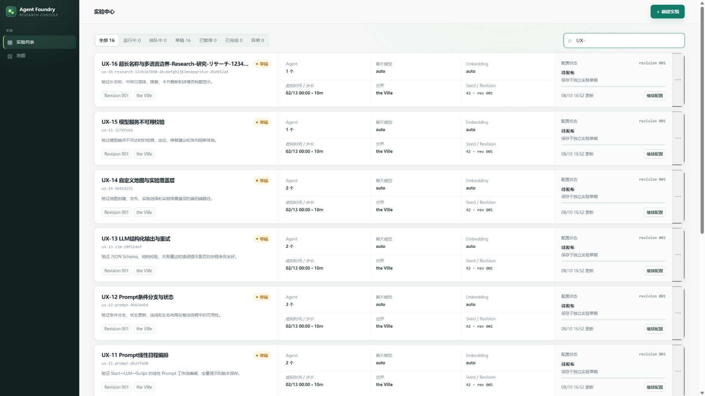

## 2. 已保留的实验矩阵

| 编号 | 实验名称 | 规模/关键变量 | 当前状态 | 主要验证目标 |
| --- | --- | --- | --- | --- |
| UX-01 | 新手默认模板创建路径 | 25 Agent / 1000 步 | 草稿 | 新建向导、默认模板规模、首次发布路径 |
| UX-02 | 空白实验首次配置引导 | 0 Agent / 空白来源 | 草稿 | 缺失配置识别、引导与发布拦截 |
| UX-03 | 单Agent晨间日程观察 | 1 Agent / 12 步 | **已完成** | 最小实验发布、运行、日志和结果 |
| UX-04 | 双Agent对话冷却实验 | 2 Agent / 36 步 | 草稿 | 对话轮数、冷却和停止时间 |
| UX-05 | 五Agent公共事件传播 | 5 Agent / 72 步 | 草稿 | 小群体传播、角色选择与结果观察 |
| UX-06 | 二十五Agent整镇负载 | 25 Agent / 144 步 | 草稿 | 大角色列表、批量操作、成本提示 |
| UX-07 | 三Agent多日长时运行 | 3 Agent / 1000 步 / 5 分钟步长 | 草稿 | 长时运行、检查点、恢复和预估 |
| UX-08 | 高频状态记录与追踪 | 2 Agent / 每步投影 / 保存模型 payload | 草稿 | 数据量、留痕、隐私与存储提示 |
| UX-09 | 随机种子对照A-42 | 3 Agent / Seed 42 | 草稿 | 与 UX-10 做单变量对照 |
| UX-10 | 随机种子对照B-99 | 3 Agent / Seed 99 | 草稿 | 与 UX-09 做单变量对照 |
| UX-11 | Prompt线性日程编排 | 2 Agent / 24 步 | 草稿 | Start → LLM → Script 线性流程 |
| UX-12 | Prompt条件分支与状态 | 3 Agent / 48 步 / `flow.schedule@v2` | 草稿 | 分支、状态、连线、左右布局 |
| UX-13 | LLM结构化输出与重试 | 2 Agent / 24 步 | 草稿 | JSON Schema、校验、重试和错误处理 |
| UX-14 | 自定义地图与实验覆盖层 | 2 Agent / 24 步 | 草稿 | 公共地图、实验覆盖层和编辑路径 |
| UX-15 | 模型服务不可用校验 | 1 Agent / 无效本地端点 | 草稿 | 探测失败、状态刷新和发布拦截 |
| UX-16 | 超长名称与多语言边界 | 中英日混排长名称 | 草稿 | 搜索、截断、详情标题与宽屏显示 |

复核定位：所有实验均可在“实验列表”搜索 `UX-01` 至 `UX-16`。保留地图稳定键为 `ux-14-e14e71f3`。已完成运行 ID 为 `98abd644-8b76-4b0b-bf43-484adbdf3859`。

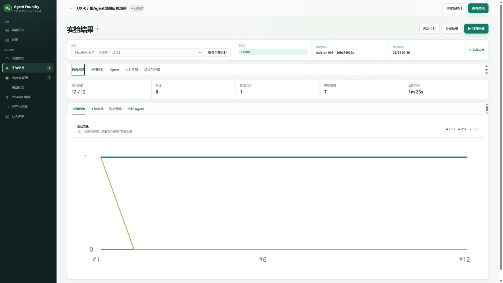

## 3. 需求清单

### UX-REQ-001：空白实验必须在发布前被真实拦截

- 优先级：**P0**
- 验收案例：UX-02
- 当前问题：实验为 0 个 Agent、世界未配置，但概览仍显示“全部定义已完整”“配置有效”；发布检查显示 6/6，最终“确认发布并启动”按钮仍可点击。
- 用户影响：新手可能启动一个没有研究对象、没有有效世界的实验；发布校验失去可信度。
- 产品要求：
  - 至少 1 个已启用且定义完整的 Agent 才可发布。
  - 必须存在可用世界 Revision、可访问 Tile 和有效初始位置。
  - 必需模型必须完成解析；必需流程和 Prompt 必须可达、可物化。
  - 阻断项、警告项、已通过项分开计数；警告不得显示为“全部通过”。
  - 每个失败项提供“去修复”，跳到对应页面及控件。
- 验收标准：UX-02 保持当前空白状态时，发布按钮禁用；补齐每项后状态实时变更，直至允许发布。

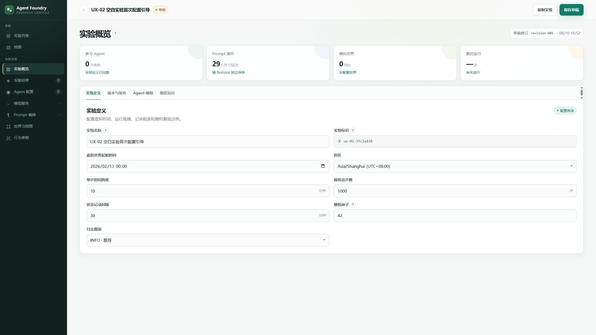

### UX-REQ-002：空白地图创建必须是完整、可恢复的原子流程

- 优先级：**P0**
- 验收案例：UX-14 / 公共地图 `ux-14-e14e71f3`
- 当前问题：选择“空白地图”并创建后，页面长期显示“正在载入地图草稿…”，同时弹出 `Cannot read properties of undefined (reading '1')`。地图中心的卡片显示“待设置尺寸”，而编辑器又渲染出网格，前后状态不一致。
- 用户影响：用户无法判断地图是否创建成功、能否保存或发布；刷新和重进也会重复技术异常。
- 产品要求：
  - 新建时显式选择宽、高、Tile 尺寸；也可提供清晰的默认值。
  - 地图记录、草稿尺寸和初始 Tile 数据在同一事务中创建，失败则整体回滚并允许重试。
  - 加载完成后移除加载文案；地图中心与编辑器必须展示同一尺寸和状态。
  - 发布前校验尺寸、Tile 数、碰撞层、资源引用和空间语义。
- 验收标准：新建、保存、退出、重进、发布五条路径均无前端异常；尺寸和草稿版本保持一致。

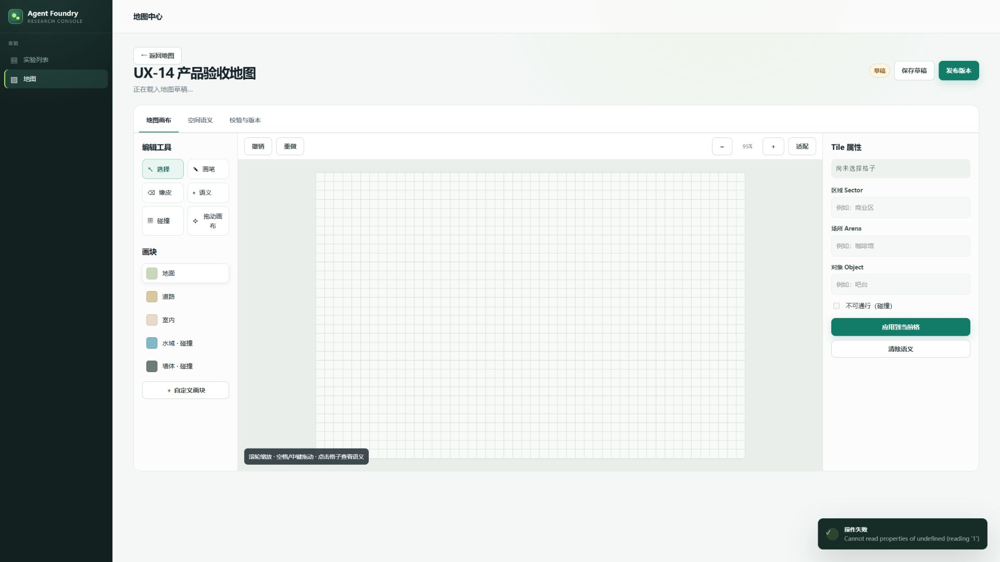

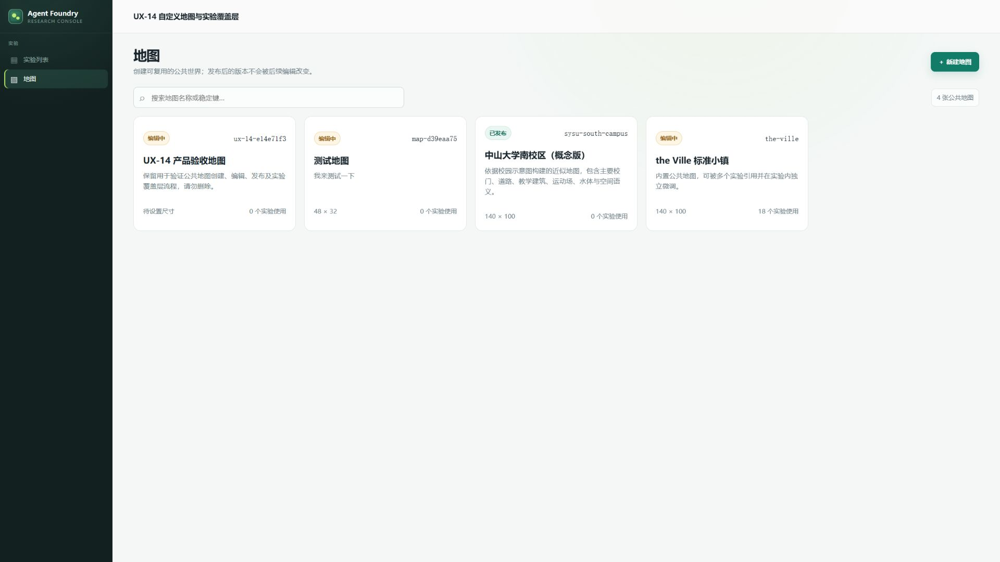

### UX-REQ-003：模型健康状态必须反映最近一次真实探测

- 优先级：**P1**
- 验收案例：UX-15
- 当前问题：聊天和 Embedding Base URL 指向不可用的 `127.0.0.1:59999/59998`。点击“测试连接”失败后，只提示“模型连接测试失败”，顶部仍显示“2个服务在线”，卡片也保持“在线”。
- 用户影响：用户会错误地认为模型可用，并把后续发布或运行失败归因于实验配置。
- 产品要求：
  - 使用“未检测、检测中、在线、离线、已过期”五态，不以“字段已填写”替代在线状态。
  - 探测失败后立即更新卡片和汇总状态，显示失败时间、耗时、HTTP/网络原因和修复建议。
  - 记录最近成功与最近失败；超过可配置 TTL 后显示“已过期”。
  - 必需服务离线时阻止发布，或要求具有权限的用户显式确认离线发布。
- 验收标准：UX-15 测试失败后 1 秒内变为“离线”，刷新后状态和最近探测记录仍可见。

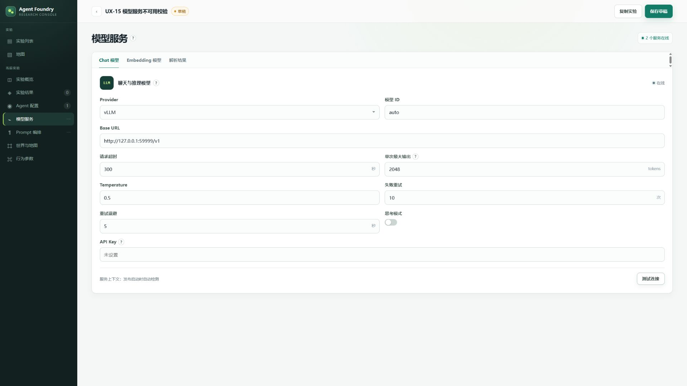

### UX-REQ-004：负责人和标签必须持久化并参与检索

- 优先级：**P1**
- 验收案例：UX-01
- 当前问题：新建向导可填写负责人和标签，但创建后详情、卡片和接口均不展示这些字段；使用向导中填写的标签 `UX验收` 搜索时返回 0 个实验。
- 用户影响：向导制造了“已保存”的错觉；团队无法按负责人、研究主题或批次管理实验。
- 产品要求：负责人和标签进入实验 Schema；详情可编辑、卡片可见；搜索支持名称、稳定键、负责人、标签和模型；增加负责人/标签筛选器。
- 验收标准：创建后刷新仍保留元数据；搜索 `UX验收` 能命中 UX-01；复制实验时明确选择是否复制元数据。

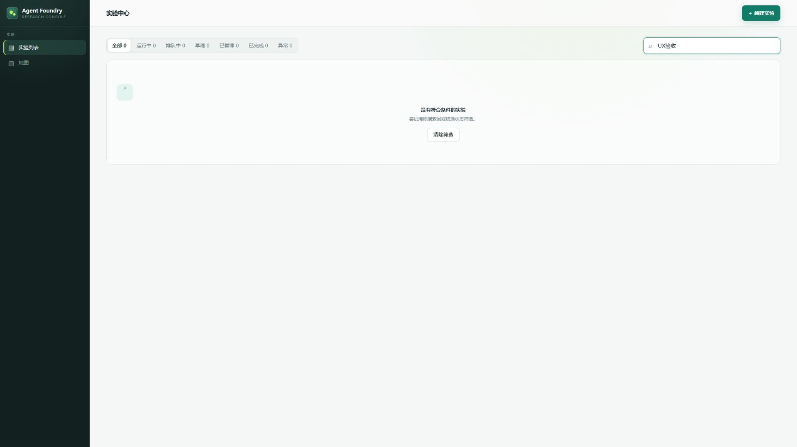

### UX-REQ-005：提供大脑、地图与人群组合的新建流程

- 优先级：**P1**
- 验收案例：UX-01、UX-02、UX-03、UX-04
- 当前问题：旧向导把“整份实验定义从哪里复制”暴露成“配置起点”，与独立的大脑模板、公共地图和公共 Agent 资源重叠。
- 用户影响：用户难以判断“配置起点”和各类公共资源分别控制什么，也无法复用经过维护的人群定义。
- 产品要求：新建实验显式选择已发布的大脑模板、地图和一个或多个人群；人群是多个公共 Agent 的集合。复制已有实验保留独立入口，不提供游戏化的快速体验入口。
- 验收标准：新建向导不再出现“配置起点”和 Agent 数量预设；确认页展示大脑、地图、人群和去重后的 Agent 数量；多个群体按 Agent 名称去重，导入后 Agent 成为实验独立数据。

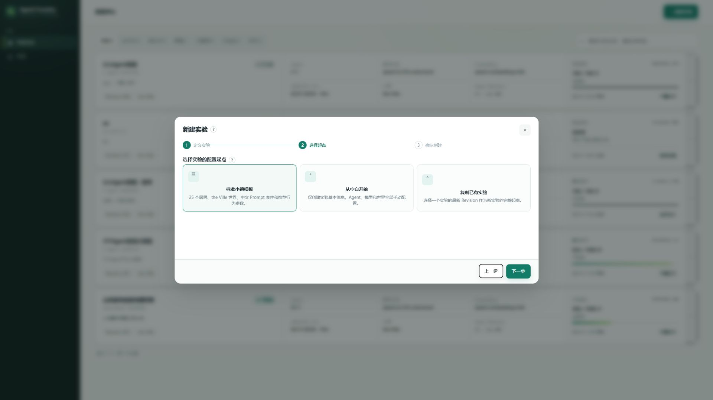

### UX-REQ-006：发布确认必须展示运行规模、耗时和资源预估

- 优先级：**P1**
- 验收案例：UX-03、UX-06、UX-07、UX-08
- 当前问题：发布确认仅展示 Agent、模型和世界，没有展示总步数、虚拟时长、预计模型调用、Token、真实耗时、存储量或费用。实际 UX-03 仅 1 Agent / 12 步就产生 7 次模型调用并耗时 1 分 25 秒。
- 用户影响：用户无法在不可逆的发布/启动动作前评估时间和成本，25 Agent 或 1000 步实验风险更高。
- 产品要求：
  - 必须展示 Agent 数、步数、虚拟时长、预计调用区间、Token 区间、预计墙钟时间、结果与日志存储量。
  - 估算注明依据和误差；运行后展示“估算 vs 实际”。
  - 超过组织阈值时二次确认，并允许返回直接修改步数或记录粒度。
- 验收标准：UX-03 发布前至少显示“12 步”；UX-06/07/08 触发高规模提示；完成后可查看偏差。

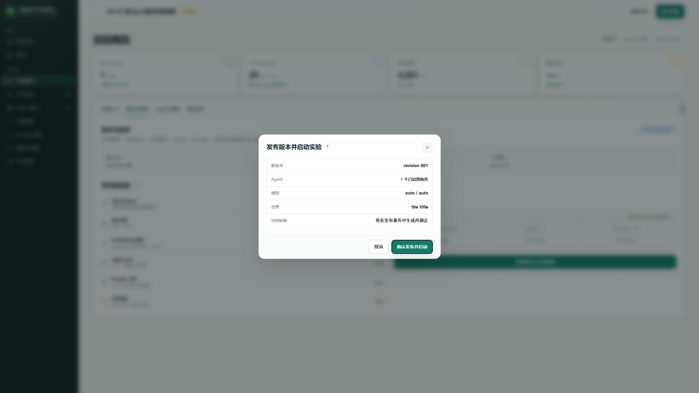

### UX-REQ-007：复杂 Prompt 流程的自动布局必须可读且可定位

- 优先级：**P1**
- 验收案例：UX-12
- 当前问题：纵向布局连线密集、跨越多个节点；横向布局后出现节点裁切、拥挤、起点离开可视区和大量横向滚动，未自动“适配全部”。
- 用户影响：用户难以追踪分支、发现断线或理解主干；自动布局反而增加整理成本。
- 产品要求：
  - 采用有向图分层布局，节点不重叠，端口与边尽量少交叉。
  - 自动布局后默认适配全部节点，并提供“定位 Start”“定位异常”“搜索节点”。
  - 增加小地图、分支泳道、边高亮和上一步布局撤销。
  - 保留用户手工位置；自动布局前可选择“全量”或“仅未布局节点”。
- 验收标准：对 `flow.schedule@v2` 执行横向/纵向布局后，全部节点位于可达画布且无重叠；Start 和 End 可一键定位。

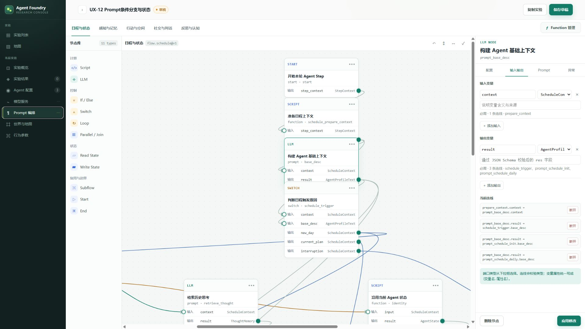

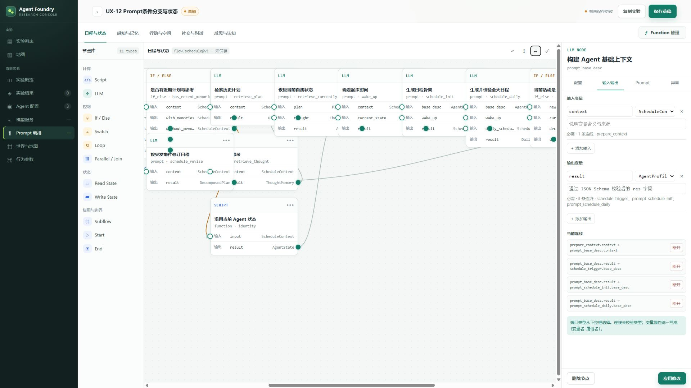

### UX-REQ-008：Prompt 变量统一使用“输入变量.属性路径”并迁移旧别名

- 优先级：**P1**
- 验收案例：UX-12、UX-13
- 当前问题：变量建议同时出现 `{context.agent.name}` 与 `{name}`、`{date}` 等扁平别名；内置 Prompt 仍大量使用旧写法。多个输入包含同名属性时，来源不明确。
- 用户影响：复制、重连或增加输入后可能引用错误数据；校验通过也不代表语义正确。
- 产品要求：
  - 新配置只允许 `{输入变量名.属性路径}`，例如 `{context.agent.name}`。
  - 自动补全仅展示当前节点可达的上游变量和属性。
  - 对旧扁平变量提供迁移预览；无法唯一映射时阻断并让用户选择来源。
  - 未解析变量、歧义变量和未连接变量分别给出错误。
- 验收标准：迁移后内置流程不再出现 `{name}` 之类的无来源变量；增加两个同名属性输入时能准确区分。

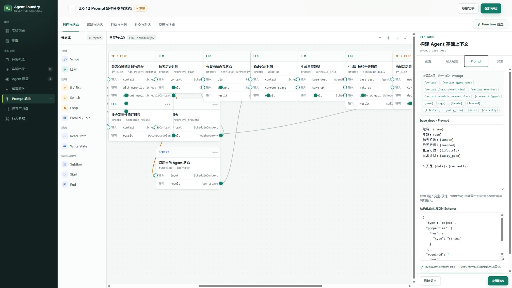

### UX-REQ-009：结构化输出提供可视化 Schema 构建器

- 优先级：**P1**
- 验收案例：UX-13
- 当前问题：系统已经强制结构化输出并支持校验失败重试，这是正确方向；但 Schema 只能在大文本框中手写 JSON，目标用户需要理解 JSON Schema 语法。
- 用户影响：非程序员容易产生括号、类型、required 或嵌套错误，难以完成常见结构化输出定义。
- 产品要求：默认提供字段表格/树编辑器，支持字段名、类型下拉、是否必填、描述、枚举、默认值、对象嵌套和数组元素；保留“专家 JSON”模式并双向同步；实时生成示例输出和校验错误定位。
- 验收标准：用户不手写 JSON，即可创建“对象中包含必填字符串与对象数组”的 Schema；专家模式切换不丢信息。

### UX-REQ-010：Agent 配置支持真正的批量选择、编辑和导入导出

- 优先级：**P1**
- 验收案例：UX-06
- 当前问题：25 Agent 页面支持搜索、添加、全选/全不选，但编辑仍需逐个打开，不能对选择项批量改模型、目标、位置、启用状态或实验字段，也缺少完整性筛选。
- 用户影响：整镇实验的常见配置需要重复几十次，操作时间和出错率随 Agent 数线性增长。
- 产品要求：
  - 多选后提供批量启用/停用、分配模型、设置初始区域、追加目标/标签。
  - 支持按启用状态、完整性、位置、模型筛选。
  - 支持 CSV/JSON 模板导入、校验预览、冲突处理和导出。
  - 批量修改提供差异预览、撤销和影响数量。
- 验收标准：UX-06 可在 5 次以内的主要点击中，将 10 个 Agent 改到同一区域并切换同一模型。

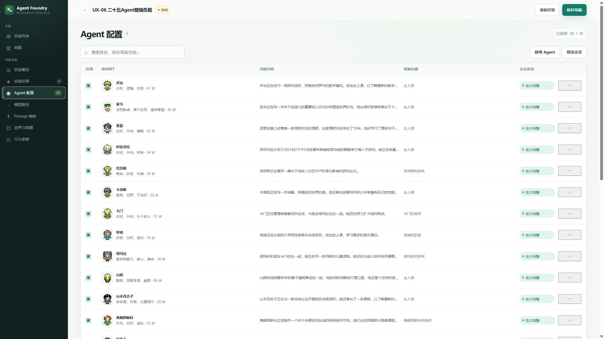

### UX-REQ-011：实验列表与结果页提供对照实验比较

- 优先级：**P1**
- 验收案例：UX-09、UX-10
- 当前问题：两张卡片清楚显示 Seed 42 与 99，但没有多选或“比较”入口，只能分别进入并人工记忆差异。
- 用户影响：研究员无法确认是否真的只有一个变量不同，也无法并排比较结果，削弱实验可复现性。
- 产品要求：
  - 列表支持选择 2–N 个实验/Revision 发起比较。
  - 配置 Diff 按实验、Agent、模型、Prompt、世界、行为参数分组，只突出差异。
  - 结果比较支持指标叠加、时间轴对齐、Agent 映射和导出报告。
  - 支持把一次比较保存为“对照组”。
- 验收标准：比较 UX-09 与 UX-10 时，配置页只突出随机种子 42/99；相同项折叠并标记一致。

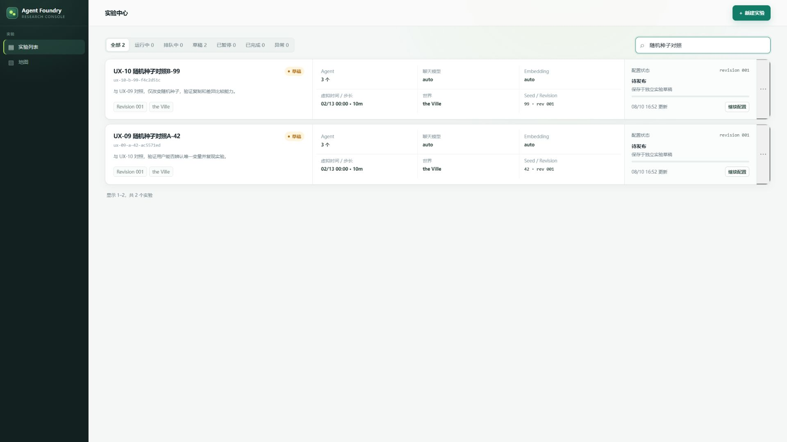

### UX-REQ-012：行为参数同时支持滑杆探索与精确数值输入

- 优先级：**P1**
- 验收案例：UX-07、UX-08、UX-09、UX-10、UX-14
- 当前问题：分类、说明和滑杆的总体信息架构清晰，但滑杆不适合输入严格对照所需的精确数值，也无法直观看出哪些参数偏离方案默认值。
- 用户影响：研究员难以复现精确参数或确认单变量修改，键盘操作效率也较低。
- 产品要求：每个参数同时提供滑杆和数字输入；展示单位、范围和步进；支持恢复默认、复制方案、查看已修改项和与其他 Revision 对比；越界时就地提示。
- 验收标准：用户可以键盘输入精确值，页面即时同步滑杆；UX-09/10 的行为参数 Diff 可确认除 Seed 外完全一致。

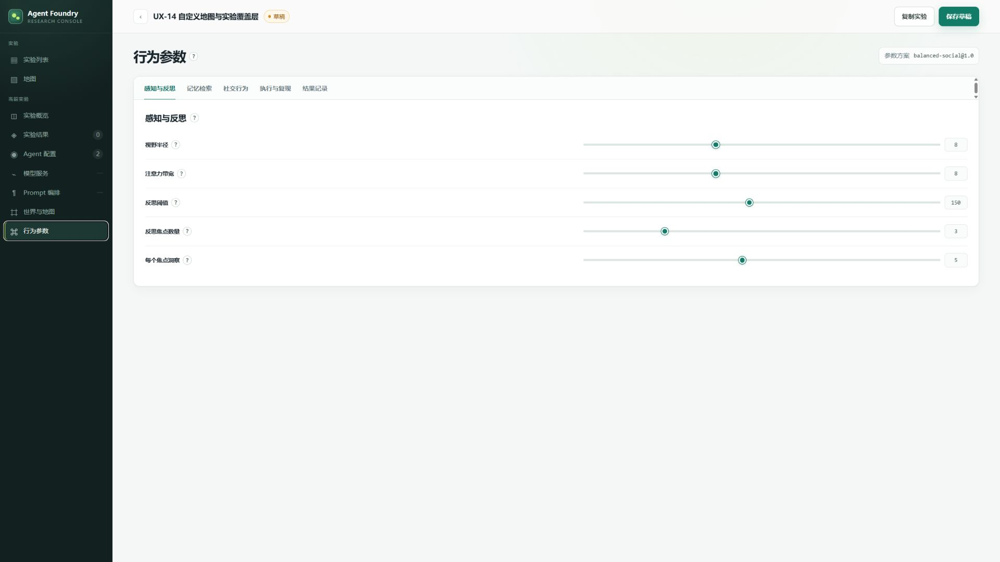

### UX-REQ-013：Prompt 与地图画布统一左键拖动和平移反馈

- 优先级：**P1**
- 验收案例：UX-12、UX-14
- 当前问题：Prompt 已提示“空白处按住左键拖动画布”，地图编辑器仍要求切换“拖动画布”工具，或使用空格/中键；两个高频画布的基本手势不一致。
- 用户影响：用户需要记忆两套操作，容易在地图上误画或误以为画布不能移动。
- 产品要求：
  - 两类画布均支持空白处按住左键拖动、空格拖动和中键拖动。
  - 画笔/橡皮工具下，长按后移动的判定阈值要避免误绘；拖动时展示抓手光标。
  - “适配全部”“缩放”“小地图”和快捷键说明保持一致。
- 验收标准：新用户无需切换工具即可在 Prompt 与地图画布完成左右、上下平移；不产生节点移动或 Tile 修改。

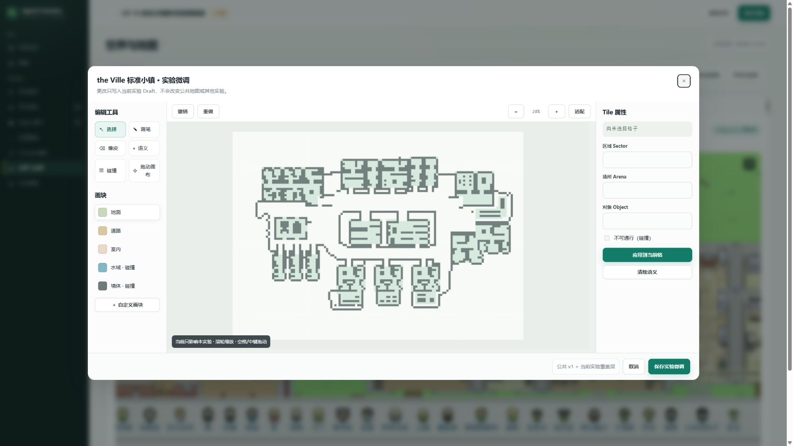

### UX-REQ-014：实验生命周期提供归档、恢复与批量管理

- 优先级：**P2**
- 验收案例：实验中心全量数据
- 当前问题：卡片菜单只有“打开实验”“复制实验”，没有归档、恢复、批量选择或受控删除。因此本轮无法通过产品界面清空旧实验；为避免破坏引用，旧实验全部保留。
- 用户影响：实验数量增长后列表会持续膨胀；用户无法清理视野，也无法批量整理验收批次。
- 产品要求：默认提供可恢复的归档，不把永久删除作为主操作；支持批量归档/恢复/添加标签/转移负责人；永久删除需要权限、依赖检查、输入稳定键二次确认，并明确 Revision、Run、Artifact 的保留策略。
- 验收标准：归档后默认列表隐藏但可在“已归档”恢复；任何操作不得静默删除运行结果。

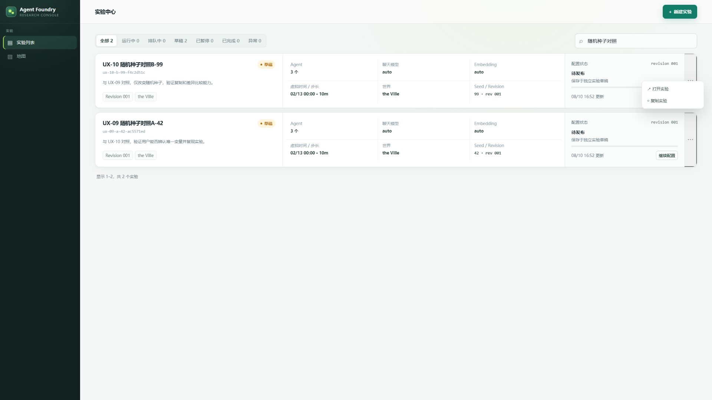

### UX-REQ-015：列表支持排序、页容量与可保存视图

- 优先级：**P2**
- 验收案例：16 个 UX 实验及既有实验
- 当前问题：当前固定分页展示，缺少排序、页容量、组合筛选和可保存视图；宽屏仍以单列大卡片展示，信息密度偏低。
- 用户影响：超过几十个实验后，查找“最近失败、由我负责、同一标签、同一模型”的成本明显上升。
- 产品要求：支持名称/更新时间/创建时间/状态/运行数排序；10/25/50 页容量；负责人、标签、模型、地图、状态组合筛选；保存和分享视图；宽屏提供紧凑表格模式。
- 验收标准：可保存“UX验收 + 草稿 + 最近更新”的视图，并在下次进入时恢复。

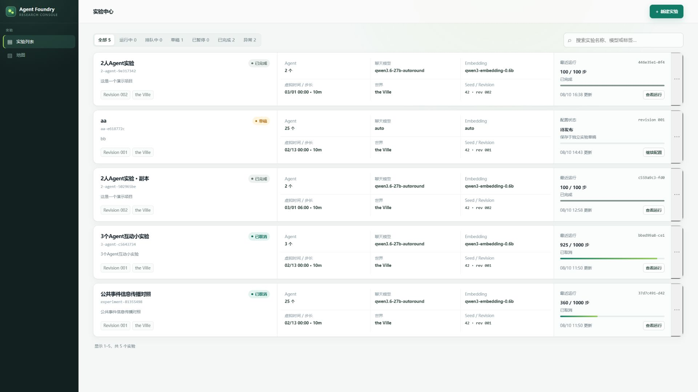

### UX-REQ-016：所有校验与错误提示都必须可行动、可追踪

- 优先级：**P2**
- 验收案例：UX-02、UX-14、UX-15
- 当前问题：校验项只描述状态，缺少直达修复入口；模型失败只显示笼统错误；地图直接暴露 JavaScript 异常文本。
- 用户影响：非程序员不知道去哪里改，技术错误也无法提供给开发者定位。
- 产品要求：错误提示使用“发生了什么—影响什么—如何修复”结构；提供重试、去修复、复制诊断信息；技术详情折叠展示并带请求 ID；全局 Toast 自动消失，同时进入可查看的操作历史。
- 验收标准：任何 P0/P1 错误均有下一步操作；用户可复制包含时间、页面、请求 ID 和服务错误码的诊断包，但默认不暴露堆栈。

### UX-REQ-017：业务时间、系统时间和时区必须明确区分

- 优先级：**P2**
- 验收案例：全部实验卡片、UX-03 运行
- 当前问题：实验卡片的“更新时间”显示为 08/10，而本轮本地验收日期为 08/11；页面未标注该时间使用 UTC 还是浏览器本地时区。虚拟世界时间又是另一套时间语义。
- 用户影响：跨时区团队难以判断谁在何时修改或启动实验，审计记录可能被误读。
- 产品要求：系统时间按用户时区显示并明确时区，悬浮可见 ISO 时间；虚拟世界时间统一标记“虚拟时间”；日志支持在 UTC、用户时区间切换；导出文件包含原始 UTC 和显示时区。
- 验收标准：Asia/Shanghai 用户看到与本地日期一致的更新时间；虚拟时间不会与真实运行时间混淆。

## 4. 已通过的关键体验

以下此前高风险项本轮已通过，不再作为修复需求：

1. Start 节点明确解释 `step_context` 来源，说明由仿真运行时注入当前 Agent、虚拟时钟、位置、可见事件、记忆与触发原因，并给出 `{step_context.agent.name}` 等示例。
2. Function 管理页显性展示 9 个服务端注册函数、输入输出类型、用途、容器可调用状态和源码路径。
3. Prompt 节点的端口类型使用下拉框，连线具备类型校验；流程已支持纵向和横向自动布局。
4. LLM 节点已经强制 JSON Schema 校验，并提供失败重试、超时、失败策略等配置。
5. `flow.schedule@v2` 已包含 Switch、If/Else、状态读写等真实分支，不再是一条直线。
6. Prompt 画布明确支持空白处按住左键拖动；运行结果页提供实时日志、模型调用、系统事件和检查点入口。
7. 发布后的 Revision 和完成运行保持只读，UX-03 的结果、7 次模型调用和 1 分 25 秒实际耗时均已留存。

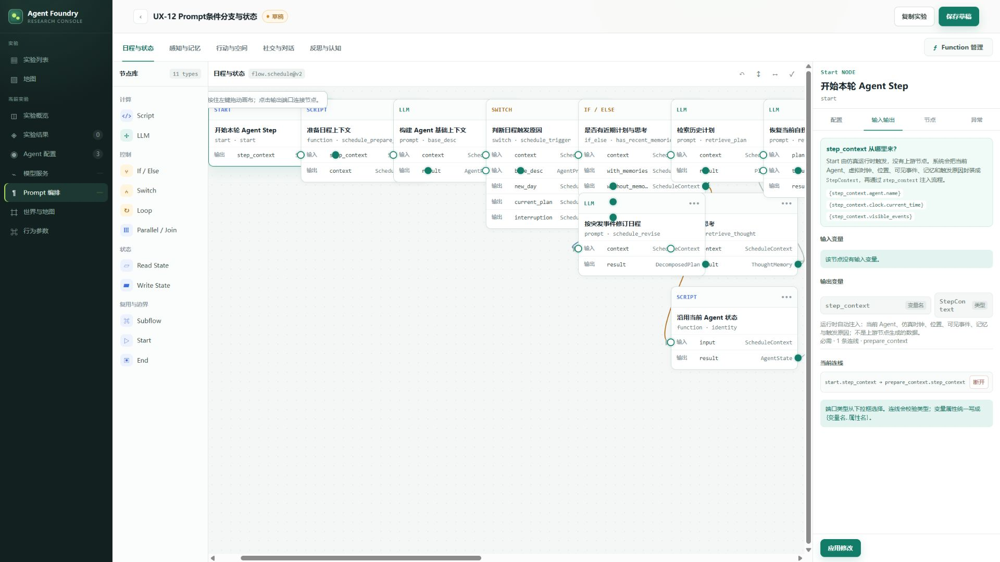

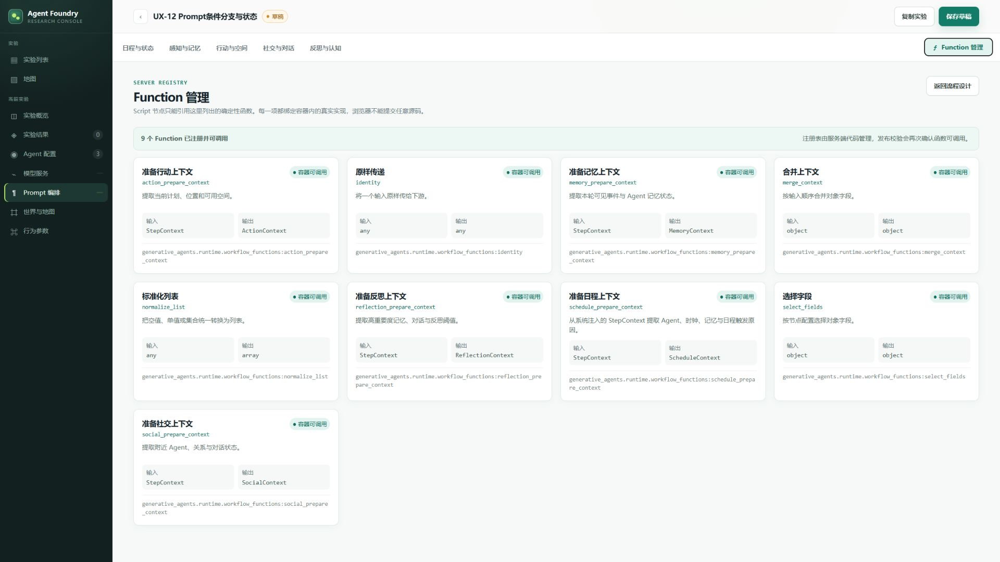

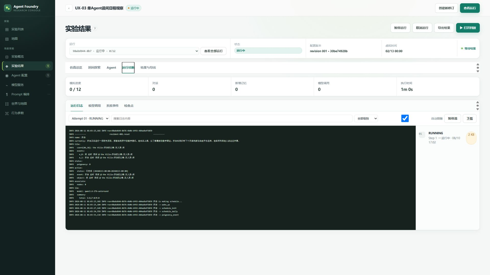

## 5. 建议评审顺序

1. 先评审 UX-REQ-001、002：发布门槛与地图初始化属于数据可信度/阻断问题。
2. 再评审 UX-REQ-003、006、011：模型健康、资源预估、实验对比直接影响研究可信度和成本。
3. 然后评审 UX-REQ-007 至 013：集中解决 Prompt、Agent、行为参数与画布的高频编辑效率。
4. 最后评审 UX-REQ-014 至 017：补齐规模化管理、诊断和跨时区协作。

## 6. 复核与复现

- 16 个实验可使用脚本 `tools/seed_product_usability_cases.py` 幂等补齐。脚本只创建/更新 `UX-` 实验，从不删除实验、Revision、Run、地图或产物。
- 不要再次运行脚本覆盖 UX-12 的人工布局或已发布的 UX-03；需要补数据时，建议先复制数据库或仅运行指定案例。
- 截图均位于 `docs/images/product-usability-2026-08-11/`。
- UX-03 已完成运行可从实验列表搜索后进入“实验结果”；UX-14 地图异常可从“地图”打开 `UX-14 产品验收地图` 复现。
