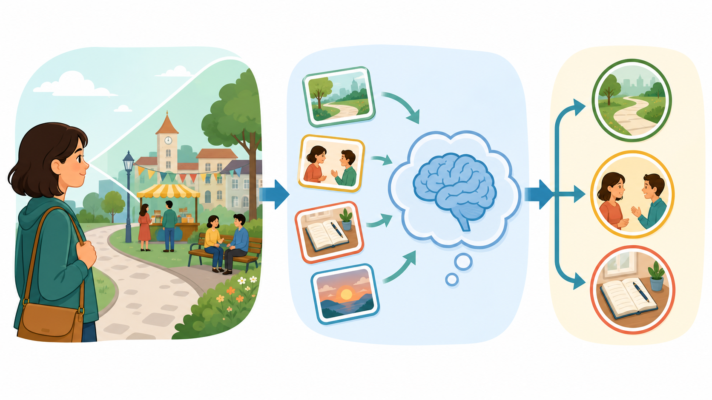
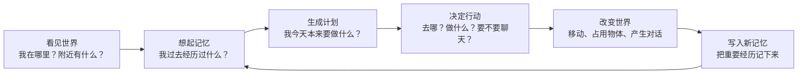
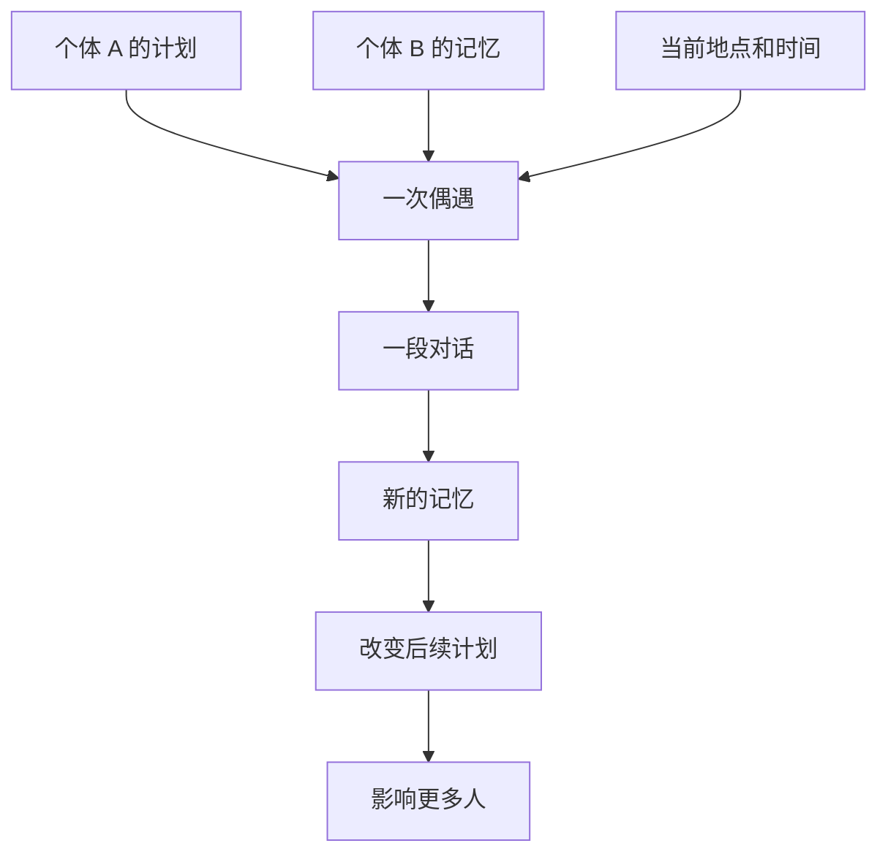
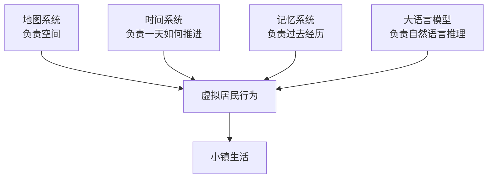

# 从会聊天的 AI 到会生活的虚拟居民

面向非计算机专业本科生的 Generative Agents 项目导读

上图是辅助讲解用的概念图：可以让学生先形成直觉，所谓“生成式智能体”，不是一个 AI 独自在回答问题，而是一群虚拟居民共同生活在一个小镇里。

上图是本项目的实际回放画面。课堂上可以先展示概念图，再展示真实项目画面，让学生知道：前者帮助理解，后者来自真实运行结果。

## 0. 这节课想讲明白什么

这不是一节“教大家写代码”的课。

这节课要讲的是一个更有意思的问题：

> 如果我们想模拟一个小镇的一天，怎样让里面的虚拟居民看起来像真的在生活？

Generative Agents 做的事情，可以简单理解为：

> 把一群由大语言模型驱动的虚拟居民，放进一个有地图、有时间、有记忆、有日程、有社交关系的小镇里，让他们自己行动、聊天、记住事情，并互相影响。

它最重要的地方不只是“AI 会说话”，而是：

> AI 被放进了一个世界里，并且要在这个世界中持续生活。

## 1. 先看现象：这个小镇里发生了什么

项目中有一个虚拟小镇。里面有居民、房子、咖啡馆、公园、教室、商店等地点。

每个居民都有自己的身份设定，比如学生、教授、画家、店主、作家等。他们会按照自己的生活习惯行动，也会遇见别人、聊天、改变计划。

如果你只看画面，会觉得这些角色像游戏里的 NPC。

但它和普通游戏 NPC 有一个关键区别：

普通 NPC 往往是提前写好规则的，比如：

> 早上 8 点去上班，下午 6 点回家，见到玩家说固定台词。

而 Generative Agents 里的居民更像是：

> 有身份、有记忆、有日程、有情绪权重，也会根据眼前发生的事情临时改变行为。

所以它不是简单地“播放剧本”，而是在每一步模拟中重新判断：

- 我现在在哪里？
- 我看到了谁？
- 我记得什么？
- 我今天本来要做什么？
- 我要不要和这个人说话？
- 这件事情值得我记下来吗？

## 2. 一句话理解这个项目

可以把 Generative Agents 理解成：

> 一个会记日记、会安排日程、会聊天、会受环境影响的虚拟小镇。

其中，大语言模型不是整个世界的导演。

它更像是每个居民脑子里的“语言推理能力”。

地图负责空间，时间系统负责钟表，记忆系统负责过去发生过什么，大语言模型负责根据这些信息生成比较自然的计划、行动和对话。

## 3. 不要先讲技术，先讲四个生活比喻

对于非计算机专业的学生，可以先用四个比喻理解整个系统。

讲图提示：

> 一个虚拟居民不是凭空行动的。它会同时参考四件事：我身处什么环境、今天原本有什么安排、过去记住了什么、眼前有没有人可以交流。

### 3.1 地图：小镇的舞台

虚拟小镇不是一段纯文字描述，而是一个有空间结构的地方。

居民不能随便瞬移。他们要在地图上移动，要去具体地点，比如家、咖啡馆、公园、教室。

这就像戏剧舞台：

- 舞台限制了演员在哪里出现。
- 房间、门、路、桌子、床都会影响角色能做什么。
- 两个人只有在相近的地方，才可能看见彼此并发生互动。

在真实生活里，我们的行为也强烈受空间影响。

你在教室里，可能听课或讨论；你在食堂里，可能吃饭或偶遇朋友；你在图书馆里，可能安静学习。

虚拟居民也是这样。

### 3.2 日程表：人的生活惯性

真实的人不是每一秒都重新思考人生。

大部分时候，我们是按照习惯和日程生活的：

- 早上起床
- 去上课或上班
- 中午吃饭
- 下午学习或工作
- 晚上休息

Generative Agents 也让每个居民先生成一天的大致计划，然后再把计划拆成更小的行动。

这让虚拟居民不只是“随机乱走”，而是有生活节奏。

### 3.3 日记本：记忆

如果一个人没有记忆，他就无法形成连续的生活。

讲图提示：

> 这张图可以把“记忆系统”讲成日记本：事件、对话和想法都会被记录下来；以后做决定时，系统会从日记本里挑出最相关的内容。

比如：

- 我昨天和谁聊天了？
- 谁邀请我参加活动？
- 我刚才看到谁在咖啡馆？
- 这件事对我重要吗？

Generative Agents 给每个居民都配了类似“日记本”的记忆系统。

它会记录三类内容：

- 事件：我看到或经历了什么。
- 对话：我和别人聊了什么。
- 想法：我从过去经历中总结出了什么。

这使得居民的行为不是孤立的一次回答，而是被过去影响。

### 3.4 聊天：社会传播机制

聊天不是装饰，而是社会仿真的核心。

一个人知道的信息，可以通过聊天传给另一个人。

于是小镇里可能出现这样的过程：

1. A 想办一个活动。
2. A 在路上遇到 B，邀请 B。
3. B 记住了这件事。
4. B 后来又遇到 C，把活动告诉 C。
5. C 调整自己的计划，决定参加。

这就是“社会传播”。

在这里，群体行为不是作者直接写死的，而是由许多个体的记忆、对话和行动一步步产生出来的。

## 4. 核心循环：一个虚拟居民怎样生活

下面这张图是理解项目的关键。

讲图提示：

> 左边是“看见世界”，中间是“调取记忆并思考”，右边是“选择行动”。智能体不是一次性生成完整故事，而是在每个时间步都重复这个小循环。

用一句话概括：

> 看见世界，想起过去，决定现在，留下新的过去。

每个居民都在不断重复这个循环。

多个居民同时重复这个循环，小镇就开始“活”起来。

## 5. 这个项目如何模拟真实世界

这里要特别强调：

> 真实世界仿真，不等于把现实世界一比一复制出来。

它更关注的是：

> 行为是否可信。

也就是说，我们不是要求虚拟居民真的拥有意识，而是观察他们的行为是否符合日常经验。

例如：

- 学生会去教室或图书馆。
- 咖啡馆老板会待在咖啡馆。
- 朋友见面可能寒暄。
- 有人邀请参加活动，另一个人可能记住并改变计划。
- 夜深了，大多数人会回家睡觉。

这些行为组合起来，会让观察者觉得：

> 这个小镇虽然是假的，但它的生活节奏是可信的。

## 6. 从“个体”到“小社会”

一个单独的 AI 角色，只能表现出一个人的行为。

但当很多 AI 角色共享同一个世界时，就会出现社会现象。

讲图提示：

> 注意图里的变化：左边是分散的个体交流，右边逐渐形成了一个聚集场景。这就是“涌现”的直观版本：没有一个中央导演强行安排所有人，群体事件是由许多个体互动慢慢形成的。

这就是 Generative Agents 最值得讲的地方：

> 它展示了如何从个体行为，生成群体层面的社会现象。

这和社会科学中的一个重要思想很接近：

> 很多宏观现象，并不是由一个中央导演安排的，而是由大量个体在局部环境中的选择共同造成的。

比如：

- 流行趋势如何扩散？
- 谣言如何传播？
- 为什么人群会聚集在某些地方？
- 为什么一个活动会突然变热闹？
- 为什么一些小习惯会变成群体文化？

Generative Agents 给了我们一个新的观察工具：用大语言模型驱动的虚拟居民，模拟这些社会过程。

## 7. 和传统游戏 NPC 有什么不同

可以用下面这个表格帮助学生理解。

| 对比点 | 传统游戏 NPC | Generative Agents |
|---|---|---|
| 行为来源 | 预先写好的脚本和规则 | 角色设定、记忆、环境和大模型共同决定 |
| 对话内容 | 常常固定 | 根据场景和记忆生成 |
| 是否记得过去 | 通常很有限 | 会记录事件、对话和想法 |
| 是否改变计划 | 多数较少 | 可以因为聊天或事件调整计划 |
| 群体现象 | 多由设计者安排 | 可能从个体互动中涌现 |

这里有一句适合课堂上说的话：

> 普通 NPC 像“会动的布景”，Generative Agents 更像“有日记本的居民”。

## 8. 关键概念：涌现

“涌现”是这节课最值得带给学生的概念。

涌现指的是：

> 个体规则并不复杂，但很多个体放在一起互动后，会出现更复杂的整体行为。

举一个生活例子：

每个人去食堂吃饭的规则都很简单：

- 饿了就去吃饭。
- 哪个窗口排队短就去哪。
- 喜欢的菜就多买。

但很多人一起行动后，食堂就会出现复杂现象：

- 某些窗口突然排长队。
- 某些菜很快卖光。
- 人流在不同时间段形成高峰。

Generative Agents 里的小镇也是类似的。

单个居民只是根据自己的记忆和日程行动，但多个居民互相遇见、聊天、影响计划，就可能出现聚会、传播、协作、错过、等待等复杂现象。

## 9. 大语言模型在这里到底做什么

对非计算机专业学生，不建议一开始讲模型参数和接口。

可以这样解释：

> 大语言模型负责把“人的背景、当前处境、相关记忆”组织成一个合理的下一步反应。

例如，系统可能会问模型：

- 这个人今天几点起床比较合理？
- 这个人现在应该去哪里？
- 这个地方最适合做这件事吗？
- 他要不要和眼前的人聊天？
- 如果聊天，他会说什么？
- 这件事对他有多重要？
- 他从最近经历中总结出了什么想法？

大语言模型擅长处理自然语言，所以它适合用来生成：

- 计划
- 对话
- 解释
- 反思
- 简短判断

但它不适合单独承担整个仿真。

所以项目把大语言模型嵌入到一个更大的系统中。

可以总结成一句话：

> 大模型不是世界本身，而是居民脑中的推理器。

## 10. 课堂讲解建议

### 10.1 第一步：先让学生看

先展示回放画面，不要急着解释技术。

可以问：

- 你觉得这些人在做什么？
- 他们像不像在生活？
- 如果要你设计这个系统，你觉得需要哪些东西？

让学生先从直觉进入。

### 10.2 第二步：再拆成四件事

告诉他们，每个居民都有：

- 一个身份设定
- 一个日程表
- 一本日记
- 一双只能看到附近的眼睛

这四个比喻足够支撑前半节课。

### 10.3 第三步：再讲循环

把核心循环写在黑板上：

> 感知 → 记忆 → 计划 → 行动 → 新记忆

然后解释：

> 这不是一次性生成故事，而是一步一步推进生活。

### 10.4 第四步：最后讲社会仿真

把重点提升到社会层面：

> 当每个人都有记忆和计划，人与人的偶遇和对话就会改变整个小镇。

这时就可以引出社会科学问题：

- 人际关系如何形成？
- 消息如何扩散？
- 群体活动如何组织？
- 个体选择如何形成集体现象？

## 11. 可以在课堂上讲的一个小故事

你可以这样讲：

> 假设小镇里有一个叫伊莎贝拉的人，她是咖啡馆老板。她突然想在情人节办一个派对。

如果这是传统游戏，程序员可能会直接写：

> 晚上 7 点，所有人到咖啡馆参加派对。

但 Generative Agents 的思路不同。

它会让这件事通过生活过程自然发生：

1. 伊莎贝拉先在自己的计划中产生“办派对”的想法。
2. 她在咖啡馆或路上遇到别人。
3. 她可能和别人聊天，并提到派对。
4. 别人把这件事记进自己的记忆。
5. 有些人之后会把消息告诉更多人。
6. 到了晚上，一些人的日程可能被改变，他们真的去了派对。

这里最重要的是：

> 派对不是从天而降的剧情，而是通过记忆、对话和计划传播出来的社会事件。

## 12. 这个项目的边界

讲这个项目时，也要避免神化 AI。

它有明显边界：

- 它模拟的是行为，不等于真的有意识。
- 它的表现依赖提示词、角色设定和模型能力。
- 它可能产生不稳定、不一致或不符合常识的回答。
- 它的世界仍然很简化，远远不是完整现实。
- 它适合研究“可信行为”和“社会互动”，不适合直接当作真实社会预测工具。

可以这样提醒学生：

> 这个小镇不是现实世界的替代品，而是一种观察复杂行为如何形成的实验装置。

## 13. 适合学生记住的三句话

第一句：

> 一个孤立的大模型像会说话的演员，一个生成式智能体像住在世界里的居民。

第二句：

> 智能体仿真不是一次性写出故事，而是让角色在环境中一步一步生活。

第三句：

> 群体行为不是全部写死的，它可以从很多个体的记忆、计划和互动中涌现出来。

## 14. 本项目可以如何继续探索

如果学生对这个方向感兴趣，可以继续思考：

- 如果把小镇换成校园，会发生什么？
- 如果每个学生智能体都有不同专业、社团和课程，会不会形成校园生活？
- 如果加入突发事件，比如停课、考试、演出、通知，会不会改变群体行为？
- 如果把角色改成消费者，能不能模拟市场传播？
- 如果把角色改成游客，能不能模拟景区人流？
- 如果把角色改成病人和医生，能不能模拟医院流程？

这些问题都说明：

> Generative Agents 的价值不只是做一个小镇，而是提供了一种“用智能体模拟社会过程”的思路。

## 15. 参考资料

- Generative Agents: Interactive Simulacra of Human Behavior  
  https://arxiv.org/abs/2304.03442

- Stanford HAI 对 Generative Agents 的介绍  
  https://hai.stanford.edu/news/computational-agents-exhibit-believable-humanlike-behavior

- 原始项目 Generative Agents  
  https://github.com/joonspk-research/generative_agents

- 本项目 GenerativeAgentsCN  
  https://github.com/x-glacier/GenerativeAgentsCN
